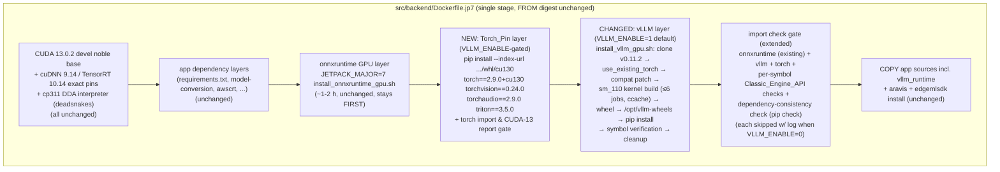

# Design Document

## Overview

This feature enables vLLM on the JetPack 7 (Jetson Thor) LocalServer image. Unlike JP6 (prebuilt Jetson AI Lab cp310 wheels), no prebuilt vLLM wheel exists for Thor/CUDA 13/cp311, so the JP7 image **builds the vLLM wheel from source** inside the image build via a new `install_vllm_gpu.sh` script that mirrors the proven `install_onnxruntime_gpu.sh` pattern. Four parts:

1. **Pinned from-source vLLM** — `install_vllm_gpu.sh` clones vLLM at the **v0.11.2** tag, builds the CUDA kernels for Thor (`sm_110`, arch `11.0`) against the image's pre-installed PyTorch using vLLM's `use_existing_torch.py` mechanism, applies a 10-line guarded Classic-API compatibility patch, and installs the wheel into the cp311 DDA interpreter — with fail-fast prerequisite checks, a 6-job parallelism cap, ccache passthrough, wheel staging at `/opt/vllm-wheels`, and symbol-by-symbol post-install verification.
2. **Matching PyTorch stack** — a new `Dockerfile.jp7` layer (after the onnxruntime GPU layer, before the vLLM layer, gated on the same `VLLM_ENABLE`) installs the verified cp311/aarch64/cu130 wheels — `torch==2.9.0+cu130`, `torchvision==0.24.0`, `torchaudio==2.9.0`, `triton==3.5.0` — from the official PyTorch cu130 index. **No from-source torch build is needed** (wheel existence verified live at design time; see Research #6).
3. **Enabled by default with gates** — `VLLM_ENABLE` defaults to `1`; the legacy `VLLM_SPEC`/`VLLM_INDEX_URL` args are removed (nothing outside `Dockerfile.jp7` ever passed them — verified); the final-image import gate grows per-symbol vLLM/torch checks plus a dependency-consistency check, each skipped with a logged message when `VLLM_ENABLE=0`.
4. **Portal gating + validation** — `arm64_jp7` joins every portal vLLM architecture set, `VLLM_ARCH_TO_TARGET` maps it to `jetson-xavier-jp7`, the fit check gains a 120 GiB Thor memory profile, frontend property-test generators are extended, the two JP7 Docker preservation goldens are recaptured, the README is updated, and a documented on-hardware procedure validates facebook/opt-125m (smoke) and Qwen/Qwen2.5-7B-Instruct (realistic) end-to-end on a Thor device.

No device Python code changes: `app.py`'s capability probe and `vllm_runtime/manager.py` run unmodified (Research #2–#4).

### Research Summary (verified findings that shape this design)

Every finding below was re-verified live at design time (tag sources fetched from GitHub raw, wheel indexes fetched directly, repo facts grepped).

| # | Finding | Evidence | Design consequence |
|---|---|---|---|
| 1 | vLLM **v0.11.2** is the right pin: its CMake sets `CUDA_SUPPORTED_ARCHS "7.5;8.0;8.6;8.7;8.9;9.0;10.0;11.0;12.0"` when nvcc ≥ 13.0 — including Thor's `11.0` — and `requirements/cuda.txt` pins `torch==2.9.0` (the first torch line with official cu130 wheels). `pyproject.toml` has `requires-python = ">=3.10,<3.14"`, covering cp311. | [v0.11.2 CMakeLists.txt](https://github.com/vllm-project/vllm/blob/v0.11.2/CMakeLists.txt) (lines 95–98), [v0.11.2 requirements/cuda.txt](https://github.com/vllm-project/vllm/blob/v0.11.2/requirements/cuda.txt), [v0.11.2 pyproject.toml](https://github.com/vllm-project/vllm/blob/v0.11.2/pyproject.toml) | **vLLM_Version_Pin = v0.11.2**. The 0.10 line (incl. JP6's wheels) predates the CUDA-13 arch list and cu130 torch entirely; newer lines drift to torch ≥ 2.10/2.11 and further from the classic surface for no benefit here. |
| 2 | At v0.11.2, `vllm/engine/async_llm_engine.py` is a 3-line **shim**: `AsyncLLMEngine = AsyncLLM` (the V1 engine). The V0 classic engine last shipped in v0.10.2 — no tag has both CUDA 13 support and the true V0 engine. | Fetched [v0.11.2 vllm/engine/async_llm_engine.py](https://github.com/vllm-project/vllm/blob/v0.11.2/vllm/engine/async_llm_engine.py) | The gap is closed with a **guarded compatibility patch** applied by the build script to the pinned checkout (Components §2, step 5), so the built wheel itself exposes the full Classic_Engine_API (Requirement 3.6). |
| 3 | The v0.11.2 V1 `AsyncLLM` already provides **almost all** of the Classic_Engine_API: `from_engine_args(cls, engine_args: AsyncEngineArgs, ...)` classmethod returning `cls(...)` (so a subclass constructs the subclass), `generate(prompt, sampling_params, request_id)` async generator, and the `errored` property. `SamplingParams.output_kind` defaults to `RequestOutputKind.CUMULATIVE`, so `generate` yields cumulative outputs exactly as `manager.py`'s `generate_stream` delta logic expects. The single miss: `shutdown_background_loop` (V1 renamed it `shutdown()`). | Fetched [v0.11.2 vllm/v1/engine/async_llm.py](https://github.com/vllm-project/vllm/blob/v0.11.2/vllm/v1/engine/async_llm.py) (`from_engine_args` l.218, `shutdown` l.245, `generate` l.351, `errored` l.792), [v0.11.2 sampling_params.py](https://github.com/vllm-project/vllm/blob/v0.11.2/vllm/sampling_params.py) (l.227) | The compat patch is minimal: a subclass adding `shutdown_background_loop()` delegating to `shutdown()`. `manager.py` needs **zero changes** — it already treats `shutdown_background_loop`/`errored` as optional via `getattr` (verified in-repo). |
| 4 | `AsyncEngineArgs`, `SamplingParams`, and `AsyncLLMEngine` remain top-level `vllm` exports at v0.11.2 (lazy `MODULE_ATTRS` map, `AsyncLLMEngine` resolved from `.engine.async_llm_engine`). | Fetched [v0.11.2 vllm/__init__.py](https://github.com/vllm-project/vllm/blob/v0.11.2/vllm/__init__.py) | `manager.py`'s lazy imports (`from vllm import AsyncEngineArgs` / `SamplingParams`; `from vllm.engine.async_llm_engine import AsyncLLMEngine`) resolve unchanged. |
| 5 | `VLLM_USE_V1` no longer exists in v0.11.2's `vllm/envs.py` — the V0 selection env var is gone along with the V0 engine. `Dockerfile.jp6` pins `ENV VLLM_USE_V1=0` for its V0-era wheel. | Fetched v0.11.2 `vllm/envs.py` (zero matches); repo `src/backend/Dockerfile.jp6` l.274 | `Dockerfile.jp7` sets **no** `VLLM_USE_V1`. This deliberate per-JetPack difference is documented in the vLLM layer comment. |
| 6 | `torch-2.9.0+cu130-cp311-cp311-manylinux_2_28_aarch64.whl` exists on the official PyTorch cu130 index. The JP7 base is Ubuntu 24.04 (glibc 2.39 ≥ 2.28), satisfying the manylinux tag. NVIDIA developer-community builds confirm the cu130 SBSA wheels run on Thor (Thor is SBSA-aligned). | Fetched [download.pytorch.org/whl/cu130/torch](https://download.pytorch.org/whl/cu130/torch/) index at design time; [NVIDIA forum: vLLM on Thor](https://forums.developer.nvidia.com/t/how-to-build-the-latest-vllm-from-source-for-jetson-using-nvidia-s-docker-images/352812) | **Torch_Pin = torch==2.9.0+cu130** from `https://download.pytorch.org/whl/cu130` — **no from-source torch build** (Requirement 2.2's first branch). `torch.cuda.is_available()` is asserted on-hardware only (the build server has no Thor GPU); the build gate asserts `torch.version.cuda` starts with `13.`. |
| 7 | Companion wheels for v0.11.2 on cp311/aarch64, all verified present on the cu130 index at design time: `torchvision-0.24.0-cp311-cp311-manylinux_2_28_aarch64.whl` (sha256 `73d30ba…3be`), `torchaudio-2.9.0-cp311-cp311-manylinux_2_28_aarch64.whl` (sha256 `0fe0dc8…800`), `triton-3.5.0-cp311-cp311-manylinux_2_27_aarch64.manylinux_2_28_aarch64.whl` (sha256 `498125e…f68`) — aarch64 CUDA companions on this index carry no `+cu130` local tag (index convention; torch itself does). `xformers==0.0.33.post1` is **excluded on aarch64** by v0.11.2's own environment marker (`platform_machine == 'x86_64'`). `flashinfer-python==0.5.2` is a pure-Python `py3-none-any` wheel on PyPI (JIT frontend; its runtime JIT uses the nvcc already in this devel base). | Fetched cu130 index listings for torchvision/torchaudio/triton; fetched [PyPI flashinfer-python 0.5.2 JSON](https://pypi.org/pypi/flashinfer-python/0.5.2/json) | Complete CUDA-dependent pin table in Data Models (Requirement 2.6). No CUDA-dependent wheel resolves as an unpinned transitive install from default PyPI. |
| 8 | vLLM's `use_existing_torch.py` exists at v0.11.2 (HTTP 200 on the tag) and strips every torch-family line from `requirements/*.txt` + `pyproject.toml`, so the source build compiles against — and the wheel's metadata never demands — any torch other than the installed one. v0.11.2's own torch pin (2.9.0) **equals** the Torch_Pin, so there is no metadata conflict to begin with; the mechanism is used regardless so a future `VLLM_VERSION` override cannot silently move torch (Requirement 2.5). | Fetched tag file listing; [v0.11.2 use_existing_torch.py](https://github.com/vllm-project/vllm/blob/v0.11.2/use_existing_torch.py) | Recorded pairing (Requirement 2.5): **vLLM v0.11.2 ↔ torch 2.9.0+cu130**. Because the strip also removes torchvision/torchaudio from vLLM's metadata, the Dockerfile torch layer pre-installs them explicitly. |
| 9 | vLLM v0.11.2's setup.py **natively supports** the build controls this design needs: `MAX_JOBS` env var caps parallel jobs, ccache is auto-detected and wired as `CMAKE_{C,CXX,CUDA}_COMPILER_LAUNCHER` when on PATH (sccache preferred if present), and extensions are built `py_limited_api=True` — the wheel is tagged `cp38-abi3`, which *declares* cp311 compatibility. | Fetched [v0.11.2 setup.py](https://github.com/vllm-project/vllm/blob/v0.11.2/setup.py) (ccache/sccache detection l.63–70, MAX_JOBS l.103–108, `py_limited_api` l.91) | The script exports `MAX_JOBS` for the cap (Requirement 1.4) and merely *logs* ccache presence/absence — vLLM's build wires the launcher itself, and absence is never an error (Requirements 1.5, 1.12). The wheel-tag check accepts abi3-compatible tags, not only literal `cp311` (Requirement 1.3). |
| 10 | vLLM v0.11.2's remaining runtime deps are numpy-1.x-compatible on cp311: `numpy` is unpinned in `requirements/common.txt`, `numba==0.61.2` (cuda.txt) accepts `numpy>=1.24,<2.3`, `opencv-python-headless>=4.11` needs only `numpy>=1.23.5`, and `transformers>=4.56,<5` arrives as a new install (the app pins no transformers). The app image pins `numpy==1.24.3` (`src/backend/requirements.txt`). | Fetched v0.11.2 requirements/common.txt + cuda.txt; PyPI metadata; repo requirements.txt | The wheel install carries a `"numpy>=1.24,<2"` co-constraint (the JP6 precedent) so vLLM's transitive deps cannot bump numpy across the 2.0 ABI break; resolution is satisfiable without moving numpy. The dependency-consistency gate proves the final state (Requirement 2.4). |
| 11 | Thor community consensus: from-source vLLM builds with CUDA 13 and `TORCH_CUDA_ARCH_LIST` set to the `11.0` family work on Thor; prebuilt vLLM release wheels (x86_64 cu12x) do not apply, and `pypi.jetson-ai-lab.io` publishes nothing for Thor/cu130/cp311. | [vLLM discuss: compiling on Thor](https://discuss.vllm.ai/t/need-help-compiling-and-running-on-jetson-thor/1750), [NVIDIA forum builds](https://forums.developer.nvidia.com/t/how-to-build-the-latest-vllm-from-source-for-jetson-using-nvidia-s-docker-images/352812) | Default `CUDA_ARCHITECTURES="11.0"` → `TORCH_CUDA_ARCH_LIST` (vLLM's CMake derives family/`a` variants for kernels that need them); env-var overridable (Requirement 1.2). |
| 12 | `test_jp7_digest_equality.py` parses **only** the `FROM` lines of the two JP7 Dockerfiles and compares digests; this feature touches neither `FROM`. `backend_Dockerfile.jp7.sha256.txt` is a plain full-file sha256 of `src/backend/Dockerfile.jp7` (verified: recorded hash equals `sha256sum` of the current file). | Repo: `test/backend-test/backend_jammy_pkgs/test_jp7_digest_equality.py`, baseline file vs live `sha256sum` | Requirement 5.2 passes with no action; `src/edgemlsdk/Dockerfile.jp7` is untouched. Golden recapture is a one-line hash update plus the masked-baseline recapture (Requirement 5.1). |
| 13 | Nothing outside the Dockerfiles passes `VLLM_SPEC`/`VLLM_INDEX_URL`: `build-custom.sh`, compose, and every script are clean (repo-wide grep). The existing `arm64_jp7` vision packaging target id `jetson-xavier-jp7` is already reserved in `workflow_packaging.py` (`ARCH_ARM64_JP7: 'jetson-xavier-jp7'`). | Repo greps at design time | The two legacy args are **removed** from `Dockerfile.jp7` (Requirement 3.2 first branch) — `VLLM_ENABLE` becomes the sole gate. `VLLM_ARCH_TO_TARGET['arm64_jp7'] = 'jetson-xavier-jp7'` agrees with vision packaging (Requirement 4.2). |
| 14 | The dependency/supply-chain CVE audit gate (`dependency_audit.py`) scopes to `IN_SCOPE_PIN_FILES` = `setup_station.sh` + `src/backend/requirements.txt`, neither of which this feature touches; the Docker non-ECR base image audit checks `FROM` registries, also untouched. | Repo: `test/backend-test/security/dependency_audit.py`, `docker_base_image_audit.py` | The Security_Audit_Gates pass with zero new findings and zero suppressions (Requirements 5.4, 5.5) — verified by running the gates, not by scoping tricks: the new pins live in `Dockerfile.jp7`/the build script, outside every audit's flagged-pattern set. |

## Architecture

### JP7 image build pipeline (target state)



The two hours-long compiles (onnxruntime, vLLM) sit in **independent consecutive layers with onnxruntime first**, so a vLLM build failure or vLLM-only change replays from the cached onnxruntime layer (Requirement 3.9). The torch layer sits between them, before the vLLM layer (Requirement 2.1), gated on the same `VLLM_ENABLE` so `VLLM_ENABLE=0` installs nothing vLLM-related at all (Requirement 3.7).

### Runtime activation (unchanged mechanism)

`app.py`'s Capability_Probe (`importlib.util.find_spec("vllm")`, `src/backend/app.py` l.128) governs runtime behavior exactly as on JP6: default builds carry the wheel → Companion_Runtime + Text_Generation_API activate (Requirement 3.5); `VLLM_ENABLE=0` builds carry no wheel → the pre-feature startup sequence runs (Requirement 3.10). `manager.py`'s engine surface is satisfied by the patched wheel (Research #2–#4) — **no device Python code changes**.

### What changes, what doesn't

| Artifact | Change |
|---|---|
| `src/backend/edge_ml1_p_camera_management/install_vllm_gpu.sh` | **New** — the vLLM_Build_Script |
| `src/backend/Dockerfile.jp7` | Torch_Pin layer added; vLLM hook replaced (enabled-by-default, script-invoking, legacy args removed); import gate extended |
| `edge-cv-portal/backend/layers/workflow_core/python/workflow_core/catalog/nodes.py` + vendored `src/backend/workflow_engine/vendor/workflow_core/catalog/nodes.py` | `VLLM_ARCHITECTURES` gains `ARCH_ARM64_JP7` (identical membership in both) |
| `edge-cv-portal/backend/functions/packaging.py`, `greengrass_publish.py`, `model_import.py` | `vllm_supported_architectures()` gains `'arm64_jp7'`; `packaging.py` `VLLM_ARCH_TO_TARGET['arm64_jp7'] = 'jetson-xavier-jp7'` |
| `edge-cv-portal/backend/functions/vllm_fit_check.py` | `DEVICE_MEMORY_PROFILE_BYTES['arm64_jp7'] = 120 * GIB` |
| Frontend vLLM property-test generators (`components/vllm-publish/publishState.*.property.test.ts`) | `fc.constantFrom(...)` architecture arbitraries gain `'arm64_jp7'` (production TS is data-driven — no production change; `archCompatibility.property.test.ts` already quantifies over `arm64_jp7`) |
| `test/backend-test/backend_jammy_pkgs/baselines/backend_Dockerfile.jp7.sha256.txt`, `test/backend-test/security/baselines/docker_baseline_backend_Dockerfile.jp7_masked.txt` | Recaptured (Requirement 5.1) |
| `README.md` JP7 sections | vLLM enabled-via-source-build; measured duration range; `VLLM_ENABLE=0` opt-out; one-build-at-a-time note |
| New: `test/on-hardware/jp7_vllm_validation.md` | On_Hardware_Validation_Procedure (mirrors `jp6_vllm_validation.md`) |
| New: `test/backend-test/backend_jammy_pkgs/test_jp7_vllm_layer.py` | Static Dockerfile/script convention checks (layer order, sole gate, staging dir, check ordering) |
| Portal backend gating tests (packaging/publish/import/fit-check/catalog suites) | Expectations extended to include `arm64_jp7` per Requirement 4; JP5/JP6 expectations unmodified |
| `Dockerfile.jp5`, `Dockerfile.jp6`, `Dockerfile` (x86), JP4, `src/edgemlsdk/*`, `vllm_runtime/*`, `app.py`, `endpoints/text_generation.py`, `requirements.txt`, JP5/JP6/x86 baselines | **Untouched** (Requirement 5.3) |

## Components and Interfaces

### 1. Dockerfile.jp7 — Torch_Pin layer (new)

Placed immediately after the onnxruntime GPU layer:

```dockerfile
# ── PyTorch cu130 stack for the vLLM source build (Req 2.1, 2.3, 2.6) ──────
# Verified at design time on https://download.pytorch.org/whl/cu130:
# cp311/manylinux_2_28_aarch64 wheels exist for every pin below (aarch64
# CUDA companions on this index carry no +cu130 local tag except torch).
# xformers is NOT installed: vLLM v0.11.2 excludes it on aarch64 by marker.
# Gated on VLLM_ENABLE so the opt-out image carries no torch (Req 3.7).
ARG VLLM_ENABLE=1
ARG TORCH_SPEC="torch==2.9.0+cu130"
ARG TORCHVISION_SPEC="torchvision==0.24.0"
ARG TORCHAUDIO_SPEC="torchaudio==2.9.0"
ARG TRITON_SPEC="triton==3.5.0"
ARG TORCH_INDEX_URL="https://download.pytorch.org/whl/cu130"
RUN if [ "$VLLM_ENABLE" = "1" ]; then \
        pip install --no-cache-dir --index-url ${TORCH_INDEX_URL} \
            ${TORCH_SPEC} ${TORCHVISION_SPEC} ${TORCHAUDIO_SPEC} ${TRITON_SPEC}; \
    else \
        echo "torch layer skipped (VLLM_ENABLE=${VLLM_ENABLE})"; \
    fi
# Torch import gate (Req 2.3): torch imports and reports a CUDA 13.x build.
RUN if [ "$VLLM_ENABLE" = "1" ]; then \
        (python3 -c "import torch; print('torch', torch.__version__, 'cuda', torch.version.cuda)" || \
            (echo "ERROR: torch import check failed" && exit 1)) && \
        (python3 -c "import torch; assert (torch.version.cuda or '').startswith('13.'), 'torch CUDA build is %s, expected 13.x' % torch.version.cuda" || \
            (echo "ERROR: torch CUDA-13 build check failed" && exit 1)); \
    else \
        echo "torch import gate skipped (VLLM_ENABLE=${VLLM_ENABLE})"; \
    fi
```

Design notes:

- `--index-url` (not `--extra-index-url`): every listed wheel plus its compiled companions lives on the cu130 index, and the index mirrors the pure-Python deps torch needs (filelock, jinja2, sympy, networkx, …), so nothing in this layer resolves from default PyPI — the CUDA-dependent chain is fully source-pinned (Requirement 2.6).
- `torch.cuda.is_available()` is deliberately **not** asserted in-build: the build server has no Thor GPU/driver. The build gate asserts the CUDA 13.x *build* (`torch.version.cuda`); the hardware assertion is Requirement 2.8's on-hardware step.
- Bare `pip`/`python3` target the DDA cp311 interpreter via the existing update-alternatives + get-pip layers (the Dockerfile already fail-fasts if bare pip mistargets).

### 2. install_vllm_gpu.sh — the vLLM_Build_Script (new)

`src/backend/edge_ml1_p_camera_management/install_vllm_gpu.sh`, mirroring `install_onnxruntime_gpu.sh`'s structure (env-pinned versions, fail-fast prerequisite checks, capped parallelism, wheel staging, post-install verification from a neutral cwd, build-tree cleanup, `set -e` throughout).

**Environment contract** (Requirement 1.2):

| Variable | Default | Meaning |
|---|---|---|
| `PYBIN` | `python3` | Interpreter the wheel is built for and installed into (the DDA cp311 alternative) |
| `VLLM_VERSION` | `v0.11.2` | vLLM git tag (the vLLM_Version_Pin) |
| `CUDA_ARCHITECTURES` | `11.0` | Exported as `TORCH_CUDA_ARCH_LIST` (Thor_Arch; vLLM CMake derives family/`a` variants) |
| `CUDA_HOME` | `/usr/local/cuda` | CUDA toolkit root |
| `VLLM_BUILD_JOBS` | `min(nproc, 6)` | Exported as `MAX_JOBS` (vLLM setup.py honors it — Research #9); the 6-job ceiling is the onnxruntime script's memory-safety cap (Requirement 1.4) |

**Script flow:**

1. **Prerequisite checks — before any long work** (Requirement 1.8), each failing fast with the named missing prerequisite:
   - `${CUDA_HOME}` exists and `nvcc` runs (CUDA toolkit);
   - `${PYBIN} -c "import torch"` succeeds and `torch.version.cuda` starts with `13.` (the Torch_Pin the build compiles against — also records `TORCH_BEFORE=$(torch.__version__)` for the step-8 unchanged check);
   - `git`, `pip`, and `libpython3.11` dev headers (the onnxruntime script's apt safety-net pattern).
2. **ccache logging** (Requirements 1.5, 1.12): if `command -v ccache` succeeds, log that vLLM's build will compile through ccache (its setup.py auto-wires `CMAKE_*_COMPILER_LAUNCHER=ccache` when ccache is on PATH — Research #9); if absent, log "ccache not found — building without compiler cache" and continue. ccache absence never exits nonzero.
3. **Checkout**: `git clone --depth 1 --branch "${VLLM_VERSION}" https://github.com/vllm-project/vllm.git` into `WORK_DIR=/tmp/vllm-build`.
4. **Existing-torch mode** (Requirement 2.5): `${PYBIN} use_existing_torch.py` — strips every torch-family line from vLLM's requirements/pyproject so the build compiles against, and the wheel's metadata never demands, any torch other than the installed Torch_Pin.
5. **Classic-API compatibility patch** (Requirement 3.6; Research #2–#3): overwrite `vllm/engine/async_llm_engine.py` — after a **guard** that the file still has the expected shim shape (`grep -q "AsyncLLMEngine = AsyncLLM"`; a guard miss exits nonzero naming the file, so a future `VLLM_VERSION` override that changes the shim is caught here, mirroring the JP6 guarded-sed convention) — with:

   ```python
   from vllm.v1.engine.async_llm import AsyncLLM


   class AsyncLLMEngine(AsyncLLM):
       """Classic-API compatibility subclass (jp7-vllm-enablement).

       V1 renamed shutdown_background_loop() to shutdown(); the classic
       name delegates so vllm_runtime/manager.py's engine surface holds.
       from_engine_args is a classmethod returning cls(...), so it
       constructs this subclass; generate/errored are inherited.
       """

       def shutdown_background_loop(self) -> None:
           self.shutdown()
   ```

   Rationale for patching over pinning older: the last true-V0 tag (v0.10.2) cannot build for CUDA 13/`sm_110` at all (Research #1), and migrating `manager.py` to the V1 API is out of scope (the same `manager.py` must keep running byte-unchanged against JP6's V0 wheel). The patch is 10 lines against a pinned tag, ships inside the wheel (not a runtime monkeypatch), and is enforced by the Requirement 1.6/3.4 symbol gates.
6. **Build the wheel**: install vLLM's build deps under `${PYBIN}` (cmake/ninja/setuptools-scm per its `[build-system]` requires), then `VLLM_TARGET_DEVICE=cuda TORCH_CUDA_ARCH_LIST="${CUDA_ARCHITECTURES}" MAX_JOBS="${VLLM_BUILD_JOBS}" ${PYBIN} -m pip wheel . --no-deps --no-build-isolation -w dist/` — `--no-build-isolation` keeps the compile against the installed torch (Requirement 1.3).
7. **Wheel validation** (Requirements 1.3, 1.11): locate `dist/vllm-*.whl`; exit nonzero naming the absent wheel if none. Verify tags with a `${PYBIN}` + `packaging.tags` check: the platform tag contains `aarch64` and the (py, abi) tags are compatible with the running cp311 interpreter — vLLM builds limited-API `cp38-abi3` wheels, which *declare* cp311 compatibility via abi3 (Research #9); an exact `cp311` tag also passes. A compile error at step 6 already propagates via `set -e` before any install — no partial artifact is ever installed.
8. **Stage, install, verify, clean** (Requirements 1.9, 1.6, 1.7, 1.10, 2.1):
   - `mkdir -p /opt/vllm-wheels && cp dist/vllm-*.whl /opt/vllm-wheels/` — the fixed staging directory outside the build tree, populated **before** cleanup (mirrors `/opt/onnxruntime-wheels`);
   - `${PYBIN} -m pip install --no-cache-dir "numpy>=1.24,<2" <wheel>` — the numpy co-constraint (Research #10) rides the same resolution so vLLM's transitive deps (transformers, opencv-python-headless, numba, …) cannot bump numpy across the 2.0 ABI break;
   - **verification, from `cd /`** (source-tree shadow avoidance, same as the onnxruntime script): first `import vllm` **alone** — an import failure exits nonzero immediately with the import error, before any symbol check (Requirement 1.7); then per-symbol checks, each exiting nonzero naming the missing symbol (Requirement 1.6): `vllm.AsyncEngineArgs`, `vllm.SamplingParams`, and `hasattr(AsyncLLMEngine, ...)` for `from_engine_args`, `generate`, `shutdown_background_loop`;
   - torch-unchanged check (Requirement 2.1): the installed torch version equals the step-1 recorded `TORCH_BEFORE`, else exit nonzero naming both versions;
   - `cd / && rm -rf "${WORK_DIR}"`.

**Baseline treatment** (Requirement 5.9, decision recorded): `install_vllm_gpu.sh` is **untracked** by the sha256 baseline suite — the `install_onnxruntime_gpu.sh` treatment, chosen because the script shares that script's lifecycle (a long GPU source build expected to need tuning iterations as tags/toolchains move), whereas `install_aravis.sh`-style sha256 tracking suits frozen scripts. The `Dockerfile.jp7` lines that *invoke* it are covered by the recaptured sha256 + masked goldens, so an invocation change still trips the preservation gate. The backend build baseline suite passes with no new baseline file.

### 3. Dockerfile.jp7 — vLLM layer (replaces the disabled hook)

```dockerfile
# ── vLLM from-source build (jp7-vllm-enablement, Req 3.1–3.4, 3.7–3.9) ─────
# No prebuilt vLLM wheel exists for Thor/cu130/cp311 (vLLM releases are
# x86_64 cu12x; pypi.jetson-ai-lab.io publishes nothing for Thor cp311), so
# the wheel is compiled here for sm_110 against the torch layer above.
# VLLM_ENABLE is the SOLE gate (legacy VLLM_SPEC/VLLM_INDEX_URL removed —
# nothing outside this file ever passed them). Opt-out: VLLM_ENABLE=0
# skips this layer AND the torch layer above, restoring the vLLM-free image.
# NOTE: no ENV VLLM_USE_V1 here (unlike Dockerfile.jp6): v0.11.2 removed the
# V0 engine and the env var; the classic API surface is provided by the
# build script's compatibility subclass instead.
ARG VLLM_VERSION=v0.11.2
RUN if [ "$VLLM_ENABLE" = "1" ]; then \
        VLLM_VERSION=${VLLM_VERSION} ./edge_ml1_p_camera_management/install_vllm_gpu.sh; \
    else \
        echo "vLLM layer skipped (VLLM_ENABLE=${VLLM_ENABLE})"; \
    fi
```

- A script failure fails this RUN, which fails the image build with the script's error output in the build log; there is **no fallback install path** (Requirement 3.8).
- Layer order: onnxruntime GPU layer → torch layer → this layer (Requirements 3.9, 2.1); Docker layer caching keeps each independently reusable.
- The `VLLM_ENABLE=0` path installs nothing and prints the skip with the value (Requirements 3.7, 3.10) — the vLLM-free image behaves exactly as today's default JP7 image: the Capability_Probe finds no vllm and the pre-feature startup runs.

### 4. Dockerfile.jp7 — extended import check gate

The existing consolidated GPU import gate (currently onnxruntime-only) grows vLLM checks, each its own guarded step so the build log names the failing package or symbol (Requirement 3.4):

```dockerfile
RUN if [ "$VLLM_ENABLE" = "1" ]; then \
        (python3 -c "import vllm; print('vllm', vllm.__version__, 'import OK')" || \
            (echo "ERROR: GPU-dependent package failed to import: vllm" && exit 1)) && \
        (python3 -c "import torch; print('torch', torch.__version__, 'import OK')" || \
            (echo "ERROR: GPU-dependent package failed to import: torch" && exit 1)) && \
        (python3 -c "from vllm import AsyncEngineArgs" || (echo "ERROR: missing vLLM symbol: AsyncEngineArgs" && exit 1)) && \
        (python3 -c "from vllm import SamplingParams" || (echo "ERROR: missing vLLM symbol: SamplingParams" && exit 1)) && \
        (python3 -c "from vllm.engine.async_llm_engine import AsyncLLMEngine; assert hasattr(AsyncLLMEngine, 'from_engine_args')" || (echo "ERROR: missing vLLM symbol: AsyncLLMEngine.from_engine_args" && exit 1)) && \
        (python3 -c "from vllm.engine.async_llm_engine import AsyncLLMEngine; assert hasattr(AsyncLLMEngine, 'shutdown_background_loop')" || (echo "ERROR: missing vLLM symbol: AsyncLLMEngine.shutdown_background_loop" && exit 1)) && \
        (python3 -c "from vllm.engine.async_llm_engine import AsyncLLMEngine; assert hasattr(AsyncLLMEngine, 'errored')" || (echo "ERROR: missing vLLM symbol: AsyncLLMEngine.errored" && exit 1)); \
    else \
        echo "vLLM import gate skipped (VLLM_ENABLE=${VLLM_ENABLE})"; \
    fi
```

Plus the **dependency-consistency gate** (Requirements 2.4, 2.7), a separate RUN:

```dockerfile
RUN if [ "$VLLM_ENABLE" = "1" ]; then \
        (python3 -c "import numpy, cv2, gi, fastapi, sqlalchemy, awscrt.mqtt, transformers; print('app deps OK: numpy', numpy.__version__)" || \
            (echo "ERROR: app dependency import failed after vLLM layer" && exit 1)) && \
        (python3 -c "import numpy; from packaging.version import Version; v=Version(numpy.__version__); assert Version('1.24') <= v < Version('2'), 'numpy %s outside app constraint >=1.24,<2' % v" || \
            (echo "ERROR: dependency constraint check failed: numpy" && exit 1)) && \
        pip check; \
    else \
        echo "dependency consistency gate skipped (VLLM_ENABLE=${VLLM_ENABLE})"; \
    fi
```

- `pip check` reports any broken/conflicting requirement with the package named in its output; a nonzero exit fails the build with the failing package named (Requirement 2.7).
- The import list is the DDA backend's startup-critical set (mirrors the JP6 gate, minus `dlr`, which stays covered by the existing edgemlsdk phase; `transformers` is included because the vLLM install introduces it).
- These gates run against the **final** pip state (after the vLLM layer); the layers after them (aravis, edgemlsdk) don't touch the torch/vllm dependency chain, and the existing onnxruntime re-assert gate keeps its place.

### 5. Portal gating — arm64_jp7 everywhere (Requirement 4)

All changes are one-line membership edits to data or pure functions; the surrounding logic is already architecture-set-driven.

**Catalog (layer + vendored copy, identical membership — Requirement 4.1):**

```python
VLLM_ARCHITECTURES = (ARCH_ARM64_JP6, ARCH_ARM64_JP7) + \
    ((ARCH_ARM64_JP5,) if JP5_VLLM_ENABLED else ())
```

The `llm_inference` node's `GstMapping` list is generated from `VLLM_ARCHITECTURES`, so packaging a JP7 `llm_inference` workflow gains its executor binding automatically and `V6_LLM_ARCH_UNSUPPORTED` findings vanish for `arm64_jp7` (Requirement 4.9) with no compiler change.

**Functions (`packaging.py`, `greengrass_publish.py`, `model_import.py` — Requirement 4.1):**

```python
def vllm_supported_architectures():
    archs = ['arm64_jp6', 'arm64_jp7']
    if JP5_VLLM_ENABLED:
        archs.append('arm64_jp5')
    return archs
```

`packaging.py` additionally (Requirement 4.2):

```python
VLLM_ARCH_TO_TARGET = {
    'arm64_jp6': 'jetson-xavier-jp6',
    'arm64_jp7': 'jetson-xavier-jp7',   # id reserved by workflow_packaging.py (verified)
    'arm64_jp5': 'jetson-xavier-jp5',
}
```

**Fit check (`vllm_fit_check.py` — Requirement 4.3):**

```python
DEVICE_MEMORY_PROFILE_BYTES = {
    'arm64_jp6': 30 * GIB,    # 32 GB Orin class, ~30 GiB usable
    'arm64_jp5': 30 * GIB,    # only reachable when JP5_VLLM_ENABLED
    'arm64_jp7': 120 * GIB,   # 128 GB Thor class, ~120 GiB usable
}
```

**Recorded figure (Requirement 4.3): `arm64_jp7` = 120 GiB = `128849018880` bytes.** Derivation mirrors `arm64_jp6`'s derate exactly: the Orin entry derates the 32 GB nameplate to 30 GiB usable (a 30/32 = 0.9375 proportional derate reserving 2 GiB); Thor's 128 GB nameplate × (30/32) = **120 GiB**, reserving 8 GiB for the OS, the DDA backend, Triton, and coexisting vision models — proportionally identical to the JP6 convention and strictly below nameplate. With a profile entry present, `evaluate_fit` emits an `arm64_jp7` finding instead of skipping it (the skip branch triggers only for unprofiled architectures — verified in `evaluate_fit`).

**Frontend (Requirements 4.5, 4.6):** `vllmArchGate.ts` and the `components/vllm-publish/` flow are data-driven over `supported_architectures` — production code needs **no change** for a new architecture value (verified: the only hardcoded architecture literal is the `arm64_jp4` reason mapping, which stays — Requirement 4.7). The change is to the **property-test arbitraries**: every `fc.constantFrom('arm64_jp6', 'arm64_jp5', 'x86_64')` generator in `publishState.errors.property.test.ts`, `publishState.gating.property.test.ts`, and `publishState.session.property.test.ts` gains `'arm64_jp7'`, so the properties quantify over the JP7 value too. `archCompatibility.property.test.ts` (the vllmArchGate property suite) already includes `'arm64_jp7'` in its `ARCHES` list (verified) — it is re-run to confirm coverage.

**Untouched (Requirements 4.7, 4.8):** `JP5_VLLM_ENABLED` stays `False`; `arm64_jp4` appears in no set; every JP5/JP6 entry is unchanged; the pre-existing JP5/JP6 gating test expectations pass unmodified.

### 6. New static convention test — test_jp7_vllm_layer.py

A text-only test module (the `test_jp7_digest_equality.py` convention: no docker, no subprocess) pinning the build-structure requirements that are otherwise only observable in an hours-long build:

- `Dockerfile.jp7` defaults `VLLM_ENABLE=1`, contains no `VLLM_SPEC`/`VLLM_INDEX_URL` ARG, and no `VLLM_USE_V1` ENV (Requirements 3.1, 3.2; Research #5);
- the vLLM layer's RUN gates **solely** on `[ "$VLLM_ENABLE" = "1" ]` and invokes `install_vllm_gpu.sh`; the else-branch echoes the skip with the value (Requirements 3.2, 3.7);
- layer order in the Dockerfile text: onnxruntime layer → torch layer → vLLM layer → import gate (Requirements 2.1, 3.9);
- the torch layer pins exactly `torch==2.9.0+cu130`, `torchvision==0.24.0`, `torchaudio==2.9.0`, `triton==3.5.0` with `--index-url https://download.pytorch.org/whl/cu130` (Requirement 2.6);
- `install_vllm_gpu.sh` exists, is executable, defaults `VLLM_VERSION=v0.11.2` / `CUDA_ARCHITECTURES=11.0`, caps jobs at `min(nproc, 6)`, stages to `/opt/vllm-wheels` **before** the `rm -rf` of the work dir, and its `import vllm` check precedes the per-symbol checks (Requirements 1.1, 1.2, 1.4, 1.7, 1.9);
- the import gate contains one named check per Classic_Engine_API symbol (Requirement 3.4).

### 7. README updates (Requirements 5.7, 5.8)

The "Known limitations on JP7" bullet "**vLLM is disabled.**" is replaced with an enablement note; the JP7 build-server section gains the build-duration statement. Content:

- vLLM is **enabled by default** on JP7 via a from-source build (`install_vllm_gpu.sh`, vLLM v0.11.2, `sm_110`, against torch 2.9.0+cu130) — no remaining statement anywhere in the README that vLLM is disabled/unsupported on JP7 (verified by a README-wide search after the edit);
- expected JP7 build duration impact: a bounded range measured on the Build_Server during validation (recorded at implementation time, e.g. "the vLLM source build adds ~N–M h on top of the ~1–2 h onnxruntime build"); JP7 builds run on the Build_Server **one at a time** per `.kiro/steering/builds.md`;
- the `VLLM_ENABLE=0` opt-out and its effect (no torch/vLLM layers; vLLM model features unavailable on the device; capability probe runs the pre-feature startup).

### 8. On_Hardware_Validation_Procedure — test/on-hardware/jp7_vllm_validation.md (Requirement 6)

Mirrors `test/on-hardware/jp6_vllm_validation.md`'s structure: per-stage tables with exact portal steps, observable expected outcomes, and failure triage, executed on a physical Jetson Thor JP7 device.

| Stage | Smoke_Model (facebook/opt-125m) | Realistic_Model (Qwen/Qwen2.5-7B-Instruct) |
|---|---|---|
| Register (Models page → "Register LLM", HF source, model ID; Req 6.3) | `gpu_memory_utilization=0.3`, `max_model_len=2048` | `gpu_memory_utilization=0.5`, `max_model_len=8192` |
| Expected record | `LLM (vLLM)` type badge; supported architectures include `arm64_jp7` | same |
| Package | for `arm64_jp7` → `jetson-xavier-jp7` target, status `packaged` | same |
| Publish | component `model-vllm-*` published, architectures include `arm64_jp7` | same |
| Deploy + READY | deployment view shows READY propagated from the device | same |
| Generate (Text_Generation_API) | non-streaming round trip returns non-empty text | same |
| Stream (SSE) | incremental output events, terminal completion event | same |
| Workflow | `llm_inference` node run: non-empty generated text in the node's inference metadata output | — |
| Coexistence | vision model (ONNX/Triton) + vLLM model loaded simultaneously; one inference each succeeds with both loaded | Qwen + vision model |
| Container checks | in-container under the DDA interpreter: `torch.cuda.is_available()` is `True`; engine load reaches loaded status on the Thor GPU (Req 2.8, 6.7) | same |

**Recorded engine configurations (Requirement 6.2):** Smoke_Model `gpu_memory_utilization=0.3`, `max_model_len=2048` (0.3 × 120 GiB = 36 GiB budget — leaves headroom for coexistence); Realistic_Model `gpu_memory_utilization=0.5`, `max_model_len=8192` (0.5 × 120 GiB = 60 GiB budget vs ~15 GiB bf16 weights + KV cache — comfortably sized and consistent with the `arm64_jp7` fit-check profile).

Every stage lists a binary pass/fail observable (portal status, API response content, or device log entry) and triage steps (Requirement 6.6); the container-check triage distinguishes container-image problems (wheel/torch inside the image) from host driver-stack problems (JetPack driver, nvidia-container-runtime) per Requirement 6.7.

## Data Models

### Version pins (Requirements 2.2, 2.5, 2.6 — recorded verified identities)

| Component | Pin | Wheel / source identity (verified at design time) | Source |
|---|---|---|---|
| vLLM | `v0.11.2` (git tag, built from source) | wheel produced in-build: `cp38-abi3` tags (cp311-compatible), `linux_aarch64` platform | `github.com/vllm-project/vllm` @ `v0.11.2` |
| torch | `torch==2.9.0+cu130` | `torch-2.9.0+cu130-cp311-cp311-manylinux_2_28_aarch64.whl` | `https://download.pytorch.org/whl/cu130` |
| torchvision | `torchvision==0.24.0` | `torchvision-0.24.0-cp311-cp311-manylinux_2_28_aarch64.whl` (sha256 `73d30ba…3be`; no `+cu130` local tag — index convention for aarch64 companions) | `https://download.pytorch.org/whl/cu130` |
| torchaudio | `torchaudio==2.9.0` | `torchaudio-2.9.0-cp311-cp311-manylinux_2_28_aarch64.whl` (sha256 `0fe0dc8…800`) | `https://download.pytorch.org/whl/cu130` |
| triton | `triton==3.5.0` | `triton-3.5.0-cp311-cp311-manylinux_2_27_aarch64.manylinux_2_28_aarch64.whl` (sha256 `498125e…f68`) | `https://download.pytorch.org/whl/cu130` |
| xformers | **not installed** | excluded on aarch64 by vLLM v0.11.2's own marker `platform_machine == 'x86_64'` | — |
| flashinfer-python | `flashinfer-python==0.5.2` (vLLM's own pin, resolved by the wheel install) | `flashinfer_python-0.5.2-py3-none-any.whl` — pure Python, not a CUDA binary wheel; JIT compiles via the base image's nvcc at runtime | PyPI |
| numpy | co-constraint `numpy>=1.24,<2` at wheel install | app stays on `numpy==1.24.3` (`requirements.txt`); numba 0.61.2 accepts `>=1.24,<2.3` | — |

**Recorded vLLM/torch pairing (Requirement 2.5):** vLLM v0.11.2's own `requirements/cuda.txt` pins `torch==2.9.0` — identical to the Torch_Pin — and the build additionally runs `use_existing_torch.py`, so the metadata-demanded and installed torch can never diverge even under a `VLLM_VERSION` override.

### Build args and env contract

| Name | Kind | Default | Notes |
|---|---|---|---|
| `VLLM_ENABLE` | Dockerfile ARG | `1` | Sole vLLM gate; `0` skips torch layer, vLLM layer, and vLLM gates (with logged skips) |
| `VLLM_VERSION` | Dockerfile ARG → script env | `v0.11.2` | vLLM_Version_Pin override |
| `TORCH_SPEC` / `TORCHVISION_SPEC` / `TORCHAUDIO_SPEC` / `TRITON_SPEC` / `TORCH_INDEX_URL` | Dockerfile ARG | see pin table | Torch_Pin overrides |
| `PYBIN`, `CUDA_ARCHITECTURES`, `CUDA_HOME`, `VLLM_BUILD_JOBS` | script env | `python3` / `11.0` / `/usr/local/cuda` / `min(nproc, 6)` | Requirement 1.2 contract |
| `VLLM_SPEC`, `VLLM_INDEX_URL` | — | **removed** | Requirement 3.2 (Research #13: no external consumer) |

### Device memory profile (Requirement 4.3)

| Architecture | Profile bytes | Derivation |
|---|---|---|
| `arm64_jp6` | `30 * GIB` (existing) | 32 GB Orin nameplate → 30 GiB usable (30/32 derate) |
| `arm64_jp7` | `120 * GIB` = **128849018880 bytes** | 128 GB Thor nameplate × (30/32) = 120 GiB, reserving 8 GiB; strictly below nameplate |

### Docker preservation goldens (Requirement 5.1)

| Golden | Update |
|---|---|
| `test/backend-test/backend_jammy_pkgs/baselines/backend_Dockerfile.jp7.sha256.txt` | recaptured: `sha256sum src/backend/Dockerfile.jp7` after the change (plain full-file hash — verified format) |
| `test/backend-test/security/baselines/docker_baseline_backend_Dockerfile.jp7_masked.txt` | recaptured masked form; the diff against the pre-feature masked baseline contains only the torch layer, vLLM layer, and gate lines introduced by Requirements 1–3 |
| `src/edgemlsdk/Dockerfile.jp7` + its goldens, all JP5/JP6/x86 goldens | untouched (Requirements 5.2, 5.3) |

## Correctness Properties

*A property is a characteristic or behavior that should hold true across all valid executions of a system — essentially, a formal statement about what the system should do. Properties serve as the bridge between human-readable specifications and machine-verifiable correctness guarantees.*

PBT applies to the **portal gating** portion of this feature: the gates, fit check, and packaging validation are pure functions over generated inputs, and property suites already exist for several of these surfaces. The image-build portion (Dockerfile, build script) is not PBT-suitable — it is covered by static convention tests, in-build gates, and integration builds (see Testing Strategy).

Reflection on redundancy: the initial prework yielded separate pass (4.5) and reject (4.10) gate properties; these are logically two branches of one biconditional and are combined into Property 2. The remaining properties each validate a distinct surface (fit check arithmetic, rendering, packaging validation, JP5/JP6 invariance) with no overlap.

### Property 1: Fit check evaluates arm64_jp7 with the Thor profile

*For any* engine configuration (any `gpu_memory_utilization` value) and *any* weight estimate, calling `evaluate_fit` with an architecture list containing `arm64_jp7` emits exactly one `arm64_jp7` finding (never skips it), whose `budget_bytes` equals `int(gpu_memory_utilization × 128849018880)` and whose `fits` verdict is true exactly when that budget is ≥ the estimate plus the 1 GiB minimum KV-cache reservation.

**Validates: Requirements 4.3**

### Property 2: vLLM architecture gate biconditional for arm64_jp7 devices

*For any* set of vLLM component manifests and *any* device recorded as `arm64_jp7`, the backend vLLM architecture gate and its frontend twin (`evaluateVllmArchGate`) both pass the device for a component exactly when `arm64_jp7` is in that component's supported-architecture set; when it is not, both produce a miss entry for that (component, device) pair with reason `ARCH_UNSUPPORTED` carrying the component's supported set.

**Validates: Requirements 4.5, 4.10**

### Property 3: Supported-architecture surfaces render arm64_jp7

*For any* published vLLM component whose `supported_architectures` includes `arm64_jp7`, every frontend display of the supported-architecture set (the vllm-publish flow's rendering) includes `arm64_jp7`, with the existing rendering properties holding over generators extended to produce `arm64_jp7`.

**Validates: Requirements 4.6**

### Property 4: llm_inference packaging accepts arm64_jp7

*For any* workflow document containing an `llm_inference` node, packaging validation for the `arm64_jp7` architecture yields zero `V6_LLM_ARCH_UNSUPPORTED` findings (the node resolves an executor binding for `arm64_jp7` from the catalog's `VLLM_ARCHITECTURES`-generated mappings).

**Validates: Requirements 4.9**

### Property 5: JP5/JP6 gating verdicts are invariant under the arm64_jp7 extension

*For any* gate input whose devices are all recorded as non-`arm64_jp7` architectures (jp4/jp5/jp6/x86/absent), the gate verdict for every such device is identical whether or not the components' supported-architecture sets additionally contain `arm64_jp7` — adding the JP7 membership never changes a non-JP7 device's outcome.

**Validates: Requirements 4.7, 4.8**

## Error Handling

**Build-time (the failure-is-loud principle — every failure fails the image build with a named cause):**

- Missing prerequisite (CUDA toolkit, torch, git/pip/headers) → `install_vllm_gpu.sh` exits nonzero **before** the clone/compile, naming the prerequisite (Requirement 1.8).
- Shim-shape guard miss (a `VLLM_VERSION` override whose `async_llm_engine.py` no longer matches `AsyncLLMEngine = AsyncLLM`) → exit nonzero naming the file, so the compat patch can never silently misapply (JP6 guarded-sed convention).
- Compile error → `set -e` aborts before any install; no partial artifact reaches the interpreter (Requirement 1.11).
- No/wrong wheel produced → exit nonzero naming the absent or mistagged wheel (Requirements 1.3, 1.11).
- `import vllm` failure → immediate nonzero exit with the import error, before symbol checks (Requirement 1.7); missing symbol → nonzero exit naming the symbol (Requirement 1.6).
- Torch displaced by the vLLM build → before/after version compare exits nonzero naming both versions (Requirement 2.1).
- Script failure in the Dockerfile RUN → the image build fails with the script's output in the log; no fallback path exists (Requirement 3.8).
- Torch import / CUDA-13 report failure, app-dependency import failure, numpy constraint violation, or `pip check` conflict → the corresponding gate fails the build naming the check or package (Requirements 2.3, 2.4, 2.7).
- ccache absence is explicitly **not** an error (Requirement 1.12).

**Portal:** no new error paths — the gating changes are membership edits inside existing error-handling structures (the gate's 409 `VLLM_ARCH_UNSUPPORTED` rejection, the fit check's warning-grade findings, packaging findings). The `arm64_jp7` reject case reuses the existing `ARCH_UNSUPPORTED` reason (Requirement 4.10).

**Runtime (device):** unchanged. The Capability_Probe degrades gracefully on vLLM-free images; `VllmRuntimeManager` retains its per-model failure isolation (FAILED with reason, GPU memory reclaim) and needs no change because the patched wheel satisfies its engine surface.

**On-hardware:** every validation stage documents expected outcomes and triage, with container-image vs host-driver-stack distinction for the GPU checks (Requirements 6.6, 6.7).

## Testing Strategy

The image-build half of this feature is not property-testable (declarative Dockerfile + an hours-long compiled build — no "for all inputs" statement applies); it uses static convention tests, in-build gates, and integration builds. The portal half is pure-function gating with existing property-test infrastructure; the five Correctness Properties above are implemented there.

**Property-based tests** (each property implemented as a single test, minimum 100 iterations, tagged `Feature: jp7-vllm-enablement, Property {number}: {property_text}`):

- Property 1: Hypothesis (portal backend), generating `gpu_memory_utilization` and estimate bytes against `evaluate_fit`.
- Property 2: fast-check on `evaluateVllmArchGate` (extending `archCompatibility.property.test.ts`'s existing generators, which already include `arm64_jp7`) and Hypothesis on the backend gate, generating manifests/devices with and without `arm64_jp7` membership.
- Property 3: fast-check — extend the `fc.constantFrom` architecture arbitraries in `publishState.errors/gating/session.property.test.ts` with `'arm64_jp7'`; the existing rendering/gating properties then quantify over it.
- Property 4: Hypothesis over generated workflow documents containing `llm_inference` nodes, validated for `arm64_jp7`.
- Property 5: Hypothesis/fast-check metamorphic test — run the gate twice (supported sets with and without the added `arm64_jp7`) and assert identical verdicts for all non-JP7 devices.

**Unit / static tests (example-based, kept lean):**

- New `test_jp7_vllm_layer.py` (text-only, `test_jp7_digest_equality.py` convention): Dockerfile defaults (`VLLM_ENABLE=1`, no legacy args, no `VLLM_USE_V1`), sole-gate condition, layer order (onnxruntime → torch → vLLM → gates), exact torch pins + index URL, per-symbol gate checks present; script conventions (env defaults, job cap, `set -e`, import-before-symbols ordering, staging-before-cleanup, `use_existing_torch.py` invocation, no non-JP7 Dockerfile references).
- Portal unit assertions: `VLLM_ARCHITECTURES` membership + layer/vendored equality, `vllm_supported_architectures()` membership in all three functions, `VLLM_ARCH_TO_TARGET` totality and the `jetson-xavier-jp7` value, `DEVICE_MEMORY_PROFILE_BYTES['arm64_jp7'] == 120 * GIB`, `JP5_VLLM_ENABLED is False`, publish-path supported sets include `arm64_jp7`.
- Pre-existing JP5/JP6 gating tests pass **unmodified** (Requirements 4.7, 4.8, 5.6); gating-set expectations that intentionally grow gain `arm64_jp7` only.

**Preservation / gates (run in existing suites and the build):**

- Recaptured JP7 goldens: `backend_Dockerfile.jp7.sha256.txt`, `docker_baseline_backend_Dockerfile.jp7_masked.txt`; masked-diff review confirms only the new torch/vLLM/gate lines changed (Requirement 5.1).
- `test_jp7_digest_equality.py` unchanged and green (Requirement 5.2); JP5/JP6/x86 goldens byte-identical (Requirement 5.3).
- Security_Audit_Gates inside `build-custom.sh` all green with zero suppressions added (Requirements 5.4, 5.5).

**Integration (Build_Server, one build at a time per `.kiro/steering/builds.md`):**

- Full default JP7 build (`VLLM_ENABLE=1`): script pass path, wheel staging, all gates, measured duration recorded for the README (Requirement 5.8).
- Opt-out build (`VLLM_ENABLE=0`): no torch/vLLM installed, skip messages logged, image matches pre-feature behavior (Requirements 3.7, 3.10).

**On-hardware (documented manual procedure — repo convention):**

- `test/on-hardware/jp7_vllm_validation.md` executed on a Jetson Thor JP7 device: opt-125m full-pipeline smoke (register → package → publish → deploy → READY → generate → SSE stream), Qwen2.5-7B-Instruct realistic run, `llm_inference` workflow node, vision-model coexistence, in-container `torch.cuda.is_available()` and engine-load checks (Requirements 2.8, 6.1–6.7).

## Amendment Notes

**2026-08-15 (from `.kiro/specs/vllm-jp7-engine-cuda-init/`)**: the JP7 image now declares `ENV TRITON_PTXAS_PATH=/usr/local/cuda/bin/ptxas` in `src/backend/Dockerfile.jp7` (added by `.kiro/specs/vllm-jp7-engine-cuda-init/`). Rationale: triton's BUNDLED ptxas (CUDA 12.8, V12.8.93) cannot codegen for Thor's `sm_110a` (``ptxas fatal : Value 'sm_110a' is not defined for option 'gpu-name'``) — without the ENV, any vLLM model whose execution path JIT-compiles a Triton kernel dies with `PTXASError` during the engine's profile run, so the model never reaches READY. The ENV points triton at the image's system CUDA 13.x ptxas, which accepts `sm_110a`. Validated on-device (jetson-thor1, 2026-08-15): qwen READY with 40.48 GiB KV cache, generate served, coexisting with the vision models on GPU. JP6/JP5 images gain no analogous env var.
