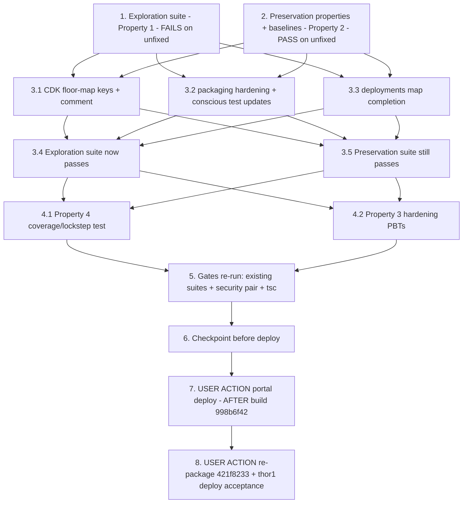

# Implementation Plan

## Overview

Fix the missing per-arch LocalServer floor-map keys that made workflow
packaging bake an unsatisfiable cross-lineage constraint
(`aws.edgeml.dda.LocalServer.arm64JP7 >= 1.0.63` vs the JP7 lineage at
1.0.5 — deployment `cb139a40` to jetson-thor1, `FAILED_NO_STATE_CHANGE`),
and close the recurrence class. Three parts per design.md:

1. **Complete the CDK map** — add `arm64_jp7` / `x86_64` / `x86_64_nvidia`
   (`'1.0.0'` each) to `WORKFLOW_MIN_LOCAL_SERVER_VERSIONS` in
   `edge-cv-portal/infrastructure/lib/compute-stack.ts`, covering every
   `ARCH_TO_LOCAL_SERVER_COMPONENT` key.
2. **Harden the silent fallback** — a KNOWN arch missing from a configured
   (non-empty) floor map resolves the safe per-lineage floor `'1.0.0'` with
   a loud warning, never the cross-lineage scalar (design Decision 1);
   packaging guard inside `min_local_server_version_for`, deployments-side
   map completion at derivation (`_fill_missing_arch_floors` +
   `LOCAL_SERVER_ARCH_IDS`) so `check_local_server_compatibility` itself is
   untouched (design Decision 2).
3. **Pin the coverage** — permanent backend test parsing the actual
   `compute-stack.ts` literal and holding it in lockstep with both backend
   arch vocabularies (design Decision 3), so a future JP8 fan-out that
   repeats the omission fails at test time.

**Honesty guard.** No test in this plan talks to live AWS, Greengrass, or a
device. The suites exercise the REAL backend modules (with moto/conftest
where needed) against the REAL `compute-stack.ts` literal parsed from
source. The real end-to-end claims — the deployed Lambda environment, the
re-packaged component's recipe, and the thor1 deployment succeeding — are
ONLY provable on live AWS and are assigned to the USER ACTION tasks (7, 8).
Do not write a test that pretends to exercise a live deployment.

**Non-goal guards.** No change to `check_local_server_compatibility`,
`local_server_component_dependencies`, `build_manifest`, or
`next_component_version` bodies. No recipe, publish-path, device-side,
frontend, or IAM change. No env var removed or renamed (the scalar chain
survives for empty-map/arch-undetermined paths, requirement 3.6). No
component build in this spec. **Do not commit anything in this dispatch.**

Test commands:
- Backend suites run from `edge-cv-portal/backend` in the portal venv
  (`/home/ubuntu/.venvs/dda-portal-tests`) WITH conftest (moto `aws_stack`
  fixture; Hypothesis profiles `portal-fast`/`ci` are conftest-registered —
  do NOT hardcode `max_examples`; do NOT use `--noconftest`):
  `python3 -m pytest tests/<file> -q -p no:cacheprovider`
- Hypothesis property tests use `test_property_*.py` naming and
  `# Validates: Requirements …` comments
- CDK compile check: `npx tsc --noEmit` from `edge-cv-portal/infrastructure`
  (jest exists there but has no ComputeStack harness — design Decision 3;
  no jest test is added)
- The security guard pair runs from the repo root (host-side):
  `python3 -m pytest test/backend-test/security/preservation/test_preservation_out_of_scope_guard.py test/backend-test/security/preservation/test_preservation_secrets_out_of_scope_guard.py -p no:cacheprovider --noconftest -q`

New files this plan creates:
- `edge-cv-portal/backend/tests/test_jp7_localserver_floor_exploration.py`
- `edge-cv-portal/backend/tests/test_property_jp7_localserver_floor.py`
- `edge-cv-portal/backend/tests/test_workflow_min_localserver_floor_coverage.py`

## Notes

- Source-tree changes: `edge-cv-portal/infrastructure/lib/compute-stack.ts`
  (env literal + comment), `edge-cv-portal/backend/functions/
  workflow_packaging.py` (SAFE_LINEAGE_FLOOR + hardened
  `min_local_server_version_for` + comment), `edge-cv-portal/backend/
  functions/deployments.py` (LOCAL_SERVER_ARCH_IDS + SAFE_LINEAGE_FLOOR +
  `_fill_missing_arch_floors` at map derivation), and the two CONSCIOUS
  test updates in `tests/test_workflow_packaging_variant_min_version.py`
  (they pin the defective scalar fallback — design "Conscious exceptions")
- `compute-stack.js` is a gitignored build artifact — never edit it; the
  deploy tooling regenerates it from the `.ts`
- builds.md is binding: JP7 component build `998b6f42` is RUNNING. The
  portal deploy (task 7) and everything after it MUST NOT run mid-build —
  orchestrator-sequenced USER ACTIONs
- Tasks 7 and 8 are USER ACTIONs on live AWS / the device; the agent
  prepares and verifies everything else host-side

## Task Dependency Graph

```json
{
  "waves": [
    { "wave": 1, "description": "Exploration + preservation on the UNFIXED tree: exploration reproduces the cb139a40 numbers from the real compute-stack.ts literal (FAILS expected); preservation properties and existing-suite baselines are observed and recorded (PASS required).", "tasks": ["1", "2"] },
    { "wave": 2, "description": "The fix, per design Fix Implementation Files 1-4: CDK map keys + comment, packaging hardening + conscious test updates, deployments map completion.", "tasks": ["3.1", "3.2", "3.3"] },
    { "wave": 3, "description": "Verify: the exploration suite now passes on the fixed tree; the preservation suite still passes.", "tasks": ["3.4", "3.5"] },
    { "wave": 4, "description": "Fix-checking: the permanent coverage/lockstep test (Property 4) and the hardening PBTs (Property 3).", "tasks": ["4.1", "4.2"] },
    { "wave": 5, "description": "Re-run every adjacent gate (existing packaging/gate suites, security guard pair, tsc), then checkpoint.", "tasks": ["5", "6"] },
    { "wave": 6, "description": "USER ACTION: portal deploy, sequenced strictly AFTER JP7 build 998b6f42 finishes (builds.md).", "tasks": ["7"] },
    { "wave": 7, "description": "USER ACTION: re-package workflow 421f8233 (auto MAJOR bump) and deploy to jetson-thor1 - the acceptance criterion.", "tasks": ["8"] }
  ]
}
```



## Tasks

- [x] 1. Write bug condition exploration test suite
  - **Property 1: Bug Condition** - Known Archs Resolve Per-Lineage Floors From The Deployed Map
  - **CRITICAL**: Cases 1-6 MUST FAIL on unfixed code - failure confirms the bug condition exists
  - **DO NOT attempt to fix the tests or the code when they fail**
  - **NOTE**: This suite encodes the expected behavior - it validates the fix when it passes after implementation (task 3.4)
  - **GOAL**: Surface the counterexamples on the UNFIXED tree against the REAL deployed configuration - parse the `WORKFLOW_MIN_LOCAL_SERVER_VERSIONS` literal and the `DDA_LOCAL_SERVER_VERSION` scalar out of `edge-cv-portal/infrastructure/lib/compute-stack.ts` (the extractor the coverage test will reuse), load them into the modules (monkeypatch `workflow_packaging.MIN_LOCAL_SERVER_VERSIONS` / `MIN_LOCAL_SERVER_VERSION` and the `deployments` map/scalar - the established test style), then assert the EXPECTED (fixed) behavior
  - Create `edge-cv-portal/backend/tests/test_jp7_localserver_floor_exploration.py`
  - Case 1 - **Literal coverage (the CDK-fix pin)**: the parsed literal's keys ⊇ `{arm64_jp7, x86_64, x86_64_nvidia}`. FAILS on unfixed code (only jp4/jp5/jp6 present). The hardening alone cannot make this pass - it pins the CDK edit specifically
  - Case 2 - **Packager floor, the incident (defect 1.1)**: `min_local_server_version_for('arm64_jp7') == '1.0.0'` and `local_server_component_dependencies(['arm64_jp7'])` emits `{'aws.edgeml.dda.LocalServer.arm64JP7': {'VersionRequirement': '>=1.0.0', 'DependencyType': 'HARD'}}`. FAILS on unfixed code (`'1.0.63'` / `'>=1.0.63'` - the exact cb139a40 constraint vs thor1's `=1.0.5` pin)
  - Case 3 - **Manifest floor (defect 1.2)**: `build_manifest(..., arch='arm64_jp7')` carries `minLocalServerVersion == '1.0.0'`. FAILS on unfixed code (`'1.0.63'`)
  - Case 4 - **Pre-submit gate (defect 1.4), scoped PBT**: _for any_ Hypothesis-generated installed version in the real JP7 lineage range (1.0.0-1.0.5), a device reporting `aws.edgeml.dda.LocalServer.arm64JP7` at that version passes `check_local_server_compatibility` with the prod map (stub/moto greengrass client per the `test_workflow_localserver_variant_compat.py` pattern). FAILS on unfixed code with the exact observed reason: "Installed LocalServer version 1.0.5 is older than the required minimum 1.0.63"
  - Case 5 - **Latent x86 (defect 1.5)**: `min_local_server_version_for` returns `'1.0.0'` for `x86_64` AND `x86_64_nvidia`; `local_server_component_dependencies(['x86_64', 'x86_64_nvidia'])` emits one `.amd64` entry `'>=1.0.0'` (satisfiable by the lineage's 1.0.37); the gate passes an amd64 device at 1.0.37. FAILS on unfixed code
  - Case 6 - **Recurrence shape (defect 1.6)**: with a COPY of `ARCH_TO_LOCAL_SERVER_COMPONENT` extended by a hypothetical `arm64_jp8` and the prod map loaded, the resolved floor for `arm64_jp8` is NOT the cross-lineage scalar. FAILS on unfixed code (silent `1.0.63`)
  - Run: `python3 -m pytest tests/test_jp7_localserver_floor_exploration.py -q -p no:cacheprovider` from `edge-cv-portal/backend` (venv `/home/ubuntu/.venvs/dda-portal-tests`)
  - **EXPECTED OUTCOME**: all six cases FAIL (this is correct - it proves the bug condition exists and reproduces the incident numbers)
  - Document the counterexamples found (the resolved `1.0.63` floors, the `>=1.0.63` recipe entry, the gate rejection reason string, the 3-key literal)
  - Mark complete when the suite is written, run, and the failures are documented
  - **OUTCOME (2026-02-06)**: Suite written and run on the UNFIXED tree (`6 failed, 1 passed` — the pass is the extractor sanity check; all six bug-condition cases FAILED as required, reproducing the cb139a40 incident numbers from the REAL parsed `compute-stack.ts` configuration). Counterexamples: parsed literal = `{'arm64_jp4': '1.0.0', 'arm64_jp5': '1.0.0', 'arm64_jp6': '1.0.0'}` (3 keys — missing `arm64_jp7`, `x86_64`, `x86_64_nvidia`), scalar = `'1.0.63'`; Case 2: `min_local_server_version_for('arm64_jp7')` resolved `'1.0.63'` and the recipe entry was `{'aws.edgeml.dda.LocalServer.arm64JP7': {'VersionRequirement': '>=1.0.63', 'DependencyType': 'HARD'}}` (the exact cb139a40 constraint vs thor1's `=1.0.5` pin); Case 3: manifest `minLocalServerVersion == '1.0.63'`; Case 4 (scoped PBT, pinned `@example` patch=5): gate rejected the JP7 device at 1.0.5 with reason `'Installed LocalServer version 1.0.5 is older than the required minimum 1.0.63'` (exact observed string); Case 5: `x86_64`/`x86_64_nvidia` both resolved `'1.0.63'`, amd64 collapse emitted `'>=1.0.63'` (lineage latest 1.0.37), gate blocked an amd64 device at 1.0.37; Case 6: hypothetical `arm64_jp8` silently resolved the scalar `'1.0.63'`. The literal/scalar extractor is module-level in the suite for reuse by the task 4.1 coverage test. Tests NOT fixed, code NOT touched — failures are the bug-condition proof; suite must pass unmodified at task 3.4.
  - _Requirements: 1.1, 1.2, 1.4, 1.5, 1.6_

- [x] 2. Write preservation property tests (BEFORE implementing fix)
  - **Property 2: Preservation** - Everything Outside The Missing-Key Resolutions Is Unchanged
  - **IMPORTANT**: Follow observation-first methodology - observe the UNFIXED behavior, record it, encode it as properties that PASS on the unfixed tree and must keep passing
  - Create `edge-cv-portal/backend/tests/test_property_jp7_localserver_floor.py` (Hypothesis, conftest profiles - no hardcoded `max_examples`, `# Validates: Requirements …` comments; example-style pins may live in the same file)
  - Observe on UNFIXED code and encode:
    - **jp4/jp5/jp6 identity (3.1)**: with the prod literal loaded, `min_local_server_version_for` / `local_server_component_dependencies([arch])` / `build_manifest` values for jp4, jp5, jp6 equal the observed unfixed values (`'1.0.0'`, `'>=1.0.0'`); PBT: _for any_ generated map containing the arch, resolution returns exactly the map entry
    - **Scalar-chain identity (3.6)**: _for any_ generated scalar and any arch (known, unknown, `None`), an EMPTY map resolves the scalar - the contract the existing env-clearing preservation suites rely on
    - **Multi-variant omission, Defect F (3.2)**: _for any_ generated arch subset resolving to >1 distinct LocalServer variant, `local_server_component_dependencies` returns `{}`; the `x86_64`+`x86_64_nvidia` pair still collapses to ONE `.amd64` entry carrying the max of their floors
    - **Override uniformity (3.5)**: `check_local_server_compatibility` called with `by_arch={}` and a generated override gates every generated device against the override, regardless of variant
    - **Legacy recognition (3.6)**: `local_server_component_arch` observed mapping pinned over the full name vocabulary - JP-tagged names, legacy bare `arm64`/`aarch64` → `arm64_jp4`, `amd64`/`x86` → `x86_64`, junk → `None`
    - **Manifest schema (3.4)**: `build_manifest` key set and value types pinned against the observed unfixed key set (only VALUES for missing archs may change after the fix)
    - **Model/plugin dependency identity (3.3)**: covered by the existing-suite baselines below (no new deep pin - `test_workflow_packaging_localserver_preservation.py` already pins the function contract)
  - Baseline green runs (record counts) on the UNFIXED tree: `tests/test_workflow_packaging_localserver_preservation.py`, `tests/test_workflow_localserver_variant_compat.py`, `tests/test_workflow_packaging_variant_min_version.py`, `tests/test_workflow_packaging_deployment_integration.py`
  - **NOTE the conscious exception NOW**: `test_falls_back_to_scalar_for_unmapped_arch` and `test_arm64_jp4_falls_back_to_scalar_when_unmapped` in `test_workflow_packaging_variant_min_version.py` pin the DEFECTIVE fallback and will be consciously updated in task 3.2 (design "Conscious exceptions") - record their current assertions verbatim so the 3.2 diff is auditable
  - Run: `python3 -m pytest tests/test_property_jp7_localserver_floor.py -q -p no:cacheprovider` from `edge-cv-portal/backend`
  - **EXPECTED OUTCOME**: Tests PASS on UNFIXED code (this confirms the baseline behavior to preserve)
  - Mark complete when the tests are written, run, and passing on unfixed code with the baseline counts recorded
  - **OUTCOME/BASELINE RECORDED (2026-08-16)**: `tests/test_property_jp7_localserver_floor.py` written and run on the UNFIXED tree (portal venv, WITH conftest): **20 passed** — jp4/jp5/jp6 identity against the real `compute-stack.ts` literal (resolution `'1.0.0'`, recipe `'>=1.0.0'` HARD, manifest `minLocalServerVersion '1.0.0'` + map-entry PBT), scalar-chain identity on an EMPTY map (any scalar × known/unknown/`None` arch), Defect F multi-variant omission PBT (`{}`; x86 pair → ONE `.amd64` entry with the max floor), override uniformity of `check_local_server_compatibility` with `by_arch={}`, legacy-name recognition pinned over the full vocabulary (JP4-JP7 tags, bare `arm64`/`aarch64` → `arm64_jp4`, `amd64`/`x86_64` → `x86_64`, junk → `None`), and the `build_manifest` key-set/type schema pin. Baseline green runs on the UNFIXED tree: `test_workflow_packaging_localserver_preservation.py` **10 passed**, `test_workflow_localserver_variant_compat.py` **11 passed**, `test_workflow_packaging_variant_min_version.py` **7 passed**, `test_workflow_packaging_deployment_integration.py` **11 passed** (combined single run: 39 passed). CONSCIOUS-EXCEPTION RECORD (verbatim, to be updated in task 3.2) — both tests monkeypatch `MIN_LOCAL_SERVER_VERSIONS = {"arm64_jp6": "1.0.0"}` and `MIN_LOCAL_SERVER_VERSION = "1.0.63"`; `test_falls_back_to_scalar_for_unmapped_arch` currently asserts: `assert packaging.min_local_server_version_for("x86_64") == "1.0.63"` and `assert packaging.min_local_server_version_for(None) == "1.0.63"` (the `None` half stays); `test_arm64_jp4_falls_back_to_scalar_when_unmapped` currently asserts: `assert packaging.min_local_server_version_for("arm64_jp4") == "1.0.63"` and `assert packaging.min_local_server_version_for("arm64_jp6") == "1.0.0"` (the jp6 half stays)
  - _Requirements: 3.1, 3.2, 3.3, 3.4, 3.5, 3.6_

- [ ] 3. Fix: complete the floor map and harden the fallback (design "Fix Implementation" Files 1-4)

  - [x] 3.1 Add the missing floor-map keys to `compute-stack.ts` (design File 1)
    - Extend the `WORKFLOW_MIN_LOCAL_SERVER_VERSIONS` `JSON.stringify` literal (~line 647) with `arm64_jp7: '1.0.0'`, `x86_64: '1.0.0'`, `x86_64_nvidia: '1.0.0'` - covering every `ARCH_TO_LOCAL_SERVER_COMPONENT` key (design Decision 4)
    - Rewrite the preceding comment: the map MUST cover every `ARCH_TO_LOCAL_SERVER_COMPONENT` key (coverage test enforces it); missing keys resolve the safe `'1.0.0'` floor with a warning, never the scalar; DROP the "archs absent here fall back to DDA_LOCAL_SERVER_VERSION" sentence
    - Do NOT touch `DDA_LOCAL_SERVER_VERSION` or any other env entry; do NOT edit `compute-stack.js` (gitignored build artifact)
    - Verify: `npx tsc --noEmit` from `edge-cv-portal/infrastructure` compiles clean
    - **OUTCOME (2026-02-06)**: Extended the `WORKFLOW_MIN_LOCAL_SERVER_VERSIONS` `JSON.stringify` literal in `edge-cv-portal/infrastructure/lib/compute-stack.ts` with `arm64_jp7: '1.0.0'`, `x86_64: '1.0.0'`, `x86_64_nvidia: '1.0.0'` (6 keys total — covers every `ARCH_TO_LOCAL_SERVER_COMPONENT` key); jp4/jp5/jp6 entries byte-identical (git diff confirms only additions). Rewrote the preceding comment to state the coverage contract (map MUST cover every `ARCH_TO_LOCAL_SERVER_COMPONENT` key, enforced by `test_workflow_min_localserver_floor_coverage.py`) and the hardened fallback (missing keys resolve the safe `'1.0.0'` floor with a warning, never the scalar); the "archs absent here fall back to DDA_LOCAL_SERVER_VERSION" sentence dropped. `DDA_LOCAL_SERVER_VERSION` and all other env entries untouched; `compute-stack.js` not edited. `npx tsc --noEmit` from `edge-cv-portal/infrastructure`: exit 0, clean. Nothing committed.
    - _Bug_Condition: isBugCondition - arch known, floorMap configured, arch NOT IN keys(floorMap) (defects 1.1-1.5: jp7 + both x86 flavors uncovered)_
    - _Expected_Behavior: Property 1 - the literal's key set equals ARCH_TO_LOCAL_SERVER_COMPONENT's key set; jp7/x86 resolve '1.0.0' from explicit entries_
    - _Preservation: Property 2 - jp4/jp5/jp6 entries byte-identical; scalar env untouched (3.1, 3.6); IAM multiset unmoved (3.7)_
    - _Requirements: 2.1, 2.2, 2.4, 3.1, 3.6_

  - [x] 3.2 Harden `workflow_packaging.min_local_server_version_for` + conscious test updates (design Files 2 and 4)
    - Add `SAFE_LINEAGE_FLOOR = '1.0.0'` near the floor config (~line 150) with the satisfiable-in-every-lineage comment
    - Guard in `min_local_server_version_for` (~line 178), per design Decision 2: arch in map → map entry (unchanged); map non-empty AND arch in `ARCH_TO_LOCAL_SERVER_COMPONENT` → `logging.warning` naming the arch, the missing key, the substituted floor, and the coverage test, return `SAFE_LINEAGE_FLOOR`; else → scalar (unchanged: empty map, `None`, unknown arch). Module-level name resolution at call time makes the forward reference to `ARCH_TO_LOCAL_SERVER_COMPONENT` valid - no reordering
    - Update the module comment block (~lines 140-155): the hardened contract replaces "archs absent from the map fall back to the scalar default"
    - CONSCIOUS test updates in `tests/test_workflow_packaging_variant_min_version.py` (recorded in task 2): `test_falls_back_to_scalar_for_unmapped_arch` - x86_64 under a configured map now yields `'1.0.0'` (keep the `None` → scalar assertion); `test_arm64_jp4_falls_back_to_scalar_when_unmapped` - jp4 under a configured map now yields `'1.0.0'` (keep the mapped-jp6 assertion). Comment each with the design citation and requirement 2.3
    - Do NOT modify `local_server_component_dependencies` or `build_manifest` bodies
    - Verify: `python3 -m pytest tests/test_workflow_packaging_variant_min_version.py tests/test_workflow_packaging_localserver_preservation.py -q -p no:cacheprovider` green
    - **OUTCOME (2026-08-16)**: Implemented per design Files 2 and 4. `SAFE_LINEAGE_FLOOR = '1.0.0'` added after the scalar config with the satisfiable-in-every-lineage comment; `min_local_server_version_for` hardened exactly per Decision 2 (map entry unchanged; map non-empty AND arch in `ARCH_TO_LOCAL_SERVER_COMPONENT` → `logging.warning` naming the arch, the missing key, the substituted floor, and the coverage test, return `SAFE_LINEAGE_FLOOR`; else scalar — empty map / `None` / unknown arch unchanged; forward reference resolved at call time, no reordering); module comment block rewritten with the hardened contract replacing the "archs absent from the map fall back to the scalar default" sentence. `local_server_component_dependencies` / `build_manifest` bodies untouched. CONSCIOUS test updates: the two recorded tests updated as planned (`test_falls_back_to_scalar_for_unmapped_arch` x86_64 → `'1.0.0'`, `None` → scalar KEPT; `test_arm64_jp4_falls_back_to_scalar_when_unmapped` jp4 → `'1.0.0'`, mapped-jp6 KEPT), each commented with the design citation and requirement 2.3. **DEVIATION from the task-2 record (design "no other existing test pins the defective path" was incomplete for this file)**: TWO additional assertions in the SAME file also pinned the defective x86_64-under-configured-map fallback and required the same conscious update — `test_arm64_jp4_keyed_like_other_arches` (`min_local_server_version_for("x86_64")` `'1.0.63'` → `'1.0.0'`; its jp4/jp5/jp6 own-floor assertions KEPT) and `test_manifest_carries_arch_scalar_and_full_map` (`_manifest(packaging, "x86_64")["minLocalServerVersion"]` `'1.0.63'` → `'1.0.0'`, exercised through the unchanged `build_manifest` via `min_local_server_version_for`; jp6 scalar + full-map assertions KEPT). Both commented with the same design/2.3 citation. Verify run green from `edge-cv-portal/backend` in the portal venv WITH conftest: `tests/test_workflow_packaging_variant_min_version.py` + `tests/test_workflow_packaging_localserver_preservation.py` = **17 passed** (7 + 10 — counts match the task-2 baseline; the only diffs vs baseline are the four consciously-updated assertions above). Nothing committed.
    - _Bug_Condition: isBugCondition - the packager's silent scalar fallback for a known-but-unmapped arch (defects 1.1, 1.2, 1.5, 1.6)_
    - _Expected_Behavior: Property 3 - a configured map never silently falls back to the scalar for a known arch; '1.0.0' + loud warning_
    - _Preservation: Property 2 - mapped archs, empty-map scalar chain, None/unknown archs, Defect F omission all byte-identical (3.1, 3.2, 3.3, 3.6)_
    - _Requirements: 2.3, 3.1, 3.2, 3.3, 3.6_

  - [x] 3.3 Complete the deployments-side map at derivation (design File 3)
    - Add `LOCAL_SERVER_ARCH_IDS = ('arm64_jp4', 'arm64_jp5', 'arm64_jp6', 'arm64_jp7', 'x86_64')` and `SAFE_LINEAGE_FLOOR = '1.0.0'` near the module map (~line 158), with the comment: mirrors `local_server_component_arch`'s codomain, pinned by the coverage test, cannot import `workflow_packaging` (Lambda bundling)
    - Add `_fill_missing_arch_floors(by_arch)`: empty → returned as-is (scalar chain, 3.6); non-empty → copy with every missing `LOCAL_SERVER_ARCH_IDS` key set to `SAFE_LINEAGE_FLOOR`, ONE loud `logger.warning` naming the filled archs
    - Apply at derivation: `WORKFLOW_MIN_LOCAL_SERVER_VERSIONS = _fill_missing_arch_floors(_parse_min_versions_map())`
    - Do NOT modify `check_local_server_compatibility` or the ~line 3414 override logic (the override path keeps passing `by_arch={}`; arch-undetermined devices keep the scalar fallback)
    - Verify: `python3 -m pytest tests/test_workflow_localserver_variant_compat.py -q -p no:cacheprovider` green
    - _Bug_Condition: isBugCondition - the gate's by_arch.get(arch, scalar) fallback for a known-but-unmapped arch (defect 1.4)_
    - _Expected_Behavior: Property 3 - the gate sees a complete map; a JP7 device at 1.0.5 and an amd64 device at 1.0.37 pass (Property 1 / 2.6)_
    - _Preservation: Property 2 - check_local_server_compatibility byte-identical; override uniformity (3.5); undetermined-arch and legacy-name paths unchanged (3.6)_
    - **OUTCOME (2026-08-16)**: `deployments.py` completed per design File 3 — added `LOCAL_SERVER_ARCH_IDS = ('arm64_jp4', 'arm64_jp5', 'arm64_jp6', 'arm64_jp7', 'x86_64')` and `SAFE_LINEAGE_FLOOR = '1.0.0'` next to the module map (with the codomain-mirror / coverage-test-pin / cannot-import-workflow_packaging comment), added `_fill_missing_arch_floors` (empty map returned as-is preserving the scalar chain per 3.6; non-empty map copied with missing known-arch keys set to `'1.0.0'` and ONE loud `logger.warning` naming the filled archs and the coverage test), and applied it at derivation: `WORKFLOW_MIN_LOCAL_SERVER_VERSIONS = _fill_missing_arch_floors(_parse_min_versions_map())`. Also refreshed the stale map comment sentence ("Archs absent from the map fall back to the scalar default above") to state the completed-at-derivation contract. `check_local_server_compatibility` and the ~line 3414 override logic untouched (override path still passes `by_arch={}`). Verified: `tests/test_workflow_localserver_variant_compat.py` **11 passed** from `edge-cv-portal/backend` in the portal venv WITH conftest — identical to the task 2 baseline. Nothing committed.
    - _Requirements: 2.3, 2.6, 3.5, 3.6_

  - [x] 3.4 Verify bug condition exploration test now passes
    - **Property 1: Expected Behavior** - Known Archs Resolve Per-Lineage Floors From The Deployed Map
    - **IMPORTANT**: Re-run the SAME suite from task 1 - do NOT write new tests
    - Run: `python3 -m pytest tests/test_jp7_localserver_floor_exploration.py -q -p no:cacheprovider` from `edge-cv-portal/backend`
    - **EXPECTED OUTCOME**: all six cases PASS (confirms the bug is fixed: the literal covers jp7/x86, the floors resolve '1.0.0', the gate passes thor1's 1.0.5, and the jp8 recurrence shape resolves non-scalar)
    - **OUTCOME (2026-08-16)**: Re-ran the UNMODIFIED task-1 suite on the fixed tree from `edge-cv-portal/backend` in the portal venv WITH conftest: **7 passed** (all six bug-condition cases plus the extractor sanity check; was `6 failed, 1 passed` on the unfixed tree). Confirms the fix end-to-end against the REAL parsed `compute-stack.ts`: literal covers jp7/x86 (Case 1), packager floor `'1.0.0'` / `'>=1.0.0'` recipe entry (Case 2), manifest `minLocalServerVersion '1.0.0'` (Case 3), gate passes a JP7 device across the 1.0.0-1.0.5 lineage incl. thor1's 1.0.5 (Case 4 PBT), x86/amd64 floors satisfiable at 1.0.37 (Case 5), hypothetical jp8 resolves non-scalar (Case 6). No test or production code touched; nothing committed.
    - _Requirements: 2.1, 2.2, 2.3, 2.4, 2.6_

  - [x] 3.5 Verify preservation tests still pass
    - **Property 2: Preservation** - Everything Outside The Missing-Key Resolutions Is Unchanged
    - **IMPORTANT**: Re-run the SAME tests from task 2 - do NOT write new tests
    - Run: `python3 -m pytest tests/test_property_jp7_localserver_floor.py -q -p no:cacheprovider`, plus the four baselined existing suites from task 2
    - **EXPECTED OUTCOME**: Tests PASS (confirms no regressions). The ONLY diff vs the task 2 baseline is the two consciously-updated tests in `test_workflow_packaging_variant_min_version.py` (recorded in task 2, updated in task 3.2) - any other diff is a regression to fix before proceeding
    - **OUTCOME (2026-08-16)**: Re-ran the SAME five suites from task 2 in one combined run from `edge-cv-portal/backend` (portal venv, WITH conftest): **59 passed, 0 failed** — matches the task-2 baseline exactly (`test_property_jp7_localserver_floor.py` 20 + `test_workflow_packaging_localserver_preservation.py` 10 + `test_workflow_localserver_variant_compat.py` 11 + `test_workflow_packaging_variant_min_version.py` 7 + `test_workflow_packaging_deployment_integration.py` 11 = 59). No regressions; the only diff vs baseline remains the four consciously-updated assertions inside `test_workflow_packaging_variant_min_version.py` (same file, same 7-test count, recorded in tasks 2/3.2). No tests written or modified. Nothing committed.
    - _Requirements: 3.1, 3.2, 3.3, 3.4, 3.5, 3.6_

- [ ] 4. Fix-checking suites

  - [x] 4.1 Write the permanent coverage/lockstep test (design File 5, Decision 3)
    - **Property 4: Fix Checking** - The Coverage Test Pins All Three Vocabularies To The Deployed Literal
    - Create `edge-cv-portal/backend/tests/test_workflow_min_localserver_floor_coverage.py` (permanent regression guard - this is requirement 2.4's build-time pin; reuse/factor the task 1 literal extractor)
    - Assert: the `compute-stack.ts` `WORKFLOW_MIN_LOCAL_SERVER_VERSIONS` literal parses (fail LOUDLY if the anchor is missing - the anchor disappearing is itself a coverage-relevant change); its key set == `set(workflow_packaging.ARCH_TO_LOCAL_SERVER_COMPONENT)`; `set(deployments.LOCAL_SERVER_ARCH_IDS)` ⊆ literal keys; `LOCAL_SERVER_ARCH_IDS` matches `local_server_component_arch`'s observable codomain (drive the real function with every `ARCH_TO_LOCAL_SERVER_COMPONENT` component name plus the legacy `.arm64`/`.aarch64` names); every literal value is well-formed `N.N.N`
    - Run: `python3 -m pytest tests/test_workflow_min_localserver_floor_coverage.py -q -p no:cacheprovider`
    - **EXPECTED OUTCOME**: PASSES on the fixed tree (and would have FAILED on the unfixed tree - spot-check the key-set assertion against the task 1 failure record)
    - **OUTCOME (2026-08-16)**: Created `edge-cv-portal/backend/tests/test_workflow_min_localserver_floor_coverage.py` — the permanent Property 4 lockstep guard (requirement 2.4's build-time pin). Reuses the task-1 extractor by direct import from `test_jp7_localserver_floor_exploration` (single extractor, design Decision 3; anchor-missing still raises LOUDLY through it, plus a dedicated non-empty-parse pin). Five tests: (1) literal parses loudly and non-empty; (2) literal key set == `set(workflow_packaging.ARCH_TO_LOCAL_SERVER_COMPONENT)` with a diagnostic naming missing/extra keys; (3) `set(deployments.LOCAL_SERVER_ARCH_IDS)` ⊆ literal keys; (4) `LOCAL_SERVER_ARCH_IDS` == `local_server_component_arch`'s observable codomain, driving the REAL classifier with all six `ARCH_TO_LOCAL_SERVER_COMPONENT` component names plus the legacy bare `.arm64`/`.aarch64` JP4 names (every name must classify non-None); (5) every literal value well-formed `N.N.N`. Run from `edge-cv-portal/backend` (portal venv, WITH conftest — moto `aws_stack` backs the module imports): **5 passed**. Spot-check vs the task-1 failure record: the unfixed 3-key literal `{arm64_jp4, arm64_jp5, arm64_jp6}` fails the key-set-equality assertion with missing = `['arm64_jp7', 'x86_64', 'x86_64_nvidia']` — the suite would have caught the cb139a40 omission at test time. Nothing committed.
    - _Requirements: 2.4_

  - [x] 4.2 Write the hardening property tests (Property 3)
    - **Property 3: Fix Checking** - A Configured Map Never Silently Falls Back To The Scalar For A Known Arch
    - Add to `tests/test_property_jp7_localserver_floor.py` (fix-check section; Hypothesis, conftest profiles, `# Validates: Requirements 2.3, 3.6` comments)
    - Packaging PBT: _for any_ generated non-empty floor map over arbitrary subsets of known archs (plus junk keys) and any generated scalar - `min_local_server_version_for` returns the map entry for mapped archs, `'1.0.0'` (never the scalar) for missing KNOWN archs with a warning logged (assert via `caplog`), and the scalar for `None`/unknown archs; with an EMPTY map, the scalar for everything
    - Deployments PBT: _for any_ generated non-empty map, `_fill_missing_arch_floors` output contains every `LOCAL_SERVER_ARCH_IDS` key, never overwrites present entries, fills only with `'1.0.0'`, and warns naming the filled archs; empty map returned as-is
    - End-to-end shape: _for any_ single known arch under any generated configured map, `local_server_component_dependencies([arch])`'s `VersionRequirement` and `build_manifest`'s `minLocalServerVersion` never carry the scalar unless the map explicitly maps the arch to it
    - Run: `python3 -m pytest tests/test_property_jp7_localserver_floor.py -q -p no:cacheprovider`
    - **EXPECTED OUTCOME**: PASSES on the fixed tree
    - **OUTCOME (2026-08-16)**: Property 3 fix-check section appended to `tests/test_property_jp7_localserver_floor.py` (banner-separated from the task-2 preservation section; Hypothesis conftest profiles, no hardcoded `max_examples`; `# Validates: Requirements 2.3, 3.6` comments; hardening warnings asserted via `caplog` with the `function_scoped_fixture` health check suppressed and `caplog.clear()` per example). Three classes / 5 tests: `TestHardenedResolutionPartition` — packaging partition PBT (mapped arch → exact map entry with NO hardening warning; missing KNOWN arch → `'1.0.0'` ≠ scalar with a warning naming the arch repr and the substituted floor; `None`/`''`/unknown archs → scalar chain, no warning, with the junk-key-literally-mapped corner honoring the first branch) plus the empty-map-scalar-for-everything-without-warning PBT; `TestDeploymentsMapCompletion` — `_fill_missing_arch_floors` completion contract PBT (every `LOCAL_SERVER_ARCH_IDS` key present, present known/junk entries never overwritten, fills exactly `'1.0.0'`, no unexpected keys, input not mutated, exactly ONE warning naming all filled archs, no warning when complete) plus the empty-map identity (`out is empty`, no warning) example; `TestEndToEndShapeNeverCarriesScalar` — single-known-arch PBT pinning `local_server_component_dependencies([arch])` to `'>=<map entry or 1.0.0>'` HARD on the exact variant name and `build_manifest`'s `minLocalServerVersion` to the same floor (never the scalar unless explicitly mapped). Run from `edge-cv-portal/backend` (portal venv, WITH conftest): **25 passed** (20 task-2 preservation + 5 new fix-check; the preservation section untouched). Task 4.1's coverage-test file not touched. Nothing committed.
    - _Requirements: 2.3, 3.6_

- [x] 5. Re-run every adjacent gate
  - Full affected-backend sweep from `edge-cv-portal/backend`: the three new suites + `test_workflow_packaging_variant_min_version.py`, `test_workflow_packaging_localserver_preservation.py`, `test_workflow_localserver_variant_compat.py`, `test_workflow_packaging_deployment_integration.py`, `test_workflow_packaging_vllm_resolution_preservation.py` - all green
  - `npx tsc --noEmit` from `edge-cv-portal/infrastructure` clean
  - Security guard pair from the repo root green (command in Overview); if the cdk.out drift guards fire on stale synth output, move `cdk.out` aside per builds.md - do NOT weaken baselines. The IAM synth preservation test's premise (env-only change leaves the IAM statement multiset unmoved, 3.7) holds by construction; run it host-side if it is runnable on this host, otherwise record the builds.md container caveat
  - **EXPECTED OUTCOME**: everything green; tree is deploy-ready
  - **OUTCOME (2026-08-16)**: All four gates green, no source code touched, nothing committed. (1) Full affected-backend sweep — single combined run of all 8 suites from `edge-cv-portal/backend` (portal venv, WITH conftest): **85 passed, 0 failed** (`test_jp7_localserver_floor_exploration.py` 7 + `test_property_jp7_localserver_floor.py` 25 + `test_workflow_min_localserver_floor_coverage.py` 5 + `test_workflow_packaging_variant_min_version.py` 7 + `test_workflow_packaging_localserver_preservation.py` 10 + `test_workflow_localserver_variant_compat.py` 11 + `test_workflow_packaging_deployment_integration.py` 11 + `test_workflow_packaging_vllm_resolution_preservation.py` 9). (2) `npx tsc --noEmit` from `edge-cv-portal/infrastructure`: exit 0, clean (node via `/home/ubuntu/.local/node/bin`). (3) Security guard pair from the repo root (`--noconftest`): **4 passed, 3 skipped** (skips are the cdk.out-tree-absent guards — no cdk.out copies on disk, so no drift to guard; no baseline touched). (4) IAM synth preservation (`test_preservation_iam_cdk_synth.py`) WAS runnable host-side (CDK toolchain present in `infrastructure/node_modules`; synths to a temp outdir, does not regenerate `cdk.out`): **11 passed** including the live-synth layer — the env-only change left the synthesized IAM statement multiset unmoved (3.7), confirmed empirically, not just by construction. Tree is deploy-ready.
  - _Requirements: 2.4, 3.7_

- [x] 6. Checkpoint - Ensure all tests pass
  - Ensure all tests pass, ask the user if questions arise
  - Confirm the working tree contains ONLY the intended changes (design Fix Implementation Files 1-5 + the two new test suites); **nothing is committed in this dispatch**
  - STOP here for the orchestrator: tasks 7-8 are USER ACTIONs gated on the JP7 build finishing
  - **OUTCOME (2026-08-16)**: Checkpoint GREEN; nothing committed. (1) Tests: full 8-suite affected-backend sweep re-run in one combined invocation from `edge-cv-portal/backend` (portal venv, WITH conftest): **85 passed, 0 failed** — identical to the task-5 baseline (exploration 7 + property 25 + coverage 5 + variant_min_version 7 + localserver_preservation 10 + variant_compat 11 + deployment_integration 11 + vllm_resolution_preservation 9). `npx tsc --noEmit` from `edge-cv-portal/infrastructure`: exit 0, clean. Security guard pair from the repo root (`--noconftest`): **4 passed, 3 skipped** (skips = cdk.out-tree-absent guards, same as task 5; no baseline touched). (2) Scope check via `git status`/`git diff`, line-by-line on this spec's paths: the tree carries EXACTLY the intended spec changes — File 1 `compute-stack.ts` (comment rewrite + the three added keys ONLY; jp4/jp5/jp6 entries and all other env untouched), File 2 `workflow_packaging.py` (comment block + `SAFE_LINEAGE_FLOOR` + hardened `min_local_server_version_for` ONLY), File 3 `deployments.py` (comment refresh + `LOCAL_SERVER_ARCH_IDS` + `SAFE_LINEAGE_FLOOR` + `_fill_missing_arch_floors` + derivation wrap ONLY), File 4 `tests/test_workflow_packaging_variant_min_version.py` (the four conscious assertion updates recorded in tasks 2/3.2, each with the design/2.3 citation, nothing else), Files 5-7 the three new untracked test files. Nothing staged; nothing under this spec's paths that does not belong. (3) Unrelated working-tree content confirmed as EXPECTED other-spec/bookkeeping material (build-server-disk-pruning files: `portal-build.sh`, `scripts/portal-build-agent.sh`, `scripts/prune-build-server-disk.sh`, `test/backend-test/build_server_disk_pruning/`, the `scripts_portal-build-agent.sh.sha256.txt` baseline; `.kiro/specs`/`.kiro/hooks` bookkeeping) plus non-committable workspace artifacts (`CLAUDE.md`, deploy `.out` logs, `cdk.out.bak-*` dirs, `gdk-config.json.bak-*`) — none under this spec's paths, none blocking. Tree is deploy-ready; STOPPING here — tasks 7-8 are USER ACTIONs gated on JP7 build `998b6f42` finishing (builds.md).

- [ ] 7. USER ACTION: portal deploy (orchestrator-sequenced - MUST NOT run mid-build)
  - **GATE (builds.md, binding)**: JP7 component build `998b6f42` is RUNNING. Before deploying: `pgrep -af "gdk component build"` and `pgrep -af "build-custom.sh"` must BOTH be empty - the deploy regenerates `cdk.out` and would fail the running build's security gate after its ~1h compile
  - Deploy the portal (deploy-portal.sh / deploy-infrastructure.sh) so the Lambdas pick up the completed `WORKFLOW_MIN_LOCAL_SERVER_VERSIONS` env and the hardened backend code
  - After the deploy fully finishes: move `cdk.out` aside (`mv cdk.out cdk.out.bak-$(date +%Y%m%dT%H%M%SZ)`) per builds.md BEFORE any next component build
  - Verify: the deployed workflow-packaging / deployments Lambda environment shows the 6-key map (console or `aws lambda get-function-configuration`)
  - _Requirements: 2.1, 2.2, 2.6, 3.7_

- [ ] 8. USER ACTION: re-package workflow 421f8233 and deploy to jetson-thor1 (acceptance)
  - Depends on task 7 (the running Lambdas must carry the new env)
  - Re-package workflow `dda.workflow.421f8233-f1d9-495a-b7b2-f26b1d24d0d8` through the portal flow - `next_component_version` auto-bumps MAJOR to the next free `N.0.0` (the v5.0.0 package is immutable and stays broken by design, defect 1.7)
  - Verify the NEW component version's recipe carries `aws.edgeml.dda.LocalServer.arm64JP7` with `VersionRequirement '>=1.0.0'` and its `manifest.json` carries `minLocalServerVersion: '1.0.0'` (and the embedded `minLocalServerVersions` map has all 6 keys)
  - Deploy the new version to jetson-thor1 (usecase `645504ce`): the pre-submit gate must PASS the device (installed arm64JP7 1.0.5 ≥ 1.0.0) and the Greengrass deployment must reach SUCCEEDED - no `FAILED_NO_STATE_CHANGE`
  - **EXPECTED OUTCOME**: deployment SUCCEEDED - the end-to-end acceptance for requirements 2.5 and 2.6
  - _Requirements: 1.7, 2.5, 2.6_
