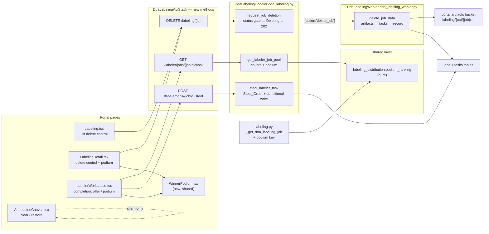

# Design Document

## Overview

Four features, one domain, zero new mechanisms: every capability rides a pattern the DDA labeling system already ships.

- **Job deletion** is a new status pair (`Deleting` / `DeleteFailed`) plus a new `DdaLabelingWorker` action (`delete_job`), invoked exactly the way `distribute` and `generate_manifest` are (`_invoke_labeling_worker`, fire-and-forget). The API route does one conditional status flip and answers 202; the worker walks S3 and DynamoDB. The job record is deleted **last**, so an interrupted deletion is a visible `Deleting` job whose DELETE re-trigger re-runs the idempotent cleanup — recovery is a property of the ordering, not a recovery subsystem. Deletion is structurally incapable of touching the dataset: its only S3 mutation is a delete of listed keys under `labeling/{usecase_id}/{job_id}/` in the portal artifacts bucket, a bucket and prefix disjoint from every Dataset_Location by construction, and the code never holds a dataset-bucket client.
- **Work stealing** is `_conditional_reassign`'s exact write discipline behind a new labeler route: reassign iff `status = Assigned AND assignee_user_id = :donor`. Two stealers cannot both win one task, and a concurrent submission always beats a steal, because DynamoDB adjudicates — the "submit guard" is the condition itself. Candidate choice is a deterministic pure ordering (`UNASSIGNED` first, then most-loaded donor), so the same population always yields the same transfer.
- **The podium** is a pure ranking function in the shared layer (`labeling_distribution.py`, beside `distribute`/`rebalance`) over data submission already records (`submitted_by`, `submitted_at`): count descending, ties to the earlier final submission, residual ties by user id — a total order. Two consumers read it: the admin job detail payload (additive `podium` key for Completed team jobs) and the new labeler Pool_Route (podium exactly when the job is fully submitted).
- **Clear pre-labels** is client-only. The canvas already knows what came from the Pre_Label (OD box ids `prelabel-box-{i}`, classless `proposal-{i}` items, the pre-selected classification); the one gap is Segmentation, where prelabel pixels merge into the label bitmap — closed by snapshotting the bitmap at initialization (`prelabelBitmapRef`), making "still-intact prelabel pixel" a comparable fact. Clear takes a full-state snapshot first, so restore is an exact one-level undo: `restore(clear(s)) = s`.

The steal offer and podium deliberately ride a **new** `GET /labeler/jobs/{jobId}/pool` route instead of the completion payload: `test_dda_labeling_labeler_apis.py` pins that payload with exact-dict equality, and this spec's posture is zero pre-existing test amendments. Every new payload key elsewhere is additive and appears only in states existing fixtures do not enter.

## Architecture



Request flows:

1. **Delete**: list/detail page → confirmation dialog (removed vs retained named) → `DELETE /labeling/{id}` → `dda_labeling.request_job_deletion` validates (exists, DDA, Deletable_Status), conditionally flips to `Deleting`, audits `job_delete_requested`, async-invokes `{action: 'delete_job', job_id}`, answers 202. The worker deletes the Job_Artifact_Prefix objects, then the task items, then the job record, audits `job_deleted`; any failure records `DeleteFailed` + `failure_reason`. A DELETE against a `Deleting` job re-invokes the worker (idempotent recovery).
2. **Steal**: workspace completion view → `GET .../pool` → shows "take a task" with the stealable count → `POST .../steal` → the handler snapshots the job's tasks, orders candidates by Steal_Order, and walks them with conditional writes until one lands (recording `stolen_from`/`stolen_at`, auditing `task_stolen`) or candidates exhaust (409 none-remain) → workspace loads the next task through the untouched existing flow. Repeat until the pool is empty.
3. **Podium**: submission (untouched) records `submitted_by`/`submitted_at`. The admin detail payload gains `podium` for Completed team jobs; the Pool_Route carries `podium` exactly when every active task is Submitted. Both call the one shared `podium_ranking`. `WinnerPodium.tsx` renders 1st/2nd/3rd on both surfaces.
4. **Clear**: canvas-local. Prelabel provenance (box id prefix, `prelabelBitmapRef`, proposals, prelabel label) → clear takes the Prelabel_Snapshot, removes prelabel-origin state, swaps the control to Restore → restore reinstates the snapshot exactly. No network I/O; submission validation unchanged.

## Components and Interfaces

### Shared layer — `labeling_distribution.py` (one writer task)

```python
def podium_ranking(submissions):
    """Podium_Ranking (labeling-job-cleanup-work-stealing-and-podium
    Req 7.1-7.4): rank submitters by (-submitted_count,
    final_submission_ts, user_id) and emit at most three entries
    [{'place': 1..3, 'user_id', 'submitted', 'final_submitted_at'}].

    `submissions` is an iterable of (user_id, submitted_at) pairs —
    one per Submitted task. Pure and total: junk-free by construction
    (callers pass what they queried), deterministic under input
    permutation, empty in → empty out.
    """
```

Beside `distribute`/`rebalance` — the module is already the domain's home for deterministic pure functions, importable from both consumers (it lives on the shared layer both handlers attach).

### Backend — `dda_labeling.py` (one writer task)

**Constants**: `DELETABLE_STATUSES = ('Completed', 'Failed', 'Stopped', 'DeleteFailed', 'Deleting')`, `STATUS_DELETING = 'Deleting'`, `STATUS_DELETE_FAILED = 'DeleteFailed'`.

**Router arms** (additive):
- in the `/labeling/{id}` section (scope already injected by `_inject_job_usecase_scope`): `DELETE` + `resource == '/labeling/{id}'` → `request_job_deletion`;
- in the labeler section: `GET /labeler/jobs/{jobId}/pool` → `get_labeler_job_pool`, `POST /labeler/jobs/{jobId}/steal` → `steal_labeler_task`.

**`request_job_deletion(event, context)`** — `@rbac_check([MANAGE_LABELING_JOBS], allow_global=True)`, the stop-route posture:
1. Load the job: absent → 404. Ground Truth backend → 400 (SageMaker-managed lifecycle, the stop route's wording pattern). Status not in `DELETABLE_STATUSES` → 400 naming the status and the stop-first path (`InProgress` is the only such live status).
2. Status already `Deleting` → skip the flip, re-invoke the worker, answer 202 (idempotent recovery; Req 1.5).
3. Conditional flip: `SET #status = :deleting, delete_requested_by, delete_requested_at, updated_at` with `ConditionExpression '#status = :prior'` (the read status). `ConditionalCheckFailedException` → re-read, answer per the new status (Req 1.8).
4. Audit `job_delete_requested` (acting user, job id, prior status); `_invoke_labeling_worker({'action': 'delete_job', 'job_id': job_id})`; 202 `{job_id, status: 'Deleting'}`.

**Steal machinery** (labeler posture: `@rbac_check([LABELING_TASKS_SELF], allow_global=True)` + the server-side checks of every labeler route):

```python
def _stealable_tasks(tasks, caller):
    """Stealable_Task predicate over already-queried task items:
    status == 'Assigned', assignee not in (caller, 'AUTO'),
    prelabel_status != 'Pending' (Req 5.4)."""

def _steal_order(stealable, caller):
    """Steal_Order (Req 5.2): UNASSIGNED tasks first (ascending
    task_id); then donors by (-stealable_count, user_id), tasks
    ascending task_id within each donor. Pure; returns the ordered
    candidate list."""
```

**`steal_labeler_task(event, context)`**:
1. Load job; deny (`_labeler_access_denied`) unless DDA + the caller is a current team member (missing/GT/foreign jobs indistinguishable — Req 5.7). Status != InProgress → 409 naming the status (the submit route's pattern; Req 5.6).
2. Query all job tasks (`_query_all_job_tasks`), compute `_steal_order(_stealable_tasks(...))`.
3. Walk candidates: per candidate one conditional update `SET assignee_user_id = :caller, stolen_from = :donor, stolen_at = :now, updated_at = :now` with `ConditionExpression '#status = :assigned AND assignee_user_id = :donor'`. `ConditionalCheckFailedException` → next candidate (Req 5.3). Deliberately a **separate write** from `_conditional_reassign` — that shared function stays byte-identical (Req 10.2) and the steal write carries the provenance attributes in the same atomic update (Req 5.8).
4. First success → audit `task_stolen` (caller, donor, task, job) → 200 `{task_id, job_id, stolen_from, stealable_count}` (remaining = pre-walk count − 1 − candidates lost to races, recomputed from the walk). Exhausted → 409 `{error: 'No stealable tasks remain', stealable_count: 0}` (Req 5.5).

**`get_labeler_job_pool(event, context)`**:
1. Same denial posture as steal (membership re-checked per request).
2. One `_query_all_job_tasks` pass over active (non-Inactive) tasks: `stealable_count = len(_stealable_tasks(...))` computed only while the job is InProgress (0 otherwise); `job_complete = image_count > 0 and submitted_active_count == image_count` (the manifest-trigger condition).
3. When `job_complete`: `podium = podium_ranking((t['submitted_by'], t['submitted_at']) for submitted tasks)` with emails joined from the team's `MEMBER#` items (current members only; Req 7.5).
4. 200 `{job_id, stealable_count, job_complete, podium?}` — `podium` key present exactly when `job_complete` (Req 6.1).

### Backend — `dda_labeling_worker.py` (one writer task)

Handler gains `if action == 'delete_job': return delete_job_data(job_id)`.

**`delete_job_data(job_id)`**:
1. **Guard** (the `retry_prelabels` re-check pattern): job absent or status != `Deleting` → `{'skipped': True}` with zero deletions (Req 2.5 — the async invoke may race a manual status change).
2. **Artifacts**: paginate `list_objects_v2(Bucket=PORTAL_ARTIFACTS_BUCKET, Prefix=f"labeling/{job['usecase_id']}/{job_id}/")`, delete in `delete_objects` batches of ≤ 1000. The prefix is computed from the job record's own ids; no dataset-bucket client is ever constructed (Req 3.1/3.2 structurally). Missing/already-deleted keys are no-ops (idempotence, Req 2.8).
3. **Task items**: paginated query on PK `job_id`, `batch_writer` deletes per `(job_id, task_id)`.
4. **Job record last**: `delete_item(Key={'job_id': job_id})` (Req 2.3/2.4).
5. Audit `job_deleted` with `{usecase_id, tasks_deleted, artifact_objects_deleted}` (Req 2.7).
6. **Failure at any step**: log, set `#status = :failed_status, failure_reason = :reason` conditioned on `#status = :deleting` (never clobbers a concurrent change), return the error (Req 2.6). A later DELETE retries from `DeleteFailed`.

IAM: the worker role already holds `grantReadWriteData` on both tables (includes `DeleteItem`) and `grantReadWrite` on the artifacts bucket (includes `DeleteObject`) — **zero new grants**.

### Backend — `labeling.py` (one writer task)

`_get_dda_labeling_job` addition, after `member_progress`: when `job.get('team_id')` and `job.get('status') == 'Completed'`, compute `podium` from the already-queried `active_tasks` (Submitted ones' `submitted_by`/`submitted_at`) via the shared `podium_ranking`, join emails from the already-queried `_query_team_members` list, and set `job['podium']`. Zero extra table reads; the key is absent for every other job (Req 8.2, 10.4). The module imports `podium_ranking` from the shared layer top-level (beside its existing shared imports).

### Frontend

**`api.ts` (one writer task).** Additive methods and types:

```typescript
async deleteLabelingJob(jobId: string): Promise<{job_id: string; status: string}>   // DELETE /labeling/{id}
async getLabelerJobPool(jobId: string): Promise<LabelerJobPoolResponse>             // GET /labeler/jobs/{jobId}/pool
async stealTask(jobId: string): Promise<StealTaskResponse>                          // POST /labeler/jobs/{jobId}/steal

interface PodiumEntry { place: 1 | 2 | 3; user_id: string; email?: string; submitted: number; final_submitted_at: number; }
interface LabelerJobPoolResponse { job_id: string; stealable_count: number; job_complete: boolean; podium?: PodiumEntry[]; }
interface StealTaskResponse { task_id: string; job_id: string; stolen_from: string; stealable_count: number; }
```

`LabelingJob['status']` unions gain `'Deleting' | 'DeleteFailed'` where statuses are typed.

**`WinnerPodium.tsx` (new component, one writer task).** Props `{entries: PodiumEntry[]}`. Renders nothing for an empty list (Req 8.5); otherwise the classic column layout — 2nd | 1st | 3rd, first place tallest with the trophy — each entry showing the medal (🥇🥈🥉), the display name (`email ?? user_id`), and the submitted count. Testids `winner-podium`, `podium-place-{1|2|3}`.

**`LabelerWorkspace.tsx` (one writer task).** On the completion payload (`nextTask.complete === true`), fetch `getLabelerJobPool(activeJobId)` into `pool` state:
- `pool.job_complete && pool.podium?.length` → render `<WinnerPodium entries={pool.podium}/>` inside the completion alert (Req 8.3);
- else `pool.stealable_count > 0` → render the take-work offer ("Teammates still have {n} unsubmitted images") with the take-work button (testid `steal-task-button`): on click `stealTask(activeJobId)` then `loadNextTask(activeJobId)` (Req 6.2/6.3); a 409 none-remain answer refetches the pool without an error alert (Req 6.5);
- else the existing completion message, unchanged (Req 6.6). Each return to completion refetches the pool, so the offer repeats until nothing is left (Req 6.4). A pool fetch failure degrades to the existing completion view (no new error surface).

**`LabelingDetail.tsx` (one writer task).** Exported `canDeleteDdaJob(job)` beside `canStopDdaJob` (DDA && status ∈ {Completed, Failed, Stopped, DeleteFailed}). Header gains the Delete button (testid `delete-job-button`, label "Delete Job", or "Retry Delete" for DeleteFailed) opening the confirmation modal (removed: task assignments, pre-label/annotation artifacts; retained: dataset images, generated training manifest — Req 4.3). Confirm → `deleteLabelingJob` → refetch (renders Deleting). Status maps gain `Deleting` (in-progress type) and `DeleteFailed` (error type). Podium: `rawJob.status === 'Completed' && rawJob.podium?.length` → a "Winner Podium" container rendering `<WinnerPodium/>` (Req 8.1).

**`Labeling.tsx` (one writer task).** Header actions gain Delete for the selected DDA job when deletable (same `canDeleteDdaJob` predicate inline — the page owns its own job type), with the same confirmation modal; on 202 → reload the list (job shows Deleting; a later reload drops it — Req 4.4/4.7). `getStatusIndicator`'s map gains `deleting` / `delete_failed` entries (the camelCase→snake normalization maps `DeleteFailed` → `delete_failed`).

**`AnnotationCanvas.tsx` (one writer task).**
- New refs/state: `prelabelBitmapRef` (a copy of the bitmap taken right after prelabel painting in `handleImageLoad` — the Segmentation provenance record), `prelabelSnapshotRef` (the Prelabel_Snapshot: `{classification, boxes, bitmap copy, proposals}`), `prelabelsCleared` boolean state.
- `hasPrelabelContent` already exists (the `prelabelHasAnyContent` expression) — the Clear_Prelabels_Control (testid `clear-prelabels`, label "Clear pre-labels") renders in the toolbar exactly when it holds and `!prelabelsCleared` (Req 9.1).
- **Clear**: snapshot first; then per modality — Classification: `classification === prelabel.label` → null (Req 9.4); ObjectDetection: drop boxes whose `id.startsWith('prelabel-box-')` (Req 9.2); Segmentation: for each pixel `p` where `prelabelBitmap[p] !== 0 && bitmap[p] === prelabelBitmap[p]` → 0, and clear `proposals` (Req 9.3); bump `segVersion`; set `prelabelsCleared`.
- **Restore** (testid `restore-prelabels`, same toolbar slot): reinstate the snapshot wholesale (classification, boxes array, bitmap copy-back, proposals), clear `prelabelsCleared` (Req 9.5). One level: a new clear takes a new snapshot.
- URL refresh already leaves annotation state alone; `segInitializedRef` guards re-painting, so the cleared bitmap and the control state survive swaps (Req 9.8). Submission reads the same state it always read (Req 9.7). No API calls (Req 9.6).

### Infrastructure — `dda-labeling-api-stack.ts` (one writer task)

Three `addMethod` calls with the existing helper and integrations:
- `addMethod(labelingJobResource, 'DELETE')` — the imported `/labeling/{id}` resource, `ddaLabelingIntegration` (the stop route precedent shows methods on this resource; its OPTIONS preflight is owned by the ApiGatewayStack's `defaultCorsPreflightOptions`);
- `addMethod(labelerJobResource.addResource('pool'), 'GET')` and `addMethod(labelerJobResource.addResource('steal'), 'POST')` — where `labelerJobResource` is the existing `labelerJobsResource.addResource('{jobId}')` construct (currently inline for `/next`; hoisted to a named const, template-identical).

The route-salted `CfnDeployment` logical id changes by construction, rolling the stage. Route-table doc comment gains the three routes. **No compute-stack change**: handler env, grants, and tables are already wired.

## Data Models

**Job record — new/changed attributes:**

| Attribute | Written by | Meaning |
|---|---|---|
| `status: 'Deleting'` | Deletion_Route | cleanup requested/running; job hidden from delete controls, submits already impossible (non-InProgress) |
| `status: 'DeleteFailed'` | Deletion_Worker | cleanup failed; `failure_reason` recorded; delete control reads as retry |
| `delete_requested_by/at` | Deletion_Route | audit trail on the record while it lives |
| `podium` (payload only) | `_get_dda_labeling_job` | additive detail-payload key, Completed team jobs only — never persisted |

**Task item — new attributes (steal only):** `stolen_from` (donor sub or `UNASSIGNED`), `stolen_at` (epoch). Written in the same conditional update that reassigns; absent on every other task.

**Steal_Order oracle** (pure): partition Stealable_Tasks into `unassigned` (ascending `task_id`) and per-donor groups; order donors by `(-len(group), user_id)`; concatenate `unassigned + [t for donor in donors for t in sorted(group, key=task_id)]`. First conditional-write winner in that order is the transfer.

**Podium_Ranking oracle** (pure): group submissions by `user_id` → `(count, max(submitted_at))`; sort by `(-count, final_ts, user_id)`; take 3; place = index + 1.

**Deletion scope map:**

| Store | Deleted | Retained |
|---|---|---|
| Portal_Artifacts_Bucket | `labeling/{uc}/{job_id}/**` (prelabels, annotations) | every other prefix incl. `labeling-previews/**`, other jobs' `labeling/{uc}/{other}/**`, example-image uploads outside the job prefix |
| tasks table | all `(job_id, *)` items | every other job's items |
| jobs table | the job record (last) | — |
| Use_Case dataset bucket | **nothing, ever** | `dataset_prefix/**` (sacrosanct) |
| Use_Case output bucket | **nothing** | `labeled/{job_id}/**` (manifest may back registered training datasets) |

**New routes:**

| Route | Handler | Authz | Answers |
|---|---|---|---|
| `DELETE /labeling/{id}` | `dda_labeling.request_job_deletion` | `MANAGE_LABELING_JOBS` (job scope injected) | 202 Deleting; 404 unknown; 400 GT / non-deletable status |
| `GET /labeler/jobs/{jobId}/pool` | `dda_labeling.get_labeler_job_pool` | `LABELING_TASKS_SELF` + membership | 200 `{stealable_count, job_complete, podium?}`; 403 denial |
| `POST /labeler/jobs/{jobId}/steal` | `dda_labeling.steal_labeler_task` | `LABELING_TASKS_SELF` + membership | 200 transfer; 409 none-remain / non-InProgress; 403 denial |

**Audit events:** `job_delete_requested`, `job_deleted` (with counts), `task_stolen` (caller, donor, task, job) — all through the existing `log_audit_event`.

## Correctness Properties

*A property is a characteristic or behavior that should hold true across all valid executions of a system — essentially, a formal statement about what the system should do. Properties serve as the bridge between human-readable specifications and machine-verifiable correctness guarantees.*

Each property gets exactly one property-based test at a minimum of 100 iterations (Hypothesis `@settings(max_examples=100, deadline=None)` backend; fast-check `{ numRuns: 100 }` frontend), tagged `Feature: labeling-job-cleanup-work-stealing-and-podium, Property {n}: {title}`. The prework was consolidated: the deletion route arms (1.1-1.5) collapse into Property 1's accepts-iff oracle; cleanup completeness (2.1-2.3, 2.8) into Property 2; the confinement invariants (3.1-3.5, 10.6) into Property 3's one adversarially seeded generator; failure/skip/ordering (2.4-2.6) into Property 4; steal acceptance/choice (5.1, 5.2, 5.5, 5.6) into Property 5 with a model-based Steal_Order oracle and race/protection (5.3, 5.4) into Property 6; the workspace loop (6.2-6.6, 8.3) into Property 11; the pure ranking (7.1-7.4) into Property 8 and payload presence/join (7.5, 8.2, 10.4) into Property 9; the clear/restore session (9.1-9.6) into Property 10's round trip. Authorization postures, audit event shapes, the race edge 1.8, dialog wording and status rendering (4.x), the stolen-task next-flow (5.9), post-clear submission (9.7), and URL-refresh survival (9.8) are examples per the prework; the byte-identical preservation claims (10.1-10.3, 10.5) are the checkpoint's non-regression inventory.

| # | Property (title) | Validates | Test file |
|---|---|---|---|
| 1 | The Deletion_Route accepts exactly the deletable predicate | 1.1, 1.2, 1.3, 1.4, 1.5 | `backend/tests/test_property_labeling_job_deletion.py` |
| 2 | Completed deletion leaves zero traces of the job's own state | 2.1, 2.2, 2.3, 2.8 | `backend/tests/test_property_labeling_job_deletion.py` |
| 3 | Deletion is confined to the job's own artifact prefix | 3.1, 3.2, 3.3, 3.4, 3.5, 10.6 | `backend/tests/test_property_labeling_job_deletion.py` |
| 4 | Deletion failure and skip paths are total and ordered | 2.4, 2.5, 2.6 | `backend/tests/test_property_labeling_job_deletion.py` |
| 5 | A Steal_Request succeeds exactly when a Stealable_Task exists and takes the Steal_Order minimum | 5.1, 5.2, 5.5, 5.6 | `backend/tests/test_property_labeling_work_stealing.py` |
| 6 | Steal races have one winner and never move protected tasks | 5.3, 5.4 | `backend/tests/test_property_labeling_work_stealing.py` |
| 7 | The Pool_Route reports the exact pool state | 6.1 | `backend/tests/test_property_labeling_work_stealing.py` |
| 8 | Podium_Ranking is the total deterministic order | 7.1, 7.2, 7.3, 7.4 | `backend/tests/test_property_labeling_podium.py` |
| 9 | The detail payload carries the podium exactly for Completed team jobs, emails joined per membership | 7.5, 8.2, 10.4 | `backend/tests/test_property_labeling_podium.py` |
| 10 | Clear removes exactly Prelabel_Origin state and restore is its inverse | 9.1, 9.2, 9.3, 9.4, 9.5, 9.6 | `frontend/src/components/labeling/AnnotationCanvas.clearprelabels.property.test.tsx` |
| 11 | The completion view drives the steal loop from the pool state | 6.2, 6.3, 6.4, 6.5, 6.6, 8.3 | `frontend/src/pages/labeler/LabelerWorkspace.steal.property.test.tsx` |
| 12 | The Winner_Podium renders its entries faithfully and only when non-empty | 8.4, 8.5 | `frontend/src/components/labeling/WinnerPodium.property.test.tsx` |

### Property 1: The Deletion_Route accepts exactly the deletable predicate

*For any* job record state (existing or absent; DDA or Ground Truth backend; status across InProgress, Completed, Failed, Stopped, Deleting, DeleteFailed), a `DELETE /labeling/{id}` request SHALL answer 202 exactly when the job exists, is DDA-backed, and holds a Deletable_Status — transitioning to Deleting (or staying Deleting) with `delete_requested_by/at` recorded and exactly one `delete_job` worker invocation — and SHALL otherwise answer 404 (absent) or 400 (Ground Truth / non-deletable status) with the record byte-identical and zero worker invocations.

**Validates: Requirements 1.1, 1.2, 1.3, 1.4, 1.5**

### Property 2: Completed deletion leaves zero traces of the job's own state

*For any* generated job environment (task counts, artifact object sets under the Job_Artifact_Prefix including nested keys and >1000-object populations), running the Deletion_Worker on the Deleting job SHALL leave zero objects under the Job_Artifact_Prefix, zero task items for the job, and no job record — and running it again after an interruption SHALL complete the same end state (idempotence).

**Validates: Requirements 2.1, 2.2, 2.3, 2.8**

### Property 3: Deletion is confined to the job's own artifact prefix

*For any* adversarially seeded environment (dataset objects under the job's Dataset_Location, sibling jobs with their own task items and artifact prefixes, `labeling-previews/` objects, and `labeled/{job_id}/` output-bucket objects), a completed deletion SHALL leave every one of those byte-identical — every S3 deletion the worker issued SHALL target the Portal_Artifacts_Bucket with a key beginning with the deleted job's own Job_Artifact_Prefix, and zero S3 calls SHALL target the dataset bucket.

**Validates: Requirements 3.1, 3.2, 3.3, 3.4, 3.5, 10.6**

### Property 4: Deletion failure and skip paths are total and ordered

*For any* worker invocation state (job absent, job in any non-Deleting status, or an injected failure at the artifact, task-item, or job-record step), the Deletion_Worker SHALL perform zero deletions on the skip paths, and on a failure SHALL leave the job record present with status DeleteFailed and a recorded failure_reason — the job record surviving every pre-record-step failure.

**Validates: Requirements 2.4, 2.5, 2.6**

### Property 5: A Steal_Request succeeds exactly when a Stealable_Task exists and takes the Steal_Order minimum

*For any* generated task population (statuses across Assigned/Submitted/PresentationFailed/Inactive, assignees across the caller, teammates, UNASSIGNED and AUTO, prelabel states including Pending) and any job status, a Steal_Request SHALL answer 200 exactly when the job is InProgress and at least one Stealable_Task exists — transferring precisely the first task of the model-computed Steal_Order to the caller with `stolen_from`/`stolen_at` recorded and the remaining count reported — and SHALL otherwise answer 409 with every assignment unchanged.

**Validates: Requirements 5.1, 5.2, 5.5, 5.6**

### Property 6: Steal races have one winner and never move protected tasks

*For any* task population and any injected concurrent mutation sequence (submissions, competing steals, and reassignments landing between candidate selection and the conditional write), the losing writer SHALL move to the next Steal_Order candidate, no task SHALL ever hold two assignees, and every Submitted, PresentationFailed, Inactive, Pending-prelabel, and AUTO task SHALL end byte-identical to its pre-race state.

**Validates: Requirements 5.3, 5.4**

### Property 7: The Pool_Route reports the exact pool state

*For any* generated task population, the Pool_Route SHALL answer `stealable_count` equal to the reference Stealable_Task count for the caller (zero for non-InProgress jobs), `job_complete` true exactly when the job's active tasks are all Submitted with a positive image_count, and a `podium` key present exactly when `job_complete` holds — its entries equal to the shared `podium_ranking` oracle's output.

**Validates: Requirements 6.1**

### Property 8: Podium_Ranking is the total deterministic order

*For any* multiset of (user_id, submitted_at) submissions, `podium_ranking` SHALL emit `min(3, distinct submitters)` entries with places 1..N in an order sorted by descending count, then ascending final submission timestamp, then ascending user id; each entry's count and final timestamp SHALL equal the submitter's true aggregate; and any permutation of the input SHALL produce the identical output.

**Validates: Requirements 7.1, 7.2, 7.3, 7.4**

### Property 9: The detail payload carries the podium exactly for Completed team jobs, emails joined per membership

*For any* job state (status, team presence, backend, skip-verification) and any membership subset of the submitters, the DDA job detail payload SHALL carry a `podium` key exactly when the job is a Completed DDA team job — its entries equal to the shared oracle with `email` present on an entry exactly when that submitter is a current team member — and every non-qualifying job's payload SHALL carry no podium key.

**Validates: Requirements 7.5, 8.2, 10.4**

### Property 10: Clear removes exactly Prelabel_Origin state and restore is its inverse

*For any* modality, any Pre_Label payload (absent, empty, or populated), and any scripted user-edit sequence (drawn boxes, box class edits, brush and eraser strokes, classification changes), the Clear_Prelabels_Control SHALL be offered exactly when the Pre_Label is non-empty; activating it SHALL remove exactly the Prelabel_Origin state (prelabel-origin boxes including re-classed ones, still-intact prelabel pixels, classless proposals, the untouched prelabel classification) while every user-created edit survives; the Restore_Control SHALL then reinstate the exact pre-clear state (`restore(clear(s)) = s`); and the whole session SHALL issue zero API mutations.

**Validates: Requirements 9.1, 9.2, 9.3, 9.4, 9.5, 9.6**

### Property 11: The completion view drives the steal loop from the pool state

*For any* scripted sequence of pool states and steal outcomes (stealable counts, job_complete flags with and without podium entries, steal successes and none-remain 409s), the completion view SHALL render the Winner_Podium exactly when the pool reports job_complete with entries, SHALL offer the take-work control with the reported count exactly when stealable work remains, SHALL issue one Steal_Request per activation followed by a next-task load on success, SHALL refresh the pool without an error surface on a none-remain answer, and SHALL render the plain completion message when neither holds.

**Validates: Requirements 6.2, 6.3, 6.4, 6.5, 6.6, 8.3**

### Property 12: The Winner_Podium renders its entries faithfully and only when non-empty

*For any* Podium_Entry list of length 0 to 3 (entries with and without emails), the component SHALL render nothing for an empty list, and otherwise SHALL render one place marker per entry with the 1st-place entry most prominent, each showing its place, its display name (email when carried, user id otherwise), and its submitted count.

**Validates: Requirements 8.4, 8.5**

## Error Handling

- **Deletion route rejections** (404 absent, 400 Ground Truth, 400 non-deletable status naming stop-first): nothing written, no worker invocation; the conditional-flip race re-reads and answers per the fresh status (Req 1.8).
- **Deletion worker failure**: status → `DeleteFailed` + `failure_reason` (conditioned on still-Deleting), already-deleted items stay deleted, the delete control reads as retry, and a re-DELETE re-runs the idempotent cleanup (Req 2.6, 2.8). A crash without the failure write leaves a `Deleting` job whose DELETE re-trigger recovers it (Req 1.5, 2.4).
- **Steal contention**: condition failures walk the candidate list; full exhaustion answers the 409 none-remain body, which the workspace treats as a pool refresh, not an error (Req 5.3, 5.5, 6.5).
- **Steal/pool denials**: the labeler-route 403 with no resource data plus `labeler_access_denied` audit — missing, Ground Truth, and foreign jobs indistinguishable (Req 5.7, 6.1).
- **Pool fetch failure in the workspace**: degrade to the existing completion view; no new error surface, the labeler is never blocked from leaving.
- **Delete request failure in the Portal**: the existing error-alert pattern with the job rendered unchanged (Req 4.5).
- **Clear/restore**: pure client state; the only failure mode is absence of prelabel content, which the control's render condition excludes (Req 9.1).

## Testing Strategy

Dual approach: property-based tests for the twelve correctness properties (exactly one test per property, ≥ 100 iterations, tagged `Feature: labeling-job-cleanup-work-stealing-and-podium, Property {n}: {title}`), example-based tests for authorization postures, audit shapes, dialog wording, status rendering, and flow wiring.

**Backend** (`edge-cv-portal/backend/tests/`, pytest + moto + Hypothesis, targeted runs only — the repo's full pytest session is polluted): new `test_property_labeling_job_deletion.py` (Properties 1-4, over the `LabelerEnv`-style moto scaffolding plus a captured fake Lambda client and per-step failure injection), `test_property_labeling_work_stealing.py` (Properties 5-7, with a reference Steal_Order oracle and injected concurrent mutations via the module's table seam), `test_property_labeling_podium.py` (Properties 8-9, importing `labeling_distribution.podium_ranking` as its own oracle for the payload property). New example suites `test_dda_labeling_job_deletion.py` (403 posture, audit events, the 1.8 race, exact rejection wordings, worker skip/audit counts), `test_dda_labeling_work_stealing.py` (denial posture + audit, `task_stolen` event, stolen-task-serves-next flow, pool denial), `test_dda_labeling_podium_payload.py` (detail payload example with email join, non-team/non-Completed absence).

**Frontend** (`edge-cv-portal/frontend/src/`, vitest + testing-library + fast-check, `npx tsc --noEmit` must pass): new `AnnotationCanvas.clearprelabels.property.test.tsx` (Property 10 — canvas rendered per run with generated prelabels and scripted pointer edits), `LabelerWorkspace.steal.property.test.tsx` (Property 11 — mocked `apiService` Proxy with scripted pool/steal sequences), `WinnerPodium.property.test.tsx` (Property 12). New example suites `LabelerWorkspace.pool.test.tsx` (offer wiring, podium-on-complete, none-remain refresh, pool-failure degradation), `LabelingDetail.deletepodium.test.tsx` (`canDeleteDdaJob` gating per status, dialog wording, Deleting/DeleteFailed rendering, podium container), `Labeling.delete.test.tsx` (list delete control gating, status indicators), and `AnnotationCanvas.clearprelabels.test.tsx` (post-clear submission payload, URL-refresh survival — Req 9.7, 9.8).

**Infrastructure** (`edge-cv-portal/infrastructure/`, jest + CDK assertions): new `test/labeling-cleanup-infra.test.ts` — the synthesized `DdaLabelingApiStack` nested template carries the DELETE method on the imported `/labeling/{id}` resource and the pool/steal methods under `/labeler/jobs/{jobId}`, each Cognito-authorized and integrated with the right handler; no compute-stack diff.

**Zero-rebaseline inventory (Requirement 10):** the checkpoint verifies no pre-existing test file is modified; the pre-existing implementation files this spec may change are exactly `dda_labeling.py`, `dda_labeling_worker.py`, `labeling.py`, `labeling_distribution.py`, `api.ts`, `AnnotationCanvas.tsx`, `LabelerWorkspace.tsx`, `LabelingDetail.tsx`, `Labeling.tsx`, and `dda-labeling-api-stack.ts`; `dda_autolabel_worker.py`, `grounded-sam-worker/`, `compute-stack.ts`, `PromptTuningPreview.tsx`, `PreviewResultCanvas.tsx`, and `promptOverrideGuardrails.tsx` show **no diff**; the neighboring shipped suites (`test_dda_labeling_labeler_apis.py`, `test_dda_labeling_submission_apis.py`, `test_dda_labeling_membership_reassignment.py`, `test_labeling_stop_route.py`, `test_labeling_backend_switch.py`, `test_dda_labeling_worker_distribute.py`, `test_dda_labeling_worker_generate_manifest.py`, `test_dda_labeling_create_job.py`) pass byte-identical.
