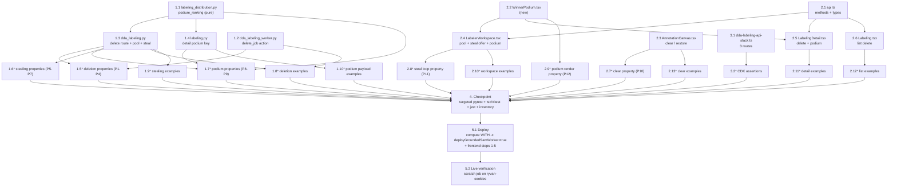

# Implementation Plan: Labeling Job Cleanup, Work Stealing, and Podium

## Overview

Four user-requested features over ten pre-existing implementation files plus one new component, worked as independent single-writer tracks that converge at one checkpoint, one flag-carrying deploy, and one live verification on the ryvan-cookies use case. The backend track adds the shared `podium_ranking` pure function, the `delete_job` worker action (artifacts → task items → job record, dataset sacrosanct), and the three `dda_labeling.py` routes (`DELETE /labeling/{id}`, labeler pool, labeler steal via `_conditional_reassign`-style conditional writes), plus the additive `podium` key on the DDA job detail payload. The frontend track adds the API client methods/types, the shared `WinnerPodium` component, the canvas clear/restore controls (provenance-tagged clearing with a one-level snapshot undo), the workspace steal-loop/podium completion view, and the delete controls on both job pages. Infrastructure registers the three routes in the DDA labeling nested stack (route-salted deployment rolls the stage; zero compute-stack changes). Twelve correctness properties land as property-based tests (Hypothesis / fast-check, ≥ 100 iterations, spec-tagged). **Zero pre-existing test amendments** — the pinned completion payload is bypassed via the new pool route, and every new payload key or UI surface is additive and invisible to existing fixtures.

Same-file discipline: `labeling_distribution.py` (1.1), `dda_labeling_worker.py` (1.2), `dda_labeling.py` (1.3), `labeling.py` (1.4), `api.ts` (2.1), `WinnerPodium.tsx` (2.2), `AnnotationCanvas.tsx` (2.3), `LabelerWorkspace.tsx` (2.4), `LabelingDetail.tsx` (2.5), `Labeling.tsx` (2.6), `dda-labeling-api-stack.ts` (3.1), and each new test file have exactly one writer task; no wave contains two writers of one file.

## Task Dependency Graph

```json
{
  "waves": [
    { "id": 0, "description": "Independent single-writer foundations: the shared ranking function, the worker delete action, the API client types, the podium component, the canvas clear/restore, and the route registrations.", "tasks": ["1.1", "1.2", "2.1", "2.2", "2.3", "3.1"] },
    { "id": 1, "description": "Consumers of wave 0: the dda_labeling.py routes (import the shared ranking), the detail-payload podium, the three pages (need api.ts + WinnerPodium), the canvas property/example suites, the podium component property, and the CDK assertions.", "tasks": ["1.3", "1.4", "2.4", "2.5", "2.6", "2.7", "2.9", "2.13", "3.2"] },
    { "id": 2, "description": "Suites against the wave-1 implementations: backend deletion/steal/podium property and example suites, the workspace steal-loop property and example suites, and the two job-page example suites.", "tasks": ["1.5", "1.6", "1.7", "1.8", "1.9", "1.10", "2.8", "2.10", "2.11", "2.12"] },
    { "id": 3, "description": "Routine-shaped deploy after the checkpoint — compute stack WITH the mandatory worker flag and the bare CloudFront domain, then the frontend bundle via deploy-frontend.sh steps 1-5 only.", "tasks": ["5.1"] },
    { "id": 4, "description": "Live verification on ryvan-cookies: seeded scratch job driven through steal, race, completion podium, deletion with dataset-intact proof, and the deployed clear control.", "tasks": ["5.2"] }
  ]
}
```



## Tasks

- [x] 1. Backend: shared ranking, deletion worker, labeling routes, detail podium
  - [x] 1.1 Add `podium_ranking` to the shared layer `labeling_distribution.py`
    - `podium_ranking(submissions)` over `(user_id, submitted_at)` pairs: group by user, aggregate `(count, max(submitted_at))`, sort by `(-count, final_ts, user_id)`, emit at most three `{'place': i+1, 'user_id', 'submitted', 'final_submitted_at'}` entries; pure, total, deterministic under input permutation, empty in → empty out
    - Module docstring extended with the Podium_Ranking contract and this spec's citation, beside `distribute`/`rebalance`
    - _Requirements: 7.1, 7.2, 7.3, 7.4, 7.6_

  - [x] 1.2 Add the `delete_job` action to `dda_labeling_worker.py`
    - Handler dispatch arm `action == 'delete_job'` → `delete_job_data(job_id)`
    - Guard first (the `retry_prelabels` re-check pattern): job absent or status != `Deleting` → `{'skipped': True}` with zero deletions (Req 2.5)
    - Cleanup in strict order: (a) paginate `list_objects_v2` over `PORTAL_ARTIFACTS_BUCKET` prefix `labeling/{usecase_id}/{job_id}/` and delete in `delete_objects` batches ≤ 1000 — the only S3 mutation, computed from the job record's own ids, no dataset-bucket client ever constructed (Req 3.1, 3.2, 3.5); (b) paginated tasks-table query on PK `job_id` + `batch_writer` deletes; (c) `delete_item` on the job record **last** (Req 2.1-2.4); every step idempotent for the re-trigger path (Req 2.8)
    - The Use_Case output bucket (`labeled/{job_id}/`) is never touched — manifest retained (Req 3.3); sibling jobs' items/prefixes untouched by construction of the key scoping (Req 3.4, 10.6)
    - Success → `job_deleted` audit event with `{usecase_id, tasks_deleted, artifact_objects_deleted}` (Req 2.7); any failure → conditional `status = DeleteFailed` + `failure_reason` (conditioned on still-Deleting) with already-deleted items left deleted (Req 2.6)
    - Zero new IAM: the worker role already holds table `grantReadWriteData` and artifacts-bucket `grantReadWrite`
    - _Requirements: 2.1, 2.2, 2.3, 2.4, 2.5, 2.6, 2.7, 2.8, 3.1, 3.2, 3.3, 3.4, 3.5, 10.6_

  - [x] 1.3 Add the deletion, pool, and steal routes to `dda_labeling.py`
    - Constants `DELETABLE_STATUSES = ('Completed', 'Failed', 'Stopped', 'DeleteFailed', 'Deleting')`, `STATUS_DELETING`, `STATUS_DELETE_FAILED`; router arms: `DELETE /labeling/{id}` (inside the existing `/labeling/` section with the scope already injected), `GET /labeler/jobs/{jobId}/pool`, `POST /labeler/jobs/{jobId}/steal` (labeler section)
    - `request_job_deletion` — `@rbac_check([MANAGE_LABELING_JOBS], allow_global=True)` (the stop-route posture, Req 1.6): 404 absent; 400 Ground Truth (SageMaker-managed wording); 400 non-deletable status naming the status and the stop-first path (Req 1.2-1.4); already-Deleting → re-invoke worker, 202 (Req 1.5); else conditional flip to Deleting with `delete_requested_by/at` (`ConditionExpression '#status = :prior'`; conditional failure → re-read and answer per the new status, Req 1.8), `job_delete_requested` audit (Req 1.7), `_invoke_labeling_worker({'action': 'delete_job', 'job_id': ...})`, 202 `{job_id, status: 'Deleting'}` (Req 1.1)
    - `_stealable_tasks(tasks, caller)` (status Assigned, assignee ∉ {caller, AUTO}, prelabel_status != Pending — Req 5.4) and `_steal_order(stealable, caller)` (UNASSIGNED first ascending task_id; then donors by descending count, ties ascending user id; ascending task_id within — Req 5.2), both pure
    - `steal_labeler_task` — labeler posture (`LABELING_TASKS_SELF` + current-membership denial with `_labeler_access_denied`, Req 5.7); non-InProgress → 409 naming the status (Req 5.6); walk the Steal_Order with one conditional update per candidate: `SET assignee_user_id = :caller, stolen_from = :donor, stolen_at = :now, updated_at = :now` under `'#status = :assigned AND assignee_user_id = :donor'` — a separate write from `_conditional_reassign`, which stays byte-identical (Req 5.3, 5.8, 10.2); condition failure → next candidate; first win → `task_stolen` audit + 200 `{task_id, job_id, stolen_from, stealable_count}` (Req 5.1); exhaustion → 409 none-remain with nothing changed (Req 5.5)
    - `get_labeler_job_pool` — same denial posture; one `_query_all_job_tasks` pass over active tasks: `stealable_count` (0 unless InProgress), `job_complete` (= all active Submitted with positive image_count), `podium` via the shared `podium_ranking` with team-member email join exactly when `job_complete` (Req 6.1, 7.5); the `GET /labeler/jobs/{jobId}/next` completion payload and every other shipped route stay byte-identical (Req 10.1)
    - _Requirements: 1.1, 1.2, 1.3, 1.4, 1.5, 1.6, 1.7, 1.8, 5.1, 5.2, 5.3, 5.4, 5.5, 5.6, 5.7, 5.8, 5.9, 6.1, 7.5, 10.1, 10.2_

  - [x] 1.4 Add the podium key to the DDA job detail payload in `labeling.py`
    - In `_get_dda_labeling_job`, after `member_progress`: when `team_id` present and status `Completed`, compute `job['podium']` from the already-queried active tasks' Submitted `(submitted_by, submitted_at)` pairs via the shared `podium_ranking`, joining emails from the already-queried team members (zero extra reads); key absent for every other job — additive only (Req 8.2, 10.4)
    - Import `podium_ranking` from the shared layer beside the existing shared imports
    - _Requirements: 7.5, 7.6, 8.2, 10.4_

  - [x]* 1.5 Write the deletion property tests
    - `edge-cv-portal/backend/tests/test_property_labeling_job_deletion.py` (new) — Hypothesis `@settings(max_examples=100, deadline=None)` over the moto-backed scaffolding (the `LabelerEnv` pattern from `test_dda_labeling_labeler_apis.py`) with a captured fake Lambda client and per-step failure injection; generators spanning backends, statuses, absent jobs, task populations, artifact object sets (nested keys, >1000 objects), and adversarial seeds (dataset objects, sibling jobs, `labeling-previews/`, output-bucket `labeled/{job_id}/`)
    - **Property 1: The Deletion_Route accepts exactly the deletable predicate** — **Validates: Requirements 1.1, 1.2, 1.3, 1.4, 1.5**
    - **Property 2: Completed deletion leaves zero traces of the job's own state** — **Validates: Requirements 2.1, 2.2, 2.3, 2.8**
    - **Property 3: Deletion is confined to the job's own artifact prefix** — **Validates: Requirements 3.1, 3.2, 3.3, 3.4, 3.5, 10.6**
    - **Property 4: Deletion failure and skip paths are total and ordered** — **Validates: Requirements 2.4, 2.5, 2.6**
    - _Requirements: 1.1, 1.2, 1.3, 1.4, 1.5, 2.1, 2.2, 2.3, 2.4, 2.5, 2.6, 2.8, 3.1, 3.2, 3.3, 3.4, 3.5, 10.6_

  - [x]* 1.6 Write the work-stealing property tests
    - `edge-cv-portal/backend/tests/test_property_labeling_work_stealing.py` (new) — Hypothesis over generated task populations (statuses, assignees including caller/teammates/UNASSIGNED/AUTO, prelabel states including Pending) with a reference Steal_Order oracle in the test and injected concurrent mutations (status flips, competing reassignments) between candidate selection and the conditional write
    - **Property 5: A Steal_Request succeeds exactly when a Stealable_Task exists and takes the Steal_Order minimum** — **Validates: Requirements 5.1, 5.2, 5.5, 5.6**
    - **Property 6: Steal races have one winner and never move protected tasks** — **Validates: Requirements 5.3, 5.4**
    - **Property 7: The Pool_Route reports the exact pool state** — **Validates: Requirements 6.1**
    - _Requirements: 5.1, 5.2, 5.3, 5.4, 5.5, 5.6, 6.1_

  - [x]* 1.7 Write the podium property tests
    - `edge-cv-portal/backend/tests/test_property_labeling_podium.py` (new) — Hypothesis over submission multisets (forced count ties, timestamp ties, permutations) for the pure function, and over job states (status × team × backend × skip-verification) with membership subsets for the detail payload, importing `labeling_distribution.podium_ranking` as the payload property's oracle
    - **Property 8: Podium_Ranking is the total deterministic order** — **Validates: Requirements 7.1, 7.2, 7.3, 7.4**
    - **Property 9: The detail payload carries the podium exactly for Completed team jobs, emails joined per membership** — **Validates: Requirements 7.5, 8.2, 10.4**
    - _Requirements: 7.1, 7.2, 7.3, 7.4, 7.5, 8.2, 10.4_

  - [x]* 1.8 Write the deletion example tests
    - `edge-cv-portal/backend/tests/test_dda_labeling_job_deletion.py` (new): non-admin 403 with scope injection observed (1.6); `job_delete_requested` / `job_deleted` audit fields and counts (1.7, 2.7); the 1.8 race (inject a status flip between read and write → answer per the new status); exact rejection wordings (Ground Truth, stop-first); worker skip on non-Deleting (2.5); DeleteFailed retry flow end-to-end (1.5, 2.6, 2.8)
    - _Requirements: 1.5, 1.6, 1.7, 1.8, 2.5, 2.6, 2.7_

  - [x]* 1.9 Write the work-stealing example tests
    - `edge-cv-portal/backend/tests/test_dda_labeling_work_stealing.py` (new, the labeler-apis denial patterns): non-member / missing / Ground Truth job → 403 + `labeler_access_denied` audit on both steal and pool (5.7, 6.1); `task_stolen` audit fields (5.8); steal then `GET /labeler/jobs/{jobId}/next` serves the stolen task (5.9); the shipped completion payload byte-identical with the pool route present (10.1)
    - _Requirements: 5.7, 5.8, 5.9, 6.1, 10.1_

  - [x]* 1.10 Write the podium payload example tests
    - `edge-cv-portal/backend/tests/test_dda_labeling_podium_payload.py` (new): a Completed team job's detail payload carries ranked entries with emails for current members and bare user ids for departed submitters (7.5); non-team, non-Completed, and skip-verification jobs carry no podium key (8.2, 10.4); `member_progress` and every other detail field unchanged (10.1)
    - _Requirements: 7.5, 8.2, 10.1, 10.4_

- [x] 2. Frontend: API client, podium component, canvas clear, workspace loop, job pages
  - [x] 2.1 Extend the API client in `api.ts`
    - `deleteLabelingJob(jobId)` → `DELETE /labeling/{id}`; `getLabelerJobPool(jobId)` → `GET /labeler/jobs/{jobId}/pool`; `stealTask(jobId)` → `POST /labeler/jobs/{jobId}/steal`
    - New types `PodiumEntry`, `LabelerJobPoolResponse`, `StealTaskResponse`; status unions gain `'Deleting' | 'DeleteFailed'`; doc comments cite this spec — all additive
    - _Requirements: 4.4, 6.1, 6.3, 8.2_

  - [x] 2.2 Create the `WinnerPodium` component
    - `edge-cv-portal/frontend/src/components/labeling/WinnerPodium.tsx` (new): props `{entries: PodiumEntry[]}`; empty list renders nothing (8.5); otherwise the 2nd | 1st | 3rd column layout with 1st tallest, medals 🥇🥈🥉, display name `email ?? user_id`, submitted count; testids `winner-podium`, `podium-place-{1|2|3}`
    - _Requirements: 8.4, 8.5_

  - [x] 2.3 Add clear/restore to `AnnotationCanvas.tsx`
    - `prelabelBitmapRef` snapshot right after the Segmentation prelabel painting in `handleImageLoad` (the provenance record); `prelabelSnapshotRef` + `prelabelsCleared` state
    - Clear_Prelabels_Control (testid `clear-prelabels`) rendered exactly when the Pre_Label is non-empty and not cleared (9.1); activation takes the Prelabel_Snapshot then removes Prelabel_Origin state per modality: prelabel-id boxes including re-classed ones (9.2), still-intact prelabel pixels (`bitmap[p] === prelabelBitmap[p]` → 0) plus remaining classless proposals with a `segVersion` bump (9.3), the untouched prelabel classification (9.4)
    - Restore_Control (testid `restore-prelabels`) replaces it after clearing; activation reinstates the snapshot wholesale and re-offers Clear (9.5); all state canvas-local — zero API calls (9.6); URL-refresh survival falls out of the existing `segInitializedRef` guard and preserved annotation state (9.8); submission reads the same state as always (9.7)
    - _Requirements: 9.1, 9.2, 9.3, 9.4, 9.5, 9.6, 9.7, 9.8_

  - [x] 2.4 Add the steal loop and completion podium to `LabelerWorkspace.tsx`
    - On each completion payload, fetch `getLabelerJobPool` into `pool` state: `job_complete` with entries → `<WinnerPodium/>` in the completion view (8.3); else `stealable_count > 0` → the take-work offer naming the count (testid `steal-task-button`) whose activation calls `stealTask` then `loadNextTask` (6.2, 6.3); re-fetched on every return to completion so the offer repeats until nothing is left (6.4); a none-remain 409 refetches the pool without an error alert (6.5); zero stealable and not complete → the existing completion message unchanged (6.6); pool fetch failure degrades to the existing view
    - _Requirements: 6.2, 6.3, 6.4, 6.5, 6.6, 8.3_

  - [x] 2.5 Add the delete control and podium to `LabelingDetail.tsx`
    - Exported `canDeleteDdaJob(job)` beside `canStopDdaJob` (DDA && status ∈ {Completed, Failed, Stopped, DeleteFailed}); header Delete button (testid `delete-job-button`; "Retry Delete" for DeleteFailed) → confirmation modal naming removed (task assignments, pre-label/annotation artifacts) vs retained (dataset images, training manifest) (4.1, 4.3, 4.6); confirm → `deleteLabelingJob` → refetch rendering Deleting (4.4); failure → error alert, job unchanged (4.5); no control for InProgress/Deleting (4.2); status maps gain Deleting / DeleteFailed (4.6)
    - Podium: `status === 'Completed' && rawJob.podium?.length` → a Winner Podium container with `<WinnerPodium/>` (8.1); absent otherwise (8.5)
    - _Requirements: 4.1, 4.2, 4.3, 4.4, 4.5, 4.6, 8.1, 8.5_

  - [x] 2.6 Add the list delete control to `Labeling.tsx`
    - Header actions gain Delete for the selected deletable DDA job (the same status predicate inline), sharing the confirmation wording (4.1, 4.3); confirm → `deleteLabelingJob` → list reload (Deleting shown; a completed deletion drops the row — 4.4, 4.7); `getStatusIndicator` map gains `deleting` / `delete_failed` (4.6)
    - _Requirements: 4.1, 4.2, 4.3, 4.4, 4.6, 4.7_

  - [x]* 2.7 Write the canvas clear/restore property test
    - `edge-cv-portal/frontend/src/components/labeling/AnnotationCanvas.clearprelabels.property.test.tsx` (new) — fast-check `{ numRuns: 100 }` rendering the canvas per run with generated modality/prelabel payloads and scripted pointer edits (drawn boxes, class edits, brush/eraser strokes, classification changes), an apiService spy asserting zero mutations
    - **Property 10: Clear removes exactly Prelabel_Origin state and restore is its inverse** — **Validates: Requirements 9.1, 9.2, 9.3, 9.4, 9.5, 9.6**
    - _Requirements: 9.1, 9.2, 9.3, 9.4, 9.5, 9.6_

  - [x]* 2.8 Write the workspace steal-loop property test
    - `edge-cv-portal/frontend/src/pages/labeler/LabelerWorkspace.steal.property.test.tsx` (new) — fast-check `{ numRuns: 100 }` with a mocked `apiService` Proxy scripting pool/steal/next sequences (counts, job_complete±podium, steal successes and none-remain 409s)
    - **Property 11: The completion view drives the steal loop from the pool state** — **Validates: Requirements 6.2, 6.3, 6.4, 6.5, 6.6, 8.3**
    - _Requirements: 6.2, 6.3, 6.4, 6.5, 6.6, 8.3_

  - [x]* 2.9 Write the podium rendering property test
    - `edge-cv-portal/frontend/src/components/labeling/WinnerPodium.property.test.tsx` (new) — fast-check `{ numRuns: 100 }` over entry lists of length 0-3 with and without emails
    - **Property 12: The Winner_Podium renders its entries faithfully and only when non-empty** — **Validates: Requirements 8.4, 8.5**
    - _Requirements: 8.4, 8.5_

  - [x]* 2.10 Write the workspace example tests
    - `edge-cv-portal/frontend/src/pages/labeler/LabelerWorkspace.pool.test.tsx` (new): offer wiring with the count text, podium-on-complete replacing the offer, none-remain refresh without error, pool-failure degradation to the existing completion view, existing completion message untouched when nothing applies
    - _Requirements: 6.2, 6.3, 6.5, 6.6, 8.3_

  - [x]* 2.11 Write the detail-page example tests
    - `edge-cv-portal/frontend/src/pages/LabelingDetail.deletepodium.test.tsx` (new): `canDeleteDdaJob` per status (`it.each` across InProgress/Completed/Failed/Stopped/Deleting/DeleteFailed and Ground Truth), dialog removed/retained wording, confirm → API call → Deleting render, failure alert, DeleteFailed retry label, Deleting/DeleteFailed status indicators, podium container for a Completed payload and its absence otherwise
    - _Requirements: 4.1, 4.2, 4.3, 4.4, 4.5, 4.6, 8.1, 8.5_

  - [x]* 2.12 Write the list-page example tests
    - `edge-cv-portal/frontend/src/pages/Labeling.delete.test.tsx` (new): delete control enabled exactly for a selected deletable DDA job, confirmation flow issuing the API call and reloading, `deleting` / `delete_failed` status indicators, deleted job absent after reload
    - _Requirements: 4.1, 4.2, 4.4, 4.6, 4.7_

  - [x]* 2.13 Write the canvas clear example tests
    - `edge-cv-portal/frontend/src/components/labeling/AnnotationCanvas.clearprelabels.test.tsx` (new): post-clear submission carries exactly the on-canvas state through the existing validation path (9.7); a URL refresh after clearing preserves the cleared state and the Restore_Control (9.8); control absent without a Pre_Label (9.1)
    - _Requirements: 9.1, 9.7, 9.8_

- [x] 3. Infrastructure: the three routes in the DDA labeling nested stack
  - [x] 3.1 Register the routes in `dda-labeling-api-stack.ts`
    - `addMethod(labelingJobResource, 'DELETE')` with `ddaLabelingIntegration` on the imported `/labeling/{id}` resource (its OPTIONS preflight is owned by the ApiGatewayStack); hoist the existing inline `labelerJobsResource.addResource('{jobId}')` to a named const (template-identical) and add `pool` (GET) and `steal` (POST) sub-resources; route-table doc comment gains the three routes; the route-salted `CfnDeployment` logical id changes by construction, rolling the stage
    - Zero compute-stack changes: handler env, grants, and tables already wired
    - _Requirements: 1.1, 1.6, 5.1, 6.1_

  - [x]* 3.2 Write the CDK assertion tests
    - `edge-cv-portal/infrastructure/test/labeling-cleanup-infra.test.ts` (new, the workflow-manager-gaps-infra.test.ts synth pattern): the DdaLabelingApiStack nested template carries the DELETE method on the imported `/labeling/{id}` resource id and the `pool`/`steal` methods under `/labeler/jobs/{jobId}`, each `COGNITO_USER_POOLS`-authorized with the DdaLabelingHandler integration; the compute-stack template shows no diff from this feature
    - _Requirements: 1.1, 5.1, 6.1_

- [x] 4. Checkpoint — Ensure all tests pass, ask the user if questions arise
  - Backend (targeted, per the repo's known-pollution posture — never the full session): `cd edge-cv-portal/backend && python3 -m pytest tests/test_property_labeling_job_deletion.py tests/test_property_labeling_work_stealing.py tests/test_property_labeling_podium.py tests/test_dda_labeling_job_deletion.py tests/test_dda_labeling_work_stealing.py tests/test_dda_labeling_podium_payload.py tests/test_dda_labeling_labeler_apis.py tests/test_dda_labeling_submission_apis.py tests/test_dda_labeling_membership_reassignment.py tests/test_dda_labeling_worker_distribute.py tests/test_dda_labeling_worker_generate_manifest.py tests/test_dda_labeling_create_job.py tests/test_labeling_stop_route.py tests/test_labeling_backend_switch.py tests/test_dda_labeling_teams.py -q`
  - Frontend: `cd edge-cv-portal/frontend && npx tsc --noEmit -p tsconfig.json && npx vitest run`
  - Infrastructure: `cd edge-cv-portal/infrastructure && npx jest`
  - Non-regression inventory (Req 10.5 — zero rebaseline): **no pre-existing test file is modified**; the only pre-existing implementation files with diffs are `dda_labeling.py`, `dda_labeling_worker.py`, `labeling.py`, `labeling_distribution.py`, `api.ts`, `AnnotationCanvas.tsx`, `LabelerWorkspace.tsx`, `LabelingDetail.tsx`, `Labeling.tsx`, `dda-labeling-api-stack.ts`; `dda_autolabel_worker.py`, `grounded-sam-worker/`, `compute-stack.ts`, `PromptTuningPreview.tsx`, `PreviewResultCanvas.tsx`, `promptOverrideGuardrails.tsx` show **no diff**; the pinned completion-payload test and every neighboring shipped suite pass byte-identical; if any pre-existing assertion has to change, stop and raise it as a design violation
  - _Requirements: 10.1, 10.2, 10.3, 10.4, 10.5, 10.6_

- [ ] 5. Deploy and verify live
  - [~] 5.1 Deploy the compute stack (worker flag MANDATORY, bare CloudFront domain) and the frontend
    - Follow `.kiro/steering/builds.md` gates first: `pgrep -af "gdk component build"` and `pgrep -af "build-custom.sh"` must both be empty — portal deploys never overlap component builds
    - From `edge-cv-portal/infrastructure`, inspect before deploying: `npx cdk diff EdgeCVPortalComputeStack -c deployGroundedSamWorker=true -c cloudFrontDomain=d23v4ltibogb5x.cloudfront.net` — expect the backend asset update and the DdaLabelingApiStack route/deployment changes, and **no** `DdaGroundedSamWorker` replacement/deletion and **no** unexpected env churn on the handlers
    - Deploy: `npx cdk deploy EdgeCVPortalComputeStack -c deployGroundedSamWorker=true -c cloudFrontDomain=d23v4ltibogb5x.cloudfront.net --require-approval never` — **the `-c deployGroundedSamWorker=true` flag is MANDATORY: a flag-less deploy DELETES the live grounded-sam worker; this has happened three times** — and **`cloudFrontDomain` must be the BARE domain: an `https://`-prefixed value corrupts the live CORS/env configuration (verified 2026-09-07)**
    - Frontend: do **not** run `./deploy-frontend.sh` end-to-end — its step 6 runs an internal flag-less `cdk deploy` (the exact worker-deletion hazard). Execute steps 1-5 manually from `edge-cv-portal/frontend`: regenerate `config.json` from stack outputs, `npm ci`, `npx vite build`, the S3 sync with the script's cache-control split, and the CloudFront invalidation
    - Capture both to spec-named tee logs, e.g. `edge-cv-portal/deploy-labeling-job-cleanup-work-stealing-and-podium-$(date -u +%Y%m%dT%H%M%SZ).log`; after deploying, handle the `cdk.out` drift guards per builds.md before any subsequent component build
    - _Requirements: 1.1, 5.1, 6.1, 10.3_

  - [~] 5.2 Live verification — scratch job driven through steal, podium, and deletion on ryvan-cookies
    - Account 164152369890, us-east-1, portal `https://d23v4ltibogb5x.cloudfront.net`, rest-api `yqvyoowugk`, Use_Case `645504ce-a60a-4009-8349-7548c0025cd3` (dataset `s3://ryvan-cookies`). Method: synthesized API-Gateway-shaped events against the **deployed** `DdaLabelingHandler` (the `.kiro/specs/grounded-sam-prompt-tuning-preview/verification-notes.md` §1 precedent: `requestContext.authorizer.claims` with real-table RBAC/membership resolution). Record everything in `.kiro/specs/labeling-job-cleanup-work-stealing-and-podium/verification-notes.md`
    - **Seed a scratch Classification team job** in the live tables: a scratch team with two synthetic member subs (MEMBER# items), a small job (e.g. 4 images from `training-images/`), tasks split between members A and B (B's already Submitted), plus 2-3 synthetic artifact objects under the job's `labeling/{usecase}/{job}/` prefix; record the dataset-prefix object count under `s3://ryvan-cookies/training-images/` before anything runs
    - **Work stealing**: as B (fabricated claims), `GET .../pool` → `stealable_count` matches A's Assigned count; `POST .../steal` → 200 with `stolen_from = A`, the task item shows B + `stolen_from`/`stolen_at`; race attempt: flip the next Steal_Order candidate to Submitted directly, steal again → the flipped task untouched, the following candidate taken (or none-remain when exhausted); `GET .../next` as B serves the stolen task
    - **Podium**: submit all remaining tasks through the deployed submit route as A and B → job reaches Completed via the real manifest generation; `GET /labeling/{id}` (admin claims) → `podium` places match the submitted counts with the tie-break order; `GET .../pool` as a member → `job_complete: true` with the same podium
    - **Deletion**: `DELETE /labeling/{id}` (admin claims) → 202 Deleting → poll until the job record is gone; verify the tasks-table query returns zero items, the job's artifact prefix lists zero objects, the dataset-prefix object count is **unchanged** from the pre-run count, and the output bucket's `labeled/{job_id}/` manifest from the completion step is retained; delete the scratch team through the teams API afterwards
    - **Clear pre-labels**: the deployed bundle carries the control (the bundle-grep precedent: fetch the hashed `index-*.js` from CloudFront and grep for `clear-prelabels` / `restore-prelabels`), plus a portal UI spot check on a prelabel-bearing task if one is available
    - _Requirements: 2.1, 2.2, 2.3, 3.1, 3.3, 5.1, 5.3, 5.9, 6.1, 7.1, 8.2, 9.1_

## Notes

- Tasks marked with `*` are optional test tasks and can be skipped for a faster MVP; the checkpoint's inventory assumes they ran
- Every correctness property from the design has exactly one property-based test (12 total), in the file the design's table names, at ≥ 100 iterations (`@settings(max_examples=100, deadline=None)` / `{ numRuns: 100 }`), tagged `Feature: labeling-job-cleanup-work-stealing-and-podium, Property {n}: {title}`
- **Zero rebaseline (Req 10.5):** this spec declares no pre-existing test amendments at all — the pinned `GET /labeler/jobs/{jobId}/next` completion payload is deliberately bypassed via the new pool route, and every new key/surface is additive; if any pre-existing assertion has to change during implementation, stop and raise it as a design violation
- `dda_autolabel_worker.py` (generation logic), `grounded-sam-worker/`, `compute-stack.ts`, and the just-shipped preview machinery (`PromptTuningPreview.tsx`, `PreviewResultCanvas.tsx`) are deliberately untouched — the checkpoint verifies no diff
- The steal write is deliberately a separate conditional update from `_conditional_reassign` (which stays byte-identical for the membership flows); both rely on the same DynamoDB condition semantics, which is what makes two stealers, or a steal racing a submit, safe by adjudication
- Deletion's dataset safety is structural (the only S3 mutation lists-then-deletes under the job's own artifacts-bucket prefix; no dataset-bucket client is ever constructed) and Property 3 pins it adversarially; the output manifest under `labeled/{job_id}/` is deliberately retained (registered-training-dataset safety)
- The deploy is routine-shaped but flag-critical: **never** run a compute deploy (including deploy-frontend.sh's step 6) without `-c deployGroundedSamWorker=true` while the worker must stay live, and **always** pass the bare `cloudFrontDomain` (no `https://` prefix)
- **Same-file scheduling:** `labeling_distribution.py` is written only by 1.1, `dda_labeling_worker.py` only by 1.2, `dda_labeling.py` only by 1.3, `labeling.py` only by 1.4, `api.ts` only by 2.1, `WinnerPodium.tsx` only by 2.2, `AnnotationCanvas.tsx` only by 2.3, `LabelerWorkspace.tsx` only by 2.4, `LabelingDetail.tsx` only by 2.5, `Labeling.tsx` only by 2.6, `dda-labeling-api-stack.ts` only by 3.1, and each new test file by exactly one task — no wave contains two writers of one file
