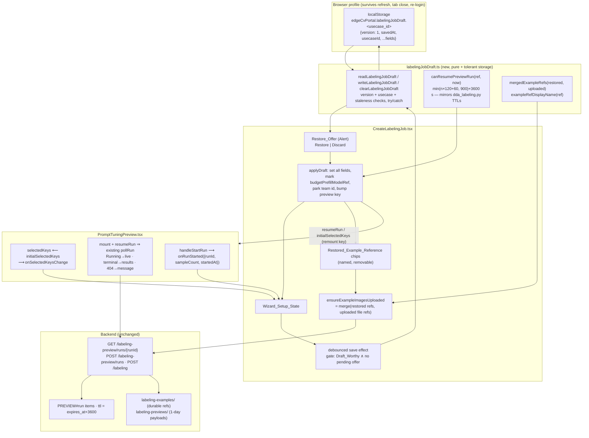

# Design Document — Labeling Setup Session Recovery

## Overview

This feature is frontend-only: one new pure module (`labelingJobDraft.ts`) plus targeted changes to two existing components (`CreateLabelingJob.tsx`, `PromptTuningPreview.tsx`). No backend, API, route, or infrastructure change — the server side already provides everything recovery needs: preview runs execute as async Lambda self-invokes and stay pollable via `GET /labeling-preview/runs/{runId}`, and example images are staged to durable S3 refs before either flow consumes them.

Six decisions shape the design:

- **Storage logic lives in a new pure module, not in the 1933-line wizard.** `edge-cv-portal/frontend/src/pages/labelingJobDraft.ts` owns the draft type, the storage key derivation, the versioned tolerant read/write/clear accessors, the staleness and resume-window rules, and the example-ref merge helpers. Rationale: every one of those is a pure function or a try/catch storage accessor — independently property-testable without rendering the wizard — and `CreateLabelingJob.tsx` is the repo's hot file (five pinned test suites; three specs landed on it recently), so the smaller its diff, the safer the change. The module follows the exact helper shape of the TestPanel precedent (`readPersistedTestRun` / `persistTestRun` / `clearPersistedTestRun`, `TestPanel.tsx` ~lines 134-186), extended with a schema version and staleness policy.

- **The draft is written by one debounced effect gated on pristine-inequality; the offer suppresses it.** A single `useEffect` watches the persisted fields, debounced by an exported `DRAFT_SAVE_DEBOUNCE_MS`, builds the draft object, and skips the write when the draft equals the Pristine_State's draft for the same entry context (Requirement 1.2 — visiting the page never creates a draft) or when a Restore_Offer is unresolved for the current use case (Requirement 1.3 — new keystrokes cannot clobber the draft being offered). The offer itself is state-driven — `{usecaseId, draft} | null`, rendered while it matches the selected use case — with a once-per-use-case read guard modeled on TestPanel's `resumedUsecaseRef`. Switching use cases hides a pending offer without resolving it (saves for the *other* use case proceed under its own key; the offered draft's key receives no writes until its offer is resolved). Rationale: pristine-inequality is one uniform, property-testable rule instead of a per-field "was touched" bookkeeping, and the suppression scope is exactly the invariant Requirement 1.3 states.

- **Example images are recovered as refs, merged inside `ensureExampleImagesUploaded`.** The draft persists, per designation, the Restored_Example_References still in the form followed by the Current_Upload_Refs — the `exampleUploadCache` URIs, but only while the cache's identity key matches the currently staged files, so the draft never carries refs of a file set the Job_Creator has since changed (a stale cache resurrecting pruned examples would be worse than losing not-yet-uploaded ones; recoverability begins at the next preview run, which re-uploads and re-caches). On restore, refs become removable named chips under the existing FileUpload controls. The merge (`restored refs first, newly uploaded refs after, per designation`) happens inside the wizard's `ensureExampleImagesUploaded`, whose return value both the preview run and job submission already consume — so neither consumer changes at all, and positions/designations flow through the existing `fewShotExamplesFromRefs` unchanged (Requirements 4.2, 4.3). `File` objects are never fabricated. Duplicating file *bytes* into IndexedDB (which technically can hold Blobs) was rejected: it adds a second storage engine and quota handling to duplicate data that becomes durable in S3 the moment it matters, and refs are the canonical form both flows consume anyway.

- **Preview resumption reuses the existing poll loop through optional props, inside a backend-derived window.** `PromptTuningPreview` gains four optional props — `initialSelectedKeys`, `onSelectedKeysChange`, `resumeRun`, `onRunStarted` — following the component's established optional-callback pattern (`onDownscaleMaxEdgeChange` / `onTokenBudgetChange`: "the control still operates without it"). On mount with `resumeRun` present, the component calls its existing `pollRun` once: a Running run renders progressively exactly as an own-started run, a terminal run re-displays its results on the first poll (payload URLs are presigned per status request), and a 404 lands on the existing "no longer available" message. The wizard resumes only when the run started within `previewRunResumeWindowMs(sampleCount)` = `min(sampleCount×120+60, 900) + 3600` seconds — the exact `expires_at` derivation plus TTL grace of `dda_labeling.py` (`PREVIEW_PER_SAMPLE_SECONDS`, `PREVIEW_LOCK_SLACK_SECONDS`, `PREVIEW_LOCK_TTL_MAX_SECONDS`, `PREVIEW_ITEM_TTL_GRACE_SECONDS`), which is the period DynamoDB guarantees the RUN item has not been reaped (`get_preview_run` checks only existence and ownership, so within the window the poll is answerable; beyond it, reaping is best-effort and the reference is dropped silently rather than greeting the user with an error) (Requirements 5.1, 5.5). The wizard keeps the last run's reference in the draft *without* clearing it on completion — unlike TestPanel's clear-once-seen — because re-displaying a completed run's results after a refresh is precisely the reported loss.

- **Restore must survive the wizard's own reactive effects.** Three effects in `CreateLabelingJob.tsx` would silently fight a naive restore, and the design defuses each: (1) the token-budget pre-fill effect replaces the budget whenever `budgetPrefillModelRef.current !== autoLabelModel` — restore therefore sets `budgetPrefillModelRef.current` to the restored model in the same synchronous apply, so the restored budget entry is presented, not clobbered (Requirement 3.3); (2) the teams-loading effect nulls `selectedTeam` when it starts — restore therefore parks the draft's team id in a pending ref and a small follow-up effect re-selects it once `labelingTeams` arrives, leaving the team unselected when the id is gone (Requirement 3.4); (3) `PromptTuningPreview` initializes its selection state at mount — restore therefore bumps a React `key` on the preview so it remounts with `initialSelectedKeys` and `resumeRun` applied deterministically. The modality-compatibility and few-shot-gating effects need no defusing: a saved draft already satisfied them, and re-running them over restored values is the identity.

- **Existing test suites gain storage cleanup only — nothing else changes in them.** The five pinned `CreateLabelingJob*` suites and the two `PromptTuningPreview` suites type into wizard fields, which now (debounced) writes drafts into jsdom's shared-per-file localStorage; a later test in the same file would otherwise mount onto a leftover draft and see an unexpected Restore_Offer. Each existing suite's `beforeEach` gains exactly one line (`window.localStorage.clear()` — the established repo pattern: `TestPanel.test.tsx` line 154, `Devices.registrations.test.tsx` line 117), and **no pre-existing assertion changes** — the zero-rebaseline rule applies to assertions, and this is deterministic test hygiene, not a rebaseline. The one deliberate rendered-surface addition to the preview (the clear-selection control, Requirement 5.8) is additive next to the selection summary and collides with no existing query in those suites.

**Considered and rejected — a server-side draft API.** Cross-device recovery is real value, but it changes nothing about the reported loss (same-browser refresh/expiry), requires a new route, table schema, and RBAC surface, and still cannot restore never-uploaded `File` objects. With localStorage the whole feature ships in the frontend bundle; a later server-side draft can *adopt* this draft schema as its wire shape. Also rejected: intercepting `beforeunload` (unreliable, hostile UX, does nothing for crashes) and `sessionStorage` (dies with the tab — the tab-close case is half the problem).

### Research notes informing the design

- **TestPanel resume precedent** (`edge-cv-portal/frontend/src/pages/workflows/TestPanel.tsx` ~lines 134-186, 598-612; tested by `TestPanel.test.tsx` "run resumption across navigation", ~lines 696-800): storage key `edgeCvPortal.activeTestRun`; `readPersistedTestRun` shape-checks parsed JSON field-by-field inside try/catch and returns null on anything unexpected; persist/clear swallow storage exceptions; a `resumedUsecaseRef` guards resume-once-per-use-case; the marker is validated against the current use case before use. This design reuses every one of those moves.
- **Preview persistence TTLs** (`edge-cv-portal/backend/functions/dda_labeling.py` ~lines 3150-3185, 3408-3465): RUN item `expires_at = now + min(sample_count×120 + 60, 900)` s, DynamoDB `ttl = expires_at + 3600` s ("Grace period … so an item stays readable for diagnosis after it expires"); DynamoDB never reaps before `ttl`, best-effort after. `get_preview_run` (~line 4535) checks only existence and `created_by` — no `expires_at` comparison — so within `ttl` the run is answerable, including terminal runs whose results re-presign per request (`PREVIEW_RESULT_URL_EXPIRY_SECONDS = 900`, generated per status call). Result payloads live under `labeling-previews/` in the artifacts bucket with a 1-day lifecycle expiration (`storage-stack.ts` ~lines 761-770). A foreign or unknown run answers one fixed 404 — which also covers the shared-browser-profile case: another user's draft can never read the first user's run.
- **Example refs are durable and bucket-validated only** (`dda_labeling.py` ~line 3930): "example images live under `labeling-examples/` in the Use_Case data bucket, not under the dataset prefix" — the data bucket has no lifecycle rule on that prefix, and validation is bucket-membership only. So refs restored under the *same* use case remain valid indefinitely; refs must not cross use cases (hence Requirement 4.5's discard-on-use-case-change).
- **Upload cache identity** (`CreateLabelingJob.tsx` ~lines 700-790): `exampleFilesKey` fingerprints `[name, size, type, lastModified]` per staged file; `exampleUploadCache` (a ref) holds `{key, uris:{good,bad}}` from the last upload; `ensureExampleImagesUploaded` reuses the cache when the key matches. "Cache is current" is therefore a cheap, exact equality this design reuses as the persist-refs condition.
- **Preview selection semantics** (`PromptTuningPreview.tsx` ~lines 420-470, 640-700): `selectedKeys` is a plain ordered string array; keys off the current listing page still count toward the cap and ride the next run ("retained across pages and across runs") — so restoring keys as strings is exactly consistent with existing behavior; the one gap is that a key absent from every page cannot be *des*elected, which motivates the clear-selection control (Requirement 5.8).
- **Token-budget pre-fill hazard** (`CreateLabelingJob.tsx` ~lines 376-405): the compatibility effect replaces `tokenBudget` with the catalog `token_limit` whenever `budgetPrefillModelRef.current !== autoLabelModel` — the restore path must pre-mark the ref or every restored budget is overwritten on the next render.
- **Cloudscape `Alert`** (`@cloudscape-design/components` ^3.0.0) supports an `action` slot for buttons; rendered without `dismissible` it presents exactly the two explicit actions the Restore_Offer requires.
- **Render-level fast-check precedent**: `CreateLabelingJob.modelpicker.property.test.tsx` mounts the full wizard once per run at `{ numRuns: 100 }` — so a restore-fidelity property that mounts, restores, and inspects submission payloads is within the established CI budget.

## Architecture



Everything below the `BACKEND` line is untouched; everything above it only reads wizard state and writes browser storage — the submission and preview request builders are not on any new code path.

## Components and Interfaces

### 1. New module — `edge-cv-portal/frontend/src/pages/labelingJobDraft.ts`

All constants exported for tests; every accessor tolerant (try/catch → absence, never throws).

```typescript
/** Storage key prefix; one draft per use case (Requirement 1.1). */
export const LABELING_JOB_DRAFT_STORAGE_PREFIX = 'edgeCvPortal.labelingJobDraft.';
export function labelingJobDraftKey(usecaseId: string): string;

/** Schema version this module reads and writes (Requirement 6.2). */
export const LABELING_JOB_DRAFT_VERSION = 1;

/** Draft_Staleness_Bound: 14 days in milliseconds (Requirement 6.3). */
export const DRAFT_STALENESS_MS = 14 * 24 * 60 * 60 * 1000;

/** Debounce for the wizard's save effect (Requirement 1.1). */
export const DRAFT_SAVE_DEBOUNCE_MS = 750;

/**
 * Resume_Window: mirrors dda_labeling.py — expires_at = start +
 * min(n×120+60, 900) s (PREVIEW_PER_SAMPLE_SECONDS, PREVIEW_LOCK_SLACK_SECONDS,
 * PREVIEW_LOCK_TTL_MAX_SECONDS) plus PREVIEW_ITEM_TTL_GRACE_SECONDS = 3600 s;
 * DynamoDB never reaps before that, so within the window the run is readable
 * (Requirements 5.1, 5.5).
 */
export function previewRunResumeWindowMs(sampleCount: number): number;
export function canResumePreviewRun(
  ref: PreviewRunReference | null | undefined, nowMs: number
): boolean;

export interface RestoredExampleRef { ref: string }   // s3://bucket/key
export interface PreviewRunReference {
  runId: string; sampleCount: number; startedAtMs: number;
}

export interface LabelingJobDraft {
  version: 1;
  savedAtMs: number;
  usecaseId: string;
  activeStepIndex: number;                     // clamped 0..5 on read
  labelingBackend: '' | 'DDA' | 'GroundTruth';
  jobName: string;  description: string;
  datasetS3Uri: string;  maskPrefix: string;
  taskTypeValue: string;                       // '' when none
  workforceTypeValue: string;
  labelCategories: string;  gtInstructions: string;
  enableAutomatedLabeling: boolean;
  ddaLabels: string[];  ddaInstructions: string;
  selectedTeam: { teamId: string; teamName: string } | null;
  autoLabelEnabled: boolean;
  autoLabelModel: string;                      // recorded value, verbatim (Req 2.2)
  detectionPrompt: string;  fewShotEnabled: boolean;
  downscaleMaxEdge: number | null;  tokenBudget: string;
  skipVerification: boolean;  skipVerificationModelId: string;
  perLabelPrompts: Record<string, string>;
  exampleRefs: { good: string[]; bad: string[] };   // Merged_Example_Refs (Req 2.3)
  previewSelectedKeys: string[];               // Sample_Selection (Req 2.4)
  previewRun: PreviewRunReference | null;      // (Req 2.4)
}

/**
 * Tolerant read: null for absent key, unparsable JSON, wrong version, a
 * usecaseId differing from the key's, or a non-conforming shape; a draft
 * staler than DRAFT_STALENESS_MS is purged and reported as null
 * (Requirements 6.2, 6.3, 6.5). Never throws.
 */
export function readLabelingJobDraft(usecaseId: string, nowMs?: number): LabelingJobDraft | null;
export function writeLabelingJobDraft(usecaseId: string, draft: LabelingJobDraft): void;
export function clearLabelingJobDraft(usecaseId: string): void;

/** Deep equality of two drafts ignoring savedAtMs — the save gate (Req 1.2). */
export function draftsEquivalent(a: LabelingJobDraft, b: LabelingJobDraft): boolean;

/**
 * Merged_Example_Refs: restored-first concatenation per designation
 * (Requirements 2.3, 4.3). Pure.
 */
export function mergedExampleRefs(
  restored: { good: string[]; bad: string[] },
  uploaded: { good: string[]; bad: string[] }
): { good: string[]; bad: string[] };

/** Display name of a Restored_Example_Reference: the ref's basename (Req 4.1). */
export function exampleRefDisplayName(ref: string): string;
```

Read-side shape validation is field-by-field (the TestPanel pattern scaled up): every scalar type-checked, arrays element-checked, unknown extra keys ignored, `activeStepIndex` clamped to 0..5, `previewRun` accepted only as `{runId: string, sampleCount: number, startedAtMs: number}`. Any violation → null (Requirement 6.2).

### 2. Wizard — `edge-cv-portal/frontend/src/pages/CreateLabelingJob.tsx`

New state and refs (beside the existing state block, ~line 190):

- `restoredExampleRefs: {good: string[]; bad: string[]}` — Restored_Example_References still in the form (start `{good: [], bad: []}`).
- `previewSelectedKeys: string[]` and `previewRunRef: PreviewRunReference | null` — write-through mirrors fed by the preview's callbacks, serialized into the draft.
- `draftOffer: {usecaseId: string; draft: LabelingJobDraft} | null` — the pending Restore_Offer; rendered while `draftOffer.usecaseId === selectedUseCase?.usecase_id`.
- `previewRestoreNonce: number` — React `key` for the preview; incremented by a restore to force a deterministic remount.
- Refs: `draftReadUsecases` (Set — once-per-use-case read guard, the `resumedUsecaseRef` pattern), `pendingTeamRestoreRef: string | null`, `restoredPreviewRun: PreviewRunReference | null` (passed as `resumeRun` on the next preview mount), `draftClearedRef: boolean`.

**Draft read effect** (new, after the use-case resolution effect ~line 246): when `selectedUseCase` resolves and its id is not in `draftReadUsecases`, mark it, `readLabelingJobDraft(id)`; a draft sets `draftOffer` (Requirement 3.1).

**Debounced save effect** (new): watches exactly the persisted fields plus `restoredExampleRefs`, `previewSelectedKeys`, `previewRunRef`; after `DRAFT_SAVE_DEBOUNCE_MS`, builds the draft via a component-local `buildDraft()` (assembling `exampleRefs = mergedExampleRefs(restoredExampleRefs, cacheCurrent ? exampleUploadCache.current.uris : {good: [], bad: []})` where `cacheCurrent = exampleUploadCache.current?.key === exampleFilesKey` — Requirement 2.3) and writes it unless: no `selectedUseCase`; `draftOffer` pending for this use case (Requirement 1.3); `draftClearedRef` set (post-create); or `draftsEquivalent(draft, pristineDraft)` where `pristineDraft` is memoized once per entry context from the same builder over initial values (Requirement 1.2). Cleanup cancels the timer.

**Restore apply** (new function, invoked by the offer's Restore action — Requirement 3.2):

1. Synchronously set every Requirement 2.1 field from the draft (`taskType` reconstructed from the static `taskTypeOptions` by value; unknown value → null). Skip-verification fields are applied only when `isAdmin`, otherwise restored disabled/empty (Requirement 3.6).
2. `budgetPrefillModelRef.current = draft.autoLabelModel` — presents the restored budget instead of the pre-fill (Requirement 3.3).
3. `pendingTeamRestoreRef.current = draft.selectedTeam?.teamId ?? null` — a small new effect watches `labelingTeams` and, when the pending id is present, selects `{label: team_name, value: team_id}` and clears the pending ref; when loading settles without it, clears the pending ref leaving the team unselected (Requirement 3.4).
4. `setRestoredExampleRefs(draft.exampleRefs)`, `setPreviewSelectedKeys(draft.previewSelectedKeys)`; `restoredPreviewRun = canResumePreviewRun(draft.previewRun, Date.now()) ? draft.previewRun : null` (Requirement 5.5 drops silently).
5. `setPreviewRestoreNonce(n => n + 1)`; clear `draftOffer` — saving resumes (Requirement 3.2).

The offer's Discard action calls `clearLabelingJobDraft(id)` and clears `draftOffer`, touching no other state (Requirement 3.7). The offer renders as a non-dismissible Cloudscape `Alert` above the existing error Alert (~line 1855) with `action` = Restore draft / Discard buttons and the draft's save time in the text.

**Restored-example chips** (new UI under each FileUpload field, ~lines 1390-1425): for each `restoredExampleRefs.good|bad` entry, a token/chip showing `exampleRefDisplayName(ref)` with a remove control filtering it out of state (Requirement 4.1). Combined counts replace file-only counts everywhere they gate or inform: `exampleImageCount = restored.good+restored.bad+goodExampleFiles+badExampleFiles` (attach/omit hint, few-shot at-least-one rule), per-designation limit checks and the review-step counts use `restored.<kind>.length + <kind>ExampleFiles.length` (Requirement 4.2), and `PromptTuningPreview`'s `goodExampleCount`/`badExampleCount` props receive the combined per-designation counts.

**Merged refs into both flows** (Requirement 4.3): `ensureExampleImagesUploaded` returns `mergedExampleRefs(restoredExampleRefs, await uploadFiles())` — the upload cache and upload path stay byte-identical for the files themselves; preview and submission consume the function's result exactly as today, so the DDA submission's `example_images` and `few_shot.examples` (via the unchanged `fewShotExamplesFromRefs`) carry restored-first merged refs with per-designation positions.

**Use-case change discard** (Requirement 4.5): the effect that reacts to `selectedUseCase` change resets `restoredExampleRefs` to empty when the id moves away from the one they were restored under.

**Clear on success** (Requirement 6.1): in `handleSubmit`, after `createLabelingJob` resolves (both branches), set `draftClearedRef.current = true` and `clearLabelingJobDraft(selectedUseCase.usecase_id)` before `navigate('/labeling')`.

**Preview wiring** (~line 1600): `<PromptTuningPreview key={previewRestoreNonce} ... initialSelectedKeys={previewSelectedKeys} onSelectedKeysChange={setPreviewSelectedKeys} resumeRun={restoredPreviewRun} onRunStarted={(ref) => {setPreviewRunRef(ref); restoredPreviewRun = null;}} />` — `onRunStarted` replaces the persisted reference (Requirement 5.6).

### 3. Preview — `edge-cv-portal/frontend/src/components/labeling/PromptTuningPreview.tsx`

Four new optional props on `PromptTuningPreviewProps` (all absent → behavior byte-identical to today, Requirement 7.5):

```typescript
/** Initial Sample_Selection, e.g. restored from a Setup_Draft (Req 5.7). */
initialSelectedKeys?: string[];
/** Notified with the full ordered selection on every change (Req 2.4). */
onSelectedKeysChange?: (keys: string[]) => void;
/** A Preview_Run to resume polling on mount (Req 5.1-5.4). */
resumeRun?: { runId: string; sampleCount: number } | null;
/** Notified when this component starts a new Preview_Run (Req 5.6). */
onRunStarted?: (ref: { runId: string; sampleCount: number; startedAtMs: number }) => void;
```

- `selectedKeys` initializes from `initialSelectedKeys ?? []`; every `setSelectedKeys` site reports through `onSelectedKeysChange` (restored keys count toward the cap and ride the next run exactly as off-page keys already do — no other selection logic changes).
- A mount-time effect: `if (resumeRun) void pollRun(resumeRun.runId, resumeRun.sampleCount, {taskType, labelSet})` — the existing loop then renders Running progressively, commits terminal results on the first poll, and routes a 404 to the existing "The preview run is no longer available. Start a new preview run." message with the control re-enabled (Requirements 5.1-5.4). `runInFlight` is set while the resumed run is Running via the existing loop mechanics.
- `handleStartRun` invokes `onRunStarted({runId: started.run_id, sampleCount: started.sample_count || samples.length, startedAtMs: Date.now()})` right after `startPreviewRun` resolves.
- Clear-selection control (Requirement 5.8): beside the existing selection summary (`preview-selection-count`), when `selectedKeys.length > 0`, an inline `Button` "Clear selection" empties the selection (and reports through the callback) — the escape hatch for a restored key absent from every listing page.

### 4. Explicitly unchanged components

| Component | Anchor | Disposition |
|---|---|---|
| `apiService` methods and types | `api.ts` (`startPreviewRun` ~697, `createLabelingJob` ~1851, `getBatchUploadUrls` ~2983) | byte-for-byte unchanged — no new endpoint, no field change (Req 7.1, 7.2, 7.6) |
| Routing | `App.tsx` line 103 (`labeling/create`) | unchanged — recovery entry is re-opening the page (Introduction decision) |
| Upload path | `uploadExampleImages`, `exampleFilesKey`, `exampleUploadCache` (`CreateLabelingJob.tsx` ~700-790) | unchanged; the merge wraps around them (Req 4.3) |
| Validation rules & messages | `validateDdaSetup`, `validateStep` (~505-640) | rule text unchanged; example-count inputs become combined counts (Req 4.2, 7.3) |
| Submission builders | `handleSubmit` DDA + GT payloads (~800-960) | byte-identical payload construction; only the refs source is the merged result and the post-success clear is added (Req 7.1) |
| Poll loop & result rendering | `PromptTuningPreview.pollRun`, `commitStatus`, `PreviewResultCanvas` | unchanged; resume enters through the existing entry point (Req 5.2, 5.3) |
| Auth/session, use-case persistence | `AuthContext.tsx`, `UsecaseContext.tsx` | unchanged (Req 7.6) |
| Backend & infrastructure | `dda_labeling.py`, stacks | unchanged — zero backend tasks |

## Data Models

**LabelingJobDraft v1 — the only persisted artifact** (browser localStorage; never sent to any server):

| Field | Type | Wizard source | Notes |
|---|---|---|---|
| `version` | `1` | — | read rejects ≠ 1 (Req 6.2) |
| `savedAtMs` | number | `Date.now()` at write | staleness input (Req 6.3) |
| `usecaseId` | string | `selectedUseCase.usecase_id` | must match the key's id (Req 6.2) |
| `activeStepIndex` | number | `activeStepIndex` | clamped 0..5 on read |
| `labelingBackend` | `'' \| 'DDA' \| 'GroundTruth'` | `labelingBackend` | |
| `jobName`, `description` | string | same-named state | |
| `datasetS3Uri`, `maskPrefix` | string | same-named state | |
| `taskTypeValue` | string | `taskType?.value ?? ''` | option reconstructed from static `taskTypeOptions` |
| `workforceTypeValue` | string | `workforceType?.value ?? ''` | GT branch |
| `labelCategories`, `gtInstructions` | string | `labelCategories`, `instructions` | GT branch |
| `enableAutomatedLabeling` | boolean | same-named state | GT branch |
| `ddaLabels` | string[] | `ddaLabels` | row values verbatim, incl. empties |
| `ddaInstructions` | string | same-named state | |
| `selectedTeam` | `{teamId, teamName} \| null` | `selectedTeam` option | deferred re-selection (Req 3.4) |
| `autoLabelEnabled` | boolean | same-named state | |
| `autoLabelModel` | string | same-named state | recorded value verbatim (Req 2.2) |
| `detectionPrompt` | string | same-named state | character-for-character |
| `fewShotEnabled` | boolean | same-named state | |
| `downscaleMaxEdge` | `number \| null` | same-named state | |
| `tokenBudget` | string | same-named state | as-entered; pre-fill defused on restore (Req 3.3) |
| `skipVerification`, `skipVerificationModelId`, `perLabelPrompts` | boolean, string, record | same-named state | dropped on restore for non-admins (Req 3.6) |
| `exampleRefs` | `{good: string[], bad: string[]}` | `mergedExampleRefs(restored, Current_Upload_Refs)` | refs only, never bytes (Req 2.3) |
| `previewSelectedKeys` | string[] | preview callback mirror | Sample_Selection (Req 2.4) |
| `previewRun` | `{runId, sampleCount, startedAtMs} \| null` | preview callback mirror | resume input (Req 2.4, 5.1) |

**Not persisted, by decision** (Requirement 2.5): server-derived collections (`useCases`, `labelingTeams`, `workteams`, `bedrockModels`), preview result payloads (server-side, re-fetched by run id), `File` objects and never-uploaded staged files, `selectedWorkteam` (the GT branch re-auto-selects the first workteam on load — the deferred-restore machinery is spent on the DDA team instead, which the reported problem actually concerns), transient flags (`creating`, `error`, loading states, `showBrowseModal`), and any token or credential (Requirement 1.6).

**Resume-window derivation** (mirrors `dda_labeling.py`; one row per constant):

| Backend constant | Value | Frontend mirror |
|---|---|---|
| `PREVIEW_PER_SAMPLE_SECONDS` | 120 | in `previewRunResumeWindowMs` |
| `PREVIEW_LOCK_SLACK_SECONDS` | 60 | in `previewRunResumeWindowMs` |
| `PREVIEW_LOCK_TTL_MAX_SECONDS` | 900 | cap inside the min() |
| `PREVIEW_ITEM_TTL_GRACE_SECONDS` | 3600 | added after the cap |
| — window for n samples | `(min(n×120+60, 900) + 3600) × 1000` ms | `previewRunResumeWindowMs(n)` |

Example: a 5-sample run resumes within 900+3600 = 4500 s (75 min) of start; a 1-sample run within 180+3600 = 3780 s (63 min).

## Correctness Properties

*A property is a characteristic or behavior that should hold true across all valid executions of a system — essentially, a formal statement about what the system should do. Properties serve as the bridge between human-readable specifications and machine-verifiable correctness guarantees.*

Each property below is intended for property-based testing at a minimum of 100 iterations, the established bar in this repository (`fc.assert(..., { numRuns: 100 })` with fast-check on the frontend). The prework analysis was consolidated so each property carries unique validation value: the stamping, field-coverage, verbatim-model, and preview-reference criteria collapse into the round-trip Property 1 (one generator, one identity); the unparsable/version/staleness/never-throws criteria collapse into the tolerant-read Property 2; the merge order, combined counts, and both-flows ref shape collapse into Property 3 (facts about one pure function); the two resume-window criteria collapse into the boundary Property 4; and restore application, effect-survival, verbatim model restoration, and the restored side of payload preservation collapse into the render-level Property 5 (one mount → restore → submit pipeline). A "save gate fires iff Draft_Worthy" property was dropped as tautological over `!draftsEquivalent`, and a differential payload property against a pre-feature wizard was dropped as untestable without vendoring the wizard — the existing pinned payload suites plus Property 5 cover both arms.

### Property 1: Draft serialization round-trips

*For any* `LabelingJobDraft` (arbitrary field values across both branches: any step index 0..5, any backend, any strings including empty/unicode/whitespace, any label rows, any team or null, any recorded model value including values absent from any catalog, any downscale/budget/skip-verification values, any ref lists, any sample keys, any `previewRun` reference or null), `writeLabelingJobDraft(usecaseId, draft)` followed by `readLabelingJobDraft(usecaseId)` SHALL return a draft equivalent to the written one — every Requirement 2.1 field, the verbatim model value, the example refs, the sample selection, and the preview-run reference preserved — carrying `version` 1 and the key's `usecaseId`.

**Validates: Requirements 1.4, 2.1, 2.2, 2.4**

### Property 2: Reading tolerates anything and purges stale drafts

*For any* stored content under a Draft_Key — an arbitrary string, arbitrary JSON of the wrong shape, a structurally valid draft with a version other than 1, a valid draft whose `usecaseId` differs from the key's, or a valid draft whose `savedAtMs` is older than the Draft_Staleness_Bound — `readLabelingJobDraft` SHALL return null without throwing; and *for any* valid draft with `savedAtMs` within the bound it SHALL return the draft, while a staler one SHALL additionally be removed from the Draft_Store.

**Validates: Requirements 6.2, 6.3, 6.5**

### Property 3: Example-ref merging is restored-first, complete, and count-additive

*For any* restored ref lists and *any* uploaded ref lists (per designation, arbitrary lengths and contents), `mergedExampleRefs(restored, uploaded)` SHALL return, per designation, exactly the restored refs in order followed by the uploaded refs in order; the few-shot example set built from the merge by the unchanged `fewShotExamplesFromRefs` SHALL carry every good ref before every bad ref with per-designation positions numbered 0..n−1 in merge order; and the merged per-designation counts SHALL equal the sum of the restored and uploaded counts.

**Validates: Requirements 2.3, 4.2, 4.3**

### Property 4: The resume window equals the backend-derived readability bound

*For any* sample count n ≥ 1 and *any* pair of start time and now, `canResumePreviewRun({runId, sampleCount: n, startedAtMs}, nowMs)` SHALL hold exactly when `nowMs − startedAtMs ≤ (min(n×120+60, 900) + 3600) × 1000`, and SHALL be false for a null or absent reference.

**Validates: Requirements 5.1, 5.5**

### Property 5: Restoring a draft is faithful end-to-end

*For any* submittable DDA draft (generator constrained to values the wizard can reach and submit: backend DDA, a job name within bounds, a well-formed dataset S3 URI, a task type, a team present in the mocked team list, a valid label set for the modality, an auto-label configuration drawn across disabled / `sam` / `bedrock:<id>` / `llm:<id>` with a non-empty prompt and an in-range token budget differing from the mocked catalog's `token_limit` for the `llm:` case, arbitrary restored example refs, and step index 5), mounting the wizard with that draft stored, choosing Restore, and submitting SHALL issue a creation request whose fields equal the draft's values: the job name, dataset prefix, task type, team id, label set, instructions, the auto-label model **verbatim**, the detection prompt character-for-character, the draft's token budget (not the catalog pre-fill), the draft's downscale setting, and `example_images`/`few_shot.examples` equal to the restored-first merge with per-designation positions.

**Validates: Requirements 3.2, 3.3, 3.5, 2.2, 4.3, 7.1**

## Error Handling

This feature adds no new failure modes to any request path; its error handling is entirely about degrading persistence safely and reusing the preview's existing failure surfaces.

| Condition | Behavior | Requirement |
|---|---|---|
| localStorage unavailable / quota exceeded / `setItem` throws | Accessors swallow the exception; wizard behaves exactly as today minus persistence | 1.5, 6.5 |
| Draft content unparsable, wrong shape, unknown version, usecase mismatch | `readLabelingJobDraft` → null; no offer; no crash | 6.2 |
| Draft older than 14 days | Treated as absent and purged from the store | 6.3 |
| Restored team id no longer in the loaded team list | Team left unselected; existing "a labeling team is required" validation gates submission | 3.4 |
| Restored model value not offered by the capability-filtered picker | Value restored verbatim to state; Select shows no matching option; submission and per-model lookups behave as the existing free-text/not-in-list paths | 3.5 |
| Non-admin restores a draft with skip verification enabled | Skip-verification fields restored disabled/empty; everything else applies | 3.6 |
| Preview run reference outside the Resume_Window | Dropped silently at restore — no poll, no error | 5.5 |
| Resumed run answers 404 (reaped, or another user's run on a shared profile) | Existing "The preview run is no longer available. Start a new preview run." message; run control re-enabled | 5.4 |
| Resumed run's result payload URLs expired mid-display | Existing per-entry payload-fetch error handling (entry degrades, run renders) — unchanged code path | 5.2, 5.3 |
| Restored sample key no longer exists in the dataset | Existing per-sample `image_access_failure` on the next run; clear-selection control provides deselection | 5.7, 5.8 |
| Restored example ref deleted from S3 server-side | Existing backend validation / `unreadable_example_image` failure paths at preview or submission — unchanged; the chip's remove control is the recovery | 4.1 |
| Use case changes after restore | Restored refs discarded; draft writes move to the new use case's key; the old draft stays intact under its own key | 4.5 |
| Two tabs editing the same use case's setup | Last debounced write wins — same single-marker semantics as the TestPanel precedent; drafts are convenience state, the wizard remains source of truth | 1.1 |
| Job creation fails after submit | Draft is **not** cleared (clear happens only on success), so the setup stays recoverable | 6.1 |

The deliberate asymmetry mirrors the picker spec's safety rule: persistence errors always degrade toward *absence of recovery*, never toward blocking the wizard, corrupting a payload, or surfacing a spurious error.

## Testing Strategy

Frontend tests use vitest + `@testing-library/react` + fast-check, colocated with their subjects in `edge-cv-portal/frontend/src/`. Each correctness property gets exactly one property-based test at ≥100 iterations, tagged `Feature: labeling-setup-session-recovery, Property {n}: {text}`. Pure-module properties run without rendering; Property 5 renders the wizard per run, the budget established by `CreateLabelingJob.modelpicker.property.test.tsx`.

### Property test placement

| Property | Test file (new) | Framework |
|---|---|---|
| Property 1 — round trip | `frontend/src/pages/labelingJobDraft.storage.property.test.ts` | fast-check `{ numRuns: 100 }`, jsdom localStorage |
| Property 2 — tolerant read + staleness purge | `frontend/src/pages/labelingJobDraft.storage.property.test.ts` | same file — same generator space |
| Property 3 — merge order/counts | `frontend/src/pages/labelingJobDraft.helpers.property.test.ts` | pure, composed with the existing `fewShotExamplesFromRefs` |
| Property 4 — resume window | `frontend/src/pages/labelingJobDraft.helpers.property.test.ts` | pure boundary property |
| Property 5 — restore fidelity | `frontend/src/pages/CreateLabelingJob.recovery.property.test.tsx` | fast-check `{ numRuns: 100 }` over full wizard mounts (repo precedent: `CreateLabelingJob.modelpicker.property.test.tsx`) |

(The four pure properties split across two files — storage behaviors vs. pure helpers — so each property remains its own implementation-plan sub-task without two same-wave writers of one file.)

### Example / unit tests (new)

- `frontend/src/pages/CreateLabelingJob.recovery.test.tsx` — render-level examples per the existing `CreateLabelingJob.test.tsx` mock scaffolding, `window.localStorage.clear()` in `beforeEach`: debounced write after an edit with the edited value (1.1); pristine mount writes nothing (1.2); unresolved offer suppresses writes (1.3); storage-throw tolerance (1.5); no `idToken` in the written JSON (1.6); offer shown with exactly Restore/Discard once per use case (3.1); team re-selected after load / absent team left unselected (3.4); model restored verbatim when the capability-filtered picker omits it (3.5); non-admin drop of skip-verification (3.6); Discard clears the key and touches no state (3.7); clean storage → no offer (3.8, 7.4); restored chips named per `exampleRefDisplayName` with per-chip removal reflected in the next write (4.1); combined-count limit messages (4.2); stale upload cache persists no un-uploaded refs (2.3); use-case switch discards restored refs (4.5); an out-of-window preview reference dropped silently at restore — no poll, no error (5.5); new run replaces `previewRun` in the next write (5.6); successful creation removes the key before navigating (6.1); unmount after edits keeps the key (6.4); a restored-invalid draft surfaces the standard validation message (7.3).
- `frontend/src/components/labeling/PromptTuningPreview.recovery.test.tsx` — `resumeRun` polls the run id on mount, no `startPreviewRun` call (5.1); Running → progressive rendering then terminal (5.2); terminal on first poll → results displayed (5.3); 404 → existing message, control re-enabled (5.4); restored keys count toward cap, ride the next run's `sample_images`, and check as selected on their listing page (5.7); clear-selection empties and reports (5.8); rendered without any new prop → no resume poll, no callback, selection starts empty (7.5).

### Non-regression inventory (existing tests that pin this area)

Run each file and confirm the expected disposition; the expected number of rebaselines is **zero** — if any pre-existing assertion has to change, stop and treat it as a design violation, not a rebaseline. The only permitted edit to these files is one `window.localStorage.clear()` line in each `beforeEach` (deterministic isolation from the new debounced writes; repo pattern: `TestPanel.test.tsx`, `Devices.registrations.test.tsx`).

| Existing test | Expected disposition | Why it stays green |
|---|---|---|
| `frontend/src/pages/CreateLabelingJob.test.tsx` | cleanup line only; every assertion untouched | clean storage → no offer (Req 3.8); submission builder unchanged (Req 7.1) |
| `frontend/src/pages/CreateLabelingJob.fewshot.test.tsx` | cleanup line only | no restored refs in its scenarios → combined counts equal file counts; payloads pinned unchanged |
| `frontend/src/pages/CreateLabelingJob.sizing.test.tsx` | cleanup line only | budget pre-fill path untouched for non-restore flows; payloads pinned unchanged |
| `frontend/src/pages/CreateLabelingJob.modelpicker.test.tsx` | cleanup line only | picker composition and free-text affordances untouched |
| `frontend/src/pages/CreateLabelingJob.modelpicker.property.test.tsx` | cleanup line only | option construction untouched; property renders with clean storage |
| `frontend/src/components/labeling/PromptTuningPreview.test.tsx` | cleanup line only | no new props passed → default behavior identical (Req 7.5); clear-selection button collides with no existing query |
| `frontend/src/components/labeling/PromptTuningPreview.property.test.tsx` | cleanup line only | same prop-absence argument; poll loop and request builder untouched (Req 7.2) |
| `frontend/src/pages/workflows/TestPanel.test.tsx` | untouched | different storage key namespace (`edgeCvPortal.activeTestRun` vs `edgeCvPortal.labelingJobDraft.*`) |
| `frontend/src/pages/LabelingDetail.test.tsx`, `PreviewResultCanvas.test.tsx`, `AnnotationCanvas.helpers.test.ts` | untouched | components not modified |

### Verification commands

- Frontend: `cd edge-cv-portal/frontend && npx tsc --noEmit -p tsconfig.json && npx vitest run`
- Targeted while iterating: `npx vitest run src/pages/labelingJobDraft.storage.property.test.ts src/pages/labelingJobDraft.helpers.property.test.ts src/pages/CreateLabelingJob.recovery.property.test.tsx src/pages/CreateLabelingJob.recovery.test.tsx src/components/labeling/PromptTuningPreview.recovery.test.tsx`
- No backend change → no pytest additions; no infrastructure change → no CDK synth or deploy beyond the frontend bundle.
