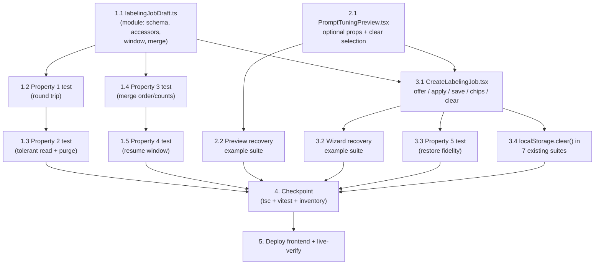

# Implementation Plan: Labeling Setup Session Recovery

## Overview

Frontend-only, three seams. The foundation track builds the new pure module `labelingJobDraft.ts` (versioned tolerant storage accessors, the backend-TTL-derived resume window, the example-ref merge helpers) and proves it with four fast-check properties split over two test files (storage behaviors vs. pure helpers). The preview track adds the four optional restore props and the clear-selection control to `PromptTuningPreview.tsx` — prop-absence keeps today's behavior byte-identical. The wizard track is the hot file: `CreateLabelingJob.tsx` gains the draft read/offer/apply/save machinery, the restored-ref chips with merged counts and flows, and the clear-on-create — written by exactly one task, after both of its dependencies exist. Verification is one render-level restore-fidelity property (mount → Restore → submit equals the generated draft), two example suites, and a one-line `localStorage.clear()` hygiene addition to the seven existing suites that type into the wizard (no assertion changes — the design's zero-rebaseline rule). The checkpoint runs `tsc`, the full vitest suite, and the design's non-regression inventory. The deploy is `./deploy-frontend.sh` alone: no backend, API, route, or infrastructure change exists in this feature, and the script performs no CDK synth or deploy, so no `cdk.out` drift-guard handling arises.

## Task Dependency Graph

```json
{
  "waves": [
    { "wave": 1, "description": "Independent foundations: the draft module (labelingJobDraft.ts) and the preview's optional restore surface (PromptTuningPreview.tsx) — two files, no shared types (the preview declares its prop shapes structurally).", "tasks": ["1.1", "2.1"] },
    { "wave": 2, "description": "First writers of each new test file plus the hot-file integration: Property 1 (storage property file), Property 3 (helpers property file), the preview example suite, and the CreateLabelingJob.tsx integration now that module and preview props exist.", "tasks": ["1.2", "1.4", "2.2", "3.1"] },
    { "wave": 3, "description": "Second writers of the two property files (Properties 2 and 4), the wizard render suites that need 3.1 (restore-fidelity property, recovery examples), and the storage-cleanup lines in the seven existing suites (their only writer).", "tasks": ["1.3", "1.5", "3.2", "3.3", "3.4"] },
    { "wave": 4, "description": "Checkpoint: tsc, full vitest run, and the zero-rebaseline non-regression inventory from the design.", "tasks": ["4"] },
    { "wave": 5, "description": "Deploy the frontend bundle under the builds.md gates and live-verify draft capture, restore, and preview resumption.", "tasks": ["5"] }
  ]
}
```



## Tasks

- [x] 1. Build the draft module (foundation)
  - [x] 1.1 Implement `labelingJobDraft.ts`
    - New file `edge-cv-portal/frontend/src/pages/labelingJobDraft.ts` per the design's module sketch: `LABELING_JOB_DRAFT_STORAGE_PREFIX = 'edgeCvPortal.labelingJobDraft.'`, `labelingJobDraftKey`, `LABELING_JOB_DRAFT_VERSION = 1`, `DRAFT_STALENESS_MS` (14 days), `DRAFT_SAVE_DEBOUNCE_MS = 750`, the `LabelingJobDraft` / `PreviewRunReference` interfaces (full Requirement 2.1 field list; model value verbatim; `exampleRefs`, `previewSelectedKeys`, `previewRun`)
    - `readLabelingJobDraft(usecaseId, nowMs?)`: try/catch parse (TestPanel pattern, `TestPanel.tsx` ~lines 149-186, scaled to field-by-field shape validation), null on absent/unparsable/version≠1/usecaseId-mismatch/non-conforming shape, `activeStepIndex` clamped 0..5, stale drafts purged and reported null; `writeLabelingJobDraft` stamps `version`/`savedAtMs`/`usecaseId`; `clearLabelingJobDraft`; all accessors swallow storage exceptions
    - `previewRunResumeWindowMs(sampleCount)` = `(min(n×120+60, 900) + 3600) × 1000` and `canResumePreviewRun(ref, nowMs)` — constants mirrored from `dda_labeling.py` (`PREVIEW_PER_SAMPLE_SECONDS`, `PREVIEW_LOCK_SLACK_SECONDS`, `PREVIEW_LOCK_TTL_MAX_SECONDS`, `PREVIEW_ITEM_TTL_GRACE_SECONDS`, ~lines 3174-3181) with a comment citing the derivation
    - `draftsEquivalent(a, b)` (deep equality ignoring `savedAtMs`), `mergedExampleRefs(restored, uploaded)` (restored-first per designation), `exampleRefDisplayName(ref)` (basename)
    - No credential or token field anywhere in the schema; module docstring cites this spec
    - _Requirements: 1.4, 1.5, 1.6, 2.1, 2.2, 2.3, 2.4, 2.5, 5.1, 5.5, 6.2, 6.3, 6.5_

  - [x]* 1.2 Write property test for the serialization round trip
    - `edge-cv-portal/frontend/src/pages/labelingJobDraft.storage.property.test.ts` (new) — fast-check `{ numRuns: 100 }`, jsdom localStorage cleared per run; generator draws arbitrary drafts across both branches (empty/unicode/whitespace strings, any step index, any team or null, model values including ids absent from any catalog, any ref lists / sample keys / `previewRun` or null); assert `readLabelingJobDraft(write(...))` equivalence on every Requirement 2.1 field plus `version === 1` and the key's `usecaseId`
    - **Property 1: Draft serialization round-trips**
    - **Validates: Requirements 1.4, 2.1, 2.2, 2.4**

  - [x]* 1.3 Write property test for tolerant reads and staleness purge
    - `labelingJobDraft.storage.property.test.ts` (extend 1.2's file, separate describe): generators over arbitrary strings, arbitrary JSON shapes, valid drafts with version ≠ 1, valid drafts with mismatched `usecaseId`, and valid drafts with `savedAtMs` offsets straddling `DRAFT_STALENESS_MS`; assert read returns null without throwing for every invalid case, returns the draft within the bound, and removes the key for stale content
    - **Property 2: Reading tolerates anything and purges stale drafts**
    - **Validates: Requirements 6.2, 6.3, 6.5**

  - [x]* 1.4 Write property test for the example-ref merge
    - `edge-cv-portal/frontend/src/pages/labelingJobDraft.helpers.property.test.ts` (new) — fast-check `{ numRuns: 100 }` over arbitrary restored/uploaded ref lists per designation: merge is restored-first concatenation per designation; `fewShotExamplesFromRefs` (imported unchanged from `CreateLabelingJob.tsx`) over the merge yields good-before-bad with per-designation positions 0..n−1 in merge order; merged counts equal the sums
    - **Property 3: Example-ref merging is restored-first, complete, and count-additive**
    - **Validates: Requirements 2.3, 4.2, 4.3**

  - [x]* 1.5 Write property test for the resume window
    - `labelingJobDraft.helpers.property.test.ts` (extend 1.4's file, separate describe): arbitrary sampleCount ≥ 1 and start/now pairs straddling the boundary; assert `canResumePreviewRun` ⇔ `now − startedAt ≤ (min(n×120+60, 900) + 3600) × 1000`, and false for null/absent references
    - **Property 4: The resume window equals the backend-derived readability bound**
    - **Validates: Requirements 5.1, 5.5**

- [x] 2. Add the preview's restore surface
  - [x] 2.1 Implement the optional restore props and clear-selection control in `PromptTuningPreview.tsx`
    - `edge-cv-portal/frontend/src/components/labeling/PromptTuningPreview.tsx`: add optional props `initialSelectedKeys?`, `onSelectedKeysChange?`, `resumeRun?: {runId, sampleCount} | null`, `onRunStarted?` (structural types declared in the component — no import from `pages/`), following the component's optional-callback pattern (`onDownscaleMaxEdgeChange`, "the control still operates without it")
    - `selectedKeys` initializes from `initialSelectedKeys ?? []`; every selection change (toggle, cap-refused adds excluded, clear) reports the full ordered list through `onSelectedKeysChange`
    - Mount effect: `if (resumeRun) void pollRun(resumeRun.runId, resumeRun.sampleCount, {taskType, labelSet})` — the existing loop renders Running progressively, commits terminal results on the first poll, and routes 404 to the existing "no longer available" message with the control re-enabled; no `startPreviewRun` call on resume
    - `handleStartRun`: invoke `onRunStarted({runId: started.run_id, sampleCount: started.sample_count || samples.length, startedAtMs: Date.now()})` after `startPreviewRun` resolves
    - Clear-selection `Button` beside the selection summary (`preview-selection-count`) when `selectedKeys.length > 0`, emptying the selection and reporting it — the only rendered-surface addition when no new prop is passed
    - Poll loop, request builder, validation, sizing controls, and result rendering byte-for-byte unchanged
    - _Requirements: 5.1, 5.2, 5.3, 5.4, 5.6, 5.7, 5.8, 7.2, 7.5_

  - [x]* 2.2 Write example tests for preview resumption and selection restore
    - `edge-cv-portal/frontend/src/components/labeling/PromptTuningPreview.recovery.test.tsx` (new) — vitest + testing-library per the `PromptTuningPreview.test.tsx` mock scaffolding, `window.localStorage.clear()` in `beforeEach`: `resumeRun` polls the run id on mount with no `startPreviewRun` call (5.1); Running → progressive render then terminal (5.2); terminal on first poll → results displayed (5.3); 404 → existing message, run control re-enabled (5.4); restored keys count toward the 5-key cap, ride the next run's `sample_images`, and show checked on their listing page (5.7); clear-selection empties and reports (5.8); rendered without any new prop → no resume poll, no callback, empty initial selection (7.5)
    - _Requirements: 5.1, 5.2, 5.3, 5.4, 5.7, 5.8, 7.5_

- [x] 3. Integrate recovery into the wizard (hot file — single writer)
  - [x] 3.1 Implement draft capture, the restore offer, and restored refs in `CreateLabelingJob.tsx`
    - `edge-cv-portal/frontend/src/pages/CreateLabelingJob.tsx` (sole writer of this file in the plan): new state/refs per the design — `restoredExampleRefs`, `previewSelectedKeys`, `previewRunRef`, `draftOffer: {usecaseId, draft} | null`, `previewRestoreNonce`, refs `draftReadUsecases`, `pendingTeamRestoreRef`, `restoredPreviewRun`, `draftClearedRef`
    - Draft read effect: once per resolved use case (TestPanel's `resumedUsecaseRef` pattern), `readLabelingJobDraft` → set `draftOffer` (Req 3.1); offer renders as a non-dismissible Cloudscape `Alert` above the existing error Alert (~line 1855) with the save time and `action` buttons "Restore draft" / "Discard" — Discard clears the key and touches no other state (Req 3.7); no draft → no offer, rendering unchanged (Req 3.8)
    - Debounced save effect (`DRAFT_SAVE_DEBOUNCE_MS`): component-local `buildDraft()` assembling every Requirement 2.1 field with `exampleRefs = mergedExampleRefs(restoredExampleRefs, cacheCurrent ? exampleUploadCache.current.uris : empty)` where `cacheCurrent = exampleUploadCache.current?.key === exampleFilesKey` (Req 2.3); skip when no use case, `draftOffer` pending for the current use case (Req 1.3), `draftClearedRef` set, or `draftsEquivalent(draft, pristineDraft)` for the memoized entry-context pristine (Req 1.2); cleanup cancels the timer
    - Restore apply (Req 3.2): synchronously set every field (taskType reconstructed from the static options by value; skip-verification fields only when `isAdmin`, else disabled/empty — Req 3.6; model value verbatim even when the picker omits it — Req 3.5); `budgetPrefillModelRef.current = draft.autoLabelModel` so the restored budget survives the pre-fill effect (Req 3.3); park `pendingTeamRestoreRef` and re-select once `labelingTeams` arrives, leaving unselected when absent (Req 3.4); `restoredPreviewRun = canResumePreviewRun(draft.previewRun, Date.now()) ? draft.previewRun : null` (Req 5.5); bump `previewRestoreNonce`; clear `draftOffer` so saving resumes
    - Restored-ref chips under the good/bad FileUpload fields: `exampleRefDisplayName` labels with per-chip remove (Req 4.1); combined per-designation counts feed the limit checks, few-shot rules, attach/omit hint, review-step counts, and the preview's `goodExampleCount`/`badExampleCount` props (Req 4.2); `ensureExampleImagesUploaded` returns `mergedExampleRefs(restoredExampleRefs, await uploadFiles())` so preview and submission consume merged refs with zero changes to their builders (Req 4.3); no `File` fabrication (Req 4.4); use-case change discards restored refs (Req 4.5)
    - Preview wiring (~line 1600): `key={previewRestoreNonce}`, `initialSelectedKeys={previewSelectedKeys}`, `onSelectedKeysChange`, `resumeRun={restoredPreviewRun}`, `onRunStarted` replacing `previewRunRef` (Req 5.6, 2.4)
    - `handleSubmit`: after `createLabelingJob` resolves (both branches), set `draftClearedRef` and `clearLabelingJobDraft(usecaseId)` before `navigate('/labeling')` (Req 6.1); leaving without creating keeps the draft (Req 6.4)
    - Validation rules, error messages, submission payload construction, and the GT branch byte-for-byte unchanged apart from the combined example counts (Req 7.1, 7.3, 7.4, 7.6)
    - _Requirements: 1.1, 1.2, 1.3, 1.6, 2.1, 2.2, 2.3, 2.4, 3.1, 3.2, 3.3, 3.4, 3.5, 3.6, 3.7, 3.8, 4.1, 4.2, 4.3, 4.4, 4.5, 5.5, 5.6, 6.1, 6.4, 7.1, 7.3, 7.4, 7.6_

  - [x]* 3.2 Write example tests for the wizard's recovery flows
    - `edge-cv-portal/frontend/src/pages/CreateLabelingJob.recovery.test.tsx` (new) — per the `CreateLabelingJob.test.tsx` mock scaffolding, `window.localStorage.clear()` in `beforeEach`, fake timers around the debounce: the design's Testing Strategy example list — debounced write with the edited value (1.1); pristine mount writes nothing (1.2); unresolved offer suppresses writes (1.3); storage-throw tolerance (1.5); no `idToken` in the written JSON (1.6); offer with exactly Restore/Discard once per use case (3.1); team re-selection present/absent (3.4); verbatim model when the capability-filtered picker omits it (3.5); non-admin skip-verification drop (3.6); Discard clears and touches nothing (3.7); clean storage → no offer (3.8, 7.4); named chips with removal reflected in the next write (4.1); combined-count limit messages (4.2); stale upload cache persists no refs (2.3); use-case switch discards restored refs (4.5); new run replaces `previewRun` (5.6); out-of-window reference dropped silently (5.5); creation success removes the key (6.1); unmount keeps the key (6.4); restored-invalid draft surfaces the standard validation message (7.3)
    - _Requirements: 1.1, 1.2, 1.3, 1.5, 1.6, 2.3, 3.1, 3.4, 3.5, 3.6, 3.7, 3.8, 4.1, 4.2, 4.5, 5.5, 5.6, 6.1, 6.4, 7.3, 7.4_

  - [x]* 3.3 Write property test for restore fidelity
    - `edge-cv-portal/frontend/src/pages/CreateLabelingJob.recovery.property.test.tsx` (new) — fast-check `{ numRuns: 100 }` over full wizard mounts (repo precedent: `CreateLabelingJob.modelpicker.property.test.tsx`): generator draws submittable DDA drafts per the design (team in the mocked list, valid label set per modality, auto-label across disabled/`sam`/`bedrock:`/`llm:` with non-empty prompt and a token budget differing from the mocked catalog `token_limit`, arbitrary restored refs, step index 5); seed storage, mount, click Restore, submit; assert the `createLabelingJob` call's fields equal the draft's values — model verbatim, prompt character-for-character, the draft's budget (not the pre-fill), downscale, and `example_images`/`few_shot.examples` equal to the restored-first merge
    - **Property 5: Restoring a draft is faithful end-to-end**
    - **Validates: Requirements 3.2, 3.3, 3.5, 2.2, 4.3, 7.1**

  - [x] 3.4 Add storage cleanup to the seven existing suites
    - Add exactly one `window.localStorage.clear()` line to the `beforeEach` of `CreateLabelingJob.test.tsx`, `CreateLabelingJob.fewshot.test.tsx`, `CreateLabelingJob.sizing.test.tsx`, `CreateLabelingJob.modelpicker.test.tsx`, `CreateLabelingJob.modelpicker.property.test.tsx`, `PromptTuningPreview.test.tsx`, and `PromptTuningPreview.property.test.tsx` (repo pattern: `TestPanel.test.tsx` line 154) so the new debounced draft writes cannot bleed between tests within a file
    - **No pre-existing assertion changes** — this is the design's one permitted mechanical edit to the pinned suites; if any assertion would have to change, stop and treat it as a design violation
    - _Requirements: 7.4, 7.5_

- [x] 4. Checkpoint — Ensure all tests pass
  - `cd edge-cv-portal/frontend && npx tsc --noEmit -p tsconfig.json && npx vitest run`
  - Run the design's non-regression inventory and confirm the expected disposition with **zero rebaselines**: the five `CreateLabelingJob*` suites and the two `PromptTuningPreview` suites green with every pre-existing assertion byte-identical (cleanup line from 3.4 is the only diff); `TestPanel.test.tsx`, `LabelingDetail.test.tsx`, `PreviewResultCanvas.test.tsx`, `AnnotationCanvas.helpers.test.ts` untouched and green. If any pre-existing assertion has to change, stop and raise it as a design violation rather than rebaselining
  - Ensure all tests pass, ask the user if questions arise
  - _Requirements: 7.1, 7.2, 7.3, 7.4, 7.5, 7.6_

- [x] 5. Deploy and live-verify
  - Follow `.kiro/steering/builds.md`: confirm no component build is running (`pgrep -af "gdk component build"` and `pgrep -af "build-custom.sh"` both empty) before deploying; portal deploys must never overlap component builds
  - Frontend-only change (one new module, two edited components, test files — no backend, API, route, or infrastructure diff), so deploy the bundle alone: from `edge-cv-portal`, `./deploy-frontend.sh`, captured to a spec-named log per the repo convention, e.g. `edge-cv-portal/deploy-labeling-setup-session-recovery-$(date -u +%Y%m%dT%H%M%SZ).out`
  - No `cdk deploy` happens and `deploy-frontend.sh` performs no CDK synth (it reads CloudFormation outputs, builds, syncs S3, invalidates CloudFront), so no `cdk.out` drift-guard rebaseline is needed for this deploy
  - Live-verify: in the labeling wizard, enter setup values, refresh — the Restore/Discard offer appears and Restore brings every value back; start a preview run, refresh mid-run — the run resumes polling and completes; refresh after completion — results re-display; Discard clears the offer; create a job — no offer on the next visit
  - _Requirements: 1.1, 3.1, 3.2, 5.1, 6.1_

## Notes

- Tasks marked with `*` are optional test tasks and can be skipped for a faster MVP; core implementation tasks are never optional. Task 3.4 is deliberately **not** optional: it is preservation hygiene required for the checkpoint's determinism (the core implementation's debounced writes would otherwise bleed between tests inside the existing suites), not a new test
- Each of the 5 correctness properties has exactly one property-based test task, in the file the design's placement table names, at a minimum of 100 iterations (`fc.assert(..., { numRuns: 100 })`), tagged `Feature: labeling-setup-session-recovery, Property {n}: {text}`
- **Same-file scheduling constraint:** `CreateLabelingJob.tsx` — the hot file — is written only by 3.1, alone in its wave slot for that file, after both dependencies (1.1 module, 2.1 preview props) land in wave 1. The two shared property-test files each have their writers serialized across waves (1.2 → 1.3 for the storage file, 1.4 → 1.5 for the helpers file). Task 3.4 is the sole writer of the seven existing suites. No wave contains two writers of one file
- The debounce interval, staleness bound, and resume window are exported constants so tests pin them; the resume window's derivation cites `dda_labeling.py`'s TTL constants — if the backend derivation ever changes, the one frontend mirror is the only thing to update
- No backend or infrastructure task exists by design: preview runs already persist server-side with pollable status, example refs are already durable in the use case data bucket, and the draft never leaves the browser
- Follow-ups deliberately out of scope (recorded in the requirements Introduction): a server-side draft API for cross-device recovery (this draft schema is its natural wire shape), and restoring never-uploaded example `File`s (impossible for localStorage; rejected for IndexedDB byte-duplication)
