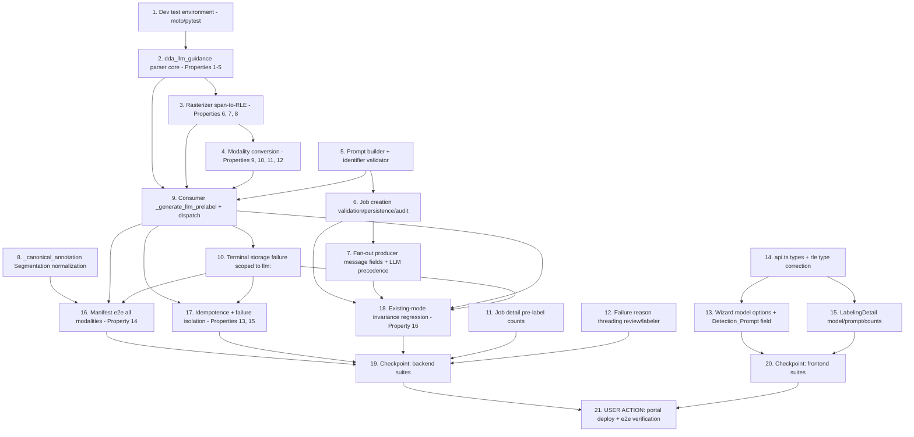

# Implementation Plan: LLM Auto-Labeling

## Overview

Work proceeds along three tracks. The **core track** builds the new pure
shared-layer module `dda_llm_guidance.py` (prompt construction, JSON
extraction, strict validation, rasterization, modality conversion) — this is
where every correctness property lives and where all property-based tests
land. The **wiring track** threads the new model family and Detection_Prompt
through job creation, the SQS fan-out producer, and the per-image consumer,
plus the two narrow fixes the design identified (Segmentation `image_size`
normalization, terminal storage failure scoped to the LLM family). The
**surface track** covers the wizard, the job detail view, and the failure
reason plumbing.

The design posture is additive: the three existing dispatch points gain a
branch and are never restructured. Requirement 1.7 (existing SAM / Bedrock /
no-auto-label jobs behave byte-identically) is pinned by an explicit
regression task (Property 16), not by assumption.

No new AWS resources, no CDK changes, and no Greengrass component build — the
existing `DdaAutolabelWorker` already carries the shared layer and the
`bedrock:InvokeModel` grant, and rasterization is pure Python so it needs no
Pillow layer.

## Task Dependency Graph

```json
{
  "waves": [
    { "wave": 1, "tasks": ["1", "2", "5", "8", "11", "14"], "description": "Independent foundations: dev test environment, the guidance module's parser core (Properties 1-5), the prompt builder + model identifier validator, the _canonical_annotation Segmentation normalization, job detail pre-label counts, and the frontend API types." },
    { "wave": 2, "tasks": ["3", "6", "12", "13"], "description": "Rasterizer over the parser's detection model (Properties 6-8); job creation validation/persistence/audit over the identifier validator; failure reason threading; wizard model options and prompt field." },
    { "wave": 3, "tasks": ["4", "7", "15"], "description": "Modality conversion over the rasterizer (Properties 9-12); fan-out producer message fields and LLM model precedence; job detail view rendering." },
    { "wave": 4, "tasks": ["9"], "description": "Per-image consumer: the _generate_llm_prelabel path and the dispatch branch, over the completed guidance module." },
    { "wave": 5, "tasks": ["10"], "description": "Terminal pre-label storage failure, scoped to the LLM family." },
    { "wave": 6, "tasks": ["16", "17", "18"], "description": "Integration properties: manifest indistinguishability across all three modalities (Property 14), resolution idempotence and failure isolation (Properties 13, 15), and existing-mode invariance regression (Property 16)." },
    { "wave": 7, "tasks": ["19", "20"], "description": "Checkpoints: backend pytest suites and frontend vitest suites green." },
    { "wave": 8, "tasks": ["21"], "description": "USER ACTION final gate: portal deploy and end-to-end verification of a real LLM auto-labeled job in each modality." }
  ]
}
```



## Notes

**Test suite invocations**: backend suites run as
`python3 -m pytest backend/tests/<file> -q -p no:cacheprovider` from
`edge-cv-portal`. Frontend suites run as `npx vitest run` from
`edge-cv-portal/frontend` — `package.json` has no `test` script.

**Test environment gotcha**: `moto` is absent from
`/home/ubuntu/.dda-test-venv` and the host `python3` has no pytest, so every
DDA labeling suite currently errors at `conftest.py` import with
`ModuleNotFoundError: No module named 'moto'`. Task 1 installs
`backend/requirements-dev.txt` (pytest 8.4.2, moto[s3,dynamodb] 5.1.22) and
must complete before any test task.

**Property test conventions**: Python property tests use `hypothesis` with
the suite's registered profile (no hardcoded `max_examples`), in new
`backend/tests/test_property_llm_guidance_*.py` files following the existing
`test_property_*.py` naming. Every property test is tagged
`**Feature: llm-auto-labeling, Property {number}: {property_text}**`. The
pure module has no boto3 and no I/O, so these tests need no moto and run
without AWS credentials.

**Reference rasterization oracle**: Property 7 compares the span-based RLE
emitter against a naive dense per-pixel-center rasterizer written in the test
file itself (not in production code), over small generated images so the
O(w·h) reference stays fast.

**Deployment note**: no task deploys the portal except the explicitly
labelled USER ACTION task 21. Per the builds steering rule, before that
deploy confirm no component build is running (`pgrep -af "gdk component
build"`, `pgrep -af build-custom.sh`) — a portal deploy regenerates
`cdk.out` and would fail a concurrent build's security preservation gate.
This feature touches no preservation-tracked file, so no baseline
rebaselining is expected.

**Boundary notes**: the labeler canvas, Admin_Review decision flow,
`serialize_manifest`, `render_mask_png`, `build_color_map`,
`_validate_manifest_lines`, `_write_prelabel`, `_mark_task`, and
`_resolve_skip_verification_counters` are deliberately unchanged. The
existing `_extract_json`, `_build_prompt`, `_validate_boxes`,
`_validate_classification`, `_generate_bedrock_prelabel`, and
`_generate_sam_prelabel` helpers are left untouched — the LLM family gets its
own, so Requirement 1.7 holds by construction.

## Tasks

- [x] 1. Prepare the backend test environment
  - Install `edge-cv-portal/backend/requirements-dev.txt` into the interpreter used for the backend suites; confirm `python3 -m pytest backend/tests/test_dda_autolabel_worker.py -q -p no:cacheprovider` collects and runs (existing tests green) rather than erroring at `conftest.py`
  - Record the working interpreter path in the task notes so later tasks and checkpoints use the same one
  - **Working interpreter: `/home/ubuntu/.dda-test-venv/bin/python3` (Python 3.14.4).** Run backend suites from `edge-cv-portal` as `/home/ubuntu/.dda-test-venv/bin/python3 -m pytest backend/tests/<file> -q -p no:cacheprovider`. requirements-dev.txt installed 2026-02: pytest 8.4.2 (downgraded from 9.1.1 per pin), moto 5.1.22; hypothesis 6.165.10 already present. Verified: test_dda_autolabel_worker.py collects and passes (15 passed).
  - _Requirements: none (enabling step)_

- [x] 2. Build the guidance parser core (new shared-layer module)
  - [x] 2.1 Create `backend/layers/shared/python/dda_llm_guidance.py` with the detection model and parser
    - Module contract: pure functions only — no boto3, no Pillow, no I/O. Imports limited to `json`, `math`, `typing`
    - `GuidanceError(Exception)`; constants `MAX_DETECTIONS = 100`, `POLYGON_MIN_VERTICES = 3`
    - Internal `Detection` shape: `{'class': str, 'geometry': 'box'|'polygon'}` plus either `'box': {left, top, width, height}` (floats) or `'vertices': [(float, float), ...]`
    - `extract_first_json(text)`: scan every `{` in reading order, attempt `json.JSONDecoder().raw_decode(text, index)`, return the first successfully decoded dict; skip candidates that fail to decode; raise `GuidanceError` when none parse. Tolerates surrounding prose and code fences for free via `raw_decode`'s trailing-content behavior
    - `parse_guidance(raw_text, label_set, width, height)`: `extract_first_json`, then validate in this order — `detections` is a list (else structural mismatch); `len <= MAX_DETECTIONS` checked **before** per-detection validation so an oversized document reports the cap; per detection a dict with exactly one of `box`/`polygon` and a `class` string; class `.strip()` an exact case-sensitive Label_Set member; box fields numeric, non-`bool`, `math.isfinite`, positive extent, in bounds (`left >= 0`, `top >= 0`, `left + width <= width`, `top + height <= height`); polygon at least 3 vertices, each a 2-element sequence of finite non-`bool` numbers with `0 <= x <= width` and `0 <= y <= height`. Reject `bool` before `int` since `bool` is an `int` subclass. Any rejection aborts the whole document with one reason naming the offending element
    - `serialize_guidance(detections)`: emit the wire format `{"detections": [{"class", "box"|"polygon"}]}` — the round-trip counterpart of `parse_guidance`
    - _Requirements: 3.2, 4.1, 4.2, 4.3, 4.4, 4.5, 4.6, 4.7, 4.8, 4.9_
  - [x] 2.2 Write example-based unit tests for extraction and validation
    - Extraction: bare object; fenced ```json block; prose before and after; a truncated `{` before a valid object (skipped); multiple valid objects (first in reading order wins); no object at all; a top-level JSON array (rejected)
    - Validation: each rejection family with its expected reason substring — class not in Label_Set, class differing only in case, class with surrounding whitespace (accepted, stored trimmed), non-numeric coordinate, `NaN`/`Infinity`, `true` as a coordinate, zero and negative extent, box overflowing each of the four bounds, polygon with 2 vertices, vertex outside bounds, 101 detections, both `box` and `polygon` present, neither present, `detections` missing, `detections` not a list
    - Acceptance: `{"detections": []}`; boxes and polygons touching the bounds exactly; a document mixing box and polygon detections
    - _Requirements: 4.1, 4.2, 4.3, 4.4, 4.5, 4.6, 4.7, 4.8, 4.9_
  - [x] 2.3 Write property tests for the parser
    - New file `backend/tests/test_property_llm_guidance_parse.py`
    - **Feature: llm-auto-labeling, Property 1: Guidance round trip**
    - **Validates: Requirements 4.10**
    - **Feature: llm-auto-labeling, Property 2: Validation is total and all-or-nothing**
    - **Validates: Requirements 4.3, 4.4, 4.5, 4.6, 4.7, 4.8**
    - **Feature: llm-auto-labeling, Property 3: Class closure**
    - **Validates: Requirements 4.4**
    - **Feature: llm-auto-labeling, Property 4: Geometric containment of guidance**
    - **Validates: Requirements 4.5, 4.6**
    - **Feature: llm-auto-labeling, Property 5: Cardinality bound**
    - **Validates: Requirements 3.2, 4.7**
    - Strategies: generate `(width, height)`, a Label_Set of 1-10 distinct names, and detection lists of in-bounds boxes/polygons. Round trip asserts `parse_guidance(serialize_guidance(d), L, w, h) == d` on class names, geometry types, and coordinate values. All-or-nothing generates a valid list and injects exactly one invalid detection at a generated position, asserting `GuidanceError` regardless of position. Closure and containment assert over every returned detection. Cardinality generates lists of 0-100 (accepted) and 101-150 (rejected with the cap reason)

- [x] 3. Implement span-based rasterization to RLE
  - [x] 3.1 Add the rasterizer to `dda_llm_guidance.py`
    - `rasterize_to_rle(detection, width, height) -> str`: compute per-column half-open y-spans, then emit COCO-style column-major counts directly — never allocate a dense `width * height` mask (a 4000x3000 image with 100 detections would be ~1.2e9 byte writes in pure Python)
    - Box spans: columns and rows selected by pixel-center containment — pixel `(x, y)` is filled when `(x + 0.5, y + 0.5)` lies inside the rectangle. Cost O(box width)
    - Polygon spans: for each column `x` in the vertex bounding box, sample the vertical line `x + 0.5`, intersect it with every edge, sort the intersection `y` values, pair them under the even-odd rule, and convert each `(ya, yb)` pair into the rows whose centers fall in `[ya, yb)`. Cost O(columns x edges)
    - Clamp columns to `[0, width)` and spans to `[0, height)`, and merge overlapping spans within a column, so the emitted counts are a strictly advancing alternating sequence summing to exactly `width * height` — the invariant `dda_manifest.rle_decode` enforces
    - Emission walks columns ascending, pushing a background run to reach each span's absolute column-major index, then the foreground run; a final background run closes the sequence
    - Return zero spans for geometry covering no pixel center; callers treat that as a conversion failure (task 4)
    - _Requirements: 5.1, 5.2, 5.6_
  - [x] 3.2 Write unit tests against hand-computed RLE
    - A 1x1 full-image box; a box covering one interior pixel; a box whose edges fall exactly on pixel centers; an axis-aligned triangle; a convex quadrilateral; a concave (L-shaped) polygon exercising the even-odd pairing; a self-intersecting polygon (even-odd result asserted, not rejected); a sub-pixel sliver yielding zero spans; geometry touching each of the four image borders
    - Every case asserts the emitted string decodes via `dda_manifest.rle_decode` and matches the expected pixel set
    - _Requirements: 5.1, 5.2, 5.6, 5.7_
  - [x] 3.3 Write property tests for rasterization
    - New file `backend/tests/test_property_llm_guidance_rasterize.py`
    - **Feature: llm-auto-labeling, Property 6: RLE well-formedness**
    - **Validates: Requirements 5.2**
    - **Feature: llm-auto-labeling, Property 7: Rasterization fidelity**
    - **Validates: Requirements 5.1, 5.2**
    - **Feature: llm-auto-labeling, Property 8: Emitted geometry containment**
    - **Validates: Requirements 5.6**
    - Well-formedness asserts non-negative counts summing to `width * height`, i.e. `rle_decode` accepts every emitted string. Fidelity compares `rle_decode(rasterize_to_rle(d, w, h), w, h)` against a naive dense per-pixel-center reference rasterizer defined in the test file, over generated images bounded to keep the reference fast. Containment asserts no decoded foreground pixel lies outside the frame, including geometry touching the bounds exactly

- [x] 4. Implement modality conversion to Pre_Labels
  - [x] 4.1 Add the converter to `dda_llm_guidance.py`
    - `polygon_bounding_box(vertices)`: the axis-aligned hull — `left = min x`, `top = min y`, `width = max x - min x`, `height = max y - min y`
    - `guidance_to_prelabel(detections, modality, label_set, width, height)` emitting exactly the shapes already written to the artifacts bucket, so downstream code cannot distinguish origin:
    - Segmentation: `{'modality': 'Segmentation', 'regions': [{'class', 'rle'}], 'image_width', 'image_height'}` — one region per detection in guidance order, never merged across detections sharing a class
    - ObjectDetection: `{'modality': 'ObjectDetection', 'boxes': [{'class', 'left', 'top', 'width', 'height'}], 'image_width', 'image_height'}` — box detections keep their validated coordinates verbatim; polygon detections collapse to `polygon_bounding_box`
    - Classification: `{'modality': 'Classification', 'label': 'anomaly' if detections else 'normal'}` against the fixed binary Label_Set
    - Zero detections in Segmentation/ObjectDetection emit an empty `regions`/`boxes` list and are a **success**, not a failure
    - Raise `GuidanceError` when a detection rasterizes to zero spans, or when a box's `int()`-truncated width or height is below 1 — `_serialize_object_detection` truncates with `int()`, so a sub-pixel box would otherwise reach the manifest with zero extent
    - _Requirements: 5.1, 5.2, 5.3, 5.4, 5.5, 5.6, 5.7_
  - [x] 4.2 Write unit tests for each modality
    - Segmentation: two same-class detections stay two regions; region order matches guidance order; `image_width`/`image_height` match the source dimensions
    - ObjectDetection: box coordinates unchanged; polygon collapses to the expected hull; a 0.4px-wide box is rejected as zero-extent
    - Classification: zero detections -> `normal`; one and many -> `anomaly`
    - Empty guidance for all three modalities; degenerate geometry rejection messages
    - _Requirements: 5.1, 5.2, 5.3, 5.4, 5.5, 5.7_
  - [x] 4.3 Write property tests for conversion
    - New file `backend/tests/test_property_llm_guidance_convert.py`
    - **Feature: llm-auto-labeling, Property 9: Detection preservation**
    - **Validates: Requirements 5.1, 5.3**
    - **Feature: llm-auto-labeling, Property 10: Polygon hull tightness**
    - **Validates: Requirements 5.3**
    - **Feature: llm-auto-labeling, Property 11: Empty is success, degenerate is failure**
    - **Validates: Requirements 5.5, 5.7**
    - **Feature: llm-auto-labeling, Property 12: Classification totality**
    - **Validates: Requirements 5.4**
    - Preservation asserts `len(regions) == len(detections)` and `len(boxes) == len(detections)` with class names and order preserved, including generated same-class runs. Hull tightness asserts the exact min/max identity and that the hull is itself in bounds. The empty/degenerate property asserts the two outcomes are disjoint and exhaustive over "produced nothing". Totality asserts the `anomaly` iff non-empty biconditional

- [x] 5. Implement the prompt builder and model identifier validator
  - [x] 5.1 Add `build_detection_prompt` and `validate_model_identifier` to `dda_llm_guidance.py`
    - `validate_model_identifier(identifier)`: returns `None` when valid, else the reason — required/non-empty, at most `MODEL_IDENTIFIER_MAX_LENGTH = 256`, and no whitespace or control characters (`ch.isspace()`, `ord(ch) < 0x20`, `ord(ch) == 0x7F`). Shared so the creation API and the consumer agree
    - `build_detection_prompt(modality, label_set, detection_prompt, width, height, per_label_prompts)`: one prompt shape for all three modalities carrying the pixel dimensions, the Label_Set, the Detection_Prompt inserted **verbatim** (no trimming, no escaping), the per-label prompts inserted verbatim one section per label when supplied, and instructions demanding the `{"detections": [...]}` JSON with exactly one `box` or `polygon` per detection, `{"detections": []}` for nothing found, and the 100-detection cap. Classification uses the same geometry instructions — the converter reduces detections to a label
    - _Requirements: 1.5, 2.6, 3.1, 3.2_
  - [x] 5.2 Write unit tests
    - Identifier: empty, non-string, 256 chars (accepted), 257 chars, embedded space, tab, newline, `\x00`, `\x7f`, and a realistic id containing a colon such as `us.amazon.nova-pro-v1:0` (accepted — colons are legal in model ids)
    - Prompt: contains the width and height; contains every Label_Set name; contains the Detection_Prompt byte-for-byte including leading/trailing whitespace, newlines, quotes, and braces; contains each per-label prompt verbatim when supplied and none when not; identical geometry instructions across all three modalities
    - _Requirements: 1.5, 2.6, 3.1_

- [x] 6. Add LLM job creation validation, persistence, and audit
  - [x] 6.1 Extend `dda_labeling.create_dda_job`
    - Add `'llm': ('Classification', 'Segmentation', 'ObjectDetection')` to `AUTO_LABEL_MODEL_MODALITIES`
    - Recognize the `llm:` family in the auto-label model branch, splitting on the **first** colon only (`model.split(':', 1)[1]`) so identifiers containing colons survive; run `validate_model_identifier` on the identifier and append any reason to the existing `errors` list as a `_validation_error('auto_label', ...)`
    - Validate `auto_label.detection_prompt` for the `llm:` family: required, emptiness judged on `prompt.strip()`, length judged on the raw `prompt` at most 2000 characters. Distinct error messages for missing/empty vs over-length
    - Persist `auto_label = {'enabled': True, 'model': 'llm:<id>', 'detection_prompt': <raw string>}` — the raw string, not the stripped one, so it is stored character-for-character
    - Extend the `job_created` audit `details` with `auto_label_model` (the full model string, absent when auto-labeling is off) and `auto_label_mode` (`'llm' | 'sam' | 'bedrock' | 'none'`)
    - All validation joins the existing pre-enumeration error list, so a rejection returns one 400 with `validation_errors` before any S3 enumeration or DynamoDB write
    - _Requirements: 1.3, 1.5, 1.6, 2.2, 2.3, 2.4, 2.5, 9.4_
  - [x] 6.2 Extend `backend/tests/test_dda_labeling_create_job.py`
    - `llm:` accepted for Classification, Segmentation, and ObjectDetection; identifier rejections (empty, 257 chars, embedded space, control char) each naming the model parameter; prompt rejections (absent, empty, whitespace-only, 2001 chars) each naming the prompt
    - Every rejection persists nothing: assert zero job items and zero task items after the call
    - Prompt stored byte-identical including leading/trailing whitespace, embedded newlines, and quote/brace characters
    - `job_created` details carry `auto_label_model` and `auto_label_mode`; a SAM job records `'sam'`, a Bedrock job `'bedrock'`, a no-auto-label job `'none'`
    - Skip-verification with an `llm:` model still requires a non-empty per-label prompt for every label, and still returns 403 with the `unauthorized_access` audit event for a non-admin before validation errors are assembled; a caller without the create permission is rejected with nothing persisted
    - _Requirements: 1.3, 1.5, 1.6, 2.2, 2.3, 2.4, 2.5, 2.6, 9.1, 9.2, 9.3, 9.4_

- [x] 7. Thread the Detection_Prompt through the fan-out producer
  - [x] 7.1 Extend `dda_labeling_worker._enqueue_autolabel_messages`
    - Model resolution: the LLM family takes precedence over the skip-verification hardwire, so a skip-verification job can be LLM-driven — resolve `auto_label.model` first and only fall back to `f"bedrock:{job['bedrock_model_id']}"` when the model is not an `llm:` value and the job is skip-verification
    - Add `detection_prompt` to the message body for the `llm:` family (from `auto_label.detection_prompt`); keep `per_label_prompts` on skip-verification jobs as today, so an LLM skip-verification request carries both
    - Do **not** extend `_parse_record._REQUIRED_FIELDS` in the consumer — `detection_prompt` is mode-specific and the consumer falls back to the job item, so messages already in flight across a deployment still process
    - _Requirements: 2.6, 3.1_
  - [x] 7.2 Extend `backend/tests/test_dda_labeling_worker_distribute.py`
    - An LLM team job enqueues `model='llm:<id>'` with `detection_prompt` and no `per_label_prompts`
    - An LLM skip-verification job enqueues `model='llm:<id>'` (not `bedrock:{bedrock_model_id}`) with both `detection_prompt` and `per_label_prompts`
    - A Bedrock skip-verification job still enqueues `bedrock:{bedrock_model_id}`; a SAM job's message body is unchanged
    - _Requirements: 2.6, 3.1_

- [x] 8. Normalize Segmentation annotations for mask rendering
  - [x] 8.1 Extend `dda_labeling_worker._canonical_annotation`
    - Widen the `image_width`/`image_height` -> `image_size` bridge from `ObjectDetection` only to both geometry modalities (`ObjectDetection` and `Segmentation`); mask rendering raises `ManifestGenerationError` without `image_size`
    - Keep the guard strictly additive: it fires only when `image_size` is absent and both dimension fields are present, so no annotation that already normalizes today changes
    - _Requirements: 8.1, 8.3_
  - [x] 8.2 Write unit tests for the normalization
    - A Segmentation pre-label carrying `image_width`/`image_height` gains the correct `image_size`; one already carrying `image_size` is returned unchanged even when the dimension fields disagree; one carrying neither is returned unchanged; `Classification` is never given an `image_size`; DynamoDB `Decimal` values still normalize to plain ints
    - _Requirements: 8.1_

- [x] 9. Implement the per-image LLM pre-label path
  - [x] 9.1 Add `_generate_llm_prelabel` and the dispatch branch to `dda_autolabel_worker`
    - Add a third branch to `_generate_prelabel` for `model.startswith('llm:')`, splitting on the first colon; leave the `sam` and `bedrock:` branches and their helpers untouched
    - `_generate_llm_prelabel(message, job, model_id)` in order: `_read_image_bytes` (cross-account with the single-account direct fallback); `_image_dimensions` returning `None` raises `GenerationFailure` naming unsupported image content **before** any model invocation; resolve the Detection_Prompt from the message with a fallback to `job['auto_label']['detection_prompt']`; resolve per-label prompts on skip-verification jobs; `build_detection_prompt`
    - Exactly one `client.converse` call per image with the image block and the prompt, using `get_bedrock_configuration()` / `get_bedrock_client(region, min(timeout_seconds, BEDROCK_MAX_TIMEOUT_SECONDS))` / `build_inference_config(config)` — the client already disables retries, so no branch re-invokes
    - Distinguish timeout from model error in the recorded reason: catch `botocore.exceptions.ReadTimeoutError` and `ConnectTimeoutError` as `model invocation timed out after {timeout}s`, every other exception as `model error: {exc}`
    - Convert the response with `parse_guidance` then `guidance_to_prelabel`, translating `GuidanceError` into `GenerationFailure` so the reason reaches `prelabel_error` unchanged
    - Send image and prompt content only — no dataset credentials, no portal secrets
    - _Requirements: 3.1, 3.3, 3.4, 3.6, 4.2, 5.1, 5.2, 5.3, 5.4, 5.5, 5.7, 6.1, 6.3, 9.5, 9.6, 9.7_
  - [x] 9.2 Extend `backend/tests/test_dda_autolabel_worker.py` for the LLM path
    - Dispatch reaches the LLM path for `llm:<id>` and still rejects an empty identifier (`llm:`) as an unsupported model
    - Exactly one `converse` call per image, asserted on call count, carrying the image bytes, the image format derived from the key, the verbatim Detection_Prompt, every Label_Set name, and the pixel dimensions
    - Undeterminable dimensions (a non-PNG/JPEG body) mark the task `Failed` with the unsupported-content reason and make zero `converse` calls
    - `ReadTimeoutError` yields a timeout reason; a generic exception yields a model-error reason; the two are distinguishable substrings
    - Unparseable output, a class outside the Label_Set, an out-of-bounds box, and 101 detections each mark `Failed` with one reason and write no pre-label object
    - Success paths for all three modalities write the pre-label to `labeling/{usecase_id}/{job_id}/prelabels/{task_id}.json` and then mark `Available` with `prelabel_s3_key` set; a valid empty result is a success with an empty `regions`/`boxes` list
    - An image whose S3 read fails marks `Failed` with the access reason
    - _Requirements: 3.1, 3.3, 3.4, 3.6, 4.2, 4.4, 4.5, 4.7, 5.5, 6.1, 6.3, 9.5, 9.6_

- [x] 10. Make pre-label storage failure terminal for the LLM family
  - [x] 10.1 Scope the storage-failure behavior in `dda_autolabel_worker._process_message`
    - Introduce `LLM_MODEL_PREFIX = 'llm:'` and compute a `storage_failure_is_terminal` flag from the message's model
    - Wrap the `_write_prelabel` call: for the LLM family convert any exception into `GenerationFailure(f'pre-label storage failed: {exc}')` so the task resolves `Failed` with a storage reason and is never left `Pending`; for `sam` and `bedrock:` re-raise unchanged to preserve today's transient/retry semantics
    - Document the deliberate tradeoff in a comment: an LLM image hit by a transient S3 error is marked `Failed` rather than retried, which is acceptable because a `Failed` task is still labelable from scratch while a permanently `Pending` task is withheld from labelers forever
    - _Requirements: 6.2, 6.5, 1.7_
  - [x] 10.2 Write tests for both behaviors
    - An LLM job whose `put_object` raises marks the task `Failed` with the storage reason, sets no `prelabel_s3_key`, and reports no batch item failure
    - A SAM job and a Bedrock job whose `put_object` raises still surface a batch item failure and leave `prelabel_status` `Pending`
    - _Requirements: 6.2, 1.7_

- [x] 11. Surface pre-label counts on the job detail API
  - [x] 11.1 Extend `labeling._get_dda_labeling_job`
    - Derive `prelabel_available_count` and `prelabel_failed_count` from the already-queried `active_tasks` list (Inactive tasks excluded), so no additional query is needed
    - The persisted job item already carries `auto_label.model` and `auto_label.detection_prompt` and is returned as-is, so no further plumbing is required for the model and prompt
    - _Requirements: 10.1, 10.3_
  - [x] 11.2 Write tests for the counts
    - Mixed statuses (`Pending`, `Available`, `Failed`) produce the right two counts; Inactive tasks are excluded; a job with no auto-labeling reports zeros; the response carries the model identifier and the full untruncated Detection_Prompt
    - _Requirements: 10.1, 10.3_

- [x] 12. Thread pre-label failure reasons to reviewers
  - [x] 12.1 Include `prelabel_status` and `prelabel_error` in the review and labeler payloads
    - In `dda_labeling`, ensure the Admin_Review item payload carries each image's `prelabel_status` and `prelabel_error` so a failed image displays its status and reason, and is excluded from accepted results by the existing decision gating
    - Ensure the labeler task response carries the same fields for a `Failed` task, which is presented as a bare image for annotation from scratch
    - Add fields only where they are not already present; do not alter decision or gating logic
    - _Requirements: 7.6, 7.7, 10.4_
  - [x] 12.2 Extend `backend/tests/test_dda_labeling_admin_review.py` and the labeler API tests
    - Every image of a skip-verification job is listed with its succeeded/failed status; a failed image carries its reason and cannot be accepted; finalize with zero accepted results is still rejected
    - A `Failed` task presented to a team labeler carries no pre-label and its submission is validated by the same per-modality completeness rules
    - _Requirements: 7.5, 7.6, 7.7, 10.4, 10.5_

- [x] 13. Add the LLM model and Detection_Prompt to the job creation wizard
  - [x] 13.1 Extend `frontend/src/pages/CreateLabelingJob.tsx`
    - Export `LLM_MODALITIES = ['Classification', 'Segmentation', 'ObjectDetection']` and extend `isAutoLabelModelCompatible` with an `llm:` branch, leaving the `sam` and `bedrock:` branches intact
    - Build one `llm:<id>` option per catalog model from `apiService.getBedrockModels()`, labeled as prompt-guided and visually grouped apart from the plain Bedrock entries so both modes stay reachable
    - When the catalog cannot be loaded, show an inline unavailable notice and accept a free-text model identifier, mirroring the existing skip-verification degradation
    - Render a required `Textarea` for the Detection_Prompt only when an `llm:` model is selected, with a 2000-character constraint hint
    - Extend `validateDdaSetup` to block submission on a missing, whitespace-only, or over-length prompt, and keep the existing model/modality compatibility check
    - Summarize the model and prompt on the review step; send `auto_label: { enabled, model, detection_prompt }`
    - _Requirements: 1.1, 1.2, 1.3, 1.4, 2.1, 2.2_
  - [x] 13.2 Write vitest tests
    - `isAutoLabelModelCompatible` across all three families and all three modalities; `validateDdaSetup` rejects empty, whitespace-only, and 2001-character prompts and accepts a 2000-character one
    - The prompt field renders only for `llm:` selections; the catalog-unavailable notice plus free-text input appear on load failure; the submitted payload carries `detection_prompt`
    - _Requirements: 1.1, 1.2, 1.4, 2.1, 2.2_

- [x] 14. Update the frontend API types
  - [x] 14.1 Extend `frontend/src/services/api.ts`
    - `createLabelingJob` params: `auto_label?: { enabled: boolean; model?: string; detection_prompt?: string }`
    - DDA job type gains `prelabel_available_count?: number` and `prelabel_failed_count?: number`
    - Correct `DdaMaskRegion.rle` from `number[]` to `string`: the backend writes and validates a space-separated RLE string, and the canvas already consumes string RLE from SAM pre-labels, so the annotation is simply wrong. Fix it rather than propagating it
    - _Requirements: 1.6, 2.5, 10.1, 10.3_

- [x] 15. Show model, prompt, and pre-label counts on the job detail view
  - [x] 15.1 Extend `frontend/src/pages/LabelingDetail.tsx`
    - Display the selected model identifier and the **full** stored Detection_Prompt without truncation for LLM jobs
    - Display the Available and Failed pre-label counts once at least one task has resolved; omit the counts entirely when none have
    - Display a task's retained failure reason where per-task detail is shown
    - _Requirements: 10.1, 10.3, 10.4_
  - [x] 15.2 Extend `frontend/src/pages/LabelingDetail.test.tsx`
    - Model identifier and full multi-line prompt rendered; counts rendered with mixed statuses and hidden when nothing has resolved; a non-LLM job renders neither the model nor the prompt block
    - _Requirements: 10.1, 10.3_

- [x] 16. Verify manifest indistinguishability end to end
  - [x] 16.1 Extend `backend/tests/test_dda_labeling_worker_generate_manifest.py`
    - A Segmentation team job whose submissions originate from LLM pre-labels generates a manifest with rendered PNG masks through the job-wide color map, exercising the task 8 normalization
    - A Segmentation skip-verification job whose accepted results are LLM pre-labels generates a manifest, confirming the pre-label -> `_canonical_annotation` -> `render_mask_png` path
    - ObjectDetection and Classification LLM jobs generate manifests that pass `_validate_manifest_lines` untransformed
    - A team job where every pre-label failed and every task was labeled from scratch still produces one entry per submission
    - Skip-verification includes exactly the accepted images and excludes rejected ones; team submissions record `human-annotated: yes` and accepted skip-verification results `no`
    - _Requirements: 8.1, 8.2, 8.3, 8.4, 8.5, 8.6_
  - [x] 16.2 Write the manifest indistinguishability property test
    - **Feature: llm-auto-labeling, Property 14: Manifest indistinguishability**
    - **Validates: Requirements 8.2, 8.3, 8.4**
    - For each modality, generate an annotation, serialize it once as an LLM-origin record and once as an equivalent record of another origin, and assert the emitted entries have identical attribute names and structure with no LLM-specific keys. For Segmentation, assert `render_mask_png` output bytes are identical given identical RLE and color map

- [x] 17. Verify resolution idempotence and failure isolation
  - [x] 17.1 Write the idempotence and isolation property tests
    - New file `backend/tests/test_property_llm_autolabel_resolution.py`
    - **Feature: llm-auto-labeling, Property 13: Resolution idempotence**
    - **Validates: Requirements 6.4, 6.6**
    - **Feature: llm-auto-labeling, Property 15: Failure isolation**
    - **Validates: Requirements 3.5**
    - Idempotence generates a sequence of redeliveries of the same task's message, interleaving success and failure outcomes, and asserts the final `prelabel_status`, `prelabel_error`, and `prelabel_s3_key` are those of the first resolution, and that `autolabel_completed_count` advanced exactly once and `autolabel_pending` decremented exactly once
    - Isolation generates a batch with a per-record outcome vector and asserts each task's resolution matches its own outcome, independent of the others, and that `review_ready` flips exactly when the resolved count reaches the image count
    - _Requirements: 3.5, 6.4, 6.6_
  - [x] 17.2 Add the all-images-fail case
    - A job where every image fails pre-label generation does not transition to a failed or terminal state; a team job presents every task for labeling from scratch; a skip-verification job becomes review-ready with every image `Failed` and finalize is rejected for zero accepted results
    - _Requirements: 10.5_

- [x] 18. Pin existing-mode invariance (Requirement 1.7 regression)
  - [x] 18.1 Write the invariance property test
    - New file `backend/tests/test_property_llm_autolabel_invariance.py`
    - **Feature: llm-auto-labeling, Property 16: Existing-mode invariance**
    - **Validates: Requirements 1.7**
    - For generated jobs whose auto-label configuration is `sam`, `bedrock:<id>`, or absent, assert the persisted `auto_label` sub-document, the enqueued SQS message body, and the generated Pre_Label payload are byte-identical to a pre-change oracle constructed in the test (the expected shapes written literally, so the test fails if any new key leaks into an existing mode)
    - Assert no `detection_prompt` key appears in any non-LLM message or job item
    - _Requirements: 1.7_
  - [x] 18.2 Confirm the pre-existing suites are untouched
    - Run the full existing DDA labeling suites and confirm every previously passing test still passes with no modification to its assertions: `test_dda_autolabel_worker.py`, `test_dda_labeling_create_job.py`, `test_dda_labeling_worker_distribute.py`, `test_dda_labeling_worker_generate_manifest.py`, `test_dda_labeling_admin_review.py`, `test_dda_labeling_labeler_apis.py`, `test_dda_labeling_submission_apis.py`
    - Any assertion that had to change is a Requirement 1.7 violation and must be reported rather than edited
    - _Requirements: 1.7_

- [x] 19. Checkpoint: backend suites pass
  - Run the DDA labeling and guidance suites: `test_property_llm_guidance_parse.py`, `test_property_llm_guidance_rasterize.py`, `test_property_llm_guidance_convert.py`, `test_property_llm_autolabel_resolution.py`, `test_property_llm_autolabel_invariance.py`, plus the full existing `test_dda_*` set and `test_manifest*`
  - All property tests green with the registered hypothesis profile; no test skipped for environment reasons
  - _Requirements: 1.7, 4.10, 5.6, 6.4, 6.6, 8.2_

- [x] 20. Checkpoint: frontend suites pass
  - Run `npx vitest run` from `edge-cv-portal/frontend`; the new wizard and detail-view tests plus the existing `LabelingDetail`, `LabelingTeams`, and `AnnotationCanvas.helpers` tests are green
  - Confirm the `DdaMaskRegion.rle` type correction introduced no type errors in the canvas or review components
  - _Requirements: 1.1, 2.1, 10.1, 10.3_

- [x] 21. USER ACTION: deploy the portal and verify end to end
  - Per the builds steering rule, first confirm no Greengrass component build is running (`pgrep -af "gdk component build"`, `pgrep -af build-custom.sh`) — a portal deploy regenerates `cdk.out` and would fail a concurrent build's security preservation gate
  - Deploy the portal, then create three LLM auto-labeled jobs against a real dataset — one Segmentation, one ObjectDetection, one Classification — each with a Detection_Prompt describing a real defect
  - Confirm for each: pre-labels resolve to `Available` or `Failed` with reasons visible on the job detail view; the labeler canvas loads the pre-label as an editable starting annotation and an empty result opens an empty canvas; a corrected submission completes the job and produces a manifest that the existing training manifest validation accepts (Segmentation masks render with the job color map)
  - Confirm one skip-verification LLM job reaches review-ready, lists failed images with reasons, excludes them from accepted results, and finalizes into a manifest
  - Confirm one pre-existing SAM or Bedrock job still behaves exactly as before
  - _Requirements: 1.1, 2.1, 7.1, 7.2, 7.5, 7.6, 8.1, 8.2, 10.1, 10.3, 10.4_
