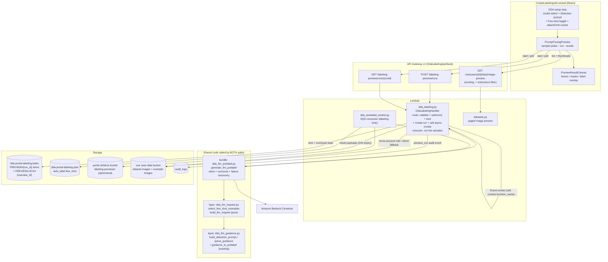

# Design Document — LLM Auto-Label Prompt Tuning and Few-Shot Examples

## Overview

This feature adds two capabilities to the DDA labeling job creation flow, both scoped to the `llm:<model_identifier>` auto-label family:

1. **Prompt_Tuning_Preview** — a step inside the existing `CreateLabelingJob` wizard that runs the currently configured model and Detection_Prompt against 1–5 Sample_Images from the dataset prefix and renders the resulting Pre_Labels on those images, before any Labeling_Job exists.
2. **Few_Shot_Option** — a per-job switch that attaches the job's good/bad example images to every `llm:` model request as identified few-shot context, bounded by a per-model **Model_Image_Limit** (default 20) with deterministic good-then-bad, stored-order truncation.

The design is driven by one hard constraint: **preview must be a faithful predictor of labeling-time behavior** (Req 3.1, 3.2, 6.6, 7.6). Faithfulness is not achieved by re-implementing the worker's logic in the preview path; it is achieved by **extracting the worker's `llm:` request construction, invocation and response handling into shared modules that both paths call literally**. Everything else in the design follows from that plus the portal's established patterns.

Three decisions shape the architecture:

- **Preview runs on the existing `DdaLabelingHandler` Lambda (`dda_labeling.py`), not a new function.** It already carries `SharedLayer`, `get_s3_client_for_bucket` cross-account access with the single-account fallback, `get_usecase`, the `@rbac_check` middleware and `log_audit_event`. It gains `bedrock:InvokeModel` (today only the autolabel worker has it) and a raised timeout.
- **A Preview_Run is asynchronous: `POST` starts it, the wizard short-polls a status route.** API Gateway's integration timeout is a hard 29 s, while a run is 1–5 sequential invocations each capped at 120 s (up to ~600 s). Per-image synchronous requests do not solve this — a *single* image may legitimately take up to 120 s. The async run + poll shape is also the only one that satisfies Req 3.7 (per-image isolation) with progressive results and gives the in-flight guard of Req 8.8 a natural home.
- **Few-shot assembly is a pure function over *references*, and byte reads happen only for the selected subset.** Truncation is a prefix of `good ++ bad` in stored order, so preview and worker provably select the same subset (Req 7.6) and omitted examples are never read (bounding cost and blast radius).

Existing behavior is preserved by construction: the shared request builder emits `[image(target), text(prompt)]` — exactly today's content list — whenever the few-shot list is empty, and the `sam` / `bedrock:` paths are not touched at all (Req 10.1, 10.2).

### Research notes informing the design

- **API Gateway REST integration timeout is a hard maximum of 29 s** per request and cannot be raised beyond it for Lambda proxy integrations, which rules out a synchronous preview endpoint that waits on model calls. The portal already works around this with fire-and-forget `lambda_client.invoke(InvocationType='Event')` plus client polling (DDA distribution, manifest generation, build dispatch).
- **Bedrock Converse accepts multiple `image` blocks in one user message**, which is what makes few-shot attachment possible without a second request; per-request image counts are model-specific (Anthropic vision models document a 20-image guidance figure), which is why Model_Image_Limit is per-model configuration with a default of 20 rather than a hardcoded constant (Req 7.1).
- **The portal's paged image picker already exists** (`datasets.get_image_preview` with `offset`/`limit`, true `total_found`, `has_more`, presigned thumbnail URLs at 1800 s — see the `source-image-picker-pagination` spec). Its extension set is broader than Req 2.1 requires, so the only backend change needed is an additive `extensions` filter parameter.
- **`bedrock_common` lives in the functions bundle, not the shared layer.** Both `dda_labeling.py` and `dda_autolabel_worker.py` are packaged from `backend/functions`, so a functions-bundle module is importable by both; the shared layer (`layers/shared/python/`) stays reserved for the pure, dependency-free logic (as `dda_llm_guidance.py` documents). The extraction is therefore split across two modules accordingly.

## Architecture



### Preview_Run execution flow

1. **Start** — `POST /labeling-preview/runs` on `DdaLabelingHandler`:
   authorize (`@rbac_check([Permission.MANAGE_LABELING_JOBS])` with the body's `usecase_id` injected as scope) **before any other validation** (Req 8.6) → validate the request and enumerate every offending element (Req 8.4, 8.5, 6.3) → resolve each Sample_Image reference to `(bucket, key)` and reject anything outside the Use_Case dataset bucket and prefix (Req 8.3, 8.7) → claim the per-user, per-use-case in-flight lock with a conditional write (Req 8.8) → write the `RUN` item plus one `IMAGE#{i}` item per sample in status `Pending` → `log_audit_event('preview_run')` (Req 3.8) → async self-invoke with `{action: 'execute_preview_run', run_id}` → `202 {run_id, sample_count, status: 'Running'}`. No S3 object is read and no model is invoked on any rejection path.
2. **Execute** — the same Lambda, entered through the non-HTTP `action` branch. For each Sample_Image **in order**: read bytes through `get_s3_client_for_bucket` (Req 3.6), decode pixel dimensions, read the selected few-shot example bytes, then call the shared `dda_llm_prelabel.generate_llm_prelabel(...)` — the identical call the worker makes. Each per-image outcome is written immediately: payload JSON to `labeling-previews/{usecase_id}/{run_id}/{i}.json`, status/category/reason onto the `IMAGE#{i}` item. A per-image failure never aborts the loop (Req 3.7). When the last sample resolves, the `RUN` item flips to `Completed` and the lock is released.
3. **Poll** — `GET /labeling-preview/runs/{runId}` returns the run status and, per sample, its state plus (when resolved) a presigned GET URL for its result payload. The wizard polls every 2 s, fetches each payload once, renders progressively, and stops on `Completed` / `Failed` / lock expiry.

### Labeling-time flow (unchanged except few-shot)

`dda_autolabel_worker._generate_llm_prelabel` keeps its S3 read, dimension check and task bookkeeping, and delegates prompt construction, few-shot assembly, invocation and response handling to the shared module. Few-shot state is read from the **job record** (`auto_label.few_shot`), so no SQS message schema change is needed and messages already in flight across the deployment keep processing (Req 10.3).

## Components and Interfaces

### 1. `dda_llm_request.py` — new shared-layer module (pure)

Same contract as `dda_llm_guidance.py`: pure functions, no boto3, no I/O. This is where the two invariants that must hold across both paths live.

```python
MODEL_IMAGE_LIMIT_DEFAULT = 20          # Req 7.1
FEW_SHOT_GOOD = 'good'
FEW_SHOT_BAD = 'bad'

def resolve_model_image_limit(model_identifier: str,
                              limits: Optional[Dict[str, Any]]) -> int:
    """Model_Image_Limit for one model identifier (Req 7.1). Returns the
    configured integer when it is >= 1, else MODEL_IMAGE_LIMIT_DEFAULT —
    a missing, non-integer, or < 1 entry can never widen or zero the
    bound."""

def select_few_shot_examples(examples: List[Dict],
                             model_image_limit: int) -> Tuple[List[Dict], List[Dict]]:
    """Deterministic (attached, omitted) split (Req 7.3, 7.4, 7.6).

    `examples` are the job's stored references in stored order, each
    {'ref', 'designation': 'good'|'bad', 'position': int}. The attached
    list is the prefix of `good in stored order ++ bad in stored order`
    of length max(0, model_image_limit - 1) — one slot is always
    reserved for the target image. limit == 1 attaches nothing."""

def build_llm_request(modality: str, label_set: List[str],
                      detection_prompt: str, width: int, height: int,
                      per_label_prompts: Optional[Dict[str, str]],
                      target_image: Dict,
                      few_shot_images: Optional[List[Dict]] = None) -> Dict:
    """The Converse `messages` list plus the prompt text for one image.

    target_image / few_shot_images entries are
    {'bytes': b'...', 'format': 'png'|'jpeg', 'designation'?: 'good'|'bad'}.

    The prompt is build_detection_prompt(...) verbatim — unchanged for
    every job (Req 3.1, 10.2). Content layout:

      few-shot empty:  [ {'image': target}, {'text': prompt} ]
      few-shot set:    [ {'text': FEW_SHOT_HEADER},
                         {'text': 'Good example 1:'}, {'image': good1},
                         ... , {'text': 'Bad example 1:'}, {'image': bad1},
                         ... , {'text': FEW_SHOT_TARGET_INTRO},
                         {'image': target}, {'text': prompt} ]

    So the no-few-shot request is byte-identical to the pre-feature
    request (Req 10.2) and the few-shot request keeps the same
    `target image then prompt` suffix, with every example identified as
    good or bad (Req 6.5)."""

def image_format_for_key(key: str) -> str:
    """'png' for .png keys, else 'jpeg' — the worker's existing rule."""
```

Placing selection and layout here makes the central properties (bounded image count, deterministic prefix, preserved no-few-shot shape) testable as pure-function properties with no AWS at all.

### 2. `dda_llm_prelabel.py` — new functions-bundle module (invocation)

The literal extraction of today's `dda_autolabel_worker._generate_llm_prelabel` body from "build prompt" to "convert response", including the failure taxonomy. Both callers get identical behavior because there is one implementation.

```python
class LlmPrelabelError(Exception):
    """category: 'model_error' | 'timeout' | 'unusable_model_output'
       reason:   the exact message the Auto_Labeler records today
       raw_text: the model's raw text when a response was received"""
    category: str
    reason: str
    raw_text: Optional[str]

def generate_llm_prelabel(*, model_identifier: str, modality: str,
                          label_set: List[str], detection_prompt: str,
                          per_label_prompts: Optional[Dict[str, str]],
                          image_bytes: bytes, image_key: str,
                          width: int, height: int,
                          few_shot_images: Optional[List[Dict]] = None,
                          model_image_limit: int = MODEL_IMAGE_LIMIT_DEFAULT,
                          ) -> Dict:
    """One Converse request, then Coordinate_Guidance parse + Pre_Label
    conversion. Returns the modality Pre_Label dict.

    - client from bedrock_common.get_bedrock_client with the read timeout
      clamped to min(config.timeout_seconds, 120) and retries disabled —
      exactly one invocation per call (Req 3.1, 3.3)
    - ReadTimeoutError / ConnectTimeoutError -> category 'timeout',
      reason 'model invocation timed out after {n}s' (Req 3.10, 9.2)
    - any other invocation exception -> category 'model_error',
      reason 'model error: {exc}' (Req 3.10, 9.1)
    - GuidanceError from parse_guidance / guidance_to_prelabel ->
      category 'unusable_model_output', reason = str(exc), raw_text =
      the response text character-for-character (Req 3.11, 9.3)
    """
```

`_generate_llm_prelabel` in the worker becomes: read image (existing), dimensions (existing), resolve `detection_prompt` / `per_label_prompts` (existing), **resolve few-shot** (new, below), call `generate_llm_prelabel`, and translate `LlmPrelabelError` into today's `GenerationFailure(reason)` — so `prelabel_error` strings are unchanged for every existing failure mode.

Few-shot resolution in the worker:

```python
def _resolve_few_shot_images(job, model_identifier):
    """[] unless auto_label.few_shot.enabled is true (an absent or
    malformed few_shot document is disabled — Req 10.3). Otherwise
    select_few_shot_examples(stored examples, resolved limit) and read
    ONLY the attached refs through the same cross-account client the
    dataset image uses. An unreadable example raises
    GenerationFailure("few-shot example image <ref> is not accessible:
    ...") for this image only (Req 6.7)."""
```

### 3. `dda_labeling.py` — Preview_API routes and executor

New routes (registered in `DdaLabelingApiStack`, Cognito-authorized, `@rbac_check([Permission.MANAGE_LABELING_JOBS])` with the Use_Case scope injected from the body/run record exactly as the `/labeling/{id}/review*` routes do):

| Method & path | Purpose |
|---|---|
| `POST /labeling-preview/runs` | Validate, authorize, claim the in-flight lock, create the run, async-invoke the executor. `202` with `run_id`. |
| `GET /labeling-preview/runs/{runId}` | Run status + per-sample state, category, reason, and a presigned result-payload URL per resolved sample. |

Request body:

```jsonc
{
  "usecase_id": "uc-1",
  "dataset_prefix": "training-images/",
  "model": "llm:us.amazon.nova-pro-v1:0",
  "detection_prompt": "Locate every scratch...",   // raw, character-for-character
  "task_type": "ObjectDetection",
  "label_set": ["scratch", "dent"],
  "sample_images": ["training-images/a.jpg", "..."],  // 1..5, key or s3:// URI
  "few_shot": {
    "enabled": true,
    "examples": [                                    // <=10 good, <=10 bad
      {"ref": "s3://uc-bucket/labeling-examples/job-1/good/0-a.jpg",
       "designation": "good", "position": 0}
    ]
  }
}
```

Validation order, and the reason it is fixed (Req 8.6): **authorization → request validation → scope resolution → concurrency claim**. Authorization failures answer `403` with a fixed body (`{"error": "Not authorized"}`) that is identical whether or not the Use_Case or the referenced objects exist (Req 8.2), plus an `unauthorized_access` audit event, following the pattern already used for skip-verification job creation.

Validation rules (all evaluated together so the response enumerates every offending element, Req 8.4):

| Rule | Error |
|---|---|
| `model` must start with `llm:` and pass `validate_model_identifier` | `model` — names the disallowed identifier (Req 8.5) |
| `detection_prompt` non-empty after trim, ≤ 2000 raw characters | `detection_prompt` |
| `task_type` in the three modalities; `label_set` valid for it (`_validate_label_set`; Classification is the fixed binary set) | `task_type` / `label_set` |
| `1 <= len(sample_images) <= 5` | `sample_images` |
| every sample resolves inside `(dataset_bucket, dataset_prefix)` | `sample_images` — one entry per out-of-scope reference (Req 8.3) |
| `few_shot.enabled` ⇒ ≥ 1 example, ≤ 10 per designation, JPEG/PNG, each ref inside the Use_Case data bucket | `few_shot` (Req 6.3) |

Executor entry (non-HTTP): `handler` gains an `action` branch ahead of the HTTP dispatch — `{'action': 'execute_preview_run', 'run_id': ...}` — mirroring `dda_labeling_worker`'s action dispatch. The executor is the **same function**, self-invoked with `context.function_name` (not an environment variable, which would be a CloudFormation self-reference).

### 4. Sample_Image listing — additive change to `datasets.get_image_preview`

The picker reuses the existing paged preview endpoint (offset/limit, exact `total_found`, `has_more`, 1800 s presigned thumbnail URLs). One additive parameter:

- `extensions` (optional, comma-separated). When present, only those extensions are listed; when absent the existing six-extension set applies unchanged. The picker sends `extensions=jpg,jpeg,png` (Req 2.1).

The wizard uses `limit=50` (the endpoint's per-page cap, within Req 2.7's "at most 100"), so every image under the prefix is reachable by paging. An empty page-0 result with `total_found == 0` is the *empty prefix* case; a non-2xx response is the *inaccessible prefix* case — distinct messages (Req 2.5), both disabling the run control, both retryable (Req 2.6).

### 5. Frontend — `PromptTuningPreview` component and wizard wiring

`CreateLabelingJob.tsx` already computes `isLlmAutoLabelModel`; the new controls hang off it, so `sam` / `bedrock:` / no-model states render nothing new (Req 1.2, 10.5).

New state and controls in the DDA setup step:
- `fewShotEnabled` (default `false`, Req 6.1), rendered only while `isLlmAutoLabelModel`. Switching the model away from the `llm:` family clears it in the existing compatibility `useEffect`, so submission carries `few_shot.enabled === false` (Req 6.9).
- An attach/omit hint: with `limit` resolved for the selected model, `attached = min(total, limit - 1)`, `omitted = total - attached`, recomputed whenever the model or either example list changes (Req 7.5). `limit` comes from the model options payload (see 6) and falls back to 20.
- `ensureExampleImagesUploaded()`: the existing `uploadExampleImages()` hoisted into a memoized helper keyed by the current file lists. Preview-with-few-shot calls it before starting a run; submission calls it and reuses the cached URIs, so examples are uploaded exactly once per file set and the same refs are previewed and persisted.

`PromptTuningPreview` (new, `components/labeling/`):
- **Sample picker** — paged grid of key + thumbnail, checkbox selection capped at 5, selection retained across pages and across runs (Req 2.2, 2.3, 5.2). A thumbnail whose `` fails renders its key instead and stays selectable (Req 2.8).
- **Run control** — pre-flight validation identical to the API's rules; on rejection it lists every violated rule, issues no request, and leaves all wizard state untouched (Req 1.4, 2.4, 6.2). While a run is in flight the control is disabled and an in-progress indication shows (Req 1.7, 4.5).
- **Results** — one entry per requested sample, keyed by sample key (Req 4.6). A new run's results replace the previous set wholesale once the first result of the new run arrives; a run that fails before producing any result leaves the previous set displayed unchanged (Req 5.3, 5.4).
- **Failures** — category badge + reason next to the sample; `unusable_model_output` entries additionally offer the complete raw model text in an expandable region with no truncation (Req 9.7, 9.8).

`PreviewResultCanvas` (new): read-only overlay renderer. It **reuses `AnnotationCanvas`'s exported pure helpers** — `parseRleCounts`, `decodeRleColumnMajor`, `clampBoxToImage`, `CLASS_PALETTE` — so preview geometry, RLE decoding and class colors are the same logic and the same palette the labeler workspace uses, without adding a read-only mode to the editing component (which would put the labeler workspace at regression risk for a display-only feature). It draws boxes with adjacent class names, masks as translucent per-class fills, and renders Classification results as the label text beside the image; a zero-detection Pre_Label renders an explicit "no detections" state, visually distinct from both a populated result and a failure (Req 4.1–4.4).

### 6. Model_Image_Limit configuration surface

- Backend: `LLM_MODEL_IMAGE_LIMITS` (JSON object, default `{}`) on `DdaLabelingHandler`, `DdaAutolabelWorker`, and the data-accounts handler; resolved everywhere through `resolve_model_image_limit`, so one config source feeds both request paths and the UI (Req 7.1, 7.6).
- API: `list_bedrock_model_options` gains `image_limit` per option (additive field; existing consumers ignore it).
- Frontend: uses `image_limit` when present, else the shared default of 20, for the attach/omit hint only — the backend remains authoritative for what is actually attached.

### 7. Infrastructure changes (`compute-stack.ts`, `dda-labeling-api-stack.ts`, `storage-stack.ts`)

- `ddaLabelingHandler`: `timeout` 30 s → 900 s (a cap, not a reservation; the HTTP routes still return in well under a second, and the executor needs 5 × 120 s plus S3 reads); add `bedrock:InvokeModel` / `bedrock:InvokeModelWithResponseStream` with the same foundation-model + inference-profile resource scope the autolabel worker uses; add `LLM_MODEL_IMAGE_LIMITS`; and grant the function permission to invoke **itself** for the async executor hand-off.
- **The self-invoke grant must not go through `grantInvoke(self)`.** `ddaLabelingHandler.grantInvoke(ddaLabelingHandler)` appends the statement to the role's default policy, which the role construct owns; the Lambda function depends on its role's entire subtree, so a statement referencing the function's own ARN closes a CloudFormation dependency cycle (`policy -> function -> policy`) and the template will not synthesize into a deployable stack. The shipped implementation instead attaches a standalone `new iam.Policy(this, 'DdaLabelingSelfInvokePolicy', ...)` to the same role, granting `lambda:InvokeFunction` on `ddaLabelingHandler.functionArn` and `${functionArn}:*`. A standalone policy is a sibling of the function rather than a child of the role, so the only remaining edge is `policy -> function` and the cycle is broken. This mirrors the existing `NodeGeneratorSelfInvokePolicy` pattern in `node-designer-stack.ts`. The resulting permissions are identical, so the CDK assertion for "self-invoke permission" holds either way — but only the standalone-policy form deploys.
- `DdaLabelingApiStack`: `/labeling-preview/runs` (`POST`) and `/labeling-preview/runs/{runId}` (`GET`) on the imported API root, with the stack's existing authorizer, CORS options and route-salted deployment.
- `labelingTasksTable`: add `timeToLiveAttribute: 'ttl'` so preview run/lock items are reaped automatically. Correctness never depends on TTL — expiry is enforced by comparing `expires_at` in the conditional write and in reads — TTL is only cleanup.
- Portal artifacts bucket: lifecycle rule expiring `labeling-previews/` after 1 day.

## Data Models

### Labeling_Job record — additive `auto_label.few_shot`

The Few_Shot_Option and the ordered example set are persisted inside the existing `auto_label` sub-document of the job item in `dda-portal-labeling-jobs`, so nothing else about the record changes:

```jsonc
{
  "job_id": "labeling-1a2b3c4d",
  "auto_label": {
    "enabled": true,
    "model": "llm:us.amazon.nova-pro-v1:0",
    "detection_prompt": "Locate every scratch...",        // unchanged, raw
    "few_shot": {                                          // NEW, llm: only
      "enabled": true,
      "examples": [                                        // stored order
        {"ref": "s3://uc-bucket/labeling-examples/j/good/0-a.jpg",
         "designation": "good", "position": 0},
        {"ref": "s3://uc-bucket/labeling-examples/j/good/1-b.png",
         "designation": "good", "position": 1},
        {"ref": "s3://uc-bucket/labeling-examples/j/bad/0-c.jpg",
         "designation": "bad",  "position": 0}
      ]
    }
  },
  "example_images": {"good": ["s3://..."], "bad": ["s3://..."]}   // UNCHANGED
}
```

- `designation` + `position` make the attachment order recoverable independently of list ordering in storage (Req 6.4); `position` is per designation, matching the wizard's per-kind upload order.
- `example_images` keeps its existing labeler-instruction role untouched, whether few-shot is on or off (Req 10.6). `few_shot.examples` is derived from it at creation time, so the two never disagree at creation and the derived copy is immutable for the life of the job (a job's request shape cannot drift).
- **Compatibility contract (Req 10.3):** the resolver treats *absent*, `null`, non-dict, `enabled` falsy, or an empty/invalid `examples` list as **disabled**. Only `enabled is True` with at least one well-formed example produces attachments. `few_shot` is written as `{"enabled": false}` for `llm:` jobs with the option off (Req 10.6) and is **not written at all** for `sam` / `bedrock:` jobs (Req 10.1).

### Preview run state — `dda-portal-labeling-tasks`, `PREVIEW#{run_id}` partition

Reusing the tasks table avoids a new table and a new GSI; preview items carry no `assignee_user_id`, so the `assignee-index` never projects them and no labeler query can see them.

| Item | Key | Attributes |
|---|---|---|
| Run | `job_id='PREVIEW#{run_id}'`, `task_id='RUN'` | `usecase_id`, `created_by`, `model`, `task_type`, `label_set`, `detection_prompt`, `few_shot_enabled`, `attached_example_count`, `sample_count`, `status` (`Running`\|`Completed`\|`Failed`), `created_at`, `expires_at`, `ttl` |
| Sample | `job_id='PREVIEW#{run_id}'`, `task_id='IMAGE#{i:03d}'` | `sample_key`, `state` (`Pending`\|`Succeeded`\|`Failed`), `failure_category`, `failure_reason`, `result_s3_key`, `resolved_at`, `ttl` |
| Lock | `job_id='PREVIEWLOCK#{usecase_id}'`, `task_id='USER#{user_sub}'` | `run_id`, `claimed_at`, `expires_at`, `ttl` |

The lock is claimed with a single conditional write and is the whole of the Req 8.8 guard:

```python
locks.put_item(
    Item={..., 'expires_at': now + lock_ttl, 'ttl': now + lock_ttl + 3600},
    ConditionExpression=('attribute_not_exists(task_id) '
                         'OR expires_at < :now'),
    ExpressionAttributeValues={':now': now})
# ConditionalCheckFailedException -> 409 "a preview run is already in
# progress for this use case"; nothing is read and no model is invoked.
```

`lock_ttl = min(sample_count * 120 + 60, 900)` — it can never outlive the executor, so a crashed executor self-heals within one run bound without any reaper. The executor deletes the lock on every terminal path.

### Preview result payload — portal artifacts bucket (ephemeral)

`s3://{PORTAL_ARTIFACTS_BUCKET}/labeling-previews/{usecase_id}/{run_id}/{i}.json`

```jsonc
{
  "sample_key": "training-images/a.jpg",
  "state": "Succeeded",
  "prelabel": {"modality": "ObjectDetection", "boxes": [...],
               "image_width": 1920, "image_height": 1080},
  "image_width": 1920, "image_height": 1080
}
```
```jsonc
{
  "sample_key": "training-images/b.jpg",
  "state": "Failed",
  "failure_category": "unusable_model_output",
  "failure_reason": "detection 0: class 'rust' is not in the Label_Set",
  "raw_model_output": "```json\n{\"detections\": [...]}\n```"   // verbatim
}
```

Payloads live in S3 rather than DynamoDB because a Segmentation Pre_Label carries one RLE counts string per region — up to ~100 regions on a multi-megapixel image, which can exceed DynamoDB's 400 KB item limit — and because raw model output must be returned character-for-character (Req 9.3). This is the same reason `dda_autolabel_worker` writes pre-labels to S3.

**This is not a Pre_Label artifact in the pipeline sense (Req 1.6, 3.5):** it is written under a dedicated `labeling-previews/` prefix keyed by run id, never under `labeling/{usecase_id}/{job_id}/prelabels/`, is referenced by no Labeling_Job or Task_Assignment, is readable only through the run's own presigned URL, and is expired by bucket lifecycle after 1 day. No job record, task item, or notification is produced by any preview path.

### Preview_Result wire shape (`GET /labeling-preview/runs/{runId}`)

```jsonc
{
  "run_id": "preview-9f8e7d6c",
  "status": "Running",
  "sample_count": 3,
  "few_shot": {"enabled": true, "attached": 19, "omitted": 2},
  "results": [
    {"index": 0, "sample_key": "training-images/a.jpg", "state": "Succeeded",
     "result_url": "https://...", "result_url_expires_in": 900},
    {"index": 1, "sample_key": "training-images/b.jpg", "state": "Failed",
     "failure_category": "timeout",
     "failure_reason": "model invocation timed out after 120s",
     "result_url": "https://..."},
    {"index": 2, "sample_key": "training-images/c.jpg", "state": "Pending"}
  ]
}
```

Exactly one entry per requested Sample_Image, in request order, for the life of the run (Req 3.5, 4.6). Failure category and reason are duplicated onto the status response so the wizard can render a failure without fetching its payload; the payload adds the raw model output.

### Failure category set (Req 9.6)

`model_error` | `timeout` | `unusable_model_output` | `image_access_failure` | `unsupported_image_content` | `unreadable_example_image`

Exactly one category per failed Preview_Result. The first three are produced by `dda_llm_prelabel.LlmPrelabelError` (shared with the worker, so the reasons match Req 3.10, 3.11); the last three are produced by the preview executor's pre-invocation steps and imply zero model invocations for that sample (Req 3.9, 6.8).

### Model_Image_Limit configuration

```jsonc
// LLM_MODEL_IMAGE_LIMITS (Lambda environment, JSON object)
{"us.amazon.nova-pro-v1:0": 20, "some.model-with-tighter-bound": 4}
```

Unlisted models resolve to `MODEL_IMAGE_LIMIT_DEFAULT = 20`; a non-integer or `< 1` entry also resolves to the default, so configuration can never produce a request with zero images or an unbounded one (Req 7.1).

## Correctness Properties

*A property is a characteristic or behavior that should hold true across all valid executions of a system — essentially, a formal statement about what the system should do. Properties serve as the bridge between human-readable specifications and machine-verifiable correctness guarantees.*

The properties below are the consolidated result of the acceptance-criteria prework: overlapping criteria (control visibility, validation enumeration, request identity, few-shot bounds, failure taxonomy) were merged so each property carries unique validation value.

### Property 1: Preview and Auto_Labeler issue identical model requests

*For any* Labeling_Modality, Label_Set, Detection_Prompt, per-label prompt map, image bytes, image dimensions, few-shot configuration and `llm:` model identifier, the Converse request the Preview_API issues for a Sample_Image and the Converse request the Auto_Labeler issues for a dataset image with the same configuration SHALL be equal in every element — model id, message content blocks in order, image bytes and formats, prompt text, and inference configuration — and exactly one invocation SHALL be issued per image.

**Validates: Requirements 3.1, 6.6, 7.6**

### Property 2: Preview and Auto_Labeler derive identical outcomes from identical model output

*For any* model response text (valid Coordinate_Guidance, malformed JSON, unknown class, out-of-bounds or degenerate geometry, over-limit detection counts, empty detections) and any modality, Label_Set and image dimensions, the Preview_API's outcome SHALL equal the Auto_Labeler's outcome for that response: the same converted Pre_Label on success, or the same failure reason string on rejection.

**Validates: Requirements 3.2, 3.11, 9.3**

### Property 3: Few-shot selection is a deterministic, bounded, order-preserving prefix

*For any* stored example set (at most 10 good and 10 bad, in stored order) and any Model_Image_Limit of at least 1, the attached example list SHALL equal the first `Model_Image_Limit - 1` entries of *good examples in stored order followed by bad examples in stored order*, the omitted list SHALL be exactly the remainder, the total image count of the resulting request (attached examples plus the target image) SHALL be at least 1 and at most Model_Image_Limit, repeated evaluation SHALL yield the identical selection, and every attached example SHALL be immediately preceded by content identifying it as a good or a bad example.

**Validates: Requirements 6.5, 7.2, 7.3, 7.4, 7.6**

### Property 4: A request without few-shot examples keeps the pre-feature shape

*For any* `llm:` job configuration in which the Few_Shot_Option is disabled, absent, `null`, or malformed in the job record, the model request content SHALL be exactly the target image block followed by the text block produced by `build_detection_prompt` from the Detection_Prompt character-for-character, the Label_Set and the image's pixel dimensions — no example image blocks and no example identification content — and no failure SHALL be attributable to the few-shot configuration.

**Validates: Requirements 10.2, 10.3**

### Property 5: Untouched model families and job creation are unchanged

*For any* Labeling_Job configuration using the `sam` model or a `bedrock:` model, the creation validation outcome, the model request content, and the generated Pre_Label SHALL equal the pre-feature behavior for that configuration, with no example image blocks and no few-shot identification content in any request; and *for any* job submission that omits the Few_Shot_Option, the creation outcome SHALL equal the pre-feature outcome, with the option persisted as disabled and the job's example images retained unchanged in their labeler-instruction role.

**Validates: Requirements 10.1, 10.4, 10.5, 10.6**

### Property 6: Rejected Preview_Run requests enumerate every violation and touch nothing

*For any* Preview_Run request violating a non-empty subset of the request rules — non-`llm:` model identifier, empty-after-trim or over-2000-character Detection_Prompt, Label_Set invalid for the modality, zero or more than five Sample_Images, a Sample_Image resolving outside the Use_Case's dataset bucket and prefix, or the Few_Shot_Option enabled with zero example references — the Preview_API SHALL reject the request with an error naming every violated rule and every out-of-scope reference, SHALL read no referenced object, and SHALL invoke no model; and equivalent spellings of the same object reference (bare key versus `s3://` URI) SHALL receive the identical scope classification.

**Validates: Requirements 6.3, 8.3, 8.4, 8.5, 8.7**

### Property 7: Authorization precedes and hides everything

*For any* requesting user without authorization to create DDA labeling jobs in the target Use_Case, and *for any* Preview_Run request from that user — including requests that also violate other validation rules and requests naming a non-existent Use_Case or non-existent objects — the Preview_API SHALL answer with the same authorization error carrying no dataset content and no existence information, SHALL never answer with a validation error instead, SHALL read no Sample_Image, and SHALL invoke no model.

**Validates: Requirements 8.2, 8.6**

### Property 8: One in-flight Preview_Run per user and Use_Case

*For any* sequence of Preview_Run requests from one user in one Use_Case, at most one run SHALL be executing at any time: a request arriving while that user's run is in flight in that Use_Case SHALL be rejected with an already-in-progress error and SHALL invoke no model, and after the in-flight run reaches a terminal state or its claim expires, a subsequent request from the same user SHALL be accepted.

**Validates: Requirements 8.8**

### Property 9: Every Sample_Image yields exactly one categorized outcome, independently

*For any* Preview_Run over 1 to 5 Sample_Images and *any* mix of per-sample conditions (unreadable object, undecodable dimensions, unreadable attached example, invocation timeout, model error, unusable output, valid guidance, empty detections), the run SHALL return exactly one Preview_Result per requested Sample_Image paired with that Sample_Image, each result SHALL be either a converted Pre_Label or a failure carrying exactly one category from the defined category set with its reason, a failure for one Sample_Image SHALL not change the outcome of any other Sample_Image, and samples failing before invocation (unreadable object, undecodable dimensions, unreadable example image) SHALL have had no model invoked.

**Validates: Requirements 3.5, 3.7, 3.9, 6.8, 9.1, 9.2, 9.4, 9.5, 9.6**

### Property 10: An unreadable example image fails only its own target image

*For any* Labeling_Job or Preview_Run with the Few_Shot_Option enabled in which an attached example image is unreadable, the affected target image (dataset image or Sample_Image) SHALL fail with a reason identifying that example image, and every other image of the job or run SHALL be processed and resolved as it would have been.

**Validates: Requirements 6.7, 6.8**

### Property 11: A Preview_Run produces no labeling-pipeline state

*For any* Preview_Run, whatever its per-sample outcomes, the set of Labeling_Job records, Task_Assignment items and Pre_Label artifacts under `labeling/{usecase_id}/` SHALL be unchanged from before the run, and no labeler notification SHALL be sent.

**Validates: Requirements 1.6, 3.5**

### Property 12: Model requests carry only image and prompt content

*For any* Preview_Run or Auto_Labeler request, every content block of the request SHALL be either an image block or a text block derived from the Detection_Prompt, Label_Set, dimensions, per-label prompts or few-shot identification text, and no request field SHALL contain dataset credentials, presigned URLs, role ARNs or portal configuration secrets.

**Validates: Requirements 3.4**

### Property 13: Model_Image_Limit resolution is total and safe

*For any* model identifier and *any* limit configuration — missing entry, non-integer value, value below 1, or a valid value — the resolved Model_Image_Limit SHALL be an integer of at least 1, and SHALL be 20 whenever no valid configured value exists for that identifier.

**Validates: Requirements 7.1**

### Property 14: Prompt Tuning controls appear exactly for the `llm:` family

*For any* auto-label model selection state in the job creation flow, the Prompt_Tuning_Preview controls and the Few_Shot_Option control SHALL be present if and only if the selected model identifier is in the `llm:` family, the Few_Shot_Option SHALL default to disabled whenever it is presented, and *for any* transition of the selection away from the `llm:` family while the option was enabled, the submitted Labeling_Job SHALL carry the Few_Shot_Option disabled.

**Validates: Requirements 1.1, 1.2, 6.1, 6.9, 10.5**

### Property 15: Client-side validation names every violation, sends nothing, and keeps state

*For any* job creation flow state violating a non-empty subset of the preview start rules — empty-after-trim or over-length Detection_Prompt, invalid Label_Set for the modality, zero or more than five selected Sample_Images, or the Few_Shot_Option enabled with zero example images — the Portal SHALL display a validation message identifying every violated rule, SHALL issue no Preview_API request, and SHALL leave every value entered in the job creation flow unchanged.

**Validates: Requirements 1.4, 2.4, 6.2**

### Property 16: Preview run failures leave the flow usable and intact

*For any* Preview_Run failure — request rejection, transport error, non-2xx response, run status failure, or a run that returns no result within the per-Sample_Image bound — the Portal SHALL display an error indicating the failure, SHALL re-enable starting a Preview_Run, and SHALL leave every value entered in the job creation flow unchanged.

**Validates: Requirements 1.8, 4.7**

### Property 17: Results are displayed per sample, replaced wholly, and preserved on failure

*For any* pair of consecutive Preview_Runs, when the second run returns results the displayed set SHALL be exactly the second run's Preview_Results (one entry per requested Sample_Image, each paired with its own Sample_Image, with no entry from the first run remaining); and when the second run fails before returning any Preview_Result the displayed set SHALL remain exactly the first run's Preview_Results unchanged.

**Validates: Requirements 4.6, 5.3, 5.4**

### Property 18: Rendering reflects each result's modality, emptiness and failure

*For any* Preview_Result set, the Portal SHALL render for each successful result its Pre_Label content in the job's modality — every bounding box positioned proportionally to the displayed image with its Label_Set class name adjacent, every mask region positioned proportionally with its class name associated, or the classification label beside the image — SHALL render a zero-detection result with an empty-result indication distinct from both a populated result and a failed result, and SHALL render each failed result with its failure category and reason beside its Sample_Image, making the complete raw model output viewable without truncation for results categorized as unusable model output.

**Validates: Requirements 4.1, 4.2, 4.3, 4.4, 9.7, 9.8**

### Property 19: Only JPEG and PNG objects are listed, and every one is reachable

*For any* set of objects under the dataset prefix, the Sample_Image listing SHALL contain exactly the objects whose keys end in `.jpg`, `.jpeg` or `.png` case-insensitively, the union of all pages SHALL equal that set with each page containing at most 100 images, and the reported total SHALL equal the size of that set.

**Validates: Requirements 2.1, 2.2, 2.7**

### Property 20: Attached and omitted counts shown match what is attached

*For any* stored example set and any resolved Model_Image_Limit, the attached and omitted example counts the Portal displays SHALL equal the sizes of the attached and omitted lists the shared selection produces for that set and limit, recomputed after every change to the selected model or the example set.

**Validates: Requirements 7.5**

### Property 21: Submission carries the form's values, not a run's values

*For any* sequence of Preview_Runs followed by job submission, the submitted Detection_Prompt, LLM_Auto_Label_Model and Few_Shot_Option SHALL equal the values held in the job creation form at submission time, independently of the configuration of any completed Preview_Run; and *for any* created Labeling_Job with the Few_Shot_Option enabled, the persisted record SHALL contain the option value and, for every example image reference, its good-or-bad designation and its position in the stored order, recovering the submitted example set and order exactly.

**Validates: Requirements 5.5, 6.4**

## Error Handling

### Preview_API — whole-request rejections

| Condition | Status | Body | Side effects |
|---|---|---|---|
| Caller lacks DDA job creation authorization in the Use_Case (checked first) | `403` | `{"error": "Not authorized"}` — identical whether or not the Use_Case or objects exist | `unauthorized_access` audit event only; no S3 read, no model call |
| Any request-validation rule violated (model family, prompt, modality/Label_Set, sample count, out-of-scope sample, few-shot with zero examples) | `400` | `{"error": "Preview run validation failed", "validation_errors": [{"parameter", "message", ...}]}` — one entry per violation, reusing `_validation_error` | none |
| Another run in flight for this user and Use_Case | `409` | `{"error": "A preview run is already in progress for this use case"}` | none; the existing lock is not disturbed |
| Use_Case not found / no data bucket configured | `400` | validation error on `usecase_id` (after the authorization check, so an unauthorized caller cannot use it as an existence oracle) | none |
| Run id unknown or owned by another user (`GET`) | `404` | `{"error": "Preview run not found"}` | none |
| Executor async-invoke fails after the run is recorded | `202` still returned, run item flipped to `Failed` with `run_error` | wizard surfaces the run failure (Req 4.7) | lock released |

### Preview_API — per-Sample_Image failures

Every failure carries exactly one category (Req 9.6). Categories 1–3 come from the shared `dda_llm_prelabel` module, so their reasons are literally the strings the Auto_Labeler records today.

| Category | Trigger | Reason | Model invoked |
|---|---|---|---|
| `image_access_failure` | Sample_Image `get_object` fails (missing, denied, cross-account role failure) | `image s3://{bucket}/{key} is not accessible: {cause}` | no |
| `unsupported_image_content` | PNG/JPEG header parsing yields no dimensions | `unsupported image content: could not determine image dimensions for coordinate guidance` | no |
| `unreadable_example_image` | an attached few-shot example cannot be read | `few-shot example image {ref} is not accessible: {cause}` | no |
| `timeout` | `ReadTimeoutError` / `ConnectTimeoutError` from Converse | `model invocation timed out after {n}s` | yes, once |
| `model_error` | any other invocation exception | `model error: {cause}` | yes, once |
| `unusable_model_output` | `GuidanceError` from `parse_guidance` / `guidance_to_prelabel` | the `GuidanceError` message verbatim (no parseable JSON, structural mismatch, unrecognized class, malformed geometry, detection-count cap, conversion failure) plus `raw_model_output` character-for-character | yes, once |

A per-sample failure is written to that sample's item and payload and the loop continues (Req 3.7). The run itself still completes with status `Completed` even when every sample failed — "run failed" is reserved for failures that prevent per-sample results altogether (Req 4.7 vs 9.x).

### Auto_Labeler (labeling time)

- `LlmPrelabelError` is translated into today's `GenerationFailure(reason)`, so `prelabel_error` values for existing failure modes are byte-identical to the pre-feature strings, and skip-verification jobs keep writing `autolabel_error` and decrementing `autolabel_pending` exactly as before.
- An unreadable attached example fails only that dataset image (`GenerationFailure`), the batch loop continues, and the task is marked `Failed` with the example-naming reason (Req 6.7). Since the failure is deterministic for the job, the DLQ is not involved — the task resolves, it does not redrive.
- A malformed `auto_label.few_shot` document is treated as disabled rather than an error, so no legacy or hand-edited record can fail a job (Req 10.3).

### Frontend

- **Listing errors** distinguish inaccessible prefix (non-2xx) from empty prefix (`total_found === 0`), name the prefix, and disable the run control; a refresh re-executes the listing and re-enables it on success (Req 2.5, 2.6).
- **Thumbnail failures** fall back to the object key and keep the image selectable (Req 2.8).
- **Example upload failures** (few-shot enabled) abort the preview start with the failing file named, issue no Preview_API request, and leave wizard state intact — the same failure semantics the existing submit-time upload already has.
- **Run failures and per-image failures** never clear the form; polling stops on terminal status, on a `404` (expired run), and after a bounded overall wait of `sample_count × 120 s + 60 s`, after which the wizard reports the run as failed and re-enables the control (Req 1.8).

## Testing Strategy

### Dual approach

Unit and integration tests cover concrete flows, wiring and error branches; property-based tests cover the universal invariants above. Backend tests follow the established `edge-cv-portal/backend/tests/` pattern (pytest + moto for S3/DynamoDB, the real shared layer on `sys.path`, synthetic API Gateway events, stubbed Bedrock clients) with **Hypothesis** for properties — the same shape as `test_property_llm_autolabel_invariance.py`. Frontend tests use vitest + `@testing-library/react` with **fast-check** for properties (already a frontend dev dependency) and mocked `apiService`.

Property test configuration (mandatory):
- Each correctness property is implemented by a **single** property-based test.
- Minimum **100 iterations** per property (`@settings(max_examples=100)` / `fc.assert(..., {numRuns: 100})`).
- Each test is tagged with a comment: `Feature: llm-autolabel-prompt-tuning, Property {number}: {property text}`.
- Property-based testing libraries are used as-is; no hand-rolled generators framework.

### Property test placement

| Property | Test file | Notes |
|---|---|---|
| 1, 2 | `backend/tests/test_property_preview_worker_request_identity.py` | Drives both `dda_labeling` preview executor and `dda_autolabel_worker._generate_llm_prelabel` against one stub Converse client; compares captured kwargs and outcomes |
| 3, 4, 13 | `backend/tests/test_property_few_shot_selection.py` | Pure shared-layer functions; no AWS |
| 5 | `backend/tests/test_property_llm_autolabel_preservation.py` | Baseline captured from the pre-change code paths (sam / bedrock: / llm: without few-shot) |
| 6, 7, 8 | `backend/tests/test_property_preview_api_guards.py` | moto tables, stubbed S3/Bedrock spies asserting zero calls |
| 9, 10, 11, 12 | `backend/tests/test_property_preview_run_outcomes.py` | Generated per-sample condition mixes; asserts pairing, categories, isolation, and absence of pipeline state |
| 14, 15, 16, 17, 18, 20, 21 | `frontend/src/components/labeling/PromptTuningPreview.property.test.tsx` | fast-check over wizard/model/result states; Property 21's persistence half is asserted in the backend creation test |
| 19 | `backend/tests/test_property_image_preview_extensions.py` | Extends the existing pagination property file's approach with the `extensions` filter |

### Unit tests

**Backend**
- `dda_llm_request`: prompt text equals `build_detection_prompt` output; content layout for empty / good-only / bad-only / mixed few-shot; `limit == 1` attaches nothing; `image_format_for_key` on `.PNG` / `.jpeg` / extensionless keys.
- `dda_llm_prelabel`: Bedrock client built with `min(config.timeout_seconds, 120)` and retries disabled (Req 3.3); one `converse` call per invocation; exception→category mapping for timeout, throttling, validation and generic errors; `raw_text` populated only when a response was received.
- Preview routes: request parsing, the 403/400/409/404 branches in the table above, audit event fields (user, Use_Case, model, sample count — Req 3.8), presigned result URLs, unknown/foreign `run_id`.
- Executor: sequential processing, per-sample item writes, terminal run transition, lock release on success and on an unexpected exception, lock expiry allowing a later run.
- Job creation: `few_shot` persisted with designations and positions; `{"enabled": false}` for `llm:` without the option; absent for `sam` / `bedrock:`; submissions omitting the field accepted unchanged.
- Worker: `_resolve_few_shot_images` disabled-by-default for absent/malformed documents; only attached refs are read (omitted refs assert zero `get_object` calls); unreadable example reason text.
- `datasets.get_image_preview`: `extensions` filter applied; absent parameter preserves the existing six-extension behavior byte-for-byte.

**Frontend**
- Few-shot toggle default off, hidden for non-`llm:` models, cleared on model family change.
- Attach/omit hint text at limit boundaries (total < limit-1, total == limit-1, total > limit-1, limit == 1) and after model change.
- `ensureExampleImagesUploaded` uploads once per file set and reuses cached URIs for the subsequent submission (asserted by call counts).
- Sample picker: 5-selection cap, selection persistence across pages and runs, thumbnail fallback, empty-vs-inaccessible messages, retry re-enabling the run.
- Polling: stops on `Completed`/`Failed`/`404`, honors the overall bound, renders progressive results as samples resolve.
- `PreviewResultCanvas`: box scaling and class labels, RLE mask decode via the shared helper, classification label, zero-detection indication, raw-output disclosure for `unusable_model_output`.

### Integration tests

- **End-to-end preview (moto + stub Converse)**: seed a use-case dataset prefix, POST a run as an authorized user, drive the executor invocation inline, poll the status route until `Completed`, and assert per-sample payloads, the audit event, released lock, and unchanged jobs/tasks tables (Property 11 at the handler level).
- **Cross-account read path**: single-account direct-access fallback exercised through `get_s3_client_for_bucket` for both Sample_Images and example images (Req 3.6).
- **Worker few-shot path**: an `llm:` job with few-shot enabled processed through the SQS record path with a stub Converse client, asserting attached example ordering and identification, and that the same job with few-shot disabled produces the pre-feature request.
- **Infrastructure (CDK assertions)**: `DdaLabelingHandler` has `bedrock:InvokeModel`, a timeout of at least the per-run bound, self-invoke permission, and `LLM_MODEL_IMAGE_LIMITS`; the two preview routes exist under the API with the authorizer attached; the tasks table has TTL enabled; the artifacts bucket has the `labeling-previews/` expiration rule.
- **Frontend build gate**: production `tsc` type check passes with the new API client types and components.

### Smoke tests

- A deployed `POST /labeling-preview/runs` with one Sample_Image returns `202` and reaches `Completed`, confirming the Bedrock grant, the raised timeout and the self-invoke path in a real environment (single execution; not a property).
