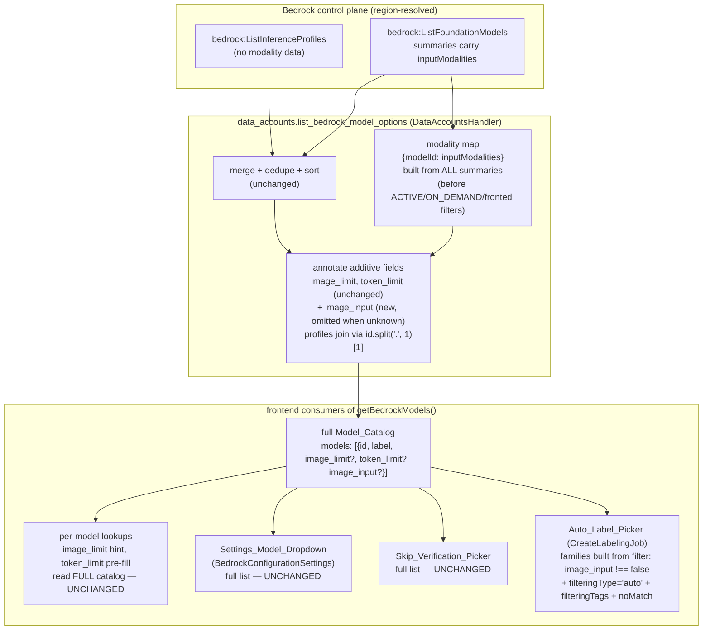

# Design Document — LLM Model Picker Search and Image Filter

## Overview

This feature touches exactly two code paths: the Model_Catalog_Endpoint (`data_accounts.list_bedrock_model_options`) gains an additive per-option Image_Input_Capability annotation, and the labeling wizard's Auto_Label_Picker (`CreateLabelingJob.tsx`) gains a capability filter and type-to-search. No request path, no persistence, and no infrastructure changes: `data_accounts.py` already holds the two Bedrock list calls and already rides on `DataAccountsHandler` in `EdgeCVPortalComputeStack` with the `bedrock:ListFoundationModels` / `bedrock:ListInferenceProfiles` permissions it needs — `inputModalities` is a field of a response the Lambda already receives and currently drops.

Four decisions shape the design:

- **The backend annotates; only the Auto_Label_Picker filters.** The Model_Catalog_Endpoint keeps returning the full catalog and adds one additive field per option. Rationale: the same endpoint feeds three consumers — the Auto_Label_Picker (image use: filter applies), the admin-only Skip_Verification_Picker (left unchanged, see below), and the Settings_Model_Dropdown in `BedrockConfigurationSettings.tsx` (text use: workflow generation / code assist / node designer must keep every model, including text-only ones). A server-side exclusion or a query parameter would fork the endpoint's semantics per caller; an additive field lets each consumer decide, which is the exact pattern the catalog already established twice (`image_limit` in llm-autolabel-prompt-tuning, `token_limit` in llm-model-token-and-image-sizing) (Requirements 1.4, 4.1, 4.4, 4.8).

- **The additive field is `image_input?: boolean`, omitted when unknown.** `true` = Image_Capable, `false` = Text_Only, absent = Unknown_Capability. The tri-state is required by the exclude-only-on-positive-knowledge rule (Requirement 1.3, 2.2), and *omission* — rather than `null` — is what makes the change invisible to everything that predates it: every existing backend fixture (`test_bedrock_model_options_image_limit.py`'s `FOUNDATION_MODELS` and `PROFILES` carry no `inputModalities`) and every existing frontend mock (`NOVA = { id, label }` and friends in five test files) produces options with **no** `image_input` key, so the pinned exact-key-set assertion `set(option) == PRE_FEATURE_FIELDS | {"image_limit", "token_limit"}` in `test_bedrock_model_options_image_limit.py` stays green byte-for-byte, and the frontend filter predicate `m.image_input !== false` includes every legacy mock by construction. The permissions-degraded catalog (no foundation summaries → all profiles unknown → field absent everywhere) reproduces the pre-feature payload shape exactly (Requirements 1.3, 4.4, 4.5).

- **Profile capability resolves through the un-filtered foundation summaries.** The one non-obvious backend point: `list_bedrock_model_options` filters foundation summaries (ACTIVE, ON_DEMAND, not fronted) *before* building options, but a profile's Fronted_Model is typically **not** ON_DEMAND — that is why the profile exists (current Anthropic models are `INFERENCE_PROFILE`-only). So the modality map `{modelId: inputModalities}` must be built from **every** summary in the `list_foundation_models` response, before any option filter, and the profile join reuses the exact split the code already performs for deduplication (`profile_id.split('.', 1)[1]`) (Requirement 1.2).

- **Search is Cloudscape's built-in filtering, not custom UI.** `<Select filteringType="auto">` is the established repo convention (eight existing call sites, including the Settings_Model_Dropdown itself at `BedrockConfigurationSettings.tsx` ~line 257). Built-in filtering matches case-insensitive substrings over each option's `label`, `value`, `description`, `labelTag`, `tags`, and `filteringTags`. The picker's `value` is the family-prefixed id (`llm:<id>` / `bedrock:<id>`), which already contains the raw id as a substring; each option additionally carries `filteringTags: [m.id]` so matching on the bare catalog id is guaranteed by our own contract rather than by Cloudscape's internals (Requirements 3.2, 3.3). The `noMatch` slot supplies the empty-result indication (Requirement 3.4). Filtering is display-only and composes trivially with the capability filter because the Select only ever sees the already-filtered options array (Requirements 3.5, 3.6).

**Considered and rejected — filtering the Skip_Verification_Picker.** The skip-verification flow does send images to its chosen model, so a Text_Only model picked there would fail at labeling time just as in the auto-label families. It is nevertheless left byte-for-byte unchanged in this feature: it is a separate, admin-only control that the user's request did not name (the request targets "the llm preview on data labeling" picker), it has its own pinned behavior in `CreateLabelingJob.test.tsx` (full-list Select with a free-text `Input` fallback and not-in-list selected-id preservation), and constraining it is a one-line follow-up once the capability field exists. Preservation-first: an unrequested behavior change to an admin path is scope creep with test-breaking potential and no user ask behind it (Requirement 4.2).

### Research notes informing the design

- **`bedrock:ListFoundationModels` model summaries carry `inputModalities: ['TEXT' | 'IMAGE' | 'EMBEDDING' | ...]`** ([API reference](https://docs.aws.amazon.com/bedrock/latest/APIReference/API_FoundationModelSummary.html)). This is the image-capability source of truth. Verified locally: `data_accounts.py` contains no reference to `inputModalities` today — the summaries are fetched and the field dropped.
- **`bedrock:ListInferenceProfiles` summaries carry no modality data** (`inferenceProfileId`, `inferenceProfileName`, `models` (ARNs), `status`, `type` — no modalities). Capability for a profile is only derivable through its fronted foundation model. The `<prefix>.<model-id>` join is already computed at `data_accounts.py` (`profile_base_ids`, ~line 1279) for deduplication; this design reuses the same derivation in the opposite direction.
- **Cloudscape `Select` (`@cloudscape-design/components` ^3.0.0) supports `filteringType="auto"`** with case-insensitive substring matching over option text properties including `filteringTags`, plus the `noMatch` slot for the no-results state. Established convention in this repo: `BedrockConfigurationSettings.tsx`, `CreateDeployment.tsx` (×3), `ImportModel.tsx` (×2), `SmartImport.tsx`, `RegisterLlm.tsx`, `ImportView.tsx`, `RegisterDeviceDialog.tsx`, `BuildsPage.tsx`.
- **The wizard's per-model lookups already tolerate ids that are not in the option list**: `selectedModelImageLimit` and the budget pre-fill use `bedrockModels.find(...)` with `?? MODEL_IMAGE_LIMIT_DEFAULT` / `?? MODEL_TOKEN_LIMIT_DEFAULT` fallbacks (`CreateLabelingJob.tsx` ~lines 405-418, 465-470), which is what makes "lookups read the full catalog" (Requirement 4.6) already true today for free-text ids — the design keeps those reads on the unfiltered `bedrockModels` array so nothing moves.

## Architecture



The dashed line of responsibility: everything left of `CAT` is additive annotation with zero effect on option membership, order, or pre-existing fields; everything right of `CAT` is unchanged except the one consumer the user asked about.

## Components and Interfaces

### 1. Backend — `edge-cv-portal/backend/functions/data_accounts.py`

All changes live inside `list_bedrock_model_options` (function starts ~line 1229) plus one module-level helper beside it. The two list calls, `_is_access_denied`, `_list_inference_profiles`, the dedup/sort, and the `image_limit`/`token_limit` annotation loop are untouched.

**New helper** (module level, beside `_llm_model_image_limits`):

```python
def _image_input_capability(modalities) -> Any:
    """
    Image_Input_Capability of one Input_Modalities value: True when the
    list contains 'IMAGE', False when it is a non-empty list without
    'IMAGE', None (unknown) for everything else (absent, non-list, empty).
    Total over any input; never raises.
    """
    if not isinstance(modalities, list) or not modalities:
        return None
    return 'IMAGE' in modalities
```

**Inside `list_bedrock_model_options`**, three additions:

1. **Modality map** — in the foundation-models `try` block, iterate `response.get('modelSummaries', [])` once to build `model_modalities = {summary['modelId']: summary.get('inputModalities') for summary in ... if summary.get('modelId')}` **before** the existing per-summary option filter loop (which continues to iterate the same response object unchanged). On the `AccessDenied` path the map stays `{}`, which downstream resolves every option to unknown.
2. **Foundation option capability** — each Foundation_Model_Option resolves capability from its own summary's `inputModalities`.
3. **Profile option capability** — each Inference_Profile_Option resolves capability from `model_modalities.get(profile_id.split('.', 1)[1])` when the id contains a `.`, else unknown. This runs in the final annotation loop (where `image_limit`/`token_limit` are set), after dedupe/sort, so option membership and order are provably independent of it.

The annotation itself, in the existing per-option loop:

```python
capability = _image_input_capability(...resolved modalities for option...)
if capability is not None:
    option['image_input'] = capability
```

Omission-when-unknown is the load-bearing detail (see Overview decision 2).

### 2. API client — `edge-cv-portal/frontend/src/services/api.ts`

`getBedrockModels()` (~line 3563) return type gains one optional field, mirroring the two precedents beside it:

```typescript
models: {
  id: string;
  label: string;
  image_limit?: number;
  token_limit?: number;
  /** Image_Input_Capability: true = accepts image input, false =
   *  positively known text-only, absent = unknown (never exclude). */
  image_input?: boolean;
}[];
```

No new methods, no request changes.

### 3. Auto_Label_Picker — `edge-cv-portal/frontend/src/pages/CreateLabelingJob.tsx`

**Exported pure predicate** (beside `fewShotAttachmentCounts`, ~line 100 — the file's established home for pure, property-testable helpers):

```typescript
/**
 * Image_Input_Capability filter for the auto-label families: a model is
 * excluded only when positively known to lack image input; unknown
 * (field absent) is included (Requirements 2.1, 2.2).
 */
export function isImageCapableModel(m: { image_input?: boolean }): boolean {
  return m.image_input !== false;
}
```

**Option building** (~lines 427-467): derive `const imageCapableModels = bedrockModels.filter(isImageCapableModel);` and build `bedrockAutoLabelOptions` and `llmAutoLabelOptions` by mapping over `imageCapableModels` instead of `bedrockModels`. Each mapped option additionally carries `filteringTags: [m.id]`. The `sam` entry, the group headers, the label decorations, the modality-matrix gating, and the option order (catalog order within each family) are all unchanged (Requirements 2.1, 2.3, 4.7).

**Everything else keeps reading the raw `bedrockModels`**: `bedrockModelsUnavailable` (raw length — Catalog_Unavailable semantics unchanged, Requirement 4.3), `selectedModelImageLimit`, the token-budget pre-fill effect, and the Skip_Verification_Picker's options (~lines 1581-1607) (Requirements 4.2, 4.6).

**The auto-label `<Select>`** (~lines 1419-1436) gains exactly:

```tsx
filteringType="auto"
filteringAriaLabel="Search models"
filteringPlaceholder="Search by model name or id"
noMatch="No models match the search"
```

(Requirements 3.1-3.5; a11y label included so the filter input is screen-reader addressable.)

**All-excluded affordance** (Requirement 2.4): beneath the Select, beside the existing `bedrockModelsUnavailable` blocks (~lines 1437-1463), one new conditional — `bedrockModels.length > 0 && imageCapableModels.length === 0 && LLM_MODALITIES.includes(modality)` — rendering the same free-text `Input` affordance the Catalog_Unavailable path renders, with the message "No model in the catalog accepts image input. Enter a model identifier to use prompt-guided auto-labeling." The existing Catalog_Unavailable blocks are not modified.

### 4. Explicitly unchanged components

| Component | Anchor | Disposition |
|---|---|---|
| `BedrockConfigurationSettings.tsx` | model load ~106-125, Select ~250-260 (already `filteringType="auto"`) | byte-for-byte unchanged (Req 4.1) |
| Skip_Verification_Picker | `CreateLabelingJob.tsx` ~1581-1607 | byte-for-byte unchanged (Req 4.2) |
| Catalog load + `bedrockModelsUnavailable` | `CreateLabelingJob.tsx` ~343-361 | unchanged (Req 4.3) |
| `list_bedrock_model_options` merge/dedupe/sort/region/permissions/error paths | `data_accounts.py` ~1240-1330 | unchanged (Req 4.4, 4.5) |
| Per-model lookups (`image_limit` hint, `token_limit` pre-fill) | `CreateLabelingJob.tsx` ~405-418, ~465-470 | keep reading raw `bedrockModels` (Req 4.6) |
| Backend infrastructure | `compute-stack.ts` (DataAccountsHandler), api-gateway routes | no change — existing permissions already cover the two list calls |

## Data Models

**Model_Option — the catalog payload entry** (only shape this feature touches):

| Field | Type | Since | Semantics |
|---|---|---|---|
| `id` | string | dda-data-labeling | invokable model id (profile id or foundation model id) |
| `label` | string | dda-data-labeling | display name |
| `image_limit` | number | llm-autolabel-prompt-tuning | Model_Image_Limit (default 20) |
| `token_limit` | number | llm-model-token-and-image-sizing | Effective_Token_Budget with no selection (default 10000) |
| `image_input` | boolean, **optional** | **this feature** | `true` = Image_Capable, `false` = Text_Only, **absent** = Unknown_Capability |

Tri-state encoding table (backend resolution → payload → picker outcome):

| Resolved Input_Modalities | `image_input` | Auto_Label_Picker |
|---|---|---|
| list containing `'IMAGE'` | `true` | included |
| non-empty list without `'IMAGE'` | `false` | **excluded** |
| absent / not a list / empty list | *(field omitted)* | included |
| profile with no `.` in id, or Fronted_Model not in summaries | *(field omitted)* | included |
| `ListFoundationModels` denied | *(field omitted on every option)* | all included |

No persisted data, no request bodies, and no job records change. The picker's option objects gain `filteringTags: [id]`, a display-layer detail that never leaves the browser.

## Correctness Properties

*A property is a characteristic or behavior that should hold true across all valid executions of a system — essentially, a formal statement about what the system should do. Properties serve as the bridge between human-readable specifications and machine-verifiable correctness guarantees.*

Each property below is intended for property-based testing at a minimum of 100 iterations, the established bar in this repository (`@settings(max_examples=100, deadline=None)` backend, `fc.assert(..., { numRuns: 100 })` frontend). The prework analysis was consolidated so each property carries unique validation value: capability truth and totality collapse into Property 1 (Requirements 1.1, 1.2, 1.3, 1.5 share one generator space), additive invariance and payload preservation collapse into Property 2 (Requirements 1.4 and 4.4 are the same differential), and family membership, value construction, label decoration, and the search-tag contract collapse into Property 3 (all structural facts about the same option-building step). The search *matching* behavior itself (Requirements 3.2–3.4) is deliberately not a property: the matcher is Cloudscape's built-in filtering, third-party code that representative examples verify better than 100 renders would.

### Property 1: Image-input capability annotation is truthful, join-complete, and total

*For any* set of inference profile summaries and *any* set of foundation model summaries (with `inputModalities` drawn from lists containing `'IMAGE'`, non-empty lists without `'IMAGE'`, empty lists, non-list values, and absence; with lifecycle statuses, inference types, and profile-fronting relationships drawn arbitrarily; and with the denied-`ListFoundationModels` branch included), the Model_Catalog_Endpoint SHALL return a 200 response in which every Foundation_Model_Option carries `image_input == true` exactly when its own summary's `inputModalities` is a list containing `'IMAGE'`, `image_input == false` exactly when that list is non-empty and lacks `'IMAGE'`, and no `image_input` key otherwise; and every Inference_Profile_Option carries the same resolution computed from the summary whose model id equals the portion of the profile id after the first `.` — resolved over **all** summaries of the response, including summaries the option filters exclude — with no `image_input` key when the profile id has no `.`, when no summary matches, or when the foundation call was denied.

**Validates: Requirements 1.1, 1.2, 1.3, 1.5**

### Property 2: The catalog is byte-identical to the pre-feature catalog once the new field is removed

*For any* set of inference profile summaries and *any* set of foundation model summaries (including the partial-denial and full-denial branches and arbitrary `LLM_MODEL_IMAGE_LIMITS` / persisted token-limit configurations), removing the `image_input` key from every option of the Model_Catalog_Endpoint's response SHALL yield exactly the response a pinned reimplementation of the pre-feature endpoint produces for the same inputs: the same option membership, the same order (anthropic-first, then alphabetical), the same `id`, `label`, `image_limit`, and `token_limit` values per option, the same `region`, and the same presence and text of the `permissions` hint.

**Validates: Requirements 1.4, 4.4, 4.5**

### Property 3: The auto-label families offer exactly the not-known-text-only catalog, decorated and searchable as before

*For any* Model_Catalog (options mixing `image_input: true`, `image_input: false`, and field-absent, in any order, with any ids and labels), the Bedrock_Auto_Label_Family and the LLM_Auto_Label_Family option lists built by the wizard SHALL each contain exactly the Model_Options for which `isImageCapableModel` holds (`image_input !== false`) — so every field-absent option is included and every `image_input: false` option is excluded — in the catalog's order, with each Bedrock entry carrying value `bedrock:<id>` and label `Bedrock: <label>`, each LLM entry carrying value `llm:<id>` and label `<label> (prompt-guided)`, and each entry carrying `filteringTags` equal to `[<id>]`.

**Validates: Requirements 2.1, 2.2, 2.5, 3.2, 4.7**

## Error Handling

This feature adds no new failure modes to any request path; its error handling is entirely about degrading the *annotation* safely and leaving the pre-existing degradations untouched.

| Condition | Behavior | Requirement |
|---|---|---|
| `inputModalities` absent, not a list, or empty on a summary | Unknown_Capability → field omitted → option included in the picker | 1.3, 2.2 |
| Profile id contains no `.`, or fronted id matches no summary | Unknown_Capability → field omitted → included | 1.3, 2.2 |
| `bedrock:ListFoundationModels` denied, profiles succeed | Profiles returned exactly as today with the `permissions` hint; every option field-omitted → all included | 4.5 |
| Both list calls denied | Empty catalog + `permissions` hint → existing Catalog_Unavailable free-text degradation, unchanged | 4.3 |
| Any unexpected exception in the endpoint | Existing catch-all 500 `Failed to list Bedrock model options`, unchanged — `_image_input_capability` is total and cannot introduce a new throw site | 1.5, 4.4 |
| Catalog non-empty but every model Text_Only | New wizard affordance: "no catalog model accepts image input" message + the Free_Text_Fallback identifier entry for the LLM family | 2.4 |
| Search text matches nothing | `noMatch` slot text ("No models match the search"); options restored when cleared | 3.4, 3.5 |
| Selected/free-text model id not present in the (filtered) option list | Pre-feature behavior: Select shows no selected option or the raw id; per-model lookups fall back exactly as today (`?? MODEL_IMAGE_LIMIT_DEFAULT` / `?? MODEL_TOKEN_LIMIT_DEFAULT`) | 4.6 |

The deliberate asymmetry — annotation errors always degrade toward *inclusion*, never exclusion — is the design's safety rule: a wrong-but-included text model costs the Job_Creator one failed preview; a wrongly excluded vision model is silent, unexplainable breakage.

## Testing Strategy

Backend tests live in `edge-cv-portal/backend/tests/` (pytest + Hypothesis, stubbed Bedrock control client per the `FakeBedrockControlClient` pattern, moto settings table from `conftest.py`). Frontend tests use vitest + `@testing-library/react` + fast-check in `edge-cv-portal/frontend/src/`. Each correctness property gets exactly one property-based test at ≥100 iterations, tagged `Feature: llm-model-picker-search-and-image-filter, Property {n}: {text}`.

### Property test placement

| Property | Test file (new) | Framework |
|---|---|---|
| Property 1 — capability truth | `backend/tests/test_property_bedrock_model_options_image_input.py` | Hypothesis, `@settings(max_examples=100, deadline=None)` |
| Property 2 — additive differential | `backend/tests/test_property_bedrock_model_options_additive.py` | Hypothesis, same settings; pinned pre-feature reimplementation vendored into the test (repo precedent: `test_property_bedrock_global_config_preservation.py`) |
| Property 3 — family construction | `frontend/src/pages/CreateLabelingJob.modelpicker.property.test.tsx` | fast-check `{ numRuns: 100 }` over the exported `isImageCapableModel` and the option-building step (repo precedent: `aravisCameraReference.property.test.ts` Property 7) |

### Example / unit tests (new)

- `backend/tests/test_bedrock_model_options_image_limit.py` (existing, **extended** — section 4): one example per named Unknown_Capability shape of Requirement 1.3 (absent list, non-list, empty list, dotless profile id, unmatched fronted id, denied foundation call), an Image_Capable and a Text_Only example, and the partial-denial case extended with "no option carries `image_input`". Every pre-existing assertion — including the exact-key-set pin `set(option) == PRE_FEATURE_FIELDS | {"image_limit", "token_limit"}`, which stays green because that test's fixtures carry no `inputModalities` — is untouched.
- `frontend/src/pages/CreateLabelingJob.modelpicker.test.tsx` (new): render-level examples for the search surface and the picker composition — filter input present when open (3.1); query by label fragment, by raw id fragment, and by case variation showing the matching entries (3.2, 3.3); gibberish query showing the noMatch text (3.4); type-then-clear leaving the selection untouched and restoring the list, and selecting under search recording the same `llm:<id>` value (3.5, 2.5); a query uniquely naming a Text_Only model's label yielding noMatch (3.6); unknown-capability (field-absent) models offered (2.2); sam offered with an all-Text_Only catalog (2.3); the all-Text_Only message + free-text affordance driving `llm:<id>` state (2.4); a Text_Only model absent from the auto-label families but present in the Skip_Verification_Picker (4.2); a Text_Only model id's `image_limit`/`token_limit` still resolved from the full catalog for the hint and pre-fill (4.6).

### Non-regression inventory (existing tests that pin this area)

Run each file and confirm the expected disposition; the expected number of rebaselines is **zero** — if any pre-existing assertion has to change, stop and treat it as a design violation, not a rebaseline.

| Existing test | Expected disposition | Why it stays green |
|---|---|---|
| `backend/tests/test_bedrock_model_options_image_limit.py` | extended; every pre-existing assertion untouched | fixtures carry no `inputModalities` → no `image_input` key → exact-key-set pin unchanged |
| `backend/tests/test_bedrock_configuration.py` (`TestBedrockModelOptions`: dedupe, sort, region override, denial hint, partial denial) | green, byte-identical | same fixtures-without-modalities argument; membership/order/hint untouched by Property 2's guarantee |
| `frontend/src/pages/CreateLabelingJob.test.tsx` (incl. 'model catalog unavailable' — dda-data-labeling Req 1.4) | green, byte-identical | mocks (`NOVA = {id, label}`) lack the field → included; Catalog_Unavailable path untouched |
| `frontend/src/pages/CreateLabelingJob.fewshot.test.tsx` | green, byte-identical | mock models lack the field → included; `image_limit` lookups keep reading the full catalog |
| `frontend/src/pages/CreateLabelingJob.sizing.test.tsx` | green, byte-identical | mock models lack the field → included; `token_limit` pre-fill unchanged |
| `frontend/src/components/labeling/PromptTuningPreview.property.test.tsx` | green, byte-identical | injected models lack the field → included; preview receives the same wizard state |
| `frontend/src/components/BedrockConfigurationSettings.test.tsx` | green, byte-identical | component not modified (Req 4.1) |

### Verification commands

- Backend (targeted): `cd edge-cv-portal/backend && python3 -m pytest tests/test_property_bedrock_model_options_image_input.py tests/test_property_bedrock_model_options_additive.py tests/test_bedrock_model_options_image_limit.py tests/test_bedrock_configuration.py -q`
- Frontend: `cd edge-cv-portal/frontend && npx tsc --noEmit -p tsconfig.json && npx vitest run`
- No infrastructure change → no CDK test additions; `npx cdk synth` only as part of the deploy step.
