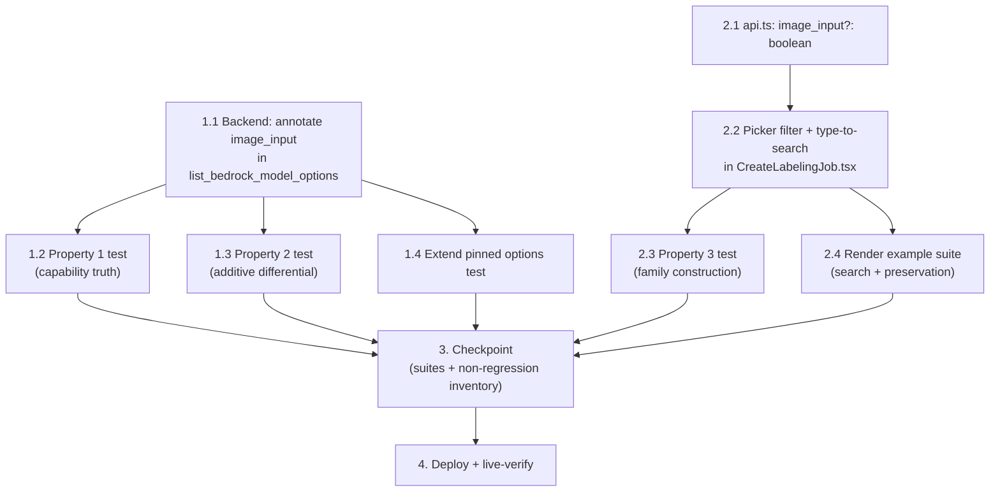

# Implementation Plan: LLM Model Picker Search and Image Filter

## Overview

Two seams, worked in parallel tracks that meet at a single checkpoint. The backend track adds the additive `image_input` annotation to `data_accounts.list_bedrock_model_options` (one total helper, one modality map built from the un-filtered foundation summaries, one omit-when-unknown field write) and proves it with two Hypothesis properties — capability truth and the strip-the-field differential against a pinned pre-feature reimplementation — plus extensions to the existing pinned options test. The frontend track types the new field in `api.ts`, then filters the two auto-label families through an exported `isImageCapableModel` predicate and switches on Cloudscape's built-in type-to-filter (`filteringType="auto"` + per-option `filteringTags`, `noMatch` text, all-excluded free-text affordance) in `CreateLabelingJob.tsx`, proven by one fast-check property over the option construction and a render-level example suite for the search surface and the preservation contrasts (skip-verification unfiltered, full-catalog lookups). The checkpoint runs the targeted backend suite, the full frontend suite, `tsc`, and the design's zero-rebaseline non-regression inventory. The deploy ships `EdgeCVPortalComputeStack` (the `DataAccountsHandler` Lambda carries `data_accounts.py`) and the frontend bundle, under the builds.md gates.

No infrastructure change: the Lambda already holds the two `bedrock:List*` permissions and already receives `inputModalities` in the responses it fetches today.

## Task Dependency Graph

```json
{
  "waves": [
    { "wave": 1, "description": "Independent contract changes: backend capability annotation in data_accounts.py; additive image_input field on the getBedrockModels() type in api.ts.", "tasks": ["1.1", "2.1"] },
    { "wave": 2, "description": "Backend properties against the implemented endpoint (two new test files), and the picker implementation in CreateLabelingJob.tsx now that the api.ts type exists.", "tasks": ["1.2", "1.3", "2.2"] },
    { "wave": 3, "description": "Tests that depend on prior-wave files: extend the existing pinned backend options test; frontend property test over the exported predicate/option construction; render-level example suite for search and preservation.", "tasks": ["1.4", "2.3", "2.4"] },
    { "wave": 4, "description": "Checkpoint: targeted backend pytest, full frontend vitest + tsc, and the zero-rebaseline non-regression inventory from the design.", "tasks": ["3"] },
    { "wave": 5, "description": "Deploy EdgeCVPortalComputeStack (DataAccountsHandler) and the frontend bundle under the builds.md gates, then live-verify the annotated catalog and the picker.", "tasks": ["4"] }
  ]
}
```



## Tasks

- [ ] 1. Annotate image-input capability in the model catalog (backend)
  - [x] 1.1 Implement the capability annotation in `data_accounts.py`
    - In `edge-cv-portal/backend/functions/data_accounts.py`, add the module-level total helper `_image_input_capability(modalities)` beside `_llm_model_image_limits` (~line 1186): `True` when the value is a list containing `'IMAGE'`, `False` when it is a non-empty list without `'IMAGE'`, `None` for everything else (absent, non-list, empty list); never raises
    - In `list_bedrock_model_options` (~line 1229): build `model_modalities = {modelId: inputModalities}` from **every** summary of the `list_foundation_models()` response — before and independently of the existing ACTIVE / ON_DEMAND / fronted-model option filters, because a profile's fronted model is typically not ON_DEMAND and would be dropped by them; on the existing `AccessDenied` path the map stays empty
    - In the existing final annotation loop (where `image_limit` and `token_limit` are set): resolve each option's modalities — a foundation option from its own summary's list, a profile option via `option['id'].split('.', 1)[1]` into `model_modalities` when the id contains `.` — and write `option['image_input'] = capability` **only when the resolved capability is not None** (field omitted for Unknown_Capability)
    - Merge, dedupe, sort, region resolution, `permissions` hint, the catch-all 500, and every pre-existing option field must be byte-for-byte unchanged; extend the function docstring with the new additive field (cite this spec)
    - _Requirements: 1.1, 1.2, 1.3, 1.4, 1.5, 4.4, 4.5_

  - [x]* 1.2 Write property test for capability truth
    - `edge-cv-portal/backend/tests/test_property_bedrock_model_options_image_input.py` (new) — Hypothesis `@settings(max_examples=100, deadline=None)`, stubbed `FakeBedrockControlClient` per the `test_bedrock_model_options_image_limit.py` pattern; generators draw profile/foundation summary sets with `inputModalities` across lists-with-IMAGE, non-empty-lists-without-IMAGE, empty lists, non-lists, and absence; lifecycle/inference-type/fronting drawn arbitrarily; the denied-`ListFoundationModels` branch included; every response asserted 200
    - **Property 1: Image-input capability annotation is truthful, join-complete, and total**
    - **Validates: Requirements 1.1, 1.2, 1.3, 1.5**

  - [x]* 1.3 Write property test for the additive differential
    - `edge-cv-portal/backend/tests/test_property_bedrock_model_options_additive.py` (new) — same generator space plus arbitrary `LLM_MODEL_IMAGE_LIMITS` and persisted token-limit configurations and the partial/full-denial branches; strip `image_input` from every option and compare the whole payload against a **pinned in-test reimplementation of the pre-feature endpoint rules** (repo precedent: `test_property_bedrock_global_config_preservation.py`): membership, order, per-option `id`/`label`/`image_limit`/`token_limit`, `region`, and the `permissions` hint text
    - **Property 2: The catalog is byte-identical to the pre-feature catalog once the new field is removed**
    - **Validates: Requirements 1.4, 4.4, 4.5**

  - [x]* 1.4 Extend the pinned model-options unit test
    - `edge-cv-portal/backend/tests/test_bedrock_model_options_image_limit.py` (existing, **extended** — every pre-existing assertion untouched, including the exact-key-set pin, which stays green because the existing fixtures carry no `inputModalities`): new section 4 with one example per named Unknown_Capability shape of Requirement 1.3 (absent list, non-list value, empty list, dotless profile id, fronted id matching no summary, denied foundation call), one Image_Capable example (`['TEXT','IMAGE']` → `image_input is True`), one Text_Only example (`['TEXT']` → `image_input is False`), a profile resolving through a non-ON_DEMAND fronted summary, and the partial-denial case asserting no option carries the key
    - _Requirements: 1.1, 1.2, 1.3, 4.4, 4.5_

- [ ] 2. Filter and search the auto-label picker (frontend)
  - [x] 2.1 Type the additive field in the API client
    - `edge-cv-portal/frontend/src/services/api.ts` (~line 3563): add `image_input?: boolean` to the `getBedrockModels()` models entry type, with a comment documenting the tri-state (true = accepts image input, false = positively known text-only, absent = unknown, never exclude) and citing this spec
    - _Requirements: 1.4_

  - [x] 2.2 Implement the picker capability filter and type-to-search
    - `edge-cv-portal/frontend/src/pages/CreateLabelingJob.tsx`: export the pure predicate `isImageCapableModel(m): boolean` = `m.image_input !== false` beside `fewShotAttachmentCounts` (~line 100); derive `imageCapableModels = bedrockModels.filter(isImageCapableModel)` and build `bedrockAutoLabelOptions` and `llmAutoLabelOptions` (~lines 436-448) from it, each option additionally carrying `filteringTags: [m.id]`; the `sam` entry, group headers, label decorations, option order, and modality-matrix gating unchanged
    - On the auto-label `<Select>` (~line 1419): add `filteringType="auto"`, `filteringAriaLabel="Search models"`, `filteringPlaceholder="Search by model name or id"`, and `noMatch="No models match the search"`
    - Add the all-excluded affordance beside the existing `bedrockModelsUnavailable` blocks (~line 1437): when `bedrockModels.length > 0 && imageCapableModels.length === 0 && LLM_MODALITIES.includes(modality)`, render the message "No model in the catalog accepts image input. Enter a model identifier to use prompt-guided auto-labeling." with the same free-text `Input` affordance (driving `llm:<id>` state) the Catalog_Unavailable path uses; the existing Catalog_Unavailable blocks themselves are not modified
    - Everything else keeps reading the raw `bedrockModels`: `bedrockModelsUnavailable` (raw length), `selectedModelImageLimit`, the token-budget pre-fill effect, and the Skip_Verification_Picker options (~lines 1581-1607) — all byte-for-byte unchanged
    - _Requirements: 2.1, 2.2, 2.3, 2.4, 2.5, 3.1, 3.4, 3.5, 3.6, 4.2, 4.3, 4.6, 4.7_

  - [x]* 2.3 Write property test for the family construction
    - `edge-cv-portal/frontend/src/pages/CreateLabelingJob.modelpicker.property.test.tsx` (new) — fast-check `{ numRuns: 100 }` over `isImageCapableModel` and the option construction (repo precedent: `aravisCameraReference.property.test.ts` Property 7): for any catalog mixing `image_input: true` / `false` / absent, both families contain exactly the `image_input !== false` options in catalog order, with `bedrock:<id>` / `Bedrock: <label>` and `llm:<id>` / `<label> (prompt-guided)` value/label construction and `filteringTags === [<id>]` on every entry
    - **Property 3: The auto-label families offer exactly the not-known-text-only catalog, decorated and searchable as before**
    - **Validates: Requirements 2.1, 2.2, 2.5, 3.2, 4.7**

  - [x]* 2.4 Write render-level example tests for search and preservation
    - `edge-cv-portal/frontend/src/pages/CreateLabelingJob.modelpicker.test.tsx` (new) — vitest + testing-library per the `CreateLabelingJob.test.tsx` mock scaffolding (`getBedrockModels` mocked with capability-mixed catalogs): filter input present when the picker opens (3.1); queries by label fragment, raw id fragment, and case variation display the matching entries (3.2, 3.3); a gibberish query shows "No models match the search" (3.4); type-then-clear leaves the recorded selection untouched and restores the full filtered list, and selecting under search records the same `llm:<id>` value as selecting unfiltered (3.5, 2.5); a query uniquely naming a Text_Only model's label yields noMatch (3.6); field-absent (unknown) models are offered (2.2); `sam` still offered with an all-Text_Only catalog (2.3); the all-Text_Only message plus free-text affordance drives `llm:<id>` state (2.4); a Text_Only model absent from both auto-label families is still present in the Skip_Verification_Picker (4.2); a free-text-entered Text_Only model id still resolves its `image_limit` hint and `token_limit` pre-fill from the full catalog (4.6)
    - _Requirements: 2.2, 2.3, 2.4, 2.5, 3.1, 3.2, 3.3, 3.4, 3.5, 3.6, 4.2, 4.6_

- [x] 3. Checkpoint — Ensure all tests pass
  - Backend (targeted, per the design's verification commands): `cd edge-cv-portal/backend && python3 -m pytest tests/test_property_bedrock_model_options_image_input.py tests/test_property_bedrock_model_options_additive.py tests/test_bedrock_model_options_image_limit.py tests/test_bedrock_configuration.py -q`
  - Frontend: `cd edge-cv-portal/frontend && npx tsc --noEmit -p tsconfig.json && npx vitest run`
  - Run the design's non-regression inventory and confirm the expected disposition with **zero rebaselines**: `test_bedrock_configuration.py`, `CreateLabelingJob.test.tsx` (incl. the 'model catalog unavailable' cases), `CreateLabelingJob.fewshot.test.tsx`, `CreateLabelingJob.sizing.test.tsx`, `PromptTuningPreview.property.test.tsx`, and `BedrockConfigurationSettings.test.tsx` all green **byte-identical**; `test_bedrock_model_options_image_limit.py` extended with every pre-existing assertion still passing. If any pre-existing assertion has to change, stop and raise it as a design violation rather than rebaselining
  - Ensure all tests pass, ask the user if questions arise
  - _Requirements: 4.1, 4.3, 4.8_

- [x] 4. Deploy and live-verify
  - Follow `.kiro/steering/builds.md`: confirm no component build is running (`pgrep -af "gdk component build"` and `pgrep -af "build-custom.sh"` both empty) before deploying; portal deploys must never overlap component builds
  - Backend Lambda change only (`data_accounts.py` rides `DataAccountsHandler`), so deploy the compute stack per the repo pattern: from `edge-cv-portal/infrastructure`, `npx cdk deploy EdgeCVPortalComputeStack --require-approval never`; then deploy the frontend bundle: from `edge-cv-portal`, `./deploy-frontend.sh`; capture both to a spec-named log per the repo convention, e.g. `edge-cv-portal/deploy-llm-model-picker-search-and-image-filter-$(date -u +%Y%m%dT%H%M%SZ).out`
  - Live-verify: `GET /data-accounts/bedrock-configuration/models` (portal admin session) shows `image_input: true` on known vision models (e.g. the Anthropic Claude profiles / Nova Pro), `image_input: false` on a known text-only model (e.g. a Titan text/embedding model), and every pre-feature field intact; in the labeling wizard, the auto-label picker omits the text-only models, typing narrows the list, and the settings-page Bedrock dropdown still lists the full catalog
  - After deploying, handle the `cdk.out` drift guards per `.kiro/steering/builds.md` before any subsequent component build (move `cdk.out` aside or rebaseline, and re-run the preservation guard pair)
  - _Requirements: 1.4, 2.1, 4.1_

## Notes

- Tasks marked with `*` are optional test tasks and can be skipped for a faster MVP; core implementation tasks are never optional
- Each of the 3 correctness properties has exactly one property-based test task, in the file the design's placement table names, at a minimum of 100 iterations (`@settings(max_examples=100, deadline=None)` / `fc.assert(..., { numRuns: 100 })`), tagged `Feature: llm-model-picker-search-and-image-filter, Property {n}: {text}`. The search *matching* behavior (Requirements 3.2–3.4) is deliberately example-tested, not property-tested: the matcher is Cloudscape's built-in filtering (third-party code); our own structural obligation (`filteringTags` on every option) is what Property 3 pins
- **Same-file scheduling constraint:** `data_accounts.py` is written only by 1.1; `api.ts` only by 2.1; `CreateLabelingJob.tsx` only by 2.2 (wave 2, after its type dependency 2.1); each test task writes its own file, except 1.4 which extends `test_bedrock_model_options_image_limit.py` alone in wave 3 — no wave contains two writers of one file
- The exclude-only-on-positive-knowledge rule means every existing test mock and fixture (which carry no capability data) resolves to Unknown_Capability and stays included — that is why the design's non-regression inventory expects zero edits to the five pinned frontend test files and `test_bedrock_configuration.py`, and why the exact-key-set assertion in `test_bedrock_model_options_image_limit.py` survives unmodified
- No infrastructure task: `DataAccountsHandler` already holds `bedrock:ListInferenceProfiles` / `bedrock:ListFoundationModels` permissions and `inputModalities` is already present in the responses the Lambda fetches; no new route, table, environment variable, or IAM statement
- The Skip_Verification_Picker is deliberately left unfiltered and unsearched (design decision, Requirement 4.2); constraining it is a one-line follow-up once `image_input` exists, but it is out of this feature's scope
