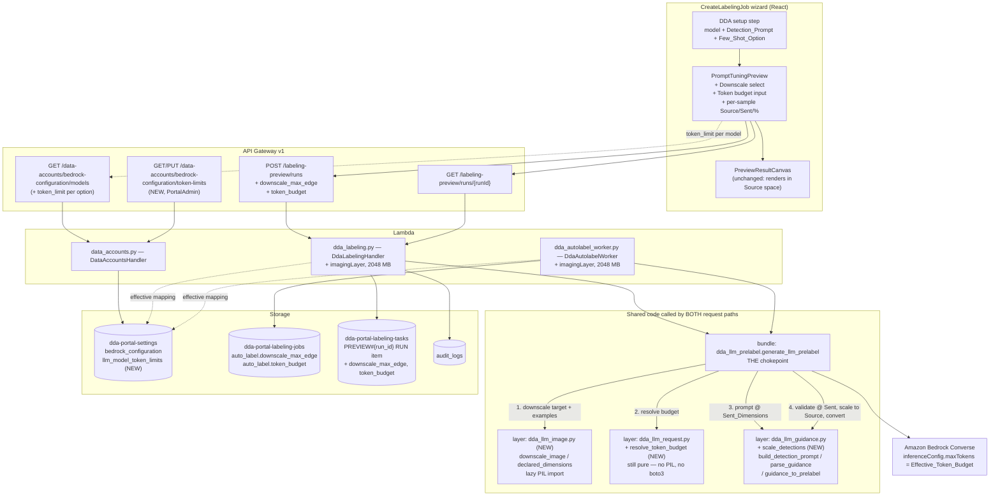
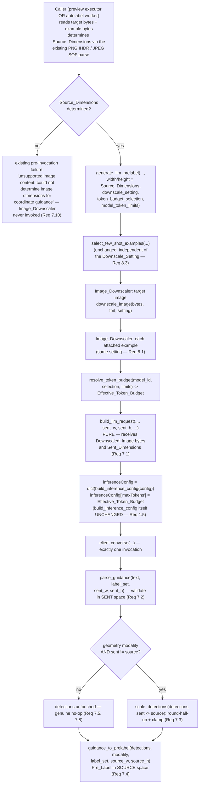
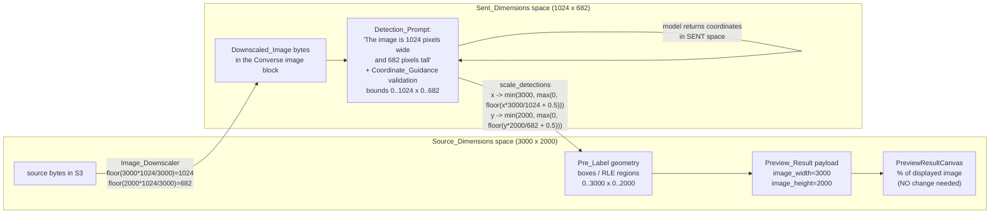

# Design Document — LLM Model Token Budget and Image Sizing

## Overview

This feature adds two independent capabilities to the `llm:<model_identifier>` auto-label family, both hanging off the seams the **llm-autolabel-prompt-tuning** feature established (`dda_llm_prelabel.generate_llm_prelabel` as the single shared chokepoint, `dda_llm_request.build_llm_request` as the single request layout):

1. **A per-model output token budget** — the Converse `maxTokens` for `llm:` requests stops coming from the single global `bedrock_configuration.max_tokens` and is resolved instead by a new **Token_Budget_Resolver** from a per-job Token_Budget_Selection, a persisted per-model Model_Token_Limits mapping, and a default of 10000.
2. **A Job_Creator-selectable image downscale** — a new **Image_Downscaler** resizes the target image and every attached Few_Shot_Example to a chosen Max_Image_Edge before the bytes become Converse image blocks, with the Pre_Label scaled back into the source image's coordinate space.

The two are orthogonal. Downscaling reduces *input* payload and input tokens; the budget governs *output* tokens. Only the budget resolves the live `ValidationException: The maximum tokens you requested exceeds the model limit of 10000` that the deployed `max_tokens = 128000` produces for US Amazon Nova Pro.

Five decisions shape the design:

- **The Image_Downscaler goes in a new shared-layer module, `dda_llm_image.py`, and `dda_llm_request.py` is not touched.** `dda_llm_request.py`'s module contract says "pure functions only — no boto3, no Pillow, no I/O", and that contract is load-bearing: it is what makes the selection and layout invariants testable as pure-function properties with no AWS at all. Rather than amend it, the downscaler lives beside it and is invoked from `generate_llm_prelabel` — which is already the one chokepoint both callers pass through, which is exactly what Requirement 6.1 asks for. `dda_llm_request.py` keeps receiving raw bytes and integer dimensions and stays pure. Consequence for byte identity: because the downscale happens *upstream* of `build_llm_request`, the request layout code is unchanged, and with Downscale_Off the bytes reaching it are the source bytes — so the pre-feature request is reproduced by construction, not by a compensating branch (Requirement 10.1, Property 8).
- **Pillow is imported lazily, inside the re-encode path only.** Following the repo convention (`dda_manifest.py`, `synthetic_data.py`), `from PIL import Image` sits inside the function body. With Downscale_Off — the default, and the state of every existing job — Pillow is never imported, so attaching the imaging layer to two more Lambdas costs existing behavior nothing, including cold start.
- **Determinism is bought with explicitly pinned encoder parameters, not with Pillow's defaults.** Requirement 6.6 demands byte-identical output across processes and between two different Lambda functions. Every default that could vary (JPEG subsampling, PNG compression level, metadata passthrough, mode conversion) is pinned in one constant block in `dda_llm_image.py`.
- **The scale-back happens on the validated detection geometry, before Pre_Label conversion.** Coordinates are validated against the Sent_Dimensions, then mapped into Source_Dimensions, and only then converted — so Segmentation RLE is rasterized directly at the source resolution and `guidance_to_prelabel` is unchanged. When the dimensions are equal the scaling step is skipped entirely, which is a genuine no-op rather than a multiply-by-1.0 (Requirement 7.5).
- **Model_Token_Limits is a separate settings item, not a field of the Bedrock_Configuration.** `update_bedrock_configuration_setting` merges submitted keys over the current effective config and validates the whole thing; adding a mapping field to it would couple the two writes and put a 128000 ceiling in the same validator that must apply no ceiling to `max_tokens`. A distinct `setting_key` gives Requirements 4.4 and 4.7 by construction.

### Research notes informing the design

- **Pillow's `Image.resize` is deterministic for a fixed filter and a fixed target size**; the non-determinism risks are in the *encoders* and in metadata passthrough, not in resampling. `PngImagePlugin._save` falls back to `im.info["icc_profile"]` when no `icc_profile` keyword is given, so an ICC profile on the source silently reaches the output; clearing `.info` on the resized image and passing the keywords explicitly closes that. Pillow writes no timestamp chunk for PNG unless one is supplied through `PngInfo`.
- **`Image.resize(..., reducing_gap=2.0)` applies an integer `reduce()` pre-shrink before the resampling pass.** Because the gap value is a pinned constant, the result is a deterministic function of (source bytes, target size) while being dramatically cheaper for large reductions — which is what makes the 5 s Downscale_Duration_Bound reachable for multi-megapixel sources. `Image.thumbnail()` was rejected: it calls `draft()` on JPEG sources, making the decode path depend on libjpeg's DCT scaling, and it computes the target size itself with rounding that does not match Requirement 6.4's floor formula.
- **`Image.open` reads only the container header**, so `img.size` is available before any pixel decode. That is what lets the Max_Source_Pixel_Count refusal (Requirement 6.10) happen "without decoding the full image" even for a source whose PNG IHDR / JPEG SOF parse failed.
- **Pillow's own decompression-bomb guard defaults to `MAX_IMAGE_PIXELS ≈ 89.5 M`**, below this feature's 100 M bound, so it would refuse sources the spec accepts. `dda_llm_image` raises it to exactly `MAX_SOURCE_PIXEL_COUNT` so the two bounds coincide and there is one refusal rule.
- **Lambda allocates CPU proportionally to memory**; ~1769 MB is one full vCPU. Both functions this feature adds decoding to currently run at the 128 MB default, which cannot hold a multi-megapixel RGB buffer at all.
- **Both target Lambdas share one `imagingLayer` LayerVersion in one stack**, which is what makes "the same Pillow version, the same libjpeg-turbo, the same zlib" true for free — the environmental precondition Requirement 6.6's cross-component claim rests on. `synthetic-data-stack.ts` builds a separate `SyntheticImagingLayer` from the same `backend/layers/imaging` directory; it is pinned to the same `Pillow==10.4.0` by that directory's `requirements.txt`, and synthetic data builds no `llm:` requests, so it is not a determinism risk today. It would become one only if a future consumer built `llm:` requests from that layer.

## Architecture



### The shared request-construction flow

Everything new sits inside `generate_llm_prelabel`, between the caller's I/O and the existing pure builders. Both callers therefore acquire both capabilities without either of them gaining a line of sizing logic.



### The two coordinate spaces



The Few_Shot_Example images have their own Sent_Dimensions and never enter either coordinate claim: they are downscaled with the same setting (Requirement 8.1) but their dimensions reach neither the prompt nor the validation bounds (Requirement 8.2, Property 6).

## Components and Interfaces

### 1. `dda_llm_image.py` — new shared-layer module (the Image_Downscaler)

Module contract, stated in the docstring so it is not mistaken for a copy of `dda_llm_request.py`'s: **no boto3, no I/O, no network, and no Pillow at import time.** Pillow is imported inside the one function that re-encodes. The module is therefore safe to import from both request paths even in an environment without the imaging layer; only an actual re-encode would fail there, and it would fail as a categorized `DownscaleError`.

```python
"""Image_Downscaler for the `llm:` auto-label family.

Contract: no boto3, no I/O, no network. Pillow is imported lazily inside
`_resize_and_encode` only, so importing this module never requires the
imaging layer and the Downscale_Off path never pays Pillow's import cost.
"""

# The seven Downscale_Setting values (Req 5.1). Downscale_Off is None on
# the wire and in every record, so no string can be confused for a bound.
DOWNSCALE_OFF = None
MAX_IMAGE_EDGE_OPTIONS = (512, 768, 1024, 1280, 1536, 2048)

# Largest decoded source we accept, refused from the header alone (Req 6.10).
MAX_SOURCE_PIXEL_COUNT = 100_000_000

IMAGE_FORMAT_PNG = 'png'
IMAGE_FORMAT_JPEG = 'jpeg'


class DownscaleError(Exception):
    """The source could not be decoded, sized or re-encoded (Req 6.9, 6.10).

    Carries only the reason text; the caller owns the failure *category*
    (unsupported_image_content for a target image, unreadable_example_image
    for an attached example), so this module never invents a category.
    """


def normalize_downscale_setting(value) -> Optional[int]:
    """The Downscale_Setting a record or request carries, as either None
    (Downscale_Off) or one Max_Image_Edge option (Req 5.9, 5.12).

    Total and safe, in the shape of `resolve_model_image_limit`: absent,
    null, boolean, string, float and any integer outside
    MAX_IMAGE_EDGE_OPTIONS all resolve to None, so a malformed persisted
    value degrades to Downscale_Off and can never fail a job.
    """


def declared_dimensions(image_bytes: bytes) -> Optional[Tuple[int, int]]:
    """(width, height) from the PNG IHDR / JPEG SOF headers, or None.

    Byte-for-byte the algorithm `dda_autolabel_worker._image_dimensions` and
    `dda_labeling._preview_image_dimensions` have always used, relocated here
    so there is one copy; both of those functions become thin delegations and
    keep accepting exactly the inputs they accepted before (Req 7.6).
    Dependency-free: this is what lets the fit check and the pixel-count
    refusal happen with no Pillow at all.
    """


def downscale_image(image_bytes: bytes, image_format: str,
                    downscale_setting: Optional[int],
                    *, source_dimensions: Optional[Tuple[int, int]] = None,
                    ) -> Tuple[bytes, int, int]:
    """The Downscaled_Image for one source image.

    Args:
        image_bytes: the source bytes, never mutated
        image_format: the Converse format derived from the object key
            ('png' | 'jpeg') — the OUTPUT container, never re-derived from
            the content, so no cross-conversion can occur (Req 6.7)
        downscale_setting: None (Downscale_Off) or one Max_Image_Edge
        source_dimensions: the caller's already-parsed Source_Dimensions,
            passed in to avoid a second header parse; when omitted they are
            parsed here

    Returns:
        (bytes, width, height) — the source bytes and Source_Dimensions
        unchanged for Downscale_Off or an already-fitting source, otherwise
        the re-encoded bytes and the floor-scaled dimensions of Req 6.4

    Raises:
        DownscaleError: undecodable, zero-dimension, over-size or
            unencodable (Req 6.9, 6.10)
    """
```

Control flow, in the order the requirements dictate:

| Step | Condition | Action | Requirement |
|---|---|---|---|
| 1 | `downscale_setting is None` | return `(image_bytes, *source_dimensions)` — **no Pillow import, no decode** | 6.2 |
| 2 | dimensions unknown from the header | `Image.open(...).size` (header read only, no `load()`) | 6.9 |
| 3 | `width < 1 or height < 1` | `DownscaleError` | 6.9 |
| 4 | `width * height > MAX_SOURCE_PIXEL_COUNT` | `DownscaleError` naming the pixel count, **before any `load()`** | 6.10 |
| 5 | `max(width, height) <= setting` | return `(image_bytes, width, height)` — **no decode** | 6.3 |
| 6 | otherwise | `_resize_and_encode(...)` | 6.4, 6.5, 6.7 |

Step 1 before step 2 is what makes Downscale_Off free. Step 5 before step 6 is what preserves byte identity with the pre-feature request for every image that already fits (Requirement 10.1, Property 8). Step 4 before any `load()` is the whole of Requirement 6.10.

The target size is computed from the requirement's formula verbatim, in integer arithmetic:

```python
scale_divisor = max(source_width, source_height)
target_width = max(1, (source_width * max_image_edge) // scale_divisor)
target_height = max(1, (source_height * max_image_edge) // scale_divisor)
```

Integer floor division rather than `math.floor` on a float quotient: it is exact for every dimension the bound admits, so there is no float-rounding term to reason about. `max(1, ...)` covers the extreme-aspect-ratio case (a 5000 x 1 source at a 512 bound floors the short edge to 0).

#### The pinned encoder parameters, and why each one is needed

All of these live in one constant block. Every one of them is a Pillow default that either varies with the source or varies with the Pillow build; leaving any of them implicit would make Requirement 6.6 unprovable.

```python
RESAMPLING_FILTER = Image.Resampling.LANCZOS
REDUCING_GAP = 2.0

JPEG_SAVE_PARAMS = {
    'format': 'JPEG',
    'quality': 85,
    'subsampling': 2,        # 4:2:0, pinned
    'optimize': False,
    'progressive': False,
    'exif': b'',             # no EXIF passthrough
    'comment': b'',
    'icc_profile': None,     # no ICC passthrough
    'dpi': (0, 0),
}

PNG_SAVE_PARAMS = {
    'format': 'PNG',
    'optimize': False,
    'compress_level': 6,     # pinned zlib level
    'icc_profile': None,
    'pnginfo': None,
}

# Deterministic mode conversion, keyed on the SOURCE mode alone — never on
# img.info, never on "does this image happen to have transparency".
JPEG_MODE_MAP = {'L': 'L', '1': 'L', 'I': 'L', 'I;16': 'L'}      # else 'RGB'
PNG_MODE_MAP = {'L': 'L', 'LA': 'LA', 'RGB': 'RGB', 'RGBA': 'RGBA',
                '1': 'L', 'I': 'L', 'I;16': 'L',
                'P': 'RGBA', 'PA': 'RGBA'}                        # else 'RGB'
```

| Pinned choice | Why reproducibility needs it |
|---|---|
| `LANCZOS` and no other filter | Pillow's `resize` default is `BICUBIC`; the filter must be one fixed value, not a caller or heuristic choice. LANCZOS is a fixed convolution — no randomness, no thread-count dependence. |
| `reducing_gap=2.0` | `resize`'s default is `None`, i.e. no pre-reduce. Pinning a value makes the (deterministic) `reduce()` pre-shrink part of the contract instead of an optimization someone might add or remove later, and it is what brings a large-source resize inside the 5 s bound. |
| JPEG `quality=85` | Pillow's default is 75; either is fine, but the quantization tables derive from it, so it must be fixed rather than inherited from a caller default that could change across versions. |
| JPEG `subsampling=2` | The default is `-1`, meaning "keep the source's subsampling if the source was a JPEG". That makes output bytes depend on the *source encoder's* choice, and it silently differs between a JPEG source and a PNG-content-in-`.jpg` source. Pinning 4:2:0 removes the dependency. |
| JPEG `optimize=False`, `progressive=False` | Both change the entropy-coding pass. Deterministic either way, but they must not be left to inheritance from `img.info['progressive']`, which a progressive source sets. `False` also keeps the CPU cost inside the bound. |
| JPEG `exif=b''`, `comment=b''`, `dpi=(0, 0)` | Requirement 6.6 excludes "every value that varies between invocations". EXIF routinely carries capture timestamps and device identity; passing empty values guarantees no APP1/COM segment and no JFIF density from the source reaches the output. |
| `icc_profile=None` on both | `PngImagePlugin._save` reads `im.encoderinfo.get('icc_profile', im.info.get('icc_profile'))` — the source's profile is picked up implicitly unless the keyword is given. An explicit `None` is the only way to be sure. |
| PNG `compress_level=6`, `optimize=False` | `optimize=True` forces level 9 plus a filter search; the level must be one fixed number for the deflate stream to be reproducible. |
| PNG `pnginfo=None` | Prevents any text/`tIME` chunk from being written. |
| `resized.info.clear()` before `save` | Belt and braces for every plugin that falls back to `im.info` in any Pillow version: after the resize the object carries the source's `info` dict (`jfif`, `dpi`, `adobe`, `transparency`, `icc_profile`, `gamma`). Clearing it means no plugin can find anything to inherit. |
| Mode maps keyed on the source mode only | `convert()` is deterministic, but *which* conversion happens must not depend on `img.info['transparency']` or on a "does it look like it has alpha" heuristic. Palette (`P`) images must be converted before resampling — interpolating palette indices produces garbage — and JPEG cannot hold `RGBA` or `P` at all. `RGBA -> RGB` drops alpha by discarding the channel with no compositing against an invented background. |
| No `ImageOps.exif_transpose` | Applying EXIF orientation would change pixel content relative to what the Downscale_Off path sends, breaking the "downscaling only changes resolution" mental model and making the identity case and the resize case disagree about orientation. |
| First frame only | A multi-frame source (animated PNG) resolves to frame 0, which is what `Image.open` positions on; no `seek` loop. |

`Image.MAX_IMAGE_PIXELS = MAX_SOURCE_PIXEL_COUNT` is set at module import so Pillow's decompression-bomb guard coincides exactly with this feature's bound instead of firing ~10.5 M pixels earlier; `Image.DecompressionBombError` is caught and re-raised as `DownscaleError` so there is one refusal rule and one reason shape.

**The one environmental precondition, stated plainly.** Byte-identical output between the two Lambdas requires the same Pillow, libjpeg-turbo and zlib in both. Both functions attach the *same* `imagingLayer` LayerVersion in the *same* stack and both run `PYTHON_3_11`, so this holds by construction and cannot drift without a visible infrastructure change. It is a real precondition, not a property of the code: two functions on different layer versions could produce different bytes at the same pinned parameters.

**A deliberate consequence worth naming:** a `.jpg` key whose bytes are actually PNG is re-encoded to real JPEG when a Max_Image_Edge is selected, whereas Downscale_Off passes the PNG bytes through labelled `'jpeg'` (which is what happens today). Requirement 6.7 fixes the output container to the key-derived format, so this is correct — but it means the resize path can *fix* a content/extension mismatch that the pass-through path preserves. That asymmetry is intended and is not a determinism problem: each path is deterministic for its own inputs.

### 2. `resolve_token_budget` — new function in `dda_llm_request.py` (still pure)

Placed beside `resolve_model_image_limit`, whose structure it mirrors. No new imports, so the module's purity contract is untouched.

```python
# Model_Token_Limit_Default and Model_Token_Limit_Ceiling (Req 1.2, 2.1).
MODEL_TOKEN_LIMIT_DEFAULT = 10000
MODEL_TOKEN_LIMIT_CEILING = 128000


def _valid_token_value(value) -> bool:
    """True only for a non-bool int in [1, MODEL_TOKEN_LIMIT_CEILING].

    bool is rejected before the int check (bool is an int subclass — Req 2.5);
    strings, including digit-only strings, and floats, including whole-valued
    floats, are rejected with no numeric conversion (Req 2.8); out-of-range
    integers are rejected with no clamping (Req 2.9).
    """
    if isinstance(value, bool) or not isinstance(value, int):
        return False
    return 1 <= value <= MODEL_TOKEN_LIMIT_CEILING


def resolve_token_budget(model_identifier, token_budget_selection,
                         limits) -> int:
    """The Effective_Token_Budget for one request (Req 2.1-2.10).

    Three tiers, in order:
      1. `token_budget_selection` when it is a valid token value
      2. `limits[model_identifier]` when the identifier is a string and the
         entry is a valid token value
      3. MODEL_TOKEN_LIMIT_DEFAULT (10000)

    Total and safe: every argument may be of any type. Returns an integer in
    [1, 128000], raises nothing, mutates nothing, and is deterministic.

    Deliberate divergence from `resolve_model_image_limit` (Req 2.10): a
    non-string `model_identifier` skips the lookup but does NOT discard a
    valid selection, because the selection tier does not depend on the
    identifier. This asymmetry is intended; do not "correct" it.

    Idempotent on its own output — the return value is always a valid token
    value, so `resolve_token_budget(m, resolve_token_budget(m, s, l), l)`
    equals the inner call. The Preview_API relies on this: it resolves once
    at run start (for the audit event and the run record) and passes the
    resolved integer back in as the selection at execution time.
    """
    if _valid_token_value(token_budget_selection):
        return token_budget_selection
    if isinstance(model_identifier, str) and isinstance(limits, dict):
        configured = limits.get(model_identifier)
        if _valid_token_value(configured):
            return configured
    return MODEL_TOKEN_LIMIT_DEFAULT
```

Key matching is exact string comparison with no trimming and no case folding — `dict.get` on the raw identifier, exactly as `resolve_model_image_limit` does (Requirement 1.1).

### 3. `scale_detections` — new function in `dda_llm_guidance.py` (pure)

```python
def _scale_coordinate(value: float, source_extent: int,
                      sent_extent: int) -> float:
    """One coordinate from Sent space into Source space (Req 7.3).

    round-half-up via floor(v + 0.5): Python's built-in round() is
    banker's rounding, which would map 2.5 to 2. Coordinates are validated
    non-negative, so floor(v + 0.5) is exactly round-half-up here.
    Then clamped into [0, source_extent] (Req 7.4).
    """
    scaled = math.floor(value * source_extent / sent_extent + 0.5)
    return float(min(source_extent, max(0, scaled)))


def scale_detections(detections: List[Dict],
                     sent_width: int, sent_height: int,
                     source_width: int, source_height: int) -> List[Dict]:
    """Validated Coordinate_Guidance mapped from Sent into Source space.

    Returns `detections` **unchanged, as the same list** when the two
    dimension pairs are equal or when either sent extent is not positive:
    no scaling, no rounding, no clamping, no float round trip, so the
    downstream Pre_Label is bit-for-bit the pre-feature Pre_Label
    (Req 7.5). This is an early return, not a multiply by 1.0.

    Box detections have their two corners mapped — (left, top) and
    (left + width, top + height) — and the extents re-derived as the
    differences, so the mapping is applied to coordinates rather than to
    lengths and both corners land inside the source bounds. Polygon
    detections have every vertex mapped.

    Called only for the geometry modalities; Classification never reaches
    it (Req 7.8).
    """
    if (sent_width, sent_height) == (source_width, source_height):
        return detections
    if sent_width < 1 or sent_height < 1:
        return detections
    ...
```

Because the scale factors are always ≥ 1 (the Sent_Dimensions never exceed the Source_Dimensions, Requirement 6.5), the mapping is monotone and cannot invert a box. One edge case is worth recording: a sub-pixel-extent box that passed validation in Sent space can still map to a zero-extent box in Source space when the two spaces differ by a hair (e.g. 1001 vs 1000). `guidance_to_prelabel` then raises its existing `GuidanceError` — "detection N ('c') converts to a bounding box with zero width or height" — which reaches the caller as the pre-existing `unusable_model_output` category with a pre-existing reason string. No new category, no new reason (Requirement 9.3, 9.6).

Scaling *before* conversion rather than after is what keeps `guidance_to_prelabel` untouched: Segmentation RLE is rasterized at the Source_Dimensions directly, so there is never a mask to resample. A post-conversion scale would have to re-rasterize RLE, which is both lossy and a second determinism problem.

### 4. `dda_llm_prelabel.generate_llm_prelabel` — the chokepoint, extended

Four new keyword arguments, all defaulting to the pre-feature behavior. `width` / `height` keep their existing meaning — the **Source_Dimensions** — so no existing call site changes meaning, and with the defaults the function behaves exactly as it does today.

```python
def generate_llm_prelabel(*, model_identifier: str, modality: str,
                          label_set: List[str], detection_prompt: str,
                          per_label_prompts: Optional[Dict[str, str]],
                          image_bytes: bytes, image_key: str,
                          width: int, height: int,          # Source_Dimensions
                          few_shot_images: Optional[List[Dict]] = None,
                          model_image_limit: int = MODEL_IMAGE_LIMIT_DEFAULT,
                          # --- new, all defaulting to pre-feature behavior ---
                          downscale_setting: Optional[int] = None,
                          token_budget_selection: Any = None,
                          model_token_limits: Optional[Dict[str, Any]] = None,
                          ) -> Dict:
    """One Converse request for one image, then Coordinate_Guidance parsing,
    coordinate scale-back and Pre_Label conversion.

    New behavior, all of it inside this one function so both callers get it
    identically (Req 6.1, 1.4):

    - `downscale_setting`: None (Downscale_Off) or one Max_Image_Edge. Applied
      through `dda_llm_image.downscale_image` to the target image and to every
      attached Few_Shot_Example, exactly once each, before any image becomes a
      Converse block (Req 6.1, 8.1). With None nothing is decoded and the
      request is byte-identical to the pre-feature request (Req 10.1).
    - The prompt and the Coordinate_Guidance validation bounds use the target's
      Sent_Dimensions (Req 7.1, 7.2); the Pre_Label is produced in
      Source_Dimensions (Req 7.3, 7.4).
    - `token_budget_selection` / `model_token_limits`: resolved here through
      `resolve_token_budget`, so the request's `maxTokens` is the resolver's
      output by construction and cannot diverge between the two callers
      (Req 1.3, 1.4). `build_inference_config` is called unchanged and its
      result's `maxTokens` is replaced on a copy — the function itself, and
      therefore every other Bedrock_Consumer, is untouched (Req 1.5, 10.5).

    Raises:
        LlmPrelabelError: unchanged categories. A target image the
            Image_Downscaler refuses raises 'unsupported_image_content'
            (Req 9.1, 9.2); a refused attached example raises
            'unreadable_example_image' (Req 8.5). Both are pre-existing
            categories, both imply zero invocations.
    """
```

Two new category constants are needed on the shared module because the downscale failures now originate *inside* it rather than in the callers:

```python
CATEGORY_UNSUPPORTED_IMAGE = 'unsupported_image_content'      # already used by callers
CATEGORY_UNREADABLE_EXAMPLE = 'unreadable_example_image'      # already used by callers
```

These are not new categories — they are two of the six the predecessor already defined and both callers already produce. Moving their point of origin into the shared module is what makes Requirement 9.1 and 9.2 the *same* code, so the reason strings match on both sides automatically. Each caller's translation layer already maps a category to its own failure type:

- `dda_labeling._run_preview_sample` raises `PreviewSampleFailure(exc.category, exc.reason, raw_model_output=exc.raw_text)` — already category-preserving, so it needs no change.
- `dda_autolabel_worker._generate_llm_prelabel` raises `GenerationFailure(exc.reason)` — already reason-preserving, so it needs no change.

The `maxTokens` override, spelled out because Requirement 10.5 and Property 3 hinge on it:

```python
config = get_bedrock_configuration()
inference_config = dict(build_inference_config(config))   # copy, never in place
inference_config['maxTokens'] = resolve_token_budget(
    model_identifier, token_budget_selection, model_token_limits)
```

`build_inference_config` gains **no parameter and no branch**. The alternative — an optional `max_tokens_override` keyword — was rejected because `test_property_sampling_exclusivity.py` and `test_property_bedrock_sampling_exclusivity.py` both pin that function's output to `{maxTokens, temperature?|topP?}` with `maxTokens == int(config['max_tokens'])`, and post-processing in the caller keeps those tests true without modification. The sampling parameters continue to come from the global configuration unchanged (Requirement 10.2, 10.8) — only `maxTokens` is decoupled.

### 5. Model_Token_Limits delivery — reconciling Requirement 1.8 with Requirement 4

Two sources are specified, and they must be reconciled explicitly rather than merged silently.

**Precedence: the persisted settings item wins as a whole mapping; the environment variable is the deploy-time bootstrap.**

```python
# Present identically in dda_labeling.py, dda_autolabel_worker.py and
# data_accounts.py — the same shape as the existing _llm_model_image_limits().
def _llm_model_token_limits() -> Dict[str, Any]:
    """The effective Model_Token_Limits mapping.

    Source of truth is the persisted `llm_model_token_limits` settings item
    (Req 1.6, 4.1). When that item is absent, unreadable, or its value is not
    a mapping, the LLM_MODEL_TOKEN_LIMITS environment variable is used
    instead — the deploy-time bootstrap for an environment where no
    PortalAdmin has written the item yet.

    WHOLE-MAPPING precedence, never a per-key merge: a merge would let an
    environment entry survive a deletion from the persisted mapping, which
    would contradict Req 4.1 ("retain no entry that the submitted mapping
    omits") and Req 4.8 (an empty mapping makes every model resolve the
    default). An empty persisted mapping is therefore honored as empty.

    DynamoDB returns every number as Decimal, and `resolve_token_budget`
    rejects non-int types by design (Req 2.8). The stored value is passed
    through `_decimal_to_native` before it reaches the resolver, or every
    configured limit would silently fall through to the default.
    """
```

How Requirement 1.8's "same mechanism the DDA_Labeling_System uses to deliver the Model_Image_Limit" is still satisfied: the mechanism is *one shared loader function present in both request paths plus a `LLM_MODEL_TOKEN_LIMITS` environment variable set from a `llmModelTokenLimits` CDK context value on both `DdaLabelingHandler` and `DdaAutolabelWorker`* — structurally identical to `_llm_model_image_limits()` / `LLM_MODEL_IMAGE_LIMITS`. Both paths read equal entries for equal persisted configuration because both run the same loader against the same two sources with the same precedence.

**The operational consequence, stated because it is a real difference between the two sources:** an environment-variable mapping requires a redeploy to change; the settings item does not. That is precisely why the settings item is the source of truth — Requirement 3's whole premise is that a Job_Creator should not wait for an administrator, and Requirement 4's is that an administrator should not wait for a deployment.

**Read frequency.** The loader reads DynamoDB, so it is memoized **per invocation**, not per container: a module-level cache keyed by nothing and cleared at the top of each `handler` entry. Per-invocation is the right granularity because it is exactly the span over which the resolution must be self-consistent — one SQS batch of 5 images, or one preview run start. Caching across invocations would let a warm container serve a stale mapping after an administrator's write, which Requirement 4.1's "returns the persisted mapping" would then contradict from a user's point of view.

**Preview runs resolve once, at start.** `POST /labeling-preview/runs` resolves the Effective_Token_Budget, records it on the `RUN` item as `token_budget`, and puts it in the audit event (Requirement 9.5). The executor passes that recorded integer back in as `token_budget_selection`; because the resolver returns a valid selection unchanged, re-resolution is the identity, so the budget actually sent is provably the budget audited and reported — even if an administrator rewrites the mapping between the start and the execution.

### 6. Settings_API — the Model_Token_Limits item

New routes on the existing `handle_bedrock_configuration` router, so the PortalAdmin gate (`Permission.BEDROCK_CONFIG_WRITE`) and its denied-attempt audit entry are inherited unchanged (Requirement 4.3):

| Method & path | Purpose |
|---|---|
| `GET /data-accounts/bedrock-configuration/token-limits` | The persisted mapping plus `default` (10000) and `ceiling` (128000). |
| `PUT /data-accounts/bedrock-configuration/token-limits` | Whole-mapping replacement (Requirement 4.1). |

`handle_bedrock_configuration` currently dispatches on `path.endswith('/models')`; it gains a `/token-limits` sibling ahead of the bare GET/PUT. The permission check stays where it is — first, before any dispatch — so an unauthorized token-limits write is denied and audited exactly as an unauthorized configuration write is.

```python
LLM_MODEL_TOKEN_LIMITS_SETTING_KEY = 'llm_model_token_limits'

MODEL_TOKEN_LIMITS_MAX_ENTRIES = 200
MODEL_TOKEN_LIMITS_MAX_KEY_LENGTH = 256


def validate_model_token_limits(value) -> List[str]:
    """Validate a submitted Model_Token_Limits mapping (Req 4.2).

    Rules, every violation reported (nothing short-circuits):
      - the value is a mapping
      - at most MODEL_TOKEN_LIMITS_MAX_ENTRIES entries
      - every key a non-empty string of at most 256 characters
      - every value a non-bool integer in [1, MODEL_TOKEN_LIMIT_CEILING]

    Booleans are classified as non-integers, consistently with the resolver.
    Returns [] when valid.
    """


def handle_model_token_limits(event: Dict, user: Dict,
                              http_method: str) -> Dict:
    """GET / PUT the Model_Token_Limits item.

    A PUT REPLACES the persisted mapping in its entirety — a plain put_item
    of the whole value, never an update expression that merges — so no entry
    the submission omits survives (Req 4.1), and the empty mapping persists
    as empty (Req 4.8). Nothing here reads or writes the
    `bedrock_configuration` item, which is how Req 4.4 holds; and
    `update_bedrock_configuration_setting` is not touched, which is how
    Req 4.7 holds.
    """
```

`update_bedrock_configuration_setting` is left exactly as it is, including its merge-then-validate-the-whole behavior (Requirement 4.6) and its `max_tokens` rule with no upper bound (Requirement 4.5). Model_Token_Limit_Ceiling is applied to no field of the Bedrock_Configuration.

`list_bedrock_model_options` gains one additive per-option field beside the existing `image_limit`:

```python
token_limits = _llm_model_token_limits()
for option in options:
    option['image_limit'] = resolve_model_image_limit(option['id'], image_limits)
    option['token_limit'] = resolve_token_budget(option['id'], None, token_limits)
```

`token_limit` is the Effective_Token_Budget for that model with no selection — which is exactly what the wizard must pre-fill (Requirement 3.1) and what makes the displayed budget equal the request's `maxTokens` (Requirement 1.6, Property 2).

### 7. Preview_API — request, validation, run record, executor

**Request body**, two additive fields:

```jsonc
{
  "usecase_id": "uc-1",
  "dataset_prefix": "training-images/",
  "model": "llm:us.amazon.nova-pro-v1:0",
  "detection_prompt": "Locate every scratch...",
  "task_type": "ObjectDetection",
  "label_set": ["scratch", "dent"],
  "sample_images": ["training-images/a.jpg"],
  "few_shot": {"enabled": false, "examples": []},

  "downscale_max_edge": 1024,   // NEW: null or absent = Downscale_Off
  "token_budget": 10000         // NEW: absent = resolve from mapping + default
}
```

`downscale_max_edge` is an integer or `null`/absent, never a string: Requirement 5.5 requires a string to be *rejected*, so encoding Downscale_Off as `"off"` would make the sentinel indistinguishable from an invalid value. Absent and `null` both mean Downscale_Off.

**Validation**, added to `_validate_preview_run_request`'s single all-rules-evaluated pass so the 400 continues to enumerate every violation:

| Rule | Error parameter | Requirement |
|---|---|---|
| `downscale_max_edge` absent, `null`, or an integer in `MAX_IMAGE_EDGE_OPTIONS`; a boolean, string, float or out-of-set integer is rejected and the message lists the six permitted values | `downscale_max_edge` | 5.5 |
| `token_budget` absent, or a non-boolean integer in `[1, 128000]`; anything else rejected with the accepted range in the message | `token_budget` | 3.5 |

Both are evaluated in the same pass as every existing rule, so nothing is read and no model is invoked on any rejection path (Property 11).

**`RUN` item**, two additive attributes:

| Attribute | Value |
|---|---|
| `downscale_max_edge` | the validated integer, or absent for Downscale_Off |
| `token_budget` | the **resolved** Effective_Token_Budget (see §5) |

**Audit event** gains `downscale_max_edge` and `token_budget` in `details`, alongside the existing `usecase_id`, `model`, `sample_count`, `task_type` and few-shot fields — still exactly one event per run (Requirement 9.5).

**Executor.** `_run_preview_sample` passes the run's recorded values straight through to the chokepoint; it gains no sizing logic of its own:

```python
prelabel, source_w, source_h, sent_w, sent_h = generate_llm_prelabel(
    ...,
    width=source_width, height=source_height,          # unchanged: Source
    downscale_setting=normalize_downscale_setting(run.get('downscale_max_edge')),
    token_budget_selection=_preview_int(run.get('token_budget'), None),
    model_token_limits=token_limits_snapshot,
)
```

`generate_llm_prelabel`'s return is extended from the Pre_Label dict to a small result object carrying the Pre_Label plus the Sent_Dimensions, because the Preview_API must report them (Requirement 5.10) and the worker ignores them. This is the one signature change with a blast radius: `dda_autolabel_worker._generate_llm_prelabel` returns `result.prelabel`, and `dda_labeling._run_preview_sample` returns the dimensions too.

### 8. Auto_Labeler — labeling time

`_generate_llm_prelabel` reads both values from the job record, next to where it already reads `auto_label.few_shot`:

```python
downscale_setting = normalize_downscale_setting(
    (job.get('auto_label') or {}).get('downscale_max_edge'))
token_budget_selection = (job.get('auto_label') or {}).get('token_budget')
```

`normalize_downscale_setting` makes an absent, null or malformed value Downscale_Off with no failure (Requirements 5.9, 5.12, 10.10); `resolve_token_budget`'s totality makes an absent or malformed budget resolve through the mapping and the default with no failure (Requirements 3.8, 10.10). Neither value is read for `sam` or `bedrock:` jobs, because those families never reach this function (Requirement 10.4).

### 9. Frontend

**`CreateLabelingJob.tsx`** — two new pieces of state, gated on exactly the existing `showFewShotControls` condition (`autoLabelEnabled && isLlmAutoLabelModel`), so `sam`, `bedrock:` and no-model states render nothing new and submit neither value (Requirement 5.2):

- `downscaleMaxEdge: number | null`, default `null` (Downscale_Off — Requirement 5.1).
- `tokenBudget: string`, reset from the selected model's catalog `token_limit` (falling back to `MODEL_TOKEN_LIMIT_DEFAULT = 10000`) in the existing model-compatibility `useEffect`, so changing the model replaces the shown value and leaves the prompt, labels, samples, few-shot toggle and downscale setting alone (Requirement 3.2). The same effect clears both to their defaults when the selection leaves the `llm:` family (mirroring how `fewShotEnabled` is already cleared).

Submission carries them inside `auto_label`, alongside `few_shot`, and only for an `llm:` model. An empty budget field omits the key entirely (Requirement 3.10); a blank downscale select is `null`.

**`PromptTuningPreview.tsx`** — two new props (`downscaleMaxEdge`, `tokenBudget`) added to the existing prop list, threaded into the run request. `validatePreviewStart` gains one rule: a non-empty budget that is not a whole number in `[1, 128000]` contributes a violation naming the range, so the run is not started, no request is issued, and no wizard state changes (Requirement 3.3, Property 11's client half). Changing either control after a run keeps the sample selection and every other value and re-enables the run control (Requirements 3.11, 5.6) — the component already treats every control as live input to the *next* run, so this needs no new mechanism.

Per-sample sizing display, from the result payload (Requirement 5.4, 5.10, 5.11):

```
1920 × 1080 → 1024 × 576 (53%)
```

with the percentage computed as `clamp(1, 100, Math.round(sentLong / sourceLong * 100))`. When either dimension pair is missing, the row renders "dimensions unavailable" and the rest of the result renders normally (Requirement 5.11). Failed results additionally show the run's applied Downscale_Setting and Effective_Token_Budget beside the existing category and reason (Requirement 9.8).

**`PreviewResultCanvas.tsx` — verified to need no coordinate change.** It positions boxes as percentages of `imageWidth` / `imageHeight`, and rasterizes RLE into a canvas sized `imageWidth × imageHeight` stretched to the rendered image box. `PromptTuningPreview` passes `result.payload.image_width` / `image_height`. Because the backend scales the Pre_Label back into Source space and the payload's `image_width` / `image_height` remain the **Source_Dimensions** — the space the geometry is expressed in — the canvas continues to apply only the uniform ratio between the displayed size and the Source_Dimensions, which is exactly Requirement 7.7. The new `sent_width` / `sent_height` payload fields are display-only and are never passed to the canvas.

**`api.ts`** — additive fields on `StartPreviewRunRequest` (`downscale_max_edge?: number | null`, `token_budget?: number`), on `PreviewRunResponse` (`downscale_max_edge?: number | null`, `token_budget?: number`), on `PreviewResultPayload` (`source_width?`, `source_height?`, `sent_width?`, `sent_height?`, `downscale_max_edge?`), and on the model-catalog option type (`token_limit?: number`). Two new client methods, `getModelTokenLimits()` and `updateModelTokenLimits(mapping)`.

## Data Models

### Model_Token_Limits settings item — `dda-portal-settings`

```jsonc
{
  "setting_key": "llm_model_token_limits",
  "value": {
    "us.amazon.nova-pro-v1:0": 10000,
    "global.anthropic.claude-fable-5": 128000,
    "us.anthropic.claude-sonnet-4-5-20250929-v1:0": 64000
  },
  "updated_at": 1772000000000,
  "updated_by": "a1b2c3d4-..."
}
```

- Keys are the model identifier **after** the `llm:` prefix, matched by exact string comparison — no trimming, no case folding (Requirement 1.1).
- Values are integers in `[1, 128000]`. DynamoDB stores them as `Number` and returns `Decimal`; the loader converts to native `int` before the resolver sees them.
- At most 200 entries, each key at most 256 characters (Requirement 4.1, 4.2).
- The item is written whole on every PUT. An empty mapping is `{"value": {}}` and is a valid persisted state (Requirement 4.8).
- Nothing in this item is read or written by any Bedrock_Configuration operation, and nothing in `bedrock_configuration` is read or written by any operation on this item (Requirements 4.4, 4.7).

`GET` response:

```jsonc
{
  "model_token_limits": {"us.amazon.nova-pro-v1:0": 10000},
  "default": 10000,
  "ceiling": 128000,
  "source": "settings"            // "settings" | "environment"
}
```

`source` reports which of the two delivery sources is currently effective (§5), so an administrator can see whether the item has been written yet or the deploy-time bootstrap is still in force.

`PUT` rejection body, one entry per invalid element (Requirement 4.2):

```jsonc
{
  "error": "Invalid model token limits",
  "validation_errors": [
    {"parameter": "model_token_limits", "message": "limit for 'foo' must be an integer between 1 and 128000", "model": "foo"},
    {"parameter": "model_token_limits", "message": "model identifier must be a non-empty string of at most 256 characters"}
  ]
}
```

### Labeling_Job record — additive `auto_label` fields

```jsonc
{
  "job_id": "labeling-1a2b3c4d",
  "auto_label": {
    "enabled": true,
    "model": "llm:us.amazon.nova-pro-v1:0",
    "detection_prompt": "Locate every scratch...",
    "few_shot": {"enabled": true, "examples": [/* unchanged */]},

    "downscale_max_edge": 1024,   // NEW: absent = Downscale_Off
    "token_budget": 10000         // NEW: absent = resolve from mapping + default
  }
}
```

- Written **only** for the `llm:` family, and **only** when the submission carried the value. A submission that omits both produces a record byte-identical to a pre-feature record, which is what makes Requirement 10.6 and Property 8 hold without a compatibility branch.
- Never written for `sam` or `bedrock:` jobs (Requirement 10.4), exactly as `few_shot` is not.
- **Compatibility contract:** on read, `downscale_max_edge` that is absent, `null`, boolean, a string, a float or an integer outside `MAX_IMAGE_EDGE_OPTIONS` is Downscale_Off (Requirements 5.9, 5.12); `token_budget` that is absent, `null`, boolean, a string, a float or an integer outside `[1, 128000]` falls through to the mapping and then the default (Requirement 3.8). Neither can fail a job.
- A persisted `token_budget` is immutable for the life of the job, so a later Model_Token_Limits change cannot move that job's budget (Requirement 3.7).

### Preview run record — `PREVIEW#{run_id}` / `RUN`

Additive attributes only:

| Attribute | Value |
|---|---|
| `downscale_max_edge` | the validated Max_Image_Edge; **absent** for Downscale_Off |
| `token_budget` | the **resolved** Effective_Token_Budget, an integer in `[1, 128000]` |

Recording the *resolved* budget rather than the raw selection is deliberate: it is the value the audit event carries and the value the status route reports, and re-resolving it at execution time is the identity, so all three provably agree (§5).

### Preview_Run wire shapes

`POST /labeling-preview/runs` — request as shown in §7; `202` response unchanged.

`GET /labeling-preview/runs/{runId}`:

```jsonc
{
  "run_id": "preview-9f8e7d6c",
  "status": "Completed",
  "sample_count": 2,
  "few_shot": {"enabled": true, "attached": 19, "omitted": 2},

  "downscale_max_edge": 1024,        // NEW: null for Downscale_Off
  "token_budget": 10000,             // NEW: the applied Effective_Token_Budget

  "results": [
    {"index": 0, "sample_key": "training-images/a.jpg", "state": "Succeeded",
     "result_url": "https://...", "result_url_expires_in": 900},
    {"index": 1, "sample_key": "training-images/b.jpg", "state": "Failed",
     "failure_category": "unsupported_image_content",
     "failure_reason": "unsupported image content: training-images/b.jpg could not be resized to a longer edge of 1024 pixels",
     "result_url": "https://..."}
  ]
}
```

Result payload — additive fields, with `image_width` / `image_height` unchanged in meaning:

```jsonc
{
  "sample_key": "training-images/a.jpg",
  "state": "Succeeded",
  "prelabel": {"modality": "ObjectDetection", "boxes": [/* Source space */],
               "image_width": 1920, "image_height": 1080},

  "image_width": 1920,          // Source_Dimensions — the Pre_Label's space
  "image_height": 1080,         // (unchanged meaning: the canvas reads these)
  "source_width": 1920,         // NEW, explicit, for the sizing display
  "source_height": 1080,        // NEW
  "sent_width": 1024,           // NEW: the Downscaled_Image actually sent
  "sent_height": 576,           // NEW
  "downscale_max_edge": 1024    // NEW: the applied setting, null for off
}
```

`image_width` / `image_height` are deliberately kept as the Source_Dimensions and duplicated into the explicit `source_*` fields rather than being repurposed: that is what keeps `PreviewResultCanvas` untouched (Requirement 7.7) while giving the sizing display unambiguous names.

### Model_Token_Limits environment bootstrap

```jsonc
// LLM_MODEL_TOKEN_LIMITS (Lambda environment, JSON object)
{"us.amazon.nova-pro-v1:0": 10000, "global.anthropic.claude-fable-5": 128000}
```

Set from `-c llmModelTokenLimits='{"model-id": 20000}'`, default `{}`. Effective only while no `llm_model_token_limits` settings item exists (§5). An absent, blank, malformed or non-object value resolves to an empty mapping, in which case every model resolves 10000.

### Downscale_Setting representation, in one place

| Layer | Downscale_Off | A Max_Image_Edge |
|---|---|---|
| Frontend select | option value `null` | `512 \| 768 \| 1024 \| 1280 \| 1536 \| 2048` |
| Preview request / job submission | key absent or `null` | the integer |
| `RUN` item / job record | attribute absent | the integer |
| `downscale_setting` in Python | `None` | the integer |
| `normalize_downscale_setting` output | `None` | the integer |

One representation end to end, and `None` is the only sentinel. No string ever encodes the off state, which is what lets Requirement 5.5 reject every string unconditionally.

## Correctness Properties

*A property is a characteristic or behavior that should hold true across all valid executions of a system — essentially, a formal statement about what the system should do. Properties serve as the bridge between human-readable specifications and machine-verifiable correctness guarantees.*

These are the 14 properties from the requirements document, each paired with the test file that validates it and the strategy for generating inputs at 100 iterations. The prework mapped all 96 acceptance criteria onto these 14; criterion 5.11 was the only one better served by an example test than by a property.

### Property 1: Output token budget resolution is total and safe

*For any* model identifier (including non-string values), *any* Token_Budget_Selection (absent, null, boolean, string, float, negative, zero, in-range integer, above-ceiling integer) and *any* Model_Token_Limits configuration (absent, non-mapping, missing entry, boolean entry, string entry, float entry, out-of-range entry, in-range entry), the Token_Budget_Resolver SHALL return an integer between 1 and 128000 inclusive, SHALL return the Token_Budget_Selection whenever that value is an in-range non-boolean integer, SHALL otherwise return the configured entry whenever that entry is an in-range non-boolean integer, SHALL otherwise return 10000, SHALL neither convert nor clamp any invalid value, SHALL leave its inputs unmodified, and SHALL return the identical value on repeated evaluation.

**Validates: Requirements 1.2, 2.1, 2.2, 2.3, 2.4, 2.5, 2.6, 2.7, 2.8, 2.9, 2.10**

**Test:** `backend/tests/test_property_token_budget_resolution.py` — pure shared-layer function, no AWS. Generator: `st.one_of(st.none(), st.booleans(), st.integers(), st.floats(allow_nan=True, allow_infinity=True), st.text(), st.from_regex(r'\d{1,6}', fullmatch=True), st.binary(), st.lists(...), st.dictionaries(...))` for the selection and for the mapping entry, independently; the mapping itself drawn from `st.one_of(st.none(), st.dictionaries(...), st.lists(...), st.text(), st.integers())`; the identifier from `st.one_of(st.text(), st.none(), st.integers(), st.booleans(), st.tuples(...))`. Integers explicitly include `0`, `1`, `128000`, `128001` and negatives so the range boundaries and the no-clamping rule are hit. Each example deep-copies its inputs, evaluates twice, and asserts: range, the three-tier outcome computed independently in the test, input equality after the call, and equality of the two evaluations. The non-string-identifier tier passes a mapping subclass that records `__getitem__` / `get` calls, asserting zero lookups.

### Property 2: Every `llm:` request carries the resolved per-model budget, never the global value

*For any* Global_Max_Tokens value (including values above every model's cap), *any* model identifier, *any* Token_Budget_Selection and *any* Model_Token_Limits configuration, the `maxTokens` of the Converse request the Preview_API issues and of the request the Auto_Labeler issues SHALL both equal the Effective_Token_Budget the Token_Budget_Resolver returns for the same persisted Model_Token_Limits, SHALL equal the budget the Portal displays for that model in the job creation flow, and SHALL be independent of the Global_Max_Tokens.

**Validates: Requirements 1.3, 1.4, 1.6, 1.7, 1.8, 3.7, 3.8**

**Test:** `backend/tests/test_property_token_budget_plumbing.py` — moto DynamoDB for the settings items, one stub Converse client serving both real entry points (`dda_labeling._run_preview_sample` and `dda_autolabel_worker._generate_llm_prelabel`), reusing the `IdentityEnv` harness. Generator: Global_Max_Tokens from `st.integers(1, 200000)` drawn **twice per example** so the same configuration is exercised at two global values; selection and mapping from Property 1's generators restricted to the plausible band plus the invalid sentinels; the persisted job record's `token_budget` and the `RUN` item's `token_budget` set from the same draw. Asserts: both captured `inferenceConfig['maxTokens']` equal `resolve_token_budget(...)`; both equal the `token_limit` the `list_bedrock_model_options` handler reports for that identifier when no selection is present; the value is unchanged between the two Global_Max_Tokens draws; and a mapping rewritten after the job record was persisted does not move the worker's `maxTokens` (Requirement 3.7).

### Property 3: Global Bedrock configuration semantics are preserved for every other consumer

*For any* stored Bedrock_Configuration (fields present, absent, null, or malformed) and *any* submitted partial change, the resolved configuration and the inference configuration built for a Bedrock_Consumer SHALL equal the pre-feature results: `maxTokens` from the Global_Max_Tokens, `temperature` when set, `topP` only when temperature is unset and top_p is set, never both, omitted fields left at their current effective values, per-field pre-feature defaults for absent or uncoercible fields, and `timeout_seconds` coerced and clamped into 1 to 240 inclusive.

**Validates: Requirements 1.5, 4.5, 4.6, 10.2, 10.3, 10.5, 10.8, 10.9**

**Test:** `backend/tests/test_property_bedrock_global_config_preservation.py` — moto DynamoDB, real put/get round trip so numbers arrive as `Decimal`. Generator: the union of the generators already used by `test_property_bedrock_config_resolution.py` (subsets of known keys, extra keys, `Decimal` numbers, explicit nulls, junk `timeout_seconds`, nested and flat item shapes, no item at all) and `test_property_bedrock_sampling_exclusivity.py` (set/unset/None × temperature/top_p), extended with `max_tokens` values above 128000 and with a **populated Model_Token_Limits item present in the same table**. Asserts: `get_bedrock_configuration()` and `build_inference_config()` outputs equal a pinned in-test reimplementation of the pre-feature rules; the workflow-generation and node-designer consumers' captured Converse kwargs and client construction args are invariant to the Model_Token_Limits item's content; and a partial `PUT` leaves omitted fields at their effective values with no ceiling applied to `max_tokens`.

### Property 4: Downscaling is deterministic, shrinking, and idempotent at the bound

*For any* decodable source image, *any* source format, and *any* Downscale_Setting (Downscale_Off or a Max_Image_Edge option), the Image_Downscaler SHALL yield dimensions of at least 1 pixel per edge, no larger than the source dimensions, with the longer edge at most the Max_Image_Edge whenever a Max_Image_Edge is selected, equal to the floor-scaled dimensions of Requirement 6.4 whenever the source exceeds the bound, equal to the source bytes exactly whenever the setting is Downscale_Off or the source already fits the bound, and always in the source's Converse image format; and applying the same setting to the result SHALL yield bytes and dimensions equal to that result.

**Validates: Requirements 6.2, 6.3, 6.4, 6.5, 6.6, 6.7**

**Test:** `backend/tests/test_property_image_downscaler.py` — pure, no AWS, Pillow from the imaging layer on `sys.path`. Generator: source dimensions from `st.integers(1, 4000)` × `st.integers(1, 4000)` including extreme aspect ratios (`st.tuples(st.integers(1, 5), st.integers(3000, 4000))` and its transpose) and exact-bound cases (`st.sampled_from(MAX_IMAGE_EDGE_OPTIONS)` used directly as a dimension); source content from a seeded deterministic pattern in modes `L`, `RGB`, `RGBA`, `P` and `CMYK`; container from `st.sampled_from(['png', 'jpeg'])` crossed independently with the key-derived format so content/extension mismatches are covered; setting from `st.sampled_from((None,) + MAX_IMAGE_EDGE_OPTIONS)`. Asserts, per example: the dimension algebra; byte identity (`is`-level for the pass-through cases); the emitted format; determinism by calling twice in-process **and** once in a `subprocess` that re-imports the module, comparing sha256 digests; idempotence by feeding the output back in with the same setting; and a decoder spy asserting zero decodes for the two pass-through cases.

### Property 5: Preview and Auto_Labeler requests stay byte-identical under downscaling

*For any* Labeling_Modality, Label_Set, Detection_Prompt, per-label prompt map, source image bytes, Few_Shot_Example set, Downscale_Setting, Token_Budget_Selection and `llm:` model identifier, the Converse request the Preview_API issues and the Converse request the Auto_Labeler issues SHALL be equal in every element — model id, ordered content blocks in the order of Requirement 8.6, image bytes and formats, prompt text, and inference configuration — and exactly one invocation SHALL be issued per image.

**Validates: Requirements 1.4, 6.1, 6.8, 8.4, 8.6**

**Test:** `backend/tests/test_property_preview_worker_request_identity.py` — **the existing file, extended**. Its `_identity_cases` generator gains `downscale_setting` (`st.sampled_from((None,) + MAX_IMAGE_EDGE_OPTIONS)`), `token_budget_selection` and a Model_Token_Limits mapping, and `IdentityEnv` gains the settings item plus the `downscale_max_edge` / `token_budget` attributes on the job record and the `RUN` document. Existing source dimensions (40–400 px) are widened so a subset of examples exceeds each bound. Asserts, in addition to everything it asserts today: the block sequence is the Requirement 8.6 order for every setting; a spy on `dda_llm_image.downscale_image` records exactly one call per image block; and each attached example's bytes equal the *downscaled* bytes of its seeded object.

### Property 6: Prompt dimensions equal the dimensions of the image actually sent

*For any* source image and *any* Downscale_Setting, the pixel dimensions embedded in the Detection_Prompt and the dimensions used to validate Coordinate_Guidance SHALL both equal the pixel dimensions of the image bytes present in the request's target image block, and SHALL be independent of the dimensions of any attached Few_Shot_Example image.

**Validates: Requirements 7.1, 7.2, 8.2**

**Test:** `backend/tests/test_property_sent_dimension_agreement.py` — moto plus one stub Converse client. Generator: source dimensions and settings as in Property 4, crossed with example sets whose dimensions are drawn to be **deliberately different** from the target's (and from each other). The stub replies with guidance placed exactly on the boundary of a dimension pair drawn from `st.sampled_from(['sent', 'source'])`. Asserts: the dimension sentence in the prompt names the decoded size of the target image block's bytes; guidance on the sent boundary is accepted while guidance beyond it is rejected; no example's width or height appears anywhere in the prompt text.

### Property 7: Pre_Label geometry is expressed in the original image's coordinate space

*For any* validated Coordinate_Guidance over the Sent_Dimensions, *any* modality, *any* Label_Set and *any* Downscale_Setting, the resulting Pre_Label geometry SHALL lie within the Source_Dimensions bounds, SHALL equal the geometry scaled from the Sent_Dimensions to the Source_Dimensions by the rounding and clamping rule of Requirement 7.3, SHALL equal the pre-feature Pre_Label exactly whenever the Sent_Dimensions equal the Source_Dimensions, and SHALL be unscaled for the Classification modality.

**Validates: Requirements 7.3, 7.4, 7.5, 7.8**

**Test:** `backend/tests/test_property_coordinate_space.py` — pure shared-layer functions (`scale_detections` + `guidance_to_prelabel`), no AWS. Generator: source and sent dimension pairs constrained so `sent <= source` (including the equal case with high weight, and near-equal pairs like 1001/1000 that expose the sub-pixel-collapse edge); boxes and polygons drawn to be valid in Sent space, including coordinates at 0, at the extent, and sub-pixel extents; modality from all three; Label_Set from a pool. Asserts: every emitted coordinate is within the source bounds, and every RLE decodes within `source_width × source_height`; each coordinate equals `min(bound, max(0, floor(v * source / sent + 0.5)))` recomputed in the test; for the equal-dimension case the whole Pre_Label is `==` to the result of a pinned pre-feature call path and `scale_detections` returned its input list unchanged; Classification results are equal with and without scaling; and the sub-pixel-collapse case raises the pre-existing `GuidanceError` with its pre-existing message.

### Property 8: An unconfigured Downscale_Setting reproduces the pre-feature request

*For any* `llm:` job configuration in which the Downscale_Setting is Downscale_Off, absent, null, or malformed in the job record, and the Few_Shot_Option is disabled, absent, null, or malformed, the model request content SHALL be exactly the source image block followed by the text block built from the Detection_Prompt character-for-character, the Label_Set and the Source_Dimensions, with no example image blocks and no example identification content, an omitted Token_Budget_Selection SHALL resolve through the Model_Token_Limits and the default of 10000, and no failure SHALL be attributable to the Downscale_Setting or the Token_Budget_Selection being absent or malformed.

**Validates: Requirements 3.8, 3.10, 5.9, 5.12, 10.1, 10.6, 10.10**

**Test:** `backend/tests/test_property_unconfigured_sizing_preservation.py` — moto plus a stub Converse client, differential against a pinned pre-feature content-list builder. Generator: `downscale_max_edge` from `st.one_of(st.none(), st.just(False), st.booleans(), st.text(), st.floats(), st.integers())` filtered to *exclude* the six valid options, plus explicit absence of the key; `few_shot` from the predecessor's malformed-document generator; `token_budget` from the same malformed pool plus absence; sources and prompts from the identity generators. Asserts: the captured content list is exactly `[image(source bytes), text(prompt)]`; the prompt's dimensions are the Source_Dimensions; the Detection_Prompt appears character-for-character; `maxTokens` equals `resolve_token_budget(model, None, mapping)`; a spy on `dda_llm_image.downscale_image` records zero re-encodes (the Downscale_Off early return); and the outcome is a successful Pre_Label with no failure mentioning either value. Job-creation submissions omitting both keys are asserted to produce records with neither key present.

### Property 9: Few-shot selection and image bounds are unchanged by downscaling

*For any* stored example set (at most 10 good and 10 bad in stored order), *any* Model_Image_Limit of at least 1, and *any* Downscale_Setting, the attached example list SHALL equal the first `max(0, Model_Image_Limit - 1)` entries of good examples in stored order followed by bad examples in stored order, the total image count of the request SHALL be at least 1 and at most the Model_Image_Limit, each attached example SHALL carry the downscaled bytes of that example image for the selected setting — the source bytes exactly for Downscale_Off, and a longer edge at most the selected Max_Image_Edge otherwise — and the selection SHALL be identical in the Preview_API and the Auto_Labeler paths.

**Validates: Requirements 8.1, 8.3, 8.4, 8.7, 8.8, 10.7**

**Test:** `backend/tests/test_property_few_shot_downscaling.py` — moto plus a stub client, driving both real paths. Generator: good/bad counts from `st.integers(0, 10)` each; Model_Image_Limit from `st.one_of(st.none(), st.integers(1, 25))` including `1`; Downscale_Setting from `st.sampled_from((None,) + MAX_IMAGE_EDGE_OPTIONS)`; each example seeded with distinct dimensions (some above and some below each bound) and distinct content so a reordered or substituted subset cannot pass. Asserts: the attached reference sequence equals `select_few_shot_examples(...)`'s prefix and is **identical across all settings for a fixed set** (Requirement 8.3); image count in `[1, limit]`; for Downscale_Off every example block's bytes equal the seeded object's bytes; otherwise each block decodes to a longer edge at most the bound and to dimensions no larger than the source's; and the two paths' example blocks are byte-equal.

### Property 10: Every image yields exactly one categorized outcome from the closed category set

*For any* Preview_Run over 1 to 5 Sample_Images and *any* mix of per-sample conditions (unreadable object, undeterminable Source_Dimensions, undecodable image for the requested Downscale_Setting, unreadable attached example, undecodable attached example, invocation timeout, model error including a rejected token budget, out-of-bounds returned coordinates, unusable output, valid guidance, empty detections), the run SHALL return exactly one Preview_Result per requested Sample_Image, each result SHALL be either a Pre_Label or a failure carrying exactly one category from the pre-feature category set with pre-existing failure reasons reproduced character-for-character, a failure for one Sample_Image SHALL leave every other Sample_Image's outcome unchanged, every sample failing before invocation SHALL have had no model invoked, and the run SHALL record exactly one audit event.

**Validates: Requirements 7.9, 8.5, 9.1, 9.2, 9.3, 9.4, 9.5, 9.6, 9.7**

**Test:** `backend/tests/test_property_preview_run_outcomes.py` — **the existing file, extended**. Its per-sample condition enumeration gains `undecodable_for_setting` (valid header, truncated body), `oversize_declared_pixel_count`, `undecodable_attached_example` and `rejected_token_budget` (a stubbed `ValidationException` whose message quotes a model limit). The run generator gains `downscale_max_edge` and `token_budget`. Asserts, in addition to everything it asserts today: every category is in the six-element closed set; `unsupported_image_content` and `unreadable_example_image` samples recorded zero Converse calls; the `rejected_token_budget` sample is `model_error` with the stub's message character-for-character and exactly one invocation; the pre-existing reasons are compared against pinned literals; and exactly one audit event carries `downscale_max_edge` and a `token_budget` in `[1, 128000]`. A sibling worker-side property in the same file drives `dda_autolabel_worker` over the same condition mix to assert Requirements 9.2 and 9.7 (batch continuation, `prelabel_error` content, no retry).

### Property 11: Request validation rejects invalid sizing inputs and touches nothing

*For any* Preview_Run request whose Downscale_Setting is neither Downscale_Off nor a Max_Image_Edge option, or whose Token_Budget_Selection is present and is not an integer between 1 and 128000 inclusive, the Preview_API SHALL reject the request with an error naming every violated rule, SHALL read no referenced object, and SHALL invoke no model; and *for any* Model_Token_Limits change containing an invalid key or value, an over-size mapping, a non-mapping value, or submitted without authority, the Settings_API SHALL reject the change and leave the persisted Model_Token_Limits and the Bedrock_Configuration unchanged.

**Validates: Requirements 3.3, 3.5, 4.2, 4.3, 5.5**

**Test:** `backend/tests/test_property_sizing_validation_guards.py` — moto tables with S3 and Bedrock spies asserting zero calls. Generator, half one: request bodies with a non-empty subset of violations injected — `downscale_max_edge` from booleans, strings (including `"1024"` and `"off"`), floats (including `1024.0`), and integers outside the option set; `token_budget` from booleans, strings, floats, `0`, negatives and `128001` — crossed with the predecessor's existing violation set so multi-violation enumeration is covered. Generator, half two: submitted mappings from `st.one_of(st.lists(...), st.text(), st.integers(), st.none(), st.dictionaries(...))` with injected invalid keys (empty string, 257 characters, non-string) and values (bool, float, string, `0`, `128001`), plus mappings of 201 entries, each submitted both with and without `BEDROCK_CONFIG_WRITE`. Asserts: `400` (or `403` for the unauthorized case) with one error entry per violation; zero `get_object` and zero `converse` calls; both settings items byte-equal to their pre-request state; and one `unauthorized_access` audit entry with `result='denied'` for the unauthorized case. The frontend half (Requirement 3.3's client-side rejection) is asserted in `PromptTuningPreview.property.test.tsx`.

### Property 12: Untouched model families and dimension determination are unchanged

*For any* Labeling_Job configuration using the `sam` model or a `bedrock:` model, the creation validation outcome, the model request content, and the generated Pre_Label SHALL equal the pre-feature behavior, with every image sent at its Source_Dimensions and the Image_Downscaler invoked for no image; and *for any* byte string, the Source_Dimensions determination SHALL return the same result the pre-feature PNG IHDR and JPEG SOF header parsing returned, with an undeterminable-dimension image treated as Downscale_Off and yielding the pre-feature prompt content and Pre_Label outcome.

**Validates: Requirements 7.6, 7.10, 10.4**

**Test:** `backend/tests/test_property_untouched_families_and_dimensions.py`. Generator, half one: `sam` and `bedrock:<id>` job configurations across all three modalities and all Label_Set shapes, plus `downscale_max_edge` and `token_budget` values deliberately *planted* on those records; differential against a pinned copy of the pre-feature request builders, with a spy asserting zero `downscale_image` calls and byte equality of every image block with its seeded object. Generator, half two: arbitrary byte strings from `st.binary(max_size=512)` plus constructed valid/truncated/corrupt PNG and JPEG headers, compared for exact equality against a **pinned verbatim copy of the pre-feature `_image_dimensions`** vendored into the test file; and, for byte strings the parser rejects, the full request path is driven for every Downscale_Setting asserting the pre-feature `'unsupported image content: could not determine image dimensions for coordinate guidance'` reason character-for-character and zero downscaler calls.

### Property 13: Downscaling is bounded in resource use and always yields one outcome

*For any* byte string presented as source image bytes (valid png, valid jpeg, truncated, corrupt, empty, zero-dimension, non-image, and headers declaring a pixel count above Max_Source_Pixel_Count) and *any* Downscale_Setting, the Image_Downscaler SHALL return either a Downscaled_Image or exactly one failure signal identifying the image and the requested Downscale_Setting, SHALL raise no unhandled exception, SHALL leave the source bytes unmodified, SHALL refuse every source whose declared pixel count exceeds Max_Source_Pixel_Count without decoding the full image, and SHALL return within Downscale_Duration_Bound for every source whose pixel count is at most Max_Source_Pixel_Count.

**Validates: Requirements 6.9, 6.10, 6.11**

**Test:** `backend/tests/test_property_image_downscaler_bounds.py` — pure, no AWS. Generator: `st.binary(max_size=4096)`; valid PNG/JPEG bytes truncated at a drawn offset; valid bytes with a drawn byte corrupted; `b''`; PNG IHDR and JPEG SOF headers hand-built to declare zero dimensions and to declare dimensions whose product exceeds 100,000,000 (e.g. 20000 × 20000) with a body of a few hundred bytes; crossed with `st.sampled_from((None,) + MAX_IMAGE_EDGE_OPTIONS)`. Asserts: the call either returns a 3-tuple or raises exactly `DownscaleError` (nothing else escapes, checked with a bare `except BaseException` re-raise guard); the source `bytes` object is unchanged and not aliased into the output for the re-encode path; the reason names the requested setting, and for the oversize case the declared pixel count; oversize refusals complete in well under the bound and with a memory delta far below a full decode (measured with `tracemalloc`), which is what demonstrates "without decoding the full image"; and `time.perf_counter()` elapsed is under 5 s for every accepted source, with the largest generated accepted source sized to be representative rather than at the 100 MP ceiling (the ceiling is a refusal bound, and asserting wall-clock at 100 MP under parallel test load would be flaky — the ceiling case is covered by the refusal branch instead).

### Property 14: Token limit writes fully replace and stay isolated from the global configuration

*For any* persisted Model_Token_Limits mapping and *any* valid submitted mapping (including the empty mapping), a Model_Token_Limits write SHALL leave the persisted mapping equal to the submitted mapping entry-for-entry with no omitted entry retained, SHALL leave every Bedrock_Configuration field unchanged, and SHALL produce the same persisted state on repeated submission of the same mapping; *for any* valid Bedrock_Configuration change, the persisted Model_Token_Limits SHALL be unchanged; and after an empty mapping is persisted, the Token_Budget_Resolver SHALL return 10000 for every model identifier with no Token_Budget_Selection.

**Validates: Requirements 1.1, 4.1, 4.4, 4.7, 4.8**

**Test:** `backend/tests/test_property_model_token_limits_isolation.py` — moto DynamoDB with the real handlers. Generator: persisted and submitted mappings from `st.dictionaries(st.text(min_size=1, max_size=32), st.integers(1, 128000), max_size=12)` with the empty mapping given explicit weight, and with key sets deliberately overlapping and disjoint so omission is exercised; Bedrock_Configuration changes from the partial-change generator of Property 3. Asserts: after a write the persisted `value` is `==` the submitted mapping and no extra key survives; the `bedrock_configuration` item is byte-equal to its pre-write state; submitting the same mapping twice yields identical persisted state (idempotence); a Bedrock_Configuration `PUT` leaves the token-limits item byte-equal; and after `{}` is persisted, `resolve_token_budget(id, None, effective_mapping)` is 10000 for every generated identifier. Exact-string key matching (Requirement 1.1) is asserted by including keys that differ only in case and in surrounding whitespace and checking they resolve independently.

## Error Handling

Every new failure path lands on the **closed, pre-existing** six-category set. No category is added, and every reason string for a pre-existing failure mode is byte-identical to what the system records today.

```
model_error | timeout | unusable_model_output | image_access_failure |
unsupported_image_content | unreadable_example_image
```

### Where the new failures land

| New condition | Category | Reason | Model invoked | Requirement |
|---|---|---|---|---|
| Target image undecodable for the requested setting | `unsupported_image_content` | `unsupported image content: {key} could not be resized to a longer edge of {n} pixels: {cause}` | no | 6.9, 9.1, 9.2 |
| Target image's declared pixel count above 100,000,000 | `unsupported_image_content` | `unsupported image content: {key} declares {w}x{h} = {n} pixels, above the {max} pixel limit` | no | 6.10 |
| Target image unencodable in its key-derived format | `unsupported_image_content` | same shape as the undecodable case, with the encoder's cause | no | 6.9 |
| Attached Few_Shot_Example undecodable / unencodable for the setting | `unreadable_example_image` | `few-shot example image {ref} could not be resized to a longer edge of {n} pixels: {cause}` | no | 8.5 |
| Model rejects the request because the budget exceeds its cap | `model_error` | `model error: {exc}` — the invocation's description character-for-character, including the model's stated limit | yes, once, no retry | 9.4, 9.7 |
| A returned coordinate outside the Sent_Dimensions | `unusable_model_output` | the existing `GuidanceError` message naming the coordinate, verbatim | yes, once | 7.9 |
| Scale-back collapses a sub-pixel box to zero extent | `unusable_model_output` | the existing `detection N ('c') converts to a bounding box with zero width or height` | yes, once | 9.3, 9.6 |
| Source_Dimensions undeterminable | `unsupported_image_content` | the **existing** `unsupported image content: could not determine image dimensions for coordinate guidance`, unchanged | no | 7.10 |
| Pillow unavailable at runtime (imaging layer missing) with a Max_Image_Edge selected | `unsupported_image_content` for a target, `unreadable_example_image` for an example | the resize reason with the `ImportError` as cause | no | 6.9 |

The last row is why the Pillow import is lazy and inside a `try`: a misconfigured deployment degrades to a categorized per-image failure that names the cause, rather than to a module-import crash that would fail every image of every family including `sam` and `bedrock:`.

The Downscale_Off path can produce **none** of these failures, because it neither imports Pillow nor decodes. That is what makes this feature purely additive for every existing job (Requirement 10.1, 10.10).

### Preview_API — whole-request rejections

Additions to the existing table only; every existing row is unchanged.

| Condition | Status | Body | Side effects |
|---|---|---|---|
| `downscale_max_edge` present and not `null` and not one of the six options | `400` | a `validation_errors` entry on `downscale_max_edge` listing the six permitted values and `null` for Downscale_Off | none: no object read, no model invoked |
| `token_budget` present and not a non-boolean integer in `[1, 128000]` | `400` | a `validation_errors` entry on `token_budget` stating the accepted range | none |

Both are collected in the same all-rules pass as every existing rule, so one response enumerates every violation together.

### Settings_API — Model_Token_Limits

| Condition | Status | Body | Side effects |
|---|---|---|---|
| Caller lacks `BEDROCK_CONFIG_WRITE` | `403` | `{"error": "PortalAdmin access required", "required_permissions": [...]}` — the existing shape | one `unauthorized_access` audit entry with `result='denied'`; neither settings item touched |
| Body not valid JSON / not an object | `400` | the existing parse-error bodies | none |
| Mapping invalid (non-mapping, >200 entries, bad key, bad value, boolean value) | `400` | `{"error": "Invalid model token limits", "validation_errors": [...]}` — one entry per invalid element | persisted mapping unchanged; `bedrock_configuration` unchanged |
| Settings storage unconfigured | `500` | the existing `{"error": "Settings storage is not configured"}` | none |

### Auto_Labeler (labeling time)

- Both new failure categories reach the worker as `LlmPrelabelError` and are translated by the existing single line into `GenerationFailure(exc.reason)`, so `prelabel_error` / `autolabel_error` and the `autolabel_pending` accounting are unchanged in mechanism and only gain new reason strings for genuinely new conditions (Requirement 9.2).
- A per-image downscale failure fails **only that image**; the batch loop continues, and because the failure is deterministic for the job the task resolves rather than redriving to the DLQ — the same disposition an unreadable example already has.
- A malformed `downscale_max_edge` or `token_budget` on a job record is never an error: `normalize_downscale_setting` and `resolve_token_budget` are total, so no legacy or hand-edited record can fail a job (Requirements 5.12, 3.8, 10.10).
- A model rejecting the budget produces one `model_error` per image with no retry and no further invocation; the remaining images of the job are still processed (Requirement 9.7). This is a job-wide condition in practice, so every image of the job fails the same way with the same reason — which is the correct, visible outcome, and the reason names the model's stated limit so the fix is obvious.

### Frontend

- **Client-side budget rejection** lists the accepted range, issues no request, and leaves every entered value intact (Requirement 3.3), through the existing `validatePreviewStart` violation list.
- **Missing dimensions** in a result payload render "dimensions unavailable" in place of the Source/Sent/percentage row while the rest of the result renders normally (Requirement 5.11).
- **Failed results** additionally show the run's applied Downscale_Setting and Effective_Token_Budget beside the existing category, reason and raw-output disclosure (Requirement 9.8).
- Every existing failure behavior — listing errors, thumbnail fallback, example-upload failure, run failure, polling bound — is unchanged.

## Testing Strategy

### Dual approach

Property-based tests cover the universal invariants above; unit and integration tests cover concrete flows, wiring and error branches. Backend tests follow the established `edge-cv-portal/backend/tests/` pattern — pytest, moto for S3/DynamoDB, the real shared layer on `sys.path`, synthetic API Gateway events, stubbed Bedrock clients — with **Hypothesis** for properties. Frontend tests use vitest + `@testing-library/react` with **fast-check** for properties and a mocked `apiService`. Infrastructure tests use CDK assertions.

Property-based testing is appropriate for this feature: the core additions are pure functions over large input spaces (a tiered resolver, a dimension algebra, a coordinate transform, a header parser) plus two request paths whose equality is the feature's central claim.

Property test configuration (mandatory):
- Each correctness property is implemented by a **single** property-based test.
- Minimum **100 iterations** per property (`@settings(max_examples=100, deadline=None)` / `fc.assert(..., {numRuns: 100})`).
- Each test is tagged with a comment: `Feature: llm-model-token-and-image-sizing, Property {number}: {property text}`.
- Existing PBT libraries are used as-is; no hand-rolled generator framework.

### Property test placement

| Property | Test file | Notes |
|---|---|---|
| 1 | `backend/tests/test_property_token_budget_resolution.py` | New. Pure shared-layer function, no AWS. |
| 2 | `backend/tests/test_property_token_budget_plumbing.py` | New. Both real entry points + the model-options handler against one stub client. |
| 3 | `backend/tests/test_property_bedrock_global_config_preservation.py` | New. Differential against pinned pre-feature rules, with a token-limits item present. |
| 4 | `backend/tests/test_property_image_downscaler.py` | New. Pure + a subprocess run for cross-process determinism. |
| 5 | `backend/tests/test_property_preview_worker_request_identity.py` | **Existing, extended** — generators gain the sizing dimensions. |
| 6 | `backend/tests/test_property_sent_dimension_agreement.py` | New. |
| 7 | `backend/tests/test_property_coordinate_space.py` | New. Pure geometry, no AWS. |
| 8 | `backend/tests/test_property_unconfigured_sizing_preservation.py` | New. Differential against the pre-feature content list. |
| 9 | `backend/tests/test_property_few_shot_downscaling.py` | New. |
| 10 | `backend/tests/test_property_preview_run_outcomes.py` | **Existing, extended** — four new per-sample conditions. |
| 11 | `backend/tests/test_property_sizing_validation_guards.py` | New. Zero-call spies on S3 and Bedrock. |
| 12 | `backend/tests/test_property_untouched_families_and_dimensions.py` | New. Vendors a pinned copy of the pre-feature header parser. |
| 13 | `backend/tests/test_property_image_downscaler_bounds.py` | New. `tracemalloc` + `perf_counter` instrumentation. |
| 14 | `backend/tests/test_property_model_token_limits_isolation.py` | New. |
| Frontend halves of 3.1–3.4, 3.11, 5.1–5.4, 5.6, 7.7, 9.8 | `frontend/src/components/labeling/PromptTuningPreview.property.test.tsx` | **Existing, extended** — fast-check over control/result states. |

### Non-regression inventory

Per the builds steering: a preservation test is never weakened or deleted; a baseline is rebaselined only for an intentional change, with the intent recorded in the same commit.

| Existing test file | Disposition | Why |
|---|---|---|
| `test_property_preview_worker_request_identity.py` | **Extend, never weaken.** Every existing assertion must keep passing with its current generators, and the new generator dimensions are added alongside. | It is the feature's central byte-identity guarantee. Its `inferenceConfig` assertions compare the two captured calls to each other and check the key set, not an absolute `maxTokens`, so the budget change leaves it green as-is; its content-block assertions are unaffected because the downscale happens upstream of `build_llm_request` and is a no-op at Downscale_Off. Extending it is what makes Property 5 true under downscaling. |
| `test_property_sampling_exclusivity.py` | **Untouched.** | Drives `build_inference_config` directly and asserts `maxTokens == int(config['max_tokens'])`. `build_inference_config` gains no parameter and no branch — the `maxTokens` override happens on a copy in `generate_llm_prelabel` — so this file must remain byte-identical. If a future change makes it fail, the override moved into the wrong place. |
| `test_property_bedrock_sampling_exclusivity.py` | **Untouched.** | Same reason; it additionally pins "nothing but `maxTokens` and the winning sampling parameter", which the design preserves exactly. |
| `test_property_bedrock_sampling_preservation.py` | **Untouched.** | A `workflow-designer-bugfixes` preservation test over the workflow-generation consumer. This feature must not change any Bedrock_Consumer, so a single assertion changing here would be a Requirement 1.5 / 10.5 violation, not a test problem. |
| `test_property_bedrock_config_resolution.py` | **Untouched.** | Pins `get_bedrock_configuration()`'s resolution and `timeout_seconds` clamping (Requirement 10.3). Unchanged by this feature; Property 3's new file complements it rather than replacing it. |
| `test_bedrock_configuration.py` | **Extend.** | Add cases for the two new `/token-limits` routes, for the PortalAdmin gate on them, and for mutual isolation with the configuration item. Every existing case stays as-is: `validate_bedrock_configuration` and `update_bedrock_configuration_setting` are not modified. |
| `test_node_generator_integration.py` | **Untouched.** | Asserts `inferenceConfig == {"maxTokens": 1024, "temperature": 0.7}` absolutely for the node designer. This is the sharpest existing pin on "other consumers still take `maxTokens` from the global value"; it passing unmodified *is* the evidence for Requirement 10.5. |
| `test_property_preview_run_outcomes.py` | **Extend.** | Its condition enumeration gains the four new pre-invocation and model-error conditions. Its existing assertion that `set(inferenceConfig) <= {maxTokens, temperature, topP}` continues to hold. Its pinned pre-existing reason strings must not be edited. |
| `test_dda_llm_prelabel.py` | **Extend.** | It asserts only `"maxTokens" in call["inferenceConfig"]`, so it stays green; add cases for the budget override (selection wins, mapping wins, default wins), the downscale invocation (called once per image, not called at Downscale_Off), the two new categories, and the Sent/Source dimension split. |
| `test_dda_autolabel_worker_few_shot.py` | **Extend.** | Add cases reading `downscale_max_edge` / `token_budget` from the job record, including malformed values resolving to Downscale_Off and the default. Existing few-shot cases must pass unchanged — Requirement 8.3 says selection is independent of the setting, so any change here would be a real regression. |

One intentional rebaseline is expected across the whole inventory: **none**. Every file above either stays byte-identical or gains cases. If implementation finds a file that must have an existing assertion changed, that is a signal the design was violated and should be raised rather than rebaselined.

### Backend unit tests

**`dda_llm_image`**
- `normalize_downscale_setting` over each of the seven valid inputs and over `False`, `True`, `"1024"`, `1024.0`, `1023`, `4096`, `None`, `{}`.
- Downscale_Off returns the same `bytes` object and the passed-in dimensions, with `sys.modules` asserted to contain no `PIL` entry.
- Exact-bound source (longer edge == the option) passes through unmodified.
- One-pixel-over-bound source is re-encoded, and the floor formula is checked against hand-computed values for a 3000×2000 source at each of the six options.
- Extreme aspect ratios: 5000×1 at 512 yields 512×1; 1×5000 at 512 yields 1×512.
- Mode coverage: `P`-mode PNG → `RGBA` output, `RGBA` JPEG source → `RGB` output, `L` stays `L` in both containers, `CMYK` → `RGB`.
- Metadata: a source carrying EXIF, an ICC profile and a JFIF density produces output containing none of them (asserted by re-opening the output and checking `info`).
- `Image.MAX_IMAGE_PIXELS` equals `MAX_SOURCE_PIXEL_COUNT`, and a `DecompressionBombError` path surfaces as `DownscaleError`.
- A `.jpg` key with PNG content re-encodes to a real JPEG container at a Max_Image_Edge, and passes the PNG bytes through at Downscale_Off.

**`dda_llm_request.resolve_token_budget`** — the three tiers at their boundaries (`1`, `128000`, `0`, `128001`), `True`/`False` at both tiers, a `Decimal` value (rejected, which is why the loader converts), and the non-string-identifier divergence from `resolve_model_image_limit` asserted side by side with it so the asymmetry is documented in a test.

**`dda_llm_guidance.scale_detections`** — identity dimensions return the same list object; round-half-up at exactly `.5`; clamping at both ends; a box whose right edge lands exactly on the source width; a polygon with a vertex at `(0, 0)` and one at the extent; the sub-pixel-collapse case raising the pre-existing `GuidanceError`.

**`dda_llm_prelabel`** — the downscaler is called once for the target and once per attached example and zero times at Downscale_Off; the prompt carries the Sent_Dimensions; `parse_guidance` receives the Sent_Dimensions; `guidance_to_prelabel` receives the Source_Dimensions; `build_inference_config`'s returned dict is not mutated in place; the two new categories carry the reasons in the error-handling table.

**Preview routes** — the two new validation branches with single and combined violations; the `RUN` item's two new attributes; the audit event's two new detail fields; the status response's two new fields; the payload's four new dimension fields; a run started with an empty budget omitting the key and resolving the default.

**Job creation** — `downscale_max_edge` and `token_budget` persisted unchanged for `llm:`; absent when not submitted; never written for `sam` / `bedrock:`; a submission omitting both accepted with no message mentioning either.

**`data_accounts`** — `validate_model_token_limits` at every rule boundary (200 vs 201 entries, 256 vs 257-character key, empty key, `True` value, `1`/`128000`/`0`/`128001`); `GET` reporting `source: "environment"` before the item exists and `source: "settings"` after; a `PUT` of `{}` persisting empty; the `/token-limits` dispatch reaching the same permission gate as `/models`; `list_bedrock_model_options` carrying `token_limit` beside `image_limit` with every other option field byte-identical.

**Decimal handling** — a settings item written through moto and read back yields native `int` limits, and a deliberately un-converted `Decimal` is shown to fall through to the default, documenting why the conversion is load-bearing.

### Frontend unit tests

- Downscale select renders exactly seven options with Downscale_Off default, only while `autoLabelEnabled && isLlmAutoLabelModel`; hidden and unsent for `sam`, `bedrock:` and no model.
- Token budget input pre-fills from the catalog `token_limit`, falls back to 10000 when the catalog carries none, and is replaced (not merged) when the model selection changes while the prompt, labels, samples, few-shot toggle and downscale setting stay put.
- Invalid budget entries (`0`, `-1`, `128001`, `12.5`, `"abc"`) list the accepted range, issue no API call, and leave the form intact.
- An empty budget input omits `token_budget` from both the preview request and the job submission.
- Sizing display: source/sent/percentage for representative pairs including `1920×1080 → 1024×576` (53%), a 1% floor case, a 100% case, and the missing-dimension "unavailable" branch (criterion 5.11).
- A failed result shows category, reason, applied Downscale_Setting and applied budget.
- `PreviewResultCanvas` receives `payload.image_width` / `image_height` unchanged and is asserted to have no new props — the regression guard for "the canvas needed no coordinate change".
- Changing either control after a completed run retains the sample selection and re-enables the run control.

### Integration tests

- **End-to-end preview with downscaling (moto + stub Converse):** seed a dataset prefix with a 3000×2000 JPEG, POST a run with `downscale_max_edge: 1024` and `token_budget: 20000`, drive the executor inline, poll to `Completed`, and assert the captured request's image block decodes to 1024×682, `inferenceConfig.maxTokens == 20000`, the prompt names 1024×682, the payload's `prelabel` geometry lies within 3000×2000, and `image_width`/`image_height` are 3000/2000.
- **Cross-account read path** unchanged for both Sample_Images and example images, exercised through `get_s3_client_for_bucket`'s single-account fallback with a Max_Image_Edge selected.
- **Worker path** for the same job configuration through the SQS record path, asserting the request is byte-equal to the preview's.
- **Settings round trip:** `PUT` token limits, confirm the worker's next request picks the new value up without a redeploy, confirm the `bedrock_configuration` item is untouched, then `PUT` `{}` and confirm the default applies.
- **Frontend build gate:** production `tsc` type check passes with the extended API types and the new controls.

### Infrastructure tests (CDK assertions)

- `DdaLabelingHandler` and `DdaAutolabelWorker` each carry **two** layers, the second being the same `imagingLayer` `Ref` as `DdaLabelingWorker`'s — the assertion that makes the shared-Pillow precondition of Requirement 6.6 structural rather than assumed.
- Both carry `LLM_MODEL_TOKEN_LIMITS` alongside the existing `LLM_MODEL_IMAGE_LIMITS`, and both values come from the same context-derived strings.
- Both have `MemorySize: 2048`.
- `DataAccountsHandler` carries `LLM_MODEL_TOKEN_LIMITS`.
- The two `/token-limits` API routes exist under the data-accounts resource with the stack's authorizer attached.
- `DdaLabelingWorker`'s and `SyntheticImagingLayer`'s definitions are unchanged.
- The `DdaLabelingSelfInvokePolicy` standalone `iam.Policy` is still present and `grantInvoke(self)` still absent — the existing cycle guard, re-asserted because this feature edits the same block of the stack.
- `cdk synth` completes, which is the actual regression gate for the dependency cycle.

### Smoke tests

- A deployed Preview_Run over one Sample_Image with `downscale_max_edge: 1024` reaches `Completed` and returns Sent_Dimensions smaller than its Source_Dimensions — confirming the imaging layer is attached and Pillow imports in the real runtime (single execution, not a property).
- A deployed Preview_Run against US Amazon Nova Pro with the default budget succeeds where it previously failed with `ValidationException: The maximum tokens you requested exceeds the model limit of 10000` — the direct confirmation that the reported defect is closed.

## Infrastructure Changes

All in `edge-cv-portal/infrastructure/lib/compute-stack.ts`.

| Change | Detail |
|---|---|
| `imagingLayer` on `DdaLabelingHandler` | `layers: [sharedLayer]` → `layers: [sharedLayer, imagingLayer]`. Same LayerVersion object `DdaLabelingWorker` already uses. |
| `imagingLayer` on `DdaAutolabelWorker` | Same change. |
| `LLM_MODEL_TOKEN_LIMITS` on both | From a new `llmModelTokenLimits` context value built exactly like `llmModelImageLimits` (string passthrough, object stringify, `'{}'` default). |
| `LLM_MODEL_TOKEN_LIMITS` on `DataAccountsHandler` | So `list_bedrock_model_options` resolves `token_limit` from the same source the request paths use (Requirement 1.6). It already carries `LLM_MODEL_IMAGE_LIMITS`. |
| `memorySize: 2048` on `DdaLabelingHandler` | Currently unset, i.e. the 128 MB default. |
| `memorySize: 2048` on `DdaAutolabelWorker` | Currently unset. |
| Nothing else | No new layer source, no new table, no new bucket, no IAM change. Both functions already read the settings table through the shared environment, and both already hold `bedrock:InvokeModel`. |

### Why 2048 MB, and what it costs

The largest source the Image_Downscaler accepts is 100,000,000 pixels; as RGB that is a ~300 MB pixel buffer, plus the source bytes, the resized buffer and the encoder's working set — a peak in the 400–500 MB region for a worst-case accepted source. 128 MB cannot hold it at all. 2048 MB is chosen for three reasons: it matches `DdaLabelingWorker`'s existing allocation, which was sized for exactly this workload (Pillow mask rendering), so there is one number to reason about for Pillow in this stack; it is above the ~1769 MB point at which Lambda allocates a full vCPU, and CPU is what determines whether the 5 s Downscale_Duration_Bound is met; and it leaves headroom above the worst-case buffer rather than sitting on it.

The honest cost note: `DdaLabelingHandler` serves every DDA labeling HTTP route, and raising it from 128 MB to 2048 MB multiplies its per-millisecond price by 16. Those routes run for tens of milliseconds, and the same function already runs 900-second preview executions whose cost is dominated by waiting on Bedrock, so the absolute change is small — but it is a deliberate decision, not a free one. `DdaAutolabelWorker`'s invocations are already dominated by a 120 s model call, so the memory increase is negligible there. 1769 MB would be the minimum that still yields one full vCPU if the cost of `DdaLabelingHandler` ever needs trimming.

**Cold-start cost of Pillow, against the 120 s per-image bound.** Attaching the layer adds its unzip to init, and the first `from PIL import Image` costs on the order of a few hundred milliseconds — at most once per container, and **only on the re-encode path**, because Downscale_Off returns before the import. Against a per-image bound of 120 s dominated by a model invocation, and a 5 s downscale bound in which the import is a one-time component, this is not a material risk. It is also the reason the import is lazy rather than at module scope: a module-scope import would put that cost, and the layer's presence, on the critical path of every `llm:`, `sam` and `bedrock:` request whether or not anything is being resized.

## Migration and Rollout

**The behavior change to be aware of before deploying:** the Effective_Token_Budget for `llm:` requests defaults to **10000**. The live `bedrock_configuration` currently holds `max_tokens = 128000`, and existing `llm:` jobs against `global.anthropic.claude-fable-5` are getting that value today. After this feature ships, those jobs get 10000 unless something says otherwise.

**To preserve today's behavior for the currently configured Claude model**, a PortalAdmin sets the per-model limit once, with no redeploy:

```
PUT /data-accounts/bedrock-configuration/token-limits
{"global.anthropic.claude-fable-5": 128000}
```

Alternatively, deploy with `-c llmModelTokenLimits='{"global.anthropic.claude-fable-5": 128000}'` so the bootstrap carries it from the first invocation. Doing both is fine — the settings item takes whole-mapping precedence once written, so the env var becomes inert.

**Why 10000 is nonetheless the right default**, rather than 128000 or "whatever the global value is":

- It is the lowest output cap among the models the portal currently offers, so the default can never produce the `ValidationException` that motivated this feature. A default of 128000 would leave Nova Pro broken out of the box, which is the exact defect being fixed.
- The two failure modes are not symmetric. A budget that is **too large** is an unconditional hard rejection before the model sees the image — every image of every job fails, and nothing in the preview helps because the failure precedes inference. A budget that is **too small** truncates the response, which surfaces as an `unusable_model_output` failure with the model's own partial text attached, in the preview, where the Job_Creator can raise the number and re-run immediately. Defaulting toward the recoverable failure is the right trade.
- 10000 is ample for the response this feature's prompt asks for. The Coordinate_Guidance document is capped at `MAX_DETECTIONS = 100` detections, each a small JSON object; even a 100-detection polygon-heavy response is a few thousand tokens.
- Carrying the global value as the default would defeat the point: the whole problem is that one number cannot serve every model, and a default that reads it would reintroduce the coupling on every model with no configured limit.

The Downscale_Setting needs no migration: it defaults to Downscale_Off, every existing job record lacks the field, and the Downscale_Off path is byte-identical to today's behavior and never imports Pillow.
