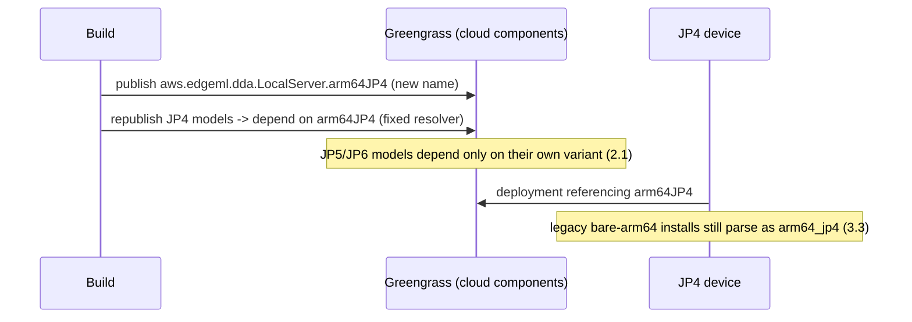

# Design Document: Consistent LocalServer Architecture Naming (arm64JP4)

## Overview

The LocalServer ships as four per-architecture Greengrass components. Three are explicitly JetPack/arch-tagged (`arm64JP5`, `arm64JP6`, `amd64`); the JetPack 4 variant is the untagged `aws.edgeml.dda.LocalServer.arm64`. That bare name doubles as the aarch64 fallback in the portal's model publisher, so a model with an unknown/missing compile target silently gets a HARD dependency on the JetPack 4 server. On a JP5/JP6 device that pulls in the wrong LocalServer, which collides on port 3443 with the correct variant and crash-loops to BROKEN — a production incident already traced to exactly this.

This design makes JetPack 4 explicit (`aws.edgeml.dda.LocalServer.arm64JP4`), retires the bare `arm64` as a *produced/depended* name, and makes the model publisher's LocalServer resolution **fail closed** — an aarch64 target that doesn't resolve to a known JetPack-tagged variant is rejected at publish time rather than defaulting to JP4. Read-side recognizers (deployment variant→arch parser, deploy-screen inference) keep accepting the legacy bare `arm64` name so already-provisioned JP4 devices keep working through JP4's remaining life.

Scope note: no `workflow_core` catalog change — LocalServer variant names are not node-catalog data. The change lives entirely in the portal (`greengrass_publish.py`, `deployments.py`, deploy-screen inference, `workflow_packaging.py`) plus the LocalServer Build_System naming and an operational republish/migration.

### Key Design Decisions

| Decision | Choice | Rationale |
|----------|--------|-----------|
| JP4 naming | Rename to explicit `aws.edgeml.dda.LocalServer.arm64JP4` | Uniform JP4/JP5/JP6 convention; frees the bare `arm64` name so nothing owns the ambiguous catch-all |
| Bare `arm64` on write | Retire — never produced or stamped as a dependency again | The bare name is the sole source of the silent-fallback footgun |
| Bare `arm64` on read | Keep recognized as `arm64_jp4` (alias) | Already-provisioned JP4 devices run the bare-named component; the read-side parser and deploy-screen inference must not stop recognizing them mid-transition (Requirement 5.2) |
| Unresolved aarch64 target | **Fail closed** (raise at publish) | A missing/unknown target must never silently pick JP4; this is the root-cause fix (Requirement 2.2) |
| x86 / JP5 / JP6 | Unchanged names and resolution | Blast radius limited to JP4 + the fallback removal |
| Migration | Re-publish JP4 LocalServer as `arm64JP4`, re-publish JP4 models against it; JP5/JP6 models never depend on any JP4 name | JP4 keeps shipping; the cross-variant conflict is designed out for JP5/JP6 (Requirement 5.3) |
| Coverage | Publish-side mapping matrix + fail-closed test + parser alias test + "no bare-arm64 dependency" recipe test | The original bug shipped because there was zero publish-side test of the mapping (Requirement 6) |

## Architecture

### LocalServer dependency name: produce vs. consume

```mermaid
graph TB
    subgraph Build System
        B[gdk-config.json / run_jp_builds.sh / build-custom.sh<br/>emit arm64JP4 / arm64JP5 / arm64JP6 / amd64]
    end
    subgraph Portal (write side)
        R[greengrass_publish.resolve_local_server_component<br/>target -> explicit variant, FAIL CLOSED]
        MP[Model_Publisher recipe<br/>ComponentDependencies: arm64JP4 / JP5 / JP6 / amd64]
    end
    subgraph Portal (read side)
        VAP[deployments.local_server_component_arch<br/>arm64JP4 -> arm64_jp4; legacy arm64 -> arm64_jp4]
        DSI[Deploy screen JetPack inference<br/>recognize arm64JP4 token]
        MV[workflow_packaging Min_Version_Map<br/>arm64_jp4 lineage]
    end

    B --> MP
    R --> MP
    MP -->|installed on device| VAP
    VAP --> MV
    MP --> DSI
```

### Migration flow



## Components and Interfaces

### 1. Build_System (`gdk-config.json`, `run_jp_builds.sh`, `build-custom.sh`)

- `run_jp_builds.sh` currently derives the component name from `COMPONENT_PREFIX="aws.edgeml.dda.LocalServer.arm64JP"` + target, and defaults `TARGETS="6 5"`. Extend the target set/mapping so a JetPack 4 target emits `aws.edgeml.dda.LocalServer.arm64JP4` (i.e. JP4 joins the `arm64JP{n}` naming rather than the bare `arm64`). `build-custom.sh` receives the component name as an argument, so no logic change beyond the name it is handed (Requirements 1.1, 1.2).
- JP5/JP6/amd64 build outputs are unchanged (Requirement 1.4).

### 2. LocalServer_Resolver (`greengrass_publish.py`)

Current:
```python
PLATFORM_DEPENDENCIES = {'aarch64': 'aws.edgeml.dda.LocalServer.arm64',   # <- generic fallback (footgun)
                         'amd64':  'aws.edgeml.dda.LocalServer.amd64'}
TARGET_TO_LOCAL_SERVER = {'jetson-xavier': 'aws.edgeml.dda.LocalServer.arm64',       # JP4
                          'jetson-xavier-jp5': 'aws.edgeml.dda.LocalServer.arm64JP5',
                          'jetson-xavier-jp6': 'aws.edgeml.dda.LocalServer.arm64JP6',
                          'arm64-cpu': 'aws.edgeml.dda.LocalServer.arm64',
                          'x86_64-cpu': 'aws.edgeml.dda.LocalServer.amd64',
                          'x86_64-cuda': 'aws.edgeml.dda.LocalServer.amd64'}
def resolve_local_server_component(target, platform):
    return TARGET_TO_LOCAL_SERVER.get(target,
        PLATFORM_DEPENDENCIES.get(platform, 'aws.edgeml.dda.LocalServer'))
```

Target:
```python
JP4_LOCAL_SERVER = 'aws.edgeml.dda.LocalServer.arm64JP4'
TARGET_TO_LOCAL_SERVER = {
    'jetson-xavier':     JP4_LOCAL_SERVER,                       # JP4 (explicit)
    'jetson-xavier-jp5': 'aws.edgeml.dda.LocalServer.arm64JP5',
    'jetson-xavier-jp6': 'aws.edgeml.dda.LocalServer.arm64JP6',
    'arm64-cpu':         JP4_LOCAL_SERVER,                       # generic arm64 CPU -> JP4 baseline
    'x86_64-cpu':        'aws.edgeml.dda.LocalServer.amd64',
    'x86_64-cuda':       'aws.edgeml.dda.LocalServer.amd64',
}
_AMD64_LOCAL_SERVER = 'aws.edgeml.dda.LocalServer.amd64'

def resolve_local_server_component(target, platform):
    name = TARGET_TO_LOCAL_SERVER.get(target)
    if name:
        return name
    if platform == 'amd64':          # x86 has a single variant; safe default
        return _AMD64_LOCAL_SERVER
    # aarch64 (or anything else) with an unknown target: FAIL CLOSED — never
    # silently pick a JetPack variant (Requirement 2.2, 2.3).
    raise PublishError(f"Cannot resolve a LocalServer dependency for target "
                       f"'{target}' (platform '{platform}'): no known "
                       f"JetPack-tagged LocalServer variant.")
```

- `PLATFORM_DEPENDENCIES` is removed (or reduced to the amd64 constant); the generic `aws.edgeml.dda.LocalServer.arm64` string is deleted from the module (Requirement 2.3).
- Both `generate_component_recipe` and `generate_vllm_component_recipe` call the same resolver, so the vLLM path inherits the guarantee (Requirement 2.5). The publish handler surfaces the raised error as a publish failure with the offending target.
- x86 resolution is unchanged (Requirement 2.4).

> **Amendment note** (see `.kiro/specs/onnx-jetson-publish-packaging/`): the
> `TARGET_TO_LOCAL_SERVER` key list above predates the compiled-ONNX targets.
> Three entries have since joined it: `onnx-jetson-xavier-jp5` → `…arm64JP5`,
> `onnx-jetson-xavier-jp6` → `…arm64JP6`, `onnx-jetson-xavier-jp7` →
> `…arm64JP7` — added under the both-maps-or-fail-closed rule established by
> `.kiro/specs/vllm-multi-arch-publish-conflict/` (every target mapped in BOTH
> `TARGET_TO_LOCAL_SERVER` and `TARGET_TO_PLATFORM`, unmapped targets raising
> `PublishError` via `resolve_target_platform`), so the fail-closed guarantee
> this spec introduced is preserved.

### 3. Variant_Arch_Parser (`deployments.py`)

`local_server_component_arch(component_name)` gains the explicit JP4 tag while keeping the legacy alias:
```python
# suffix after 'aws.edgeml.dda.LocalServer.'
'arm64JP6' -> 'arm64_jp6'
'arm64JP5' -> 'arm64_jp5'
'arm64JP4' -> 'arm64_jp4'   # NEW explicit
'arm64'    -> 'arm64_jp4'   # legacy alias (already-provisioned JP4 devices)
'aarch64'  -> 'arm64_jp4'   # legacy alias
'amd64' / 'x86_64' -> 'x86_64'
```
Order matters: match the longer `arm64JP4/5/6` tokens before the bare `arm64` prefix so `arm64JP4` is not misread as legacy `arm64` (Requirements 3.1, 3.2, 3.3). Non-LocalServer / empty names still return `None`.

### 4. Deploy_Screen_Inference (device-arch-compatibility frontend)

The screen infers a component's JetPack Target_Architecture from JetPack tokens in the component name (existing `arm64JP5`/`arm64JP6` handling). Add `arm64JP4` -> `arm64_jp4` to that token inference so a JP4 LocalServer (or JP4-named component) is inferred as `arm64_jp4` and gated/displayed consistently (Requirement 3.4). Legacy bare `arm64` continues to be inferred as `arm64_jp4` where the screen already did so; no JP5/JP6/x86 behavior changes (Requirement 3.5).

### 5. Min_Version_Map (`workflow_packaging.py`)

`MIN_LOCAL_SERVER_VERSIONS` is a JSON-configured, per-arch map keyed by workflow_core arch id (`arm64_jp4`/`arm64_jp5`/`arm64_jp6`/...). No code change is required for the arch id itself (it is already `arm64_jp4`); the alignment is ensuring the `arm64_jp4` lineage is populated/keyed like the others and derived from the `arm64JP4`-installed device via the Variant_Arch_Parser (Requirements 4.1, 4.2). The scalar fallback for archs absent from the map is unchanged.

### 6. Migration (operational)

- Build + publish the JetPack 4 LocalServer as `aws.edgeml.dda.LocalServer.arm64JP4`.
- Re-publish JetPack 4 Model_Components through the fixed Model_Publisher so their recipes depend on `arm64JP4` (Requirement 5.1). Greengrass component versions are immutable, so existing mis-stamped recipes are superseded by new versions, not edited in place.
- JP5/JP6 models, published through the fixed resolver, depend only on their own variant — the cross-variant port-3443 conflict is designed out (Requirement 5.3).
- The bare `aws.edgeml.dda.LocalServer.arm64` cloud component (already deleted) is not re-created; the name survives only as a read-side alias for devices still running it.

## Data Models

### LocalServer variant name → Target_Architecture (read side, Variant_Arch_Parser)

| Component name | Target_Architecture | Status |
|---|---|---|
| `aws.edgeml.dda.LocalServer.arm64JP6` | `arm64_jp6` | unchanged |
| `aws.edgeml.dda.LocalServer.arm64JP5` | `arm64_jp5` | unchanged |
| `aws.edgeml.dda.LocalServer.arm64JP4` | `arm64_jp4` | new explicit |
| `aws.edgeml.dda.LocalServer.arm64` | `arm64_jp4` | legacy alias (read only) |
| `aws.edgeml.dda.LocalServer.aarch64` | `arm64_jp4` | legacy alias (read only) |
| `aws.edgeml.dda.LocalServer.amd64` / `.x86_64` | `x86_64` | unchanged |
| non-LocalServer / empty | `None` | unchanged |

### Compile_Target → LocalServer dependency (write side, LocalServer_Resolver)

| Compile_Target | LocalServer dependency | Notes |
|---|---|---|
| `jetson-xavier` | `aws.edgeml.dda.LocalServer.arm64JP4` | was bare `arm64` |
| `jetson-xavier-jp5` | `aws.edgeml.dda.LocalServer.arm64JP5` | unchanged |
| `jetson-xavier-jp6` | `aws.edgeml.dda.LocalServer.arm64JP6` | unchanged |
| `arm64-cpu` | `aws.edgeml.dda.LocalServer.arm64JP4` | was bare `arm64` |
| `x86_64-cpu` / `x86_64-cuda` | `aws.edgeml.dda.LocalServer.amd64` | unchanged |
| unknown target, aarch64/other platform | — | **raises** (fail closed) |
| unknown target, amd64 platform | `aws.edgeml.dda.LocalServer.amd64` | single x86 variant |

Model_Component recipe `ComponentDependencies` shape and `VersionRequirement` (`^1.0.0`, HARD) are otherwise unchanged.

## Error Handling

- **Unresolvable aarch64 target (publish):** `resolve_local_server_component` raises a `PublishError` (or the module's existing publish-error type) naming the target and platform; the publish handler returns a failed-publish response identifying the model and target, and no component version is created. This replaces the silent generic-`arm64` fallback (Requirement 2.2).
- **Legacy-named JP4 device (read):** the Variant_Arch_Parser maps the bare `arm64`/`aarch64` names to `arm64_jp4` so gating and deploy-screen inference continue to function for un-migrated devices; no error (Requirement 5.2).
- **Ambiguous token ordering:** the parser matches `arm64JP4`/`JP5`/`JP6` before the bare `arm64` prefix so an explicit name is never misclassified as legacy; covered by test (Requirement 3, Property 3).
- **x86 unknown target:** resolves to the single amd64 variant rather than failing, since x86 has no JetPack ambiguity (Requirement 2.4).
- **Migration overlap:** during transition both JP4 names may appear across components/devices; all read-side recognizers accept both, so a mixed fleet neither errors nor mis-gates (Requirement 5.2).

## Correctness Properties

*A property is a characteristic or behavior that should hold true across all valid executions of a system — essentially, a formal statement about what the system should do. Properties serve as the bridge between human-readable specifications and machine-verifiable correctness guarantees.*

### Property 1: Known targets resolve to their explicit JetPack-tagged variant

*For any* known Compile_Target, the LocalServer_Resolver SHALL return the explicit variant for that target — `jetson-xavier`→`arm64JP4`, `jetson-xavier-jp5`→`arm64JP5`, `jetson-xavier-jp6`→`arm64JP6`, x86 targets→`amd64` — and never a bare/untagged aarch64 name.

**Validates: Requirements 2.1, 2.3, 1.3**

### Property 2: Unresolvable aarch64 targets fail closed

*For any* target string that does not map to a known LocalServer_Variant and does not resolve to the amd64 platform, the LocalServer_Resolver SHALL raise rather than return any component name.

**Validates: Requirements 2.2, 2.3**

### Property 3: Variant parser round-trips every variant, with the JP4 alias

*For any* LocalServer_Variant component name, the Variant_Arch_Parser SHALL return the matching Target_Architecture, mapping both `arm64JP4` and the legacy bare `arm64`/`aarch64` to `arm64_jp4`, `arm64JP5`→`arm64_jp5`, `arm64JP6`→`arm64_jp6`, amd64/x86_64→`x86_64`, and `None` for non-LocalServer names — with the explicit `arm64JP4` never misclassified as the legacy `arm64`.

**Validates: Requirements 3.1, 3.2, 3.3**

### Property 4: No published recipe carries a bare-arm64 dependency

*For any* model (vision or vLLM) published through the Model_Publisher for any resolvable target, the generated recipe's `ComponentDependencies` SHALL contain no `aws.edgeml.dda.LocalServer.arm64` (bare) entry — only an explicit JetPack-tagged or amd64 variant.

**Validates: Requirements 2.3, 6.4, 5.3**

### Property 5: JP5/JP6/x86 publish and gating are unchanged

*For any* JP5, JP6, or x86 model publish and any deployment gating over those variants, the resolved LocalServer dependency, the Variant_Arch_Parser output, and the Min_Version_Map result SHALL equal their pre-feature values.

**Validates: Requirements 1.4, 2.4, 3.2, 3.5, 4.2, 5.4**

### Property 6: Deploy-screen JetPack inference recognizes arm64JP4

*For any* component name carrying an `arm64JP4` token, the Deploy_Screen_Inference SHALL infer `arm64_jp4`, consistent with its existing `arm64JP5`/`arm64JP6` handling, and SHALL not change inference for non-JetPack-token names.

**Validates: Requirements 3.4, 3.5**

## Testing Strategy

- **Resolver mapping matrix (Property 1, 2, 4):** unit-test `resolve_local_server_component` for every known target → expected variant; assert an unknown aarch64 target raises; assert amd64 unknown target resolves to amd64. Add a recipe-generation test (both `generate_component_recipe` and `generate_vllm_component_recipe`) asserting the `ComponentDependencies` key is the expected explicit variant and never the bare `arm64`.
- **Variant parser (Property 3):** unit-test `local_server_component_arch` for `arm64JP4/JP5/JP6`, legacy `arm64`/`aarch64`, amd64/x86_64, and non-LocalServer/empty; include the ordering case that `arm64JP4` is not misread as legacy `arm64`.
- **Min-version map (Property 5):** assert the `arm64_jp4` lineage is gated by its own floor with scalar fallback, and JP5/JP6/x86 results are unchanged against a captured baseline.
- **Deploy-screen inference (Property 6):** frontend unit test that an `arm64JP4`-tokened name infers `arm64_jp4` and non-tokened names are unaffected.
- **Regression guard (Property 4):** a test that greps/asserts the publisher module exposes no code path returning a bare `aws.edgeml.dda.LocalServer.arm64` string.
- Property-based tests (Hypothesis) back Properties 1–4 where the input domain is enumerable (target strings, variant name suffixes); example-based tests cover the fixed variant names and the legacy alias.

## Requirements Coverage

| Requirement | Design component | Properties |
|---|---|---|
| 1.1–1.4 (arm64JP4 build + naming) | Component 1, 2 | 1, 5 |
| 2.1–2.5 (fail-closed resolver) | Component 2 | 1, 2, 4 |
| 3.1–3.5 (parser + deploy-screen recognition) | Components 3, 4 | 3, 6 |
| 4.1–4.2 (min-version map) | Component 5 | 5 |
| 5.1–5.4 (migration / backward compat) | Components 2, 3, 6 | 3, 4, 5 |
| 6.1–6.4 (regression coverage) | Testing Strategy | 1, 2, 3, 4 |

## Amendment (vllm-multi-arch-publish-conflict)

Amended by `.kiro/specs/vllm-multi-arch-publish-conflict/` (branch `spec/jetpack7-support`):

- `greengrass_publish.py` gained the `jetson-xavier-jp7` entries: `TARGET_TO_LOCAL_SERVER['jetson-xavier-jp7'] = 'aws.edgeml.dda.LocalServer.arm64JP7'` and `TARGET_TO_PLATFORM['jetson-xavier-jp7'] = 'aarch64'`.
- The unmapped JP7 target had been silently covered by the `platform == 'amd64'` branch of `resolve_local_server_component`, because `TARGET_TO_PLATFORM.get(target, 'amd64')` defaulted the platform to `amd64` — bypassing this spec's fail-closed guarantee without any error surfacing.
- Any future aarch64 target must be added to BOTH maps, or the amd64 default defeats fail-closed resolution. This is why `resolve_target_platform` now raises `PublishError` for a target absent from either map instead of defaulting, so the guarantee can no longer be bypassed silently.
