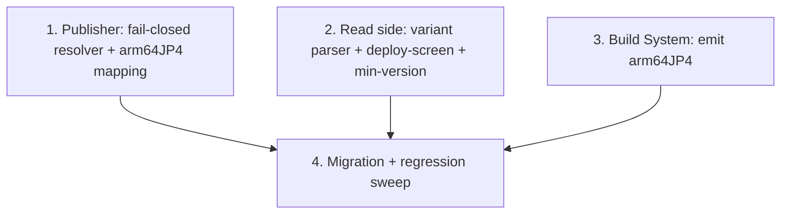

# Implementation Plan: Consistent LocalServer Architecture Naming (arm64JP4)

## Overview

The change is portal + build only (no `workflow_core` catalog change). Two independent code seams can proceed in parallel once naming is settled: the **write side** (the model publisher's fail-closed resolver, Task 1) and the **read side** (deployment variant parser + deploy-screen inference + min-version alignment, Task 2). The **Build_System** rename (Task 3) is independent of both. A final **migration + regression sweep** (Task 4) republishes JP4 artifacts through the fixed publisher and confirms no bare-`arm64` dependency can be produced.

Read-side recognizers keep the legacy bare `arm64` alias so already-provisioned JP4 devices keep working; only the write side stops producing the bare name.

Test baselines that must stay green throughout:
- Portal backend: the `edge-cv-portal/backend/tests` suite (esp. `test_workflow_localserver_variant_compat.py`, `test_workflow_packaging_variant_min_version.py`, `test_vllm_publish_writeback.py`).
- Frontend: `CI=true npx react-scripts test --watchAll=false` under `edge-cv-portal/frontend`.

## Task Dependency Graph



```json
{
  "waves": [
    { "wave": 1, "tasks": ["1", "2", "3"], "description": "Independent seams (parallel): write-side fail-closed resolver, read-side recognizers, and Build_System arm64JP4 naming" },
    { "wave": 2, "tasks": ["4"], "description": "Migration republish + regression sweep asserting no bare-arm64 dependency" }
  ]
}
```

## Tasks

- [x] 1. Make the model publisher resolve explicit variants and fail closed
  - In `edge-cv-portal/backend/functions/greengrass_publish.py`: set `TARGET_TO_LOCAL_SERVER['jetson-xavier']` and `['arm64-cpu']` to `aws.edgeml.dda.LocalServer.arm64JP4`; remove the generic `aws.edgeml.dda.LocalServer.arm64` string and the aarch64 entry of `PLATFORM_DEPENDENCIES`.
  - Rewrite `resolve_local_server_component(target, platform)` to return the mapped variant for known targets, return the amd64 variant for the amd64 platform, and otherwise RAISE the module's publish-error type naming the target/platform (fail closed) — never return a bare/untagged aarch64 name.
  - Ensure both `generate_component_recipe` and `generate_vllm_component_recipe` route through the resolver and that `publish_component` surfaces the raised error as a failed-publish response (no component version created).
  - _Requirements: 1.3, 2.1, 2.2, 2.3, 2.4, 2.5_

- [x] 1.1 Write publisher resolver + recipe tests
  - Assert the full Compile_Target → variant matrix (Property 1), including `jetson-xavier → arm64JP4` and JP5/JP6/x86.
  - Assert an unknown aarch64 target raises and an unknown amd64 target resolves to amd64 (Property 2).
  - Assert generated vision and vLLM recipes carry the expected explicit dependency and never a bare `aws.edgeml.dda.LocalServer.arm64` (Property 4), and that the module exposes no code path returning the bare name.
  - _Requirements: 6.1, 6.2, 6.4_

- [x] 2. Recognize arm64JP4 on the read side (deployment parser, deploy screen, min-version)
  - In `edge-cv-portal/backend/functions/deployments.py`, extend `local_server_component_arch` to map `arm64JP4 → arm64_jp4` while keeping legacy `arm64`/`aarch64 → arm64_jp4`; ensure the longer `arm64JP4/5/6` tokens are matched before the bare `arm64` prefix so an explicit name is never misclassified.
  - In the Create/Revise Deployment screen JetPack inference (device-arch-compatibility frontend), add the `arm64JP4` token → `arm64_jp4` alongside `arm64JP5`/`arm64JP6`; leave non-JetPack-token behavior unchanged.
  - Confirm `workflow_packaging.py` `MIN_LOCAL_SERVER_VERSIONS` keys the `arm64_jp4` lineage like the other arches (per-arch floor + scalar fallback); adjust only if the arch id handling differs.
  - _Requirements: 3.1, 3.2, 3.3, 3.4, 3.5, 4.1, 4.2_

- [x] 2.1 Write read-side tests
  - Backend: extend `test_workflow_localserver_variant_compat.py` to assert `arm64JP4 → arm64_jp4`, legacy `arm64`/`aarch64 → arm64_jp4`, JP5/JP6/x86 unchanged, and the ordering (arm64JP4 not read as legacy) (Property 3).
  - Backend: assert the `arm64_jp4` min-version lineage is gated by its own floor with scalar fallback and JP5/JP6/x86 results are unchanged (Property 5).
  - Frontend: assert an `arm64JP4`-tokened component infers `arm64_jp4` and non-tokened names are unaffected (Property 6).
  - _Requirements: 3.1, 3.2, 3.3, 3.4, 4.1, 4.2_

- [x] 3. Emit the JetPack 4 LocalServer as arm64JP4 in the Build_System
  - Update `run_jp_builds.sh` / `gdk-config.json` so a JetPack 4 build target produces `aws.edgeml.dda.LocalServer.arm64JP4` (JP4 joins the `arm64JP{n}` naming), reusing the existing per-target `build-custom.sh` path (which takes the component name as an argument).
  - Do not change the JP5/JP6/amd64 build outputs.
  - _Requirements: 1.1, 1.2, 1.4_

- [x] 4. Migration republish + regression sweep
  - Build and publish the JetPack 4 LocalServer as `aws.edgeml.dda.LocalServer.arm64JP4`; re-publish JetPack 4 Model_Components through the fixed publisher so their recipes depend on `arm64JP4` (new immutable versions).
  - Sweep the portal for any remaining literal `aws.edgeml.dda.LocalServer.arm64` used as a produced/depended name (excluding the read-side legacy alias) and confirm none remain; confirm JP5/JP6 model recipes depend only on their own variant.
  - Run the backend + frontend suites and confirm no regression to JP5/JP6/x86 publish, gating, or min-version behavior.
  - _Requirements: 5.1, 5.2, 5.3, 5.4, 6.3_

## Notes

- **No `workflow_core` catalog change.** LocalServer variant names are not node-catalog data, so the two mirrored `nodes.py` copies are untouched by this feature (unlike csi-icam-input-nodes).
- **Write vs. read asymmetry is intentional.** The bare `aws.edgeml.dda.LocalServer.arm64` is retired as a *produced/depended* name (write side) but stays a *recognized alias* on the read side (parser + deploy-screen inference) so already-provisioned JP4 devices keep working through JP4's remaining supported life (Requirement 5.2).
- **Root cause recap.** The original incident: a JP5 model published before the arch-specific mapping existed carried a HARD dependency on the bare `arm64` (JP4) LocalServer, which collided on port 3443 with the JP5 LocalServer and crash-looped to BROKEN. The fail-closed resolver (Task 1) makes that class of mis-stamp impossible going forward.
- **Immutable versions.** Greengrass component versions cannot be edited; migration supersedes mis-stamped model recipes with new versions rather than mutating them. The bare `arm64` cloud component was already deleted and is not re-created.
- **Shipping.** Portal deploy (publisher + deploy screen + parser) plus a JP4 LocalServer build/publish. JP5/JP6 are unaffected and need no rebuild for this feature.
- **Test commands:** portal backend — the `edge-cv-portal/backend/tests` suite; frontend — `CI=true npx react-scripts test --watchAll=false` under `edge-cv-portal/frontend`.
