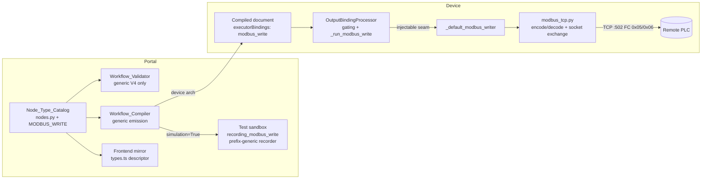

# Design Document: Modbus TCP Output Node

## Overview

This feature adds a `modbus_write` OUTPUT-category node to the workflow
builder. After a workflow run completes, the node writes one value — a coil or
a holding register — to a Modbus TCP server (typically a PLC), gated by the
same upstream `conditional` / `inference_filter` mechanism the existing
`digital_output`, `mqtt_publish`, and `opcua_write` outputs use. "Channels of
action" are composed by wiring multiple `modbus_write` nodes behind different
conditional branches.

The feature is deliberately shaped as a **fourth instance of an established
pattern**, not new machinery:

- **Catalog**: one appended `NodeTypeDescriptor` (both byte-in-sync copies +
  frontend mirror). No new descriptor mechanism — the `depends_on`
  `"name=value"` gating needed for `pulse_ms` already exists
  (trigger-activation-runtime).
- **Validator**: zero changes. `host`, `register_type`, and `address` are
  statically required, so the generic V4 required-parameter check covers them.
  (`mqtt_publish` needed V6 only because `broker_host` had to stay optional
  for the Greengrass path; Modbus has no such alternative target.)
- **Compiler**: zero changes. Executor bindings are emitted generically from
  `mapping.executor_binding` (verified in `compiler.py` step 5), and
  simulation resolution to `recording_*` stubs is generic over
  `hardware_dependent=True`.
- **Test sandbox**: zero changes. `harness/bindings.py` records any binding
  whose id starts with `SIM_RECORDING_BINDING_PREFIX` (`recording_`).
- **Device engine**: one new binding kind in `OutputBindingProcessor` (a
  runner + an injectable writer seam, mirroring the three existing seams) plus
  a small pure-function Modbus TCP framing module.

### Key design decisions

**D1 — Single-target node.** One `modbus_write` node writes one coil or one
holding register. Multi-channel-per-node was rejected: it would need a
list-typed parameter shape no descriptor uses, complicate gating (which is
per-node), and diverge from `digital_output`/`opcua_write` symmetry. Multiple
channels = multiple nodes behind different conditional ports.

**D2 — Stdlib Modbus client; no pymodbus.** Weighed both options:

| | `pymodbus` (pinned) | Minimal stdlib client |
|---|---|---|
| Protocol scope needed | Write Single Coil (0x05), Write Single Register (0x06) only | Same |
| `src/backend/requirements.txt` | Must change → preservation-gate rebaseline (`dependency_baseline_requirements.txt`), riding the NEXT shared JP6 build | Unchanged |
| Install risk | Must verify wheels under JP6 python3.10 AND JP5 python3.11 aarch64; pymodbus 3.x has had breaking API churn | None (socket/struct) |
| Code owned | Thin call wrapper | ~100 lines of framing + socket exchange |
| Testability | Library internals opaque | Pure encode/decode functions → ideal Hypothesis round-trip targets |

For two fixed-length PDUs, a dependency is disproportionate: the entire
Modbus TCP write exchange is a 12-byte request and a 12-byte (or 9-byte
exception) response with big-endian fields. The stdlib client keeps every
preservation-tracked file untouched (no rebaseline tasks, no dependency risk
on a build shared with two in-flight bugfixes) and makes the protocol layer
property-testable. Rejected alternative: `pymodbus==3.x` pinned — revisit only
if the deferred scope (multi-register writes, RTU, Modbus/TCP security)
arrives.

**D3 — Value semantics mirror `opcua_write`.** `value_template` (default
`{is_anomalous}`) is rendered by the shared `render_template` over the run's
inference metadata; the rendered value is then coerced per target: coil →
boolean (via the shared `_coerce` normalization, so `"true"`/`1`/`True` all
work), holding register → int, which must land in 0–65535 or the binding
fails without writing.

**D4 — Coil pulse mirrors `digital_output`.** `digital_output` has
`signal_type=pulse` + `pulse_width_ms`; the Modbus analog is `pulse_ms`
(default 0 = latch): write the rendered coil value, sleep `pulse_ms`, write
the inverse. Gated to `register_type=coil` in the config panel via the
existing `"name=value"` `depends_on` form. Holding registers get no pulse
(no meaningful inverse).

**D5 — No own `condition` parameter.** `digital_output` carries a required
`condition` parameter for historical reasons; `mqtt_publish` and `opcua_write`
rely purely on upstream gating. `modbus_write` follows the latter — the user's
stated composition ("behind a conditional") is upstream gating, and the
processor's `_condition_result` treats an absent condition as allow.

## Architecture



Execution flow on device (unchanged pattern): pipeline run completes →
`OutputBindingProcessor.process` evaluates `inference_filter` outcomes and
`conditional` `portConditions`, then for each `modbus_write` binding that is
not `_gated_out`, renders and coerces the value and calls the injected writer.
Failures are contained per binding and aggregated into `OutputBindingError`.

## Components and Interfaces

### 1. Catalog descriptor (`workflow_core/catalog/nodes.py`, both copies)

Appended after all existing entries, before the `NODE_CATALOG` list, and added
as the last element of `NODE_CATALOG`:

```python
MODBUS_WRITE = NodeTypeDescriptor(
    type_id="modbus_write",
    category=CATEGORY_OUTPUT,
    display_name="Modbus TCP Write",
    inputs=[PortDescriptor("in", PORT_TYPE_INFERENCE_META)],
    outputs=[],
    parameters=[
        ParameterDescriptor("host", "string", required=True, default=None,
                            constraints={"min_length": 1}, ...),
        ParameterDescriptor("port", "int", required=False, default=502,
                            constraints={"min": 1, "max": 65535}, ...),
        ParameterDescriptor("unit_id", "int", required=False, default=1,
                            constraints={"min": 0, "max": 255}, ...),
        ParameterDescriptor("register_type", "enum", required=True,
                            default="coil",
                            constraints={"values": ["coil",
                                                    "holding_register"]}, ...),
        ParameterDescriptor("address", "int", required=True, default=None,
                            constraints={"min": 0, "max": 65535}, ...),
        ParameterDescriptor("value_template", "string", required=False,
                            default="{is_anomalous}", constraints={}, ...),
        ParameterDescriptor("pulse_ms", "int", required=False, default=0,
                            constraints={"min": 0, "max": 60000},
                            depends_on="register_type=coil", ...),
    ],
    # Executor-level Modbus TCP client write (stdlib socket; no packaged
    # plugin dependency). Simulation: recording binding, no PLC contact.
    mappings=_same_on_device_archs(executor_binding="modbus_write")
             + [_recording_binding("modbus_write")],
    hardware_dependent=True,
)
```

Descriptions follow catalog house style (concrete examples, e.g.
`host="192.168.1.30"`, `address=12`, `ns`-free plain integers). The vendored
copy `src/backend/workflow_engine/vendor/workflow_core/catalog/nodes.py`
receives the byte-identical edit (existing `test_vendored_catalog_mirror.py`
enforces the sync).

### 2. Modbus TCP client (`src/backend/workflow_engine/modbus_tcp.py`, new)

Pure framing functions plus one socket exchange helper. No imports beyond
`socket`, `struct`, and typing.

```python
FUNCTION_WRITE_SINGLE_COIL = 0x05
FUNCTION_WRITE_SINGLE_REGISTER = 0x06
COIL_ON = 0xFF00
COIL_OFF = 0x0000
MODBUS_TIMEOUT_SEC = 5.0
EXCEPTION_MEANINGS = {1: "ILLEGAL FUNCTION", 2: "ILLEGAL DATA ADDRESS",
                      3: "ILLEGAL DATA VALUE", 4: "SERVER DEVICE FAILURE", ...}

class ModbusError(Exception): ...          # exception/malformed responses

def encode_write_request(transaction_id, unit_id, function_code,
                         address, value) -> bytes:
    """12-byte MBAP+PDU frame, big-endian ('>HHHBBHH')."""

def decode_frame(frame: bytes) -> WriteFrame:
    """Parse a 12-byte write request/echo frame into its fields; raises
    ModbusError on truncation, non-zero protocol id, or bad length."""

def check_response(request: WriteFrame, response_bytes: bytes) -> None:
    """Validates the response against the request: exception responses
    (fc | 0x80) raise ModbusError naming the code and EXCEPTION_MEANINGS
    entry; transaction-id / function-code / echo mismatches raise
    ModbusError describing the malformation."""

def write_single(host, port, unit_id, function_code, address, value,
                 timeout=MODBUS_TIMEOUT_SEC) -> None:
    """One TCP connect → send → recv → validate → close exchange."""
```

`WriteFrame` is a small frozen dataclass (`transaction_id`, `unit_id`,
`function_code`, `address`, `value`). Response reads use a bounded `recv`
loop with the socket timeout applied to both `create_connection` and the
response wait (Requirement 4.8).

### 3. Output binding runner (`src/backend/workflow_engine/output_bindings.py`)

Additive edits mirroring the three existing binding kinds:

- `BINDING_MODBUS_WRITE = "modbus_write"` constant.
- `_default_modbus_writer(host, port, unit_id, register_type, address, value, pulse_ms)`:
  module-level production default. Coil path: maps the boolean to
  `COIL_ON`/`COIL_OFF`, calls `modbus_tcp.write_single`, and when
  `pulse_ms > 0` sleeps and writes the inverse (same in-process
  `time.sleep` pattern `_default_dio_actuator` uses). Register path: one
  `write_single` with the validated int. `modbus_tcp` is imported lazily,
  matching the paho/opcua lazy-import convention.
- `OutputBindingProcessor.__init__` gains `modbus_writer: Optional[Callable] = None`
  (defaulting to `_default_modbus_writer`) — the injectable seam
  (Requirement 4.6).
- Dispatch branch in `process`: `elif kind == BINDING_MODBUS_WRITE: runner = self._run_modbus_write`.
- `_run_modbus_write(parameters, metadata)`:
  1. Render `value_template` (default `{is_anomalous}`) via `render_template`.
  2. `register_type == "coil"`: `value = bool(_coerce(rendered))`.
  3. `register_type == "holding_register"`: coerce to `int`; raise
     `ValueError` naming the rendered value and the 0–65535 range when the
     coercion fails or the value is out of range (Requirement 4.4) — the
     existing per-binding containment turns this into an `OutputBindingError`
     entry.
  4. Call `self._modbus_writer(host, port, unit_id, register_type, address,
     value, pulse_ms)`.
  5. Return the sent-message detail, e.g.
     `wrote True to coil 12 at 192.168.1.30:502 (unit 1, pulse 250ms)` /
     `wrote 1 to holding_register 40 at 192.168.1.30:502 (unit 1)` —
     `_preview`-bounded like the existing details (Requirement 4.9).

Gating (Requirements 6.1–6.3) needs **no new code**: `_gated_out` and the
detail emission are generic over binding kinds.

### 4. Frontend mirror (`edge-cv-portal/frontend/src/pages/workflows/types.ts`)

`MODBUS_WRITE_DESCRIPTOR: NodeTypeDescriptor` hand-mirrored in camelCase wire
form (typeId, category `output`, displayName, ports, all seven parameters with
identical names/types/defaults/constraints and `dependsOn:
'register_type=coil'` on `pulse_ms`, device mappings + `recording_modbus_write`
sim mapping, `hardwareDependent: true`). The palette is category-driven from
the backend-served catalog, so the node appears under Outputs with no palette
code changes; `NodeConfigPanel`'s `isParameterVisible` already implements
`"name=value"` gating; `inlineChecks.ts` V4 is descriptor-generic. Zero
frontend logic changes — only the mirror constant plus tests.

### 5. Baselines

`catalog_baseline.json` regenerated with the delta scoped to the appended
`modbus_write` entry (Requirement 2.3). `golden_zero_trigger_compilation.json`
and the packaging goldens are untouched — asserted, not regenerated
(Requirement 2.7). No preservation-tracked file changes (Requirement 5.6), so
no security baseline rebaselining is needed.

## Data Models

### Modbus TCP write frame (wire format, big-endian)

| Offset | Size | Field | Value |
|---|---|---|---|
| 0 | 2 | Transaction id | per-exchange counter/random |
| 2 | 2 | Protocol id | 0 |
| 4 | 2 | Length | 6 (unit id + PDU) |
| 6 | 1 | Unit id | 0–255 |
| 7 | 1 | Function code | 0x05 / 0x06 (exception: +0x80) |
| 8 | 2 | Address | 0–65535 |
| 10 | 2 | Value | coil: 0xFF00/0x0000; register: 0–65535 |

A successful write response echoes bytes 7–11 of the request with the same
transaction id. An exception response is 9 bytes: MBAP + (fc | 0x80) +
exception code.

### Executor binding entry (compiled document, generic emission)

```json
{
  "nodeId": "modbus1",
  "binding": "modbus_write",
  "parameters": {
    "host": "192.168.1.30", "port": 502, "unit_id": 1,
    "register_type": "coil", "address": 12,
    "value_template": "{is_anomalous}", "pulse_ms": 0
  },
  "upstreamNodeIds": ["cond1"]
}
```

In simulation documents the same entry carries
`"binding": "recording_modbus_write"`.

### Descriptor parameter surface

| Parameter | Type | Required | Default | Constraints | Gating |
|---|---|---|---|---|---|
| `host` | string | yes | — | min_length 1 | — |
| `port` | int | no | 502 | 1–65535 | — |
| `unit_id` | int | no | 1 | 0–255 | — |
| `register_type` | enum | yes | `coil` | `coil` \| `holding_register` | — |
| `address` | int | yes | — | 0–65535 | — |
| `value_template` | string | no | `{is_anomalous}` | — | — |
| `pulse_ms` | int | no | 0 | 0–60000 | `register_type=coil` |

## Correctness Properties

*A property is a characteristic or behavior that should hold true across all
valid executions of a system — essentially, a formal statement about what the
system should do. Properties serve as the bridge between human-readable
specifications and machine-verifiable correctness guarantees.*

### Property 1: Modbus frame round trip and echo validation

*For any* valid write request (function code 0x05 or 0x06, address 0–65535,
coil state or register value 0–65535, unit id 0–255, transaction id 0–65535),
decoding the encoded request frame yields the original field values, and
validating the request's own echo as a response reports success.

**Validates: Requirements 5.1, 5.2, 5.3**

### Property 2: Exception responses raise with the named meaning

*For any* valid write request and any Modbus exception code, validating an
exception response (function code | 0x80 plus the code) raises a Modbus error
whose message names the exception code, and for codes 0x01–0x04 also names the
standard Modbus meaning.

**Validates: Requirements 5.4**

### Property 3: Malformed responses never validate as success

*For any* valid write request and any response malformation (truncation to any
shorter length, a mismatched transaction id, a non-zero protocol id, or an
unexpected function code), validating the malformed response raises a Modbus
error describing the malformation.

**Validates: Requirements 5.5**

### Property 4: Write dispatch carries the configured target and the coerced value

*For any* `modbus_write` binding parameters (host, port, unit_id,
register_type, address) and any inference metadata whose rendered
`value_template` is coercible, processing the binding calls the injected
writer exactly once with the configured host, port, unit id, and address, and
with the rendered value coerced per the register type — boolean (matching the
shared `_coerce` normalization) for `coil`, integer for `holding_register`.

**Validates: Requirements 4.1, 4.2, 4.3**

### Property 5: Out-of-range register values fail without writing

*For any* holding-register binding whose rendered value is not coercible to an
integer in 0–65535, processing issues no writer call and aggregates an
`OutputBindingError` naming the binding's node id.

**Validates: Requirements 4.4**

### Property 6: Coil pulse semantics

*For any* coil value and any `pulse_ms` in 0–60000, the production writer
issues exactly one coil write when `pulse_ms` is 0, and exactly two coil
writes — the rendered value followed by its inverse, separated by the
`pulse_ms` wait — when `pulse_ms` is greater than 0.

**Validates: Requirements 4.5**

### Property 7: Gating decides exactly which writes execute

*For any* compiled document distributing `modbus_write` bindings across
`conditional` output ports (and/or behind inference filters) and any inference
metadata, the set of bindings for which the writer is called equals exactly
the set whose gates evaluated true, and every gated-out binding emits the
"not sent: gated out" detail instead of a write.

**Validates: Requirements 6.1, 6.2, 6.3**

### Property 8: Modbus failures are contained per binding

*For any* document mixing a `modbus_write` binding with other output bindings,
when the Modbus writer raises, every other binding is still processed
normally and the raised `OutputBindingError` carries the failing Modbus node
id.

**Validates: Requirements 4.7**

### Property 9: Sent-message detail completeness

*For any* successfully processed `modbus_write` binding, the emitted
Detail_Sink summary contains the written value, the register type, the
address, the host and port, the unit id, and — when pulsed — the pulse
duration.

**Validates: Requirements 4.9**

### Property 10: Compiler emits the binding with effective parameters

*For any* valid workflow graph containing a `modbus_write` node with any valid
parameter assignment, compiling for a device architecture emits exactly one
executor-binding entry with binding `modbus_write`, the node id, the effective
parameters (declared defaults applied for omitted optionals), and the node's
upstream node ids.

**Validates: Requirements 2.5**

### Property 11: Simulation resolves to the recording stub

*For any* valid workflow graph containing a `modbus_write` node, compiling
with `simulation=True` emits the node's binding as `recording_modbus_write`
and emits no device `modbus_write` binding.

**Validates: Requirements 2.6**

### Property 12: Generic V4 covers the required parameters

*For any* `modbus_write` node configuration missing an effective value for any
subset of `host`, `register_type`, and `address`, validation produces one
`V4_MISSING_REQUIRED_PARAMETER` error finding per missing parameter naming
that node, and produces no finding codes introduced by this feature.

**Validates: Requirements 2.4**

### Property 13: pulse_ms visibility gating (frontend)

*For any* `modbus_write` parameter assignment, the configuration panel's
parameter-visibility predicate shows `pulse_ms` exactly when the effective
`register_type` value (explicit, else the declared default `coil`) equals
`coil`.

**Validates: Requirements 3.3**

### Property 14: Inline V4 parity (frontend)

*For any* `modbus_write` node configuration with any subset of the required
parameters missing, the frontend inline checks produce findings matching the
backend Workflow_Validator's V4 findings for the same graph in check code,
severity, and node identifier.

**Validates: Requirements 3.4**

## Error Handling

- **Value coercion errors** (Requirement 4.4): raised as `ValueError` inside
  `_run_modbus_write` before any socket activity; the existing per-binding
  `try/except` converts it into an `OutputBindingError` entry naming the node.
  The message carries the rendered value and the permitted 0–65535 range.
- **Connection/timeout errors** (Requirement 4.8): `socket.timeout` /
  `ConnectionError` from `write_single` propagate out of the writer and are
  contained the same way; the writer wraps them with the host:port context so
  the run error is actionable.
- **Modbus exception responses** (Requirement 5.4): `ModbusError` with the
  exception code and its standard meaning (`EXCEPTION_MEANINGS`), e.g.
  `Modbus exception 0x02 (ILLEGAL DATA ADDRESS) writing coil 12` — telling the
  operator the PLC rejected the address rather than a generic failure.
- **Malformed responses** (Requirement 5.5): `ModbusError` describing the
  specific malformation (truncated frame, transaction id mismatch, protocol id
  non-zero, unexpected function code). Never silently treated as success.
- **Pulse second-write failure**: if the inverse write of a pulse fails, the
  binding fails with the error naming the node (the coil may be left latched —
  the error message says so explicitly so the operator knows the physical
  state is indeterminate).
- **Containment invariant** (Requirements 4.7, 6.4): all of the above are
  per-binding failures; other bindings, the executor, and the pipeline path
  are never affected — the existing `OutputBindingProcessor` contract.

## Testing Strategy

Dual approach: property-based tests validate the universal properties above;
example tests anchor concrete shapes (descriptor content, known byte vectors,
golden files, UI rendering).

**Property-based tests** — Hypothesis (backend) and fast-check (frontend),
minimum 100 iterations per test, one property per test, each tagged:

```
# Feature: modbus-tcp-output, Property {n}: {property title}
```

- Portal catalog suite (`edge-cv-portal/backend/layers/workflow_core/tests/`):
  Properties 10, 11, 12 (new `test_property_modbus_write_compilation.py` /
  extension of the validator property files, reusing `generators.py`).
- Device engine suite (`test/backend-test/workflow_engine/`): Properties 1–9
  (`test_property_modbus_frames.py` for 1–3,
  `test_property_modbus_dispatch.py` for 4–6, 9,
  `test_property_modbus_gating.py` for 7–8) — all against injected fake
  writers / pure frame functions, no sockets.
- Frontend vitest (`edge-cv-portal/frontend/src/pages/workflows/`):
  Properties 13, 14 (fast-check, mirroring `gatingSemantics.property.test.ts`
  and `triggerChecksParity.property.test.ts`).

**Example/unit tests**:

- Catalog content tests for the descriptor (Requirements 1.1–1.6, 2.1) and
  the baseline delta scope (2.3); existing vendored-mirror and golden tests
  assert 2.2 and 2.7 unchanged.
- Known-answer frame vectors (e.g. the canonical
  `00 01 00 00 00 06 01 05 00 0C FF 00` write-coil-ON frame) anchoring
  Property 1 against the actual wire format.
- Timeout example test with a local accept-but-never-respond socket and a
  short injected timeout (Requirement 4.8).
- Sandbox recording examples for `recording_modbus_write` (Requirements 7.1,
  7.2), following `test-sandbox/tests/test_bindings.py`.
- Frontend descriptor identity + palette rendering tests (3.1, 3.2).

**Suites to run** (and known ignorable failures):

- Portal catalog suite: `edge-cv-portal/backend/layers/workflow_core/tests`.
- Device engine suite: `test/backend-test/workflow_engine/` — ignore the 5
  known failures in `test_stale_registrations_exploration.py` and any
  denial-race exploration failures (in-flight bugfix specs).
- Test sandbox suite: `edge-cv-portal/test-sandbox/tests`.
- Frontend vitest: `edge-cv-portal/frontend` (`vitest --run`).

**Gated integration** (after the full-suite checkpoint): portal deploy for the
catalog/frontend side; the device side rides the NEXT LocalServer JP6 build
(shared with two in-flight bugfixes — no dedicated build); on-hardware
verification on ryan-orin-nano with a Modbus TCP server simulated inside the
container (a small stdlib socket script responding to FC 0x05/0x06), per the
`.kiro/steering/builds.md` on-device verification requirement.
