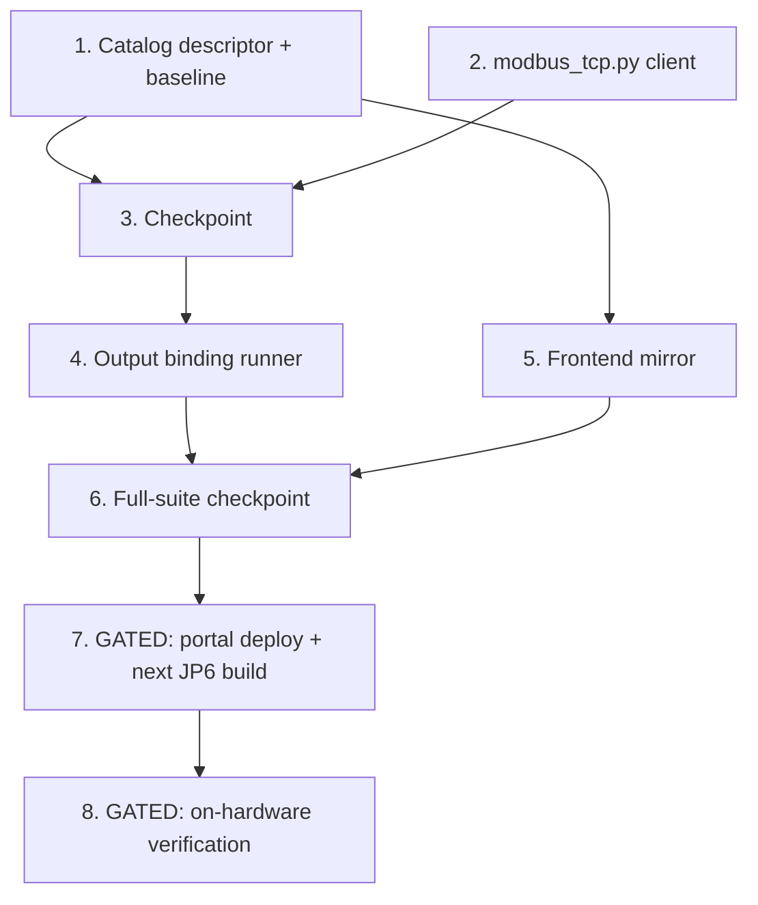

# Implementation Plan: Modbus TCP Output Node

## Overview

Add the `modbus_write` output node as a fourth instance of the established
hardware-output pattern: catalog descriptor (both byte-in-sync copies +
baseline), a stdlib pure-function Modbus TCP framing module, an
`OutputBindingProcessor` runner with an injectable writer seam, the frontend
descriptor mirror, and property/example tests at each layer. Zero validator,
compiler, sandbox, or preservation-tracked file changes. Finishes with a
full-suite checkpoint, then gated integration (portal deploy; device side
rides the NEXT LocalServer JP6 build) and gated on-hardware verification on
ryan-orin-nano.

## Tasks

- [x] 1. Catalog descriptor (portal source of truth, vendored copy, baseline)
  - [x] 1.1 Add the `MODBUS_WRITE` descriptor to
    `edge-cv-portal/backend/layers/workflow_core/python/workflow_core/catalog/nodes.py`
    - Descriptor per design section "Components and Interfaces 1": category
      OUTPUT, display name "Modbus TCP Write", one `in` InferenceMeta port,
      zero outputs; parameters `host`/`port`/`unit_id`/`register_type`/
      `address`/`value_template`/`pulse_ms` with the documented
      types/defaults/constraints and `depends_on="register_type=coil"` on
      `pulse_ms`; mappings `_same_on_device_archs(executor_binding="modbus_write")`
      + `_recording_binding("modbus_write")`; `hardware_dependent=True`
    - Append `MODBUS_WRITE` as the last `NODE_CATALOG` entry; leave every
      pre-existing descriptor byte-identical
    - _Requirements: 1.1, 1.2, 1.3, 1.4, 1.5, 1.6, 2.1_

  - [x] 1.2 Sync the device-vendored catalog copy byte-identically
    - Apply the identical edit to
      `src/backend/workflow_engine/vendor/workflow_core/catalog/nodes.py`
      (existing `test_vendored_catalog_mirror.py` must pass)
    - _Requirements: 2.2_

  - [x] 1.3 Regenerate `catalog_baseline.json` with the delta scoped to the new descriptor
    - Update `edge-cv-portal/backend/layers/workflow_core/tests/catalog_baseline.json`;
      verify only the `modbus_write` entry differs from the pre-feature
      baseline; confirm `golden_zero_trigger_compilation.json` and the
      packaging goldens are byte-unchanged
    - _Requirements: 2.3, 2.7_

  - [x] 1.4 Write catalog content unit tests for the descriptor
    - New `test_catalog_modbus_write.py` in the portal catalog suite: ports,
      category, every parameter shape (including the `pulse_ms`
      `depends_on` string), device mappings with zero plugin dependencies,
      sim recording stub, `hardware_dependent`, list position, baseline delta
      scope
    - _Requirements: 1.1, 1.2, 1.3, 1.4, 1.5, 1.6, 2.1, 2.3_

  - [x] 1.5 Write property test for compiler binding emission
    - **Property 10: Compiler emits the binding with effective parameters**
    - Hypothesis, min 100 iterations, tag
      `# Feature: modbus-tcp-output, Property 10: ...`; extend
      `generators.py` with a `modbus_write`-bearing graph strategy
    - **Validates: Requirements 2.5**

  - [x] 1.6 Write property test for simulation stub resolution
    - **Property 11: Simulation resolves to the recording stub**
    - Hypothesis, min 100 iterations, tag
      `# Feature: modbus-tcp-output, Property 11: ...`
    - **Validates: Requirements 2.6**

  - [x] 1.7 Write property test for generic V4 coverage
    - **Property 12: Generic V4 covers the required parameters**
    - Hypothesis, min 100 iterations, tag
      `# Feature: modbus-tcp-output, Property 12: ...`; random omission
      subsets of `host`/`register_type`/`address`
    - **Validates: Requirements 2.4**

- [x] 2. Modbus TCP client module (device engine)
  - [x] 2.1 Implement `src/backend/workflow_engine/modbus_tcp.py`
    - Pure functions `encode_write_request` / `decode_frame` /
      `check_response` over the 12-byte MBAP+PDU frames (big-endian, FC 0x05
      write single coil with 0xFF00/0x0000, FC 0x06 write single register),
      `ModbusError` with `EXCEPTION_MEANINGS` for exception responses,
      malformation rejection (truncation, transaction-id mismatch, non-zero
      protocol id, unexpected function code), and `write_single` socket
      exchange with 5 s connect/response timeouts — stdlib only
      (`socket`/`struct`), `src/backend/requirements.txt` untouched
    - _Requirements: 5.1, 5.2, 5.3, 5.4, 5.5, 5.6, 4.8_

  - [x] 2.2 Write property test for frame round trip and echo validation
    - **Property 1: Modbus frame round trip and echo validation**
    - Hypothesis, min 100 iterations, tag
      `# Feature: modbus-tcp-output, Property 1: ...`; new
      `test/backend-test/workflow_engine/test_property_modbus_frames.py`
    - **Validates: Requirements 5.1, 5.2, 5.3**

  - [x] 2.3 Write property test for exception-response naming
    - **Property 2: Exception responses raise with the named meaning**
    - Hypothesis, min 100 iterations, tag
      `# Feature: modbus-tcp-output, Property 2: ...`
    - **Validates: Requirements 5.4**

  - [x] 2.4 Write property test for malformed-response rejection
    - **Property 3: Malformed responses never validate as success**
    - Hypothesis, min 100 iterations, tag
      `# Feature: modbus-tcp-output, Property 3: ...`
    - **Validates: Requirements 5.5**

  - [x] 2.5 Write example tests: known-answer frame vectors and socket timeout
    - Canonical byte vectors (e.g. `00 01 00 00 00 06 01 05 00 0C FF 00`);
      accept-but-never-respond local socket with a short injected timeout
      asserting the error names node/host/port
    - _Requirements: 5.1, 4.8_

- [x] 3. Checkpoint - Ensure all tests pass
  - Ensure all tests pass, ask the user if questions arise.

- [x] 4. Output binding runner (device engine)
  - [x] 4.1 Add the `modbus_write` binding kind to `OutputBindingProcessor`
    - `BINDING_MODBUS_WRITE` constant, `modbus_writer` constructor seam with
      production default, dispatch branch, and `_run_modbus_write`: render
      `value_template` via `render_template`, coerce per `register_type`
      (coil → bool via `_coerce`, holding register → int with the 0–65535
      range check raising `ValueError` before any write), call the writer,
      return the sent-message detail (value, register type, address,
      host:port, unit id, pulse duration when pulsed)
    - _Requirements: 4.1, 4.2, 4.3, 4.4, 4.6, 4.9_

  - [x] 4.2 Implement `_default_modbus_writer` with coil pulse semantics
    - Lazy-import `modbus_tcp`; coil latch = one `write_single`; `pulse_ms > 0`
      = write, `time.sleep(pulse_ms/1000)`, write inverse (matching
      `_default_dio_actuator`'s pattern); holding register = one
      `write_single`; wrap connection/timeout errors with host:port context
    - _Requirements: 4.1, 4.5, 4.8_

  - [x]* 4.3 Write property test for write dispatch and value coercion
    - **Property 4: Write dispatch carries the configured target and the coerced value**
    - Hypothesis, min 100 iterations, tag
      `# Feature: modbus-tcp-output, Property 4: ...`; new
      `test/backend-test/workflow_engine/test_property_modbus_dispatch.py`
      with an injected fake writer
    - **Validates: Requirements 4.1, 4.2, 4.3**

  - [x] 4.4 Write property test for out-of-range register failure
    - **Property 5: Out-of-range register values fail without writing**
    - Hypothesis, min 100 iterations, tag
      `# Feature: modbus-tcp-output, Property 5: ...`
    - **Validates: Requirements 4.4**

  - [x] 4.5 Write property test for coil pulse semantics
    - **Property 6: Coil pulse semantics**
    - Hypothesis, min 100 iterations, tag
      `# Feature: modbus-tcp-output, Property 6: ...`; patch
      `modbus_tcp.write_single` and `time.sleep`
    - **Validates: Requirements 4.5**

  - [x] 4.6 Write property test for conditional gating
    - **Property 7: Gating decides exactly which writes execute**
    - Hypothesis, min 100 iterations, tag
      `# Feature: modbus-tcp-output, Property 7: ...`; new
      `test/backend-test/workflow_engine/test_property_modbus_gating.py`
      distributing bindings across conditional ports
    - **Validates: Requirements 6.1, 6.2, 6.3**

  - [x] 4.7 Write property test for per-binding failure containment
    - **Property 8: Modbus failures are contained per binding**
    - Hypothesis, min 100 iterations, tag
      `# Feature: modbus-tcp-output, Property 8: ...`
    - **Validates: Requirements 4.7**

  - [x] 4.8 Write property test for sent-message detail completeness
    - **Property 9: Sent-message detail completeness**
    - Hypothesis, min 100 iterations, tag
      `# Feature: modbus-tcp-output, Property 9: ...`
    - **Validates: Requirements 4.9**

  - [x] 4.9 Write sandbox recording example tests
    - `recording_modbus_write` recorded with parameters + triggering metadata
      when gates pass; recorded as not triggered behind a false conditional —
      following `edge-cv-portal/test-sandbox/tests/test_bindings.py`, zero
      sandbox code changes
    - _Requirements: 7.1, 7.2_

- [x] 5. Frontend catalog mirror
  - [x] 5.1 Add `MODBUS_WRITE_DESCRIPTOR` to
    `edge-cv-portal/frontend/src/pages/workflows/types.ts`
    - CamelCase wire-form mirror of the backend descriptor: identical type id,
      category, display name, ports, parameter
      names/types/defaults/constraints, `dependsOn: 'register_type=coil'` on
      `pulse_ms`, mappings, `hardwareDependent: true`; no palette,
      NodeConfigPanel, or inlineChecks logic changes
    - _Requirements: 3.1, 3.2_

  - [x] 5.2 Write frontend descriptor identity and palette tests
    - Vitest: descriptor field parity assertions; NodePalette renders the node
      exactly once under the Outputs section
    - _Requirements: 3.1, 3.2_

  - [x] 5.3 Write property test for pulse_ms visibility gating
    - **Property 13: pulse_ms visibility gating (frontend)**
    - fast-check, min 100 iterations, tag
      `// Feature: modbus-tcp-output, Property 13: ...`; mirrors
      `gatingSemantics.property.test.ts` over `isParameterVisible`
    - **Validates: Requirements 3.3**

  - [x] 5.4 Write property test for inline V4 parity
    - **Property 14: Inline V4 parity (frontend)**
    - fast-check, min 100 iterations, tag
      `// Feature: modbus-tcp-output, Property 14: ...`; mirrors
      `triggerChecksParity.property.test.ts`
    - **Validates: Requirements 3.4**

- [x] 6. Checkpoint - Full-suite verification
  - Ensure all tests pass, ask the user if questions arise.
  - Portal catalog suite (`edge-cv-portal/backend/layers/workflow_core/tests`),
    device engine suite (`test/backend-test/workflow_engine/`), test-sandbox
    suite (`edge-cv-portal/test-sandbox/tests`), frontend vitest
    (`vitest --run`)
  - Known ignorable failures: `test_stale_registrations_exploration.py` (5)
    plus any denial-race exploration failures (in-flight bugfix specs)
  - Confirm `golden_zero_trigger_compilation.json`, packaging goldens, and
    every preservation-tracked file (`src/backend/requirements.txt`,
    Dockerfiles, `src/docker-compose.yaml`, recipes) are byte-unchanged
  - _Requirements: 2.2, 2.7, 5.6, 6.4_

- [x] 7. GATED: Integration delivery
  - Portal side: deploy the portal (catalog + frontend mirror) — sequence
    around any running component build per `.kiro/steering/builds.md` (no
    portal deploy while a build runs)
  - Device side: rides the NEXT LocalServer JP6 build (shared with the two
    in-flight bugfix specs — do not dispatch a dedicated build); one build at
    a time, preservation gate pre-checked (no tracked files changed by this
    feature)
  - _Requirements: 2.2, 5.6_

- [x] 8. GATED: On-hardware verification (ryan-orin-nano, JP6)
  - Simulate a Modbus TCP server inside the container (small stdlib socket
    script answering FC 0x05/0x06 echoes and logging writes)
  - Deploy a workflow wiring two `modbus_write` nodes behind a `conditional`'s
    true/false ports; run with metadata driving each branch; verify: the
    passing branch's write arrives (coil latch + pulse, holding register), the
    gated branch issues no connection, sent-message details render in run
    results, and error paths (unreachable host, exception response) surface
    actionable per-node errors with the backend staying healthy
  - Per `.kiro/steering/builds.md`: sustained-health check, then record what
    was verified on which device
  - _Requirements: 4.1, 4.5, 4.7, 4.8, 4.9, 6.1, 6.2, 6.3_

## Task Dependency Graph

```json
{
  "waves": [
    { "wave": 1, "tasks": ["1", "2"], "description": "Independent foundations (parallel): the catalog descriptor with both copies, baseline, and its compiler/validator/sim properties (portal), and the pure stdlib modbus_tcp.py framing module with its round-trip/exception/malformation properties (edge)" },
    { "wave": 2, "tasks": ["3"], "description": "Checkpoint: catalog and framing tests pass" },
    { "wave": 3, "tasks": ["4", "5"], "description": "Consumers of the foundations (parallel): the OutputBindingProcessor runner + default writer with dispatch/pulse/gating/containment/detail properties and sandbox recording examples (edge), and the frontend descriptor mirror with visibility/parity properties (portal frontend)" },
    { "wave": 4, "tasks": ["6"], "description": "Full-suite checkpoint: portal catalog, device engine, sandbox, and frontend suites; goldens and preservation-tracked files byte-unchanged" },
    { "wave": 5, "tasks": ["7"], "description": "GATED integration: portal deploy; device side rides the NEXT shared LocalServer JP6 build" },
    { "wave": 6, "tasks": ["8"], "description": "GATED on-hardware verification on ryan-orin-nano with an in-container simulated Modbus TCP server" }
  ]
}
```



## Notes

- Tasks marked with `*` are optional test sub-tasks and can be skipped for a
  faster MVP; core implementation tasks are never optional.
- Tasks 7 and 8 are gated: they wait on the shared JP6 build window and
  ryan-orin-nano availability, and follow the build/deploy sequencing rules in
  `.kiro/steering/builds.md`.
- Zero changes expected in: validator (`checks.py`), compiler
  (`compiler.py`), test-sandbox harness, `NodeConfigPanel.tsx`,
  `inlineChecks.ts`, and all preservation-tracked files — if any of these
  turns out to need an edit, stop and revisit the design.
- Property tags: Hypothesis
  `# Feature: modbus-tcp-output, Property {n}: {title}`; fast-check uses the
  `//` comment form. Minimum 100 iterations each.
