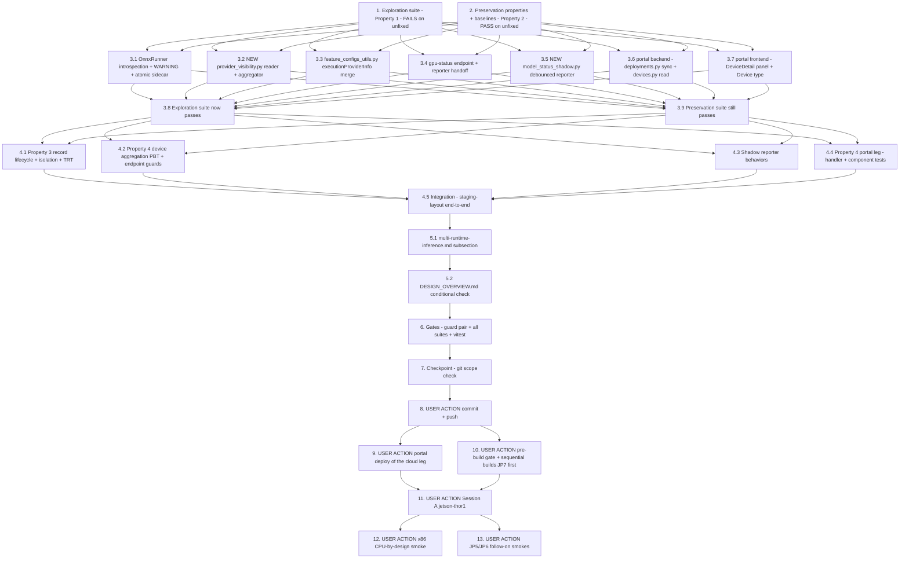

# Implementation Plan

## Overview

Make silent ONNX CPU fallback visible. During the Aug 14–15 device-wide CUDA
outage on jetson-thor1 (incident record: sibling spec `vllm-jp7-engine-cuda-init`),
all three deployed vision models served READY on CPU for a full day with zero
DDA-visible signal — `OnnxRunner` never calls `session.get_providers()` after
`ort.InferenceSession(...)`, so ORT's by-design CUDA→CPU fallback is
indistinguishable from healthy GPU operation in logs, status payloads, and the
portal. Two legs per design.md (portal leg IN scope per the binding user
decision, bugfix.md amendment 2.5):

1. **Device leg (the core)** — the runner captures the ACTIVE providers, logs
   INFO on every load + a prominent WARNING on GPU fallback, and writes an
   atomic `dda_active_providers.json` sidecar into the model version dir
   (Decision 1); the backend merges it into `/feature-configurations` entries
   as additive `defaultConfiguration.executionProviderInfo`, computes the
   device-level degraded-GPU signal via a new
   `GET /feature-configurations/gpu-status` endpoint (Decision 2), and reports
   the snapshot into the new reported-only `dda-model-status` named shadow,
   debounced and failure-isolated (Decisions 4-5).
2. **Cloud/portal leg (additive display)** — `deployments.py` adds
   `dda-model-status` to the ShadowManager synchronize auto-include,
   `devices.py` reads the shadow on demand into an additive `model_status`
   field, and DeviceDetail renders a "Deployed models" panel with per-model
   GPU / CPU-fallback / CPU badges and a device-level degraded alert. Absence
   of the signal renders exactly as today (Decision 6: sidecar absence means
   "no information" — everywhere).

**Honesty guard.** No host test executes real ORT-CUDA, a GPU, Triton, or
Greengrass IPC. Every host-side test SIMULATES fallback through a **fake `ort`
module** (controllable `get_available_providers()`; an `InferenceSession` fake
whose `get_providers()` returns a configured active list and records its call
args) and a **fake shadow accessor**. That real ORT strips the CUDA EP exactly
this way is evidenced by the incident itself and provable ONLY on hardware
(Session A, task 11 — in the shared degraded-window with csi-nvargus-optional's
Session A; recorded honestly if the window cannot be arranged). The stub
process environment (record lands where the backend reads it), ShadowManager
sync end-to-end, real Greengrass IPC shadow writes, JP5/JP6 parity, and portal
IAM in a real use-case account are likewise USER-ACTION territory (tasks 9-13).
Do not write a test that pretends to exercise ORT-CUDA, Triton, or IPC.

**Non-goal guards.** NO strict mode in any form — no manifest key, no env knob
(Decision 3: deferred, fallback stays functional per 3.1). Explicitly NOT
changed (design "Explicitly NOT changed"): `__select_providers` and the
DLR/Torch runners, `lfv_model_template.py`, `model_convertor.py`,
`triton_setup.py`, `triton_edge_client.py`, all vLLM modules (the sibling
spec's territory, 3.5), all recipes (shadow ACL already wildcard — zero recipe
churn), `src/docker-compose.yaml`, all Dockerfiles,
`src/backend/requirements.txt` (no new dependencies). Design's claim: **no
preservation-tracked file is touched, so no security-baseline rebaselines** —
task 6 VERIFIES that claim rather than assuming it. No `devices.py` list-route
change (no per-device shadow fan-out on the fleet list).

Test commands:
- Device-side suites (`test/backend-test/model_gpu_fallback_visibility/`) run
  host-side in the portal venv (`/home/ubuntu/.venvs/dda-portal-tests`) with
  `PYTHONPATH=src/backend:test/backend-test` and `--noconftest` (the flask-app
  image is NOT on this EC2 host — the established caveat; the container gate
  run happens on the device/build host per `.kiro/steering/builds.md`):
  `python3 -m pytest test/backend-test/model_gpu_fallback_visibility -q -p no:cacheprovider --noconftest`
- Portal backend tests run from `edge-cv-portal/backend` WITH the suite's
  conftest (do NOT pass `--noconftest` there), same venv:
  `python3 -m pytest tests/test_model_status_shadow_sync.py tests/test_model_status_devices_read.py -q -p no:cacheprovider`
- Frontend component tests run from `edge-cv-portal/frontend` with the local
  node toolchain: `PATH="$HOME/.local/node/bin:$PATH" npx vitest run`
- Hypothesis property tests use `test_property_*.py` naming with NO hardcoded
  `max_examples` and `# Validates: Requirements …` comments
- The security guard pair runs host-side:
  `python3 -m pytest test/backend-test/security/preservation/test_preservation_out_of_scope_guard.py test/backend-test/security/preservation/test_preservation_secrets_out_of_scope_guard.py -p no:cacheprovider --noconftest -q`

New files this plan creates:
- `test/backend-test/model_gpu_fallback_visibility/` (exploration,
  preservation, fix-check, integration suites + `goldens/` with the
  DLR/Torch/runner hash pins and unfixed-behavior baselines)
- `src/backend/dda_triton/provider_visibility.py` (design File 2)
- `src/backend/utils/model_status_shadow.py` (design File 5)
- `edge-cv-portal/backend/tests/test_model_status_shadow_sync.py` +
  `edge-cv-portal/backend/tests/test_model_status_devices_read.py`
- `edge-cv-portal/frontend/src/pages/DeviceDetail.modelStatus.test.tsx`
  (the `DeviceDetail.targetArch.test.tsx` convention)

## Notes

- Source-tree changes (design Fix Implementation Files 1-8):
  `src/backend/dda_triton/resources_for_copy/inference_runtimes.py` (File 1,
  stub side), NEW `provider_visibility.py` (File 2), `src/backend/utils/
  feature_configs_utils.py` (File 3), `src/backend/endpoints/feature_config.py`
  (File 4), NEW `model_status_shadow.py` (File 5),
  `edge-cv-portal/backend/functions/deployments.py` (File 6),
  `edge-cv-portal/backend/functions/devices.py` (File 7),
  `edge-cv-portal/frontend/src/pages/DeviceDetail.tsx` + the `Device` type in
  `edge-cv-portal/frontend/src/types/index.ts` (File 8), plus docs
- Tasks 8-13 are USER ACTIONs on the build host / real hardware / the portal
  account; the agent prepares and verifies everything else host-side
- builds.md rules apply throughout: one build at a time (`pgrep` first), gate
  pre-checked before dispatch, **no portal deploys mid-build**, on-device
  verification before an on-device change is "done"
- Decision 6 propagation reality: a LocalServer-only deploy does NOT refresh
  the per-model `inference_runtimes.py` copies — already-deployed models write
  no record until their model component restarts (reboot, Nucleus restart,
  model redeploy). Session A restarts the model components explicitly. Every
  consumer is absence-tolerant by construction, so pre-fix copies are safe and
  signal-free, never wrong
- Portal-deploy ordering (design "Rollout shape"): the portal deploy should
  land before (or with) the device deployment that ships this component
  version, so `dda-model-status` is already in the ShadowManager synchronize
  list when the new component rolls out
- Build scheduling: this spec can ride the same sequential build cycle as the
  pending `csi-nvargus-optional` JP7/JP5/JP6 builds (one version bump per
  target); the two specs' verification sessions share the degraded-state
  window. The specs stay independent

## Task Dependency Graph

```json
{
  "waves": [
    { "wave": 1, "description": "Exploration + preservation on the UNFIXED tree: the exploration suite surfaces the four bug-condition counterexamples (FAILS expected); the preservation properties, identity baselines, and hash pins are observed and recorded (PASS required).", "tasks": ["1", "2"] },
    { "wave": 2, "description": "The fix, per design Fix Implementation Files 1-8: runner introspection + WARNING + atomic sidecar, the provider_visibility reader/aggregator, the feature-configs merge, the gpu-status endpoint + reporter handoff, the debounced shadow reporter, the portal backend sync + read legs, the portal frontend panel.", "tasks": ["3.1", "3.2", "3.3", "3.4", "3.5", "3.6", "3.7"] },
    { "wave": 3, "description": "Verify: the exploration suite now passes on the fixed tree; the preservation suite still passes at baseline counts.", "tasks": ["3.8", "3.9"] },
    { "wave": 4, "description": "Fix-checking suites: record lifecycle/atomicity/failure-isolation/TRT (Property 3), device-aggregation PBT + endpoint guards (Property 4 device leg), shadow reporter behaviors, portal handler + DeviceDetail component tests (Property 4 portal leg), end-to-end staging-layout integration.", "tasks": ["4.1", "4.2", "4.3", "4.4", "4.5"] },
    { "wave": 5, "description": "Documentation: multi-runtime-inference.md subsection on the Active_Provider_Record; DESIGN_OVERVIEW.md only if it enumerates named shadows.", "tasks": ["5.1", "5.2"] },
    { "wave": 6, "description": "Gates: security guard pair + verify the no-rebaseline claim, full device-side suite, full portal backend suite WITH conftest, frontend vitest run; then checkpoint with git scope check.", "tasks": ["6", "7"] },
    { "wave": 7, "description": "USER ACTION / orchestrator-coordinated: commit + push; portal deploy of the cloud leg, sequenced strictly around the pending csi-nvargus-optional component builds per builds.md (never mid-build), with the optional workflow_packaging arm64_jp7 bundling note.", "tasks": ["8", "9"] },
    { "wave": 8, "description": "USER ACTION: pre-build gate + sequential LocalServer builds JP7-first (bundled with csi-nvargus-optional's pending builds), Session A on jetson-thor1 (healthy path + shared degraded-window fallback validation + shadow/portal + recovery reload), x86 CPU-by-design smoke, JP5/JP6 follow-on smokes.", "tasks": ["10", "11", "12", "13"] }
  ]
}
```



## Tasks

- [x] 1. Write bug condition exploration test suite
  - **Property 1: Bug Condition** - Silent CPU Fallback Becomes Visible
  - **CRITICAL**: All four cases MUST FAIL on unfixed code - failure confirms the bug condition exists
  - **DO NOT attempt to fix the tests or the code when they fail**
  - **NOTE**: This suite encodes the expected behavior - it validates the fix when it passes after implementation (task 3.8)
  - **GOAL**: Surface the counterexamples of defects 1.1-1.3 on the UNFIXED tree - every check is GPU-free and host-runnable (honesty guard: CPU fallback is SIMULATED via the fake ort's `get_providers()`; no real ORT/Triton/IPC)
  - Create `test/backend-test/model_gpu_fallback_visibility/test_exploration_gpu_fallback_visibility.py` plus the suite-shared fakes (a fake `ort` module installed via `sys.modules` before importing the runner - controllable `get_available_providers()`, an `InferenceSession` fake with configurable `get_providers()` and recorded call args; a fake shadow accessor; a temp `base_model/{version}/{stage}/` tree builder matching the `model_convertor` layout)
  - Case 1 - **No fallback warning (defect 1.1)**: construct `OnnxRunner` against the fake ort with CUDA in the available set but a CPU-only session; assert a WARNING record naming the requested chain and the active provider(s). FAILS on unfixed code (nothing is logged after session creation - the unfixed `__init__` has no `get_providers()` call, the textual fingerprint of defect 1.1)
  - Case 2 - **No record written (defect 1.1)**: same load; assert `dda_active_providers.json` exists in the VERSION dir (parent of the stage dir) with `gpuRequested: true, gpuActive: false`. FAILS on unfixed code (nothing is written)
  - Case 3 - **Status surface blind (defect 1.2)**: seed a version dir with a valid record, run `get_features_triton` against a fake triton_server; assert the model's entry carries `defaultConfiguration.executionProviderInfo`. FAILS on unfixed code (entries never carry it - a CPU-fallback model's entry is byte-identical to a healthy one)
  - Case 4 - **No device-level signal (defect 1.3)**: assert `dda_triton.provider_visibility.device_gpu_status` exists and reports `gpuDegraded: true` for an all-fallback record set. FAILS on unfixed code (the module does not exist)
  - Run host-side (portal venv pattern from Test commands above)
  - **EXPECTED OUTCOME**: All four cases FAIL (this is correct - it proves the bug condition exists)
  - Document the counterexamples found: the unfixed `OnnxRunner.__init__` body between session creation and the input-name read (no `get_providers()` call), and the unfixed `get_features_triton` output where fallback and healthy entries are indistinguishable
  - Mark complete when the suite is written, run, and the failures are documented
  - **OUTCOME (2026-08-16)**: Suite written (`test_exploration_gpu_fallback_visibility.py` + suite-shared `fakes.py`: fake ort module installed via `sys.modules['onnxruntime']` before construction with controllable `get_available_providers()` and an `InferenceSession` fake with configurable `get_providers()` + recorded call args; `FakeShadowAccessor`; `build_model_tree` matching `_create_base_model_structure` — real version dir with model.py/inference_runtimes.py/config.pbtxt, stage dir a SYMLINK to a deployed-artifact dir; `make_record`/`seed_active_provider_record` per Decision 1; awsiot sys.modules-stubbing importer per the vllm-merge convention). Run host-side in the portal venv with `--noconftest -p no:cacheprovider`: **all 4 cases FAIL on the unfixed tree — the bug condition is confirmed.** Counterexamples: (Case 1, defect 1.1) a CUDA-requested load whose fake session came up CPU-only logged NO WARNING — `session.get_providers()` called 0 times; the unfixed `OnnxRunner.__init__` body between `ort.InferenceSession(...)` and the input-name read contains NO `get_providers` call (the textual fingerprint); the only log lines are the PRE-session "loading ONNX model yolo_test with providers ['CUDAExecutionProvider', 'CPUExecutionProvider']" INFO and the init-complete INFO — the ACTIVE provider is never observed. (Case 2, defect 1.1) no `dda_active_providers.json` in the version dir after the load (contents: inference_runtimes.py, model.py, stage_model only). (Case 3, defect 1.2) with a valid fallback record seeded in `base_yolo_test/1/`, the `get_features_triton` entry is `{'modelAlias': 'yolo_test', 'modelMetaData': {}, 'modelVersion': '1.0.0', 'modelConfidenceThresholds': {}}` — no `executionProviderInfo`; a CPU-fallback model's entry is byte-identical (indistinguishable) to a healthy one. (Case 4, defect 1.3) `ModuleNotFoundError: No module named 'dda_triton.provider_visibility'` — no device-level aggregation exists. Fixed-tree contract encoded for task 3.8: case 3 points the reader at the temp repo by patching module-level `provider_visibility.TRITON_MODEL_DIR`; case 4 calls `device_gpu_status(records, statuses)` expecting `gpuDegraded: true` for the all-fallback set. No code was fixed and no test weakened.
  - _Requirements: 1.1, 1.2, 1.3_

- [x] 2. Write preservation property tests (BEFORE implementing the fix)
  - **Property 2: Preservation** - Everything Outside the Visibility Surface Is Unchanged
  - **IMPORTANT**: Follow observation-first methodology - observe the UNFIXED behavior, record it as baselines/goldens/reference implementations, then encode it as properties that PASS on the unfixed tree and must keep passing
  - Create `test/backend-test/model_gpu_fallback_visibility/test_preservation_gpu_fallback_surface.py` and `test_property_gpu_fallback_preservation.py` (Hypothesis, no hardcoded `max_examples`, `# Validates: Requirements …` comments)
  - Observe on UNFIXED code and encode:
    - **Provider chain identity (3.2, 3.3, 3.7), property-based**: capture the unfixed `__select_providers` behavior as a reference implementation (extracted from the unfixed source at task-2 time and pinned in the suite); _for any_ `device` value (`None`, `"cpu"`, `"gpu"`, `"cuda"`, `"tensorrt"`, `"trt"`, arbitrary case) × _any_ available-provider set, the (future) fixed `__select_providers` returns the exact chain the reference returns - including the TRT `(name, options)` tuple shape
    - **Session construction identity (3.2)**: the fake ort records `InferenceSession` call args - model path, `sess_options` thread counts, providers list unchanged; after the fix, `get_providers()` must be the ONLY new session interaction (assert the recorded call surface on the unfixed tree as the baseline)
    - **Fallback still serves (3.1)**: a CPU-only-session load completes to a working runner on the unfixed tree (and must on the fixed tree - visibility never converts fallback into failure)
    - **Status payload identity without records (3.4, 3.5), property-based**: _for any_ generated fake Triton model list (base_/marshal_ filtering, vLLM entries included), `get_features_triton` output with NO sidecar files present is deep-equal to the unfixed output (captured via the same fake inputs); with records present, removing the `executionProviderInfo` key restores deep-equality - the additive-only clause, executable
    - **CPU-by-design never flagged (3.3)**: `device: "cpu"` manifests and CUDA-unavailable chains produce `gpuRequested: false` semantics - no warning, no fallback flag, no degraded contribution (skip-as-absent where it needs fixed-tree modules; binds at 3.9)
    - **DLR/Torch untouched (3.5)**: pin `DlrRunner`/`TorchRunner` source segments (hash pins into `goldens/`) and `make_runner` dispatch behavior on the unfixed tree; assert unchanged
    - **Portal absence leg (2.5, 3.4)**: in `edge-cv-portal/backend/tests/test_model_status_devices_read.py` (run WITH conftest), capture the unfixed single-device GET response shape for a device with no shadow as the baseline; the post-fix assertion (deep-equal minus the additive `model_status: None` key) binds at 3.9/4.4. The DeviceDetail absence-DOM leg is host-testable only via vitest and lands with task 4.4 (recorded here as deferred, not skipped silently)
  - Run host-side (device-side suite `--noconftest`; portal test WITH conftest from `edge-cv-portal/backend`)
  - **EXPECTED OUTCOME**: Tests PASS on UNFIXED code (this confirms the baseline behavior to preserve); fixed-shape tests SKIP as absent
  - Mark complete when the tests are written, run, and passing on unfixed code with baseline counts recorded
  - **OUTCOME / BASELINE RECORDED (2026-08-16)**: Device-side suites written reusing the task-1 fakes and run host-side in the portal venv (`--noconftest -p no:cacheprovider`): **14 passed, 2 skipped on the UNFIXED tree** — `test_preservation_gpu_fallback_surface.py` (12 pass + 1 skip) + `test_property_gpu_fallback_preservation.py` (Hypothesis, `@settings(deadline=None)` only, no `max_examples`; 2 PBTs pass + 1 PBT skip). Pinned reference implementations captured verbatim from the unfixed source at task-2 time: `reference_select_providers` (full `__select_providers` behavior incl. the TRT `(name, options)` tuple shape and the trt_cache `exist_ok=True`/OSError leg, deterministic against the shared model_dir) and `reference_get_features_triton` (base_/marshal_ filtering + default-config shape + the vLLM status-map/failureReason construction) — the identity PBTs assert deep-equality (`model_dump`) for any device value × available-provider set and any generated Triton model list + vLLM manager state, plus "no record → never an `executionProviderInfo` key". Session-construction baseline pinned exactly: ONE `InferenceSession` per load, positional model path, `intra_op=cpu_count`/`inter_op=1`, providers `[CUDA, CPU]`, no extra kwargs; the instrumented session's interaction surface is `{get_inputs}` with `get_providers` whitelisted as the ONLY permitted new call post-fix. Fallback-still-serves verified end-to-end (CPU-only-session runner constructs, get_inputs-based init completes, inference runs, dtype mapped). CPU-by-design: `device:"cpu"` (any casing) and CUDA-unavailable sets → CPU-only chain, load never warns. Hash pins in `goldens/inference_runtimes_pins.json` (sha256 of `inspect.getsource`): DlrRunner `2d7a4d74…`, TorchRunner `c27cdd2d…`, make_runner `177bf0c8…`, `OnnxRunner.__select_providers` `b20572b6…`; plus a make_runner dispatch-behavior test (case-insensitive, None/"" → DLR, artifact/device forwarded only to onnx/pytorch, ValueError on unknown). **Skip-as-absent legs (bind at 3.9), 2 skips**: CPU-by-design `gpuRequested: false` record semantics (no record written on unfixed → skip) and the records-present additive-only PBT (`dda_triton.provider_visibility` absent → skip). **Portal absence leg**: `edge-cv-portal/backend/tests/test_model_status_devices_read.py` (run WITH conftest from `edge-cv-portal/backend`, moto harness per the `test_secure_tunneling_jp5_guard` devices pattern; unknown clients e.g. `iot-data` raise ResourceNotFoundException) — unfixed single-device GET baseline recorded as `EXPECTED_DEVICE_BASELINE`, assertion written absence-tolerant (deep-equal minus the optional `model_status` key; `model_status` if present must be `None`): **1 passed**. DeviceDetail absence-DOM leg deferred to task 4.4 (vitest), not silently skipped. **Portal whole-suite green baseline**: `python3 -m pytest tests -q -p no:cacheprovider --continue-on-collection-errors` → **1976 passed, 41 errors in ~139s** — the 41 errors are the documented PRE-EXISTING `test_property_setup_command_wellformed` fake-`shared_utils` collection-order cascade (per repo steering; previously recorded at 1851 passed + the same 41 errors), all 41 in the device-registration family, unrelated to this spec; the module passes standalone (2 passed). No source file was changed; nothing committed.
  - _Requirements: 2.5, 3.1, 3.2, 3.3, 3.4, 3.5, 3.6, 3.7_

- [x] 3. Fix: capture, log, record, surface, aggregate, and display the active execution provider (design "Fix Implementation" Files 1-8)

  - [x] 3.1 `OnnxRunner` introspection + WARNING + atomic Active_Provider_Record sidecar (design File 1)
    - Edit `src/backend/dda_triton/resources_for_copy/inference_runtimes.py`, in `OnnxRunner.__init__` immediately after session creation: `active = list(self.__session.get_providers())`; compute `gpu_requested`/`gpu_active` via the new module constants `GPU_PROVIDERS = {"CUDAExecutionProvider", "TensorrtExecutionProvider"}` and `_provider_names()` (normalizes TRT `(name, options)` tuples); log the active providers at INFO on EVERY load; log the prominent GPU-FALLBACK WARNING (requested chain + active providers + "DEGRADED on CPU until the model is reloaded" + spec reference) ONLY when `gpu_requested and not gpu_active`
    - `_write_active_provider_record(model_dir, stage_record)`: version dir = `os.path.dirname(model_dir)` (the runner's `model_dir` is the stage subdir); read-merge the existing record per stage key (`os.path.basename(model_dir)`; stages initialize sequentially in one stub - no concurrency); recompute the model-level `gpuRequested` (any stage requested) / `gpuActive` (every GPU-requesting stage obtained one - a single fallen-back stage degrades the model; "obtained" = ANY member of GPU_PROVIDERS active, so TRT-requested-CUDA-active is NOT degraded); write via `tempfile` + `os.replace` (atomic - readers never see a torn file); record shape per design Decision 1 (`modelId`, `runtime`, per-stage requested/active/gpuRequested/gpuActive, model-level aggregate, `updatedAt`); `ACTIVE_PROVIDER_RECORD = "dda_active_providers.json"`
    - The ENTIRE visibility block (introspection + logs + record write) wrapped in try/except: any exception logs a warning and the constructor proceeds - a visibility failure never fails the load
    - `__select_providers`, session options, and the DLR/Torch runners stay byte-identical (the task-2 identity PBT and hash pins enforce this)
    - _Bug_Condition: isBugCondition(X) - GPU provider in the requested chain, none active, load succeeded, no signal anywhere_
    - _Expected_Behavior: Property 1 - active providers captured and logged on every load; fallback prominently warned; record written with gpuRequested/gpuActive_
    - _Preservation: Property 2 - provider chain identity, session-construction identity, fallback still serves, DLR/Torch untouched (3.1, 3.2, 3.3, 3.5, 3.7)_
    - **OUTCOME (2026-08-16)**: Implemented per design File 1 in `src/backend/dda_triton/resources_for_copy/inference_runtimes.py`: module constants `GPU_PROVIDERS`/`ACTIVE_PROVIDER_RECORD` (keep-in-sync comment pointing at the future `provider_visibility.py`), `_provider_names()` (TRT `(name, options)` tuple-safe), `_write_active_provider_record(model_id, model_dir, stage_record)` (version dir = `os.path.dirname(model_dir)`, stage key = basename, read-merge with corrupt-prior-record tolerance, model-level aggregate gpuRequested = any stage / gpuActive = every GPU-requesting stage obtained ANY member of GPU_PROVIDERS, `updatedAt` UTC ISO-Z, `tempfile.mkstemp` in the SAME dir + `os.replace` atomic write with temp cleanup on failure), and in `OnnxRunner.__init__` immediately after session creation the failure-isolated visibility block: `get_providers()` introspection, INFO active-providers line on EVERY load, the GPU-FALLBACK WARNING (requested chain + active + "DEGRADED on CPU until the model is reloaded" + spec ref) only when `gpu_requested and not gpu_active`, record write; ANY exception logs a warning and the constructor proceeds. `__select_providers`, session options, DLR/Torch runners, make_runner untouched (hash pins prove it). Verified host-side (portal venv, `--noconftest -p no:cacheprovider`): exploration cases 1-2 now PASS, cases 3-4 still FAIL (need tasks 3.2/3.3 — expected); preservation suites **15 passed, 1 skipped** — hash pins green (nothing pinned changed), session-interaction surface shows only the whitelisted `get_providers` addition, CPU-by-design no-warn passes and its record-semantics test now BINDS and passes with `gpuRequested: false`, fallback-still-serves green; the records-present PBT still SKIPS (`provider_visibility` lands at 3.2). AST parse clean. Not committed.
    - _Requirements: 2.1, 2.3, 3.1, 3.2, 3.3, 3.5, 3.7_

  - [x] 3.2 NEW `src/backend/dda_triton/provider_visibility.py` - reader, aggregator, transition logging (design File 2)
    - `read_active_provider_record(model_name) -> dict | None`: resolve `TRITON_MODEL_DIR/base_{model_name}/`, pick the highest INTEGER version dir (ignore non-numeric entries), load `dda_active_providers.json`; return `None` on missing base dir / missing file / corrupt or empty JSON / permission error (Decision 6 - absence means "no information"); NEVER raises
    - `execution_provider_info(record) -> dict`: the additive payload - `requestedProviders`, `activeProviders`, `gpuRequested`, `gpuActive`, derived `gpuFallback = gpuRequested AND NOT gpuActive`, `updatedAt`
    - `device_gpu_status(records, statuses) -> dict`: the Property 4 aggregation - `gpuDegraded = (≥1 GPU-chain model with a record) AND (none of them gpuActive)`; `gpuChainModels`, `gpuActiveModels`, per-model map, `updatedAt`; models without records and CPU-by-design models contribute NOTHING in either direction
    - Module-level transition state: WARNING on entering degraded ("DEVICE GPU DEGRADED: N GPU-chain ONNX models loaded, none has an active GPU provider"), INFO on recovery
    - Constants (`GPU_PROVIDERS`, `ACTIVE_PROVIDER_RECORD`) duplicated from File 1 with a keep-in-sync comment - the stub cannot import backend modules (the existing template convention)
    - _Bug_Condition: defects 1.2/1.3 - no channel from stub to status surface, no aggregation_
    - _Expected_Behavior: Properties 1 + 4 - record readable, info payload additive, degraded iff no recorded GPU-chain model holds a GPU_
    - _Preservation: Property 2 - absence-tolerant reads (Decision 6), never a false signal_
    - **OUTCOME (2026-08-16)**: Module created per design File 2. `TRITON_MODEL_DIR` bound at MODULE level via `from dda_triton.constants import TRITON_MODEL_DIR` (same source of truth as feature_configs_utils/triton_edge_client; patchable via `patch.object(pv, "TRITON_MODEL_DIR", ...)` — the exploration-case-3 / preservation-PBT contract). `GPU_PROVIDERS`/`ACTIVE_PROVIDER_RECORD` duplicated from `inference_runtimes.py` with keep-in-sync comments. `read_active_provider_record(model_name)`: tolerates a `base_`-prefixed name (normalizes; get_features_triton passes the bare `model_component`), resolves `base_{name}/`, picks the highest INTEGER version dir via `entry.isdigit()` + `max(key=int)` (non-numeric ignored), loads the sidecar; returns None on missing base dir / no numeric version / missing file / corrupt or EMPTY JSON (`{}` and empty file both → None) / permission error — whole body wrapped, NEVER raises (Decision 6). `execution_provider_info(record)`: model-level `gpuRequested`/`gpuActive` from the record aggregates, derived `gpuFallback`, `updatedAt`; requested/active lists flattened as the ordered first-seen de-duplicated UNION of the per-stage lists in stage insertion order (documented in the docstring; tuple-safe for TRT entries though the writer normalizes). `device_gpu_status(records, statuses)`: `gpuDegraded = gpu_chain > 0 and gpu_active == 0` counting ONLY models with records whose `gpuRequested` is true; per-model map `{name: {status, runtime, gpuRequested, gpuActive}}` for models WITH records (absent-record models excluded entirely; CPU-by-design models appear in the map but never count toward the chain totals); `updatedAt` now-UTC `%Y-%m-%dT%H:%M:%SZ` (writer's format). Module-level `_last_gpu_degraded` transition state (None initially): WARNING "DEVICE GPU DEGRADED: N GPU-chain ONNX models loaded, none has an active GPU provider…" on entering degraded, INFO on recovery, silence on steady state. VERIFIED host-side (portal venv, `--noconftest -p no:cacheprovider`): exploration **case 4 now PASSES** (cases 1-2 still pass; **case 3 still FAILS — expected, needs task 3.3's feature_configs_utils merge**); preservation suites **16 passed, 0 skipped** — the records-present additive-only PBT now binds and PASSES, though VACUOUSLY for now (without the 3.3 merge get_features_triton adds no key, so stripping is a no-op; it becomes a real check at 3.3/3.9 — nothing weakened); inline edge-case sanity run green (missing dir, non-numeric-only versions, missing sidecar, corrupt JSON, `{}`/empty file, "10">"9" integer version pick, base_-prefixed name, chmod-0 permission error, gpuFallback derivation, None-record exclusion, CPU-by-design in-map-but-not-counted, degraded WARNING fired exactly once on transition, recovery + never-degraded-without-GPU-chain legs). No diagnostics. Not committed.
    - _Requirements: 2.2, 2.4_

  - [x] 3.3 Merge `executionProviderInfo` into `/feature-configurations` Triton entries (design File 3)
    - Edit `src/backend/utils/feature_configs_utils.py`, in `get_features_triton`'s per-model loop after `default_configs_dict` is built: `record = read_active_provider_record(model_id)`; if a record exists, `default_configs_dict["executionProviderInfo"] = execution_provider_info(record)` (the vLLM `failureReason` additive-field precedent)
    - Isolation: wrap the merge so a reader bug degrades to "no field", never a 500
    - No record → no field; vLLM and LFV paths untouched; no existing field renamed/removed/retyped
    - _Bug_Condition: defect 1.2 - fallback entries byte-identical to healthy ones_
    - _Expected_Behavior: Property 1 - CPU fallback queryable and distinguishable per model_
    - _Preservation: Property 2 - status payload identity without records; additive-only with them (3.4, 3.5)_
    - **OUTCOME (2026-08-16)**: Implemented per design File 3 in `src/backend/utils/feature_configs_utils.py`: `from dda_triton.provider_visibility import execution_provider_info, read_active_provider_record` (next to the existing `dda_triton.constants` import — patching `pv.TRITON_MODEL_DIR` still governs the reader since the function resolves its own module globals at call time), and in `get_features_triton`'s per-model loop after `default_configs_dict = get_default_configs_lfv(model_id)`: `record = read_active_provider_record(model_id)`; if truthy, the field is added to a **shallow COPY** of the dict (`get_default_configs_lfv` is `@lru_cache`d — mutating its cached dict in place would pin a stale `executionProviderInfo` across reads and leak it into the no-record path; the copy keeps the cache pristine and the merge per-read-fresh, honoring 2.3 freshness). Whole merge wrapped in try/except logging a warning — a reader bug degrades to "no field", never a 500 (belt-and-braces; the reader itself never raises). vLLM/LFV paths and all existing fields untouched. VERIFIED host-side (portal venv, `--noconftest -p no:cacheprovider`): exploration suite **ALL FOUR cases now PASS** (4 passed — the exploration flip is complete; task 3.8 re-runs it formally); preservation suites **16 passed, 0 skipped** — status-payload-identity-without-records PBT still green (no record → no field, deep-equal to the pinned unfixed construction) and the records-present additive-only PBT now passes **NON-vacuously** (case 3 proves with-records entries carry the key; the PBT proves stripping it restores deep-equality); full spec dir 20 passed. Pre-existing feature-configs regression suites: `test_feature_configs_vllm_merge.py` **3 passed**; `test_feature_configs_utils.py` and `api-endpoints/test_feature_configuration_api.py` fail COLLECTION on this host (`import grpc` / container-only deps) — confirmed PRE-EXISTING by re-running against the stashed unfixed tree (identical error; they run in the flask-app container gate per builds.md, not here). No diagnostics. Not committed.
    - _Requirements: 2.2, 3.4, 3.5_

  - [x] 3.4 `GET /feature-configurations/gpu-status` endpoint + reporter handoff (design File 4)
    - Edit `src/backend/endpoints/feature_config.py`: new additive route guarded exactly like the list route (`get_is_triton()`, `triton_repo_has_models()` - an empty repo returns the empty/non-degraded shape WITHOUT standing up Triton); collect records for the non-base/marshal Triton models; return `device_gpu_status(...)`
    - Both this handler and `list_feature_configs` hand their computed snapshot to the shadow reporter (task 3.5's `report()`) AFTER the response data is computed - reporter failures cannot affect the response
    - Route order: registered so it cannot collide with `/feature-configurations/models/{modelName}/...` (`gpu-status` has no `/models/` segment) - still verified in tests (task 4.2)
    - _Bug_Condition: defect 1.3 - no device-level signal exists_
    - _Expected_Behavior: Property 4 - device-wide outage visible as such, not as N healthy READY models_
    - _Preservation: Property 2 - existing routes and response shapes untouched (the list response stays a RootModel list - Decision 2 rejected the top-level-field shape)_
    - **OUTCOME (2026-08-16)**: Implemented per design File 4 in `src/backend/endpoints/feature_config.py`: new `GET /feature-configurations/gpu-status` route registered immediately AFTER the list route and BEFORE the `/models/{modelName}/...` routes, guarded exactly like the list route — `get_is_triton() and triton_repo_has_models()` gate; the no-Triton/empty-repo leg returns `provider_visibility.device_gpu_status({}, {})` (the empty non-degraded shape `{gpuDegraded: false, gpuChainModels: 0, gpuActiveModels: 0, models: {}, updatedAt}`) WITHOUT standing up Triton (the empty-repo hang guard). The Triton leg builds `{model: status}` from `triton_server.list_triton_models()` with the same base_/marshal_ filtering as `get_features_triton`, reads records via the shared `__gpu_status_snapshot(statuses)` helper (per-model `read_active_provider_record`, absence-tolerant), and returns `device_gpu_status(records, statuses)`. BOTH handlers hand off to `model_status_shadow.report(...)` AFTER response data is computed: `list_feature_configs` builds the snapshot from its OWN TritonModel entries (`{modelName: status}` — no second Triton call; snapshot build + report wrapped in try/except so a handoff problem never touches the response; handoff only on the Triton-listing leg — vLLM-only/LFV legs report nothing), `get_gpu_status` reports its own snapshot (report never raises, plus belt-and-braces wrap). VERIFIED host-side (portal venv): exploration 4/4 + preservation 16/16 still green (20 passed, suite run after all edits); route sanity via router-path inspection — all six routes present, existing paths unchanged, order list → gpu-status → models/* confirmed; end-to-end handler smoke with the suite fakes — empty leg returns the exact empty shape and reports it, the seeded-fallback-record leg returns `gpuDegraded: true, gpuChainModels: 1` with base_/marshal_ entries filtered and hands the exact snapshot to the reporter (`{"reported": snapshot}` observed at the fake accessor), the transition WARNING fired. Import-sanity caveat, recorded honestly: `endpoints.feature_config` does NOT import bare host-side — PRE-EXISTING, its top already imported `utils.server_setup` → gstreamer → `import gi` (container-only PyGObject) plus `dao.sqlite_db` requiring `COMPONENT_WORK_PATH`; with ONLY those pre-existing container deps stubbed (`utils.server_setup`, `dda_triton.triton_edge_client`) plus the suite's awsiot stubs, the module imports and everything this task ADDED imports for real. Not committed.
    - _Requirements: 2.4, 3.4_

  - [x] 3.5 NEW `src/backend/utils/model_status_shadow.py` - debounced, thread-isolated shadow reporter (design File 5)
    - `MODEL_STATUS_SHADOW_NAME = "dda-model-status"`; `report(snapshot)`: canonical-JSON compare against the last written snapshot; if changed AND ≥30 s since the last write, spawn a daemon thread calling `server_setup.iot_shadow_accessor.update_thing_shadow(thing_name, MODEL_STATUS_SHADOW_NAME, {"reported": snapshot})` (thing name from `AWS_IOT_THING_NAME` - the camera-sync convention)
    - Single in-flight write (lock + flag); EVERY exception logged and swallowed - a shadow problem never affects the endpoint response (the `get_features_vllm` isolation precedent); reported state only, no desired state, no delta subscription
    - Shadow document shape per design Decision 4 (`models` map with status/runtime/gpuRequested/gpuActive, `gpuDegraded`, `gpuChainModels`, `gpuActiveModels`, `updatedAt`)
    - Accepted limitation (Decision 5, recorded honestly): on a device where nothing polls the endpoints the shadow goes stale - the device-side truth is unaffected and `updatedAt` is visible in the portal
    - _Bug_Condition: defect 1.3 - the signal never leaves the device_
    - _Expected_Behavior: Property 4 - snapshot reported to the dda-model-status shadow, debounced_
    - _Preservation: Property 2 - failure-isolated, response-path neutral (3.4)_
    - **OUTCOME (2026-08-16)**: Module created per design File 5 (stdlib-only — imports cleanly host-side, verified). `MODEL_STATUS_SHADOW_NAME = "dda-model-status"`. **Payload-convention verification (the accessor is authoritative, design corrected)**: the REAL `IoTShadowAccessor` has NO `update_thing_shadow` method — the design's spelled call does not exist; the real method is `update_thing_shadow_state_request(thing_name, shadow_name, payload)` and the ACCESSOR wraps the payload in `{"state": payload}` itself, so callers pass `{"reported": snapshot}` (the camera-sync convention, `camera_sync/agent.py` `_report_current_document`). The reporter matches: daemon thread calls `accessor.update_thing_shadow_state_request(thing_name, MODEL_STATUS_SHADOW_NAME, {"reported": snapshot})`. `report(snapshot)`: no-op without `AWS_IOT_THING_NAME` (host safety; the camera-sync thing-name convention); canonical-JSON compare (`sort_keys` + compact separators) vs the last WRITTEN snapshot; write only when changed AND ≥ `DEBOUNCE_SECONDS` (30, env-overridable via `DDA_MODEL_STATUS_SHADOW_DEBOUNCE_SECONDS`) since the last write; single in-flight write (lock + `_write_in_flight` flag); accessor resolved LAZILY (`from utils import server_setup` inside the worker) with a module-level `_accessor_override` test seam, `_clock` (monotonic) patchable for sleep-free tests, `_write_thread` joinable, `_reset_state()` test helper; EVERY exception logged and swallowed in `report` AND the worker — a failed write also un-pins the last-written canonical so a later post-debounce report retries; reported state only, no desired/delta. `fakes.py` `FakeShadowAccessor` updated to the REAL accessor surface (`update_thing_shadow_state_request`; the old `update_thing_shadow` faked a method the real accessor never had — nothing referenced it yet). VERIFIED host-side (portal venv): exploration 4/4 + preservation 16/16 (20 passed, after all edits); inline smoke with injectable accessor + clock — first snapshot → exactly one call with `("jetson-test", "dda-model-status", {"reported": snapshot})`, identical snapshot → no call, changed-within-debounce → no call, changed-after-debounce → call, raising accessor → swallowed with in-flight flag cleared and post-debounce retry, missing thing name → no-op. Accepted limitation recorded per Decision 5: nothing polling → shadow stale, `updatedAt` visible in the portal. Not committed.
    - _Requirements: 2.5, 3.4_

  - [x] 3.6 Portal backend: ShadowManager sync entry + additive device read (design Files 6-7)
    - `edge-cv-portal/backend/functions/deployments.py`: `MODEL_STATUS_SHADOW_NAME = 'dda-model-status'` next to the camera shadow constants; append to the auto-include ShadowManager `synchronize.coreThing.namedShadows` list; name it in the `auto_included` reason string; comment notes it carries the model GPU-fallback status (spec: model-gpu-fallback-visibility)
    - `edge-cv-portal/backend/functions/devices.py`: in the SINGLE-device GET handler, after the Greengrass status assembly, read the `dda-model-status` shadow via `get_usecase_client('iot-data', ...)` (the `camera_registry.py` refresh pattern); attach the reported document as an additive `model_status` field; `ResourceNotFoundException`/ANY error → `model_status: None`. NO list-route change (no per-device shadow fan-out)
    - **Design open question (a) - verify and record**: confirm the device IoT policy in `edge-cv-portal/backend/functions/device_provisioning.py` covers the new shadow name for the ShadowManager HTTP sync path. Pre-check finding to confirm at implementation: the policy's shadow statement grants `iot:Get/Update/DeleteThingShadow` on `arn:aws:iot:*:*:thing/${iot:Connection.Thing.ThingName}` - thing-scoped and shadow-name-GENERIC, so `dda-model-status` is covered with NO policy change; the docstring enumerates the camera shadows, so extend that comment list additively. Record the verification outcome in this task's OUTCOME either way; if the finding is refuted, make the additive policy/resource fix here and say so
    - _Bug_Condition: defect 1.3 cloud leg - without a synchronize entry a named shadow never leaves the device (verified in design)_
    - _Expected_Behavior: Property 4 - shadow mirrored to IoT Core with the next portal-created deployment; device GET carries model_status additively_
    - _Preservation: Property 2 - absence leg byte-compatible (model_status: None only), no other response change (2.5 absence clause, 3.4)_
    - **OUTCOME (2026-08-16)**: Implemented per design Files 6-7. `deployments.py`: `MODEL_STATUS_SHADOW_NAME = 'dda-model-status'` added next to the camera shadow constants (comment: reported-only telemetry written by `model_status_shadow.py`, read by the devices.py single-device GET; spec: model-gpu-fallback-visibility), appended to the ShadowManager `synchronize.coreThing.namedShadows` auto-include list, named in the `auto_included` reason string and the auto-include log line. `devices.py`: `get_usecase_client` added to the shared_utils import (the test-harness patch seam now exists on the module as the contract anticipated), module constant `MODEL_STATUS_SHADOW_NAME` with a keep-in-sync comment, and a new `get_model_status(usecase, region, thing_name)` helper (the `camera_registry.py` refresh pattern: `get_usecase_client('iot-data', usecase, region=region)` → `get_thing_shadow` → `state.reported`); called in `get_device` AFTER the Greengrass status assembly (post-deployments), attached as the additive `model_status` field; `ResourceNotFoundException` (silent) and ANY other error (warn-logged) → `model_status: None`, never a 500; NO list-route change. **Open question (a) VERIFIED — design finding CONFIRMED, no policy change**: `device_provisioning.create_default_policy` grants `iot:GetThingShadow/UpdateThingShadow/DeleteThingShadow` on `arn:aws:iot:*:*:thing/${iot:Connection.Thing.ThingName}` — thing-scoped, shadow-name-GENERIC, so `dda-model-status` is covered as-is for the ShadowManager HTTP sync path; the enumerating docstring extended additively (`dda-camera-registry, dda-user-accounts, dda-camera-bindings, dda-model-status`). One INTENDED test update: `test_deployment_shadow_manager.py` pins the exact synchronize config — `EXPECTED_SYNC_CONFIG.namedShadows` gained `dda-model-status` + reason assertion (the pinned-list failure was the intended change, not a regression). VERIFIED (portal venv, WITH conftest from `edge-cv-portal/backend`): absence-leg baseline `test_model_status_devices_read.py` **1 passed** against the fixed handler (`model_status: None` popped, rest deep-equal to `EXPECTED_DEVICE_BASELINE`); `test_model_status_devices_read` + `test_deployment_shadow_manager` + `test_secure_tunneling_jp5_guard` → **26 passed**; broad regression sweep over all 35 tests/ files importing devices/deployments → **377 passed, 6 errors** — the 6 errors are the PRE-EXISTING moto `test-devices` CreateTable collision between the `test_property_test_device_gate.py` and `test_quick_setup_arch_recording.py` module-scoped fixtures (reproduced IDENTICALLY on the stashed unmodified tree: same 6 errors; `test_quick_setup_arch_recording.py` standalone: 6 passed), unrelated to this change. Not committed.
    - _Requirements: 2.5, 3.4_

  - [x] 3.7 Portal frontend: DeviceDetail "Deployed models" panel + `Device` type (design File 8)
    - `edge-cv-portal/frontend/src/pages/DeviceDetail.tsx`: additive "Deployed models" container rendered ONLY when `device.model_status?.models` is non-empty; device-level Cloudscape `Alert type="warning"` when `gpuDegraded` ("GPU inference degraded — N GPU-chain models loaded, none has an active GPU provider; models are serving on CPU fallback", with the shadow `updatedAt`); per-model table/list with name, status, and a provider badge - green "GPU" (`gpuActive`), red "CPU fallback" (`gpuRequested && !gpuActive`), neutral "CPU" (not `gpuRequested`), NO badge when provider info is absent for that model
    - `edge-cv-portal/frontend/src/types/index.ts`: the `Device` interface gains the OPTIONAL `model_status` field (typed to the shadow document shape)
    - Absence leg: `model_status` null/absent or `models` empty → the panel does not render; the rest of the page is untouched (today's DOM)
    - _Bug_Condition: defect 1.3 portal leg - the outage invisible to the operator console_
    - _Expected_Behavior: Property 4 - degraded alert + badges when reported; today's rendering when absent_
    - _Preservation: Property 2 - additive display only, optional typing, no existing element changed (2.5 absence clause, 3.4)_
    - **OUTCOME (2026-08-16)**: Implemented per design File 8, only the two in-scope files touched. `types/index.ts`: new `ModelProviderStatus` (`status`/`runtime`/`gpuRequested`/`gpuActive`, ALL optional/nullable — the document comes from a device and may be partial) and `DeviceModelStatus` (`models` map + `gpuDegraded`/`gpuChainModels`/`gpuActiveModels`/`updatedAt`, all optional/nullable, per Decision 4's shadow shape); `Device` gains OPTIONAL `model_status?: DeviceModelStatus | null`. `DeviceDetail.tsx`: additive "Deployed models" `Container` in the Overview tab (after Device Information, before Tags), rendered ONLY when `device.model_status?.models` is non-empty (`Object.entries(modelStatus?.models ?? {})` — null/absent document or empty map → no panel, today's DOM untouched); device-level `Alert type="warning"` when `gpuDegraded` with the exact spec text ("GPU inference degraded — N GPU-chain models loaded, none has an active GPU provider; models are serving on CPU fallback") + the shadow `updatedAt` (in the alert and the Header description via the page's existing `formatTimestamp`); per-model Cloudscape `Table` (the page's existing idiom) with Model / Status / Execution provider columns; `getProviderBadge`: green `Badge` "GPU" (`gpuActive === true`), red "CPU fallback" (`gpuRequested === true` and not active), grey "CPU" (`gpuRequested === false`), NO badge (cell renders "-") when provider info is absent for that model — defensive on partial documents. All components already imported by the page (Container/Header/Alert/Table/Badge/Box/SpaceBetween); component stays testable exactly like `DeviceDetail.targetArch.test.tsx` (the `getDevice` mock's device object drives the panel). VERIFIED: `npx tsc --noEmit` clean; `npx vitest run` **118 files / 1205 tests ALL PASSED** including `DeviceDetail.targetArch.test.tsx` (the absence leg keeps today's DOM — the targetArch fixtures carry no `model_status`); a first run showed 3 flaky waitFor-timeout failures in unrelated `workflows/workflowNameDisplay*` tests under parallel load, green on re-run, untouched by this change. get_diagnostics clean on both files. Component tests for the panel itself land with task 4.4 (`DeviceDetail.modelStatus.test.tsx`) per plan. Not committed.
    - _Requirements: 2.5, 3.4_

  - [x] 3.8 Verify bug condition exploration suite now passes
    - **Property 1: Expected Behavior** - Silent CPU Fallback Becomes Visible
    - **IMPORTANT**: Re-run the SAME suite from task 1 - do NOT write new tests
    - The suite from task 1 encodes the expected behavior; when it passes, the bug condition is eliminated on the tree
    - Run `test/backend-test/model_gpu_fallback_visibility/test_exploration_gpu_fallback_visibility.py` host-side against the fixed tree
    - **EXPECTED OUTCOME**: Tests PASS - case 1 (WARNING with requested chain + active providers), case 2 (record in the version dir with gpuRequested true / gpuActive false), case 3 (entry carries executionProviderInfo), case 4 (device_gpu_status exists and reports degraded for the all-fallback set)
    - **OUTCOME (2026-08-16)**: RE-RUN ONLY — the UNCHANGED task-1 suite re-run against the fixed tree, host-side in the portal venv (`PYTHONPATH=src/backend:test/backend-test`, `-v -p no:cacheprovider --noconftest`): **4 passed in 0.35s** — case 1 (fallback load logs the prominent WARNING with requested chain + active providers), case 2 (`dda_active_providers.json` written to the VERSION dir with `gpuRequested: true, gpuActive: false`), case 3 (`get_features_triton` entry carries `defaultConfiguration.executionProviderInfo`), case 4 (`dda_triton.provider_visibility.device_gpu_status` reports `gpuDegraded: true` for the all-fallback set). Task-1 baseline on the unfixed tree was 4 FAILED; the full flip confirms the bug condition is eliminated. No test written or modified; no source touched. Not committed.
    - _Requirements: 2.1, 2.2, 2.4_

  - [x] 3.9 Verify preservation tests still pass
    - **Property 2: Preservation** - Everything Outside the Visibility Surface Is Unchanged
    - **IMPORTANT**: Re-run the SAME tests from task 2 - do NOT write new tests (the skip-as-absent fixed-shape legs now BIND and must pass, not skip)
    - Run the task-2 suites host-side: provider-chain identity PBT (now fixed vs reference), session-construction identity (get_providers the only new call), fallback-still-serves, status-payload identity PBT (no records → deep-equal; records → additive-only), CPU-by-design never flagged (now bound), DLR/Torch hash pins, portal absence-leg baseline (devices.py response deep-equal minus the additive model_status: None key - WITH conftest from edge-cv-portal/backend)
    - Compare counts to task 2's recorded baseline
    - **EXPECTED OUTCOME**: Tests PASS at baseline counts (confirms chains, session options, payloads, DLR/Torch, and the portal absence leg are preserved)
    - **OUTCOME (2026-08-16)**: RE-RUN ONLY — the UNCHANGED task-2 suites re-run against the fixed tree. Device-side (portal venv, `-v -p no:cacheprovider --noconftest`): `test_preservation_gpu_fallback_surface.py` + `test_property_gpu_fallback_preservation.py` → **16 passed, 0 skipped in 1.30s**. Baseline comparison vs task 2 (14 passed + 2 skipped on unfixed): the two skip-as-absent legs now BIND and pass NON-vacuously — `test_cpu_by_design_record_semantics` (record written with `gpuRequested: false`, no warning, no degraded contribution) and `test_property_records_present_is_additive_only` (Hypothesis PBT: with records present, stripping `executionProviderInfo` restores deep-equality to the pinned unfixed construction); all 14 previously-passing tests still pass, including the provider-chain identity PBT (fixed `__select_providers` vs the pinned reference, TRT tuple shape intact), session-construction identity (`get_providers` the ONLY new session interaction), fallback-still-serves, status-payload-identity-without-records PBT, CPU-by-design chain/no-warn, all 4 DLR/Torch/make_runner/`__select_providers` hash pins, and make_runner dispatch. Portal absence leg (from `edge-cv-portal/backend` WITH conftest, `-q -p no:cacheprovider`): `tests/test_model_status_devices_read.py` → **1 passed** (task-2 baseline: 1 passed) — single-device GET deep-equal to `EXPECTED_DEVICE_BASELINE` minus the additive `model_status: None`. Zero deviations from baseline; preservation holds everywhere. No test written or modified; no source touched. Not committed.
    - _Requirements: 2.5, 3.1, 3.2, 3.3, 3.4, 3.5, 3.6, 3.7_

- [x] 4. Write the fix-checking tests

  - [x] 4.1 Record lifecycle, atomicity, failure isolation, multi-stage aggregation, TRT normalization + unit legs
    - **Property 3: Fix Checking** - The Record Tracks the Loaded Instance
    - Add `test/backend-test/model_gpu_fallback_visibility/test_fixcheck_record_lifecycle.py` (fake ort, temp version trees)
    - **Record lifecycle (Property 3 / 2.3)**: fallback load then healthy reload of the SAME model dir → record transitions `gpuActive` false→true; each `initialize()` rewrites the record for the currently loaded instance
    - **Atomicity**: the record only ever appears via rename - a concurrent reader loop never observes invalid/torn JSON during rewrites (design fix-check case 1)
    - **Failure isolation (3.1)**: read-only version dir → load completes, a warning notes the record-write failure, the runner still serves (design fix-check case 2)
    - **Multi-stage aggregation**: two stages, one on GPU and one fallen back → model-level `gpuActive: false`, both stage records present (design fix-check case 3)
    - **TRT normalization (3.7)**: requested chain containing the `("TensorrtExecutionProvider", {...})` tuple → `gpuRequested: true`; active = CUDA-only → `gpuActive: true` and NO warning (design fix-check case 4)
    - Unit legs (design Unit Tests): version-dir picking (numeric max, ignores non-numeric), missing base dir, corrupt/empty JSON, permission errors → `None`; `_provider_names` tuple/string normalization
    - Run host-side
    - **OUTCOME (2026-08-16)**: `test_fixcheck_record_lifecycle.py` written reusing the task-1 fakes (installed_fake_ort, build_model_tree + a `_add_stage` helper mirroring `create_sym_links`); run host-side in the portal venv (`PYTHONPATH=src/backend:test/backend-test`, `--noconftest -p no:cacheprovider`): **12 passed in 0.27s**; whole spec dir re-run after: **43 passed** (no cross-file breakage; dir includes files being added concurrently by tasks 4.2/4.3). Coverage: (lifecycle, 2.3) fallback load → `gpuActive: false` + GPU FALLBACK WARNING, healthy reload of the SAME model dir → record rewritten `gpuActive: true` with INFO active-providers line and NO warning, renewed-outage third load flips back to false — each `initialize()` rewrites for the currently loaded instance; (atomicity, fix-check case 1) a concurrent reader thread polling across 300 `_write_active_provider_record` rewrites observed ZERO torn/invalid states (>0 complete reads, FileNotFound-before-first-write the only other state) and no `.dda_active_providers.*.tmp` leftovers; (failure isolation, 3.1) read-only version dir (0o555, root-skip guard) → healthy-GPU load completes, runner serves inference (output round-trips), no record on disk, exactly the "provider-visibility bookkeeping failed" WARNING and no spurious GPU-FALLBACK warning; (multi-stage, case 3) stage_1 GPU + stage_2 fallback → both stage records present, model-level `gpuRequested: true, gpuActive: false`; (TRT, 3.7 / case 4) `device: "tensorrt"` chain carries the `(TensorrtExecutionProvider, {...})` tuple (asserted on the recorded session args), stage `requestedProviders` normalized to names, CUDA-only active → `gpuRequested: true, gpuActive: true`, zero warnings; (unit legs) `read_active_provider_record` via patched `pv.TRITON_MODEL_DIR` — numeric max "10" beats "9" with "abc"/"v2" and a numeric-named plain FILE "12" ignored, missing base dir / corrupt JSON / empty file / `{}` / chmod-0 permission error all → `None`; `_provider_names` tuple + list-shaped + string + empty + None normalization. No source file touched; nothing committed.
    - _Requirements: 2.1, 2.3, 3.1, 3.7_

  - [x] 4.2 Device-aggregation property suite + endpoint guards + record round-trip
    - **Property 4: Fix Checking** - Device-Level Aggregation and Portal Display (device leg)
    - Add `test/backend-test/model_gpu_fallback_visibility/test_property_device_gpu_aggregation.py` (Hypothesis, no hardcoded `max_examples`, `# Validates: Requirements 2.4` comments) and `test_fixcheck_gpu_status_endpoint.py`
    - **Aggregation PBT (design fix-check case 5)**: _for any_ generated map of records (gpuRequested/gpuActive combinations, `None`s for absent records), `gpuDegraded` is true iff ≥1 recorded GPU-chain model exists AND none is gpuActive; transition WARNING fires exactly on entering degraded, INFO on recovery
    - **Round-trip PBT (design PBT list)**: _for any_ requested/active provider list pair, `gpuFallback == gpuRequested AND NOT gpuActive` and the record round-trips write→read unchanged
    - **Endpoint (design fix-check case 6)**: the `gpu-status` route returns the aggregate; empty repo / no-Triton guards return the non-degraded empty shape WITHOUT standing up a server; route registration does not shadow the `/models/{name}/start|stop` routes (design Unit Tests)
    - Run host-side
    - **OUTCOME (2026-08-16)**: Both files written reusing the suite fakes and run host-side in the portal venv (`PYTHONPATH=src/backend:test/backend-test`, `--noconftest -p no:cacheprovider`): **8 passed** — `test_property_device_gpu_aggregation.py` (3 Hypothesis PBTs, `@settings(deadline=None)` only, no `max_examples`, `# Validates: Requirements 2.4` / `2.2, 2.4` comments) + `test_fixcheck_gpu_status_endpoint.py` (5 tests). **Aggregation PBT (fix-check case 5)**: for any generated record map (writer-reachable gpuRequested/gpuActive combos — (False,True) excluded as unreachable since the writer derives model gpuActive only from GPU-requesting stages — plus `None`s for absent records), `gpuDegraded` iff ≥1 recorded GPU-chain model AND none gpuActive, chain/active counts exact, per-model map = exactly the recorded models (absent excluded, Decision 6), `updatedAt` in the writer's format; `pv._last_gpu_degraded` module state reset between examples. **Transition PBT**: for any degraded/non-degraded state sequence (non-degraded shape varied: healthy-GPU model vs no-chain empty map), the DEVICE GPU DEGRADED WARNING fires exactly on ENTERING degraded (incl. from initial None) and the recovery INFO exactly on degraded→non-degraded, steady state silent — captured via a handler attached directly to `pv.log` (caplog doesn't reset between Hypothesis examples). **Round-trip PBT (design PBT list)**: for any requested/active pair (TRT optionally in its real `(name, options)` tuple shape; active a non-empty subset of requested names), the record written by the REAL `runners._write_active_provider_record` into a `build_model_tree` layout reads back UNCHANGED through `pv.read_active_provider_record` (stage record byte-equal, writer aggregates, timestamp format) and `execution_provider_info` satisfies `gpuFallback == gpuRequested AND NOT gpuActive` + list/flag passthrough. **Endpoint (fix-check case 6)**: `endpoints.feature_config` imported per the 3.4 outcome note (sys.modules pre-seed of the PRE-EXISTING container deps `utils.server_setup` + `dda_triton.triton_edge_client`, the suite's awsiot stubs via `import_with_awsiot_stubs`, `COMPONENT_WORK_PATH` set; stubs popped after import — nothing leaks); degraded aggregate returned from seeded records with base_/marshal_ filtered and record-less models excluded; healthy-record leg not degraded; no-Triton guard (repo check short-circuits, `get_instance` never called) and empty-repo guard (server never stood up) both return the exact non-degraded empty shape; route registration verified by FIRST-MATCH dispatch over `router.routes` path regexes — `/feature-configurations`, `/gpu-status`, `/models/{modelName}/start|stop` each resolve to their own handler (no shadowing in either direction). Shadow reporter kept inert per test via `AWS_IOT_THING_NAME` delenv + `model_status_shadow._reset_state()` (reporter behaviors are task 4.3's territory). Whole-suite leak check (both new files + the three stable task-1/2 suites in one session): **28 passed**. PBT status recorded: passed. No source file touched. Not committed.
    - _Requirements: 2.2, 2.4_

  - [x] 4.3 Shadow reporter behaviors
    - Add `test/backend-test/model_gpu_fallback_visibility/test_fixcheck_shadow_reporter.py` (fake accessor recording calls; design fix-check case 7)
    - Write on first snapshot; NO write on an identical snapshot; debounced write on change (≥30 s minimum interval - drive with a controllable clock, no real sleeps); exception from the accessor swallowed and logged, response path unaffected; payload matches the documented shadow document shape; single in-flight write (lock/flag - no overlapping writes)
    - Unit legs: debounce arithmetic and in-flight exclusion (design Unit Tests)
    - Run host-side
    - **OUTCOME (2026-08-16)**: `test_fixcheck_shadow_reporter.py` written against the reporter's module seams (`_accessor_override`, patched `_clock` FakeClock — zero real sleeps, `_write_thread` joined to await async writes, `_reset_state()` on both fixture sides, `AWS_IOT_THING_NAME` via monkeypatch) using the suite-shared `FakeShadowAccessor` (real `update_thing_shadow_state_request(thing_name, shadow_name, payload)` surface). Run host-side (portal venv, `--noconftest -p no:cacheprovider`): **11 passed in 0.14s**. Coverage: first snapshot → EXACT call asserted (`("jetson-thor1", "dda-model-status", {"reported": snapshot})`) + documented Decision-4 document shape (top-level `models/gpuDegraded/gpuChainModels/gpuActiveModels/updatedAt`, per-model `status/runtime/gpuRequested/gpuActive`); identical snapshot (deep copy, 1000 s later) → NO second write (change gate, not merely debounce); changed snapshot within window → dropped, after window → written; accessor exception → swallowed (report never raises), WARNING logged on the `utils.model_status_shadow` logger naming the shadow, `_write_in_flight` cleared, and the failed write's un-pinned canonical proven by a post-debounce retry of the SAME snapshot writing again (2nd call); single in-flight write via an event-blocking accessor — a changed out-of-window report during flight spawns NO second thread and is dropped, reporter recovers after the flight (next changed report writes); missing thing name → complete no-op (no thread, no call, no state pinned); debounce arithmetic unit legs — first-ever write bypasses the window, `elapsed == DEBOUNCE_SECONDS` boundary admits the write (strict `<` gate), 29.999 s does not. No source or other test file touched.
    - _Requirements: 2.5, 3.4_

  - [x] 4.4 Portal cloud-leg tests: devices.py handler units + DeviceDetail component test
    - **Property 4: Fix Checking** - Device-Level Aggregation and Portal Display (portal leg; design fix-check case 8)
    - `edge-cv-portal/backend/tests/test_model_status_shadow_sync.py`: deployments.py includes `dda-model-status` in the ShadowManager synchronize namedShadows list alongside the camera shadows; the auto_included reason names it
    - `edge-cv-portal/backend/tests/test_model_status_devices_read.py`: shadow present → additive `model_status` with the reported document; `ResourceNotFoundException` → `model_status: None` with the REST of the response unchanged (binds the task-2 baseline); any other iot-data error → `model_status: None`, no 500
    - `edge-cv-portal/frontend/src/pages/DeviceDetail.modelStatus.test.tsx` (the `DeviceDetail.targetArch.test.tsx` convention): degraded shadow → warning alert + red "CPU fallback" badge; healthy → green "GPU" badge; CPU-by-design entry → neutral "CPU" badge; `model_status` absent → panel NOT rendered (today's DOM - the deferred task-2 absence leg lands here)
    - Run: portal backend WITH conftest from `edge-cv-portal/backend`; frontend `PATH="$HOME/.local/node/bin:$PATH" npx vitest run` from `edge-cv-portal/frontend`
    - **OUTCOME (2026-08-16)**: All three deliverables written and green; no source file touched. NEW `edge-cv-portal/backend/tests/test_model_status_shadow_sync.py` — deliberately THIN per plan (the full auto-include matrix stays in `test_deployment_shadow_manager.py`; this module REUSES that suite's `ShadowManagerEnv`/`LOCAL_SERVER_COMPONENT` harness for ONE deployment): constant test (`deployments.MODEL_STATUS_SHADOW_NAME == 'dda-model-status'` + keep-in-sync with `devices.MODEL_STATUS_SHADOW_NAME`) and sync-entry test (`dda-model-status` in the merged `synchronize.coreThing.namedShadows` ALONGSIDE `dda-camera-registry`/`dda-camera-bindings`; the `auto_included` reason names it). EXTENDED `test_model_status_devices_read.py` (task-2 absence baseline test kept verbatim): `_ShadowIotData` (full GetThingShadow envelope with state.reported + a decoy state.desired + metadata/version/timestamp — proves ONLY `state.reported` is attached), `_ErrorIotData` (ThrottlingException), `_wire` helper + `shadow_devices`/`error_devices` fixtures; three fix-check tests — shadow present → `model_status == REPORTED_MODEL_STATUS` with the rest deep-equal to `EXPECTED_DEVICE_BASELINE` (additive-only), RNF → key PRESENT and `None` + rest unchanged (binds the task-2 baseline explicitly on the fixed tree), other iot-data error → 200 with `model_status: None` (never a 500). Run WITH conftest from `edge-cv-portal/backend` (portal venv, `-q -p no:cacheprovider`): **6 passed** (2 sync + 1 baseline + 3 new). NEW `edge-cv-portal/frontend/src/pages/DeviceDetail.modelStatus.test.tsx` (the targetArch convention: hoisted `getDevice` mock via api-service Proxy, router mock, heavy tabs stubbed): degraded shadow → "Deployed models" panel + warning alert with the exact spec text ("GPU inference degraded — 1 GPU-chain models loaded, none has an active GPU provider; models are serving on CPU fallback") + red "CPU fallback" badge (class-token check); healthy+CPU-by-design render → green "GPU" badge, grey "CPU" badge, NO degraded alert; absence legs ×3 (`model_status` absent, `null` — the backend no-shadow response, and empty `models` map) → panel NOT rendered, today's DOM (Device Information intact) — the deferred task-2 absence-DOM leg lands here. One harness fix during development: the page's closed restart-Greengrass modal contains its own Alert, so alert assertions scope via `findAllAlerts()` filtered on the degraded header instead of a bare `findAlert()`. Frontend runs (`PATH="$HOME/.local/node/bin:$PATH" npx vitest run`): new suite **5 passed**; both DeviceDetail test files together (`modelStatus` + `targetArch` — the only two) **9 passed**. get_diagnostics clean on all three files. Not committed.
    - _Requirements: 2.5, 3.4_

  - [x] 4.5 Integration: the full device leg through the real staging layout
    - Add `test/backend-test/model_gpu_fallback_visibility/test_integration_device_leg.py` (design Integration Tests)
    - Build a fake `base_model/{version}/{stage}/` tree the way `model_convertor` does; run the FIXED runner (fake ort) inside it; then `get_features_triton` + `device_gpu_status` + the shadow reporter over the SAME tree - the full device leg without Triton: record lands in the version dir, entry carries the info, aggregation reflects the records, reporter emits the documented shadow document
    - Cover both the all-fallback (degraded) and mixed (non-degraded) shapes
    - Run host-side
    - **NOTE**: on-hardware Session A (task 11) is the real integration tier - this test does not claim device truth (honesty guard)
    - **OUTCOME (2026-08-16)**: `test_integration_device_leg.py` written reusing the suite fakes end to end (`build_model_tree` per the `model_convertor._create_base_model_structure` layout — one temp `base_{model}/{version}/{stage}` tree per model, stage dir a symlink into a deployed-artifact dir; `installed_fake_ort` per load; `import_with_awsiot_stubs("utils.feature_configs_utils")`; `FakeShadowAccessor` via the `mss._accessor_override` seam + `AWS_IOT_THING_NAME` monkeypatched; `pv._last_gpu_degraded` + `model_status_shadow._reset_state()` reset in an autouse fixture on both sides of every test, `_write_thread` joined). Run host-side (portal venv, `PYTHONPATH=src/backend:test/backend-test`, `--noconftest -p no:cacheprovider`): **2 passed in 0.37s**; whole spec dir after: **53 passed in 2.27s** (51 prior + these 2 — exploration 4, preservation 16+1 portal-side elsewhere, fix-check 12+8+11, integration 2). Coverage, the full device leg without Triton over the SAME tree per shape: (all-fallback, degraded — the incident signature) two GPU-chain models loaded via the REAL fixed `OnnxRunner` with CPU-only sessions → `dda_active_providers.json` landed in each VERSION dir; real `get_features_triton` (patched `get_default_configs_lfv`, fake triton_server, `pv.TRITON_MODEL_DIR` → temp repo) entries carry `executionProviderInfo` (`gpuFallback: true`, requested `[CUDA, CPU]`, active `[CPU]`); records read back through the real `read_active_provider_record` → `device_gpu_status` = `gpuDegraded: true, 2 chain / 0 active` with the DEVICE GPU DEGRADED transition WARNING; `mss.report(snapshot)` → exactly one accessor call `("jetson-thor1", "dda-model-status", {"reported": snapshot})` with the documented Decision-4 document shape (top-level + per-model keys asserted). (mixed, non-degraded) one fallback + one healthy-GPU load + one staged-but-never-loaded model → the record-less model has NO sidecar, NO `executionProviderInfo`, and is EXCLUDED from the per-model map (Decision 6 end-to-end); fallback vs healthy entries distinguishable (`gpuFallback` true/false, healthy active `[CUDA, CPU]`); aggregate `gpuDegraded: false, 2 chain / 1 active`; reporter emits the documented non-degraded document. Honesty guard restated in the module docstring: no device-truth claim — fake ort simulates fallback, Session A (task 11) is the real integration tier. No source file touched; nothing committed.
    - _Requirements: 2.2, 2.3, 2.4_

- [x] 5. Cross-spec documentation amendments (design Cross-Spec table)

  - [x] 5.1 `docs/multi-runtime-inference.md` subsection
    - Add one subsection to the ONNX engine documentation: the Active_Provider_Record (`dda_active_providers.json` in the model version dir - shape, atomic write, per-stage + model-level aggregate), the visibility semantics (INFO on every load, WARNING on GPU fallback, `executionProviderInfo` in `/feature-configurations`, the `gpu-status` endpoint, the `dda-model-status` shadow), and the Decision 6 propagation note (record appears after the model component's next restart; absence means "no information")
    - The provider-selection CONTRACT is unchanged - do not rewrite the existing selection documentation, only add the record/visibility subsection
    - **OUTCOME (2026-08-16)**: ONE new subsection added — `### 5.4 ONNX execution-provider visibility (Active_Provider_Record)` — inserted after §5.3 as a sibling of the §5.2 OnnxRunner engine docs, opening with the explicit note that the §5.2 provider-selection CONTRACT is unchanged (fallback still serves); nothing in the existing selection documentation (§5.2's TRT→CUDA→CPU chain, §8's wheel/build matrix) was rewritten or touched. Content per the task text: the Active_Provider_Record (`dda_active_providers.json` in the model VERSION dir `base_<model>/<v>/`, atomic temp-file+`os.replace` write, failure-isolated, per-stage map + model-level aggregate semantics incl. the single-fallen-stage-degrades and TRT-requested/CUDA-active-counts rules, `updatedAt`, a JSON example matching the Decision-1 shape, each load rewrites for the current instance); the visibility semantics (INFO active-providers line on EVERY load, prominent WARNING only on GPU fallback with the "DEGRADED on CPU until the model is reloaded" wording, CPU-by-design never warns; additive `defaultConfiguration.executionProviderInfo` in `GET /feature-configurations`; the `GET /feature-configurations/gpu-status` aggregate with the gpuDegraded iff ≥1-recorded-GPU-chain-and-none-active rule + transition logging; the debounced reported-only `dda-model-status` named shadow feeding the portal badges/alert); and the Decision-6 propagation note (per-model runner copy staged by `model_convertor.py` — record first appears after the model component's next restart; absence means "no information" everywhere, never a false signal). Spec name referenced at the top of the subsection. Diff scope: `docs/multi-runtime-inference.md` only.

  - [x] 5.2 `edge-cv-portal/DESIGN_OVERVIEW.md` conditional check
    - Per the design Cross-Spec table: update ONLY if it enumerates the named shadows. Pre-check finding to confirm: a grep for `dda-camera-registry`/`named shadow`/`namedShadow` found NO matches, so no update is expected - verify at implementation and record the outcome (either "no shadow enumeration, no change" or the additive one-liner if a listing is found)
    - **OUTCOME (2026-08-16)**: Pre-check finding CONFIRMED — **no shadow enumeration, no change**. Verified at implementation time: case-insensitive grep of `edge-cv-portal/DESIGN_OVERVIEW.md` (7666 bytes) for `dda-camera-registry`/`namedShadow`/`named shadow`/`dda-user-accounts`/`dda-camera-bindings` and even the bare word `shadow` → ZERO matches (`grep -ci "shadow"` = 0). The document does not enumerate named shadows (or mention shadows at all), so per the design Cross-Spec table there is nothing to extend additively; the file was NOT modified.

- [x] 6. Re-run every gate
  - Security guard pair host-side (command in Test commands above) - MUST be green; this also VERIFIES the design claim that no preservation-tracked file was touched (docker-compose, Dockerfiles, requirements.txt, recipes, setup_station.sh) and therefore no baseline rebaselines are needed; if the guard pair fails, STOP and reconcile - do not weaken or delete gate tests (the full container preservation suite runs on the device/build host per builds.md at task 10's pre-build gate)
  - Full device-side suite: `python3 -m pytest test/backend-test/model_gpu_fallback_visibility -q -p no:cacheprovider --noconftest` - all green (exploration 3.8 counts + preservation 3.9 counts + fix-check 4.1-4.3, 4.5)
  - Full portal backend suite (the cloud files changed - run the WHOLE suite, not just the new tests) WITH conftest from `edge-cv-portal/backend`: `python3 -m pytest tests -q -p no:cacheprovider` - green, no regressions from the deployments.py/devices.py edits
  - Frontend: `PATH="$HOME/.local/node/bin:$PATH" npx vitest run` from `edge-cv-portal/frontend` - green including the existing DeviceDetail tests (the targetArch suite must not regress) and the new modelStatus suite
  - Record all counts
  - **OUTCOME (2026-08-16) — GATES 1-3 GREEN, GATE 4 BLOCKED BY A PRE-EXISTING OUT-OF-SPEC PBT FAILURE; NOT COMPLETE**: (1) Security guard pair host-side (portal venv, `--noconftest -p no:cacheprovider -q`): **4 passed, 3 skipped in 0.13s** — no cdk.out drift fired (the two `cdk.out.bak-*` dirs stay baselined-aside), which VERIFIES the design claim: no preservation-tracked file touched, no rebaselines needed. (2) Full device-side spec suite (`PYTHONPATH=src/backend:test/backend-test`, `--noconftest -p no:cacheprovider`): **53 passed in 2.33s** — exactly the task-4.5 recorded composition (exploration 4, preservation 16, fix-check 12+8+11, integration 2). (3) Full portal backend suite WITH conftest from `edge-cv-portal/backend` (`--continue-on-collection-errors`): **1981 passed, 41 errors in 138.31s** vs the task-2 baseline of 1976 passed + 41 errors — the +5 are exactly the task-4.4 additions (2 sync + 3 devices-read fix-check tests); the 41 errors verified identical to the documented PRE-EXISTING device-registration collection-order family (per-file error histogram compared), zero FAILED, **no new failures/errors**. (4) Frontend (`npx vitest run` from `edge-cv-portal/frontend`): **BLOCKED — 118/119 files pass (1209/1210 tests) but `src/pages/workflows/requirementsReconciliation.property.test.ts` fails intermittently with a GENUINE fast-check counterexample, NOT the known workflowNameDisplay waitFor flake**. Evidence: fails in FULL ISOLATION on ~40% of random seeds (2 of 5, then 1 of 6 isolated runs; e.g. seed -491488635 path "84:1:2:2:2:2:2", seed -1841362120, seed -981120374); shrunk counterexample `["\nnumpy  # via code imports", []]` → `AssertionError: expected [] to deeply equal [ '' ]` at line 157 (an empty manual line from a leading newline is dropped by reconciliation but the test's model expects it kept verbatim — an empty-line-handling disagreement between `parseRequirements`/reconcile and the property's model). The file is PRE-EXISTING and UNTOUCHED on this worktree (last commit 2308311 "Integrate all spec branches", zero local diff under `src/pages/workflows/`); this spec's frontend changes (DeviceDetail panel + optional Device typing) do not touch the workflows reconciliation code. The known workflowNameDisplay flake also appeared once under parallel load (green in isolation) — that one matches the documented flake profile. Per the gate rule: STOPPED before tasks 7/8 (no checkpoint completion, no commit, no push). The reconciliation failure needs triage under its own spec (test-model vs implementation empty-line semantics) — not fixed here, not weakened, not skipped.
  - **OUTCOME ADDENDUM (2026-08-16) — gate 4 RESOLVED: 1 pre-existing failure, verified on the base tree, disposition: documented follow-up — candidate bugfix spec for custom-node-code-assist requirements reconciliation empty-line handling. ORCHESTRATOR DECISION: treat as PRE-EXISTING and proceed.** Rigorous pre-existence verification: this spec's tracked modifications stashed (`git stash push`; the failing file `src/pages/workflows/requirementsReconciliation.property.test.ts` is tracked, unmodified, last commit 2308311 — untracked spec files left in place, they cannot affect it), then the single file run in FULL ISOLATION from `edge-cv-portal/frontend` repeatedly on the BASE tree: **2 failures in 12 runs** — series 1 run 4/6 (shrunk counterexample `["\nnumpy  # via code imports",[]]` → `AssertionError: expected [] to deeply equal [ '' ]`, identical to the gate-4 shrink) and series 2 run 6/6 (`seed: -1521388454, path: "64:1:1:1"`, counterexample `["numpy  # via code imports\n",[]]`, shrunk 3×, same assertion) — the same empty-manual-line-dropped-by-reconciliation defect, present WITHOUT any of this spec's changes. `git stash pop` restored the worktree exactly (post-pop `git status --short` byte-identical to the pre-stash capture: 16 tracked modified + the same untracked set); post-pop smoke on the fixed tree: exploration suite **4 passed in 0.36s**. Gate 4 final record: **1209/1210 tests (118/119 files) pass; the 1 failure is verified-pre-existing and out of scope** (this spec touches no workflows/reconciliation code). Gates 1-3 stand as recorded above (guard pair 4 passed; device suite 53 passed; portal backend 1981 passed + 41 pre-existing errors). Task 6 COMPLETE.
  - _Requirements: 3.4, 3.6_

- [x] 7. Checkpoint before hand-off
  - Scope check: `git status --short` + `git diff --name-only HEAD` - the touched set is EXACTLY: `inference_runtimes.py`, NEW `provider_visibility.py`, `feature_configs_utils.py`, `feature_config.py`, NEW `model_status_shadow.py`, `deployments.py`, `devices.py`, `DeviceDetail.tsx`, `types/index.ts`, `docs/multi-runtime-inference.md`, the new test files (device suite + 2 portal tests + 1 frontend test), and `.kiro/specs/model-gpu-fallback-visibility/`. NO recipe YAML, no compose/Dockerfile/requirements.txt, nothing under `test/backend-test/security/`, no `lfv_model_template.py`/`model_convertor.py`/`triton_setup.py`/`triton_edge_client.py`, no vLLM module, no DLR/Torch runner change
  - List any pre-existing unrelated worktree items for the record (do not sweep them into this spec's commit)
  - Ensure all tests pass; ask the user if questions arise
  - **OUTCOME (2026-08-16)**: Scope re-verified post-restoration (`git status --short` + `git diff --name-only HEAD`). **This spec's commit set — 11 tracked modified**: `src/backend/dda_triton/resources_for_copy/inference_runtimes.py`, `src/backend/endpoints/feature_config.py`, `src/backend/utils/feature_configs_utils.py`, `edge-cv-portal/backend/functions/deployments.py`, `edge-cv-portal/backend/functions/devices.py`, `edge-cv-portal/backend/functions/device_provisioning.py` (docstring shadow-list extension, task 3.6), `edge-cv-portal/backend/tests/test_deployment_shadow_manager.py` (intended sync-config pin update, task 3.6), `edge-cv-portal/frontend/src/pages/DeviceDetail.tsx`, `edge-cv-portal/frontend/src/types/index.ts`, `docs/multi-runtime-inference.md`, `.kiro/specs/model-gpu-fallback-visibility/bugfix.md`; **plus NEW untracked**: `src/backend/dda_triton/provider_visibility.py`, `src/backend/utils/model_status_shadow.py`, `edge-cv-portal/backend/tests/test_model_status_devices_read.py`, `edge-cv-portal/backend/tests/test_model_status_shadow_sync.py`, `edge-cv-portal/frontend/src/pages/DeviceDetail.modelStatus.test.tsx`, `test/backend-test/model_gpu_fallback_visibility/` (9 test/fake files + `goldens/inference_runtimes_pins.json`; `__pycache__` git-ignored), `.kiro/specs/model-gpu-fallback-visibility/{design.md,tasks.md}`. Guards hold: NO recipe YAML, no compose/Dockerfile/requirements.txt, nothing under `test/backend-test/security/`, no `lfv_model_template.py`/`model_convertor.py`/`triton_setup.py`/`triton_edge_client.py`, no vLLM module, no DLR/Torch runner change. **Pre-existing unrelated worktree items, NOT staged**: tracked-modified sibling-spec docs (`.kiro/specs/csi-nvargus-optional/tasks.md`, `onnx-compile-error-diagnostics/tasks.md`, `onnx-jetson-publish-packaging/tasks.md`, `vllm-jp7-engine-cuda-init/{bugfix.md,tasks.md}`) and untracked `.kiro/hooks/`, `.kiro/specs/jp7-workflow-min-localserver-floor/`, `CLAUDE.md`, `edge-cv-portal/deploy-onnx-*.out` ×2, `edge-cv-portal/infrastructure/cdk.out.bak-*` ×2, `gdk-config.json.bak-20260815-jp7build`. Test state per task 6: gates 1-3 green, gate 4 green minus the one verified-pre-existing reconciliation failure (documented disposition). Checkpoint COMPLETE.

- [x] 8. USER ACTION: commit + push
  - Stage ONLY the task-7 verified file set (prefer explicit paths over `git add .`)
  - Commit on `spec/jetpack7-support` stating what was verified host-side (suite counts from task 6) and what remains hardware-gated (Session A, x86 smoke, JP5/JP6 smokes - per builds.md an on-device change is not "done" until verified on hardware); push
  - **OUTCOME (2026-08-16)**: USER PRE-APPROVED via the orchestrator. Staged with explicit paths ONLY (the task-7 set: 11 tracked modified + the new untracked files, `test/backend-test/model_gpu_fallback_visibility/` and `.kiro/specs/model-gpu-fallback-visibility/` as dirs — `__pycache__` git-ignored; none of the pre-existing unrelated worktree items swept in). Committed on `spec/jetpack7-support` — title "GPU-fallback visibility: provider record, status surface, portal"; body carries the incident one-liner, device leg, cloud leg, task-6 verification counts (guard pair 4 passed; device suite 53 passed; portal backend 1981 passed + 41 pre-existing errors; frontend 1209/1210 with the 1 verified-pre-existing reconciliation failure documented per the task-6 addendum), and the hardware-gated remainder (Session A jetson-thor1, x86 smoke, JP5/JP6 smokes, portal deploy pending — tasks 9-13). Pushed to `origin spec/jetpack7-support`. SHA in the orchestrator report / `git log`.
  - _Requirements: traceability record for 2.1-2.5, 3.1-3.7_

- [x] 9. USER ACTION: portal deploy of the cloud leg (deployments.py, devices.py, DeviceDetail.tsx)
  - **builds.md rule (hard)**: NEVER run a portal deploy while a component build is running (`pgrep -af "gdk component build"` / `pgrep -af "build-custom.sh"` first). The pending csi-nvargus-optional JP7 build must be SEQUENCED around this deploy: portal deploy first is fine while NO build is running, OR after that build fully completes - the ordering decision is the orchestrator's call in its task text; the only forbidden state is overlap
  - After the deploy: move the fresh `cdk.out` aside before any FUTURE build (the drift-guard rule)
  - Deployment-ordering note (design): this deploy should land BEFORE (or with) the device deployment that ships the new component version, so `dda-model-status` is already in the ShadowManager synchronize auto-include when the component rolls out
  - Verify post-deploy: portal IAM (assumed-role iot-data GetThingShadow for the new shadow name) works in the real use-case account - the honesty-guard item only provable here
  - **OPTIONAL bundling note (NOT a task of this spec, record disposition only)**: a sibling cloud-side quick fix can ride this same deploy - `edge-cv-portal/backend/functions/workflow_packaging.py`'s `WORKFLOW_MIN_LOCAL_SERVER_VERSIONS` map lacks an `arm64_jp7` key (discovered in vllm-jp7-engine-cuda-init task 10 verification). If bundled, it needs its own commit/verification trail under its own spec/fix - do not fold it into this spec's traceability
  - **OUTCOME (2026-08-16)**: USER-APPROVED deploy executed by the orchestrator. **Preconditions**: `pgrep -af "gdk component build"` / `pgrep -af "build-custom.sh"` both empty (no build running — the pending csi-nvargus-optional builds deliberately NOT yet queued; portal-deploy-first ordering, no overlap); tree committed+pushed at `1b45632`, `git status` showed only the known pre-existing dirt. **Deploy**: prior-session pattern (`./deploy-frontend.sh` from `edge-cv-portal`, per the `deploy-onnx-*` logs — it builds/uploads the frontend, invalidates CloudFront, then CDK-redeploys the stacks incl. EdgeCVPortalComputeStack which packages the backend Lambdas); one false start (`deploy-model-gpu-fallback-visibility-20260816-080308.out`, exit 127 — `npm` not on default PATH), retried with the local node toolchain (`PATH="$HOME/.local/node/bin:$PATH"`, node v20.19.5/npm 10.8.2): **exit 0**, log `edge-cv-portal/deploy-model-gpu-fallback-visibility-20260816-080454.out` (~5 min total; Auth/Storage no-change, TestRunner 31.7s, ComputeStack 138.95s; new bundle `index-CngS-iLY.js` + index.html + config.json uploaded; CloudFront invalidation `IDEGJY1ZWAH45U3A2VNZIL4AA4` → Completed). **Post-deploy verification (the honesty-guard item, what IS provable now)**: DevicesHandler LastModified `2026-08-16T08:07:05Z`, DeploymentsHandler `08:07:06Z` (both were `2026-08-15T13:38:08Z` pre-deploy); the DEPLOYED Lambda code (zips fetched via `get-function` and inspected, then deleted) carries the change — devices.py `MODEL_STATUS_SHADOW_NAME='dda-model-status'` + absence-tolerant `get_model_status()` wired into the single-device GET as additive `model_status`; deployments.py has `dda-model-status` in the ShadowManager synchronize `namedShadows` list; portal API `GET /devices` → 401 (route live, Cognito enforced), CloudFront → 200. **IAM leg**: the live DevicesRole (`EdgeCVPortalComputeStack-DevicesRole11E012EE`, OverflowPolicy) already grants `iot:GetThingShadow` on `arn:aws:iot:*:*:thing/*` — shadow-name-agnostic, so the new shadow name needs NO policy change; single-account path uses the Lambda role directly (`DDAPortalAccessRole` not present in 164152369890 — cross-account role lives in use-case accounts). Full end-to-end GetThingShadow for `dda-model-status` completes only when a device reports the shadow (Session A, task 11) — recorded honestly as still pending. **Post-deploy builds.md steps**: fresh `cdk.out` moved aside → `infrastructure/cdk.out.bak-20260816T081348Z`; security guard pair re-run host-side (portal venv, `--noconftest`): **4 passed, 3 skipped — green**. **Bundling disposition**: workflow_packaging `arm64_jp7` fix NOT bundled — deferred to its own spec (`.kiro/specs/jp7-workflow-min-localserver-floor/`), per the separate-approval rule.
  - **NOTE (2026-08-16, post-merge)**: The cloud leg was re-deployed as part of the integrated portal deploy after the `spec/jetpack7-support` merge push (`7e1bfe7..9baa74b`; log `edge-cv-portal/deploy-integrated-portal-20260816T204551Z.out` — full `deploy-infrastructure.sh` + `deploy-frontend.sh`, all stacks ✅). No regression expected — the merge is additive relative to this spec's deployments.py/devices.py/DeviceDetail.tsx changes.
  - _Requirements: 2.5_

- [x] 10. USER ACTION: pre-build gate + sequential LocalServer component builds (JP7 first)
  - **OUTCOME (2026-08-16, 21:42Z dispatch wave — ALL BUILD LEGS NOW SATISFIED; task COMPLETE)**: JP5 build `4f06418e` and JP6 build `c15a4e50` both SUCCEEDED (21:42Z dispatch wave, ephemeral + dedicated `srv-8ff512c0`); AMD64 build `fde504f1` also succeeded. JP7 remains at 1.0.6 from the earlier `8dfd1c6c` retry (recorded below). With JP7 + JP5 + JP6 all built and published, the sequential-build legs of this task are all satisfied — flipped to [x]. On-device smokes for JP5/JP6 remain under task 13.
  - **OUTCOME (2026-08-16): JP7 LEG DONE — `aws.edgeml.dda.LocalServer.arm64JP7` 1.0.6 published (verified present in Greengrass); JP5/JP6 builds STILL PENDING under this task (sequential, one at a time), so the task stays in progress.** Job `998b6f42` was cut off at its 4h max runtime during the final image-export phase; retry job `8dfd1c6c-a6ca-4e6c-8784-3f24ef14f43e` (max_runtime_hours raised to 6 in the build config, same source_ref `spec/jetpack7-support` @ `1b45632` — the bundled build: this spec's device leg + csi-nvargus-optional's f1dbcda host scripts, same dedicated server `i-092e45480d30c89c4`) ran 19:18–19:39Z on the warm cache and SUCCEEDED, also pushing `164152369890.dkr.ecr.us-east-1.amazonaws.com/dda/flask-app:1.0.6` + `dda/react-webapp:1.0.6`. The 998b6f42 cut-off + retry is itself real-world evidence for the `build-server-disk-pruning` spec's premise: long builds need every pre-build minute — the new pre-build prune runs in seconds.
  - **JP7 BUILD DISPATCHED TO THE BUILD FLEET (2026-08-16, user-approved — the bundled build)**: job `e1d672ce-7d49-4bc2-99c7-83270a4dd353` in `dda-portal-build-jobs`, component `aws.edgeml.dda.LocalServer.arm64JP7`, source_ref `spec/jetpack7-support` (origin @ `1b45632` — carries this spec's device-side changes AND csi-nvargus-optional's f1dbcda host scripts in ONE version bump, per the bundling note below; that spec's task 8 records the same job). Status reached **building** on `srv-9dea6a61` / `i-092e45480d30c89c4`. Pre-build gate green before dispatch (pgrep empty, fleet idle — last job 27cbeaf1 succeeded, cdk.out absent, guard pair 4 passed/3 skips, remote ref at 1b45632). Log group `/dda/portal-builds`. **Completes asynchronously — this leg stays open until the build succeeds. NO portal deploys while it runs; JP5/JP6 follow sequentially after JP7 succeeds.**
  - **JOB e1d672ce FAILED — DISK FULL; CLEANED + REQUEUED AS `998b6f42-84f0-4f35-8536-fedeed115b25` (2026-08-16, user-approved)**: `e1d672ce` ended `failed` (`RUNNER_DISK_FULL` — ENOSPC extracting `libonnxruntime_providers_cuda.so` during the `backend_tegra_gpu_enabled` image unpack; preflight had passed with only 29 GB free). Disk cleaned on `i-092e45480d30c89c4` via SSM: 54G free → **128G free** (deleted 8 stale locally-tagged ECR image generations `dda/flask-app:1.0.0/1.0.3/1.0.4/1.0.5` + `dda/react-webapp` ×4, ≈74 GB, all safely in ECR, plus old /tmp build logs; KEPT `edgemlsdk:latest`/`flask-app:latest`/`react-webapp:latest` + build cache so the onnxruntime compile layers are reused). Fleet verified idle, then requeued via the same mirrored submit pair: new job `998b6f42-84f0-4f35-8536-fedeed115b25` (request `b26c27bc-56ed-4efc-bf87-1a5e560c5040`) reached **building** in ~10 s (SSM command `dd2951f9`). Same component/source_ref (`spec/jetpack7-support` @ `1b45632`), still the bundled build; csi-nvargus-optional task 8 records the full cleanup detail + the pruning-spec facts (per-build exec path: `build_dispatcher.py` → SSM → `scripts/portal-build-agent.sh` → `portal-build.sh`; only cleanup today is `rm -rf greengrass-build/ .gdk/`).
  - Pre-build gate per builds.md: `pgrep` both build patterns (nothing running); run the security guard pair and confirm green (never assume); no preservation-tracked file changed in this spec (task 6 verified) so no rebaselines expected; move `cdk.out` aside (including the task-9 deploy's fresh copy); full preservation suite in the flask-app container where available (interpreter shim: python3.11 on JP5 image, python3.10 on JP6 image)
  - **Bundling (scheduling note)**: ride the same sequential build cycle as csi-nvargus-optional's pending JP7/JP5/JP6 builds - one version bump per target carries both specs; the specs' traceability stays independent
  - Build order: JP7 first (`aws.edgeml.dda.LocalServer.arm64JP7`, log `.gdk_build_jp7.log`) - jetson-thor1 is the verification device; then JP5/JP6 sequentially (swap `gdk-config.json` per builds.md, restore when done); STRICTLY one at a time
  - _Requirements: 3.6_

- [~] 11. USER ACTION: Session A on jetson-thor1 (JP7) - healthy path, fallback path, shadow/portal, recovery
  - **PARTIAL LIVE EVIDENCE (2026-08-16, ~23:59Z — healthy-GPU leg demonstrated on hardware; task stays [~])**: LocalServer.arm64JP7 1.0.6 deployed to jetson-thor1 via thing deployment `e3b3c7ce-40c3-4d27-93d3-3033b4da885a` (revision 9, COMPLETED 23:28Z). `GET /feature-configurations/gpu-status` run LIVE on-device returned `gpuDegraded=false`, `gpuChainModels=3`, `gpuActiveModels=3` — all vision models `gpuActive=true`. That is step (3)'s healthy-GPU verification demonstrated on real hardware. The fallback-window leg (step 5, the shared degraded-window) and the shadow/portal-panel verification legs (step 4) remain OPEN — recorded honestly, task stays in progress.
  - Per design "Session A" (the real integration tier; the honesty-guard items live here):
  - (1) Deploy the JP7 component via the portal (delivers the ShadowManager synchronize config); backend healthy, models READY
  - (2) Refresh per-model runner copies (Decision 6): restart the model components (or reboot) so `model_convertor.py` re-stages `inference_runtimes.py`; confirm `dda_active_providers.json` appears in each `base_*/{version}/` dir
  - (3) Healthy-GPU verification (3.2, 3.6): stub logs show the INFO active-providers line with CUDA and NO warning; entries carry `executionProviderInfo.gpuActive: true`; `gpu-status` non-degraded; `nvidia-smi --query-compute-apps` shows the stubs (the incident's tell, now in the affirmative); inference results unchanged
  - (4) Shadow + portal verification (2.5): `dda-model-status` reported state visible in IoT Core; portal DeviceDetail shows the panel with green GPU badges; a device WITHOUT the new component still renders today's page (absence leg)
  - (5) **Real bug-condition validation (2.1-2.4) - the SHARED degraded-window with csi-nvargus-optional Session A**: during that session's deliberate degraded-state reproduction, restart one vision model component; assert stub WARNING, record `gpuActive: false`, `gpuFallback: true` in the entry, `gpu-status` partial (non-degraded while others hold GPU) then degraded once all are reloaded degraded, shadow updated, portal CPU-fallback badge + (full case) the degraded alert. If the window cannot be arranged, record that HONESTLY - the fallback leg then rests on the host-side fake-ort tests; do NOT improvise device-breaking experiments (no unplumbed `CUDA_VISIBLE_DEVICES` injection)
  - (6) Recovery reload (2.3): after recovery, restart the model component; record and ALL surfaces report GPU again
  - (7) Sustained health per builds.md: no crash-loop, no container restart, status endpoints stable, no shadow write storms (debounce holding), for a sustained period
  - _Requirements: 2.1, 2.2, 2.3, 2.4, 2.5, 3.2, 3.6_

- [~] 12. USER ACTION: x86 CPU-by-design smoke (3.3)
  - On an x86 CPU-only station (or the flask-app container harness where real hardware is unavailable - recorded honestly if so): models load READY, record shows `gpuRequested: false`, NO warning, NO fallback flag, `gpu-status` non-degraded with `gpuChainModels: 0`, portal shows neutral "CPU" badges
  - _Requirements: 3.3_

- [~] 13. USER ACTION: JP5/JP6 follow-on smokes
  - Per builds.md's every-arch rule, after their sequential builds: on-device smoke on each arch - healthy-GPU INFO line, `gpuActive: true`, non-degraded `gpu-status`, unchanged inference behavior
  - The code is target-independent Python, so JP7's full session plus these smokes is the honest coverage claim (design "JP5/JP6 follow-on")
  - _Requirements: 3.6_
