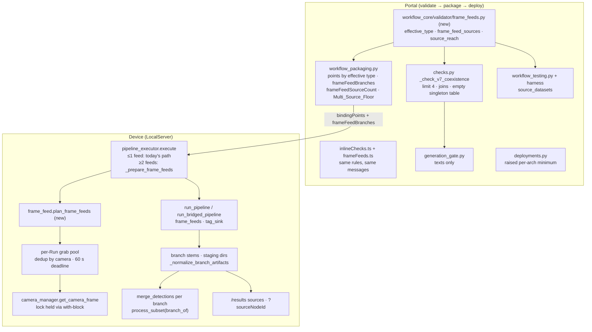

# Design Document

## Overview

A workflow may contain two to four Frame_Feed_Sources, each feeding its own Source_Branch. One trigger starts one Run. The device grabs one frame per source concurrently, pushes each frame into its own `appsrc_{nodeId}`, ends the stream on every source element, and keeps each branch's artifacts, detections and output payloads apart.

The limit is enforced in only a few places today, so the change is narrow:

- **Portal and shared code.** The only barrier is the Workflow_Validator rule `V7_COEXISTENCE_CONFLICT` and its copies: the builder's inline checks, the Generation_Gate texts, and the device's vendored validator. The compiler already renders two sources as two root segments, each headed by its own `appsrc_{nodeId}`. The packager already emits one binding point per source, and the deployment camera check already runs per device and per node.
- **Device.** Three things stop a second source:
  - both feed planners raise when a document has more than one feed point;
  - `execute` holds a single `frame_data`;
  - both pipeline runners look up the element named `appsrc` and read caps from the first `caps=` in the launch string.

  GStreamer itself has no such limit. `parse_launch` accepts disconnected chains, and the pipeline posts EOS only after every sink has seen EOS.

**The preservation rule.** Every new behavior sits behind one question: does the document have at least two Frame_Feed_Sources?

- Validation, compilation and packaging answer it from the graph. They count sources by effective type, so a `unified_input` counts as the type it expands to.
- The device answers it from the document's feed binding points.

At zero or one source, today's code runs unchanged: the same planners, the same `appsrc` rename, the same runner calls and the same artifact names. Only documents with two or more sources, which no system can produce today, take the new paths.

## Research Findings

### Where single-source is enforced

| Layer | Location | Behavior today |
|---|---|---|
| Validator | `workflow_core/validator/checks.py` `_check_v7_coexistence` (906-975), `COEXISTENCE_SINGLETON_TYPES` (134), `FRAME_FEED_SOURCE_TYPES` (153), called from `validate()` at 333 | One `V7_COEXISTENCE_CONFLICT` finding per offending node. Keys on the raw `node.type`, so a `unified_input` is never counted |
| Inline checks | `frontend/src/pages/workflows/inlineChecks.ts` `checkV7Coexistence` (312-373) | Line-for-line mirror of the validator. `validationMarkers.ts` drops findings whose `nodeId` is null |
| Generation_Gate | `functions/generation_gate.py` 69, 234-237, 340-343 | Decisions depend only on codes. The texts say "Keep at most one node of this type" |
| Vendored copy | `src/backend/workflow_engine/vendor/workflow_core/` via `re_vendor.sh` (whole-package rsync) | Byte-identical today. `test_vendored_catalog_mirror.py` pins catalog files and `anomaly_invocation.py`, but not `validator/checks.py` |
| Device planners | `aravis_feed.plan_aravis_feeds` (117-125), `python_source.plan_python_sources` (105-118) | Raise with `node_id=None` for more than one feed point. Used only at run time; device registration does not check the feed count |
| Executor | `pipeline_executor.execute` (1537-1597), `_prepare_aravis_frame_feed` `feeds[0]` (3196), `_prepare_python_source_feed` `feeds[0]` (3254), `_point_appsrc_at_frame_feed` renames to `appsrc` (3424) | One `frame_data`. When both are planned, the Python frame overwrites the Aravis one |
| Runners | `gst_pipeline.create_buffer` (62-90) and `run_pipeline` (185-186, 241-243); `python_bridge.run_bridged_pipeline` (1956-1981, 2047-2049), `_fed_frame_caps` (1727-1742) | `get_by_name("appsrc")`, first `caps=` regex, one push and one EOS |

### What already works per node

- **Compiler.** Every node with no inputs starts its own root segment. The `appsrc_{nodeId}` names and the tee and segment counters are unique across the document, and `_upstream_gst_feeders` looks only upstream. With joins forbidden, two sources compile into two disconnected chains. The compiler needs no change.
- **Packaging.** `build_binding_points` emits one `aravisBinding` or `pythonSourceBinding` point per node, with camera nodes first in graph order and then Python sources.
- **Device resolution.** `camera_binding.ResolutionResult.aravis_assignments` is keyed by node id.
- **Deployment.** `validate_camera_bindings` loops over devices and camera nodes. `check_local_server_compatibility` already names the device, its version and the minimum.
- **Triggers.** `TriggerBinding.activates` is used only in `bindings_fingerprint`. The executor decides what to grab from `bindingPoints` alone. A trigger wired to one source's activation port therefore already starts a Run that plans every feed point (Requirement 5.7).
- **Builder.** Nothing in the palette, the drop handler or the node factory counts nodes. The per-node camera picker already offers both static cameras to every `aravis_camera_source` node (verified on hardware in `static-camera-video-loop`).
- **Artifacts keyed by node.** `{capture_id}.node.{nodeId}.{port}.jpg`, `bedrock.{nodeId}`, `llm.{nodeId}`, `python_source.{nodeId}`, `node_status_json` and the tuning-export keys.

### Run-level state that collides with two branches

- **One `capture_id` per Run** (`"{workflow_id}-{execution_id}"`). It feeds the METADATA `capture_id` and `correlation-id` of every METADATA-declaring `emltriton` (`_inject_inference_metadata` 1241-1269).
- **One routing for every terminal `emlcapture`.** `_route_capture_outputs` (1322-1359) gives every terminal capture the same `buffer-message-id` and `meta`, built from the outputs declared by every model in the document.
- **Broker file names.** The broker writes `file-target_{DIR}-{ext}` to `{DIR}/{c_id}.{ext}`, where `c_id` is the buffer's correlation id. A branch without a METADATA model writes a literal `.jpg`, which `_repair_capture_artifacts` renames. The marshal names files by string formatting (`f"{capture_id}.mask.png"` and similar), so a dotted stem is safe there.
- **One flat result dict.** `run_pipeline` parses TAG messages into one flat dict, where the last `is_anomalous`/`confidence` wins. `merge_detections` builds one Detection_List per Run, cached under one key. Every output binding renders from one metadata dict.
- **Result lookups.** `run_artifacts` lookups take `(output_dir, capture_id)`. `base_output_image_path` falls back to the first sorted non-overlay `.jpg`. `/results` returns a single `output` entry.

### Concurrency on the device

- **Physical cameras serialize.** `camera_manager.get_frame_lock` is one process-wide `RLock` held across connect and grab. The static image and video cameras return before taking it, and Python producers run in their own subprocesses.
- **Lab cameras.** Two lab devices each have one physical GenICam camera, a Basler acA4600-10uc on USB3 Vision that uses the BGGR Bayer chain:
  - thor1 (JP7): `Basler-267601652282-23405186`;
  - the Orin AGX (JP6): `Basler-26760165225D-23405149`, attached on 2026-09-27. It was previously used on thor1, which still has an Image_Source for it.

  No device has two physical cameras. thor1's camera-registry shadow still lists both Baslers as present. Those entries were last written on 2026-09-22 and were never retired, because the agent doesn't remove keys it stops reporting and shadow updates merge. Registry presence alone is therefore not proof of attachment. Every device also reports the Aravis Fake camera `Fake_1`, which takes the same locked grab path as a physical camera. Source: `lsusb`, `GET /cameras` and the camera-registry reports, 2026-09-27.
- **A lock leak, fixed separately.** `get_camera_frame` called `get_frame_lock.acquire()` before its `try`/`finally`. If `connect_camera` raised, or no camera object appeared, the lock was never released, and every later grab in the process blocked. This was observed on thor1 on 2026-09-28. It is fixed on its own, ahead of this spec, in `.kiro/specs/camera-grab-lock-leak`. This design assumes that fix is merged.
- **Measured physical grab.** thor1's Basler (14 MP, USB 3, gain 1, exposure 500) holds the camera lock for about 0.3 s per grab:
  - start acquisition: about 2 ms;
  - software trigger plus frame transfer (`CameraGetFrameTime`): about 153 ms;
  - decode across the camera-manager process: about 15 ms;
  - stop acquisition: about 130 ms.

  One camera after the other, a second physical camera's frame would be taken about 0.3 s after the first. Source: the camera manager's own timing log lines, three previews, 2026-09-28.
- **Thread safety.** The executor's SQLAlchemy session is not thread-safe, so configuration lookups must stay on the run thread.

### Pre-existing gap (not changed here)

Packaging reads the unexpanded graph (`workflow_packaging.py` 2345). `gather_camera_input_nodes` keys on the raw type. As a result, a `unified_input` with `source_kind: aravis_camera` gets no `aravisBinding` point and no `camera_input_nodes` record. On the device its `appsrc` would then never be fed, and the run would end at the 120 s watchdog. This is inferred from the code; it has not been reproduced on a device.

Requirement 3.4 keeps single-source packages byte-identical, so this design leaves that single-source case alone. Multi-source packages bind every Frame_Feed_Source by effective type (Decision 4). The single-source fix belongs in a follow-up bugfix (open question 1).

## Key Decisions

### Decision 1: One gate, answered the same way everywhere

```python
FRAME_FEED_SOURCE_TYPES = frozenset({"aravis_camera_source", "custom_python_source"})
MAX_FRAME_FEED_SOURCES = 4

def effective_type(node) -> str:
    """node.type, or for unified_input the type its source_kind expands to
    (catalog SOURCE_KIND_TO_SOURCE_TYPE; source_kind defaults to 'folder')."""
```

- **Portal.** The validator, the inline checks and the packager count Frame_Feed_Sources with `effective_type`. `workflow_core` gains a pure helper module, `workflow_core/validator/frame_feeds.py`, and the TypeScript mirror is `frameFeeds.ts`. Both expose:
  - `frame_feed_sources(graph)`, the source ids in graph order;
  - `source_reach(graph)`, the set of sources that reach each node over every connection.
- **Device.** The device counts binding points that carry either feed marker (`_FEED_MARKERS`).

At two or more sources the new paths run, and at zero or one nothing changes. The packager emits the device's feed points from the same count (Decision 4), so the two sides cannot disagree about a package.

### Decision 2: Reuse `V7_COEXISTENCE_CONFLICT` for the new limits

After this change the frame-feed rules are the code's only members, since `COEXISTENCE_SINGLETON_TYPES` loses both of its entries. Reusing the code keeps several things unchanged:

- the Generation_Gate categories (`coexistence_conflict`);
- the structural-code set;
- both gate tests;
- the exported names.

`COEXISTENCE_SINGLETON_TYPES` keeps its name and type (now an empty mapping), and the singleton loop stays generic for future types. `_check_v7_coexistence` becomes the frame-feed check and keeps its position in `validate()` (line 333). It returns `[]` whenever there is at most one source, so a single-source finding list is identical to today's (Requirement 8.1).

| Rule | Findings | Message |
|---|---|---|
| More than 4 sources (1.2) | one per source node | `Node '{id}': the workflow has {n} frame-feed source nodes ({members}); a workflow may contain at most 4 frame-feed source nodes` |
| Node fed by 2 or more sources (1.3), where the branches meet | one per node whose predecessors are each fed by fewer sources than it is | `Node '{id}': joins the branches of frame-feed sources ({sources}); each node may be fed by only one frame-feed source` |
| Node fed by 2 or more sources (1.3), downstream of a join | one per other such node | `Node '{id}': is fed by more than one frame-feed source ({sources}); each node may be fed by only one frame-feed source` |

`{members}` and `{sources}` are sorted, quoted and comma-joined, as V7 does today. Every finding carries `node_id`, so every offending node gets a builder marker (Requirement 2.2). Following Requirement 1.3 literally, a join near the sources flags each node below it, which shows the user the whole merged region.

The Generation_Gate rejects without repair above 10 structural errors. A join with many downstream nodes can cross that threshold. This is accepted because joins are out of scope, and the rejection names the cause.

The two gate texts (Requirement 1.5):

- **Repair instruction:** "A workflow may contain at most four frame-feed source nodes, and each node may be fed by only one of them: remove extra source nodes, or give each source its own downstream nodes instead of joining their branches."
- **Explanation:** "Each frame-feed source must feed its own separate branch, and a workflow may contain at most four of them."

### Decision 3: Source_Branch membership travels with the package

The device needs each node's branch to:

- scope the device ROI;
- route captures;
- attribute tags and detections;
- choose each output node's metadata.

Re-deriving the graph on the device would duplicate the validator's reachability. Instead, the packager stamps a `frameFeedBranches` section into the compiled document next to `bindingPoints`. It maps each source id to the sorted node ids it reaches, including the source itself. The packager computes it with the same `source_reach` helper the validator uses, and adds it only for Multi_Source_Workflows, so single-source documents stay byte-identical (Requirement 3.4).

```json
"frameFeedBranches": {
  "aravis_camera_source_1": ["aravis_camera_source_1", "capture_1", "model_inference_1"],
  "aravis_camera_source_2": ["aravis_camera_source_2", "capture_2", "mqtt_publish_1"]
}
```

Nodes that no Frame_Feed_Source reaches do not appear. Examples are a `folder_source` branch and trigger nodes. Those nodes keep run-level behavior.

A device document with two or more feed points but no `frameFeedBranches` fails the Run: "compiled document declares {n} frame-feed sources but no frameFeedBranches section; re-package the workflow". This can only come from a hand-edited package.

### Decision 4: Packaging, manifest and the Multi_Source_Floor

For a Multi_Source_Workflow only:

- **Binding points.** One point per Frame_Feed_Source by effective type. A `unified_input(aravis_camera)` gets `aravisBinding: true`, with its rendered Aravis parameters and `nodeType: "aravis_camera_source"`. Such nodes also join the version item's `camera_input_nodes` record, so the deployment camera check covers them.
- **Manifest.** Gains `frameFeedSourceCount: n`. It follows the `subscribed_topics` pattern: the key exists only when n ≥ 2.
- **Floor.** A new per-architecture map sets the floor, `WORKFLOW_MULTI_SOURCE_MIN_LOCAL_SERVER_VERSIONS`. It is an environment JSON map set in `compute-stack.ts` beside `WORKFLOW_MIN_LOCAL_SERVER_VERSIONS`, on the packaging and deployments functions, with the same coverage test. Its values are the first LocalServer version of each variant that contains this feature. They are filled in when those builds are published (task 13.4).
  - `minLocalServerVersion` becomes `max(base floor, multi floor)`.
  - `minLocalServerVersions` becomes the per-architecture max.
  - The recipe HARD dependency floor in `local_server_component_dependencies` is raised the same way.
  - The version item records `frame_feed_source_count` and `multi_source_min_local_server_versions`.
- **Fail closed.** If the map has no entry for a target architecture, packaging refuses that architecture with 409 `MULTI_SOURCE_UNSUPPORTED_ARCH`: "Multi-source workflows need a LocalServer version that supports them; none is configured for {arch}". The map ships empty until the device builds exist, so the Portal cannot package a Multi_Source_Workflow that no device could run.

### Decision 5: Deployment raises the minimum only for multi-source versions

`deployments.py` reads `frame_feed_source_count` from the version item. When it is 2 or more, the per-architecture minimum passed to `check_local_server_compatibility` becomes the larger of two values:

- the version's recorded `multi_source_min_local_server_versions[arch]`;
- today's minimum for that architecture, which is either the version override or the base map.

The existing refusal (409 `INCOMPATIBLE_LOCAL_SERVER`) already names the device, the installed version and the minimum (Requirement 4.2). `validate_camera_bindings` needs no change because it already checks each camera node per device (Requirement 4.1). It covers `unified_input(aravis)` sources through the record from Decision 4. `custom_python_source` nodes have no camera.

### Decision 6: Device feed stage with concurrent grabs

`execute` counts feed points. At one or none it calls today's `_prepare_aravis_frame_feed` and `_prepare_python_source_feed` verbatim. At two or more it calls the new `_prepare_frame_feeds`:

1. **Plan** with `frame_feed.plan_frame_feeds(document, resolution)`. It returns one `FeedPlan(node_id, kind, camera_id | handler)` per feed point in binding-point order. It reuses the existing per-point helpers (`_effective_values`, `_camera_id`, the Python feed builder). More than 4 points raises, naming the limit and every node.
2. **Resolve on the run thread.** For each Aravis plan, `_camera_config_resolver(session, camera_id)` supplies the device Image_Source config, falling back to the plan's gain and exposure. This keeps SQLAlchemy off the worker threads. Python producer bridges are also built here.
3. **De-duplicate.** Aravis plans are grouped by `camera_id`, giving one grab per camera (Requirement 5.4). Every node in a group receives the same frame. If the group's configurations differ (possible only when there is no Image_Source), the first node's configuration in binding-point order is used, and a warning names the nodes. Python sources are never merged.
4. **Grab concurrently.** A per-Run `ThreadPoolExecutor(max_workers=len(tasks))` runs these tasks:
   - **one grouped physical grab** for every distinct camera that goes through the camera lock (Decision 6a);
   - **one task per virtual camera**, the Static_Image_Camera or Static_Video_Camera, through `_frame_grabber`;
   - **one task per Python producer**, through `bridge.produce_frame(trigger_context, prefixes)`.

   A grouped grab with a single camera is exactly today's `get_camera_frame` call. Each source is stamped with `grabStartedAtMs` and `grabEndedAtMs` (Requirement 5.3). For physical cameras the start is the moment its trigger was sent. The executor waits for every task until `FRAME_FEED_GRAB_TIMEOUT_SEC = 60`. A task still running at the deadline counts as failed with "frame grab did not complete within 60 s". Its thread is abandoned, which is the same containment as a hung pipeline.
5. **Fail before the pipeline.** If any task failed or timed out, the Run fails with `_finish_failed` before the capture-phase outputs, the bridges and the pipeline (Requirement 5.6). `failing_node_id` is the first failing node in binding-point order.
   - With one failure, `error` is that source's own message, in today's wording, e.g. "Aravis camera source 'n1': frame grab from Aravis camera 'cam1' failed: …".
   - With several, it is "Frame-feed sources failed before the pipeline started: " followed by each message, joined by "; ".
6. **Rewrite on the run thread.** In binding-point order, `_point_appsrc_at_frame_feed(..., rename=False)` sets each element's `caps` and inserts `bayer2rgb` for Bayer frames. The element keeps its name `appsrc_{nodeId}`. Only the single-source path renames it to `appsrc`. Then `_apply_device_roi` runs per branch (Decision 7).
7. **Hand off** an ordered `frame_feeds = {"appsrc_{nodeId}": FedFrame(base_caps, frame)}` to the runner (Decision 8). A frame shared by several nodes is copied once per extra consumer, so no two GStreamer buffers wrap the same memory.
8. **Record** `tag_values["frameFeeds"][nodeId] = {kind, cameraId, grabStartedAtMs, grabEndedAtMs, sharedWith}` and write one run-log line per source.

### Decision 6a: Grouped physical grab under the one camera lock

Physical cameras keep the single process-wide lock. A USB3 Vision device admits one claim, and `Camera.disconnect` calls the process-wide `Aravis.shutdown()`, so per-camera locks would be a separate, riskier change. Inside that one lock, the cameras are grabbed as a group instead of one after the other:

```python
def get_camera_frames(requests):   # [(camera_id, config), ...] in binding-point order
    """One frame per physical camera, taken as close together as the bus
    allows. Returns [(camera_id, frame or None, error or None)] in order."""
    with get_frame_lock:
        connect every camera not in camera_objects      # a failure marks that camera failed
        start_acquisition(config) on each connected camera
        software_trigger() on each started camera        # back to back: only IPC between them
        pop_frame() on each triggered camera             # frames transfer in parallel
        stop_acquisition() on every camera that started  # always, even after failures
```

- **New Camera methods.** `Camera` gains `trigger()` and `pop_frame()`, which split today's `get_frame()`.
  - `trigger()` sends the software trigger.
  - `pop_frame()` pops the buffer with today's timeout and re-queues it, returning the same `encode_frame` transport. It keeps `get_frame()`'s status updates and its `pixel_format` tag.
  - `get_frame()` itself stays as it is and is still what single grabs use.
  - `Camera` objects live in the camera-manager process and are reached by proxy, so a trigger costs one IPC round trip, about 1 ms.
- **Expected timing.** From the measurement above, the frames of two cameras should be a few milliseconds apart, instead of about 0.3 s. Each frame still arrives after about one transfer time, about 150 ms for these cameras, but the transfers overlap. The Run records the real skew.
- **Bandwidth.** Two 14 MP frames at once need about 200 MB/s together. That fits one 5 Gb/s USB 3 link. If a pop times out, that camera fails with today's "Timed out waiting for a frame" status, and the Run fails naming it (Requirement 5.6).
- **Error handling.** Every camera that started is stopped and the lock is released on every path. The error for a camera names it the same way a single grab would: "Unable to get camera frame for camera id: {id}", or the open error. Other cameras' frames are returned, but the executor fails the Run if any source failed (Requirement 5.6).
- **Single-camera path unchanged.** `get_camera_frame`, the preview, capture and digital-input paths, and single-source Runs do not change. `get_camera_frames` is used only when a Run has two or more distinct physical cameras.
- **Preservation-tracked file.** `camera_manager.py` changes again, so its hash is rebaselined in this spec's commit.
- **Measuring it.** A real measurement needs two physical cameras on one device, which means both Baslers on thor1 or both on the Orin. The Aravis Fake camera exercises the ordering and cleanup logic but not the timing.

### Decision 7: Device ROI per Source_Branch

`_apply_device_roi` keeps its single-source behavior, using the whole-document `roi_crop.has_explicit_crop`.

For multi-source runs, the set of Crop-bearing branches is computed once, from the pristine document before any device ROI is inserted. It is the set of sources whose `frameFeedBranches` members include the `nodeId` of a `videocrop` element. Each source's device ROI is then:

- skipped in a Crop-bearing branch, with today's log line;
- otherwise inserted after that source's own elements, with the existing validation (`normalized_crop`, `is_no_op`, `fits_frame`).

Branches of the same camera crop independently. The Static_Image_Camera and Static_Video_Camera ignore gain and exposure, as today, and honor their Image_Source ROI.

### Decision 8: Runners accept `frame_feeds`

`GstPipelineManager.run_pipeline` and `python_bridge.run_bridged_pipeline` gain an optional keyword, `frame_feeds: Optional[Mapping[str, FedFrame]] = None`. `FedFrame` holds `base_caps` and `frame`.

- **Before PLAYING,** for each entry in order:
  - `pipeline.get_by_name(name)`, raising `PipelineExecutionException("fed element '{name}' missing from the pipeline")` if it is absent;
  - caps `"{base_caps},width={w},height={h}"`, with `block=True` and `format=TIME`;
  - a strict `reconcile_to_caps_stride` buffer.
- **After PLAYING,** push one buffer and send EOS on each element in order. Each `appsrc` has its own queue and receives one buffer, so a push never waits on another branch.
- **Unchanged paths.** `frame_data` and the regex caps path stay byte-identical, and passing both keywords is a programming error. The classic Pipeline_Configuration callers never pass `frame_feeds`.
- **Executor calls.** The executor adds a fourth run arm, `frame_feeds is not None`. `_run_bridged` forwards the keyword only when it is set and the runner accepts it, following the existing `_handler_accepts_keyword` pattern.
- **Tags per branch.** For multi-source runs `run_pipeline` also accepts `tag_sink(element_name, values)`. The executor maps the posting element to its node and then its branch, and files `is_anomalous`/`confidence` under that branch. Tags from elements it cannot map stay run-level.

### Decision 9: Per-branch artifacts named by a Branch_Stem

```text
Branch_Stem(src) = "{capture_id}.src.{token(src)}"
token(src)       = src with every character outside [A-Za-z0-9_-] replaced by "_";
                   on a collision between two sources, "-{k}" is appended (k = 1-based
                   binding-point index)
```

A branch writes these files:

- `{stem}.jpg`, `{stem}.overlay.jpg`, `{stem}.mask.png`, `{stem}.jsonl`, `{stem}.detections.json`;
- Bedrock crops as `{stem}.crop.{detectionId}.jpg`.

Node frames keep `{capture_id}.node.{nodeId}.{port}.jpg`, which is already unique per node. The run metadata stays `{capture_id}.json` and gains `branches` and `frameFeeds`. A small `{capture_id}.sources.json`, holding the Run's sources, camera ids and stems, is written once the grabs succeed, so results can list sources even when the pipeline later fails. Single-source runs keep today's names exactly (Requirement 6.2).

The `.src.` marker keeps branch files apart from the existing `.node.` and `.crop.` names, and lets `run_artifacts` list branches the way it lists node frames. Plain `{capture_id}.{nodeId}.jpg` was rejected because node ids such as `node` or `crop`, or dotted ids, would collide with those markers.

The executor produces these names as follows. All of it applies to multi-source runs only.

- **`_inject_inference_metadata`.** Each METADATA-declaring `emltriton` gets its own branch's stem as the METADATA `capture_id` and as its `correlation-id`. `disk_path` stays `output_dir`, so the marshal's workflow-id derivation and its `source-ref` paths hold.
- **`_route_capture_outputs`.** Each terminal `emlcapture` is routed to its branch's staging directory, `{output_dir}/.src-{token}/`, which is created before the run. Its `meta` is built only from the outputs declared by the models in its own branch. Tag ids are therefore distinct per branch, and a branch never receives another branch's targets.
- **`_normalize_branch_artifacts`.** This new step runs after the pipeline, in place of `_repair_capture_artifacts` for multi-source runs. It moves each staging file to `{output_dir}/{stem}{suffix}`. A file named `{stem}{suffix}` came through a correlation id; a file named `{suffix}` came from a branch without a METADATA model. The step then removes the staging directory. It never overwrites an existing file, and it logs anything it cannot place.

### Decision 10: Results and outputs read their own branch

- **Detections.** `merge_detections` runs once per branch, with that branch's stem and its own cache entry. It fills `tag_values["branches"][src]["detections"/"detection_count"]`, and Detection_IDs are unique across the Run. Multi-source runs do not get the top-level `detections`, `detection_count`, `is_anomalous` or `confidence` keys, which would be ambiguous.
- **Branch views.** Each binding or node sees `view(src) = {**run_level, **branches[src]}`.
  - **Output bindings.** `OutputBindingProcessor.process_subset` gains an optional `branch_of` keyword, defaulting to None as `detail_sink` does. Filters, conditionals and `render_template` then evaluate each binding against the view of its node's branch. So `{detection_count}`, `{is_anomalous}` and `{inference_json}` resolve to the output node's own branch (Requirement 6.5). The keyword is threaded through `_run_post_run_handler`, the capture-phase bindings and Bedrock publish-on-completion.
  - **Bedrock and LLM processors.** They get a per-branch `RunContext`, with the branch's stem as `capture_id` and its view as `tag_values`. Detection crops, capture-record dimensions and verdicts therefore stay within the branch.
  - **Bridge injector.** The `python_bridge` detections injector resolves each node's branch stem and cache.
- **Scope of these keys.** Nodes outside every branch use the run-level view. Single-source runs never pass `branch_of` and keep every flat key.

### Decision 11: Results API and views

**`/workflows/executions/{id}/results`**

For multi-source runs:

- `images` holds one `{"kind": "output", "sourceNodeId", "cameraId", "hasOverlay", "hasOverlayImage"}` entry per branch whose base image exists, in source order;
- node-frame entries gain `sourceNodeId`;
- a new `sources: [{sourceNodeId, kind, cameraId}]` list comes from `{capture_id}.sources.json`.

Single-source responses are unchanged, with no new keys.

**Image routes**

`/output-image`, `/overlay-image` and `/overlay` accept an optional `sourceNodeId` query parameter.

- The value must be one of the Run's sources (an allow-list), so it cannot express a path.
- It resolves `{stem}` files with no fallback.
- Without the parameter, single-source runs behave as today. Multi-source runs answer 404: "This run has several sources; pass sourceNodeId (one of: …)".

**LocalServer UI**

- `RunResults.tsx` renders one section per source, labeled "{sourceNodeId} · {camera}". Each section has its own image, overlay toggle and detections table, fed from `metadata.branches[src]`.
- `RunStatusGraph` and `previewModel` show each capture or model node its own branch's image and detections.

**Portal**

The Portal has no device-run view. It shows Run results through the inference-results bucket, where `captures.py` and `ResultsViewer` group captures by `.jsonl` stem.

- `_parse_capture` parses the `.src.{token}` marker into `source_node_id`.
- `ResultsViewer` labels each capture "Source: {token}".
- Every branch of a Run therefore shows as its own labeled capture (Requirement 6.4).

Task 13.6 checks on hardware that the InferenceUploader carries the stemmed files.

### Decision 12: One Test_Dataset per source

The test runner runs in the cloud: a Fargate sandbox runs a simulation compile, in which every Frame_Feed_Source maps to `multifilesrc location={dataset_location}`. The compiled simulation document does not change.

- **Request.** `POST /workflows/{id}/test-runs` gains an optional `source_datasets: {nodeId: datasetId}`.
- **Backend checks.** `start_test_run` finds the Frame_Feed_Sources from the stored definition with `frame_feed_sources()`.
  - At zero or one source, today's `dataset_id` path is unchanged (Requirement 7.3).
  - At two or more, it answers 400 `SOURCE_DATASET_MISSING` if any source lacks a dataset: "Select a test dataset for each source node: '{id}', …" (Requirement 7.2). It also checks each dataset's use case, as today.
- **What the Run carries.** The Run stores `source_datasets`. The execution input carries `source_dataset_prefixes_json`, pre-serialized in the same way as `staged_models_json`.
- **Sandbox.** The sandbox receives it as `SOURCE_DATASET_PREFIXES` through the existing `containerOverrides` in `test-runner-stack.ts`.
- **Harness.** When the map is non-empty, the harness:
  - stages each prefix into `workdir/dataset/{nodeId}`;
  - resolves `{dataset_location}` per element `nodeId` with a new `renderer.resolve_placeholder_by_node`;
  - reports per-node frame counts.
- **UI.** `TestPanel` shows one dataset select per source when there are two or more, and names the first source without a dataset in its disabled reason.
- **Previews.** No builder preview reads a source frame, so previews need no change.

### Decision 13: Rollout order

1. Build and deploy the LocalServer variants with multi-source support. Old packages keep running because they have at most one feed point (Requirement 8.4).
2. Record each variant's first supporting version in `WORKFLOW_MULTI_SOURCE_MIN_LOCAL_SERVER_VERSIONS` and deploy the Portal. Only then do the validator, the packager and the deployment check accept Multi_Source_Workflows.

The packager's fail-closed rule (Decision 4) means the Portal can safely deploy first, but the order above is what verification follows.

## Architecture



### Run flow (two or more sources)

1. The trigger fires, from any trigger node or any source's activation port, or the Run is started manually. One `WorkflowExecution` is created, as today.
2. Load the document and resolve bindings, as today. Count the feed points: there are two or more, so `_prepare_frame_feeds` runs. It plans, resolves, de-duplicates, grabs concurrently and fails the Run before the pipeline on any error.
3. The capture-phase outputs fire with the trigger context and the run and branch capture ids.
4. Rewrite the document on the run thread:
   - apply the bridges;
   - set each `appsrc_{nodeId}`'s caps and `bayer2rgb`;
   - insert the device ROI per branch;
   - inject per-branch METADATA and correlation ids;
   - route each branch's captures to its staging directory.
5. Write `{capture_id}.sources.json`, then run the pipeline with `frame_feeds` and `tag_sink`.
6. Normalize the branch artifacts, then run, per branch, `merge_detections`, Bedrock and LLM (per-branch `RunContext`) and the output bindings (`branch_of`).
7. Persist the run metadata (`branches`, `frameFeeds`), the node frames and the node status, as today.

## Components and Interfaces

### Portal and shared

1. **`workflow_core/validator/frame_feeds.py`** (new, pure, vendored). Holds `effective_type`, `frame_feed_sources` and `source_reach`. It imports only `..catalog`, so it cannot create an import cycle with the compiler.
2. **`workflow_core/validator/checks.py`**:
   - `MAX_FRAME_FEED_SOURCES = 4`;
   - the frame-feed entries leave `COEXISTENCE_SINGLETON_TYPES`;
   - `_check_v7_coexistence` implements Decision 2;
   - the module header and the code comment at 118-130 are updated.
3. **`src/backend/workflow_engine/vendor/workflow_core/`** is regenerated with `re_vendor.sh`. `test_vendored_catalog_mirror.py` gains `validator/checks.py` and `validator/frame_feeds.py` among its byte-identity files (Requirement 1.4).
4. **`frontend/src/pages/workflows/frameFeeds.ts`** (new) and **`inlineChecks.ts`** (`checkV7Coexistence` rewritten). They have the same constants, messages and ordering. `frameFeeds.ts` resolves `unified_input` through `SOURCE_KIND_TO_SOURCE_TYPE` (`types.ts` 125-131).
5. **`functions/generation_gate.py`**: the two texts only.
6. **`functions/workflow_packaging.py`**:
   - `gather_frame_feed_source_nodes(graph)`, by effective type;
   - multi-source branches in `build_binding_points` and `camera_input_nodes_record`;
   - `frame_feed_branches_section(graph)`, added in `compiled_document_json`;
   - the `frameFeedSourceCount` manifest key;
   - `multi_source_min_local_server_version_for(arch)`, reading the new environment map with the fail-closed rule;
   - the raised `minLocalServerVersion`, `minLocalServerVersions` and recipe floor;
   - the version-item fields.
7. **`functions/deployments.py`**: a raised `by_arch` for multi-source version items.
8. **`infrastructure/lib/compute-stack.ts`**: the `WORKFLOW_MULTI_SOURCE_MIN_LOCAL_SERVER_VERSIONS` environment map on the packaging and deployments functions. It is empty until task 13.4, and then holds the new versions. There is no IAM change.
9. **Test runner.** The changes are in these places:
   - `functions/workflow_testing.py`;
   - `infrastructure/lib/test-runner-stack.ts`, which adds an environment override;
   - `test-sandbox/harness/harness.py` and `renderer.py`;
   - `frontend/.../TestPanel.tsx` and the `services/api.ts` `startTestRun` type.

   If the sandbox task role cannot read every dataset prefix of the use case, the work stops and asks for approval before any IAM change.
10. **`functions/captures.py` and `components/ResultsViewer.tsx`**: the `source_node_id` field and its label.

### Device

1. **`workflow_engine/frame_feed.py`** (new). Holds `FeedPlan`, `plan_frame_feeds`, `FrameFeedError(node_id, message)` and the `MAX_FRAME_FEED_SOURCES` mirror. `aravis_feed.py` and `python_source.py` are unchanged.
2. **`workflow_engine/pipeline_executor.py`**:
   - the feed-count gate in `execute`, and `_prepare_frame_feeds`, a fourth run arm;
   - `_point_appsrc_at_frame_feed(rename=True)`, whose default keeps today's behavior;
   - `_apply_device_roi(branch_scope=None)`;
   - per-branch `_inject_inference_metadata` and `_route_capture_outputs`;
   - `_normalize_branch_artifacts`, the `sources.json` write, per-branch detections and processors, and `branch_of` threading.
3. **`gstreamer/gst_pipeline.py`** and **`workflow_engine/python_bridge.py`**: `frame_feeds` and `tag_sink` (Decision 8).
4. **`workflow_engine/output_bindings.py`**: `process_subset(..., branch_of=None)` and `process(..., branch_of=None)`.
5. **`workflow_engine/detections.py`**: a per-branch `cache_key` argument (default: today's key), and shared Detection_ID allocation.
6. **`workflow_engine/run_artifacts.py`**: `branch_stem`, `list_branch_outputs`, `read_run_sources`, and `base_output_image_path(..., fallback=True)`, with the fallback disabled for branch lookups.
7. **`workflow_engine/api.py`** and **`endpoints/download_file.py`**: the `sources` list, per-branch entries and the `sourceNodeId` parameter.
8. **`utils/camera_manager.py`**: `get_camera_frames` (the grouped grab, Decision 6a) and `Camera.trigger()` / `Camera.pop_frame()`. `get_camera_frame` and `Camera.get_frame()` are unchanged. This file is preservation-tracked (see below). The lock-leak fix is not part of this spec; it comes from `camera-grab-lock-leak`.
9. **LocalServer frontend**: `api/WorkflowRegistrationAPI.ts` types and URL builders, `RunResults.tsx`, `RunStatusGraph.tsx` and `previewModel.ts`.

### Unchanged (verified)

The following need no change:

- the compiler and the node catalog;
- the builder palette, node factory and camera picker;
- `validate_camera_bindings`;
- the trigger runtime;
- `aravis_feed.py`, `python_source.py` and `roi_crop.py`;
- the classic Pipeline_Configuration callers of `run_pipeline`;
- the device camera-binding resolver.

### Preservation-tracked files touched

`src/backend/utils/camera_manager.py` is pinned in `test/backend-test/security/baselines/iam_out_of_scope_baseline.json`. The grouped grab changes its hash again, after the `camera-grab-lock-leak` rebaseline. It is rebaselined in the same commit as the grouped grab, and the note records the reason.

No Dockerfile, compose file, requirements file, device recipe or station script changes. `deployments.py` and `compute-stack.ts` appear only in the approved-IAM-additions record, and this design adds no IAM.

## Data Models

**Compiled document** (multi-source only, added by the packager): the `frameFeedBranches` section described in Decision 3.

**Manifest:** `"frameFeedSourceCount": 2`, present only when there are 2 or more sources. `minLocalServerVersion` and `minLocalServerVersions` carry the raised floors.

**Version item:** `frame_feed_source_count` (number) and `multi_source_min_local_server_versions` (map), both present only when there are 2 or more sources.

**`{capture_id}.sources.json`** and **run metadata** (multi-source only):

```json
{
  "frameFeeds": {
    "aravis_camera_source_1": {"kind": "aravis", "cameraId": "static-image-camera",
      "grabStartedAtMs": 1790550000123, "grabEndedAtMs": 1790550000131, "sharedWith": []},
    "aravis_camera_source_2": {"kind": "aravis", "cameraId": "static-video-camera",
      "grabStartedAtMs": 1790550000124, "grabEndedAtMs": 1790550000160, "sharedWith": []}
  },
  "branches": {
    "aravis_camera_source_2": {"captureId": "wf-exec.src.aravis_camera_source_2",
      "cameraId": "static-video-camera", "detections": [], "detection_count": 0,
      "is_anomalous": false, "confidence": 0.12}
  }
}
```

`sources.json` carries `frameFeeds` plus each branch's `captureId` and `cameraId`. The full run metadata adds the per-branch results.

**Test run:** `source_datasets` (a map) on the TestRuns item, and `source_dataset_prefixes_json` in the Step Functions input.

## Correctness Properties

*A property is a characteristic or behavior that should hold true across all valid executions of a system — essentially, a formal statement about what the system should do. Properties serve as the bridge between human-readable specifications and machine-verifiable correctness guarantees.*

The Portal properties run with Hypothesis against `workflow_core`, the packager and deployments. Their generators build random DAGs of catalog nodes that mix `aravis_camera_source`, `custom_python_source`, `unified_input` (every `source_kind`), in-pipeline sources, processing, model and output nodes, with optional joins.

The frontend properties run with fast-check. Device properties use the executor's injectable seams:

- `frame_grabber`;
- `camera_config_resolver`;
- a pipeline-manager factory that records the `frame_feeds` it receives;
- a producer-bridge factory.

### Property 1: Source limit and acceptance
*For any* graph, let S be its Frame_Feed_Sources by effective type and R the nodes fed by two or more of them. If `2 ≤ |S| ≤ 4` and R is empty, `validate()` reports no `V7_COEXISTENCE_CONFLICT` finding. If `|S| > 4`, exactly one limit finding exists per source node, each naming 4 and all of S.
**Validates: Requirements 1.1, 1.2**

### Property 2: Join findings equal the reachability oracle
*For any* graph, the node ids of the join findings equal R computed by an independent BFS. Each finding names exactly that node's sorted source set. Merge-point wording appears exactly on nodes whose predecessors are each fed by fewer sources than the node itself.
**Validates: Requirement 1.3**

### Property 3: Mirror parity
*For any* graph, the inline checks' `V7_COEXISTENCE_CONFLICT` findings equal the Python validator's: same codes, messages, node ids and order. The vendored validator files are byte-identical to the Portal's.
**Validates: Requirements 1.4, 2.2**

### Property 4: Single-source preservation, Portal side
*For any* graph with at most one Frame_Feed_Source, the `validate()` findings equal the pre-change validator's, frozen as a test oracle. For each workflow in the golden corpus, the compiled documents and packages are byte-identical to goldens produced at the base commit, excluding `packagedAt`.
**Validates: Requirements 3.4, 8.1**

### Property 5: Multi-source packaging
*For any* valid Multi_Source_Workflow with n sources and target architecture a:
- there is exactly one feed binding point per source, in camera-then-Python graph order;
- `frameFeedBranches` equals the reachability oracle;
- `frameFeedSourceCount == n`;
- `minLocalServerVersion(a) == max(base(a), multi(a))`, and the recipe floor is at least that;
- packaging refuses exactly the architectures that have no multi floor.
**Validates: Requirements 3.1, 3.2, 3.3**

### Property 6: Deployment floor
*For any* installed version v, multi floor f and base floor b on a device, a multi-source deployment is refused for that device iff `v < max(b, f)`. The refusal names the device, v and `max(b, f)`. A single-source deployment's decision is unchanged.
**Validates: Requirements 4.1, 4.2**

### Property 7: Feed planning and de-duplication
*For any* document with 2 to 4 feed points and any camera assignment:
- `plan_frame_feeds` returns one plan per point in binding-point order;
- the grabber is called exactly once per distinct Aravis camera id and each producer exactly once;
- each `appsrc_{nodeId}` in the recorded `frame_feeds` receives exactly its camera's or producer's frame, with caps derived from that frame;
- no two entries share a buffer object.

Documents with more than 4 points fail, naming the limit and every node.
**Validates: Requirements 5.1, 5.2, 5.4**

### Property 8: Grab failure containment
*For any* non-empty subset F of sources whose grabs fail or exceed the deadline:
- the Run is failed and the pipeline runner is never called;
- `failing_node_id` is the first member of F in binding-point order;
- `error` names every member of F and its camera or producer.

When F is empty, every source has `grabStartedAtMs ≤ grabEndedAtMs`, and all grabs were submitted before any completed.
**Validates: Requirements 5.3, 5.6**

### Property 9: Branch-scoped device ROI
*For any* assignment of Crop nodes to branches and of ROIs to cameras, a device-ROI `videocrop` is inserted after source s iff three conditions hold:
- s's branch has no author Crop;
- s's camera ROI is valid, not a no-op, and fits the frame;
- s's frame has the dimensions the ROI checks against.
**Validates: Requirement 5.5**

### Property 10: Artifact isolation and naming
*For any* multi-source Run whose branches write any mix of correlated and uncorrelated capture files into an `output_dir` holding none of their targets beforehand, after normalization:
- every artifact path is distinct;
- every branch artifact starts with its own Branch_Stem;
- no file is overwritten, and no staging directory remains.

*For any* single-source Run, the artifact names equal today's.
**Validates: Requirements 6.1, 6.2**

### Property 11: Branch-scoped results and outputs
*For any* per-branch detections, verdicts and output bindings, each binding's rendered payload and filter and conditional outcome equals what rendering it against its own branch's view gives. Each branch's `detection_count` equals its own Detection_List length, and Detection_IDs are unique within the Run.
**Validates: Requirement 6.5**

### Property 12: Results API
*For any* multi-source Run:
- `/results` lists exactly one output entry per branch with a base image, with the right `sourceNodeId` and `cameraId`;
- `?sourceNodeId=` serves only allow-listed sources' files;
- any other value is rejected without touching the filesystem.

*For any* single-source Run, the responses are byte-identical to today's.
**Validates: Requirements 6.3, 8.1**

### Property 13: Per-source test datasets
*For any* Multi_Source_Workflow and dataset map:
- a request is accepted iff every source has a dataset of the same use case;
- a rejection names exactly the sources without one;
- the harness resolves each `multifilesrc` of source s to s's staged directory.

Single-source requests are unchanged.
**Validates: Requirements 7.1, 7.2, 7.3**

### Property 14: Grouped physical grab ordering and cleanup
*For any* list of 1 to 4 distinct physical camera requests, and any mix of open, start, trigger and pop failures across them, `get_camera_frames` behaves as follows:
- it calls `trigger()` on every started camera before it calls `pop_frame()` on any;
- it calls `stop_acquisition()` on every camera it started, even after failures;
- it returns exactly one result per request, in request order, each a frame or an error naming its camera;
- it leaves `get_frame_lock` free for another thread.

With a single request, it returns what `get_camera_frame` returns, or raises what `get_camera_frame` raises.
**Validates: Requirements 5.3, 5.6**

### Preservation (existing suites, unmodified)

These suites keep passing without edits:

- the workflow_engine suite, including the single-feed planner tests, which still pin today's messages;
- the camera suites and camera_sync;
- the Portal workflow, packaging and deployment suites;
- the frontend builder suites;
- the harness tests.

The exceptions are conscious updates to tests that pin the one-source rule itself:

- `frameFeedMarkers.property.test.ts`;
- `test_property_frame_feed_coexistence.py` and the frame-feed caps in `generators.py`;
- any exact-finding assertions that the grep in task 1.1 finds.

This proves Requirements 8.1 and 8.4.

## Error Handling

| Condition | Where | Behavior | Req |
|---|---|---|---|
| More than 4 sources | validator, inline checks | One finding per source naming the limit and all sources | 1.2 |
| Node fed by 2 or more sources | validator, inline checks | One finding per such node naming its sources (merge-point wording where the branches meet) | 1.3 |
| No multi floor for a target architecture | packager | 409 `MULTI_SOURCE_UNSUPPORTED_ARCH` naming the architecture; no version registered | 3.3 |
| Device older than the floor | deployment check | 409 `INCOMPATIBLE_LOCAL_SERVER` naming the device, version and minimum | 4.2 |
| Source camera missing on a device | deployment check | Existing per-node camera errors | 4.1 |
| More than 4 feed points on the device | `plan_frame_feeds` | Run fails before the pipeline, naming the limit and nodes | 5.6 |
| 2 or more feed points without `frameFeedBranches` | executor | Run fails before the pipeline: "…re-package the workflow" | 3.2 |
| A grab or producer fails | grab pool | Run fails before the pipeline; `failing_node_id` is the first failure; the error names each failing node and camera | 5.6 |
| A grab exceeds 60 s | grab pool | Treated as a failure: "frame grab did not complete within 60 s"; the worker is abandoned | 5.6 |
| A camera in a grouped grab fails to open, start, trigger or deliver a frame | `get_camera_frames` | The others still get their frames. Every started camera is stopped and the lock is released. The Run fails before the pipeline, naming that source and camera | 5.6 |
| Fed element missing from the launch string | runners | `PipelineExecutionException` naming the element; the Run fails with that node | 5.2 |
| An `appsrc` never gets EOS | runners | Every fed element gets EOS by construction; the 120 s watchdog stays the backstop | 5.2 |
| Staging file cannot be placed | `_normalize_branch_artifacts` | Logged and left in place; never overwrites; the Run continues | 6.1 |
| `sourceNodeId` not a source of the Run | image routes | 404 naming the valid sources; no filesystem access | 6.3 |
| A source without a Test_Dataset | test-run API, TestPanel | 400 `SOURCE_DATASET_MISSING` naming the sources; the UI disables Run with the same reason | 7.2 |
| Multi-source package on a LocalServer without this feature (direct deployment) | old planners | Recipe HARD dependency blocks it where present; otherwise the Run fails with today's "single-frame appsrc feed" message | 8.4 |

## Security Considerations

- **No IAM, role, S3-prefix or authorizer changes** are planned. The test runner reads each source's dataset under the same use-case prefix. If the sandbox role turns out to be scoped to one dataset prefix, task 10.3 stops for approval.
- **`sourceNodeId` is allow-listed** against the Run's recorded sources before any path is built. Branch tokens contain only `[A-Za-z0-9_-]`, so a stem cannot escape `output_dir`.
- **Concurrency.** Grabs run on a bounded per-Run pool (at most 4 threads) with a 60 s deadline. Python producers keep their subprocess isolation and their existing URI allow-lists, one per source.
- **The lock fix reduces a denial-of-service risk.** A single failed connect can no longer wedge every later camera grab in the process.

## Testing Strategy

- **Portal property tests.** Properties 1 to 6 and 13 run under `edge-cv-portal/backend/layers/workflow_core/tests/` and `edge-cv-portal/backend/tests/`. Each property is one Hypothesis test, tagged `**Feature: multi-source-workflows, Property N: …**`, using the repo profiles (100 examples with `HYPOTHESIS_PROFILE=ci`). The test modules take function modules from the `aws_stack` fixture, following the workspace rule for these suites.
- **Golden corpus.** The single-source workflows from the existing packaging and compilation fixtures, plus one per source type and a `unified_input` example, are compiled and packaged at the base commit. Their documents and packages, excluding `packagedAt`, are stored as goldens (Property 4).
- **Frontend (vitest).**
  - Property 3's TypeScript side uses fast-check, with a Python-generated corpus of graphs and expected findings checked into the test fixtures.
  - `frameFeedMarkers.property.test.ts` is rewritten.
  - Also tested: TestPanel per-source selects and the disabled reason, the ResultsViewer source label, and the LocalServer RunResults per-source sections.
- **Device.**
  - Properties 7 to 12 use the executor seams.
  - A real-GStreamer test runs in the flask-app image. It feeds two `appsrc` chains into `fakesink` and `multifilesink`, checks one buffer and one EOS per element, and checks that single-feed `run_pipeline` still works.
  - Property 14 drives `get_camera_frames` against fake `Camera` objects that record the order of calls and inject failures.
  - A real-Aravis test in the flask-app image runs `get_camera_frames` over two Aravis Fake cameras.
- **Cross-platform container runs.** The `workflow_engine`, camera and camera_sync suites run in every platform image: arm64 CPU, JP5, JP6 and JP7 on this host, and amd64 on the x86 build server.
- **Early device spike** (task 6.4). On one Triton-capable device, a hand-packaged two-branch document confirms three things before the executor work builds on them:
  - dotted correlation ids come out verbatim in broker file names;
  - staging-directory file targets work;
  - TAG messages identify their posting element.

  If any of these fails, the Branch_Stem separator falls back to `-src-` and the change is recorded in this design. The spike can bind `Fake_1` to exercise the locked Aravis grab path on a device without a real camera.
- **On-device verification** (required by `.kiro/steering/builds.md`, Requirement 9):
  1. Build the LocalServer for JP5 (MIC-730), JP6 (Orin AGX), JP7 (thor1) and amd64 (Dell), and deploy it to three of the devices. Set the floors and deploy the Portal. A multi-source deployment to the fourth device, still on its old version, is refused (Requirement 4.2); then that device is upgraded too.
  2. On each device, deploy a two-source workflow with one node bound to the Static_Image_Camera and one to the Static_Video_Camera, each branch ending in a capture node. At least one branch also has a model node and an MQTT output using `{detection_count}`.
  3. Runs repeat, from both a manual trigger and a trigger wired to one source's activation port. The image branch's captures stay identical and the video branch's captures change. Results, API entries, UI sections and MQTT payloads are per branch.
  4. Test a grab failure: unpin the video, and the Run fails before the pipeline, naming the video node and camera.
  5. On thor1 and on the Orin, a workflow binds one source to the device's Basler and one to a virtual camera (Requirement 9.2). The Basler branch demosaics through its own `bayer2rgb`.
     - A second workflow binds the Basler and the Aravis Fake camera `Fake_1`. They go through one grouped grab, and each branch must apply its own camera's Image_Source settings (Requirement 5.5).
     - With both Baslers moved to one device, a workflow with one source per Basler measures the grouped grab's real skew. The target is a few milliseconds, against about 0.3 s one camera after the other.
  6. A 30-minute soak with periodic runs keeps the backend healthy on each device.
  7. Single-source workflows already deployed keep running unchanged.

## Cross-spec Amendments (Requirement 8.2)

- **`aravis-camera-input/design.md`.**
  - Line 245 ("Initial scope executes one Aravis feed per run…") gains: "Amended by `multi-source-workflows`: a document may carry 2–4 frame-feed sources; see that design, Decisions 1 and 6."
  - The error-table row at 390 is amended to describe the device limit of 4 feed points and the validator's join rule. It also corrects "registration-side validation", because the check runs at Run planning.
- **`custom-python-source/requirements.md`.** Requirement 8 criteria 1, 2 and 5 gain amendment notes pointing to `multi-source-workflows` Requirement 1 and Decision 6. Criteria 3, 4 and 6 keep holding.
- **`static-camera-video-loop`.** The Requirement 6.4 deviation note is marked closed once Requirement 9.1 passes on hardware (Requirement 8.3).

## Decisions Made in Review

- **Limits and scope.** Four sources per workflow, one Test_Dataset per source, and no joins in this spec.
- **Test devices.** thor1 and the Orin AGX, each with a Basler, are the Requirement 9.2 devices.
- **Unified Input set to a camera.** The single-source binding gap is fixed in its own follow-up bugfix, `.kiro/specs/unified-input-camera-binding`, so this spec's single-source byte-identity holds.
- **Two or more physical cameras.** They are grabbed as a group under the one camera lock (Decision 6a) instead of one after the other. Per-camera locks are not planned.
- **The camera-lock leak.** It is fixed on its own, ahead of this spec, in `.kiro/specs/camera-grab-lock-leak`.
