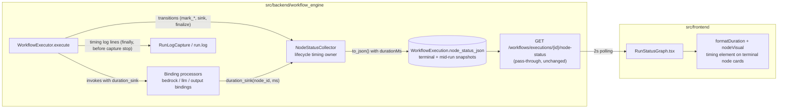

# Design Document

## Overview

This feature adds per-node execution timing to deployed-workflow runs on the edge device. After a run, and live while a run is in progress, each node that reached a terminal Node_Run_Status carries a measured execution duration that is:

1. persisted in the node-status map on the `WorkflowExecution` row (`node_status_json`),
2. served by the existing node-status endpoint as an additive `durationMs` field,
3. displayed with terminal nodes in the Run_Status_Graph ("412 ms" / "3.4 s" / "0 ms"),
4. emitted as exactly one log line per timed node into the per-run log (RunLogCapture).

Timing semantics differ by node kind:

- **Pipeline_Nodes** (GStreamer elements) are timed by the `NodeStatusCollector` as the monotonic interval from the node's first entry into `running` to its first terminal transition.
- **Executor_Binding_Nodes** (bedrock_inference, llm_inference, mqtt_publish, opcua_write, digital_output, ...) are timed around their discrete binding invocation by the executor layer; the invocation duration takes precedence over any lifecycle-derived value.

The work is scoped to the edge device: `src/backend/workflow_engine` and `src/frontend`. No cloud Portal changes. Every timing operation is contained in the established R8.5 discipline — a timing failure can never change a run's outcome, statuses, or API shapes (Requirement 5).

## Architecture

The feature threads timing through the existing run observability path with no new endpoints, tables, or processes:



Data flow per run:

1. `WorkflowExecutor.execute()` builds the collector as today. Every status transition now passes through a single internal collector method that records, per node, the monotonic time of the first `pending → running` entry and — at the node's first terminal transition — the lifecycle duration. This centralization makes the "record exactly once, never overwrite" rule (R1.1) structural rather than scattered across call sites.
2. When the executor runs discrete bindings (Bedrock, LLM, output bindings), it threads a `duration_sink` callable into the processors. Each processor measures its per-binding invocation with the monotonic clock (in a `try/finally`, so error-terminated invocations are timed too, R1.3) and reports `(node_id, elapsed_ms)` to the sink, which records it on the collector as the node's invocation duration. Invocation durations take precedence at serialization time (R1.4).
3. `to_map()`/`to_json()` add an additive `durationMs` integer field to each timed node's entry; `status` and `detail` are untouched (R2.1, R2.4). `run_artifacts.parse_node_status` and the node-status endpoint pass the field through with **zero code change** — they parse and return the JSON verbatim, which also gives pre-feature executions tolerance for free (R2.2, R2.6).
4. To satisfy mid-run availability (R2.5), the executor persists contained, non-finalizing snapshots of the collector map to `node_status_json` at run checkpoints on the executor thread (after the pipeline returns, after the Bedrock block, after the LLM block, after output bindings). The graph's existing 2 s poll then picks up terminal-node timings while the run is active. The terminal persist path (`_persist_node_status`) is unchanged and still finalizes the map, so the finished-run invariants of the prior spec hold as before.
5. In `execute()`'s `finally` block — before `log_capture.stop()`, so on **every** run path and exactly once — the executor emits one `workflow_engine` logger line per node with a recorded duration (R4.1, R4.3).
6. The frontend formats `durationMs` with a small pure helper and renders it on terminal node cards; live updates come for free from the existing react-query polling rerender (R3.7).

### Key design decisions

- **The NodeStatusCollector owns all timing state.** It already sees every lifecycle transition and is the single writer of `node_status_json`, so first-running/first-terminal timestamps and invocation durations live there. This keeps the executor changes to wiring (sinks, snapshots, log emission) and keeps timing fully unit-testable without GStreamer.
- **Centralized status writes.** All five mutation paths (`sink`, `mark_running_all`, `mark_success_all`, `mark_failure`, `finalize`) currently assign `self._statuses[node_id]` directly. They are refactored to call one private `_set_status(node_id, status)` that performs the identical assignment plus timing capture. The observable transition semantics are byte-identical (R5.1); a model-based property test pins this.
- **Two duration stores, precedence at read time.** Lifecycle durations (`_durations_ms`) and invocation durations (`_invocation_durations_ms`) are kept separately; `to_map()` prefers the invocation value. This makes R1.4's precedence rule order-independent — it holds whether the binding invocation completes before or after the node's first terminal transition — with no overwrite logic to get wrong.
- **`duration_sink` mirrors `detail_sink`.** The output-binding handler is invoked through the existing signature-inspection shim, generalized from `_handler_accepts_detail_sink` to accept any keyword, so injected test handlers and plain lambdas keep working unchanged (backward compatibility, R5.2 discipline). The directly-held Bedrock/LLM processors get the same optional-keyword treatment.
- **Mid-run snapshots instead of a live in-memory registry.** The endpoint stays a dumb read of `node_status_json`; snapshots are written only from the executor thread (never from the GStreamer bus thread, avoiding cross-thread SQLAlchemy session use) and are fully contained — a snapshot failure is logged and the run proceeds.
- **Log emission in `finally`.** `execute()` has four terminal paths (pipeline failure, Bedrock failure, output-binding failure, success) plus the outer containment `except`. Emitting the timing lines at the top of the `finally` block, before `log_capture.stop()`, guarantees exactly-once emission inside the capture window on every path (R4.1) without duplicating a call at each return.
- **Formatting duplicated per layer, pinned by twin property tests.** Backend (Python) and frontend (TypeScript) cannot share code; each gets a small pure `format` function implementing the identical rules (R3.3 / R4.2), each pinned by the same property in its own test framework.

## Components and Interfaces

### 1. `NodeStatusCollector` timing (src/backend/workflow_engine/node_status.py)

New internal state (all keyed by nodeId):

```python
self._running_since: Dict[str, float]          # monotonic seconds at first pending->running
self._durations_ms: Dict[str, int]             # lifecycle duration, first terminal transition only
self._invocation_durations_ms: Dict[str, int]  # executor-binding invocation duration (precedence)
```

New/changed methods:

```python
def _set_status(self, node_id: str, status: str) -> None:
    """The single status-write path. Assigns self._statuses[node_id] = status
    (identical to the current direct assignments), then — contained per R1.7 —
    captures timing:
      - first entry into STATUS_RUNNING: _running_since[node_id] = time.monotonic()
      - first entry into a TERMINAL_STATES status: if node_id in _running_since
        and node_id not in _durations_ms:
            _durations_ms[node_id] = max(0, round((now - start) * 1000))
    A node that reaches terminal without ever running records nothing (R1.6).
    Later transitions (mark_failure over warning, finalize re-touches) never
    overwrite (R1.1). Timing capture is wrapped in try/except: on error the
    partial value is discarded and the status assignment stands (R1.7)."""

def record_invocation_duration(self, node_id: Optional[str], duration_ms) -> None:
    """Record an Executor_Binding_Node's invocation duration (R1.3/R1.4).
    Contained (R8.5 style): ignores None/untracked node ids and negative or
    non-numeric durations; stores int(round(duration_ms)). Idempotent per
    node per run: the first recorded invocation duration wins."""

def duration_ms_of(self, node_id: str) -> Optional[int]:
    """The duration to_map() would serialize (invocation value first, else
    lifecycle value, else None). Used by the executor's log emission."""
```

`sink`, `mark_running_all`, `mark_success_all`, `mark_failure`, `finalize` keep their exact signatures, guard conditions, and transition rules; only the final assignment is routed through `_set_status`. `to_map()` adds the field:

```python
entry = {"status": status}
if detail: entry["detail"] = detail
duration = self._invocation_durations_ms.get(node_id,
            self._durations_ms.get(node_id))
if duration is not None:
    entry["durationMs"] = duration        # additive, non-negative int (R2.1, R2.4)
```

Module-level formatting helper (used by the executor's log lines, R4.2):

```python
def format_duration_ms(duration_ms: int) -> str:
    """< 1000 -> '<n> ms' ('0 ms' for 0); >= 1000 -> seconds with exactly one
    decimal place rounded to the nearest tenth, e.g. '3.4 s' (R3.3 rules)."""
```

### 2. `WorkflowExecutor` wiring (src/backend/workflow_engine/pipeline_executor.py)

- **`collector` initialized to `None`** next to `log_capture` at the top of `execute()` so the `finally` block can reference it safely on every path.
- **Duration sink helper**, mirroring `_status_sink`:

```python
@staticmethod
def _duration_sink(collector: Optional[NodeStatusCollector]):
    """(node_id, elapsed_ms) -> collector.record_invocation_duration, or None
    when there is no collector (processors then skip timing entirely,
    keeping the no-collector path byte-identical)."""
```

- **Processor invocations** pass the sink: the Bedrock block calls `self._bedrock_processor.process(document, tag_values, work_dir, duration_sink=...)` and the LLM block likewise — but only when the processor's signature accepts the keyword (same inspection pattern as the handler shim), so injected test doubles keep working. `_run_post_run_handler` / `_invoke_post_run_handler` thread `duration_sink` exactly as `detail_sink` is threaded today; `_handler_accepts_detail_sink` generalizes to `_handler_accepts_keyword(handler, name)`.
- **Mid-run snapshots** (R2.5): a new contained helper

```python
def _persist_node_status_snapshot(self, session, execution, collector) -> None:
    """Write collector.to_json() to execution.node_status_json and commit,
    WITHOUT finalizing or changing any status. Best-effort: any error is
    logged (debug) and swallowed; a failed snapshot never affects the run.
    Called on the executor thread only."""
```

called after `run_pipeline` returns successfully, after the Bedrock block, after `_mark_llm_outcomes`, and after the post-run handler returns. The terminal `_persist_node_status` call remains the authoritative last write and is unchanged.
- **Timing log emission** (R4): a new contained helper called at the top of the `finally` block, before `log_capture.stop()`:

```python
def _emit_timing_logs(self, collector: Optional[NodeStatusCollector]) -> None:
    """Exactly one logger.info line per node with a recorded duration:
        'Node <nodeId> took <formatted>'   e.g. 'Node n3 took 412 ms'
    Iterates participating nodes in collector insertion order. Each line is
    emitted inside its own try/except so one failure cannot suppress the
    remaining lines (R4.4). A None collector emits nothing."""
```

  Because the `finally` block runs exactly once per `execute()` and precedes `log_capture.stop()`, the lines land inside the capture window on every terminal path (R4.1, R4.3).

### 3. Binding processors (src/backend/workflow_engine/output_bindings.py)

All three processors gain an optional trailing keyword `duration_sink: Optional[Callable[[Optional[str], float], None]] = None` (default `None` → behavior byte-identical to today):

- **`BedrockInferenceProcessor.process`**: wraps each `self._run_one(binding, work_dir)` call in a monotonic measurement recorded in a `try/finally`, so the duration is reported both on normal return and when `_run_one` raises (the raise then propagates exactly as today) (R1.3).
- **`LlmInferenceProcessor.process`**: same pattern around `self._run_one(binding, metadata, work_dir)`. LLM binding failures are recorded outcomes rather than raises, so the `finally` simply reports after each invocation.
- **`OutputBindingProcessor.process`**: measurement starts when a binding's actual runner invocation begins (after the gating checks) and is reported in a `try/finally` around the runner call, so error-terminated invocations are timed and the existing per-binding failure collection is untouched. Gated-out / skipped bindings perform no invocation and report no invocation duration — those nodes fall back to the collector's lifecycle timing (criterion R1.1/R1.2 path). Filter/conditional bindings are evaluations, not invocations, and likewise fall back to lifecycle timing.
- A shared private `_emit_duration(duration_sink, node_id, elapsed_ms)` mirrors `_emit_detail`: `None` sink is a no-op; a raising sink is caught and logged at debug, never affecting the binding outcome (R1.7/R5.4).

### 4. API layer (src/backend/workflow_engine/api.py, run_artifacts.py)

**No code change.** `parse_node_status` deserializes `node_status_json` verbatim and the endpoint returns the parsed map, so `durationMs` flows through additively (R2.2), entries without it stay shape-identical (R2.3), and pre-feature rows parse exactly as before (R2.6). New tests pin the pass-through.

### 5. Frontend (src/frontend)

- **`api/WorkflowRegistrationAPI.ts`**: the node-status entry type gains an optional field:

```typescript
export interface NodeRunStatus {
  status: string;
  detail?: string;
  durationMs?: number;   // additive (node-execution-timing R2.1)
}
```

- **`components/deployed-workflow/graph/durationFormat.ts`** (new, pure, dependency-free):

```typescript
/** '412 ms' | '3.4 s' | '0 ms', or null when the value must not be shown.
 *  Returns null for non-numbers, NaN/Infinity, and negatives (R3.8).
 *  rounded = Math.round(ms); rounded < 1000 -> `${rounded} ms`;
 *  else -> `${(ms / 1000).toFixed(1)} s` (nearest tenth, R3.3/R3.4). */
export function formatDuration(durationMs: unknown): string | null;
```

- **`graphGeometry.ts`**: `NodeVisual` gains optional `durationText?: string`; `nodeVisual()` sets it only when the resolved status is terminal (`success`/`warning`/`failure`) **and** `formatDuration(entry?.durationMs)` returns non-null (R3.1, R3.2, R3.5, R3.6, R3.8).
- **`RunStatusGraph.tsx`**: the node card renders the timing next to the status line when present:

```tsx
{visual.durationText && (
  <span data-testid={`node-duration-${visual.id}`}
        style={{ fontSize: 12, color: "#5f6b7a", fontWeight: 400 }}>
    {visual.durationText}
  </span>
)}
```

  No polling changes: `nodeVisual` recomputes on every react-query poll result, so a `durationMs` arriving mid-run renders on that poll's rerender (R3.7).

## Data Models

### Node-status entry (persisted in `WorkflowExecution.node_status_json`, served by the node-status endpoint)

```jsonc
// before (unchanged fields)                 // after
{                                            {
  "n1": { "status": "success" },               "n1": { "status": "success", "durationMs": 412 },
  "n2": { "status": "warning",                 "n2": { "status": "warning", "detail": "…",
          "detail": "…" }                              "durationMs": 3421 },
}                                              "n3": { "status": "failure", "detail": "…" }  // no timing recorded -> no field
                                             }
```

- `status`: unchanged — one of `pending|running|success|warning|failure` (mid-run snapshots may contain non-terminal values; the terminal map is fully terminal exactly as today).
- `detail`: unchanged, optional.
- `durationMs`: **additive**, optional, non-negative integer milliseconds, rounded to the nearest millisecond (R2.1). Present iff a duration was recorded for the node (R2.3). Invocation duration wins over lifecycle duration (R1.4).

No schema/model migration: `node_status_json` is an existing `Text` column; the field lives inside the JSON payload.

### Collector timing state (in-memory, per run)

| Field | Type | Written by | Semantics |
|---|---|---|---|
| `_running_since` | `Dict[str, float]` | `_set_status` on first `running` | monotonic start point (R1.2, R1.5) |
| `_durations_ms` | `Dict[str, int]` | `_set_status` on first terminal transition | lifecycle duration, write-once (R1.1) |
| `_invocation_durations_ms` | `Dict[str, int]` | `record_invocation_duration` | binding invocation duration, precedence (R1.3, R1.4) |

### Duration formatting (shared rules, one implementation per layer)

| Input (int ms) | Output |
|---|---|
| `0` | `"0 ms"` (R3.4) |
| `1..999` | `"<n> ms"` (R3.3) |
| `>= 1000` | seconds, exactly one decimal, nearest tenth: `"3.4 s"` (R3.3) |
| negative / non-numeric | backend: never produced (inputs are recorded non-negative ints); frontend: `null` → no element (R3.8) |

## Correctness Properties

*A property is a characteristic or behavior that should hold true across all valid executions of a system — essentially, a formal statement about what the system should do. Properties serve as the bridge between human-readable specifications and machine-verifiable correctness guarantees.*

### Property 1: Lifecycle timing model

*For any* sequence of collector transition events (sink running/warning signals, mark_running_all, mark_success_all, mark_failure, finalize, in any order) applied with an injected monotonic clock, each node's serialized `durationMs` (absent an invocation duration) equals the clock interval from the node's first entry into `running` to its first terminal transition; it is absent when the node never entered `running` before reaching a terminal state; and it is unchanged by every event after the node's first terminal transition.

**Validates: Requirements 1.1, 1.2, 1.6**

### Property 2: Invocation duration precedence

*For any* tracked node, any non-negative invocation duration, and any interleaving of `record_invocation_duration` with lifecycle transition events (before or after the node's first terminal transition), the node's serialized `durationMs` equals the recorded invocation duration.

**Validates: Requirements 1.3, 1.4**

### Property 3: Binding invocations are timed on success and on error

*For any* compiled document's set of executor bindings where each invocation arbitrarily returns normally or raises, each processor reports exactly one `(nodeId, elapsed_ms)` to the `duration_sink` for every binding it actually invoked — including invocations terminated by an error — and reports none for bindings it skipped; a `None` or raising sink never changes the processor's outcome.

**Validates: Requirements 1.3, 1.7**

### Property 4: Serialization round trip and shape preservation

*For any* collector state (any mix of statuses, details, lifecycle and invocation durations), `parse_node_status(collector.to_json())` yields a map where every entry's `status` and `detail` are exactly those the pre-feature serialization would produce, every node with a recorded duration carries `durationMs` as a non-negative integer, every node without one has no timing key, and any pre-feature map (no timing fields) parses unchanged.

**Validates: Requirements 1.5, 1.8, 2.1, 2.2, 2.3, 2.4, 2.6, 5.2**

### Property 5: Transition non-regression (model-based)

*For any* sequence of collector transition events, the per-node status after every event is identical to the status produced by the pre-feature transition semantics (the status-only model: same guards, same ordering, same finalize resolution).

**Validates: Requirements 5.1, 5.3**

### Property 6: Timing error containment

*For any* sequence of collector transition events executed with a monotonic clock or recording step that raises at arbitrary points, no error propagates, the affected nodes record no partial `durationMs`, and the per-node statuses at every step are identical to the same sequence executed without the injected errors.

**Validates: Requirements 1.7, 5.4**

### Property 7: Duration formatting

*For any* non-negative integer millisecond value, the formatting function returns `"<n> ms"` (whole milliseconds, `"0 ms"` for zero) when the value is under 1000, and the value in seconds with exactly one decimal place rounded to the nearest tenth followed by `" s"` when the value is 1000 or more. (Implemented twice — backend `format_duration_ms`, frontend `formatDuration` — and pinned by this same property in each layer.)

**Validates: Requirements 3.3, 3.4, 4.2**

### Property 8: Node card timing display

*For any* node-status entry, the node visual includes a duration text if and only if the entry's status is terminal (`success`, `warning`, or `failure`) **and** its `durationMs` is a non-negative finite number; when included, the text equals `formatDuration(durationMs)`; pending/running nodes, terminal nodes without the field, and entries with negative or non-numeric values render with their existing status coloring and detail and no timing element.

**Validates: Requirements 3.1, 3.2, 3.5, 3.6, 3.8**

### Property 9: Run-log timing emission

*For any* collector state and any subset of nodes whose individual log emission is made to raise, `_emit_timing_logs` emits exactly one line to the `workflow_engine` logger for each node with a recorded duration whose emission did not raise, emits no line for any node without a recorded duration, states the node's `nodeId` and its Property-7-formatted duration in each line, and propagates no error.

**Validates: Requirements 4.1, 4.2, 4.3, 4.4**

## Error Handling

Every timing code path follows the workflow engine's established containment discipline (R8.5 style; here Requirements 1.7, 4.4, 5.4):

| Failure | Handling | Run impact |
|---|---|---|
| Clock read / timing capture raises inside `_set_status` | `try/except` around the timing portion only; the status assignment always completes; partial value discarded; debug log | none — statuses identical to a no-error run (Property 6) |
| `record_invocation_duration` gets None/untracked node, negative or non-numeric value, or raises internally | value ignored / caught; debug log | none |
| `duration_sink` raises inside a processor | caught by `_emit_duration` (mirrors `_emit_detail`); debug log | binding outcome unchanged (Property 3) |
| Mid-run snapshot persist fails (DB error) | caught in `_persist_node_status_snapshot`; session rollback best-effort; debug log | run proceeds; terminal persist still authoritative |
| One timing log line raises | per-line `try/except` in `_emit_timing_logs`; remaining lines still attempted (R4.4) | terminal state unchanged (Property 9) |
| Whole `_emit_timing_logs` / collector missing | outer guard; `None` collector emits nothing | none |
| Pre-feature execution row (no timing fields) | `parse_node_status` pass-through, unchanged code | endpoint returns the map without timing fields, no error (R2.6) |
| Frontend receives negative / non-numeric / missing `durationMs` | `formatDuration` returns `null`; `nodeVisual` omits `durationText` | node renders exactly as today (R3.6, R3.8) |

Timing failures are recorded only as log entries (debug/exception logs), never as run state (R5.4). No new exception types are introduced.

## Testing Strategy

The feature is well suited to property-based testing on both layers: the collector timing model, serialization, formatting, and view-model logic are pure or deterministic over injectable inputs (event sequences, fake clocks, generated maps).

### Backend (pytest + hypothesis, `test/backend-test/workflow_engine/`)

- **Property tests** — one test per design property (Properties 1–7, 9), following the existing `test_property_*.py` naming. Each test uses hypothesis with **at least 100 examples** (hypothesis's default `max_examples=100`; stated explicitly via `@settings` where a profile could lower it) and carries the tag comment:
  `# Feature: node-execution-timing, Property N: <property text>`
  - Properties 1, 2, 5, 6: generated transition-event sequences against a `NodeStatusCollector` with an injected fake monotonic clock (monkeypatched `time.monotonic`); Property 5 compares against a minimal status-only reference model of the pre-feature semantics.
  - Property 3: generated executor-binding documents with stub runners/clients that randomly succeed or raise, asserting `duration_sink` calls per processor.
  - Property 4: generated collector states round-tripped through `to_json` → `run_artifacts.parse_node_status`, plus generated pre-feature maps (no timing keys).
  - Property 7: generated non-negative ints through `format_duration_ms`.
  - Property 9: generated collector states with a logger capture and per-node injected emission failures.
- **Example/integration tests** (unit-test scope, no device dependencies):
  - R2.5 mid-run availability: drive `WorkflowExecutor.execute()` with the existing stubbed-session/manager test harness and assert `node_status_json` snapshots containing `durationMs` for terminal nodes are committed before the terminal persist.
  - R4.1 capture-window placement: an executor-flow test asserting the timing lines are present in the captured run log file (RunLogCapture active) on both the success and a failure path.
  - Endpoint pass-through example: node-status endpoint returns `durationMs` verbatim and returns pre-feature rows unchanged.
- **Non-regression** (R5.5): the full existing backend suite must pass with no modified assertions; the collector refactor is additionally pinned by Property 5.

### Frontend (jest via react-scripts + fast-check 3.23.2, alongside the existing graph tests)

- **Property tests** with fast-check configured with `numRuns: 100` and the same tag comment format:
  - Property 7: `durationFormat.property.test.ts` — generated non-negative ints; plus generated negatives/non-numbers asserting `null`.
  - Property 8: `graphGeometry` `nodeVisual` over generated status entries (arbitrary statuses × arbitrary `durationMs` values including negatives, NaN, strings, absent).
- **Example tests** (React Testing Library, following `RunStatusGraph.preview.test.tsx` conventions):
  - R3.1/R3.4: a rendered graph shows `node-duration-<id>` for a success node with `durationMs`, including the `0 ms` case.
  - R3.7: rerender with an updated node-status query result (mocked API) makes a newly arrived `durationMs` appear without reload.
  - R3.5/R3.6: no timing element for running nodes and for terminal nodes without the field.
- **Non-regression** (R5.5): the existing frontend suite (including the preservation tests) passes unmodified.

### Test configuration requirements

- Use hypothesis (backend) and fast-check (frontend) — no hand-rolled property runners.
- Minimum 100 iterations per property test.
- Each property test implements exactly one design property and references it with the tag comment `**Feature: node-execution-timing, Property {number}: {property_text}**`.

### On-device verification (required before commit — builds.md gate)

This change runs on the edge device (workflow engine + on-device frontend), so per the builds steering it **must be verified on real hardware before commit**, not only in unit tests:

1. Build the LocalServer component for the target arch and deploy (or hot-patch for iteration) to the available JP7 device (**jetson-thor1**).
2. Run a deployed workflow containing both node kinds (a pipeline path plus at least one executor binding, e.g. llm_inference or mqtt_publish) and verify end-to-end: timings appear on terminal nodes in the Run_Status_Graph (live during the run via polling and after completion), the node-status endpoint returns `durationMs`, exactly one timing line per timed node appears in "View run log", and a pre-feature execution's run view still renders.
3. Confirm the backend stays healthy for a sustained period (no crash/restart loop), then commit stating what was verified on which device.

No preservation-tracked files (docker-compose, Dockerfiles, requirements.txt, recipes, setup_station.sh) are touched by this design, so no security-gate baseline updates are expected.
