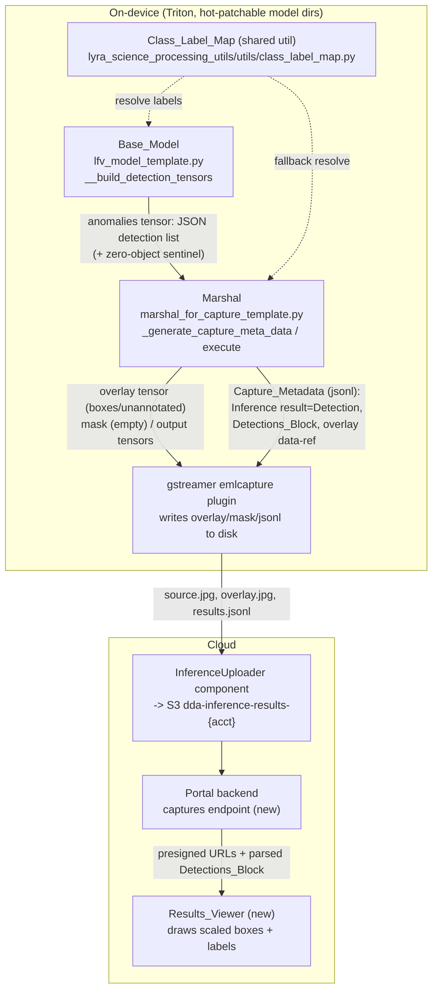

# Design Document

## Overview

Object-detection support already flows end-to-end through the DDA pipeline by *reusing* the anomaly-classification output contract: the Base_Model (`lfv_model_template.py`) serializes a JSON list of `ObjectDetectionResult`s into the existing variable-length `anomalies` tensor, and the Marshal (`marshal_for_capture_template.py`) recognizes that payload by the presence of a `bounding_box` field and emits a `detections` block into the capture metadata. This design finishes the *visualization and surfacing* work so a detection result becomes a first-class, human-readable, visually rendered result, while keeping the anomaly-classification path byte-for-byte compatible.

The work splits into four grounded areas plus a cross-cutting compatibility guarantee:

1. **Detection result typing** in `Capture_Metadata` — a detection-specific `Inference result` value distinct from `"Anomaly"`/`"Normal"`, a detected-object count, top-confidence-as-capture-confidence, and always emitting the `Detections_Block` for detection captures.
2. **Reliable overlay** — move the overlay `Auxiliary_Output_Reference` out of the anomaly-mask-only branch so detection captures (which carry an empty mask) always get the `{capture_id}.overlay.jpg` data-ref, including the zero-object case, and reconcile the on-disk file written by the gstreamer capture plugin with the metadata file-ref so the referenced file always exists.
3. **Human-readable class labels** — a shared `Class_Label_Map` (COCO index → name) with fallback to the index string, retaining the original `Class_Index`, used in the block and drawn on the overlay, sourced from the model manifest where present.
4. **Portal rendering** — a Results_Viewer that obtains detection data (Detections_Block and/or overlay image), draws boxes + labels scaled from source-image pixel coordinates to displayed dimensions, handles the no-objects case, and leaves anomaly presentation unchanged.

### Research findings that shaped this design

- **The detection data layer is already correct.** `TritonPythonModel.__build_detection_tensors` (base model) emits detections via the `anomalies` tensor, sets `output=1` when any detection exists, and carries the top detection confidence in `output_confidence`/`output_score`. Task routing keys on the manifest `task=object_detection`. No tensor-contract change is required (Requirement 5.1).

- **The `Inference result` typing bug is in the Marshal.** `_generate_capture_meta_data` sets `inf_result["Inference result"]` to `"Anomaly"` whenever the numeric `inference_output` is truthy. Detection captures set `output=1`, so today a detection capture is mislabeled `"Anomaly"`. This is the change point for Requirement 1.

- **The overlay reference is trapped in the mask-only branch.** The overlay `Auxiliary_Output_Reference` is appended *only* inside `if self._has_anomaly_mask(...)`. Detection captures have an empty mask, so they never get an overlay data-ref today. This is the change point for Requirement 2.

- **The overlay JPEG bytes are written to disk by the gstreamer capture plugin, not the Marshal.** `pipeline_builder._add_post_processing_plugins` wires `emlcapture` with `triton_inference_output_overlay:file-target_{workflowOutputPath}-overlay.jpg`. The Marshal only *produces* the `overlay` tensor; the plugin writes it. The metadata data-ref (`file://{capture_folder}/{capture_id}.overlay.jpg`) and the plugin's on-disk target already coincide for the anomaly path (that is why anomaly overlays render today), so detection reuses the exact same path convention — the only fix needed is emitting the ref under the right condition **and** ensuring the Marshal always emits a non-empty `overlay` tensor for detection captures so the plugin has bytes to write.

- **A real gap: zero-object detection captures are indistinguishable from anomaly captures.** `_is_detection_list` requires a non-empty list whose first element carries a `bounding_box`. When a detection model finds nothing, `__build_detection_tensors` serializes `[]`, which is byte-identical to the anomaly "no anomalies" payload. The Marshal therefore cannot recognize a zero-object detection capture, cannot type it as a detection, and falls through to the empty-overlay branch — violating Requirements 1.1, 2.4, and 2.5. This design resolves that with a **zero-object sentinel** (see Design Decision 1).

- **The portal has no capture/results viewer today.** Inference results (source `.jpg`, `.overlay.jpg`, `.mask.png`, and the results `.jsonl` metadata) are pushed to an S3 bucket (`dda-inference-results-{account_id}`) by the opt-in `aws.edgeml.dda.InferenceUploader` component. The frontend has an S3 image-preview pattern (`ImagePreview.tsx` + `datasets.get_image_preview` presigned URLs) but nothing that parses capture metadata or renders boxes. Requirement 4 therefore introduces a Results_Viewer plus a portal-backend capture endpoint, reusing the presigned-URL pattern.

### Key design decisions

**Design Decision 1 — Zero-object detection sentinel (reuse-preserving).**
Both the Base_Model and Marshal are ours and hot-patchable, and Requirement 5.5 binds us to "presence of a `bounding_box` field" as the sole discriminator. To make a zero-object detection capture recognizable *without* adding/removing tensors, the Base_Model, under `task=object_detection`, emits a **single sentinel entry** carrying an (empty) `bounding_box` when there are no real detections:

```json
[{"bounding_box": [], "class": "", "class_label": "", "confidence": 0.0, "no_objects": true}]
```

`_is_detection_list` then returns true (list, non-empty, dict, has `bounding_box`), so the Marshal types the capture as a detection, counts **valid** boxes only (a 4-element `bounding_box`) → count `0`, draws an **unannotated** overlay, and emits a `Detections_Block` with an empty detection map. This satisfies "regardless of the number of detected objects" (1.1), the empty-mask overlay ref (2.4/2.5), and the sole-discriminator rule (5.5). Only the *JSON content* of the `anomalies` tensor changes, never the tensor set. *Rationale:* the alternative (a new tensor or a manifest round-trip into the Marshal) would break the no-rebuild constraint.

**Design Decision 2 — Label sourcing in the Base_Model, defensive fallback in the Marshal.**
The `Class_Label_Map` lives in a shared util importable by both models. The Base_Model has manifest access, so it *sources* the map (manifest `class_names`/`dataset.class_names` if present, else default COCO) and embeds a resolved `class_label` alongside the retained numeric `class` (index) in each serialized detection. The Marshal *consumes* `class_label`, and if it is missing/empty it re-resolves via the shared util and finally falls back to the `Class_Index` string. This gives a single source of truth, per-model overridability, and guarantees Requirement 3.3's fallback even for hot-patched mixed versions.

**Design Decision 3 — Portal prefers the structured Detections_Block, with the server overlay as a toggle.**
The Results_Viewer draws boxes itself from the `Detections_Block` (scaled to display size) so labels are crisp and interactive, and offers the server-rendered `{capture_id}.overlay.jpg` as a "view overlay" toggle (Requirement 4.3). This keeps rendering resolution-independent and lets the no-objects case show the raw source image with an explicit indicator.

## Architecture



**Layering and change isolation.** The tensor contract (names/dtypes) is frozen (Requirement 5.1). All backend behavior changes are confined to (a) the Base_Model detection-tensor builder, (b) the Marshal metadata/overlay logic, and (c) a new shared label-map util — all of which are copied into deployed model version directories and are therefore hot-patchable without a Triton or ensemble rebuild. The gstreamer plugin wiring and path conventions are unchanged. The anomaly path is guarded so it is exercised identically when no `bounding_box` field is present.

## Components and Interfaces

### 1. Base_Model — `__build_detection_tensors` (`lfv_model_template.py`)

Changes:
- Resolve a human-readable label per detection using the shared `Class_Label_Map` sourced from the manifest, embedding `class_label` while retaining the numeric `class`.
- When `detections` is empty, emit the **zero-object sentinel** list (Design Decision 1) instead of `[]`.

Interface (unchanged tensor signature):
```python
def __build_detection_tensors(self, inference_output, input_np) -> list[pb_utils.Tensor]:
    # emits: output, output_confidence, output_score, mask (empty), anomalies (JSON)
```
Label sourcing helper (new, private):
```python
def __load_class_names(self, model_dir: str) -> dict[str, str] | None:
    # returns manifest 'class_names' / dataset.class_names mapping if present, else None
```

### 2. Class_Label_Map — shared util (`lyra_science_processing_utils/utils/class_label_map.py`, new)

```python
COCO_CLASS_LABELS: dict[int, str]  # canonical COCO index -> name

def resolve_class_label(class_index, class_map: dict | None = None) -> str:
    """Return the mapped label for class_index if present in class_map (or the
    default COCO map), otherwise the class_index rendered as a string.
    Accepts int or numeric-string indices; never raises."""
```
*Location rationale:* `utils/` already hosts `object_detection_result.py` and is importable by both Triton models (the base model already puts the app root and its own dir on `sys.path`).

### 3. Marshal — `_generate_capture_meta_data` and `execute` (`marshal_for_capture_template.py`)

Changes to `_generate_capture_meta_data`:
- **Detection typing:** when `_is_detection_list(inference_anomalies)`, set `inf_result["Inference result"] = "Detection"` and set `class-name`/`anomaly-label-detected` to the detection form (see Data Models), never `"Anomaly"`/`"Normal"`.
- **Detection summary:** add `inf_result["Detection_count"]` = number of valid detections; when count ≥ 1, `inf_result["Confidence"]` = max object confidence (already carried in `inference_confidence`; asserted/derived here for robustness).
- **Overlay ref relocation:** compute `overlay_present = is_detection OR self._has_anomaly_mask(...)`; append the overlay `Auxiliary_Output_Reference` whenever `overlay_present` (Requirement 2.3/2.4/2.6). Keep the anomaly-mask ref/metadata exactly as today.
- **Detections_Block:** for each *valid* detection, emit `{ "class_index": <original>, "class_label": <resolved>, "bounding_box": [...], "confidence": <f> }`. Filter the sentinel (empty box) so the block reflects real objects (Requirements 3.1, 3.5).

Changes to `execute`:
- The detection branch already draws boxes and emits an empty mask. With the sentinel, `_is_detection_list` is true even for zero objects, so `_generate_detection_overlay` runs and returns an **unannotated copy** (it skips entries without a 4-element box), guaranteeing a non-empty `overlay` tensor for the plugin to write (Requirements 2.1, 2.5).

Changes to `_generate_detection_overlay`:
- Draw the resolved `class_label` (not the numeric index) plus confidence (Requirement 3.4).

### 4. Portal backend — captures endpoint (new)

A Lambda-backed endpoint (mirroring `datasets.get_image_preview`) that, given a device/usecase and capture prefix in the inference-results bucket:
- lists capture artifacts, parses the results `.jsonl` `Capture_Metadata`,
- returns per capture: `inference_result_type`, `detection_count`, the parsed `Detections_Block`, and presigned URLs for the source image and `overlay.jpg` (and `mask.png` for anomaly captures).

```
GET /captures?usecase_id&device_id&prefix&limit
-> { captures: [ { capture_id, inference_result_type, detection_count,
                   detections: [...], source_url, overlay_url, mask_url } ], ... }
```

### 5. Portal frontend — Results_Viewer (new component)

`ResultsViewer.tsx` renders a selected capture:
- **Detection capture:** `` of the source (presigned) with an absolutely-positioned `<svg>` overlay of `<rect>` + `<text>` per box, scaled from source pixel coords to rendered size via `naturalWidth/naturalHeight` vs the element's rendered `clientWidth/clientHeight` (Requirement 4.6). Each box shows `class_label` + confidence (4.2). A toggle switches to the server `overlay.jpg` (4.3).
- **Zero objects:** source image with a "No objects detected" indicator (4.5).
- **Anomaly capture:** delegates to the existing anomaly presentation (mask overlay) unchanged (4.4).

Pure helper (unit/property-testable, framework-free):
```ts
export function scaleBox(
  box: [number, number, number, number],
  src: { w: number; h: number },
  disp: { w: number; h: number }
): { x: number; y: number; w: number; h: number }
```

## Data Models

### Detection payload in the reused `anomalies` tensor (Base_Model → Marshal)

Non-empty case (per object), extended with `class_label` while retaining `class`:
```json
{ "bounding_box": [x_min, y_min, x_max, y_max],
  "class": "17", "class_label": "dog",
  "confidence": 0.83, "confidence_threshold": 0.5 }
```
Zero-object sentinel (Design Decision 1):
```json
[ { "bounding_box": [], "class": "", "class_label": "", "confidence": 0.0, "no_objects": true } ]
```

### Capture_Metadata — detection form (Marshal output)

`inference result` object inside `deviceFleetAuxiliaryOutputs`:
```json
{ "Inference status": "success",
  "Inference result": "Detection",
  "Detection_count": 2,
  "Confidence": 0.83,
  "Anomaly_score": 0.83,
  "Anomaly_threshold": 1.0,
  "Error msg": "" }
```
`Detections_Block` entry (retains index + human-readable label):
```json
{ "detections": {
    "0": { "class_index": "17", "class_label": "dog",
           "bounding_box": [12, 40, 220, 310], "confidence": 0.83 } } }
```
Overlay `Auxiliary_Output_Reference` (emitted for all detection captures and mask-bearing anomaly captures):
```json
{ "data-ref": "file://{capture_folder}/{capture_id}.overlay.jpg",
  "encoding": "NONE", "observedContentType": "overlay.jpg" }
```

### Anomaly form — unchanged

For any payload with no `bounding_box` field, `Inference result` is `"Anomaly"`/`"Normal"`, the mask ref/metadata and anomaly block are produced exactly as today, and the overlay ref is emitted only when an anomaly mask is present (Requirement 6 behavior preserved).

## Correctness Properties

*A property is a characteristic or behavior that should hold true across all valid executions of a system — essentially, a formal statement about what the system should do. Properties serve as the bridge between human-readable specifications and machine-verifiable correctness guarantees.*

The following properties were derived from the acceptance criteria via the prework analysis and consolidated to remove redundancy. UI-rendering criteria (4.1–4.5), the specific overlay-drawing detail (3.4), and the structural tensor-set check (5.1) are covered by example/component/smoke tests in the Testing Strategy rather than as universal properties.

### Property 1: Detection payloads are distinguished solely by a bounding_box field

*For any* reused `anomalies` payload, the Marshal classifies the capture as a Detection_Result if and only if the payload is a non-empty list whose entries carry a `bounding_box` field (including the zero-object sentinel), and otherwise treats it as an anomaly payload.

**Validates: Requirements 1.1, 5.5**

### Property 2: Detection captures receive a distinct inference-result type

*For any* capture classified as a Detection_Result, the Marshal sets the `Inference result` in the Capture_Metadata to the detection-specific value (`"Detection"`) and never to the anomaly-classification value (`"Anomaly"` or `"Normal"`).

**Validates: Requirements 1.2, 1.3**

### Property 3: Detection count and top confidence are reported

*For any* detection payload, the reported `Detection_count` equals the number of valid detected objects (entries with a 4-element `bounding_box`; the zero-object sentinel yields 0), and *for any* detection payload with at least one valid object, the reported capture confidence equals the maximum confidence among the detected objects.

**Validates: Requirements 1.4, 1.5**

### Property 4: The Detections_Block is emitted and retains index plus label

*For any* detection capture, the Marshal emits a `Detections_Block` into `deviceFleetAuxiliaryOutputs`, and every entry retains the original `Class_Index` and includes a human-readable `Class_Label`.

**Validates: Requirements 1.6, 3.1, 3.5**

### Property 5: Class-label resolution falls back to the index string

*For any* `Class_Index` and any `Class_Label_Map`, the resolved `Class_Label` equals the mapped name when the map contains an entry for that index, and otherwise equals the `Class_Index` rendered as a string.

**Validates: Requirements 3.2, 3.3**

### Property 6: Detection captures always get an overlay reference of source dimensions

*For any* detection capture with an empty anomaly mask (including the zero-object case), the Marshal includes an Overlay_Image `Auxiliary_Output_Reference` in `deviceFleetAuxiliaryOutputs`, and the generated overlay image has the same dimensions as the source capture image (unannotated when there are no detected objects).

**Validates: Requirements 2.1, 2.3, 2.4, 2.5**

### Property 7: Anomaly-classification behavior is unchanged

*For any* payload that does not contain a `bounding_box` field, the Capture_Metadata and auxiliary outputs produced by the Marshal (including the mask-based overlay reference) are identical to the pre-detection ("legacy") behavior, and the Base_Model emits the same output tensors it produced before object-detection support was added.

**Validates: Requirements 1.7, 2.6, 5.3, 5.4**

### Property 8: Box coordinates scale proportionally to the displayed image

*For any* bounding box expressed in source-image pixel coordinates and any source/display dimensions, `scaleBox` produces coordinates equal to the source coordinates multiplied by the width and height ratios; in particular, when the display dimensions equal the source dimensions the box is unchanged, and a box within source bounds remains within display bounds.

**Validates: Requirements 4.6**

### Property 9: Missing task defaults to anomaly

*For any* model manifest that omits the `task` field, the Base_Model's task loader resolves to the anomaly task.

**Validates: Requirements 5.2**

## Error Handling

- **Malformed / partial detection entries (Marshal).** `_generate_detection_overlay` and the Detections_Block builder skip entries without a valid 4-element `bounding_box` (including the zero-object sentinel) rather than raising, so a malformed entry degrades to "not drawn / not counted" instead of failing the capture. Coordinates are clamped to image bounds as they are today.
- **Missing/invalid class label.** `resolve_class_label` never raises: a missing map entry or a non-numeric index falls back to the index string; a missing `class_label` in the payload triggers Marshal-side re-resolution then the string fallback (Property 5).
- **Manifest read failures (Base_Model).** `__load_task` and the new `__load_class_names` follow the existing pattern: on `OSError`/`ValueError` they log a warning and return safe defaults (`anomaly` task; `None`/COCO map), preserving backward compatibility (Property 9).
- **Overlay encode failure.** `_encode_overlay` already logs and returns an empty array on `cv2.imencode` failure; in that case no bytes are written and the data-ref would dangle. To avoid a dangling ref, the Marshal emits the overlay `Auxiliary_Output_Reference` only when overlay bytes were successfully produced; on encode failure it logs and omits the ref for that capture.
- **Zero-object confidence.** With no valid objects, capture confidence is reported as `0.0` and `Detection_count` as `0` (sentinel path), with no box drawn.
- **Portal — missing artifacts.** The captures endpoint tolerates a missing `overlay.jpg`/`mask.png` (returns `null` URLs) and a missing/parse-failed `Detections_Block` (returns empty detections); the Results_Viewer then shows the source image with the no-objects indicator and disables the overlay toggle. Presigned-URL generation failures are logged and skipped, mirroring `get_image_preview`.
- **Portal — image not yet loaded.** `scaleBox` guards against zero/undefined natural dimensions (returns unscaled/no-op) so boxes are only drawn once the image reports valid `naturalWidth/naturalHeight`.

## Testing Strategy

Property-based testing **is appropriate** for the backend of this feature: the Marshal metadata classification, count/confidence aggregation, label resolution, overlay-reference logic, and anomaly backward-compat equivalence are pure functions over structured inputs with universal properties, and the portal box-scaling is a pure function. UI rendering is covered by component/snapshot tests, and the on-disk overlay write (performed by the gstreamer plugin) is covered by integration/smoke tests.

### Backend (Python) — property + unit tests

- **Library:** `hypothesis` (already in use in this repo; `.hypothesis/` cache present) with `pytest`.
- **Configuration:** each property test runs **minimum 100 iterations** (`@settings(max_examples=100)` or higher).
- **Tagging:** each property test is tagged with a comment `# Feature: object-detection-visualization, Property {number}: {property_text}` and references the design property it implements.
- **One property → one property-based test:**
  - P1 → generate anomaly-shaped and detection-shaped payloads (incl. sentinel); assert classification matches presence of a `bounding_box` field.
  - P2 → detection payloads → `Inference result == "Detection"` and never `"Anomaly"`/`"Normal"`.
  - P3 → random object lists (incl. sentinel) → `Detection_count` equals valid-box count; non-empty → capture confidence equals max.
  - P4 → detection payloads → block present; each entry has `class_index` (original) and `class_label`.
  - P5 → random index + map → mapped label when present else `str(index)`.
  - P6 → detection payloads (incl. sentinel), empty mask → overlay ref present and overlay dims equal source dims.
  - P7 → **model-based/equivalence**: for any anomaly payload, current Marshal output equals a captured legacy baseline (and base-model anomaly tensor set/values match); this is the primary backward-compatibility guard.
  - P9 → random manifests lacking `task` → `__load_task` returns anomaly.
- **Unit / example / edge / integration / smoke tests:**
  - Example: a single labeled box is drawn with `class_label` + confidence on the overlay (3.4); one-object end-to-end metadata example.
  - Edge: zero-object sentinel → unannotated overlay, count 0, ref present, `Inference result == "Detection"`.
  - Smoke (5.1): base-model detection output tensor names are exactly `{output, output_confidence, output_score, mask, anomalies}`.
  - Integration (2.2): the gstreamer `emlcapture` overlay target path equals the Marshal metadata `data-ref`, and a produced overlay tensor results in an on-disk `{capture_id}.overlay.jpg` (1–2 representative captures).

### Portal frontend (TypeScript) — property + component tests

- **Library:** `vitest` for tests, `tsc` for type-checking; `fast-check` for the property test.
- **Property (P8):** `scaleBox` — for any box and source/display dims, coordinates scale by the width/height ratios; identity when `src == disp`; in-bounds boxes remain in-bounds. Minimum 100 runs; tagged `// Feature: object-detection-visualization, Property 8: ...`.
- **Component/snapshot tests (examples):** Results_Viewer renders N boxes for a detection capture (4.1); each box shows label + confidence (4.2); overlay toggle switches to `overlay.jpg` (4.3); anomaly capture presentation snapshot unchanged (4.4); empty detections shows "No objects detected" (4.5).

### Requirements Traceability

| Requirement | Acceptance Criteria | Covered by |
|---|---|---|
| 1. Detection typing | 1.1 | Property 1 |
| | 1.2, 1.3 | Property 2 |
| | 1.4, 1.5 | Property 3 |
| | 1.6 | Property 4 |
| | 1.7 | Property 7 |
| 2. Reliable overlay | 2.1, 2.3, 2.4, 2.5 | Property 6 |
| | 2.2 | Integration test |
| | 2.6 | Property 7 |
| 3. Class labels | 3.1, 3.5 | Property 4 |
| | 3.2, 3.3 | Property 5 |
| | 3.4 | Example (overlay draw) |
| 4. Portal rendering | 4.1, 4.2, 4.3, 4.4, 4.5 | Component/snapshot tests |
| | 4.6 | Property 8 |
| 5. Backward compatibility | 5.1 | Smoke test |
| | 5.2 | Property 9 |
| | 5.3, 5.4 | Property 7 |
| | 5.5 | Property 1 |
