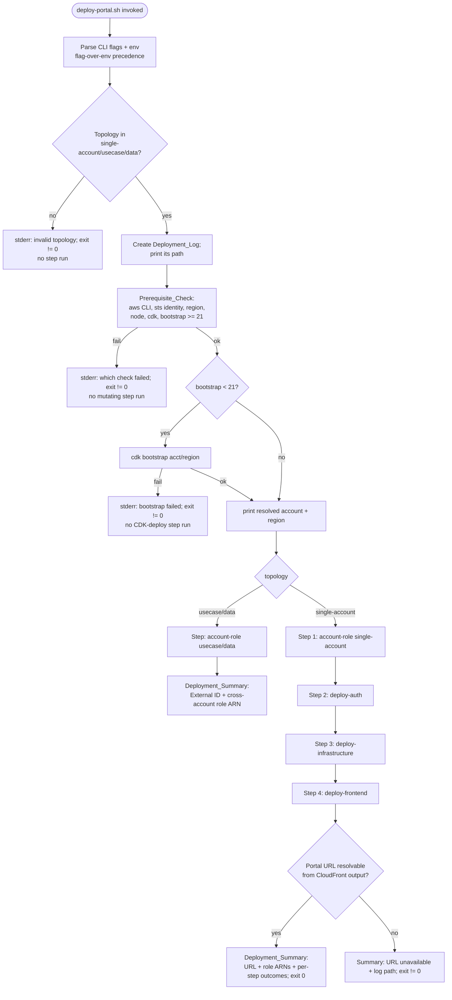
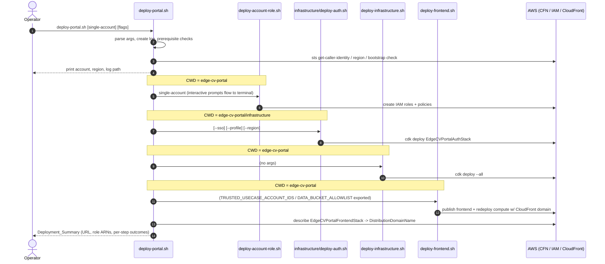

# Design Document: One-Command Portal Deploy

## Overview

Today an operator deploys the Edge CV Portal by running four scripts by hand, in order, from `edge-cv-portal/`:

1. `deploy-account-role.sh` (interactive) — IAM roles, and for multi-account topologies the UseCase/Data CDK stacks.
2. `infrastructure/deploy-auth.sh` — the Cognito `EdgeCVPortalAuthStack`.
3. `deploy-infrastructure.sh` — the main CDK stacks (`cdk deploy --all`).
4. `deploy-frontend.sh` — builds/publishes the frontend and redeploys the compute stack with the CloudFront domain for CORS.

This feature adds a single entrypoint — the **Portal_Deploy_Command**, a new bash script `edge-cv-portal/deploy-portal.sh` — that **orchestrates** those existing scripts in the right order. It does not reimplement any of them, and it does not edit any of them: it invokes them exactly as an operator would, from the working directory each one expects, and lets `deploy-account-role.sh` do all the interactive question-asking it already does (Req 2). Around those invocations the orchestrator adds:

- **Prerequisite checks** performed before any mutating step: AWS CLI, valid credentials, resolved region, Node/CDK, and CDK bootstrap ≥ 21 with auto-bootstrap (Req 3).
- **Topology selection** (`single-account` | `usecase` | `data`) that maps onto `deploy-account-role.sh`'s menu (interactive) or its positional argument (non-interactive) (Req 4).
- **A non-interactive/CI mode** driven by flags and environment variables with flag-over-env precedence (Req 5).
- **Stop-on-failure with no rollback, resumable by re-running**, and a per-step **Deployment_Log** (Req 6).
- **A Deployment_Summary** at the end: Portal URL, created role ARNs, external IDs, and per-step outcomes, with credential secret material excluded (Req 7).
- **Zero regression** of the individual scripts, which remain runnable standalone with byte-for-byte identical contents (Req 8).

### Why bash, and why orchestrate rather than rewrite

Every script being orchestrated is bash, the repo's on-device and steering conventions are bash, and `deploy-account-role.sh` (865 lines of interactive IAM/CDK logic) is the exact flow operators rely on. Reimplementing it would create a second source of truth and violate Req 2/Req 8. The orchestrator is therefore a thin bash driver that shells out to the existing scripts and adds sequencing, checks, logging, and reporting.

### Grounding: what each orchestrated script needs

| Script | Working dir it expects | Key inputs it reads | Notable behavior |
|---|---|---|---|
| `deploy-account-role.sh` | `edge-cv-portal/` (uses relative `infrastructure`, `cd infrastructure`/`cd ..`, writes `*-config.txt` into CWD) | `$1` topology (optional); interactive `read -p` for Portal Account ID, External ID, data buckets; `aws configure get region` | Self-checks AWS CLI + creds; SSM bootstrap check `/cdk-bootstrap/hnb659fds/version`, bootstraps if `<21`; for `usecase`/`data` runs `npx cdk deploy DDAPortalUseCaseAccountStack`/`DDAPortalDataAccountStack`; reuses External ID from `*-config.txt` |
| `infrastructure/deploy-auth.sh` | `edge-cv-portal/infrastructure/` (asserts `cdk.json` in CWD) | `--sso`, `--profile`, `--region`; `SSO_METADATA_URL`, `SSO_PROVIDER_NAME`, `COGNITO_DOMAIN_PREFIX` | `npm install`, build, bootstrap-if-missing, `cdk deploy EdgeCVPortalAuthStack` |
| `deploy-infrastructure.sh` | `edge-cv-portal/` (does `cd infrastructure`) | `aws configure get region`; existing `EdgeCVPortalFrontendStack` CloudFront output | `npm ci`, build, `rm -rf cdk.out`, `cdk deploy --all --require-approval never --force`; passes `-c cloudFrontDomain=` if frontend stack already exists |
| `deploy-frontend.sh` | captures its own `SCRIPT_DIR`, so CWD-independent; operators run it from `edge-cv-portal/` | CDK outputs (Auth/Compute/Frontend stacks); `TRUSTED_USECASE_ACCOUNT_IDS`, `DATA_BUCKET_ALLOWLIST` | Generates `config.json`, builds/publishes frontend, invalidates CloudFront, redeploys `EdgeCVPortalComputeStack` with `-c cloudFrontDomain=` |
| `configure-bucket-cors.sh` | CWD-independent | positional `<bucket-name> <cloudfront-domain>` | Applies S3 CORS |

CDK stack ids (from `infrastructure/bin/app.ts`): `EdgeCVPortalAuthStack`, `EdgeCVPortalStorageStack`, `EdgeCVPortalComputeStack`, `EdgeCVPortalTestRunnerStack`, `EdgeCVPortalNodeDesignerStack`, `EdgeCVPortalFrontendStack`. The Portal URL comes from the `DistributionDomainName` output of `EdgeCVPortalFrontendStack`.

## Architecture

### Orchestration flow (single-account)



Any step exiting non-zero halts the flow immediately (`stop-on-failure`); the orchestrator prints the failed step name and the log path, marks remaining steps `not-run`, and exits non-zero (Req 6.1). No compensating/rollback action is ever taken (Req 6.2).

### Step sequence (single-account)



### Dependency rationale (Req 1.2, 1.4, 4.4)

- **account-role first (single-account).** The compute stack and portal depend on the IAM roles (`DDASageMakerExecutionRole`, `DDAPortalComponentAccessPolicy`, `Greengrass_ServiceRole`) created by `deploy-account-role.sh single-account`; those must exist before the compute stack is deployed (Req 1.4).
- **auth before infrastructure.** `deploy-frontend.sh` reads `EdgeCVPortalAuthStack`'s `AuthConfig` output to write `config.json`; deploying auth before frontend guarantees that output exists. Auth is placed before infrastructure so the entire CDK app is bootstrapped and the auth stack is present before the `--all` deploy runs.
- **infrastructure before frontend.** `deploy-frontend.sh` reads the `EdgeCVPortalComputeStack` `ApiUrl` output and the `EdgeCVPortalFrontendStack` bucket/distribution outputs, all produced by `deploy-infrastructure.sh` (`cdk deploy --all`). Frontend must therefore run last (Req 1.2).
- **usecase/data stop after account-role.** These topologies configure a *separate* account (cross-account role + CDK stack) and do not host the portal frontend/API in that account, so the orchestrator runs only the account-role step and does not run auth/infrastructure/frontend for that account (Req 4.4).

### Interactive vs non-interactive I/O

- **Interactive_Mode (default).** The account-role step is connected so its `read -p` prompts appear on the terminal and read from the terminal, while its output is *also* copied to the Deployment_Log. This is done with a TTY-preserving tee (process substitution: `... > >(redact | tee -a "$LOG") 2>&1`) so stdin stays the terminal and prompts remain visible (Req 2.2, 6.5). Topology is chosen by the operator through the script's own menu (Req 4.1).
- **Non_Interactive_Mode (`--non-interactive` / `PORTAL_DEPLOY_NON_INTERACTIVE=1`).** No prompting occurs on any stream (Req 5.2). Topology is passed as the script's **positional argument** (Req 5.4), which bypasses the interactive menu. For `usecase`/`data`, the underlying script still issues `read -p` calls for Portal Account ID / External ID / data buckets; the orchestrator answers them deterministically by feeding a **constructed stdin stream** whose lines mirror the script's prompt order (see Components). Because we cannot edit the script (Req 8.1), feeding stdin is the mechanism that reuses its prompts without duplicating them.

### Logging and redaction pipeline

Every step's stdout and stderr are appended to a single Deployment_Log (`edge-cv-portal/deploy-portal-<UTC-timestamp>.log` by default; overridable with `--log-file`). The log path is printed before the first step (Req 6.6). Each step's stream passes through a **redaction filter** (a `sed`/`awk` stage) that masks any `aws_secret_access_key`/`aws_session_token`/`AWS_SECRET_ACCESS_KEY`/`AWS_SESSION_TOKEN` assignments before they are written to the log or echoed, providing defense-in-depth for Req 7.4 (the underlying scripts do not print secrets today, but the orchestrator guarantees exclusion regardless).

## Components and Interfaces

`deploy-portal.sh` is organized as a set of bash functions so each unit of logic can be unit/property tested in isolation with the underlying scripts stubbed. Pure-logic functions take arguments and echo results (no global side effects) so they are directly testable.

### 1. Argument + environment resolution

```bash
# resolve_input <flag_value> <env_value> -> echoes the effective value
# Flag wins over env when both are non-empty (Req 5.5); otherwise env; else "".
resolve_input() { local flag="$1" env="$2"; [ -n "$flag" ] && { printf '%s' "$flag"; return; }; printf '%s' "$env"; }
```

CLI surface (parsed by `parse_args`):

| Flag | Env fallback | Maps onto | Requirement |
|---|---|---|---|
| positional `single-account\|usecase\|data` | `PORTAL_DEPLOY_TOPOLOGY` | account-role positional arg | 4.2, 4.3, 5.1 |
| `--non-interactive` | `PORTAL_DEPLOY_NON_INTERACTIVE` | selects stdin-fed path | 5.1, 5.4 |
| `--portal-account-id <id>` | `PORTAL_ACCOUNT_ID` | account-role "Portal Account ID" prompt | 5.1, 5.5 |
| `--external-id <id>` | `EXTERNAL_ID` | account-role "External ID" prompt | 5.1, 5.5, 2.4 |
| `--data-buckets <csv>` | `DATA_BUCKET_NAMES` | account-role "data bucket names" prompt (`data` only) | 5.1 |
| `--sso` | `PORTAL_DEPLOY_SSO` | `deploy-auth.sh --sso` (+ `SSO_*` env) | 5.6 |
| `--profile <name>` | `AWS_PROFILE` | `deploy-auth.sh --profile`; exported for all steps | 8.4 |
| `--region <region>` | `AWS_REGION`/`AWS_DEFAULT_REGION` | `deploy-auth.sh --region`; exported for all steps | 3.4 |
| `--log-file <path>` | — | Deployment_Log path | 6.6 |
| `--help` | — | usage | — |

Environment passthrough left untouched for the frontend step: `TRUSTED_USECASE_ACCOUNT_IDS`, `DATA_BUCKET_ALLOWLIST`, and any `cloudFrontDomain` context — the orchestrator exports the same values the operator set, so the frontend step's compute-stack redeploy produces the same resources as a standalone run (Req 8.4). SSO variables (`SSO_METADATA_URL`, `SSO_PROVIDER_NAME`, `COGNITO_DOMAIN_PREFIX`) are passed through unmodified for the `--sso` path (Req 5.6).

### 2. Topology validation

```bash
# validate_topology <value> -> exit 0 if in {single-account,usecase,data}; else msg on stderr, exit 2
```
Runs before any step; an invalid value is rejected with an error identifying the bad value and a non-zero exit, with no step executed (Req 4.3).

### 3. Non-interactive input validation

```bash
# required_inputs_for <topology> -> echoes the names of inputs required in non-interactive mode
#   single-account: (none beyond topology)
#   usecase:        PORTAL_ACCOUNT_ID, EXTERNAL_ID*    (*optional if a reusable *-config.txt exists)
#   data:           PORTAL_ACCOUNT_ID, EXTERNAL_ID*    (data buckets optional -> auto-config)
# check_required_inputs -> collects EVERY missing/empty required input and reports them
#   in a single message; non-zero exit with no mutating step run (Req 5.3).
```

**External-ID reuse reconciliation (Req 2.4 × Req 5.1/5.3).** In non-interactive mode the orchestrator stats the same config file the script would read (`usecase-account-<acct>-config.txt` / `data-account-<acct>-config.txt`, in the `edge-cv-portal` CWD, `<acct>` = the account resolved during prerequisites). If that file exists and `--external-id`/`EXTERNAL_ID` was not supplied, External ID is treated as **not required** (the script's reuse path will resolve it) and the orchestrator does not override it. If it was supplied, the orchestrator feeds it and declines reuse. This preserves the script's reuse behavior without editing it.

### 4. Prerequisite checks

```bash
# check_prerequisites -> runs all checks; on first failure writes which check failed to stderr,
#   runs NO step, exits non-zero. On success, resolves and echoes ACCOUNT and REGION.
```

Checks, in order (Req 3.1 — all before any mutating step):

1. `command -v aws` — else "AWS CLI not found on PATH", exit ≠ 0 (Req 3.2).
2. `aws sts get-caller-identity --query Account --output text` returns a non-empty, non-`None` account id — else "AWS credentials invalid / identity check failed", exit ≠ 0 (Req 3.3).
3. Region resolved from `--region` → `AWS_REGION` → `AWS_DEFAULT_REGION` → `aws configure get region` → `CDK_DEFAULT_REGION`; empty ⇒ "no AWS region resolved", exit ≠ 0 (Req 3.4).
4. `command -v node` and `command -v cdk` (or `npx cdk`) — else name the missing tool, exit ≠ 0 (Req 3.5).
5. Bootstrap version via `aws ssm get-parameter --name /cdk-bootstrap/hnb659fds/version` (same parameter the existing scripts use). If absent or `< 21`, run `cdk bootstrap aws://<account>/<region>` before any CDK-deploying step (Req 3.6). If bootstrap exits non-zero: "CDK bootstrap failed", no CDK-deploy step runs, exit ≠ 0 (Req 3.7).

On success, exports `AWS_REGION`/`AWS_DEFAULT_REGION`/`CDK_DEFAULT_REGION` (and `CDK_DEFAULT_ACCOUNT`) consistently and prints the resolved account id and region to stdout before the first mutating step (Req 3.8).

### 5. Step runner

```bash
# run_step <step_name> <cwd> <interactive?> [stdin_feed] -- <command...>
#   - prints the step name to stdout (Req 6.4)
#   - runs <command...> from <cwd> (Req 8.3) with stdout+stderr -> redact -> tee -a LOG (Req 6.5)
#   - interactive account-role: TTY-preserving tee so read -p prompts reach the terminal (Req 2.2)
#   - non-interactive: feeds <stdin_feed> on stdin (no terminal prompting) (Req 5.2)
#   - records outcome (success|failure) in STEP_OUTCOMES; on non-zero exit, sets remaining
#     steps to not-run, prints failed step + log path, and returns the failure (Req 6.1)
```

The runner never itself rolls back or deletes anything on failure (Req 6.2). Because the orchestrator uses `set -euo pipefail` and explicit per-step exit-code capture, a failure in any step stops the sequence deterministically.

Working directories (Req 8.3):

- account-role: `edge-cv-portal/`
- deploy-auth: `edge-cv-portal/infrastructure/`
- deploy-infrastructure: `edge-cv-portal/`
- deploy-frontend: `edge-cv-portal/`
- configure-bucket-cors (optional, `data`/manual): CWD-independent

### 6. Account-role invocation (interactive and non-interactive)

Interactive (default): `run_step "account-role" edge-cv-portal true -- ./deploy-account-role.sh "$TOPOLOGY"` — passing the topology positionally still triggers the script's per-topology `read -p` prompts, which flow to the terminal (Req 2.1, 2.2). (Passing the positional value avoids the menu but is equivalent to the operator picking that menu item; interactive prompts for account/external-id/buckets are unchanged.)

Non-interactive: the orchestrator builds a stdin feed matching the script's prompt order for the topology and pipes it in:

```
# usecase (no existing config): line1=PORTAL_ACCOUNT_ID, line2=EXTERNAL_ID
# usecase (existing config, external-id supplied): "n", EXTERNAL_ID   # decline reuse, then value
# usecase (existing config, external-id NOT supplied): "Y"            # reuse resolved id (Req 2.4)
# data: PORTAL_ACCOUNT_ID, [reuse handling as above], EXTERNAL_ID, DATA_BUCKET_NAMES (may be blank)
# single-account: no lines (script prompts nothing after topology)
```

The orchestrator never modifies `deploy-account-role.sh`; it only supplies the inputs the script asks for (Req 2.1, 8.1).

### 7. Output collection + Deployment_Summary

```bash
# resolve_portal_url -> aws cloudformation describe-stacks --stack-name EdgeCVPortalFrontendStack
#   --query "Stacks[0].Outputs[?OutputKey=='DistributionDomainName'].OutputValue" --output text
#   -> "https://<domain>" or "" if missing/None
# collect_role_arns <topology> <account>:
#   single-account: arn:aws:iam::<acct>:role/DDASageMakerExecutionRole,
#                   arn:aws:iam::<acct>:role/Greengrass_ServiceRole  (created by account-role)
#   usecase: ROLE_ARN + EXTERNAL_ID from usecase-account-<acct>-config.txt
#   data:    ROLE_ARN + EXTERNAL_ID from data-account-<acct>-config.txt
# print_summary -> Portal URL (single-account), created role ARNs, external IDs (usecase/data),
#   and EVERY defined step's outcome as exactly one of success|failure|not-run (Req 7.1-7.5).
```

The summary is assembled only from CloudFormation outputs and the `*-config.txt` files the account-role script writes — never from credential material (Req 7.4). If the topology is `single-account` and the Portal URL cannot be resolved after the frontend step, the summary states the URL is unavailable, includes the log path, and the command exits non-zero (Req 7.6).

### 8. Optional npm alias

An optional convenience alias may be added to a top-level `package.json` `scripts` entry (`"deploy:portal": "./edge-cv-portal/deploy-portal.sh"`) if/when a portal-root `package.json` is introduced. It is a thin passthrough only; the canonical entrypoint remains the bash script to match the existing scripts and on-device/steering conventions. No behavior lives in the alias.

## Data Models

The orchestrator is stateless across runs; its "data" is a handful of in-process variables plus the log file and the config files the account-role script already writes.

### Resolved run context (in-memory)

```jsonc
{
  "topology": "single-account | usecase | data",
  "interactive": true,
  "account_id": "123456789012",       // from sts get-caller-identity
  "region": "us-east-1",              // resolved per precedence chain
  "log_file": "edge-cv-portal/deploy-portal-20240101T120000Z.log",
  "inputs": {                          // resolved flag-over-env
    "portal_account_id": "…",
    "external_id": "…",               // may be empty when reusing config
    "data_buckets": "bucketA,bucketB",
    "sso": false,
    "profile": "…", "region": "…"
  },
  "passthrough_env": {                 // exported unchanged for frontend step (Req 8.4)
    "TRUSTED_USECASE_ACCOUNT_IDS": "…",
    "DATA_BUCKET_ALLOWLIST": "…",
    "cloudFrontDomain": "…"
  }
}
```

### Step model

```jsonc
// STEPS_FOR[topology] defines the ordered steps; STEP_OUTCOMES tracks results.
{
  "single-account": ["account-role", "auth", "infrastructure", "frontend"],
  "usecase":        ["account-role"],
  "data":           ["account-role"]
}
// STEP_OUTCOMES[name] in {success, failure, not-run}; initialized to not-run.
```

### Deployment_Summary (printed; also mirrored to log tail)

```
==================== Deployment Summary ====================
Topology:        single-account
AWS Account:     123456789012
Region:          us-east-1
Portal URL:      https://d1234abcd.cloudfront.net        # single-account (Req 7.1)
Created roles:
  - arn:aws:iam::123456789012:role/DDASageMakerExecutionRole
  - arn:aws:iam::123456789012:role/Greengrass_ServiceRole
External IDs:    (usecase/data only) <external-id>        # Req 7.3
Steps:
  account-role     success
  auth             success
  infrastructure   success
  frontend         success
Deployment log:  edge-cv-portal/deploy-portal-…​.log
============================================================
```

### Config file contract (read-only for the orchestrator)

`deploy-account-role.sh` writes `usecase-account-<acct>-config.txt` / `data-account-<acct>-config.txt` containing `PORTAL_ACCOUNT_ID`, `ROLE_ARN`, `EXTERNAL_ID`, and (usecase) `SAGEMAKER_ROLE_ARN`. The orchestrator only *reads* these for the summary and for the reuse reconciliation; it never writes them (that stays the script's job — Req 8.1).

## Correctness Properties

*A property is a characteristic or behavior that should hold true across all valid executions of a system — essentially, a formal statement about what the system should do. Properties serve as the bridge between human-readable specifications and machine-verifiable correctness guarantees.*

These properties describe the orchestrator's own logic and are tested with the five underlying scripts replaced by **stubs** (recording invocation, CWD, arguments, env, and stdin; emitting controllable output/exit codes) and AWS CLI calls stubbed. This isolates the orchestrator's sequencing, input-resolution, gating, reporting, and safety behavior from real cloud effects. Following the prework, redundant criteria have been consolidated (trace/ordering criteria 1.1/1.2/1.4/4.4 into one sequencing property; positional-passthrough 4.2/5.4 into one; summary-identifier 7.2/7.3 into one).

### Property 1: Topology determines the exact ordered step sequence

*For any* selected Deployment_Topology, an all-success run invokes exactly the steps defined for that topology in order: `single-account` invokes account-role, auth, infrastructure, and frontend with account-role before auth, auth before infrastructure, infrastructure before frontend (and therefore account-role before the compute-stack/infrastructure step); `usecase` and `data` invoke only account-role and never invoke auth, infrastructure, or frontend.

**Validates: Requirements 1.1, 1.2, 1.4, 4.4**

### Property 2: All steps succeeding yields a zero exit code

*For any* Deployment_Topology in which every executed step exits zero, the Portal_Deploy_Command exits with code zero.

**Validates: Requirements 1.3**

### Property 3: The prerequisite gate blocks all mutating steps on any failure

*For any* single failing Prerequisite_Check (missing AWS CLI, invalid credentials, unresolved region, missing Node/CDK, or failed bootstrap), the Portal_Deploy_Command invokes no step that creates or modifies AWS resources and exits with a non-zero code.

**Validates: Requirements 3.1, 3.2, 3.3, 3.4, 3.5, 3.7**

### Property 4: Bootstrap runs exactly when the version is missing or below 21

*For any* CDK_Bootstrap_Version value, the Portal_Deploy_Command runs `cdk bootstrap` before any CDK-deploying step if and only if the version is absent or numerically less than 21, and never runs a CDK-deploying step before a required bootstrap completes successfully.

**Validates: Requirements 3.6**

### Property 5: The selected topology is passed to account-role as its positional argument

*For any* Deployment_Topology supplied on the command line (in either interactive or non-interactive mode), the Account_Role_Script is invoked with that topology as its first positional argument rather than through the interactive menu.

**Validates: Requirements 4.2, 5.4**

### Property 6: Invalid topologies are rejected before any step

*For any* topology value that is not one of `single-account`, `usecase`, or `data`, the Portal_Deploy_Command reports an error identifying the invalid value, runs no step, and exits with a non-zero code.

**Validates: Requirements 4.3**

### Property 7: Non-interactive missing inputs are reported completely with no mutating step

*For any* Deployment_Topology and any non-empty subset of that topology's required inputs that is omitted or empty in Non_Interactive_Mode, the Portal_Deploy_Command emits a single failure message naming exactly the omitted required inputs, runs no step that creates or modifies AWS resources, and exits with a non-zero code.

**Validates: Requirements 5.3**

### Property 8: Flag values take precedence over environment values

*For any* input that can be supplied by both a command-line flag and an environment variable, when both are non-empty the resolved value used by the Portal_Deploy_Command (and observed by the invoked script) equals the flag value.

**Validates: Requirements 5.5**

### Property 9: A failing step stops the sequence and reports the failed step and log location

*For any* Deployment_Topology and any step chosen to exit non-zero, no step ordered after it is invoked, the Portal_Deploy_Command prints the failed step's name and the Deployment_Log location, and it exits with a non-zero code.

**Validates: Requirements 6.1**

### Property 10: A fully successful re-run is equivalent to a first-attempt success

*For any* run in which a step first fails and a subsequent re-run has every step exit zero, given idempotent steps the re-run exits zero and produces the same Portal URL and the same set of created role ARNs in its Deployment_Summary as a run in which every step succeeded on the first attempt.

**Validates: Requirements 6.3**

### Property 11: Every step's output is captured in the log and its name is announced

*For any* Deployment_Topology and any content a step writes to standard output or standard error, that step's name is printed to standard output when the step starts and the step's captured output (after secret redaction) appears in the Deployment_Log.

**Validates: Requirements 6.4, 6.5**

### Property 12: Credential secret material never appears in output, log, or summary

*For any* run in which AWS secret access key or session token material is present in the environment or in a step's output, that secret material appears in neither the standard output, the Deployment_Log, nor the Deployment_Summary.

**Validates: Requirements 7.4**

### Property 13: The summary reports each defined step's outcome exactly once

*For any* Deployment_Topology and any outcome sequence (all success, or a failure at any step), the Deployment_Summary assigns every step defined for that topology exactly one outcome from {success, failure, not-run}, with steps before a failure marked success, the failing step marked failure, and steps after it marked not-run.

**Validates: Requirements 7.5**

### Property 14: The summary surfaces the Portal URL and created identifiers

*For any* successful run, the Deployment_Summary includes the CloudFront-derived Portal URL for `single-account` and, for `usecase`/`data`, the External ID and cross-account role ARN resolved from the account-role config file; every created role ARN for the topology appears in the summary.

**Validates: Requirements 7.1, 7.2, 7.3**

### Property 15: Orchestrated script files are never modified

*For any* orchestrated run and any topology, the contents of `deploy-account-role.sh`, `deploy-auth.sh`, `deploy-infrastructure.sh`, `deploy-frontend.sh`, and `configure-bucket-cors.sh` are byte-for-byte identical after the run to their contents before it.

**Validates: Requirements 8.1**

### Property 16: Each step runs from the working directory it expects

*For any* step the Portal_Deploy_Command invokes, that step's process runs with a current working directory equal to the directory the corresponding script uses when run standalone (`edge-cv-portal` for account-role, infrastructure, and frontend; `edge-cv-portal/infrastructure` for auth).

**Validates: Requirements 8.3**

### Property 17: Frontend passthrough values are preserved exactly

*For any* values of `TRUSTED_USECASE_ACCOUNT_IDS`, `DATA_BUCKET_ALLOWLIST`, and the CloudFront-domain input the operator provides, the Frontend_Script is invoked observing values identical to those inputs.

**Validates: Requirements 8.4**

## Error Handling

The orchestrator uses `set -euo pipefail`, captures each step's exit code explicitly, and treats the Deployment_Log as the single record of step output. It never performs compensating or rollback actions (Req 6.2).

### Prerequisite phase (before any mutating step)

| Condition | Behavior | Req |
|---|---|---|
| `aws` not on PATH | stderr "AWS CLI not found on PATH"; no step; exit ≠ 0 | 3.2 |
| `sts get-caller-identity` empty/`None` | stderr credential-validation failure; no step; exit ≠ 0 | 3.3 |
| No region resolvable (flag/env/config chain) | stderr "no AWS region resolved"; no step; exit ≠ 0 | 3.4 |
| `node` or `cdk` missing | stderr naming the missing tool; no step; exit ≠ 0 | 3.5 |
| Bootstrap absent or `< 21` | run `cdk bootstrap aws://<account>/<region>` before CDK-deploy steps | 3.6 |
| Bootstrap invocation fails | stderr "CDK bootstrap failed"; no CDK-deploy step; exit ≠ 0 | 3.7 |

### Input/topology phase

| Condition | Behavior | Req |
|---|---|---|
| Topology not in {single-account, usecase, data} | stderr names the invalid value; no step; exit ≠ 0 | 4.3 |
| Non-interactive with required inputs missing | single message listing every missing input; no mutating step; exit ≠ 0 | 5.3 |
| Both flag and env supplied | flag value used | 5.5 |

### Step execution phase

| Condition | Behavior | Req |
|---|---|---|
| A step exits non-zero | stop before next step; print failed step name + log path; remaining steps → not-run; exit ≠ 0 | 6.1 |
| Prior steps already applied changes | retained; no rollback issued | 6.2 |
| Re-run after failure, all steps succeed | exit 0; same Portal URL + role ARNs as first-attempt success (idempotent steps) | 6.3 |
| Any step output containing secret material | redaction filter masks it before log/stdout | 7.4 |

### Summary phase

| Condition | Behavior | Req |
|---|---|---|
| single-account, Portal URL resolvable | summary includes `https://<domain>` | 7.1 |
| single-account, Portal URL not resolvable after frontend | summary states URL unavailable + log path; exit ≠ 0 | 7.6 |
| usecase/data success | summary includes External ID + cross-account role ARN from config | 7.3 |

## Testing Strategy

The orchestrator is bash, so it is tested with **`bats`** (Bash Automated Testing System) — the standard choice for shell unit/behavior tests — using a **stub harness** that shadows the five deployment scripts and the `aws`, `node`, `cdk`, and `npx` commands via a `PATH`-prepended `bin/` of fake executables. Each stub records its invocation order (append to a trace file), current working directory (`$PWD`), positional arguments, selected environment variables, and any stdin it received, and emits caller-controlled stdout/stderr and exit codes. This lets the sequencing, gating, reporting, and safety properties be exercised deterministically and offline with no AWS account.

Property-based testing applies here because the orchestrator has real input-varying logic (input-precedence resolution, topology validation, missing-input aggregation, step sequencing, per-step outcome computation, and secret redaction). Since there is no mature bash PBT framework, properties are realized as **generator-driven `bats` tests**: a small helper generates randomized inputs (topology strings including invalid ones, distinct flag/env value pairs, arbitrary omitted-input subsets, random failure-step indices, random bootstrap version values, random secret sentinels, and random step output content) and the test asserts the property over each generated case.

### Property tests (generator-driven, ≥ 100 generated cases each)

Each property test runs a minimum of **100 iterations** over generated inputs and is tagged:

```bash
# Feature: one-command-portal-deploy, Property {N}: {property title}
```

- **Property 1** (topology → ordered step set): generate a topology; assert the trace equals the expected ordered step list and the ordering constraints hold; for usecase/data assert auth/infrastructure/frontend stubs are never invoked.
- **Property 2** (all-success → exit 0): all stubs exit 0 across generated topologies; assert exit 0.
- **Property 3** (prereq gate): randomly select one prereq to fail; assert zero mutating-step stubs invoked and non-zero exit.
- **Property 4** (bootstrap threshold): generate version values (absent, `<21`, `≥21`); assert `cdk bootstrap` invoked iff missing or `<21`, and always before any deploy stub.
- **Property 5** (positional passthrough): generate topology + mode; assert account-role stub `$1` equals the topology.
- **Property 6** (invalid topology): generate non-member strings; assert rejection names the value, no steps, non-zero.
- **Property 7** (missing-input aggregation): generate omitted-input subsets per topology; assert the message names exactly that subset, no mutating step, non-zero.
- **Property 8** (flag-over-env): generate distinct flag/env pairs per input; assert the resolved/observed value equals the flag.
- **Property 9** (stop-on-failure): generate a failure-step index; assert no later step runs, message includes step name + log path, non-zero.
- **Property 10** (re-run equivalence): idempotent stubs; compare summary URL + role-ARN set of `[fail-then-clean-rerun]` vs `[clean run]`; assert equal and exit 0.
- **Property 11** (announce + capture): generate step output content; assert each executed step's name is on stdout and its (redacted) output is in the log.
- **Property 12** (secret exclusion): inject random sentinel secret values via env and stub output; assert the sentinels are absent from stdout, log, and summary.
- **Property 13** (per-step outcome): generate failure index (or none); assert each defined step has exactly one outcome consistent with the sequence semantics.
- **Property 14** (summary identifiers): generate CloudFront domains, account ids, and config `ROLE_ARN`/`EXTERNAL_ID`; assert URL and identifiers appear in the summary.
- **Property 15** (scripts unmodified): sha256 all five scripts before/after a run; assert unchanged.
- **Property 16** (working directory): assert each stub's recorded `$PWD` equals the expected directory.
- **Property 17** (frontend passthrough): generate env values; assert the frontend stub observes identical `TRUSTED_USECASE_ACCOUNT_IDS`/`DATA_BUCKET_ALLOWLIST`/CloudFront-domain values.

### Example / edge-case unit tests

Focused single-scenario `bats` tests for the analyzed non-property criteria:

- Missing-tool messages: absent `aws` (3.2), invalid `sts` identity (3.3), unresolved region (3.4), absent `node`/`cdk` naming the tool (3.5), failed bootstrap (3.7).
- Context print: resolved account id + region printed before the first step (3.8).
- Log path printed before the first step banner (6.6).
- Portal URL unavailable after frontend → summary indicates unavailable + log path + non-zero (7.6).
- External-ID reuse reconciliation: with a fake `usecase-account-<acct>-config.txt` present and no `--external-id`, the constructed stdin reuses the resolved id and does not override it (2.4).
- `--sso` passthrough: auth stub receives `--sso` and `SSO_*` env preserved (5.6).
- Account-role is invoked (not reimplemented): orchestrator source contains no duplicated `read -p` prompts for account/external-id (2.1).

### Interactive (pty) tests

A small `expect`/pty harness verifies interactive behavior that cannot be exercised over a plain pipe:

- Interactive topology selection through the account-role menu (4.1).
- Operator responses to account-role prompts flow through to the (stubbed) script (2.2).
- Non-interactive mode with stdin from `/dev/null` never blocks and emits no orchestrator prompts (5.2, 5.1).

### Integration / smoke tests (no PBT)

These verify external-script preservation and real wiring, which are not input-varying and are covered by 1–3 representative runs rather than property tests:

- **Standalone equivalence (8.2, 2.3):** run each orchestrated script standalone against a mocked AWS surface and compare exit code, created/modified files, and (mock-recorded) AWS calls to a baseline captured before the orchestrator existed.
- **End-to-end smoke (single-account):** one full orchestrated run against a mocked/localstack-style AWS surface, asserting the four steps run in order and a Deployment_Summary with a Portal URL is produced.
