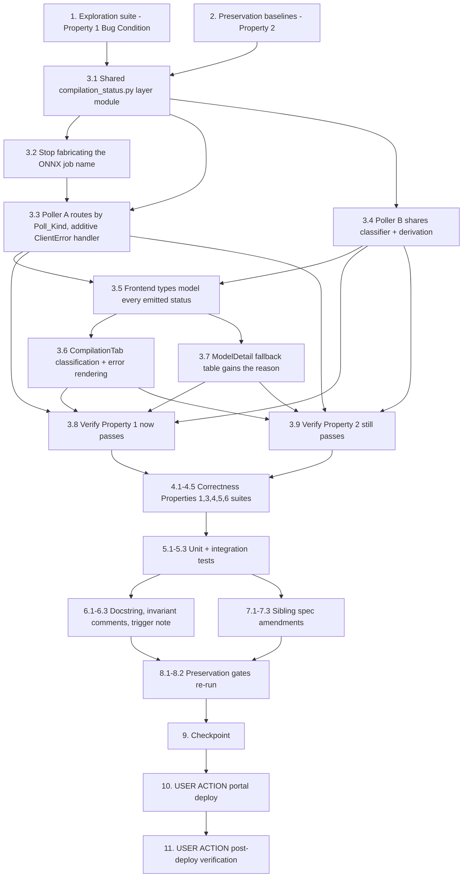

# Implementation Plan

## Overview

Fix the five compounding defects that reduce an ONNX export start failure to the
bare word `ERROR`, using the exploratory bugfix workflow. Write the exploration
suite and the preservation baselines against the UNFIXED tree first, then land
design.md's eight fix steps in their documented order, then encode Correctness
Properties 1-6, append the three documentation-consistency amendments, and
re-run the preservation gates.

Step 1 (the shared `compilation_status.py` layer module) MUST land before every
other code step: steps 2-4 all import from it, and Property 3's totality
assertion and Property 5's "one shared implementation" assertion are
unsatisfiable while `derive_compilation_status` lives only in `compilation.py`
and `models.py` carries its own inline copy.

The primary fix is that **the failure must remain diagnosable**. The hardcoded
`DDASageMakerExecutionRole` ARN and the region-pinned `ONNX_EXPORT_IMAGE`
default are investigated and named as likely triggers (task 6.3) but their
resolution logic is NOT changed.

**Non-goal guard.** No `jetson-xavier-jp7` compile target is added. Task 1 case
9 asserts its absence and MUST keep passing throughout.

Test commands:
- Portal backend suites run from the tests directory so `conftest.py` and the
  layer paths resolve:
  `cd edge-cv-portal/backend/tests && python3 -m pytest <suite> -q -p no:cacheprovider`
- Frontend: single run from `edge-cv-portal/frontend`: `npx vitest run <file>`
- Hypothesis: use the conftest-registered profiles (`portal-fast` 25 examples,
  `HYPOTHESIS_PROFILE=ci` 100) — do NOT hardcode `max_examples`
- The 4 known-acceptable local-only `cdk.out` drift failures under
  `test/backend-test/security/` are pre-existing — do NOT try to fix them (3.21)

New files this plan creates:
- `edge-cv-portal/backend/layers/shared/python/compilation_status.py`
- `edge-cv-portal/backend/tests/test_onnx_compile_diagnostics_exploration.py`
- `edge-cv-portal/backend/tests/test_onnx_compile_diagnostics_properties.py`
- `edge-cv-portal/frontend/src/components/compilationStatus.property.test.ts`
- `edge-cv-portal/frontend/src/components/CompilationTab.diagnostics.test.tsx`

## Task Dependency Graph

```json
{
  "waves": [
    { "wave": 1, "description": "Run on UNFIXED code: the exploration suite surfaces the counterexamples (task 1 FAILS, except case 9 which documents F(X) and must keep passing) and the preservation baselines are observed and recorded (task 2 PASSES).", "tasks": ["1", "2"] },
    { "wave": 2, "description": "Step 1 of the fix: the shared compilation_status.py layer module. Prerequisite for every other code step.", "tasks": ["3.1"] },
    { "wave": 3, "description": "Backend fix steps: stop fabricating the job name, poller A routes by Poll_Kind and never destroys, poller B shares the classifier and derivation.", "tasks": ["3.2", "3.3", "3.4"] },
    { "wave": 4, "description": "Frontend fix steps: type the emitted statuses, then the two rendering surfaces.", "tasks": ["3.5", "3.6", "3.7"] },
    { "wave": 5, "description": "Re-run the task 1 and task 2 suites against the fixed tree.", "tasks": ["3.8", "3.9"] },
    { "wave": 6, "description": "Fix-checking property suites (Correctness Properties 1, 3, 4, 5, 6) plus unit and integration tests.", "tasks": ["4.1", "4.2", "4.3", "4.4", "4.5", "5.1", "5.2", "5.3"] },
    { "wave": 7, "description": "Documentation: the corrected docstring and invariant comments, plus the three sibling amendments.", "tasks": ["6.1", "6.2", "6.3", "7.1", "7.2", "7.3"] },
    { "wave": 8, "description": "Re-run every preservation gate, then checkpoint.", "tasks": ["8.1", "8.2", "9"] },
    { "wave": 9, "description": "USER ACTION: portal deploy, then post-deploy manual verification.", "tasks": ["10", "11"] }
  ]
}
```



## Tasks

- [x] 1. Write bug condition exploration test suite
  - **Property 1: Bug Condition** - Originating reason survives arbitrarily many polls
  - **CRITICAL**: These tests MUST FAIL on unfixed code - failure confirms the bugs exist
  - **DO NOT attempt to fix the tests or the code when they fail**
  - **NOTE**: This suite encodes the expected behavior - it validates the fix when it passes after implementation
  - **GOAL**: Surface counterexamples for all five hypothesized causes; if any is refuted, re-hypothesize before writing a fix
  - Create `edge-cv-portal/backend/tests/test_onnx_compile_diagnostics_exploration.py` following `edge-cv-portal/backend/tests/test_vllm_packaging_dispatch.py`: a module-scoped fixture on the moto-backed `aws_stack`, its own training-jobs table (`test-training-jobs-onnx-diagnostics`) created with the production key shape, and `compilation.py` / `models.py` loaded INSIDE the mock so their module-level boto3 clients are intercepted
  - Stub `sagemaker_usecase` to behave like the service: `create_training_job` raises a chosen `ClientError`; `describe_compilation_job` raises `ValidationException` for any name it was not seeded with; `describe_training_job` answers only for seeded training-job names. Record every describe call so the suite can assert on call counts and API choice
  - Case 1 - **Reason destroyed on the first poll** (`isBugCondition_2`, the core bug): drive `start_compilation_job` with `targets=['onnx']` and a raising `create_training_job`; assert the record carries the originating error; run `get_compilation_status` ONCE; assert the originating error is STILL the recorded reason. On unfixed code observe the `ValidationException` for `{safe_model_name}-onnx-failed` in its place
  - Case 2 - **Reason survives N polls** (property form): over generated error strings and N ≥ 1, the reason after N polls still contains the original string. On unfixed code observe failure at N = 1
  - Case 3 - **No-live-job entry is never described** (`isBugCondition_1`): assert ZERO `describe_compilation_job` and ZERO `describe_training_job` calls for the ONNX failure entry. On unfixed code observe one doomed `describe_compilation_job` for the sentinel name
  - Case 4 - **Terminal status not overwritten**: assert the entry's status is still `Failed` (not `ERROR`) after a poll. On unfixed code observe `ERROR`
  - Case 5 - **Transient fault on a healthy Neo job**: seed an `INPROGRESS` `jetson-xavier-jp6` entry with a pre-existing `failure_reason`, make `describe_compilation_job` raise `ThrottlingException`, and assert the recorded status is not a terminal `Failed`, the `failure_reason` is intact, and `derive_compilation_status` does not return `'Failed'`. On unfixed code observe the clobber plus the latched `'Failed'`
  - Case 6 - **Derivation totality** (`isBugCondition_3`): over generated subsets of the emittable statuses INCLUDING `'ERROR'`, assert the result is in the documented codomain and that a single transient value among otherwise-running jobs does not yield `'Failed'`. On unfixed code observe `derive_compilation_status([{'status': 'ERROR'}]) == 'Failed'` via the silent catch-all
  - Case 7 - **Round-trip**: for every entry `start_compilation_job` or `get_compilation_status` can write, a subsequent poll classifies it and raises nothing. On unfixed code observe the sentinel entry raising inside the describe branch
  - Case 8 - **Poller B uses the Neo API for an ONNX job** (`isBugCondition_5`): seed an `InProgress` `export_format: 'onnx'` entry, invoke `models.get_model`, assert `describe_training_job` was called. On unfixed code observe `describe_compilation_job` called, failing, and warned away with the status never advancing
  - Case 9 - **Non-goal guard, PASSES on unfixed code and documents `F(X)`**: `'jetson-xavier-jp7' not in COMPILATION_TARGETS` and exactly seven targets are defined. This case MUST keep passing after the fix - do NOT invert it
  - Run: `cd edge-cv-portal/backend/tests && python3 -m pytest test_onnx_compile_diagnostics_exploration.py -q -p no:cacheprovider`
  - **EXPECTED OUTCOME**: cases 1-8 FAIL (this is correct - it proves the bugs exist); case 9 PASSES
  - Document the counterexamples found: the `ValidationException` replacing the originating reason; `status` flipped `Failed` → `ERROR`; one describe call for a job that never existed; `derive_compilation_status({'ERROR'}) == 'Failed'`; poller B's wrong-API call
  - Mark complete when the suite is written, run, and the failures are documented
  - _Requirements: 1.1, 1.2, 1.3, 1.4, 1.5, 1.6, 1.7, 1.8, 1.9, 1.10, 1.11, 1.12, 1.13, 1.15, 1.20, 1.21_

- [ ] 2. Write preservation property tests (BEFORE implementing the fix)
  - **Property 2: Preservation** - The Neo path and every non-bug input are behaviorally identical
  - **IMPORTANT**: Follow observation-first methodology - observe the UNFIXED behavior, record it, then encode it as properties
  - Create `edge-cv-portal/backend/tests/test_onnx_compile_diagnostics_properties.py` and add the Property 2 tests to it now (the fix-checking properties are added in task 4); Hypothesis, no hardcoded `max_examples`, one test per property with `# Validates: Requirements …` comments
  - Observe on UNFIXED code and encode as properties:
    - **Neo submission identity**: freeze the exact `create_compilation_job` kwargs for each of `jetson-xavier`, `jetson-xavier-jp5`, `jetson-xavier-jp6`, `x86_64-cpu`, `x86_64-cuda`, `arm64-cpu` - job-name derivation and 63-character truncation, `OutputConfig` (`S3OutputLocation`, `TargetPlatform` Os/Arch, `Accelerator`, `CompilerOptions`), `InputConfig` (`S3Uri`, `DataInputConfig`, `Framework` PYTORCH, `FrameworkVersion` 1.8), the 3600 s `StoppingCondition` (3.1)
    - **Neo polling identity**: raw uppercase `CompilationJobStatus` stored verbatim, `compiled_model_s3` from `ModelArtifacts.S3ModelArtifacts` on `COMPLETED`, `failure_reason = response.get('FailureReason', 'Unknown')` on `FAILED` (3.2)
    - **`COMPILATION_TARGETS` identity**: all seven entries frozen including the JP5/JP6 `cuda-ver` 11.4 / `trt-ver` 8.5.2 / `gpu-code` sm_72 triples, and NO `jetson-xavier-jp7` key (3.3)
    - **ONNX submission identity**: the `create_training_job` kwargs on the success path (image, `sagemaker_program` / `sagemaker_submit_directory`, `INPUT_SHAPE` / `ONNX_OPSET` in both HyperParameters and Environment, the `model` channel, `OutputDataConfig`, `ml.m5.large`, the 1800 s `StoppingCondition`) and the returned entry's `export_format: 'onnx'` / `status: 'InProgress'` (3.5, 3.6)
    - **Derivation identity over modeled statuses**: over generated mixed-case subsets of `{STARTING, INPROGRESS, IN_PROGRESS, COMPLETED, FAILED, STOPPING, STOPPED}`, the result equals the recorded unfixed result; `[] → None` (3.13, 3.14, 3.15)
    - **Request-level identity**: over generated requests - 400 on invalid targets naming them plus the valid list, 403 on insufficient role, 400 on a non-`Completed` training job, 404 on no compilation jobs, 403 on no use-case access, the `ValidationException` / `AccessDenied` / `ResourceLimitExceeded` mappings, the `start_compilation` audit-event field shape, and the DynamoDB update expression (3.4, 3.9, 3.10, 3.11, 3.12)
    - **Imported-ONNX bypass identity**: over generated records satisfying `_is_onnx_import`, the 200 / `compilation_skipped` / empty-list response and message (3.8)
    - **Per-target independence**: one target's start failure never aborts the others and the response is still 200 with the full `compilation_jobs` list (3.7)
    - **Terminal-record identity**: a record whose jobs are all terminal issues ZERO describe calls from either poller (3.19)
    - **Writer C / training_events identity**: `compilation_events.py` matches by `compilation_job_name`, normalizes to uppercase, captures `failure_reason`, chains packaging on `COMPLETED`, and writes only `compilation_jobs` + `updated_at`; `training_events.py`'s name scan finds no record for an ONNX export job name (3.23, 3.24)
  - Run: `cd edge-cv-portal/backend/tests && python3 -m pytest test_onnx_compile_diagnostics_properties.py -q -p no:cacheprovider`
  - **EXPECTED OUTCOME**: Tests PASS on UNFIXED code (this confirms the baseline behavior to preserve)
  - Mark complete when the tests are written, run, and passing on unfixed code
  - _Requirements: 3.1, 3.2, 3.3, 3.4, 3.5, 3.6, 3.7, 3.8, 3.9, 3.10, 3.11, 3.12, 3.13, 3.14, 3.15, 3.19, 3.23, 3.24_

- [ ] 3. Fix for the undiagnosable ONNX compile failure (design Fix Implementation steps 1-7)

  - [ ] 3.1 Create the shared `compilation_status.py` layer module (design step 1)
    - **MUST land before 3.2, 3.3, 3.4**: they all import from it, and Property 3's totality and Property 5's "one shared implementation" assertions are unsatisfiable without it
    - Create `edge-cv-portal/backend/layers/shared/python/compilation_status.py` alongside the layer's existing cross-handler modules (`rbac_utils.py`, `s3_browse_utils.py`, `manifest_transformer.py`, `user_roles_dao.py`); both `CompilationHandler` and `ModelsHandler` mount this layer, so no infrastructure change is needed
    - Pure functions only - no boto3, no I/O: `POLL_KIND_NONE` / `POLL_KIND_TRAINING` / `POLL_KIND_COMPILATION`; `RUNNING_STATUSES` / `COMPLETED_STATUSES` / `FAILED_STATUSES` / `TRANSIENT_STATUSES` / `TERMINAL_STATUSES`; `STATUS_POLL_ERROR = 'ERROR'` (kept as-is because legacy records already carry it); `POLL_ERROR_MAX_ATTEMPTS`; `normalize_status`, `is_terminal_status`, `is_transient_status`, `classify_poll_kind`, `entry_reason`, `derive_compilation_status`
    - `classify_poll_kind` is TOTAL with no exception path: `job_started is False` → `none`; falsy `compilation_job_name` → `none`; `export_format == 'onnx'` → `training`; else → `compilation`
    - `derive_compilation_status` keeps today's precedence EXACTLY (empty → `None`; any running → `InProgress`; all `COMPLETED` → `Completed`; any genuine `FAILED`/`STOPPING`/`STOPPED` → `Failed`) and adds two arms reachable only under `isBugCondition_3`: a transient-only-plus-completed set → `InProgress` (never latch), and an unmodeled value → a logged warning naming the values plus a non-latching return. **No silent catch-all.**
    - Move `derive_compilation_status` out of `compilation.py` and re-export it there so existing importers keep working; the body lives in exactly one place
    - _Bug_Condition: isBugCondition_3(X) - EXISTS s IN X WHERE s NOT IN modeledStatuses(derive_compilation_status)_
    - _Expected_Behavior: Property 5 - total over emittable statuses, inside the documented codomain, no silent collapse to Failed, one shared implementation_
    - _Preservation: every already-modeled status set yields exactly today's answer; `[] → None` (3.13, 3.14, 3.15)_
    - _Requirements: 2.8, 2.9, 2.10, 2.11, 3.13, 3.14, 3.15_

  - [ ] 3.2 Stop fabricating a `compilation_job_name` for a job that does not exist (design step 2)
    - In `edge-cv-portal/backend/functions/compilation.py`, `start_compilation_job`'s `onnx` except branch (~line 556-565): replace the placeholder with `{'target': 'onnx', 'export_format': 'onnx', 'status': 'Failed', 'job_started': False, 'error': str(e), 'failed_step': 'start_onnx_export_job'}` - **no** `compilation_job_name`
    - Make the two call sites that assume that key exists tolerant in the SAME change: the `start_compilation` audit event's `[j['compilation_job_name'] for j in compilation_jobs]` → `j.get('compilation_job_name') or f"{j.get('target')}:not-started"` (keeps the audit event's shape without raising, 3.11); and poller A's `ClientError` log line `f"... for {job['compilation_job_name']}"` → `job.get('compilation_job_name')`
    - Writer C (`compilation_events.py`) matches entries by `compilation_job_name`, so removing the fabricated name cannot regress it - no SageMaker job ever emitted an event bearing that name. Poller B already filters on `if j.get('compilation_job_name')` and skips the entry for free
    - _Bug_Condition: isBugCondition_1(X) - X.target = 'onnx' AND NOT liveJob(X) AND pollerWouldDescribe(X)_
    - _Expected_Behavior: Property 3 - classify_poll_kind returns `none` for this entry and the poller issues no describe call; Property 1 - the originating reason is recorded and left alone_
    - _Preservation: per-target independence and the 200 response shape unchanged; the audit event keeps its field shape (3.7, 3.11, 3.23)_
    - _Requirements: 2.1, 2.3, 3.7, 3.11, 3.23_

  - [ ] 3.3 Poller A routes by Poll_Kind and its `ClientError` handler becomes additive (design step 3)
    - In `get_compilation_status`: replace the `job.get('export_format') == 'onnx'` conditional with `classify_poll_kind(job)`; `POLL_KIND_NONE` appends the entry with NO describe call and NO mutation; the `describe_training_job` and `describe_compilation_job` bodies are otherwise unchanged
    - A successful poll clears `poll_error` / `poll_error_count`
    - Rewrite the `except ClientError` handler to be additive: set `poll_error`, `poll_error_at`, and an incremented `poll_error_count`; **never** assign `error` or `failure_reason`; leave an already-terminal status untouched (`is_terminal_status`); otherwise set `status = STATUS_POLL_ERROR` until `poll_error_count >= POLL_ERROR_MAX_ATTEMPTS`, at which point set a genuinely terminal `FAILED` and `setdefault('failure_reason', …)` so a poll reason is promoted ONLY when no Originating_Reason exists
    - This establishes the write-once invariant: a poll is never a writer of `error` / `failure_reason`
    - _Bug_Condition: isBugCondition_2(X) - reason(X.entry) ≠ NULL AND X.pollOutcome IS ClientError_
    - _Expected_Behavior: Property 1 (the reason survives arbitrarily many polls, zero describe calls for a no-live-job entry) and Property 4 (additive diagnostics, terminal statuses never overwritten, no latching on a transient fault)_
    - _Preservation: Neo polling including the FAILED → failure_reason capture, ONNX training-job polling, the DynamoDB update expression, and the 404/403 paths unchanged (3.2, 3.6, 3.11, 3.12)_
    - _Requirements: 2.2, 2.4, 2.5, 2.6, 2.7, 3.2, 3.6, 3.11, 3.12_

  - [ ] 3.4 Poller B shares the classifier and the derivation (design step 4)
    - In `edge-cv-portal/backend/functions/models.py`'s `get_model` sync block (~line 234-290): import `classify_poll_kind`, `is_terminal_status`, `derive_compilation_status`, and the `POLL_KIND_*` constants from `compilation_status`
    - Build `jobs_to_sync` with `not is_terminal_status(j.get('status'))` AND `classify_poll_kind(j) != POLL_KIND_NONE`, so terminal entries (including `FAILED` and the no-live-job entry) are never re-polled and `'ERROR'` is handled by the same rule everywhere
    - Dispatch per entry: `describe_training_job` for `POLL_KIND_TRAINING`, `describe_compilation_job` for `POLL_KIND_COMPILATION`, mirroring poller A's field capture (`TrainingJobStatus` verbatim, `compiled_model_s3` on completion, `failure_reason` on failure)
    - DELETE the inline duplicated derivation and call `derive_compilation_status(compilation_jobs)`
    - Keep the `except Exception: logger.warning(...)` warn-and-continue shape verbatim and do NOT touch `error` / `failure_reason` there
    - _Bug_Condition: isBugCondition_5(X) - NOT isTerminal(status(X)) AND (X.export_format = 'onnx' OR NOT liveJob(X))_
    - _Expected_Behavior: Property 3 (the API is selected from the entry's own markers, none for a no-live-job entry) and Property 5 (one shared derivation; every terminal value is treated as terminal)_
    - _Preservation: the warn-and-continue non-destructive sync and the zero-describe behavior for an all-terminal record unchanged (3.19)_
    - _Requirements: 2.11, 2.12, 2.18, 2.19, 3.19_

  - [ ] 3.5 Model every emitted status in the frontend types (design step 5)
    - In `edge-cv-portal/frontend/src/types/index.ts`: add `'ERROR'` to the `CompilationJob['status']` union with a comment stating it is a transient poll fault (the job's true status is unknown and it will be re-polled), and add `job_started?: boolean`, `poll_error?: string`, `failed_step?: string`. `failure_reason` and `error` already exist
    - _Bug_Condition: isBugCondition_3 - 'ERROR' absent from the closed client-side union_
    - _Expected_Behavior: Property 5 - every value the poller can write is present in the frontend union_
    - _Preservation: no existing union member removed or renamed_
    - _Requirements: 2.13_

  - [ ] 3.6 `CompilationTab.tsx`: case-insensitive classification, reason always shown (design step 6)
    - Add a local uppercase normalizer and route `getStatusIndicator` through it so `Completed`/`COMPLETED`, `InProgress`/`INPROGRESS`, and `Failed`/`FAILED` all reach their intended arm; add an explicit `ERROR` arm rendering `type="in-progress"` with "Status unavailable — retrying" plus the poll error; annotate the default arm instead of printing a raw token
    - Change the "Compilation Errors" panel's filter from `job.status === 'Failed'` to a diagnostic predicate: any job whose normalized status is `FAILED` / `STOPPED` / `ERROR`, or that carries `failure_reason` / `error` / `poll_error`. This is what makes the ONNX no-live-job reason visible, and it also surfaces Neo `FAILED` reasons that the exact-match filter has always excluded
    - Inside each alert: render `failure_reason` and `error` as today, add `poll_error` under a distinct "Status lookup error" label so the two are never conflated, and render `failed_step` when present; render "not started" in the job-name column when `compilation_job_name` is absent
    - Leave the polling effect, both modals, the version derivation/validation, and the published-components panel untouched
    - _Bug_Condition: isBugCondition_4(X) - reason(X.entry) ≠ NULL AND NOT rendersReason(X.surface, X.entry)_
    - _Expected_Behavior: Property 6 - the preserved reason is always surfaced and status classification is case-insensitive_
    - _Preservation: 15 s polling and its case-insensitive `isNonTerminal` test, the modals, version logic, and published-components panel unchanged; statuses that already match today are classified identically (3.16, 3.17, 3.18)_
    - _Requirements: 2.14, 2.16, 2.17, 3.16, 3.17, 3.18_

  - [ ] 3.7 `ModelDetail.tsx`: the fallback table gains the reason (design step 7)
    - This is the surface the reported URL renders when the training job has not loaded, and the source of the bare `ERROR` badge
    - Extend the inline `compilation_jobs` type with `failure_reason?: string`, `error?: string`, `poll_error?: string`, `job_started?: boolean`
    - Normalize the status cell's comparisons to uppercase and add an `ERROR` arm
    - Add a "Reason" column rendering `failure_reason || error`, with `poll_error` as secondary text
    - Leave the `trained`/`imported` → `loadTrainingJob` → `CompilationTab` branch and every other section untouched
    - _Bug_Condition: isBugCondition_4(X) on the ModelDetail surface - the inline type has no reason field at all_
    - _Expected_Behavior: Property 6 - the reported page can never again show only a status token_
    - _Preservation: the CompilationTab routing and every other ModelDetail section unchanged (3.17, 3.18)_
    - _Requirements: 2.14, 2.15, 2.16, 2.17, 3.17, 3.18_

  - [ ] 3.8 Verify bug condition exploration test now passes
    - **Property 1: Expected Behavior** - Originating reason survives arbitrarily many polls
    - **IMPORTANT**: Re-run the SAME suite from task 1 - do NOT write a new test
    - The suite from task 1 encodes the expected behavior; when it passes, the expected behavior is satisfied
    - Run: `cd edge-cv-portal/backend/tests && python3 -m pytest test_onnx_compile_diagnostics_exploration.py -q -p no:cacheprovider`
    - **EXPECTED OUTCOME**: Tests PASS - cases 1-8 now pass (bugs fixed) and case 9 still passes (the `jetson-xavier-jp7` non-goal guard is NOT inverted)
    - _Requirements: 2.1, 2.2, 2.4, 2.5, 2.6, 2.7, 2.8, 2.10, 2.18_

  - [ ] 3.9 Verify preservation tests still pass
    - **Property 2: Preservation** - The Neo path and every non-bug input are behaviorally identical
    - **IMPORTANT**: Re-run the SAME tests from task 2 - do NOT write new tests
    - Run: `cd edge-cv-portal/backend/tests && python3 -m pytest test_onnx_compile_diagnostics_properties.py -q -p no:cacheprovider`
    - **EXPECTED OUTCOME**: Tests PASS (confirms no regressions in the Neo submission and polling, `COMPILATION_TARGETS`, the ONNX submission, the derivation over modeled statuses, request-level behavior, the imported-ONNX bypass, and the event-driven writers)
    - _Requirements: 3.1, 3.2, 3.3, 3.4, 3.5, 3.6, 3.7, 3.8, 3.9, 3.10, 3.11, 3.12, 3.13, 3.14, 3.15, 3.19, 3.23, 3.24_

- [ ] 4. Write the fix-checking property suites (Correctness Properties 1, 3, 4, 5, 6)

  - [ ] 4.1 Originating-reason survival property
    - **Property 1: Fix Checking** - Originating reason survives arbitrarily many polls
    - Property-based test (Hypothesis) in `edge-cv-portal/backend/tests/test_onnx_compile_diagnostics_properties.py` with `# Validates: Requirements 2.1, 2.2, 2.4, 2.5, 2.6`
    - Over generated error strings × poll counts N ≥ 1: a record created through the ONNX start-failure path still reports the originating string as `entry_reason` after N polls, and `describeCalls == []` throughout
    - _Requirements: 2.1, 2.2, 2.4, 2.5, 2.6_

  - [ ] 4.2 Poll_Kind totality and round-trip property
    - **Property 3: Fix Checking** - Poll_Kind classification is total and round-trips
    - Property-based test (Hypothesis) over generated entry shapes (Neo success, ONNX success, ONNX start failure, absent name, absent `export_format`, `job_started: False` with a name present, plus adversarial extra keys): `classify_poll_kind` returns exactly one of the three kinds for every input and never raises; the poller issues exactly the describe call that kind prescribes and none for `none`; and re-polling any entry either poller just wrote raises nothing
    - _Requirements: 2.1, 2.2, 2.3, 2.18_

  - [ ] 4.3 Additive-poll-diagnostics property
    - **Property 4: Fix Checking** - Poll diagnostics are additive, never destructive
    - Property-based test (Hypothesis) over generated (entry, `ClientError`) pairs including terminal and non-terminal starting statuses and pre-existing reasons: `error` and `failure_reason` are unchanged; `poll_error` / `poll_error_at` / `poll_error_count` are set; a terminal status is never overwritten; a transient fault does not latch a terminal state until `POLL_ERROR_MAX_ATTEMPTS`; and when it does, `failure_reason` is set only where none existed
    - _Requirements: 2.4, 2.6, 2.7_

  - [ ] 4.4 Derivation totality and cross-layer vocabulary property
    - **Property 5: Fix Checking** - derive_compilation_status is total, shared, and non-latching
    - Property-based test (Hypothesis) over subsets of the emittable statuses in mixed case: the result is inside the documented codomain; an unmodeled value produces an explicitly named (logged) outcome rather than a silent `Failed`; a transient-only set does not yield `Failed`; `{FAILED, ERROR}` still yields `Failed` (a genuine failure dominates); plus source-level assertions that `models.py` imports the shared function and contains no inline derivation, that every terminal value is in poller B's terminal set, and that every emittable value appears in the `CompilationJob['status']` union in `frontend/src/types/index.ts` - the test that would have caught Defect 3
    - _Requirements: 2.8, 2.9, 2.10, 2.11, 2.12, 2.13_

  - [ ] 4.5 Frontend status-classification property suite
    - **Property 6: Fix Checking** - The UI surfaces the preserved reason
    - Property-based test (fast-check, `numRuns: 100`) in the new file `edge-cv-portal/frontend/src/components/compilationStatus.property.test.ts`, following `edge-cv-portal/frontend/src/components/vllm-publish/publishState.gating.property.test.ts`
    - Extract the status normalizer and the diagnostic predicate as pure, UI-free helpers so fast-check can exercise them: classification is identical for a value, its uppercase form, and its lowercase form; the diagnostic predicate is true whenever any of `failure_reason` / `error` / `poll_error` is present, and for every normalized `FAILED` / `STOPPED` / `ERROR` status
    - Run: `npx vitest run src/components/compilationStatus.property.test.ts` from `edge-cv-portal/frontend`
    - _Requirements: 2.14, 2.16, 2.17_

- [ ] 5. Write the unit and integration tests from the design Testing Strategy

  - [ ] 5.1 Unit tests
    - `classify_poll_kind` totality over every entry shape the system writes, each mapping to exactly one kind
    - `normalize_status` / `is_terminal_status` / `is_transient_status`: mixed case, `None`, empty string, unknown values
    - `entry_reason`: `failure_reason` precedence over `error`; `None` when neither is present
    - `derive_compilation_status`: `[] → None`; all `COMPLETED` → `Completed`; any running → `InProgress`; genuine `FAILED`/`STOPPED` → `Failed`; transient-only → `InProgress`; `{FAILED, ERROR}` → `Failed`; an unmodeled value logs a warning and returns a non-latching value
    - The ONNX except branch writes no `compilation_job_name` and does write `job_started: False`, `export_format: 'onnx'`, `error`, `failed_step`
    - The audit event's job-name list tolerates an entry with no `compilation_job_name`
    - The `ClientError` handler: `error` / `failure_reason` untouched; the three poll-diagnostic fields set; a terminal status not overwritten; a successful poll clearing the fault fields; `POLL_ERROR_MAX_ATTEMPTS` promoting to a terminal `FAILED` with `failure_reason` set only by `setdefault`
    - `models.py::get_model`: `jobs_to_sync` excludes terminal and `POLL_KIND_NONE` entries; per-kind dispatch; the shared derivation is called; warn-and-continue preserved
    - _Requirements: 2.1, 2.2, 2.3, 2.4, 2.6, 2.7, 2.8, 2.9, 2.10, 2.11, 2.12, 2.18, 2.19_

  - [ ] 5.2 Backend integration tests
    - Moto end-to-end: `start_compilation_job` with `targets=['onnx']` and a raising `create_training_job`, then THREE successive `get_compilation_status` calls - the originating reason is byte-identical after each, zero describe calls are issued, and `compilation_status` is `Failed` throughout
    - Mixed request `targets=['jetson-xavier-jp6', 'onnx']` where the Neo target starts and the ONNX target fails: the Neo entry polls normally through `describe_compilation_job`, the ONNX entry is skipped, and the overall status follows the Neo job
    - Transient-recovery flow: a Neo job whose describe raises `ThrottlingException` on polls 1-2 and succeeds on poll 3 - never latched to `Failed`, `poll_error` cleared on success, the true status recorded
    - Poller B: a live ONNX export entry advances from `InProgress` to `Completed` through `models.get_model` with `compiled_model_s3` set
    - _Requirements: 2.5, 2.7, 2.10, 2.18, 3.7_

  - [ ] 5.3 Frontend integration tests
    - `CompilationTab.tsx` has NO existing test suite - create `edge-cv-portal/frontend/src/components/CompilationTab.diagnostics.test.tsx`: a job with status `ERROR` and a preserved `error` renders the reason and not a bare token; a Neo job with uppercase `FAILED` and a `failure_reason` renders that reason (previously hidden by the exact-match filter); a job with no `compilation_job_name` renders "not started"
    - Exercise the `ModelDetail.tsx` fallback table's new Reason column for a vision record whose training job did not load (extend `src/pages/ModelDetail.vllmPublish.integration.test.tsx`'s fixtures or add a sibling test)
    - Run: `npx vitest run src/components/CompilationTab.diagnostics.test.tsx` from `edge-cv-portal/frontend`
    - _Requirements: 2.14, 2.15, 2.16, 2.17_

- [ ] 6. Documentation in code (design step 8)

  - [ ] 6.1 Correct the `derive_compilation_status` docstring
    - Enumerate the codomain, enumerate the per-job status vocabulary the poller can emit (including `'ERROR'`), and state that a transient poll fault yields `'InProgress'` because the job's true status is unknown and must be re-polled
    - Remove the claim that is currently false: that the function's inputs are limited to the SageMaker compilation statuses
    - _Requirements: 2.8, 2.9_

  - [ ] 6.2 Record the write-once invariant at the two places that can break it
    - Comment on the ONNX except branch stating why no `compilation_job_name` is written and which consumers depend on that (`classify_poll_kind`, poller B's filter, writer C's name match)
    - Comment on the `ClientError` handler stating that `error` / `failure_reason` are owned by start time and by describe responses, and that a poll may only write `poll_error*` - so a future change cannot silently reintroduce Defect 2
    - _Requirements: 2.4, 2.6_

  - [ ] 6.3 Name the likely triggers so the preserved reason is actionable
    - In the ONNX branch comment, name the hardcoded `role_arn = f"arn:aws:iam::{account_id}:role/DDASageMakerExecutionRole"` and the region-pinned `ONNX_EXPORT_IMAGE` default (`763104351884.dkr.ecr.us-east-1.amazonaws.com/pytorch-training:1.13.1-cpu-py39`) as the two most likely causes of a `create_training_job` failure, and state that changing their resolution is OUT OF SCOPE for this spec
    - Record that IAM is NOT the cause of the poll failure: `compute-stack.ts` grants `DescribeTrainingJob` / `DescribeCompilationJob` on unscoped `arn:aws:sagemaker:*:*:training-job/*` and `compilation-job/*`, so the poll `ClientError` is a `ValidationException` on a non-existent name, not a denial
    - _Requirements: 2.20, 3.22_

- [ ] 7. Append the three documentation-consistency amendments
  - These are deliverables, not silent drift: a short amendment note appended to each affected document, referencing `.kiro/specs/onnx-compile-error-diagnostics/`, NOT a rewrite

  - [ ] 7.1 Amend `.kiro/specs/jetpack7-support/`
    - In `design.md` (near the line ~35 "DLR-only models are not supported on JP7" limitation) and the `tasks.md` JP7 known-limitations task: note that the ONNX export path is therefore the designated vision route for JP7, and that its start-failure diagnostics are hardened by this spec
    - State explicitly that there is NO `jetson-xavier-jp7` **compile** target and none is added; `jetson-xavier-jp7` remains a packaging-target identifier only (`packaging.py` `VLLM_ARCH_TO_TARGET`, `workflow_packaging.py`), and SageMaker Neo cannot target CUDA 13 (its ceiling is 11.x, per the `jetson-xavier-jp6` comment in `COMPILATION_TARGETS`)
    - _Requirements: 3.3_

  - [ ] 7.2 Amend `.kiro/specs/vllm-package-publish-gui/`
    - In `design.md` (~line 408) and `requirements.md` (Req 5.5 / clause 95): note that this spec changes `CompilationTab`'s status classification and error rendering ONLY
    - State that the package/publish controls, their request contracts, the 15 s polling, the version derivation and validation, and the `trained`/`imported` → `CompilationTab` routing are all untouched, so the Vision_Model_Record requirement still holds as written
    - _Requirements: 3.16, 3.17, 3.18_

  - [ ] 7.3 Amend `docs/multi-runtime-inference.md` §20
    - Note that the ONNX compile step's *success* path was validated end to end but its start-failure path destroyed its own diagnostics on the first status poll
    - Record the three new contracts: `error` / `failure_reason` are write-once with respect to polling; a failed ONNX start writes NO `compilation_job_name` and carries `job_started: false`; entries are routed to a describe API by `classify_poll_kind`
    - _Requirements: 2.1, 2.4, 2.18_

- [ ] 8. Re-run the preservation gates

  - [ ] 8.1 Backend preservation gates
    - `cd edge-cv-portal/backend/tests && python3 -m pytest <suite> -q -p no:cacheprovider` for each of:
    - `test_vllm_packaging_dispatch.py` - MUST pass unchanged (shares the training-jobs-table fixture pattern)
    - `test_property_llm_free_compilation_identity.py` - MUST pass unchanged
    - `test_vision_model_packaging_preservation.py` - MUST pass unchanged (no packaging path is touched, 3.20)
    - `python3 -m pytest test/backend-test/security/preservation/test_preservation_iam_cdk_synth.py -q -p no:cacheprovider --noconftest` from the repo root - MUST pass with **NO rebaseline**: this fix makes no IAM change (3.21). Move `edge-cv-portal/infrastructure/cdk.out` aside FIRST per `.kiro/steering/builds.md`; the 4 known-acceptable local-only `cdk.out` drift failures under `test/backend-test/security/` are pre-existing and out of scope
    - **Do NOT weaken, skip, or delete the security gate.** If it shows drift, the fix has changed something it should not have - investigate rather than rebaseline
    - _Requirements: 3.20, 3.21_

  - [ ] 8.2 Frontend preservation gates (vitest, single run from `edge-cv-portal/frontend`)
    - `npx vitest run src/pages/ModelDetail.engineConfig.test.tsx` - MUST pass unchanged
    - `npx vitest run src/pages/ModelDetail.vllmPublish.integration.test.tsx` - MUST pass unchanged (the `trained`/`imported` → `CompilationTab` routing and the vLLM section are untouched)
    - `npx vitest run src/components/vllm-publish` - MUST pass unchanged
    - `npm run build` clean
    - _Requirements: 3.16, 3.17, 3.18_

- [ ] 9. Checkpoint - Ensure all tests pass
  - All new suites pass: exploration (task 1, now passing with case 9 still asserting the non-goal), properties (tasks 2 and 4), unit and integration (task 5), the frontend property and diagnostics suites
  - All preservation gates from task 8 pass, with NO IAM rebaseline
  - Only pre-existing failures remain: the 4 known-acceptable local-only `cdk.out` drift failures under `test/backend-test/security/`
  - Ensure all tests pass, ask the user if questions arise

- [ ] 10. USER ACTION - Deploy the portal (nothing takes effect until this runs)
  - **NOT AUTONOMOUS**: requires user execution/approval; nothing in this fix is active in the account until the portal is deployed
  - **Per `.kiro/steering/builds.md`: do NOT run a portal deploy while a component build is in flight**, and move `edge-cv-portal/infrastructure/cdk.out` aside before running the security guard suite - a portal deploy regenerates it and is the classic cause of drift-guard failures
  - Deploy scope: (1) the shared Lambda layer asset - the new `compilation_status.py`; (2) the Lambda functions asset - `compilation.py` and `models.py`; (3) the frontend - `types/index.ts`, `CompilationTab.tsx`, `ModelDetail.tsx`. **No infrastructure change is required** (no IAM change, and both handlers already mount the shared layer)
  - Use the repo's portal deploy path: `edge-cv-portal/deploy-portal.sh`, or `edge-cv-portal/deploy-frontend.sh` for the frontend alone plus the Lambda/layer deploy for the backend
  - _Requirements: 2.14, 3.21_

- [ ] 11. USER ACTION - Post-deploy manual verification
  - **NOT AUTONOMOUS**: requires the deployed portal and the live account
  - On `https://d23v4ltibogb5x.cloudfront.net`, compile a vision model to the `onnx` target. If the export fails to start, confirm the portal shows the ACTUAL reason (role, image, or whatever `create_training_job` raised) and that refreshing repeatedly never replaces it with a "compilation job not found" message or a bare status token
  - Revisit the reported record (`/models/f182a10d-0da7-420a-943c-c370da7ee623`): its stored `error` was already destroyed by earlier polls and CANNOT be recovered - a fresh compile attempt is required to see the real reason. Record the newly surfaced reason and, if it implicates the hardcoded `DDASageMakerExecutionRole` or the region-pinned `ONNX_EXPORT_IMAGE`, open a follow-up spec for it (task 6.3 keeps that out of scope here)
  - Confirm a Neo compile (e.g. `jetson-xavier-jp6`) still starts, polls, and reports exactly as before, and that a Neo `FAILED` now shows its `failure_reason` instead of a bare `FAILED` token
  - _Requirements: 2.14, 2.20, 3.1, 3.2_

## Notes

- **Ordering is load-bearing.** Tasks 1 and 2 run against the UNFIXED tree: task 1's failures confirm the five defects, task 2's passes record the baseline that must survive. Task 3.1 precedes everything because 3.2-3.4 import from it and Properties 3 and 5 cannot be satisfied while the derivation is duplicated.
- **The core bug is state destruction, not a missing message.** The reason exists at start time and is deleted by the portal's first poll. Every other change follows from making `error` / `failure_reason` write-once with respect to polling.
- **`'ERROR'` is kept as the status token, redefined.** Legacy records already carry it, so introducing a new value would leave those records unmodeled. It is now explicitly a Transient_Status: the job's true status is unknown, the aggregate stays `InProgress`, and the "unknown" window is bounded by `POLL_ERROR_MAX_ATTEMPTS`.
- **Three writers touch `compilation_jobs`.** Poller A (`get_compilation_status`), poller B (`models.py::get_model`), and writer C (`compilation_events.py`, EventBridge, name-matched). Only A and B are changed; C is name-matched and cannot have matched the fabricated sentinel, so removing it is safe (3.23).
- **The frontend surfaces have always disagreed with the backend's casing.** The exact-match `job.status === 'Failed'` filter has never matched the uppercase `'FAILED'` the Neo path writes, so Neo failure reasons have always been hidden too. Fixing the comparison surfaces them - an intentional display change, not a regression (3.18).
- **No IAM change, so no rebaseline.** If the security gate shows drift after this fix, something changed that should not have. Investigate rather than rebaseline.
- **Non-goals.** No `jetson-xavier-jp7` compile target (task 1 case 9 guards this). No JP7 vision implementation. No change to what `_start_onnx_export_job` submits, to the role ARN resolution, or to the `ONNX_EXPORT_IMAGE` default. No packaging or publish path is touched.
