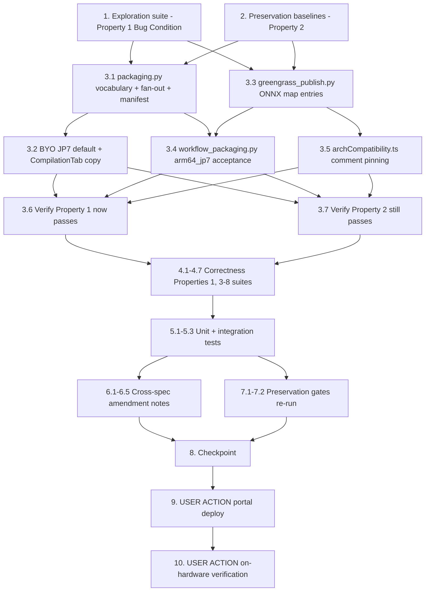

# Implementation Plan

## Notes

- Exploration-fails-first: task 1's cases 1-4 MUST FAIL on the unfixed tree;
  do not fix anything to make them pass in wave 1. Case 5 must NEVER be
  inverted (it encodes retained fail-closed behavior, Requirement 2.10).
- The user decision is binding: per-JetPack ONNX components; single
  arch-agnostic component was rejected. JP5/JP6 workflow vision resolution is
  NOT changed. The vLLM path is untouched. `COMPILATION_TARGETS` never gains
  `jetson-xavier-jp7`.
- No new IAM actions are designed; if one surfaces, stop and follow the
  security gate's reviewed rebaseline protocol.

## Overview

Deliver compiled-ONNX vision models to Jetson devices as per-JetPack
Greengrass components (JP7 is the deliverable; ONNX is its only vision
runtime), using the exploratory bugfix workflow. Write the bug condition
exploration suite and the preservation baselines against the UNFIXED tree
first, then land design.md's fix steps (packaging fan-out + `runtime: onnx`
manifest, the six publish map lines, the arm64_jp7 workflow-resolution
acceptance, frontend pinning), then encode Correctness Properties 1–8, append
the five cross-spec amendment notes, and re-run the preservation gates. The
portal deploy and the on-hardware verification (yolo_test v7 / rf-detr v7 on
`jetson-thor1`, JP6 regression) are user-action tasks at the end.

The vocabulary step (3.1's `packaging.ONNX_ARCH_TO_TARGET`) and the publish
maps (3.3) are independent of each other but both precede the workflow
resolution step (3.4), which accepts the id 3.1 defines. The whole plan
composes with `vllm-multi-arch-publish-conflict` in either landing order: its
map-totality assertions are subset-shaped, and this spec's Property 3 re-runs
them with the ONNX entries present.

All work lands on the existing branch `spec/jetpack7-support` — no new branch.

Test commands:
- Backend: from `edge-cv-portal/backend/tests`, WITH the conftest (moto
  `aws_stack` fixture; Hypothesis profiles `portal-fast`/`ci` are
  conftest-registered — do NOT hardcode `max_examples`; do NOT use
  `--noconftest`), venv `/home/ubuntu/.venvs/dda-portal-tests`:
  `python3 -m pytest <suite> -q -p no:cacheprovider`
- Frontend: from `edge-cv-portal/frontend`, with
  `PATH="$HOME/.local/node/bin:$PATH"`: `npx vitest run <file>`
- `test_onnx_compile_diagnostics_exploration.py` case 9 (no JP7 Neo compile
  target, exactly seven targets) MUST keep passing throughout — do NOT touch
  `COMPILATION_TARGETS`.

New files this plan creates:
- `edge-cv-portal/backend/tests/test_onnx_jetson_publish_packaging_exploration.py`
- `edge-cv-portal/backend/tests/test_onnx_jetson_publish_packaging_properties.py`
- `edge-cv-portal/frontend/src/pages/deployments/onnxComponentArch.property.test.ts`

## Task Dependency Graph

```json
{
  "waves": [
    { "wave": 1, "description": "Run on UNFIXED code: the exploration suite surfaces the counterexamples (task 1 cases 1-4 FAIL; case 5 passes and is never inverted; case 6 passes, pinning the frontend), and the preservation baselines are observed and recorded (task 2 PASSES).", "tasks": ["1", "2"] },
    { "wave": 2, "description": "Producer-side fixes: packaging vocabulary + compiled-ONNX fan-out + BYO JP7 default, and the six publish map lines.", "tasks": ["3.1", "3.2", "3.3"] },
    { "wave": 3, "description": "Consumer-side fixes: arm64_jp7 workflow-resolution acceptance and the frontend module-comment pinning.", "tasks": ["3.4", "3.5"] },
    { "wave": 4, "description": "Re-run the task 1 and task 2 suites against the fixed tree.", "tasks": ["3.6", "3.7"] },
    { "wave": 5, "description": "Fix-checking property suites (Correctness Properties 1, 3-8) plus unit and integration tests.", "tasks": ["4.1", "4.2", "4.3", "4.4", "4.5", "4.6", "4.7", "5.1", "5.2", "5.3"] },
    { "wave": 6, "description": "The five cross-spec amendment notes.", "tasks": ["6.1", "6.2", "6.3", "6.4", "6.5"] },
    { "wave": 7, "description": "Re-run every preservation gate, then checkpoint.", "tasks": ["7.1", "7.2", "8"] },
    { "wave": 8, "description": "USER ACTION: portal deploy, then on-hardware verification on jetson-thor1 (yolo_test v7, rf-detr v7) plus the JP6 regression check.", "tasks": ["9", "10"] }
  ]
}
```



## Tasks

- [x] 1. Write bug condition exploration test suite
  - **Property 1: Bug Condition** - A compiled ONNX artifact reaches per-JetPack Jetson components
  - **CRITICAL**: Cases 1-4 MUST FAIL on unfixed code - failure confirms the bugs exist
  - **DO NOT attempt to fix the tests or the code when they fail**
  - **NOTE**: This suite encodes the expected behavior - it validates the fix when it passes after implementation
  - **GOAL**: Surface counterexamples for all four defects; if any hypothesized cause is refuted, re-hypothesize before writing a fix
  - Create `edge-cv-portal/backend/tests/test_onnx_jetson_publish_packaging_exploration.py` following `test_vllm_multi_arch_publish_exploration.py` (moto-backed conftest `aws_stack`, fake Greengrass client with `create_component_version` / `describe_component` / paginators)
  - Seed a trained-model training-jobs record with a completed `{target: 'onnx', export_format: 'onnx', status: 'Completed', compiled_model_s3: …}` compilation entry; seed S3 with a synthetic export `model.tar.gz` (containing `model.onnx`) and a trained artifact `model.tar.gz` (containing `config.yaml` + `export_artifacts/manifest.json` + a `.pt` file) so `create_dda_manifest` and the packagers run for real
  - Case 1 - **Compiled-ONNX packaging shape** (`isBugCondition_2`): drive `packaging.py::package_components`; assert one `packaged_components` entry per `onnx-jetson-xavier-jp5/-jp6/-jp7` target (and NO `target: 'onnx'` entry), and that the uploaded ZIP holds `manifest.json` at the root with `runtime: 'onnx'` + `runtime_artifact` and the artifact at `<stage_type>/model.onnx`; on unfixed code observe ONE `target: 'onnx'` entry whose manifest has NO `runtime` key (will fail on unfixed code)
  - Case 2 - **Publish fails closed on 'onnx'** (`isBugCondition_1`): drive `greengrass_publish.py::publish_component` against a record with a packaged `target: 'onnx'` entry; assert three per-JetPack components named `model-{safe}-onnx-jetson-xavier-jp{N}`, each recipe manifest platform `aarch64` with a HARD `ComponentDependencies` entry on `aws.edgeml.dda.LocalServer.arm64JP{N}` and a per-target `published_components` entry with `status: 'published'`; also assert directly that `isBugCondition_1` holds on the unfixed maps (`'onnx'` and each `onnx-jetson-xavier-jp{N}` id absent from both `TARGET_TO_LOCAL_SERVER` and `TARGET_TO_PLATFORM`); on unfixed code observe `resolve_target_platform` raising `PublishError` "Unsupported compile target 'onnx'" and a failed target with no component version (will fail on unfixed code)
  - Case 3 - **BYO default omits JP7** (`isBugCondition_2`, import arm): package a BYO ONNX-import record with no explicit targets; assert the defaulted entry set is exactly `{jetson-xavier-jp5, jetson-xavier-jp6, jetson-xavier-jp7, x86_64-cpu}`; on unfixed code observe the three-entry list without JP7 (will fail on unfixed code)
  - Case 4 - **arm64_jp7 workflow resolution** (`isBugCondition_3`): seed a record whose `published_components` carry a published `onnx-jetson-xavier-jp7` entry; call `workflow_packaging.py::resolve_model_components` with `archs=['arm64_jp7']`; assert the JP7 ONNX component name resolves with no error; on unfixed code observe the uncovered-architecture `PackagingError` naming the model and `arm64_jp7 (target jetson-xavier-jp7)` (will fail on unfixed code)
  - Case 5 - **Fail-closed retained without a JP7 component** (encodes 2.10): the same resolution against a record with only Neo JP5/JP6 published entries raises the uncovered-architecture error naming the model and arch; this case PASSES on unfixed code and MUST keep passing after the fix - do NOT invert it
  - Case 6 - **Frontend inference pinning** (`isBugCondition_4`): add example cases to the frontend (in the new `onnxComponentArch.property.test.ts`, example section, or as a small vitest file created now): `inferComponentTargetArchs('model-x-onnx-jetson-xavier-jp7') === ['arm64_jp7']` (and jp5/jp6 twins); these PASS on unfixed code - they document that the frontend fix is pinning, not code; run: `npx vitest run src/pages/deployments/onnxComponentArch.property.test.ts`
  - Run: `python3 -m pytest test_onnx_jetson_publish_packaging_exploration.py -q -p no:cacheprovider` from `edge-cv-portal/backend/tests` (venv `/home/ubuntu/.venvs/dda-portal-tests`)
  - **EXPECTED OUTCOME**: cases 1, 2, 3, 4 FAIL (this is correct - it proves the bugs exist); cases 5 and 6 PASS
  - Document the counterexamples found (the single `target: 'onnx'` entry; the runtime-less manifest; the `PublishError` message; the three-entry BYO default; the uncovered-architecture error text)
  - Mark complete when the suite is written, run, and the failures are documented
  - _Requirements: 1.1, 1.3, 1.4, 1.5, 1.6, 1.7, 1.8_

- [x] 2. Write preservation property tests (BEFORE implementing the fix)
  - **Property 2: Preservation** - Non-bug inputs are behaviorally identical
  - **IMPORTANT**: Follow observation-first methodology - observe the UNFIXED behavior, record it, then encode it as properties
  - Create `edge-cv-portal/backend/tests/test_onnx_jetson_publish_packaging_properties.py` and add the Property 2 tests now (fix-checking properties join in task 4); Hypothesis, conftest profiles, one test per baseline with `# Validates: Requirements …` comments
  - Observe on UNFIXED code and encode as properties:
    - **Publish target-map baseline** (3.1, 3.2): record the exact `(LocalServer variant, platform)` pair for every currently mapped target (`jetson-xavier`→JP4/aarch64, `jetson-xavier-jp5/-jp6/-jp7`→JP5/JP6/JP7/aarch64, `arm64-cpu`→JP4/aarch64, `x86_64-cpu`/`x86_64-cuda`→amd64/amd64) and that a genuinely unknown target raises `PublishError` from `resolve_target_platform` with no create
    - **Neo Phase 2 packaging** (3.4): over generated Neo-only completed-job sets - per-target entries, ZIP layout (`manifest.json` at root + stage dir), and the runtime-LESS `create_dda_manifest` manifest (the DLR default is correct for Neo artifacts) unchanged
    - **BYO explicit lists** (3.5): over generated explicit target lists - the packaged entry set equals the request verbatim; ZIP layout (`runtime: 'onnx'` manifest at root, artifact under `<stage_type>/`) unchanged
    - **Non-JP7 workflow resolution** (3.7, 3.8): over generated published shapes and architecture selections excluding `arm64_jp7` - resolution results and error messages identical; assert `ARCH_TO_LOCAL_SERVER_COMPONENT` / `ARCH_TO_GG_PLATFORM` byte-identical
    - **Frontend inference baseline** (3.13): in the frontend property file - over LocalServer variants, vLLM suffixed names, Neo vision names, and token-less names, `inferComponentTargetArchs` returns today's sets
    - **Compile targets guard** (3.9): re-run `test_onnx_compile_diagnostics_exploration.py` case 9 as the gate (do not duplicate it)
  - Run: `python3 -m pytest test_onnx_jetson_publish_packaging_properties.py -q -p no:cacheprovider` from `edge-cv-portal/backend/tests`
  - **EXPECTED OUTCOME**: Tests PASS on UNFIXED code (this confirms the baseline behavior to preserve)
  - Mark complete when the tests are written, run, and passing on unfixed code
  - _Requirements: 3.1, 3.2, 3.4, 3.5, 3.7, 3.8, 3.9, 3.13_

- [x] 3. Fix per-JetPack ONNX packaging, publish, and resolution (design Fix Implementation steps 1-9)

  - [x] 3.1 Packaging vocabulary, compiled-ONNX packager, and fan-out (design steps 1-3)
    - In `edge-cv-portal/backend/functions/packaging.py`: add module-level `ONNX_ARCH_TO_TARGET = {'arm64_jp5': 'onnx-jetson-xavier-jp5', 'arm64_jp6': 'onnx-jetson-xavier-jp6', 'arm64_jp7': 'onnx-jetson-xavier-jp7'}` and `ONNX_COMPILED_TARGETS = list(ONNX_ARCH_TO_TARGET.values())` next to `VLLM_ARCH_TO_TARGET`, with the KEEP-IN-SYNC comment naming `greengrass_publish.py`'s maps and `workflow_packaging.py`'s arm64_jp7 acceptance
    - Add `package_compiled_onnx_component(compiled_model_s3, dda_manifest, s3_client, usecase) -> str`: download/extract the export job's `model.tar.gz`, locate the `.onnx` by recursive scan; build the Compiled_ONNX_Manifest from the Phase 1 `dda_manifest` (keep `model_graph` + `dataset`, DROP `compilable_models`, add `runtime: 'onnx'` and `runtime_artifact: <onnx filename>`); assemble `manifest.json` at the payload root and the artifact at `<stage_type>/<onnx filename>` (`stage_type = dda_manifest['model_graph']['stages'][0]['type']`); zip and upload to `model_artifacts/model-{uuid}/{uuid}_greengrass_model_component.zip`
    - In `package_components` (after the `completed_jobs` filter at line ~803): partition `onnx_export_jobs` (`target == 'onnx'` or `export_format == 'onnx'`) from `neo_jobs`; run the Neo Phase 2 loop over `neo_jobs` UNCHANGED; for the ONNX export entry, call `package_compiled_onnx_component` ONCE and append `{'target': t, 'component_package_s3': uri, 'status': 'packaged'}` for every `ONNX_COMPILED_TARGETS` id; on packaging failure append per-target `{'target': t, 'status': 'failed', 'error': …}` entries mirroring the Neo failure shape; `requested_targets` keeps filtering on the `onnx` id (the compile-target id the UI knows) with the fan-out expanding it
    - _Bug_Condition: isBugCondition_2(X) - a completed torch.onnx.export compilation entry routed through the generic Neo Phase 2 loop_
    - _Expected_Behavior: Property 4 - per-JetPack entry fan-out from one artifact; manifest carries runtime: 'onnx' + runtime_artifact; artifact at <stage_type>/model.onnx (the OnnxRunner path)_
    - _Preservation: Neo Phase 2 entries, layout, and runtime-less manifest byte-identical (3.4); vLLM packaging branch untouched (3.6)_
    - _Requirements: 2.6, 2.7, 3.4, 3.6_

  - [x] 3.2 BYO default list gains JP7; CompilationTab copy (design steps 4, 8)
    - In `packaging.py` line ~757: `onnx_targets = requested_targets or ['jetson-xavier-jp5', 'jetson-xavier-jp6', 'jetson-xavier-jp7', 'x86_64-cpu']`; explicit caller lists stay honored verbatim; no other BYO change (`jetson-xavier-jp7` is already fully mapped in publish and already matches `ARCH_TO_PUBLISH_TARGET[arm64_jp7]`)
    - In `edge-cv-portal/frontend/src/components/CompilationTab.tsx`: copy only - the BYO ONNX info alert "One package deploys to all targets (JetPack 5/6, x86)" gains JetPack 7; optionally note on the `onnx` compile-target description that it is the JP7 vision route; NO target additions/removals, no behavior change
    - _Bug_Condition: isBugCondition_2(X), import arm - is_onnx_import(record) AND requested_targets = NULL_
    - _Expected_Behavior: Property 4 - defaulted list exactly the four targets; explicit lists verbatim_
    - _Preservation: BYO ZIP layout and explicit-list handling unchanged (3.5); onnx compile target offered exactly as today (3.12)_
    - _Requirements: 2.8, 3.5, 3.12_

  - [x] 3.3 ONNX target map entries in greengrass_publish.py (design step 5)
    - In `edge-cv-portal/backend/functions/greengrass_publish.py`: add to `TARGET_TO_LOCAL_SERVER` (line ~77) `'onnx-jetson-xavier-jp5': 'aws.edgeml.dda.LocalServer.arm64JP5'`, `'onnx-jetson-xavier-jp6': 'aws.edgeml.dda.LocalServer.arm64JP6'`, `'onnx-jetson-xavier-jp7': 'aws.edgeml.dda.LocalServer.arm64JP7'` with a compiled-ONNX / KEEP-IN-SYNC comment; add the same three keys → `'aarch64'` to `TARGET_TO_PLATFORM` (line ~88); append the three ids to `resolve_local_server_component`'s fail-closed message target list (line ~171, message-only)
    - NOTHING else in this module: `resolve_target_platform`, per-target naming (`f"{component_name}-{target_suffix}"` - the new ids contain no underscore so the suffix transform is the identity), `validate_greengrass_component_name`, `generate_component_recipe`, and the per-target `published_components` write-back are all existing generic code that now covers the ONNX targets
    - _Bug_Condition: isBugCondition_1(X) - a packaged ONNX target absent from either module-level map_
    - _Expected_Behavior: Property 3 (maps total for the ONNX ids, aarch64 + arm64JP{N} correspondence, unmapped targets still fail closed) and Property 5 (derived names satisfy every gate); Property 1 recipe stamping (2.2) and per-target write-back (2.5)_
    - _Preservation: every currently mapped target resolves to exactly today's pair and recipe (3.1); a genuinely unknown target still raises PublishError with no create (3.2); vLLM publish untouched (3.3)_
    - _Requirements: 2.1, 2.2, 2.3, 2.4, 2.5, 3.1, 3.2, 3.3_

  - [x] 3.4 arm64_jp7 workflow-resolution acceptance (design step 6)
    - In `edge-cv-portal/backend/functions/workflow_packaging.py`: add `ARCH_TO_EXTRA_PUBLISH_TARGETS = {ARCH_ARM64_JP7: ('onnx-jetson-xavier-jp7',)}` (KEEP-IN-SYNC comment naming `packaging.ONNX_ARCH_TO_TARGET`; JP5/JP6 deliberately absent - Neo stays their vision route) and `publish_targets_for_arch(arch)` returning `(primary,) + extras` or `()` for an unknown arch
    - In `resolve_model_components` (lines ~1346-1381): build `targets_of_arch[arch] = publish_targets_for_arch(arch)` (empty → today's no-known-target `PackagingError`, message unchanged); coverage = any accepted id in `published_targets`; resolved `names` selects entries whose target is in the union of accepted ids; render the uncovered-architecture message byte-identical for singleton archs (`(target jetson-xavier-jp5)`) and as `(targets jetson-xavier-jp7 or onnx-jetson-xavier-jp7)` for arm64_jp7
    - Rewrite the `ARCH_ARM64_JP7` comment in `ARCH_TO_PUBLISH_TARGET` (lines ~269-276): `jetson-xavier-jp7` is now producible (BYO ONNX import publish) and compiled-ONNX coverage arrives via `ARCH_TO_EXTRA_PUBLISH_TARGETS` - ONNX is the delivered JP7 vision route
    - Do NOT touch `model_component_dependencies` (multi-name divergence omission), the vLLM singular shape, `ARCH_TO_LOCAL_SERVER_COMPONENT`, or `ARCH_TO_GG_PLATFORM`
    - _Bug_Condition: isBugCondition_3(X) - arm64_jp7 selected with a vision model_ref whose model has a publishable JP7 ONNX component_
    - _Expected_Behavior: Property 6 - JP7 resolves via either accepted id; fail-closed retained when no JP7 entry exists; non-JP7 archs keep singleton semantics_
    - _Preservation: arm64_jp4/jp5/jp6/x86 resolution, coverage semantics, and error text unchanged; onnx-jetson-xavier-jp5/jp6 entries never satisfy arm64_jp5/jp6 (3.7, 3.8)_
    - _Requirements: 2.9, 2.10, 3.7, 3.8_

  - [x] 3.5 Frontend pinning comment (design step 7)
    - In `edge-cv-portal/frontend/src/pages/deployments/archCompatibility.ts`: extend the module comment - per-JetPack ONNX model components (`model-{safe}-onnx-jetson-xavier-jp{N}`) are non-gated components resolved by the JetPack-token inference to their singleton arch; NO production change (the regex already covers the names, task 1 case 6 proved it)
    - The behavioral pinning lands with task 4.5's property suite and task 5.3's `CreateDeployment.archFilter.test.tsx` extension
    - _Bug_Condition: isBugCondition_4(X) - a per-JetPack ONNX component name with unpinned arch resolution_
    - _Expected_Behavior: Property 7 - exact singleton inference and exact deploy-screen verdicts_
    - _Preservation: every existing (non-ONNX) name resolves exactly as today (3.13)_
    - _Requirements: 2.11, 3.13_

  - [x] 3.6 Verify bug condition exploration test now passes
    - **Property 1: Expected Behavior** - A compiled ONNX artifact reaches per-JetPack Jetson components
    - **IMPORTANT**: Re-run the SAME suite from task 1 - do NOT write a new test
    - The suite from task 1 encodes the expected behavior; when it passes, the expected behavior is satisfied
    - Run: `python3 -m pytest test_onnx_jetson_publish_packaging_exploration.py -q -p no:cacheprovider` from `edge-cv-portal/backend/tests`; `npx vitest run src/pages/deployments/onnxComponentArch.property.test.ts` from `edge-cv-portal/frontend`
    - **EXPECTED OUTCOME**: Tests PASS - cases 1, 2, 3, 4 now pass (bugs fixed); case 5 STILL passes (fail-closed retained); case 6 still passes
    - _Requirements: 2.1, 2.2, 2.3, 2.5, 2.6, 2.7, 2.8, 2.9, 2.10_

  - [x] 3.7 Verify preservation tests still pass
    - **Property 2: Preservation** - Non-bug inputs are behaviorally identical
    - **IMPORTANT**: Re-run the SAME tests from task 2 - do NOT write new tests
    - Run: `python3 -m pytest test_onnx_jetson_publish_packaging_properties.py -q -p no:cacheprovider` from `edge-cv-portal/backend/tests`
    - **EXPECTED OUTCOME**: Tests PASS (confirms no regressions in Neo publish/packaging, BYO explicit lists, non-JP7 workflow resolution, frontend inference, and the compile-targets guard)
    - _Requirements: 3.1, 3.2, 3.4, 3.5, 3.7, 3.8, 3.9, 3.13_

- [x] 4. Write the fix-checking property suites (Correctness Properties 1, 3-8)

  - [x] 4.1 ONNX target-map totality and fail-closed composition property
    - **Property 3: Fix Checking** - ONNX target maps are total and compose fail-closed
    - Property-based test (Hypothesis) in `test_onnx_jetson_publish_packaging_properties.py` with `# Validates: Requirements 2.2, 2.3, 3.2`
    - Over `values(packaging.ONNX_ARCH_TO_TARGET)`: every id in BOTH `TARGET_TO_LOCAL_SERVER` and `TARGET_TO_PLATFORM`; `resolve_target_platform` returns `aarch64` without raising; `resolve_local_server_component` returns the `arm64JP{N}` variant whose major matches the id's JetPack token; over generated unmapped target names: `resolve_target_platform` raises `PublishError` and no `create_component_version` is called; assert the vllm-multi-arch totality (every value of `packaging.VLLM_ARCH_TO_TARGET` in both maps) holds with the ONNX entries present
    - _Requirements: 2.2, 2.3, 3.2_

  - [x] 4.2 Fan-out, manifest, and BYO default property
    - **Property 4: Fix Checking** - Compiled-ONNX fan-out and manifest; BYO default gains JP7
    - Property-based test (Hypothesis) over generated artifact/manifest shapes (stage types, onnx filenames, dataset dims): fan-out produces exactly the `ONNX_COMPILED_TARGETS` entry set from ONE upload; `manifest.json` at the ZIP root with `runtime: 'onnx'`, `runtime_artifact`, `model_graph`, `dataset`, and no `compilable_models`; the `.onnx` at `<stage_type>/<filename>`; over generated absent/explicit BYO lists: default exactly `['jetson-xavier-jp5', 'jetson-xavier-jp6', 'jetson-xavier-jp7', 'x86_64-cpu']`, explicit verbatim
    - _Requirements: 2.6, 2.7, 2.8, 3.5_

  - [x] 4.3 Derived-name gates property
    - **Property 5: Fix Checking** - Derived ONNX component names satisfy every gate
    - Property-based test (Hypothesis) over generated model names × ONNX targets: derived name `= {base}-onnx-jetson-xavier-jp{N}`, starts with `model-`, matches `^[a-zA-Z0-9._-]+$`, carries a JetPack token whose major equals the target's (frontend regex `/(?:jp|jetpack)(4|5|6|7)(?![0-9])/`), never starts with `model-vllm-` for `model-{safe}` bases; names above 128 chars fail closed per target with `PublishError` and no create
    - _Requirements: 2.1, 2.4_

  - [x] 4.4 arm64_jp7 workflow-resolution property
    - **Property 6: Fix Checking** - arm64_jp7 workflow resolution is exact and stays fail-closed
    - Property-based test (Hypothesis) over generated published shapes × architecture selections: a published `onnx-jetson-xavier-jp7` OR `jetson-xavier-jp7` entry covers `arm64_jp7` and its name resolves; no JP7-accepted entry → `PackagingError` naming the model and `arm64_jp7`; for every non-JP7 arch the accepted set is exactly today's singleton and `onnx-jetson-xavier-jp5/jp6` entries never satisfy `arm64_jp5`/`arm64_jp6`
    - _Requirements: 2.9, 2.10, 3.7_

  - [x] 4.5 Frontend arch-inference property suite
    - **Property 7: Fix Checking** - Frontend arch inference and deploy filtering are pinned
    - Property-based test (fast-check) in the new `edge-cv-portal/frontend/src/pages/deployments/onnxComponentArch.property.test.ts` (following `archCompatibility.property.test.ts`)
    - Over generated safe model names × JetPack majors: `inferComponentTargetArchs('model-{safe}-onnx-jetson-xavier-jp{N}')` = exactly `['arm64_jp{N}']`; compatibility verdicts exact (own arch compatible; every other arch and null device arch fail closed via `isArchCompatible` / `isCompatibleWithAllDevices`); existing-name inference unchanged (Property 2 twin)
    - Run: `npx vitest run src/pages/deployments/onnxComponentArch.property.test.ts` from `edge-cv-portal/frontend`
    - _Requirements: 2.11, 2.12, 3.13_

  - [x] 4.6 Backend deployment-gate verification
    - **Property 8: Fix Checking** - Backend deployment gates ignore ONNX model names
    - Unit/property test over generated per-JetPack ONNX names: `collect_vllm_component_manifests` produces NO manifest for them (no `model-vllm-` prefix → no vLLM arch gate, no 409 `VLLM_ARCH_UNSUPPORTED` possible); `local_server_component_arch` is unaffected by model component names (LocalServer min-version gating keys off the installed LocalServer name only)
    - Production change ONLY if this verification fails - and then as a separately reviewed follow-up, not silently
    - _Requirements: 2.13_

  - [x] 4.7 Full-pipeline property
    - **Property 1: Fix Checking** - end-to-end package'→publish' over generated model names and stage types: per-JetPack packaged entries, `runtime: onnx` manifests, three distinct component names, aarch64 recipes with the matching `arm64JP{N}` HARD dep, per-target `published_components` entries with `status: 'published'`
    - `# Validates: Requirements 2.1, 2.2, 2.3, 2.5, 2.6, 2.7`
    - _Requirements: 2.1, 2.2, 2.3, 2.5, 2.6, 2.7_

- [x] 5. Write the unit and integration tests from the design Testing Strategy

  - [x] 5.1 Unit tests
    - `ONNX_ARCH_TO_TARGET` / `ONNX_COMPILED_TARGETS`: closed vocabulary, `-onnx-` token, suffix-transform identity
    - Map matrix extension in the spirit of `test_greengrass_publish_localserver.py`: the three ONNX ids resolve to JP5/JP6/JP7 variants + aarch64
    - `package_compiled_onnx_component`: manifest fields, ZIP layout, `.onnx` recursive-scan tolerance, error propagation
    - Fan-out: three-entry set from one upload; per-target failure entries; mixed Neo+ONNX completed jobs → Neo entries unchanged alongside the fan-out; `requested_targets=['onnx']` expands
    - `publish_targets_for_arch`: singletons, the JP7 pair, `()` on unknown
    - `resolve_model_components`: coverage via either JP7 id; names from the union; error text for singleton archs byte-identical, JP7 multi-id text
    - _Requirements: 2.1, 2.2, 2.6, 2.7, 2.9, 3.1_

  - [x] 5.2 Backend integration tests
    - End-to-end (moto + fake Greengrass): trained record with completed `onnx` export entry + seeded S3 → package → publish → three DEPLOYABLE components with correct recipes and write-back → `resolve_model_components(['arm64_jp7'])` resolves the JP7 component into workflow dependencies
    - BYO end-to-end: import record → default packaging covers JP7 → publish `jetson-xavier-jp7` → arm64_jp7 resolution through the EXISTING `ARCH_TO_PUBLISH_TARGET` entry (no extras involvement)
    - _Requirements: 2.5, 2.6, 2.8, 2.9_

  - [x] 5.3 Frontend integration test
    - Extend `edge-cv-portal/frontend/src/pages/CreateDeployment.archFilter.test.tsx`: a `model-x-onnx-jetson-xavier-jp7` component is offered for an `arm64_jp7` thing and filtered/labeled incompatible for an `arm64_jp6` thing and for a thing with no recorded architecture
    - Run: `npx vitest run src/pages/CreateDeployment.archFilter.test.tsx` from `edge-cv-portal/frontend`
    - Resolution note: the null-arch case was corrected to the actual contract — Requirement 2.12 scopes incompatibility to RECORDED architectures; for a thing with no recorded architecture the screen shows the no-recorded-architecture warning and keeps the ONNX component offered (pre-existing fail-open for all name-inferred components); design.md annotated, no production change
    - _Requirements: 2.12_

- [x] 6. Append the cross-spec amendment notes (design Cross-Spec Documentation Consistency table)

  - [x] 6.1 `.kiro/specs/vllm-multi-arch-publish-conflict/` - the ONNX targets joined `TARGET_TO_LOCAL_SERVER` / `TARGET_TO_PLATFORM` under its map-totality discipline (mapped in BOTH maps, unmapped fail closed), composing in either landing order
    - _Requirements: 2.14_
  - [x] 6.2 `.kiro/specs/onnx-compile-error-diagnostics/` - this sibling delivers the JP7 vision route it deferred, changing `packaging.py` / `workflow_packaging.py` / `greengrass_publish.py`; the diagnostics contracts and case 9's guard are preserved (3.10)
    - _Requirements: 2.14, 3.10_
  - [x] 6.3 `.kiro/specs/jetpack7-support/` - per-JetPack ONNX components are the delivered JP7 vision route (one paragraph in the JP7 section)
    - _Requirements: 2.14_
  - [x] 6.4 `docs/multi-runtime-inference.md` - compiled ONNX exports package per-JetPack with `runtime: onnx` manifests; BYO defaults now include JP7; ONNX is the only JP7 vision runtime
    - _Requirements: 2.14_
  - [x] 6.5 `.kiro/specs/localserver-arch-naming/` - the three `onnx-jetson-xavier-jp{N}` → `arm64JP{N}` entries, added under the both-maps-or-fail-closed rule
    - _Requirements: 2.14_

- [x] 7. Re-run every preservation gate

  - [x] 7.1 Backend gates (each separately, from `edge-cv-portal/backend/tests` with the conftest)
    - `test_greengrass_publish_localserver.py` (resolver matrix + no-bare-arm64 over the grown maps)
    - `test_vllm_multi_arch_publish_exploration.py`, `test_vllm_multi_arch_publish_properties.py` (map-totality with the ONNX entries - either-landing-order requirement)
    - `test_vllm_packaging_dispatch.py`, `test_vllm_publish_fit_gate.py`, `test_vllm_publish_writeback.py` (3.3, 3.6)
    - `test_vision_model_packaging_preservation.py`, `test_vision_model_packaging_exploration.py` (3.4)
    - `test_workflow_packaging_vision_resolution_exploration.py`, `test_workflow_packaging_vllm_resolution_preservation.py`, `test_workflow_packaging_multi_variant_exploration.py`, `test_workflow_localserver_variant_compat.py` (3.7, 3.8)
    - `test_onnx_compile_diagnostics_exploration.py` (case 9 MUST pass), `test_onnx_compile_diagnostics_properties.py`, `test_onnx_compile_diagnostics_units.py`, `test_onnx_compile_diagnostics_integration.py` (3.9, 3.10)
    - `test_deployment_vllm_gate.py`, `test_deployment_plugin_gates.py` (Property 8 scope)
    - _Requirements: 3.1, 3.2, 3.3, 3.4, 3.6, 3.7, 3.8, 3.9, 3.10_

  - [x] 7.2 Frontend gates (from `edge-cv-portal/frontend`)
    - `npx vitest run src/pages/deployments/archCompatibility.property.test.ts`
    - `npx vitest run src/pages/CreateDeployment.archFilter.test.tsx`
    - `npx vitest run src/pages/deployments/vllmSuffixArch.property.test.ts` (if the sibling's open waves have landed it by execution time)
    - _Requirements: 3.13_

- [x] 8. Checkpoint - Ensure all tests pass
  - DONE: combined onnx suites 45 passed; IAM synth gate 11 passed with live synth running — the only baseline drift ever surfaced was the vllm sibling's intentional `greengrass:DeleteComponent` grant, handled via that spec's reviewed rebaseline protocol (its task 6); NO ONNX-introduced IAM drift
  - Ensure the exploration suite, preservation suite, property suites, unit/integration tests, and every gate in task 7 pass; ask the user if questions arise
  - Confirm NO IAM/security-baseline drift was introduced (no new actions were designed; if any test or synth surfaces one, STOP and flag it for the reviewed rebaseline protocol instead of proceeding) (3.14)
  - _Requirements: 3.14_

- [ ] 9. USER ACTION: Deploy the portal
  - Nothing takes effect until deployed. Lambda code: `packaging.py`, `greengrass_publish.py`, `workflow_packaging.py` (functions asset); frontend bundle (CompilationTab copy + comment). No infrastructure change.
  - Use `deploy-portal.sh` (or `deploy-infrastructure.sh` + `deploy-frontend.sh`). Per `.kiro/steering/builds.md`: do NOT deploy while a component build is in flight, and move `edge-cv-portal/infrastructure/cdk.out` aside before running the security guard suite afterwards.
  - _Requirements: 2.14 (docs deployed with the tree), plus activation of every 2.x fix_

- [ ] 10. USER ACTION: On-hardware verification (REQUIRED before this work is called done, per `.kiro/steering/builds.md`)
  - **Package → publish**: for `yolo_test` v7 (training `6a43ff2b-50ec-4441-b5f0-d84ccfef1400`) and `rf-detr` v7 (training `ede4bd32-e12c-4e88-8139-75d622e53ad0`): run the `onnx` compile (diagnosable end-to-end now that `onnx-compile-error-diagnostics` is deployed), package, publish; confirm three DEPLOYABLE `model-{safe}-onnx-jetson-xavier-jp5/-jp6/-jp7` components per model with aarch64 platforms and the matching `arm64JP{N}` LocalServer HARD deps
  - **Deploy to JP7**: revise/create a deployment for an `arm64_jp7` thing (e.g. `jetson-thor1`); confirm the JP7 ONNX component is offered and the JP5/JP6 siblings are labeled incompatible; deploy; confirm the device reaches DEPLOYED, the model converts, and the model log line shows `runtime 'onnx'` (OnnxRunner selected, TensorRT → CUDA → CPU)
  - **Workflow inference**: package a workflow referencing the model for `arm64_jp7`, deploy it, and run inference end-to-end on the Thor device; confirm the backend stays healthy (no crash-loop) for a sustained period, not just at startup
  - **JP6 regression**: publish/deploy an existing Neo JP6 model and confirm names, recipes, and deployment behavior are unchanged
  - Portal: `https://d23v4ltibogb5x.cloudfront.net` (account 164152369890, us-east-1)
  - _Requirements: 2.1, 2.2, 2.9, 2.11, 2.12, 3.1, 3.11_
