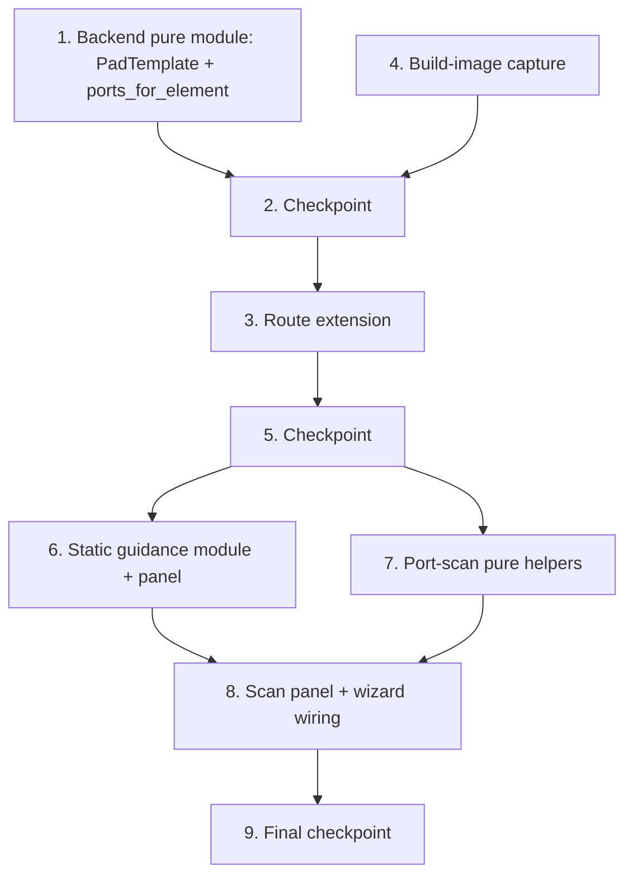

# Implementation Plan: Port Guidance and Pad Pre-population

## Overview

Implementation proceeds bottom-up along the data flow, mirroring the gst-parameter-prepopulation spec: first the backend pure module (`gst_properties.py` pad parsing/serialization and the `ports_for_element` derivation — the core everything consumes), then the serving route extension, then the build-image capture side (`dda-gst-introspect`), then the frontend in two layers (static guidance module/panel, then port-scan helpers/panel/wizard wiring). Property tests sit directly beside the code they validate: 9 backend Hypothesis properties and 3 frontend fast-check properties, one file per property, each tagged `Feature: port-guidance-and-pad-prepopulation, Property {n}: {title}` with ≥100 iterations.

Backend: Python — pytest + Hypothesis in `edge-cv-portal/backend/tests/`, venv at `/home/ubuntu/backend-test-venv`. Frontend: TypeScript — vitest + fast-check in `edge-cv-portal/frontend/src/pages/node-designer/`, always run with `--run`.

## Tasks

- [ ] 1. Extend the backend pure module `gst_properties.py`
  - [x] 1.1 Add `PadTemplate` and extend report parsing/serialization
    - In `edge-cv-portal/backend/functions/gst_properties.py`: add the pad constants (`VALID_PAD_DIRECTIONS`, `VALID_PAD_PRESENCES`, `MAX_CAPS_LEN = 4096`) and the frozen `PadTemplate` dataclass (`name`, `direction`, `presence`, `caps`, `caps_truncated`)
    - Extend `ReportElement` with `pads: Optional[List[PadTemplate]] = None` and `pads_error: Optional[str] = None` (legacy-compatible defaults; invariant: `pads_error` non-None only when `pads == []`)
    - `_parse_element`: absent `pads` key → `pads=None, pads_error=None` (stray `padsError` ignored); present → strictly validate each entry (all five fields present and correctly typed, `direction`/`presence` in the valid sets, `caps` length ≤ 4096, `capsTruncated` bool), any violation raises `ReportError`
    - `_serialize_element`: omit both keys when `pads is None` (byte-identical legacy output); otherwise emit `pads` (wire keys `name`, `direction`, `presence`, `caps`, `capsTruncated`) and `padsError`
    - _Requirements: 4.1, 4.2, 4.3, 4.4, 3.4_

  - [x] 1.2 Write property test for the extended report round-trip
    - **Property 1: Extended report round-trip**
    - `edge-cv-portal/backend/tests/test_property_pad_report_roundtrip.py`: extend the report generators of `test_property_gst_report_roundtrip.py` with pad strategies — valid directions/presences, caps up to and at the 4096 boundary with matching `capsTruncated`, elements with `pads=None`, `pads=[]` (± `pads_error`), and populated lists; assert `parse_report(serialize_report(r)) == r` through a real `json.dumps`/`json.loads` cycle; ≥100 iterations
    - **Validates: Requirements 4.1, 4.3**

  - [x] 1.3 Write property test for legacy report compatibility
    - **Property 2: Legacy reports parse compatibly**
    - `edge-cv-portal/backend/tests/test_property_pad_legacy_compat.py`: serialize a valid report, delete the `pads`/`padsError` keys from every element (the exact pre-feature shape), re-parse, and assert every element has `pads=None, pads_error=None` while all other report/element/property fields equal the original
    - **Validates: Requirements 4.2**

  - [x] 1.4 Write property test for malformed pad rejection
    - **Property 3: Malformed pad data is rejected, not crashed on**
    - `edge-cv-portal/backend/tests/test_property_pad_report_rejection.py`: mirror the targeted-mutation approach of `test_property_gst_report_rejection.py` with pad-directed single mutations — non-list `pads`, non-object entry, dropped/mistyped field, `direction` outside {sink, src}, `presence` outside {always, sometimes, request}, `caps` longer than 4096 — and assert `parse_report` raises `ReportError` and nothing else
    - **Validates: Requirements 4.4**

  - [x] 1.5 Write property test for parameter-suggestion isolation
    - **Property 4: Pad data never changes parameter suggestions**
    - `edge-cv-portal/backend/tests/test_property_pad_suggestions_unchanged.py`: for any generated element, `suggestions_for_element` returns identical suggestions and skipped lists whether the element carries pad data or has it stripped (`pads=None, pads_error=None`)
    - **Validates: Requirements 4.6**

  - [-] 1.6 Implement `ports_for_element` derivation
    - In `gst_properties.py`: add `PORT_TYPE_VIDEO_FRAMES`, `CONFIDENT_CAPS_PREFIX = 'video/x-raw'`, and the reason constants `PADS_REASON_NOT_CAPTURED` / `PADS_REASON_NO_TEMPLATES` / `PADS_REASON_READ_FAILED`
    - Pure `ports_for_element(element)` returning `{'portSuggestions', 'unmappedPads', 'padsReason', 'padsMessage'}` with the mutually exclusive reason classification (`pads is None` → `pads_not_captured`; `pads == []` with error → `pads_read_failed` + diagnostic; `pads == []` without → `no_pad_templates`; non-empty → `None`)
    - Walk pads in report order, each landing in exactly one list: non-`always` presence → Unmapped_Pad with the runtime-pads caveat; empty/whitespace name template → Unmapped_Pad with the invalid-name caveat; otherwise Port_Suggestion with `direction` sink→`input`/src→`output`, name verbatim, `portType: 'VideoFrames'`, `confident = caps.startswith('video/x-raw')`, the confident/unconfirmed reason text, and `caps`/`capsTruncated` carried through
    - _Requirements: 4.7, 4.8, 5.1, 5.2, 5.3, 5.4, 5.5, 5.6, 5.7_

  - [ ] 1.7 Write property test for reason classification
    - **Property 5: Pads-reason classification is total and exclusive**
    - `edge-cv-portal/backend/tests/test_property_pad_reason_classification.py`: assert the iff mapping of the four element states to `padsReason`/`padsMessage`, and that whenever a reason is set both `portSuggestions` and `unmappedPads` are empty
    - **Validates: Requirements 4.7, 4.8**

  - [ ] 1.8 Write property test for the derivation partition
    - **Property 6: Derivation partitions the pads**
    - `edge-cv-portal/backend/tests/test_property_pad_derivation_partition.py`: generators include whitespace-only name templates and all presences; assert every pad appears in exactly one output list with the correct direction mapping, verbatim names, the correct caveat per unmapped case, and report-order preservation in both lists
    - **Validates: Requirements 5.1, 5.4, 5.6**

  - [ ] 1.9 Write property test for caps confidence
    - **Property 7: Caps prefix decides confidence**
    - `edge-cv-portal/backend/tests/test_property_pad_caps_confidence.py`: caps generated with/without the `video/x-raw` prefix, case variants, truncated variants; assert `portType` is always `VideoFrames`, `confident` iff the exact case-sensitive prefix, and every non-confident suggestion carries the caps string plus the DDA-semantic-concepts reason
    - **Validates: Requirements 5.2, 5.3**

  - [ ] 1.10 Write property test for suggestion validity and determinism
    - **Property 8: Derived suggestions are valid and derivation is deterministic**
    - `edge-cv-portal/backend/tests/test_property_pad_suggestion_validity.py`: every derived Port_Suggestion satisfies the Ports_Step validation rules (non-empty trimmed name, portType in the Node_Type_Catalog), and two calls on the same element yield deeply equal results
    - **Validates: Requirements 5.5, 5.7**

- [ ] 2. Checkpoint - Ensure all tests pass
  - Ensure all backend pure-module tests pass (run pytest from the venv at `/home/ubuntu/backend-test-venv`), ask the user if questions arise.

- [ ] 3. Extend the serving API route
  - [ ] 3.1 Extend `get_version_gst_properties` in `plugin_records.py`
    - In the available path of the gst-properties route in `edge-cv-portal/backend/functions/plugin_records.py`: call `ports_for_element(element)` next to the existing `suggestions_for_element` and add `portSuggestions`, `unmappedPads`, `padsReason`, `padsMessage` to each element entry, leaving `factory`/`suggestions`/`skipped` and the top-level envelope (`available`, `reason`, `message`, `gstVersion`, `capturedAt`, `elements`) untouched
    - No other route logic changes: malformed pad data surfaces through the existing `parse_report` → `ReportError` → `introspection_failed` mapping
    - _Requirements: 4.5, 4.6, 4.7, 4.8, 3.2_

  - [ ] 3.2 Extend the route unit tests
    - In `edge-cv-portal/backend/tests/test_plugin_gst_properties_route.py`: a stored pads-bearing report returns `portSuggestions`/`unmappedPads`/`padsReason` per element with `suggestions`/`skipped` byte-identical to a pad-free control; a legacy stored report answers `available:true` with `padsReason:'pads_not_captured'` and empty lists; a stored report with malformed pads answers `available:false, reason:'introspection_failed'`; an empty-pad-list element answers `no_pad_templates`; a `pads_read_failed` element carries its `padsMessage`
    - _Requirements: 4.4, 4.5, 4.6, 4.7, 4.8_

- [ ] 4. Extend build-time pad capture
  - [-] 4.1 Extend `dda-gst-introspect` with pad-template capture
    - In `edge-cv-portal/plugin-build-images/dda-gst-introspect`: add the module-top-level, GI-free pure helpers `MAX_CAPS_LEN = 4096` and `truncate_caps(caps)`; add `describe_pad_templates(factory, Gst)` reading `factory.get_static_pad_templates()` with the direction/presence enum tables and caps via `template.get_caps().to_string()`
    - Wire into `describe_factory`: per-element read failure (including unmappable enum values) degrades that element to `pads: []` + `padsError` diagnostic with property data and report status untouched; a factory with no templates records `pads: []` + `padsError: null`; the load-failure and instantiation-failure early returns also emit `pads: []` + `padsError`
    - _Requirements: 3.1, 3.2, 3.4, 3.5_

  - [ ] 4.2 Write property test for caps truncation
    - **Property 9: Caps truncation is bounded and marked**
    - `edge-cv-portal/backend/tests/test_property_pad_caps_truncation.py`: load `plugin-build-images/dda-gst-introspect` via `importlib.util.spec_from_file_location` (top-level imports are GI-free) and test `truncate_caps` directly — result is a prefix of at most 4096 chars, flag true iff input exceeds 4096, and exactly 4096 chars when the flag is true
    - **Validates: Requirements 3.4**

  - [ ] 4.3 Extend the plugin_builds stanza tests for oversized pads-bearing reports
    - Extend the existing stanza tests: an oversized pads-bearing report (over the 256 KiB cap) yields the failed stanza with the size-cap diagnostic while the build status stays succeeded — exercising the unchanged `build_gst_introspection_stanza` against the extended report shape
    - _Requirements: 3.3_

  - [ ] 4.4 Rebuild and push the x86_64 build image (optional — deploys to the live ECR repo)
    - Run `plugin-build-images/build-and-push.sh x86_64` from `edge-cv-portal/` to publish the updated `dda-gst-introspect`; only plugins rebuilt afterwards carry pad data — earlier builds surface as `pads_not_captured`
    - _Requirements: 3.1_

- [ ] 5. Checkpoint - Ensure all tests pass
  - Ensure the full backend suite passes, ask the user if questions arise.

- [ ] 6. Implement the frontend static guidance
  - [-] 6.1 Create `portGuidance.ts` static data and divergence function
    - New `edge-cv-portal/frontend/src/pages/node-designer/portGuidance.ts` (pure, no imports beyond `types.ts`): `PORT_DEFINITION`, `CONNECTION_RULE`, `INPUT_OUTPUT_DISTINCTION`, `PORT_TYPE_GUIDANCE` (carries + node-role example per Port_Type), and `CATEGORY_ARRANGEMENTS` for all five palette categories (input, preprocessing, inference, post_processing, output with `'at-least-one'` inputs)
    - Pure `guidanceDivergence(category, inputs, outputs)`: null iff each side's port count and multiset of port types match the arrangement (`'at-least-one'` diverges only on an empty input side); otherwise flags exactly the diverging side(s)
    - _Requirements: 1.1, 1.2, 1.3, 2.1, 2.4, 2.5_

  - [ ] 6.2 Write property test for category divergence
    - **Property 12: Category divergence flags exactly the diverging sides**
    - `edge-cv-portal/frontend/src/pages/node-designer/categoryDivergence.property.test.ts`: fast-check arbitraries over categories and port lists; assert the null-iff-matching characterization and the exact per-side flags; `numRuns: 100`
    - **Validates: Requirements 2.4, 2.5**

  - [ ] 6.3 Create `PortGuidancePanel.tsx`
    - New shared component (`category`, `inputs`, `outputs` props), fully static with no network access: Port definition + connection rule + input/output distinction and the three Port_Type descriptions in a Cloudscape `ExpandableSection`; the selected category's arrangement summary re-rendering on the `category` prop; a dismissable non-blocking `Alert type="info"` naming the diverging side(s) when `guidanceDivergence` is non-null, disappearing when the divergence resolves; never contributes to `portsStepErrors` or step gating
    - _Requirements: 1.1, 1.2, 1.3, 1.4, 1.5, 2.1, 2.2, 2.3, 2.4, 2.5_

  - [ ] 6.4 Write component tests for the guidance panel
    - `edge-cv-portal/frontend/src/pages/node-designer/PortGuidancePanel.test.tsx`: guidance content present (all three Port_Types with carries + example, connection rule, input/output distinction); all five category arrangements defined and displayed, swapping on category change; divergence advisory appears/disappears and never blocks; no network calls
    - _Requirements: 1.1, 1.2, 1.3, 1.4, 2.1, 2.2, 2.3, 2.4, 2.5_

- [ ] 7. Implement the frontend port-scan pure helpers
  - [-] 7.1 Create `portScan.ts` and extend the scan wire types
    - Extend `ScanElement` in `edge-cv-portal/frontend/src/pages/node-designer/scan.ts` with the optional response fields (`portSuggestions?`, `unmappedPads?`, `padsReason?`, `padsMessage?`) an old backend simply omits
    - New `portScan.ts` with the `PadsReason`/`PortSuggestion`/`UnmappedPad` types and the pure functions: `isUntouchedDefaults` (exactly one input `in` + one output `out`, both VideoFrames), `applySuggestions` (untouched + non-empty → replace with the suggestions partitioned by direction in order; otherwise additive merge keeping every existing port unchanged, exact case-sensitive trimmed-name collisions → `alreadyDeclared`, the rest appended in order → `applied`, non-confident applied names → `unconfirmed`; empty suggestions leave the lists unchanged), and `removalBlockReason` (update-mode protection for ports the registered declaration depends on)
    - Element selection reuses `pickElement` from `scan.ts` unchanged
    - _Requirements: 4.5, 6.1, 6.2, 6.6, 6.9, 6.10, 6.11_

  - [ ] 7.2 Write property test for the untouched-defaults replacement
    - **Property 10: Untouched defaults are replaced by the suggestions**
    - Create the shared arbitraries module `edge-cv-portal/frontend/src/pages/node-designer/portScanArbitraries.ts` (mirroring `scanArbitraries.ts`: port forms, confident/unconfirmed suggestions in both directions, category/port-list pairs)
    - `portReplaceDefaults.property.test.ts`: for any non-empty suggestion list applied over the Untouched_Defaults with `untouched=true`, the lists are exactly the suggestions partitioned by direction in order as `{name, portType}`, `applied` is exactly the suggestion names, `unconfirmed` exactly the non-confident names; `numRuns: 100`
    - **Validates: Requirements 6.1**

  - [ ] 7.3 Write property test for merge preservation
    - **Property 11: Merge preserves edits and appends exactly the new names**
    - `portMergePreservation.property.test.ts` (using `portScanArbitraries.ts`): the additive merge keeps every existing port unchanged and in place, reports exact case-sensitive trimmed-name matches in `alreadyDeclared` without modification, appends every other suggestion to its side in order reported in `applied`, and returns identical lists for an empty suggestion list; `numRuns: 100`
    - **Validates: Requirements 6.2, 6.10, 6.11**

  - [ ] 7.4 Write unit tests for the helper boundaries
    - `edge-cv-portal/frontend/src/pages/node-designer/portScan.test.ts`: concrete cases for `isUntouchedDefaults` (defaults, renamed, retyped, added/removed rows) and `removalBlockReason` (declaration-dependent port blocked with reason, unrelated port allowed, null declaration), plus boundary examples complementing the properties
    - _Requirements: 6.1, 6.9_

- [ ] 8. Implement the scan panel and wire both wizards
  - [ ] 8.1 Create `PortScanPanel.tsx`
    - New `edge-cv-portal/frontend/src/pages/node-designer/PortScanPanel.tsx` mirroring `ParameterScanPanel`: fetch on mount via `nodeDesignerApi.getGstProperties`; element picked with `pickElement` + `preferredFactory`; auto-apply at most once per mount only when available, `padsReason == null`, at least one suggestion, and `isUntouchedDefaults` holds at apply time against the wizard's latest lists read through refs; "Scan plugin pads" manual button disabled while loading (doubles as the retry control); outcome summary (applied names per side, alreadyDeclared, each Unconfirmed_Suggestion with caps + confirmation guidance, each Unmapped_Pad with name/direction/presence/caveat, zero-suggestion outcome); degraded states (`no_x86_64_build` info, `pads_not_captured` info, `introspection_failed`/fetch error alert with diagnostic + retry, `pads_read_failed` error with `padsMessage`, `no_pad_templates` info) always rendered beside — never instead of — the manual port controls; upward communication through the single `onApply(PortScanApplyResult)` callback
    - _Requirements: 6.1, 6.2, 6.3, 6.4, 6.6, 6.7, 6.10, 7.1, 7.2, 7.3, 7.5, 7.6_

  - [ ] 8.2 Write component tests for the scan panel
    - `edge-cv-portal/frontend/src/pages/node-designer/PortScanPanel.test.tsx`: auto-scan once over untouched defaults and not when edited; manual scan button + disabled-while-loading; outcome rendering with unconfirmed caps/guidance and unmapped caveats; factory selection with `preferredFactory`; each degraded state (`no_x86_64_build`, `pads_not_captured`, `introspection_failed`, fetch error with retry, `no_pad_templates`/zero suggestions) rendering beside a usable manual flow
    - _Requirements: 6.1, 6.2, 6.3, 6.4, 6.6, 6.7, 6.10, 7.1, 7.2, 7.3, 7.5, 7.6_

  - [ ] 8.3 Wire the Ports step of `RegistrationWizard.tsx`
    - Render `PortGuidancePanel` (with `form.category`, `form.inputs`, `form.outputs`) above the port containers, then `PortScanPanel` (plugin id/version, `preferredFactory` from the wizard's declared element factory, latest lists, `onApply`)
    - New `unconfirmedPortNames: Set<string>` state (mirroring `scannedNames`) populated from `onApply`'s `unconfirmed`; unconfirmed port rows show a warning `Badge` ("confirm type") with caps/reason inline; editing the port's name or type (including re-selecting the same type as the confirmation gesture) drops the name from the set
    - `onApply` flows through the ordinary `patch({inputs, outputs})` path so applied ports stay indistinguishable from manual ones for editing, removal, validation, and step gating; the remove-port handler consults `removalBlockReason(side, port.name, existing?.declaration ?? null)` and a non-null reason disables the remove button with the reason as the row's `FormField` warning text
    - _Requirements: 1.5, 6.1, 6.5, 6.7, 6.8, 6.9_

  - [ ] 8.4 Wire the Ports step of `CreateWizard.tsx`
    - Render `PortGuidancePanel` only, plus a static info line that port pre-population requires a built plugin (available later in the Registration wizard); no `PortScanPanel`, no scan control, no network request
    - _Requirements: 1.5, 7.4_

  - [ ] 8.5 Extend the RegistrationWizard component tests
    - Extend `edge-cv-portal/frontend/src/pages/node-designer/RegistrationWizard.test.tsx`: guidance panel present on the Ports step; unconfirmed badge shown after apply and cleared on edit/confirm; applied ports editable/removable via the ordinary controls; removal blocked with the displayed reason in update mode; step navigation unblocked during and after scans
    - _Requirements: 1.5, 6.5, 6.7, 6.8, 6.9, 7.6_

  - [ ] 8.6 Extend the CreateWizard component tests
    - Extend `edge-cv-portal/frontend/src/pages/node-designer/CreateWizard.test.tsx`: guidance + category guidance rendered on the Ports step, the "requires a built plugin" note present, no scan control, and no gst-properties request issued
    - _Requirements: 1.5, 7.4_

- [ ] 9. Final checkpoint - Ensure all tests pass
  - Run the full backend suite (pytest from `/home/ubuntu/backend-test-venv`) and the full frontend suite (`vitest --run`); ensure all tests pass, ask the user if questions arise.

## Notes

- Task 4.4 is marked with `*` (optional): it pushes the rebuilt x86_64 build image to the live ECR repository and can be deferred; until it runs, new builds surface as `pads_not_captured` and the degraded flow of Requirement 7.2 applies
- Each task references specific requirements for traceability
- Property tests run ≥100 iterations, one property per test, each tagged `Feature: port-guidance-and-pad-prepopulation, Property {n}: {title}`
- Pad-template capture itself (3.1 and the capture side of 3.2) is integration-verified in the x86_64 build image against a real sample plugin; the pytest suite validates everything downstream of the report document
- Frontend tests must always run with `--run` (single execution, no watch mode)
- Checkpoints ensure incremental validation; every degraded state falls back to the existing manual port flow, so nothing here gates port declaration

## Task Dependency Graph



```json
{
  "waves": [
    { "id": 0, "tasks": ["1.1", "4.1", "6.1", "7.1"] },
    { "id": 1, "tasks": ["1.2", "1.3", "1.4", "1.5", "1.6", "4.2", "4.3", "4.4", "6.2", "6.3", "7.2", "7.4"] },
    { "id": 2, "tasks": ["1.7", "1.8", "1.9", "1.10", "3.1", "6.4", "7.3", "8.1", "8.4"] },
    { "id": 3, "tasks": ["3.2", "8.2", "8.3", "8.6"] },
    { "id": 4, "tasks": ["8.5"] }
  ]
}
```
