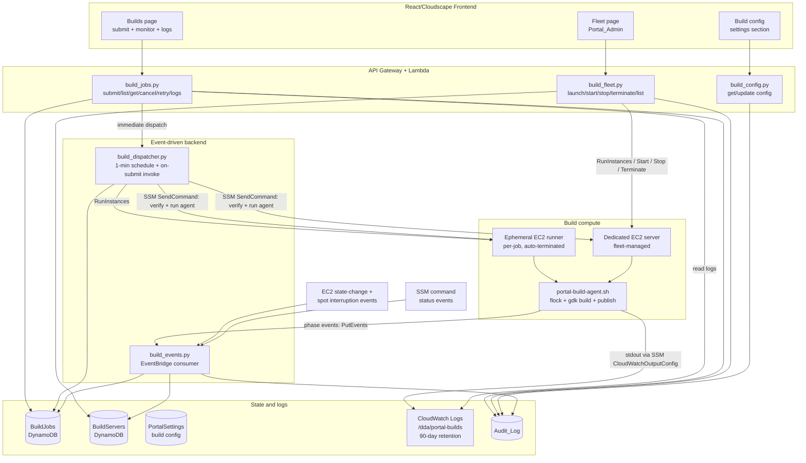
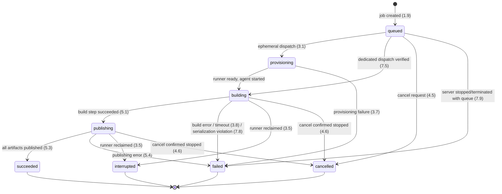
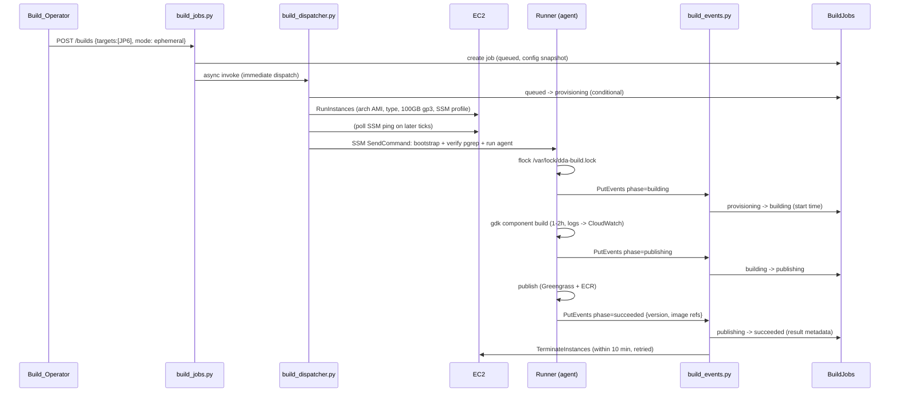
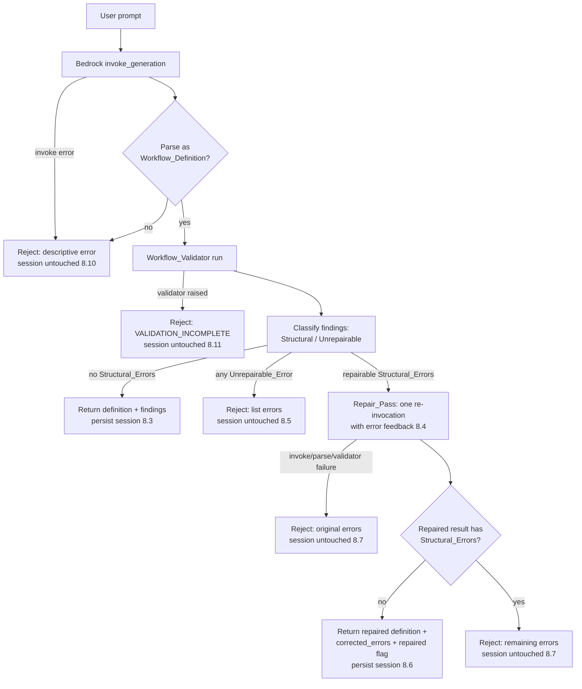

# Design Document: Portal Build Fleet and Workflow Gates

## Overview

This feature adds two capability areas to the edge CV portal:

1. **Portal-driven edge component builds with fleet management.** The manual flow today is: launch an ARM64 EC2 instance with `launch-arm64-build-server.sh`, SSH in, run `setup-build-server.sh`, swap the component name in `gdk-config.json`, run `gdk component build` (1–2 h, full GPU onnxruntime source build), and publish via `gdk component publish` plus ECR pushes for >2 GB artifacts. This design automates that flow behind a portal Build_Manager: Build_Jobs are submitted from a build page, dispatched either to on-demand **Ephemeral_Build_Runners** (EC2 instances provisioned per job and terminated after it — zero idle cost) or to **Dedicated_Build_Servers** managed from a portal Fleet_Manager page. All server interaction uses **SSM (no SSH)**, logs stream to **CloudWatch Logs**, and state lives in **DynamoDB**, following the portal's existing Lambda + API Gateway + DynamoDB + RBAC + audit patterns.

2. **Chat workflow generation gates.** `workflow_generator.py` (Bedrock Converse, `create_workflow` tool) currently returns whatever the model produces, validated but not gated — a graph with cycles, backwards edges, or missing input/output nodes reaches the canvas. This design inserts a **Generation_Gate** between generation and response/persistence: it runs the existing `workflow_core.validator`, classifies error-severity findings into Structural_Errors (and Unrepairable_Errors), executes at most one **Repair_Pass** re-invocation with error feedback, and fails closed — rejected generations never mutate the chat session or canvas snapshot, and the frontend displays the rejection details.

### Key design decisions (summary)

| Decision | Choice | Rationale |
|---|---|---|
| Ephemeral compute service | **On-demand EC2 instances launched per Build_Job** (spot optional via config) | Only realistic option that satisfies every hard constraint; see investigation below |
| Remote command execution | **SSM Run Command** with `CloudWatchOutputConfig` | No SSH, IAM-scoped, near-real-time log streaming, command status events |
| Build serialization | Four layers: DynamoDB conditional server allocation → pre-dispatch `pgrep` verification → on-server `flock` → periodic `pgrep` watchdog | Defense in depth for the "never two builds on one server" invariant (`.kiro/steering/builds.md`) |
| AMD64_NVIDIA target | New component `aws.edgeml.dda.LocalServer.amd64Nvidia`, recipe `recipe-amd64-nvidia.yaml`, arch token `x86_64_nvidia` | Follows the repo's existing naming precedent (`detect_arch.sh`, `Dockerfile.x86_64_nvidia`) |
| Structural/Unrepairable classification | Finding-code allowlist + deterministic unrepairability rules | Testable, deterministic, no LLM in the classification path |

## Ephemeral Compute Investigation

This section resolves the investigation area deferred from requirements: which service backs the Ephemeral_Build_Runner.

### Hard constraints

- **Docker daemon access.** The build chain is `gdk component build` → `build-custom.sh` → `docker-compose build` of large images (edgemlsdk, flask-app, react-webapp) plus `docker save`/tar packaging. The compute must run a full Docker daemon with image builds.
- **Both CPU architectures.** ARM64 (Graviton) runners for JP5/JP6; x86_64 runners for AMD64/AMD64_NVIDIA. The runner architecture must match the Build_Target.
- **Long, heavy builds.** 1–2 h per target (full GPU onnxruntime source build), ~100 GB disk, sizeable CPU/memory — the current manual reference is m6g.4xlarge (16 vCPU / 64 GiB).
- **Interruption mapping.** Compute reclamation must map to the `interrupted` Build_Job status with a retry action (Req 3.5/3.6).
- **Zero idle cost.** No compute provisioned while no ephemeral build is queued or running (Req 3.3).

### Options considered

| Option | Verdict | Reasoning |
|---|---|---|
| **ECS Fargate** | ❌ Rejected | Fargate does not support privileged containers or docker-in-docker; the docker daemon requirement is disqualifying. Also capped at 200 GiB ephemeral storage but the DinD blocker comes first. |
| **ECS on EC2** | ❌ Rejected | Docker works (privileged EC2 container instances), but ECS adds a cluster, capacity providers, ASGs, and task definitions purely to run one container per instance — the container would itself need DinD or host-socket access, reintroducing every EC2 concern plus an orchestration layer that provides no value for a strictly one-job-per-instance workload. |
| **EKS** | ❌ Rejected | Same DinD/host-access issues as ECS on EC2, plus an EKS control plane costs ~$70/month while idle — violating the zero-idle-cost goal — and Kubernetes operational burden is far out of proportion to the workload. |
| **CodeBuild** | ❌ Rejected (close second) | Attractive precedent (the portal already runs plugin builds on CodeBuild with EventBridge result handling in `plugin_builds.py`) and privileged mode supports Docker builds. Rejected on sizing: ARM compute types top out well below the m6g.4xlarge reference for memory, on-instance disk of the standard fleets is insufficient for the ~100 GB Docker workspace, and the build environment (snap docker, GDK, Python 3.11 from `setup-build-server.sh`) would have to be rebuilt as a custom build image maintained per architecture. The 1–2 h onnxruntime compile is exactly the kind of job CodeBuild's fixed compute menu fits poorly. |
| **EC2 on-demand, launched per job** | ✅ **Recommended** | Exactly reproduces the environment the build is known to work in (same AMI family, same `setup-build-server.sh`, same instance types), full Docker daemon, any instance size/arch, 100 GB gp3 volume, per-second billing with zero idle cost when instances are terminated after each job. Interruption semantics are simple (instance state-change events). The existing launch script is effectively a specification for the automation. |
| **EC2 spot** | ⚙️ Optional mode on top of the recommendation | ~60–70 % cheaper, but a 2 h build has meaningful interruption exposure. Supported as a configuration flag (`use_spot_for_ephemeral`, default false); the Spot Instance Interruption Warning EventBridge event maps directly to the `interrupted` status + retry (Req 3.5/3.6). Default remains on-demand for reliability. |

### Recommendation

**Ephemeral_Build_Runner = a per-job on-demand EC2 instance** (m6g.4xlarge for ARM64, m6i.4xlarge for x86_64 by default, both configurable), launched by the Build_Manager with a 100 GB gp3 root volume, an SSM-enabled instance profile (extending the existing `dda-build-role`), no SSH key pair and no inbound security group rules (SSM only), tagged `dda-build:ephemeral=true` and `dda-build:job-id={build_job_id}`, and terminated by the Build_Manager when the Build_Job reaches a terminal status. Spot is an opt-in configuration flag.

Note on AMD64_NVIDIA: the GPU onnxruntime build only needs the CUDA *toolchain* (nvcc compiles without a GPU present), so AMD64_NVIDIA builds run on plain x86_64 compute — no GPU instance types are required.

## Architecture

### Build fleet architecture



### Build job state machine



Terminal statuses (`succeeded`, `failed`, `interrupted`, `cancelled`) are never left once reached (Req 4.1). Every transition is executed as a DynamoDB conditional update (`ConditionExpression` on the expected current status), so a stale writer can never resurrect a terminal job or double-transition.

### Ephemeral build sequence



### Generation gate flow



The critical structural change in `workflow_generator.py`: **session persistence (snapshot `put_snapshot` + `save_session`) moves after the gate decision** and executes only on the accept paths. Today persistence happens unconditionally after validation; under this design a rejection returns before any session mutation, satisfying 8.1, 8.5, 8.7, 8.9, 8.10, 8.11 by construction.

## Components and Interfaces

### 1. Build Jobs API — `backend/functions/build_jobs.py`

New Lambda following the portal handler conventions (error envelope `{error: {code, message, details}}`, `get_user_from_event`, `log_audit_event`).

Routes:

| Route | Method | Permission | Behavior |
|---|---|---|---|
| `/builds` | POST | `builds:submit` | Validate + create Build_Jobs (Req 1, 2), audit `build_requested`, async-invoke dispatcher |
| `/builds` | GET | `builds:read` | 90-day history, most recent first, paginated (Req 4.7) |
| `/builds/{id}` | GET | `builds:read` | Job detail (Req 4.3) |
| `/builds/{id}/logs` | GET | `builds:read` | CloudWatch Logs page for the job's log stream (`nextToken` pagination) (Req 4.4) |
| `/builds/{id}/cancel` | POST | `builds:cancel` | Cancel queued (immediate) or running (SSM stop + confirm) job (Req 4.5, 4.6, 4.8–4.10) |
| `/builds/{id}/retry` | POST | `builds:submit` | New job cloned from an interrupted job with `retry_of` reference (Req 3.6) |

Submit validation (pure function `validate_build_request(body, servers, config) -> ValidationResult`, unit- and property-testable):

1. `targets` non-empty (Req 1.8), every entry ∈ {JP5, JP6, AMD64, AMD64_NVIDIA} (Req 1.4).
2. `execution_mode` present and ∈ {ephemeral, dedicated}; dedicated requires `server_id` (Req 2.6).
3. Dedicated: server exists, lifecycle state is `running` (Req 2.4), and server CPU architecture matches the required architecture of **every** selected target (Req 2.8). Target→arch map: JP5/JP6→arm64, AMD64/AMD64_NVIDIA→x86_64.
4. On success: one Build_Job per target in request order (Req 1.3), all sharing `request_id` and the same execution mode/server (Req 2.7), each with `request_order` and `predecessor_job_id` chaining (job *n* is dispatchable only after job *n−1* is terminal — any terminal status, Req 1.3). Each job snapshots the effective configuration at creation (`config_snapshot`, Req 9.3) and starts `queued` (Req 1.9).

RBAC: Build_Operator maps to two new permissions `builds:submit`/`builds:cancel` plus `builds:read`, registered in `shared_utils` RBACManager and granted globally (builds are not Use_Case-scoped; the `allow_global`/`'global'` scope pattern from `rbac_middleware.py` applies). Grant matrix: DataScientist, UseCaseAdmin, PortalAdmin → Build_Operator; every authenticated portal role → `builds:read` is **not** granted by default — read follows Build_Operator too, keeping build logs (which may contain account identifiers) restricted. Denials return the standard authorization error and record a denied-access Audit_Log entry (Req 1.6, 4.10).

### 2. Fleet API — `backend/functions/build_fleet.py`

| Route | Method | Permission | Behavior |
|---|---|---|---|
| `/build-servers` | GET | `builds:read` | Fleet list with live EC2 state reconciliation (Req 6.1) |
| `/build-servers` | POST | PortalAdmin | Launch: RunInstances (arch-selected AMI + configured type/volume), bootstrap via user-data (`setup-build-server.sh` equivalent), register in BuildServers (Req 6.5) |
| `/build-servers/{id}/start` | POST | PortalAdmin | StartInstances when `stopped` (Req 6.2, 6.10) |
| `/build-servers/{id}/stop` | POST | PortalAdmin | StopInstances when `running` and no running Build_Job (Req 6.3, 6.4, 6.10) |
| `/build-servers/{id}` | DELETE | PortalAdmin | Terminate with `confirm: "<server name>"` body echo (explicit confirmation, Req 6.6, 6.12; no running Build_Job, Req 6.4) |

Fleet actions use `super_user_only`-equivalent PortalAdmin checks (Req 6.7) and audit every action outcome (Req 6.8). Lifecycle state shown is the EC2 state (`pending, running, stopping, stopped, shutting-down, terminated`); the list endpoint reconciles DynamoDB with `DescribeInstances` on read, and `build_events.py` updates state on EC2 state-change notifications so the UI (polling at 15 s) reflects changes within 30 s (Req 6.9). Action-state validation is a pure function `validate_fleet_action(action, server, running_job) -> ValidationResult` (Req 6.4, 6.10). A `pending_action` marker with a deadline supports the 10-minute expected-state watchdog (Req 6.11), checked by the dispatcher tick.

Launched servers reuse the hardened profile of the ephemeral runners: extended `dda-build-role` (SSM core + build permissions from `launch-arm64-build-server.sh`, minus any SSH exposure), no key pair, security group with no inbound rules, IMDSv2 required. Ubuntu 22.04 AMIs (arm64/amd64) replace the 18.04 AMI of the manual script; user-data runs the build-environment bootstrap (docker, GDK, Python 3.11, AWS CLI — the `setup-build-server.sh` steps) and clones the source repository.

### 3. Dispatcher — `backend/functions/build_dispatcher.py`

Invoked two ways: asynchronously on submit (so ephemeral provisioning starts well within 60 s, Req 3.1) and by a 1-minute EventBridge schedule (queue promotion within 5 min of a terminal status, Req 7.3; re-verification every 5 min, Req 7.6; watchdogs).

Per tick, in order:

1. **Dispatch eligible queued jobs.** A queued job is eligible when its `predecessor_job_id` is null or terminal (Req 1.3). For dedicated mode: allocate the server with a conditional update on BuildServers (`SET running_build_job_id = :job IF attribute_not_exists(running_build_job_id)`) — the authoritative serialization lock (Req 7.1, 7.2); on success run the **pre-dispatch verification** SSM command (`pgrep -af "gdk component build"; pgrep -af "build-custom.sh"` per `.kiro/steering/builds.md`); if a build process is found, release nothing — return the job to the head of the queue (`queued`, `deferred_at` set) and retry on later ticks at ≥5-minute intervals (Req 7.5, 7.6). If clean, SendCommand the build agent and transition `queued → building`.
2. **Provision ephemeral runners.** For eligible ephemeral queued jobs: transition `queued → provisioning` (conditional), RunInstances with the architecture required by the Build_Target and the job's `config_snapshot` sizing (Req 3.1), exactly one runner per job (Req 7.4). On later ticks, once the instance is SSM-managed (DescribeInstanceInformation ping), SendCommand the agent. RunInstances failure → `failed` with the provisioning cause, terminate any partial compute, audit (Req 3.7).
3. **Runtime watchdog.** Any `building`/`publishing` job past its `config_snapshot.max_runtime_hours` (default 4): SSM stop command, mark `failed` (timeout error), logs retained (Req 3.8).
4. **Serialization watchdog.** For every server with a running job: SSM `pgrep -c` count of build processes (interval ≤5 min via the 1-minute tick with a per-server `last_checked_at`, Req 7.7). Count ≥2 → SSM `pkill` all build process trees within 60 s, mark each associated job `failed` with `SERIALIZATION_VIOLATION`, retain logs, audit (Req 7.8).
5. **Termination watchdog.** Ephemeral runners whose job is terminal: TerminateInstances (target ≤10 min, Req 3.2/2nd attempt cadence ≤10 min for up to 1 h; still alive after 1 h → notify Portal_Admins via SNS topic + audit `orphaned_runner` (Req 3.9)).
6. **Queue-orphan sweep.** Dedicated server observed `stopped`/`terminated` with queued jobs → each queued job `failed` with a server-state error + audit (Req 7.9). Pending fleet actions past their 10-minute deadline → surfaced error + audit (Req 6.11).

The 1-minute tick bounds every "within 5 minutes" requirement; per-item `last_*_at` timestamps enforce the 5-minute lower bounds where required (7.6, 7.7).

### 4. Event consumer — `backend/functions/build_events.py`

EventBridge rules → one Lambda:

| Event | Handling |
|---|---|
| Custom `dda.portal.builds` phase events from the agent (`building`, `publishing`, `succeeded`, `failed`, with payloads) | Conditional status transitions; record start/end times, result metadata (component version, image refs) or error; audit `build_published` on success (Req 5.3, 5.5), publishing failures recorded with partial-artifact detail (Req 5.4) |
| EC2 Spot Instance Interruption Warning / instance state-change to `stopped`/`terminated` for an instance with a non-terminal job | Job → `interrupted`, logs retained (already in CloudWatch), retry action available (Req 3.5) |
| EC2 instance state-change for fleet instances | BuildServers state + `last_state_change_at` update; clear `pending_action` when the expected state is reached (Req 6.2, 6.3, 6.9, 6.11) |
| SSM Command status change to `Failed`/`TimedOut`/`Cancelled` for a job's agent command | If the job is still `building`/`publishing` and no agent terminal event arrived: `failed` (or `interrupted` when caused by instance loss) |

Idempotence: every transition is a conditional update keyed on the expected prior status; duplicate EventBridge delivery is a no-op (same pattern as `plugin_builds.py` build-id idempotence).

### 5. Build agent — `scripts/portal-build-agent.sh` (repo) + SSM document

A wrapper script executed on the build server via SSM SendCommand (`AWS-RunShellScript` with `CloudWatchOutputConfig` streaming stdout/stderr to `/dda/portal-builds`, stream name `{build_job_id}`; log group retention 90 days minimum — Req 3.4, 4.4). Parameters: `BUILD_JOB_ID`, `BUILD_TARGET`, `EVENT_BUS`, `SOURCE_REF`.

Agent steps:

1. `exec 9>/var/lock/dda-build.lock; flock -n 9 || exit 75` — on-server mutual exclusion, defense in depth under the DynamoDB allocation lock (Req 7.1).
2. Sync source: `git fetch && git checkout {SOURCE_REF}` in the server's repo clone (cloned at bootstrap; ref from configuration, default the repo default branch).
3. Emit `phase=building` via `aws events put-events` (instance role gains `events:PutEvents` scoped to the portal bus).
4. Map `BUILD_TARGET` → build arguments and run the non-interactive build+publish:
   - JP5 → `aarch64 5` (`aws.edgeml.dda.LocalServer.arm64JP5`, `recipe-arm64-jp5.yaml`)
   - JP6 → `aarch64 6` (`aws.edgeml.dda.LocalServer.arm64JP6`, `recipe-arm64-jp6.yaml`)
   - AMD64 → `x86_64` (`aws.edgeml.dda.LocalServer.amd64`, `recipe-amd64.yaml`)
   - AMD64_NVIDIA → `x86_64_nvidia` (`aws.edgeml.dda.LocalServer.amd64Nvidia`, `recipe-amd64-nvidia.yaml` — see below)
   The agent invokes a new non-interactive entry point `portal-build.sh` (a refactor of `gdk-component-build-and-publish.sh` that removes the interactive InferenceUploader prompt, emits a `phase=publishing` event between build and publish, and prints a machine-readable result line `PORTAL_BUILD_RESULT {json}` with the component name, published version, and pushed image references).
5. On success: emit `phase=succeeded` with the parsed result metadata. On failure: emit `phase=failed` with the exit stage (build vs publish distinguished — a publish-stage failure carries `error_kind=publishing` and the per-artifact published/unpublished lists, Req 5.4).
6. Release the lock (implicit on exit).

Credentials: the instance profile provides Greengrass/S3/ECR publish permissions (the `dda-build-role` policy from `launch-arm64-build-server.sh`, extended with `ecr:PutImage`/`ecr:InitiateLayerUpload`/`ecr:UploadLayerPart`/`ecr:CompleteLayerUpload`/`ecr:CreateRepository` and `events:PutEvents`), removing the manual script's SSO-credential gymnastics entirely.

Cancellation of a running job: `build_jobs.py` sends an SSM stop command (`pkill -f "gdk component build"; pkill -f "build-custom.sh"; pkill -f "portal-build.sh"`), then confirms via a `pgrep` verification command; only when the confirmation shows no build processes within 5 minutes is the job marked `cancelled` — otherwise the job keeps its status and the caller gets an error naming the server (Req 4.6, 4.9).

### 6. AMD64_NVIDIA Build_Target definition

The repository has the architecture token `x86_64_nvidia` (`station_install/quick_setup/detect_arch.sh`) and a plugin build image (`Dockerfile.x86_64_nvidia`) but no LocalServer component for it. This design defines:

- **Component name:** `aws.edgeml.dda.LocalServer.amd64Nvidia` (follows the `amd64`/`arm64JP5`/`arm64JP6` suffix convention).
- **Recipe:** `recipe-amd64-nvidia.yaml`, cloned from `recipe-amd64.yaml` with the component name replaced and the docker-compose profile/GPU runtime settings for NVIDIA x86 hosts.
- **`build-custom.sh` extension:** the existing name-derivation gains one case — a component name containing `Nvidia` sets `IS_X86_NVIDIA=1`, which (a) sets `ONNXRUNTIME_GPU=1` on x86 (today GPU onnxruntime is gated to JP5/JP6 only), and (b) selects `BACKEND_DOCKERFILE=Dockerfile.x86_64_nvidia` (new backend Dockerfile on a CUDA x86 base image, following the plugin-image precedent).
- **Build compute:** plain x86_64 (m6i.4xlarge default) — the CUDA toolchain compiles without a GPU device.
- **`gdk-component-build-and-publish.sh` / `portal-build.sh`:** accept `x86_64_nvidia` as an ARCH value mapping to the new component/recipe.

Changes to `build-custom.sh` and `src/backend` Dockerfiles touch security-preservation-tracked files; the implementation must update the golden baselines under `test/backend-test/security/baselines/` in the same change (per `.kiro/steering/builds.md`).

### 7. Configuration — `backend/functions/build_config.py`

Stored in the existing PortalSettings table under key `build_infrastructure_config`:

| Parameter | Default (Req 9.2) |
|---|---|
| `arm64_instance_type` | `m6g.4xlarge` |
| `x86_64_instance_type` | `m6i.4xlarge` |
| `volume_size_gb` | `100` |
| `region` | `us-east-1` |
| `max_runtime_hours` | `4` |
| `ephemeral` (cpu/memory/storage sizing → instance type + volume per arch) | same as above |
| `use_spot_for_ephemeral` | `false` |
| `source_ref` | repo default branch |

Routes: `GET /build-config` (`builds:read`), `PUT /build-config` (PortalAdmin only, Req 9.6). Validation (pure function `validate_build_config(update) -> ValidationResult`): instance type family architecture must match the architecture slot it is configured for (instance-family→arch lookup table: `m6g/c7g/r6g/…`→arm64, `m6i/m5/c6i/…`→x86_64), volume size a positive number, max runtime a positive duration (Req 9.5); invalid updates rejected atomically, prior value retained. Every applied change writes an Audit_Log entry with parameter, prior value, new value, user, time (Req 9.4). Reads apply per-field documented defaults for absent values (Req 9.2). Jobs snapshot config at creation; the dispatcher and agent only ever read `config_snapshot` (Req 9.3).

### 8. Generation_Gate — `backend/functions/generation_gate.py`

A new pure-logic module in the same Lambda bundle as `workflow_generator.py` (no AWS clients — fully unit/property testable), plus surgical changes to `workflow_generator.py`.

```python
# generation_gate.py — public interface

STRUCTURAL_ERROR_CODES: frozenset  # validator finding codes that are Structural_Errors

@dataclass
class GateDecision:
    action: str                    # 'accept' | 'repair' | 'reject'
    structural_errors: list        # wire-form findings classified structural
    unrepairable_errors: list      # subset classified unrepairable
    all_findings: list             # complete findings list (wire form)

def classify(findings, catalog) -> GateDecision
def build_repair_message(definition_json, structural_errors) -> str
def user_readable_errors(structural_errors, definition) -> list[dict]
    # [{code, message, affected: [{id, displayName, kind: node|connection}], explanation}]
```

**Structural_Error classification (Req 8.2).** An error-severity validator finding is a Structural_Error iff its code is in `STRUCTURAL_ERROR_CODES`, which maps the eight required categories onto `workflow_core.validator` finding codes:

| Category (Req 8.2) | Validator finding code(s) |
|---|---|
| Incompatible port-type connection | port-type-mismatch code |
| Backwards edge (not output→input) | connection-endpoint-direction code |
| Cycle | cycle code |
| Node unreachable from an input node | unreachable-node code |
| Connection referencing nonexistent node/port | unknown-node-ref / unknown-port-ref codes |
| No input-category node | missing-input-node code |
| No output-category node | missing-output-node code |
| Node types that cannot coexist | coexistence-conflict code |

The exact code constants are taken from `workflow_core.validator` at implementation time and pinned in `STRUCTURAL_ERROR_CODES`; a unit test asserts every listed category has a mapped code. Error-severity findings **not** in the set (e.g. parameter-constraint violations, unresolved model references) are not Structural_Errors — they flow to the client inside the complete findings list as today (Req 8.3).

**Unrepairable_Error classification rules** (deferred from requirements — defined here, deterministic):

1. **Catalog impossibility:** a missing-input-node or missing-output-node finding when the effective (merged, per-Use_Case) catalog contains *no* node type of that category. No Repair_Pass can add a node type that does not exist.
2. **Overwhelmed graph:** the count of Structural_Errors exceeds `UNREPAIRABLE_ERROR_THRESHOLD` (constant, 10). A graph that broken indicates generation collapse; one repair pass over it predictably fails and wastes a long Bedrock call.
3. Everything else — including coexistence conflicts, cycles, backwards edges, unreachable nodes, dangling references — is repairable (the model can remove/rewire offending nodes).

**Decision function:** no Structural_Errors → `accept`; any Unrepairable_Error → `reject` (no Repair_Pass, Req 8.5); otherwise → `repair` (exactly one pass, Req 8.4).

**`workflow_generator.py` changes:**

- After the existing parse + validate of the first generation: call `classify`. On `accept`, proceed exactly as today (persist, respond) plus `gate` metadata. On `reject`, return `422 GENERATION_REJECTED` with `user_readable_errors` — **before** `put_snapshot`/`save_session`, so session and canvas are untouched (Req 8.5, 8.9).
- On `repair`: build the repair message (`build_repair_message` embeds the failed definition JSON and each structural error with affected ids and instructions to correct them), append it as one additional user turn to the same Converse message list, and re-invoke `invoke_generation` once. Parse + validate + classify the result:
  - No Structural_Errors → respond with the repaired definition, complete findings, `gate.repaired = true`, `gate.corrected_errors` = the original structural errors (Req 8.6); persist session with the repaired definition.
  - Repair invocation failed / output unparseable → reject with the **original** structural errors (Req 8.7, 8.10).
  - Result still has Structural_Errors → reject with the remaining errors (Req 8.7).
- Fail-closed wrapper: the validator call is wrapped in try/except; any validator exception → `422 GENERATION_VALIDATION_INCOMPLETE`, session untouched (Req 8.11). The existing unparseable-output path (`GENERATED_DEFINITION_INVALID`) is retained and now provably precedes persistence (Req 8.10).

Response additions (accept paths):

```json
"gate": {
  "passed": true,
  "repaired": false,
  "corrected_errors": [],
  "structural_error_codes": []
}
```

Rejection envelope (`422`):

```json
{"error": {"code": "GENERATION_REJECTED", "message": "...",
  "details": {"structural_errors": [
    {"code": "CYCLE", "message": "...",
     "affected": [{"id": "n3", "displayName": "Tracker", "kind": "node"}],
     "explanation": "These nodes form a loop, so data would circulate forever and never reach an output."}],
   "repair_attempted": true, "prompt_preserved": true}}}
```

### 9. Frontend

**Builds page** (`frontend/src/pages/builds/BuildsPage.tsx` + detail): Cloudscape `Table` of jobs (90-day history, most recent first; status `Badge`, target, mode, requester, times, published version for succeeded jobs — Req 4.3, 4.7); submit `Form` with target multi-select (ordered) and execution-mode `RadioGroup` — the dedicated option lists running servers and is the only path to a server selection; when the fleet has no non-terminated server, ephemeral is the only selectable mode (Req 2.1, 2.5); job detail page with a log viewer polling `/builds/{id}/logs` every 30 s while running (Req 4.4) and status polling every 15 s (Req 4.2); cancel and retry actions per status.

**Fleet page** (`frontend/src/pages/admin/FleetPage.tsx`, PortalAdmin-gated like UserManager): server table (name, instance id, type, architecture, lifecycle state with 15 s polling, running Build_Job link, last state change — Req 6.1, 6.9); launch modal (name + architecture radio); start/stop buttons enabled by state; terminate flow with a type-the-name confirmation `Modal` (Req 6.6, 6.12).

**Build settings** section (existing settings page): the configuration form with validation errors surfaced per field (Req 9).

**Chat generation rejection display** (`pages/workflows` chat panel): on `GENERATION_REJECTED` / `GENERATION_VALIDATION_INCOMPLETE`, render a Cloudscape `Alert type="error"` listing each structural error with affected node/connection display names (falling back to ids) and the plain-language explanation; the prompt input retains the submitted text for retry (Req 8.8; prompt preservation is client-side — the input is only cleared on success). On a repaired acceptance, render an `Alert type="info"` "automatic correction applied" listing the corrected errors (Req 8.6).

### 10. Infrastructure — `infrastructure/lib/build-fleet-stack.ts`

New CDK stack following `node-designer-stack.ts` patterns:

- DynamoDB: `BuildJobs` (+ GSIs), `BuildServers` (PAY_PER_REQUEST, PITR).
- Lambdas: `build_jobs`, `build_fleet`, `build_config`, `build_dispatcher`, `build_events` (shared-utils layer; environment carries table names, log group, event bus name, SNS topic).
- EventBridge: 1-minute schedule → dispatcher; rules for EC2 state-change, spot interruption, SSM command status, and the custom `dda.portal.builds` source → `build_events`.
- CloudWatch Logs group `/dda/portal-builds` (retention ≥ 90 days).
- SNS topic `dda-portal-build-alerts` (orphaned-runner notifications, Req 3.9) with Portal_Admin subscription support.
- IAM: dispatcher/fleet Lambdas get scoped `ec2:RunInstances/Start/Stop/TerminateInstances/Describe*` (condition-keyed to `dda-build:*` tags), `ssm:SendCommand/GetCommandInvocation/DescribeInstanceInformation`; instance role = extended `dda-build-role` (created by CDK, replacing the launch script's inline creation) with `events:PutEvents` (portal bus), CloudWatch Logs, and the publish permissions.
- API Gateway routes wired into the existing REST API (same authorizer).

Note: the build Lambdas' EC2/SSM permissions and the instance profile are deliberately narrow — the runners have no inbound network exposure and no SSH key; all access is IAM-audited SSM.

## Data Models

### BuildJobs (DynamoDB)

```
PK: build_job_id (S, uuid)
GSI1 status-index:  PK status, SK created_at
GSI2 server-index:  PK server_id, SK created_at
GSI3 request-index: PK request_id, SK request_order

{
  "build_job_id": "uuid",
  "request_id": "uuid",              // groups jobs from one multi-target submit
  "request_order": 0,                // position within the request (Req 1.3)
  "predecessor_job_id": "uuid|null", // sequential chain within a request
  "build_target": "JP5|JP6|AMD64|AMD64_NVIDIA",
  "component_name": "aws.edgeml.dda.LocalServer.arm64JP5",
  "required_arch": "arm64|x86_64",
  "execution_mode": "ephemeral|dedicated",
  "server_id": "srv-...|null",       // dedicated selection / assignment
  "status": "queued|provisioning|building|publishing|succeeded|failed|interrupted|cancelled",
  "requested_by": "user-id",         // Req 1.5
  "created_at": 1699999999999,       // ms epoch (Req 1.5)
  "dispatched_at": null,
  "started_at": null,                // building entry (Req 4.3)
  "ended_at": null,                  // terminal entry (Req 4.3)
  "deferred_at": null,               // last 7.6 deferral
  "retry_of": "uuid|null",           // Req 3.6
  "config_snapshot": { ...effective config at creation... },  // Req 9.3
  "runner": {                        // ephemeral mode
    "instance_id": "i-...", "instance_type": "m6g.4xlarge",
    "arch": "arm64", "spot": false,
    "terminate_attempts": 0, "terminate_first_failed_at": null   // Req 3.9
  },
  "ssm": {"command_id": "...", "last_serialization_check_at": null},
  "log": {"group": "/dda/portal-builds", "stream": "{build_job_id}"},
  "result": {                        // set on succeeded (Req 5.3)
    "component_version": "1.4.2",
    "image_refs": ["<acct>.dkr.ecr.../dda/flask-app:1.4.2", "..."]
  },
  "publish_partial": {"published": [], "unpublished": []},  // Req 5.4
  "error": {"code": "TIMEOUT|PROVISIONING_FAILED|SERIALIZATION_VIOLATION|PUBLISHING_FAILED|...",
            "message": "..."},
  "ttl": <created_at + 180 days>     // DynamoDB TTL; > 90-day retention floor (Req 3.4, 4.7)
}
```

### BuildServers (DynamoDB)

```
PK: server_id (S, uuid)

{
  "server_id": "srv-uuid",
  "name": "arm64-builder-1",
  "instance_id": "i-...",
  "instance_type": "m6g.4xlarge",
  "cpu_architecture": "arm64|x86_64",
  "lifecycle_state": "pending|running|stopping|stopped|shutting-down|terminated",
  "last_state_change_at": 1699999999999,      // Req 6.1
  "running_build_job_id": "uuid|absent",       // serialization allocation lock (Req 7.1)
  "pending_action": {"action": "start|stop|terminate|launch",
                     "requested_by": "...", "requested_at": ..., "deadline_at": ...},  // Req 6.11
  "created_by": "user-id",
  "created_at": ...,
  "terminated_at": null
}
```

The Build_Queue is not a separate table: it is the set of `queued` BuildJobs for a `server_id` ordered by `created_at` (GSI2), with 7.6 deferrals returning to the head because the deferred job retains its original `created_at`.

### PortalSettings — `build_infrastructure_config`

As listed in Components §7; single item, updated atomically, every field optional with documented defaults applied on read (Req 9.2).

### Workflow chat session (existing table, unchanged schema)

No schema change; the behavioral change is that `messages`, `current_definition_key`, and the S3 snapshot are only written on gate-accepted generations. A Repair_Pass records **one** user/assistant turn pair (the original prompt and the final assistant text) — repair-internal turns are not persisted, keeping history consistent with what the user sees (Req 8.9).

### Generation gate wire additions

`POST /workflows/generate` response gains the `gate` object (accept paths) and the `GENERATION_REJECTED` / `GENERATION_VALIDATION_INCOMPLETE` error envelopes (reject paths), as specified in Components §8.

## Correctness Properties

*A property is a characteristic or behavior that should hold true across all valid executions of a system — essentially, a formal statement about what the system should do. Properties serve as the bridge between human-readable specifications and machine-verifiable correctness guarantees.*

The properties below target the pure decision functions this design deliberately factors out (`validate_build_request`, job creation, the dispatcher planner, the status transition table, `validate_fleet_action`, `validate_build_config`, config defaults, and the entire `generation_gate` module), so each is implementable as a single property-based test without AWS dependencies (Bedrock and storage mocked where the generator flow is exercised).

### Property 1: Build request validation accepts exactly the valid requests

*For any* build request (target list, execution mode, optional server id) and fleet state, `validate_build_request` accepts the request if and only if: the target list is non-empty and every target is one of JP5/JP6/AMD64/AMD64_NVIDIA, the execution mode is ephemeral or dedicated, and — when dedicated — a server id is given, that server exists, its lifecycle state is `running`, and its CPU architecture matches the required architecture of every selected target; every rejection creates zero Build_Jobs and carries an error identifying the failing rule (supported targets, missing selection, server state, or the server/target architecture pair).

**Validates: Requirements 1.4, 1.8, 2.4, 2.6, 2.8**

### Property 2: Job creation records the request faithfully

*For any* valid build request, exactly one Build_Job is created per selected Build_Target, in request order, each recording the requesting user, its Build_Target, the request's execution mode (and selected server for dedicated mode, identical across all jobs of the request), the submission time, a snapshot of the effective configuration, the `queued` initial status, and — for every job after the first — a predecessor reference to the previous job in the order.

**Validates: Requirements 1.2, 1.3, 1.5, 1.9, 2.7**

### Property 3: Sequential dispatch eligibility within a request

*For any* Build_Job with a predecessor reference and any predecessor status, the job is dispatch-eligible if and only if the predecessor's status is terminal (succeeded, failed, interrupted, or cancelled) — regardless of which terminal status.

**Validates: Requirements 1.3**

### Property 4: Server allocation never exceeds one job per server

*For any* sequence of dispatch, completion, and queue operations over any set of Build_Jobs and Dedicated_Build_Servers, at every step each server has at most one job in a running state (building/publishing) allocated to it; a job dispatched to a server that already holds an allocation is placed in that server's queue with the `queued` status, and every dedicated dispatch targets exactly the server selected in the job's request.

**Validates: Requirements 7.1, 7.2, 2.2**

### Property 5: Ephemeral runner/job one-to-one

*For any* dispatcher planning run over any set of queued ephemeral Build_Jobs, the plan provisions exactly one Ephemeral_Build_Runner per dispatched job and zero runners when no ephemeral job is queued or running, and each planned runner's CPU architecture and sizing derive from the job's Build_Target and the job's own `config_snapshot`.

**Validates: Requirements 2.3, 7.4, 3.1, 3.3**

### Property 6: Pre-dispatch verification gates the start

*For any* pre-dispatch verification result (generated `pgrep` output), the dispatch decision starts the build if and only if the output contains no build process; otherwise the job returns to its server's queue keeping its original submission time (so it remains at the head in submission order), and re-verification is attempted only when at least the retry interval has elapsed since the last attempt.

**Validates: Requirements 7.5, 7.6**

### Property 7: Status transitions follow the state machine and terminal states absorb

*For any* (current status, event) pair — events drawn from dispatch, phase events (building, publishing, succeeded, failed), interruption, cancellation, timeout, and serialization violation — the transition function yields a status reachable via the defined state-machine edges, a Build_Job always holds exactly one status, and every event applied to a terminal status (succeeded, failed, interrupted, cancelled) leaves the status unchanged.

**Validates: Requirements 4.1, 5.1**

### Property 8: Watchdog deadline arithmetic

*For any* generated timestamps and configured limits: a running job is timed out if and only if its elapsed runtime exceeds its `config_snapshot` maximum (marked failed with a timeout error); a failed termination is retried if and only if less than 1 hour has passed since the first failure with at most the 10-minute interval between attempts, and the orphaned-runner notification fires exactly when the retry window is exhausted; a pending fleet action is reported failed if and only if its 10-minute deadline has passed; a running server's serialization check is due if and only if at least the check interval has elapsed since its last check.

**Validates: Requirements 3.8, 3.9, 6.11, 7.7**

### Property 9: Cancellation semantics by status

*For any* Build_Job status and any cancellation request: a queued job becomes cancelled and leaves the queue; a running job (building/publishing) becomes cancelled if and only if the stop is confirmed (no build process found within the confirmation window), and otherwise keeps its current status with an error identifying the Build_Server; a terminal job is rejected unchanged with an error identifying its current status.

**Validates: Requirements 4.5, 4.6, 4.8, 4.9**

### Property 10: Result and failure recording on completion events

*For any* agent completion event: a succeeded event's component version and image references are recorded verbatim on the Build_Job which reaches `succeeded`; a publishing-stage failure marks the job failed with an error kind distinct from a build failure and preserves the published/unpublished artifact lists exactly as reported.

**Validates: Requirements 5.3, 5.4**

### Property 11: Queue promotion picks the oldest queued job

*For any* set of queued Build_Jobs for one server with distinct submission times, when the server's current job reaches a terminal status the promotion function selects the job with the earliest submission time.

**Validates: Requirements 7.3**

### Property 12: Serialization violation and dead-server sweeps

*For any* detected build-process count on a server and any set of associated jobs: the stop-all/fail-all action is taken if and only if the count is two or more, and then every associated Build_Job is marked failed with the serialization-violation error; and *for any* server lifecycle state with queued jobs, every queued job for that server is marked failed with a server-state error if and only if the state is stopped or terminated.

**Validates: Requirements 7.8, 7.9**

### Property 13: Fleet action validation table

*For any* (action, lifecycle state, running-job presence) combination, `validate_fleet_action` permits: start if and only if the state is `stopped`; stop if and only if the state is `running` and no Build_Job is running on the server; terminate if and only if the state is not `terminated` and no Build_Job is running on the server; every rejection identifies the server's current lifecycle state, and rejections for a running Build_Job identify that job.

**Validates: Requirements 6.4, 6.10**

### Property 14: Configuration defaults and validation

*For any* partial configuration object (random subset of fields present), the effective configuration read contains every parameter, equal to the stored value when present and to the documented default otherwise (m6g.4xlarge, m6i.4xlarge, 100 GB, us-east-1, 4 h); and *for any* configuration update, `validate_build_config` accepts if and only if each supplied instance type's family architecture matches its slot, the volume size is a positive number, and the maximum runtime is a positive duration — a rejected update leaves the stored configuration unchanged.

**Validates: Requirements 9.2, 9.5**

### Property 15: Config snapshots are immutable under config changes

*For any* created Build_Job and any subsequent sequence of configuration changes, the job's `config_snapshot` is unchanged and every dispatcher planning decision for that job derives from the snapshot, not the current configuration.

**Validates: Requirements 9.3**

### Property 16: Build history ordering and content

*For any* set of Build_Jobs with random creation times and statuses, the history listing is ordered most recent first, and every succeeded job's entry includes its published artifact identifiers.

**Validates: Requirements 4.7**

### Property 17: Structural error classification

*For any* generated findings list, `classify` marks a finding as a Structural_Error if and only if its severity is error and its code belongs to the structural code set (port-type mismatch, backwards edge, cycle, unreachable node, unknown node/port reference, missing input node, missing output node, coexistence conflict); and marks a Structural_Error as Unrepairable if and only if it is a missing-input/output-node finding with no catalog node type of that category, or the total Structural_Error count exceeds the threshold.

**Validates: Requirements 8.2**

### Property 18: Gate decision function

*For any* classified findings: the decision is accept if and only if there are no Structural_Errors (and then the complete findings list is passed through unmodified); reject-without-repair if and only if at least one Structural_Error is Unrepairable; and repair otherwise.

**Validates: Requirements 8.3, 8.5**

### Property 19: At most one Repair_Pass per generation request

*For any* first-pass generation result carrying repairable Structural_Errors, and any repair outcome (clean result, result still containing Structural_Errors, unparseable output, or invocation failure), the Workflow_Generator is invoked exactly twice in total for the request — never more; and when the first pass has no Structural_Errors or any Unrepairable_Error, it is invoked exactly once.

**Validates: Requirements 8.4, 8.5**

### Property 20: Repair outcome shaping

*For any* repair pass over original Structural_Errors: a structurally clean repaired result is returned with the repaired definition, its complete findings list, the original Structural_Errors as `corrected_errors`, and the automatic-correction indication; a repair that fails to complete rejects with the original Structural_Errors; and a repaired result still containing Structural_Errors rejects with the remaining Structural_Errors — every rejection listing each error in user-readable form.

**Validates: Requirements 8.6, 8.7**

### Property 21: Session persistence if and only if the gate accepts

*For any* generation flow outcome — accept, repaired accept, unrepairable rejection, failed-repair rejection, unparseable model output (first or repair pass), or a validator exception — the chat session item, message history, and canvas snapshot are written if and only if the outcome is an acceptance; every rejection returns a user-readable error and performs zero writes to the session table and snapshot store.

**Validates: Requirements 8.1, 8.5, 8.7, 8.9, 8.10, 8.11**

### Property 22: User-readable error rendering is total

*For any* Structural_Error over any Workflow_Definition, `user_readable_errors` produces an entry containing the error code, the affected nodes or connections resolved to their identifier and display name (identifier alone when no display name exists), and a non-empty plain-language explanation.

**Validates: Requirements 8.8**

### Property 23: Interruption and retry preserve job identity

*For any* Build_Job in a non-terminal status whose runner emits an interruption event, the job's status becomes `interrupted` (terminal jobs are unchanged); and *for any* interrupted Build_Job, the retry action creates a new Build_Job with the same Build_Target and execution mode carrying a reference to the interrupted job.

**Validates: Requirements 3.5, 3.6**

## Error Handling

### Build fleet

| Failure | Handling | Req |
|---|---|---|
| Invalid build request (targets, mode, server, arch) | `400` validation error naming the failing rule; no Build_Job created | 1.4, 1.8, 2.4, 2.6, 2.8 |
| Unauthorized submit / cancel / fleet action / config change | `403` standard authorization envelope + denied-access Audit_Log entry | 1.6, 4.10, 6.7, 9.6 |
| `RunInstances` failure (ephemeral) | Job `failed` with `PROVISIONING_FAILED` + cause; partial compute terminated; audited | 3.7 |
| Spot reclaim / instance loss mid-build | Job `interrupted` via EventBridge event; logs already durable in CloudWatch; retry action | 3.5, 3.6 |
| Build exceeds max runtime | SSM stop, job `failed` with `TIMEOUT`; logs retained | 3.8 |
| Runner termination fails | Retries ≤ every 10 min for 1 h; then SNS notification to Portal_Admins + `orphaned_runner` audit entry | 3.9 |
| Cancel of running job not confirmed stopped in 5 min | Job keeps its status; `409` error naming the Build_Server; failed cancellation audited | 4.9 |
| Cancel of terminal job | `409` error naming the current status; job unchanged | 4.8 |
| Publish-stage failure | Job `failed` with `PUBLISHING_FAILED` (distinct from build failure), `publish_partial` lists recorded, both log phases retained, audited | 5.4 |
| Fleet action in wrong lifecycle state / with running job | `409` error naming the state (and the running job where applicable); server unchanged | 6.4, 6.10 |
| Fleet action timeout (10 min) or API failure | Error surfaced with action, server, current state; audited | 6.11 |
| Two build processes on one server | All build processes stopped ≤60 s, each job `failed` with `SERIALIZATION_VIOLATION`, logs retained, audited | 7.8 |
| Server stopped/terminated with queued jobs | Each queued job `failed` with server-state error; audited | 7.9 |
| Invalid configuration update | `400` naming the invalid parameter; stored config untouched | 9.5 |
| Duplicate/stale EventBridge delivery | Conditional-update transitions make all event handling idempotent; stale events are no-ops | 4.1 |

All error responses use the portal envelope `{"error": {"code", "message", "details"}}`.

### Generation gate

Fail closed at every stage — no path returns or persists an unvalidated definition:

| Failure | Handling | Req |
|---|---|---|
| Bedrock invocation error/timeout (either pass) | Existing descriptive errors (first pass) / rejection with original Structural_Errors (repair pass); session untouched | 8.7, 10.7 |
| Model output unparseable (either pass) | `422 GENERATED_DEFINITION_INVALID` (first pass) / rejection with original errors (repair pass); session untouched, prompt preserved | 8.10, 8.7 |
| Validator raises (either pass) | `422 GENERATION_VALIDATION_INCOMPLETE`; session untouched, prompt preserved | 8.11 |
| Unrepairable Structural_Error | `422 GENERATION_REJECTED`, no Repair_Pass, user-readable error list; session untouched | 8.5 |
| Repair result still structurally broken | `422 GENERATION_REJECTED` with remaining errors; session untouched | 8.7 |

Prompt preservation is client-side by construction: the chat input is cleared only on a `200` response.

## Testing Strategy

The feature has substantial pure decision logic, so a dual approach applies: **property-based tests** for the universal properties above and **example-based unit tests** for concrete scenarios, plus a small number of integration/smoke checks for AWS wiring.

### Property-based tests

- **Library:** `hypothesis` (already used in this repo's backend test suites); no hand-rolled PBT.
- **Location:** `test/backend-test/` alongside the existing portal Lambda tests, with `moto` mocking DynamoDB/S3/EC2/SSM/EventBridge where handlers (not pure functions) are exercised, and a stub Bedrock client for the generation-gate flow properties.
- **Configuration:** minimum **100 examples per property** (`@settings(max_examples=100)` or higher).
- **Traceability:** each property is implemented as a **single** property-based test tagged with a comment in the form:
  `# Feature: portal-build-fleet-and-workflow-gates, Property {N}: {property title}`
- Generators cover the edge cases called out in prework: empty target lists, missing mode/server selections, every lifecycle state, terminal-status cancellations, whitespace/absent config fields, unparseable model outputs, and findings lists mixing structural, non-structural, and warning-severity codes.

### Example-based unit tests

Focused on concrete behavior the properties do not quantify over: RBAC denials with audit entries (1.6, 4.10, 6.7, 9.6), audit side-effects (1.7, 5.5, 6.8, 9.4), the provisioning-failure path (3.7), terminate confirmation flow and its cancellation (6.6, 6.12), config read wiring (9.1), the `STRUCTURAL_ERROR_CODES` mapping covering all eight required categories against real `workflow_core.validator` codes (8.2), and frontend render tests (build page controls 1.1/2.1/2.5, job detail fields 4.3, fleet list 6.1, rejection alert and repaired-notice rendering 8.6/8.8). Keep the example set lean — input coverage belongs to the property tests.

### Integration and smoke checks

- CDK infrastructure snapshot tests: log-group retention ≥ 90 days and job TTL ≥ 90 days (3.4), EventBridge rules, IAM scoping.
- `moto`-based integration tests for fleet lifecycle actions (6.2, 6.3, 6.5) and dispatcher ticks end-to-end.
- One manual/scripted end-to-end validation per execution mode in a real account (ephemeral JP6 build, dedicated AMD64 build), verifying real timing requirements (3.1, 3.2, 4.2, 4.4) — these are timing/AWS behaviors that unit tests cannot establish.
- The AMD64_NVIDIA target additionally follows the repo rule that on-device changes are verified on real hardware before commit, and the `build-custom.sh`/Dockerfile changes require security-preservation baseline updates in the same change.
