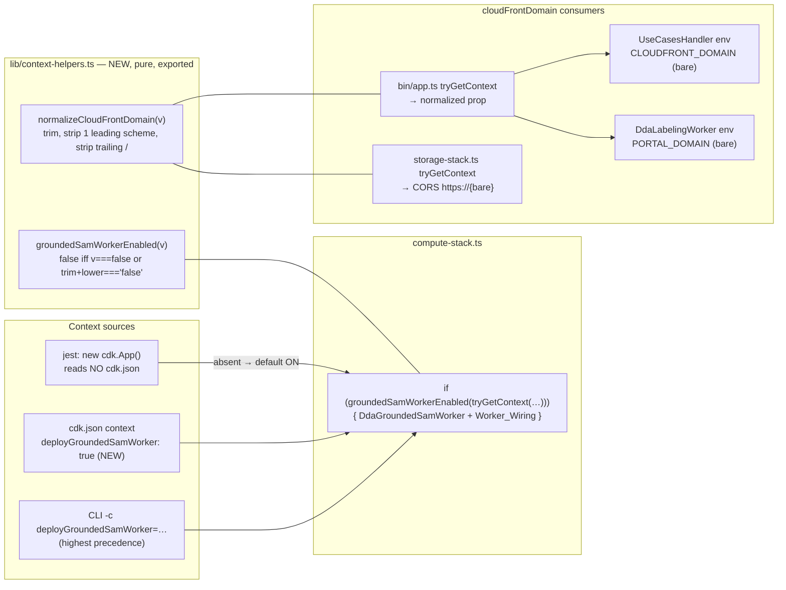

# Design Document

## Overview

Four flag-less deploys have each deleted the live `DdaGroundedSamWorker`; a fifth footgun (`-c cloudFrontDomain=https://…`) corrupts CORS and backend env values with a double scheme. This spec hardens both context reads so the safe outcome is the default outcome:

- **The Worker_Flag's absence stops being a deletion order.** `compute-stack.ts` resolves the flag through an exported pure Flag_Resolver whose posture is default-on: only an Explicit_False value (`false` / `'false'`, case-insensitive, trimmed) omits the worker; absent, `true`, `'true'`, and any unrecognized value deploy it. `cdk.json` additionally documents `"deployGroundedSamWorker": true` for anyone inspecting CLI context. The deliberate teardown path (`-c deployGroundedSamWorker=false`) and the shipped flag-off application degradations survive intact.
- **The Domain_Context stops being spelling-sensitive.** Both `tryGetContext('cloudFrontDomain')` read points (App_Entry and Storage_Stack) normalize through an exported pure Domain_Normalizer that strips one leading scheme and trailing slashes, so every consumer — the CORS origin builder and the backend's scheme-prepending code — receives the bare domain and emits exactly one `https://`.
- **`deploy-frontend.sh` becomes safe without being touched.** Its step 6 passes no Worker_Flag (now: deploys the worker) and passes the bare `DistributionDomainName` output (now: provably equivalent to any other spelling). Verified against the script — nothing in it fights the new default.

The change is deliberately small: one new ~40-line pure-helpers module, a handful of lines at three existing read/consume points, one `cdk.json` entry, and the declared two-file test rebaseline. No new stacks, no worker definition changes, no application code changes.

## Architecture



### Decision record

**D1 — Default-on at both layers: code default in `compute-stack.ts` plus a `cdk.json` context entry.** `new cdk.App()` does not read `cdk.json` — verified by the shipped jest suites, whose no-context synths would otherwise already see any cdk.json flags. A cdk.json-only default would therefore protect CLI deploys while leaving every programmatic synth (jest, tooling) on the old deleting default, and the test suites could not even pin the new posture. The code-level Flag_Resolver default is the guarantee that covers everything; the cdk.json entry is the discoverable, documented statement of posture for CLI users (`cdk context`, reading the file). Both land. CLI `-c deployGroundedSamWorker=false` still works: command-line context takes precedence over `cdk.json` context in the CDK's context resolution order.

**D2 — REJECTED ALTERNATIVE: a separate worker stack.** Moving `DdaGroundedSamWorker` into its own stack would protect it from compute-stack deploys, but at the cost of: (a) cross-stack coupling on the worker ARN — `GROUNDED_SAM_WORKER_FUNCTION_NAME` on two functions' environments plus two `grantInvoke` policies would become CloudFormation export/import pairs; (b) deploy-ordering constraints — the worker stack must exist before any compute deploy that references it, breaking the single-stack deploy commands every script and spec uses today; (c) the export-mutation trap — once the compute stack imports the worker ARN export, any worker change that alters the exported value (e.g. a logical-id or name change) hard-fails with "export is in use", forcing two-phase deploys. The default-on flag achieves the same protection — flag-less deploys keep the worker — with a fraction of the change and none of the coupling.

**D3 — Only an Explicit_False disables; every unrecognized value deploys.** The failure modes are asymmetric. Treating garbage as "on" risks an unintended worker deploy: cheap (the image is ECR-cached by fingerprint; synth stages ~136 KB) and fully recoverable. Treating garbage as "off" risks exactly the incident this spec exists to end: deletion of a live function serving traffic. So the resolver returns off only for boolean `false` or a string whose trimmed, lowercased value is `'false'` (`'False'`/`'FALSE'` are accepted as off — nobody types those meaning "deploy"); `'0'`, `'no'`, `'off'`, and typos deploy the worker. The property test pins this truth table across arbitrary inputs.

**D4 — Helpers live in a new `lib/context-helpers.ts`, not inside `compute-stack.ts`.** The Domain_Normalizer has two importers (`bin/app.ts`, `lib/storage-stack.ts`); housing it in `compute-stack.ts` would make the storage stack import the ~5,000-line compute module and its five nested-stack imports to normalize a string. A dedicated pure module gives all three importers a clean dependency, no cycle risk (`compute-stack.ts` imports nothing from `storage-stack.ts` and vice versa), and gives the property tests a synth-free import — which is what makes 100-run fast-check honest (see Testing Strategy). This deviates from the letter of the pre-agreed direction ("extracting tiny pure helpers in compute-stack.ts is in scope") in file placement only; the substance — exported pure functions for flag parsing and domain normalization, used at the existing read points — is exactly as agreed.

**D5 — The sibling `deploySamWorker` flag stays default-OFF, untouched.** No `DdaSamWorker` exists in the live account (verified via `list-functions`); no deletion incident involves it; flipping it would force a second container image into every default synth for a worker nobody runs. The rebaselined default synth keeps asserting `DdaSamWorker` absent.

**D6 — `deploy-frontend.sh` is not amended.** Read end to end: steps 1–5 (config.json generation, `npm ci`, build, S3 sync with the cache-control split, CloudFront invalidation) never touch CDK context; step 6 deploys with `-c cloudFrontDomain="$CLOUDFRONT_URL"` (from `DistributionDomainName` — bare), `-c trustedUseCaseAccountIds=…`, `-c dataBucketAllowlist=…`, and **no** `deployGroundedSamWorker` context in any form. Under the new default that flag-less deploy synthesizes the worker — the script's step 6 flips from the deletion hazard to a worker-preserving deploy with zero edits. Requirement 4.3 pins this: if implementation finds anything in the script fighting the default, stop and surface it.

**D7 — `.kiro/steering/builds.md` is not amended.** Its portal-deploy guidance (pgrep gates against concurrent component builds, cdk.out drift handling) is flag-agnostic and stays correct under the new default. The historical "flag is mandatory" warnings live in prior specs' documents, which are records of their time, not steering; nothing in steering asserts the old default.

**D8 — First deploy after this change is a worker no-op.** The live stack already carries the flag-on template (worker `…-9paW7gMXvjg2`, both env/grant pairs present — verified live this session). A flag-less deploy under the new default synthesizes the same worker resources; the docker image's source fingerprint is unchanged, so cdk-assets finds the ECR-cached image and no build runs. The expected `cdk diff` shows no worker-resource change at all — which is precisely the proof the deploy task captures.

## Components and Interfaces

### `edge-cv-portal/infrastructure/lib/context-helpers.ts` (NEW, one writer task)

Pure, dependency-free, exported — the single decision points for both context reads:

```typescript
/**
 * Default-ON resolution for the `deployGroundedSamWorker` CDK context flag
 * (portal-deploy-flag-hardening Req 1). Flag-less deploys deleted the live
 * DdaGroundedSamWorker four times; the safe outcome is now the default one.
 * Only an explicit false — boolean `false` or a string equal to 'false'
 * case-insensitively after trimming — omits the worker (the deliberate
 * teardown path, Req 2.2). Absent, true, 'true', and every unrecognized
 * value (e.g. '0', 'no', typos) deploy it: an unintended deploy is cheap
 * and ECR-cached; an unintended deletion breaks live pre-labeling.
 */
export function groundedSamWorkerEnabled(contextValue: unknown): boolean {
  if (contextValue === false) return false;
  if (
    typeof contextValue === 'string' &&
    contextValue.trim().toLowerCase() === 'false'
  ) {
    return false;
  }
  return true;
}

/**
 * Normalizes the `cloudFrontDomain` CDK context value to the bare domain
 * (portal-deploy-flag-hardening Req 3). Consumers prepend the scheme
 * themselves (storage-stack CORS `https://${…}`, backend link/CORS
 * builders), so a scheme-prefixed context value produced `https://https://…`
 * live on 2026-09-07. Strips surrounding whitespace, at most one leading
 * `http://`/`https://` (case-insensitive), and all trailing slashes; every
 * other character passes through unchanged. Returns undefined when the
 * input is absent or empty after normalization, preserving today's
 * absent-context behavior (wildcard CORS, no env entries).
 */
export function normalizeCloudFrontDomain(
  contextValue: unknown,
): string | undefined {
  if (typeof contextValue !== 'string') return undefined;
  let domain = contextValue.trim();
  domain = domain.replace(/^https?:\/\//i, '');
  domain = domain.replace(/\/+$/, '');
  return domain.length > 0 ? domain : undefined;
}
```

`replace` with a `^`-anchored, non-global regex removes at most one leading scheme; `https://https://…` (already-corrupted input) normalizes to `https://…`-stripped-once — i.e. a second application removes the second scheme. Idempotence on *normalized* output (Property 2) is what matters: a bare domain maps to itself.

### `edge-cv-portal/infrastructure/lib/compute-stack.ts` (one writer task)

The gated block's read (currently `const deployGroundedSamWorker = deployGroundedSamWorkerContext === true || deployGroundedSamWorkerContext === 'true';`) becomes:

```typescript
const deployGroundedSamWorker = groundedSamWorkerEnabled(
  this.node.tryGetContext('deployGroundedSamWorker'),
);
if (deployGroundedSamWorker) {
```

with the block's leading comment rewritten to state the new posture: default ON (flag absent → worker deployed; four flag-less deletions are why), explicit `-c deployGroundedSamWorker=false` as the deliberate teardown path, image builds deploy-time-only and ECR-cached, and the flag-off degradation semantics unchanged (env entries simply absent). Everything inside the block — the `DdaGroundedSamWorker` definition, the model-URL build args, the platform/architecture pinning, and all four Worker_Wiring effects — is untouched. The `deploySamWorker` block above it is untouched. `import { groundedSamWorkerEnabled } from './context-helpers';` joins the import list.

The `cloudFrontDomain` prop and its two consumers (`UseCasesHandler` env, `DdaLabelingWorker` env) are untouched: the prop arrives pre-normalized from the App_Entry on every real deploy. (Jest constructs the stack with literal props and bypasses `bin/app.ts` by design; the real CLI path is verified by the deploy task's synth-equivalence check.)

### `edge-cv-portal/infrastructure/bin/app.ts` (one writer task)

```typescript
const cloudFrontDomain = normalizeCloudFrontDomain(
  app.node.tryGetContext('cloudFrontDomain'),
);
```

replacing the raw `tryGetContext` at line ~50, with a comment citing this spec and the double-scheme incident. Everything else (trusted-account resolution, stack wiring) untouched.

### `edge-cv-portal/infrastructure/lib/storage-stack.ts` (one writer task)

```typescript
const corsCloudFrontDomain = normalizeCloudFrontDomain(
  this.node.tryGetContext('cloudFrontDomain'),
);
```

replacing the raw read before the `PortalArtifactsBucket`; the existing ternary (`` corsCloudFrontDomain ? [`https://${corsCloudFrontDomain}`] : ['*'] ``) is untouched and now provably emits one scheme. `import { normalizeCloudFrontDomain } from './context-helpers';` joins the imports.

### `edge-cv-portal/infrastructure/cdk.json` (one writer task)

`"deployGroundedSamWorker": true` added to the `context` block, alongside the feature flags. JSON carries no comments; the entry's documentation lives in the gated block's rewritten comment and this spec.

### Compiled `.js` siblings

`lib/*.js` / `bin/*.js` are gitignored `tsc` artifacts (jest runs `**/*.test.ts` only; the CDK app runs through ts-node). They regenerate via `npm run build` — never hand-edited, and stale copies on disk affect nothing this spec tests.

## Data Models

**Flag_Resolver truth table** (Requirement 1; the Explicit_False set is exactly the OFF rows):

| Context value | Worker deployed? |
|---|---|
| absent / `undefined` | **yes** (the flip — was no) |
| `true` (boolean), `'true'` | yes (unchanged) |
| `false` (boolean) | no |
| `'false'`, `'False'`, `' FALSE '` (any casing, padded) | no |
| `'0'`, `'no'`, `'off'`, `''`, any other string | **yes** (default-on posture) |
| any non-string non-boolean (numbers, objects) | yes |

**Domain_Normalizer transformation table** (Requirement 3):

| Input | Output |
|---|---|
| `d23v4ltibogb5x.cloudfront.net` | `d23v4ltibogb5x.cloudfront.net` |
| `https://d23v4ltibogb5x.cloudfront.net` | `d23v4ltibogb5x.cloudfront.net` |
| `http://d23…net`, `HTTPS://d23…net`, `HtTpS://d23…net` | `d23…net` |
| `https://d23…net/`, `d23…net///` | `d23…net` |
| `  https://d23…net/  ` (padded) | `d23…net` |
| `undefined`, non-string, `''`, `'   '`, `'https:///'` | `undefined` (absent-context behavior) |

**Template consequences** (what each synth shape contains):

| Synth context | `DdaGroundedSamWorker` | Worker_Wiring (2 env + 2 grants) | `DdaSamWorker` |
|---|---|---|---|
| no context (jest default; a flag-less CLI deploy additionally resolves cdk.json's `true`) | present | present | absent |
| `deployGroundedSamWorker: 'true'` / `true` | present | present | absent |
| `deployGroundedSamWorker: 'false'` / `false` | absent | absent | absent |

| Domain context | `PortalArtifactsBucket` CORS `allowedOrigins` | `CLOUDFRONT_DOMAIN` / `PORTAL_DOMAIN` |
|---|---|---|
| any spelling of domain D | `[https://D]` (exactly one scheme) | `D` (bare) |
| absent / empty after normalization | `['*']` | absent |

## Correctness Properties

*A property is a characteristic or behavior that should hold true across all valid executions of a system — essentially, a formal statement about what the system should do. Properties serve as the bridge between human-readable specifications and machine-verifiable correctness guarantees.*

An honest statement of the testing-cost tradeoff, per the prework: a ComputeStack synth costs minutes (Lambda/layer asset staging), so generator-driven synthesis at 100 runs is not viable and a low-`numRuns` synth property would be property-based theater. Instead, **the universally quantified properties target the two extracted pure decision functions** — where the entire input-space risk lives (casings, paddings, garbage values, spellings) and where fast-check at 100+ runs is honest — **and the template consequences are pinned by example-level CDK assertions at the boundary values** (the three worker synth shapes via the rebaselined suites; the cheap StorageStack synths in the new example suite). The prework was consolidated: criteria 1.1–1.4 collapse into Property 1's single truth-table for-all; criteria 3.1, 3.3, 3.4, 3.6, 3.7 collapse into Property 2's recovery/idempotence for-all. Wiring-through and template shapes (1.5–1.7, 3.2–3.5 template side, 2.1, 2.3) are examples; CLI precedence, the real-app synth equivalence, and the flag-less deploy itself (2.2, 3.1/3.4/3.5 end-to-end, 4.1, 5.1) are deploy-task integration checks; preservation and rebaseline accounting (4.2, 4.3, 5.3–5.5, 6.x) are the checkpoint's non-regression inventory.

| # | Property (title) | Validates | Test file |
|---|---|---|---|
| 1 | The Flag_Resolver deploys for every context value except an Explicit_False | 1.1, 1.2, 1.3, 1.4, 1.5 | `infrastructure/test/context-helpers.property.test.ts` |
| 2 | The Domain_Normalizer recovers the bare domain from any spelling, idempotently, never emitting a scheme or trailing slash | 3.1, 3.3, 3.4, 3.6, 3.7 | `infrastructure/test/context-helpers.property.test.ts` |

### Property 1: The Flag_Resolver deploys for every context value except an Explicit_False

*For any* context value — `undefined`, booleans, arbitrary strings (including `'true'`/`'false'` in any casing with any surrounding whitespace), numbers, and other non-string values — `groundedSamWorkerEnabled(value)` SHALL return `false` exactly when the value is boolean `false` or a string whose trimmed, lowercased form is `'false'`, and `true` for everything else — in particular `true` for `undefined` (the default-on flip) and for every unrecognized string.

**Validates: Requirements 1.1, 1.2, 1.3, 1.4, 1.5**

### Property 2: The Domain_Normalizer recovers the bare domain from any spelling, idempotently, never emitting a scheme or trailing slash

*For any* generated bare domain (non-empty, no leading scheme, no trailing slash, no surrounding whitespace) and any decoration — an optional leading `http://` or `https://` in any character casing, zero or more trailing slashes, and optional surrounding whitespace — `normalizeCloudFrontDomain(decorated)` SHALL return exactly the bare domain (every character preserved); the function SHALL be idempotent on its own output; and *for any* input that is not a string or normalizes to empty (empty, whitespace-only, scheme-only), it SHALL return `undefined`.

**Validates: Requirements 3.1, 3.3, 3.4, 3.6, 3.7**

## Error Handling

- **Unrecognized Worker_Flag values** (typos, `'0'`, `'no'`): deploy the worker — the recoverable outcome (D3). No synth error, no warning machinery: the resolver is total, and a deliberate teardown has exactly one spelling to remember (`false`).
- **Already-corrupted Domain_Context** (`https://https://…`): one application of the normalizer strips one scheme; the residual `https://…` in the domain would still be visibly wrong in the template. This input never occurs from the CLI (the corruption was in *emitted config*, not context) and needs no special case — the normalizer is not a repair tool, just a spelling equalizer.
- **Empty/whitespace/scheme-only Domain_Context**: `undefined` — exactly today's absent-context behavior (wildcard CORS, no env entries), so a degenerate value cannot produce `https://` (empty origin) or an empty env value.
- **Explicit-false deployments**: the template omits the env entries, and the shipped application degradations answer — job creation degrades (grounded-sam-autolabel Req 5.4), the preview start route rejects with 'Grounded-SAM worker is not deployed' (grounded-sam-prompt-tuning-preview Req 6.1). No application change (Req 2.3, 5.4).
- **The teardown-then-deploy sequence**: an explicit-false deploy deletes the worker (deliberately); the next flag-less deploy recreates it — the default makes recovery automatic rather than requiring the magic flag.

## Testing Strategy

Dual approach: property-based tests for the two correctness properties (exactly one test per property, fast-check at `{ numRuns: 100 }`, tagged `Feature: portal-deploy-flag-hardening, Property {n}: {title}`), example-based CDK assertion tests for every template shape, and deploy-time integration checks for the paths jest cannot honestly reach (the real CLI context path and live CloudFormation behavior).

**Property tests** (`edge-cv-portal/infrastructure/test/context-helpers.property.test.ts`, new): imports the two pure helpers directly — zero synth cost, so 100 runs are honest. `fast-check` joins `devDependencies` pinned exactly (`"fast-check": "3.23.2"` — the CJS-safe major already pinned exactly by `src/frontend` and `hmi`; the infra suite runs ts-jest/CommonJS). Property 1's generator mixes `fc.constantFrom(undefined, true, false, 'true', 'false')`, casing/padding transforms of `'true'`/`'false'`, `fc.string()`, `fc.integer()`, `fc.object()`; the oracle is the Explicit_False predicate stated independently in the test. Property 2's generator builds decorated spellings from generated bare domains (alphanumeric/dot/hyphen, non-empty) × scheme casings × 0–3 trailing slashes × padding; asserts exact recovery, idempotence, and the `undefined` domain for empty/whitespace/scheme-only/non-string inputs.

**Example suite** (`edge-cv-portal/infrastructure/test/portal-deploy-flag-hardening-infra.test.ts`, new): the cheap template shapes only —
- StorageStack synth (no asset staging, fast) with `cdk.App({ context: { cloudFrontDomain: 'HTTPS://d23v4ltibogb5x.cloudfront.net/' } })` vs bare-context vs no-context: the decorated and bare templates deep-equal; `AllowedOrigins` exactly `['https://d23v4ltibogb5x.cloudfront.net']`; no-context gives `['*']` (Req 3.2, 3.3, 3.5, 3.6).
- cdk.json smoke: parse the file, assert `context.deployGroundedSamWorker === true` (Req 2.1).
- Deliberately **no** new ComputeStack synths: the three worker boundary shapes already live in the rebaselined suites (below), and each ComputeStack synth adds minutes to the suite.

**Rebaselined suites as the worker boundary examples** (the Declared_Rebaseline, Requirement 6):
- `grounded-sam-worker-infra.test.ts` (default synth): worker present with shipped configuration (Image/x86_64/10240/300/no env — Req 1.1, 1.6), all four Worker_Wiring effects present (Req 1.1, 1.7), `DdaSamWorker` still absent (Req 5.2), `DdaAutolabelWorker` env key set gaining exactly `GROUNDED_SAM_WORKER_FUNCTION_NAME`.
- `gsam-preview-infra.test.ts`: flag-OFF suite synthesizes `{ deployGroundedSamWorker: 'false' }` — no worker ids, no handler env entry, no grants (Req 1.4, 2.3); flag-ON suite untouched (Req 1.2, 5.1).

**Checkpoint**: full `npx jest` from `edge-cv-portal/infrastructure` (all suites — the two rebaselined, the two new, and every untouched suite must be green). Backend and frontend suites are untouched by this spec (zero application code changes) and are not re-run as a gate; the checkpoint's inventory pins the exact permitted file set.

**Deploy-time integration** (the deploy task): (a) synth-equivalence — `cdk synth EdgeCVPortalComputeStack` (and the storage stack) with `-c cloudFrontDomain=d23v4ltibogb5x.cloudfront.net` vs `-c cloudFrontDomain=https://d23v4ltibogb5x.cloudfront.net` through the real App_Entry produce identical templates (Req 3.1, 3.4, 3.5) — checked BEFORE deploying; (b) the flag-less `cdk diff` shows **no** `DdaGroundedSamWorker` deletion (Req 1.1, 4.1, 5.1); (c) the flag-less deploy itself, then live verification (function exists, env wiring intact, CORS single-scheme, preview run completes end to end).
