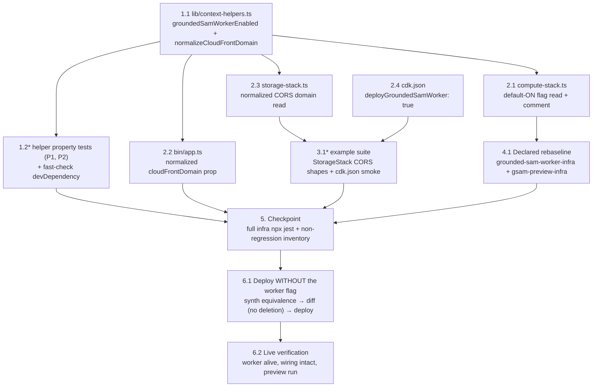

# Implementation Plan: Portal Deploy Flag Hardening

## Overview

Infrastructure-only hardening over five small files plus a declared two-suite rebaseline, converging at one checkpoint, one deliberately flag-less deploy (the deploy IS the proof), and one live verification. A new pure-helpers module (`lib/context-helpers.ts`) becomes the single decision point for both hazardous context reads: `groundedSamWorkerEnabled` (default-ON — only explicit `false`/`'false'` omits the worker) wired into `compute-stack.ts`'s existing gated-block read, and `normalizeCloudFrontDomain` (any spelling → bare domain) wired into both `tryGetContext('cloudFrontDomain')` sites (`bin/app.ts`, `storage-stack.ts`). `cdk.json` documents the default for CLI context inspection. Two correctness properties land as fast-check tests at 100 runs against the pure helpers (the honest PBT surface — ComputeStack synths cost minutes, so template shapes are pinned by boundary examples instead, per the design); a new cheap example suite covers the StorageStack CORS shapes and the cdk.json smoke; the declared rebaseline (Requirement 6) amends exactly two shipped infra suites whose assertions pin the old flag-off default. **No application code changes: the backend and frontend test suites are untouched by this spec and are not part of its gates.** `deploy-frontend.sh` and `.kiro/steering/builds.md` need no amendment (verified in the design, D6/D7); `dda_labeling.py`'s not-deployed rejection and `dda_autolabel_worker.py`'s job-creation degradation keep working for explicit-false deployments untouched.

Same-file discipline: `lib/context-helpers.ts` (1.1), `package.json`+`package-lock.json` and `test/context-helpers.property.test.ts` (1.2), `lib/compute-stack.ts` (2.1), `bin/app.ts` (2.2), `lib/storage-stack.ts` (2.3), `cdk.json` (2.4), `test/portal-deploy-flag-hardening-infra.test.ts` (3.1), and the two rebaselined suites (4.1, sole writer of both) each have exactly one writer task; no wave contains two writers of one file.

## Task Dependency Graph

```json
{
  "waves": [
    { "id": 0, "description": "The pure-helpers module (every implementation task's dependency) and the independent cdk.json context entry.", "tasks": ["1.1", "2.4"] },
    { "id": 1, "description": "Wiring the helpers into the three read points (three files, three writers) and the helper property tests (own files: the test file plus the fast-check devDependency in package.json).", "tasks": ["1.2", "2.1", "2.2", "2.3"] },
    { "id": 2, "description": "Template-level tests: the new cheap example suite (needs the storage-stack wiring and the cdk.json entry) and the declared two-suite rebaseline (needs the compute-stack default flip).", "tasks": ["3.1", "4.1"] },
    { "id": 3, "description": "The proving deploy: synth-equivalence for both domain spellings first, then the flag-less diff expecting no worker deletion, then the flag-less deploy.", "tasks": ["6.1"] },
    { "id": 4, "description": "Live verification: worker survived a flag-less deploy end to end, wiring and domain config uncorrupted, preview run completes.", "tasks": ["6.2"] }
  ]
}
```



## Tasks

- [x] 1. The pure context helpers and their properties
  - [x] 1.1 Create `edge-cv-portal/infrastructure/lib/context-helpers.ts`
    - Two exported pure functions with the design's exact signatures and doc comments: `groundedSamWorkerEnabled(contextValue: unknown): boolean` — `false` iff boolean `false` or a string whose trimmed, lowercased form is `'false'`; `true` for everything else including `undefined` (the default-on flip), `'true'`, and unrecognized values — and `normalizeCloudFrontDomain(contextValue: unknown): string | undefined` — non-strings → `undefined`; trim, strip at most one leading `http://`/`https://` case-insensitively (`^`-anchored non-global regex), strip all trailing slashes; empty after normalization → `undefined`
    - No CDK imports, no side effects — the module must be importable by jest with zero synth cost (the design's honest-PBT premise) and by `storage-stack.ts` without dragging in `compute-stack.ts`
    - _Requirements: 1.5, 3.7_

  - [x]* 1.2 Write the helper property tests
    - Add `"fast-check": "3.23.2"` to `edge-cv-portal/infrastructure/package.json` `devDependencies` (exact pin — the repo's `src/frontend`/`hmi` precedent; CJS-safe under ts-jest) and install to update `package-lock.json`
    - `edge-cv-portal/infrastructure/test/context-helpers.property.test.ts` (new) — fast-check `{ numRuns: 100 }`, importing the two helpers directly (no CDK constructs)
    - **Property 1: The Flag_Resolver deploys for every context value except an Explicit_False** — generator mixing `fc.constantFrom(undefined, true, false, 'true', 'false')`, casing/whitespace-padding transforms of `'true'`/`'false'`, `fc.string()`, `fc.integer()`, `fc.object()`; oracle: the Explicit_False predicate stated independently in the test — **Validates: Requirements 1.1, 1.2, 1.3, 1.4, 1.5**
    - **Property 2: The Domain_Normalizer recovers the bare domain from any spelling, idempotently, never emitting a scheme or trailing slash** — generator building decorated spellings from generated bare domains (alphanumeric/dot/hyphen, non-empty, no leading scheme, no trailing slash) × scheme presence and casing × 0–3 trailing slashes × surrounding whitespace; assert exact recovery, idempotence on output, and `undefined` for non-string/empty/whitespace-only/scheme-only inputs — **Validates: Requirements 3.1, 3.3, 3.4, 3.6, 3.7**
    - Tag both: `Feature: portal-deploy-flag-hardening, Property {n}: {title}`
    - _Requirements: 1.1, 1.2, 1.3, 1.4, 1.5, 3.1, 3.3, 3.4, 3.6, 3.7_

- [x] 2. Wire the helpers into the three read points and document the default
  - [x] 2.1 Flip the flag default in `lib/compute-stack.ts`
    - Replace the inline parse (`deployGroundedSamWorkerContext === true || deployGroundedSamWorkerContext === 'true'`) with `groundedSamWorkerEnabled(this.node.tryGetContext('deployGroundedSamWorker'))`; import from `./context-helpers`
    - Rewrite the gated block's leading comment for the new posture: default ON (four flag-less deletions are why — cite this spec), `-c deployGroundedSamWorker=false` as the deliberate teardown path, image builds deploy-time-only and ECR-cached by source fingerprint (the gsam-preview-infra.test.ts-verified fact), flag-off degradation semantics unchanged
    - Everything inside the `if` block untouched (worker definition, build args, platform/arch pinning, all four Worker_Wiring effects); the `deploySamWorker` block above it untouched; the `cloudFrontDomain` prop consumers untouched
    - _Requirements: 1.1, 1.2, 1.3, 1.4, 1.5, 1.6, 1.7, 5.2_

  - [x] 2.2 Normalize the domain at the App_Entry read in `bin/app.ts`
    - `const cloudFrontDomain = normalizeCloudFrontDomain(app.node.tryGetContext('cloudFrontDomain'));` with a comment citing this spec and the 2026-09-07 double-scheme incident; import from `../lib/context-helpers`; everything else untouched
    - _Requirements: 3.1, 3.4_

  - [x] 2.3 Normalize the domain at the Storage_Stack read in `lib/storage-stack.ts`
    - `const corsCloudFrontDomain = normalizeCloudFrontDomain(this.node.tryGetContext('cloudFrontDomain'));`; import from `./context-helpers`; the existing ternary building `` [`https://${corsCloudFrontDomain}`] `` vs `['*']` untouched
    - _Requirements: 3.2, 3.3, 3.6_

  - [x] 2.4 Document the default in `cdk.json`
    - Add `"deployGroundedSamWorker": true` to the `context` block (alongside the `@aws-cdk/...` feature flags); CLI `-c deployGroundedSamWorker=false` overrides it by CDK context precedence — the teardown path
    - _Requirements: 2.1, 2.2_

- [x] 3. Template-shape examples (cheap synths only)
  - [x]* 3.1 Write the example suite `test/portal-deploy-flag-hardening-infra.test.ts`
    - StorageStack synths via `new cdk.App({ context: { cloudFrontDomain: … } })` (cheap — no asset staging): decorated spelling `'HTTPS://d23v4ltibogb5x.cloudfront.net/'` vs bare `'d23v4ltibogb5x.cloudfront.net'` → the two templates deep-equal (`template.toJSON()`), `PortalArtifactsBucket` `AllowedOrigins` exactly `['https://d23v4ltibogb5x.cloudfront.net']`; a no-context synth → `AllowedOrigins` `['*']`
    - cdk.json smoke: parse `../cdk.json` from the test, assert `context.deployGroundedSamWorker === true`
    - Deliberately NO ComputeStack synths here — the worker boundary shapes live in the rebaselined suites (4.1) and each ComputeStack synth adds minutes
    - _Requirements: 2.1, 3.2, 3.3, 3.5, 3.6_

- [x] 4. Declared rebaseline: the two suites pinning the old default (Requirement 6)
  - [x] 4.1 Amend the two declared files in exactly the declared ways
    - `test/grounded-sam-worker-infra.test.ts` — the default (no-context) synth becomes the WITH-worker case: "no image-package Lambda" → exactly one image function, `DdaGroundedSamWorker`, asserting its shipped configuration (PackageType `Image`, `Architectures ['x86_64']`, MemorySize 10240, Timeout 300, `Environment` undefined); "no DdaGroundedSamWorker or DdaSamWorker logical ids" → `DdaGroundedSamWorker` ids present, `DdaSamWorker` ids still absent; "environment carries neither" → `GROUNDED_SAM_WORKER_FUNCTION_NAME` present on `DdaAutolabelWorker` referencing the worker (`{ Ref: <workerLogicalId> }`) AND on `DdaLabelingHandler`, `SAM_WORKER_FUNCTION_NAME` still absent; the Requirement 5.5 exact env-key-set assertion gains the one key `GROUNDED_SAM_WORKER_FUNCTION_NAME`; both invoke grants asserted present (the gsam-preview-infra policy-search helper pattern); header corrected — flag-on synth is staging-only (per gsam-preview-infra.test.ts), the suite now pins the default-ON posture of portal-deploy-flag-hardening; every other assertion (handler, runtime, timeout, memory, layers, static env values) byte-identical
    - `test/gsam-preview-infra.test.ts` — `flagOffTemplate = synthComputeTemplate()` becomes `synthComputeTemplate({ deployGroundedSamWorker: 'false' })` (the without-worker case is now the explicit-false synth); the flag-OFF describe's three assertions and the entire flag-ON suite byte-identical; header notes the default flip and cites this spec
    - `test/labeling-cleanup-infra.test.ts` is NOT touched — verified surviving (regex-scoped env checks; `lambdaByHandler` unaffected by the image function, which has no `Handler` property)
    - If any assertion outside these two files fails under the new default: STOP and surface it as a design violation (Req 6.3) — do not amend further files
    - _Requirements: 1.1, 1.4, 1.6, 1.7, 2.3, 5.1, 5.2, 6.1, 6.2, 6.3_

- [x] 5. Checkpoint — Ensure all tests pass, ask the user if questions arise
  - Infrastructure: `cd edge-cv-portal/infrastructure && npm run build && npx jest` — the full suite: the two rebaselined suites, the two new suites (if their optional tasks ran), and every untouched suite (`labeling-cleanup-infra`, `workflow-manager-gaps-infra`, `llm-*`, `camera-*`, `quick-setup`, `user-admin`, `dda-imaging-layer`, `synthetic-imaging-layer`, `build-fleet`, `node-designer`, …) green; `npm run build` (tsc) must also be clean
  - Backend and frontend suites are untouched by this spec (zero application code changes) — not re-run as a gate
  - Non-regression inventory — the ONLY pre-existing files with diffs are: `lib/compute-stack.ts` (flag read + comment, task 2.1), `bin/app.ts` (normalized read, 2.2), `lib/storage-stack.ts` (normalized read, 2.3), `cdk.json` (context entry, 2.4), `package.json`/`package-lock.json` (fast-check devDependency, 1.2, only if it ran), and the two declared rebaselined suites `test/grounded-sam-worker-infra.test.ts` + `test/gsam-preview-infra.test.ts` (4.1). Explicitly zero diff on: `edge-cv-portal/deploy-frontend.sh` (Req 4.2, 4.3), `.kiro/steering/builds.md` (Req 5.5), `test/labeling-cleanup-infra.test.ts` (Req 6.3), the `deploySamWorker` block (Req 5.2), and every application source (backend `functions/`, frontend `src/`, `grounded-sam-worker/`) (Req 5.3, 5.4). Any diff outside this set: stop and raise it
  - _Requirements: 4.2, 4.3, 5.1, 5.2, 5.3, 5.4, 5.5, 6.1, 6.2, 6.3_

- [ ] 6. Deploy and verify live — the flag-less deploy IS the proof
  - [ ] 6.1 Prove spelling equivalence, then deploy WITHOUT the worker flag
    - Follow `.kiro/steering/builds.md` gates first: `pgrep -af "gdk component build"` and `pgrep -af "build-custom.sh"` must both be empty — portal deploys never overlap component builds
    - From `edge-cv-portal/infrastructure` (account 164152369890, us-east-1; `npm run build` first): **synth equivalence BEFORE deploying** — `npx cdk synth EdgeCVPortalComputeStack -c cloudFrontDomain=d23v4ltibogb5x.cloudfront.net > /tmp/pdfh-synth-bare.yaml` and the same with `-c cloudFrontDomain=https://d23v4ltibogb5x.cloudfront.net > /tmp/pdfh-synth-https.yaml`, then `diff` the two files — MUST be identical (Req 3.5, through the real App_Entry); repeat for `EdgeCVPortalStorageStack` (its own context read)
    - Inspect: `npx cdk diff EdgeCVPortalComputeStack -c cloudFrontDomain=d23v4ltibogb5x.cloudfront.net` — deliberately WITHOUT `deployGroundedSamWorker` — expect **NO `DdaGroundedSamWorker` deletion** (the default now keeps it; the live stack already carries the flag-on template, worker `…-9paW7gMXvjg2`, and the live domain config is already clean/bare, so the diff should show no worker-resource change and only the trivial changes this spec makes, if any reach the template). Optionally also `npx cdk diff EdgeCVPortalStorageStack -c cloudFrontDomain=d23v4ltibogb5x.cloudfront.net` — expect no CORS change (live origin already single-scheme). A `DdaGroundedSamWorker` removal in either diff is a STOP
    - Deploy the same flag-less way: `npx cdk deploy EdgeCVPortalComputeStack --require-approval never -c cloudFrontDomain=d23v4ltibogb5x.cloudfront.net` — the first-ever deliberately flag-less deploy that must PRESERVE the worker; expect a no-op for the worker resources (ECR-cached image fingerprint unchanged)
    - Capture everything to a spec-named log: `edge-cv-portal/deploy-portal-deploy-flag-hardening-$(date -u +%Y%m%dT%H%M%SZ).log` (tee); afterwards handle the `cdk.out` drift guards per builds.md before any subsequent component build (move `cdk.out` aside or rebaseline the guard hashes)
    - _Requirements: 1.1, 2.2, 3.1, 3.4, 3.5, 4.1, 5.1_

  - [ ] 6.2 Live verification — the worker survived a flag-less deploy end to end
    - Account 164152369890, us-east-1, portal `d23v4ltibogb5x.cloudfront.net`. Record everything in `.kiro/specs/portal-deploy-flag-hardening/verification-notes.md` (the prompt-tuning-preview precedent)
    - Worker alive: `aws lambda get-function` on the `DdaGroundedSamWorker*` physical name (resolve via `list-functions`) → exists, MemorySize 10240, Timeout 300, PackageType Image — and the physical name is UNCHANGED from before the deploy (`…-9paW7gMXvjg2`), proving no delete/recreate
    - Wiring intact: `DdaLabelingHandler` and `DdaAutolabelWorker` both carry `GROUNDED_SAM_WORKER_FUNCTION_NAME` naming that worker (`get-function-configuration`)
    - StaticImagePin resources intact: `aws cloudformation describe-stack-resources --stack-name EdgeCVPortalComputeStack` shows the `StaticImagePin*` resources in a healthy (non-deleted) state
    - Domain config uncorrupted: `PortalArtifactsBucket` CORS `AllowedOrigins` is exactly `["https://d23v4ltibogb5x.cloudfront.net"]` (one scheme); `UseCasesHandler` `CLOUDFRONT_DOMAIN` and `DdaLabelingWorker` `PORTAL_DOMAIN` are the bare domain
    - End-to-end worker proof: run a grounded-sam Prompt_Tuning_Preview via the deployed routes using the synthesized-event method of `.kiro/specs/grounded-sam-prompt-tuning-preview/verification-notes.md` §1 — Use_Case `645504ce-a60a-4009-8349-7548c0025cd3`, 1 sample image, `prompt_overrides: {"cookie_gap": "crack"}`, modality Segmentation; poll to Completed with a resolved (Succeeded) sample carrying validated regions — the worker serving inference AFTER a flag-less deploy closes the incident class
    - _Requirements: 1.1, 3.3, 3.4, 4.1_

## Notes

- Tasks marked with `*` are optional test tasks and can be skipped for a faster MVP; the checkpoint's inventory assumes they ran (skip 1.2 → no `package.json`/lockfile diff either)
- Task 4.1 is the spec's entire permitted rebaseline class (Requirement 6) and is NOT optional — the two shipped suites fail against the flipped default without it; `labeling-cleanup-infra.test.ts` and every other pre-existing suite must pass unchanged (zero-rebaseline posture otherwise)
- Both correctness properties land as fast-check tests at `{ numRuns: 100 }` in `test/context-helpers.property.test.ts`, tagged `Feature: portal-deploy-flag-hardening, Property {n}: {title}`; template shapes are deliberately example-tested at boundary values because ComputeStack synths cost minutes (the design's honest-cost statement)
- `deploy-frontend.sh` is deliberately untouched: its step-6 flag-less deploy becomes SAFE under the new default (verified against the script — it passes no worker context and the bare `DistributionDomainName`); after this spec lands, the script is runnable end-to-end again
- The explicit-false teardown path stays working: `-c deployGroundedSamWorker=false` (overriding cdk.json by CLI precedence) omits the worker, and the flag-off application degradations (grounded-sam-autolabel Req 5.4; grounded-sam-prompt-tuning-preview Req 6.1) remain reachable with zero app changes
- **Same-file scheduling:** `lib/context-helpers.ts` written only by 1.1; `package.json`/`package-lock.json` and the property test file only by 1.2; `lib/compute-stack.ts` only by 2.1; `bin/app.ts` only by 2.2; `lib/storage-stack.ts` only by 2.3; `cdk.json` only by 2.4; the example suite only by 3.1; both rebaselined suites only by 4.1; `verification-notes.md` only by 6.2 — no wave contains two writers of one file
- Deploy hygiene per builds.md: pgrep gates before 6.1; spec-named tee logs; `cdk.out` drift-guard handling after the deploy; never run 6.1 while a component build is running
