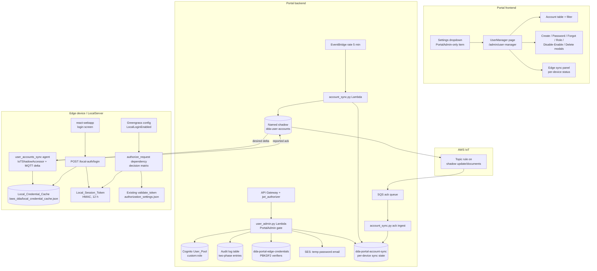
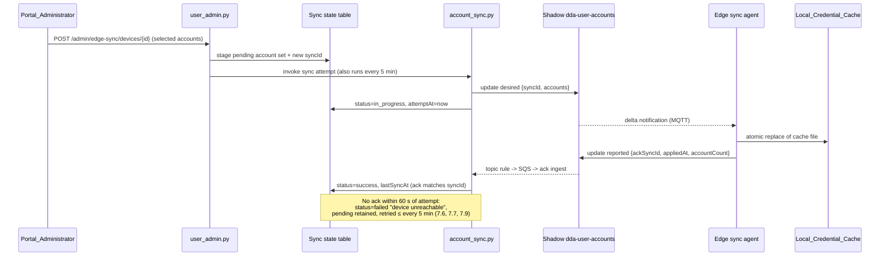

# Design Document: Portal User Manager

## Overview

This feature adds an admin-only User Manager tool to the Edge CV Portal and an optional local cached login capability to the LocalServer edge component. It has four cooperating parts:

1. **User_Manager (portal frontend)** — a new PortalAdmin-only page reached from the settings dropdown in the top navigation. It lists all Cognito accounts with client-side filtering, and offers account creation (invitation with temporary password), password change (permanent/temporary), forgot-password (temporary password by email), role change, disable/enable, and delete actions, plus a per-device account-sync panel.
2. **User admin API (portal backend)** — a new Lambda module exposing PortalAdmin-only endpoints that perform Cognito admin operations (`list_users`, `admin_create_user`, `admin_set_user_password`, `admin_update_user_attributes`, `admin_enable_user`/`admin_disable_user`, `admin_delete_user`) with a strict audit-before-effect protocol, a last-PortalAdmin guard, and credential-verifier capture at password-set time.
3. **Account_Sync_Service** — portal-to-edge account delivery over a new per-thing named IoT shadow `dda-user-accounts`, following the transport pattern established by the camera-registry-sync feature (portal writes `desired`, edge applies and writes a `reported` ack, an IoT topic rule → SQS → Lambda ingests acks). A DynamoDB sync-state table tracks pending changes and last sync status per device; an EventBridge 5-minute schedule drives retries and 60-second ack-timeout failure marking.
4. **Local_Login on the edge** — a new `local_auth` subsystem in the LocalServer FastAPI backend: a credential cache file holding salted one-way verifiers, a login endpoint issuing HMAC-signed 12-hour session tokens, per-account lockout, and a per-request authorization dependency implementing the (Local_Login_Configuration × Existing_Token_Auth) decision matrix. The local React web UI gains a login screen shown only when local login is enabled. Everything is gated by a Greengrass component-configuration flag that defaults to disabled, preserving today's open-access behavior exactly.

### Key research findings

- **Roles are a Cognito custom attribute.** `jwt_authorizer.py` reads `custom:role` from validated JWT claims; the AuthStack defines `custom:role` and `custom:groups` as mutable string attributes. A role change is therefore `admin_update_user_attributes` on `custom:role`, and any token issued afterwards carries the new role automatically (Requirement 5.8 falls out of token issuance semantics).
- **Password policy** (AuthStack): minimum length 12, requires lowercase, uppercase, digits, and symbols. Cognito enforces it on `admin_set_user_password` (`InvalidPasswordException`); the portal's temporary-password generator must conform to it.
- **Cognito never exposes password material.** There is no API or trigger that yields a hash suitable for offline verification. The only place the Portal_Backend ever holds a plaintext password is the User Manager password-set flow, so that is where credential verifiers are computed (design decision D3 below).
- **Cognito cannot email a temporary password to an existing CONFIRMED user.** `admin_create_user` invitations only apply to new users; `admin_reset_user_password` sends a confirmation *code*, not a temporary password. The forgot-password flow therefore generates a policy-conformant temporary password in the Lambda, applies it with `admin_set_user_password(Permanent=False)` (which forces a password change at next sign-in, Requirement 4.2), and delivers it by email through Amazon SES.
- **For *new* users, Cognito's native invitation flow does everything Requirement 12 asks for.** `admin_create_user` with an `email` attribute generates a pool-policy-conformant temporary password and emails the invitation itself (12.3 — no SES involvement needed), places the account in `FORCE_CHANGE_PASSWORD` so the first sign-in must set a new password (12.4), fails atomically with `UsernameExistsException` on duplicates (12.5), and never leaves a partial record on failure (12.9 — the API call is atomic).
- **Disabled-user token refusal is native Cognito behavior.** A user disabled via `admin_disable_user` receives `NotAuthorizedException` on every authentication flow, including refresh-token grants — Cognito rejects sign-in (13.4) and all new JWT issuance including refresh (13.5) with no portal code involved. Requirement 13.5 is therefore documented behavior, not a coding task.
- **Sync transport precedent** (camera-registry-sync): per-thing named shadow, `desired` written by the portal, edge agent (`src/backend/camera_sync/agent.py`) using the existing `IoTShadowAccessor` (IPC) and MQTT `SubscriptionHandler` for delta notifications, plus an IoT topic rule on the shadow's `update/documents` topic routed to SQS → Lambda for the portal-bound direction. The LocalServer recipe already grants shadow IPC/MQTT access for `$aws/things/*/shadow/name/*`, so no new device permissions are needed.
- **Edge auth wiring today**: `utils/auth.py:validate_token` validates bearer tokens remotely against an OAuth introspect endpoint; `endpoints/route/access_log_router.py:get_api_router()` decides *at import time* whether routers carry `Depends(validate_token)`, keyed on the presence of `authorization_settings.json` (`utils.is_authorization_enabled_on_station()`). The decision matrix requires a per-request dependency instead.
- **Component configuration via IPC**: the flask-app already calls Greengrass IPC `GetConfiguration` (`defect_detection_config.py`, `feature_configs_utils.py`), so the LocalServer can read `LocalLoginEnabled` from its own component configuration and re-poll it periodically.
- **Audit logging**: `shared_utils.log_audit_event` writes to the portal audit DynamoDB table but swallows errors. Requirement 6.4 (reject the action when the audit entry cannot be recorded) needs a strict, raising variant with a two-phase (pending → final) write.

### Design decisions

| # | Decision | Choice | Rationale |
|---|----------|--------|-----------|
| D1 | New backend module vs. extending `user_management.py` | New Lambda module `user_admin.py` (same shared layer, new API Gateway routes under `/api/v1/admin/...`) | `user_management.py` manages per-use-case role *assignments* in DynamoDB; this feature manages Cognito accounts. Separate IAM permissions (`cognito-idp:Admin*`, SES) stay scoped to one function |
| D2 | Sync transport | Named IoT shadow `dda-user-accounts` per thing; full desired account set + `syncId`; edge acks via `reported.ackSyncId`; topic rule → SQS → ack-ingest Lambda | Matches the proven camera-registry-sync pattern; shadow persistence gives "retain pending changes until delivered" (7.6) for free; device recipe permissions already cover it |
| D3 | Credential verifier source | Computed in `user_admin.py` whenever the backend holds a plaintext password (User Manager permanent/temporary password set, forgot-password temp generation), stored in a portal DynamoDB table | Cognito never exposes password material. Operationally: an account becomes edge-login-capable when an administrator sets its password through the User Manager. Accounts without a captured verifier sync without one and cannot log in locally; the UI shows which accounts are edge-capable |
| D4 | Verifier algorithm | PBKDF2-HMAC-SHA256, 210,000 iterations, 16-byte random salt per set, 32-byte hash | Python stdlib (`hashlib.pbkdf2_hmac`) on both portal Lambda and edge — no new dependencies; OWASP-recommended iteration count; verification cost (~100 ms on Jetson) acceptable for interactive login |
| D5 | Local_Session_Token format | Compact HMAC-SHA256 signed token: `base64url(payload JSON) + "." + base64url(HMAC)`; secret is 32 random bytes generated on first use, file `0600` | No JWT library in the flask-app today; stdlib `hmac`/`hashlib` suffice for a symmetric single-issuer/single-verifier token. Payload: `sub`, `role`, `iat`, `exp`, `jti` |
| D6 | Disabled-account token revocation (8.6) | Token validation re-checks the account's `enabled` flag in the Local_Credential_Cache on every request | No revocation list needed; a disabled flag arriving by sync instantly invalidates all outstanding tokens for that account |
| D7 | Local_Login_Configuration | Greengrass component configuration key `LocalLoginEnabled` (default `false`), read via IPC `GetConfiguration` at startup and re-polled every 30 s | Satisfies 11.1/11.2 (apply within 60 s without reinstall) even when the config is changed by `UpdateConfiguration` without a component restart; absent/unreadable ⇒ disabled (11.4) |
| D8 | Web UI gating (8.1, 8.8) | The react-webapp SPA queries unauthenticated `GET /local-auth/status`; when local login is enabled and no valid session token is held, it renders the login screen and blocks all other views. All API routes are server-enforced | Static SPA assets cannot be meaningfully gated server-side without breaking the login screen itself; data access is enforced at the API, the login screen presentation is client routing |
| D9 | Lockout state (8.10) | In-memory per-username counter in the LocalServer process (5 consecutive failures → 15-minute lockout) | Single-process server; requirement does not demand persistence across restarts, and file-persisting failure counters adds write-amplification for no security gain at this threat level |
| D10 | Audit-before-effect (6.4) | Two-phase audit write: `put_item` a `pending` entry (raising variant) *before* the Cognito call; abort the action if it fails; update to `success`/`failure` after | The only ordering that guarantees "audit unrecordable ⇒ action not applied" without distributed transactions |
| D11 | Temporary password delivery | SES `SendEmail` from a deployment-configured verified sender identity | Cognito cannot deliver a temp password to an existing user (research finding); SES is the standard portal-account mail path. The sender address becomes a ComputeStack parameter |
| D12 | Account creation invitation | Cognito-native `admin_create_user` invitation (no SES, no portal-generated password) | For new users Cognito itself generates the policy-conformant temporary password, emails the invitation, and enforces `FORCE_CHANGE_PASSWORD` at first sign-in — 12.3/12.4 for free, and the portal never holds the invitation password (consistent with D3: a new account becomes edge-login-capable only once an admin sets its password through the User Manager) |
| D13 | Deletion ordering vs. verifier cleanup | Cognito `admin_delete_user` first, then delete the `dda-portal-edge-credentials` record; a verifier-delete failure after a successful Cognito delete reports a partial-cleanup error and retains the record for a later attempt | This ordering makes 14.6 structural (a Cognito failure aborts before the verifier is touched) and makes the 14.10 partial-failure branch explicit and recoverable rather than silent |
| D14 | Last-PortalAdmin guard scope | The existing guard (paginate + count enabled PortalAdmins) is applied unchanged to disable and delete actions, alongside role changes | One shared predicate keeps 5.3, 13.9, and 14.3 behaviorally identical; disable and delete both reduce the enabled-PortalAdmin count exactly like a role change away from PortalAdmin |

## Architecture



### Portal → edge sync sequence



### Edge request authorization decision matrix

Evaluated per request by the new `authorize_request` FastAPI dependency (replacing the startup-frozen `Depends(validate_token)` wiring in `get_api_router()`):

| Local_Login_Configuration | Existing_Token_Auth (settings file present) | Decision |
|---|---|---|
| disabled | not configured | **Allow** — open access, exactly today's behavior (9.1, 9.3) |
| disabled | configured | Require valid bearer token via existing `validate_token`; else 401 (9.4, 10.4) |
| enabled | not configured | Require valid Local_Session_Token; else 401 (8.5, 8.9) |
| enabled | configured | Allow if **either** a valid bearer token **or** a valid Local_Session_Token is presented; else 401 (10.1, 10.2, 10.5) |

Exemptions in every configuration: `POST /local-auth/login`, `GET /local-auth/status`, and static SPA assets. When local login is disabled, the login endpoint rejects with a "local login disabled" error and never issues a token (9.5). The dependency never reads or writes `authorization_settings.json` beyond the existing presence check (10.3).

## Components and Interfaces

### 1. Portal frontend

**Settings dropdown (`Layout.tsx`)** — add a `user-manager` item to the existing top-nav settings `ButtonDropdown`. Unlike the current `settings` item (disabled for non-admins), the User Manager item is *omitted entirely* for non-PortalAdmin users (1.1, 1.2): the items array is built conditionally on `user?.role === 'PortalAdmin'`. Selecting it navigates to `/admin/user-manager` (1.3).

**Route guard (`App.tsx` + `UserManager.tsx`)** — the route is registered inside the existing authenticated layout (unauthenticated visitors hit the existing redirect to `/login`, 1.6). The page component itself renders an access-denied `Alert` and nothing else when `user?.role !== 'PortalAdmin'` (1.4), mirroring the `BedrockConfigurationSettings` "Portal Admin access required" pattern.

**`UserManager.tsx` page** — Cloudscape `Table` + `TextFilter` + action modals:

- Loads accounts via `GET /api/v1/admin/users` (paginated passthrough of Cognito `list_users`). Columns: username, email, Portal_Role, Cognito status (`CONFIRMED`, `FORCE_CHANGE_PASSWORD`, …), enabled/disabled, edge-login-capable (verifier present) (2.1).
- Filtering is a pure exported function `filterAccounts(accounts, term)`: case-insensitive substring match on username or email; empty result renders the table's empty state without an error (2.2, 2.3); clearing the term restores the full list (2.4).
- Load failure replaces the table body with an error `Alert` — never a partial/stale list (2.5): the accounts state is cleared before each fetch and only set on success.
- **Password modal**: password + confirm fields, a required `RadioGroup` (permanent / temporary — no default selection, submit disabled until chosen, 3.2), client-side policy pre-check mirroring the pool policy, server errors surfaced verbatim including the violated policy rule (3.3). Success flashbar names the account (3.4).
- **Forgot-password action**: confirmation modal; on success shows "temporary password sent to the account's registered email" without ever receiving the password value from the API (4.3); surfaces no-verified-email and delivery errors (4.4, 4.5).
- **Role modal**: `Select` restricted to the five defined roles with the current role preselected (5.2); on success shows confirmation and re-fetches the list (5.7); rejection reasons (including the last-PortalAdmin guard, 5.3) shown in the modal.
- **Create User modal** (`UserManagerModals.tsx`): username, email, and role fields, the role a `Select` restricted to the five defined roles (12.2); client-side pre-checks mirror the server validation (non-empty fields, email shape per 12.6) with submit disabled until valid; server rejection reasons (duplicate username 12.5, invalid email 12.6, missing field 12.7) surfaced verbatim in the modal. Success flashbar states that an invitation with a temporary password was sent to the account's email — the password value is never present in the API response — and the list re-fetches to include the new account (12.10).
- **Disable/Enable confirm modal**: explicit confirmation naming the affected account by username before submission (13.1); on success shows a confirmation identifying the account and re-fetches the list (13.8); an already-in-requested-state response simply re-fetches to show the current state (13.6); rejection reasons (last-PortalAdmin guard for disable, 5.3/13.9) and failures (13.7) shown in the modal.
- **Delete confirm modal**: explicit confirmation naming the affected account by username (14.1); cancel/dismiss submits nothing (14.9); on success shows a confirmation identifying the deleted account and re-fetches the list without it (14.7); rejection reasons (last-PortalAdmin guard, 14.3), not-found (14.11), and partial verifier-cleanup errors (14.10) surfaced in the modal or flashbar.
- **Edge sync panel**: device list from `GET /api/v1/admin/edge-sync/devices` showing last sync status + timestamp per device (7.4); a sync action with account multi-select posts to `POST /api/v1/admin/edge-sync/devices/{deviceId}` (7.1).

### 2. Portal backend — `user_admin.py` Lambda

New function `edge-cv-portal/backend/functions/user_admin.py`, shared layer reused, routed under `/api/v1/admin/*` behind the existing `jwt_authorizer` (requests without a valid JWT are rejected by the authorizer before the Lambda runs, 1.7). Every handler first asserts `get_user_from_event(event)['role'] == 'PortalAdmin'` and returns 403 otherwise (1.5).

| Endpoint | Operation |
|---|---|
| `GET /api/v1/admin/users` | Cognito `list_users` (paginate all), join with the edge-credentials table for the `edgeCapable` flag. Returns username, email, `email_verified`, `custom:role` (default `Viewer`), `UserStatus`, `Enabled` |
| `POST /api/v1/admin/users` | Body `{username, email, role}`. Validate (all fields present and non-empty 12.7, email shape 12.6, role in the five defined values 12.8) → audit-pending → `admin_create_user` with `custom:role`, `email`, `email_verified=true`, default email invitation (D12) → audit-final. `UsernameExistsException` → 409 "username already exists" (12.5) |
| `POST /api/v1/admin/users/{username}/password` | Body `{password, permanent: bool}`. Audit-pending → `admin_set_user_password(Permanent=permanent)` → verifier capture → audit-final |
| `POST /api/v1/admin/users/{username}/forgot-password` | Verified-email check → generate temp password → audit-pending → `admin_set_user_password(Permanent=False)` → SES email → verifier capture → audit-final |
| `PUT /api/v1/admin/users/{username}/role` | Body `{role}`. Validate against the five roles → last-admin guard → audit-pending → `admin_update_user_attributes(custom:role)` → audit-final (records previous and new role, 5.4) |
| `POST /api/v1/admin/users/{username}/disable` | `admin_get_user` → already disabled: no-op 200 with the current state, no mutation (13.6) → last-admin guard (D14, 13.9) → audit-pending → `admin_disable_user` (13.2) → mark sync staging pending with `enabled: false` (7.2, 7.8) → audit-final |
| `POST /api/v1/admin/users/{username}/enable` | `admin_get_user` → already enabled: no-op 200, no mutation (13.6) → audit-pending → `admin_enable_user` (13.3) → mark sync staging pending with `enabled: true` (7.2) → audit-final |
| `DELETE /api/v1/admin/users/{username}` | `admin_get_user` (captures username/email/role for the audit entry, 14.8; `UserNotFoundException` → 404, 14.11) → last-admin guard (D14, 14.3/14.4) → audit-pending → `admin_delete_user` (14.2) → delete the `dda-portal-edge-credentials` record (14.5, D13) → mark sync staging pending with `enabled: false, deleted: true` (7.8) → audit-final |
| `GET /api/v1/admin/edge-sync/devices` | Devices table join with sync-state table: per-device `lastSyncStatus`, `lastSyncAt`, `pendingChanges` |
| `POST /api/v1/admin/edge-sync/devices/{deviceId}` | Body `{usernames: [...]}`. Stages the selected account records + fresh `syncId` in the sync-state table and invokes the sync Lambda for an immediate attempt |

**Audit protocol (strict, D10)** — a new shared-layer helper `record_audit_event_strict(...)` that `put_item`s and **raises** on failure, plus `finalize_audit_event(event_id, result, details)`. Flow per mutating action:

1. `record_audit_event_strict(acting_user, action, affected_account, result='pending')` — on failure: return 500 "action not applied", Cognito untouched (6.4, 6.5).
2. Perform the Cognito operation (and SES send for forgot-password).
3. `finalize_audit_event(..., result='success' | 'failure', details)` — details carry previous/new role for role changes (5.4) and rejection reasons for rejected attempts (5.5). Details **never** include passwords, hashes, or temporary password values (6.3); the helper drops keys matching a denylist (`password`, `verifier`, `hash`, `temp*`) defensively.
4. Self-service actions record the affected account as the acting user (6.2) — acting identity always comes from the validated JWT claims, which for self-service *is* the account holder.

**Last-PortalAdmin guard (5.3, 13.9, 14.3)** — Cognito `list_users` cannot filter on custom attributes, so the guard paginates the pool and counts users with `custom:role == 'PortalAdmin'` and `Enabled == true`. If the action would reduce that count to zero (role change away from PortalAdmin, disable, or **delete**, targeting the last such account), reject with 409 and an explanatory reason, and record the rejected attempt in the audit log (5.5, 13.9, 14.4). The same shared predicate serves all three action types (D14).

**Account creation validation (12.6–12.8)** — a pure function `validate_create_request(body)` gates the create endpoint: all three fields present and non-empty (rejections name the missing field, 12.7), email consisting of a non-empty local part, `@`, and a non-empty domain containing at least one dot (12.6), and role in the five defined Portal_Role values (12.8). Only a payload passing all checks reaches `admin_create_user` — a rejection performs no User_Pool call, so no account or partial record can exist (12.5 duplicate rejection is likewise atomic on the Cognito side, 12.9). Creation records an `account_create` audit entry carrying the created account's username, email, and role (12.11). No verifier is captured at creation — the invitation password is never held by the portal (D12); the account becomes edge-login-capable when an administrator later sets its password (D3).

**Disable/enable state transitions (13.2, 13.3, 13.6)** — both endpoints read the account's current `Enabled` state first: when the account is already in the requested state, the handler returns success with the current state and performs no Cognito mutation, no audit-pending write, and no sync staging (13.6). Otherwise the standard audit-before-effect flow runs, and the enabled/disabled flag — a synchronized account attribute — triggers `_mark_account_change_pending` so every configured device's staged set carries the new state (7.2; disable additionally satisfies 7.8's mark-as-disabled-on-next-sync).

**Deletion flow (D13)** — `admin_get_user` first captures the username, email, and role for the audit entry (14.8) and maps a missing account to 404 without any mutation (14.11); then the guard, audit-pending, `admin_delete_user`, verifier-record delete, and sync staging (`enabled: false, deleted: true`, 7.8) run in that order. A Cognito failure aborts before the verifier record is touched (14.6); a verifier-delete failure after the Cognito delete finalizes the audit entry with a partial-cleanup detail, retains the verifier record for a subsequent attempt, and returns an error stating the account was deleted but its verifier record was not removed (14.10).

**Temporary password generator** — pure function `generate_temp_password(length=16)`: guarantees ≥1 character from each required class (lower, upper, digit, symbol) and length ≥ the pool minimum (12), assembled with `secrets.choice` and shuffled with `secrets.SystemRandom().shuffle` (4.1).

**Verifier capture (D3, D4)** — pure function `make_verifier(password)` → `{algorithm: 'pbkdf2-sha256', iterations: 210000, salt: b64, hash: b64}`; stored in `dda-portal-edge-credentials` keyed by normalized username with `updatedAt`. Written after every successful password set (permanent or temporary). A verifier update marks every configured device's sync state as having pending changes (7.2).

**Cognito error mapping** — `InvalidPasswordException` → 400 with the policy message passed through (3.3); other exceptions → 502 "password change failed" (3.5); the account is untouched in both cases because `admin_set_user_password` is atomic. Forgot-password on an account whose `email_verified != 'true'` → 400 before anything is generated (4.4); SES failure after the temp password was applied is compensated by restoring nothing (the account is now in FORCE_CHANGE_PASSWORD with an undelivered password) — to honor 4.5 ("preserve existing credentials unchanged"), the SES send is performed **before** `admin_set_user_password`: generate → email → set-password. If the email send fails, no credential was modified; if the set-password fails after a successful send, the emailed password is inert (it never became valid) and the action reports failure. Requirement 4.6 (consumed temporary password rejected) is native Cognito `FORCE_CHANGE_PASSWORD` semantics.

### 3. Account_Sync_Service — portal side (`account_sync.py` Lambda)

One Lambda with three entry paths (mirroring `camera_sync.py`'s style):

- **Sync attempt** (invoked directly by `user_admin.py` and by the EventBridge `rate(5 minutes)` schedule for every device with pending changes, 7.7): builds the device's full desired account document from the staged account set, writes the `dda-user-accounts` shadow `desired` state via `iot_data_client(...).update_thing_shadow`, and stamps the sync-state row `in_progress` with `attemptAt`. A shadow-write failure marks the attempt failed with the error reason; pending changes are retained (7.6).
- **Ack ingest** (SQS from the topic rule on `$aws/things/+/shadow/name/dda-user-accounts/update/documents`, same partial-batch-failure pattern as camera sync): a reported `ackSyncId` equal to the device's current `syncId` marks the row `success` with `lastSyncAt = appliedAt` and clears `pendingChanges` (7.4); a reported `error` marks `failed` with the device's reason. Stale acks (unknown `syncId`) are discarded.
- **Timeout sweep** (piggybacked on the 5-minute schedule): any `in_progress` row whose `attemptAt` is older than 60 s without a matching ack is marked `failed` with reason `device unreachable` (7.9) — pending changes retained, so the next scheduled attempt retries (7.6, 7.7).

The desired document always carries the **complete selected account set** (not a diff), so duplicate or out-of-order delivery is idempotent, and a sync with zero changes is simply a desired write whose content equals the previous one — acked and reported successful (7.5). Account disable/delete in the portal marks the account `enabled: false` in the staged set (delete also flags `deleted: true` for eventual cache pruning), never removing the record silently (7.8). Payloads contain only `{username, email, role, enabled, verifier?}` — never plaintext passwords (7.3, guaranteed structurally: the sync path has no access to plaintext). The builder validates the rendered document against the 8 KB shadow size limit and fails the sync with an explicit reason if exceeded.

**New infrastructure (ComputeStack additions)**: `dda-portal-edge-credentials` and `dda-portal-account-sync` DynamoDB tables, the ack SQS queue + DLQ, the IoT topic rule, the EventBridge schedule, SES send permission + sender-address parameter, and `cognito-idp:AdminSetUserPassword/AdminUpdateUserAttributes/ListUsers/AdminGetUser` grants scoped to the pool for `user_admin.py` only. The account life-cycle actions (Requirements 12–14) extend the same `user_admin.py`-scoped policy with `cognito-idp:AdminCreateUser/AdminEnableUser/AdminDisableUser/AdminDeleteUser` — no new resources are required.

### 4. Edge sync agent — `src/backend/user_accounts_sync/agent.py`

Mirrors `camera_sync/agent.py`: started from `server_setup.py` on a daemon thread; on start it `GetThingShadow`s `dda-user-accounts` (thing name from `AWS_IOT_THING_NAME`) to catch up on any desired state that arrived while offline, then subscribes to `$aws/things/{thing}/shadow/name/dda-user-accounts/update/delta` through the existing MQTT `SubscriptionHandler` pattern. On receiving a desired document it:

1. Validates the document shape (pure function `parse_sync_document`).
2. Atomically replaces the Local_Credential_Cache file (write temp file `0600`, `os.replace`) — full-set replacement makes application idempotent.
3. Writes `reported: {ackSyncId, appliedAt, accountCount}`; on validation failure writes `reported: {ackSyncId, error: reason}` so the portal records the failure rather than timing out.

Offline behavior costs nothing extra: the shadow retains `desired`, and the startup `GetThingShadow` is the catch-up path. Agent crashes are logged and never take down the rest of LocalServer.

### 5. Edge local auth — `src/backend/local_auth/`

**`credential_cache.py`** — load/parse the cache file with `verify_credentials(username, password) -> Account | None`: constant-shape verification that computes PBKDF2 against the stored (or, for unknown usernames, a dummy) verifier so the 401 response and timing are identical whether or not the username exists (8.3); returns the account only when the verifier matches **and** `enabled` is true. Purely local — no network (8.4). Missing/empty cache ⇒ every login fails with the same 401 plus a logged "no synchronized accounts available" diagnostic (11.3).

**`session_tokens.py`** — pure token functions over an injected clock:
- `issue_token(secret, username, role, now) -> str`: payload `{sub, role, iat: now, exp: now + 12*3600, jti}`, signature `HMAC-SHA256(secret, payload_b64)` (8.2).
- `validate_token(secret, token, now, cache) -> Account | AuthError`: reject on malformed structure, bad signature (`hmac.compare_digest`), `exp <= now` (8.7); then re-check the cache — account absent or disabled ⇒ reject (8.5, 8.6, D6).
- Secret management: `get_or_create_secret()` reads `/aws_dda/local_session_secret`, creating 32 random bytes (`secrets.token_bytes`) with mode `0600` on first use.

**`lockout.py`** — `LockoutTracker` (in-memory, injected clock): `record_failure(username)`, `record_success(username)` (resets the counter), `is_locked(username, now)`. 5 consecutive failures ⇒ locked for 15 minutes; while locked, every attempt is rejected regardless of credentials and does not extend the window (8.10).

**`config.py`** — `LocalLoginConfig` singleton: reads `LocalLoginEnabled` via IPC `GetConfiguration` at startup (11.1) and re-polls on a 30 s background timer (11.2); any read error, missing key, or non-boolean value ⇒ disabled (11.4), logged once per transition.

**`endpoints/local_auth.py`** — on the unauthenticated router:
- `GET /local-auth/status` → `{localLoginEnabled: bool}` (drives the SPA, D8).
- `POST /local-auth/login` `{username, password}` → when disabled: 403 `{error: "local login is disabled"}`, never issues a token (9.5). When enabled: lockout check → `verify_credentials` → on success `record_success` + `issue_token` → `{token, expiresAt, role, username}`; on failure `record_failure` + uniform 401 (8.2, 8.3, 8.10).

**`utils/auth.py` extension — `authorize_request`** dependency implementing the decision matrix table above. It extracts the bearer credential once; a well-formed Local_Session_Token (two-segment base64url) is validated locally first, otherwise/on failure the existing remote `validate_token` path runs when Existing_Token_Auth is configured. `get_api_router()` switches from the frozen `Depends(validate_token)` to `Depends(authorize_request)` unconditionally — the dependency itself decides per request, which is what makes runtime configuration changes (11.2) effective without process restart. The download-file query-param token path gains the same either/or acceptance.

### 6. Edge web UI — `src/react-webapp`

A `LoginGate` component wraps the app: it fetches `/local-auth/status`; when enabled and no unexpired token is in `sessionStorage`, it renders the login screen (username/password form posting to `/local-auth/login`) instead of the app (8.1, 8.8). On success the token is stored and attached as `Authorization: Bearer` on all API calls. When disabled, the gate renders the app directly — no login screen, no prompt (9.2). API 401 responses clear the stored token and return to the login screen (token expiry mid-session).

## Data Models

### Cognito account (existing, read/written via admin APIs)

`username`, `email`, `email_verified`, `custom:role` (one of the five Portal_Role values, default `Viewer`), `UserStatus` (`CONFIRMED` | `FORCE_CHANGE_PASSWORD` | ...), `Enabled`.

### `dda-portal-edge-credentials` (DynamoDB, new)

| Attribute | Type | Notes |
|---|---|---|
| `username` (PK) | S | normalized (lowercase) |
| `verifier` | M | `{algorithm: 'pbkdf2-sha256', iterations: N, salt: b64, hash: b64}` |
| `updatedAt` | N | epoch ms |

Never contains plaintext; written only by `user_admin.py` password flows.

### `dda-portal-account-sync` (DynamoDB, new)

| Attribute | Type | Notes |
|---|---|---|
| `device_id` (PK) | S | IoT thing name |
| `syncId` | S | UUID of the latest staged sync |
| `accounts` | M | staged full account set `{username: {email, role, enabled, deleted?, verifier?}}` |
| `status` | S | `pending` \| `in_progress` \| `success` \| `failed` |
| `failureReason` | S | e.g. `device unreachable` |
| `attemptAt` / `lastSyncAt` | N | epoch ms |
| `pendingChanges` | BOOL | true from staging until a matching ack |

### Shadow `dda-user-accounts` document

```jsonc
{
  "state": {
    "desired": {
      "syncId": "3f2a...",
      "version": 1,                       // document schema version
      "accounts": {
        "operator1": {
          "email": "op1@example.com",
          "role": "Operator",
          "enabled": true,
          "verifier": { "algorithm": "pbkdf2-sha256", "iterations": 210000,
                         "salt": "b64...", "hash": "b64..." }
        },
        "olduser": { "email": "x@y.z", "role": "Viewer", "enabled": false }
      }
    },
    "reported": {
      "ackSyncId": "3f2a...", "appliedAt": 1700000000000, "accountCount": 2
      // or: "ackSyncId": "3f2a...", "error": "reason"
    }
  }
}
```

### Local_Credential_Cache — `/aws_dda/local_credential_cache.json` (mode 0600)

```jsonc
{
  "version": 1,
  "syncId": "3f2a...",
  "appliedAt": 1700000000000,
  "accounts": {
    "operator1": { "email": "...", "role": "Operator", "enabled": true,
                    "verifier": { "algorithm": "pbkdf2-sha256", "iterations": 210000,
                                   "salt": "b64...", "hash": "b64..." } }
  }
}
```

### Local_Session_Token

`base64url(json({sub, role, iat, exp, jti})) + "." + base64url(hmac_sha256(secret, payload_b64))` — `exp = iat + 43200` (12 h). Secret: `/aws_dda/local_session_secret`, 32 bytes, mode 0600.

### Component configuration (recipe `DefaultConfiguration` addition)

```yaml
LocalLoginEnabled: "false"   # per-device override via deployment configuration merge
```

### Audit log entry (existing table, new action types)

`action ∈ {password_change, forgot_password, role_change, account_create, account_disable, account_enable, account_delete}`, `resource_type = 'user_account'`, `resource_id = <affected username>`, `result ∈ {pending, success, failure, rejected}`, `details` (role changes: `{previousRole, newRole}`; account creation and deletion: `{username, email, role}` — for deletion, the values at the time of deletion, 14.8; rejections: `{reason}`) — details sanitized by denylist (6.3).

## Correctness Properties

*A property is a characteristic or behavior that should hold true across all valid executions of a system — essentially, a formal statement about what the system should do. Properties serve as the bridge between human-readable specifications and machine-verifiable correctness guarantees.*

The prework consolidated overlapping acceptance criteria: the nine decision-matrix criteria (8.1, 8.9, 9.1, 9.3, 9.4, 10.1, 10.2, 10.4, 10.5) collapse into one quantified matrix property; token issuance/validation/corruption (8.2, 8.5, 8.7) collapse into one life-cycle property; audit criteria (5.4, 5.5, 6.1, 6.2) collapse into one completeness property; sync-state criteria (7.4, 7.5, 7.6, 7.9) collapse into one reducer property; and the filter criteria (2.2, 2.3, 2.4) collapse into one filter property.

The Requirements 12–14 additions consolidate the same way: the creation-validation criteria (12.1 pass-through, 12.6, 12.7, 12.8) collapse into one validation-gate property (24); the disable/enable transition criteria (13.2, 13.3, 13.6) collapse into one transition property (26); the deletion criteria (14.2, 14.5, 14.6, 14.10 plus the 7.8 staging effect) collapse into one deletion-effect property (27); the last-PortalAdmin criteria for disable and delete (13.9's guard aspect, 14.3) extend the existing Property 9 rather than adding a new one; and the new audit criteria (12.11, 13.9, 14.4, 14.8) extend the existing Property 10's action set. Cognito-native behavior (invitation delivery and forced password change, 12.3/12.4; sign-in and token-issuance refusal for disabled accounts including refresh, 13.4/13.5) is documented behavior verified once during rollout, not a property.

### Property 1: PortalAdmin role gate in the portal UI

*For any* Portal_Role, the settings dropdown contains the User Manager item, and the User_Manager page renders account-management content instead of an access-denied notice, if and only if the role is PortalAdmin.

**Validates: Requirements 1.1, 1.2, 1.4**

### Property 2: PortalAdmin gate on admin API endpoints

*For any* User_Manager API endpoint and any validated JWT claim set whose role is not PortalAdmin, the handler returns HTTP 403 and performs no Cognito, credential-table, or sync-state mutation.

**Validates: Requirements 1.5**

### Property 3: Account listing completeness

*For any* list of accounts returned by the backend, the User_Manager table model contains exactly one row per account, and every row carries the account's username, email, Portal_Role, User_Pool status, and enabled/disabled state.

**Validates: Requirements 2.1**

### Property 4: Account filtering

*For any* account list and filter term, `filterAccounts` returns exactly the accounts whose username or email contains the term as a case-insensitive substring; an empty or whitespace term returns the full list unchanged; a term matching nothing returns an empty list (never an error).

**Validates: Requirements 2.2, 2.3, 2.4**

### Property 5: Admin operations pass through faithfully

*For any* valid password with any permanence selection, and any defined Portal_Role, the corresponding handler invokes the User_Pool operation with exactly the submitted password and permanence flag (`admin_set_user_password`) or exactly the selected role on `custom:role` (`admin_update_user_attributes`).

**Validates: Requirements 3.1, 5.1**

### Property 6: Policy-violation rejection preserves state

*For any* password rejected by the User_Pool with a policy violation, the handler returns HTTP 400 whose body includes the violated policy rule, and no credential verifier is stored or updated for the account.

**Validates: Requirements 3.3**

### Property 7: Temporary password policy conformance

*For any* invocation of the temporary password generator, the produced password satisfies every Password_Policy rule: length ≥ 12 and at least one lowercase letter, one uppercase letter, one digit, and one symbol.

**Validates: Requirements 4.1**

### Property 8: Secret material never leaves the backend

*For any* user management flow carrying a password or generated Temporary_Password, the serialized HTTP response bodies and every recorded audit log entry contain neither the plaintext value nor its verifier hash.

**Validates: Requirements 4.3, 6.3**

### Property 9: Last-PortalAdmin guard

*For any* population of accounts with roles and enabled flags, and any role-change, disable, or delete action, the guard rejects the action if and only if applying it would leave zero enabled PortalAdmin accounts.

**Validates: Requirements 5.3, 13.9, 14.3**

### Property 10: Audit completeness

*For any* user management action (password change, forgot-password, role change, account creation, account disable, account enable, account deletion) and any acting/affected identities, completing the action successfully records exactly one finalized audit entry carrying the acting user, the affected account, the action type, and the completion timestamp; role changes additionally carry the previous and new role; account creations and deletions additionally carry the account's username, email, and role (for deletions, the values at the time of deletion); rejected attempts record an entry carrying the acting administrator, the affected account, and the rejection reason; and when the acting identity equals the affected account (self-service), the entry's acting user is the affected account.

**Validates: Requirements 5.4, 5.5, 6.1, 6.2, 12.11, 13.9, 14.4, 14.8**

### Property 11: Audit failure blocks the action

*For any* user management action, if recording the pending audit entry fails, the handler performs zero User_Pool mutations and returns an error response indicating the action was not applied.

**Validates: Requirements 6.4, 6.5**

### Property 12: Sync round trip preserves account records

*For any* selected set of account records (including disabled and deleted accounts, and accounts with or without verifiers), building the sync document on the portal and applying it on the edge yields a Local_Credential_Cache containing exactly those records with username, email, Portal_Role, enabled/disabled state, and verifier preserved — disabled or deleted accounts appear marked disabled, never silently dropped.

**Validates: Requirements 7.1, 7.8**

### Property 13: Attribute changes propagate to staged syncs

*For any* change to a synchronized account attribute (username, email, credential verifier, Portal_Role, or enabled state), every configured device's staged account set contains the updated record and is marked as having pending changes.

**Validates: Requirements 7.2**

### Property 14: Plaintext never appears in credential material

*For any* password, the computed verifier is salted and one-way — the serialized verifier, sync documents, and cache files built from it never contain the plaintext password, and two verifiers computed from the same password use different salts and produce different hashes.

**Validates: Requirements 7.3**

### Property 15: Sync-state reducer

*For any* sequence of sync events (attempts, matching acks, error acks, stale acks, and timeout sweeps at arbitrary times) applied to a device's sync state: a matching ack — and only a matching ack — marks the sync successful with its completion timestamp and clears pending changes (including for zero-change syncs); error acks mark failure with the device's reason; a timeout sweep marks an unacknowledged attempt failed with a device-unreachable reason exactly when more than 60 seconds have elapsed since the attempt; and no failure or timeout event ever discards the staged pending account set.

**Validates: Requirements 7.4, 7.5, 7.6, 7.9**

### Property 16: Session token life cycle

*For any* account in the Local_Credential_Cache and any issuance time, a token issued after successful login has an expiry exactly 12 hours after issuance and validates successfully while unexpired and the account is enabled; and *for any* corruption of that token (byte modification, truncation, segment removal, signature from a different secret) or any validation time at or after expiry, validation rejects with an authentication error.

**Validates: Requirements 8.2, 8.5, 8.7**

### Property 17: Failed login indistinguishability

*For any* Local_Credential_Cache (including empty and all-disabled caches) and any two failing login attempts — one with a username present in the cache and a wrong password, one with a username absent from the cache — the two HTTP 401 responses are identical in status and body.

**Validates: Requirements 8.3, 11.3**

### Property 18: Disable revokes access

*For any* account in the Local_Credential_Cache, after the account is marked disabled, login attempts with its correct credentials are rejected and every Local_Session_Token previously issued to it fails validation.

**Validates: Requirements 8.6**

### Property 19: Authorization decision matrix

*For any* combination of Local_Login_Configuration state (enabled/disabled), Existing_Token_Auth state (configured/not configured), and request credential (none, invalid, valid Local_Session_Token, valid Existing_Token_Auth bearer token), `authorize_request` on a non-exempt route decides exactly per the matrix: open access only when both mechanisms are off; a valid existing bearer token always authorizes when Existing_Token_Auth is configured, regardless of Local_Login state; a valid Local_Session_Token authorizes only when Local_Login is enabled; and every other combination yields HTTP 401.

**Validates: Requirements 8.1, 8.9, 9.1, 9.3, 9.4, 10.1, 10.2, 10.4, 10.5**

### Property 20: Login lockout

*For any* sequence of login attempts against an account with arbitrary timing, the account is locked exactly after 5 consecutive failures; while locked (within 15 minutes of lockout) every attempt is rejected regardless of credential correctness; a successful login resets the consecutive-failure count; and after the 15-minute window elapses, a correct-credential attempt succeeds again.

**Validates: Requirements 8.10**

### Property 21: Disabled local login never issues tokens

*For any* submitted credentials and any Local_Credential_Cache content (including credentials that would succeed when enabled), a login request while Local_Login_Configuration is disabled returns an error indicating local login is disabled and the response contains no Local_Session_Token.

**Validates: Requirements 9.5**

### Property 22: Local login configuration never touches Existing_Token_Auth

*For any* sequence of Local_Login_Configuration state changes, the authorization settings file's bytes are unchanged, and the `authorize_request` treatment of bearer tokens depends only on that file's presence.

**Validates: Requirements 10.3**

### Property 23: Configuration parsing defaults to disabled

*For any* component-configuration value (missing key, arbitrary strings, arbitrary JSON values, or an IPC read error), the parsed Local_Login_Configuration state is enabled only for the explicit true representations (`true`, `"true"`); every other input yields disabled.

**Validates: Requirements 11.4**

### Property 24: Account creation validation gate

*For any* create-account payload (arbitrary combinations of missing, empty, and populated username/email/role values, arbitrary email strings, and arbitrary role strings), the handler invokes `admin_create_user` if and only if the payload has a non-empty username, an email consisting of a non-empty local part followed by `@` followed by a non-empty domain containing at least one dot, and a role among the five defined Portal_Role values — and when it does, the call carries exactly the submitted username, email, and role; every rejection performs no User_Pool call and identifies the offending field.

**Validates: Requirements 12.1, 12.6, 12.7, 12.8**

### Property 25: Duplicate usernames never create or modify accounts

*For any* pool population and any valid create-account payload, creation succeeds if and only if the submitted username does not match an existing account; when the username exists, the handler reports the duplicate and performs no account creation or modification of any account.

**Validates: Requirements 12.5**

### Property 26: Disable/enable transitions are exact

*For any* account with any current enabled/disabled state and any confirmed disable or enable action, the handler invokes the corresponding User_Pool state change (`admin_disable_user`/`admin_enable_user`) and marks every configured device's staged sync set pending with the new state if and only if the requested state differs from the current state; when the account is already in the requested state, no User_Pool mutation and no sync staging occurs.

**Validates: Requirements 13.2, 13.3, 13.6**

### Property 27: Deletion removes the account, its verifier, and stages the removal

*For any* account (with or without a stored Edge_Credential_Verifier record) and any injected fault pattern (none, User_Pool delete failure, verifier-record delete failure): a fault-free confirmed deletion deletes the account from the User_Pool, deletes the account's verifier record, and marks every configured device's staged sync set pending with the account disabled and flagged deleted; a User_Pool failure leaves both the account and the verifier record unchanged; and a verifier-record failure after a successful User_Pool delete retains the verifier record and reports that the account was deleted but its verifier record was not removed.

**Validates: Requirements 14.2, 14.5, 14.6, 14.10, 7.8**

## Error Handling

### Portal backend

| Failure | Handling |
|---|---|
| Non-PortalAdmin JWT on admin route | 403, no operation (Property 2); missing/invalid JWT never reaches the Lambda (jwt_authorizer, 1.7) |
| Cognito `InvalidPasswordException` | 400 with the policy message passed through to the UI (3.3); no verifier write |
| Cognito `UserNotFoundException` | 404 with a generic "account not found" message |
| Other Cognito errors | 502 "operation failed"; account state untouched (Cognito ops are atomic); audit finalized `failure` (3.5, 5.6) |
| Forgot-password: `email_verified != true` | 400 before any generation or delivery (4.4) |
| SES send failure | Error returned; `admin_set_user_password` is only called *after* a successful send, so credentials are preserved (4.5) |
| Strict audit `put_item` failure | 500 "action not applied"; Cognito never called (6.4, 6.5) |
| Last-PortalAdmin violation | 409 with the reason; rejected attempt audited (5.3, 5.5; also disable 13.9 and delete 14.3/14.4 per D14) |
| Create: invalid/missing field or role | 400 identifying the offending field before any Cognito call (12.6, 12.7, 12.8) |
| Create: `UsernameExistsException` | 409 "username already exists"; no account created or modified — the Cognito call is atomic (12.5) |
| Create: other Cognito errors | 502 "account was not created"; no account or partial record remains (12.9); audit finalized `failure` |
| Disable/enable: already in requested state | 200 no-op with the current state; no mutation, no sync staging (13.6) |
| Disable/enable: Cognito failure | 502 "action failed"; state unchanged (13.7); audit finalized `failure` |
| Delete: `UserNotFoundException` | 404 "account not found"; nothing modified; UI refreshes the list (14.11) |
| Delete: Cognito failure | 502 "deletion failed"; account and verifier record untouched — verifier delete only runs after a successful Cognito delete (14.6, D13) |
| Delete: verifier-record delete failure after Cognito delete | Error reporting the account deleted but its verifier record not removed; record retained for a subsequent attempt (14.10) |
| Sync document exceeds shadow size limit | Sync marked `failed` with an explicit size reason; pending changes retained |
| Shadow write failure | Sync marked `failed` with the error; retried on the 5-minute schedule (7.6, 7.7) |
| No ack within 60 s | `failed` / `device unreachable`; pending retained and retried (7.9) |

### Edge

| Failure | Handling |
|---|---|
| Malformed sync document | Rejected by `parse_sync_document`; `reported.error` ack written so the portal records a reasoned failure instead of a timeout; existing cache untouched |
| Cache file missing/corrupt at login | Treated as an empty cache: uniform 401 + "no synchronized accounts available" diagnostic log (11.3); never a 500 |
| Config IPC read error | Local login treated as disabled (11.4); transition logged once |
| Token validation failures (expired/malformed/bad signature/disabled account) | Uniform 401 with `WWW-Authenticate: Bearer` (8.6, 8.7) |
| Secret file unreadable | Regenerated (invalidating outstanding sessions — users re-login); logged |
| Sync agent crash | Logged; daemon thread isolated from the rest of LocalServer (camera-sync precedent) |
| Existing_Token_Auth introspection failures | Unchanged from today's `validate_token` behavior (500 on transport error, 401 on inactive token) |

Failed logins and lockout events are logged with username but never with the submitted password.

## Testing Strategy

Both test suites already use property-based testing: **Hypothesis** in `edge-cv-portal/backend/tests` and `test/backend-test`, and **fast-check** (with Vitest) in `edge-cv-portal/frontend`. No new test tooling is required.

### Property-based tests

Each correctness property above is implemented as a **single property-based test**, configured for a **minimum of 100 iterations**, and tagged with a comment in the form:

```
Feature: portal-user-manager, Property {number}: {property_text}
```

Placement:

- **Portal frontend (fast-check + Vitest)**: Properties 1, 3, 4 — exercised against the exported pure helpers (`filterAccounts`, table row-model builder, dropdown item builder) and component renders parameterized by role.
- **Portal backend (Hypothesis + pytest, moto/mocked Cognito per the existing `conftest.py` session-stack pattern)**: Properties 2, 5–15, 24–27 — handlers exercised through synthesized API Gateway events with a faked `cognito-idp` client (recording calls, injecting `InvalidPasswordException`, `UsernameExistsException`, `UserNotFoundException`, and generic faults), moto DynamoDB for audit/credential/sync tables, and the pure functions (`generate_temp_password`, `make_verifier`, `validate_create_request`, `build_sync_document`, sync-state reducer) tested directly.
- **Edge (Hypothesis + pytest in `test/backend-test/local_auth/`)**: Properties 12 (edge apply side), 16–23 — pure modules (`session_tokens`, `credential_cache`, `lockout`, config parsing) with injected clocks and tmp-path cache files; Property 19 drives `authorize_request` through FastAPI's dependency system with a stubbed remote introspection.

Mocks keep all property tests pure and fast: no real Cognito, SES, IoT, or network calls occur in any property test (the PBKDF2 iteration count is parameterized down in generators to keep 100+ iterations quick, with one example test at the production count).

### Example-based unit tests

Cover the concrete scenarios classified as examples in the prework: dropdown navigation (1.3), unauthenticated redirect (1.6), list-load failure UI (2.5), password modal permanence selection required (3.2), success confirmation (3.4), generic-failure paths (3.5, 5.6), forgot-password guards (4.4, 4.5), role modal options/preselection (5.2), confirmation + refresh (5.7), offline login verification under a no-network guard (8.4), the SPA `LoginGate` in both states (8.8, 9.2), runtime config flip between requests (11.2), and the 11.3 diagnostic log message. For the account life-cycle additions: the Create User modal's role options and success confirmation + refresh (12.2, 12.10), creation Cognito-failure path (12.9), disable/enable/delete confirmation modals naming the account and firing no call before confirmation (13.1, 14.1), cancel/dismiss submits nothing (14.9), success confirmation + refresh (13.8, 14.7), disable/enable failure message (13.7), and the not-found delete path with list refresh (14.11).

### Integration and smoke tests

- jwt_authorizer attachment on the new admin routes (1.7) — infrastructure snapshot assertion in the CDK tests.
- EventBridge `rate(5 minutes)` schedule and IoT topic rule → SQS wiring (7.7) — CDK snapshot assertions.
- Cognito `FORCE_CHANGE_PASSWORD` semantics (4.2, 4.6) and role-in-fresh-JWT (5.8) — documented Cognito behavior; verified once manually against a deployed pool during rollout.
- Cognito-native account life-cycle behavior — `admin_create_user` invitation email with a policy-conformant temporary password (12.3), forced password change at the new account's first sign-in (12.4), and refusal of sign-in and all new JWT issuance (including refresh) for disabled accounts (13.4, 13.5) — documented Cognito behavior; verified once manually against a deployed pool during rollout.
- The extended `cognito-idp:AdminCreateUser/AdminEnableUser/AdminDisableUser/AdminDeleteUser` grants on the `user_admin.py`-scoped IAM policy — CDK snapshot assertion in the ComputeStack tests.
- Component-configuration read at startup (11.1) — single smoke test with mocked Greengrass IPC.

### Regression safety

The decision-matrix property (19) doubles as the regression guard for Requirements 9 and 10: the (disabled, not-configured) row asserts byte-for-byte today's open behavior, and the (disabled, configured) row pins the existing bearer-token path. Existing `utils/auth.py` tests continue to pass unchanged since `validate_token` itself is not modified — it is composed by the new `authorize_request` dependency.
