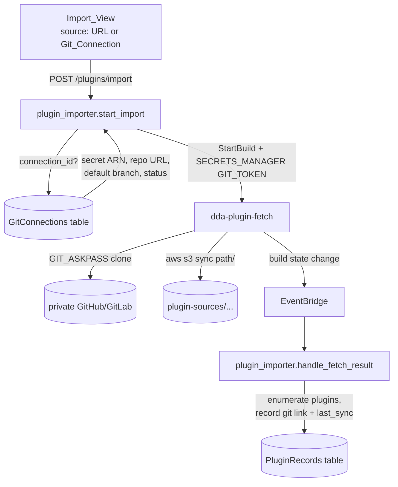

# Design: Private Repository Plugin Import

## Overview

Teach the existing Import path to authenticate with a Git_Connection. The
change is deliberately narrow: the Import request gains an optional
`connection_id` (plus `path`), `plugin_importer.start_fetch` gains one
`SECRETS_MANAGER` environment override, and the `dda-plugin-fetch` buildspec
gains the same `GIT_ASKPASS` dance the git-sync runner already uses. Nothing
about anonymous imports changes, and no Lambda gains the ability to read a
token.

### Key findings from investigation

- **The fetch project is credential-free today.** `dda-plugin-fetch`
  (`node-designer-stack.ts`) runs `STANDARD_7_0` / `SMALL` with a buildspec of
  five commands: assert `REPO_URL`/`DEST_PREFIX`, `git clone "$REPO_URL"
  /tmp/repo`, optional `git -C /tmp/repo checkout "$REVISION"`, `rm -rf
  /tmp/repo/.git`, `aws s3 sync /tmp/repo/ s3://$ARTIFACTS_BUCKET/$DEST_PREFIX/`.
  Adding auth means adding an askpass helper and nothing else.
- **`start_fetch` already passes six PLAINTEXT overrides** (`REPO_URL`,
  `REVISION`, `DEST_PREFIX`, `USECASE_ID`, `PLUGIN_ID`, `PLUGIN_VERSION`,
  plus `REVISION_SLUG` for multi-revision imports) and returns immediately;
  the result arrives through EventBridge at `handle_fetch_result`. The
  authenticated path rides the same rails.
- **`validate_repo_url` is explicitly the public rule** ("Validate a public
  repository URL for import"): `http`/`https`/`git` with a hostname, no
  whitespace, no ssh scp-style strings. It stays as-is and simply does not
  apply when a Git_Connection is named.
- **The git-sync runner is the reference implementation.** `runner.sh` writes
  a throwaway `askpass.sh` that echoes `$GIT_TOKEN`, exports `GIT_ASKPASS`,
  and uses an isolated `HOME` (needed for git < 2.31 which lacks
  `GIT_CONFIG_COUNT`). The fetch buildspec can inline the same six lines.
- **The importer Lambda already has the connections table in its
  environment** (`GIT_CONNECTIONS_TABLE` is set on the node-designer
  handlers), so resolving a connection needs a read grant, not new wiring.
- **The importer and git_sync must not import each other.** `plugin_importer`
  already duplicates `build_id_from_arn` locally to avoid a cycle with
  `plugin_builds`; the connection lookup, redaction, and failure
  classification helpers this feature needs should move to the shared layer
  rather than be imported across function modules.

### Key design decisions

1. **Reuse Git_Connection; never accept a token in the Import request.**
   The alternative (a one-off token field on the import form) would create a
   second credential path with its own storage, rotation, and redaction
   story. Requiring a verified connection also means the credential has
   already been proven against the repository by the `verify` Sync_Operation
   before anyone waits on a clone.
2. **Require `verified`, matching Push/Pull.** A `verifying` or `failed`
   connection is rejected up front so the failure is immediate and legible
   instead of a CodeBuild authentication error minutes later.
3. **Subdirectory support belongs here, not in a follow-up.** A private
   monorepo is the common case for in-house plugins, and the existing
   enumeration walks the whole synced tree. Scoping the sync to
   `path` keeps the import small and makes the resulting Source_Tree match
   what a later Push would write back.
4. **Auto-create the Git_Link on success.** The import already knows the
   connection, branch, path, and resolved commit — exactly the Git_Link
   shape. Recording it turns "import once" into "stay in sync", and costs one
   more field write in `handle_fetch_result`.
5. **Share helpers through the layer, not across function modules.**
   `resolve_connection`, `redact`, and `classify_failure` move from
   `git_sync.py` into the shared layer so both modules use one implementation
   and the no-cycle rule holds.

## Architecture



### Request contract

`POST /plugins/import` gains four optional fields and one mutual-exclusion
rule:

```jsonc
{
  "usecase_id": "...",
  "architectures": ["x86_64"],
  // exactly one of:
  "repo_url": "https://github.com/org/public.git",
  "connection_id": "c-...",
  // only with connection_id:
  "path": "plugins/my-element",   // subdirectory to import (default: whole tree)
  "branch": "release/1",          // branch to clone (default: connection's default_branch)
  // either source:
  "revision": "v1.2.0",           // already exists; unchanged semantics
  "shallow": true                 // depth-1 clone; default false, sent only when true
}
```

- Both or neither → 400 `INVALID_IMPORT_SOURCE {field}`.
- Unknown or cross-Use_Case connection → 404 `CONNECTION_NOT_FOUND`
  (consistent with the git-sync endpoints and the existing record-scoping
  behavior; the connection is invisible outside its Use_Case, and the two
  cases are indistinguishable). The connection is resolved only after the
  RBAC gate, so an unauthorized caller learns nothing about which
  connections exist.
- Connection not `verified` → 409 `CONNECTION_NOT_VERIFIED {connection_id,
  status}`, the same code the Push/Pull precondition uses; no
  re-verification is started.
- `path` failing the relative-path rule → 400 `INVALID_FILE_PATH {file}`,
  reusing `normalize_source_path` (which, post
  custom-node-source-lifecycle, also rejects control characters and
  segments with edge whitespace).
- `branch` that is not a plausible git branch name → 400 `INVALID_BRANCH`;
  `path` / `branch` without a `connection_id` → 400 `INVALID_IMPORT_SOURCE`;
  non-boolean `shallow` → 400 `INVALID_SHALLOW`.
- A subdirectory import is named after the last path segment unless `name`
  is given (`derive_import_name(..., subdir=)`); whole-tree imports keep the
  URL-derived name.

### `start_fetch` change

`fetch_env_overrides` (pure; `start_fetch` passes its result to StartBuild)
adds five overrides when a connection is named, mirroring
`git_sync.start_sync_operation`:

```python
GIT_TOKEN     SECRETS_MANAGER  f'{secret_arn}:token'      # the only non-PLAINTEXT variable
GIT_USERNAME  PLAINTEXT        provider_username(conn)    # x-access-token / oauth2
REPO_SUBDIR   PLAINTEXT        path or ''
REPO_BRANCH   PLAINTEXT        branch or ''
RESULT_KEY    PLAINTEXT        fetch_result_key(dest_prefix)
```

and, for either source kind, `SHALLOW=1` only when the request asked for it,
so an anonymous non-shallow fetch's override list is byte-identical to the
pre-feature one (Property 1). `REPO_URL` is the Git_Connection's stored URL;
the token never touches it. Property 3 pins the invariant that exactly one
override is `SECRETS_MANAGER` and no PLAINTEXT value contains the token.

### Fetch runner

The five-line inline buildspec becomes a real script,
`edge-cv-portal/plugin-build-images/plugin-fetch/fetch.sh`, which
`node-designer-stack.ts` reads at synth time (`fs.readFileSync`) and inlines
as the project's single build command. The project therefore stays
`NO_SOURCE` and needs no new read grant, while the script is testable offline
(`tests/test_plugin_fetch_runner.py` runs it against local bare repositories
with a fake `aws`). Behaviour:

- **Credentials** (only when `GIT_TOKEN` is set): isolated `HOME` whose
  `.gitconfig` resets `credential.helper` (so no helper the image might
  configure can store the token), and a `GIT_ASKPASS` helper that answers
  the username prompt with `GIT_USERNAME` and the password prompt with
  `GIT_TOKEN` from the environment. `GIT_TERMINAL_PROMPT=0` is set for every
  fetch, so a rejected or missing credential fails fast. The token is never
  on a command line, in a URL, or in a file that outlives the build.
- **Clone**: `--depth 1` when `SHALLOW` is set, `--branch "$REPO_BRANCH"` when
  set; then the optional `REVISION` checkout (a shallow clone fetches the
  revision at depth 1, deepening with `--unshallow` only when the host
  refuses).
- **Subdirectory guard**: `REPO_SUBDIR` must be relative and present, else
  the build fails with a marker (`INVALID_SUBDIR`, `PATH_NOT_FOUND`); the
  sync then covers `"$SRC_DIR/"` only, so the Source_Tree matches what a
  later Push writes back.
- **Result document**: when `RESULT_KEY` is set (connection imports only),
  every exit writes `{status, commit, branch, failure_marker, stderr_tail}`
  to `s3://{bucket}/{RESULT_KEY}`. Failure markers: `CLONE_FAILED`,
  `BRANCH_NOT_FOUND`, `REVISION_NOT_FOUND`, `INVALID_SUBDIR`,
  `PATH_NOT_FOUND`, `SYNC_FAILED`.

Anonymous, option-free invocations perform the original operations
(`git clone`, optional `git checkout`, `rm -rf .git`, `aws s3 sync`), with
`--quiet` and stderr captured for the result document.

### Post-import revision adjustment

`adjust_revision` (per-architecture revision override on a settled import)
re-fetches a connection-sourced record through its `import_source`
connection: the connection is resolved again (404 / 409 exactly as on
import, never a re-verification) and the fetch carries the same
subdirectory, branch, and clone depth, so the adjusted architecture builds
the same tree shape as the others. A failed adjustment fetch's per-arch
`logTail` carries the classified, redacted finding.

### Result handling

The result document lives at `fetch_result_key(dest_prefix)` =
`plugin-sources/{uc}/{pid}/{v}.fetch/result.json` (multi-revision fetches:
`{v}.fetch/result-rev-{slug}.json`) — a sibling of the version prefix, so it
is covered by the fetch role's existing `plugin-sources/*` write grant and the
importer's existing bucket read, yet never appears in the version's tree
listing (scoped to `{v}/`). `plugin_records._cleanup_record_objects` deletes
the `.fetch/` directory with the tree.

`handle_fetch_result` (and `_handle_multi_fetch_result`) gain two things,
both only when the record carries `import_source`:

1. **Failure classification** (`fetch_failure_finding`, pure). The runner's
   marker wins for a missing path / branch / revision (`not_found`);
   otherwise the shared `classify_failure` runs over the stderr tail
   (`authentication` / `not_found` / `unreachable` / `internal`). The stored
   `import_finding` is the category's human text plus a redacted, capped
   excerpt of the tail; `import_finding_category` carries the category. A
   build that died before the runner ran (no document) settles as `internal`.
   An unbuildable tree keeps the existing scan finding, with no category
   (Requirement 3.4).
2. **Git_Link recording** (`import_git_link`, pure). On a buildable tree,
   write `git = {connection_id, branch, path, linked_by, linked_at,
   last_sync: {kind: 'pull', commit, branch, path, by, at}}` — the branch
   the runner resolved (else the requested one), the fetched commit as the
   pull baseline, the importing user as `linked_by`. Multi-revision imports
   link the DEFAULT revision's tree. **Whole-tree imports (no `path`) are not
   linked**: a Repository_Path is a subdirectory (the sync runner refuses
   `.`), so a root-tree link could neither Push nor Pull; `import_source`
   still records the origin and a hand link stays possible.

### Data model

`PluginRecords` gains, on connection-sourced imports only:

```
import_source: {kind: 'git_connection', connection_id, branch, revision, shallow, path?}
git: {...}                      # existing Git_Link shape (Requirement 5), subdirectory imports
import_finding_category?: str   # Failure_Category for a failed fetch (3.1)
```

An anonymous import that asked for `shallow` records `provenance.shallow:
true` and nothing else; `import_source` is absent on anonymous imports, so
Property 1 (preservation) can assert byte-equality of the record for that
path. Both `version_detail` (records API, polled by the Import_View) and
`import_detail` (import response) expose `import_source` and
`import_finding_category`.

### Infrastructure

- `fetchRole` gains `secretsmanager:GetSecretValue` on
  `arn:aws:secretsmanager:{region}:{account}:secret:dda-portal/git-connections/*`
  — the same statement the `GitSyncRunnerRole` already carries, and the only
  IAM change in this feature.
- `PluginImporterHandler`'s role gains read on the GitConnections table. It
  must NOT gain `GetSecretValue`; the CDK test asserts that negative.
- The fetch project's buildspec becomes the inlined runner (`env.shell:
  bash`, pre-flight guard + script); its `environmentVariables` gain
  `REPO_BRANCH`, `REPO_SUBDIR`, `SHALLOW`, `RESULT_KEY` (empty defaults) and
  `GIT_USERNAME` (`x-access-token`). `GIT_TOKEN` is never a project-level
  variable — it arrives only as a StartBuild override.
- No new project, table, Lambda, or route.

### Frontend

`ImportView.tsx` already chooses its source with a Cloudscape `Tiles`
control ("Official GStreamer module" / "Repository URL"); it gains a third
tile, "Git connection", so the source choice stays one control (the default
tile is unchanged, so the existing flow is untouched for existing users,
4.1). When the new tile is chosen the view shows a `Select` of verified
connections (reusing `listGitConnections`, each option showing repository
URL and default branch), an empty state linking the Git connections page, a
subdirectory `Input` validated by the existing `isValidSourcePath`, a branch
`Input` pre-filled with the connection's default branch (client-side mirror
of the backend branch rule), and the existing revision input. A "Shallow
clone" checkbox (unchecked by default, sent only when checked) applies to
every source kind. Failure text follows `import_finding_category`
(`importFailureGuidance`, shared with the plugin detail page):
`authentication` names the Git connections page and links it (no automatic
re-verification), `not_found` explains the repository / branch / revision /
path may not exist; a 409 `CONNECTION_NOT_VERIFIED` shows the connection's
status. The pure pieces (`verifiedConnectionOptions`, `isValidBranchName`,
`connectionSourceParams`, `shallowParam`, `importFailureGuidance`,
`connectionNotVerifiedText`) live in `importFlow.ts`. The request type
`ImportPluginRequest` makes `repo_url` optional and gains `connection_id`,
`path`, `branch`, and `shallow`; `PluginVersionDetail` gains
`import_source` and `import_finding_category`.

## Error Handling

| Condition | Code | Status |
| --- | --- | --- |
| both or neither source; `path`/`branch` without a connection | `INVALID_IMPORT_SOURCE` | 400 |
| unknown / cross-use-case connection | `CONNECTION_NOT_FOUND` (same code as the git-sync endpoints; the two cases are indistinguishable) | 404 |
| connection not verified | `CONNECTION_NOT_VERIFIED` | 409 |
| bad subdirectory | `INVALID_FILE_PATH` | 400 |
| bad branch name | `INVALID_BRANCH` | 400 |
| `revision` starting with `-` (would read as a git option) | `INVALID_REVISION` | 400 |
| non-boolean `shallow` | `INVALID_SHALLOW` | 400 |
| fetch could not be started | `REPO_FETCH_FAILED` (unchanged) | 502 |
| clone rejected the token | import finding, category `authentication` | — |
| repo/branch/revision/path missing | import finding, category `not_found` | — |
| host unreachable | import finding, category `unreachable` | — |
| build died before the runner ran | import finding, category `internal` | — |
| no plugin found under path | existing no-plugins finding, no category | — |

## Testing Strategy

### Properties

1. **Anonymous import is byte-identical.** *For any* anonymous import
   request, the Fetch_Project overrides and the resulting Plugin_Record
   fields equal those produced before this feature (Requirement 6.1).
2. **Source exclusivity.** *For any* combination of `repo_url` and
   `connection_id` presence, the request is accepted iff exactly one is
   present, and rejected with `INVALID_IMPORT_SOURCE` otherwise
   (Requirement 1.2).
3. **The fetch environment never carries the token.** *For any*
   connection-sourced import, the override list contains exactly one
   `SECRETS_MANAGER` variable (`GIT_TOKEN` → `{arn}:token`), every other
   variable is `PLAINTEXT`, and no PLAINTEXT value equals or contains the
   token (Requirement 2.1, mirroring the sync path's Property 10).
4. **Subdirectory validity.** *For any* string, the import `path` is
   accepted iff `normalize_source_path` accepts it (Requirement 1.5).
5. **Redaction totality.** *For any* fetch log tail containing a token-like
   substring, the stored finding contains no token substring
   (Requirement 2.4).
6. **Link completeness.** *For any* successful connection-sourced import,
   the recorded Git_Link's connection, branch, and path equal the request's
   resolved values, and `last_sync.commit` equals the fetched commit
   (Requirement 5.1, 5.2).

### Tests

- **Backend** (pytest + moto + hypothesis): new `test_private_repo_import.py`
  (the connection-sourced happy path, the rejections, failure
  classification and redaction, the auto-link and its pull baseline,
  multi-revision connection imports, `.fetch/` cleanup on delete, and the
  anonymous preservation cases; `test_plugin_importer.py` stays unchanged as
  the preservation baseline); new `test_property_import_source.py` for
  Properties 1-6. The moto caveat from the sync work applies: `start_build`
  does not persist `environmentVariablesOverride`, so the test wraps
  `codebuild.start_build` with a recorder to assert Property 3.
- **Fetch runner** (offline, `tests/test_plugin_fetch_runner.py`, following
  `plugin-build-images/git-sync/tests/`): runs `fetch.sh` against local
  bare repositories with a fake `aws` on PATH, and against a local
  basic-auth HTTP remote (git's dumb protocol behind `http.server`) so git
  really prompts: asserting the askpass clone works, that a missing or
  rejected token fails fast rather than prompting (and classifies as
  `authentication`), that `REPO_SUBDIR` / `REPO_BRANCH` / `SHALLOW` /
  `REVISION` behave, that the result document carries the right marker,
  and that the token appears in no file the build leaves behind.
- **Infrastructure** (jest): `fetchRole` has `GetSecretValue` on exactly the
  connection secret pattern; `PluginImporterRole` has no `GetSecretValue`;
  the buildspec contains the askpass block and the subdirectory guard;
  snapshot update.
- **Frontend** (vitest): source toggle defaults to public URL; verified-only
  connection list; empty-state link to Git connections; subdirectory
  validation; request body shape for both branches; existing ImportView
  tests unchanged as preservation.
- **Manual/integration**: import a real private GitHub repo and a real
  private GitLab repo with a PAT, one with a subdirectory; confirm the
  resulting version pushes back through the auto-created Git_Link; revoke
  the token and confirm the failure reads as `authentication`.

## Resolved review questions

1. **Failed `verified` check → no auto re-verification.** A non-verified
   connection is rejected with 409 `CONNECTION_NOT_VERIFIED` and the
   Import_View shows the error with the connection's status; re-verifying is
   an explicit action on the Git connections page. Rationale: an import
   request stays a read-ish operation and never turns into a credential
   operation.
2. **`branch` is a separate field from `revision`.** `branch` selects the
   branch to clone and is what the auto-created Git_Link records for later
   Push/Pull; it defaults to the Git_Connection's default branch. `revision`
   keeps its existing meaning — an optional tag or commit to check out after
   the clone — so a team can import a pinned release tag while keeping the
   link on `main`. Absent `revision`, the imported tree is the branch head.
3. **Clone depth is the user's choice.** The request gains `shallow`
   (boolean, default `false`, so the anonymous path is byte-identical and
   Property 1 stays exact). Shallow clones use `--depth 1 --branch
   {branch}`; when a `revision` is also given the buildspec fetches that
   revision at depth 1 and checks out `FETCH_HEAD`, falling back to
   `--unshallow` when the host refuses a reachable-only fetch (the same
   fallback the sync runner uses). The Import_View exposes it as a
   "Shallow clone (faster, history not needed)" checkbox, unchecked by
   default, available for both source kinds.

### Request contract (final)

```jsonc
{
  "usecase_id": "...",
  "architectures": ["x86_64"],
  // exactly one of:
  "repo_url": "https://github.com/org/public.git",
  "connection_id": "c-...",
  // only with connection_id:
  "path": "plugins/my-element",         // optional subdirectory
  "branch": "release/2026-09",          // optional; default = connection.default_branch
  // both source kinds:
  "revision": "v1.2.0",                 // optional tag/commit pin (unchanged semantics)
  "shallow": false                      // optional; default false
}
```

Buildspec consequences: `REPO_BRANCH` and `SHALLOW` join `REPO_SUBDIR` as
PLAINTEXT overrides. The clone becomes
`git clone ${SHALLOW:+--depth 1} ${REPO_BRANCH:+--branch "$REPO_BRANCH"} "$REPO_URL" /tmp/repo`;
the anonymous default (no branch, no shallow) reduces to today's exact
`git clone "$REPO_URL" /tmp/repo`.
