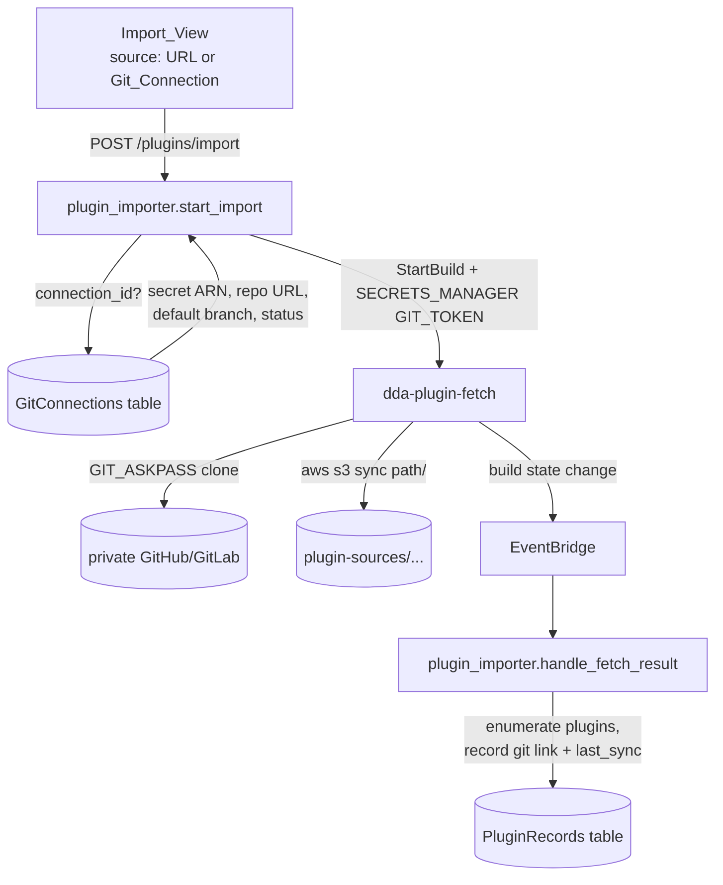

# Design: Private Repository Plugin Import

## Overview

Teach the existing Import path to authenticate with a Git_Connection. The
change is deliberately narrow: the Import request gains an optional
`connection_id` (plus `path`), `plugin_importer.start_fetch` gains one
`SECRETS_MANAGER` environment override, and the `dda-plugin-fetch` buildspec
gains the same `GIT_ASKPASS` dance the git-sync runner already uses. Nothing
about anonymous imports changes, and no Lambda gains the ability to read a
token.

### Key findings from investigation

- **The fetch project is credential-free today.** `dda-plugin-fetch`
  (`node-designer-stack.ts`) runs `STANDARD_7_0` / `SMALL` with a buildspec of
  five commands: assert `REPO_URL`/`DEST_PREFIX`, `git clone "$REPO_URL"
  /tmp/repo`, optional `git -C /tmp/repo checkout "$REVISION"`, `rm -rf
  /tmp/repo/.git`, `aws s3 sync /tmp/repo/ s3://$ARTIFACTS_BUCKET/$DEST_PREFIX/`.
  Adding auth means adding an askpass helper and nothing else.
- **`start_fetch` already passes six PLAINTEXT overrides** (`REPO_URL`,
  `REVISION`, `DEST_PREFIX`, `USECASE_ID`, `PLUGIN_ID`, `PLUGIN_VERSION`,
  plus `REVISION_SLUG` for multi-revision imports) and returns immediately;
  the result arrives through EventBridge at `handle_fetch_result`. The
  authenticated path rides the same rails.
- **`validate_repo_url` is explicitly the public rule** ("Validate a public
  repository URL for import"): `http`/`https`/`git` with a hostname, no
  whitespace, no ssh scp-style strings. It stays as-is and simply does not
  apply when a Git_Connection is named.
- **The git-sync runner is the reference implementation.** `runner.sh` writes
  a throwaway `askpass.sh` that echoes `$GIT_TOKEN`, exports `GIT_ASKPASS`,
  and uses an isolated `HOME` (needed for git < 2.31 which lacks
  `GIT_CONFIG_COUNT`). The fetch buildspec can inline the same six lines.
- **The importer Lambda already has the connections table in its
  environment** (`GIT_CONNECTIONS_TABLE` is set on the node-designer
  handlers), so resolving a connection needs a read grant, not new wiring.
- **The importer and git_sync must not import each other.** `plugin_importer`
  already duplicates `build_id_from_arn` locally to avoid a cycle with
  `plugin_builds`; the connection lookup, redaction, and failure
  classification helpers this feature needs should move to the shared layer
  rather than be imported across function modules.

### Key design decisions

1. **Reuse Git_Connection; never accept a token in the Import request.**
   The alternative (a one-off token field on the import form) would create a
   second credential path with its own storage, rotation, and redaction
   story. Requiring a verified connection also means the credential has
   already been proven against the repository by the `verify` Sync_Operation
   before anyone waits on a clone.
2. **Require `verified`, matching Push/Pull.** A `verifying` or `failed`
   connection is rejected up front so the failure is immediate and legible
   instead of a CodeBuild authentication error minutes later.
3. **Subdirectory support belongs here, not in a follow-up.** A private
   monorepo is the common case for in-house plugins, and the existing
   enumeration walks the whole synced tree. Scoping the sync to
   `path` keeps the import small and makes the resulting Source_Tree match
   what a later Push would write back.
4. **Auto-create the Git_Link on success.** The import already knows the
   connection, branch, path, and resolved commit — exactly the Git_Link
   shape. Recording it turns "import once" into "stay in sync", and costs one
   more field write in `handle_fetch_result`.
5. **Share helpers through the layer, not across function modules.**
   `resolve_connection`, `redact`, and `classify_failure` move from
   `git_sync.py` into the shared layer so both modules use one implementation
   and the no-cycle rule holds.

## Architecture



### Request contract

`POST /plugins/import` gains two optional fields and one mutual-exclusion
rule:

```jsonc
{
  "usecase_id": "...",
  "architectures": ["x86_64"],
  // exactly one of:
  "repo_url": "https://github.com/org/public.git",
  "connection_id": "c-...",
  // only with connection_id:
  "path": "plugins/my-element",
  "revision": "main"          // already exists; unchanged semantics
}
```

- Both or neither → 400 `INVALID_IMPORT_SOURCE {field}`.
- Unknown or cross-Use_Case connection → 404 (consistent with the existing
  record-scoping behavior; the connection is invisible outside its Use_Case).
- Connection not `verified` → 409 `CONNECTION_NOT_VERIFIED {status}`,
  the same code the Push/Pull precondition uses.
- `path` failing the relative-path rule → 400 `INVALID_FILE_PATH {file}`,
  reusing `normalize_source_path` (which, post
  custom-node-source-lifecycle, also rejects control characters and
  segments with edge whitespace).

### `start_fetch` change

One extra override when a connection is named, mirroring
`git_sync.start_sync_operation`:

```python
env_overrides.append({
    'name': 'GIT_TOKEN',
    'value': f'{secret_arn}:token',
    'type': 'SECRETS_MANAGER',
})
env_overrides.append({'name': 'REPO_SUBDIR', 'value': path or '', 'type': 'PLAINTEXT'})
```

`REPO_URL` is the Git_Connection's stored URL; the token never touches it.
Property 3 below pins the invariant that exactly one override is
`SECRETS_MANAGER` and no PLAINTEXT value contains the token.

### Fetch buildspec change

```bash
# auth (only when GIT_TOKEN is present)
if [ -n "$GIT_TOKEN" ]; then
  export HOME=/tmp/githome; mkdir -p "$HOME"
  printf '#!/bin/sh\necho "$GIT_TOKEN"\n' > /tmp/askpass.sh
  chmod +x /tmp/askpass.sh
  export GIT_ASKPASS=/tmp/askpass.sh
  export GIT_TERMINAL_PROMPT=0
  git config --global credential.username x-access-token
fi
git clone "$REPO_URL" /tmp/repo
...
# sync only the requested subdirectory
SRC=/tmp/repo${REPO_SUBDIR:+/$REPO_SUBDIR}
test -d "$SRC" || { echo "PATH_NOT_FOUND: $REPO_SUBDIR"; exit 1; }
aws s3 sync "$SRC/" "s3://$ARTIFACTS_BUCKET/$DEST_PREFIX/"
```

`GIT_TERMINAL_PROMPT=0` turns a missing/invalid credential into an immediate
failure instead of a hung build. `x-access-token` as the username works for
both GitHub PATs and GitLab PATs, matching the runner.

### Result handling

`handle_fetch_result` gains two things:

1. **Failure classification.** The fetch build's log tail is classified with
   the shared `classify_failure` and stored redacted, so the Import_View can
   distinguish `authentication` from `not_found` from `internal` instead of
   showing a generic clone failure (Requirement 3).
2. **Git_Link recording.** On success for a connection-sourced import, write
   `git = {connection_id, branch, path, linked_by, linked_at, last_sync:
   {kind: 'pull', commit, branch, path, by, at}}`. The commit comes from a
   `git rev-parse HEAD` the buildspec writes next to the synced tree (same
   mechanism the sync runner uses for its `result.json`).

### Data model

`PluginRecords` gains, on connection-sourced imports only:

```
import_source: {kind: 'git_connection', connection_id, path, revision}
git: {...}                      # existing Git_Link shape (Requirement 5)
import_finding_category?: str   # Failure_Category for a failed fetch (3.1)
```

`import_source` is absent on anonymous imports, so Property 1 (preservation)
can assert byte-equality of the record for that path.

### Infrastructure

- `fetchRole` gains `secretsmanager:GetSecretValue` on
  `arn:aws:secretsmanager:{region}:{account}:secret:dda-portal/git-connections/*`
  — the same statement the `GitSyncRunnerRole` already carries, and the only
  IAM change in this feature.
- `PluginImporterHandler`'s role gains read on the GitConnections table. It
  must NOT gain `GetSecretValue`; the CDK test asserts that negative.
- The fetch project's buildspec and `environmentVariables` gain `GIT_TOKEN`
  (empty default) and `REPO_SUBDIR`.
- No new project, table, Lambda, or route.

### Frontend

`ImportView.tsx` gains a source `RadioGroup` ("Public repository URL" /
"Git connection"), and when the latter is chosen a `Select` of verified
connections (reusing `listGitConnections`), a subdirectory `Input` validated
by the existing `isValidSourcePath`, and the existing revision input. The
public-URL branch is untouched, which keeps the existing ImportView tests
meaningful as preservation tests. `pages/node-designer/api.ts`'s
`importPlugin` body gains the optional `connection_id` and `path`.

## Error Handling

| Condition | Code | Status |
| --- | --- | --- |
| both or neither source | `INVALID_IMPORT_SOURCE` | 400 |
| unknown / cross-use-case connection | `NOT_FOUND` | 404 |
| connection not verified | `CONNECTION_NOT_VERIFIED` | 409 |
| bad subdirectory | `INVALID_FILE_PATH` | 400 |
| clone rejected the token | import finding, category `authentication` | — |
| repo/revision/path missing | import finding, category `not_found` | — |
| no plugin found under path | existing no-plugins finding | — |

## Testing Strategy

### Properties

1. **Anonymous import is byte-identical.** *For any* anonymous import
   request, the Fetch_Project overrides and the resulting Plugin_Record
   fields equal those produced before this feature (Requirement 6.1).
2. **Source exclusivity.** *For any* combination of `repo_url` and
   `connection_id` presence, the request is accepted iff exactly one is
   present, and rejected with `INVALID_IMPORT_SOURCE` otherwise
   (Requirement 1.2).
3. **The fetch environment never carries the token.** *For any*
   connection-sourced import, the override list contains exactly one
   `SECRETS_MANAGER` variable (`GIT_TOKEN` → `{arn}:token`), every other
   variable is `PLAINTEXT`, and no PLAINTEXT value equals or contains the
   token (Requirement 2.1, mirroring the sync path's Property 10).
4. **Subdirectory validity.** *For any* string, the import `path` is
   accepted iff `normalize_source_path` accepts it (Requirement 1.5).
5. **Redaction totality.** *For any* fetch log tail containing a token-like
   substring, the stored finding contains no token substring
   (Requirement 2.4).
6. **Link completeness.** *For any* successful connection-sourced import,
   the recorded Git_Link's connection, branch, and path equal the request's
   resolved values, and `last_sync.commit` equals the fetched commit
   (Requirement 5.1, 5.2).

### Tests

- **Backend** (pytest + moto + hypothesis): extend `test_plugin_importer.py`
  with the connection-sourced happy path, the four rejections, and the
  auto-link assertion; new `test_property_import_source.py` for Properties
  2-4 and 6; extend the existing redaction property for Property 5. The
  moto caveat from the sync work applies: `start_build` does not persist
  `environmentVariablesOverride`, so the test must wrap
  `codebuild.start_build` with a recorder to assert Property 3.
- **Fetch buildspec** (offline shell, following
  `plugin-build-images/git-sync/tests/`): a local bare repo with a
  `pre-receive`-free read path, asserting the askpass clone works, that a
  missing token fails fast rather than prompting, that `REPO_SUBDIR` scopes
  the sync, and that the token appears in no file the build leaves behind.
- **Infrastructure** (jest): `fetchRole` has `GetSecretValue` on exactly the
  connection secret pattern; `PluginImporterRole` has no `GetSecretValue`;
  the buildspec contains the askpass block and the subdirectory guard;
  snapshot update.
- **Frontend** (vitest): source toggle defaults to public URL; verified-only
  connection list; empty-state link to Git connections; subdirectory
  validation; request body shape for both branches; existing ImportView
  tests unchanged as preservation.
- **Manual/integration**: import a real private GitHub repo and a real
  private GitLab repo with a PAT, one with a subdirectory; confirm the
  resulting version pushes back through the auto-created Git_Link; revoke
  the token and confirm the failure reads as `authentication`.

## Resolved review questions

1. **Failed `verified` check → no auto re-verification.** A non-verified
   connection is rejected with 409 `CONNECTION_NOT_VERIFIED` and the
   Import_View shows the error with the connection's status; re-verifying is
   an explicit action on the Git connections page. Rationale: an import
   request stays a read-ish operation and never turns into a credential
   operation.
2. **`branch` is a separate field from `revision`.** `branch` selects the
   branch to clone and is what the auto-created Git_Link records for later
   Push/Pull; it defaults to the Git_Connection's default branch. `revision`
   keeps its existing meaning — an optional tag or commit to check out after
   the clone — so a team can import a pinned release tag while keeping the
   link on `main`. Absent `revision`, the imported tree is the branch head.
3. **Clone depth is the user's choice.** The request gains `shallow`
   (boolean, default `false`, so the anonymous path is byte-identical and
   Property 1 stays exact). Shallow clones use `--depth 1 --branch
   {branch}`; when a `revision` is also given the buildspec fetches that
   revision at depth 1 and checks out `FETCH_HEAD`, falling back to
   `--unshallow` when the host refuses a reachable-only fetch (the same
   fallback the sync runner uses). The Import_View exposes it as a
   "Shallow clone (faster, history not needed)" checkbox, unchecked by
   default, available for both source kinds.

### Request contract (final)

```jsonc
{
  "usecase_id": "...",
  "architectures": ["x86_64"],
  // exactly one of:
  "repo_url": "https://github.com/org/public.git",
  "connection_id": "c-...",
  // only with connection_id:
  "path": "plugins/my-element",         // optional subdirectory
  "branch": "release/2026-09",          // optional; default = connection.default_branch
  // both source kinds:
  "revision": "v1.2.0",                 // optional tag/commit pin (unchanged semantics)
  "shallow": false                      // optional; default false
}
```

Buildspec consequences: `REPO_BRANCH` and `SHALLOW` join `REPO_SUBDIR` as
PLAINTEXT overrides. The clone becomes
`git clone ${SHALLOW:+--depth 1} ${REPO_BRANCH:+--branch "$REPO_BRANCH"} "$REPO_URL" /tmp/repo`;
the anonymous default (no branch, no shallow) reduces to today's exact
`git clone "$REPO_URL" /tmp/repo`.
