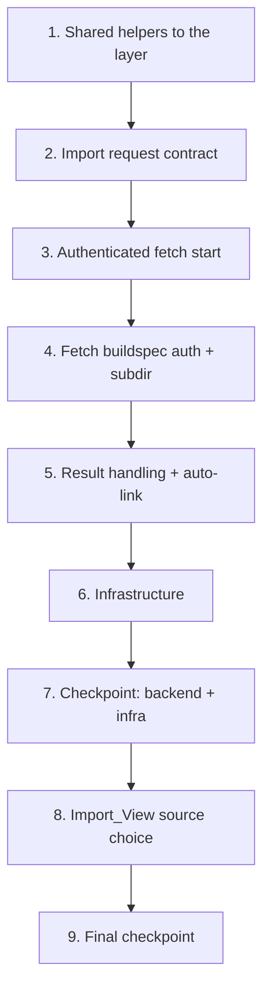

# Implementation Plan: Private Repository Plugin Import

## Overview

Six waves, inside-out so every prompt lands on integrated ground: shared
helpers first (they unblock both modules without an import cycle), then the
request contract, then the fetch project and its buildspec, then result
handling and the auto-link, then infrastructure, then the Import_View. Tasks
marked `*` are optional test tasks.

## Tasks

- [x] 1. Move the shared Git helpers into the shared layer
  - [x] 1.1 Relocate `resolve_connection`, `redact`, and `classify_failure`
    - Move the three helpers from `functions/git_sync.py` into the shared
      layer (`layers/shared/python/shared_utils.py` or a new
      `git_connections.py` module beside it), re-export them from `git_sync`
      so that module's behavior is unchanged, and import them in
      `plugin_importer` — `plugin_importer` must not import `git_sync`
      (the module already duplicates `build_id_from_arn` locally to avoid a
      cycle with `plugin_builds`; keep that rule)
    - _Requirements: 2.4, 3.1_
  - [x]* 1.2 Assert the relocation changed no sync behavior
    - Run the existing `test_git_sync.py` and `test_property_git_sync.py`
      unchanged; they are the preservation oracle for this move
    - _Requirements: 6.1_

- [x] 2. Extend the Import request contract
  - [x] 2.1 Add `connection_id` / `path` and the exclusivity rule
    - In `plugin_importer.start_import`: accept `connection_id`, `path`,
      `branch` (default = the connection's default branch), and `shallow`
      (boolean, default false, both source kinds);
      reject both-or-neither with 400 `INVALID_IMPORT_SOURCE {field}`; keep
      `validate_repo_url` on the anonymous branch only; resolve the
      connection (404 when unknown or cross-Use_Case, 409
      `CONNECTION_NOT_VERIFIED {status}` when not verified); validate `path`
      with `plugin_records.normalize_source_path` → 400 `INVALID_FILE_PATH`
    - Record `import_source = {kind: 'git_connection', connection_id, path,
      branch, revision, shallow}` on the Plugin_Record, and leave the field
      absent for anonymous imports
    - Audit the start with the acting user, Use_Case, connection id, path,
      and revision — never the token
    - _Requirements: 1.1, 1.2, 1.3, 1.4, 1.5, 1.6, 1.7, 1.8, 7.1, 7.2, 7.3_
  - [x]* 2.2 Write property test for source exclusivity
    - **Feature: private-repo-plugin-import, Property 2: Source exclusivity**
    - **Validates: Requirements 1.2**
  - [x]* 2.3 Write property test for subdirectory validity
    - **Feature: private-repo-plugin-import, Property 4: Subdirectory validity**
    - **Validates: Requirements 1.5**

- [x] 3. Start the Authenticated_Fetch
  - [x] 3.1 Extend `start_fetch` with the secret and subdirectory overrides
    - Add `GIT_TOKEN` as a `SECRETS_MANAGER` override (`{secret_arn}:token`)
      plus `REPO_SUBDIR` and `REPO_BRANCH` as PLAINTEXT, only when a
      connection is named; add `SHALLOW=1` as PLAINTEXT only when the request
      sets it (either source kind); use the connection's stored repository URL
      as `REPO_URL`; leave the anonymous, non-shallow override list
      byte-identical
    - _Requirements: 1.1, 1.6, 1.8, 2.1, 6.1, 6.2_
  - [x]* 3.2 Write property test for the fetch environment
    - **Feature: private-repo-plugin-import, Property 3: The fetch environment never carries the token**
    - Wrap `codebuild.start_build` with a recorder — moto does not persist
      `environmentVariablesOverride`
    - **Validates: Requirements 2.1**
  - [x]* 3.3 Write property test for anonymous preservation
    - **Feature: private-repo-plugin-import, Property 1: Anonymous import is byte-identical**
    - **Validates: Requirements 6.1**

- [x] 4. Teach the fetch buildspec to authenticate and scope
  - [x] 4.1 Add the askpass block and the subdirectory guard
    - The fetch runner (`plugin-build-images/plugin-fetch/fetch.sh`, inlined
      into the `PluginFetchProject` buildspec by `node-designer-stack.ts` at
      synth time): when `GIT_TOKEN` is set, isolate `HOME`, write a
      throwaway askpass script that answers the username prompt with
      `$GIT_USERNAME` and the password prompt with `$GIT_TOKEN`, export
      `GIT_ASKPASS` (and `GIT_TERMINAL_PROMPT=0` for every fetch); clone
      with `--branch "$REPO_BRANCH"` when set and
      `--depth 1` when `SHALLOW` is set (a named `REVISION` on a shallow
      clone is fetched at depth 1 and checked out from `FETCH_HEAD`, with an
      `--unshallow` fallback when the host refuses); sync `$REPO_SUBDIR` of
      the clone when set, failing with a distinguishable `PATH_NOT_FOUND`
      message when it is missing; write the resolved `git rev-parse HEAD`
      beside the synced tree for the result handler; the no-override case
      must reduce to today's exact `git clone "$REPO_URL" /tmp/repo`
    - Declare `REPO_SUBDIR`, `REPO_BRANCH`, `SHALLOW`, and `RESULT_KEY` with
      empty defaults (and `GIT_USERNAME`) in `environmentVariables`;
      `GIT_TOKEN` arrives only as a StartBuild override
    - _Requirements: 1.5, 1.6, 1.8, 2.2, 3.3, 5.2_
  - [x]* 4.2 Write offline shell tests for the fetch auth path
    - `tests/test_plugin_fetch_runner.py`, following
      `plugin-build-images/git-sync/tests/`: local bare repo plus a local
      basic-auth HTTP remote (dumb protocol) so git really prompts: askpass
      clone succeeds; absent/invalid token fails fast without
      prompting; `REPO_SUBDIR` scopes the sync; `REPO_BRANCH` selects the
      branch; `SHALLOW` yields a depth-1 clone and a shallow clone with a
      `REVISION` still checks out that revision; the token appears in no
      file the build leaves behind and in no command line
    - _Requirements: 2.2, 2.3_

- [x] 5. Result handling and the automatic Git_Link
  - [x] 5.1 Classify failures and record the link
    - In `handle_fetch_result`: classify a failed fetch with the shared
      `classify_failure`, store `import_finding` and
      `import_finding_category` with the redacted log excerpt; keep the
      existing no-plugins-found finding distinct from a clone failure; on
      success for a connection-sourced import write the Git_Link
      (`connection_id`, resolved branch, `path`) plus `last_sync = {kind:
      'pull', commit, branch, path, by, at}`
    - _Requirements: 2.4, 3.1, 3.4, 5.1, 5.2, 5.3_
  - [x]* 5.2 Write property test for link completeness
    - **Feature: private-repo-plugin-import, Property 6: Link completeness**
    - **Validates: Requirements 5.1, 5.2**
  - [x]* 5.3 Write property test for redaction totality
    - **Feature: private-repo-plugin-import, Property 5: Redaction totality**
    - **Validates: Requirements 2.4**
  - [x]* 5.4 Write unit tests for the import flows
    - Extend `test_plugin_importer.py`: connection-sourced happy path
      (overrides, record fields, auto-link), the four rejections, the
      `authentication` and `not_found` findings, and the no-plugins-found
      case; assert no response body ever carries a token or an
      authenticated URL (2.5)
    - _Requirements: 1.1-1.7, 2.5, 3.1-3.4, 5.1_

- [x] 6. Infrastructure
  - [x] 6.1 Grant exactly the two new reads
    - `fetchRole`: `secretsmanager:GetSecretValue` on
      `secret:dda-portal/git-connections/*` only; `PluginImporterHandler`'s
      role: read on the GitConnections table and explicitly NO
      `GetSecretValue`
    - _Requirements: 2.1, 2.3_
  - [x]* 6.2 Write infrastructure tests
    - Assert the fetch role's secret statement and its resource pattern, the
      importer role's absence of `GetSecretValue`, the buildspec's askpass
      block and subdirectory guard, and the new environment variables;
      update the snapshot
    - _Requirements: 2.1, 2.3_

- [x] 7. Checkpoint - backend and infrastructure
  - Backend pytest from `edge-cv-portal/backend` (`python3 -m pytest tests/
    -p no:cacheprovider`), the offline fetch shell tests, and
    `npm test` + `npm run build` from `edge-cv-portal/infrastructure`; all
    green before touching the frontend
  - Note: the full backend suite takes 20 min to 3+ h depending on load —
    run it in the background and triage from its `-rfE` summary

- [x] 8. Import_View source choice
  - [x] 8.1 Add the source toggle and connection picker
    - `ImportView.tsx`: `RadioGroup` defaulting to "Public repository URL";
      when "Git connection" is chosen, a `Select` of `verified` connections
      (via the existing `listGitConnections`) showing repo URL and default
      branch, an optional subdirectory `Input` validated with
      `isValidSourcePath`, a branch `Input` pre-filled with the connection's
      default branch, and the existing revision input; a "Shallow clone"
      `Checkbox` (unchecked by default) for both source kinds; empty state
      linking to the Git connections page; never a token input
    - `pages/node-designer/api.ts`: `importPlugin` body gains optional
      `connection_id`, `path`, `branch`, and `shallow`
    - Failure display: `authentication` explains the rejected token and
      names the Git connections page (no auto re-verify); a
      `CONNECTION_NOT_VERIFIED` rejection shows the connection's status;
      `not_found` explains repo/branch/revision/path
    - _Requirements: 3.2, 3.3, 3.5, 4.1-4.6_
  - [x]* 8.2 Write component tests for the import surfaces
    - Default source is public URL with the existing flow unchanged;
      verified-only list; empty state; subdirectory validation; branch
      pre-fill; shallow sent only when checked; request body for both
      branches; the failure explanations incl. not-verified; no token input
      exists
    - _Requirements: 4.1-4.6, 3.2, 3.3, 3.5_

- [x] 9. Final checkpoint
  - All baselines: backend pytest, `npx vitest run` + `npm run build` from
    `edge-cv-portal/frontend`, `npm test` + `npm run build` from
    `edge-cv-portal/infrastructure`
  - Then the documented manual pass: private GitHub and private GitLab
    imports (one with a subdirectory), a push back through the auto-created
    link, and a revoked-token import reading as `authentication`
  - Checkpoint result (2026-09-24): backend 5061 passed; the 55 failures and
    46 errors are the pre-existing set (user-admin portal-admin gate,
    registration-fixture `already exists` collisions, fake `shared_utils`
    collection errors) plus order-dependent failures that pass in isolation
    and reproduce on a clean checkout of the previous commit. Frontend 2114
    tests + build, infrastructure 242 tests + build all green. The manual
    pass with a real private repository and PAT is still to be done after
    deploy.

## Notes

- The whole feature adds two read grants (fetch role: the connection
  secrets; importer: the GitConnections table), five empty-default CodeBuild
  project variables plus `GIT_USERNAME`, four request fields
  (`connection_id`, `path`, `branch`, `shallow`), and one more source tile in
  the Import_View. If a task starts growing a second credential path, a new
  project, or a new table, stop and re-read the design — that is out of
  scope.
- Review follow-ups folded in before the final checkpoint: `adjust_revision`
  re-fetches through the record's `import_source` connection (verified
  check re-applied, same subdirectory / branch / clone depth); an unknown or
  cross-Use_Case connection answers 404 `CONNECTION_NOT_FOUND` (the git_sync
  code); `revision` may not start with `-`; the runner sets
  `GIT_TERMINAL_PROMPT=0` for every fetch and resets `credential.helper` in
  its isolated HOME; the credential path is exercised against a local
  basic-auth HTTP remote.
- Deploy is `./deploy-infrastructure.sh` then `./deploy-frontend.sh` from
  `edge-cv-portal` with `AWS_DEFAULT_REGION` exported; the fetch project
  change lands in `EdgeCVPortalNodeDesignerStack`.
