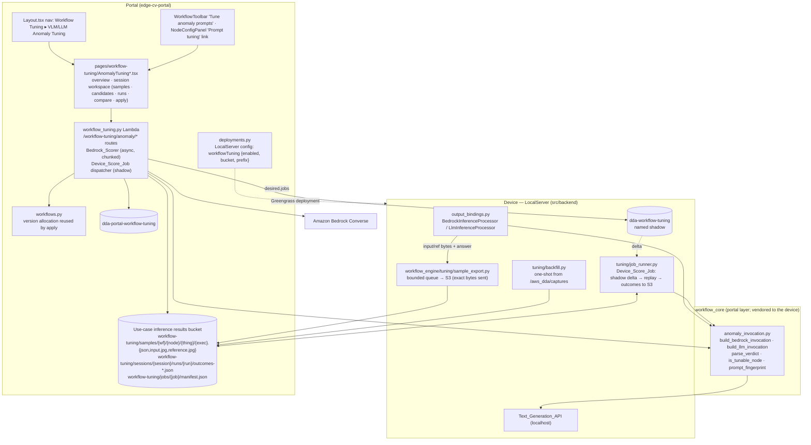

# Design Document — Workflow Tuning: VLM/LLM Anomaly Tuning

## Overview

This feature adds a **Workflow Tuning** section to the Portal whose first tool, **VLM/LLM Anomaly Tuning**, gives a Workflow_Author a closed loop for the prompt of any anomaly-mode `bedrock_inference` or `llm_inference` node: collect what the node actually saw and answered on production runs, label the pairs, replay candidate prompts through the executor's own request construction, compare, and apply the winner as a new Workflow_Definition version.

Three facts about the platform shape the design:

- **Run artifacts never leave the device, and the Portal cannot call a device.** LocalServer persists per execution the exact crop sent to Bedrock, the captured frames per port and the Run_Metadata with the verdicts, but nothing uploads `/aws_dda/captures`; Portal Lambdas reach devices only through IoT shadows, Greengrass deployments, CloudWatch logs and Secure Tunnelling for SSH. So the device must **push** samples to S3. Doing it at invocation time — rather than harvesting artifacts later — also captures bytes that are not on disk today: payload-resolved references and the downscaled frames `llm_inference` actually sends.
- **Faithful replay means the executor's own construction.** The Converse content layout (`[{text: prompt}, {text: "Input image:"}, {image}, {text: "Reference image:"}, {image}]`), the appended `BEDROCK_JSON_INSTRUCTION`, the system-parameter rule, `inferenceConfig={"maxTokens"}` and `parse_bedrock_answer` live in `src/backend/workflow_engine/output_bindings.py`. `workflow_core` is the repo's shared package — authored in `edge-cv-portal/backend/layers/workflow_core/`, vendored to the device by `re_vendor.sh` with a drift guard — so moving the pure request construction and the parser **into `workflow_core`** gives the executor, the Portal's Bedrock scorer and the device's VLM job runner one implementation.
- **The `llm_inference` model is local to the device** (`http://localhost:5000/text-generation/{model}/generate`). Its replay can only run on the device, so VLM Score_Runs are delivered as Device_Score_Jobs through a named shadow — the delivery mechanism camera bindings already use (`dda-camera-bindings`, `CameraBindingStore`) — and report outcomes back through S3.

Everything the user touches is in the Portal. Existing behaviour is preserved by construction: the executor's refactor onto `workflow_core.anomaly_invocation` is pinned to a pre-change baseline (Property 7), Sample_Export is a contained best-effort side channel that is inert unless configured, and applying a Candidate reuses the designer's save path.

### Research notes informing the design (the blue-plate exercise, 2026-09-16)

Concrete lessons from tuning `blue-plate-detection-guided-inspection` by hand; each maps to a requirement.

- **The deployed prompt was wrong in kind.** "Anomalous when it differs in shape, color, damage, or missing features" compared a photo with a flat render, so every plate failed: 0/40 on correctly paired matching plates, always a 23-token `{"is_anomalous": true}`. The run view showed only the verdict. → Req 4.1, 7.2, 7.4 (raw answers per sample).
- **Input beside reference exposed a wiring bug.** `left_to_right` detection sorting on vertically stacked plates paired `bedrock_1`/`bedrock_2` with the wrong reference in most runs. → Req 4.1 (device, version, slot per sample), Req 4.5 (Synthetic_Negatives turn exactly those mispairings into labelled negatives).
- **System prompt and appended instruction fought.** The deployed `system_prompt` demanded a `{text, objects[]}` schema; the executor appended `Respond with JSON: {"is_anomalous"...}`; Nova answered the latter. → Req 5.3, 5.4.
- **Tokens are a correctness parameter.** The rewritten prompt answered in 110–190 tokens; a truncated answer is a `parse_failure` that fails the node. → Req 5.5, output tokens in every outcome.
- **Determinism was checked, not assumed.** Two repeats over 50 core samples agreed on every verdict; that is a property of one prompt on one dataset. → Req 6.7.
- **Faithful replay was the value.** A byte-for-byte copy of `_default_bedrock_invoker` + `parse_bedrock_answer` predicted the device (131/134 offline → deployed). A copy drifts; a shared module does not. → Req 6.2, Property 6.
- **Scale and cost were modest**: 134 pairs ≈ 7 min at 4 workers, ~3.6k input tokens and ~3 s per call; 25 runs were on one device with no pruning. → Req 3.1, 6.13 bounds, chunked Lambda execution.

## Architecture



### End-to-end flows

**Enable.** A Use_Case setting `tuning_sample_export` (with `tuning_sample_retention_days`, default 30) makes `deployments.py` merge `workflowTuning: {enabled: true, bucket, prefix: "workflow-tuning/samples/"}` into the LocalServer component configuration beside the InferenceUploader configuration it already builds, and adds `s3:PutObject`/`s3:GetObject` on `{bucket}/workflow-tuning/*` to the device role policy (Req 2.1, 2.8). The bucket gains a lifecycle rule on `workflow-tuning/samples/` (Req 2.9).

**Export.** After every Anomaly_Mode invocation that returned an answer, the executor hands `SampleExporter.enqueue(...)` the exact bytes it sent plus the answer and context; a background thread uploads three objects per sample (Req 2.2–2.5). On first enablement, `backfill.py` walks the registrations' `/aws_dda/captures` trees once (newest 500 executions per tunable node), pairing by the executor's own artifact rules (`original` when the outcome carries `detection_id`, else `in`; `reference` when present) and uploading with `source: backfill` (Req 2.7).

**Collect and label.** Anomaly_Tuning's overview lists tunable nodes per workflow with sample counts (a `ListObjectsV2` over `workflow-tuning/samples/{wf}/{node}/`). Opening a session indexes the newest 2000 samples' JSON sidecars into DynamoDB (never the bytes), flags duplicates by the device-recorded content hash and different-prompt samples by fingerprint, and shows the pairs through presigned URLs (Req 3, 4).

**Score.** *Bedrock*: `POST .../score-runs` records the run and self-invokes the Lambda with `{action: "execute_score_run", run_id, cursor}`; each step processes up to 100 invocations with 4 threads, persists outcomes to DynamoDB in batches and re-invokes with the next cursor until done (Lambda-safe chunking; Req 6.3, 6.8, 10.4). *VLM*: the Lambda writes a job manifest to S3, sets `desired.jobs[job_id]` on the device's `dda-workflow-tuning` named shadow; LocalServer's `job_runner` sees the delta, reads the manifest and sample bytes from S3, replays through the vendored `anomaly_invocation` against its local model with concurrency 1, appends outcome batches to S3 and reports `reported.jobs[job_id].{status, done, total}`; the Portal's step function polls the shadow and ingests outcome batches (Req 6.4, 6.9, 6.12).

**Compare and apply.** The comparison table, drill-down, diff and false-pass callout drive the selection; `POST .../apply` patches exactly the three Prompt_Set parameters into the latest definition and saves it through the workflows module's version allocation (Req 7, 8).

## Components and Interfaces

### 1. `workflow_core/anomaly_invocation.py` — the shared Invocation_Builder (Portal layer, vendored to the device)

Pure Python, no boto3, no I/O — the same contract as the rest of `workflow_core`. It is the literal extraction of the request construction and parsing currently inline in `BedrockInferenceProcessor._run_one` and `LlmInferenceProcessor._run_one`.

```python
BEDROCK_JSON_INSTRUCTION = 'Respond with JSON: {"is_anomalous": true|false, "confidence": 0..1}.'
BEDROCK_DEFAULT_MODEL = "us.amazon.nova-lite-v1:0"
DEFAULT_MAX_TOKENS = 256

def is_tunable_node(node_type: str, anomaly_mode: Any) -> bool
    """bedrock_inference: anomaly_mode absent/None/true (coerced like the executor);
    llm_inference: true only; anything else False (Req 1.5)."""

def is_anomaly_mode(node_type: str, anomaly_mode: Any) -> bool   # same rule, executor-facing name

@dataclass(frozen=True)
class BedrockInvocation:
    model: str; prompt: str; images: Tuple[Tuple[str, bytes], ...]
    region: str; max_tokens: int; system_prompt: Optional[str]
    def converse_kwargs(self) -> Dict[str, Any]:
        """modelId, messages=[{role:user, content:[{text: prompt}, {text:"<label>:"}, {image:{format:jpeg, source:{bytes}}} ...]}],
        inferenceConfig={"maxTokens": max_tokens}, system=[{text}] iff system_prompt — the executor's exact kwargs."""

def build_bedrock_invocation(parameters: Mapping[str, Any], input_image: bytes,
                             reference_image: Optional[bytes]) -> BedrockInvocation

@dataclass(frozen=True)
class LlmInvocation:
    model_name: str; prompt: str; generation: Dict[str, Any]   # max_tokens (resolved), temperature, top_p
    image_b64: Optional[str]; reference_b64: Optional[str]; system_prompt: Optional[str]
    def request_body(self) -> Dict[str, Any]     # the exact Text_Generation_API JSON body

def build_llm_invocation(parameters: Mapping[str, Any], rendered_prompt: str,
                         input_image: Optional[bytes], reference_image: Optional[bytes]) -> LlmInvocation
    """Applies max_image_dimension downscaling (via an injectable downscaler so the module stays
    dependency-free), base64 encoding, the output-token budget rule and the anomaly append."""

def parse_verdict(text: str) -> Dict[str, Any]          # today's parse_bedrock_answer, moved here
def prompt_fingerprint(prompt_set: Mapping[str, Any]) -> str   # sha256 over canonical JSON of prompt/system_prompt/max_tokens
def categorize_outcome(label: str, verdict: Optional[Dict], error: Optional[str]) -> str
def summarize_outcomes(outcomes: Iterable[Mapping]) -> Dict[str, Any]   # the Score_Summary definition
```

`output_bindings.py` keeps image resolution (`_detection_crop`, `_payload_reference`, capturePaths, the fail-closed rules), `render_prompt`, artifact persistence and metadata assembly, and delegates construction to `build_*_invocation` and parsing to `parse_verdict`; the device-side transports (`_default_bedrock_invoker`, `_default_llm_invoker`) consume `converse_kwargs()` / `request_body()`. Pre-feature invoker arities and keyword gating are preserved in the processors so injected test fakes keep working. `re_vendor.sh` brings the module to the device; the existing drift guard forbids hand edits.

### 2. Device — `workflow_engine/tuning/`

**`sample_export.py`** (Req 2.2–2.6, 2.10)
```python
class SampleExporter:
    def __init__(self, config: Optional[ExportConfig], s3_factory, thing_name, queue_size=200)
    def enqueue(self, sample: ExportedSample) -> None     # non-blocking; drops oldest + WARNING when full
    # background thread: 3 attempts with backoff per sample, then log with the key
```
`ExportedSample` carries the exact `input_bytes`, `reference_bytes`, `answer`, `verdict` (or `parse_error`), `execution_id`, `workflow_id`, `version`, `node_id`, `node_type`, `prompt_fingerprint`, `detection_id`, `detection_slot`, `input_sha256`, `source`. The processors call `enqueue` right after the invocation returns, inside the existing containment (`try/except` logged at debug), so an exporter failure can never touch the run (Req 11.1, 11.2). `ExportConfig` is read once at startup from the LocalServer component configuration key `workflowTuning`; absent/disabled ⇒ `SampleExporter` is `None` and no queue exists (Req 2.6, 11.3).

**`backfill.py`** (Req 2.7): on the enabled→configured transition (a marker file under `/aws_dda/workflow-tuning/backfilled.json` prevents repeats), for every registration's `workflow.json` tunable node, take the newest 500 executions (`started_at DESC, id DESC`), pair `original`-when-`detection_id`-else-`in` with `reference` when present, skip error outcomes and missing inputs, and enqueue with `source: backfill`.

**`job_runner.py`** (Req 6.4, 6.9, 6.11, 6.15): subscribes to the `dda-workflow-tuning` named shadow delta exactly as `camera_binding_store.py` does for `dda-camera-bindings`; for each new `desired.jobs[job_id]`, reads `workflow-tuning/jobs/{job_id}/manifest.json`, resolves the current registration's Node_Parameters for the node, and for each sample × repeat: `GET` the images, `render_prompt` against the sample's recorded metadata snippet carried in the manifest (unresolved placeholder → `invocation_error`), `build_llm_invocation`, POST to the local Text_Generation_API through the executor's transport, `parse_verdict`, `categorize_outcome`; appends outcome batches (≤ 20) to `workflow-tuning/sessions/{session}/runs/{run}/outcomes-{n}.json`, updates `reported.jobs[job_id] = {status, done, total, updatedAt}`, honours `desired.jobs[job_id].cancel`, runs on its own single-thread worker.

### 3. Portal backend — `workflow_tuning.py` Lambda

Routes (Cognito-authorized; every handler resolves the workflow item and calls `authorize_workflow_access` **first** — `WORKFLOW_READ` for GETs, `WORKFLOW_EDIT` for mutations, `WORKFLOW_SAVE` for apply — Req 9.1, 9.2):

| Method & path | Purpose |
|---|---|
| `GET /workflow-tuning/anomaly/workflows?usecase_id=` | workflows with tunable nodes in their latest version, per-node sample counts (S3 prefix listing), `sampleExportEnabled` (Req 1.2, 1.6) |
| `POST /workflow-tuning/anomaly/sessions` | `{workflow_id, node_id}` → create-or-get; indexes samples; sets/refreshes the Baseline_Candidate from the latest version (Req 3.1, 5.1) |
| `GET .../sessions/{id}` | session, label counts, candidates, latest run per candidate, baseline version, refresh summary |
| `POST .../sessions/{id}/refresh` | additive re-index (Req 3.4) |
| `GET .../sessions/{id}/samples?label=&verdict=&device=&version=&source=&duplicates=&differentPrompt=&disagree=&cursor=` | paged samples with presigned image URLs (Req 4.4, 4.8) |
| `PUT .../sessions/{id}/samples/labels` | `{sampleIds, label}` (Req 4.2) |
| `PUT .../sessions/{id}/synthetic-negatives` | `{enabled}` (Req 4.5, 4.6) |
| `POST/PUT/DELETE .../sessions/{id}/candidates[/{cid}]` | Candidate CRUD; baseline read-only (409) (Req 5.2, 5.7) |
| `GET .../candidates/{cid}/preview` | `{userMessage, systemText, warnings[]}` from `build_*_invocation` on a placeholder image (Req 5.3–5.5) |
| `POST .../sessions/{id}/score-runs` | `{candidateId, repeats, deviceThingName?}` → 202 `{runId, plannedInvocations}`; 409 in-progress; 400 over 600 (Req 6.6, 6.10, 6.13) |
| `GET .../score-runs/{rid}` · `.../outcomes?category=&cursor=` · `POST .../cancel` | progress, summary, outcomes, cancellation (Req 6.8, 6.11, 7.2) |
| `GET .../score-runs/{a}/diff/{b}` | samples whose categories differ (Req 7.3) |
| `PUT .../sessions/{id}/selection` | `{candidateId}` (Req 7.5) |
| `POST .../sessions/{id}/apply` | saves the new version (Req 8) |
| `DELETE .../sessions/{id}` | Req 10.2, 10.5 |

**Bedrock_Scorer** (non-HTTP `action: execute_score_run` branch, mirroring the labeling preview executor): loads the run and the next ≤ 100 `(sample, repeat)` units after `cursor`, reads image bytes from S3 with the Use_Case's cross-account client, `build_bedrock_invocation(node_parameters ∪ candidate prompt set, ...)`, `client.converse(**invocation.converse_kwargs())` with `read_timeout=30`, `retries={"max_attempts": 1}` in the node's region (Req 6.3), `parse_verdict`, `categorize_outcome`; 4 threads; outcomes batch-written; then self-invoke with the new cursor or finalize. A run whose `started_at` is older than 60 minutes on resume is finalized as `failed` (Req 10.4). Cancellation is a flag on the run item checked before each batch.

**Device_Score_Job dispatcher**: writes the manifest (`{jobId, sessionId, runId, workflowId, nodeId, nodeParameters, promptSet, repeats, samples: [{sampleId, inputKey, referenceKey?, label, metadataSnippet}]}`) to `workflow-tuning/jobs/{jobId}/manifest.json`, updates `desired.jobs[jobId] = {manifestKey, cancel: false}` on the device's `dda-workflow-tuning` named shadow with the Use_Case's assumed-role `iot-data` client (the same path `deliver_camera_bindings` uses), then a poll step (self-invoke every 30 s) reads `reported.jobs[jobId]`, ingests new `outcomes-*.json` objects into DynamoDB, and finalizes on `completed`/`failed`/`cancelled` or after 15 minutes without progress (Req 6.9, 6.12). Device eligibility = devices that exported samples for the node **and** whose registration list (device shadow/registry) reports the workflow (Req 6.9).

**Apply**: loads the latest definition, checks `is_tunable_node` for the target (Req 8.4), sets the three parameters, `canonicalize_definition`, and calls the workflows module's version allocation (`latest_version + 1`, `put_definition`, `put_version_item`, `update_workflow` audit shape) so the version is a designer save in every respect (Req 8.1, 8.6); writes `latestTuningResult` on the session and the `apply_prompt_tuning` audit event (Req 8.3).

### 4. Portal frontend

- **Navigation** (`components/Layout.tsx`): after `Workflows`, an `expandable-link-group` `{text: 'Workflow Tuning', href: '/workflow-tuning', items: [{text: 'VLM/LLM Anomaly Tuning', href: '/workflow-tuning/anomaly'}]}`, gated by the workflow-edit roles like `Builds` is gated by `canAccessBuilds` (Req 1.1).
- **Routes** (`App.tsx`): `/workflow-tuning` (section landing listing tools), `/workflow-tuning/anomaly` (overview), `/workflow-tuning/anomaly/sessions/:sessionId` (workspace).
- **`pages/workflow-tuning/AnomalyTuningOverview.tsx`**: Use_Case → workflows → tunable nodes with sample counts, per-node "Open session"; the export-disabled explanation with a link to Use_Case settings (Req 1.2, 1.6).
- **`pages/workflow-tuning/AnomalyTuningSession.tsx`** with tabs **Samples** (pair cards, labels, multi-select, filters, counts, synthetic toggle), **Candidates** (editor with live preview and warnings, starter template), **Score runs** (start dialog with invocation count and, for VLM, device picker; progress; cancel), **Compare** (table, drill-down, diff, parse-failure raw answers, false-pass callout, selection), **Apply** (confirmation with both summaries and the false-pass count).
- **Entry points**: `WorkflowToolbar.tsx` gains "Tune anomaly prompts" (visible when the loaded definition has a tunable node; navigates to `/workflow-tuning/anomaly?workflowId=`); `NodeConfigPanel.tsx` gains a "Prompt tuning" link and the latest applied result summary for tunable nodes (Req 1.3, 1.4).
- **Use_Case settings**: a "Tuning sample export" toggle and retention days beside the Inference_Uploader settings (Req 2.1, 2.9).

### 5. Infrastructure

- `dda-portal-workflow-tuning` DynamoDB table (single-table, below) with TTL on outcomes.
- `workflow_tuning.py` Lambda: 900 s timeout, `bedrock:InvokeModel` on foundation models and inference profiles (the existing grant shape), self-invoke via a standalone `iam.Policy` (the `NodeGeneratorSelfInvokePolicy` pattern — `grantInvoke(self)` creates a CloudFormation cycle), `iot:UpdateThingShadow`/`GetThingShadow` on `$aws/things/*/shadow/name/dda-workflow-tuning` through the Use_Case's assumed role as `deliver_camera_bindings` does, and read/write on `workflow-tuning/*` of the Use_Case buckets through the existing cross-account mechanism.
- Device role policy: `s3:PutObject`, `s3:GetObject` on `arn:aws:s3:::{bucket}/workflow-tuning/*` when the Use_Case enables export.
- Bucket lifecycle: `workflow-tuning/samples/` expires after the Use_Case retention; `workflow-tuning/jobs/` and `workflow-tuning/sessions/` after 30 days.
- API routes registered on the existing REST API with the Cognito authorizer.

## Data Models

### Sample_Export objects (device → S3)

`workflow-tuning/samples/{workflowId}/{nodeId}/{thingName}/{executionId}.json`
```jsonc
{
  "schemaVersion": 1, "source": "live",
  "workflowId": "25794912-…", "version": 38, "executionId": "c76c5060-…",
  "nodeId": "bedrock_2", "nodeType": "bedrock_inference", "thingName": "adlink-dlap-701",
  "exportedAt": 1789562000,
  "input": {"key": "…/c76c5060-….input.jpg", "sha256": "…", "bytes": 239731},
  "reference": {"key": "…/c76c5060-….reference.jpg", "sha256": "…", "bytes": 138963},   // absent when single-image
  "recorded": {"isAnomalous": true, "confidence": 0.99, "answer": "{\"is_anomalous\": true, …}", "parseError": null},
  "promptFingerprint": "sha256:…", "detectionId": "a3f50a41", "detectionSlot": 1,
  "metadataSnippet": {"detections": [...], "trigger": {"payload_json": {...}}}     // llm_inference only, for render_prompt
}
```

### DynamoDB `dda-portal-workflow-tuning` (single table, `pk`/`sk`)

| Item | `pk` | `sk` | Attributes |
|---|---|---|---|
| Session | `SESSION#{sessionId}` | `META` | `usecaseId`, `workflowId`, `nodeId`, `nodeType`, `baselineVersion`, `baselineCandidateId`, `selectedCandidateId`, `syntheticNegativesEnabled`, `lastRefresh{at, indexed, skipped{reason: n}, beyondBound}`, `latestTuningResult?`, `createdBy`, timestamps |
| Session lookup | `WF#{workflowId}` | `NODE#{nodeId}` | `sessionId` (uniqueness per workflow/node — Req 10.2) |
| Sample | `SESSION#{sessionId}` | `SAMPLE#{sampleId}` | the sidecar fields, `inputKey`, `referenceKey`, `label`, `duplicateOf`, `differentPrompt`, `synthetic`, `sourceSampleId`, `siblingNodeId`, `unavailable` |
| Candidate | `SESSION#{sessionId}` | `CAND#{candidateId}` | `name`, `prompt`, `systemPrompt`, `maxTokens`, `isBaseline`, `baselineVersion`, timestamps |
| Score run | `SESSION#{sessionId}` | `RUN#{runId}` | `candidateId`, `status` (`running`/`completed`/`cancelled`/`failed`), `repeats`, `plannedInvocations`, `cursor`, `cancelRequested`, `deviceThingName?`, `jobId?`, `startedAt`, `finishedAt`, `lastProgressAt`, `summary`, `error` |
| Outcome | `RUN#{runId}` | `OUT#{sampleId}#{repeat}` | `category`, `isAnomalous`, `confidence`, `rawAnswer`, `outputTokens`, `latencyMs`, `error`, `ttl` |

Only one `RUN#` per session may be `running` (conditional write on a `SESSION#…/RUNLOCK` item — Req 6.10). Outcomes carry a TTL of 90 days; the 20-runs-per-candidate prune deletes older runs and their outcomes (Req 10.3).

### Device_Score_Job (shadow + manifest)

Named shadow `dda-workflow-tuning`: `desired.jobs[jobId] = {manifestKey, cancel}`; `reported.jobs[jobId] = {status: queued|running|completed|failed|cancelled, done, total, error?, updatedAt}`. The Portal removes a job from `desired` when finalized; the device prunes `reported` entries it no longer sees in `desired`. Manifest and outcome batches live in S3 (shadow documents stay well under 8 KB).

### Score_Summary (derived, never a running counter)

```
samples     = distinct sampleIds with ≥ 1 outcome            invocations = count(outcomes)
correct / falsePass / falseFail / parseFailure / invocationError = counts
accuracy    = correct / invocations (null when 0)
unstable    = samples whose outcomes' parsed is_anomalous values (parse_failure as its own value) are not all equal
meanOutputTokens / maxOutputTokens over outcomes with a token count; meanLatencyMs over outcomes with a latency
```
Implemented once in `workflow_core.anomaly_invocation.summarize_outcomes` and used by the Portal and the device job runner (Req 6.5, 6.7).

### Tuning_Result (on the session after apply)

`{appliedAt, appliedBy, newVersion, candidateId, candidateName, scoreRunId, summary, baselineSummary}` — displayed on the node panel (Req 1.4, 8.3).

### LocalServer component configuration

```jsonc
"workflowTuning": {"enabled": true, "bucket": "dda-inference-results-164152369890", "prefix": "workflow-tuning/samples/"}
```
Absent, `enabled` not true, empty bucket, or a prefix not ending in `/` ⇒ export disabled (Req 2.6, 11.3).

## Correctness Properties

*A property is a characteristic or behavior that should hold true across all valid executions of a system — essentially, a formal statement about what the system should do.*

### Property 1: Tunable classification is one function used everywhere

*For any* node type and any `anomaly_mode` value (absent, null, true, false, truthy/falsy strings), `workflow_core.anomaly_invocation.is_tunable_node`, the Portal frontend's `isTunableNode`, and the executor's anomaly-mode decision SHALL agree, returning true exactly for `bedrock_inference` with `anomaly_mode` absent/null/true and for `llm_inference` with `anomaly_mode` true.

**Validates: Requirements 1.5**

### Property 2: Every completed anomaly-mode invocation exports exactly what was sent

*For any* Anomaly_Mode invocation that returns an answer on a device with export configured, exactly one ExportedSample SHALL be enqueued whose input bytes and reference bytes are byte-identical to the image bytes passed to the invoker, whose answer/verdict equal the recorded Run_Metadata values, whose fingerprint equals `prompt_fingerprint` of the node's Prompt_Set, and whose `detectionId`/`detectionSlot` equal the crop path's; freeform-mode invocations and invocations that raised SHALL enqueue nothing.

**Validates: Requirements 2.2, 2.3**

### Property 3: Export is contained, bounded and inert when unconfigured

*For any* sequence of executions and any exporter behaviour (uploads succeed, fail permanently, or stall) and any queue state, the executions' outcomes, artifacts and Run_Metadata SHALL be identical to those with export disabled; the queue SHALL never exceed 200 entries (oldest dropped with a warning); each sample SHALL be attempted at most 3 times; and with no or malformed configuration no S3 client SHALL be created and no queue allocated.

**Validates: Requirements 2.4, 2.5, 2.6, 11.2, 11.3**

### Property 4: Backfill pairs by the executor's artifact rules, once, within bounds

*For any* artifact tree with generated Run_Metadata and node frames, backfill SHALL export exactly one sample per (tunable node, execution) whose outcome is not an error and whose input frame exists — `original` when the outcome carries `detection_id`, else `in`; `reference` iff present — limited to the newest 500 executions per node, marked `source: backfill`, and a second start SHALL export nothing.

**Validates: Requirements 2.7**

### Property 5: Indexing is faithful, additive, bounded and label-preserving

*For any* Sample_Store contents and any prior session index with Labels, refreshing SHALL index every readable sample not yet present (newest 2000 by `exportedAt`, reporting the remainder), copy sidecar fields verbatim without image bytes, mark equal-hash inputs as duplicates of the earliest, flag fingerprints differing from the baseline's, count unreadable/missing samples by reason, and leave every pre-existing sample and Label unchanged.

**Validates: Requirements 3.1, 3.2, 3.3, 3.4, 3.5, 3.6**

### Property 6: Executor, Bedrock_Scorer and Device_Score_Job build identical invocations

*For any* Node_Parameters, Prompt_Set and input/reference bytes, the `BedrockInvocation.converse_kwargs()` (or `LlmInvocation.request_body()`) produced through the executor's path, through the Portal scorer's path and through the device job runner's path SHALL be equal field for field — model, full prompt including the Verdict_Instruction, image labels/order/bytes (or base64), region, max_tokens, system text, generation parameters — and `parse_verdict` SHALL yield equal results for the same answer text in all three.

**Validates: Requirements 6.1, 6.2, 6.3, 6.4**

### Property 7: The extraction into `workflow_core` is behaviour-neutral

*For any* `bedrock_inference` or `llm_inference` binding configuration and captured-frame situation the executor supports today (whole-frame, crop path, payload reference, missing/unfed/unreadable reference, anomaly and freeform modes, with and without system prompt), the invoker arguments, raised or recorded errors, persisted artifacts and merged Run_Metadata after this feature SHALL equal a baseline captured from the pre-feature executor.

**Validates: Requirements 11.1, 11.2**

### Property 8: Outcome categorization is total and exact

*For any* Label in {OK, NOK}, any invocation behaviour (answer returned, error raised) and any answer text (valid verdict JSON, fenced, prose-wrapped, missing `is_anomalous`, truncated, empty), `categorize_outcome` SHALL assign exactly one category: `invocation_error` iff the invocation failed; else `parse_failure` iff `parse_verdict` rejects; else `correct`/`false_pass`/`false_fail` by comparison with the Label.

**Validates: Requirements 6.5**

### Property 9: The Score_Summary is a function of the persisted outcomes

*For any* multiset of Sample_Outcomes (partial runs, cancelled runs, resumed runs, repeats), `summarize_outcomes` SHALL equal the definition's counts, accuracy, instability, token and latency statistics, identically whether computed by the Portal or the device and at any point in a run's life.

**Validates: Requirements 6.7, 6.11, 6.14, 10.4**

### Property 10: Score_Run admission, chunking, concurrency, cancellation and resume bounds hold

*For any* sequence of start/cancel/step events against a session with N labelled samples and R repeats, at most one run SHALL be in progress (a second start rejected naming the first), a start with N×R > 600 SHALL be rejected before any invocation, each Bedrock execution step SHALL issue at most 100 invocations with at most 4 in flight, after cancellation no further invocations SHALL be issued and every produced outcome SHALL remain, a resumed run SHALL never re-issue an already-persisted `(sample, repeat)`, and a run older than 60 minutes SHALL be finalized as failed on resume.

**Validates: Requirements 6.8, 6.10, 6.11, 6.13, 10.4**

### Property 11: Device_Score_Jobs are delivered, executed, reported and bounded exactly

*For any* job manifest and any device behaviour (progress, silence, failure, cancellation), the device SHALL replay each `(sample, repeat)` once with concurrency 1 on a worker distinct from the executor, append outcome batches of ≤ 20, and report `{status, done, total}`; the Portal SHALL ingest every batch exactly once, SHALL finalize `completed` only when `done == total`, SHALL finalize `failed` after 15 minutes without progress or on a reported failure, and cancellation SHALL stop the device after the batch in flight.

**Validates: Requirements 6.9, 6.11, 6.12, 6.15**

### Property 12: Synthetic negatives are exactly the OK × sibling-reference product and toggle cleanly

*For any* session whose samples carry Labels and whose executions carry sibling Inspection_Nodes with or without exported references on the same device, enabling SHALL create exactly one NOK synthetic sample per (OK sample, sibling node with an exported reference for the same execution and device), each linked to its source; disabling SHALL remove every synthetic sample and leave every indexed sample and Label unchanged.

**Validates: Requirements 4.5, 4.6, 4.7**

### Property 13: Labels are total, persisted and govern scoring membership

*For any* sequence of label operations over a session, each sample's persisted Label SHALL equal the last operation applied to it; unlabelled and EXCLUDE samples SHALL be absent from any planned Score_Run and OK/NOK samples SHALL all be present.

**Validates: Requirements 4.2, 4.3**

### Property 14: Applying changes exactly the three Prompt_Set parameters through the designer save path

*For any* latest Workflow_Definition containing a Tunable_Node and any Candidate with a completed Score_Run, the new version SHALL differ from the previous latest only in that node's `prompt`/`prompt_template`, `system_prompt` and `max_tokens`, `latest_version` SHALL increase by exactly one, and the stored document SHALL equal the canonical serialization a designer save of the same edit produces; a target that is not a Tunable_Node SHALL be refused with no new version and no success audit.

**Validates: Requirements 8.1, 8.2, 8.4, 8.6, 11.4**

### Property 15: Authorization precedes everything and mirrors the workflow handlers

*For any* user and any Anomaly_Tuning request, viewing SHALL succeed iff the user holds `workflow:read` (else the uniform 404), mutations iff `workflow:edit` and apply iff `workflow:save` (else 403 for a reader, 404 for a non-reader), authorization SHALL be evaluated before any other validation, and denials SHALL be audited as `authorize_workflow_access` does.

**Validates: Requirements 9.1, 9.2**

### Property 16: Requests and jobs carry only images and prompt content; images never enter DynamoDB

*For any* Score_Run invocation, every request field SHALL be image bytes/base64 of the sample, prompt text derived from the Candidate's Prompt_Set and the Verdict_Instruction, or Node_Parameters; every Device_Score_Job manifest SHALL contain only identifiers, the Prompt_Set, Node_Parameters and Sample_Store keys; and no DynamoDB item SHALL contain image bytes.

**Validates: Requirements 9.3, 9.5, 9.6**

### Property 17: Configuration and grants are delivered iff export is enabled, and parsed safely

*For any* Use_Case, the deployment SHALL include `workflowTuning` and the device role statement iff `tuning_sample_export` is enabled, with the Use_Case's bucket and the `workflow-tuning/samples/` prefix; and *for any* LocalServer configuration shape (absent, non-object, disabled, empty bucket, prefix without trailing slash, valid), export SHALL be disabled for every malformed shape and enabled with the exact location otherwise.

**Validates: Requirements 2.1, 2.6, 2.8, 11.3**

### Property 18: Candidate preview shows the exact request text and warns on parser-hostile settings

*For any* Candidate Prompt_Set, the previewed user message SHALL equal the `prompt` of `build_bedrock_invocation` (or the rendered `build_llm_invocation` prompt) for that Prompt_Set, the previewed system text SHALL equal its `system_prompt`, `max_tokens` below 64 SHALL produce the truncation warning, and a prompt or system prompt specifying a JSON answer without the key `is_anomalous` SHALL produce the schema warning, never blocking the edit.

**Validates: Requirements 5.3, 5.4, 5.5**

### Property 19: Navigation and entry points appear exactly for the intended roles and workflows

*For any* role, the "Workflow Tuning" navigation entry SHALL be present iff the role may edit workflows; *for any* loaded Workflow_Definition, the toolbar's "Tune anomaly prompts" action SHALL be present iff the definition has at least one Tunable_Node; and the node panel's "Prompt tuning" link SHALL be present iff the selected node is a Tunable_Node.

**Validates: Requirements 1.1, 1.3, 1.4**

## Error Handling

### Device

| Condition | Behaviour |
|---|---|
| Export queue full | oldest entry dropped, one WARNING with execution id; invocation unaffected |
| Upload fails 3× | ERROR with the object key; nothing else changes |
| Image > 8 MiB | sample skipped, INFO with execution id (Req 2.10) |
| Config malformed | export disabled, one WARNING at startup |
| Job manifest unreadable / sample object missing | job `failed` reported with reason / per-sample `invocation_error` naming the key |
| Model not READY | the executor's loading-wait policy applies; budget exhausted → `invocation_error` per sample |
| Unresolved template placeholder | `invocation_error` naming the placeholder (replay never invents metadata) |

### Portal API

| Condition | Status | Body / effect |
|---|---|---|
| Not readable / workflow missing | `404` | `not_found_response()` |
| Readable, lacking edit/save | `403` | `forbidden_response()` (audited) |
| Node not tunable in the latest version | `400` (create) / `409` (apply) | names node type and `anomaly_mode` |
| Export disabled for the Use_Case | `200` | `sampleExportEnabled: false` so the UI explains (Req 1.6) |
| Baseline edit/delete | `409` | "the baseline candidate is read-only" |
| Second run in a session | `409` | names the in-progress `runId` |
| Planned invocations > 600 / repeats outside 1..3 | `400` | states the bound |
| VLM run without an eligible device | `400` | lists devices that exported samples but do not report the registration |
| Apply without a completed run on the selection | `409` | Req 8.2 |
| Shadow update / S3 failure during dispatch | run `failed` with the botocore reason; nothing else changes |
| Bedrock throttling/errors per sample | `invocation_error` outcome with the error class; the run continues |

### Frontend

- Presigned image URL failures render a placeholder with the port name; the sample stays labelable.
- Run polling stops on a terminal status; a network error pauses polling with a retry control and never discards local state.
- The apply dialog shows the false-pass count and requires explicit confirmation when it is non-zero (Req 7.6).

## Testing Strategy

### Dual approach

Unit and integration tests cover the concrete routes, store operations, workers and UI flows; property-based tests cover the invariants above. `workflow_core` tests live in `edge-cv-portal/backend/tests/` beside the existing catalog/compiler tests (pytest + Hypothesis); device tests in `test/backend-test/workflow_engine/` (pytest + Hypothesis, fake invokers, temp artifact trees, fake S3/shadow accessors) — the shape of `test_property_bedrock_inspection.py`; Portal backend tests in `edge-cv-portal/backend/tests/` (pytest + moto + Hypothesis, stubbed Bedrock and iot-data clients); Portal frontend tests with vitest + `@testing-library/react` + fast-check.

Property test configuration (mandatory): one property-based test per correctness property, ≥ 100 iterations (`@settings(max_examples=100)` / `fc.assert(..., {numRuns: 100})`), tagged `Feature: quality-prompt-tuning, Property {n}: {text}`, libraries used as-is.

### Property test placement

| Property | Test file |
|---|---|
| 1 | `edge-cv-portal/backend/tests/test_property_anomaly_invocation_eligibility.py` + Portal half in `edge-cv-portal/frontend/src/pages/workflow-tuning/eligibility.property.test.ts` (shared case table) |
| 6, 8, 9 | `edge-cv-portal/backend/tests/test_property_anomaly_invocation.py` (pure `workflow_core`; the device half of 6 drives the vendored copy in `test/backend-test/workflow_engine/test_property_anomaly_invocation_vendored.py`) |
| 7 | `test/backend-test/workflow_engine/test_property_anomaly_invocation_preservation.py` — baseline captured from the pre-refactor processors (lands first) |
| 2, 3, 4 | `test/backend-test/workflow_engine/test_property_tuning_sample_export.py` |
| 11 (device half) | `test/backend-test/workflow_engine/test_property_tuning_job_runner.py` |
| 5, 12, 13 | `edge-cv-portal/backend/tests/test_property_tuning_session_index.py` |
| 10, 11 (Portal half) | `edge-cv-portal/backend/tests/test_property_tuning_score_runs.py` |
| 14, 15, 16 | `edge-cv-portal/backend/tests/test_property_tuning_apply_and_guards.py` |
| 17 | `edge-cv-portal/backend/tests/test_property_tuning_deployment_config.py` + device config half in `test_property_tuning_sample_export.py` |
| 18 | `edge-cv-portal/backend/tests/test_property_tuning_preview.py` |
| 19 | `edge-cv-portal/frontend/src/pages/workflow-tuning/entryPoints.property.test.tsx` |

### Unit tests

**`workflow_core.anomaly_invocation`**: instruction appended iff anomaly mode per node type; system verbatim/None; image label order; defaults; `converse_kwargs` shape; LLM downscale/base64/budget parity with today's helpers; `prompt_fingerprint` stability and sensitivity; `categorize_outcome` table; `summarize_outcomes` on empty/partial sets.

**Device**: processors delegate and preserve invoker arities; `SampleExporter` queue/drop/retry/skip-oversize; startup config parsing; backfill marker and pairing; job runner shadow delta handling, cancel flag, batch sizes, `reported` updates, separate worker.

**Portal backend**: overview counts and `sampleExportEnabled`; session create-or-get and baseline refresh on a new version; index refresh summary; labels multi-set; synthetic toggle; candidate CRUD and preview warnings; run admission (409/400), chunk stepping and cursor, resume, cancel, 60-minute finalize; job dispatch manifest and shadow document, poll ingestion, 15-minute silence; apply diff, audit fields, refusal; prune to 20; session delete leaves samples.

**Portal frontend**: nav gating; overview list and export-disabled message; pair card fields and labels; filters; preview text and warnings; start dialog count and device picker; progress/cancel; compare table, diff, parse-failure display, false-pass confirmation; toolbar and node-panel entry points.

### Integration tests

- **Device end-to-end with fakes**: a compiled document with two anomaly-mode nodes run through the processors with a recording fake invoker and a fake S3 client → assert three objects per invocation with byte-identical images and correct sidecars; then a job manifest through the runner against a fake Text_Generation_API → outcome batches and shadow reports.
- **Portal end-to-end (moto + stubbed Bedrock)**: seed exported samples for two devices and two versions; create a session; refresh; label; enable synthetic negatives; start a Bedrock run and drive the execution steps inline; compare; select; apply; assert the new version's definition diff, audit event and the session's Tuning_Result.
- **VLM dispatch (moto + stubbed iot-data)**: start a VLM run; assert the manifest and `desired.jobs`; simulate `reported` progress and outcome batches; assert ingestion and finalization paths (completed, silence, failed, cancelled).
- **CDK assertions**: table and TTL; Lambda grants (Bedrock, self-invoke via standalone policy, shadow, S3 prefix); device role statement present iff export enabled; lifecycle rules; routes with the authorizer.
- **Vendoring**: `re_vendor.sh` produces a byte-identical `anomaly_invocation.py` on the device and the drift guard passes.

### Smoke tests (deployment activities, not coding tasks)

- Enable export on a Use_Case, redeploy one device, run the workflow once, confirm three objects per anomaly-mode node in the Sample_Store and unchanged run artifacts on the device.
- Open a session in the Portal, score the baseline with repeats = 1 on ≤ 20 samples and confirm the replayed verdicts match the recorded ones on the majority (a sanity check of faithfulness against production, not a property); apply a candidate and confirm `GET /workflows/{id}` shows exactly the three changed parameters at the new version.
