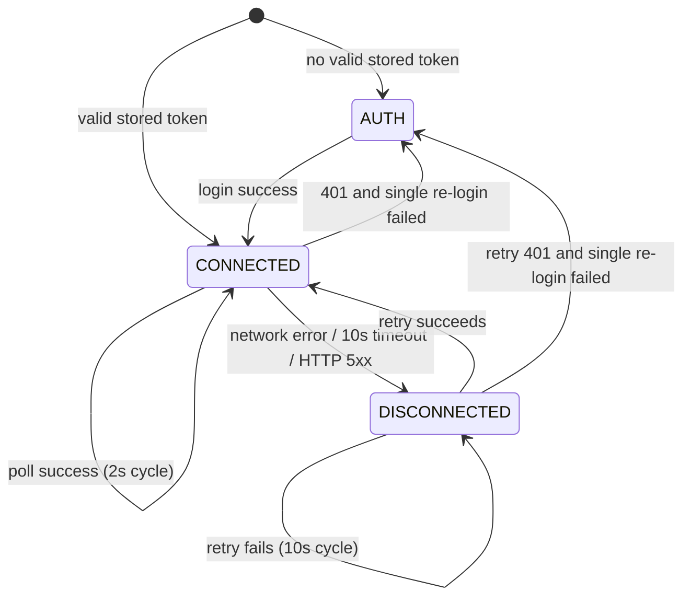
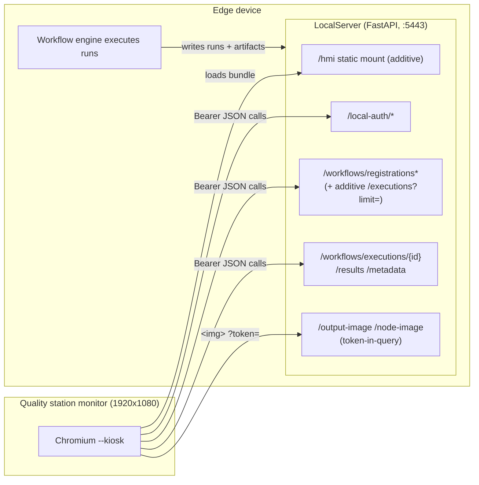

# Design Document: Quality Station HMI

## Overview

The Quality Station HMI is a browser-based kiosk application that runs full screen on a 1920x1080 monitor attached to a quality station edge device. It consumes the device's existing LocalServer REST API (the FastAPI backend in `src/backend`) to show, in real time, each workflow run's inspection verdict (`is_anomalous`, `confidence`, `generated_text`), the captured frame, and — for workflows with a reference-comparison node (`llm_inference` / VLM or `bedrock_inference`) — the configured reference image side by side with the captured frame. Driving workflows are "IMTS - Swagfactory" (VLM) and "IMTS Stagfactory (Bedrock)", but the HMI is fully generic: all display behavior derives from API fields (Requirement 2.6).

The HMI is external to the core product. It is a static-asset single-page application with **no UI framework runtime**, plus **two small additive LocalServer changes**:

1. A bounded recent-executions query route (`GET /workflows/registrations/{registration_id}/executions?limit=N`) — permitted by Requirement 3.6 because the existing surface cannot meet the 2-second Run_Detection_Latency without unbounded payloads (see Research Findings).
2. A static mount (`/hmi`) on the LocalServer FastAPI app so the kiosk browser loads the HMI same-origin with the API it consumes (satisfies Requirement 6.7 — "no installation beyond serving static assets").

Neither change touches any existing route or response shape.

### Research Findings

Findings from the existing LocalServer surface that shape this design:

- **Auth** (`src/backend/endpoints/local_auth.py`): `POST /local-auth/login` returns `{token, expiresAt, role, username}`; `expiresAt` is epoch seconds. Failure is a uniform 401; disabled local login is a 403 with detail `"local login is disabled"`. There is **no refresh endpoint**, which is why Requirement 1 specifies the single in-memory-credential re-login on 401. `GET /local-auth/status` is unauthenticated.
- **Registrations** (`src/backend/workflow_engine/api.py`): `GET /workflows/registrations` returns by default statuses `registered` and `invalid` (`ACTIVE_STATUSES`); `invalid` registrations can never run (trigger returns 409). The HMI therefore treats **`registered` as "active"** for Requirement 2.2. `name` comes from the deployed `manifest.json` and may be `null` — the workflowId fallback in Requirement 2.2 matches the backend's documented intent.
- **Run detection gap**: the only existing way to enumerate a registration's runs is `GET /workflows/registrations/{registration_id}`, whose `executions` array is **unordered and unbounded** — it grows with the registration's entire run history. Polling it every 2 seconds violates Requirement 3.6's payload bound, so the additive bounded query route is justified. No event-stream infrastructure (SSE/WebSocket) exists in the backend; polling a bounded route at 0.5 req/s is the smallest additive change.
- **Executions**: `GET /workflows/executions/{id}` returns `{executionId, registrationId, status, startedAt, finishedAt, failingNodeId, error, hasImageResults, captureId, outputDir}`. Statuses observed: `pending`, `running`, `completed`, `failed`; timestamps are **epoch seconds** (so `finishedAt` ties are realistic — Requirement 3.4's `startedAt` tiebreak matters).
- **Results inventory** (`.../results`): `{hasImageResults, captureId, images: [...]}` where `images` lists an `{"kind": "output"}` entry only when the base output artifact exists, followed by `{"kind": "node", "nodeId", "port"}` entries. Per `test_workflow_run_results_api.py`, node entries are **sorted by nodeId, with port `in` before `reference` before unknown ports** — a deterministic order the image-pairing logic (Requirement 5) can rely on.
- **Metadata** (`.../metadata`): best-effort — returns `{}` (HTTP 200) for missing/malformed artifacts, never a 500. Contains flat `is_anomalous` (bool), `confidence` (number), `generated_text` (string) when the workflow's nodes produced them.
- **Image bytes**: `/workflows/executions/{id}/output-image` and `/node-image?nodeId=&port=` live on the **unauthenticated router with token-in-query** (`?token=`), designed exactly for browser `` loads (`src/backend/endpoints/download_file.py`).
- **Serving**: the LocalServer mounts no static files today (the main SPA ships in a separate nginx container). FastAPI CORS is `allow_origins=["*"]`, so cross-origin would work, but same-origin serving avoids mixed-content/TLS-certificate complications on the kiosk (the LocalServer listens on 5443 TLS when auth is enabled, 5000 otherwise) and needs no second web server on the device.

## Architecture

### Design Decision 1: Vanilla TypeScript SPA, no UI framework

The repo's existing frontends (`src/frontend`, `edge-cv-portal/frontend`) are React apps. The HMI deliberately is not:

- It is a **single screen** (plus a login form) with a fixed kiosk layout — there is no routing, no component tree churn, no form-heavy state that would earn React's weight.
- Requirement 6.7 mandates static assets only; a framework-free bundle is a few KB, starts instantly on kiosk boot, and has no dependency-upgrade treadmill for an app that runs unattended on a factory monitor.
- The correctness-critical logic (run ordering, image pairing, history eviction, auth/connection state machines) is written as **pure TypeScript modules** with no DOM dependency, which makes the property-based tests direct function tests.

Tooling: **Vite + TypeScript** for bundling (output is plain static assets), **Vitest + fast-check** for tests. The HMI lives in a new top-level directory `hmi/` in `DefectDetectionApplication`, so it stays visibly external to `src/`.

### Design Decision 2: Serve the HMI static bundle from the LocalServer at `/hmi`

The built bundle is mounted on the FastAPI app:

```python
# app.py (additive)
from fastapi.staticfiles import StaticFiles
if os.path.isdir(HMI_DIST_DIR):
    app.mount("/hmi", StaticFiles(directory=HMI_DIST_DIR, html=True), name="hmi")
```

- Same-origin with every API route → no CORS concerns, one TLS certificate, one port. The kiosk browser command is simply `chromium --kiosk https://<device>:5443/hmi/`.
- The mount bypasses the routers' auth dependency, which is correct: static assets carry no secrets, and every data route the HMI calls still requires the Session_Token.
- Guarded by directory existence, so devices without the HMI bundle behave byte-identically to today. No existing route changes.

Rejected alternatives: adding the HMI to the nginx SPA container (couples the external HMI to the core frontend image and its release cadence); a separate container (a whole deployment unit for static files violates the spirit of 6.7).

### Design Decision 3: Poll a new bounded recent-executions route every 2 seconds

**Additive route** (in `workflow_engine/api.py`, on the same authenticated router as its siblings):

```
GET /workflows/registrations/{registration_id}/executions?limit=10
→ 200: [ execution_to_dict(...) ]   # ordered started_at DESC, id DESC; len ≤ limit
→ 404: unknown registration
```

`limit` defaults to 10 and is clamped to 1..50. The response reuses the existing `execution_to_dict` shape — no new serialization.

**Polling loop** (while a Live_View is displayed and the app is connected):

- Every **2 seconds**: one `GET .../executions?limit=10` for the displayed registration (0.5 req/s ≤ the 1 req/s bound of Requirement 3.6; payload bounded at 10 entries regardless of run history).
- From the payload, pure functions derive: the latest terminal run (Requirement 3.4 ordering), whether any run is in progress (`pending`/`running`), and the history strip content (limit 10 covers the ≥5 capacity of Requirement 7.1 with headroom).
- Only when the latest terminal run **changes** does the HMI fetch `/results` and `/metadata` for it (2 extra requests per new run — event-driven, not per-cycle) and swap the Live_View. Detection latency = at most one poll period = 2 s (Requirement 3.1).
- Every 15th cycle (~30 s), the poll additionally refreshes `GET /workflows/registrations` to notice the displayed registration going inactive/absent (Requirement 8.5) and newly deployed workflows.

Rejected alternatives: polling the registration detail route (unbounded payload, fails 3.6); adding SSE/WebSocket (larger additive surface, new infrastructure in a backend that has none, and 2 s latency does not need push).

### Design Decision 4: Auth/session flow (Requirement 1)

- `token` + `expiresAt` are persisted in `localStorage` so a kiosk page reload resumes without prompting (1.5). The username/password are retained **only in a module-scoped in-memory variable** after a successful login — never persisted (1.4).
- Every non-image API call goes through one `apiFetch` wrapper: attaches `Authorization: Bearer <token>` (1.2), applies a 10 s timeout (`AbortController`), and implements the **single re-login interception**: on a 401 (from any route except `/local-auth/login` itself), it re-submits the retained credentials to `POST /local-auth/login` exactly once; on success it stores the new token and retries the original request once; on failure (or no retained credentials) it discards the stored token and surfaces the login form (1.4, 1.8). A module-level "re-login in flight" latch prevents concurrent 401s from firing parallel logins.
- Image loads cannot carry headers, so `` URLs are built with `?token=<Session_Token>` (1.3, 5.5). An image element cannot observe HTTP status; image failures only ever show the per-panel placeholder (5.6) — token expiry is detected and repaired by the JSON polling path, after which image URLs are rebuilt with the fresh token.
- Startup decision: login form iff no stored token or `expiresAt <= now` (1.1); otherwise resume (1.5). Login 403 → "local login is disabled on this device" (1.6); login 401 → credentials-rejected message, form retained, nothing stored (1.7).

### Design Decision 5: Connection resilience state machine (Requirement 8)



- **CONNECTED**: connected indicator shown; 2 s poll cycle runs (8.4).
- Any poll/data failure that is a network error, a 10 s timeout, or a 5xx (401 is routed to the auth path instead, per 8.1) → **DISCONNECTED**: indicator flips, the last Run_Result stays on screen together with the last-successful-update time (8.1).
- **DISCONNECTED**: a single retry probe — `GET /workflows/registrations` (which simultaneously serves Requirement 2.5's re-check and 8.5's availability check) — every 10 s (8.2).
- On a successful probe: indicator → connected immediately (well within the 1 s bound, 8.3), then in the same tick the normal cycle resumes with an immediate executions poll + Live_View/history refresh, unconditionally re-fetching the latest terminal run's data (8.6 within 5 s, 8.7).

### System Context



## Components and Interfaces

### Frontend module layout (`hmi/src/`)

Pure logic modules (no DOM, fully property-testable) are separated from effectful shell modules:

| Module | Kind | Responsibility |
|---|---|---|
| `auth/session.ts` | pure + storage | Startup screen decision, token store (localStorage), in-memory credential retention |
| `api/client.ts` | effectful | `apiFetch` wrapper: bearer header, 10 s timeout, 401 single re-login + single retry, error classification (`network` / `timeout` / `http-5xx` / `http-401` / `http-other`) |
| `api/routes.ts` | pure | URL builders, including image URLs with `?token=` |
| `logic/runs.ts` | pure | Terminal-run comparator (3.4), latest-terminal selection, in-progress detection |
| `logic/selection.ts` | pure | Active-registration filter + labeling (2.2), default workflow selection (2.4/2.7) |
| `logic/images.ts` | pure | Image-pair selection from `results.images` (Requirement 5) |
| `logic/verdict.ts` | pure | Metadata → `VerdictViewModel` (pass/fail mapping, confidence rounding, text truncation, no-verdict case, failed-run summary) |
| `logic/history.ts` | pure | History list build/insert/evict (Requirement 7) |
| `logic/format.ts` | pure | Epoch-seconds → local-time strings with seconds precision |
| `app/machine.ts` | pure | The app reducer: `(AppState, Event) → AppState` covering auth, connection, live/historical mode transitions |
| `app/poller.ts` | effectful | Timers: 2 s poll cycle, 10 s disconnected retry, 30 s registrations refresh; dispatches events into the reducer |
| `ui/render.ts` | effectful | DOM rendering of the state (regions below); `` error → placeholder handling |

The reducer + pure modules mean every correctness property below is a test of a deterministic function; the poller and renderer are thin shells.

### Image pairing logic (Requirement 5, deterministic)

`selectImagePair(images: ResultImage[]): ImagePair` — operating on the results list **in its returned order**:

1. `reference` := the first `node` entry with `port === "reference"`, if any (5.1, 5.7 — because the backend sorts node entries by nodeId, "first listed node with a reference" is exactly the first reference entry).
2. `captured` := the first `node` entry with `port === "in"` **and the same `nodeId`** as the chosen reference; else the first `in` entry in list order (5.2); else the `output` entry (5.3); else none (placeholder per 5.6).
3. `hasMoreNodes` := the list contains node entries from more than one distinct `nodeId` (5.7 badge).
4. No reference entry → single-panel layout, captured frame takes the combined width (5.4).

### Additive backend route (contract)

```python
@router.get("/workflows/registrations/{registration_id}/executions")
def list_registration_executions(
    registration_id: str, limit: int = 10, db: Session = Depends(get_db)
) -> List[dict]:
    """Most recent executions of one registration, newest first
    (started_at DESC, id DESC), bounded by limit (clamped 1..50).
    404 for an unknown registration. Additive: reuses
    execution_to_dict; no existing route or shape changes (R3.6)."""
```

### Kiosk Layout — 1920x1080 mock-up (Requirement 6)

Three horizontal bands: header (72 px), main (872 px), history strip (136 px). All content fits without scrolling (6.1).

```
┌──────────────────────────────────────── 1920 ────────────────────────────────────────────┐
│ HEADER  h=72                                                                             │
│  IMTS - Swagfactory          Run started 2025-01-15 14:32:07      ⟳ RUN IN     ● LIVE    │
│  (workflow name, 32px)       (startedAt, local tz, seconds)       PROGRESS   CONNECTED   │
│                                                                   (only while  (green ●/ │
│                                                                    pending/     red ▲ +  │
│                                                                    running)     "last    │
│                                                                              update" ts) │
├───────────────────────────────────────────────────────────────────────────────────────┤
│ MAIN  h=872                                                                              │
│ ┌─ VERDICT PANEL w=440 ──┐ ┌─ IMAGE AREA w=1480 ─────────────────────────────────────┐  │
│ │                        │ │ ┌─ REFERENCE ────────────┐ ┌─ CAPTURED FRAME ─────────┐ │  │
│ │      ✔  PASS           │ │ │                        │ │                          │ │  │
│ │   (verdict text ≥48px; │ │ │     scaled to     │ │     scaled to       │ │  │
│ │    icon + label, not   │ │ │    equal height,       │ │    equal height,         │ │  │
│ │    color alone)        │ │ │    aspect preserved,   │ │    aspect preserved,     │ │  │
│ │                        │ │ │    uncropped           │ │    uncropped             │ │  │
│ │  Confidence  0.97      │ │ │    (~720 x 760)        │ │    (~720 x 760)          │ │  │
│ │                        │ │ │                        │ │                          │ │  │
│ │  Generated text        │ │ └────────────────────────┘ └──────────────────────────┘ │  │
│ │  ┌──────────────────┐  │ │   REFERENCE (label 24px)     CAPTURED FRAME (label)     │  │
│ │  │ first 500 chars… │  │ │                                        [+2 more nodes]  │  │
│ │  │ [truncated ⋯]    │  │ │  (no reference entry → captured frame spans full 1480)  │  │
│ │  └──────────────────┘  │ │  (image error/timeout → per-panel "image unavailable")  │  │
│ │  Finished 14:32:09     │ │                                                          │  │
│ └────────────────────────┘ └──────────────────────────────────────────────────────────┘ │
├───────────────────────────────────────────────────────────────────────────────────────┤
│ HISTORY STRIP  h=136  (newest first, capacity 10, ≥5 visible)                            │
│ ┌────────┐┌────────┐┌────────┐┌────────┐┌────────┐┌────────┐          ┌──────────────┐  │
│ │✔ PASS  ││✘ FAIL  ││⚠ ERROR ││✔ PASS  ││— NO    ││✔ PASS  │  ⋯       │ ◉ VIEWING    │  │
│ │14:32:07││14:29:41││14:25:02││14:21:55││VERDICT ││14:15:10│          │ HISTORY      │  │
│ └────────┘└────────┘└────────┘└────────┘└────────┘└────────┘          │ [RETURN TO   │  │
│  (each tile: verdict icon+word + start time; click → historical view) │  LIVE] (new  │  │
│                                                                       │  run avail.) │  │
│                                                                       └──────────────┘  │
└───────────────────────────────────────────────────────────────────────────────────────┘
```

Layout rules:

- CSS Grid: `grid-template-rows: 72px 1fr 136px`; main row `grid-template-columns: 440px 1fr`. Fluid columns keep everything visible without horizontal scrolling from 1280 to 1920 px wide (6.6); the verdict column uses `minmax(360px, 440px)`.
- Verdict text: 72 px font at 1920 wide, `clamp(48px, 3.75vw, 72px)` so it never renders below 48 px at the reference viewport (6.2). Verdict states differ by icon **and** word (✔ PASS / ✘ FAIL), not color alone (4.2).
- Images: `object-fit: contain` inside two equal-height flex panels → equal display heights, aspect preserved, uncropped (6.5). Without a reference entry the captured panel spans the full image area (5.4).
- Header always shows workflow name + displayed run's start time (6.3); with zero runs, main shows the name + "no runs recorded" message in place of Run_Result content (6.4, 2.8, 3.8).
- Historical mode: an amber "VIEWING HISTORY" banner replaces the live badge in the strip's right slot, with the return-to-live control and, when applicable, a "newer run available" notice (7.3, 7.4).
- Pure static assets, all chrome-free, designed for Chromium `--kiosk` (6.7, 6.8).

## Data Models

### API payloads (TypeScript mirrors of existing shapes)

```typescript
interface Registration {           // GET /workflows/registrations[i]
  registrationId: string;
  workflowId: string;
  name: string | null;             // manifest workflowName; may be null
  version: string;
  status: string;                  // "registered" (active) | "invalid" | retired
  registeredAt: number;            // epoch seconds
}

interface Execution {              // execution_to_dict shape
  executionId: string;
  registrationId: string;
  status: "pending" | "running" | "completed" | "failed";
  startedAt: number;               // epoch seconds
  finishedAt: number | null;
  failingNodeId: string | null;
  error: string | null;
  hasImageResults: boolean;
  captureId: string | null;
}

interface ResultImage {            // GET .../results  images[i]
  kind: "output" | "node";
  nodeId?: string;
  port?: string;                   // "in" | "reference" | other
  hasOverlay: boolean;
}

interface RunMetadata {            // GET .../metadata (best-effort, may be {})
  is_anomalous?: boolean;
  confidence?: number;
  generated_text?: string;
  [key: string]: unknown;
}
```

### App state

```typescript
type VerdictState = "pass" | "fail" | "failed-run" | "no-verdict";

interface VerdictViewModel {
  state: VerdictState;
  confidenceText?: string;         // rounded to ≤ 2 decimals
  generatedText?: string;          // ≤ 500 chars
  generatedTextTruncated: boolean;
  errorSummary?: string;           // failed runs; fallback message when empty
  metadataUnavailable: boolean;    // metadata fetch failed after 1 retry (4.9)
}

interface ImagePair {
  reference?: ImageRef;            // {url, label}
  captured?: ImageRef;
  hasMoreNodes: boolean;
}

interface HistoryEntry {
  executionId: string;
  verdict: VerdictState;
  startedAt: number;
}

interface AppState {
  auth: { screen: "login" | "app"; loginError?: "rejected" | "disabled" };
  connection: {
    state: "connected" | "disconnected";
    lastSuccessfulUpdate: number | null;   // epoch ms
  };
  registrations: Registration[];
  selectedRegistrationId: string | null;
  live: {
    mode: "live" | "historical";
    displayedRun: Execution | null;        // the run whose Run_Result is shown
    verdict: VerdictViewModel | null;
    images: ImagePair | null;
    inProgress: boolean;                   // a pending/running run exists
    history: HistoryEntry[];               // newest first, capacity 10
    newerRunAvailable: boolean;            // historical mode only (7.4)
    unavailableMessage?: string;           // workflow-gone / no-runs states
  };
}
```

Session storage: `localStorage["hmi.session"] = {token, expiresAt}`; credentials live only in a module variable. A per-execution cache (`Map<executionId, {metadata, results}>`, LRU-bounded at 20) backs history verdicts and historical-run viewing without re-fetching terminal runs' immutable data. Initial history population fetches metadata once for up to 10 completed runs (a bounded one-time burst on workflow selection; failed runs need no metadata — their verdict is `failed-run` from status alone).

## Correctness Properties

*A property is a characteristic or behavior that should hold true across all valid executions of a system — essentially, a formal statement about what the system should do. Properties serve as the bridge between human-readable specifications and machine-verifiable correctness guarantees.*

All frontend properties test pure modules (`auth/session`, `logic/*`, `app/machine`) with fast-check; Property 8 tests the additive backend route with Hypothesis, matching the existing backend test conventions.

### Property 1: Startup session decision

*For any* stored session state (absent, or a token with any `expiresAt`) and any current time, the startup screen decision is "login" if and only if no token is stored or `expiresAt` is at or before the current time; otherwise the app resumes without prompting.

**Validates: Requirements 1.1, 1.5**

### Property 2: Single re-login on 401

*For any* scripted sequence of API responses containing 401s, the client performs at most one `POST /local-auth/login` (using only the in-memory credentials) and at most one retry of the original request per 401; whenever the single re-login fails or no credentials are retained, the stored Session_Token is discarded and the resulting state is the login screen.

**Validates: Requirements 1.4, 1.8**

### Property 3: Image URLs carry the token in query

*For any* Session_Token, executionId, nodeId, and port, the built image URLs target the `/output-image` or `/node-image` route for that execution and carry exactly the Session_Token in the `token` query parameter (correctly encoded).

**Validates: Requirements 1.3, 5.5**

### Property 4: Registration filtering and labeling

*For any* list of Workflow_Registrations with arbitrary statuses and names, the selection list contains exactly the registrations with active (`registered`) status, each labeled with its `name` when present and non-empty and with its `workflowId` otherwise.

**Validates: Requirements 2.2**

### Property 5: Default workflow selection

*For any* set of active Workflow_Registrations with arbitrary run lists, the default selection is the registration whose most recent Workflow_Run has the latest `startedAt`; when no registration has any run, it is the first active registration in the order returned by the API.

**Validates: Requirements 2.4, 2.7**

### Property 6: Live view displays the maximal terminal run

*For any* prior app state in live mode and any polled list of executions, the reducer's displayed run is the terminal (`completed`/`failed`) execution that is maximal under the ordering (`finishedAt` descending, `startedAt` as tiebreak when `finishedAt` values are equal or absent) — in a single reducer step, so any new terminal run present in a poll payload is displayed within one 2-second cycle.

**Validates: Requirements 3.1, 3.2, 3.4, 3.7**

### Property 7: In-progress detection is non-destructive

*For any* app state and any polled list of executions, the in-progress indicator is on if and only if the list contains a `pending` or `running` execution, and the presence of an in-progress run never changes the currently displayed Run_Result.

**Validates: Requirements 3.3**

### Property 8: Recent-executions endpoint is bounded and ordered

*For any* set of stored WorkflowExecutions across registrations and any `limit` value, `GET /workflows/registrations/{id}/executions` returns only executions of that registration, at most `clamp(limit, 1, 50)` of them, ordered `started_at` descending with `id` as tiebreak — so the newest executions are always included regardless of total run history.

**Validates: Requirements 3.6**

### Property 9: Verdict view-model derivation

*For any* execution status and metadata object: a completed run with boolean `is_anomalous` yields state fail iff true and pass iff false; a numeric `confidence` is rendered rounded to at most 2 decimal places; a `generated_text` is rendered at most 500 characters with the truncation flag set iff the input exceeds 500; a completed run lacking all three fields yields the no-verdict state without error; a failed run yields the failure state with its error summary, or the no-details message when error fields are empty or absent.

**Validates: Requirements 4.2, 4.3, 4.4, 4.5, 4.7, 4.8**

### Property 10: Timestamp formatting

*For any* epoch-seconds timestamp, the formatted display string is the local-time rendering of that instant and includes seconds precision.

**Validates: Requirements 4.6**

### Property 11: Deterministic image-pair selection

*For any* results `images` list: the reference selection is the first `reference`-port node entry iff one exists (otherwise no reference panel); the captured selection is the `in` entry of the reference's node when present, else the first `in` entry in list order, else the `output` entry, else none; all selected node images come from exactly one nodeId; and the more-nodes indicator is set iff entries from more than one node exist.

**Validates: Requirements 5.1, 5.2, 5.3, 5.4, 5.7**

### Property 12: History strip invariants

*For any* initial run list and any sequence of terminal-run insertions, the history is always ordered newest first, never exceeds its capacity (10 ≥ the required 5), contains only runs that exist, evicts exactly the oldest entry on overflow, and each entry carries the run's verdict state and start time.

**Validates: Requirements 7.1, 7.2, 7.6, 7.7**

### Property 13: Historical mode pinning and return-to-live round trip

*For any* sequence of new-terminal-run events arriving while a historical run is displayed, the displayed Run_Result stays pinned to the historical run while the history updates and the newer-run flag is set; and after the return-to-live event, the mode is live and the displayed run is again the maximal terminal run per Property 6.

**Validates: Requirements 7.4, 7.5**

### Property 14: Connection state transitions

*For any* sequence of request outcomes, the connection machine transitions to disconnected exactly on network errors, 10-second timeouts, and HTTP 5xx (never on 401, which routes to the auth path), retaining the last displayed Run_Result and last-successful-update time; and any successful response while disconnected transitions back to connected with the update cycle resumed.

**Validates: Requirements 8.1, 8.3**

### Property 15: Workflow availability handling

*For any* successful registrations payload and any displayed registrationId, the unavailable message is shown iff the displayed registration is absent or non-active in the payload, the offered alternatives are exactly the remaining active registrations, and the no-workflows message is shown iff zero active registrations remain.

**Validates: Requirements 8.5**

## Error Handling

| Failure | Handling | Requirement |
|---|---|---|
| Login 403 (local login disabled) | "Local login is disabled on this device" message on the login screen | 1.6 |
| Login 401 | Credentials-rejected message; nothing stored; form retained | 1.7 |
| 401 on any authenticated route | Single re-login with in-memory credentials + single retry; on failure, token discarded, login form shown | 1.4, 1.8 |
| Network error / 10 s timeout / 5xx | Connection machine → disconnected; last Run_Result + last-update time retained; 10 s retry probe | 8.1, 8.2 |
| Metadata fetch failure | One retry; then render images + status with "verdict data unavailable" | 4.9 |
| Metadata `{}` or verdict-less | No-verdict state (no verdict panel), never an error screen | 4.7 |
| Failed run without error details | Failure state with "no error details are available" | 4.8 |
| Image load error / timeout / no viewable images | Per-panel "image unavailable" placeholder; never substitute another port or run; other Run_Result data unaffected | 5.6 |
| Zero active registrations | No-workflows message; re-check on the retry cycle | 2.5 |
| Displayed registration retired/absent | Workflow-no-longer-available message + selection of remaining active registrations | 8.5 |
| Historical run data unavailable | Error indication in the Live_View; history strip and return-to-live control retained | 7.8 |

Defensive boundary: all API payloads pass through narrow parse functions (unknown fields ignored, missing fields defaulted) so a backend evolution never throws in render code — mirroring the backend's own best-effort philosophy on the metadata/results routes.

## Testing Strategy

The HMI's core logic is pure functions over API payloads, so property-based testing applies (this is not IaC, not simple CRUD — run selection, pairing, eviction, and the state machines are exactly the transformation logic PBT is good at). Layout and wiring criteria are covered by example tests instead.

### Property-based tests

- **Frontend**: Vitest + **fast-check**, one property test per design property (P1–P7, P9–P15), each targeting the pure module named in Components and Interfaces. Minimum **100 iterations** per property.
- **Backend**: **Hypothesis** test for Property 8 in `test/backend-test/workflow_engine/` following the existing standalone-app + in-memory DB pattern (`test_workflow_run_results_api.py`).
- Each test is tagged with a comment referencing its property: `**Feature: quality-station-hmi, Property {N}: {title}**`.
- Each correctness property is implemented by a single property-based test.

### Example-based unit tests

Focused on the criteria classified as EXAMPLE in prework, kept lean since the properties carry input coverage:

- Auth wiring: login success stores token + bearer header attached (1.2); 403/401 login messages (1.6, 1.7).
- Poller with fake timers: 2 s cycle period (3.1), continued polling in empty states (3.8), 10 s disconnected retry cadence (8.2), connected steady state (8.4), reconnect refresh of Live_View and history including unchanged data (8.6, 8.7), selection swap within 2 s (2.3), registrations fetched after login (2.1).
- Data wiring: results+metadata fetched on completed run (4.1); metadata retry-once behavior (4.9); historical-run fetch failure (7.8).
- Rendering: verdict states differ by icon and word, not color alone (4.2); image onerror → per-panel placeholder (5.6); empty states (2.8, 6.4, 7.7 zero-case); historical-mode indicator and return control (7.3); automatic view replacement (3.5); header contents (6.3).
- Backend route examples: 404 for unknown registration; default/clamped limit values.

### Layout tests (not PBT)

Headless Chromium (Playwright) at fixed viewports: no scroll overflow and no overlap at 1920x1080 (6.1); verdict computed font size ≥ 48 px in both states (6.2); equal image heights with differing aspect ratios, uncropped (6.5); no horizontal overflow at 1280 and 1920 widths (6.6).

### Smoke checks

Build output is static-assets-only and the `/hmi` mount serves `index.html` (6.7); manual kiosk verification on the station's Chromium (6.8). Requirement 2.6 (no name-keyed logic) is enforced by review, with property generators using arbitrary names/ids as a backstop.
