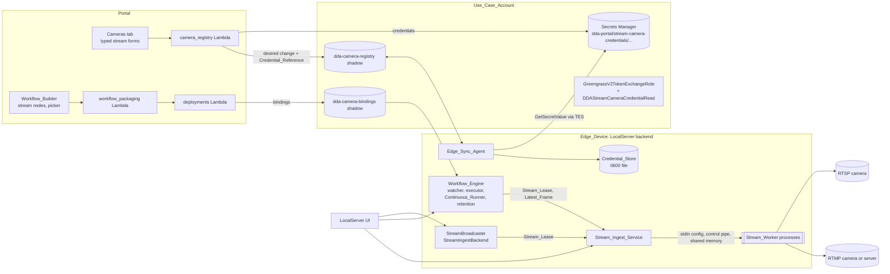
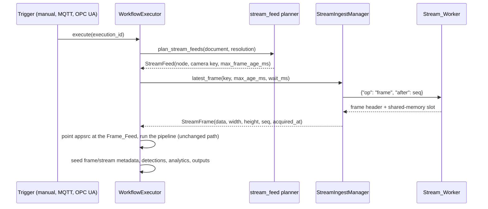
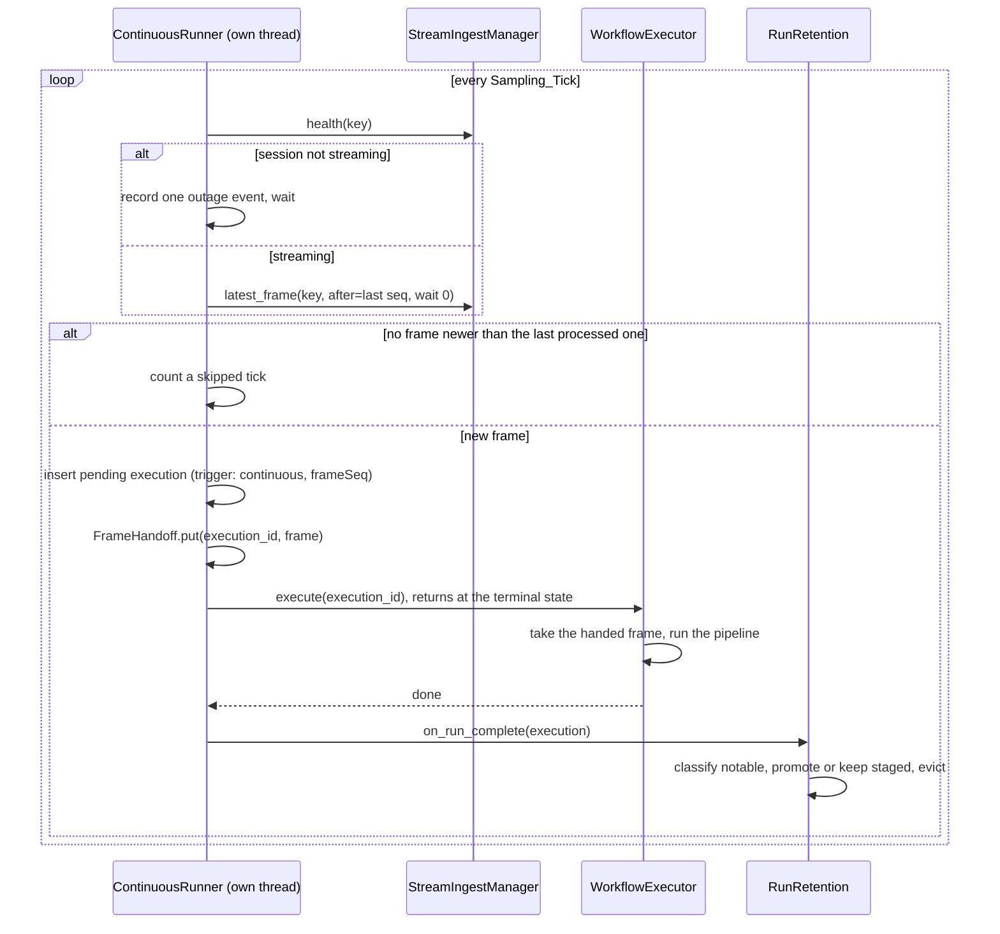
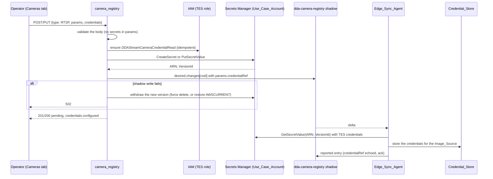

# Design Document: RTSP/RTMP Stream Cameras

## Overview

This feature adds network video cameras as first-class workflow inputs: RTSP and RTMP, carrying H.264 or H.265. It also adds what live-scene analytics such as PPE compliance and scene counting need to be practical.

The camera path follows the same route the Aravis and CSI/ICAM camera nodes use:

1. Catalog descriptor
2. Workflow_Builder picker
3. Packager binding points
4. Deploy-time binding
5. Device-side resolution
6. Frame_Feed

On top of that, the Workflow_Engine gains four device-side capabilities it lacks today:

- A persistent, isolated stream ingest service.
- A continuous run mode.
- Bounded retention for high-frequency runs.
- Event state that carries across runs.

| Area | Where | What changes |
|---|---|---|
| Shared rules | `workflow_core` (Portal layer and LocalServer vendor mirror) | <ul><li>`stream_url.py`: URL rules, normalization, redaction</li><li>Five catalog descriptors</li><li>Validator rules V11–V13 and W3, plus a generalized V7</li><li>`analytics/scene.py`: counter, association, event-gate automaton</li></ul> |
| Portal backend | `workflow_packaging.py`, `deployments.py`, `camera_registry.py`, new `stream_credentials.py`, `camera_sync.py` | <ul><li>`streamBinding` points</li><li>Compatibility and override rules, and a feature floor</li><li>Typed stream camera bodies</li><li>Credential storage in Secrets Manager</li><li>Device-capability ingest</li></ul> |
| Portal frontend | `pages/workflows/*`, `components/DeviceCamerasTab.tsx`, `pages/deployments/*`, `pages/DeviceDetail.tsx` | <ul><li>Stream picker</li><li>Inline-check mirror</li><li>Typed stream camera form</li><li>URL override in the binding matrix</li><li>Capability panel</li></ul> |
| Infrastructure | `usecase-account-stack.ts`, `compute-stack.ts` | <ul><li>Scoped Secrets Manager write access for the Portal</li><li>Device read grant</li><li>workflow_core layer on the camera registry Lambda</li><li>Feature-floor environment map</li></ul> |
| LocalServer backend | New `src/backend/stream_ingest/`; `camera_sync/`, `workflow_engine/`, `model/`, `resources/`, `endpoints/`, `utils/streaming/`, `dda_logging/` | <ul><li>RTSP/RTMP Image_Sources</li><li>Credential_Store and redaction filter</li><li>Stream_Workers and sessions</li><li>Stream feed and Continuous_Runner</li><li>Retention</li><li>Analytics bindings</li></ul> |
| LocalServer UI | `src/frontend/src/components/image-source/*`, `components/deployed-workflow/*` | <ul><li>Stream camera forms and connection test</li><li>Preview</li><li>Continuous status and controls</li><li>Analytics results</li></ul> |
| Test sandbox | `edge-cv-portal/test-sandbox/harness/bindings.py` | Analytics bindings through the shared module |
| Images and gates | `src/backend/requirements.txt`, `build-custom.sh`, possibly `Dockerfile.jp7`; preservation baselines | <ul><li>PyAV pin</li><li>In-image stream self-check</li><li>Baseline updates</li></ul> |

### Key design decisions

| # | Decision | Choice | Rationale |
|---|---|---|---|
| D1 | Node shape | Two node types, `rtsp_camera_source` and `rtmp_stream_source`, built from one shared parameter family | <ul><li>Matches the per-capture-family precedent (Aravis, CSI, ICAM).</li><li>Picker filters and compatibility sets stay one line each.</li><li>Sharing the `ParameterDescriptor` objects keeps the unified-input parameter union exact.</li></ul> |
| D2 | Frame delivery | Executor-fed `appsrc` with a new `streamBinding` marker, the Aravis model | <ul><li>Opening an RTSP session per run costs 0.5–5 s: DESCRIBE/SETUP/PLAY, then a wait for the next keyframe.</li><li>It also multiplies sessions on cameras that allow only a few.</li><li>A persistent session plus the Frame_Feed keeps runs fast.</li><li>URLs and credentials stay out of compiled pipelines and launch strings.</li></ul> |
| D3 | Ingest isolation | One Stream_Worker process per Stream_Session | <ul><li>Network video is untrusted input to native decoders.</li><li>A decoder crash or a hung `rtspsrc` state change must not take down the backend; the awscrt abort history shows what in-process native failures cost.</li><li>SIGKILL is a reliable teardown.</li><li>The RTMP demuxer's own FFmpeg copy stays out of the backend process, which already loads opencv's and gst-libav's.</li></ul> |
| D4 | RTSP ingest | GStreamer `rtspsrc`, with credentials in its `user-id` and `user-pw` properties | <ul><li>Every backend image already installs the needed plugins: plugins-good (`rtspsrc`, `rtph264depay`, `rtph265depay`), plugins-bad (`h264parse`, `h265parse`) and gst-libav (`avdec_h264`, `avdec_h265`).</li><li>Credentials set as element properties never enter the location URL.</li></ul> |
| D5 | RTMP ingest | PyAV demuxes inside the worker and pushes H.264/H.265 access units, as Annex-B byte-stream, into the same GStreamer decode chain | <ul><li>GStreamer's `flvdemux` gained Enhanced-RTMP H.265 only in 1.28. The images run 1.16 (JP5), 1.20 (JP6, x86, arm64 CPU) and 1.24 (JP7).</li><li>Ubuntu's `ffmpeg` is 4.2/4.4 on the 20.04/22.04 images; E-RTMP HEVC landed in FFmpeg 6.1.</li><li>A pinned PyAV wheel gives one RTMP path with both codecs on every target.</li><li>Sharing the decode chain gives RTMP the same hardware decoding as RTSP.</li></ul> |
| D6 | RTMP mode | Pull only | <ul><li>FFmpeg's listen mode accepts one publisher and does not enforce the app or stream key.</li><li>Safe push ingest needs a real ingest server, left as a follow-up.</li></ul> |
| D7 | Decoder choice | Runtime capability probe, Decoder_Policy, and automatic fallback | <ul><li>Whether `nvv4l2decoder` is reachable differs by target. On JP6, `pipeline_builder`'s JPEG path shows it works. JP5 depends on L4T CSV injection. JP7 uses a non-L4T base image and is unknown.</li><li>Decoding a probe sample proves each decoder, rather than trusting factory registration.</li></ul> |
| D8 | Continuous mode | Sampled single-frame runs through the unchanged `WorkflowExecutor.execute()` | <ul><li>Every node type keeps working: model inference, Bedrock, VLM, Custom Python, outputs, conditions and run observability.</li><li>Measured single-frame overhead, ~30 ms pipeline plus ~100 ms orchestration on jetson-thor1 (from vllm-workflow-latency-optimization), allows several runs per second.</li><li>A persistent streaming inference pipeline would rewrite the executor's per-run contract: capture ids, EOS-driven results and artifacts.</li></ul> |
| D9 | Continuous completion signal | The runner calls `execute()` synchronously on its own thread | The trigger dispatcher polls run status every 0.5 s, which caps a workflow at about 2 runs per second. |
| D10 | Retention | <ul><li>Continuous runs are staged in `/dev/shm`.</li><li>A registration keeps its most recent K runs plus its newest N notable runs, under a device byte cap.</li></ul> | <ul><li>At 5 fps, one continuous workflow creates about 432k runs a day and more than 100 GB of artifacts.</li><li>Staging in RAM spares flash for runs that are deleted minutes later.</li></ul> |
| D11 | Credentials | <ul><li>A device-local Credential_Store.</li><li>Credentials entered in the Portal go to Secrets Manager in the Use_Case_Account, and the device fetches them with its TES credentials.</li></ul> | <ul><li>Mirrors the git-connections pattern: the secret value lives only in Secrets Manager and the Portal cannot read it back.</li><li>Mirrors the static-image pin pattern: the shadow carries a reference and the device fetches with its own credentials.</li><li>Avoids adding `aws.greengrass.SecretManager`, which would change seven preservation-pinned recipes.</li><li>Avoids new Greengrass IPC calls and their awscrt abort exposure.</li></ul> |
| D12 | Analytics | Executor-level bindings over the Detection_List, with the pure logic in `workflow_core/analytics/scene.py` | <ul><li>One implementation serves the LocalServer (vendor mirror) and the cloud test sandbox (vendored in its image).</li><li>No GStreamer, model or Triton change.</li></ul> |
| D13 | Event gate state | Kept in memory per registration and reset on restart or on a new version | <ul><li>Predictable behavior.</li><li>Persisting alarm state across restarts invites stale alarms.</li></ul> |
| D14 | Feature floor | Workflows that use the new node types carry a per-architecture minimum LocalServer version | <ul><li>An older LocalServer would treat `streamBinding` points as slot points with no slots, and stall on an unfed `appsrc` for 120 s.</li><li>The existing per-architecture floor mechanism (jp7-workflow-min-localserver-floor) extends to this naturally.</li></ul> |

## Architecture

### System context



### Inside a Stream_Worker

A worker builds one of two ingest heads, followed by a shared decode tail.

`<scale caps>` is computed from the first negotiated caps, so that the longer edge fits the camera's maximum frame dimension. It is recomputed whenever the resolution changes.

```text
RTSP head:
  rtspsrc location=<Stream_URL> user-id=<u> user-pw=<p>
          protocols=<tcp | udp | udp-mcast+udp+tcp> latency=<ms>
          tls-validation-flags=validate-all do-rtsp-keep-alive=true
    pad-added: application/x-rtp,media=video,encoding-name=H264|H265 -> rtph264depay | rtph265depay
               any other pad                                         -> fakesink async=false

RTMP head (PyAV thread inside the worker):
  av.open(<connect URL>, options={rw_timeout, rtmp_enhanced_codecs=hvc1,av01,vp09,
                                  tls_verify=1, ca_file=<system bundle>})
    (rtmp_enhanced_codecs sends the E-RTMP v2 fourCcList; MediaMTX sends an H.265
     track only to a client that lists hvc1. Found on hardware, task 25.1.)
    first video stream (h264 | hevc) -> h264_mp4toannexb | hevc_mp4toannexb
    -> appsrc name=es is-live=true format=time
              caps=video/x-h264|video/x-h265,stream-format=byte-stream,alignment=au

Decode tail (both heads):
  h264parse | h265parse -> <decoder chain> -> identity name=rate silent=true (publish-cap probe)
    -> appsink name=frames max-buffers=1 drop=true sync=false emit-signals=false
```

| Decoder chain | Elements |
|---|---|
| Jetson hardware | `nvv4l2decoder ! identity name=rate ! nvvidconv ! video/x-raw,format=RGBA,<scale caps> ! videoconvert ! video/x-raw,format=RGB` (the VIC does the scaling) |
| x86 NVIDIA hardware | `nvh264dec` or `nvh265dec`, then `! identity name=rate ! videoscale ! videoconvert ! video/x-raw,format=RGB,<scale caps>` |
| Software | `avdec_h264` or `avdec_h265`, then `! identity name=rate ! videoscale ! videoconvert ! video/x-raw,format=RGB,<scale caps>` |

The publish cap defaults to 10 fps, the node maximum. It is a buffer probe (`RateLimiter`) on the sink pad of a passthrough `identity` named `rate`, right after the decoder, so it bounds scaling, color conversion and frame copies. Decoding still runs at the source rate, because inter frames depend on their predecessors. The software chains scale before converting, which is cheaper than converting the full-size frame. `<scale caps>` sit on a named capsfilter; the worker sets them from the decoded caps (a pad probe on `rate`) and again on every resolution change.

- `RateLimiter` is a token bucket timed by each frame's arrival on the monotonic clock: tokens accrue at the cap per second, up to a burst of 2, and each kept frame spends one.
  - A faster source is thinned evenly: 15 fps capped at 10 keeps two frames in three.
  - A source at or below the cap keeps every frame, as long as its arrivals jitter by less than half an interval, because an early frame spends what a late one left.
  - After a stall, at most two frames pass back to back.
- Found on hardware (task 25.3), in two steps:
  - The cap was first `videorate drop-only=true max-rate=<cap>`. In drop-only mode `videorate` asserts that every frame carries a duration (`GST_BUFFER_DURATION_IS_VALID`), and aborts the worker on GStreamer 1.20 (JP6) and 1.24 (JP7). A real IP camera (an Amcrest PTZ) sends H.264 without VUI timing, so its decoded frames have none. The probe needs no duration.
  - The probe first timed frames by PTS, and by the clock when a frame had none. The same camera's 30 fps sub stream sets no PTS on a third of its decoded frames, and its PTS steps are irregular (10–100 ms). Mixing the two timebases made every switch look like a restarted stream, so the cap passed 17–21 frames per second instead of 10. Timing by arrival alone gives 10.0 on both JP6 and JP7, and the camera's 7 fps main stream keeps every frame.

### On-trigger run



### Continuous run



### Portal-managed credentials



## Components and Interfaces

### 1. Stream_URL rules: `workflow_core/stream_url.py` (new, mirrored)

This is one pure module. Its consumers are:

- The catalog constraint.
- The validator.
- The Portal camera registry and deployment service.
- The LocalServer Image_Source schema.
- The Stream_Worker.
- The redaction filter.

```python
#: Catalog regex for Stream_Camera_Source_Node.url; valid in both Python and JavaScript.
#: Lowercase scheme, a non-empty authority containing no '@', then an optional path or query.
STREAM_URL_PATTERN = r"^(rtsps?|rtmps?)://[^\s/@?#]+([/?][^\s#]*)?$"

SCHEMES_BY_NODE_TYPE = {"rtsp_camera_source": ("rtsp", "rtsps"),
                        "rtmp_stream_source": ("rtmp", "rtmps")}
SCHEMES_BY_SOURCE_TYPE = {"RTSP": ("rtsp", "rtsps"), "RTMP": ("rtmp", "rtmps")}
SECRET_QUERY_PARAMETERS = frozenset({
    "password", "passwd", "pwd", "pass", "secret", "token", "key", "apikey",
    "api_key", "auth", "signature", "sig", "streamkey", "stream_key"})
DEFAULT_PORTS = {"rtsp": 554, "rtsps": 322, "rtmp": 1935, "rtmps": 443}

@dataclass(frozen=True)
class StreamUrlProblem:
    code: str      # invalid_url | scheme_not_allowed | no_host | user_info | secret_query_parameter
    message: str   # names the offending part, never echoes a secret value

def check_stream_url(url: str, allowed_schemes) -> Optional[StreamUrlProblem]: ...
def normalize_stream_url(url: str) -> str: ...
def redact(text: str, secrets: Iterable[str] = ()) -> str: ...
def compose_connect_url(url: str, url_secret_suffix: Optional[str],
                        username: Optional[str], password: Optional[str],
                        protocol: str) -> str: ...
```

- `check_stream_url` rejects a URL in any of these cases:
  - It cannot be parsed.
  - Its scheme is outside `allowed_schemes`.
  - Its host is empty.
  - It carries user information.
  - Its query has a parameter whose name, compared case-insensitively, is in `SECRET_QUERY_PARAMETERS`.

  Problem messages name the parameter, never its value.
- `normalize_stream_url` lowercases the scheme and host, and drops an explicit default port. It keeps the path and query byte for byte. Two URLs identify the same camera exactly when their normalized forms are equal. This drives the override and unbound URL match (Requirement 10.6) and the keys of anonymous sessions.
- `redact` masks three kinds of secret:
  - URL user information, rewriting `scheme://user:pass@` as `scheme://***@`.
  - The values of secret query parameters, replaced by `***`.
  - Every literal in `secrets` of length 4 or more, longest first, replaced by `***`.

  `redact` is idempotent.
- `compose_connect_url` runs only inside a Stream_Worker:
  - For RTSP it returns the Stream_URL unchanged, because credentials go to element properties.
  - For RTMP it inserts URL-encoded user information and appends the URL secret suffix.

### 2. Catalog descriptors: `workflow_core/catalog/nodes.py`

A module-level tuple holds the stream parameter family. Both node types reference the same `ParameterDescriptor` objects, so the unified-input union deduplicates them exactly:

```python
_STREAM_SOURCE_PARAMETERS = (
    ParameterDescriptor("url", "string", required=True, default=None,
        constraints={"min_length": 1, "max_length": 2048, "regex": STREAM_URL_PATTERN},
        description="Credential-free stream URL of the camera, e.g. "
                    "rtsp://192.168.1.64:554/Streaming/Channels/101 or "
                    "rtmp://media.local/live/line1. Credentials are set on the "
                    "camera, never in the URL.",
        examples=["rtsp://192.168.1.64:554/Streaming/Channels/101",
                  "rtmp://media.local/live/line1"]),
    ParameterDescriptor("processing_mode", "enum", required=False, default="continuous",
        constraints={"values": ["continuous", "on_trigger"]}, description=..., examples=...),
    ParameterDescriptor("frames_per_second", "float", required=False, default=1.0,
        constraints={"min": 0.05, "max": 10.0},
        depends_on="processing_mode=continuous", description=..., examples=[1.0, 5.0]),
    ParameterDescriptor("max_frame_age_ms", "int", required=False, default=2000,
        constraints={"min": 100, "max": 60000}, description=..., examples=[2000]),
    ParameterDescriptor("keep_recent_runs", "int", required=False, default=20,
        constraints={"min": 1, "max": 200},
        depends_on="processing_mode=continuous", description=..., examples=[20]),
    ParameterDescriptor("keep_notable_runs", "int", required=False, default=200,
        constraints={"min": 0, "max": 5000},
        depends_on="processing_mode=continuous", description=..., examples=[200]),
)
```

The stream node types:

- `RTSP_CAMERA_SOURCE` and `RTMP_STREAM_SOURCE`:
  - Category input, an `activation` EventSignal input, and an `out` VideoFrames output.
  - `parameters=list(_STREAM_SOURCE_PARAMETERS)`.
  - Mappings: `_same_on_device_archs(appsrc name=appsrc_{nodeId} ! videoconvert, plugin_dependencies=["app", "videoconvertscale"])` plus `_dataset_fed_sim_source()`.
  - `hardware_dependent=True`.
  - Both plugin dependencies are already in `LOCALSERVER_BUNDLED_PLUGINS`, so compiled `pluginDependencies` stays empty and packaging ships no plugin.

The analytics node types:

- `DETECTION_COUNTER`, `OBJECT_ASSOCIATION` and `EVENT_GATE`:
  - Category post_processing, with InferenceMeta in and out.
  - Mappings: `_same_on_all_archs(executor_binding=<type id>)`.
  - `hardware_dependent=False`, because the sandbox runs the same binding.
  - The `event_gate` `condition` description reuses `CONDITION_LANGUAGE_DESCRIPTION` and `CONDITION_EXAMPLES`.

Unified input:

- `SOURCE_KIND_TO_SOURCE_TYPE` gains `"rtsp_camera": "rtsp_camera_source"` and `"rtmp_stream": "rtmp_stream_source"`.
- `_UNIFIED_SOURCE_DESCRIPTORS` gains both descriptors.
- The unified union deduplicates parameters by name. The stream family's names are all new, so every existing unified parameter keeps its position and object.
- `INERT_ACTIVATION_TYPE_IDS` is derived from the map, so it now includes the stream types:
  - Digital-input edges into a stream node are dropped, as they are for the other sources.
  - `mqtt_subscribe` and `opcua_subscribe` edges survive into the activation plan; this is how on-trigger mode is driven.

Catalog order and the frontend mirror:

- `NODE_CATALOG` appends `RTSP_CAMERA_SOURCE`, `RTMP_STREAM_SOURCE`, `DETECTION_COUNTER`, `OBJECT_ASSOCIATION` and `EVENT_GATE` after `METADATA`. Each carries an "Appended (additive — rtsp-rtmp-stream-cameras Requirement N)" comment.
- The frontend's copy of `SOURCE_KIND_TO_SOURCE_TYPE`, in `pages/workflows/types.ts`, gains the same two entries.

### 3. Validator: `workflow_core/validator/checks.py`

| Code | Severity | Fires when |
|---|---|---|
| `V7_COEXISTENCE_CONFLICT` (extended) | error | The workflow has two or more Frame_Feed_Source_Nodes, of any combination of types |
| `V11_STREAM_URL` | error | A stream node's `url` fails `check_stream_url` for its node type (checked for unified nodes of a stream kind too) |
| `V12_CONTINUOUS_ACTIVATION` | error | A continuous stream node has an activation edge, or shares the graph with a subscription trigger |
| `V13_ANALYTICS_CONFIG_INVALID` | error | A Scene_Analytics_Node's `zone`, `classes`, `subject_class` or `required_classes` fails to parse |
| `W3_ANALYTICS_NO_DETECTOR` | warning | A `detection_counter` or `object_association` node has no `model_inference` node upstream |

Rule details:

- **V7.** Both stream types join `COEXISTENCE_SINGLETON_TYPES` and `FRAME_FEED_SOURCE_TYPES`. The mixed rule changes from `FRAME_FEED_SOURCE_TYPES <= set(by_type)` to `len(FRAME_FEED_SOURCE_TYPES & set(by_type)) >= 2`.
  - With two members the two tests are equivalent, so every pre-feature graph gets identical findings.
  - With four members, only the new form still means "two or more distinct frame-feed types".
- **V9.** V9 skips continuous stream nodes, because V12 reports them. A graph that mixes a subscription trigger with a continuous stream node therefore gets one finding per node, not two. Graphs without continuous stream nodes are untouched.
- **V11 and V12 on unified nodes.** Both rules evaluate a unified node through its effective `source_kind`. Save-time validation of an unexpanded graph therefore agrees with compile-time validation of the expanded graph.
- **Frontend mirror.** `inlineChecks.ts` mirrors every row of the table. `streamUrl.ts` is a line-for-line port of `check_stream_url`, pinned by a parity property test (Property 6).

### 4. Scene analytics: `workflow_core/analytics/scene.py` (new, mirrored)

Pure functions with no I/O:

```python
def label_key(label: str) -> str: ...
def parse_label_list(text: str, max_items: int) -> Tuple[List[str], List[str]]: ...  # (label keys, problems)
def parse_zone(text: str) -> Tuple[Optional[List[Tuple[float, float]]], List[str]]: ...
def point_in_polygon(x: float, y: float, polygon) -> bool: ...   # even-odd rule, boundary inclusive
def box_intersects_polygon(box, polygon) -> bool: ...
def count_detections(detections, *, classes, min_confidence, zone, zone_rule, frame_size) -> dict: ...
def associate(detections, *, subject_class, required_classes, min_overlap,
              min_confidence, zone, frame_size) -> dict: ...

@dataclass(frozen=True)
class EventGateState:
    active: bool = False
    consecutive_true: int = 0
    consecutive_false: int = 0
    active_since_ms: Optional[int] = None
    last_emit_ms: Optional[int] = None

def step_event_gate(state: EventGateState, outcome: Optional[bool], *, activate_after: int,
                    clear_after: int, emit: str, repeat_interval_ms: int,
                    now_ms: int) -> Tuple[EventGateState, bool, str]: ...
```

- **Zones.** A zone is stored in normalized coordinates (0 to 1) and scaled by `frame_size`, the `(width, height)` of the frame the detector processed. A zone whose `frame_size` is unknown yields an error outcome (Requirement 13.6).
- **`count_detections`.** Returns `{"counts": {key: n}, "total": n, "labels": {key: original}}`. Labels listed in `classes` are zero-filled.
- **`associate`.**
  1. Build candidate pairs of (subject, required detection) where `area(required ∩ subject) / area(required) ≥ min_overlap`.
  2. For each required class, sort its pairs by overlap descending, then by subject order, then by detection order.
  3. Assign greedily, so that within a class each detection and each subject is used at most once.

  The result carries `subjects`, `compliant`, `violations`, `missing` and `violating_ids`.
- **`step_event_gate`.** Implements the automaton of Requirement 15:
  - An unevaluable condition is passed in as `None` and counts as false.
  - `passed` is true exactly on the runs that emit.
  - `transition` is `activated`, `cleared` or `none`.
- **Mirror test.** The mirror test gains `stream_url.py` and `analytics/scene.py`.

### 5. Component_Packager: `workflow_packaging.py`

```python
RTSP_CAMERA_SOURCE_TYPE_ID = 'rtsp_camera_source'
RTMP_STREAM_SOURCE_TYPE_ID = 'rtmp_stream_source'
STREAM_SOURCE_PROTOCOLS = {RTSP_CAMERA_SOURCE_TYPE_ID: 'rtsp',
                           RTMP_STREAM_SOURCE_TYPE_ID: 'rtmp'}
```

- **Binding points.** `gather_camera_input_nodes` includes both stream types. `build_binding_points` gains a branch ahead of the generic slot branch that sets:
  - `entry['streamBinding'] = True`.
  - `entry['streamProtocol'] = STREAM_SOURCE_PROTOCOLS[node.type]`.
  - Empty slots.
  - `parameters` set to the rendered parameters, which are all non-secret by construction.
- **Camera input record.** `camera_input_nodes_record` needs no change, because stream points have no `device` slot.
- **Feature floor.** When the graph contains a Stream_Camera_Source_Node or a Scene_Analytics_Node, `min_local_server_version_for(arch)` becomes the maximum of the architecture floor and the feature floor.
  - The feature floor comes from a new environment map, `WORKFLOW_STREAM_CAMERA_MIN_LOCAL_SERVER_VERSIONS` (`{arch: version}`). It is set in `compute-stack.ts` once the first supporting LocalServer builds are published.
  - If an architecture is missing from the map, packaging is rejected with `STREAM_CAMERAS_UNSUPPORTED_ARCH`, naming the architecture. No workflow that uses the feature can reach a LocalServer without it.
  - Workflows without the new node types resolve their floors exactly as before.

### 6. Deployment_Service: `deployments.py` and the binding matrix

- **Compatibility.** `_CAMERA_COMPATIBLE_SOURCE_TYPES` gains `'rtsp_camera_source': frozenset({'RTSP'})` and `'rtmp_stream_source': frozenset({'RTMP'})`.
- **Degraded sources.** `_degraded_source_conditions` adds `stream-failed` when `entry.capabilities.stream.state == 'failed'`. Only stream entries carry that capability, so warning ids for every other type are unchanged.
- **Overrides.** `_override_errors` keeps the descriptor constraint check. For stream node types it also applies `check_stream_url(value, SCHEMES_BY_NODE_TYPE[node_type])` to `url`.
- **Floor gate.** The pre-submit LocalServer floor gate reads the same feature floor as the packager.
- **Frontend.**
  - `CameraBindingMatrix.tsx` filters the rows of stream nodes through `isStreamCompatibleCamera(nodeType, camera)`.
  - `cameraBindings.ts` records a per-node-type identity parameter, `url` for stream types.
  - `buildCameraBindings` emits `{override: {url}}` for stream nodes, and keeps `{override: {device}}` for every other node type.
  - Out of scope: the existing Aravis override also sends `device`, which the backend rejects as an undeclared parameter. This pre-existing gap is left unchanged.

### 7. Camera_Registry: `camera_registry.py` and new `stream_credentials.py`

Request body for the stream types:

```jsonc
{
  "name": "Dock 3 overview",
  "type": "RTSP",                                   // or "RTMP"
  "params": {
    "url": "rtsp://10.0.4.21:554/Streaming/Channels/101",
    "transport": "tcp", "latencyMs": 200,            // RTSP only
    "decoder": "auto", "maxFrameDimension": 1920, "stallTimeoutS": 10
  },
  "credentials": { "username": "viewer", "password": "…", "urlSecret": null },  // optional, write-only
  "clearCredentials": false                          // optional
}
```

**Body validation.** `validate_stream_camera_body` applies to the stream types only; other types keep `validate_camera_body` alone. It enforces:

- The allowed `params` keys for each type.
- The value domains of Requirement 4.1.
- `check_stream_url` with the type's schemes.
- No server-managed keys in `params`: `credentialRef`, `credentialsConfigured` and `credentialsUpdatedAt`.
- No credential-like keys in `params`: `username`, `user`, `password`, `secret`, `token` and `urlSecret`.

**Create or update with credentials**, in order:

1. Authorize and validate, following the existing pattern.
2. Call `ensure_device_read_grant(usecase)`. It idempotently gets and puts the inline policy `DDAStreamCameraCredentialRead` on `GreengrassV2TokenExchangeRole`, following the tuning grant in `deployments.py`.
3. Call `store_stream_credentials(usecase, device_id, csid, credentials)`. It returns `{secretArn, versionId}`.
   - It uses `CreateSecret` for a new camera and `PutSecretValue` for an existing one.
   - The secret is named `dda-portal/stream-camera-credentials/{device_id}/{csid}`.
   - The value is `{"username", "password", "urlSecret"}`, with absent fields omitted.
   - The secret is tagged with `dda-portal:usecase_id`, `dda-portal:device_id` and `dda-portal:camera_source_id`.
   - A secret still pending deletion from an earlier clear or delete is restored with `RestoreSecret` before the new version is written. If writing the version then fails, the deletion is scheduled again.
4. Set `params.credentialRef`, `params.credentialsConfigured = true` and `params.credentialsUpdatedAt`.
5. Call `write_desired_change`, shadow first as today. If it fails, withdraw the secret version and return 502:
   - A secret created in step 3 is removed with `DeleteSecret(ForceDeleteWithoutRecovery=True)`.
   - Otherwise, `UpdateSecretVersionStage` moves `AWSCURRENT` back to the previous version. Secrets Manager moves `AWSPREVIOUS` onto the new version, which nothing references.
   - A secret restored in step 3 is then scheduled for deletion again, so a failed re-add never keeps credentials the operator cleared.
6. Call `mark_pending` and `audit_mutation`. Audit details never include credentials.

**Clearing and deleting.**

- `clearCredentials: true` delivers `credentialsConfigured: false` without a reference. The secret is scheduled for deletion after the change is written.
- Deleting a stream camera schedules `DeleteSecret(RecoveryWindowInDays=7)` after the delete change is written.

**Missing permissions.** If steps 2–3 raise `AccessDeniedException`, the route returns 409 `STREAM_CREDENTIALS_UNAVAILABLE` ("update the use-case account stack to enable Portal-managed stream camera credentials") and writes nothing (Requirement 5.9).

**Responses.** `camera_view`:

- Redacts user information in any `params.url`, for all types, including legacy RTSP rows.
- Omits `credentialRef`.
- For the stream types, masks the value of every credential-like `params` key (`username`, `user`, `password`, `secret`, `token`, `urlSecret`) as `***`. The body validation rejects those keys, but a row written before this feature, when the Cameras tab took any JSON, can still hold one. Other types keep theirs.
- Adds `credentials: {configured, updatedAt}` for the stream types.

The conflict view passes both recorded versions through the same `view_params`, and the binding context (`deployments._binding_camera_view`) serves each option's `params` through it as well. No Portal read returns credential material the Cameras tab would not show.

**Layer.** The Lambda gains the workflow_core layer, so it imports `stream_url` rather than copying it.
- The camera registry Lambda runs Python 3.12, so the layer also lists 3.12. The Lambda may import only the stdlib-only `stream_url`, because the layer's jsonschema dependency ships a native module built for 3.11. An infrastructure test pins this.
- The Deployments Lambda gains the layer too. Its manual-override validation lazily imports the catalog, the parameter validator and `stream_url` (component 6), and it had no layer before, so that path would fail at run time.

**IAM** (least privilege, Requirements 6.6 and 6.7):

| Principal | Statement |
|---|---|
| The use-case cross-account role (`usecase-account-stack.ts`) and the CameraRegistry Lambda role for single-account setups (`compute-stack.ts`) | Allow `secretsmanager:CreateSecret`, `PutSecretValue`, `UpdateSecretVersionStage`, `DescribeSecret`, `DeleteSecret`, `RestoreSecret` and `TagResource` on `arn:aws:secretsmanager:<region>:<account>:secret:dda-portal/stream-camera-credentials/*`. `GetSecretValue` is not granted. |
| The inline policy `DDAStreamCameraCredentialRead` on `GreengrassV2TokenExchangeRole`, written by the Portal | Allow `secretsmanager:GetSecretValue` on `arn:aws:secretsmanager:<region>:<account>:secret:dda-portal/stream-camera-credentials/${credentials-iot:ThingName}/*` |

The AWS IoT credentials provider sets the `credentials-iot:ThingName` policy variable when the caller sends the thing-name header. Greengrass TES is expected to send it, and task 9.4 verifies this on a device before anything relies on it. If the variable is absent, the grant fails closed: no device can read. That surfaces as a clear apply failure rather than as over-broad access.

**Verified on devices (task 9.4, 2026-09-28).** With exactly this inline policy on `GreengrassV2TokenExchangeRole`, TES credentials inside the LocalServer backend container read the device's own probe secret and get `AccessDeniedException` for another thing's. Tested on:
- `ryanorinagxdevkithomelabjp622` (JetPack 6.2, L4T R36.5, Nucleus 2.12.0).
- `mic730jp513-ryvanlabhome` (JetPack 5.1.3, L4T R35.5, Nucleus 2.12.0).

So the variable resolves, and the per-thing scoping holds.

### 8. Sync reducer: `camera_sync.py`

- **Stream Camera_Sources.** `type` and `params` stay opaque to the reducer, with one exception in conflict classification. The device echoes `credentialRef` and `credentialsUpdatedAt` verbatim, but it also reports its default for every setting the Portal left unset. So for `RTSP` and `RTMP`, the comparison completes both sides' `params` with those defaults (`transport` `tcp`, `latencyMs` 200, `decoder` `auto`, `maxFrameDimension` 1920, `stallTimeoutS` 10, `credentialsConfigured` false; the RTSP-only keys for `RTSP` only). A converged entry then compares equal to its pending content. Stored entries and conflict records keep the device's report unchanged, and every other type compares exactly as before.
- **Device capabilities.** The reported document gains a top-level `deviceCapabilities` section, routed to an isolated `_process_capabilities_section`.
  - It follows the `_process_pin_section` pattern: failures are logged and never affect the camera reduction.
  - It stores `stream_capabilities` on the META item.
  - `GET /devices/{id}/cameras` returns it.

### 9. Portal frontend

- **`pages/workflows/cameraReference.ts`.**
  - `isCameraReferenceParameter` adds `(rtsp_camera_source, url)` and `(rtmp_stream_source, url)`.
  - New helpers: `isStreamCompatibleCamera(typeId, camera)`, `streamUrlValue(camera)` and `applyStreamCameraSelection(parameters, camera, deviceId)`, which sets `url` only.
  - Display helpers for codec, resolution, health and credentials.
- **`NodeConfigPanel.tsx`.** Gains a stream flavor of `CameraReferenceField`:
  - Options are filtered by protocol.
  - Option descriptions follow Requirement 3.3.
  - Manual entry is validated with `streamUrl.ts`.
- **`inlineChecks.ts`, `streamUrl.ts` and `types.ts`.** As described in components 1–3.
- **`components/DeviceCamerasTab.tsx`.**
  - `CAMERA_TYPE_OPTIONS` appends `{ label: 'RTMP', value: 'RTMP' }`.
  - A `StreamCameraFields` form replaces the JSON textarea for `RTSP` and `RTMP`. It collects the URL, transport and latency (RTSP only), decoder, maximum frame dimension and stall timeout. Its credentials section has a username, a masked password, a masked URL secret suffix, "leave blank to keep" behavior, and a "remove credentials" option.
  - The table shows the URL and settings, a credentials badge and the coarse health state.
- **`pages/deployments/CameraBindingMatrix.tsx` and `cameraBindings.ts`.** As described in component 6.
- **`pages/DeviceDetail.tsx`.** A stream capabilities panel, fed from `stream_capabilities`.

### 10. Stream Image_Sources, Credential_Store, and redaction (LocalServer)

**Model and schema**
- `model/image_source.py` adds `ImageSourceType.RTSP = "RTSP"`, `ImageSourceType.RTMP = "RTMP"`, and `is_stream_source_type(t)`.
- For stream types, the schema requires `location`, which holds the Stream_URL and is checked with the vendored `check_stream_url`. It also requires `imageCapturePath` and `imageSourceConfigId`.
- `model/stream_source.py` (new) owns the value domains, the device defaults, `normalize_stream_settings`, and `validate_credentials`. Every rejection names the field and never echoes the value. A device test pins its domains, per-type settings, defaults, and credential fields equal to the Portal's copies in `camera_registry.py`, `camera_sync.py`, and `stream_credentials.py`.

**Storage**
- `model/image_source_configuration.py` and `dao/sqlite_db/models.py` gain a nullable JSON column, `streamSettings`. It holds `transport`, `latencyMs`, `decoder`, `maxFrameDimension`, `stallTimeoutS`, `credentialRef`, and `credentialsUpdatedAt`.
- An additive alembic migration in `alembic/configuration_database/versions/` adds the column.
- Stream types store inert values (`gain=0`, `exposure=0`, `processingPipeline=""`), so the existing schema needs no relaxation.

**Accessor**
- `resources/accessors/image_source_accessor.py` gains create and update branches for stream types. They write the configuration with `streamSettings`, create the capture folder, write the Credential_Store, and call `StreamIngestManager.notify_config_changed`.
- Every stream update writes a new configuration row with the settings merged over the stored ones. Blank credentials keep what is stored, and `clearCredentials` removes it.
- A credential change or clear made at the station drops `credentialRef`, because it no longer matches a Portal Credential_Reference, and stamps `credentialsUpdatedAt`. Changes applied by the Edge_Sync_Agent pass the managed keys in instead.
- Ordering keeps the database and the store consistent:
  - Create writes the row first, then the store. If the store write fails, the row is deleted and the route returns 500.
  - Update writes the store first, then the row. If the row write fails, the previous credentials are restored.
- Delete removes the credentials and stops the session.

**API**
- The API models accept `credentials`, which is write-only, and return `credentialsConfigured` and `streamHealth`.
- `credentials` and `streamSettings` are typed loosely in the request models and validated by `model/stream_source.py`. A request validation error would otherwise echo a submitted credential.
- The request validation handler (`exceptions/handlers/exception_handlers.py`) masks sensitive body keys in what it logs. It rebuilds its response message only when masking changed the errors, so every other response keeps its exact text.
- New routes: `POST /image-sources/{id}/test-connection`, `GET /image-sources/{id}/stream-health`, and `GET /streams/capabilities`.
  - `test-connection` (`stream_ingest/connection_test.py`) holds a lease for at most 18 s and answers 200 with `{ok, category, message, streamHealth, image, imageError}`.
    - It reports success with the first frame rendered through the Image_Source's pipeline, or the category of the first failure after the test started, which arrives within a second or two for an authentication failure.
    - Otherwise it reports `timeout`, or `session_limit`.
    - A session that is only waiting to retry is restarted for the test; a connecting or streaming one is left alone.
  - `stream-health` returns `stopped` with no session and adds `credentialsConfigured`.
  - `/streams/capabilities` waits up to 30 s for a running probe, then answers 503.
  - The routes live in the existing `image_source` and `streams` routers, so `app.py` is unchanged.

**Type-switch sites**
- Preview and capture (`endpoints/image_source.py`, `utils/captured_images_utils.py`) route stream types through the StreamBroadcaster frame path (`utils/stream_frames.py`, camera key `cfg-<imageSourceId>`).
  - The frame then runs through the Pipeline_Configuration as an `appsrc` buffer with `STREAM_FRAME_PIPELINE` (packed RGB).
  - With no frame, the route answers 503 and names the session state. Stream types are handled before the generic error path, so the 503 keeps its status.
- `update_image_source_with_camera_status` derives `cameraStatus` from Stream_Health.
- `WorkflowAccessor` rejects a classic workflow bound to a stream type with the Requirement 4.8 message. Digital-input captures are configured through the same update, so it covers them too. The classic run and capture routes (`endpoints/workflow.py`) and both digital-input managers also refuse stream types defensively, for records that predate the check.

**Credential_Store** (`stream_ingest/credentials.py`)
- Stores a JSON file at `${COMPONENT_WORK_PATH}/stream_credentials/credentials.json`, with mode 0700 on the directory and 0600 on the file. A pre-existing directory or file is tightened to those modes.
- Writes are atomic: a temp file in the same directory, fsynced, then `os.replace`. This follows `camera_sync/version_state.py`; `local_auth/session_tokens.py` is the precedent for the 0600 mode.
- Entries are keyed by Image_Source id. The interface is `get`, `put`, `delete`, `configured`, and `secret_values()`.
- The file is re-read when its signature (mtime, size, inode) changes. A corrupt or unreadable file reads as empty, and the store logs that once without any of the file's content.
- The diagnostic snapshot (`snapshot/snapshot.sh`) excludes `stream_credentials` from its archive of the LocalServer work path.

**Redaction** (`dda_logging/redaction.py`)
- `RedactingFilter` is attached to the handlers `setup_logging` creates and to `RunLogCapture`'s handler.
- It applies `stream_url.redact(text, credential_store.secret_values())` to:
  - the message formatted with its arguments;
  - `extra=` fields, and a `message` an earlier handler left formatted on the record;
  - tracebacks, `stack_info`, and the values of structlog event dicts, including an event's `exc_info`.
- A record it cannot redact is replaced with a notice rather than written. A record logged while redacting passes through without recursing.

### 11. Stream_Ingest_Service: `src/backend/stream_ingest/` (new)

| Module | Responsibility |
|---|---|
| `capabilities.py` | Runs a startup probe in a Stream_Worker and logs the resulting Device_Stream_Capabilities once. The probe checks that the element factories are present: `rtspsrc`, the depayloaders, the parsers, `avdec_h264/h265`, `nvv4l2decoder`, `nvvidconv`, and `nvh264dec/nvh265dec`. It checks that PyAV imports with FFmpeg ≥ 6.1 and has the `flv` demuxer and the `rtmp` protocol, and that TLS is supported. It then decodes a small H.264 sample and a small H.265 sample through each candidate decoder. The samples are generated with PyAV's encoders, or with the `ffmpeg` CLI as a fallback. |
| `pipeline.py` | Pure builders: `fit_within(width, height, max_dim)`, `select_decoder(policy, codec, capabilities, failed_hardware)`, `rtsp_head(settings)`, and `decoder_chain(codec, decoder, scale)`. |
| `worker.py` | Runs as `python -m stream_ingest.worker`. It reads one JSON config line from stdin (URL, protocol, settings, credentials) and sets `GST_DEBUG=2` for its own process. It builds the head and tail, links pads, and serves the control protocol on stdin and stdout. |
| `rtmp_demux.py` | PyAV demux thread, imported only by RTMP workers. It selects the first video stream, converts it to Annex-B, carries the timestamps, and calls `push-buffer` on `appsrc name=es`. |
| `session.py` | `StreamSession` spawns and supervises its worker. It runs the state machine, the stall timer, the backoff scheduler, and Stream_Health. It serves `latest_frame(after_seq, max_age_ms, wait_ms)`. |
| `manager.py` | `StreamIngestManager` singleton. It keys sessions by camera key: `cfg-<imageSourceId>` for configured cameras, or `url-<sha256(normalized url)[:16]>` for anonymous ones. It provides `acquire_lease` and `release_lease`, and enforces the device session limit and a 30 s idle grace. It handles config reloads and health listeners. |
| `credential_fetch.py` | `fetch(credential_ref)` calls `secretsmanager.get_secret_value(SecretId, VersionId)` with the container's TES credentials. It imports boto3 lazily, following the `camera_sync/pin_worker.py` pattern. |
| `settings.py` | Device-level limits, backed by the new `device_settings` table of the configuration database (`models.py`, migration `b8d4f0a26c57`): session limit (default 4, 1–16), retention byte cap (default 2 GiB), and staging byte cap (default 256 MiB). An absent, unreadable, or out-of-range value means the default. |
| `health.py`, `classify.py` | The session states, the failure categories and their retry classes, message redaction, and Stream_Health. `classify.py` maps GStreamer bus errors (domain, code, text) and PyAV/FFmpeg failures (errno, text, captured FFmpeg log lines) to categories. Status codes count only as whole numbers, so a port never reads as one. Anything unrecognized is `network_error`, which is transient. Two `rtspsrc` behaviors, found on hardware (task 25.3), are handled in the worker: it treats a 404 like a 401 and first posts a generic "No supported authentication protocol was found" error, so the worker waits up to 500 ms for the specific error that follows; and it reports a rejected certificate only as "Failed to connect", so the worker connects `accept-certificate`, always answers no, and reports `tls_verification_failed` with the certificate flags (`unknown-ca`, `bad-identity`, ...). A wrong RTMP path on MediaMTX closes the connection with no status, so it stays `network_error`. |
| `protocol.py`, `launch.py` | The JSON-line protocol and the shared-memory frame segments; starting worker and probe processes. |
| `sources.py` | `StreamSource`, re-read from the database and the Credential_Store before every worker start (configured cameras), or carried with the lease (anonymous streams). |

**Control protocol.** The worker uses JSON lines. Credentials appear only in the first stdin line.

```jsonc
// parent -> worker (stdin)
{"op": "config", "protocol": "rtsp", "url": "...", "settings": {...}, "credentials": {...}}
{"op": "frame", "after": 1041}
{"op": "stop"}
// worker -> parent (stdout)
{"op": "health", "state": "streaming", "codec": "h265", "width": 1920, "height": 1080,
 "decoder": "hardware", "sourceFps": 25.0}
{"op": "frame", "seq": 1042, "width": 1920, "height": 1080, "stride": 5760,
 "acquiredAtMs": 1790000000123, "shm": "dda-stream-3f2a", "slot": 1}
{"op": "error", "category": "authentication_failed", "message": "401 from 10.0.4.21"}
```

**Frame transport.** Frames travel through a per-worker POSIX shared-memory file with two slots, `/dev/shm/dda-stream-<pid>-<token>`, created with `mmap` and mode 0600:
1. The worker writes the requested Latest_Frame into the free slot.
2. The worker replies with the frame header (size, stride, slot, segment path).
3. The parent copies the frame out, dropping row padding, as packed RGB.

A resolution change makes the worker create a new segment.
- `multiprocessing.shared_memory` is not used: its resource tracker would unlink a segment when the attaching parent's tracker exits.
- The session removes the segments of a worker that was killed. The manager removes those of workers that are no longer running when it starts.
- Frame requests carry an id that the reply echoes. Session sequence numbers continue across worker restarts.

**Watchdog.**
- Workers send health lines every 2 s from the moment they start, including while an RTMP connection opens.
- The parent SIGKILLs a worker that sends nothing for 6 s, or that does not exit within 5 s of `stop`.
- No first frame within 20 s of starting a worker is a `timeout`. When the worker is on a hardware decoder that takes data but has produced no frame, it is `hardware_decoder_failed` instead, which triggers the fallback.
- The worker reports `stall` itself when frames stop for the stall timeout. The session keeps a backstop 5 s later.
- Worker stdout carries only protocol lines: file descriptor 1 is pointed at stderr, and the protocol uses a private copy.
- The worker environment is the backend's, minus `PYTHONHOME`, the backend's `GST_DEBUG*` settings, `AWS_*` variables, and any variable whose name looks secret.

**Session states**
- The normal cycle is `connecting → streaming → reconnecting → streaming`.
- Configuration-class errors move the session to `failed`, which retries after 5 minutes.
- When the lease count drops to zero, the idle grace starts; when it expires, the session is `stopped`.

**Backoff**
- Transient failures back off by 1, 2, 4, 8, 16, 30, 30… seconds. The backoff resets after 60 s of streaming.
- Configuration-class failures retry after 300 s, or immediately when the configuration changes.
- Exception (Requirement 8.6, owner decision 2026-09-29): once a session has reached `streaming` under its current configuration, a `not_found` failure takes the transient path (state `reconnecting`, the 1–30 s ladder) and is still reported as `not_found`. A relay server such as MediaMTX, or an NVR, answers 404 for a path whose publisher dropped; on hardware this turned a 90 s publisher outage into a wait of up to 5 minutes. The session remembers that it streamed until a configuration change; a connection test's restart of a waiting session keeps it. A new session (after the idle grace) starts without it, so a path that never existed still waits 300 s.

**Hardware decoder fallback.** Under `auto`, a hardware decoder failure makes the session restart its worker with `failed_hardware=True`. The worker then selects the software decoder, and Stream_Health records `decoderFallback`.

**Cached frame freshness** (found on hardware, task 25.3). The session caches its newest frame, and `latest_frame(after_seq=0)` with no age bound returns it even while the session is not streaming.
- A restart drops the cached frame: it came from the previous configuration.
- The connection test and `StreamIngestBackend.open` record the session's `newest_seq()` first, and accept only frames after it. A test run while the camera reconnects, or after a wrong password is saved, therefore never reports "Connected" from an old frame, and a preview or capture then answers 503 with the state.

**StreamBroadcaster integration** (`utils/streaming/`)
- A new `StreamIngestBackend(CameraBackend)`:
  - `open` acquires a lease.
  - `grab(timeout)` returns the newest frame newer than the last one it returned, and never one cached before `open`.
  - `close` releases the lease.
- `_default_backend_factory` maps `RTSP` and `RTMP` to this backend through a new `_STREAM_SOURCE_TYPES` tuple. Every existing branch is untouched (Requirement 18.5).
- Viewers therefore share the one session, and a viewer disconnecting never tears down a leased session.

### 12. Edge_Sync_Agent: inventory, apply, and capabilities

**Inventory** (`camera_sync/inventory.py`)
- `build_inventory` gains a stream branch fed by a health snapshot provider. Each configured stream Image_Source becomes one entry:
  - Id `cfg-{imageSourceId}`, type `RTSP` or `RTMP`, origin `edge-configured`.
  - Params `{url, transport?, latencyMs?, decoder, maxFrameDimension, stallTimeoutS, credentialsConfigured, credentialRef?, credentialsUpdatedAt?}`.
  - Capabilities `{stream: {state, codec, width, height, decoder}}`, where the coarse `state` is one of `streaming`, `reconnecting`, `failed`, or `idle`.
- The output stays sorted and deterministic. Inputs without stream sources produce today's output.

**Apply** (`camera_sync/agent.py`, `camera_sync/stream_reporting.py`)
- `change_to_image_source_data` maps `url` to `location`, and maps the stream setting keys to the accessor's `streamSettings`.
  - Every setting of the type is sent; one the Portal left unset is sent as None, so it returns to its default rather than keeping a stale stored value.
  - The credential bookkeeping keys never reach the accessor.
- A change that carries `credentialRef` is applied in this order:
  1. Fetch the credentials (`stream_ingest/credential_fetch.py`). This fails fast, and the failure reason contains no secret: `credential retrieval failed: <AWS error code>`.
  2. Create or update the Image_Source, recording `credentialRef` and `credentialsUpdatedAt` as device-managed settings.
  3. Write the Credential_Store.

  If step 3 fails, a just-created Image_Source is deleted, so no half-configured camera remains.
- The accessor enforces that ordering; the fetched credentials pass through it.
  - For an update, it writes the Credential_Store before the Image_Source and restores the previous credentials if the Image_Source write fails, so the two never disagree.
  - A reference the device already holds, with its credentials stored, is not fetched again.
  - A delivered `credentialsConfigured: false` without a reference clears the credentials and the reference.

**Reporting**
- Stream health changes from the manager trigger the existing report path.
- Re-reporting is debounced: each camera's reported `capabilities.stream` changes at most once per 30 s (Requirement 4.6).
  - A change after a quiet window is reported at once; later ones wait for the window to end, and the newest wins.
  - Every report carries the published value, so a report triggered by something else cannot publish a change early.
  - Changes that do not affect the coarse state, codec, resolution, or decoder are not changes.
- The reported document gains `deviceCapabilities.streamIngest` once the capability probe has finished, and keeps it in every later report.
  - The agent starts the probe when it starts, so a device reports its capabilities before its first stream camera exists.
  - The section is the Portal's stored shape (flags, per-codec decoder elements, versions, probe time) and stays well under 1 KiB.
- **Deleted sources are retired** (found on hardware, task 25.3). A shadow update merges nested maps, so a camera key omitted from a full report stays in the shadow, and the Portal's missing-from-report deletion path never fires. This predates the feature: every configured camera deleted on a device stayed in the shadow and in the Camera_Registry. Stream cameras made it acute, since their entries are 350–460 bytes. After a few harness runs had created and deleted stream cameras, one device's merged document passed ShadowManager's 8 KB limit, and every later camera report of that device was rejected (`InvalidArgumentsError`).
  - Every report now carries an explicit `null` for each key the shadow holds from this device that the report does not carry (`deleted_source_retirements`): a configured camera deleted on the device, and a create alias after the one report that carried it. Each key is retired once; a retirement pending across failed writes is dropped if its source returns.
  - The agent tracks the keys the shadow holds (`_published_keys`), seeded from the start-time shadow GET, so keys that an earlier build or process left behind are retired by the first report. When that GET fails, the seed is the start-time reported versions plus the version state store. Every successful write updates the set.
  - Keys whose disappearance is reported as absence are never retired this way: discovered hardware (`disc-`, `arv-`) and the two virtual static cameras. A source with an outstanding apply failure is still in the inventory, so it is not retired either.

### 13. Workflow_Engine: resolution, feed, and leases

- **`camera_binding.py`**
  - `ResolutionResult` gains `stream_assignments`, with the same shape as `aravis_assignments`.
  - A `streamBinding: true` point resolves `cameraSourceId` against the inventory. The entry's type must equal the point's protocol type (`rtsp` → `RTSP`, `rtmp` → `RTMP`).
  - Stream points never substitute slots.
  - A missing or mismatched entry follows the invalid path, with a reason naming the camera.
- **`stream_feed.py`** (new, pure)
  - Defines `StreamFeed(node_id, protocol, camera_key, url, processing_mode, frames_per_second, max_frame_age_ms, keep_recent_runs, keep_notable_runs, camera_source_id, selected_by, settings)` and `plan_stream_feeds(document, resolution, configured_cameras)`.
  - `configured_cameras` maps each configured stream camera's normalized URL to its `cfg-<imageSourceId>`, and may be a callable. It is read only when no binding chose the camera. `load_configured_stream_cameras(session)` builds it from the device's RTSP/RTMP Image_Sources.
  - The camera is chosen in this order:
    1. The assignment's camera.
    2. The configured camera whose normalized URL equals the rendered `url`, or the override's `url` when an override sets one.
    3. The anonymous `url-…` key.
  - More than one stream point, or a node without a URL, raises `StreamFeedError`. The error carries the node, or no node for a document-level problem.
- **`python_source.py`**: `_FEED_MARKERS` gains `streamBinding`, so the single-feed contract counts all three markers.
- **`pipeline_executor.py`**
  - `_prepare_stream_frame_feed` runs where the Aravis and Python feeds are planned. The single-feed rule makes the three mutually exclusive.
  - It holds its own lease (`run:<execution_id>`) while it asks the manager for a frame, so a camera that no registration holds open is connected for the run:
    - For continuous runs (`trigger.source == "continuous"`), `after` is the runner's `frameSeq - 1`.
    - Otherwise, it asks for the newest frame no older than `max_frame_age_ms`, waiting up to `max_frame_age_ms` for one.
  - A refused lease, an invalid anonymous URL and a missing frame each fail the run on the stream node. The error names the camera (`cfg-<id>` or the credential-free URL) and, for a missing frame, the Stream_Health state and last error.
  - It builds `frame_data = {data, width, height, format: "RGB"}` and reuses `_point_appsrc_at_frame_feed(..., error_cls=StreamFeedError)`.
  - After the pipeline runs, alongside trigger seeding, it seeds `stream.<nodeId> = {seq, acquiredAtMs, width, height, cameraSourceId}`. It seeds `frame = {width, height}` only when the document contains a stream feed or a Scene_Analytics_Node. Neither key overwrites an existing one.
  - Documents without stream points or analytics bindings take the exact pre-feature path. Their run metadata, and so their `{inference_json}` output payloads, are unchanged.
  - `_ensure_terminal_sink` also terminates a branch that ends in `emltriton` with a `fakesink`. A model whose results go only to executor bindings (a counter, an event gate, an MQTT or digital output) has no capture node after it; found on hardware (task 25.3), every such run failed with `GST_FLOW_NOT_LINKED`. The Marshal_Model still writes the detections.
- **Pipeline runners** (`gstreamer/gst_pipeline.py`, `workflow_engine/python_bridge.py`). Continuous mode starts a pipeline every run, so per-run costs that were invisible for triggered runs add up. Two were found on hardware (task 25.3):
  - **Bus watch.** Each run called `bus.add_signal_watch()` and `bus.connect("message", ...)` and never undid them. The watch is a GSource on the default GLib main context that holds the bus, the handler and everything its closure holds, and every later run's main loop polled it. Continuous workflows grew the backend by 25–40 KB per run and slowed from 3 to 1 run/s over 2 hours. `release_bus_watch(bus, handler_id)` disconnects the handler and removes the watch once the pipeline is in NULL, in both runners. A 5,000-run benchmark on the build host went from 2.95 → 15.18 ms per run (+47 MB) to a flat 1.55 ms per run.
  - **Native Triton race.** In edgemlsdk's `TritonServer`, `ModelMetadata`, `GetModelStatus`, `ListModels` and `GetMetrics` returned a pointer into a member string that the next call on any thread replaced. `emltriton` calls `ModelMetadata` while it initializes (during `set_state(PLAYING)`) and parses the text. When two runs started together, the parse saw another call's replacement, threw `nlohmann::json::parse_error` ("attempting to parse an empty input"), nothing caught it, and the backend process aborted (JP5, within minutes of two continuous workflows starting).
    - Native fix (`triton_server.cpp`): each of those functions returns a `thread_local` buffer, and `triton_cpu_request.cpp` copies the metadata into its own `std::string` before parsing it. `_getModelIndex` now deletes the `TRITONSERVER_Message` it creates; it leaked one per call.
    - Python mitigation, for images built before the native fix: `dda_triton/native_calls.TRITON_NATIVE_LOCK`, a re-entrant lock, is held around each runner's `set_state(PLAYING)` and around `TritonEdgeClient.model_metadata` and `get_model_status`. It is held for milliseconds, because model loads are queued inside it, never awaited. Whole runs are not serialized.
- **Greengrass MQTT outputs** (`workflow_engine/output_bindings.py`, found on hardware, task 25.3). `_default_greengrass_publisher` opened a new Greengrass IPC connection for every message and never closed it. Each connection kept its `AwsEventLoop` thread and buffers for the life of the process. This predates the feature, but a continuous workflow whose event gate publishes every few seconds made it acute: after 12 hours on the MIC-730 (JP5), the backend had 2,719 `AwsEventLoop1` threads, one per message sent since start, and had grown by about 175 KB per message.
  - The publisher now uses the process-wide shared IPC client (`utils.ipc_client.get_ipc_client`), the pattern the other IPC callers already follow to avoid the `aws-c-event-stream` connect/close abort.
  - A publish that fails for any reason other than a denial resets the shared client and retries once, like `call_with_ipc_retry`. A denial (`UnauthorizedError`) is final: it neither reconnects nor retries, and keeps its accessControl diagnosis.
- **`stream_leases.py`** (new)
  - `StreamLeaseKeeper` is a registrations listener, wired in `runtime.py` next to the `TriggerSubscriptionManager`.
  - It acquires a lease (`registration:<id>`) for each valid registration's stream feed. It releases the lease on removal, supersession, or invalidation, and moves it when the feed's camera changes.
  - A refused lease (session limit reached) marks the registration invalid with the refusal reason. The watcher reads the refusal through `lease_refusal_lookup` during registration.
  - The keeper retries refused registrations on every watch cycle (5 s). When the set of refusals changes, it asks the watcher to reconcile once more, so the status flips at once.
  - A pass with nothing to change never creates the Stream_Ingest_Service, so devices without stream workflows are untouched.
- **`api.py`**: the manual trigger returns 409 when a registration has a continuous status whose state is not `paused`. The detail is a string starting `CONTINUOUS_WORKFLOW_RUNNING:`. `runtime.continuous_status` reads the status from the Continuous_Runner manager, and is None for every other registration.

### 14. Continuous_Runner: `workflow_engine/continuous_runner.py` (new)

- `ContinuousRunnerManager` is a registrations listener, wired in `runtime.py`. It owns one `ContinuousRunner` thread per valid registration whose feed plan is continuous.
- **Loop.** The runner keeps a monotonic schedule, `next_tick += period`. At each tick:

  | Condition | Action |
  |---|---|
  | Paused | Wait. Resuming ticks at once. |
  | Session not streaming | Record one `streamUnavailable` event per outage, then poll every 0.5 s at most. Tick at once when streaming resumes. |
  | No frame newer than the last processed (`latest_frame(after=last seq, wait_ms=0)` returns none) | Count `skippedNoNewFrame`. |
  | Otherwise | Insert a pending `WorkflowExecution` with `trigger_context_json = {"source": "continuous", "frameSeq", "frameAcquiredAtMs", "tickAtMs"}`, put the frame in the `FrameHandoff` under the execution id, then call the registered executor on the runner thread. |

- **Frame handoff.** The runner must read the Latest_Frame to know a newer one exists, because the worker only reports its sequence number every 2 s. So it hands that frame to the run: the executor takes it from `stream_feed.FRAME_HANDOFF` and analyzes exactly the tick's frame. Only without a matching handoff does it read the camera (`after = frameSeq - 1`). This keeps each sequence number to at most one run, and a frame is copied out of the worker once. The runner discards its entry when the run returns.
- **No queueing.** Ticks that elapse during a run, including one at the moment it ends, are counted as `skippedBusy`, and the schedule advances to the next future tick. Ticks that a late loop missed are counted the same way.
- **Runners** are keyed by registration. A change to the feed (camera, rate, frame age, retention, output nodes) restarts the runner with its counters. Stopping one lets its in-flight run finish.
- **State table.** Pause state and counter snapshots persist in a new `workflow_continuous_state` table, added by an additive alembic migration. Its columns are `registration_id` (PK), `paused`, `paused_at`, `counters_json`, and `updated_at`. A superseded registration's row is deleted along with it.
- **API**, under the existing workflow API authorization:
  - `GET /workflows/registrations/{id}/continuous` returns the state, configured and effective rates, counters, stream health, and `pausedAtMs`, plus `cameraSourceId` and `runInProgress`. Any other registration gets 404.
  - `POST …/continuous/pause` and `POST …/continuous/resume` return the updated status.
- **Logging**
  - Runs execute inside the `continuous_run` context variable (`dda_logging/run_context.py`).
  - While it is set on the logging thread, a filter on the console and `application.log` handlers drops INFO and DEBUG records from the `workflow_engine` and `gstreamer` loggers. `RunLogCapture` still records them.
  - The runner logs state transitions and one summary line per minute.

### 15. Run retention and staging: `workflow_engine/run_retention.py` (new)

**Staging root**
- `/dev/shm/dda-continuous` (mode 0700) is used when it is writable with at least 64 MiB free. Otherwise the persistent capture root is used. Housekeeping re-checks this.
- `WorkflowExecutor` gains an injectable `capture_root_for(registration, trigger_context)`. Continuous runs get the staging root, and every other run keeps `/aws_dda/captures`. The root is chosen once per run, for both `run.log` and the artifacts.
- Run directories keep the `{workflow_id}/{execution_id}` layout, from which the marshal model derives the workflow id.

**Classification.** `on_run_complete(execution_id, keep_recent_runs, keep_notable_runs, output_ids, stream_node_id)` reads the run's row and its metadata JSON. It marks the run notable when any of these holds:
- The run failed.
- An output binding (`digital_output`, `mqtt_publish`, `opcua_write`, `modbus_write`) succeeded with a node-status detail other than a `not sent: …` skip.
- An `event.*.transition` is `activated` or `cleared`.

It returns the outcome: status, notable, outputs sent, and the analyzed frame's sequence number.

A notable run's directory moves to `/aws_dda/captures/{workflow_id}/{execution_id}`, and its `output_dir` and `log_path` are updated.

**Eviction.** Limits are enforced in this order:
1. The per-registration recent window (`keep_recent_runs`).
2. The per-registration notable cap (`keep_notable_runs`).
3. The device byte cap on persisted continuous artifacts (default 2 GiB).
4. The staging byte cap (default 256 MiB).

For the device cap, the oldest Notable_Runs outside a recent window go first, then the oldest persisted runs. For the staging cap, the oldest non-notable runs go first.

Eviction deletes the `workflow_executions` row and then its directory. A directory is removed only when it is named for its execution and sits under a retention root. Only runs whose trigger source is `continuous` are ever retained or deleted, so every other run keeps its history, including a manual run of a paused continuous workflow (Requirement 12.8).

At first use, existing continuous runs are indexed in `tickAtMs` order and classified from their stored data. Staged directories that no row owns are removed.

**Serving.** Artifact routes already read `execution.output_dir`, so staged and promoted runs are served without route changes.

**Housekeeping.** A thread starts with the first continuous runner, so devices without continuous workflows start none. It runs every 60 s and:
- Re-checks staging and enforces the byte caps.
- Persists counter snapshots.
- Bounds `${COMPONENT_WORK_PATH}/gst-debug.log` once it exceeds 64 MiB of real disk use. It copies the newest 8 MiB to `gst-debug.log.1`, then truncates the file in place.
  - GStreamer opens the file once per process, not for appending, so after a truncation it keeps writing at its old offset. That leaves a sparse file, which is why disk use (allocated blocks) is measured rather than apparent size.
  - The file grows with every run at `GST_DEBUG=4`, which `gst_pipeline.run_pipeline` sets. Stream_Workers never write to it.

### 16. Analytics bindings: `workflow_engine/scene_analytics.py` (new) and `output_bindings.py`

**Counter and association**
- `apply_scene_analytics(document, tag_values, frame_size, collector)` runs in `execute()` right after `detections.merge_detections`. It visits bindings in topological order over `upstreamNodeIds`.
- Counter and association results are therefore in the run metadata before the Bedrock and LLM processors run, so prompts can reference them, and before any gate.
- `frame_size` prefers the capture record's source dimensions, which describe the frame the detector processed (`_capture_record_source_dimensions`). It falls back to the seeded `frame`.
- Each node's outcome (`ok`, `warning`, or `error`) is recorded for node status and for gating.
  - Node status: a detail for `ok`, the new `NodeStatusCollector.mark_warning` for `warning`, and a failed node for `error`. The run is never failed.
  - Gating: the outcomes are carried on the per-run document copy under `_sceneAnalyticsOutcomes`, where the output bindings read them. This avoids threading them through every post-run and Bedrock branch call.
  - The frame size is looked up only when a zone is set.

**Event gates**
- `OutputBindingProcessor` evaluates `event_gate` bindings before any output binding and before the inference filters and conditionals, in topological order. It evaluates them against the full metadata, including the Bedrock and LLM results, and merges each gate's `event.<nodeId>` before evaluating the next one. This is the order the sandbox uses (component 18), and the shared fixture of Property 27 pins it.
- It uses an injected `EventGateStateStore`, keyed by `(registration_id, node_id)`. The registration id is taken from the compiled document (`{workflowId}:{workflowVersion}`, the watcher's registration id), because the Bedrock branch path calls `process_subset` without the registration.
- The store is in memory. A new registration id (a new version) starts inactive, and a backend restart starts every gate inactive (Requirement 15.5).

**Gating.** Analytics error outcomes and closed event gates join `filter_outcomes`. `_gated_out` treats them exactly like a failed `inference_filter`.

**Node status details**
- Counters show their non-zero counts, for example "person 3, hardhat 2".
- Associations show compliance, for example "2 of 3 compliant".
- Gates show their state and transition.

### 17. LocalServer UI: `src/frontend/src/`

- **`components/image-source/`**
  - `types.ts` gains `RTSP` and `RTMP`, and `add/schema.ts` mirrors the Stream_URL rules.
    - The rules come from `streamUrl.ts`, a verbatim copy of the Portal's; `streamUrl.copy.test.ts` keeps the two identical past their header comments.
    - `stream/streamForm.ts` holds the field rules, defaults and request builders that the add and edit forms share.
  - `AddImageSource.tsx` and `edit/EditImageSource.tsx` get the stream form, with the fields of Requirement 4.1. Credentials are write-only, with "leave blank to keep" behavior.
    - Entering any credential field replaces the stored credentials as a whole, because the Credential_Store replaces the entry.
    - When the device holds credentials, the edit form offers "Remove the stored credentials" (`clearCredentials`).
    - For stream types, a rejected request shows the API's `message`, which names the field.
  - The details page shows a stream camera section (`stream/StreamCameraPanel.tsx`) in place of the camera controls, image settings and region of interest, none of which apply to a stream. It holds the Stream_URL, the credentials flag and the live Stream_Health.
    - A Test connection button renders the result card of Requirement 4.3.
- **`api/ImageSourceAPI.ts`**: adds the stream request types, `testStreamConnection` (30 s client timeout over the device's 20 s bound) and `getStreamHealth`. `credentials` is send-only.
- **Preview and capture (`stream/StreamLivePreview.tsx`)**, on the stream camera's details page.
  - Uses the existing preview and capture actions.
  - While the camera is not streaming, it shows the session state: in place of the image before a first frame, and above the last frame received after that. The shared session keeps that frame through an outage.
  - Capture is held until the camera streams again.
  - The Stream_Health refresh drops to 1 s while a live preview waits for the camera.
  - Design revision: the live results page (`live-result/preview/ImagePreview.tsx`) and the capture page serve classic Pipeline_Configuration workflows, which reject stream cameras (Requirement 4.8). They never see a stream Image_Source, so they are unchanged. `components/utils.ts` gains `isStreamImageSource`.
- **`components/deployed-workflow/`**
  - A `ContinuousStatusPanel` in the details view shows the state, configured and effective rates, camera state, and counters, with pause and resume controls.
    - The status is polled every 2 s. A 404 means the registration does not run continuously, so the page behaves as before.
  - For a continuous registration, the executions table lists the 50 newest runs, with a Recent/Notable filter (`GET …/executions?limit=50&notable=true`).
    - The details query stops polling the full history, since a continuous workflow always has a run in flight.
    - "Run workflow" shows only while the workflow is paused (Requirement 11.7).
- **`deployed-workflow/results/`**
  - `RunResults.tsx` gains counter, association, and event gate sections (`SceneAnalyticsSections.tsx`, read by `sceneAnalytics.ts`). They also render beside the no-images state, as for a continuous run.
    - A counter or association whose evaluation failed records zeros, so the section shows its node status detail. Node status is fetched only when the run has analytics.
  - `DetectedObjectsTable.tsx` highlights `violating_ids`: a Violation badge column that appears only when the run has violations, so the table is unchanged otherwise.

### 18. Test sandbox: `edge-cv-portal/test-sandbox/harness/bindings.py`

- The harness gains `detection_counter`, `object_association`, and `event_gate` handling, built on `workflow_core.analytics.scene`, which is vendored in the sandbox image.
- It uses the detections of the simulated inference outcome when the test configuration supplies them, and an empty Detection_List otherwise.
  - The harness reads optional `detections` and `frame` (`{width, height}`) fields from `SIMULATED_INFERENCE`. Without `frame`, the frame size is unknown, so a configured zone is an error outcome.
  - The Portal's start endpoint (`workflow_testing.validate_simulated_inference`) still accepts only `is_anomalous` and `confidence`. Letting the Test panel supply detections is a separate change.
- Event gates start inactive for every test run.
- In simulation, stream nodes compile to the dataset stub, so the harness needs nothing for them.
- **Order within a run**, which the device follows too (component 16):
  1. Counters and associations, in topological order.
  2. Event gates, in topological order, each over the full run metadata, so a gate sees the gates before it. On the device they are evaluated before the inference filters and conditionals, which can then reference `event.<nodeId>` as well.
  3. Filters, conditionals, and outputs.
- **Gating stays direct-upstream**, as it is for chained inference filters today. A gate steps on every run it is part of, whatever is upstream of it. An analytics `error` outcome, or a gate that does not pass, gates only its direct downstream nodes. Neither fails the run: in the sandbox both are recorded as completed nodes, with the outcome in the output.
- **Dotted field paths.** The sandbox evaluator gains the LocalServer's dotted-field-path resolution (`resolve_field_path`), which it lacked, so `association.ppe.violations > 0` evaluates identically in both places.

### 19. Images, build gate, and baselines

**Requirements pin**
- `src/backend/requirements.txt` gains one pinned line, `av==<version>`, appended at the end of the file. The dependency gate pins the `urllib3` and `requests` lines at positions 8–9, so nothing may be inserted above them.
- The version is the newest PyAV release that meets both conditions:
  - It publishes cp310 and cp311 manylinux wheels for aarch64 and x86_64.
  - It bundles FFmpeg ≥ 6.1.
- Current PyAV requires Python ≥ 3.11, so JP6's 3.10 interpreter forces an older release line. One version serves every target.

**Build gate.** `build-custom.sh`'s in-image test phase adds `test/backend-test/stream_ingest/test_image_stream_components.py`. The test fails the build when any of these is missing: a required element, PyAV, the `flv` demuxer, the `rtmp` protocol, or H.264/H.265 software decoding (Requirement 17.3).

**Backend packages in the image** (found on hardware, task 25.2). The backend Dockerfiles copy `src/backend` package by package, so the new `stream_ingest` package needs its own `COPY stream_ingest ./stream_ingest` line in all five (`Dockerfile`, `.jp5`, `.jp6`, `.jp7`, `.x86_64_nvidia`). The first JP7 build lacked it. It passed every gate, because the gate imports the package from the mounted repository (`PYTHONPATH=/repo/src/backend`). On the device the backend then crash-looped with `ModuleNotFoundError: No module named 'stream_ingest'`, and Greengrass rolled the deployment back. Two checks now guard this:
- `test_backend_image_package_coverage.py`, with no image: every top-level Python package of `src/backend` has a COPY line in every backend Dockerfile.
- The in-image gate: `test_image_stream_components.py` also fails the build when the image root lacks a backend package, or cannot import `stream_ingest` with the repository off the path.

**JP7 hardware decoding**
- This is verified on jetson-thor1: `gst-inspect-1.0 nvv4l2decoder` inside `flask-app`, then a probe decode.
- If hardware decoding is unreachable, the choice goes back to the owner with measurements. The options are adding the L4T multimedia userspace to `Dockerfile.jp7` (a masked-baseline update) or shipping JP7 with software decoding.

**Unchanged files**
- `src/docker-compose.yaml`: host networking already reaches the cameras, and `/dev/shm` is already mounted.
- All seven recipes.
- `setup_station.sh`.

**Baselines**, each updated in the same change as its file:
- `dependency_baseline_requirements.txt`.
- The IAM/CDK baselines and `iam_post_fix_approved_additions.json`, for the new statements.
- The `cdk_out` guards, per the build steering.
- `iam_baseline_readme_prose.md`, when `README_main.md`'s RTSP lines change.
- `docker_baseline_backend_Dockerfile.jp7_masked.txt`, only if `Dockerfile.jp7` changes.

## Data Models

### New catalog descriptors

| Type id | Category | Ports | Parameters | Device mapping | Sim mapping |
|---|---|---|---|---|---|
| `rtsp_camera_source` | input | `activation` (EventSignal) → `out` (VideoFrames) | `url`, `processing_mode`, `frames_per_second`, `max_frame_age_ms`, `keep_recent_runs`, `keep_notable_runs` | `appsrc name=appsrc_{nodeId} ! videoconvert` | Dataset stub |
| `rtmp_stream_source` | input | Same as `rtsp_camera_source` | Same as `rtsp_camera_source` | Same as `rtsp_camera_source` | Dataset stub |
| `detection_counter` | post_processing | `in` → `out` (InferenceMeta) | `classes`, `min_confidence`, `zone`, `zone_rule` | Executor binding `detection_counter` | Same binding |
| `object_association` | post_processing | `in` → `out` (InferenceMeta) | `subject_class`, `required_classes`, `min_overlap`, `min_confidence`, `zone` | Executor binding `object_association` | Same binding |
| `event_gate` | post_processing | `in` → `out` (InferenceMeta) | `condition`, `activate_after`, `clear_after`, `emit`, `repeat_interval_ms` | Executor binding `event_gate` | Same binding |

### Stream Camera_Source params (registry, inventory, desired changes)

| Key | RTSP | RTMP | Notes |
|---|---|---|---|
| `url` | Required | Required | The Stream_URL. On the device it maps to the Image_Source `location`. |
| `transport` | `tcp`, `udp` or `auto` | — | Default `tcp` |
| `latencyMs` | 0–5000 | — | Default 200 |
| `decoder` | `auto`, `hardware` or `software` | Same as RTSP | Default `auto` |
| `maxFrameDimension` | 320–4096 | Same as RTSP | Default 1920 |
| `stallTimeoutS` | 2–60 | Same as RTSP | Default 10 |
| `credentialsConfigured` | Server- and device-managed | Same as RTSP | Boolean |
| `credentialRef` | Server-managed | Same as RTSP | `{secretArn, versionId}`. Omitted from API responses. |
| `credentialsUpdatedAt` | Server-managed | Same as RTSP | Epoch milliseconds |

A stream entry's capabilities have this shape:

```jsonc
{
  "stream": {
    "state": "streaming",   // streaming | reconnecting | failed | idle
    "codec": "h264",        // h264 | h265 | null
    "width": 1920,          // int | null
    "height": 1080,         // int | null
    "decoder": "hardware"   // hardware | software | null
  }
}
```

### Credential_Vault secret

- **Name:** `dda-portal/stream-camera-credentials/{device_id}/{camera_source_id}`, in the Use_Case_Account and the device's region.
- **Value:** `{"username": "...", "password": "...", "urlSecret": "..."}`, with absent fields omitted.
- **Tags:** `dda-portal:usecase_id`, `dda-portal:device_id`, `dda-portal:camera_source_id`.
- **Encryption:** the account's default `aws/secretsmanager` key. Reads from the same account need no key policy change.

### Credential_Store file

```jsonc
{
  "version": 1,
  "sources": {
    "<imageSourceId>": {
      "username": "...", "password": "...", "urlSecret": null,
      "credentialRef": {"secretArn": "...", "versionId": "..."},
      "updatedAtMs": 1790000000000
    }
  }
}
```

### bindingPoints entry

```jsonc
{
  "nodeId": "dock_cam",
  "nodeType": "rtsp_camera_source",
  "parameters": {
    "url": "rtsp://10.0.4.21:554/Streaming/Channels/101",
    "processing_mode": "continuous", "frames_per_second": 2.0,
    "max_frame_age_ms": 2000, "keep_recent_runs": 20, "keep_notable_runs": 200
  },
  "slots": [],
  "streamBinding": true,
  "streamProtocol": "rtsp",
  "bindingHint": {"cameraSourceId": "cfg-7", "cameraName": "Dock 3 overview",
                  "sourceDeviceId": "station-12"}
}
```

### ResolutionResult and StreamFeed (LocalServer)

```python
# ResolutionResult gains (same shape as aravis_assignments):
stream_assignments: Dict[str, Dict[str, Any]]   # node_id -> {"cameraSourceId": str | None, "params": {...}}

@dataclass(frozen=True)
class StreamFeed:
    node_id: str
    protocol: str                  # "rtsp" | "rtmp"
    camera_key: str                # "cfg-<imageSourceId>" or "url-<hash>"
    url: str                       # normalized Stream_URL
    processing_mode: str           # "continuous" | "on_trigger"
    frames_per_second: float
    max_frame_age_ms: int
    keep_recent_runs: int
    keep_notable_runs: int
    camera_source_id: Optional[str] = None   # "cfg-<imageSourceId>", None for an anonymous stream
    selected_by: str = "anonymous"           # "binding" | "url_match" | "anonymous"
    settings: Dict[str, Any] = {}            # the stream settings of an anonymous session
```

### Stream_Health (LocalServer API)

```jsonc
{
  "cameraKey": "cfg-7", "state": "streaming", "codec": "h265",
  "width": 1920, "height": 1080, "sourceFps": 25.0,
  "decoder": "hardware", "decoderFallback": false, "reconnects": 2,
  "lastFrameAtMs": 1790000000123,
  "lastError": {"category": "timeout", "message": "...", "atMs": 1789999990000},
  "leases": 3
}
```

`width` and `height` are the source resolution. The document also carries:
- `frameWidth` and `frameHeight`, the published size;
- `decoderElement`, for example `nvv4l2decoder`;
- `nextAttemptInS`, while `reconnecting` or `failed`.

`lastError` stays after recovery, so the most recent failure remains visible.

### Device_Stream_Capabilities

```jsonc
{
  "rtsp": true, "rtmp": true, "tls": true,
  "codecs": {
    "h264": {"hardware": "nvv4l2decoder", "software": "avdec_h264"},
    "h265": {"hardware": "nvv4l2decoder", "software": "avdec_h265"}
  },
  "gstreamer": "1.20.3", "pyav": "<version>", "ffmpeg": "<version>",
  "probedAtMs": 1790000000000
}
```

The probe also reports `rtspTls` (GIO TLS for `rtsps`) and `rtmpTls` (FFmpeg's `rtmps` and `tls` protocols); `tls` is either. A probe that fails or times out reports nothing supported, with `probeError` naming why. A decoder is listed only when it decoded the generated sample, so a hardware decoder whose device nodes are absent is not.

### Continuous status (LocalServer API)

```jsonc
{
  "registrationId": "...",
  "state": "running",                // running | paused | waiting_for_stream
  "configuredFps": 2.0, "effectiveFps": 1.8,
  "counters": {"started": 1200, "completed": 1195, "failed": 5, "skippedBusy": 40,
               "skippedNoNewFrame": 3, "notable": 12, "outputsSent": 9, "streamUnavailable": 1},
  "streamHealth": {"...": "..."},
  "pausedAtMs": null,
  "cameraSourceId": "cfg-7",
  "runInProgress": false
}
```

### Run metadata additions

`frame` is seeded only for documents that contain a stream feed or a Scene_Analytics_Node. The remaining keys appear only when their node types are present.

```jsonc
{
  "trigger": {"source": "continuous", "frameSeq": 1042,
              "frameAcquiredAtMs": 1790000000123, "tickAtMs": 1790000000150},
  "frame": {"width": 1920, "height": 1080},
  "stream": {"dock_cam": {"seq": 1042, "acquiredAtMs": 1790000000123,
                          "width": 1920, "height": 1080, "cameraSourceId": "cfg-7"}},
  "counter": {"count_1": {"counts": {"person": 3, "hardhat": 2}, "total": 5,
                          "labels": {"person": "Person", "hardhat": "Hardhat"}}},
  "association": {"ppe": {"subjects": 3, "compliant": 2, "violations": 1,
                          "missing": {"hardhat": 1, "vest": 0},
                          "violating_ids": ["9f2c1a7b"]}},
  "event": {"gate_1": {"state": "active", "transition": "activated",
                       "active_since": 1790000000150,
                       "consecutive_true": 3, "consecutive_false": 0}}
}
```

Conditions and templates then read, for example:

- `association.ppe.violations > 0`
- `counter.count_1.counts.person >= 5`
- `{counter.count_1.total}`

### Device tables

| Table | Change |
|---|---|
| `image_source_configuration` | New nullable JSON column `streamSettings` |
| `device_settings` | New table: `key` (PK), `value` (JSON), `updated_at`. One row per device limit; an absent row means the default |
| `workflow_continuous_state` | New table: `registration_id` (PK), `paused`, `paused_at`, `counters_json`, `updated_at` |

## Target matrix

| Target | Base image, GStreamer | RTSP | RTMP (H.264 and E-RTMP H.265) | Hardware decode | Software decode |
|---|---|---|---|---|---|
| `arm64_jp5` | L4T r35.4.1, 1.16 | `rtspsrc` | PyAV in the worker | `nvv4l2decoder` via L4T CSV injection. Verify on device. | `avdec_h264`, `avdec_h265` |
| `arm64_jp6` | L4T r36.4.0, 1.20 | `rtspsrc` | PyAV in the worker | `nvv4l2decoder`. Already shown to work in the container. | Same as `arm64_jp5` |
| `arm64_jp7` | CUDA 13 on Ubuntu 24.04, 1.24 | `rtspsrc` | PyAV in the worker | Unknown. Verify on jetson-thor1. | Same as `arm64_jp5` |
| `x86_64` | Ubuntu 22.04, 1.20 | `rtspsrc` | PyAV in the worker | None | Same as `arm64_jp5` |
| `x86_64_nvidia` | CUDA 12.6 on Ubuntu 22.04, 1.20 | `rtspsrc` | PyAV in the worker | `nvh264dec` and `nvh265dec`, when the driver's video capability is injected. Verify. | Same as `arm64_jp5` |
| `arm64_cpu` | Ubuntu 22.04, 1.20 | `rtspsrc` | PyAV in the worker | None | Same as `arm64_jp5` |

## Correctness Properties

*A property is a characteristic or behavior that should hold true across all valid executions of a system — essentially, a formal statement about what the system should do. Properties serve as the bridge between human-readable specifications and machine-verifiable correctness guarantees.*

### Property 1: Stream node definitions round-trip and compile through generic catalog paths

*For any* valid workflow definition containing Stream_Camera_Source_Nodes:

- Serializing then parsing the definition SHALL produce an equivalent graph.
- Compiling it for any device architecture SHALL render each stream node as its `appsrc name=appsrc_<nodeId> ! videoconvert` chain, with no parameter in any element argument.

**Validates: Requirements 1.4, 1.5**

### Property 2: Stream_URL rules are sound and complete

*For any* string and node type:

- `check_stream_url` SHALL accept the string exactly when all of these hold:
  - It parses.
  - Its scheme is allowed for the node type.
  - Its host is non-empty.
  - It has no user information.
  - It has no Secret_Query_Parameter.
- The catalog regex SHALL accept every URL that `check_stream_url` accepts.
- The TypeScript port SHALL return the same verdict and problem code.

**Validates: Requirements 1.3, 2.1, 2.2, 4.2, 5.2, 9.4**

### Property 3: Redaction removes every secret and preserves secret-free text

*For any* text and set of secret values:

- `redact` SHALL return text that contains no secret value, no URL user information, and no Secret_Query_Parameter value.
- Applying `redact` twice SHALL equal applying it once.
- Text that contains none of these SHALL come back unchanged.

**Validates: Requirements 6.1, 6.3**

### Property 4: Frame-feed coexistence

*For any* graph:

- When it contains two or more Frame_Feed_Source_Nodes, in any combination of the four types, the V7 findings SHALL contain exactly one error per Frame_Feed_Source_Node, each naming every member.
- When it contains no stream node, the V7 findings SHALL equal the pre-feature findings.

**Validates: Requirements 2.4, 2.7**

### Property 5: Continuous activation rule

*For any* graph:

- A V12 finding SHALL be reported on a stream node exactly when the node is in `continuous` mode and either has an activation connection or shares the graph with a subscription trigger.
- V9 SHALL report no finding on continuous stream nodes.
- V9's findings on every other node SHALL be unchanged.

**Validates: Requirements 2.3, 2.5**

### Property 6: Inline-check parity

*For any* graph, the frontend inline checks SHALL produce the same (code, node id, severity) triples as the backend validator for V7, V11, V12, V13, and W3.

**Validates: Requirement 2.6**

### Property 7: Stream picker compatibility filter

*For any* list of Camera_Registry entries and any stream node type, the picker SHALL offer exactly the entries whose type matches the node's protocol.

**Validates: Requirement 3.3**

### Property 8: Stream selection sets the URL and hint and never credentials

*For any* stream entry and prior node parameters, applying the selection SHALL:

- Set `url` to the entry's Stream_URL.
- Produce the standard binding hint.
- Leave every other parameter unchanged.
- Copy no key or value from the entry other than the URL.

**Validates: Requirements 3.4, 3.6**

### Property 9: Stream binding points and stream-free packaging identity

*For any* definition:

- If it has stream nodes, every architecture's document SHALL carry one binding point per stream node. Each point SHALL have `streamBinding: true`, the node's protocol, empty slots, and the node's rendered parameters.
- If it has no stream nodes, `compiled_document_json` SHALL be byte-equal to the pre-feature output.

**Validates: Requirements 9.1, 9.2**

### Property 10: Stream binding compatibility and override validation

*For any* version item, registry, and binding set, for a stream node:

- `CAMERA_TYPE_INCOMPATIBLE` SHALL be reported exactly when the bound entry's type differs from the node's protocol type.
- `CAMERA_OVERRIDE_INVALID` SHALL be reported exactly when an override `url` violates the descriptor constraints or `check_stream_url`.

**Validates: Requirements 9.3, 9.4**

### Property 11: The registry never stores or returns credential material

*For any* stream create or update that carries credentials:

- No credential value SHALL appear in the stored registry item, the desired shadow payload, the audit details, or the response.
- Every response SHALL present any stored URL with its user information redacted.

**Validates: Requirements 5.3, 5.7, 6.1**

### Property 12: A credential delivery failure leaves no referenced version

*For any* sequence of credential writes in which the shadow write fails:

- If the request updated an existing secret, the Credential_Vault secret's `AWSCURRENT` version after the failed request SHALL equal its version before the request.
- If the request created the secret, the secret SHALL no longer exist.

**Validates: Requirement 5.4**

### Property 13: The stream inventory projection is credential-free and invertible

*For any* stream Image_Source with credentials in the Credential_Store:

- Its inventory entry SHALL contain no credential value.
- `change_to_image_source_data` applied to that entry's content SHALL reproduce the Image_Source's URL and stream settings.

**Validates: Requirements 4.5, 5.5**

### Property 14: Device-side stream binding resolution

*For any* document with stream binding points, bindings, and inventory:

- A binding to an entry of the matching type SHALL yield a stream assignment and no slot substitution.
- A missing or mismatched entry SHALL mark the resolution invalid, naming the camera.
- A violating override SHALL mark the resolution invalid.
- Non-stream points SHALL resolve exactly as before.

**Validates: Requirements 10.1, 10.2**

### Property 15: Stream feed plan precedence

*For any* document, resolution, and set of configured cameras, the planned camera SHALL be the first of these that applies:

1. The assignment's camera, when present.
2. The configured camera whose normalized URL equals the rendered `url`.
3. The anonymous key of the normalized URL.

**Validates: Requirement 10.6**

### Property 16: Decoder selection policy

*For any* capability set, Decoder_Policy, codec, and hardware-failure flag, the selected decoder SHALL match the policy table:

| Policy | Selected decoder |
|---|---|
| `auto` | Hardware, if it is available and has not failed; otherwise software |
| `hardware` | Hardware, or the error `decoder_unavailable` |
| `software` | Software |

It SHALL never select a decoder that is absent from the capabilities.

**Validates: Requirements 7.4, 7.5**

### Property 17: Frame scaling fits, preserves aspect, and never upscales

*For any* source dimensions and maximum dimension, `fit_within` SHALL return even-numbered dimensions that:

- Have a longer edge no larger than the maximum.
- Have an aspect ratio within one pixel of rounding of the source's.
- Never exceed the source dimensions.

**Validates: Requirement 7.6**

### Property 18: Session backoff schedule

*For any* sequence of connection outcomes, the delays before successive retries SHALL:

- Follow 1, 2, 4, 8, 16, 30, 30… seconds for transient failures.
- Reset after 60 s of continuous streaming.
- Be at least 300 s for configuration-class failures, until the configuration changes.

**Validates: Requirements 8.5, 8.6**

### Property 19: Latest-frame monotonicity and bounded buffering

*For any* interleaving of produced frames and consumer requests:

- Every frame a consumer receives SHALL have a sequence number greater than that of every frame it received before.
- The session SHALL hold at most two frame buffers, regardless of consumer speed.

**Validates: Requirement 8.3**

### Property 20: Lease accounting and session limit

*For any* sequence of lease acquisitions and releases over cameras:

- A session SHALL exist for a camera exactly while the camera has at least one lease or is within its idle grace.
- A camera SHALL never have more than one session.
- An acquisition that would exceed the device limit SHALL be refused without affecting existing sessions.

**Validates: Requirements 8.1, 8.2, 8.9, 8.10**

### Property 21: Continuous tick scheduling

*For any* sequence of tick times, run durations, frame arrivals, and streaming states:

- At most one run SHALL be in progress at a time.
- Each frame sequence number SHALL start at most one run.
- Every tick that elapses during a run SHALL be counted as skipped and never started later.
- No run SHALL start while the session is not streaming.
- Each outage SHALL record exactly one stream-unavailable event.

**Validates: Requirements 11.2, 11.3, 11.5**

### Property 22: Retention invariants

*For any* sequence of continuous run completions, notable or not, and any caps, after each completion:

- A registration's retained runs SHALL be exactly its most recent `keep_recent_runs` runs, plus its newest notable runs up to `keep_notable_runs`, within the device byte cap.
- Staged bytes SHALL not exceed the staging cap.
- Runs of registrations without a continuous plan SHALL never be deleted.

**Validates: Requirements 12.1, 12.2, 12.4, 12.8**

### Property 23: Label keys are addressable and idempotent

*For any* label, `label_key` SHALL return a string that:

- Matches `[a-z0-9]+(_[a-z0-9]+)*`, or is empty for a label with no letters or digits.
- Equals `label_key` applied to itself.
- Is usable as a dotted-path segment in the Condition_Language.

**Validates: Requirements 13.3, 13.4**

### Property 24: Counter correctness

*For any* Detection_List, parameters, and frame size, `count_detections` SHALL equal a reference oracle that:

1. Filters by confidence and by the zone rule.
2. Groups by Label_Key.
3. Zero-fills the listed classes.
4. Sums the total.

**Validates: Requirements 13.2, 13.3, 13.5**

### Property 25: Association correctness

*For any* Detection_List and parameters, `associate` SHALL:

- Use each required detection at most once per class.
- Satisfy only pairs that meet `min_overlap`.
- Report `compliant + violations = subjects`.
- Report `missing[c]` equal to the number of subjects with no class-c match.
- List exactly the ids of the non-compliant subjects.
- Be deterministic for identical input.

**Validates: Requirements 14.2, 14.3, 14.4**

### Property 26: Event gate automaton

*For any* sequence of condition outcomes (true, false, or unevaluable), timestamps, and parameters, `step_event_gate` SHALL match a reference automaton:

- The gate activates after exactly `activate_after` consecutive trues.
- The gate clears after exactly `clear_after` consecutive falses, with unevaluable outcomes counting as false.
- `passed` is true on exactly the runs the emit rule selects.

**Validates: Requirements 15.2, 15.3**

### Property 27: Analytics parity between the device and the sandbox

*For any* Detection_List, analytics parameters, frame size, and outcome sequence, the LocalServer bindings and the sandbox bindings SHALL produce identical `counter`, `association`, and `event` metadata.

**Validates: Requirements 13.9, 14.6, 15.6**

### Property 28: Execution identity without the new node types

*For any* compiled document without stream binding points or analytics bindings, including legacy documents without `bindingPoints`, the executor SHALL:

- Plan zero stream feeds.
- Call the pipeline manager exactly as before.
- Produce run metadata with no `frame`, `stream`, `counter`, `association`, or `event` keys.

**Validates: Requirements 10.7, 18.1**

## Error Handling

| Condition | Behavior | Surfaced as |
|---|---|---|
| Stream_URL invalid, wrong scheme, or with embedded credentials | Rejected at validation time, at the API, and in overrides | V11, a 400 naming the field, or `CAMERA_OVERRIDE_INVALID` |
| Credentials inside registry `params` | 400 naming the key | Cameras tab form error |
| Use-case account lacks the credential permissions | 409 `STREAM_CREDENTIALS_UNAVAILABLE`; nothing is written | Cameras tab alert |
| Shadow write fails after the secret is stored | The secret version is withdrawn; 502 | The existing delivery-failure message |
| Device cannot fetch a Credential_Reference | The change is reported failed, with a reason that holds no secrets (`credential retrieval failed: AccessDenied`) | Registry sync status `failed` |
| Camera unreachable, timeout, server error, stall, or worker exit | Reconnect with 1–30 s backoff | Stream_Health `reconnecting`, with the last error |
| Authentication failure, path not found, unsupported codec, decoder unavailable, or TLS failure | Session `failed`; retry every 5 minutes or on a configuration change | Stream_Health `failed`, and the connection test category |
| Hardware decoder fails under `auto` | Restart the worker with the software decoder | `decoderFallback: true` |
| Worker crash or hang | SIGKILL and restart under the backoff; the backend is unaffected | Stream_Health `reconnecting` |
| Session limit reached | Lease refused; the registration stays invalid until capacity frees | Registration reason, or a connection test error |
| On-trigger run with no fresh frame | Run failed, with the failing node set to the stream node | Run error naming the camera and its health state |
| Continuous stream outage | Runs pause; one event is recorded per outage | Continuous status `waiting_for_stream` |
| Manual trigger on a running continuous workflow | 409 `CONTINUOUS_WORKFLOW_RUNNING` | LocalServer UI message |
| Zone set but frame size unknown | Node error outcome; downstream nodes gated; the run completes | Node status error |
| No Detection_List at a counter or association node | Zero counts and a node warning | Node status warning |
| Event gate condition cannot be evaluated | Counts as false and is recorded | Node status detail |
| RAM staging unavailable or full | Use the persistent root, or evict the oldest non-notable runs | Housekeeping log line |
| New node types packaged for an architecture that has no feature floor | 409 `STREAM_CAMERAS_UNSUPPORTED_ARCH` | Packaging error |
| Deployment to a device below the feature floor | Pre-submit rejection naming the required version | Deployment error |

## Security Considerations

- **Credentials are write-only everywhere.** The Portal cannot read Credential_Vault values back, and each device can read only the secrets under its own thing name (Requirements 6.6 and 6.7).
- **Credentials stay out of every artifact.** They never enter argv, the environment, launch strings, compiled documents, shadows, DynamoDB, API responses, or logs. Inside the worker, RTSP credentials are element properties, and RTMP credentials are composed into the connect URL.
- **Redaction is defense in depth.** The filter covers every backend log record and every run log. Inside workers, GStreamer debug output is capped at level 2 and written to the worker's stderr. The parent keeps that stderr in a bounded ring buffer and redacts it before logging.
- **TLS has no insecure mode.** `rtsps` and `rtmps` verify certificates and host names against the system trust store: `tls-validation-flags=validate-all` for GStreamer, and FFmpeg `tls_verify=1` with the system CA bundle.
- **Decoders are isolated.** They process untrusted network input in a separate process, so a crash is contained to one camera's session.
- **No new listening port.** RTMP push is out of scope, so the device opens no listening port.
- **Grants are scoped.** The new Portal and device grants are prefix-scoped and pass `iam_audit`. Approvals are recorded in `iam_post_fix_approved_additions.json`.
- **New routes reuse existing authorization.** The new LocalServer routes use the existing API authorization, and `test-connection` responses carry only redacted messages.

## Testing Strategy

**Property tests.** Python tests use hypothesis with the project defaults, in `test_property_*.py` files. TypeScript tests use fast-check with `numRuns: 100`. Each test is tagged `**Feature: rtsp-rtmp-stream-cameras, Property N: <text>**`.

| Suite | Location | Properties |
|---|---|---|
| workflow_core | `edge-cv-portal/backend/layers/workflow_core/tests/` | P1–P5, P23–P26 |
| Portal backend | `edge-cv-portal/backend/tests/` | P9–P12 |
| Portal frontend | `edge-cv-portal/frontend/src/pages/workflows/`, `pages/deployments/` | P2 (TypeScript port), P6, P7, P8 |
| LocalServer | `test/backend-test/stream_ingest/`, `camera_sync/`, `workflow_engine/` | P13–P22, P27, P28 |
| Test sandbox | `edge-cv-portal/test-sandbox/tests/` | P27 |

**Unit and component tests**
- Catalog content: update `catalog_baseline.json` and the expected type ids.
- Mirror byte-identity: extend `test_vendored_catalog_mirror.py` to cover `stream_url.py` and `analytics/scene.py`.
- Registry flows under moto (Secrets Manager, IAM, IoT data).
- The worker protocol against a fake worker.
- The executor feed against a fake manager.
- UI component tests for the forms, picker, binding matrix, and status panel.
- The pinned Cameras-tab option-list test, updated for `RTMP`.

**Real-GStreamer integration tests.** These run inside the `flask-app` image, guarded by `importorskip("gi")`. They cover:
- The RTMP path, against a local RTMP source that PyAV/FFmpeg serves in listen mode from generated H.264 and H.265 (E-RTMP) streams.
- The decoder chains, over generated Annex-B samples.
- Worker kill and restart.
- RTSP end to end, against a MediaMTX test server on the build host. MediaMTX is a test-only dependency and is never shipped.

**On-hardware tests**
- A new stage in `test/on-hardware/harness/stages/`, run against the MediaMTX server. It covers stream camera creation, the connection test, triggered runs, continuous runs, pause and resume, and retention bounds.
- The sustained and outage runs of Requirement 17.6, sampling backend and worker RSS every minute.

**Security gates.** The full preservation suite, `secrets_audit.py`, and `iam_audit.py` must run green before any build, per the build steering.

## Rollout

1. **Portal.** Deploy together:
   - The workflow_core layer (catalog, validator, analytics, `stream_url`).
   - The Lambdas.
   - The CDK changes: the layer on the camera registry and deployments Lambdas, and the Secrets Manager and device-grant statements. The feature-floor environment map stays empty.
   - The frontend.

   Workflows that use the new node types cannot be packaged until the floor map lists an architecture (D14).
2. **Use-case accounts.** Redeploy the use-case account stack (version 1.7.0) to enable Portal-managed credentials. Until then, credential-free stream cameras and credentials entered on the device still work.
3. **LocalServer.** Build JP7, JP6, and JP5, one at a time per the build steering. Deploy each to hardware and run the verification matrix before committing.
4. **Release.** Set `WORKFLOW_STREAM_CAMERA_MIN_LOCAL_SERVER_VERSIONS` to the first verified LocalServer version for each architecture, then redeploy the Portal.

## Risks and open questions

| Risk | Mitigation |
|---|---|
| A PyAV wheel for cp310 (JP6) may not exist, and its bundled x264/x265 raises licensing questions | <ul><li>Resolve the version with `pip download` per platform (task 14.1).</li><li>Run the license review before release (task 26.1).</li><li>Fallback: a minimal LGPL, demux-only FFmpeg built in the images.</li></ul> |
| JP7 hardware decoding may be unreachable in the non-L4T image | <ul><li>The probe and software fallback keep JP7 functionally correct.</li><li>The decision on changing the image returns to the owner with measurements (task 25.4).</li></ul> |
| TES credentials may not carry `credentials-iot:ThingName` | <ul><li>Verify on a device (task 9.4).</li><li>The grant fails closed if the variable is absent.</li><li>Scoping per use case instead needs owner approval.</li></ul> |
| Continuous throughput may fall short on smaller Jetsons | <ul><li>Measure during hardware verification.</li><li>A configured rate that cannot be met degrades to skipped ticks, never to queues.</li></ul> |
| The marshal model or Triton may not write staged runs correctly under `/dev/shm` | <ul><li>Verify on a device (task 25.3).</li><li>The persistent-root fallback uses the same code path.</li></ul> |
| `rtspsrc` on GStreamer 1.16 (JP5) may have H.265 depayload quirks | <ul><li>The JP5 verification matrix covers it.</li><li>Worker isolation contains any failure.</li></ul> |
| E-RTMP publishers (OBS, FFmpeg, camera vendors) may not interoperate | <ul><li>Verify with FFmpeg and OBS publishers.</li><li>The non-standard codec-id-12 variant is out of scope and is reported as `unsupported_codec`.</li></ul> |

## Follow-ups (out of scope)

- Device-hosted RTMP ingest for cameras that can only push, for example a bundled MediaMTX relay with per-path publish credentials.
- A persistent streaming inference pipeline, for full-frame-rate analytics.
- Multi-object tracking, line-crossing counts, and unique counts across frames.
- Letting Custom Python nodes return metadata into the run; the bridge currently discards it.
- A visual zone editor over a sample frame.
- Continuous-run history and stream health views in the Portal.
- ONVIF discovery.
