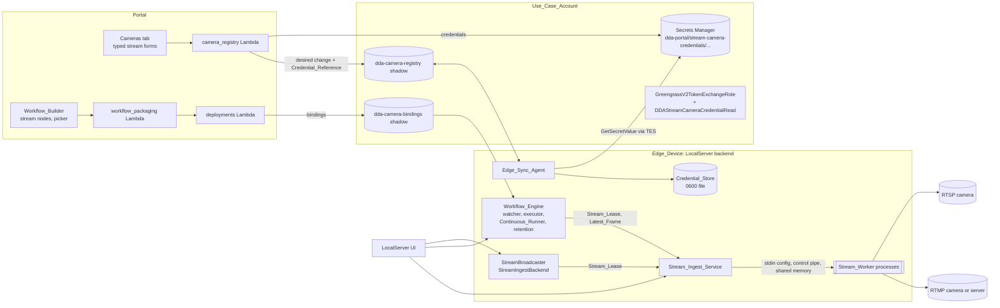
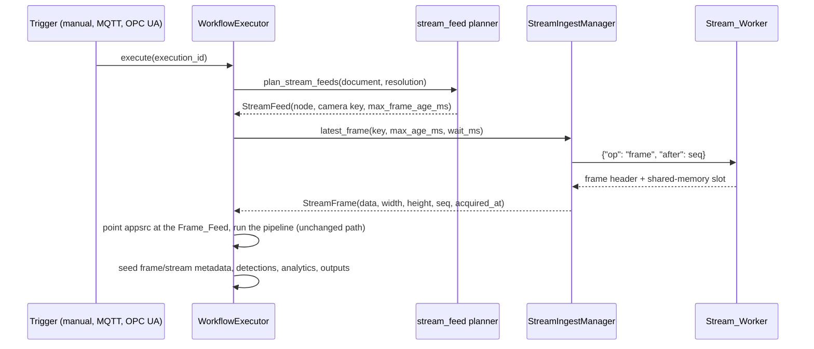
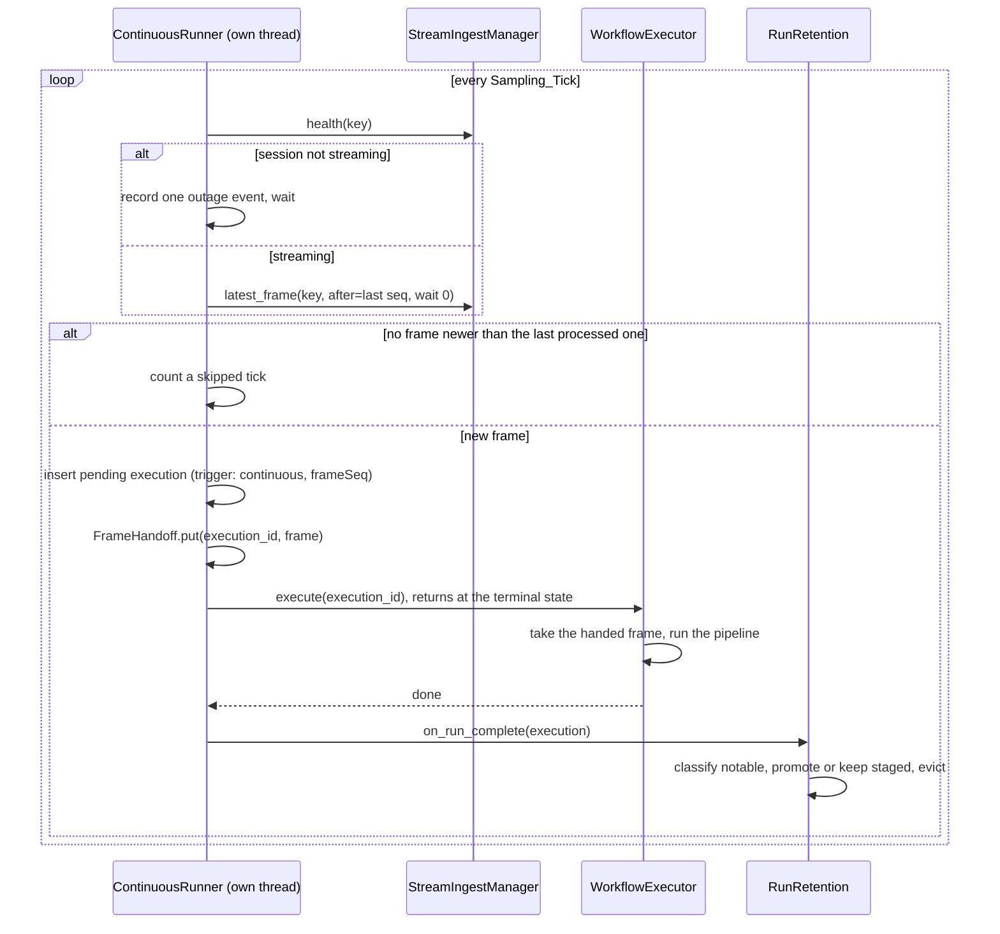
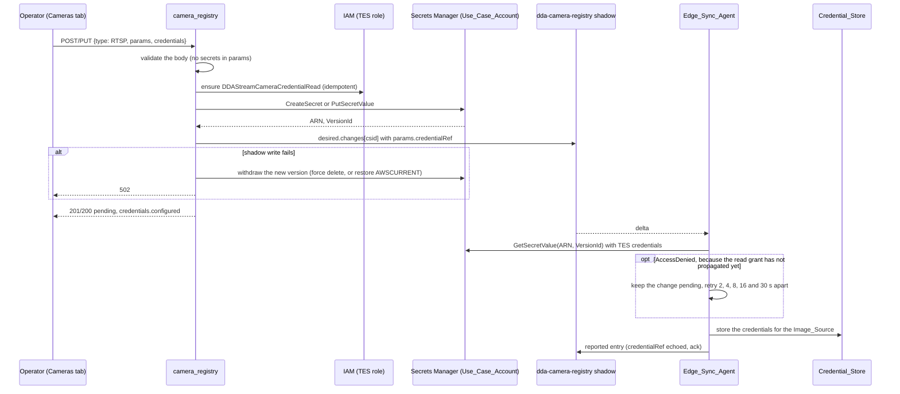

# Design Document: RTSP/RTMP Stream Cameras

## Overview

This feature adds network video cameras as first-class workflow inputs: RTSP and RTMP, carrying H.264 or H.265. It also adds what live-scene analytics such as PPE compliance and scene counting need to be practical.

The camera path follows the same route the Aravis and CSI/ICAM camera nodes use:

1. Catalog descriptor
2. Workflow_Builder picker
3. Packager binding points
4. Deploy-time binding
5. Device-side resolution
6. Frame_Feed

On top of that, the Workflow_Engine gains four device-side capabilities it lacks today:

- A persistent, isolated stream ingest service.
- A continuous run mode.
- Bounded retention for high-frequency runs.
- Event state that carries across runs.

| Area | Where | What changes |
|---|---|---|
| Shared rules | `workflow_core` (Portal layer and LocalServer vendor mirror) | <ul><li>`stream_url.py`: URL rules, normalization, redaction</li><li>Five catalog descriptors</li><li>Validator rules V11–V13 and W3, plus a generalized V7</li><li>`analytics/scene.py`: counter, association, event-gate automaton</li></ul> |
| Portal backend | `workflow_packaging.py`, `deployments.py`, `camera_registry.py`, new `stream_credentials.py`, `camera_sync.py` | <ul><li>`streamBinding` points</li><li>Compatibility and override rules, and a feature floor</li><li>Typed stream camera bodies</li><li>Credential storage in Secrets Manager</li><li>Device-capability ingest</li></ul> |
| Portal frontend | `pages/workflows/*`, `components/DeviceCamerasTab.tsx`, `pages/deployments/*`, `pages/DeviceDetail.tsx` | <ul><li>Stream picker</li><li>Inline-check mirror</li><li>Typed stream camera form</li><li>URL override in the binding matrix</li><li>Capability panel</li></ul> |
| Infrastructure | `usecase-account-stack.ts`, `compute-stack.ts` | <ul><li>Scoped Secrets Manager write access for the Portal</li><li>Device read grant</li><li>workflow_core layer on the camera registry Lambda</li><li>Feature-floor environment map</li></ul> |
| LocalServer backend | New `src/backend/stream_ingest/`; `camera_sync/`, `workflow_engine/`, `model/`, `resources/`, `endpoints/`, `utils/streaming/`, `dda_logging/` | <ul><li>RTSP/RTMP Image_Sources</li><li>Credential_Store and redaction filter</li><li>Stream_Workers and sessions</li><li>Stream feed and Continuous_Runner</li><li>Retention</li><li>Analytics bindings</li></ul> |
| LocalServer UI | `src/frontend/src/components/image-source/*`, `components/deployed-workflow/*` | <ul><li>Stream camera forms and connection test</li><li>Preview</li><li>Continuous status and controls</li><li>Analytics results</li></ul> |
| Test sandbox | `edge-cv-portal/test-sandbox/harness/bindings.py` | Analytics bindings through the shared module |
| Images and gates | `src/backend/requirements.txt`, `build-custom.sh`, possibly `Dockerfile.jp7`; preservation baselines | <ul><li>PyAV pin</li><li>In-image stream self-check</li><li>Baseline updates</li></ul> |

### Key design decisions

| # | Decision | Choice | Rationale |
|---|---|---|---|
| D1 | Node shape | Two node types, `rtsp_camera_source` and `rtmp_stream_source`, built from one shared parameter family | <ul><li>Matches the per-capture-family precedent (Aravis, CSI, ICAM).</li><li>Picker filters and compatibility sets stay one line each.</li><li>Sharing the `ParameterDescriptor` objects keeps the unified-input parameter union exact.</li></ul> |
| D2 | Frame delivery | Executor-fed `appsrc` with a new `streamBinding` marker, the Aravis model | <ul><li>Opening an RTSP session per run costs 0.5–5 s: DESCRIBE/SETUP/PLAY, then a wait for the next keyframe.</li><li>It also multiplies sessions on cameras that allow only a few.</li><li>A persistent session plus the Frame_Feed keeps runs fast.</li><li>URLs and credentials stay out of compiled pipelines and launch strings.</li></ul> |
| D3 | Ingest isolation | One Stream_Worker process per Stream_Session | <ul><li>Network video is untrusted input to native decoders.</li><li>A decoder crash or a hung `rtspsrc` state change must not take down the backend; the awscrt abort history shows what in-process native failures cost.</li><li>SIGKILL is a reliable teardown.</li><li>The RTMP demuxer's own FFmpeg copy stays out of the backend process, which already loads opencv's and gst-libav's.</li></ul> |
| D4 | RTSP ingest | GStreamer `rtspsrc`, with credentials in its `user-id` and `user-pw` properties | <ul><li>Every backend image already installs the needed plugins: plugins-good (`rtspsrc`, `rtph264depay`, `rtph265depay`), plugins-bad (`h264parse`, `h265parse`) and gst-libav (`avdec_h264`, `avdec_h265`).</li><li>Credentials set as element properties never enter the location URL.</li></ul> |
| D5 | RTMP ingest | PyAV demuxes inside the worker and pushes H.264/H.265 access units, as Annex-B byte-stream, into the same GStreamer decode chain | <ul><li>GStreamer's `flvdemux` gained Enhanced-RTMP H.265 only in 1.28. The images run 1.16 (JP5), 1.20 (JP6, x86, arm64 CPU) and 1.24 (JP7).</li><li>Ubuntu's `ffmpeg` is 4.2/4.4 on the 20.04/22.04 images; E-RTMP HEVC landed in FFmpeg 6.1.</li><li>A pinned PyAV wheel gives one RTMP path with both codecs on every target.</li><li>Sharing the decode chain gives RTMP the same hardware decoding as RTSP.</li></ul> |
| D6 | RTMP mode | Pull only | <ul><li>FFmpeg's listen mode accepts one publisher and does not enforce the app or stream key.</li><li>Safe push ingest needs a real ingest server, left as a follow-up.</li></ul> |
| D7 | Decoder choice | Runtime capability probe, Decoder_Policy, and automatic fallback | <ul><li>Whether `nvv4l2decoder` is reachable differs by target. On JP6, `pipeline_builder`'s JPEG path shows it works. JP5 depends on L4T CSV injection. JP7 uses a non-L4T base image and is unknown.</li><li>Decoding a probe sample proves each decoder, rather than trusting factory registration.</li></ul> |
| D8 | Continuous mode | Sampled single-frame runs through the unchanged `WorkflowExecutor.execute()` | <ul><li>Every node type keeps working: model inference, Bedrock, VLM, Custom Python, outputs, conditions and run observability.</li><li>Measured single-frame overhead, ~30 ms pipeline plus ~100 ms orchestration on jetson-thor1 (from vllm-workflow-latency-optimization), allows several runs per second.</li><li>A persistent streaming inference pipeline would rewrite the executor's per-run contract: capture ids, EOS-driven results and artifacts.</li></ul> |
| D9 | Continuous completion signal | The runner calls `execute()` synchronously on its own thread | The trigger dispatcher polls run status every 0.5 s, which caps a workflow at about 2 runs per second. |
| D10 | Retention | <ul><li>Continuous runs are staged in `/dev/shm`.</li><li>A registration keeps its most recent K runs plus its newest N notable runs, under a device byte cap.</li></ul> | <ul><li>At 5 fps, one continuous workflow creates about 432k runs a day and more than 100 GB of artifacts.</li><li>Staging in RAM spares flash for runs that are deleted minutes later.</li></ul> |
| D11 | Credentials | <ul><li>A device-local Credential_Store.</li><li>Credentials entered in the Portal go to Secrets Manager in the Use_Case_Account, and the device fetches them with its TES credentials.</li></ul> | <ul><li>Mirrors the git-connections pattern: the secret value lives only in Secrets Manager and the Portal cannot read it back.</li><li>Mirrors the static-image pin pattern: the shadow carries a reference and the device fetches with its own credentials.</li><li>Avoids adding `aws.greengrass.SecretManager`, which would change seven preservation-pinned recipes.</li><li>Avoids new Greengrass IPC calls and their awscrt abort exposure.</li></ul> |
| D12 | Analytics | Executor-level bindings over the Detection_List, with the pure logic in `workflow_core/analytics/scene.py` | <ul><li>One implementation serves the LocalServer (vendor mirror) and the cloud test sandbox (vendored in its image).</li><li>No GStreamer, model or Triton change.</li></ul> |
| D13 | Event gate state | Kept in memory per registration and reset on restart or on a new version | <ul><li>Predictable behavior.</li><li>Persisting alarm state across restarts invites stale alarms.</li></ul> |
| D14 | Feature floor | Workflows that use the new node types carry a per-architecture minimum LocalServer version | <ul><li>An older LocalServer would treat `streamBinding` points as slot points with no slots, and stall on an unfed `appsrc` for 120 s.</li><li>The existing per-architecture floor mechanism (jp7-workflow-min-localserver-floor) extends to this naturally.</li></ul> |
| D15 | Denied credential fetch (finding 21) | Keep the change pending on the device and retry it on a per-change timer, 2, 4, 8, 16 and 30 s apart. Fail it at once on any other error, and when the retry at 60 s is denied too | <ul><li>The first credentialed change of a use case writes the device read grant about a second before the device fetches the secret, and IAM can take longer than that to apply a new policy.</li><li>Retrying in place would hold the thread that delivered the change, the shared IPC client's stream callback, for a minute.</li><li>The report backoff is one schedule for the whole document, reset by every successful write, so it cannot bound one change.</li><li>The timer is a new constructor seam, `change_retry_timer`, with the stream report debouncer's default timer, so tests stay deterministic.</li></ul> |
| D16 | Deleting a camera the device never created (finding 21) | The device acknowledges the delete and nulls the id's failure key in the shadow (Requirement 5.11). For an entry pending a Portal delete whose id is neither `cfg-` nor discovery-managed, whatever its type, the reducer stops counting a failure from an earlier change as the camera's presence (Requirement 5.12) | <ul><li>A delete change carries no type, so the device rule covers every type.</li><li>With the reducer rule, the registry drops the entry at the first reduction after the delete, on any device build, with no new route.</li><li>The reducer rule checks the id, and covers the same ids as the device rule (owner decision, 2026-10-03), so the registry frees early only an entry whose delete a task 29 device acknowledges. `cfg-` and discovery-managed entries keep today's rule, even when they are pending a delete (component 8).</li><li>Every entry that is not pending a delete keeps today's rule, so a failed create that the operator edits stays in the registry. Requirement 18.3 names 5.11 and 5.12 as the only changes for the other types.</li><li>The device's acknowledgement and null keep the shadow from collecting a failure key per failed create.</li></ul> |
| D17 | Secret identity (finding 22) | Record the secret's ARN on the registry entry, carry it when the device re-keys the camera, and update, clear and delete by it | <ul><li>The device re-keys `portal-<hex>` to `cfg-<id>`, so a name derived from the current id misses the secret.</li><li>The device already echoes `credentialRef`, so entries created before the record need no migration. The few secrets the old routes orphaned are found and removed once, by hand (task 29.7).</li><li>Every call stays on the existing name prefix, so neither Portal grant changes.</li></ul> |
| D18 | Shadow events and redelivered Portal changes (finding 23) | `SubscriptionHandler` queues each subscription's events and runs its handler on a worker thread of its own, one event at a time, in arrival order. The Edge_Sync_Agent applies each `(csid, portalChangeId)` at most once per process, retries a failed desired-entry clear, and catches up each time its subscription becomes active. The catch-up resets the report and clear backoffs only once its shadow GET is readable | <ul><li>A blocking IPC call made on the IPC stream callback cannot complete until the callback returns, and all four subscriptions make one there. One change point covers all four.</li><li>The record is needed either way: deltas queued before a clear lands, and a clear that fails during an outage, still redeliver.</li><li>Not taken: a non-blocking clear. It fixes only the camera-registry clear. The other handlers need their responses, and the apply itself (DB writes, and a credential fetch of up to a minute) would stay on the networking thread.</li><li>Not taken: the SDK's V2 client. Every holder would change API, and its pool runs callbacks concurrently, which loses per-subscription order.</li><li>Not taken: one worker per agent, four changes for one cause.</li><li>Not taken: resetting the backoffs before the catch-up's GET. While the stream is up and the GET keeps failing, the supervisor's catch-up retry then forces a full report about every 10 s and restarts a failing write's backoff from 1 s (task 30 code review, item 1).</li></ul> |
| D19 | IPC connection recovery (finding 24) | A stable handle over a replaceable client. One reconnect thread opens a fresh connection per loss, with at most one attempt pending, and every shadow subscription re-subscribes, backing off across activations whose stream dies within `STABLE_SUBSCRIPTION_S`, as the connection does. Replaced clients stay referenced and are never closed | <ul><li>The SDK never reconnects a closed connection, and the backend's import-time holders kept the dead client, so one loss stopped every IPC user of the process until a restart.</li><li>The handle forwards to the current client, so every holder follows a reconnect without rewiring.</li><li>Never closing a client, and keeping replaced ones referenced, means neither a close nor a finalizer can bring back the `aws-c-event-stream` connect/close abort that the shared client avoids.</li><li>Not taken: reconnecting the same `Connection`. That works only from `DISCONNECTED`, and the second loss may have been stuck elsewhere.</li><li>Not taken: having every holder call `get_ipc_client()` per use: eight call sites plus the `local_auth` cache, and a future holder could regress.</li><li>Not taken: a container restart on a loss. Compose stays untouched.</li><li>Not taken: restarting the subscribe backoff at every activation. A stream the Nucleus accepts and then closes would then be activated again about once a second, for ever, with an ERROR each time (task 30 code review, item 3).</li></ul> |
| D20 | TES on every target (finding 25) | Every repo recipe declares `aws.greengrass.TokenExchangeService` `~2.0.0` as a hard dependency (the default), so every publish path publishes it | <ul><li>Greengrass gives a component `AWS_CONTAINER_CREDENTIALS_FULL_URI` only when it depends on TES, and the backend fetches stream credentials with those credentials.</li><li>The ECR publish path already adds the same dependency. `gdk component publish`, which amd64 takes because its artifacts are under 2 GB, publishes the repo recipe as it is.</li><li>Not taken: amd64 only. Requirement 17.1 would still depend on artifact size or on the publish path.</li></ul> |

## Architecture

### System context



### Inside a Stream_Worker

A worker builds one of two ingest heads, followed by a shared decode tail.

`<scale caps>` is computed from the first negotiated caps, so that the longer edge fits the camera's maximum frame dimension. It is recomputed whenever the resolution changes.

```text
RTSP head:
  rtspsrc location=<Stream_URL> user-id=<u> user-pw=<p>
          protocols=<tcp | udp | udp-mcast+udp+tcp> latency=<ms>
          tls-validation-flags=validate-all do-rtsp-keep-alive=true
    pad-added: application/x-rtp,media=video,encoding-name=H264|H265 -> rtph264depay | rtph265depay
               any other pad                                         -> fakesink async=false

RTMP head (PyAV thread inside the worker):
  av.open(<connect URL>, options={rw_timeout, rtmp_enhanced_codecs=hvc1,av01,vp09,
                                  tls_verify=1, ca_file=<system bundle>})
    (rtmp_enhanced_codecs sends the E-RTMP v2 fourCcList; MediaMTX sends an H.265
     track only to a client that lists hvc1. Found on hardware, task 25.1.)
    first video stream (h264 | hevc) -> h264_mp4toannexb | hevc_mp4toannexb
    -> appsrc name=es is-live=true format=time
              caps=video/x-h264|video/x-h265,stream-format=byte-stream,alignment=au

Decode tail (both heads):
  h264parse | h265parse -> <decoder chain> -> identity name=rate silent=true (publish-cap probe)
    -> appsink name=frames max-buffers=1 drop=true sync=false emit-signals=false
```

| Decoder chain | Elements |
|---|---|
| Jetson hardware | `nvv4l2decoder ! identity name=rate ! nvvidconv ! video/x-raw,format=RGBA,<scale caps> ! videoconvert ! video/x-raw,format=RGB` (the VIC does the scaling) |
| x86 NVIDIA hardware | `nvh264dec` or `nvh265dec`, then `! identity name=rate ! videoscale ! videoconvert ! video/x-raw,format=RGB,<scale caps>` |
| Software | `avdec_h264` or `avdec_h265`, then `! identity name=rate ! videoscale ! videoconvert ! video/x-raw,format=RGB,<scale caps>` |

The publish cap defaults to 10 fps, the node maximum. It is a buffer probe (`RateLimiter`) on the sink pad of a passthrough `identity` named `rate`, right after the decoder, so it bounds scaling, color conversion and frame copies. Decoding still runs at the source rate, because inter frames depend on their predecessors. The software chains scale before converting, which is cheaper than converting the full-size frame. `<scale caps>` sit on a named capsfilter; the worker sets them from the decoded caps (a pad probe on `rate`) and again on every resolution change.

- `RateLimiter` is a token bucket timed by each frame's arrival on the monotonic clock: tokens accrue at the cap per second, up to a burst of 2, and each kept frame spends one.
  - A faster source is thinned evenly: 15 fps capped at 10 keeps two frames in three.
  - A source at or below the cap keeps every frame, as long as its arrivals jitter by less than half an interval, because an early frame spends what a late one left.
  - After a stall, at most two frames pass back to back.
- Found on hardware (task 25.3), in two steps:
  - The cap was first `videorate drop-only=true max-rate=<cap>`. In drop-only mode `videorate` asserts that every frame carries a duration (`GST_BUFFER_DURATION_IS_VALID`), and aborts the worker on GStreamer 1.20 (JP6) and 1.24 (JP7). A real IP camera (an Amcrest PTZ) sends H.264 without VUI timing, so its decoded frames have none. The probe needs no duration.
  - The probe first timed frames by PTS, and by the clock when a frame had none. The same camera's 30 fps sub stream sets no PTS on a third of its decoded frames, and its PTS steps are irregular (10–100 ms). Mixing the two timebases made every switch look like a restarted stream, so the cap passed 17–21 frames per second instead of 10. Timing by arrival alone gives 10.0 on both JP6 and JP7, and the camera's 7 fps main stream keeps every frame.

### On-trigger run



### Continuous run



### Portal-managed credentials



## Components and Interfaces

### 1. Stream_URL rules: `workflow_core/stream_url.py` (new, mirrored)

This is one pure module. Its consumers are:

- The catalog constraint.
- The validator.
- The Portal camera registry and deployment service.
- The LocalServer Image_Source schema.
- The Stream_Worker.
- The redaction filter.

```python
#: Catalog regex for Stream_Camera_Source_Node.url; valid in both Python and JavaScript.
#: Lowercase scheme, a non-empty authority containing no '@', then an optional path or query.
STREAM_URL_PATTERN = r"^(rtsps?|rtmps?)://[^\s/@?#]+([/?][^\s#]*)?$"

SCHEMES_BY_NODE_TYPE = {"rtsp_camera_source": ("rtsp", "rtsps"),
                        "rtmp_stream_source": ("rtmp", "rtmps")}
SCHEMES_BY_SOURCE_TYPE = {"RTSP": ("rtsp", "rtsps"), "RTMP": ("rtmp", "rtmps")}
SECRET_QUERY_PARAMETERS = frozenset({
    "password", "passwd", "pwd", "pass", "secret", "token", "key", "apikey",
    "api_key", "auth", "signature", "sig", "streamkey", "stream_key"})
DEFAULT_PORTS = {"rtsp": 554, "rtsps": 322, "rtmp": 1935, "rtmps": 443}

@dataclass(frozen=True)
class StreamUrlProblem:
    code: str      # invalid_url | scheme_not_allowed | no_host | user_info | secret_query_parameter
    message: str   # names the offending part, never echoes a secret value

def check_stream_url(url: str, allowed_schemes) -> Optional[StreamUrlProblem]: ...
def normalize_stream_url(url: str) -> str: ...
def redact(text: str, secrets: Iterable[str] = ()) -> str: ...
def compose_connect_url(url: str, url_secret_suffix: Optional[str],
                        username: Optional[str], password: Optional[str],
                        protocol: str) -> str: ...
```

- `check_stream_url` rejects a URL in any of these cases:
  - It cannot be parsed.
  - Its scheme is outside `allowed_schemes`.
  - Its host is empty.
  - It carries user information.
  - Its query has a parameter whose name, compared case-insensitively, is in `SECRET_QUERY_PARAMETERS`.

  Problem messages name the parameter, never its value.
- `normalize_stream_url` lowercases the scheme and host, and drops an explicit default port. It keeps the path and query byte for byte. Two URLs identify the same camera exactly when their normalized forms are equal. This drives the override and unbound URL match (Requirement 10.6) and the keys of anonymous sessions.
- `redact` masks three kinds of secret:
  - URL user information, rewriting `scheme://user:pass@` as `scheme://***@`.
  - The values of secret query parameters, replaced by `***`.
  - Every literal in `secrets` of length 4 or more, longest first, replaced by `***`.

  `redact` is idempotent.
- `compose_connect_url` runs only inside a Stream_Worker:
  - For RTSP it returns the Stream_URL unchanged, because credentials go to element properties.
  - For RTMP it inserts URL-encoded user information and appends the URL secret suffix.

### 2. Catalog descriptors: `workflow_core/catalog/nodes.py`

A module-level tuple holds the stream parameter family. Both node types reference the same `ParameterDescriptor` objects, so the unified-input union deduplicates them exactly:

```python
_STREAM_SOURCE_PARAMETERS = (
    ParameterDescriptor("url", "string", required=True, default=None,
        constraints={"min_length": 1, "max_length": 2048, "regex": STREAM_URL_PATTERN},
        description="Credential-free stream URL of the camera, e.g. "
                    "rtsp://192.168.1.64:554/Streaming/Channels/101 or "
                    "rtmp://media.local/live/line1. Credentials are set on the "
                    "camera, never in the URL.",
        examples=["rtsp://192.168.1.64:554/Streaming/Channels/101",
                  "rtmp://media.local/live/line1"]),
    ParameterDescriptor("processing_mode", "enum", required=False, default="continuous",
        constraints={"values": ["continuous", "on_trigger"]}, description=..., examples=...),
    ParameterDescriptor("frames_per_second", "float", required=False, default=1.0,
        constraints={"min": 0.05, "max": 10.0},
        depends_on="processing_mode=continuous", description=..., examples=[1.0, 5.0]),
    ParameterDescriptor("max_frame_age_ms", "int", required=False, default=2000,
        constraints={"min": 100, "max": 60000}, description=..., examples=[2000]),
    ParameterDescriptor("keep_recent_runs", "int", required=False, default=20,
        constraints={"min": 1, "max": 200},
        depends_on="processing_mode=continuous", description=..., examples=[20]),
    ParameterDescriptor("keep_notable_runs", "int", required=False, default=200,
        constraints={"min": 0, "max": 5000},
        depends_on="processing_mode=continuous", description=..., examples=[200]),
)
```

The stream node types:

- `RTSP_CAMERA_SOURCE` and `RTMP_STREAM_SOURCE`:
  - Category input, an `activation` EventSignal input, and an `out` VideoFrames output.
  - `parameters=list(_STREAM_SOURCE_PARAMETERS)`.
  - Mappings: `_same_on_device_archs(appsrc name=appsrc_{nodeId} ! videoconvert, plugin_dependencies=["app", "videoconvertscale"])` plus `_dataset_fed_sim_source()`.
  - `hardware_dependent=True`.
  - Both plugin dependencies are already in `LOCALSERVER_BUNDLED_PLUGINS`, so compiled `pluginDependencies` stays empty and packaging ships no plugin.

The analytics node types:

- `DETECTION_COUNTER`, `OBJECT_ASSOCIATION` and `EVENT_GATE`:
  - Category post_processing, with InferenceMeta in and out.
  - Mappings: `_same_on_all_archs(executor_binding=<type id>)`.
  - `hardware_dependent=False`, because the sandbox runs the same binding.
  - The `event_gate` `condition` description reuses `CONDITION_LANGUAGE_DESCRIPTION` and `CONDITION_EXAMPLES`.

Unified input:

- `SOURCE_KIND_TO_SOURCE_TYPE` gains `"rtsp_camera": "rtsp_camera_source"` and `"rtmp_stream": "rtmp_stream_source"`.
- `_UNIFIED_SOURCE_DESCRIPTORS` gains both descriptors.
- The unified union deduplicates parameters by name. The stream family's names are all new, so every existing unified parameter keeps its position and object.
- `INERT_ACTIVATION_TYPE_IDS` is derived from the map, so it now includes the stream types:
  - Digital-input edges into a stream node are dropped, as they are for the other sources.
  - `mqtt_subscribe` and `opcua_subscribe` edges survive into the activation plan; this is how on-trigger mode is driven.

Catalog order and the frontend mirror:

- `NODE_CATALOG` appends `RTSP_CAMERA_SOURCE`, `RTMP_STREAM_SOURCE`, `DETECTION_COUNTER`, `OBJECT_ASSOCIATION` and `EVENT_GATE` after `METADATA`. Each carries an "Appended (additive — rtsp-rtmp-stream-cameras Requirement N)" comment.
- The frontend's copy of `SOURCE_KIND_TO_SOURCE_TYPE`, in `pages/workflows/types.ts`, gains the same two entries.

### 3. Validator: `workflow_core/validator/checks.py`

| Code | Severity | Fires when |
|---|---|---|
| `V7_COEXISTENCE_CONFLICT` (extended) | error | The workflow has two or more Frame_Feed_Source_Nodes, of any combination of types |
| `V11_STREAM_URL` | error | A stream node's `url` fails `check_stream_url` for its node type (checked for unified nodes of a stream kind too) |
| `V12_CONTINUOUS_ACTIVATION` | error | A continuous stream node has an activation edge, or shares the graph with a subscription trigger |
| `V13_ANALYTICS_CONFIG_INVALID` | error | A Scene_Analytics_Node's `zone`, `classes`, `subject_class` or `required_classes` fails to parse |
| `W3_ANALYTICS_NO_DETECTOR` | warning | A `detection_counter` or `object_association` node has no `model_inference` node upstream |

Rule details:

- **V7.** Both stream types join `COEXISTENCE_SINGLETON_TYPES` and `FRAME_FEED_SOURCE_TYPES`. The mixed rule changes from `FRAME_FEED_SOURCE_TYPES <= set(by_type)` to `len(FRAME_FEED_SOURCE_TYPES & set(by_type)) >= 2`.
  - With two members the two tests are equivalent, so every pre-feature graph gets identical findings.
  - With four members, only the new form still means "two or more distinct frame-feed types".
- **V9.** V9 skips continuous stream nodes, because V12 reports them. A graph that mixes a subscription trigger with a continuous stream node therefore gets one finding per node, not two. Graphs without continuous stream nodes are untouched.
- **V11 and V12 on unified nodes.** Both rules evaluate a unified node through its effective `source_kind`. Save-time validation of an unexpanded graph therefore agrees with compile-time validation of the expanded graph.
- **Frontend mirror.** `inlineChecks.ts` mirrors every row of the table. `streamUrl.ts` is a line-for-line port of `check_stream_url`, pinned by a parity property test (Property 6).

### 4. Scene analytics: `workflow_core/analytics/scene.py` (new, mirrored)

Pure functions with no I/O:

```python
def label_key(label: str) -> str: ...
def parse_label_list(text: str, max_items: int) -> Tuple[List[str], List[str]]: ...  # (label keys, problems)
def parse_zone(text: str) -> Tuple[Optional[List[Tuple[float, float]]], List[str]]: ...
def point_in_polygon(x: float, y: float, polygon) -> bool: ...   # even-odd rule, boundary inclusive
def box_intersects_polygon(box, polygon) -> bool: ...
def count_detections(detections, *, classes, min_confidence, zone, zone_rule, frame_size) -> dict: ...
def associate(detections, *, subject_class, required_classes, min_overlap,
              min_confidence, zone, frame_size) -> dict: ...

@dataclass(frozen=True)
class EventGateState:
    active: bool = False
    consecutive_true: int = 0
    consecutive_false: int = 0
    active_since_ms: Optional[int] = None
    last_emit_ms: Optional[int] = None

def step_event_gate(state: EventGateState, outcome: Optional[bool], *, activate_after: int,
                    clear_after: int, emit: str, repeat_interval_ms: int,
                    now_ms: int) -> Tuple[EventGateState, bool, str]: ...
```

- **Zones.** A zone is stored in normalized coordinates (0 to 1) and scaled by `frame_size`, the `(width, height)` of the frame the detector processed. A zone whose `frame_size` is unknown yields an error outcome (Requirement 13.6).
- **`count_detections`.** Returns `{"counts": {key: n}, "total": n, "labels": {key: original}}`. Labels listed in `classes` are zero-filled.
- **`associate`.**
  1. Build candidate pairs of (subject, required detection) where `area(required ∩ subject) / area(required) ≥ min_overlap`.
  2. For each required class, sort its pairs by overlap descending, then by subject order, then by detection order.
  3. Assign greedily, so that within a class each detection and each subject is used at most once.

  The result carries `subjects`, `compliant`, `violations`, `missing` and `violating_ids`.
- **`step_event_gate`.** Implements the automaton of Requirement 15:
  - An unevaluable condition is passed in as `None` and counts as false.
  - `passed` is true exactly on the runs that emit.
  - `transition` is `activated`, `cleared` or `none`.
- **Mirror test.** The mirror test gains `stream_url.py` and `analytics/scene.py`.

### 5. Component_Packager: `workflow_packaging.py`

```python
RTSP_CAMERA_SOURCE_TYPE_ID = 'rtsp_camera_source'
RTMP_STREAM_SOURCE_TYPE_ID = 'rtmp_stream_source'
STREAM_SOURCE_PROTOCOLS = {RTSP_CAMERA_SOURCE_TYPE_ID: 'rtsp',
                           RTMP_STREAM_SOURCE_TYPE_ID: 'rtmp'}
```

- **Binding points.** `gather_camera_input_nodes` includes both stream types. `build_binding_points` gains a branch ahead of the generic slot branch that sets:
  - `entry['streamBinding'] = True`.
  - `entry['streamProtocol'] = STREAM_SOURCE_PROTOCOLS[node.type]`.
  - Empty slots.
  - `parameters` set to the rendered parameters, which are all non-secret by construction.
- **Camera input record.** `camera_input_nodes_record` needs no change, because stream points have no `device` slot.
- **Feature floor.** When the graph contains a Stream_Camera_Source_Node or a Scene_Analytics_Node, `min_local_server_version_for(arch)` becomes the maximum of the architecture floor and the feature floor.
  - The feature floor comes from a new environment map, `WORKFLOW_STREAM_CAMERA_MIN_LOCAL_SERVER_VERSIONS` (`{arch: version}`), set in `compute-stack.ts`. Each value is the first LocalServer build verified on hardware with the feature and its task 28 fixes (task 26.3): `arm64_jp5` `1.0.51`, `arm64_jp6` `1.0.74`, `arm64_jp7` `1.0.52`, and `1.0.47` for both `x86_64` and `x86_64_nvidia`, which run the same `aws.edgeml.dda.LocalServer.amd64` build.
  - If an architecture is missing from the map, packaging is rejected with `STREAM_CAMERAS_UNSUPPORTED_ARCH`, naming the architecture. No workflow that uses the feature can reach a LocalServer without it.
  - An architecture with no verified build stays out of the map, and so fails closed. `arm64_cpu` is out for now (owner decision, 2026-09-30): it has no Portal build target and no test device. The coverage test lists it in `UNVERIFIED_STREAM_ARCHES` and requires a floor for every other architecture in `ARCH_TO_LOCAL_SERVER_COMPONENT`.
  - Workflows without the new node types resolve their floors exactly as before.

### 6. Deployment_Service: `deployments.py` and the binding matrix

- **Compatibility.** `_CAMERA_COMPATIBLE_SOURCE_TYPES` gains `'rtsp_camera_source': frozenset({'RTSP'})` and `'rtmp_stream_source': frozenset({'RTMP'})`.
- **Degraded sources.** `_degraded_source_conditions` adds `stream-failed` when `entry.capabilities.stream.state == 'failed'`. Only stream entries carry that capability, so warning ids for every other type are unchanged.
- **Overrides.** `_override_errors` keeps the descriptor constraint check. For stream node types it also applies `check_stream_url(value, SCHEMES_BY_NODE_TYPE[node_type])` to `url`.
- **Floor gate.** The pre-submit LocalServer floor gate reads the same feature floor as the packager.
- **Frontend.**
  - `CameraBindingMatrix.tsx` filters the rows of stream nodes through `isStreamCompatibleCamera(nodeType, camera)`.
  - `cameraBindings.ts` records a per-node-type identity parameter, `url` for stream types.
  - `buildCameraBindings` emits `{override: {url}}` for stream nodes, and keeps `{override: {device}}` for every other node type.
  - Out of scope: the existing Aravis override also sends `device`, which the backend rejects as an undeclared parameter. This pre-existing gap is left unchanged.

### 7. Camera_Registry: `camera_registry.py` and new `stream_credentials.py`

Request body for the stream types:

```jsonc
{
  "name": "Dock 3 overview",
  "type": "RTSP",                                   // or "RTMP"
  "params": {
    "url": "rtsp://10.0.4.21:554/Streaming/Channels/101",
    "transport": "tcp", "latencyMs": 200,            // RTSP only
    "decoder": "auto", "maxFrameDimension": 1920, "stallTimeoutS": 10
  },
  "credentials": { "username": "viewer", "password": "…", "urlSecret": null },  // optional, write-only
  "clearCredentials": false                          // optional
}
```

**Body validation.** `validate_stream_camera_body` applies to the stream types only; other types keep `validate_camera_body` alone. It enforces:

- The allowed `params` keys for each type.
- The value domains of Requirement 4.1.
- `check_stream_url` with the type's schemes.
- No server-managed keys in `params`: `credentialRef`, `credentialsConfigured` and `credentialsUpdatedAt`.
- No credential-like keys in `params`: `username`, `user`, `password`, `secret`, `token` and `urlSecret`.
- For a create only, a `camera_source_id` in the body, when the key is present and its value is not null (task 29, after finding 22). The value must be a string that `re.fullmatch(r"[A-Za-z0-9_.@+=-]{1,128}", value)` accepts, must not be made only of dots, must not start with `cfg-`, `disc-` or `arv-`, and must be neither `static-image-camera` nor `static-video-camera`. Otherwise the route returns 400 with `field: camera_source_id`, before anything is written.
  - So `""`, a non-string such as `0`, and an invalid string get the 400. A missing key, or `null`, gets a generated `portal-<hex>` id, as today. Today's `body.get('camera_source_id') or …` also generates an id for `""` and `0`; for the stream types it no longer does, and every other type keeps it.
  - `fullmatch`, not `match` with `$`: `$` also matches before a final newline, so `"cam-1\n"` would pass and `CreateSecret` would then reject the name with a 500.
  - The Cameras tab never sends an id; the route generates `portal-<hex>`. Only API clients are affected.
  - The rule keeps a derived secret name to one segment under the device's prefix, which `device_secret_id` requires (**Secret record**). An id with `/` would name a secret the routes could then never resolve. The rule also keeps the id of every stream create outside `cfg-`, which the mirror shape rule relies on. The one exception is `reapply_conflict`, which re-creates a deletion-retained camera under the conflict's own id, and so under a `cfg-` id when the device deleted a configured camera (**Create mirrors**; component 8, **Stale failure keys**).
  - `.` and `..` are dot segments, which URL normalization (RFC 3986, section 5.2.4) removes from `/cameras/{csid}`. Browsers and most HTTP clients normalize before sending, so an update or delete could not reliably reach a camera with either id. Whether API Gateway normalizes as well is not checked, and the rule does not depend on it. An id made only of dots is rejected, which covers both.

**Create or update with credentials**, in order:

1. Authorize and validate, following the existing pattern.
2. Call `ensure_device_read_grant(usecase)`. It idempotently gets and puts the inline policy `DDAStreamCameraCredentialRead` on `GreengrassV2TokenExchangeRole`, following the tuning grant in `deployments.py`.
3. Call `store_stream_credentials(usecase, device_id, csid, credentials, secret_ids, create=...)`. A create passes `create=True` and no `secret_ids`. An update passes `create=False` and, as `secret_ids`, the `secret_id` values of `credential_secret_ids`'s pairs, in order, which the route resolves before step 2 (see **Secret record**). It returns `{secretArn, versionId}`.
   - It uses `CreateSecret` for a new camera and `PutSecretValue` for an existing one.
   - A new secret is named `dda-portal/stream-camera-credentials/{device_id}/{csid}`, after the id the camera has when it gets its secret. An update writes into the camera's existing secret, found through its record, and creates one only when the camera has none (see **Secret record**).
   - The value is `{"username", "password", "urlSecret"}`, with absent fields omitted.
   - The secret is tagged with `dda-portal:usecase_id`, `dda-portal:device_id` and `dda-portal:camera_source_id`.
   - A secret still pending deletion from an earlier clear or delete is restored with `RestoreSecret` before the new version is written. If writing the version then fails, the deletion is scheduled again.
4. Set `params.credentialRef`, `params.credentialsConfigured = true` and `params.credentialsUpdatedAt`. Step 6 also records the secret's ARN on the item, as `credential_secret_arn`.
5. Call `write_desired_change`, shadow first as today. If it fails, withdraw the secret version and return 502:
   - A secret created in step 3 is removed with `DeleteSecret(ForceDeleteWithoutRecovery=True)`.
   - Otherwise, `UpdateSecretVersionStage` moves `AWSCURRENT` back to the previous version. Secrets Manager moves `AWSPREVIOUS` onto the new version, which nothing references.
   - A secret restored in step 3 is then scheduled for deletion again, so a failed re-add never keeps credentials the operator cleared.
6. Call `mark_pending(..., credential_secret_arn=stored['secretArn'])` (see **Secret record**) and `audit_mutation`. Audit details never include credentials.

**Clearing and deleting.**

- `clearCredentials: true` delivers `credentialsConfigured: false` without a reference. For an update, the camera's secrets are scheduled for deletion after the change is written. Its record is kept, so credentials added again restore the same secret.
- Deleting a stream camera schedules `DeleteSecret(RecoveryWindowInDays=7)` for each of its secrets after the delete change is written.
- Both skip a secret another camera of the device still uses. A create mirror is neither cleared nor deleted: the routes refuse it (see **Secret record**).
- A create owns no secret yet, so a create with `clearCredentials: true` schedules nothing, and `create_camera` no longer calls `schedule_credential_deletion` (task 29, after the third design review). Resolving secrets for it would also need the account, which a create never resolves.

**Updates that do not mention credentials.** An update replaces `params` wholesale, so `carried_credential_params(existing)` delivers the camera's reference again, and a settings edit keeps working credentials.
- The pending change's reference wins, and a pending clear carries nothing, so the update delivers no reference (task 8.6; Requirement 5.8).
- Otherwise it carries the reference the device last reported, but only while the device reports `credentialsConfigured: true` (task 29, after the second design review):

  ```python
  reported = existing.get('params')
  if (isinstance(reported, dict) and reported.get(PARAM_CREDENTIAL_REF)
          and reported.get(PARAM_CREDENTIALS_CONFIGURED) is True):
      return credential_keys(reported)
  return {}
  ```

- The reason is the shadow merge. After a clear, the device's report leaves `credentialRef` out but never sends a null for it, so the merged shadow, and the registry item built from it, still hold the old reference, while `credentialsConfigured` turns `false`.
  - Without the guard, the next plain edit would deliver that reference. The device would fetch a secret the clear had scheduled for deletion, and fail with `InvalidRequestException`, which is not retried. Every later plain edit would fail the same way.
  - The Cameras tab sends neither `credentials` nor `clearCredentials` on a plain edit, so this is the common path after a clear.
- A credential change made at the station leaves `credentialsConfigured` `true` and drops the reference on the device. A plain Portal edit then still delivers the Portal's reference and replaces the station's credentials, as it does today (Follow-ups).
- A clear that a plain edit replaces before the device consumes it is lost, as before task 29 (Follow-ups). The device keeps its credentials and reports them configured, so a later plain edit delivers their reference again. An edit made before the Camera_Registry has the device's report of a clear also delivers the old reference, which the device no longer holds, so the device fails it (Follow-ups). Requirement 5.8 names these two cases and the station-side one above, and all three stay as they are.

**Secret record** (finding 22, owner decision 2026-10-03). The device re-keys a Portal-created camera from the Portal's `portal-<hex>` id to `cfg-<imageSourceId>` (component 12), and the secret keeps its create-time name. The routes used to derive the secret from the current id, so they missed it: deleting `cfg-<id>` scheduled the deletion of a `.../cfg-<id>` secret that does not exist, and a credential update would have written a second secret. The registry now tracks the secret itself.
- **Record.** When a create or update stores credentials and its change is written, the item gets `credential_secret_arn`, the ARN `store_stream_credentials` returned.
  - `mark_pending` gains `credential_secret_arn: Optional[str] = None`, and sets it on both a new and a copied item when it is given.
  - The routes pass `stored['secretArn']` only when `stored` is not None. So a credential-free update, a clear and a delete keep the value copied from the existing item.
  - The sync reducer keeps the record on every report, and carries it to the entry the device creates for a Portal create (component 8).
  - No response returns it: `camera_view`, `conflict_view` and `deployments._binding_camera_view` build their responses field by field.
- **Resolution.** `credential_secret_ids(entry, device_id, csid, account_id, region)` lists a camera's secrets as `(secret_id, name)` pairs, in this order:
  1. `credential_secret_arn`.
  2. `pending_content.params.credentialRef.secretArn`, the reference the pending change delivers.
  3. `params.credentialRef.secretArn`: the last reference the device reported under that key, or, for an entry the device has not reported yet, the one the Portal stored with it. The merged shadow keeps the key after the device drops it (see **Updates that do not mention credentials**), so this can name a secret the camera no longer uses. Resolution still uses it, because a clear or delete should schedule the camera's old secret; only the carry-forward must not deliver it again.
  4. `secret_name(device_id, csid)`.

  The route resolves `region` with `get_usecase_region(usecase)` and `account_id` with `_usecase_account_id(usecase, region)` only when it needs the candidates, once per request: for a stream update with credentials of an existing entry, a stream update that clears credentials, and a stream delete.
  - A create needs none. It writes `secret_name(device_id, csid)` and records the ARN that Secrets Manager returns, so a credentialed create still works when the account cannot be resolved, as it does today (`ensure_device_read_grant` then reports `failed`). A create with `clearCredentials: true` schedules nothing (see **Clearing and deleting**), so no create resolves it.
  - Non-stream requests, and stream updates that neither carry nor clear credentials, never resolve it (Requirement 18.3).

  Each candidate passes through `stream_credentials.device_secret_id`, which returns the SecretId to call with, or None:

  ```python
  _SECRET_ARN = re.compile(
      r"arn:aws[a-z-]*:secretsmanager:(?P<region>[a-z0-9-]+):(?P<account>\d{12})"
      r":secret:(?P<name>[A-Za-z0-9/_+=.@-]+)-[A-Za-z0-9]{6}")
  _NAME_SEGMENT = re.compile(r"[A-Za-z0-9_+=.@-]+")   # a secret name's characters, without '/'

  def device_secret_id(candidate, device_id, account_id=None, region=None, *, derived=False):
      if derived:                       # candidate 4, built by secret_name(); reads no account or region
          name = secret_id = candidate
      else:                             # candidates 1-3: complete ARNs only
          match = _SECRET_ARN.fullmatch(candidate) if isinstance(candidate, str) else None
          if not match or match["account"] != account_id or match["region"] != region:
              return None
          name, secret_id = match["name"], candidate
      prefix = f"{SECRET_NAME_PREFIX}/{device_id}/"
      rest = name[len(prefix):] if name.startswith(prefix) else ""
      return secret_id if _NAME_SEGMENT.fullmatch(rest) else None
  ```

  - Both patterns are applied with `fullmatch` (task 29, after the third design review). With `match` and `$`, `$` also matches before a final newline, so a device-reported ARN ending in `\n` would become the SecretId, and `DescribeSecret` would then fail with an error other than `ResourceNotFoundException`, which `store_stream_credentials` re-raises: every credentialed update of that camera would fail with 500.
  - The segment check is the same for both branches. For an ARN, the name group already holds only those characters, so the check is the old "non-empty, with no `/`". For the derived name, it also rejects an id whose name Secrets Manager would refuse, such as an id with a trailing newline or a space that predates the 5.2 check.
  - Without an account and a region, which only the derived branch may omit, every ARN is rejected.

  - Candidates 1–3 count only as complete ARNs of the use case's account and region. Secrets Manager returns complete ARNs from `CreateSecret` and `PutSecretValue`, and the Portal records and delivers only those, so the rule drops nothing the Portal wrote. The device's `parse_reference` is looser, since it also accepts an ARN without the suffix, but a device reports only the reference it was delivered. A bare name, a partial ARN, or an ARN of another account or region is ignored wherever it comes from.
  - The six-character suffix is stripped from the last path segment only. A partial ARN whose name happens to end in `-` and six letters or digits is read as a complete one. Both readings name a secret in a single last segment under the same prefix, so the check holds either way.
  - The name must be the device's prefix plus one segment: one or more of the characters a Secrets Manager name allows, without `/`. The prefix ends in `/`, so `dev1` never matches the secrets of `dev1-b`.
  - A candidate that is present and rejected is logged at WARNING with the camera id and the candidate's position (record, pending, reported or name), never the value. An absent candidate and a duplicate are silent, so the many entries without a record log nothing when `referenced_secret_names` resolves them.
  - Duplicates are compared by SecretId, not by name, so an ARN and the derived name of the same secret both stay, in candidate order (task 29, after the fifth design review). An update stops at the first id that exists, so a live ARN is still used, and a stale one falls through to the name. A clear or delete may schedule one secret twice; the second call gets `InvalidRequestException`, which is reported as `absent`. `referenced_secret_names` still compares names.
  - Both Portal grants allow writes on every device's secrets (`secret:dda-portal/stream-camera-credentials/*`). This check is what keeps a device from pointing the Portal at another device's secret.
  - If the account cannot be resolved, an update with credentials fails before anything is written: `AccessDeniedException` gives the 409 of Requirement 5.9, and any other error the 500 of an unexpected vault failure. A clear or delete schedules nothing, with a WARNING, because its change is already written.
- **Update with credentials.** `store_stream_credentials(usecase, device_id, csid, credentials, secret_ids=(), *, create)` takes an explicit `create` flag (task 29, after the third design review), so an update whose candidates were all rejected never falls back to the create path.
  - `create=True`, a create: there are no `secret_ids`. It describes `secret_name(device_id, csid)` alone, writes a new version into it when it exists, and otherwise creates it. The 5.2 check keeps that name to one valid segment.
  - `create=False`, an update: it describes the ids in `secret_ids` in order, and writes a new version into the first that exists. Duplicates are dropped by SecretId, so the derived name is the last of the resolved ids whenever `device_secret_id` accepts it, even when an earlier ARN names the same secret: a live ARN is used first, and a stale one falls through to the name. No id is described twice, and the create below describes nothing again.
  - Either way, one pending deletion is restored first, as before.
  - An update creates a secret only when none of its ids exists. It then creates `secret_name(device_id, csid)`, and only when `device_secret_id(secret_name(device_id, csid), device_id, derived=True)` accepts it. Otherwise it raises the new `stream_credentials.CameraIdCannotHoldCredentials`, with nothing written to the vault.
  - The route turns that into 400 with `field: camera_source_id` and the error "this camera id cannot hold Portal-managed credentials", and writes nothing: no shadow change, no registry change and no audit event.
  - When every candidate is rejected, the derived name included, the route returns the same 400 before step 2, without calling `ensure_device_read_grant` or `store_stream_credentials`, so nothing at all is written. The 400 comes from `store_stream_credentials` only when a recorded, pending or reported secret passed but no longer exists. By then the only write is the device read grant of step 2, which is idempotent.
  - Only a legacy entry whose id cannot name a secret gets the 400, such as a stream entry with `/` in its id that an API client created before the 5.2 check. Its candidates 1–3 normally name the same multi-segment secret, so all four are rejected.
  - It re-tags the secret it wrote with the camera's current id, so `dda-portal:camera_source_id` names the registry entry while the secret's name keeps the id it was created under.
  - Its return value, and the rollback of step 5, are unchanged.
- **Clear and delete.** `camera_registry.schedule_credential_deletion(usecase_id, device_id, csid, entry, items)` runs after the change of a clearing update or of a delete is written. Both routes have the entry. A create with `clearCredentials: true` never calls it (see **Clearing and deleting**).
  - It takes the camera's resolved ids, minus the names `referenced_secret_names` returns: those another stream entry of the device resolves through any of its four candidates. Entries pending a delete and create mirrors do not count. It logs an INFO line for each id it skips.
  - It passes the rest to `stream_credentials.schedule_secret_deletion(..., secret_ids=...)`, which schedules exactly those, each `scheduled`, `absent` (missing or already scheduled) or `failed`, as before. Only `secret_ids is None` keeps today's by-name behavior. An empty sequence schedules nothing: the function tests `is None`, never the sequence's truth value, so an empty list can never schedule `secret_name(device_id, csid)`, which may name a secret another camera uses, or a multi-segment name.
  - When nothing is left, because the in-use skip removed every resolved id or no candidate resolved, `schedule_credential_deletion` does not call `schedule_secret_deletion` at all, and only logs its INFO lines.
  - A secret is therefore scheduled when the last camera that uses it goes, and never while one still does.
  - The in-use rule counts every candidate of the other entries, including a reported reference the device has dropped. That errs toward keeping a secret, and only another camera's own candidates can name it.
- **Create mirrors.** For one report, the device mirrors a Portal create under the Portal's id onto the camera it created (component 12), and the next report retires the mirror. A mirror owns no secret.
  - A stream entry is a mirror when it has `alias_of` (component 8), or when its `sync_status` is `synced` and its id is not a `cfg-` id. The device stores every create under `cfg-<imageSourceId>`, so any other stream key it reports is a mirror, and a Portal create that owns a secret is `pending` or `failed`. The shape rule also covers a mirror that a replayed documents event brought back without `alias_of` (component 8). A late duplicate of a re-applied create's mirror, whose id is a `cfg-` id (below), is not recognized by its shape: only `alias_of` marks it (Follow-ups).
  - Two existing tests seed exactly that shape for a camera they treat as acknowledged, and expect its update to succeed. Task 29.4 re-keys both fixtures to `cfg-` ids, as the device reports a created camera, rather than narrowing the rule.
  - An update or delete of a stream mirror is refused with 409 `CAMERA_SOURCE_ALIAS`, with `created_camera_source_id` when `alias_of` holds it, and nothing is written. The message asks the operator to edit or delete the created camera instead.
  - `reapply_conflict` applies the same check before it re-issues an update or delete, so re-applying a ConflictEvent recorded against a mirror, such as in the alias race of component 12, never sends that change to the mirror's id. A re-applied create of an id whose entry is gone is not a mirror, and keeps its path. It re-creates the camera under the conflict's own id, which is a `cfg-` id when the device deleted a configured camera while a Portal update of it was pending. The device stores the camera under a new `cfg-` id and mirrors the old one, so that mirror's id is a `cfg-` id too.
  - `referenced_secret_names` never counts a mirror as a user, so deleting the created camera schedules its secret even while the mirror row is still shown.
  - Other types keep their delete of a mirror (Requirement 18.3). It reaches the device, which acknowledges it (component 12), and the row goes when the device retires the mirror.
- **Entries created before the record.** The device already echoes the Credential_Reference: `inventory.stream_params` reports `params.credentialRef` for every stream camera that holds one, and the reducer stores reported `params` as they are. So candidate 3 names the secret of every older entry whose device holds, or last reported, the reference the Portal delivered. No migration or separate legacy path is needed. **Decision:** the reported reference is the legacy fallback, and candidate 4, the name of the current id, is the last resort.
  - Reachable through candidate 3 while the entry exists, because the merged shadow keeps a reference the device dropped (expected from the shadow merge rules; task 29.7 checks it on the Orin):
    - A clear made before the fix on a re-keyed camera. It scheduled the nonexistent `.../cfg-<id>`, and the device dropped the reference, but candidate 3 still names the original `.../portal-<hex>`. A later delete schedules it, and the one-time cleanup below schedules it now.
    - A clear or credential change made at the station. Candidate 3 still names the Portal's secret. After a station clear, the cleanup schedules it. After a station change, `credentialsConfigured` stays `true` and a plain Portal edit still delivers the reference, so the secret stays until the camera is cleared or deleted.
  - Out of every candidate's reach:
    - A credential update made before the fix on a re-keyed `cfg-<id>` camera. It created `.../cfg-<id>`, and the device's report of that one replaced the reported key, so the original `.../portal-<hex>` is referenced by nothing and has no deletion date.
    - A delete made before the fix. It removed the entry, so nothing reaches its secret. `cfg-pmr7q3yb` was one; its secret was scheduled by hand on 2026-10-02.
  - If 29.7 finds that the merged shadow does not keep a dropped reference, the reachable cases above are out of reach too, and the same cleanup schedules them.

  Finding these needs `secretsmanager:ListSecrets`, which the Portal does not hold. The routes have only been live since 2026-10-02, so task 29.7 finds and schedules them once, by hand, with admin credentials. In that cleanup, a secret counts as referenced when a live entry names it through its record, its pending reference or its own id, or through its reported reference while that entry reports `credentialsConfigured: true`. Those are the secrets a camera may still fetch.
- **IAM.** Unchanged. Every call is `DescribeSecret`, `PutSecretValue`, `RestoreSecret`, `TagResource`, `UpdateSecretVersionStage` or `DeleteSecret` on a name or ARN under `dda-portal/stream-camera-credentials/`, which both Portal grants already allow (`StreamCameraCredentialWrite` in `compute-stack.ts` and `usecase-account-stack.ts`). The Portal still holds neither `GetSecretValue` nor `ListSecrets`.

**Missing permissions.** If steps 2–3 raise `AccessDeniedException`, the route returns 409 `STREAM_CREDENTIALS_UNAVAILABLE` ("update the use-case account stack to enable Portal-managed stream camera credentials") and writes nothing (Requirement 5.9).

**Responses.** `camera_view`:

- Redacts user information in any `params.url`, for all types, including legacy RTSP rows.
- Omits `credentialRef`.
- For the stream types, masks the value of every credential-like `params` key (`username`, `user`, `password`, `secret`, `token`, `urlSecret`) as `***`. The body validation rejects those keys, but a row written before this feature, when the Cameras tab took any JSON, can still hold one. Other types keep theirs.
- Adds `credentials: {configured, updatedAt}` for the stream types.

The conflict view passes both recorded versions through the same `view_params`, and the binding context (`deployments._binding_camera_view`) serves each option's `params` through it as well. No Portal read returns credential material the Cameras tab would not show.

**Layer.** The Lambda gains the workflow_core layer, so it imports `stream_url` rather than copying it.
- The camera registry Lambda runs Python 3.12, so the layer also lists 3.12. The Lambda may import only the stdlib-only `stream_url`, because the layer's jsonschema dependency ships a native module built for 3.11. An infrastructure test pins this.
- The Deployments Lambda gains the layer too. Its manual-override validation lazily imports the catalog, the parameter validator and `stream_url` (component 6), and it had no layer before, so that path would fail at run time.

**IAM** (least privilege, Requirements 6.6 and 6.7):

| Principal | Statement |
|---|---|
| The use-case cross-account role (`usecase-account-stack.ts`) and the CameraRegistry Lambda role for single-account setups (`compute-stack.ts`) | Allow `secretsmanager:CreateSecret`, `PutSecretValue`, `UpdateSecretVersionStage`, `DescribeSecret`, `DeleteSecret`, `RestoreSecret` and `TagResource` on `arn:aws:secretsmanager:<region>:<account>:secret:dda-portal/stream-camera-credentials/*`. `GetSecretValue` is not granted. |
| The inline policy `DDAStreamCameraCredentialRead` on `GreengrassV2TokenExchangeRole`, written by the Portal | Allow `secretsmanager:GetSecretValue` on `arn:aws:secretsmanager:<region>:<account>:secret:dda-portal/stream-camera-credentials/${credentials-iot:ThingName}/*` |

The AWS IoT credentials provider sets the `credentials-iot:ThingName` policy variable when the caller sends the thing-name header. Greengrass TES is expected to send it, and task 9.4 verifies this on a device before anything relies on it. If the variable is absent, the grant fails closed: no device can read. That surfaces as a clear apply failure rather than as over-broad access.

**Verified on devices (task 9.4, 2026-09-28).** With exactly this inline policy on `GreengrassV2TokenExchangeRole`, TES credentials inside the LocalServer backend container read the device's own probe secret and get `AccessDeniedException` for another thing's. Tested on:
- `ryanorinagxdevkithomelabjp622` (JetPack 6.2, L4T R36.5, Nucleus 2.12.0).
- `mic730jp513-ryvanlabhome` (JetPack 5.1.3, L4T R35.5, Nucleus 2.12.0).

So the variable resolves, and the per-thing scoping holds.

### 8. Sync reducer: `camera_sync.py`

- **Stream Camera_Sources.** `type` and `params` stay opaque to the reducer, with one exception in conflict classification. The device echoes `credentialRef` and `credentialsUpdatedAt` verbatim, but it also reports its default for every setting the Portal left unset. So for `RTSP` and `RTMP`, the comparison completes both sides' `params` with those defaults (`transport` `tcp`, `latencyMs` 200, `decoder` `auto`, `maxFrameDimension` 1920, `stallTimeoutS` 10, `credentialsConfigured` false; the RTSP-only keys for `RTSP` only). A converged entry then compares equal to its pending content. Stored entries and conflict records keep the device's report unchanged, and every other type compares exactly as before.
- **Device capabilities.** The reported document gains a top-level `deviceCapabilities` section, routed to an isolated `_process_capabilities_section`.
  - It follows the `_process_pin_section` pattern: failures are logged and never affect the camera reduction.
  - It stores `stream_capabilities` on the META item.
  - `GET /devices/{id}/cameras` returns it.
- **Secret record and create mirrors** (finding 22).
  - `credential_secret_arn` and `alias_of` are Portal-owned: `_carry_identity` keeps them on every entry the reducer rebuilds from a report.
  - `create_aliases(entries, cameras)` links each reported key whose `ack` equals the `portal_change_id` of a pending stream create stored under another id: a create whose `pending_content.type` is `RTSP` or `RTMP`, a key of `_STREAM_PARAM_DEFAULTS`. It cannot call `camera_registry.entry_is_stream_camera`, because `camera_registry` imports `camera_sync`. Only stream rules read the link (component 7), so a create of any other type is never linked, and its items stay as before (Requirement 18.3). It reads the registry as loaded before the event, so the order of the keys does not matter.
  - The created entry, the device's `cfg-` key, gets the create's `credential_secret_arn` when it has none. The create's own entry, which the device's mirror keeps alive until the device retires it, gets `alias_of`: the created id.
  - Replaying that event before the device retires the mirror changes nothing: both entries already hold their link fields, and `_carry_identity` keeps them. Two cases miss the link, and both are covered:
    - A retried, partly processed event, where the create's entry was already rebuilt from the mirror. The created entry then has no record, and its reported Credential_Reference covers it (component 7).
    - A duplicate of the event delivered after the device retired the mirror, such as an SQS redelivery or the retry of a partly failed batch. `reduce_report(None, …)` brings the mirror back as a plain synced entry without `alias_of`, until the device's next report removes it again. Component 7's shape rule still treats it as a mirror, so it owns no secret and does not keep the created camera's delete from scheduling it.
- **Stale failure keys** (finding 21). A shadow update merges nested maps, and the device removes a failure key only when it acknowledges a delete (component 12), so a failure otherwise stays in every later documents event. `_deletion_candidates` keeps an entry out of the deletion path while the report holds a failure for it, as before, with one exception: an entry pending a Portal delete whose id is neither a `cfg-` id nor discovery-managed, whatever its type, is no longer kept by a failure that belongs to an earlier change (Requirement 5.12).

  ```python
  # camera_sync.py, next to STATIC_IMAGE_CAMERA_ID and STATIC_VIDEO_CAMERA_ID.
  #: The Camera_Source ids a device names itself (Requirements 5.11 and 5.12):
  #: `cfg-<imageSourceId>` for a configured Image_Source, and the
  #: discovery-managed ids `disc-…`, `arv-…`, `static-image-camera` and
  #: `static-video-camera`. An entry that ends in "-" is a prefix, and any
  #: other is an exact id. The same list as the device's camera_sync/agent.py.
  CFG_OR_DISCOVERY_MANAGED_IDS = ("cfg-", "disc-", "arv-",
                                  STATIC_IMAGE_CAMERA_ID, STATIC_VIDEO_CAMERA_ID)

  def is_cfg_or_discovery_managed(csid):
      """True for a `cfg-` or discovery-managed id, matched as the device
      matches it: `startswith` for a prefix, `==` for an exact id."""
      return isinstance(csid, str) and any(
          csid.startswith(rule) if rule.endswith("-") else csid == rule
          for rule in CFG_OR_DISCOVERY_MANAGED_IDS)

  def _failure_pins(csid, entry, failure):
      """A reported failure keeps its entry out of the deletion path, except
      for an entry pending a Portal delete whose id is neither a `cfg-` id
      nor discovery-managed, and whose failure belongs to an earlier change
      (Requirement 5.12)."""
      if is_cfg_or_discovery_managed(csid):
          return True
      change_id = failure.get("portalChangeId") if isinstance(failure, dict) else None
      pending_delete = (entry.get("sync_status") == SYNC_STATUS_PENDING
                        and (entry.get("pending_content") or {}).get("op") == _OP_DELETE)
      return not (pending_delete and change_id is not None
                  and change_id != entry.get("portal_change_id"))

  # _deletion_candidates, per entry, in this order:
  #     if csid in cameras: continue
  #     if csid in failures and _failure_pins(csid, entry, failures[csid]): continue
  #     ...then the pending-create exclusion, as it is today
  ```

  - A failure without a `portalChangeId`, and a failure for the delete itself, still pin the entry. A failure without one cannot be told apart from a failure of this delete, so it counts as the state reporting this delete as failed (Requirement 5.12). Only a change the Portal routes did not write can leave one, because the routes give every change an id and the device copies it into the failure.
  - The id check (owner decision, 2026-10-03) gives the exception the ids of the device rule, component 12's rule 4, so the registry frees early only an entry whose delete a task 29 device acknowledges (Requirement 5.12).
    - The Portal had no id classifier to reuse. Its discovery-managed check, in `update_camera`, `delete_camera` and `reapply_conflict` before they return `discovery_managed_rejection`, goes by `origin == edge-discovered`, which neither a `cfg-` entry (`edge-configured`) nor a never-reported Portal create (`portal-created`) has. Its only id constants are `STATIC_IMAGE_CAMERA_ID` and `STATIC_VIDEO_CAMERA_ID`, which the new list reuses.
    - `CFG_OR_DISCOVERY_MANAGED_IDS` is the device's list in `camera_sync/agent.py`: `_CONFIGURED_PREFIX` (`cfg-`), `ABSENCE_TRACKED_PREFIXES` (`disc-`, `arv-`) and `ABSENCE_TRACKED_IDS` (the two static ids). It is matched the way `_apply_one_change` matches ids, so an id such as `cfg`, `CFG-1` or `static-image-camera-2` is outside the list on both sides. Task 29.5 pins the two lists together.
    - `_failure_pins` takes the `csid` key that `_load_registry_state` derives from the item's sort key, which every item has, rather than the item's `camera_source_id` attribute.
    - A generated Portal id is never on the list. The Cameras tab never sends an id, so `create_camera` generates `portal-<hex>`, and component 7's create-id check refuses a `cfg-`, `disc-`, `arv-` or static id in a stream create's body. So the Orin's `portal-be48f52dd98d`, a failed create whose delete the device refused as `discovery-managed` before the fix, is neither `cfg-` nor discovery-managed, and a Portal delete removes it at the first reduction after the delete (**Removing a camera the device never created**).
    - An entry that an API create of another type made under a `cfg-` or discovery-managed id, which 5.2 allows because it checks the body id of the stream types only, keeps today's rule (Requirement 18.3).
    - `reapply_conflict` also creates under a listed id. It re-creates a deletion-retained camera under the conflict's own id, which is a `cfg-` id when the device deleted a configured camera while a Portal update of it was pending, and it checks no id, for any type. Such a create keeps today's rule (Requirement 5.12): if it fails, a Portal delete of it ends `failed` on the device's 404, as before task 29. Follow-ups lists it, and the mirror a successful re-create leaves, with the other `cfg-` cases.
  - A `cfg-` camera that failed a Portal update and was then deleted at the station keeps that failure in the shadow: the device retires the camera key, but not the failure key. When the operator deletes it in the Portal, the failure still pins the entry, and the device's 404 for the delete marks it `failed`, exactly as before task 29 (Follow-ups). A discovery-managed entry pending a delete ends the same way, on the device's `discovery-managed` refusal of the delete.
  - Every entry that is not pending a delete, and every `cfg-` or discovery-managed entry even when it is pending a delete, keeps today's rule, so every other type's responses stay as before, except for the removal Requirement 5.12 adds (Requirement 18.3).
  - A failed create keeps its entry until it is deleted. So does a failed create that the operator edits: the create's failure pins it while the update is pending, the device refuses the update as `discovery-managed` (component 12), and the entry turns `failed` with that reason.
  - A broader rule would widen the exception in one of two ways: to `cfg-` and discovery-managed entries pending a delete, or to entries that are not pending. Either changes 18.3 for every type, so both are left to the owner (Follow-ups).
- **Removing a camera the device never created** (finding 21) needs nothing else, and does not wait for the device, when the camera's id is neither `cfg-` nor discovery-managed, such as a generated `portal-<hex>` id (Requirement 5.12).
  - `delete_camera` writes the delete change, then marks the entry pending with a fresh `portal_change_id` and `op: delete`.
  - The reducer processes every documents event, including the one the Portal's own desired write produces (the IoT rule selects every `update/documents` event). In each, the failure the shadow holds for the id belongs to an earlier change: the create's, the refusal of an update of the failed create, or that of a delete an older device refused.
  - So the first documents event reduced after `mark_pending`, normally the Portal's own, finds the entry in no `cameras` key, and its failure from an earlier change no longer pins it, because the entry's id is neither `cfg-` nor discovery-managed. `_reduce_deletion` resolves the pending delete as agreement. This holds on any device build (Requirement 5.12).
  - If the Portal's own event is reduced before `mark_pending` is stored, the first event after it is the device's. A task 29 device's acknowledgement then removes the entry. An older device's refusal belongs to this delete, so it pins the entry, which turns `failed` again; a second delete removes it.
  - The device's acknowledgement and null (component 12) only clean the shadow. A device without task 29 records a `discovery-managed` failure for the delete instead. The reducer discards it, because the entry is gone, and the key then stays in the shadow (Rollout).
- **Unacknowledged updates** (finding 21; the reducer is kept as it is).
  - `reduce_report` classifies an unacknowledged report whose content differs from `pending_content` as an edge-retained conflict, with no version or base-content guard.
  - Until the device applies an update, it still reports the old content. Reading the code, the first documents event reduced after `mark_pending`, normally the Portal's own desired write, therefore records an edge-retained ConflictEvent and returns the entry to `synced` with the old content and no `portal_change_id`. The device's later ack still lands, as a plain upsert of the new content. This is not seen on hardware yet; task 29.7 records whether Portal updates leave ConflictEvents.
  - A parked update (component 12) is shown the same way. Its final `… (retried for 60 s)` failure is discarded as superseded, so the operator sees the camera keep its old settings, which is what the conflict already shows.
  - A parked create is not affected: the device reports nothing under the create's id, so the entry stays `pending`.
  - Changing the conflict rule would change camera-registry-sync's Requirement 6.1 for every type, so it is a follow-up (Follow-ups), not part of this fix.

### 9. Portal frontend

- **`pages/workflows/cameraReference.ts`.**
  - `isCameraReferenceParameter` adds `(rtsp_camera_source, url)` and `(rtmp_stream_source, url)`.
  - New helpers: `isStreamCompatibleCamera(typeId, camera)`, `streamUrlValue(camera)` and `applyStreamCameraSelection(parameters, camera, deviceId)`, which sets `url` only.
  - Display helpers for codec, resolution, health and credentials.
- **`NodeConfigPanel.tsx`.** Gains a stream flavor of `CameraReferenceField`:
  - Options are filtered by protocol.
  - Option descriptions follow Requirement 3.3.
  - Manual entry is validated with `streamUrl.ts`.
- **`inlineChecks.ts`, `streamUrl.ts` and `types.ts`.** As described in components 1–3.
- **`components/DeviceCamerasTab.tsx`.**
  - `CAMERA_TYPE_OPTIONS` appends `{ label: 'RTMP', value: 'RTMP' }`.
  - A `StreamCameraFields` form replaces the JSON textarea for `RTSP` and `RTMP`. It collects the URL, transport and latency (RTSP only), decoder, maximum frame dimension and stall timeout. Its credentials section has a username, a masked password, a masked URL secret suffix, "leave blank to keep" behavior, and a "remove credentials" option.
  - The table shows the URL and settings, a credentials badge and the coarse health state.
- **`pages/deployments/CameraBindingMatrix.tsx` and `cameraBindings.ts`.** As described in component 6.
- **`pages/DeviceDetail.tsx`.** A stream capabilities panel, fed from `stream_capabilities`.

### 10. Stream Image_Sources, Credential_Store, and redaction (LocalServer)

**Model and schema**
- `model/image_source.py` adds `ImageSourceType.RTSP = "RTSP"`, `ImageSourceType.RTMP = "RTMP"`, and `is_stream_source_type(t)`.
- For stream types, the schema requires `location`, which holds the Stream_URL and is checked with the vendored `check_stream_url`. It also requires `imageCapturePath` and `imageSourceConfigId`.
- `model/stream_source.py` (new) owns the value domains, the device defaults, `normalize_stream_settings`, and `validate_credentials`. Every rejection names the field and never echoes the value. A device test pins its domains, per-type settings, defaults, and credential fields equal to the Portal's copies in `camera_registry.py`, `camera_sync.py`, and `stream_credentials.py`.

**Storage**
- `model/image_source_configuration.py` and `dao/sqlite_db/models.py` gain a nullable JSON column, `streamSettings`. It holds `transport`, `latencyMs`, `decoder`, `maxFrameDimension`, `stallTimeoutS`, `credentialRef`, and `credentialsUpdatedAt`.
- An additive alembic migration in `alembic/configuration_database/versions/` adds the column.
- Stream types store inert values (`gain=0`, `exposure=0`, `processingPipeline=""`), so the existing schema needs no relaxation.

**Accessor**
- `resources/accessors/image_source_accessor.py` gains create and update branches for stream types. They write the configuration with `streamSettings`, create the capture folder, write the Credential_Store, and call `StreamIngestManager.notify_config_changed`.
- Every stream update writes a new configuration row with the settings merged over the stored ones. Blank credentials keep what is stored, and `clearCredentials` removes it.
- A credential change or clear made at the station drops `credentialRef`, because it no longer matches a Portal Credential_Reference, and stamps `credentialsUpdatedAt`. Changes applied by the Edge_Sync_Agent pass the managed keys in instead.
- Ordering keeps the database and the store consistent:
  - Create writes the row first, then the store. If the store write fails, the row is deleted and the route returns 500.
  - Update writes the store first, then the row. If the row write fails, the previous credentials are restored.
- Delete removes the credentials and stops the session.

**API**
- The API models accept `credentials`, which is write-only, and return `credentialsConfigured` and `streamHealth`.
- `credentials` and `streamSettings` are typed loosely in the request models and validated by `model/stream_source.py`. A request validation error would otherwise echo a submitted credential.
- The request validation handler (`exceptions/handlers/exception_handlers.py`) masks sensitive body keys in what it logs. It rebuilds its response message only when masking changed the errors, so every other response keeps its exact text.
- New routes: `POST /image-sources/{id}/test-connection`, `GET /image-sources/{id}/stream-health`, and `GET /streams/capabilities`.
  - `test-connection` (`stream_ingest/connection_test.py`) holds a lease for at most 18 s and answers 200 with `{ok, category, message, streamHealth, image, imageError}`.
    - It reports success with the first frame rendered through the Image_Source's pipeline, or the category of the first failure after the test started, which arrives within a second or two for an authentication failure.
    - Otherwise it reports `timeout`, or `session_limit`.
    - A session that is only waiting to retry is restarted for the test; a connecting or streaming one is left alone.
  - `stream-health` returns `stopped` with no session and adds `credentialsConfigured`.
  - `/streams/capabilities` waits up to 30 s for a running probe, then answers 503.
  - The routes live in the existing `image_source` and `streams` routers, so `app.py` is unchanged.

**Type-switch sites**
- Preview and capture (`endpoints/image_source.py`, `utils/captured_images_utils.py`) route stream types through the StreamBroadcaster frame path (`utils/stream_frames.py`, camera key `cfg-<imageSourceId>`).
  - The frame then runs through the Pipeline_Configuration as an `appsrc` buffer with `STREAM_FRAME_PIPELINE` (packed RGB).
  - With no frame, the route answers 503 and names the session state. Stream types are handled before the generic error path, so the 503 keeps its status.
- `update_image_source_with_camera_status` derives `cameraStatus` from Stream_Health.
- `WorkflowAccessor` rejects a classic workflow bound to a stream type with the Requirement 4.8 message. Digital-input captures are configured through the same update, so it covers them too. The classic run and capture routes (`endpoints/workflow.py`) and both digital-input managers also refuse stream types defensively, for records that predate the check.

**Credential_Store** (`stream_ingest/credentials.py`)
- Stores a JSON file at `${COMPONENT_WORK_PATH}/stream_credentials/credentials.json`, with mode 0700 on the directory and 0600 on the file. A pre-existing directory or file is tightened to those modes.
- Writes are atomic: a temp file in the same directory, fsynced, then `os.replace`. This follows `camera_sync/version_state.py`; `local_auth/session_tokens.py` is the precedent for the 0600 mode.
- Entries are keyed by Image_Source id. The interface is `get`, `put`, `delete`, `configured`, and `secret_values()`.
- The file is re-read when its signature (mtime, size, inode) changes. A corrupt or unreadable file reads as empty, and the store logs that once without any of the file's content.
- The diagnostic snapshot (`snapshot/snapshot.sh`) excludes `stream_credentials` from its archive of the LocalServer work path.

**Redaction** (`dda_logging/redaction.py`)
- `RedactingFilter` is attached to the handlers `setup_logging` creates and to `RunLogCapture`'s handler.
- It applies `stream_url.redact(text, credential_store.secret_values())` to:
  - the message formatted with its arguments;
  - `extra=` fields, and a `message` an earlier handler left formatted on the record;
  - tracebacks, `stack_info`, and the values of structlog event dicts, including an event's `exc_info`.
- A record it cannot redact is replaced with a notice rather than written. A record logged while redacting passes through without recursing.

### 11. Stream_Ingest_Service: `src/backend/stream_ingest/` (new)

| Module | Responsibility |
|---|---|
| `capabilities.py` | Runs a startup probe in a Stream_Worker and logs the resulting Device_Stream_Capabilities once. The probe checks that the element factories are present: `rtspsrc`, the depayloaders, the parsers, `avdec_h264/h265`, `nvv4l2decoder`, `nvvidconv`, and `nvh264dec/nvh265dec`. It checks that PyAV imports with FFmpeg ≥ 6.1 and has the `flv` demuxer and the `rtmp` protocol, and that TLS is supported. It then decodes a small H.264 sample and a small H.265 sample through each candidate decoder. The samples are generated with PyAV's encoders, or with the `ffmpeg` CLI as a fallback. |
| `pipeline.py` | Pure builders: `fit_within(width, height, max_dim)`, `select_decoder(policy, codec, capabilities, failed_hardware)`, `rtsp_head(settings)`, and `decoder_chain(codec, decoder, scale)`. |
| `worker.py` | Runs as `python -m stream_ingest.worker`. It reads one JSON config line from stdin (URL, protocol, settings, credentials) and sets `GST_DEBUG=2` for its own process. It builds the head and tail, links pads, and serves the control protocol on stdin and stdout. |
| `rtmp_demux.py` | PyAV demux thread, imported only by RTMP workers. It selects the first video stream, converts it to Annex-B, carries the timestamps, and calls `push-buffer` on `appsrc name=es`. |
| `session.py` | `StreamSession` spawns and supervises its worker. It runs the state machine, the stall timer, the backoff scheduler, and Stream_Health. It serves `latest_frame(after_seq, max_age_ms, wait_ms)`. |
| `manager.py` | `StreamIngestManager` singleton. It keys sessions by camera key: `cfg-<imageSourceId>` for configured cameras, or `url-<sha256(normalized url)[:16]>` for anonymous ones. It provides `acquire_lease` and `release_lease`, and enforces the device session limit and a 30 s idle grace. It handles config reloads and health listeners. |
| `credential_fetch.py` | `fetch(credential_ref)` calls `secretsmanager.get_secret_value(SecretId, VersionId)` with the container's TES credentials. It imports boto3 lazily, following the `camera_sync/pin_worker.py` pattern. |
| `settings.py` | Device-level limits, backed by the new `device_settings` table of the configuration database (`models.py`, migration `b8d4f0a26c57`): session limit (default 4, 1–16), retention byte cap (default 2 GiB), and staging byte cap (default 256 MiB). An absent, unreadable, or out-of-range value means the default. |
| `health.py`, `classify.py` | The session states, the failure categories and their retry classes, message redaction, and Stream_Health. `classify.py` maps GStreamer bus errors (domain, code, text) and PyAV/FFmpeg failures (errno, text, captured FFmpeg log lines) to categories. Status codes count only as whole numbers, so a port never reads as one. Anything unrecognized is `network_error`, which is transient. Two `rtspsrc` behaviors, found on hardware (task 25.3), are handled in the worker: it treats a 404 like a 401 and first posts a generic "No supported authentication protocol was found" error, so the worker waits up to 500 ms for the specific error that follows; and it reports a rejected certificate only as "Failed to connect", so the worker connects `accept-certificate`, always answers no, and reports `tls_verification_failed` with the certificate flags (`unknown-ca`, `bad-identity`, ...). A wrong RTMP path on MediaMTX closes the connection with no status, so it stays `network_error`. |
| `protocol.py`, `launch.py` | The JSON-line protocol and the shared-memory frame segments; starting worker and probe processes. |
| `sources.py` | `StreamSource`, re-read from the database and the Credential_Store before every worker start (configured cameras), or carried with the lease (anonymous streams). |

**Control protocol.** The worker uses JSON lines. Credentials appear only in the first stdin line.

```jsonc
// parent -> worker (stdin)
{"op": "config", "protocol": "rtsp", "url": "...", "settings": {...}, "credentials": {...}}
{"op": "frame", "after": 1041}
{"op": "stop"}
// worker -> parent (stdout)
{"op": "health", "state": "streaming", "codec": "h265", "width": 1920, "height": 1080,
 "decoder": "hardware", "sourceFps": 25.0}
{"op": "frame", "seq": 1042, "width": 1920, "height": 1080, "stride": 5760,
 "acquiredAtMs": 1790000000123, "shm": "dda-stream-3f2a", "slot": 1}
{"op": "error", "category": "authentication_failed", "message": "401 from 10.0.4.21"}
```

**Frame transport.** Frames travel through a per-worker POSIX shared-memory file with two slots, `/dev/shm/dda-stream-<pid>-<token>`, created with `mmap` and mode 0600:
1. The worker writes the requested Latest_Frame into the free slot.
2. The worker replies with the frame header (size, stride, slot, segment path).
3. The parent copies the frame out, dropping row padding, as packed RGB.

A resolution change makes the worker create a new segment.
- `multiprocessing.shared_memory` is not used: its resource tracker would unlink a segment when the attaching parent's tracker exits.
- The session removes the segments of a worker that was killed. The manager removes those of workers that are no longer running when it starts.
- Frame requests carry an id that the reply echoes. Session sequence numbers continue across worker restarts.

**Watchdog.**
- Workers send health lines every 2 s from the moment they start, including while an RTMP connection opens.
- The parent SIGKILLs a worker that sends nothing for 6 s, or that does not exit within 5 s of `stop`.
- No first frame within 20 s of starting a worker is a `timeout`. When the worker is on a hardware decoder that takes data but has produced no frame, it is `hardware_decoder_failed` instead, which triggers the fallback.
- The worker reports `stall` itself when frames stop for the stall timeout. The session keeps a backstop 5 s later.
- Worker stdout carries only protocol lines: file descriptor 1 is pointed at stderr, and the protocol uses a private copy.
- The worker environment is the backend's, minus `PYTHONHOME`, the backend's `GST_DEBUG*` settings, `AWS_*` variables, and any variable whose name looks secret.

**Session states**
- The normal cycle is `connecting → streaming → reconnecting → streaming`.
- Configuration-class errors move the session to `failed`, which retries after 5 minutes.
- When the lease count drops to zero, the idle grace starts; when it expires, the session is `stopped`.

**Backoff**
- Transient failures back off by 1, 2, 4, 8, 16, 30, 30… seconds. The backoff resets after 60 s of streaming.
- Configuration-class failures retry after 300 s, or immediately when the configuration changes.
- Exception (Requirement 8.6, owner decision 2026-09-29): once a session has reached `streaming` under its current configuration, a `not_found` failure takes the transient path (state `reconnecting`, the 1–30 s ladder) and is still reported as `not_found`. A relay server such as MediaMTX, or an NVR, answers 404 for a path whose publisher dropped; on hardware this turned a 90 s publisher outage into a wait of up to 5 minutes. The session remembers that it streamed until a configuration change; a connection test's restart of a waiting session keeps it. A new session (after the idle grace) starts without it, so a path that never existed still waits 300 s.

**Hardware decoder fallback.** Under `auto`, a hardware decoder failure makes the session restart its worker with `failed_hardware=True`. The worker then selects the software decoder, and Stream_Health records `decoderFallback`.

**Cached frame freshness** (found on hardware, task 25.3). The session caches its newest frame, and `latest_frame(after_seq=0)` with no age bound returns it even while the session is not streaming.
- A restart drops the cached frame: it came from the previous configuration.
- The connection test and `StreamIngestBackend.open` record the session's `newest_seq()` first, and accept only frames after it. A test run while the camera reconnects, or after a wrong password is saved, therefore never reports "Connected" from an old frame, and a preview or capture then answers 503 with the state.

**StreamBroadcaster integration** (`utils/streaming/`)
- A new `StreamIngestBackend(CameraBackend)`:
  - `open` acquires a lease.
  - `grab(timeout)` returns the newest frame newer than the last one it returned, and never one cached before `open`.
  - `close` releases the lease.
- `_default_backend_factory` maps `RTSP` and `RTMP` to this backend through a new `_STREAM_SOURCE_TYPES` tuple. Every existing branch is untouched (Requirement 18.5).
- Viewers therefore share the one session, and a viewer disconnecting never tears down a leased session.

### 12. Edge_Sync_Agent: inventory, apply, and capabilities

**Inventory** (`camera_sync/inventory.py`)
- `build_inventory` gains a stream branch fed by a health snapshot provider. Each configured stream Image_Source becomes one entry:
  - Id `cfg-{imageSourceId}`, type `RTSP` or `RTMP`, origin `edge-configured`.
  - Params `{url, transport?, latencyMs?, decoder, maxFrameDimension, stallTimeoutS, credentialsConfigured, credentialRef?, credentialsUpdatedAt?}`.
  - Capabilities `{stream: {state, codec, width, height, decoder}}`, where the coarse `state` is one of `streaming`, `reconnecting`, `failed`, or `idle`.
- The output stays sorted and deterministic. Inputs without stream sources produce today's output.

**Apply** (`camera_sync/agent.py`, `camera_sync/stream_reporting.py`)
- `change_to_image_source_data` maps `url` to `location`, and maps the stream setting keys to the accessor's `streamSettings`.
  - Every setting of the type is sent; one the Portal left unset is sent as None, so it returns to its default rather than keeping a stale stored value.
  - The credential bookkeeping keys never reach the accessor.
- A change that carries `credentialRef` is applied in this order:
  1. Fetch the credentials (`stream_ingest/credential_fetch.py`). A denied fetch is retried (see **Denied credential fetch**); any other failure fails the change at once. The failure reason contains no secret: `credential retrieval failed: <AWS error code>`.
  2. Create or update the Image_Source, recording `credentialRef` and `credentialsUpdatedAt` as device-managed settings.
  3. Write the Credential_Store.

  If step 3 fails, a just-created Image_Source is deleted, so no half-configured camera remains.
- The accessor enforces that ordering; the fetched credentials pass through it.
  - For an update, it writes the Credential_Store before the Image_Source and restores the previous credentials if the Image_Source write fails, so the two never disagree.
  - A reference the device already holds, with its credentials stored, is not fetched again.
  - A delivered `credentialsConfigured: false` without a reference clears the credentials and the reference.

**Denied credential fetch** (finding 21, owner decision 2026-10-03). The first credentialed change of a use case writes the device read grant about a second before the device fetches the secret, and IAM can take longer than that to apply a new policy. On the Orin the fetch was denied, and the camera failed for good. A denied fetch is now retried before its change fails:
- `CredentialFetchError.retryable` is true for the codes in `RETRYABLE_REASONS`: `AccessDeniedException` and `AccessDenied`. Every other failure fails the change at once, as before: any other AWS error code, `InvalidReference`, `MalformedSecret` or `EmptySecret`.
- On a denied fetch, `_apply_one_change` parks the change in `_credential_retries[csid]` as `{change, portalChangeId, attempt, token}`, and records nothing. The desired entry is still cleared with the rest of its batch.
- Retries run 2, 4, 8, 16 and 30 s apart (`CREDENTIAL_RETRY_DELAYS_S`), each timed from the end of the previous attempt, so the last starts about 60 s after the first denial. Each one runs the whole change again through `_apply_one_change`. Nothing on the device changes before the fetch: `_apply_stream_create` fetches first, and `_apply_stream_update` only reads the Image_Source before it. So a retry is always safe.
- An attempt that succeeds applies and acknowledges the change, and requests a report. An attempt that fails for another reason fails the change at once. When the retry at 60 s is denied too, the change fails with `credential retrieval failed: AccessDeniedException (retried for 60 s)`.
- When a change is delivered, from a delta or from the start-time catch-up:
  - A newer change for the same id, of any op, drops the parked one before it is applied. A change is newer when its `portalChangeId` differs from the parked one's, or either is missing.
  - A redelivered change with the parked `portalChangeId` is not applied again, and the parked one keeps its schedule.
  - An update of a parked create is a newer change too. The device drops the create, and refuses the update as for any id it never created (rule 3 of **Deletes of cameras the device never created**). Normally the reducer has already removed the Portal entry by then, as `deletion-retained`, at the Portal's own documents event: the entry is pending an update, has no failure, and is not in `cameras`. That is what the reducer does today for an update of any Portal create the device has not reported, for every type.
    - The create's secret then stays, with no deletion date (Follow-ups).
    - Re-applying the ConflictEvent sends the update's content as a new create.
    - Only the first credentialed change of a use case parks, so this takes an edit within a minute of that create.
- Timers.
  - Retries run on a timer, never on the thread that delivered the change. The timer is a new constructor seam, `change_retry_timer(delay_s, action)`. Its default is `stream_reporting._default_timer`, a daemon `threading.Timer`. The seam's contract is that `action` runs later, on another thread.
  - `_apply_one_change` never starts a timer. When it parks a change, it returns the retry to schedule, `(csid, delay_s, token)`, and otherwise None. Its two callers, `apply_desired_changes` and `_retry_parked_change`, start the returned timers only after they release `_apply_lock`. So even a fake timer that ran its action at once could not deadlock on the lock.
  - A timer cannot be cancelled, so each parking takes a fresh `token` from an `itertools.count`. The callback, `_retry_parked_change(csid, token)`, does nothing unless the agent is running (`not self._stop_event.is_set()`) and the id's parked entry still holds that token. A timer left by a change that was superseded, retried again or dropped therefore never runs a newer change's retry early.
  - Tests inject a recording fake and fire it by hand. The `world.make_agent` fixture of `test_stream_camera_sync_agent.py` injects one into every agent it builds, and so does every new test that denies a fetch, so no real 2–30 s timer outlives a test.
- Locking.
  - A new `_apply_lock` serializes every change application: a delta's batch, the start-time catch-up, and each retry. The lock order is `_apply_lock`, then `_lock`, never the reverse; `_write_report` takes only `_lock`.
  - Nothing under `_apply_lock` waits on Greengrass IPC. The desired-entry clear, the report request and the timer starts run after the lock is released.
  - A retry attempt holds `_apply_lock` for one `_apply_one_change`. A denial is one call that returns in well under a second. A hung endpoint is bounded by the client settings, which stay as they are: 5 s to connect and 10 s to read, and `retries={"max_attempts": 2}`, which botocore counts as retries, so up to three tries, under a minute in all.
  - A delta that arrives during an attempt waits for it. The delivering thread already accepts that bound for its own fetches. In practice a hung Secrets Manager endpoint means the device has lost its network, and then no delta arrives either.
  - `stop()` sets the stop event, then clears `_credential_retries` under `_apply_lock`.
- Logging: a WARNING when a change is parked and when it finally fails, and INFO for each retry and for a success after retries. Each line names only the id, the change id and the error code.
- In the Portal, a parked create stays `pending`: the device reports nothing under the create's id until the change succeeds (its ack, through the mirror) or fails. A parked update is shown like any unacknowledged update (component 8, **Unacknowledged updates**): an edge-retained conflict with the old content, then the new content if a retry succeeds. Its final failure is not shown.
- A backend restart inside the 60 s loses the parked retry (Requirement 5.6).
  - The change is applied again only if its desired entry is still in the shadow. That happens when the clear of the entry had not landed before the restart (a failed clear is retried from `pump()`; see **Clearing desired entries**), and then the start-time catch-up applies the change again.
  - Normally the clear succeeded, so the change is lost too. A create then stays `pending`, and the operator deletes it (below) and adds the camera again.
- Alternatives not taken:
  - Retrying in place. Deltas now run on the subscription's worker thread (component 20), not on the IPC callback, but a minute of retries would still hold every later delta of the subscription, so the timer stands.
  - Reusing the report backoff (`_retry_delay`, `_not_before`). It is one schedule for the whole report document and is reset by every successful write, so it cannot bound one change. A slow fetch on the report worker would also hold every report behind it.
  - Keeping the desired entry until the retry ends, which would survive a restart. Every later delta redelivers every desired entry, so each would need deduplication, and a lost clear would apply a create that already succeeded a second time.
  - Fetching outside `_apply_lock` during a retry. It would remove the wait above, at the cost of splitting each stream apply into a fetch step and an apply step, for a case that needs a lost network.
  - The Portal waiting after it writes the grant, option (b) of the finding. That delays every first credentialed write and still races.

**Deletes of cameras the device never created** (finding 21, owner decision 2026-10-03). `_apply_one_change` used to refuse every change other than a create to an id without the `cfg-` prefix as `discovery-managed`. So a Portal create that failed, or never reached the device, got a new refusal in the shadow for every delete the Portal sent. The rules are now, in order:
1. Any change to a `disc-` id, `static-image-camera` or `static-video-camera` is refused as `discovery-managed`, as before.
2. Creates, and changes to `cfg-` ids, take their existing paths. A delete of a `cfg-` id that does not exist still fails, as before, with the accessor's 404.
3. A delete of an `arv-` id, and any change other than a create or a delete to any other id, is refused as `discovery-managed`, as before.
4. A delete of any other id goes to `_apply_never_created_delete(csid, portal_change_id)`:
   - When the id is a create alias the agent has not reported yet (`_create_aliases`), the create made a camera the Portal does not know yet. The delete deletes that camera, through `_apply_delete` on its `cfg-` id, which also drops the create's ack. A 404, meaning the camera is already gone, counts as done. Any other error fails the delete with its reason, as a failed delete does today, and keeps the alias.
   - Otherwise the device holds nothing for the id, and the delete is acknowledged.
   - Either way, once the delete is done, the agent drops any parked retry, recorded failure, pending ack and alias for the id, adds the id to `_pending_failure_retirements`, and logs one INFO line. When the shadow holds a failure for the id, the next report also carries `failures.<csid>: null`.

- Failure retirements follow the camera retirements' rule: only a key the shadow holds is nulled.
  - `_published_failure_keys` is the set of failure keys the shadow holds. The start-time shadow GET seeds it from `reported.failures`, so a failure an earlier process or build left is known. Every successful write updates it: a key written with a failure is added, and a key written with a null is removed. If the start GET fails, the seed is empty. A failure that an earlier process left is then not nulled, and stays in the shadow, where the reducer ignores it once the entry is gone. That is why Requirement 5.11 and Property 30 speak of the failure keys the device knows of.
  - `_build_current_document` passes `build_report_document(failure_retirements=...)` the pending retirements that are in `_published_failure_keys` and have no live failure, and `build_report_document` writes `failures[csid] = None` for each. There it drops a pending retirement whose key the shadow does not hold, because there is nothing to remove, and one whose id has a live failure again, because the new failure wins.
  - The retirements a document carries are remembered in `_consumed_failure_retirements`, and only a successful write retires them, so a failed write carries them again.
  - The null never reaches the Portal parser, because the documents event carries the merged state. Nulling only keys the shadow holds also means no report depends on how ShadowManager treats a null for a key it does not hold.
- The null removes the failure an earlier report left. The agent never removed a failure key before, and a shadow update merges nested maps, so the key stayed in the shadow and in every documents event. The registry does not depend on the null: it drops the entry at the first reduction after the delete (component 8). The null keeps the shadow from collecting a key per failed create.
- Races with the create:
  - The operator deletes a camera seconds after adding it, and the device has created it but not reported it yet. The alias rule deletes the created camera.
  - The delete arrives while the report carrying the alias is being written. `_create_aliases` is consumed only when that write returns, so the alias rule still deletes the camera. The report still reaches the Portal with the created `cfg-` key and the mirror. The reducer adds the `cfg-` entry without a record. Depending on which documents event it reduces first, the mirror comes back as a plain synced entry, or is recorded as an edge-retained ConflictEvent against the pending delete. The device's next report retires both keys, and the reducer removes both entries. The end state is right, and the delete route already scheduled the secret.
  - The delete arrives after that report was written. The alias is gone, so the delete is acknowledged and the camera stays, under its `cfg-` id, on the device and in the Portal. The same happens when a parked create's retry succeeds and its report is written before the delete arrives. The delete route scheduled the secret the camera still uses: the camera keeps working on the credentials it stored, a credential update restores the secret, and deleting the camera is harmless. For the stream types the Portal refuses a delete of a mirror it already knows (component 7), so this only happens to a delete sent while the create was still pending.
  - A restart empties `_create_aliases`, so a delete that races a create across a restart leaves the created camera, which the operator then deletes under its `cfg-` id.

**Delta handling off the IPC callback** (finding 23, owner decision 2026-10-04). Deltas used to be applied on the shared Greengrass IPC client's stream callback, the connection's event-loop thread, which also delivers every IPC response. So the desired-entry clear that ends each applied delta could not complete until the callback returned: it timed out after 10 s and landed only afterwards. Every delta in between carried the applied entry again, so a create made a second camera, and a delete failed as "doesn't exist".
- `mqtt.SubscriptionHandler` now only enqueues on the callback. A worker thread of the subscription runs `on_delta`, one event at a time and in arrival order (component 20). The other three shadow subscriptions get the same worker.
- A credential retry that holds `_apply_lock` for up to about a minute now holds only this subscription's worker. Its events queue, at most 256, and the callback is never held.
- Deltas queued before a clear lands, and a clear that fails during an outage, can still redeliver an applied change. **At most once per change** makes that harmless, and **Clearing desired entries** retries the failed clear.

**At most once per change** (Requirement 5.13).
- `_processed_changes` is an `OrderedDict` keyed by `(csid, str(portalChangeId))`, capped at `PROCESSED_CHANGES_CAP = 256` and dropping the oldest first. It is used only under `_apply_lock`, which every apply path already holds.
- `_apply_one_change` keeps task 29's order:
  1. `_redelivers_parked_change`, unchanged (**Denied credential fetch**).
  2. For a first attempt (`attempt == 0`) whose key is already recorded, with a truthy `portalChangeId`: INFO `Portal change %s for %s was already processed; clearing its desired entry without applying it again`, `move_to_end`, and return `None`, with no ack and no failure.
  3. The existing body, moved unchanged into `_dispatch_change(...)`.
  4. When that returns `None`, the key is recorded. That covers applied, failed, refused and acknowledged changes, and a parked change's final retry.
- A parked change is never recorded, so task 29's rules for it never meet the new check. `apply_desired_changes` still lists a skipped change in `processed`, so its desired entry is cleared and a report requested.
- A change without a `portalChangeId` is never recorded, and applies as before. Every Portal write mints a fresh id (`new_change_id()` returns `pc-<uuid4>`), so a repeated `(csid, portalChangeId)` is always a redelivery. A hand-written change that reuses an id within one process is cleared without being applied, and the INFO line says so.
- A stale, out-of-order redelivery of a processed change while a newer change for the camera is parked: task 29's rule drops the parked change, with its INFO line, and the record then skips the stale change. The queue keeps arrival order, catch-ups included, so only an out-of-order delta or the catch-up window can cause it. A unit test pins the case. The checks are not reordered, because that would change task 29's rule.
- The record does not survive a restart. Entries still in `desired.changes` are then applied again, as Requirement 5.6's restart rule allows.

**Clearing desired entries** (Requirement 5.13).
- `_clear_desired_entries` now returns whether its UPDATE succeeded, and keeps its `logger.exception` line on failure. `apply_desired_changes` builds the identity of each processed entry: `str(portalChangeId)`, or else `dict(change)`.
- A first clear that succeeds removes its csids from `_pending_clears`, whatever their identity, because the entries are now null. One that fails records the batch in `_pending_clears`, a `Dict[csid, identity]` under `_lock`, sets `_clear_not_before = now + _clear_retry_delay`, and sets `_wakeup`.
- `pump()` runs a due clear retry first, then the unchanged report step. It returns the earlier of the two delays, and `None` only when neither is pending, so with nothing pending it returns what it returned before.
- The retry snapshots `_pending_clears` under `_lock`, then GETs the shadow outside both locks. The GET and the UPDATE each run inside `try/except Exception`, and an exception counts as a failed retry, so nothing escapes `pump()`:
  - `None`, or an exception: WARNING `Could not clear %d applied desired change(s) from the camera-registry shadow (retry %d): %s; retrying in %g s`. The delay doubles from 1 s, up to 30 s, and every entry is kept.
  - `False` (no shadow): the snapshot's entries are done.
  - A mapping: an entry that is missing, is not a mapping, or carries another identity is done; another identity is a newer change, and is left in place. A matching entry gets a null. With no nulls, the retry writes nothing. Otherwise it sends one UPDATE: on failure, the WARNING and the backoff; on success, INFO `Cleared %d applied desired change(s) from the camera-registry shadow on retry %d`, and the delay resets.
- Completion is compare-and-remove under `_lock`: a csid is removed only while its pending identity still equals the snapshot's, so a newer pending clear added meanwhile stays.
- `_run` now waits on `_wakeup` (`self._wakeup.wait(delay)`, then `clear()`; a `None` delay waits until woken), not on the stop event, so a failed clear or a catch-up wakes the worker at once. `stop()` already sets `_wakeup`. `pump()` still enforces the debounce and the backoffs through `_not_before` and `_clear_not_before`, so an early wake-up only pumps again.
- A newer change written between the retry's GET and its UPDATE, milliseconds apart, meets the same race as the first clear (Follow-ups).

**Catch-up on activation** (Requirement 5.14).
- `EdgeSyncAgent.on_subscription_active() -> bool` is new. The camera-registry subscription's worker runs it after every activation, the first included, at the catch-up's position in the subscription's queue: after every event enqueued before the catch-up was requested, and before every later one (component 20). It:
  1. GETs the shadow. On `None`, the accessor's answer for a shadow it cannot read, it logs WARNING `Could not read the camera-registry shadow after subscribing; retrying` and returns `False`. The worker records the failure, and the supervisor requests the catch-up again at its next tick while the stream is active. A GET that raises propagates, and the worker counts it as `False`. Neither changes the report or clear schedule, so a catch-up retried while the GET keeps failing neither forces a report nor restarts a failing write's backoff (task 30 code review, item 1).
  2. Once the GET is readable (a mapping, or `False` when there is no shadow), under `_lock`, sets `_not_before = 0`, `_retry_delay = _backoff_initial` and `_dirty = True`, sets `_clear_not_before = 0`, resets the clear delay, and sets `_wakeup`. With the `_run` change, reports and a pending clear then resume at once.
  3. Calls `apply_desired_changes(changes)` when `desired.changes` is a non-empty mapping, and returns `True`.
- The record skips every change already processed, so the catch-up applies only what the agent missed, and a change written during an outage is applied exactly once.
- `server_setup.start_camera_registry_sync` passes `on_active=agent.on_subscription_active`, and drops its own pre-subscription GET and apply. When the first activation is denied, the supervisor runs `on_active` once itself, so pending changes still apply at start, as before. The user-accounts, camera-bindings and tuning wiring pass no `on_active`.
- A delta produced before a catch-up's GET but enqueued after its request runs after the catch-up. If it carries an older change for a camera than the GET applied, the older change is applied last. The window runs from the request to the GET: milliseconds on an idle worker, the worker's latency on a busy one (Follow-ups).

**Reporting**
- Stream health changes from the manager trigger the existing report path.
- Re-reporting is debounced: each camera's reported `capabilities.stream` changes at most once per 30 s (Requirement 4.6).
  - A change after a quiet window is reported at once; later ones wait for the window to end, and the newest wins.
  - Every report carries the published value, so a report triggered by something else cannot publish a change early.
  - Changes that do not affect the coarse state, codec, resolution, or decoder are not changes.
- The reported document gains `deviceCapabilities.streamIngest` once the capability probe has finished, and keeps it in every later report.
  - The agent starts the probe when it starts, so a device reports its capabilities before its first stream camera exists.
  - The section is the Portal's stored shape (flags, per-codec decoder elements, versions, probe time) and stays well under 1 KiB.
- **Deleted sources are retired** (found on hardware, task 25.3). A shadow update merges nested maps, so a camera key omitted from a full report stays in the shadow, and the Portal's missing-from-report deletion path never fires. This predates the feature: every configured camera deleted on a device stayed in the shadow and in the Camera_Registry. Stream cameras made it acute, since their entries are 350–460 bytes. After a few harness runs had created and deleted stream cameras, one device's merged document passed ShadowManager's 8 KB limit, and every later camera report of that device was rejected (`InvalidArgumentsError`).
  - Every report now carries an explicit `null` for each key the shadow holds from this device that the report does not carry (`deleted_source_retirements`): a configured camera deleted on the device, and a create alias after the one report that carried it. Each key is retired once; a retirement pending across failed writes is dropped if its source returns.
  - The agent tracks the keys the shadow holds (`_published_keys`), seeded from the start-time shadow GET, so keys that an earlier build or process left behind are retired by the first report. When that GET fails, the seed is the start-time reported versions plus the version state store. Every successful write updates the set.
  - Keys whose disappearance is reported as absence are never retired this way: discovered hardware (`disc-`, `arv-`) and the two virtual static cameras. A source with an outstanding apply failure is still in the inventory, so it is not retired either.

### 13. Workflow_Engine: resolution, feed, and leases

- **`camera_binding.py`**
  - `ResolutionResult` gains `stream_assignments`, with the same shape as `aravis_assignments`.
  - A `streamBinding: true` point resolves `cameraSourceId` against the inventory. The entry's type must equal the point's protocol type (`rtsp` → `RTSP`, `rtmp` → `RTMP`).
  - Stream points never substitute slots.
  - A missing or mismatched entry follows the invalid path, with a reason naming the camera.
- **`stream_feed.py`** (new, pure)
  - Defines `StreamFeed(node_id, protocol, camera_key, url, processing_mode, frames_per_second, max_frame_age_ms, keep_recent_runs, keep_notable_runs, camera_source_id, selected_by, settings)` and `plan_stream_feeds(document, resolution, configured_cameras)`.
  - `configured_cameras` maps each configured stream camera's normalized URL to its `cfg-<imageSourceId>`, and may be a callable. It is read only when no binding chose the camera. `load_configured_stream_cameras(session)` builds it from the device's RTSP/RTMP Image_Sources.
  - The camera is chosen in this order:
    1. The assignment's camera.
    2. The configured camera whose normalized URL equals the rendered `url`, or the override's `url` when an override sets one.
    3. The anonymous `url-…` key.
  - More than one stream point, or a node without a URL, raises `StreamFeedError`. The error carries the node, or no node for a document-level problem.
- **`python_source.py`**: `_FEED_MARKERS` gains `streamBinding`, so the single-feed contract counts all three markers.
- **`pipeline_executor.py`**
  - `_prepare_stream_frame_feed` runs where the Aravis and Python feeds are planned. The single-feed rule makes the three mutually exclusive.
  - It holds its own lease (`run:<execution_id>`) while it asks the manager for a frame, so a camera that no registration holds open is connected for the run:
    - For continuous runs (`trigger.source == "continuous"`), `after` is the runner's `frameSeq - 1`.
    - Otherwise, it asks for the newest frame no older than `max_frame_age_ms`, waiting up to `max_frame_age_ms` for one.
  - A refused lease, an invalid anonymous URL and a missing frame each fail the run on the stream node. The error names the camera (`cfg-<id>` or the credential-free URL) and, for a missing frame, the Stream_Health state and last error.
  - It builds `frame_data = {data, width, height, format: "RGB"}` and reuses `_point_appsrc_at_frame_feed(..., error_cls=StreamFeedError)`.
  - After the pipeline runs, alongside trigger seeding, it seeds `stream.<nodeId> = {seq, acquiredAtMs, width, height, cameraSourceId}`. It seeds `frame = {width, height}` only when the document contains a stream feed or a Scene_Analytics_Node. Neither key overwrites an existing one.
  - Documents without stream points or analytics bindings take the exact pre-feature path. Their run metadata, and so their `{inference_json}` output payloads, are unchanged.
  - `_ensure_terminal_sink` also terminates a branch that ends in `emltriton` with a `fakesink`. A model whose results go only to executor bindings (a counter, an event gate, an MQTT or digital output) has no capture node after it; found on hardware (task 25.3), every such run failed with `GST_FLOW_NOT_LINKED`. The Marshal_Model still writes the detections.
- **Pipeline runners** (`gstreamer/gst_pipeline.py`, `workflow_engine/python_bridge.py`). Continuous mode starts a pipeline every run, so per-run costs that were invisible for triggered runs add up. Two were found on hardware (task 25.3):
  - **Bus watch.** Each run called `bus.add_signal_watch()` and `bus.connect("message", ...)` and never undid them. The watch is a GSource on the default GLib main context that holds the bus, the handler and everything its closure holds, and every later run's main loop polled it. Continuous workflows grew the backend by 25–40 KB per run and slowed from 3 to 1 run/s over 2 hours. `release_bus_watch(bus, handler_id)` disconnects the handler and removes the watch once the pipeline is in NULL, in both runners. A 5,000-run benchmark on the build host went from 2.95 → 15.18 ms per run (+47 MB) to a flat 1.55 ms per run.
  - **Native Triton race.** In edgemlsdk's `TritonServer`, `ModelMetadata`, `GetModelStatus`, `ListModels` and `GetMetrics` returned a pointer into a member string that the next call on any thread replaced. `emltriton` calls `ModelMetadata` while it initializes (during `set_state(PLAYING)`) and parses the text. When two runs started together, the parse saw another call's replacement, threw `nlohmann::json::parse_error` ("attempting to parse an empty input"), nothing caught it, and the backend process aborted (JP5, within minutes of two continuous workflows starting).
    - Native fix (`triton_server.cpp`): each of those functions returns a `thread_local` buffer, and `triton_cpu_request.cpp` copies the metadata into its own `std::string` before parsing it. `_getModelIndex` now deletes the `TRITONSERVER_Message` it creates; it leaked one per call.
    - Python mitigation, for images built before the native fix: `dda_triton/native_calls.TRITON_NATIVE_LOCK`, a re-entrant lock, is held around each runner's `set_state(PLAYING)` and around `TritonEdgeClient.model_metadata` and `get_model_status`. It is held for milliseconds, because model loads are queued inside it, never awaited. Whole runs are not serialized.
- **Greengrass MQTT outputs** (`workflow_engine/output_bindings.py`, found on hardware, task 25.3). `_default_greengrass_publisher` opened a new Greengrass IPC connection for every message and never closed it. Each connection kept its `AwsEventLoop` thread and buffers for the life of the process. This predates the feature, but a continuous workflow whose event gate publishes every few seconds made it acute: after 12 hours on the MIC-730 (JP5), the backend had 2,719 `AwsEventLoop1` threads, one per message sent since start, and had grown by about 175 KB per message.
  - The publisher now uses the process-wide shared IPC client (`utils.ipc_client.get_ipc_client`), the pattern the other IPC callers already follow to avoid the `aws-c-event-stream` connect/close abort.
  - The publish runs through `call_with_ipc_retry` (component 20). Only a closed connection (`ConnectionClosedError`) is retried: it waits for the shared reconnect, at most 10 s from the loss, and retries once. A denial (`UnauthorizedError`) is final and keeps its accessControl diagnosis; a timeout or any other error is final too, and nothing resets the shared client.
- **`stream_leases.py`** (new)
  - `StreamLeaseKeeper` is a registrations listener, wired in `runtime.py` next to the `TriggerSubscriptionManager`.
  - It acquires a lease (`registration:<id>`) for each valid registration's stream feed. It releases the lease on removal, supersession, or invalidation, and moves it when the feed's camera changes.
  - A refused lease (session limit reached) marks the registration invalid with the refusal reason. The watcher reads the refusal through `lease_refusal_lookup` during registration.
  - The keeper retries refused registrations on every watch cycle (5 s). When the set of refusals changes, it asks the watcher to reconcile once more, so the status flips at once.
  - A pass with nothing to change never creates the Stream_Ingest_Service, so devices without stream workflows are untouched.
- **`api.py`**: the manual trigger returns 409 when a registration has a continuous status whose state is not `paused`. The detail is a string starting `CONTINUOUS_WORKFLOW_RUNNING:`. `runtime.continuous_status` reads the status from the Continuous_Runner manager, and is None for every other registration.

### 14. Continuous_Runner: `workflow_engine/continuous_runner.py` (new)

- `ContinuousRunnerManager` is a registrations listener, wired in `runtime.py`. It owns one `ContinuousRunner` thread per valid registration whose feed plan is continuous.
- **Loop.** The runner keeps a monotonic schedule, `next_tick += period`. At each tick:

  | Condition | Action |
  |---|---|
  | Paused | Wait. Resuming ticks at once. |
  | Session not streaming | Record one `streamUnavailable` event per outage, then poll every 0.5 s at most. Tick at once when streaming resumes. |
  | Model not ready (`ModelGate.check()` returns a `ModelWait`) | Record one `modelUnavailable` event per wait, then re-check every 3 s at most. Insert no run row, and clear the schedule so the first tick after the wait is immediate. A wait past 600 s is reported as stalled. |
  | No frame newer than the last processed (`latest_frame(after=last seq, wait_ms=0)` returns none) | Count `skippedNoNewFrame`. |
  | Otherwise | Insert a pending `WorkflowExecution` with `trigger_context_json = {"source": "continuous", "frameSeq", "frameAcquiredAtMs", "tickAtMs"}`, put the frame in the `FrameHandoff` under the execution id, then call the registered executor on the runner thread. |

- **Model gate: `workflow_engine/model_gate.py`** (new; Requirements 11.1, 11.11, 11.12). After a LocalServer deployment Greengrass restarts the dependent model components, and each one's Startup rewrites its entries in the Triton model repository. A continuous registration persisted as running resumes within seconds of the backend's start, so without a gate its first runs load a model whose files are missing or half-written, and edgemlsdk's cached state can then stay `LOADING` indefinitely (finding 16).
  - `ModelGate(models, *, repo, client_provider, repo_has_models, clock, wall, engine_started_at)`. `check()` returns None when every model is ready, and otherwise a `ModelWait` of `model`, `triton_model`, `state`, `reason`, `since_ms` and `stalled`. `dda_triton` and `utils` are imported lazily, inside functions, because `triton_edge_client` imports the on-device `panorama` module.
  - **Model names** are the distinct `args["model"]` values of every `emltriton` element in the compiled document's `segments[].elements[]`. `ContinuousRunnerManager._desired()` collects them, passes them to the runner as a `models` kwarg, and carries them in the desired tuple and in `runner_fingerprint` (as a defaulted argument, so two-argument calls still work), so a changed model name restarts the runner. A document with no `emltriton` element gets no gate and makes no Triton call.
  - Each model is resolved the way the executor does, with `resolve_triton_model_name(name, _loaded_ensemble_models(repo))` from `pipeline_executor.py`, against `/aws_dda/dda_triton/triton_model_repo`. A resolved name with no directory in the repository, or a repository that `utils.feature_configs_utils.triton_repo_has_models()` reports as empty, is `NOT_DEPLOYED` and no load is requested. The Triton client is not created in that case: creating it against an empty repository hangs.
  - **Files.** The state is `INCOMPLETE`, with a reason naming the missing or changing path, unless all of these hold: the model's `config.pbtxt` exists; every step model it names (`model_name: "…"`, such as `base_*` and `marshal_*`) has a `config.pbtxt`; a step on the python backend has `<version>/model.py`; no `.staging-<name>-*` sibling exists (model_convertor's `_atomic_publish_model_dir` staging directory); and the newest mtime of those paths is more than 10 s old.
  - **State** is read fresh, from `TritonEdgeClient.get_instance().list_triton_models(quiet=True)`: `ListModels` refreshes edgemlsdk's cached states from Triton's index, while `get_model_status` returns only the cache, which stayed `LOADING` for 19 minutes on the MIC-730. `triton_edge_client.py` gains the `quiet` flag, which logs the index at DEBUG instead of INFO (Requirement 12.6). A model missing from the list is `UNKNOWN`.
  - **Acting on the state.** `READY` is ready; `LOADING` and `UNLOADING` wait; `UNKNOWN` requests one load (`start_triton_model`), but only once the files are complete and stable and either the model directory's mtime is newer than `engine_started_at` or 120 s have passed since it — the model components rewrite the repository about 26–31 s after the backend starts (the Dell and the MIC-730); `UNAVAILABLE` requests a load again after 15, 30, 60 and 120 s and then every 300 s, carrying Triton's `reason`.
  - **Fail open.** Any unexpected exception while reading the state — the import, the client, or the list — counts as ready, with one WARNING log. The executor's per-run gate (`dda_triton/model_readiness.ensure_model_ready`) still runs as before.
  - **In the loop**, the gate runs after the stream check and before scheduling: at the runner's start, after any run that did not complete (at most once per 3 s), and every 3 s while waiting. While waiting the runner sets `_next_tick = None`, inserts no row, and returns 3 s. `modelUnavailable` is counted once per wait; it is a new counter, last in `COUNTER_KEYS`, and `new_counters` already accepts stored counters that lack it. The runner logs one WARNING when a wait starts, one INFO ("READY; resuming") when it ends, and a WARNING every 300 s while stalled — never a line per poll.
  - `engine_started_at` is the manager's own construction wall time, which `runtime.py` builds at engine start.
- **Frame handoff.** The runner must read the Latest_Frame to know a newer one exists, because the worker only reports its sequence number every 2 s. So it hands that frame to the run: the executor takes it from `stream_feed.FRAME_HANDOFF` and analyzes exactly the tick's frame. Only without a matching handoff does it read the camera (`after = frameSeq - 1`). This keeps each sequence number to at most one run, and a frame is copied out of the worker once. The runner discards its entry when the run returns.
- **No queueing.** Ticks that elapse during a run, including one at the moment it ends, are counted as `skippedBusy`, and the schedule advances to the next future tick. Ticks that a late loop missed are counted the same way.
- **Runners** are keyed by registration. A change to the feed (camera, rate, frame age, retention, output nodes) restarts the runner with its counters. Stopping one lets its in-flight run finish.
- **State table.** Pause state and counter snapshots persist in a new `workflow_continuous_state` table, added by an additive alembic migration. Its columns are `registration_id` (PK), `paused`, `paused_at`, `counters_json`, and `updated_at`. A superseded registration's row is deleted along with it.
- **API**, under the existing workflow API authorization:
  - `GET /workflows/registrations/{id}/continuous` returns the state, configured and effective rates, counters, stream health, and `pausedAtMs`, plus `cameraSourceId`, `runInProgress` and `modelReadiness`. Any other registration gets 404.
    - The state's precedence is paused > `waiting_for_stream` > `waiting_for_model` > running. `modelReadiness` is the current `ModelWait` as a document, or null. The `get_continuous_status` docstring in `workflow_engine/api.py` records both.
  - `POST …/continuous/pause` and `POST …/continuous/resume` return the updated status.
- **Logging**
  - Runs execute inside the `continuous_run` context variable (`dda_logging/run_context.py`).
  - Every per-run line has to be INFO or DEBUG for that filter to drop it. Finding 18 (task 28.6) closed the two gaps found on hardware:
    - `GstPipelineManager.run_pipeline` and `parse_msg` logged seven progress and result lines per run at WARNING. They are INFO now.
    - edgemlsdk's per-call native INFO traces reach Python through `utils.edgemlsdk_trace_listener`, mostly on GStreamer streaming threads, where the context is not set. There are four: the model status `emltriton` reads on every buffer, `LoadModel` on an already loaded model, and each result's anomaly flag and confidence. `utils/edgemlsdk_trace_levels.py` lists them, and the listener logs them at DEBUG on every path. A test pins the list to the native format strings.
  - The sinks are bounded whatever the volume (Requirement 12.10):
    - `src/docker-compose.yaml` gives every service `json-file` logging with `max-size: 50m` and `max-file: 3`. Docker never rotates a json-file log by default.
    - `application.log` and `service.log` keep their hourly rotation and 14-day age limit. `dda_logging/log_rotation.py`'s `SizeCappedTimedRotatingFileHandler` also deletes the oldest rotated files at each rotation, until they total at most 512 MiB and 128 MiB, but never the newest one.
  - While it is set on the logging thread, a filter on the console and `application.log` handlers drops INFO and DEBUG records from the `workflow_engine` and `gstreamer` loggers. `RunLogCapture` still records them.
  - The runner logs state transitions and one summary line per minute.

### 15. Run retention and staging: `workflow_engine/run_retention.py` (new)

**Staging root**
- `/dev/shm/dda-continuous` (mode 0700) is used when it is writable with at least 64 MiB free. Otherwise the persistent capture root is used. Housekeeping re-checks this.
- `WorkflowExecutor` gains an injectable `capture_root_for(registration, trigger_context)`. Continuous runs get the staging root, and every other run keeps `/aws_dda/captures`. The root is chosen once per run, for both `run.log` and the artifacts.
- Run directories keep the `{workflow_id}/{execution_id}` layout, from which the marshal model derives the workflow id.

**Classification.** `on_run_complete(execution_id, keep_recent_runs, keep_notable_runs, output_ids, stream_node_id)` reads the run's row and its metadata JSON. It marks the run notable when any of these holds:
- The run failed, unless its error is `INTERRUPTED_ERROR` (see Startup reconciliation below). `classify_run` takes the error as a defaulted `error=None` argument and `_record` passes `row.error`; otherwise every restart would promote its staged interrupted runs to persistent storage and push real Notable_Runs out.
- An output binding (`digital_output`, `mqtt_publish`, `opcua_write`, `modbus_write`) succeeded with a node-status detail other than a `not sent: …` skip.
- An `event.*.transition` is `activated` or `cleared`.

It returns the outcome: status, notable, outputs sent, and the analyzed frame's sequence number.

A notable run's directory moves to `/aws_dda/captures/{workflow_id}/{execution_id}`, and its `output_dir` and `log_path` are updated.

**Eviction.** Limits are enforced in this order:
1. The per-registration recent window (`keep_recent_runs`).
2. The per-registration notable cap (`keep_notable_runs`).
3. The device byte cap on persisted continuous artifacts (default 2 GiB).
4. The staging byte cap (default 256 MiB).

For the device cap, the oldest Notable_Runs outside a recent window go first, then the oldest persisted runs. For the staging cap, the oldest non-notable runs go first.

Eviction deletes the `workflow_executions` row and then its directory. A directory is removed only when it is named for its execution and sits under a retention root. Only runs whose trigger source is `continuous` are ever retained or deleted, so every other run keeps its history, including a manual run of a paused continuous workflow (Requirement 12.8).

At first use, existing continuous runs are indexed in `tickAtMs` order and classified from their stored data. Staged directories that no row owns are removed.

**Startup reconciliation** (`reconcile_interrupted()`; Requirement 12.9). A run that a previous backend process left `pending` or `running` is never finished by anyone, so its staging is never evicted: on the MIC-730 seven `running` and three `pending` rows kept 23–27 runs staged per workflow instead of 20, and the count grows with every restart (finding 17).
- It selects every `workflow_executions` row whose Trigger_Context is continuous and whose status is `pending` or `running` — prefiltered with `_CONTINUOUS_LIKE`, then confirmed with `is_continuous_context` — and makes each one `failed`, with `error = INTERRUPTED_ERROR` (a new module constant, "Interrupted: the backend stopped before this continuous run finished") and `finished_at` set to now when it is unset.
- It adds the count to each registration's `failed` in `WorkflowContinuousState.counters_json`, where that row exists; it indexes the rows too when the index is already loaded (`_loaded`), so the recent window then evicts the surplus staged directories back to `keep_recent_runs`.
- It returns the count and logs one INFO line with it when the count is not zero.
- `runtime.start_workflow_engine` calls it in its own try/except right after `RunRetention()` is created — before `register_workflow_executor` and before the ContinuousRunnerManager's first `on_registrations_changed`. It is contained: an exception is logged and startup continues.
- Triggered and manual runs are never touched, including a manual run of a paused continuous workflow (Requirement 12.8).

**Serving.** Artifact routes already read `execution.output_dir`, so staged and promoted runs are served without route changes.

**Housekeeping.** A thread starts with the first continuous runner, so devices without continuous workflows start none. It runs every 60 s and:
- Re-checks staging and enforces the byte caps.
- Persists counter snapshots.
- Bounds `${COMPONENT_WORK_PATH}/gst-debug.log` once it exceeds 64 MiB of real disk use. It copies the newest 8 MiB to `gst-debug.log.1`, then truncates the file in place.
  - GStreamer opens the file once per process, not for appending, so after a truncation it keeps writing at its old offset. That leaves a sparse file, which is why disk use (allocated blocks) is measured rather than apparent size.
  - The file grows with every run at `GST_DEBUG=4`, which `gst_pipeline.run_pipeline` sets. Stream_Workers never write to it.

### 16. Analytics bindings: `workflow_engine/scene_analytics.py` (new) and `output_bindings.py`

**Counter and association**
- `apply_scene_analytics(document, tag_values, frame_size, collector)` runs in `execute()` right after `detections.merge_detections`. It visits bindings in topological order over `upstreamNodeIds`.
- Counter and association results are therefore in the run metadata before the Bedrock and LLM processors run, so prompts can reference them, and before any gate.
- `frame_size` prefers the capture record's source dimensions, which describe the frame the detector processed (`_capture_record_source_dimensions`). It falls back to the seeded `frame`.
- Each node's outcome (`ok`, `warning`, or `error`) is recorded for node status and for gating.
  - Node status: a detail for `ok`, the new `NodeStatusCollector.mark_warning` for `warning`, and a failed node for `error`. The run is never failed.
  - Gating: the outcomes are carried on the per-run document copy under `_sceneAnalyticsOutcomes`, where the output bindings read them. This avoids threading them through every post-run and Bedrock branch call.
  - The frame size is looked up only when a zone is set.

**Event gates**
- `OutputBindingProcessor` evaluates `event_gate` bindings before any output binding and before the inference filters and conditionals, in topological order. It evaluates them against the full metadata, including the Bedrock and LLM results, and merges each gate's `event.<nodeId>` before evaluating the next one. This is the order the sandbox uses (component 18), and the shared fixture of Property 27 pins it.
- It uses an injected `EventGateStateStore`, keyed by `(registration_id, node_id)`. The registration id is taken from the compiled document (`{workflowId}:{workflowVersion}`, the watcher's registration id), because the Bedrock branch path calls `process_subset` without the registration.
- The store is in memory. A new registration id (a new version) starts inactive, and a backend restart starts every gate inactive (Requirement 15.5).

**Gating.** Analytics error outcomes and closed event gates join `filter_outcomes`. `_gated_out` treats them exactly like a failed `inference_filter`.

**Node status details**
- Counters show their non-zero counts, for example "person 3, hardhat 2".
- Associations show compliance, for example "2 of 3 compliant".
- Gates show their state and transition.

### 17. LocalServer UI: `src/frontend/src/`

- **`components/image-source/`**
  - `types.ts` gains `RTSP` and `RTMP`, and `add/schema.ts` mirrors the Stream_URL rules.
    - The rules come from `streamUrl.ts`, a verbatim copy of the Portal's; `streamUrl.copy.test.ts` keeps the two identical past their header comments.
    - `stream/streamForm.ts` holds the field rules, defaults and request builders that the add and edit forms share.
  - `AddImageSource.tsx` and `edit/EditImageSource.tsx` get the stream form, with the fields of Requirement 4.1. Credentials are write-only, with "leave blank to keep" behavior.
    - Entering any credential field replaces the stored credentials as a whole, because the Credential_Store replaces the entry.
    - When the device holds credentials, the edit form offers "Remove the stored credentials" (`clearCredentials`).
    - For stream types, a rejected request shows the API's `message`, which names the field.
  - The details page shows a stream camera section (`stream/StreamCameraPanel.tsx`) in place of the camera controls, image settings and region of interest, none of which apply to a stream. It holds the Stream_URL, the credentials flag and the live Stream_Health.
    - A Test connection button renders the result card of Requirement 4.3.
- **`api/ImageSourceAPI.ts`**: adds the stream request types, `testStreamConnection` (30 s client timeout over the device's 20 s bound) and `getStreamHealth`. `credentials` is send-only.
- **Preview and capture (`stream/StreamLivePreview.tsx`)**, on the stream camera's details page.
  - Uses the existing preview and capture actions.
  - While the camera is not streaming, it shows the session state: in place of the image before a first frame, and above the last frame received after that. The shared session keeps that frame through an outage.
  - Capture is held until the camera streams again.
  - The Stream_Health refresh drops to 1 s while a live preview waits for the camera.
  - Design revision: the live results page (`live-result/preview/ImagePreview.tsx`) and the capture page serve classic Pipeline_Configuration workflows, which reject stream cameras (Requirement 4.8). They never see a stream Image_Source, so they are unchanged. `components/utils.ts` gains `isStreamImageSource`.
- **`components/deployed-workflow/`**
  - A `ContinuousStatusPanel` in the details view shows the state, configured and effective rates, camera state, and counters, with pause and resume controls.
    - The status is polled every 2 s. A 404 means the registration does not run continuously, so the page behaves as before.
    - `waiting_for_model` is labelled "Waiting for the model", with the `pending` indicator, and a "Model waits" counter shows `modelUnavailable`. While `modelReadiness` is set the panel names the model, its Triton state and its reason; a `stalled` wait adds a warning suggesting a backend restart once the model components are running. `api/WorkflowRegistrationAPI.ts` gains the state in `ContinuousState`, the optional `modelUnavailable` counter, and an optional `modelReadiness` on `ContinuousStatus`.
  - For a continuous registration, the executions table lists the 50 newest runs, with a Recent/Notable filter (`GET …/executions?limit=50&notable=true`).
    - The details query stops polling the full history, since a continuous workflow always has a run in flight.
    - "Run workflow" shows only while the workflow is paused (Requirement 11.7).
- **`deployed-workflow/results/`**
  - `RunResults.tsx` gains counter, association, and event gate sections (`SceneAnalyticsSections.tsx`, read by `sceneAnalytics.ts`). They also render beside the no-images state, as for a continuous run.
    - A counter or association whose evaluation failed records zeros, so the section shows its node status detail. Node status is fetched only when the run has analytics.
  - `DetectedObjectsTable.tsx` highlights `violating_ids`: a Violation badge column that appears only when the run has violations, so the table is unchanged otherwise.

### 18. Test sandbox: `edge-cv-portal/test-sandbox/harness/bindings.py`

- The harness gains `detection_counter`, `object_association`, and `event_gate` handling, built on `workflow_core.analytics.scene`, which is vendored in the sandbox image.
- It uses the detections of the simulated inference outcome when the test configuration supplies them, and an empty Detection_List otherwise.
  - The harness reads optional `detections` and `frame` (`{width, height}`) fields from `SIMULATED_INFERENCE`. Without `frame`, the frame size is unknown, so a configured zone is an error outcome.
  - The Portal's start endpoint (`workflow_testing.validate_simulated_inference`) still accepts only `is_anomalous` and `confidence`. Letting the Test panel supply detections is a separate change.
- Event gates start inactive for every test run.
- In simulation, stream nodes compile to the dataset stub, so the harness needs nothing for them.
- **Order within a run**, which the device follows too (component 16):
  1. Counters and associations, in topological order.
  2. Event gates, in topological order, each over the full run metadata, so a gate sees the gates before it. On the device they are evaluated before the inference filters and conditionals, which can then reference `event.<nodeId>` as well.
  3. Filters, conditionals, and outputs.
- **Gating stays direct-upstream**, as it is for chained inference filters today. A gate steps on every run it is part of, whatever is upstream of it. An analytics `error` outcome, or a gate that does not pass, gates only its direct downstream nodes. Neither fails the run: in the sandbox both are recorded as completed nodes, with the outcome in the output.
- **Dotted field paths.** The sandbox evaluator gains the LocalServer's dotted-field-path resolution (`resolve_field_path`), which it lacked, so `association.ppe.violations > 0` evaluates identically in both places.

### 19. Images, build gate, and baselines

**Requirements pin**
- `src/backend/requirements.txt` gains one pinned line, `av==<version>`, appended at the end of the file. The dependency gate pins the `urllib3` and `requests` lines at positions 8–9, so nothing may be inserted above them.
- The version is the newest PyAV release that meets both conditions:
  - It publishes cp310 and cp311 manylinux wheels for aarch64 and x86_64.
  - It bundles FFmpeg ≥ 6.1.
- Current PyAV requires Python ≥ 3.11, so JP6's 3.10 interpreter forces an older release line. One version serves every target.

**Build gate.** `build-custom.sh`'s in-image test phase adds `test/backend-test/stream_ingest/test_image_stream_components.py`. The test fails the build when any of these is missing: a required element, PyAV, the `flv` demuxer, the `rtmp` protocol, or H.264/H.265 software decoding (Requirement 17.3).

**Backend packages in the image** (found on hardware, task 25.2). The backend Dockerfiles copy `src/backend` package by package, so the new `stream_ingest` package needs its own `COPY stream_ingest ./stream_ingest` line in all five (`Dockerfile`, `.jp5`, `.jp6`, `.jp7`, `.x86_64_nvidia`). The first JP7 build lacked it. It passed every gate, because the gate imports the package from the mounted repository (`PYTHONPATH=/repo/src/backend`). On the device the backend then crash-looped with `ModuleNotFoundError: No module named 'stream_ingest'`, and Greengrass rolled the deployment back. Two checks now guard this:
- `test_backend_image_package_coverage.py`, with no image: every top-level Python package of `src/backend` has a COPY line in every backend Dockerfile.
- The in-image gate: `test_image_stream_components.py` also fails the build when the image root lacks a backend package, or cannot import `stream_ingest` with the repository off the path.

**JP7 hardware decoding**
- This is verified on jetson-thor1: `gst-inspect-1.0 nvv4l2decoder` inside `flask-app`, then a probe decode.
- If hardware decoding is unreachable, the choice goes back to the owner with measurements. The options are adding the L4T multimedia userspace to `Dockerfile.jp7` (a masked-baseline update) or shipping JP7 with software decoding.

**Unchanged files**
- `src/docker-compose.yaml`: host networking already reaches the cameras, and `/dev/shm` is already mounted.
- All seven recipes.
- `setup_station.sh`.

**Baselines**, each updated in the same change as its file:
- `dependency_baseline_requirements.txt`.
- The IAM/CDK baselines and `iam_post_fix_approved_additions.json`, for the new statements.
- The `cdk_out` guards, per the build steering.
- `iam_baseline_readme_prose.md`, when `README_main.md`'s RTSP lines change.
- `docker_baseline_backend_Dockerfile.jp7_masked.txt`, only if `Dockerfile.jp7` changes.

### 20. Greengrass IPC client lifecycle: `utils/ipc_client.py` and `mqtt/SubscriptionHandler.py`

Findings 23 and 24 (task 30, owner decision 2026-10-04; Requirements 5.13 and 5.14, decisions D18 and D19). The backend's four shadow subscriptions (camera registry, user accounts, camera bindings and workflow tuning) and every other IPC caller share one Greengrass IPC connection (fix 12). The awsiot v1 client (awsiotsdk 1.31.0 with awscrt 0.36.1, both pinned through `src/backend/requirements.txt`) delivers stream events and resolves every response on that connection's one event-loop thread (`eventstreamrpc.py:741` and `:753`).

**Root cause of finding 24** (thor1, JP7 `1.0.54`, 2026-10-04).
- Two losses. The first came after about 100 s of callbacks blocked by finding 23's clears: the four stream-closed lines, then the SDK's `disconnected, reason: AWS_IO_SOCKET_CLOSED` at 02:29:03Z. The second came after one 10 s block: `ConnectionClosedError` (CCE) on every call, with no stream line. The broken process had 8 `AwsEventLoop1` threads, from fix 12's resets. Which side closed the connection is unknown.
- The SDK never reconnects. `greengrasscoreipc.connect()` builds a new `Connection` on each call. `Connection.connect()` can run again only from `DISCONNECTED` (`eventstreamrpc.py:427`), and nothing calls it. `LifecycleHandler.on_disconnect` is a no-op, and the backend passed no handler. `_new_stream` raises CCE whenever the state is not `CONNECTED` (`:503-507`).
- `connect()` raises on its timeout without returning the `Connection`, and awscrt keeps such a connection alive with no references. A reconnect built on `connect()` would leak a live connection per timed-out attempt.
- The backend did not recover either. Fix 12's publisher reset the shared client on any error but a denial, timeouts included, and retried once, but only later `get_ipc_client()` callers saw the new client. The import-time holders (`server_setup.py:57-75`, `SubscriptionHandler.py:35`, `endpoints/system.py:69,295` and the cached `local_auth` reader) kept the dead one. `subscribe()` subscribed once and slept for ever, and `call_with_ipc_retry` had no production caller.

**Shadow events off the IPC callback** (finding 23).
- `SubscriptionHandler(topic_prefix, handler, publish_handler, *, on_active=None)` reaches IPC through `utils.ipc_client`, resolved at call time; it no longer imports `utils.server_setup.ipc_client`. The four handler factories do not change, and their comment that the wiring layer re-subscribes now holds.
- Each activation attempt creates a `_Dispatcher(owner, sub_gen)`, where `sub_gen` counts the subscription's attempts. On the event-loop thread it only enqueues and updates fields:
  - `on_stream_event` drops an event whose `sub_gen` is older than the newest recorded activation, `_newest_active` (DEBUG): it comes from an older stream. Any other event is enqueued, and an event already queued is always handled.
  - `on_stream_error` returns the wrapped handler's `on_stream_error` result (an exception counts as `True`), and reports the loss only for a truthy or `None` result, because only then does the SDK close the stream.
  - `on_stream_closed` calls the wrapped handler's `on_stream_closed`, reports the loss, and releases the retained operation.
  - A loss report adds `sub_gen` to `_closed_sub_gens` unless it is below the current attempt, whether or not it is active yet. Only for the active `sub_gen` does it also clear the active stream and mark the loss.
- Two locks, never nested, and neither held across an IPC call, `activate`, a response wait, a publish, the handler or `on_active`. `_lock` guards the subscription's fields: the active `(sub_gen, generation)`, `_newest_active`, `_attempt_sub_gen`, `_closed_sub_gens`, the loss flags, the attempt counters, the retained operations and `_catch_up_failed`. The `threading.Condition` `_cond` guards the queue: the deque, `_seq`, `_catch_up_at`, the overflow flag and `_closing`. Callbacks log after releasing a lock, then wake the supervisor.
- The queue is a `deque(maxlen=EVENT_QUEUE_MAX)` (256) of `(seq, sub_gen, event)`. A catch-up is a position in it, not a flag: `_request_catch_up()` sets `_catch_up_at = _seq` and notifies, so the catch-up runs after every event enqueued before the request and before every later one. A request made while one is waiting moves it to the newer position, and one catch-up covers both, because it reads the shadow as it is.
- The subscription's worker, a daemon thread that `subscribe()` starts once, takes the catch-up under `_cond` when it is due (the queue is empty, or its head came after `_catch_up_at`), and otherwise the oldest event. It runs the item with no lock held:
  - A catch-up calls `on_active()`. An exception counts as `False` and is logged, and the result is stored under `_lock` as `_catch_up_failed = not result`.
  - An event runs `handler.on_stream_event(event)` inside `try/except Exception`, with `logger.exception("Error handling a %s event", topic)`, so a handler exception never stops later events.
  - Order is kept per subscription, catch-ups included, and subscriptions never wait on each other.
- A full queue drops its oldest event, with ERROR `Dropping queued events of %s: its handler is busy (queue full at %d)` once per episode; an episode ends when the queue empties. With `on_active` set, an overflow requests a catch-up, so the camera registry reads `desired.changes` again after the queued events. The other three subscriptions recover at their next delta, watch cycle or restart, as after any missed delta.

**Shared connection** (`utils/ipc_client.py`, finding 24).
- The timing constants are module attributes read at use time, so tests patch them: `CONNECT_TIMEOUT_S = 10.0`, `WATCHDOG_INTERVAL_S = 10.0`, `RECONNECT_BACKOFF_S = (1, 2, 4, 8, 10)`, `STABLE_CONNECTION_S = 60.0` and `RETRY_WAIT_S = 10.0`.
- State under `_lock`, with `_cond = threading.Condition(_lock)`: the adopted client and its attempt token; `_generation`, +1 per adoption and never reset; `_connected_at`; the loss mark of the current generation (`_lost`, `_lost_at`, `_lost_reason`); `_pending_token`, the one attempt that may still be adopted; a watchdog switch per client; `_epoch`, +1 per reset; `_early_deaths`, the number of consecutive adopted connections that died within `STABLE_CONNECTION_S` of their adoption; `_retired`, every replaced client and retired attempt, kept for life; and the listeners. `_connect_lock` serializes the first and lazy connects, and the `_wake` event is set only when a loss is newly marked. `_lock` is never held across a connect, an IPC call, a log call or a listener.
- `_adopt(client, token)` runs under `_lock` for every successful connect. It retires the previous client, sets the client, its token and `_connected_at`, increments the generation, clears the loss mark and `_pending_token`, re-arms the watchdog and notifies `_cond`.
- `_ensure_connected()` makes the first connect, and a lazy one after a reset. Under `_connect_lock` it calls `awsiot.greengrasscoreipc.connect(lifecycle_handler=_Lifecycle(token), timeout=CONNECT_TIMEOUT_S)` and adopts the client, unless a reset moved `_epoch` meanwhile; then it retires the client and connects again. It logs INFO `Created shared Greengrass IPC client (connection %d)`. A failure raises to the caller, so at `server_setup` import it fails the backend start, as before. The first adoption starts the `ipc-reconnect` thread.
- Reconnect attempts use `_open_connection(lifecycle) -> (client, future)`. It mirrors `connect()` with the same public classes (an `EventLoopGroup` of one thread, and the Nucleus socket path and `SVCUID` read from the environment on every attempt), but returns without waiting, so the caller keeps the connection and a slow attempt is never abandoned.
- `get_ipc_client()` connects when needed and returns `SharedIpcClient`, a module singleton handle. Its `__getattr__` refuses names that start with `_`, and forwards every other name to the current client. Each `new_*` is wrapped, so that a CCE reports the loss for the generation that raised it before it is re-raised. Its `close()` only logs WARNING `the shared Greengrass IPC client is never closed`.
- The rest of the API: `current() -> (client, generation)`, which connects when needed; `current_client()`, which does not; `generation()`; `connection_usable()`, False only while the current generation is marked lost; `add_connection_listener(cb)`, where `cb("lost" or "replaced", generation)` runs on the reconnect thread, contained; `wait_for_new_connection(after_generation, timeout_s)`; and `reset_ipc_client()`.
- `report_connection_closed(gen, reason) -> bool` is the only code that marks a loss. Unless it newly marks the current, non-`None` generation lost, it returns False, with no log and no wake. Otherwise it logs ERROR `Greengrass IPC connection %d lost (%s); reconnecting` and sets `_wake`. It never blocks, so the event-loop thread may call it, and a repeated report during an outage changes nothing.
- `call_with_ipc_retry(operation)` reads the generation after connecting, then runs `operation(client)`. It retries only a CCE: it reports the loss, waits for a newer generation for what is left of `RETRY_WAIT_S` since the loss, with no wait once the outage is older, and retries once. A CCE from the retry is reported and raised. Any other error, and a wait that ends without a new connection, re-raises.
- `reset_ipc_client()` retires the client without closing it, and clears `_pending_token`, so an attempt pending at the reset can never be adopted. It also clears the loss mark, the listeners and `_early_deaths`, increments `_epoch` and notifies `_cond`, which ends a backoff wait. Only tests and manual recovery call it.

**Detecting a closed connection.** Three signals mean closed. A denial, a not-found, a validation error or a timeout never reconnects.
1. `on_disconnect` of `_Lifecycle(token)`, when the token is the adopted one; other tokens, from retired or pending attempts, are ignored (DEBUG). Every `_Lifecycle` method body is contained with `logger.exception`, because the SDK calls `on_disconnect` with no `except` around it. `on_error` logs ERROR and returns `True`, the SDK default.
2. A CCE from a `new_*` call through the handle, or caught by `call_with_ipc_retry`.
3. The watchdog. Every `WATCHDOG_INTERVAL_S`, the reconnect thread reads `client._connection._synced.state.name`, which sends nothing; the private read is pinned by `awsiotsdk==1.31.0` and by a unit test against the installed SDK. `"DISCONNECTED"` or `"DISCONNECTING"`, exactly when the SDK raises CCE, reports the loss. A read that fails, or yields no string, logs WARNING `Cannot read the state of Greengrass IPC connection %d; its state watchdog is off` once, and the watchdog stays off for that client. It skips while no client is set.

**Reconnect thread** (`ipc-reconnect`, daemon). An exception in its loop is logged, and it resumes after 1 s.
1. Wait on `_wake` for up to `WATCHDOG_INTERVAL_S`, then run the watchdog.
2. Unless a client is set and marked lost, go back to step 1. Otherwise capture the epoch and the lost generation once for this loss, and notify `"lost"`. In the same `_lock` section, increment `_early_deaths` when the connection died within `STABLE_CONNECTION_S` of its adoption (`_lost_at - _connected_at`), and otherwise set it to 0; `n = _early_deaths`.
3. Make attempts until one is adopted, never giving up. Whether the reconnect is still wanted (the same epoch and generation, still lost, a client set) is checked after every backoff wait, before every attempt, after every wait slice and when an attempt resolves. When it is not, the attempt in hand is retired, and the thread goes back to step 1.
   - With `n > 0`, it first waits `RECONNECT_BACKOFF_S[min(n - 1, 4)]` on `_cond`. Only a reset or an adoption notifies `_cond`, so a loss report cannot cut the wait short.
   - It takes a token as `_pending_token` and calls `_open_connection(_Lifecycle(token))`, then waits on the future in `CONNECT_TIMEOUT_S` slices. A `concurrent.futures.TimeoutError` logs WARNING `Greengrass IPC connect attempt %d still waiting after %g s`, and the thread waits again on the same future, so at most one attempt is pending. Any other exception (refused, `AccessDeniedError`, a missing environment variable) clears `_pending_token`, logs WARNING `Could not reconnect to Greengrass IPC (attempt %d): %s; retrying in %g s`, increments `n`, and backs off.
   - On success it adopts the client when the reconnect is still wanted and the token is still pending, and otherwise retires it.
4. After an adoption it notifies `"replaced"`, logs INFO `Greengrass IPC connection %d is up after %.1f s (%d failed attempts, %d replaced connections kept)`, and runs the watchdog at once, which catches an attempt that died before its adoption.

**Resources.** A healthy connection creates nothing; the watchdog only reads Python state. At most one attempt is pending, and a failed one never reached `CONNECTED`, so it is dropped. Each adoption keeps the replaced client and its one `AwsEventLoop` thread for the life of the process, and no client is ever closed: neither a close nor a garbage-collected finalizer can bring back the `aws-c-event-stream` connect/close abort that the shared client avoids. While a Nucleus keeps closing connections, adoptions settle at about 6 a minute, because the backoff counts early deaths and caps at 10 s. A Nucleus restart that issues a new `SVCUID` fails every attempt with `AccessDeniedError`; recovery then needs the component restart Greengrass performs (not verified). The process gains five threads: `ipc-reconnect` and the four subscription workers.

**Every IPC user follows the new client** with no rewiring, because each holds or fetches the handle: `server_setup.ipc_client`, `IoTShadowAccessor`, `PublishHandler`, both `DefectDetectionConfig` instances (including the ShadowManager size-limit read), `endpoints/system.py`, the `local_auth` reader, `gg_utils`, `feature_configs_utils` and `workflow_engine/runtime.py`. During an outage their calls fail at once with CCE from the old client.

**Re-subscription** (`SubscriptionHandler.subscribe()`). The constants are `TIMEOUT = 10`, `SLEEP_TIME = 10`, `SUBSCRIBE_BACKOFF_S = (1, 2, 4, 8, 10)`, `FIRST_RETRY_DELAY_S = 1`, `STABLE_SUBSCRIPTION_S = 60.0` and `RETAINED_OPERATIONS_WARN = 32`. `subscribe()` starts the worker, registers a connection listener, and supervises until `close()`. Each pass is contained with `logger.exception`:
- It activates when no stream is active, `connection_usable()` is True and the retry delay has passed:
  1. Take the next `sub_gen`, and drop the entries of `_closed_sub_gens` below it.
  2. Read `(client, gen) = current()` and call `client.new_subscribe_to_iot_core(_Dispatcher(self, sub_gen))`, retaining the operation. A CCE there is reported for `gen`.
  3. `op.activate(request)`, then `op.get_response().result(TIMEOUT)`.
  4. If `sub_gen` is in `_closed_sub_gens`, the stream closed during the activation: the SDK resolves the response and then runs the close on its event-loop thread. That counts as a lost activation and an early death (**Subscription failures and losses**), with the reason `stream closed during activation`. Otherwise the activation `(sub_gen, gen)` is recorded with its time (`_active_since`), and `_closed_sub_gens` cleared.
  5. Publish the existing `…/get` message (a failure is a WARNING), request a catch-up when `on_active` is set, and log INFO `Subscribing to topic %s` before the first attempt, as before, or `Subscribed to %s again` after a re-activation.
- A missed notification: when the active stream's generation is older than `generation()`, the stream is marked lost ("IPC connection replaced").
- The catch-up retry runs only while a stream is active. A recorded `_catch_up_failed` is then cleared and a catch-up requested, so a failed catch-up GET is retried about every `SLEEP_TIME` while the subscription is up. A failed catch-up changes no report or clear backoff (component 12), so each retry is one GET, the accessor's ERROR (`IoTShadowAccessor.get_thing_shadow_state_request` logs "Exception occurred" before it returns None) and one WARNING. While no stream is active the flag stays as it is: every activation requests its own catch-up, so an outage neither resets the report backoff every `SLEEP_TIME` nor logs the catch-up WARNING at a fixed rate.
- Between passes it waits on its wake event, for `SLEEP_TIME` or for what remains of the retry delay.

**Subscription failures and losses.**
- A failed activation (CCE, timeout, `StreamClosedError` or anything else) logs WARNING `Could not subscribe to %s (attempt %d): %s; retrying in %g s` and backs off on `SUBSCRIBE_BACKOFF_S`, for ever.
  - A timeout leaves a live operation that the Nucleus may still answer, which would add a second stream for the topic. So the supervisor first calls `op.close()`, contained and logged at DEBUG. It closes the operation, never the client, as `DefectDetectionConfig` already does after every call, and the operation's `on_stream_closed` then releases its retained entry.
  - The other failures need nothing: a CCE creates no operation, and the SDK closes the stream itself after an error response or a close.
- A denied first activation (`UnauthorizedError`) runs `on_active`, when it is set, once on the supervisor thread, so a denied subscription still applies pending changes at start, as before. Nothing can be queued to order it against, because no stream was opened. The denial is then raised out of `subscribe()`, as before: its wrapper logs it and supervision ends. A denied re-activation is retried like any other failure.
- A lost stream, reported by the dispatcher for the active `sub_gen`, clears the active stream. Its wait mirrors the connection's `_early_deaths` (task 30 code review, item 3): a stream lost within `STABLE_SUBSCRIPTION_S` of its activation, or closed during it, is an early death, and the n-th in a row waits `SUBSCRIBE_BACKOFF_S[n - 1]`, so 1, 2, 4, 8, then 10 s, for ever. The loss of a stream that stayed up longer resets the count, and the next attempt waits `FIRST_RETRY_DELAY_S`, because the SDK fires the stream-closed callbacks before `on_disconnect`. `_early_deaths` and `_active_since` are under `_lock`. A recorded activation leaves the count as it is, and a failed activation keeps its own `_failed_attempts` backoff.
- A loss episode starts with a loss and ends when a stream outlives `STABLE_SUBSCRIPTION_S`. Its first loss logs ERROR `Lost the IPC subscription to %s (%s)`, naming the topic. Each later early death in it is a re-subscription that failed, in 5.14's terms, and logs WARNING `Lost the IPC subscription to %s again (%s), %.1f s after subscribing`, at the backoff rate.
- A `"lost"` listener call for the active generation marks the stream lost, with the same count and loss line, and no attempt is made while `connection_usable()` is False. A `"replaced"` call clears the retry delay and wakes the supervisor, which activates at once, whatever the early-death count.
- Operations stay referenced, keyed by `sub_gen`, until their dispatcher reports `on_stream_closed`. An operation on a retired connection may never report it, and then stays, along with its client. They are never dropped, and a WARNING is logged once when more than `RETAINED_OPERATIONS_WARN` are held.
- `close()` sets `_closing` and notifies the worker, stops supervision, and closes the active operation, as before. It has no production caller.

**Publish retry** (`workflow_engine/output_bindings.py`). `_default_greengrass_publisher` runs `shared_ipc.call_with_ipc_retry(publish)`, and `publish(client)` builds its operation on the client it is given.
- A closed connection waits for the shared reconnect, at most 10 s from the loss, then retries once.
- A denial (`UnauthorizedError`) is final and keeps its accessControl diagnosis. A timeout or any other error is final too, and `reset_ipc_client()` is no longer called.
- A publish in flight when the connection drops fails with `StreamClosedError` and is not retried. Fix 12 used to retry it; this affects at most the publishes in flight at a loss.

**Corrections** to findings 24 and 25 in tasks.md 25.3.
- The first thor1 loss did log the four stream-closed lines and the SDK's disconnect, at 02:29:03Z; only the second logged none. So `on_disconnect` is a usable signal, and the watchdog and the call-site signal cover the second loss's shape.
- On the Jetsons, TES comes from the LocalServer recipe that the ECR path publishes, not from another component.

## Data Models

### New catalog descriptors

| Type id | Category | Ports | Parameters | Device mapping | Sim mapping |
|---|---|---|---|---|---|
| `rtsp_camera_source` | input | `activation` (EventSignal) → `out` (VideoFrames) | `url`, `processing_mode`, `frames_per_second`, `max_frame_age_ms`, `keep_recent_runs`, `keep_notable_runs` | `appsrc name=appsrc_{nodeId} ! videoconvert` | Dataset stub |
| `rtmp_stream_source` | input | Same as `rtsp_camera_source` | Same as `rtsp_camera_source` | Same as `rtsp_camera_source` | Dataset stub |
| `detection_counter` | post_processing | `in` → `out` (InferenceMeta) | `classes`, `min_confidence`, `zone`, `zone_rule` | Executor binding `detection_counter` | Same binding |
| `object_association` | post_processing | `in` → `out` (InferenceMeta) | `subject_class`, `required_classes`, `min_overlap`, `min_confidence`, `zone` | Executor binding `object_association` | Same binding |
| `event_gate` | post_processing | `in` → `out` (InferenceMeta) | `condition`, `activate_after`, `clear_after`, `emit`, `repeat_interval_ms` | Executor binding `event_gate` | Same binding |

### Stream Camera_Source params (registry, inventory, desired changes)

| Key | RTSP | RTMP | Notes |
|---|---|---|---|
| `url` | Required | Required | The Stream_URL. On the device it maps to the Image_Source `location`. |
| `transport` | `tcp`, `udp` or `auto` | — | Default `tcp` |
| `latencyMs` | 0–5000 | — | Default 200 |
| `decoder` | `auto`, `hardware` or `software` | Same as RTSP | Default `auto` |
| `maxFrameDimension` | 320–4096 | Same as RTSP | Default 1920 |
| `stallTimeoutS` | 2–60 | Same as RTSP | Default 10 |
| `credentialsConfigured` | Server- and device-managed | Same as RTSP | Boolean |
| `credentialRef` | Server-managed | Same as RTSP | `{secretArn, versionId}`. Omitted from API responses. |
| `credentialsUpdatedAt` | Server-managed | Same as RTSP | Epoch milliseconds |

A stream entry's capabilities have this shape:

```jsonc
{
  "stream": {
    "state": "streaming",   // streaming | reconnecting | failed | idle
    "codec": "h264",        // h264 | h265 | null
    "width": 1920,          // int | null
    "height": 1080,         // int | null
    "decoder": "hardware"   // hardware | software | null
  }
}
```

### Credential_Vault secret

- **Name:** `dda-portal/stream-camera-credentials/{device_id}/{camera_source_id}`, in the Use_Case_Account and the device's region. `camera_source_id` is the camera's id when it got its secret: the Portal's `portal-<hex>` id for a camera created with credentials, which keeps that name after the device re-keys it to `cfg-<id>`, or the current id for a camera that first got credentials in an update. The registry item's `credential_secret_arn` records which secret is the camera's.
- **Value:** `{"username": "...", "password": "...", "urlSecret": "..."}`, with absent fields omitted.
- **Tags:** `dda-portal:usecase_id`, `dda-portal:device_id`, `dda-portal:camera_source_id`. Every write re-tags the secret with the camera's current id, so after a re-key the `camera_source_id` tag names the `cfg-` entry while the name keeps the `portal-` id.
- **Encryption:** the account's default `aws/secretsmanager` key. Reads from the same account need no key policy change.

### Camera_Registry item: Portal-owned keys

| Key | Written by | Meaning |
|---|---|---|
| `credential_secret_arn` | The create and update routes, once the change that carries newly stored credentials is written, through `mark_pending(..., credential_secret_arn=stored['secretArn'])`. Every other `mark_pending` call keeps the copied value | The camera's Credential_Vault secret. The reducer keeps it on every report, and carries it to the entry the device creates for a Portal stream create. No response returns it. |
| `alias_of` | The sync reducer, on the entry of a Portal stream create (`RTSP` or `RTMP`) the device acknowledged under another id. Entries of other types never get it | The created entry's id. The entry is the create mirror: it owns no secret, a stream mirror cannot be updated or deleted, and the entry goes when the device retires the mirror. Component 7 also treats any synced stream entry whose id is not a `cfg-` id as a mirror, linked or not. A mirror under a `cfg-` id, which only a re-applied create leaves, is one only while it is linked. |

### Credential_Store file

```jsonc
{
  "version": 1,
  "sources": {
    "<imageSourceId>": {
      "username": "...", "password": "...", "urlSecret": null,
      "credentialRef": {"secretArn": "...", "versionId": "..."},
      "updatedAtMs": 1790000000000
    }
  }
}
```

### bindingPoints entry

```jsonc
{
  "nodeId": "dock_cam",
  "nodeType": "rtsp_camera_source",
  "parameters": {
    "url": "rtsp://10.0.4.21:554/Streaming/Channels/101",
    "processing_mode": "continuous", "frames_per_second": 2.0,
    "max_frame_age_ms": 2000, "keep_recent_runs": 20, "keep_notable_runs": 200
  },
  "slots": [],
  "streamBinding": true,
  "streamProtocol": "rtsp",
  "bindingHint": {"cameraSourceId": "cfg-7", "cameraName": "Dock 3 overview",
                  "sourceDeviceId": "station-12"}
}
```

### ResolutionResult and StreamFeed (LocalServer)

```python
# ResolutionResult gains (same shape as aravis_assignments):
stream_assignments: Dict[str, Dict[str, Any]]   # node_id -> {"cameraSourceId": str | None, "params": {...}}

@dataclass(frozen=True)
class StreamFeed:
    node_id: str
    protocol: str                  # "rtsp" | "rtmp"
    camera_key: str                # "cfg-<imageSourceId>" or "url-<hash>"
    url: str                       # normalized Stream_URL
    processing_mode: str           # "continuous" | "on_trigger"
    frames_per_second: float
    max_frame_age_ms: int
    keep_recent_runs: int
    keep_notable_runs: int
    camera_source_id: Optional[str] = None   # "cfg-<imageSourceId>", None for an anonymous stream
    selected_by: str = "anonymous"           # "binding" | "url_match" | "anonymous"
    settings: Dict[str, Any] = {}            # the stream settings of an anonymous session
```

### Stream_Health (LocalServer API)

```jsonc
{
  "cameraKey": "cfg-7", "state": "streaming", "codec": "h265",
  "width": 1920, "height": 1080, "sourceFps": 25.0,
  "decoder": "hardware", "decoderFallback": false, "reconnects": 2,
  "lastFrameAtMs": 1790000000123,
  "lastError": {"category": "timeout", "message": "...", "atMs": 1789999990000},
  "leases": 3
}
```

`width` and `height` are the source resolution. The document also carries:
- `frameWidth` and `frameHeight`, the published size;
- `decoderElement`, for example `nvv4l2decoder`;
- `nextAttemptInS`, while `reconnecting` or `failed`.

`lastError` stays after recovery, so the most recent failure remains visible.

### Device_Stream_Capabilities

```jsonc
{
  "rtsp": true, "rtmp": true, "tls": true,
  "codecs": {
    "h264": {"hardware": "nvv4l2decoder", "software": "avdec_h264"},
    "h265": {"hardware": "nvv4l2decoder", "software": "avdec_h265"}
  },
  "gstreamer": "1.20.3", "pyav": "<version>", "ffmpeg": "<version>",
  "probedAtMs": 1790000000000
}
```

The probe also reports `rtspTls` (GIO TLS for `rtsps`) and `rtmpTls` (FFmpeg's `rtmps` and `tls` protocols); `tls` is either. A probe that fails or times out reports nothing supported, with `probeError` naming why. A decoder is listed only when it decoded the generated sample, so a hardware decoder whose device nodes are absent is not.

### Continuous status (LocalServer API)

```jsonc
{
  "registrationId": "...",
  "state": "running",                // running | paused | waiting_for_stream | waiting_for_model
  "configuredFps": 2.0, "effectiveFps": 1.8,
  "counters": {"started": 1200, "completed": 1195, "failed": 5, "skippedBusy": 40,
               "skippedNoNewFrame": 3, "notable": 12, "outputsSent": 9, "streamUnavailable": 1,
               "modelUnavailable": 1},
  "streamHealth": {"...": "..."},
  "pausedAtMs": null,
  "cameraSourceId": "cfg-7",
  "runInProgress": false,
  "modelReadiness": null             // or the current wait, see below
}
```

While the runner waits for a model, `state` is `waiting_for_model` and `modelReadiness` holds the wait:

```jsonc
{
  "model": "model-yolo-test",           // the document's emltriton model name
  "tritonModel": "model-yolo-test-jetson-xavier-jp5",  // the resolved repository name
  "state": "LOADING",                   // READY | LOADING | UNLOADING | UNAVAILABLE | UNKNOWN
                                        //   | NOT_DEPLOYED | INCOMPLETE
  "reason": "base_model-…/8/model.py is missing",
  "sinceMs": 1790000000000,             // when this wait started
  "stalled": false                      // true past 600 s
}
```

### Run metadata additions

`frame` is seeded only for documents that contain a stream feed or a Scene_Analytics_Node. The remaining keys appear only when their node types are present.

```jsonc
{
  "trigger": {"source": "continuous", "frameSeq": 1042,
              "frameAcquiredAtMs": 1790000000123, "tickAtMs": 1790000000150},
  "frame": {"width": 1920, "height": 1080},
  "stream": {"dock_cam": {"seq": 1042, "acquiredAtMs": 1790000000123,
                          "width": 1920, "height": 1080, "cameraSourceId": "cfg-7"}},
  "counter": {"count_1": {"counts": {"person": 3, "hardhat": 2}, "total": 5,
                          "labels": {"person": "Person", "hardhat": "Hardhat"}}},
  "association": {"ppe": {"subjects": 3, "compliant": 2, "violations": 1,
                          "missing": {"hardhat": 1, "vest": 0},
                          "violating_ids": ["9f2c1a7b"]}},
  "event": {"gate_1": {"state": "active", "transition": "activated",
                       "active_since": 1790000000150,
                       "consecutive_true": 3, "consecutive_false": 0}}
}
```

Conditions and templates then read, for example:

- `association.ppe.violations > 0`
- `counter.count_1.counts.person >= 5`
- `{counter.count_1.total}`

### Device tables

| Table | Change |
|---|---|
| `image_source_configuration` | New nullable JSON column `streamSettings` |
| `device_settings` | New table: `key` (PK), `value` (JSON), `updated_at`. One row per device limit; an absent row means the default |
| `workflow_continuous_state` | New table: `registration_id` (PK), `paused`, `paused_at`, `counters_json`, `updated_at` |

## Target matrix

| Target | Base image, GStreamer | RTSP | RTMP (H.264 and E-RTMP H.265) | Hardware decode | Software decode |
|---|---|---|---|---|---|
| `arm64_jp5` | L4T r35.4.1, 1.16 | `rtspsrc` | PyAV in the worker | `nvv4l2decoder` via L4T CSV injection. Verify on device. | `avdec_h264`, `avdec_h265` |
| `arm64_jp6` | L4T r36.4.0, 1.20 | `rtspsrc` | PyAV in the worker | `nvv4l2decoder`. Already shown to work in the container. | Same as `arm64_jp5` |
| `arm64_jp7` | CUDA 13 on Ubuntu 24.04, 1.24 | `rtspsrc` | PyAV in the worker | Unknown. Verify on jetson-thor1. | Same as `arm64_jp5` |
| `x86_64` | Ubuntu 22.04, 1.20 | `rtspsrc` | PyAV in the worker | None | Same as `arm64_jp5` |
| `x86_64_nvidia` | CUDA 12.6 on Ubuntu 22.04, 1.20 | `rtspsrc` | PyAV in the worker | `nvh264dec` and `nvh265dec`, when the driver's video capability is injected. Verify. | Same as `arm64_jp5` |
| `arm64_cpu` | Ubuntu 22.04, 1.20 | `rtspsrc` | PyAV in the worker | None | Same as `arm64_jp5` |

## Correctness Properties

*A property is a characteristic or behavior that should hold true across all valid executions of a system — essentially, a formal statement about what the system should do. Properties serve as the bridge between human-readable specifications and machine-verifiable correctness guarantees.*

### Property 1: Stream node definitions round-trip and compile through generic catalog paths

*For any* valid workflow definition containing Stream_Camera_Source_Nodes:

- Serializing then parsing the definition SHALL produce an equivalent graph.
- Compiling it for any device architecture SHALL render each stream node as its `appsrc name=appsrc_<nodeId> ! videoconvert` chain, with no parameter in any element argument.

**Validates: Requirements 1.4, 1.5**

### Property 2: Stream_URL rules are sound and complete

*For any* string and node type:

- `check_stream_url` SHALL accept the string exactly when all of these hold:
  - It parses.
  - Its scheme is allowed for the node type.
  - Its host is non-empty.
  - It has no user information.
  - It has no Secret_Query_Parameter.
- The catalog regex SHALL accept every URL that `check_stream_url` accepts.
- The TypeScript port SHALL return the same verdict and problem code.

**Validates: Requirements 1.3, 2.1, 2.2, 4.2, 5.2, 9.4**

### Property 3: Redaction removes every secret and preserves secret-free text

*For any* text and set of secret values:

- `redact` SHALL return text that contains no secret value, no URL user information, and no Secret_Query_Parameter value.
- Applying `redact` twice SHALL equal applying it once.
- Text that contains none of these SHALL come back unchanged.

**Validates: Requirements 6.1, 6.3**

### Property 4: Frame-feed coexistence

*For any* graph:

- When it contains two or more Frame_Feed_Source_Nodes, in any combination of the four types, the V7 findings SHALL contain exactly one error per Frame_Feed_Source_Node, each naming every member.
- When it contains no stream node, the V7 findings SHALL equal the pre-feature findings.

**Validates: Requirements 2.4, 2.7**

### Property 5: Continuous activation rule

*For any* graph:

- A V12 finding SHALL be reported on a stream node exactly when the node is in `continuous` mode and either has an activation connection or shares the graph with a subscription trigger.
- V9 SHALL report no finding on continuous stream nodes.
- V9's findings on every other node SHALL be unchanged.

**Validates: Requirements 2.3, 2.5**

### Property 6: Inline-check parity

*For any* graph, the frontend inline checks SHALL produce the same (code, node id, severity) triples as the backend validator for V7, V11, V12, V13, and W3.

**Validates: Requirement 2.6**

### Property 7: Stream picker compatibility filter

*For any* list of Camera_Registry entries and any stream node type, the picker SHALL offer exactly the entries whose type matches the node's protocol.

**Validates: Requirement 3.3**

### Property 8: Stream selection sets the URL and hint and never credentials

*For any* stream entry and prior node parameters, applying the selection SHALL:

- Set `url` to the entry's Stream_URL.
- Produce the standard binding hint.
- Leave every other parameter unchanged.
- Copy no key or value from the entry other than the URL.

**Validates: Requirements 3.4, 3.6**

### Property 9: Stream binding points and stream-free packaging identity

*For any* definition:

- If it has stream nodes, every architecture's document SHALL carry one binding point per stream node. Each point SHALL have `streamBinding: true`, the node's protocol, empty slots, and the node's rendered parameters.
- If it has no stream nodes, `compiled_document_json` SHALL be byte-equal to the pre-feature output.

**Validates: Requirements 9.1, 9.2**

### Property 10: Stream binding compatibility and override validation

*For any* version item, registry, and binding set, for a stream node:

- `CAMERA_TYPE_INCOMPATIBLE` SHALL be reported exactly when the bound entry's type differs from the node's protocol type.
- `CAMERA_OVERRIDE_INVALID` SHALL be reported exactly when an override `url` violates the descriptor constraints or `check_stream_url`.

**Validates: Requirements 9.3, 9.4**

### Property 11: The registry never stores or returns credential material

*For any* stream create or update that carries credentials:

- No credential value SHALL appear in the stored registry item, the desired shadow payload, the audit details, or the response.
- Every response SHALL present any stored URL with its user information redacted.

**Validates: Requirements 5.3, 5.7, 6.1**

### Property 12: A credential delivery failure leaves no referenced version

*For any* sequence of credential writes in which the shadow write fails:

- If the request updated an existing secret, the Credential_Vault secret's `AWSCURRENT` version after the failed request SHALL equal its version before the request.
- If the request created the secret, the secret SHALL no longer exist.

**Validates: Requirement 5.4**

### Property 13: The stream inventory projection is credential-free and invertible

*For any* stream Image_Source with credentials in the Credential_Store:

- Its inventory entry SHALL contain no credential value.
- `change_to_image_source_data` applied to that entry's content SHALL reproduce the Image_Source's URL and stream settings.

**Validates: Requirements 4.5, 5.5**

### Property 14: Device-side stream binding resolution

*For any* document with stream binding points, bindings, and inventory:

- A binding to an entry of the matching type SHALL yield a stream assignment and no slot substitution.
- A missing or mismatched entry SHALL mark the resolution invalid, naming the camera.
- A violating override SHALL mark the resolution invalid.
- Non-stream points SHALL resolve exactly as before.

**Validates: Requirements 10.1, 10.2**

### Property 15: Stream feed plan precedence

*For any* document, resolution, and set of configured cameras, the planned camera SHALL be the first of these that applies:

1. The assignment's camera, when present.
2. The configured camera whose normalized URL equals the rendered `url`.
3. The anonymous key of the normalized URL.

**Validates: Requirement 10.6**

### Property 16: Decoder selection policy

*For any* capability set, Decoder_Policy, codec, and hardware-failure flag, the selected decoder SHALL match the policy table:

| Policy | Selected decoder |
|---|---|
| `auto` | Hardware, if it is available and has not failed; otherwise software |
| `hardware` | Hardware, or the error `decoder_unavailable` |
| `software` | Software |

It SHALL never select a decoder that is absent from the capabilities.

**Validates: Requirements 7.4, 7.5**

### Property 17: Frame scaling fits, preserves aspect, and never upscales

*For any* source dimensions and maximum dimension, `fit_within` SHALL return even-numbered dimensions that:

- Have a longer edge no larger than the maximum.
- Have an aspect ratio within one pixel of rounding of the source's.
- Never exceed the source dimensions.

**Validates: Requirement 7.6**

### Property 18: Session backoff schedule

*For any* sequence of connection outcomes, the delays before successive retries SHALL:

- Follow 1, 2, 4, 8, 16, 30, 30… seconds for transient failures.
- Reset after 60 s of continuous streaming.
- Be at least 300 s for configuration-class failures, until the configuration changes.

**Validates: Requirements 8.5, 8.6**

### Property 19: Latest-frame monotonicity and bounded buffering

*For any* interleaving of produced frames and consumer requests:

- Every frame a consumer receives SHALL have a sequence number greater than that of every frame it received before.
- The session SHALL hold at most two frame buffers, regardless of consumer speed.

**Validates: Requirement 8.3**

### Property 20: Lease accounting and session limit

*For any* sequence of lease acquisitions and releases over cameras:

- A session SHALL exist for a camera exactly while the camera has at least one lease or is within its idle grace.
- A camera SHALL never have more than one session.
- An acquisition that would exceed the device limit SHALL be refused without affecting existing sessions.

**Validates: Requirements 8.1, 8.2, 8.9, 8.10**

### Property 21: Continuous tick scheduling

*For any* sequence of tick times, run durations, frame arrivals, and streaming states:

- At most one run SHALL be in progress at a time.
- Each frame sequence number SHALL start at most one run.
- Every tick that elapses during a run SHALL be counted as skipped and never started later.
- No run SHALL start while the session is not streaming.
- Each outage SHALL record exactly one stream-unavailable event.

**Validates: Requirements 11.2, 11.3, 11.5**

### Property 22: Retention invariants

*For any* sequence of continuous run completions, notable or not, and any caps, after each completion:

- A registration's retained runs SHALL be exactly its most recent `keep_recent_runs` runs, plus its newest notable runs up to `keep_notable_runs`, within the device byte cap.
- Staged bytes SHALL not exceed the staging cap.
- Runs of registrations without a continuous plan SHALL never be deleted.

**Validates: Requirements 12.1, 12.2, 12.4, 12.8**

### Property 23: Label keys are addressable and idempotent

*For any* label, `label_key` SHALL return a string that:

- Matches `[a-z0-9]+(_[a-z0-9]+)*`, or is empty for a label with no letters or digits.
- Equals `label_key` applied to itself.
- Is usable as a dotted-path segment in the Condition_Language.

**Validates: Requirements 13.3, 13.4**

### Property 24: Counter correctness

*For any* Detection_List, parameters, and frame size, `count_detections` SHALL equal a reference oracle that:

1. Filters by confidence and by the zone rule.
2. Groups by Label_Key.
3. Zero-fills the listed classes.
4. Sums the total.

**Validates: Requirements 13.2, 13.3, 13.5**

### Property 25: Association correctness

*For any* Detection_List and parameters, `associate` SHALL:

- Use each required detection at most once per class.
- Satisfy only pairs that meet `min_overlap`.
- Report `compliant + violations = subjects`.
- Report `missing[c]` equal to the number of subjects with no class-c match.
- List exactly the ids of the non-compliant subjects.
- Be deterministic for identical input.

**Validates: Requirements 14.2, 14.3, 14.4**

### Property 26: Event gate automaton

*For any* sequence of condition outcomes (true, false, or unevaluable), timestamps, and parameters, `step_event_gate` SHALL match a reference automaton:

- The gate activates after exactly `activate_after` consecutive trues.
- The gate clears after exactly `clear_after` consecutive falses, with unevaluable outcomes counting as false.
- `passed` is true on exactly the runs the emit rule selects.

**Validates: Requirements 15.2, 15.3**

### Property 27: Analytics parity between the device and the sandbox

*For any* Detection_List, analytics parameters, frame size, and outcome sequence, the LocalServer bindings and the sandbox bindings SHALL produce identical `counter`, `association`, and `event` metadata.

**Validates: Requirements 13.9, 14.6, 15.6**

### Property 28: Execution identity without the new node types

*For any* compiled document without stream binding points or analytics bindings, including legacy documents without `bindingPoints`, the executor SHALL:

- Plan zero stream feeds.
- Call the pipeline manager exactly as before.
- Produce run metadata with no `frame`, `stream`, `counter`, `association`, or `event` keys.

**Validates: Requirements 10.7, 18.1**

### Property 29: A denied credential fetch is retried within its bound

*For any* sequence of fetch outcomes for a change that carries a Credential_Reference, and any newer or redelivered changes for the same and other Camera_Sources, delivered at any point of the schedule:

- There SHALL be at most six attempts. Each retry SHALL start 2, 4, 8, 16 and 30 seconds, in turn, after the previous attempt of the same change ended, and no retry SHALL run on the thread that delivered the change.
- The change SHALL be acknowledged exactly when an attempt succeeds. It SHALL be reported failed exactly when an attempt fails for a reason other than a denial, or when the attempt at 60 seconds is denied.
- Every failure reason SHALL be exactly `credential retrieval failed: <code>`, or, when the attempt at 60 seconds is denied, `credential retrieval failed: <code> (retried for 60 s)`. `<code>` is the AWS error code when it is 1 to 64 letters, digits and dots, otherwise the exception's type name (`_error_code`), or one of the device's own codes (`InvalidReference`, `MalformedSecret` or `EmptySecret`).
- A change that a newer change for the same Camera_Source superseded SHALL never be applied. No retry timer SHALL apply a change that a delivery applied or superseded, or whose retries already ended, and no stale timer SHALL change a newer change's schedule.
- Changes for other Camera_Sources SHALL be applied when they are delivered, whatever is parked.

**Validates: Requirement 5.6**

### Property 30: Deletes of cameras the device never created, and the registry's removal of pending deletes

*For any* device state, registry entries, unreported create aliases, failure keys the shadow holds, and change:

- Any change to a `disc-` id, `static-image-camera` or `static-video-camera`, creates included; any update or delete of an `arv-` id; and any change other than a create or a delete to any other id without the `cfg-` prefix SHALL be refused as `discovery-managed`. Every other create, and every change to a `cfg-` id, SHALL behave as before.
- A delete of an unreported create alias SHALL delete exactly the camera that create made.
- A delete of any other id SHALL change no Image_Source and SHALL report no failure for the id. The next successful report SHALL carry a null for the id's failure key exactly when the device knows the shadow holds one (its start-time read found the key, or the device wrote it) and the report carries no new failure for the id.
- Reducing the merged shadow after each report, where a null deletes the key, the registry SHALL remove any entry pending a Portal delete whose id is neither a `cfg-` id nor a discovery-managed id of Requirement 5.11, whatever its type, at the first reduction after the delete is marked pending whose state does not report the id in `cameras` and does not report this delete as failed. A failure that carries no `portalChangeId` counts as reporting this delete as failed. A failure that an earlier change left for the entry SHALL NOT keep it, including when the null write is lost.
- A reported failure SHALL keep every entry that is not pending a delete, and every `cfg-` or discovery-managed entry even when it is pending a delete, exactly as before, including a failed create that is pending an update.

The generated entries include `cfg-` and discovery-managed ids that are pending a delete and carry a failure from an earlier change, next to Portal ids (`portal-<hex>`) of every type, so both registry bullets are checked on the same inputs. The generated failures include some without a `portalChangeId`, which keep every entry.

**Validates: Requirements 5.11, 5.12**

### Property 31: The Portal acts on the camera's own secret, and never on one still in use

*For any* registry entries of a device, sequence of reports (including the create re-key, and duplicated or replayed documents events), recorded, pending and reported values of any shape, and credential create, update, clear or delete of one camera:

- Every secret the Camera_Registry describes, writes, restores or schedules for deletion SHALL be named `dda-portal/stream-camera-credentials/{device}/` plus one segment, in the use case's account and region. Every recorded, pending or reported value it used SHALL be a complete ARN.
- An update SHALL write a new version of the first resolved secret that exists. It SHALL create a secret only when none exists, and then only `secret_name(device, id)`, and only when `device_secret_id` accepts that name. Otherwise it SHALL return 400 with `field: camera_source_id` and write nothing to the vault, the shadow, the registry or the audit log.
- A clearing update or a delete SHALL schedule exactly the camera's resolved secrets that no other stream entry of the device resolves, ignoring entries pending a delete and create mirrors, whether linked by `alias_of` or recognized by shape. A create SHALL schedule nothing. An update or delete of a stream mirror SHALL write nothing.
- An update that mentions neither credentials nor a clear SHALL deliver a reported Credential_Reference only while the entry reports `credentialsConfigured: true`, and SHALL deliver no reference while the entry's pending change is a clear.
- `credential_secret_arn` SHALL survive every report and the re-key, and every later update, clear or delete that stores no credentials SHALL keep it. No API response SHALL carry the key `credential_secret_arn` or `alias_of`, or the value of `credential_secret_arn`.

The one-segment clause relies on two checks of component 7: the create validation of a body `camera_source_id`, and the derived-name check of an update. The generated property inputs include ids that fail each check, and a request that one rejects writes nothing but, at most, the idempotent device read grant.

**Validates: Requirements 5.2, 5.8**

### Property 32: Each Portal change is applied at most once per process, and a retried clear never removes a newer change

*For any* sequence of new Portal changes, redeliveries, catch-up reads, and desired-entry clears that fail or land, where a redelivery replays the most recently delivered change for its Camera_Source, whether that change was applied, failed or parked, as in Property 29:

- Each `(Camera_Source id, portalChangeId)` SHALL be applied at most once.
- Every delivered change SHALL end applied, failed, acknowledged or parked, or SHALL be superseded by a later change for its Camera_Source.
- A retried clear SHALL never null a desired entry that carries another `portalChangeId`.

Stale, out-of-order redeliveries of a processed change are outside the domain; a unit test pins them (component 12, **At most once per change**).

**Validates: Requirement 5.13**

### Property 33: One reconnect per lost connection, and every IPC caller reaches the newest client

*For any* interleaving of connection-loss signals from any number of threads, `reset_ipc_client()` calls at any point, and connect outcomes (refused any number of times, slow past the connect timeout, then successful):

- Each lost connection generation SHALL get at most one adoption, and exactly one when no reset intervenes.
- After a reset, nothing SHALL be adopted except the next lazy connect.
- At most one adoptable attempt SHALL be pending, counting a lazy connect; without a reset, two attempts SHALL never be pending at once.
- Each lost generation SHALL log one ERROR.
- No client's `close()` SHALL be called.
- After an adoption, every call through the shared handle SHALL reach the newest client.

**Validates: Requirement 5.14**

## Error Handling

| Condition | Behavior | Surfaced as |
|---|---|---|
| Stream_URL invalid, wrong scheme, or with embedded credentials | Rejected at validation time, at the API, and in overrides | V11, a 400 naming the field, or `CAMERA_OVERRIDE_INVALID` |
| Credentials inside registry `params` | 400 naming the key | Cameras tab form error |
| Use-case account lacks the credential permissions | 409 `STREAM_CREDENTIALS_UNAVAILABLE`; nothing is written | Cameras tab alert |
| Shadow write fails after the secret is stored | The secret version is withdrawn; 502 | The existing delivery-failure message |
| Device cannot fetch a Credential_Reference | The change is reported failed, with a reason that holds no secrets (`credential retrieval failed: <code>`). A denied fetch (`AccessDenied…`) is retried first, 2, 4, 8, 16 and 30 s apart, without holding up other changes, and fails as `… (retried for 60 s)`; any other failure fails it at once | A create stays `pending` while it retries, then `failed`. An update shows the reducer's edge-retained conflict, then the new content if a retry succeeds; its final failure is not shown (component 8) |
| Portal delete of a camera the device never created, such as a failed or undelivered Portal create, whose id is neither `cfg-` nor discovery-managed | The registry drops the entry at the first reduction after the delete, on any device build. The device acknowledges the delete and nulls a failure key the shadow holds; a delete of an unreported create alias deletes the camera that create made. Discovery-managed ids are refused as before | The registry entry is removed |
| Portal delete of a `cfg-` camera the device does not hold: one the station already deleted after a failed Portal update, or a failed `reapply_conflict` re-create | Unchanged by task 29. The earlier change's failure still pins the entry, because Requirement 5.12 does not cover `cfg-` ids (Requirement 18.3), and the device's 404 for the delete then marks the entry `failed`, as before task 29 | The registry entry stays `failed` (Follow-ups) |
| A recorded, pending or reported secret value that is not a complete ARN of the device's prefix, in the use case's account and region | Ignored, with a WARNING naming the camera and the candidate's position, never the value; the next candidate is used | Nothing user-facing |
| Clearing or deleting a camera whose secret another camera of the device still uses | That secret is not scheduled; the camera's other secrets are | INFO log line |
| The recorded secret no longer exists, for example after its recovery window | The next candidate is used. An update with credentials creates `.../{device}/{id}` and records it | Nothing user-facing |
| A credential update of a camera whose id cannot name a secret, and that has no existing secret, such as a stream entry with `/` in its id created through the API before the id check | 400 with `field: camera_source_id` ("this camera id cannot hold Portal-managed credentials"); nothing is written, except at most the idempotent device read grant when the 400 comes from `store_stream_credentials` | API error; the Cameras tab shows `error.error` |
| An update or delete of a stream create mirror, directly or by re-applying a ConflictEvent | 409 `CAMERA_SOURCE_ALIAS`, naming the created id when it is known; nothing is written | Cameras tab error |
| A stream create whose body carries an invalid `camera_source_id` that is not null: `""`, a non-string, an id made only of dots, or any other id the rule rejects | 400 with `field: camera_source_id`; nothing is written | API error; the Cameras tab never sends an id |
| The use case's account cannot be resolved for a request that needs the camera's secrets | An update with credentials fails before anything is written: 409 `STREAM_CREDENTIALS_UNAVAILABLE` on `AccessDeniedException`, otherwise 500. A clear or delete schedules nothing; its change is already written. A create is not affected | The existing error responses, and a WARNING |
| Camera unreachable, timeout, server error, stall, or worker exit | Reconnect with 1–30 s backoff | Stream_Health `reconnecting`, with the last error |
| Authentication failure, path not found, unsupported codec, decoder unavailable, or TLS failure | Session `failed`; retry every 5 minutes or on a configuration change | Stream_Health `failed`, and the connection test category |
| Hardware decoder fails under `auto` | Restart the worker with the software decoder | `decoderFallback: true` |
| Worker crash or hang | SIGKILL and restart under the backoff; the backend is unaffected | Stream_Health `reconnecting` |
| Session limit reached | Lease refused; the registration stays invalid until capacity frees | Registration reason, or a connection test error |
| On-trigger run with no fresh frame | Run failed, with the failing node set to the stream node | Run error naming the camera and its health state |
| Continuous stream outage | Runs pause; one event is recorded per outage | Continuous status `waiting_for_stream` |
| A model a continuous workflow uses is not READY in Triton, for example while the model components rewrite the repository after a LocalServer deployment | Runs pause; one event is recorded per wait; a load is requested once the repository files are complete and stable; a wait past 600 s is stalled | Continuous status `waiting_for_model` with `modelReadiness`, and the `modelUnavailable` counter |
| A continuous run left `pending` or `running` by a previous backend process | Marked failed at startup with `INTERRUPTED_ERROR` and a finish time, counted as failed, and not notable, so retention evicts its staging | One INFO line with the count, and the run's error in the executions table |
| A log flood from any source, such as every run of a continuous workflow failing | Container logs rotate at 3 x 50 MB; rotated `application.log` and `service.log` files are deleted oldest first beyond 512 MiB and 128 MiB | The disk use stays bounded; older log history rotates out sooner |
| Manual trigger on a running continuous workflow | 409 `CONTINUOUS_WORKFLOW_RUNNING` | LocalServer UI message |
| Zone set but frame size unknown | Node error outcome; downstream nodes gated; the run completes | Node status error |
| No Detection_List at a counter or association node | Zero counts and a node warning | Node status warning |
| Event gate condition cannot be evaluated | Counts as false and is recorded | Node status detail |
| RAM staging unavailable or full | Use the persistent root, or evict the oldest non-notable runs | Housekeeping log line |
| New node types packaged for an architecture that has no feature floor | 409 `STREAM_CAMERAS_UNSUPPORTED_ARCH` | Packaging error |
| Deployment to a device below the feature floor | Pre-submit rejection naming the required version | Deployment error |
| The backend's shared Greengrass IPC connection closes: a disconnect, a `ConnectionClosedError` from a call, or the state watchdog | One reconnect thread opens a fresh connection, with a backoff capped at 10 s, and never gives up. At most one attempt is pending, and no client is closed. Every IPC user reaches the new client through the shared handle; meanwhile calls fail at once, and a Greengrass MQTT output waits up to 10 s from the loss for the new connection and retries once. A denial, a not-found, a validation error or a timeout never reconnects | ERROR once per lost connection, a WARNING per failed attempt, and INFO when it is back; the container keeps running |
| A shadow subscription's stream closes or reports an error, also before its activation is recorded, or its connection is replaced | Re-subscribed with a backoff capped at 10 s, for ever, which also counts streams lost within `STABLE_SUBSCRIPTION_S` of their activation; a timed-out activation's operation is closed first, never the client. The camera-registry subscription then catches up on `desired.changes`; a catch-up whose GET fails leaves the report and clear backoffs as they are | ERROR at the first loss of an episode, naming the topic; a WARNING per failed attempt and per repeated early loss; INFO `Subscribed to … again` |
| Clearing applied desired entries fails | Retried from the Edge_Sync_Agent's worker, 1 to 30 s apart, until it lands. A retry never nulls an entry that carries another `portalChangeId`, and the apply result stands | The existing ERROR, a WARNING per failed retry, and INFO when a retry lands |
| A Portal change the device already applied, failed or acknowledged in this process is delivered again, by a delta or a catch-up | Not applied again, and no ack or failure is recorded; its desired entry is cleared | One INFO line |

## Security Considerations

- **Credentials are write-only everywhere.** The Portal cannot read Credential_Vault values back, and each device can read only the secrets under its own thing name (Requirements 6.6 and 6.7).
- **Credentials stay out of every artifact.** They never enter argv, the environment, launch strings, compiled documents, shadows, DynamoDB, API responses, or logs. Inside the worker, RTSP credentials are element properties, and RTMP credentials are composed into the connect URL.
- **Redaction is defense in depth.** The filter covers every backend log record and every run log. Inside workers, GStreamer debug output is capped at level 2 and written to the worker's stderr. The parent keeps that stderr in a bounded ring buffer and redacts it before logging.
- **TLS has no insecure mode.** `rtsps` and `rtmps` verify certificates and host names against the system trust store: `tls-validation-flags=validate-all` for GStreamer, and FFmpeg `tls_verify=1` with the system CA bundle.
- **Decoders are isolated.** They process untrusted network input in a separate process, so a crash is contained to one camera's session.
- **No new listening port.** RTMP push is out of scope, so the device opens no listening port.
- **Grants are scoped.** The new Portal and device grants are prefix-scoped and pass `iam_audit`. Approvals are recorded in `iam_post_fix_approved_additions.json`.
- **Secret records are scoped.** The Portal describes, writes, restores and deletes only secrets named under the device's own `dda-portal/stream-camera-credentials/{thing}/` prefix, in the use case's account and region. A recorded, pending or device-reported value counts only as a complete ARN with that prefix, so a device cannot point the Portal at another device's secret, and a secret another camera of the device still uses is never scheduled for deletion.
- **New routes reuse existing authorization.** The new LocalServer routes use the existing API authorization, and `test-connection` responses carry only redacted messages.

## Testing Strategy

**Property tests.** Python tests use hypothesis with the project defaults, in `test_property_*.py` files. TypeScript tests use fast-check with `numRuns: 100`. Each test is tagged `**Feature: rtsp-rtmp-stream-cameras, Property N: <text>**`.

| Suite | Location | Properties |
|---|---|---|
| workflow_core | `edge-cv-portal/backend/layers/workflow_core/tests/` | P1–P5, P23–P26 |
| Portal backend | `edge-cv-portal/backend/tests/` | P9–P12, P30 (its registry clauses), P31 |
| Portal frontend | `edge-cv-portal/frontend/src/pages/workflows/`, `pages/deployments/` | P2 (TypeScript port), P6, P7, P8 |
| LocalServer | `test/backend-test/stream_ingest/`, `camera_sync/`, `workflow_engine/`, `utils/` | P13–P22, P27–P29, P30 (its device clauses), P32, P33 |
| Test sandbox | `edge-cv-portal/test-sandbox/tests/` | P27 |

**Unit and component tests**
- Catalog content: update `catalog_baseline.json` and the expected type ids.
- Mirror byte-identity: extend `test_vendored_catalog_mirror.py` to cover `stream_url.py` and `analytics/scene.py`.
- Registry flows under moto (Secrets Manager, IAM, IoT data).
- The worker protocol against a fake worker.
- The executor feed against a fake manager.
- UI component tests for the forms, picker, binding matrix, and status panel.
- The pinned Cameras-tab option-list test, updated for `RTMP`.
- Task 30 (findings 23–25), under `test/backend-test/`: the bug-condition files `utils/test_f2325_callback_thread.py`, `camera_sync/test_f2325_device_bug_conditions.py`, `utils/test_f2325_ipc_bug_conditions.py` and `deploy_reliability/test_f2325_recipes_declare_tes.py`, which fail on the unfixed tree; the preservation files `camera_sync/test_f2325_device_preservation.py` and `utils/test_f2325_ipc_preservation.py`; the unit files `utils/test_f2325_subscription_queue.py`, `camera_sync/test_f2325_at_most_once.py` and `utils/test_f2325_ipc_recovery.py`, and the code review follow-up's `camera_sync/test_f2325_catch_up_backoff.py` and `utils/test_f2325_resubscribe_backoff.py`; and Properties 32 and 33 in `camera_sync/test_property_f2325_at_most_once.py` and `utils/test_property_f2325_ipc_reconnect.py`. Task 30 also changes `utils/test_ipc_client.py`, `workflow_engine/test_greengrass_publisher_shared_client.py`, the Property 29 model and the fakes of `camera_sync/test_server_setup_isolation.py`, and rebaselines the recipe goldens.

**Real-GStreamer integration tests.** These run inside the `flask-app` image, guarded by `importorskip("gi")`. They cover:
- The RTMP path, against a local RTMP source that PyAV/FFmpeg serves in listen mode from generated H.264 and H.265 (E-RTMP) streams.
- The decoder chains, over generated Annex-B samples.
- Worker kill and restart.
- RTSP end to end, against a MediaMTX test server on the build host. MediaMTX is a test-only dependency and is never shipped.

**On-hardware tests**
- A new stage in `test/on-hardware/harness/stages/`, run against the MediaMTX server. It covers stream camera creation, the connection test, triggered runs, continuous runs, pause and resume, and retention bounds.
- The sustained and outage runs of Requirement 17.6, sampling backend and worker RSS every minute.

**Security gates.** The full preservation suite, `secrets_audit.py`, and `iam_audit.py` must run green before any build, per the build steering.

## Rollout

1. **Portal.** Deploy together:
   - The workflow_core layer (catalog, validator, analytics, `stream_url`).
   - The Lambdas.
   - The CDK changes: the layer on the camera registry and deployments Lambdas, and the Secrets Manager and device-grant statements. The feature-floor environment map stays empty.
   - The frontend.

   Workflows that use the new node types cannot be packaged until the floor map lists an architecture (D14).
2. **Use-case accounts.** Redeploy the use-case account stack (version 1.7.0) to enable Portal-managed credentials. Until then, credential-free stream cameras and credentials entered on the device still work.
3. **LocalServer.** Build JP7, JP6, and JP5, one at a time per the build steering. Deploy each to hardware and run the verification matrix before committing.
4. **Release.** Set `WORKFLOW_STREAM_CAMERA_MIN_LOCAL_SERVER_VERSIONS` to the first verified LocalServer version for each architecture, then redeploy the Portal.
5. **Findings 21 and 22 (task 29).** The Portal and device changes each work with the other's older version.
   - With the Portal deployed, deleting a failed or undelivered create under an id that is neither `cfg-` nor discovery-managed, such as the `portal-<hex>` id every create from the Cameras tab gets, removes its registry entry on any device build (component 8). A create under a `cfg-` or discovery-managed id keeps today's rule (Requirement 5.12). A device without task 29 still records a `discovery-managed` failure for that delete, and the key then stays in the shadow, because the Portal can no longer send a delete for the id.
   - So the Orin's `portal-be48f52dd98d` is deleted only once the Orin runs the task 29 build. If it is deleted earlier, clear the key after the upgrade by writing a delete for the id to the Orin's `desired.changes`.
   - Until a device runs the task 29 build, a denied first fetch still fails at once there, and the operator deletes the camera and adds it again.
6. **Findings 23–25 (task 30).** Device builds only; any Portal works. A device on an older build keeps findings 23 and 24. Deploying the new amd64 version installs TES on the Dell; on the Jetsons the recipe change publishes what the ECR path already produced.

## Risks and open questions

| Risk | Mitigation |
|---|---|
| A PyAV wheel for cp310 (JP6) may not exist, and its bundled x264/x265 raises licensing questions | <ul><li>Resolve the version with `pip download` per platform (task 14.1).</li><li>Run the license review before release (task 26.1).</li><li>Fallback: a minimal LGPL, demux-only FFmpeg built in the images.</li></ul> |
| JP7 hardware decoding may be unreachable in the non-L4T image | <ul><li>The probe and software fallback keep JP7 functionally correct.</li><li>The decision on changing the image returns to the owner with measurements (task 25.4).</li></ul> |
| TES credentials may not carry `credentials-iot:ThingName` | <ul><li>Verify on a device (task 9.4).</li><li>The grant fails closed if the variable is absent.</li><li>Scoping per use case instead needs owner approval.</li></ul> |
| Continuous throughput may fall short on smaller Jetsons | <ul><li>Measure during hardware verification.</li><li>A configured rate that cannot be met degrades to skipped ticks, never to queues.</li></ul> |
| The marshal model or Triton may not write staged runs correctly under `/dev/shm` | <ul><li>Verify on a device (task 25.3).</li><li>The persistent-root fallback uses the same code path.</li></ul> |
| `rtspsrc` on GStreamer 1.16 (JP5) may have H.265 depayload quirks | <ul><li>The JP5 verification matrix covers it.</li><li>Worker isolation contains any failure.</li></ul> |
| E-RTMP publishers (OBS, FFmpeg, camera vendors) may not interoperate | <ul><li>Verify with FFmpeg and OBS publishers. FFmpeg was verified on every device; OBS was not tested (accepted by the owner, 2026-10-05).</li><li>The non-standard codec-id-12 variant is out of scope and is reported as `unsupported_codec`.</li></ul> |

## Follow-ups (out of scope)
- Verifying Enhanced RTMP publishing from OBS. Only the FFmpeg publishers were tested (accepted by the owner, 2026-10-05; task 25.1).

- Device-hosted RTMP ingest for cameras that can only push, for example a bundled MediaMTX relay with per-path publish credentials.
- A persistent streaming inference pipeline, for full-frame-rate analytics.
- Multi-object tracking, line-crossing counts, and unique counts across frames.
- Letting Custom Python nodes return metadata into the run; the bridge currently discards it.
- A visual zone editor over a sample frame.
- Continuous-run history and stream health views in the Portal.
- ONVIF discovery.
- A Portal retry, or a clearer refusal, for an update of a camera whose create failed. The device still refuses it as `discovery-managed`, and the path is to delete the camera and add it again (owner decision, 2026-10-03).
- Removing every superseded failure key from the shadow, not only those of acknowledged deletes that the device knows of. The reducer already discards a stale failure; what is left is its size in the shadow document, and the `cfg-` and discovery-managed entries it still keeps (next item).
- Freeing a `cfg-` or discovery-managed entry that a failure from an earlier change keeps, whether or not it is pending a delete (owner decision, 2026-10-03; component 8, **Stale failure keys**). Two `cfg-` cases predate task 29, for every type:
  - A `cfg-` camera deleted at the station after a failed update stays `failed`.
  - A `cfg-` camera whose Portal delete met an edge-retained conflict (component 8, **Unacknowledged updates**), and that the device then deleted, stays as a `synced` row while an older failure is still in the shadow.

  A Portal delete frees neither, because Requirement 5.12 does not cover `cfg-` ids. While the delete is pending, the earlier failure still pins the entry, so the Portal's own documents event leaves it pending. The device's `_apply_delete` then finds no Image_Source, and the accessor's 404, recorded as the delete's own failure, marks the entry `failed`, as before task 29. So the first case stays `failed`, the second turns from `synced` to `failed`, and every later delete ends the same way. A discovery-managed entry pending a delete, such as one that an API create of another type made under a `disc-` id, ends `failed` the same way, on the device's `discovery-managed` refusal. Freeing them in the reducer needs 5.12 widened to `cfg-` and discovery-managed ids, for a Portal delete to free them, and beyond pending deletes, for them to go without one. Either changes Requirement 18.3 for every type, so both are left as a follow-up (owner decision, 2026-10-03).

  Two more `cfg-` cases come from `reapply_conflict`, which re-creates a deletion-retained camera under the conflict's own id, a `cfg-` id when the device deleted a configured camera while a Portal update of it was pending (component 8, **Stale failure keys**). Both are rare. At worst they leave a row that stays, or a secret for the sweep follow-up below:
  - A re-create that fails is a camera the device never created, under a `cfg-` id. A Portal delete of it ends `failed` on the device's 404, as before task 29.
  - A re-create that succeeds leaves a mirror under the old `cfg-` id for one report. For a stream type, `create_aliases` links it, but a late duplicate of that report brings it back without `alias_of`, and the shape rule does not recognize a `cfg-` id: until the device's next report retires it again, it counts as using the created camera's secret, so deleting the created camera in that window skips the secret. For every type, when the shadow still holds a failure under the old id, such as the 404 of the Portal update that met the deleted camera, that failure keeps the retired mirror row. For a stream type its update and delete are then refused with 409 `CAMERA_SOURCE_ALIAS`; for another type, and for every type before task 29, a delete of it ends `failed`. The row stays either way.
- Re-delivering a pending clear (found while answering the third design review; it predates task 29). A plain edit written before the device consumed a clear replaces the clear in the desired document. While the clear is pending in the registry, the edit carries no credential keys (component 7, **Updates that do not mention credentials**), and `shadow_change_payload` writes each stream key the edit leaves out, `credentialsConfigured` included, as a null. Reading the code, though, the first reduction after the clear's `mark_pending`, normally the Portal's own documents event, already returns the entry to `synced` with the device's old content (component 8, **Unacknowledged updates**), so an edit made after it carries the reported reference, because the device still reports `credentialsConfigured: true`. Either way, a device that never saw the clear keeps the credentials it holds: an update without credential keys keeps the stored ones, and the device fetches nothing for a reference it already holds. Its acknowledgement of the edit shows them configured, while their secret is scheduled for deletion, so the next plain edit delivers the cleared reference again. Requirement 5.8 names the case. Carrying `credentialsConfigured: false` forward for a pending clear would close it only while the clear is still pending in the registry, so it also needs the follow-up on unacknowledged updates (the last item below). It would still deliver no reference. An online device usually applies the clear first. A plain edit made after that, but before the Camera_Registry reduces the device's report of the clear, carries the old reference, because the clear's own documents event returned the entry to `synced` with the old content. The device, which no longer holds the reference, fetches it and fails with `InvalidRequestException`, because the clear scheduled the secret for deletion. The edit is lost as an edge-retained ConflictEvent, and re-applying that ConflictEvent fails the same way. An edit made after the registry shows the clear carries nothing (fifth design review, N1). Requirement 5.8 names this case too.
- A device report that sends `params.credentialRef: null` once the camera's key is published and the camera holds no reference, so the merged shadow drops a reference the device dropped. Then a plain Portal edit would no longer replace credentials set at the station (component 7, **Updates that do not mention credentials**), and candidate 3 would never name a secret the camera no longer uses.
- Deleting the Portal secret of a stream camera that the sync reducer removes, which has no Secrets Manager access, so those secrets stay. That covers a camera deleted at the station, the cameras of a removed device, and a Portal create removed as `deletion-retained` because an update reached it before the device reported it (component 12, including a parked create). `credential_secret_arn` makes a later sweep possible.
- A Portal sweep for secrets that no registry entry resolves, such as those the routes left before the record or that a station-side credential change orphaned (component 7). It needs `secretsmanager:ListSecrets`. Task 29.7 does it once, by hand, for the secrets left so far.
- The reducer classifies an unacknowledged Portal update or delete of a camera the device still reports as an edge-retained conflict at the first reduction after `mark_pending` (component 8, **Unacknowledged updates**). A fix belongs in camera-registry-sync: while a change is pending and a report carries no matching ack, a report whose comparable content equals the entry's stored content, which is the content from before the change, is not a conflict, and the entry stays pending with only `capabilities`, `version`, `last_reported_at` and the absence fields refreshed. It changes that spec's Requirement 6.1 for every type, so it needs the owner's decision. It would also show a parked update's final failure.
- At-most-once across a backend restart (task 30). The record of processed changes is kept in memory, so a change whose desired-entry clear never landed before a restart is applied again, as Requirement 5.6's restart rule allows.
- Acknowledging a Portal delete of a `cfg-` camera that is already gone. It still fails as "doesn't exist"; task 30 only stops a redelivered delete from failing that way.
- A catch-up for the user-accounts, camera-bindings and workflow-tuning subscriptions after they re-subscribe. They re-subscribe (component 20), and otherwise catch up as before: at the next delta, watch cycle or restart.
- Handing a waiting `staticImagePin` or `staticVideoPin` section to its pin worker at the camera-registry catch-up, which applies only `desired.changes`, as the start-time read did.
- `trigger_runtime`'s per-trigger Greengrass IPC connections, which keep their own reconnect logic.
- A container health check that reflects the IPC connection's state. `docker-compose.yaml` stays untouched.
- The existing `on_delta` INFO line, which logs the whole delta. The lines task 30 adds name only the topic, the camera id, the change id, a connection generation and an error type.
- The first clear's race with a newer change for the same camera, the catch-up window (component 12, **Catch-up on activation**), and deltas that arrive out of order. The first two are bounded by the subscription worker's latency, which can be a whole `_apply_lock` hold. A versioned check would close all three.
- Releasing replaced IPC clients. Each reconnect keeps the replaced client and its `AwsEventLoop` thread for the life of the process (component 20, **Resources**).
- The cause of thor1's second IPC connection loss. Which side closed it is unknown, and the recovery does not depend on it.
- Hardware runs of task 30 on amd64-nvidia and arm64 CPU. Their recipe change produces what their ECR publish path already publishes (`1.0.0` and `1.1.0` carry TES).

## Review responses: task 29 design, first review (2026-10-03)

| Finding | Response |
|---|---|
| 1 (HIGH): secret-id validation | Addressed. Component 7 gives `device_secret_id` in full: candidates 1–3 count only as complete ARNs of the use case's account and region, only candidate 4 may be a name, and every name must be the device's prefix plus one segment. It also states the suffix parsing, the duplicate rule, the WARNING and the failure to resolve the account. 29.4 adds the requested test cases. |
| 2: removal timing | Addressed. D16 and component 8 now say that the reducer removes the entry at the first reduction after `mark_pending`, on any device build, and that the device's acknowledgement only cleans the shadow. Rollout item 5, 29.6, 29.7 and the 25.3 note give the reason to wait for the device build before deleting `portal-be48f52dd98d`. |
| 3: a parked update in the Portal | Option (B): the reducer stays as it is. Component 8 (**Unacknowledged updates**), component 12 and the Error Handling row say what the Portal shows; 29.5 pins it, and 29.7 records hardware evidence. Option (A) is a follow-up for the owner, because it changes camera-registry-sync's conflict rule for every type. |
| 4: Requirement 5.11 | Addressed with the narrower wording: the trigger excludes `cfg-` ids, and the refusal bullet lists exactly the refusals that stay. |
| 5: Requirement 5.6 | Addressed: any other failure fails the change at once. |
| 6: stale timers | Addressed: each parking takes a fresh token, and the callback checks it. 29.2 adds the test. |
| 7: mirrors without `alias_of` | Addressed: a mirror is also recognized by its shape, in the in-use rule and in the routes. Component 8 corrects the replay sentence, and 29.5 adds the late-duplicate test. |
| 8: secrets the old routes left | Addressed: component 7 lists the four cases, and 29.7 cleans them up once. |
| 9: the retry path on hardware | Addressed: 29.7 runs a deterministic denial probe on every device, which also runs 21 (c). The IAM race on the Orin is optional. |
| N1 | Addressed: one set of names, and "also carries". Failure nulls are also limited to keys the shadow holds (`_published_failure_keys`), so no report depends on ShadowManager accepting a null for a missing key. |
| N2 | Addressed: the lock order, the IPC rule, the bound on one attempt, "running", `stop()` and the client wording. Fetching outside the lock is listed as an alternative not taken. |
| N3 | Addressed: the tag carries the current id. |
| N4 | Addressed: an update or delete of a stream mirror is refused with 409. Other types keep their delete (Requirement 18.3). |
| N5 | Addressed in 29.5. |
| N6 | Addressed: 29.5's merged-shadow helper, with a run that drops the null write. |
| N7 | Addressed: component 12 describes the race. The reducer is unchanged. |
| N8 | Addressed in Property 29. |

## Review responses: task 29 design, second review (2026-10-03)

| Finding | Response |
|---|---|
| 1 (HIGH): the stale-failure rule removed an edited failed create | Addressed with the review's rule. Component 8 gives `_failure_pins`: only an entry pending a Portal delete stops being kept by a failure from an earlier change, and every other entry keeps today's rule. D16, 5.11, Property 30 and 29.5 say so; the sentence about freeing other entries is gone; and 29.5 adds the edit, refuse, delete test for a stream and a non-stream type. Freeing entries that are not pending is a follow-up for the owner, with the two cases it would cover. Component 8 also states the ordering where the Portal's own event is reduced before `mark_pending`, and 5.11 says "after recording the delete, unless that state reports this delete as failed". (Narrowed after the third review, finding 2, by the owner's decision of 2026-10-03: the rule is now Requirement 5.12's, for ids that are neither `cfg-` nor discovery-managed.) |
| 2 (MEDIUM): the merged, last-ever-reported `credentialRef` | Addressed with the review's guard. Component 7 adds **Updates that do not mention credentials**: `carried_credential_params` carries a reported reference only while the device reports `credentialsConfigured: true`; 5.8 and Property 31 gain the rule. Candidate 3 is described as the last reference reported under the key. "Entries created before the record" moves the pre-fix clear and the station-side cases under "reachable through candidate 3", and states the legacy decision. The 29.7 cleanup counts a reported reference only while `credentialsConfigured` is `true`; its step 2 records whether the key survives a clear and makes a plain edit after it; 29.4 adds the acknowledged-clear test. The device-side null is a follow-up. |
| N1 | Addressed: the account is resolved only for a stream update with credentials of an existing entry, a stream clear, and a stream delete. A create needs none and keeps working when the account cannot be resolved. |
| N2 | Addressed: `store_stream_credentials` takes the resolved `secret_id`s, which already end with the derived name, and describes the derived name alone only when there are none. `schedule_credential_deletion` does the in-use skip; `schedule_secret_deletion` schedules exactly the ids it is given. |
| N3 | Addressed: only a present, rejected candidate is logged. |
| N4 | Addressed: the reason is now that the Portal records and delivers only ARNs Secrets Manager returned. |
| N5 | Addressed by validation: a stream create checks a body `camera_source_id` (5.2, component 7, Property 31, 29.4). |
| N6 | Addressed in Property 31 and 29.4. |
| N7 | Documented next to the supersede rule in component 12, and in Follow-ups with the other secrets the reducer's removals leave. The removal itself predates task 29, for every type. |
| N8 | Addressed: `_apply_one_change` returns the retry, and its callers start timers after releasing `_apply_lock`. The test fixture injects the fake timer into every agent. |
| N9 | Addressed by rewording 5.11 and Property 30 to the failure keys the device knows of. Component 12 states the empty-seed case. |
| N10 | Addressed in 5.6. |
| N11 | Addressed: `reapply_conflict` applies the mirror check (component 7, Error Handling, 29.4). |
| N12 | Addressed: P30 is listed in both suites; "nothing on the device changes before the fetch"; Property 30's first bullet lists every refusal, creates included. |

## Review responses: task 29 design, third review (2026-10-03)

| Finding | Response |
|---|---|
| 1 (MEDIUM): 5.8 redelivered the reported reference after an unacknowledged clear | Addressed with the review's wording, which the fourth review's finding 1 then corrected. 5.8 now delivers the pending change's Credential_Reference again when that change mentions credentials, and no reference when that change is a clear, and otherwise the reported reference only while the device reports `credentialsConfigured: true`. It names the two cases that predate it as follow-ups (fourth review, finding 1). Property 31 bullet 4 adds the pending clear. 29.4 names `test_update_after_an_unacknowledged_clear_keeps_the_clear`, re-keyed under finding 3, as the test that pins it. Answering this showed that a plain edit written before the device consumes a clear replaces the clear in the desired document. That predates task 29, so it is a follow-up (Follow-ups). |
| 2 (MEDIUM): 5.11's registry clause was scoped to never-created ids | Addressed with the review's alternative, because the owner chose it (2026-10-03) over the recommended wide rule. The registry rule is its own criterion, 5.12, and keeps 5.11's ids: it frees an entry pending a Portal delete whose id is neither `cfg-` nor discovery-managed, whatever its type, and a reported failure keeps every other entry as before, `cfg-` and discovery-managed entries pending a delete included. 5.11 keeps the device rule and "The device's acknowledgement only cleans the shadow", and 18.3 names 5.11 and 5.12 and says that neither changes how a `cfg-` or discovery-managed entry is handled. `_failure_pins` checks the id with the new `camera_sync.is_cfg_or_discovery_managed`, whose `CFG_OR_DISCOVERY_MANAGED_IDS` is the device's list; 29.5 pins the two lists together. The `cfg-` case is now a preservation case: D16, component 8 (**Stale failure keys**), Property 30 (whose registry bullets validate 5.12, over generated `cfg-` and discovery-managed entries pending a delete), the Error Handling table and 29.5 (which adds the case for `cfg-` and discovery-managed ids, and a mutation check in each direction) say that the earlier failure still pins the entry, and that the device's 404 for the delete marks it `failed`, as before task 29. The Follow-ups sentence that relied on the wide rule is deleted, and the item now says what a Portal delete does to each case. Component 8 also states that a failure without a `portalChangeId` counts as reporting this delete as failed, which is what `_failure_pins` does. |
| 3 (MEDIUM): the shape rule refuses two existing tests' fixtures | Addressed with the review's text in 29.4. Both fixtures are re-keyed to `cfg-` ids with origin `edge-configured`, and each test adds an assertion that the old shape now gets 409 `CAMERA_SOURCE_ALIAS` and writes nothing. Task 29's baseline lists both as expected changes, and component 7 (**Create mirrors**) notes them. |
| N1 | Addressed: the id rule and `_SECRET_ARN` use `re.fullmatch` (component 7), and 29.4 adds `"cam-1\n"` and an ARN with a trailing newline. The last-segment check is now a `fullmatch` of the characters a secret name allows, so a derived name with a newline is rejected too. |
| N2 | Addressed: an id made only of dots is rejected (5.2, component 7, Error Handling), and 29.4 adds `.` and `..`. That was chosen over requiring an alphanumeric first character, because only the dot segments are unreachable. |
| N3 | Addressed: the check runs when the key is present and not null. `""`, non-strings and invalid strings get the 400, and a missing key or `null` gets a generated id (5.2, component 7, 29.4). |
| N4 | Addressed: `store_stream_credentials` takes an explicit `create` flag. An update creates only `secret_name(device_id, csid)`, and only when `device_secret_id(..., derived=True)` accepts it. Otherwise it returns 400 with `field: camera_source_id` and writes nothing, before step 2 when every candidate was rejected (5.8, component 7, Property 31, Error Handling, 29.4). |
| N5 | A create schedules nothing, because it owns no secret yet, and `create_camera` drops its `schedule_credential_deletion` call (5.8, component 7, Property 31, 29.4). P12 keeps passing: every create it POSTs finds no secret, because a failed create force-deletes the secret it made. |
| N6 | Addressed: `mark_pending` gains `credential_secret_arn: Optional[str] = None`, set on a new and a copied item when given, and the routes pass `stored['secretArn']` only when `stored` is not None (component 7, Data Models, Property 31, 29.4). |
| N7 | Addressed: (a) Property 30 bullet 3 adds "and the report carries no new failure for the id"; (b) Property 29 gives the exact reason strings; (c) 5.6 and component 12 say that a restart loses the parked retry, and that the change is applied again only if its desired entry is still in the shadow. |
| N8 | Addressed: "recorded, pending or reported" in 5.8, Property 31, the Error Handling table and Security Considerations. |
| N9 | Addressed: 29.7's Orin step 2 lists its seven steps in order, with the plain edit between the clear and the re-add. |

## Review responses: task 29 design, fourth review (2026-10-03)

| Finding | Response |
|---|---|
| 1 (MEDIUM): 5.8 promised that a cleared or dropped reference is never delivered again | Addressed with the review's recommended wording, which keeps task 29's scope. 5.8 now delivers the pending change's Credential_Reference again, or none when that change is a clear, and otherwise the reported reference only while the device reports `credentialsConfigured: true`, "so that a reference is not delivered again once the device reports that it holds no credentials". It names the two cases that predate it and stay as they are: a credential change at the station, and a clear that a later edit replaced before the device consumed it. Component 7 (**Updates that do not mention credentials**) adds the lost clear next to the station-side case, the Follow-ups item adds that the next plain edit delivers the cleared reference again, and the third review's row for finding 1 and 29.1's summary of 5.8 follow the new wording. Answering this also showed that the pending window is short. Reading the code, the first reduction after the clear's `mark_pending`, normally the Portal's own documents event, already returns the entry to `synced` with the device's old content (component 8, **Unacknowledged updates**), so a plain edit made after it carries the reported reference itself. The outcome is the one 5.8 now names when the device has not consumed the clear yet; otherwise the edit fails (Follow-ups). The alternative, carrying `credentialsConfigured: false` forward for a pending clear, is not taken: it changes 8.6's rule, which needs the owner, and on its own it would close the case only inside that window, as the Follow-ups item now says. The station-side case is already pinned by 29.4's "With `credentialsConfigured: true`, the reported reference is still carried". 29.7's Orin step 2 now reads the shadow and makes its plain edit only after the device has acknowledged the clear. |
| N1 | Addressed. Rollout item 5 and 29.6 scope the removal to 5.12's ids: deleting a failed or undelivered create under an id that is neither `cfg-` nor discovery-managed, such as the `portal-<hex>` id of every create from the Cameras tab, removes its entry on any device build, and a create under a `cfg-` or discovery-managed id keeps today's rule. That is the review's text, except that it also covers an API create under another id that is neither, such as `cam-1`, which 5.12 removes too. Component 8's **Removing a camera the device never created** is scoped the same way. 5.12 itself is unchanged in scope. |
| N2 | Addressed with the review's text. Component 8 now says that a generated Portal id is never on the list, and adds `reapply_conflict`, whose re-create under a conflict's `cfg-` id keeps today's rule (Requirement 5.12). Component 7's **Body validation** names it as the one exception to keeping stream creates outside `cfg-`, and **Create mirrors** says that its mirror has a `cfg-` id and that only `alias_of` marks a late duplicate of it; the `alias_of` row of the Data Models says the same. The Error Handling row for a `cfg-` delete covers a failed re-create. The Follow-ups `cfg-` item adds both cases: a failed re-create ends `failed` after a Portal delete, and a successful one leaves a mirror that a late duplicate turns into a secret user until the next report, or a row that a stale failure keeps. Neither drives code or tests. |
| N3 | Addressed: 5.12 and Property 30 bullet 4 say that a failure that carries no `portalChangeId` counts as reporting this delete as failed, as component 8 and 29.5 already did. Property 30's generator includes such failures, and 29.1's summary of 5.12 says the same. |
| N4 | Addressed: 5.12 says "a discovery-managed id as 5.11 lists them", followed by the list, and 18.3 says "one of the ids 5.11 lists", followed by the same list. Property 30 bullet 4 refers to the ids of 5.11, and 29.1's summary of 18.3 matches. |
| N5 | Addressed in component 7 (**Clear and delete**) and 29.4: only `secret_ids is None` keeps the by-name behavior, an empty sequence schedules nothing, and `schedule_credential_deletion` does not call the function when nothing is left. 29.4 adds the tests: a clear or delete whose every resolved secret another entry uses, and a clear of the legacy `a/b` entry, make no `DeleteSecret` call, by name included. |
| N6 | Addressed in 29.4: only P11's update case, and the `prior_ref` built from it, are re-keyed to `cfg-p11-N`. The create case keeps `portal-p11-N`, which the create id check accepts. |
| N7 | Addressed with the first option. `create_aliases` links stream creates only, by the pending create's `pending_content.type` (`RTSP` or `RTMP`, the keys of `_STREAM_PARAM_DEFAULTS`), because `camera_sync` cannot import `camera_registry`, which imports it. The items of every other type stay as before, so 18.3 needs no new exception. Component 8, both Data Models rows and 29.5 say so, and 29.5 adds a non-stream case to the link test. |
| N8 | Addressed: the Error Handling row now says "nothing is written, except at most the idempotent device read grant" when the 400 comes from `store_stream_credentials`. 29.4's test of that case asserts the same. |
| Unverified assumption 4: dot segments at API Gateway | Component 7 now says that browsers and most HTTP clients remove dot segments before sending (RFC 3986, section 5.2.4), that API Gateway's own behavior is not checked, and that the rule does not depend on it. |

## Review responses: task 29 design, fifth review (2026-10-03)

The fifth review approved the design (0 HIGH, 0 MEDIUM, 4 NIT). The NITs were applied with the implementation (task 29.1's OUTCOME).

| Finding | Response |
|---|---|
| N1: a plain edit made after the device applied a clear, but before the registry has the device's report of it, delivers the cleared reference, and nothing named that case | Addressed with the review's text. The Follow-ups item "Re-delivering a pending clear" now describes the window: the edit carries the old reference, the device fails it with `InvalidRequestException`, the edit is lost as an edge-retained ConflictEvent, re-applying that ConflictEvent fails the same way, and an edit made after the registry shows the clear carries nothing. 5.8's case list names three cases, and the last bullet of component 7's **Updates that do not mention credentials** points at the Follow-ups item. The fourth review's row for finding 1 now says that its outcome holds only while the device has not consumed the clear. 29.7's Orin step 2.5 makes its plain edit only after `POST /devices/{thing}/cameras/refresh`, or `GET /devices/{thing}/cameras`, shows `credentials.configured: false` for the camera. No code changes: this is the carry-forward guard's own failure mode, limited to that window. |
| N2: "the entry's pending change mentions credentials" was not defined for a stored change | Addressed with the review's text. 5.8 now reads "the entry's pending change carries a Credential_Reference or clears the credentials (`credentialsConfigured: false`)", which is what `carried_credential_params` decides by. 29.1's summary of 5.8 follows. |
| N3: comparing duplicates by name let a stale ARN hide the live secret of the same name | Addressed with the review's fix (plan decision D2). `credential_secret_ids` drops duplicates by SecretId, in candidate order, so an ARN and the derived name of the same secret both stay. An update stops at the first id that exists: a live ARN is still used, and a stale one falls through to the name. A clear or delete may schedule one secret twice, and the second call is reported `absent`. `referenced_secret_names` still compares names. Component 7's **Secret record** and **Update with credentials** say so. 29.4 now reads "without duplicate SecretIds, in candidate order", and adds the stale-ARN test. 5.8 bullet 4 already requires writing into the first resolved secret that exists, so its text is unchanged. |
| N4: the second review's response row 1 still described the wide rule | Addressed. The row now ends with a pointer to the third review's finding 2 and the owner's decision of 2026-10-03, which made the rule Requirement 5.12's, for ids that are neither `cfg-` nor discovery-managed. |
| Unverified assumption 3 | Still open against AWS. N3's fix assumes that `DescribeSecret` with a complete ARN whose suffix no longer exists returns `ResourceNotFoundException` while a same-name secret exists. AWS documents this for complete ARNs, and moto 5.2.2, which the 29.4 tests run on, behaves that way. N1 relies on `GetSecretValue` returning `InvalidRequestException` for a secret pending deletion, as component 7 states. |

## Review responses: task 30 design (2026-10-04)

The task 30 design (findings 23–25) was reviewed three times before the plan. The orchestrator ended the design loop after round 3, and the plan step applied the round 3 fixes as the reviewer proposed them, which gave revision 4, the text this document carries. The responses cite that design's own sections: its sections 1–4 are component 20 here, section 5 is the four task 30 paragraphs of component 12, section 6, the recipes, is D20 and 30.5, and its Error handling table is the four task 30 rows of Error Handling. Its Testing, Spec file updates and Hardware verification sections became task 30 in tasks.md, Properties 32–33 and the task 30 bullet of Testing Strategy. Labels such as R11, N1, AC 8 and A3, here and in task 30, are those of the task 30 requirements note: R1–R4 became 5.13, R5–R10 5.14, and R11 the 17.1 sentence.

**Round 3** (CHANGES_REQUESTED: 0 HIGH, 2 MEDIUM, 5 NIT). The last round: the plan step applied these fixes as the reviewer proposed them.

| Task 30 round 3 finding | Response |
|---|---|
| 1 MEDIUM: who runs 30.1–30.6 is ambiguous | Addressed (Spec file updates). **Order** and **Harness** are replaced by an **Executor** paragraph: this workflow's coders carry out 30.1–30.6 in order from this design and the plan, and tick each leaf with its OUTCOME; the kiro-cli harness is not run for task 30; the tasks.md edits still go in first, so each OUTCOME has its leaf; 30.7 stays human only; a later harness run uses `SKIP_TASKS=25.1,25.2,25.3,25.5,29.6,29.7,30.7,27`, checked with `--status`. The `--status` line stays as a parse check, run on a copy of tasks.md. |
| 2 MEDIUM: the test baseline and the "must pass unchanged" list are wrong for `test/backend-test/utils` | Addressed (Testing: Baseline, Tests that must pass unchanged, Tests that keep their base results, Gates; the task 30 block's baseline bullet). The `utils` results are recorded per environment and at the base: host 3 collection errors, 149 failed and 102 passed with `--continue-on-collection-errors`; image 12 failed, 243 passed and 2 collection errors (re-measured one suite at a time, in the base and in a copy of the worktree, with the same failure set). The host gate runs `utils` by file; the image gate runs the directory at the base and after the change and requires the same failure set. `test_restart_component.py` and `test_stop_running_component.py` keep their base results. The users of `local_server_base_test_case.py` are checked only in the image. After any run of those tests, the fixture is restored with `git checkout --` from the tree's root. |
| 3 NIT: tasks 25–29 do have a blank line between them | Addressed (Spec file updates). The task 30 block is followed by one blank line, before line 2525; the component 20 block and the Property 32–33 block each end with one blank line; the line-count assert counts them. |
| 4 NIT: a catch-up retry during an outage resets the report backoff every 10 s | Addressed with the first proposed fix (section 3, **Catch-up retry**): the retry runs only while a stream is active. Every activation requests its own catch-up, so nothing is lost. A test is added. |
| 5 NIT: an activation that times out leaves its operation open | Addressed (section 3, **Failures and losses** and **Retained operations**): on a timeout from `get_response().result(TIMEOUT)`, the supervisor calls `op.close()` inside `try/except Exception` before backing off. It closes the operation, never the client (N1), and the operation's `on_stream_closed` releases the retained entry. A test is added. |
| 6 NIT: the early-death count behind `n` has no state | Addressed (section 2, **State** and the reconnect thread's step 2): `_early_deaths` is guarded by `_lock`; step 2 increments it when `_lost_at - _connected_at < STABLE_CONNECTION_S` and otherwise sets it to 0, then `n = _early_deaths`; `reset_ipc_client()` sets it to 0. A test is added. |
| 7 NIT: the isolation test's wiring check races the subscription thread | Addressed (Testing, `camera_sync/test_server_setup_isolation.py`): `_FakeSubscription` stores `on_active` and keeps `last_instance`; the test asserts `on_active == agent.on_subscription_active` (equality); its `subscribe()` sets a `threading.Event`, and the test waits on it with a timeout before checking the call. |

**Round 2** (CHANGES_REQUESTED: 0 HIGH, 5 MEDIUM, 9 NIT).

| Task 30 round 2 finding | Response |
|---|---|
| 1 MEDIUM: the reconnect loop misses a reset during backoff, and `_wake` both signals losses and cuts backoff short | Addressed (section 2). `report_connection_closed` is given as code: it returns early, with no log and no wake, unless it newly marks the current, non-`None` generation lost. The loop captures `(epoch0, lost_gen)` once and checks `_still_wanted` after every backoff wait, before every attempt, after every wait slice and when an attempt resolves; when the check fails, it retires the attempt in hand. Backoff waits are on `_cond`, which only a reset or an adoption notifies, so a loss report cannot end them. This replaces the suggested `_reset_event`, with the same effect and one primitive fewer. A reset also clears `_pending_token`, so an attempt pending at the reset can never be adopted. The watchdog skips a `None` client and reports through `report_connection_closed`. Property 33's generator includes resets, with the review's oracle. Its "at most one pending" counts adoptable attempts, because a reset retires a pending attempt instead of waiting for it (Resources). |
| 2 MEDIUM: a stream that closes before its activation is recorded is never re-subscribed | Addressed (sections 1 and 3). The dispatcher records every loss for its own `sub_gen` in `_closed_sub_gens`, active or not. Step 5 treats a recorded close as a lost activation, with the review's ERROR line and `FIRST_RETRY_DELAY_S`. Entries below the current attempt are dropped at each attempt, and the set is cleared when an activation is recorded. The test is added. |
| 3 MEDIUM: the catch-up flag cannot wake the worker, and "catch-up first" reorders | Addressed (section 1). The catch-up is a FIFO position guarded by the queue `Condition` (`_seq`, `_catch_up_at`), requested with a notify by the supervisor, the overflow path and the catch-up retry. The worker runs `on_active()` and the handler with no lock held, and stores the result under `_lock`. The two locks are never nested. The tests are added, including the review's C1/C2 counterexample. Edge cases is corrected, and the window that remains between a catch-up's request and its GET is stated (Edge cases, Out of scope). |
| 4 MEDIUM: the harness skip list omits 27 | Addressed (Harness): the list, the rule "every unchecked leaf except 30.1–30.6", and the `--status` check with its expected line. Run today with the new list: 122 total, 115 done, 7 skipped, 0 pending. |
| 5 MEDIUM: two design.md lines contradict component 20 | Addressed with the review's wording (texts A and C). Step 4 expects four changed lines. Lines 881, 883, 894, 895, 903 and 907 were re-read and stay true. |
| 6 NIT: a hard-coded generation | Addressed (Testing): generations are relative, and the second-failure test reads `g0`. |
| 7 NIT: spec-edit method details | Addressed (Spec file updates): the once-only assert skips blank and markup lines, `grep -cF`, `encoding="utf-8"`, no blank line around task 30, and the edit order. The task 30 block is given verbatim. |
| 8 NIT: two test changes not named | Addressed (Testing): `_FakeAgent.on_subscription_active()`, and the model's check after `report_requested = True`, confirmed by a probe. |
| 9 NIT: AC 10's expected lines | Addressed (Hardware verification): one line per `Subscribing to topic` line, and connection N. |
| 10 NIT: exception containment | Addressed (sections 2 and 5): `_Lifecycle` bodies are contained, and the clear retry counts an exception from its GET or UPDATE as a failed retry. |
| 11 NIT: where the stale-activation drop happens | Addressed (section 1): at enqueue only. |
| 12 NIT: routing the red-first test | Addressed (Testing): both routes to the fake, `subscribe()` on a daemon thread, and the teardown. |
| 13 NIT: the generation is read before connecting | Addressed (section 2): it is read after the connect. |
| 14 NIT: wording | Addressed (Root causes, Technology). |

**Round 1** (CHANGES_REQUESTED: 1 HIGH, 7 MEDIUM, 8 NIT).

| Task 30 round 1 finding | Response |
|---|---|
| 1 HIGH: timed-out reconnect attempts are abandoned | Addressed (section 2). `_open_connection` keeps the client and its future. At most one attempt is pending, and it is waited on past its timeout. Attempt tokens are unique, and only the adopted one reports a loss. The first connect keeps `connect(lifecycle_handler=, timeout=)`. Resources and the error table are corrected; two tests are added. |
| 2 MEDIUM: the state machine is underspecified | Addressed (section 2): `_adopt` for every connect; `_Lifecycle(token)` and `CONNECT_TIMEOUT_S` on every connect; `_connect_lock`, never `_lock`, held across a connect; the reset rules and `_epoch`; a per-client watchdog switch; timing constants tests can patch. |
| 3 MEDIUM: lock discipline | Addressed (section 1, Invariants), with the test for a re-activation during a stream close. |
| 4 MEDIUM: `_run` ignores `_wakeup` | Addressed (section 5), with a real-thread test. |
| 5 MEDIUM: the clear retry's `None` and completion | Addressed (section 5): `None` fails the retry, `False` drops the entries, completion is compare-and-remove, and a successful first clear removes its csids. The tests are named. |
| 6 MEDIUM: Property 32's domain | Addressed (Testing): the generator is pinned; stale redeliveries are excluded and pinned by a unit test; the checks are not reordered. |
| 7 MEDIUM: the tasks.md edit plan | Addressed (Spec file updates): prefix anchors that match one line at a stated indentation, whole-line inserts, line-count and once-only asserts, a re-read, and a diff against a pre-edit copy. Every anchor is named. |
| 8 MEDIUM: the 25.3 corrections are evidence | Addressed: 25.3 gets pointers only; the corrections go in design.md component 20. |
| 9 NIT: the overflow claim | Addressed (section 1). |
| 10 NIT: the publisher's open cases | Addressed (sections 2 and 4): calls fail fast once an outage is old; the retry's CCE is reported, and the test waits for the reconnect; a `StreamClosedError` in flight is final, as stated. |
| 11 NIT: supervisor details | Addressed (section 3). |
| 12 NIT: the start-time catch-up after a denial | Addressed (section 3). |
| 13 NIT: retired clients are unbounded | Stated as the explicit N2 exception. Replaced clients are not released, which keeps N1 without device evidence. |
| 14 NIT: test feasibility | Addressed (Testing). |
| 15 NIT: hardware logistics | Addressed (30.7). |
| 16 NIT: the first-clear race wording | Addressed (Edge cases, Out of scope). |

## Review responses: task 30 code review (2026-10-05)

The code review of 30.1–30.6 was APPROVED with six non-blocking findings (2 MEDIUM, 4 NIT). The owner chose the fixes for items 1, 3 and 6, and item 2's check after item 1. Their tests, mutations M8–M10 and gates are in the OUTCOMEs of 30.3, 30.4 and 30.6.

| Task 30 code review finding | Response |
|---|---|
| 1 MEDIUM: the catch-up retry overrides the report backoff | Fixed with design round 3's alternative (owner decision 2026-10-05; D18; component 12, **Catch-up on activation**). `on_subscription_active()` resets the report and clear backoffs only after a readable GET: a mapping, or `False`. A failed GET (`None`, or a raise) leaves every backoff as it was, and the catch-up stays requested for the supervisor's next tick. Tests: `camera_sync/test_f2325_catch_up_backoff.py`, and a real-supervisor case in `utils/test_f2325_ipc_recovery.py`. M8 restores the old order and fails 7 of them. |
| 2 MEDIUM: background syncs follow fake connections in shared test processes | Addressed through item 1, with no test file outside task 30 changed. After the change, the image `utils` suite ran 8 times, and each failure set is the base's 14 ids. An audited run counted 8 background opens of the agent's state file, as FEAT-004's base audit did; with item 1 reverted, 15. |
| 3 NIT: no early-death backoff for re-subscription | Fixed (owner decision 2026-10-05; D19; component 20, **Subscription failures and losses**): `STABLE_SUBSCRIPTION_S = 60.0` and an `_early_deaths` count, as for connections. Consecutive early deaths wait 1, 2, 4, 8, then 10 s, for ever, and a stream that outlives the window resets the count. The first loss of an episode is an ERROR, and the repeated ones are WARNINGs. A `"replaced"` call still activates at once. Test: `utils/test_f2325_resubscribe_backoff.py`. M9 (no early deaths) and M10 (every loss an ERROR) each fail 3 of its 4 cases. |
| 4 NIT: the real reconnect factory is untested | Not changed in the follow-up. 30.7's renamed-socket hold (AC 10) runs `_open_connection` for real. |
| 5 NIT: M6 skips the vllm golden | Not changed in the follow-up, which touches no recipe, so M6 was not re-run. Its next run adds `vllm_hf_cache/test_hf_cache_preservation.py`. |
| 6 NIT: a wrong design-round citation in the 30.6 OUTCOME | Fixed in tasks.md with the exact-once method: "design round 1, NIT 4" now reads "design round 3, finding 4". |
