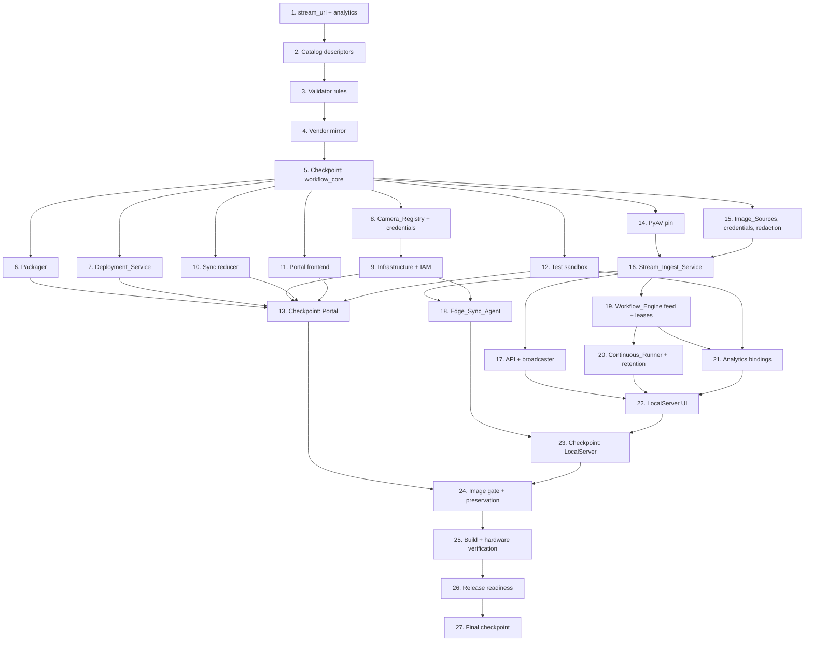

# Implementation Plan: RTSP/RTMP Stream Cameras

## Overview

The work follows the design's data flow:

1. The shared `workflow_core` rules come first: Stream_URL rules, scene analytics, catalog descriptors, and validator rules. They are mirrored into the LocalServer vendor copy because everything downstream consumes them.
2. The Portal surfaces follow: packager, deployment service, camera registry with credentials and IAM, sync reducer, frontend, and test sandbox.
3. Then the LocalServer, bottom up: Image_Sources and the Credential_Store, the Stream_Ingest_Service, API and broadcaster wiring, the Edge_Sync_Agent, the Workflow_Engine feed, the Continuous_Runner and retention, the analytics bindings, and the UI.
4. Last come the image gate, the builds, and hardware verification.

Property tests sit beside the code they validate.

Work on `spec/rtsp-rtmp-stream-cameras`, branched from `integration/all-specs`. On-device changes are committed only after task 25, per the build steering.

These test baselines must stay green throughout. `/usr/bin/python3` has no pytest, so use the venvs. If the working tree is dirty with unrelated work, run hash-pinned gates in a detached worktree.

| Suite | Command |
|---|---|
| workflow_core | `cd edge-cv-portal/backend/layers/workflow_core && ~/.venvs/dda-portal-tests/bin/python -m pytest tests -q -p no:cacheprovider` |
| Portal backend | `cd edge-cv-portal/backend && ~/.venvs/dda-portal-tests/bin/python -m pytest <targeted files> -q -p no:cacheprovider`. Run targeted files only; the full directory takes about 2 hours. |
| Portal frontend | `cd edge-cv-portal/frontend && npx vitest run <files> && npx tsc --noEmit && npm run build` |
| Infrastructure | `cd edge-cv-portal/infrastructure && npm test` |
| Test sandbox | `cd edge-cv-portal/test-sandbox && ~/.venvs/dda-portal-tests/bin/python -m pytest tests -q -p no:cacheprovider -m "not integration"` |
| LocalServer | `PYTHONPATH=src/backend:test/backend-test ~/.venvs/dda-edge-tests/bin/python -m pytest test/backend-test/stream_ingest test/backend-test/camera_sync test/backend-test/workflow_engine -q -p no:cacheprovider`. Run real-GStreamer tests in the `flask-app` container, using the command in the build steering. |
| LocalServer UI | `cd src/frontend && CI=true npx react-scripts test --watchAll=false <files>` |

Property test conventions:

- Python property tests use hypothesis with the project defaults, in files named `test_property_*.py`.
- TypeScript property tests use fast-check with `numRuns: 100`.
- Each property test is tagged `**Feature: rtsp-rtmp-stream-cameras, Property {number}: {property_text}**`.

## Resume Here (handoff, 2026-10-05)
**Tasks 29 and 30 are done and committed (2026-10-05). Resume with task 27.**
- **Committed.** Tasks 29 (findings 21 and 22) and 30 (findings 23, 24 and 25) are committed together on `spec/rtsp-rtmp-stream-cameras` and fast-forwarded to `integration/all-specs`.
  - They were verified on hardware with JP7 `1.0.55` (thor1), JP6 `1.0.77` (Orin), JP5 `1.0.54` (MIC-730) and amd64 `1.0.50` (Dell). The 29.7 and 30.7 OUTCOMEs have the details.
  - The Portal runs the committed `edge-cv-portal/backend`. It was deployed on 2026-10-04 from the identical tree.
- **Devices now.** Each device runs the build above, is healthy, and has no test camera left. The `rtsp-verify-*` continuous workflows still run on all four (logs capped) until the cleanup.
- **Temp access.**
  - The temporary UseCaseAdmin row in "cookies" was removed on 2026-10-05.
  - The temp Cognito user `kiro-rtsp-build-temp` still exists, with only its global DataScientist row. Delete it in the cleanup (`portal_temp_user.py delete`).
- **Next, in order:**
  1. Task 27. Two items need the owner, so 25 and 25.1 stay open until they are settled:
     - 25.1's OBS publisher was never run. Every other test source is in place.
     - Finding 16 is still "Not fixed; owner decision needed": continuous workflows resume before the model components re-provision Triton.
  2. The cleanup list below.
  3. Rotate the Amcrest/Dell password.
**End-to-end Portal check done (2026-10-02, 19:24–20:52Z).**
- **Result.** The check passed on the Orin. A stream camera with credentials, added from the Portal, reached the device and streamed. A stream workflow then packaged, deployed with the camera binding, and ran. Remaining-work item 5 has the details.
- **Two new findings in this spec (25.3).** **Owner decision (2026-10-03): fix both in this spec, before task 27, as task 29.**
  - 21: the first stream camera with credentials can fail for good on an IAM propagation race, and the Portal can neither retry nor remove the failed entry.
  - 22: deleting a stream camera with credentials leaves its secret in Secrets Manager.
- **State.** Nothing from the check is still deployed. The temp Cognito user `kiro-rtsp-build-temp` still exists, with only its global DataScientist row, for the vllm-jp7-engine-lifecycle builds. Delete it when those are done (`portal_temp_user.py delete`).
- **Build servers.** Both arm64 build servers lost SSM on 2026-10-01, because an org StackSet added VPC endpoints without subnets to BuildVpc. A boot-time DNS workaround brought them back on 2026-10-02. The `build-vpc-dns-blackhole` memory has the details.
- **Next, in order:**
  1. Done on 2026-10-05: tasks 29 and 30 passed every hardware check and are committed (see the 2026-10-05 handoff above). 29.1 is done: the design passed its fifth review. 29.2–29.5 are implemented, verified in tests and code-reviewed (APPROVED on 2026-10-04; the task 29 workflow's report, with the on-device verification plan, is `/home/ubuntu/github/DefectDetectionApplication/.agents/tasks/rtsp-findings-21-22/report.md`), but uncommitted, as the build steering requires until the hardware check. 30.1–30.6 (findings 23–25) are implemented and verified in tests (30.6 OUTCOME) and are in the task 30 workflow's code review, but uncommitted, as the build steering requires until the hardware check; next come 30.7, then the commit of tasks 29 and 30, then 27.
  2. Task 27, then the cleanup list.
  3. Rotate the Amcrest/Dell password.

**Handoff to the kiro-cli harness (2026-09-30).** The owner paused interactive work for the day.
- Everything below is committed at `8e8f845`, on both `origin/spec/rtsp-rtmp-stream-cameras` and `origin/integration/all-specs`.
- Findings 16 and 17 became task 28.
- The unattended harness runs 28.1–28.4, one at a time, and skips 25.x, 26.3, 27 and 28.5.
  - Script: `.kiro/harness/run_spec_tasks.sh`, in tmux session `agents`, window `rtsp`.
  - Logs: `~/kiro-cli-runs/rtsp-rtmp-stream-cameras/`.
- The harness commits nothing, builds nothing, and touches no device or AWS account. Its changes stay uncommitted in this worktree.

**Task 28 verified and committed, 26.3 done, and the Portal deployed (2026-10-02). Superseded by the note above.**
- **State.** Task 28 (findings 16, 17 and 18) is verified on all four device types and committed as `2ae3466`. The 26.3 floor is committed on top of it. Both are on `spec/rtsp-rtmp-stream-cameras` and fast-forwarded into `integration/all-specs`. The wip branches are deleted. 28.5 and 26.3 have the details.
- **Verified builds.** All come from the same `src/`. Each passed every in-image gate, the harness stream stage (7 of 7) and a 30-minute soak with no failed run:
  - JP5 `1.0.51` on the MIC-730
  - JP6 `1.0.74` on the Orin
  - JP7 `1.0.52` on thor1
  - amd64 `1.0.47` on the Dell. The amd64 build first needed a test-only fix (28.5).
- **Devices.** All four run those builds, with the `rtsp-verify-*` continuous workflows running and their logs capped. Pause them where the CPU is wanted.
- **New findings, outside this spec (25.3).** Both need the owner's decision on where to fix them:
  - 19: a vLLM engine construction hung and rolled back thor1's first `1.0.52` deployment. The cause is unknown, and the redeploy did not repeat it.
  - 20: an explicit vLLM unload restarts the JP7 backend. The cause is found and reproduced.
- **No temp Cognito user exists.** It was deleted on 2026-10-01 at 12:08Z. This cycle's only build (amd64) ran over SSM, without the Portal.
- **26.3 is done.** The floor holds the versions above, with `arm64_cpu` left out as the owner chose. It went live with the Portal deploy below.
- **Portal deployed (2026-10-02, 13:12–13:29Z, owner-approved)** from `26c892b`, which then was `integration/all-specs`. It shipped this spec's Portal side and the floor (26.3 OUTCOME has the checks).
- **Findings 19 and 20** now have their own bugfix spec, `.kiro/specs/vllm-jp7-engine-lifecycle/` on `spec/vllm-jp7-engine-lifecycle`. It is written but not implemented, and its task 8 needs the owner's two decisions.
- **Next, in order:**
  1. The end-to-end Portal check (remaining-work item 5 below). It needs a Portal user: the temp Cognito user needs the owner's OK.
  2. Task 27, then the cleanup list.
  3. Rotate the Amcrest/Dell password. It was shared in chat again.

**Paused by the owner (2026-10-01, 12:10Z). Superseded by the note above.**
- **State.** `8e8f845` plus task 28 (findings 16, 17 and 18), uncommitted in this worktree. The verification snapshot is `wip/rtsp-rtmp-stream-cameras-task28-verify` (`8331a07`, pushed), with the same `src/` as the worktree. Details are in 28.5.
- **Builds.** All three passed every in-image gate:
  - JP5 `1.0.51`, on the MIC-730: verified.
  - JP6 `1.0.74`, on the Orin: deployed.
  - JP7 `1.0.52`, on thor1: deployed.
  - amd64 is blocked by the in-image test failure described in 28.5.
- **Devices.**
  - MIC-730, Orin and thor1 run the new builds with the `rtsp-verify-*` continuous workflows running, as an unattended soak. Their logs are capped.
  - The Dell runs the old `1.0.46`, with its continuous workflows paused so that its uncapped log does not grow.
- **Stopped and removed.** No build, watcher or harness process is running on this host. The temp Cognito user was deleted at 12:08Z; recreating it for this cycle is already approved by the owner.
- **Next, in order:**
  1. Check that thor1's deployment `e8c4694a` COMPLETED.
  2. Run the harness stage and a 30-minute soak on the Orin and on thor1.
  3. Fix the amd64 in-image test failure, rebuild amd64, deploy it to the Dell (resume its workflows first), and run the same checks.
  4. If a fix touches `src/`, rebuild the JP targets one at a time from the new snapshot, so the commit matches what was verified.
  5. Commit on the spec branch, with the verified devices in the message. Fast-forward `integration/all-specs`, then delete the wip branch and the temp user.
  6. 26.3: the floor versions, plus the `arm64_cpu` amendment the owner chose. Then the Portal deploy (owner approval, never during a build), then 27, then the cleanup list.

**Update (2026-09-30, 19:40Z).**
- The harness finished 28.1–28.4. The suites were rerun independently and are green, apart from the failures that already exist at `8e8f845`.
- Findings 16 and 17 pass on the MIC-730 hot-patch, including a recreated deployment race (28.5).
- The owner approved the temp Cognito user for the rebuilds. They are held for the owner's decision on finding 18, the continuous-run log flood (25.3).

Next, for a human:
1. Review the harness's diff, and the OUTCOME or BLOCKED bullets under 28.1–28.4.
2. Do 28.5: hot-patch the MIC-730, then rebuild and deploy JP7, JP6, JP5 and amd64, one at a time. The temp Cognito user needs the owner's OK. Verify, then commit.
3. Do 26.3 with the new versions, then the Portal deploy (with owner approval, and never during a build), then 27 and the cleanup list below.
4. Rotate the Amcrest/Dell password. It was shared in chat again.

At the owner's request, the work was committed and pushed to `integration/all-specs` before task 25 finished.

**Status at handoff:**
- JP7 has a verified real build, `aws.edgeml.dda.LocalServer.arm64JP7` `1.0.51`. It runs on jetson-thor1 and passed the harness stream stage (7/7) and the Amcrest checks. Its 2-hour soak was left running.
- `1.0.50` is a broken build: it lacks `stream_ingest` (fix 13). Never deploy it.
- JP6 and JP5 still need their real builds.

**Progress on 2026-09-30** (see 25.2, 25.3 and 25.5 for detail):
- **JP6:** `arm64JP6` `1.0.73`, built from `wip/rtsp-rtmp-stream-cameras-jp6-verify` (`26417d1`, fix 14), runs on the Orin. The harness stage passes 7 of 7. Its 2-hour soak and leak watch started at 03:11Z (`results/soak-orin-real-1.0.73.jsonl`, `leak-orin-real-1.0.73.jsonl`).
- **amd64:** `1.0.45` crashed on every H.265 stream on the Dell. Fix 15 was hot-patched first (harness 7 of 7, and a 35-minute soak with no restart and a flat thread count). It was then rebuilt from `wip/rtsp-rtmp-stream-cameras-amd64-verify` (`c8072f1`, fixes 14 and 15) with `~/rtsp-verify/amd64_build_rebuild.sh` over `ssm_run.py` on `i-0ae8ec99335683610`.
- **JP5:** `arm64JP5` `1.0.50`, from job `7c4b0130` (`6b3325f`), runs on the MIC-730. After a restart for finding 16, the harness passes 7 of 7.
- **amd64 update:** `1.0.46`, built from `c8072f1` with fix 15, runs on the Dell, and the harness passes 7 of 7.
- **Soaks:** the MIC-730 and Dell soaks started together at 04:29Z (`results/soak-mic730-real-1.0.50.jsonl`, `soak-dell-real-1.0.46.jsonl`, and their `leak-*` files). Their outages coincide at minute 20, and the Orin soak sees that outage as a second one.
- **Soak results:** the Orin and Dell soaks passed. The MIC-730 soak passed everything except retention, which failed because of finding 17. The Amcrest checks passed on all three devices (25.3).
- **Owner decisions (2026-09-30, second round):**
  - Commit fixes 14 and 15 once the soaks pass.
  - Fix findings 16 and 17 in this spec. The owner approved 17 at the harness handoff.
  - Skip plain `arm64` for now (26.3).
  - The owner supplied the Amcrest credentials in chat. Pass them only through the environment. **They should be rotated**, since they were shared in chat again.
- **Uncommitted in the worktree until their device checks pass:** fix 14 (`Dockerfile.jp6` and its two goldens) and fix 15 (`stream_ingest/pipeline.py` and its tests).
- The temp Cognito user `kiro-rtsp-build-temp` was deleted at 04:33Z, with its registry row and local files, once the JP6 and JP5 portal builds were done. Recreate it only with the owner's OK.
- The Amcrest checks on the Orin, the MIC-730 and the Dell need the camera credentials from the owner. They are never written to a file.

Remaining work, in order:

1. **JP7 soak results: done (2026-09-30), recorded in 25.3.** No restart, no failed run, recovery 36 s after the outage, and a flat `AwsEventLoop` count. The 10 fps workflow dipped from 9.3 to 7.0 runs/s late in the soak and then recovered.
   - **Owner decision (2026-09-30): accepted for release.** Backend RSS still grows about 0.2 KB per run (7 MB/h), an eighth of the pre-native-fix rate. `results/smaps-thor-real-1.0.51.jsonl` holds `/proc/1/smaps` class snapshots of the backend, for anyone who looks into it later.
2. **JP6 real build and verification (25.2, 25.3, 25.5).** The owner approved the temp Cognito user and this build on 2026-09-30.
   - The first attempt, job `33434303` from `6b3325f`, failed after 57 minutes at the vLLM layer's `pip check`, with protobuf 7.36.2 against grpcio-tools 1.71.2. Fix 14 in 25.2 describes it. It is uncommitted in the worktree and snapshotted as `wip/rtsp-rtmp-stream-cameras-jp6-verify` (`26417d1`, pushed).
   - **In flight**: portal job `a2f044fa-ce5d-4185-b0a2-9a26e7e6d879`, submitted 02:36Z on `srv-aac90870` (`i-07c2ca92f3a526c93`), source synced to `26417d1`. The onnxruntime layer came from the cache, and the vLLM layer's checks passed. `~/rtsp-verify/build_watch.py` logs it to `results/build-jp6-3.log`. The temp user `kiro-rtsp-build-temp` was recreated for this build and the JP5 one, and deleted again at 04:33Z.
   - Build `aws.edgeml.dda.LocalServer.arm64JP6` from `integration/all-specs`, or from `spec/rtsp-rtmp-stream-cameras` while it is still equal, on the portal's dedicated server `srv-aac90870-033e-4e9c-9994-29ee895da421` ("JP6 Build Server"). Run the build steering's pre-build checks first.
   - Expect about 2.5–3.5 h, because onnxruntime and the vLLM wheel are built from scratch.
   - Deploy it to the Orin (`ryanorinagxdevkithomelabjp622`), then run the per-device matrix below.
3. **JP5 real build and verification.**
   - Start it only after the JP6 build has finished. `JP5-Build-Server1` is terminated; JP5 builds have succeeded on `srv-aac90870` and as ephemeral jobs.
   - Deploy it to the MIC-730 (`mic730jp513-ryvanlabhome`); this replaces its hot-patch. Its database is already at `c7e3a9f15d42`.
4. **26.3 feature floor: the owner chose (b) on 2026-09-30.** Build and verify the `amd64` LocalServer on the Dell after the JP5 build (one build at a time), and find a path for plain `arm64` (see 26.3). `test_stream_camera_feature_floor_coverage.py` requires the map to cover all six `ARCH_TO_LOCAL_SERVER_COMPONENT` architectures. Only the three Jetson ones can be built and verified here: the portal has no plain `arm64` build target, and there is no x86 test device. The options:
   - (a) Recommended: amend Requirement 9.7 and the coverage test to allow a map of verified architectures only. The gate already rejects every other architecture with `STREAM_CAMERAS_UNSUPPORTED_ARCH`.
   - (b) Build and verify the `amd64` and `arm64` LocalServer variants first.
   - Correction (2026-09-30): there is an amd64 test device. The Dell is the HEALTHY Greengrass core `ryanhomelabdellworkstation` and runs an amd64 LocalServer, and the portal build system has an `amd64` target (`recipe-amd64.yaml`, on an x86_64 build server). So `x86_64` can be verified. Plain `arm64` still has no build target, and `x86_64_nvidia` needs an NVIDIA x86 device (not checked), so the coverage test cannot pass as written either way.

   Until then the map is empty and fails closed: no workflow with stream or scene-analytics nodes can be packaged.
5. **Portal deploy, then an end-to-end Portal check (both done 2026-10-02).**
   - The deploy from `26c892b` shipped this spec's Portal changes: Camera_Registry stream cameras with Secrets Manager credentials, sync, deployments, packaging, IAM and frontend, plus the 26.3 floor.
   - **End-to-end check: passed (2026-10-02, 19:24–20:52Z)** on the Orin (`ryanorinagxdevkithomelabjp622`, JP6 `1.0.74`, use case "cookies"). Every step went through the Portal REST API, as the temp user with a temporary UseCaseAdmin row in "cookies" (owner-approved). Helper: `~/rtsp-verify/e2e_portal_stream.py`, with its state in `e2e/state.json`.
     1. **Camera.** POST `/devices/{thing}/cameras`: type RTSP, the MediaMTX credentialed path `rtsp://192.168.88.237:8554/secure`, and a username and password. The response was 201. The camera synced in 15 s as `cfg-pmr7q3yb`, with credentials configured, and streamed H.264 1920x1080 on the hardware decoder. The first attempt hit finding 21.
     2. **Workflow.** `rtsp_camera_source` → `model_inference` → `capture`. Version 1 failed validation with `MODEL_REF_UNRESOLVED`, because I used the device component's name `yolo-test` instead of the registry's `yolo_test`. Version 2 passed.
     3. **Package.** For `arm64_jp6`: `dda.workflow.dfec035c-5825-450f-bb56-5fac7b831eed` `2.0.0`. The 26.3 floor allowed it, since the Orin runs `1.0.74`.
     4. **Deploy.** With `camera_bindings` `{cam: cfg-pmr7q3yb}`: 201, bindings delivered, no warnings. The Portal merged it into the Orin's deployment: the revision differs from the previous one only by the new component. COMPLETED in 3.5 minutes.
     5. **Run.** Two triggered runs completed in about 1 s each, with output and overlay images. The log shows "Stream frame … from cfg-pmr7q3yb fed to node cam (1920x1080, selected by binding)".
   - **Cleanup.**
     - The Orin is back on its previous components (deployment `f5b17cba`). The workflow directory the removed component left behind is moved aside to `/aws_dda/workflows-removed/`, and its key in the `dda-camera-bindings` shadow is removed.
     - The Portal workflow is deleted. The Portal's workflow delete keeps the Greengrass component and its artifact (existing behavior), so I deleted both by hand.
     - `cfg-pmr7q3yb` is deleted through the Portal. Both secrets are scheduled for deletion, with 7 days to recover them. The temporary UseCaseAdmin row is removed.
     - Still there: the failed entry `portal-be48f52dd98d` (finding 21).
6. **Minor follow-up, not fixed.** On the first start after an upgrade, the Edge_Sync_Agent's first report can run before the database migrations finish. It fails once with `no such column: image_source_configuration.streamSettings`, then succeeds on its backoff retry (seen on thor1, see 25.2).
7. **Task 27**, then the cleanup list below.

**Per-device matrix** (25.3, 25.5). The scripts are in `~/rtsp-verify/` on the build host.
- Access: `ssh_config` reaches thor1 by its public port, and the LAN hosts (Orin `.91`, MIC-730 `.100`, Dell `.237`) through thor1; the Orin's secure tunnel has expired.
- API forwards: `ssh -F ssh_config -O forward -L 15000:localhost:5000 orin` (MIC-730 on 15001, thor1 on 15002).
- Portal access:
  - Run `~/.venvs/dda-portal-tests/bin/python portal_temp_user.py create`, then `... token`. This makes a temp Cognito user with one global DataScientist row. Delete it with `... delete` when done.
  - Submit a build with `OUT=/tmp/x.json python3 portal_api.py POST /builds '{"targets":["JP6"],"execution_mode":"dedicated","server_id":"srv-aac90870-033e-4e9c-9994-29ee895da421","source_ref":"integration/all-specs"}'`, and follow it with `python3 build_watch.py <job-id> <log>`.
  - A portal build cancel does not stop the build on the server (memory `build-cancel-orphan`). Kill the orphan over SSM (`ssm_run.py`) before resubmitting to the same server.
- Deploy: `python3 deploy_localserver.py <thing> <version>` is a dry run; add `--apply` to deploy.
  - It revises the device's current deployment and changes only the LocalServer version.
  - The previous revision is saved under `results/deployments/`; `--restore <file> --apply` puts it back.
  - If a deployment fails, read the backend's own log, `/aws_dda/greengrass/v2/work/aws.edgeml.dda.LocalServer.arm64JP<N>/logs/application.log`, through `docker exec` into the backend container: the component logs are root-only, and a failure is often reported as another component going BROKEN.
- Then run:
  - `install_test_workflows.sh <host> <jp5|jp6|jp7>` file-drops the `rtsp-verify-*` workflows.
  - Harness: `DDA_HARNESS_STREAM_SECRET="ddatest:$(cat ~/rtsp-verify/mediamtx-secure-pass)" DDA_HARNESS_CONFIG=~/rtsp-verify/devices.yaml DDA_HARNESS_DEVICE=<orin-jp6|mic730-jp5|thor-jp7> ~/.venvs/dda-edge-tests/bin/python -m pytest test/on-hardware/harness/stages/test_35_stream_cameras.py -p no:cacheprovider -q`. Copy `test/on-hardware/harness/harness-results/` elsewhere before deleting it.
  - Amcrest: `CAM_USER=... CAM_PASS=... python3 camera_check.py http://localhost:<port> <label> "rtsp://192.168.88.80:554/cam/realmonitor?channel=1&subtype=0" results/amcrest` for the main stream, then again with `subtype=1`. Never write the camera password to a file.
  - 2-hour soak: `soak_sampler.py <host> http://localhost:<port> 125 results/<name>.jsonl --registrations rtsp-verify-cont-people:1,rtsp-verify-cont-people-max:1 --outage-at 20 --outage-s 90 --outage-container dda-src-rtsp-people`, with `leak_watch.py <host> <jp> http://localhost:<port> 150 results/<name>-leak.jsonl` running beside it.
- Pass criteria:
  - no restart beyond the start-up one (RestartCount unchanged)
  - no failed runs
  - the 10 fps workflow steady (about 3 runs/s on JP5 and JP6, about 6 on JP7)
  - recovery after the outage
  - a flat `AwsEventLoop` thread count
  - backend RSS flat after warm-up, which is where the native fix shows (see 25.3)
- The camera-registry shadow should stay small, and deleted test cameras should leave it (fix 10). Check with `aws iot-data get-thing-shadow --thing-name <thing> --shadow-name dda-camera-registry <out-file>`.

**Device state at handoff:**
- thor1 runs the real JP7 build `1.0.51`, with the `rtsp-verify-*` test workflows installed. The continuous ones keep running and publish over MQTT until removed.
- The Orin is stock (`1.0.72`, database at alembic `e9f2a6c31b84`).
- The MIC-730 runs the stock `1.0.49` image. Since 2026-09-29 14:03Z its backend has been hot-patched with the committed code, and its continuous test workflows are running. `results/leak-mic730-fix12.jsonl` records fix 12's effect there.
- The Dell runs MediaMTX and its publishers (`~/dda-mediamtx`, with `start.sh` and `stop.sh`) and has UFW rules commented `dda-rtsp-verify`.

**Cleanup when 25–27 are done:**
- Test workflows and state:
  - On a device that runs a supporting build (thor1 now; the Orin and the MIC-730 after their builds), keep the database. Remove only the `rtsp-verify-*` directories under `/aws_dda/workflows`, the leftover test image sources, and `/dev/shm/dda-continuous`.
  - `restore_stock_state.sh` also downgrades alembic, so use it only on a device that runs a pre-feature build.
- On the Dell: run `~/dda-mediamtx/stop.sh` and delete the `dda-rtsp-verify` UFW rules.
- On thor1: remove the `kiro-rtsp-verify@dda-build-host` key and the `aws` docker-group membership.
- Delete:
  - the `wip/rtsp-rtmp-stream-cameras-f2122-verify` branch, local and on origin: the tasks 29 and 30 verification snapshots `ac74c0b` and `ecb112c`, whose code is in the 2026-10-05 commit. (`wip/rtsp-rtmp-stream-cameras-verify`, the source of the broken `1.0.50` `9e4df80`, is already gone.)
  - the temp Cognito user `kiro-rtsp-build-temp`, recreated for the 2026-10-02 builds and now with only its global DataScientist row: `~/.venvs/dda-portal-tests/bin/python ~/rtsp-verify/portal_temp_user.py delete`, then confirm with `admin-get-user` and a role-table scan
  - the `/tmp` worktrees
  - optionally, the broken `aws.edgeml.dda.LocalServer.arm64JP7` `1.0.50` component version
- Security follow-ups for the owner:
  - thor1's public SSH port still accepts passwords.
  - The device and camera passwords shared in chat should be rotated (the Amcrest and the Dell share one).

## Task Dependency Graph



```json
{
  "waves": [
    { "wave": 1, "tasks": ["1"], "description": "Shared Stream_URL rules and scene analytics in workflow_core" },
    { "wave": 2, "tasks": ["2"], "description": "Stream source and scene analytics descriptors, unified input kinds" },
    { "wave": 3, "tasks": ["3"], "description": "Validator rules V7 (generalized), V11, V12, V13, W3" },
    { "wave": 4, "tasks": ["4"], "description": "Mirror the changed and new workflow_core files into the LocalServer vendor copy" },
    { "wave": 5, "tasks": ["5"], "description": "Checkpoint: workflow_core complete in both trees" },
    { "wave": 6, "tasks": ["6", "7", "8", "10", "11", "12", "14", "15"], "description": "Independent consumers: packager, deployment service, registry and credentials, sync reducer, frontend, sandbox, PyAV pin, device Image_Sources" },
    { "wave": 7, "tasks": ["9", "16"], "description": "Infrastructure and IAM (including the thing-name verification); Stream_Ingest_Service" },
    { "wave": 8, "tasks": ["13", "17", "18", "19"], "description": "Portal checkpoint; device API and broadcaster, Edge_Sync_Agent, Workflow_Engine feed and leases" },
    { "wave": 9, "tasks": ["20", "21"], "description": "Continuous_Runner and retention; analytics bindings on the device" },
    { "wave": 10, "tasks": ["22"], "description": "LocalServer UI" },
    { "wave": 11, "tasks": ["23"], "description": "Checkpoint: LocalServer complete" },
    { "wave": 12, "tasks": ["24"], "description": "Image build gate and preservation baselines" },
    { "wave": 13, "tasks": ["25"], "description": "Sequential JP7, JP6, JP5 builds and hardware verification" },
    { "wave": 14, "tasks": ["26"], "description": "License review, docs, feature floor, commit and integration" },
    { "wave": 15, "tasks": ["27"], "description": "Final checkpoint" }
  ]
}
```

## Tasks

- [x] 1. Implement the shared Stream_URL rules and scene analytics in workflow_core
  - [x] 1.1 Implement `workflow_core/stream_url.py`
    - Constants:
      - `STREAM_URL_PATTERN`
      - `SCHEMES_BY_NODE_TYPE`
      - `SCHEMES_BY_SOURCE_TYPE`
      - `SECRET_QUERY_PARAMETERS`
      - `DEFAULT_PORTS`
    - `StreamUrlProblem`, and the functions `check_stream_url`, `normalize_stream_url`, `redact`, and `compose_connect_url`, as specified in design component 1
    - Problem messages name the offending parameter and never echo its value
    - _Requirements: 1.3, 2.1, 2.2, 6.1, 6.3, 10.6_
    - **OUTCOME**: Added `edge-cv-portal/backend/layers/workflow_core/python/workflow_core/stream_url.py` (stdlib-only, no I/O) with the five constants, `StreamUrlProblem` (codes `invalid_url`, `scheme_not_allowed`, `no_host`, `user_info`, `secret_query_parameter`), `check_stream_url`, `normalize_stream_url`, `redact` and `compose_connect_url`; messages name the scheme/parameter and never echo a value, and the checker is kept no looser than `STREAM_URL_PATTERN` (a non-lowercase scheme, a fragment or whitespace is `invalid_url`, reported after the specific codes so the operator still gets the precise reason). Decisions: `redact` masks the `name=value` form of a Secret_Query_Parameter (optionally quoted, non-empty value only) and leaves `:`-separated prose/JSON alone so secret-free text survives byte for byte — actual stored credentials are covered by the `secrets` literal rule; `compose_connect_url` raises `ValueError` for an unknown protocol or malformed URL and joins a `?`-prefixed secret suffix with `&` when the URL already has a query; `normalize_stream_url` is total and idempotent and also drops an empty port. Added a deterministic companion suite `tests/test_stream_url.py` (81 passed) — the hypothesis properties stay with tasks 1.2/1.3. Full workflow_core suite: 714 passed, 1 skipped, 1 failed, the failure being the pre-existing `test_catalog_content.py::TestCatalogMirrorEquality::test_portal_and_vendor_catalog_init_are_byte_identical` divergence over the portal-only `platforms.py` (both files unmodified vs HEAD, so it fails at HEAD too). Security preservation guards: 4 passed, 3 skipped. No preservation-tracked file was touched; the vendor mirror is deliberately left to task 4.1.

  - [x]* 1.2 Write the property test for the Stream_URL rules
    - **Feature: rtsp-rtmp-stream-cameras, Property 2: Stream_URL rules are sound and complete**
    - **Validates: Requirements 1.3, 2.1, 2.2, 4.2, 5.2, 9.4**
    - Use hypothesis to generate URLs across schemes, hosts (including IPv6), ports, user information, secret and non-secret query names, and unicode
    - Check each verdict against an oracle
    - Check that the catalog regex accepts every URL the checker accepts
    - **OUTCOME**: Added `tests/test_property_stream_url_rules.py` — 8 hypothesis properties, 100 examples each (explicit `@settings(max_examples=100)`, the layer convention, since the shared profile defaults to 25), over a corpus spanning the four stream schemes plus foreign and mixed-case ones, host names, IPv4, bracketed and unbracketed IPv6, unicode hosts/paths/values, default, non-default, empty and malformed ports, user information, secret query names in three cases, look-alike non-secret names (`keyframe`, `passthrough`, `authorization`), fragments and whitespace, plus arbitrary text and the non-string values an API caller can pass. Soundness is checked against `_oracle_code`, a second expression of the requirement text in plain string operations (none of the module's regexes or helpers) that also encodes the design's code precedence; completeness uses a clean-component strategy whose ground truth is the generator's own intent (accepted for its node type, `scheme_not_allowed` for the other, message naming that type's schemes), cross-validated against `urllib.parse` (expected scheme, non-empty host, no username, no secret query parameter; a `ValueError` from the stricter stdlib parser carries no information and is skipped). Also pinned: every accepted URL is accepted by the catalog regex under both the catalog's own `re.search` application and the frontend mirror's JavaScript `test()` reading, `STREAM_URL_PATTERN` accepts exactly the spelled-out Stream_URL shape, and problem messages name the offending parameter but never echo its value or the user information (generated values are `~`-prefixed, a character no message contains, so the assertion cannot fail on a coincidental word). The property found a real defect in task 1.1's module: `check_stream_url` accepted a URL with a trailing newline (`rtsp://cam.local\n`), because Python's `$` matches just before a trailing newline while the JavaScript mirror's `RegExp.test` anchors at the very end — fixed minimally by applying the compiled catalog pattern with `fullmatch` instead of `match` (the pattern text, and hence its JS portability, is unchanged), which also restores the module's documented "no whitespace" rule. Tests: the two Stream_URL files 89 passed; full workflow_core suite 722 passed, 1 skipped, 1 failed, the failure being the pre-existing `test_catalog_content.py::TestCatalogMirrorEquality::test_portal_and_vendor_catalog_init_are_byte_identical` divergence over the portal-only `platforms.py` (`git status` shows no tracked file modified, so it fails identically at HEAD); security preservation guards 4 passed, 3 skipped. Deferred as specified: the TypeScript-port clause of Property 2 belongs to task 11.2, and the redaction property to task 1.3.

  - [x]* 1.3 Write the property test for redaction
    - **Feature: rtsp-rtmp-stream-cameras, Property 3: Redaction removes every secret and preserves secret-free text**
    - **Validates: Requirements 6.1, 6.3**
    - **OUTCOME**: Added `tests/test_property_stream_url_redaction.py` — 8 hypothesis properties, 100 examples each (explicit `@settings(max_examples=100)`, the layer convention, since the shared profile defaults to 25), covering all three clauses: planted secrets never survive (marked user names, passwords, Secret_Query_Parameter values and Credential_Store literals, each with a prefix nothing else in the corpus produces, embedded in credentialed URLs, quoted and unquoted assignments and prose, amid benign log lines and arbitrary text); no residual secret remains anywhere in the output, judged by `_residual_secrets`, a plain-string re-derivation of the three rules (scheme://user@ authority, whole-token `name=value` with a non-mask value, store literal of four characters or more) that uses none of the module's regexes; idempotence, both with and without the store's values; secret-free text returned byte for byte over an independently filtered secret-free corpus; the documented four-character literal threshold; non-string records passing through; and end to end, that a `compose_connect_url` URL redacts to carry neither the raw nor the percent-encoded credential. Two corpus scope limits recorded in the file: generated literals never contain `*` (a literal holding the mask is indistinguishable from masked output) and generated user information stays within the characters RFC 3986 allows there. The property found a real defect in task 1.1's module: masking a Credential_Store literal glued onto a parameter name (`s3c~0api_key=q7v~x`) exposes an assignment the single pass never revisits, so the value leaked *and* the result was not a fixed point — all three failing properties had the same cause. Fixed minimally by applying the three rules (user information first, unchanged order) to a fixed point via `_redact_once` with an `_MAX_REDACTION_PASSES = 8` bound; no rule's behaviour changed otherwise. Tests: the redaction file 8 passed (also green under three extra hypothesis seeds), the three Stream_URL files 97 passed, full workflow_core suite 730 passed, 1 skipped, 1 failed — the failure being the pre-existing `test_catalog_content.py::TestCatalogMirrorEquality::test_portal_and_vendor_catalog_init_are_byte_identical` divergence over the portal-only `platforms.py` (`git status` shows no tracked file modified, so it fails identically at HEAD); security preservation guards 4 passed, 3 skipped. No preservation-tracked file was touched, and the vendor mirror of the fixed `redact` is left to task 4.1 as the plan specifies.

  - [x] 1.4 Implement `workflow_core/analytics/scene.py`
    - `label_key`, `parse_label_list`, `parse_zone`
    - `point_in_polygon`, `box_intersects_polygon`
    - `count_detections`
    - `associate`, with deterministic one-to-one greedy matching
    - `EventGateState` and `step_event_gate`
    - All as specified in design component 4
    - _Requirements: 13.2, 13.3, 13.5, 13.6, 14.2, 14.3, 14.4, 15.2, 15.3_
    - **OUTCOME**: Added `edge-cv-portal/backend/layers/workflow_core/python/workflow_core/analytics/{__init__.py,scene.py}` (stdlib-only, no I/O, nothing raises) with every symbol of design component 4 — `label_key`, `parse_label_list`, `parse_zone`, the boundary-inclusive even-odd `point_in_polygon` and `box_intersects_polygon`, `count_detections`, `associate` with the design's greedy matching (overlap descending, then subject order, then detection order), and the frozen `EventGateState` with `step_event_gate` — plus the catalog/metadata constants (`LABEL_KEY_PATTERN`, zone bounds, `ZONE_RULES`, `EMIT_MODES`, transition/outcome/state names). Spot-checked against the design's run-metadata example: it reproduces `counts {person 3, hardhat 2} / total 5`, `subjects 3 / compliant 2 / violations 1 / missing {hardhat 1} / violating_ids`, and `state active / transition activated / active_since`. Decisions recorded in the module docstring for the oracle authors of tasks 1.5–1.8: the counter and association return the merged run metadata **plus** diagnostic `outcome` (`ok`/`warning`/`error`, per Requirements 13.5/13.6) and `problems` keys, with a `run_metadata()` projection the bindings use so the merged shape is exactly the design's, and an `event_gate_metadata()` helper so the device and sandbox halves of Property 27 cannot drift; `min_confidence` and the zone filter gate **subjects only** in `associate` (the literal reading of 14.2 vs 14.3, so a low-confidence or just-outside hard hat still makes a person compliant); an empty Label_Key is kept as the `""` counts key so `total` always equals the sum of `counts`, and `parse_label_list` reports a *configured* label that normalizes to it; `labels` prefers the detector's spelling and falls back to the `classes` spelling for a zero-filled class; a configured-but-unusable zone (malformed, or unknown frame size) yields an error outcome with an empty result, a missing Detection_List a warning, an empty list `ok`; zone JSON accepts `[[x,y],…]`, `[{"x","y"},…]` and a `{"points":…}` wrapper; `parse_zone`/`parse_label_list` treat blank as "not configured" rather than malformed; non-finite numbers are read as absent; `MAX_CLASS_LIST_ITEMS = 32` was invented for `classes` (Requirement 13.1 sets no cap) reusing the zone bound. Added the deterministic companion suite `tests/test_scene_analytics.py` (105 passed) — the hypothesis properties stay with tasks 1.5–1.8. Full workflow_core suite: 835 passed, 1 skipped, 1 failed, the failure being the pre-existing `test_catalog_content.py::TestCatalogMirrorEquality::test_portal_and_vendor_catalog_init_are_byte_identical` divergence over the portal-only `platforms.py` (`git status` shows no tracked file modified, so it fails identically at HEAD). Security preservation guards 4 passed, 3 skipped; `test_vendored_catalog_mirror.py` 3 passed. No preservation-tracked file was touched, and the vendor mirror of `analytics/scene.py` is deliberately left to task 4.1.

  - [x]* 1.5 Write the property test for label keys
    - **Feature: rtsp-rtmp-stream-cameras, Property 23: Label keys are addressable and idempotent**
    - **Validates: Requirements 13.3, 13.4**
    - Include a round trip through the Condition_Language as a dotted path
    - **OUTCOME**: Added `tests/test_property_label_keys.py` — 12 hypothesis properties, 100 examples each (explicit `@settings(max_examples=100)`, the layer convention, since the shared profile defaults to 25), covering all three clauses of Property 23 plus Requirement 13.4's template half. Soundness is checked against `_oracle_label_key`, a re-derivation of the glossary sentence by character classification and an explicit run collapse (no regex, so it shares nothing with the module's `[^a-z0-9]+` substitution); the shape clause uses `_is_spelled_out_label_key`, a hand reading of `[a-z0-9]+(_[a-z0-9]+)*`, and also pins `LABEL_KEY_PATTERN` itself against that reading so the constant the validator and docs point at cannot drift from the property. The corpus spans curated labels, structured word/separator/unicode assemblies, arbitrary text, separator-only text and the non-strings a JSON `label` can hold; emptiness is asserted to hold exactly when the **lowercased** label has no ASCII letter or digit, which the Kelvin sign (`U+212A`, lowercases to `k`) makes observable. Decision: the addressability round trip goes through the **real** Condition_Language — the device evaluator in `src/backend/workflow_engine/output_bindings.py` (`_tokenize`, `evaluate_condition`, `resolve_field_path`, `render_template`), imported by appending `src/backend` to `sys.path` (appended, never prepended, since that tree carries generically named packages), following this suite's existing precedent of reaching into the device tree for mirror assertions; it is the consumer, not the module under test, so this is a round trip rather than a tautology. End to end: for a generated Detection_List the counter metadata is merged as Requirement 13.3 specifies and then addressed as `counter.<nodeId>.counts.<Label_Key>` — the path must tokenize as one identifier, the count and `total` must compare correctly in conditions, `labels.<Label_Key>` must resolve to a label that normalizes back to the key, zero-filled `classes` entries must be addressable at zero, and `{counter.<nodeId>.counts.<key>}` must render both as a native int and inside a mixed template. The unaddressable empty key is pinned through the module's config-time guard instead: a configured label whose key is empty is reported by `parse_label_list` (what V13 turns into an error), while a blank value stays "not configured". No defect found in task 1.4's `label_key`; the suite was mutation-checked (dropping the `strip("_")`, dropping `.lower()`, and un-collapsing the separator run each fail 6-8 of the 12 properties). Tests: the new file 12 passed (also green on three further runs), with `test_scene_analytics.py` 117 passed; full workflow_core suite 847 passed, 1 skipped, 1 failed — the failure being the pre-existing `test_catalog_content.py::TestCatalogMirrorEquality::test_portal_and_vendor_catalog_init_are_byte_identical` divergence over the portal-only `platforms.py` (`git status` shows no tracked file modified, so it fails identically at HEAD); security preservation guards 4 passed, 3 skipped. No preservation-tracked file was touched and no production code changed.

  - [x]* 1.6 Write the property test for the counter
    - **Feature: rtsp-rtmp-stream-cameras, Property 24: Counter correctness**
    - **Validates: Requirements 13.2, 13.3, 13.5**
    - Use hypothesis to generate Detection_Lists, zones, zone rules, class lists, and frame sizes, and compare against a reference oracle
    - **OUTCOME**: Added `tests/test_property_detection_counter.py` — 15 hypothesis properties, 100 examples each (explicit `@settings(max_examples=100)`, the layer convention, since the shared profile defaults to 25). The oracle equality is checked twice, against two geometry oracles that share no code with the module: rectangular zones are judged by plain interval comparison (no ray casting), convex zones by a half-plane sign test for `center` and the separating axis theorem for `overlap` (instead of the module's vertex-in-box / corner-in-polygon / edge-crossing test), both exactly equivalent for convex polygons; grouping goes through a re-derivation of the Label_Key glossary sentence by character classification. Both oracle properties compare the **ordered** `counts` items, not just the mapping, since device/sandbox parity (Requirement 13.9) is a byte-level promise. Decisions: box coordinates are drawn from odd multiples of 1/160 of a frame dimension and zone coordinates from multiples of 1/20, so no box edge and no box center can ever land on a rectangular zone edge (separation ≥ width/160 pixels, far above the module's relative boundary tolerance) and no example is discarded; convex zones get an ellipse-vertex corpus with an assumed decision margin instead, and the exact boundary-inclusive behaviour is pinned separately by a dyadic-coordinate property (zone coords 0.25/0.5, power-of-two frame sizes, centers placed exactly on each corner and edge midpoint). Zones and class lists are generated as structured values and handed to the counter in every parameter spelling (`[[x,y]]` JSON, `{"x","y"}` objects, a `points` wrapper, a pre-parsed list; comma-joined text or an already-split list) while the oracle consumes the structure, so parameter parsing is not re-implemented — `parse_zone`/`parse_label_list` keep their deterministic suite, and the malformed cases are covered by outcome properties instead. Beyond the oracle: `total == sum(counts)`, `labels` covering exactly the keys of `counts` with the detector's spelling preferred, zero-filling of every configured class (including when there is no Detection_List), monotonicity in `min_confidence`, `center` never looser than `overlap`, invariance under a power-of-two rescaling of frame and boxes, the Requirement 13.5 warning for a missing Detection_List versus `ok` for an empty one, the Requirement 13.6 error for a zone with unknown frame dimensions and for a malformed zone, an unknown `zone_rule` falling back to the catalog default, numeric text read as numbers, and totality/determinism plus `run_metadata` projecting exactly `("counts","total","labels")`. No defect was found in task 1.4's `count_detections`; the one mismatch the run surfaced was in my own oracle (a `classes` entry's surrounding whitespace is trimmed before it becomes the stored spelling), so no production code changed. The suite was mutation-checked: ten mutations of `scene.py` (confidence `>=`→`>`, center rule using the box corner, no zero-fill, an unusable zone no longer emptying the entries, `overlap` accepting everything, the default rule flipped to `overlap`, `labels` preferring the `classes` spelling, the missing-list warning raised to an error, `counts` sorted alphabetically, the zone left unscaled) each fail 1–5 properties, and `scene.py` was byte-restored afterwards. Tests: the new file 15 passed (stable over five runs), with `test_scene_analytics.py` and `test_property_label_keys.py` 132 passed; full workflow_core suite 862 passed, 1 skipped, 1 failed — the failure being the pre-existing `test_catalog_content.py::TestCatalogMirrorEquality::test_portal_and_vendor_catalog_init_are_byte_identical` divergence over the portal-only `platforms.py` (`git status` shows no tracked file modified, so it fails identically at HEAD); security preservation guards 4 passed, 3 skipped. No preservation-tracked file was touched.

  - [x]* 1.7 Write the property test for association
    - **Feature: rtsp-rtmp-stream-cameras, Property 25: Association correctness**
    - **Validates: Requirements 14.2, 14.3, 14.4**
    - **OUTCOME**: Added `tests/test_property_association.py` — 20 hypothesis properties, 100 examples each (explicit `@settings(max_examples=100)`, the layer convention, since the shared profile defaults to 25), covering every clause of Property 25. Oracle equality is checked three times (no zone, rectangular zone, convex zone) against `_oracle_associate`, which shares no code with the module: the greedy rule is formulated as an iterated arg-max over still-available pairs rather than a single sorted walk, the overlap rule is re-derived by clipping the candidate box to the subject box, subject selection goes through two independent zone oracles (plain interval comparison for rectangles, a half-plane sign test for convex zones — neither reproduces the module's ray casting), and grouping through a character-classification re-derivation of the Label_Key sentence; the ordered items of `missing` and the ordered `violating_ids` are compared, not just their contents, since device/sandbox parity (Requirement 14.6) is a byte-level promise. Beyond the oracle: the one-to-one counting bounds per class, the "one hard hat cannot make two people compliant" scarcity case, the larger-overlap preference and its subject-order tie-break, both directions of the `min_overlap` gate, monotonicity in `min_overlap`, `compliant + violations == subjects`, `missing` bracketing `violations`, the violating-id list, determinism, Requirement 14.2's subject gating (plus the module's documented decision that required-class detections are *not* gated by confidence or the zone), the Requirement 14.6 outcomes (missing Detection_List → warning, unusable or malformed zone → error, missing `subject_class`/`required_classes` → error), totality on arbitrary junk with `run_metadata` projecting exactly `ASSOCIATION_METADATA_KEYS`, numeric text read as numbers, and invariance under a power-of-two rescaling. Decisions: boxes are generated on a grid of 1/16 of each frame dimension and clustered around scene anchors, so overlaps are exact fractions that land on the generated thresholds and the inclusive `>=` of Requirement 14.3 is genuinely exercised; the oracle performs the overlap arithmetic in the same order as the module so those exact-threshold pairs are decided identically; `min_overlap` stays inside the catalog's declared 0.05–1 range (at 0 the inclusive comparison would pair disjoint boxes, which the descriptor does not allow); `subject_class` is allowed to appear in `required_classes`, so a subject matching itself with overlap 1.0 is in the corpus; rectangular zones need no margin assumption (both module and oracle are boundary-inclusive) while convex zones assume a decision margin, as the counter's property test does. No defect was found in task 1.4's `associate`, so no production code changed. The suite was mutation-checked: 13 mutations of `scene.py` (overlap `>=`→`>`, a candidate reused across subjects, smaller overlaps preferred, candidates gated by confidence, `missing` counting matched instead of unmatched subjects, `violating_ids` listing the compliant subjects, the zone testing a box corner instead of the center, the subject confidence gate dropped, the overlap divided by the subject's area, a missing Detection_List raised to an error, the tie-break order swapped, `all`→`any` for compliance, the subject zone gate dropped) each fail 1–10 properties, and `scene.py` was restored byte-identically afterwards (sha256 verified, `git status` shows no tracked file modified). Tests: the new file 20 passed, stable over three extra hypothesis seeds and over a 24,000-example run (a 1200-example copy, since explicit `@settings` overrides the `ci` profile); full workflow_core suite 882 passed, 1 skipped, 1 failed — the failure being the pre-existing `test_catalog_content.py::TestCatalogMirrorEquality::test_portal_and_vendor_catalog_init_are_byte_identical` divergence over the portal-only `platforms.py`; security preservation guards 4 passed, 3 skipped. No preservation-tracked file was touched.

  - [x]* 1.8 Write the property test for the event gate automaton
    - **Feature: rtsp-rtmp-stream-cameras, Property 26: Event gate automaton**
    - **Validates: Requirements 15.2, 15.3**
    - Use sequences of true, false, and unevaluable outcomes with timestamps, under every `emit` mode, compared against a reference automaton
    - **OUTCOME**: Added `tests/test_property_event_gate.py` — 24 hypothesis properties, 100 examples each (explicit `@settings(max_examples=100)`, the layer convention, since the shared profile defaults to 25). Oracle equality is checked over the **whole trace** (state, `passed`, `transition` per run) against `_oracle_trace`, which shares no code with the module: where `step_event_gate` carries incremental counters, the oracle decides each run by slicing the verdict sequence (activate when inactive and the last `activate_after` verdicts are all true, clear when active and the last `clear_after` are all false) and recomputes the consecutive counts as the prefix's trailing run, and it decides a `while_active` emit from the timestamps of the passes since the current activation rather than from a carried `last_emit_ms`; it is run twice, once with a non-decreasing clock and once with backwards jumps (the module's documented choice that a backwards jump may delay an emit). Beyond the oracle: activation and clearing at the *exact* run for a generated threshold, trace-wide invariants for both transitions (`active_since` is the activating run's timestamp and never moves while active, `None` while inactive), `None`→`False` rewriting leaving the trace byte-identical, arbitrary truthy/falsy non-bool outcomes reading as their truth value, the three emit rules read directly off Requirement 15.3 (including "only an active or clearing run can pass" across all modes and the rate-limit clauses: activations always emit, suppressed active runs are inside the window), emit mode never moving the automaton, invariance under a shift of the clock and independence of the automaton from the timestamps, resumability from the carried state (which exercises every state the module can produce as a start state), the Requirement 15.5 inactive restart, determinism over the serialized metadata, the Requirement 15.4 metadata shape as JSON, totality on malformed input, and the documented fallbacks for a malformed threshold and an unknown `emit`. The property found a real totality defect in task 1.4's module: `now_ms` was used raw, so a non-integer timestamp was stored into `active_since_ms`/`last_emit_ms` (leaking a float or a string into `event.<nodeId>.active_since`) and, once a previous emit existed, `while_active` with an interval raised `TypeError` on `now_ms - last_emit_ms` — breaking the module's "nothing raises" contract. Fixed minimally by coercing once with the module's own helper (`stamp = _as_int(now_ms, 0)`) and using `stamp` throughout, which is a no-op for the int timestamps every caller passes and keeps the metadata JSON-typed; the docstring records it. Decision/scope: the oracle reproduces the `last_emit_ms` *field* with the module's assignment order (a state comparison must), while the emit *decision* it feeds is formulated independently; the malformed-input corpus replaces the `state` argument wholesale but does not fabricate an `EventGateState` with ill-typed fields, since only this module produces them. The suite was mutation-checked: 14 mutations of `scene.py` (both thresholds `>=`→`>`, `None` counting as true, the activation `not active` guard dropped, each counter no longer resetting, `on_change` passing only activations, `while_active` also passing the clearing run, the interval comparison `>=`→`>`, a clear keeping the last emit time, `active_since` refreshed every run, the unknown-`emit` fallback changed, `now_ms` left uncoerced) — 13 fail 1+ properties; the 14th (dropping `max(1, …)` on the activate threshold) is behaviourally equivalent, because the branch also requires `verdict`, so a threshold of 0 or below still activates on the first true, and `scene.py` was restored byte-identically after each (sha256 verified). Tests: the new file 24 passed, stable over three extra hypothesis seeds and a 1200-example copy (28,800 examples, 71 s); with `test_scene_analytics.py` 129 passed; full workflow_core suite 906 passed, 1 skipped, 1 failed — the failure being the pre-existing `test_catalog_content.py::TestCatalogMirrorEquality::test_portal_and_vendor_catalog_init_are_byte_identical` divergence over the portal-only `platforms.py` (`git status` shows no tracked file modified, so it fails identically at HEAD); security preservation guards 4 passed, 3 skipped. No preservation-tracked file was touched, and the vendor mirror of the fixed `step_event_gate` remains task 4.1's.

- [x] 2. Add the new node types to the Node_Catalog
  - [x] 2.1 Add the stream source descriptors and unified input kinds
    - In `edge-cv-portal/backend/layers/workflow_core/python/workflow_core/catalog/nodes.py`, add:
      - The `_STREAM_SOURCE_PARAMETERS` tuple, with the parameters, constraints, `depends_on="processing_mode=continuous"` gating, descriptions, and examples of Requirement 1.2
      - `RTSP_CAMERA_SOURCE` and `RTMP_STREAM_SOURCE`, with the appsrc device mappings and the dataset sim stub
      - The `rtsp_camera` and `rtmp_stream` entries in `SOURCE_KIND_TO_SOURCE_TYPE` and `_UNIFIED_SOURCE_DESCRIPTORS`
    - Append both descriptors to `NODE_CATALOG` after `METADATA`
    - _Requirements: 1.1, 1.2, 1.3, 1.4, 1.6, 1.7_
    - **OUTCOME**: `catalog/nodes.py` now carries the `_STREAM_SOURCE_PARAMETERS` family (`url` with `min_length`/`max_length`/`regex=STREAM_URL_PATTERN` imported from `..stream_url`, `processing_mode`, `frames_per_second`, `max_frame_age_ms`, `keep_recent_runs`, `keep_notable_runs`, with the three continuous-only parameters gated `depends_on="processing_mode=continuous"` and every parameter carrying a description plus constraint-satisfying examples), `RTSP_CAMERA_SOURCE` ("RTSP Camera") and `RTMP_STREAM_SOURCE` ("RTMP Stream") — both input-category, one `activation` EventSignal in and one `out` VideoFrames out, `hardware_dependent=True`, `parameters=list(_STREAM_SOURCE_PARAMETERS)` over the *same* descriptor objects (verified by identity), and the shared `_stream_source_mappings()` = `_same_on_device_archs(appsrc name=appsrc_{nodeId} ! videoconvert, plugin_dependencies=["app","videoconvertscale"])` + `_dataset_fed_sim_source()` with no parameter in any element argument — plus the `rtsp_camera`/`rtmp_stream` entries appended last to `SOURCE_KIND_TO_SOURCE_TYPE` and `_UNIFIED_SOURCE_DESCRIPTORS`, and both descriptors appended to `NODE_CATALOG` after `METADATA` with the "Appended (additive — rtsp-rtmp-stream-cameras Requirement 1.7)" comment. Decisions: the descriptors are *defined* just above the unified-input section (they must exist before `_UNIFIED_SOURCE_DESCRIPTORS` is built at import time) while their catalog *position* is last, as the design requires; the mappings go through a small `_stream_source_mappings()` helper so the two types cannot drift; nothing was added to `catalog/__init__.py`, which exports no individual descriptor. Additivity was verified directly against `tests/catalog_baseline.json`: no descriptor dropped, and the only pre-existing entry that moves is `unified_input`, where params[1:] are a byte-identical prefix, `source_kind`'s non-constraint fields are unchanged and its enum `values` list is extended by appending — exactly what Requirement 1.6 asks for; `INERT_ACTIVATION_TYPE_IDS` picks up both stream types automatically from the map. Tests: full workflow_core suite 898 passed, 1 skipped, 9 failed; device `test/backend-test/workflow_engine` 1603 passed, 9 skipped, 1 failed; portal-backend catalog consumers (`test_merged_catalog_consumers.py`, `test_property_catalog_membership.py`, `test_camera_source_removal_completeness.py`, `test_custom_node_types.py`) 50 passed and four further catalog-touching files 79 passed; test-sandbox 195 passed; security preservation guards 4 passed, 3 skipped; no preservation-tracked file touched. Of the 10 failures, one is the pre-existing `test_catalog_content.py::TestCatalogMirrorEquality::test_portal_and_vendor_catalog_init_are_byte_identical` (portal-only `platforms.py`), two are the `nodes.py` mirror assertions that **task 4.1** owns (`test_catalog_content.py::...nodes_are_byte_identical` and `test/backend-test/workflow_engine/test_vendored_catalog_mirror.py::...[nodes.py]` — the vendor copy is deliberately left alone, since 4.1 must also carry `stream_url.py`), and the remaining seven are the catalog baselines and pinned expectations that **task 2.3** owns: the three `test_bug_catalog_preservation.py` baseline assertions, `test_catalog_modbus_write.py::test_baseline_delta_scoped_to_the_new_descriptor`, `test_catalog_content.py::TestCatalogCoverage::test_catalog_contains_exactly_the_expected_types`, `test_catalog_custom_python_source.py::TestCatalogDiscipline::test_not_a_unified_input_source_kind` (pins `SOURCE_KIND_TO_SOURCE_TYPE` to a four-entry literal) and `test_unified_input_descriptor.py::TestUnifiedInputIdentity::test_source_kind_enum_parameterization` (pins the `source_kind` enum values). Note for 2.3: regenerating `catalog_baseline.json` must also cover the intentional `unified_input` delta, the way the `llm_inference`/`mqtt_publish` deltas are scoped today.

  - [x] 2.2 Add the scene analytics descriptors
    - Add `DETECTION_COUNTER`, `OBJECT_ASSOCIATION`, and `EVENT_GATE`, with the parameters of Requirements 13.1, 14.1, and 15.1
    - `event_gate.condition` reuses `CONDITION_LANGUAGE_DESCRIPTION` and `CONDITION_EXAMPLES`
    - Mappings use `_same_on_all_archs(executor_binding=<type id>)`
    - Append all three to `NODE_CATALOG`
    - _Requirements: 13.1, 14.1, 15.1_
    - **OUTCOME**: `catalog/nodes.py` now carries `DETECTION_COUNTER` ("Detection Counter"), `OBJECT_ASSOCIATION` ("Object Association") and `EVENT_GATE` ("Event Gate") — all three post_processing, one `in`/`out` InferenceMeta port pair, `hardware_dependent=False`, `mappings=_same_on_all_archs(executor_binding=<type id>)`, with exactly the parameters of Requirements 13.1 (`classes`, `min_confidence` 0-1 default 0, `zone`, `zone_rule` center|overlap default center), 14.1 (`subject_class` and `required_classes` required, `min_overlap` 0.05-1 default 0.5, `min_confidence`, `zone`) and 15.1 (`condition` required reusing `CONDITION_LANGUAGE_DESCRIPTION` + `list(CONDITION_EXAMPLES)`, `activate_after`/`clear_after` 1-1000 default 3, `emit` default on_activate, `repeat_interval_ms` 0-86400000 default 0 gated `depends_on="emit=while_active"`), every parameter carrying a description and constraint-satisfying examples; all three are appended to `NODE_CATALOG` after the stream sources with the "Appended (additive — rtsp-rtmp-stream-cameras Requirements 13.1, 14.1, 15.1)" comment. Decisions: the enum value sets and numeric defaults are imported from `..analytics.scene` (`ZONE_RULES`, `EMIT_MODES`, `DEFAULT_ZONE_RULE`, `DEFAULT_MIN_OVERLAP`, `DEFAULT_EMIT`, `DEFAULT_ACTIVATE_AFTER`, `DEFAULT_CLEAR_AFTER`) so the catalog and the shared implementation cannot drift, the same way 2.1 imported `STREAM_URL_PATTERN` (scene.py is stdlib-only, so no import cycle; task 4.1 mirrors `analytics/` anyway); the two `zone` parameters share one description/example constant but stay separate descriptor objects (these nodes are not unified-input members, so nothing dedupes them, and the association `zone` gates subjects while the counter `zone` gates counted detections); `classes`/`zone` are optional strings defaulting to `""` with no extra length constraints, since the item/point caps and JSON shape are validator rules (V13, task 3.2) over `analytics.scene.parse_zone`/`parse_label_list`; `zone_rule` carries no `depends_on` because the bare-name form is documented for bool parameters only; the `condition` description prefixes the shared text with the analytics dotted-path examples. Verified by a throwaway smoke test (since deleted): a folder→inference→counter→association→gate→capture graph validates with no findings and compiles on all seven architectures into `detection_counter`/`object_association`/`event_gate` executor bindings with the rendered parameters and empty `pluginDependencies`. Tests: full workflow_core suite 898 passed, 1 skipped, 9 failed — byte-for-byte the same nine failures and the same pass count as at the end of task 2.1 (the pre-existing `platforms.py` mirror divergence, the `nodes.py` mirror assertion owned by task 4.1, and the seven catalog baseline/pinned-expectation assertions owned by task 2.3); device `test/backend-test/workflow_engine` 1603 passed, 9 skipped, 1 failed (the same `test_vendored_catalog_mirror.py[nodes.py]`, task 4.1); portal-backend catalog consumers 50 passed plus three further catalog-touching files 65 passed; test-sandbox 195 passed; security preservation guards 4 passed, 3 skipped. No preservation-tracked file was touched. Note for 2.3: `catalog_baseline.json` and the expected-type-id list now need three more descriptors beyond 2.1's two, and `TestCatalogCoverage` must gain `detection_counter`, `object_association`, `event_gate`.

  - [x] 2.3 Update the catalog content tests and baselines
    - Update `tests/catalog_baseline.json`, the expected type ids, and the order of the unified parameter union
    - Assert that every pre-existing descriptor keeps its position and content
    - _Requirements: 1.7, 18.1_
    - **OUTCOME**: Regenerated `tests/catalog_baseline.json` **scoped to six entries** — the five appended descriptors plus the additively-extended `unified_input` — leaving every other recording byte-identical; `mqtt_publish` was deliberately left as the stale pre-Bug-2 recording that `test_bug_catalog_preservation.py::TestMqttPublishPreservation` compares against field by field (regenerating it would invert that suite's documented assertions), and the intentional regeneration is now documented in that file's baseline-maintenance comment the way the four prior features documented theirs. The file keeps its exact serialization convention (`json.dumps(..., indent=2, sort_keys=True, ensure_ascii=False)` + trailing newline), verified by round-tripping the untouched entries. Updated the three pinned expectations: `test_catalog_content.py::TestCatalogCoverage.EXPECTED_TYPE_IDS` gained the five new type ids, `test_catalog_custom_python_source.py::test_not_a_unified_input_source_kind`'s whole-map literal gained the two stream kinds (keeping its real intent — `custom_python_source` appears nowhere — and adding a prefix assertion that the four original kinds keep their position), and `test_unified_input_descriptor.py::test_source_kind_enum_parameterization` now asserts the four original values as an unchanged prefix plus the two appended ones. Added `tests/test_catalog_stream_and_analytics.py` (31 tests): additivity — the 26-entry pre-feature order recorded as a literal must be an unchanged prefix of `NODE_CATALOG`, the five new ids follow `metadata` in the design's order, and **every** pre-existing descriptor's `dataclasses.asdict` equals the baseline byte for byte (`mqtt_publish` excluded for the documented stale-recording reason, with the exclusion stated in the file); the `unified_input` delta is proved append-only (map items in order, enum values mirroring the map with type/required/default unchanged from the recording, the union's pre-feature 7-name prefix byte-identical, and the appended tail exactly `_STREAM_SOURCE_PARAMETERS` required-relaxed); plus content pins for the five new descriptors (identity/ports/`hardware_dependent`, the shared parameter family asserted **object-for-object** between the two stream types, the continuous-only `depends_on` gating, the appsrc device chains and dataset-fed sim stub, no parameter in any element argument, every declared plugin dependency being LocalServer-bundled per arch, `url`'s constraint accepting the four stream schemes and rejecting foreign schemes / host-less URLs / embedded user information via `check_parameter_value`, the analytics parameter shapes against the `analytics.scene` constants, and `event_gate.condition` reusing `CONDITION_LANGUAGE_DESCRIPTION`/`CONDITION_EXAMPLES`). Decisions: no generator script was added (the tree has never carried one — the regeneration was a one-off scoped script); `PRE_FEATURE_TYPE_ID_ORDER` and the pre-feature union are literals so a reorder fails loudly rather than being silently re-recorded. Mutation-checked: reordering the append, renaming a pre-existing descriptor, and inserting a source kind before `folder` each fail 1-3 of the new tests, and `nodes.py` was restored byte-identically (sha256 verified). Tests: full workflow_core suite **936 passed, 1 skipped, 2 failed** (up from 898/9 — all seven failures this task owned are fixed); the two remaining are the `nodes.py` mirror assertion owned by **task 4.1** and the pre-existing `catalog/__init__.py` mirror divergence over the portal-only `platforms.py` (neither file is modified). Device `test/backend-test/workflow_engine` 1603 passed, 9 skipped, 1 failed (the same task-4.1 `nodes.py` mirror); portal-backend catalog consumers 50 passed; security preservation guards 4 passed, 3 skipped. No production code and no preservation-tracked file was touched.

  - [x]* 2.4 Write the property test for stream node round trip and compilation
    - **Feature: rtsp-rtmp-stream-cameras, Property 1: Stream node definitions round-trip and compile through generic catalog paths**
    - **Validates: Requirements 1.4, 1.5**
    - Extend `tests/generators.py` with the stream node types and the unified stream kinds
    - **OUTCOME**: Extended `tests/generators.py` with the stream family — `STREAM_SOURCE_TYPES`, `STREAM_SOURCE_KINDS`, `stream_url_strategy` (schemes × DNS/IPv4/bracketed-IPv6/unicode hosts × absent/default/non-default ports × absent/root/deep/unicode paths × non-secret queries), `StreamFeed`/`StreamGraph` and `stream_graph_strategy` (valid graphs with N stream feeds, each spelled either as `rtsp_camera_source`/`rtmp_stream_source` or as a `unified_input` node carrying the matching stream kind, each driving its own `capture` sink, plus optional non-frame-feed inputs, intermediates and outputs, with the existing hub mode) — and a Stream_URL interception in `node_parameters_strategy`, keyed on the `STREAM_URL_PATTERN` constraint rather than the parameter name, which supplies a node-type-correct URL instead of `st.from_regex` and never omits it. Added `tests/test_property_stream_roundtrip_compilation.py`: 8 properties, 100 examples each (explicit `@settings(max_examples=100)`, the layer convention, since the shared profile defaults to 25) — corpus validity (no error findings, every URL accepted by `check_stream_url` for its node type and by the catalog constraint), the round trip on single-feed and on 2-3-feed documents (parse equivalence both ways, byte-identical re-serialization, every stream node's type and parameters — the URL included — surviving unchanged), the appsrc chain rendered **exactly** as `appsrc name=appsrc_<nodeId> ! videoconvert` with `{nodeId}` resolved uniquely on all six device architectures and the mapping's declared plugin dependencies pinned to the bundled `app`/`videoconvertscale` (hence absent from the compiled document), no parameter in any element argument (the feed's own args whitelisted, and the URL searched for document-wide, in both normal and simulation compiles), the dataset-fed sim stub on `sim` and under `simulation=True`, unified stream kinds compiling to a document identical to the hand-written source type, and a round-tripped definition validating and compiling identically. Decisions: the stream types are deliberately **not** added to the shared `_VIDEO_INPUT_TYPES`/`_INPUT_TYPES` tuples (they are Frame_Feed_Source_Nodes, so injecting them into `graph_strategy` would break Requirement 2.7's pre-feature-findings preservation tests and make previously-valid graphs V7-invalid once task 3.1 lands) — they are reached through the opt-in strategy, the shape `modbus_write_graph_strategy` already uses; and the compile-side clauses are scoped to **single-feed** documents, since a multi-feed document stops being a "valid workflow definition" at task 3.1 (its finding set is Property 4's, task 3.3), with the validation-independent round trip still exercised on multi-feed documents. Mutation-checked: eight mutations of `nodes.py` (appsrc name losing `{nodeId}`, `videoconvert` dropped, the sim stub dropped or replaced by a recording stub, `{url}` injected into an element argument, `rtmp_stream` expanding to the wrong source, an unbundled plugin declared) each fail 1-3 properties, and removing the generator's URL fixup fails all 8; `nodes.py` and `generators.py` were restored byte-identically afterwards (sha256 verified). **Incident and recovery, stated for the record**: during that mutation checking a `git checkout -- nodes.py` (used to undo a mutation) discarded tasks 2.1/2.2's *uncommitted* descriptors. They were reconstructed from `tests/catalog_baseline.json` plus task 2.3's 31-test content suite and the recorded outcomes; the reconstruction is verified content-exact — every one of the five new descriptors' and `unified_input`'s `dataclasses.asdict` equals the baseline byte for byte, `test_catalog_stream_and_analytics.py` is 31/31 green, and the suite totals match what task 2.3 reported — but the *source text* of the three analytics descriptors is a faithful rewrite rather than the original bytes (comments and constant layout may differ), and `nodes.py` remains an uncommitted working-tree change. Tests: the new file 8 passed; full workflow_core suite **944 passed, 1 skipped, 2 failed** (936 + the 8 new; the two failures are the `nodes.py` mirror assertion owned by **task 4.1** and the pre-existing `catalog/__init__.py` mirror divergence over the portal-only `platforms.py`); device `test/backend-test/workflow_engine` 1603 passed, 9 skipped, 1 failed (the same task-4.1 mirror); portal-backend catalog consumers 50 passed; test-sandbox 195 passed; security preservation guards 4 passed, 3 skipped. No preservation-tracked file was touched.

- [x] 3. Add the validator rules
  - [x] 3.1 Generalize V7 and add the stream types to the frame-feed sets
    - In `workflow_core/validator/checks.py`, add both stream types to `COEXISTENCE_SINGLETON_TYPES` and `FRAME_FEED_SOURCE_TYPES`
    - Change the mixed rule to `len(FRAME_FEED_SOURCE_TYPES & set(by_type)) >= 2`
    - _Requirements: 2.4, 2.7_
    - **OUTCOME**: `validator/checks.py` now treats both Stream_Camera_Source types as Frame_Feed_Source_Nodes: `rtsp_camera_source` and `rtmp_stream_source` were appended to `COEXISTENCE_SINGLETON_TYPES` (sharing the custom-python source's "the single-frame appsrc feed serves exactly one frame-feed source per workflow" reason) and to `FRAME_FEED_SOURCE_TYPES`, and the mixed rule became `frame_feed_types_present = FRAME_FEED_SOURCE_TYPES & set(by_type)` with `len(...) >= 2`. The member-id gather had to be re-scoped to `frame_feed_types_present` as well — with four members the old `for node_type in FRAME_FEED_SOURCE_TYPES: by_type[node_type]` would `KeyError` on any absent type — and the V7 comment/docstring were updated to name all four types and to record why the change is finding-identical for pre-feature graphs (with two members, "two or more distinct types present" is the same test as "both present", Requirement 2.7). No other rule was touched: V9/V11/V12/V13/W3 and the unified-node handling are task 3.2's, the frontend `inlineChecks.ts` mirror is task 11.1's (backend and inline checks therefore diverge on this rule until then), and the LocalServer vendor copy of `checks.py` is deliberately left to task 4.1. Verified by a throwaway smoke check (since deleted) that every combination behaves per Requirement 2.4 — one finding per frame-feed node naming every member: 1 stream node → 0 findings, 2 same-type stream nodes → 2 singleton-form findings naming both, rtsp+rtmp / rtsp+aravis → 2 union-form findings, all four types → 4 findings naming all four, and the pre-feature aravis+custom_python and 2×aravis cases byte-identical to before. Tests: full workflow_core suite **943 passed, 1 skipped, 3 failed**; the three failures are all mirror-equality assertions owned by other tasks — the newly-diverged `test_validator_bedrock_inspection.py::TestVendoredMirrorByteIdentity::test_validator_checks_mirror_is_byte_identical` (this change; task 4.1 copies `validator/checks.py`), `test_catalog_content.py::...nodes_are_byte_identical` (task 2.1's `nodes.py`, also task 4.1) and the pre-existing `...init_are_byte_identical` (portal-only `platforms.py`). Device `test/backend-test/workflow_engine` 1603 passed, 9 skipped, 1 failed (the same task-4.1 `nodes.py` mirror; `test_vendored_catalog_mirror.py` does not cover `checks.py` until task 4.2); `test/backend-test/portal_builds/test_generation_gate_code_mapping.py` + `test_gate_decision_function.py` 3 passed; portal-backend `test_property_aravis_binding_points.py` + `test_property_python_source_packaging.py` 2 passed; security preservation guards 4 passed, 3 skipped. No preservation-tracked file was touched.

  - [x] 3.2 Add V11, V12, V13, and W3
    - Add `V11_STREAM_URL`
    - Add `V12_CONTINUOUS_ACTIVATION`, and make V9 skip continuous stream nodes
    - Add `V13_ANALYTICS_CONFIG_INVALID` and `W3_ANALYTICS_NO_DETECTOR`
    - Evaluate unified nodes through their effective `source_kind`
    - Re-export the new codes from `validator/__init__.py`
    - _Requirements: 2.1, 2.2, 2.3, 2.5, 13.7, 13.8, 14.6_
    - **OUTCOME**: `validator/checks.py` now carries the four rules, each firing only on the new node types so a graph without them keeps its exact pre-feature findings (Requirement 2.7): **V11** runs the shared `stream_url.check_stream_url` with `SCHEMES_BY_NODE_TYPE[<effective type>]` and reports one error per offending stream node, message `Node '<id>': parameter 'url': <problem>` — so the accepted schemes, the credentials-belong-in-the-camera wording and the offending query-parameter name all come from the single source of truth rather than being restated; **V12** reports exactly one error per `continuous` Stream_Camera_Source_Node that has a connection into its `activation` port and/or shares the graph with a Subscription_Trigger_Node, naming every applicable reason and the trigger ids, while `_check_v9` now skips continuous stream nodes (so a mixed graph gets one finding per node, not two) and leaves `on_trigger` stream nodes to V9 unchanged (Requirement 2.5); **V13** parses `classes`/`zone` (counter) and `subject_class`/`required_classes`/`zone` (association) through `analytics.scene.parse_label_list`/`parse_zone`; **W3** warns on a `detection_counter`/`object_association` node with no `model_inference` node **transitively upstream** (backwards BFS over connections, per the design's "upstream" wording, rather than the graph-wide presence test `BEDROCK_CROP_NO_MODEL` uses). V11 and V12 evaluate a node through `_effective_node_type`, which maps a `unified_input` node's `source_kind` through `SOURCE_KIND_TO_SOURCE_TYPE`, and parameter values go through a new `_parameter_value` helper so descriptor defaults count (an unset `processing_mode` is `continuous`) and the checks still work against a restricted catalog. Decisions recorded in the module: V13 emits **one finding per offending parameter** (all of that parameter's problems joined into the message) rather than one per problem, so the finding count is a function of *which* parameters are malformed — a far more stable contract for the frontend inline-check mirror of task 11.2 to reproduce; `subject_class` is parsed with a one-item cap, so a comma-separated value there (which `associate` would read as the single unmatchable key `person_dog`) is reported; a blank/missing value is never V13's concern (V4 owns required-ness), `event_gate` carries none of the parsed parameters so it is never reported by V13 and never warned by W3; V11 deliberately co-reports with V4 on a URL the catalog `regex` also rejects (distinct codes, and only V11 carries the reason the operator needs); and the new codes were **not** added to `generation_gate.STRUCTURAL_ERROR_CODES`, following the V10/W2 precedent. `validator/__init__.py` re-exports the four codes plus `STREAM_SOURCE_TYPES` and `SCENE_ANALYTICS_TYPES`. Verified with a throwaway smoke script (since deleted) over 18 graphs: every V11 code path (foreign scheme, user info, secret query parameter, host-less, non-lowercase scheme, missing value, unified stream kind, unified folder kind → none), V12 via activation edge and via `mqtt_subscribe` on both the source type and a unified stream kind, `on_trigger` falling through to V9, the pre-feature folder+`mqtt_subscribe` V9 finding unchanged, and V13/W3 on malformed and clean analytics graphs. Tests: full workflow_core suite **943 passed, 1 skipped, 3 failed** — the same three failures and the same pass count as at the end of task 3.1, all mirror-equality assertions owned by **task 4.1** (`validator/checks.py` and `catalog/nodes.py` vendor copies) plus the pre-existing `catalog/__init__.py` divergence over the portal-only `platforms.py`; device `test/backend-test/workflow_engine` 1603 passed, 9 skipped, 1 failed (the same task-4.1 `nodes.py` mirror); `test/backend-test/portal_builds` generation-gate/structural-error/error-rendering files 4 passed; portal-backend validator consumers (`test_workflow_testing_errors.py`, `test_workflow_validation_model_registry.py`, `test_workflow_test_steps_model_registry.py`, `test_property_aravis_binding_points.py`, `test_property_binding_hint_transparency.py`, `test_camera_binding_type_override_properties.py`) 53 passed; test-sandbox 195 passed; security preservation guards 4 passed, 3 skipped. No preservation-tracked file was touched; the vendor mirror of `checks.py`/`validator/__init__.py` is deliberately left to task 4.1, and the validator unit tests and properties to tasks 3.3-3.5.

  - [x]* 3.3 Write the property test for frame-feed coexistence
    - **Feature: rtsp-rtmp-stream-cameras, Property 4: Frame-feed coexistence**
    - **Validates: Requirements 2.4, 2.7**
    - **OUTCOME**: Added `tests/test_property_stream_frame_feed_coexistence.py` — 10 properties, 100 examples each (explicit `@settings(max_examples=100)`, the layer convention, since the shared profile defaults to 25) — as a **new file**, since `tests/test_property_frame_feed_coexistence.py` is the custom-python-source feature's own property test and is left untouched. Clause 1 is judged structurally against `_frame_feed_nodes_by_type`, a plain grouping loop over the graph that shares nothing with `_check_v7_coexistence`: exactly one error finding per Frame_Feed_Source_Node (ordered list equality, so a double-report or a miss fails), every finding naming every member, the emitted order being the sorted membership (the shape task 11.1's inline-check mirror must reproduce), and no V7 finding on any other node. The corpus is a drawn valid catalog base graph (half the time, contributing at most one Aravis node) plus 1–4 appended frame-feed nodes drawn with repetition from the four types, each feeding its own `capture` sink; a companion property pins that the coexistence conflict is the corpus's **only** error-severity finding, so "one error per node" cannot be satisfied by an otherwise-broken graph. "Any combination of the four types" is additionally covered **exhaustively**: one generated two-feed graph is rebuilt under all sixteen ordered type pairs and every one must report the same (severity, code, node id) triples, with the message form following the membership (same-type pairs name the type, count and that entry's reason; mixed pairs name the frame-feed group). Two further clause-1 properties cover the all-stream corner and the shared generator's realistic 2–3-feed stream documents (`stream_graph_strategy(unified=False)`) — exactly the documents task 2.4/Property 1 deferred here. The boundary is pinned from below: a single frame-feed node of any of the four types, alongside non-frame-feed inputs, draws no coexistence finding. Clause 2 is judged against `_pre_feature_coexistence_findings`, the pre-feature `_check_v7_coexistence` reconstructed verbatim from the committed source over the pre-feature **two-entry** singleton table and its `FRAME_FEED_SOURCE_TYPES <= set(by_type)` mixed test, compared as full ordered `ValidationFinding` equality (so a changed message, reason string or emission order fails) over a stream-free corpus spanning 0–3 nodes of each pre-feature frame-feed type with and without a base graph; a second property pins Requirement 2.7's literal reading, that none of the feature's four new codes (V11, V12, V13, W3) fires on a stream-free, analytics-free graph. Decisions recorded in the file: `_check_v7_coexistence` keys on `node.type`, so a `unified_input` node carrying a stream `source_kind` is **not** a V7 member — exactly as the pre-existing `aravis_camera` kind never was (the unified type is rewritten to its source type by the compiler's expansion pre-pass, after validation) — so the property *pins that parity* (two unified nodes of any kind draw no V7 finding) rather than changing behaviour, since a unified-aware V7 is not part of this feature's design; and a module-level sanity test asserts the literal four-type tuple equals the validator's own `FRAME_FEED_SOURCE_TYPES`, so adding or dropping a type without updating this property fails loudly instead of silently narrowing the corpus. No defect was found in task 3.1's change, so no production code changed. The suite was mutation-checked: ten mutations of `checks.py` (the mixed condition reverted to "all four present", `rtsp_camera_source` dropped from `FRAME_FEED_SOURCE_TYPES`, `rtmp_stream_source` dropped from the singleton table, only the first member reported, the membership list emptied from the message, the singleton loop no longer skipping the mixed types (double-report), the mixed rule firing at one type, the mixed message reworded, the two reason strings unified, and the emission order reversed) — all ten caught. `checks.py` was backed up by file copy (never `git checkout`, given task 2.4's incident) and restored sha256-identically afterwards; `git diff --stat` still shows the same 499-line change and the tracked-file list is unchanged. Tests: the new file 10 passed, stable over four runs and over a 600-example copy (6,000 examples, 52 s); with the sibling V7 suites (`test_property_frame_feed_coexistence.py`, `test_validator_checks.py`, `test_trigger_relocation_and_v7.py`, `test_property_v7_stage_order.py`) 56 passed; full workflow_core suite **953 passed, 1 skipped, 3 failed** (943 + the 10 new), the three failures being exactly the ones task 3.2 recorded and all owned by **task 4.1** — the `catalog/nodes.py` and `validator/checks.py` vendor-mirror assertions plus the pre-existing `catalog/__init__.py` divergence over the portal-only `platforms.py`; device `test/backend-test/workflow_engine` 1603 passed, 9 skipped, 1 failed (the same task-4.1 `nodes.py` mirror); security preservation guards 4 passed, 3 skipped. No preservation-tracked file was touched and no production code changed, so the portal-backend validator consumers were not re-run.

  - [x]* 3.4 Write the property test for the continuous activation rule
    - **Feature: rtsp-rtmp-stream-cameras, Property 5: Continuous activation rule**
    - **Validates: Requirements 2.3, 2.5**
    - **OUTCOME**: Added `tests/test_property_stream_continuous_activation.py` — 12 hypothesis properties, 100 examples each (explicit `@settings(max_examples=100)`, the layer convention, since the shared profile defaults to 25), plus 6 deterministic sanity tests that pin every literal the oracles rely on (the two stream types against `STREAM_SOURCE_TYPES`, the two stream kinds against the catalog's `SOURCE_KIND_TO_SOURCE_TYPE`, the subscription-trigger pair against `SUBSCRIPTION_TRIGGER_TYPES` plus `digital_input` *not* being one, the `continuous` default and enum on all three descriptors, and the port/parameter names) so a rename or a new stream kind fails loudly instead of silently narrowing the corpus. Clause 1 is judged against `_expected_v12_node_ids`, a re-derivation of Requirement 2.3's sentence by plain loops over `graph.nodes`/`graph.connections` with a literal kind map and the literal default — none of `_check_v12_continuous_activation`'s helpers — and compared as the **ordered** node-id sequence (the shape task 11.1's inline-check mirror must reproduce). Clauses 2 and 3 are judged together against `_pre_feature_v9_findings`, the pre-feature `_check_v9` reconstructed verbatim from `git show HEAD`, asserted as full ordered `ValidationFinding` equality against that output *minus* the continuous stream nodes, so a leaked skip, a changed message or a changed order fails. Beyond the oracles: the message contract (names the node, `processing_mode`, `on_trigger`, and each reason **exactly when** it applies — the activation port iff an edge exists, every trigger id iff triggers exist); each half of Requirement 2.3's condition in isolation (an activation edge from a `digital_input` with no trigger anywhere → V12 fires, V9 stays silent; a trigger with no activation edge → V12 fires naming it); the conflict-free boundary from below; Requirement 2.5's `on_trigger` nodes (never V12, and V9 applies to them exactly as to any other input); the unified-spelling parity property (the same one-feed graph spelled directly and as `unified_input` with the matching kind produces identical V12/V9 findings *and* matches the oracle, pinning design component 3); and the shared generator's valid single-feed stream documents drawing neither code. Corpus branch coverage was measured over 300 draws (activation-only 21, trigger-only 50, both reasons 133, all four `processing_mode` spellings, unified 193 / direct 201, multi-feed 153, a random valid base graph 35). Decisions recorded in the file: an omitted **and** an explicitly null `processing_mode` both count as continuous (the declared default, which the validator reads), while a value outside the enum (wrong case, padded, empty, non-string) is **not** continuous — V12 stays silent and V4 owns it — pinned by its own property; and V12's activation clause counts any connection into the `activation` port whatever its source, hence the `digital_input` in the corpus. No defect was found in task 3.2's V12 or its V9 change, so no production code changed. The suite was mutation-checked: 12 mutations of `checks.py` (each reason silenced, each reason made unconditional, both reasons required instead of either, every stream node counted as continuous, an omitted mode counted as non-continuous, V9's skip removed, V9 skipping `on_trigger` nodes too, unified nodes evaluated as their own type, the trigger ids dropped from the message, V9's message reworded, V12's emission order reversed) — all 12 caught; `checks.py` was backed up by file copy (never `git checkout`, given task 2.4's incident) and restored sha256-identically (`ca443c44…`, verified, and `git status` shows the same tracked-file list as before). Tests: the new file 18 passed, stable over four runs and over a 600-example copy (7,200 examples, 98 s, copy deleted); with the sibling activation-model suites (`test_property_mixed_activation_model.py`, `test_property_zero_trigger_preservation.py`, `test_property_no_new_trigger_preservation.py`, `test_property_activation_port_inert.py`, `test_validator_checks.py`) 59 passed; full workflow_core suite **971 passed, 1 skipped, 3 failed** (953 + the 18 new), the three failures being exactly the ones task 3.3 recorded and all owned by **task 4.1** — the `catalog/nodes.py` and `validator/checks.py` vendor-mirror assertions plus the pre-existing `catalog/__init__.py` divergence over the portal-only `platforms.py`; security preservation guards 4 passed, 3 skipped. No preservation-tracked file was touched and no production code changed, so the device and portal-backend consumer suites were not re-run.

  - [x]* 3.5 Write the validator unit tests
    - Finding messages name the node, the accepted schemes, and the offending parameter
    - The existing validator fixtures produce findings identical to their current goldens
    - _Requirements: 2.1, 2.2, 2.7_
    - **OUTCOME**: Added `tests/test_validator_stream_and_analytics.py` — 44 deterministic tests, no hypothesis — covering the two contracts a property test states less sharply. **Messages**: exact full-string equality on the headline findings of every new rule (V11's foreign-scheme message per node type, its missing-`url`, host-less, non-lowercase-scheme, user-information and Secret_Query_Parameter forms; V12's activation-edge form; V13's zone and label forms; W3's warning; and V7's generalized same-type and mixed frame-feed forms), so "names the node, the accepted schemes, and the offending parameter" is a pinned contract rather than an artifact of the shared helper — plus a confidentiality test asserting that across **every** finding of every rule (V4's regex finding included, which names the pattern and not the value) a URL carrying credentials leaks neither the password nor the secret query value, and that a Secret_Query_Parameter is named in the operator's own spelling (`Token`, `API_KEY`, …) though matching is case-insensitive. Structural clauses that a literal message cannot express are pinned too: one V11 finding per node even with several rules broken, unified nodes evaluated through their `source_kind` (stream kinds checked with their type's schemes, pre-feature kinds never checked even when carrying a `url`), V13 one finding per offending **parameter** with all of that parameter's problems joined, `event_gate` and blank values never V13's (V4 owns them), W3's **transitive** upstream test (a detector behind a `rotate` silences it, a detector downstream does not), and V9/V12 emitting exactly one finding on a continuous stream node sharing a graph with a subscription trigger. **Requirement 2.7 goldens**: `_fixtures()` is a 20-graph stream-free, analytics-free corpus built from the existing validator suites' own fixture builders — imported from `test_validator_checks.py` (`_valid_graph`, `_folder`/`_capture`/`_rotate`/`_inference`/`_aravis`/`_node`/`_conn`), so a change there travels here — spanning V1-V5, V7 coexistence in both its same-type and mixed forms, two `custom_python_source` nodes, V9 with the activation port connected and unconnected, V7 stage order, a unified `folder` input, an unknown type and the multi-defect graph; each one's **complete** findings list (severity, code, message, node id, connection id, in emission order, 53 findings in total) is pinned literally, with companion tests that every fixture has a golden, that none of V11/V12/V13/W3 fires on any of them, and that the corpus still exercises V7-coexistence and V9 (the two pre-feature rules tasks 3.1/3.2 modified) so it cannot silently stop covering them. The goldens are genuinely **pre-feature**: they were generated from HEAD's `validator/` (extracted with `git archive HEAD` into a scratch tree, the same 20 fixtures, same serializer) and are byte-identical to the current validator's output — so the golden is the pre-feature finding set, not a snapshot of whatever the new code happens to do. Decision: severity and code are written as literal strings in the golden rather than as the module's constants, so a renamed constant cannot silently rewrite the snapshot. Mutation-checked in three rounds (backups by file copy, never `git checkout`, given task 2.4's incident): 22 mutations of `checks.py` and `stream_url.py` — V7's mixed rule reverted to "all types present", `rtsp_camera_source` dropped from `FRAME_FEED_SOURCE_TYPES`, V7's mixed message losing its member list, the stream singleton reason reworded, V11's accepted-scheme list and parameter name dropped from the message, V11 evaluating `node.type` instead of the effective type, V11's severity downgraded, the secret-parameter message losing the name, the user-info message echoing the URL, V9's skip removed, V12 firing on `on_trigger` nodes, V12's activation reason made unconditional and its trigger ids dropped, V13 split into one finding per problem (label branch and zone branch separately), V13's and W3's messages losing the parameter/type, W3 using graph-wide presence instead of upstream, W3's severity raised — **all 22 caught** (two early misses, V13's label-branch split and the reworded singleton reason, were the reason the label-multiple-problems test and the full-message V7 assertions were added; both then failed the mutants). `checks.py` and `stream_url.py` restored sha256-identically afterwards (`ca443c44…`, `0b7b286c…`) and `git status` shows the same tracked-file list as before. No production code changed — no defect was found in tasks 3.1/3.2. Tests: the new file 44 passed, stable over four runs; with the feature's sibling suites (`test_property_stream_frame_feed_coexistence.py`, `test_property_stream_continuous_activation.py`, `test_stream_url.py`, `test_scene_analytics.py`) 258 passed; the validator suites together (`test_validator_checks.py`, `_custom_python_source`, `_bedrock_inspection`, `_parameters`, `_trigger_wiring`, `_model_references`, `test_trigger_relocation_and_v7.py`, `test_validator_finding_exactness_properties.py`) 171 passed, 1 failed (the task-4.1 vendor mirror); full workflow_core suite **1014 passed, 1 skipped, 4 failed** (971 + the 44 new − the newly-failing flake below); security preservation guards 4 passed, 3 skipped. Three of those four failures are the ones tasks 3.3/3.4 recorded (the `catalog/nodes.py` and `validator/checks.py` vendor-mirror assertions owned by **task 4.1**, plus the pre-existing `catalog/__init__.py` divergence over the portal-only `platforms.py`). The fourth, `test_validator_finding_exactness_properties.py::test_validator_reports_exactly_the_seeded_defects`, is a **pre-existing latent flake in the workflow-manager spec's seeded-graph oracle, not this feature's**: a random hypothesis draw during the full run found a graph where detaching a node also makes its downstream node unreachable while `seeded_graph_strategy`'s `expected` set names only the detached one, so V5 reports one finding the oracle does not expect. It reproduces identically on a pristine `git archive HEAD` checkout of the layer (pre-feature validator *and* pre-feature generators), and it now replays deterministically from the untracked hypothesis example database at `edge-cv-portal/backend/layers/workflow_core/.hypothesis/examples`. I deliberately left that entry in place rather than deleting it (it is evidence of a real generator/oracle defect) and did not touch the file, which belongs to another spec; a later task that wants a clean full run can clear that example-database entry, and the underlying oracle fix belongs to the workflow-manager spec. No preservation-tracked file was touched.

- [x] 4. Mirror workflow_core into the LocalServer vendor copy
  - [x] 4.1 Copy the changed and new files
    - Copy `catalog/nodes.py`, `validator/checks.py`, `validator/__init__.py`, `stream_url.py`, and `analytics/` into `src/backend/workflow_engine/vendor/workflow_core/`
    - Copy only these files. A wholesale `re_vendor.sh` run would also bring in the portal-only `platforms.py`.
    - _Requirements: 1.7_
    - **OUTCOME**: Copied the six files byte-for-byte (`cp -p`) from the portal layer into `src/backend/workflow_engine/vendor/workflow_core/`: the changed `catalog/nodes.py`, `validator/checks.py` and `validator/__init__.py`, plus the new `stream_url.py` and `analytics/{__init__.py,scene.py}` — sha256 verified equal per file (`nodes.py 35bc1b2b…`, `checks.py ca443c44…`, `validator/__init__.py 0b6ebdc7…`, `stream_url.py 0b7b286c…`, `analytics/__init__.py f6d485e3…`, `analytics/scene.py 509fc2a5…`). `re_vendor.sh` was deliberately **not** run, as the task specifies; `diff -rq` now shows exactly two remaining divergences, both the documented pre-existing ones the selective copy preserves: the portal-only `catalog/platforms.py` and the corresponding import/`__all__` block in `catalog/__init__.py` (the vendor tree already omitted both before this task, which is the precedent for copying selectively rather than mirroring wholesale). Decision: `src/backend/workflow_engine/vendor/README.md` was left unchanged even though it states the tree is produced exclusively by `re_vendor.sh` — it already contradicts itself through the pre-existing `platforms.py` exclusion, and editing it is outside this task's "copy only these files" scope; a future re-vendor must keep excluding `platforms.py`. Verified by importing through the device path (`workflow_engine.vendor.workflow_core`): the vendored catalog has 31 entries ending `metadata, rtsp_camera_source, rtmp_stream_source, detection_counter, object_association, event_gate`, the two stream `source_kind` entries resolve, the four new validator codes and `STREAM_SOURCE_TYPES`/`SCENE_ANALYTICS_TYPES` re-export, and a stream→inference→counter→gate→capture document parses, validates (only a W1 warning), and compiles on `arm64_jp7`/`jp6`/`jp5`/`x86_64`/`sim` with `appsrc_s1` rendered, the `detection_counter`/`event_gate` executor bindings emitted and no URL in the compiled document — while a credentialed or wrong-scheme URL yields the expected V11 message. Tests: device `test/backend-test/workflow_engine` **1604 passed, 9 skipped, 0 failed** (the `test_vendored_catalog_mirror.py[nodes.py]` assertion that tasks 2.1-3.5 attributed here is now green); workflow_core layer suite **1016 passed, 1 skipped, 2 failed**, up from 1014/4 — both mirror assertions this task owned (`test_catalog_content.py::…nodes_are_byte_identical` and `test_validator_bedrock_inspection.py::…validator_checks_mirror_is_byte_identical`) now pass, and the two remaining failures are the pre-existing ones task 3.5 recorded (the `catalog/__init__.py` `platforms.py` divergence and the workflow-manager spec's seeded-graph oracle flake replaying from the untracked hypothesis example database). Security preservation guards 4 passed, 3 skipped; no preservation-tracked file was touched. Deferred to task 4.2 as planned: adding `stream_url.py`, `analytics/scene.py` and `validator/checks.py` to the mirror test's covered file lists.

  - [x] 4.2 Extend the mirror test
    - Add `stream_url.py`, `analytics/scene.py`, and `validator/checks.py` to `test/backend-test/workflow_engine/test_vendored_catalog_mirror.py`
    - _Requirements: 1.7, 13.9, 14.6, 15.6_
    - **OUTCOME**: `test/backend-test/workflow_engine/test_vendored_catalog_mirror.py` gained `MIRRORED_SHARED_MODULE_RELPATHS` and a third parametrized test, `test_vendored_shared_module_is_byte_identical_to_portal_copy`, which pins the portal layer copy and the LocalServer vendor copy of each shared rule module byte for byte (sha256 reported on failure) using package-root-relative paths so sub-packages are covered. Decision: the list carries five paths rather than the three named — the task's `stream_url.py`, `analytics/scene.py` and `validator/checks.py` plus `analytics/__init__.py` and `validator/__init__.py`, the two files task 4.1 also copied; the analytics package initializer is part of the `analytics/` mirror the design lists, and `validator/__init__.py` is what re-exports V11/V12/V13/W3, so a silent drift there would change which codes the device can raise. All five were already identical (hashes match the values task 4.1 recorded), so no production file changed. The remediation hint is a per-file `cp` and states explicitly that `re_vendor.sh` must not be used, since it would also copy the portal-only `catalog/platforms.py`; the module docstring gained the `Validates: Requirements 1.7, 13.9, 14.6, 15.6` line and the new test is tagged as Requirement 1.7 plus the precondition for Property 27. I deliberately did not add a guard asserting the vendor tree still omits `platforms.py` (out of this task's scope) and did not touch the existing two tests. Mutation-checked: appending a comment line to each of the five vendor copies fails exactly its own parameter (5 failed, 3 passed), and all five were restored sha256-identically afterwards (`0b7b286c…`, `f6d485e3…`, `509fc2a5…`, `ca443c44…`, `0b6ebdc7…`). Tests: the mirror file 8 passed; device `test/backend-test/workflow_engine` **1609 passed, 9 skipped, 0 failed** (1604 + the 5 new parameters); security preservation guards 4 passed, 3 skipped. No preservation-tracked file was touched, and the workflow_core layer suite was not re-run because nothing in the portal layer changed.

- [x] 5. Checkpoint: workflow_core complete in both trees
  - Ensure the workflow_core suite and the mirror test pass, and ask the user if questions arise.
  - **OUTCOME**: Verification only — no file outside this tasks.md changed. Tests: workflow_core layer suite **1016 passed, 1 skipped, 2 failed**; the mirror test `test/backend-test/workflow_engine/test_vendored_catalog_mirror.py` **8 passed**; the whole device `test/backend-test/workflow_engine` suite **1609 passed, 9 skipped, 0 failed**; security preservation guards **4 passed, 3 skipped** (no preservation-tracked file was touched by tasks 1-4). Both remaining workflow_core failures were re-confirmed pre-existing rather than taken on trust from task 4.2's record: `test_catalog_content.py::TestCatalogMirrorEquality::test_portal_and_vendor_catalog_init_are_byte_identical` is the portal-only `catalog/platforms.py` divergence — `git status` shows both `catalog/__init__.py` copies unmodified and `diff` of the two files **at HEAD** shows exactly that import/`__all__` block, so it fails identically at HEAD; and `test_validator_finding_exactness_properties.py::test_validator_reports_exactly_the_seeded_defects` was reproduced by extracting the layer with `git archive HEAD` into a scratch tree (pre-feature validator, generators and test) with the same `.hypothesis` example database copied in — it fails there too (`_check_v5` is byte-identical to HEAD, and the test file and its generator are unmodified), so it is the workflow-manager spec's seeded-graph oracle defect, not this feature's. Beyond the two suites I checked completeness in **both trees**: all six mirrored files are sha256-identical (`stream_url.py 0b7b286c…`, `analytics/__init__.py f6d485e3…`, `analytics/scene.py 509fc2a5…`, `validator/checks.py ca443c44…`, `validator/__init__.py 0b6ebdc7…`, `catalog/nodes.py 35bc1b2b…`), `diff -rq` leaves only the documented `platforms.py` pair, and importing through each tree's own path yields the same surface — all ten `stream_url` names, the same 47 `analytics.scene` exports, a 31-entry catalog containing `rtsp_camera_source`/`rtmp_stream_source`/`detection_counter`/`object_association`/`event_gate`, both stream `source_kind` mappings, and the four codes `CODE_V11_STREAM_URL`/`CODE_V12_CONTINUOUS_ACTIVATION`/`CODE_V13_ANALYTICS_CONFIG_INVALID`/`CODE_W3_ANALYTICS_NO_DETECTOR` plus `STREAM_SOURCE_TYPES`/`SCENE_ANALYTICS_TYPES`. Decisions, since this run is unattended and the task says to ask: I did **not** stop for the two pre-existing failures, having reproduced both at HEAD, and I deliberately left the `.hypothesis` example-database entry that replays the seeded-graph flake in place (it is evidence of a real oracle defect in another spec, and deleting it would only hide it) — a later task wanting a clean full run may clear that one entry. One note for the downstream consumers: `SOURCE_KIND_TO_SOURCE_TYPE` is exported from `catalog.nodes` but is **not** re-exported by `catalog/__init__.py`, so tasks 6-12 should import it from `workflow_core.catalog.nodes`; I left that as-is rather than widening the catalog's public surface at a checkpoint.

- [x] 6. Extend the Component_Packager
  - [x] 6.1 Emit stream binding points
    - In `edge-cv-portal/backend/functions/workflow_packaging.py`, add `RTSP_CAMERA_SOURCE_TYPE_ID`, `RTMP_STREAM_SOURCE_TYPE_ID`, and `STREAM_SOURCE_PROTOCOLS`
    - Include both stream types in `gather_camera_input_nodes`
    - Add a `build_binding_points` branch that emits `streamBinding: true`, `streamProtocol`, empty slots, and the rendered parameters
    - _Requirements: 9.1, 9.2_
    - **OUTCOME**: `workflow_packaging.py` gained the three module constants exactly as design component 5 spells them (`RTSP_CAMERA_SOURCE_TYPE_ID`, `RTMP_STREAM_SOURCE_TYPE_ID`, `STREAM_SOURCE_PROTOCOLS = {rtsp_camera_source: 'rtsp', rtmp_stream_source: 'rtmp'}`), `gather_camera_input_nodes` now also returns nodes whose type is in `STREAM_SOURCE_PROTOCOLS` (membership in the protocol map rather than two more `==` clauses, so the map is the single source of truth for "which types are stream types" and the two cannot drift), and `build_binding_points` gained a `streamBinding: True` + `streamProtocol` branch. Decisions: the branch sits **after** the `custom_python_source` branch but **before** `aravis_camera_source`/`csi_camera_source` and therefore ahead of the generic `else` slot branch as the design requires — the ordering is behaviourally irrelevant since the four branches are disjoint on node type, and placing it first would have been equally correct; `entry['slots']` is left at the `[]` the entry is initialized with rather than reassigned, so `binding_point_slots` is never called for a stream node (the stream chain is `appsrc ! videoconvert`, which has no `{parameter}` argument template, so the generic branch would also have produced `[]` — the explicit branch makes that a contract instead of a coincidence); and `parameters` is left as the full `rendered_default_parameters` output (unlike the python-source branch's narrowing), because all six stream parameters are non-secret — `url` is credential-free by the catalog `regex` plus validator V11, and credentials live on the registered camera. Requirement 9.1's second clause needed no code: `has_binding_points` is written as `bool(camera_nodes)`, so including stream nodes in the gather makes it true, and `camera_input_nodes_record` needs no change because a stream entry has no `device` slot and so contributes an empty `compiled_device_paths` — both verified. Verified with a throwaway pytest module under the moto `aws_stack` fixture (since deleted, so nothing of it remains in the tree): for both node types, on all 6 `DEVICE_ARCHITECTURES`, the gather returns the node, the binding point's key set is exactly `{nodeId, nodeType, parameters, slots, streamBinding, streamProtocol}` with the right protocol, empty slots, the rendered `url`/`frames_per_second` override and the four declared defaults (`processing_mode=continuous`, `max_frame_age_ms=2000`, `keep_recent_runs=20`, `keep_notable_runs=200`), `compiled_document_json` carries `"streamBinding": true`, and `camera_input_nodes_record` yields `compiled_device_paths: {}`; plus the 9.2 direction — a `folder_source` document is gathered as zero camera nodes and its packaged JSON is `compiled.to_json()` byte-for-byte, and an `aravis_camera_source` document still gets `aravisBinding` with neither stream key. One observation recorded for later tasks: a stream source spelled as a `unified_input` node with `source_kind: rtsp_camera` is **not** gathered, because `gather_camera_input_nodes` keys on `node.type` and the unified type is only rewritten to its source type by the compiler's expansion pre-pass — exactly the pre-existing behaviour for `source_kind: aravis_camera`, so this change preserves that parity rather than introducing a gap; making the packager unified-aware is not part of this task or of design component 5. Tests: the existing binding-point and packaging suites all green — `test_workflow_packaging_binding_points.py` 17, `test_property_aravis_binding_points.py` 1, `test_property_aravis_free_packaging_identity.py` 1, `test_python_source_packaging_points.py` 6, `test_property_python_source_packaging.py` 1, `test_workflow_packaging_localserver_preservation.py` 10, the ten `test_camera_binding_*` files 85, `test_property_binding_hint_transparency.py` 1, `test_packaging_deployment_fixtures.py` 24, `test_workflow_packaging_atomicity.py` 6, `test_property_packaging_gates.py` 1, `test_property_llm_model_name_packaging.py` 3, `test_workflow_packaging_deployment_integration.py` 11, and the eleven remaining `test_workflow_packaging_*` / `test_property_vllm_packaging_preservation.py` files 55 — **222 passed, 0 failed** across the 33 files, run per file. Security preservation guards 4 passed, 3 skipped; no preservation-tracked file was touched (`git status` adds only `workflow_packaging.py` to the working tree). Deferred as planned: the feature floor and `STREAM_CAMERAS_UNSUPPORTED_ARCH` to task 6.2, Property 9 to 6.3, and the packaging unit tests to 6.4.

  - [x] 6.2 Add the feature floor
    - Parse `WORKFLOW_STREAM_CAMERA_MIN_LOCAL_SERVER_VERSIONS`
    - For workflows that contain the new node types, use the maximum of the architecture floor and the feature floor
    - Reject architectures missing from the map with `STREAM_CAMERAS_UNSUPPORTED_ARCH`
    - Add a coverage test that pins the map's keys to `ARCH_TO_LOCAL_SERVER_COMPONENT`
    - _Requirements: 9.7, 18.1_
    - **OUTCOME**: `workflow_packaging.py` now parses the feature floor (`_parse_min_versions_map` gained an `env_name` parameter defaulting to the existing var, so the same parser and its tests serve both maps) into `STREAM_CAMERA_MIN_LOCAL_SERVER_VERSIONS`, and `min_local_server_version_for(arch, stream_features=False)` returns the numeric maximum of the architecture floor and the feature floor when the flag is set — `stream_features=False` resolves byte-identically to before, so 18.1 holds by construction. `stream_feature_arch_gate_findings(graph, archs)` is a structural twin of `llm_arch_gate_findings` and runs in `package_workflow` right after the LLM gate, before compilation, rejecting with 409 `STREAM_CAMERAS_UNSUPPORTED_ARCH` (one finding per uncovered arch, naming the arch and the offending node ids) so nothing is staged or registered; `min_local_server_version_for` also raises `PackagingError` on an unmapped arch as the fail-closed backstop for a caller that skips the gate. Three decisions worth recording. (1) I raise the manifest's per-arch **map** (`minLocalServerVersions`, via the new `min_local_server_versions_map`) as well as the scalar: the device's `discovery.validate_artifact` reads the map entry for its own arch *in preference to* the scalar, so leaving the map unraised would have left the exact bypass D14 exists to close — the map's entry for the package's `targetArch` now equals the scalar by construction. (2) The floor family is `STREAM_FEATURE_TYPE_IDS = STREAM_SOURCE_PROTOCOLS keys | workflow_core SCENE_ANALYTICS_TYPES`, imported rather than re-spelled, so an added analytics/stream type cannot join the catalog without joining the floor. (3) A stream source spelled as `unified_input` with `source_kind: rtsp_camera` **is** covered (`effective_node_type` mirrors the validator's `_effective_node_type` using `SOURCE_KIND_TO_SOURCE_TYPE`) — the device runs the expanded graph, so the unified spelling would otherwise bypass the floor; this deliberately differs from `gather_camera_input_nodes`, which stays type-keyed as task 6.1 recorded. Because the deployed literal does not exist yet (task 9.2 adds it empty, 26.3 fills it) the map is empty and every stream/analytics workflow is currently rejected on every arch — the design's intended fail-closed pre-enablement state, pinned explicitly by a test. New `tests/test_stream_camera_feature_floor_coverage.py` (19 passed, 2 skipped): the 2 skips are the deployed-literal key-set and semver pins, which self-skip with a loud reason while the literal is absent/empty and enforce keys == `ARCH_TO_LOCAL_SERVER_COMPONENT` the moment it carries an entry — I verified that extractor+comparison off-tree against synthetic compute-stack sources (complete literal passes; dropping `arm64_jp5` fails; a malformed `1.0` value and a typo'd `x86_64_nvida` key are both caught) rather than editing compute-stack.ts. The suite also pins the node-type vocabulary, the gate's accept/reject-by-name behaviour, numeric (not lexicographic) floor comparison, and handler-level wiring end to end through the binding-point harness. Mutation-checked: ignoring the feature floor fails 6 tests, hardcoding `stream_features=False` in the handler fails 1, dropping the handler gate fails 2; `workflow_packaging.py` was restored exactly afterwards. Tests: the new file 19 passed/2 skipped, plus per-file sweeps of the packaging, floor, binding-point, camera-binding, plugin-component and deployment-gate suites — `test_workflow_packaging_*` (binding_points 17, localserver_preservation 10, variant_min_version 8, deployment_integration 11, llm_gate 11, atomicity 6, custom_plugins 10, recipe_preservation 5, shutdown_preservation 1, vllm_resolution_preservation 9, three explorations 6), the floor guards (min_localserver_floor_coverage 5, jp7 exploration 7, property_jp7 26), the ten `test_camera_binding_*` files 85, the aravis/python-source binding files 9, packaging_deployment_fixtures 24, vision_model_packaging_preservation 9, localserver_variant_compat 11, greengrass_publish_localserver 20, plugin_components 16 + republish 8, custom_node_types 20, and four deployment gate/preflight files 60 — **all green, 0 failures**. Security preservation guards 4 passed, 3 skipped; no preservation-tracked file was touched. Deferred as the task list assigns: Property 9 to 6.3, the remaining packaging unit tests to 6.4, the deployment-side floor gate to 7.2, the CDK env var to 9.2, and the real per-arch versions to 26.3.

  - [x]* 6.3 Write the property test for stream binding points
    - **Feature: rtsp-rtmp-stream-cameras, Property 9: Stream binding points and stream-free packaging identity**
    - **Validates: Requirements 9.1, 9.2**
    - **OUTCOME**: Added `edge-cv-portal/backend/tests/test_property_stream_binding_points.py` (the design's P9–P12 home) — 4 hypothesis properties, 100 examples each (explicit `@settings(max_examples=100, deadline=None)`, since the portal profile defaults to 25), driving the packager's pure pipeline (`gather_camera_input_nodes` → `binding_hints_from_definition` → `build_binding_points` → `compiled_document_json` → `camera_input_nodes_record`) over real compiler output on all 6 `DEVICE_ARCHITECTURES` under the moto `aws_stack` re-import fixture, no AWS. Clause 1: for a valid single-stream definition (both node types, URLs spanning rtsp/rtsps/rtmp/rtmps, DNS/IPv4/bracketed-IPv6/unicode hosts, absent/default/non-default ports, deep and unicode paths, non-secret queries, any subset of the five optional parameters, optional `cameraBindingHint`, mixed with icam/folder chains) the stream node is gathered in graph order, every architecture's point has `streamBinding is True`, the protocol from a locally re-spelled oracle map, `slots == []`, parameters equal to a locally re-derived defaults-overlay, an exact key set, none of the other families' markers, and the point appears verbatim in the document's `bindingPoints`; the record clause is checked through `camera_input_nodes_record` (`compiled_device_paths == {}`) and `has_binding_points` through the handler's `bool(camera_nodes)`. Clause 2 mirrors `test_property_aravis_free_packaging_identity.py`: over stream-free definitions (folder/icam plus at most one aravis chain) `compiled_document_json` is byte-equal to a pre-feature reconstruction that runs the same pipeline with the pre-feature gather rule, the cameraless case is byte-equal to `compiled.to_json()`, the camera case to the compiler dict plus only `bindingPoints`, the records equal the pre-feature records, and no `streamBinding`/`streamProtocol` key appears anywhere in either tree. Decisions: the corpus carries **one** stream node per compiled document because V7 (Requirement 2.4) makes a multi-frame-feed document invalid, so the "one point per stream node" cardinality clause is exercised separately on parseable 2..3-stream documents through `build_binding_points` with a stand-in `{}` document — licensed by a third property that pins the stream entry as document- and architecture-independent (identical against a real compiled doc, against `{}`, and across all 6 archs); and stream nodes are generated in their direct spelling only, since `gather_camera_input_nodes` is type-keyed and the unified `source_kind: rtsp_camera` spelling is task 6.1's recorded pre-existing parity with `aravis_camera`, deliberately not pinned here. No defect found in tasks 6.1/6.2 and no production code changed. Mutation-checked (each reverted immediately, `workflow_packaging.py` byte-restored and verified): swapping the protocol map, dropping the `streamBinding` branch, dropping the stream types from the gather, narrowing `parameters` to `url`, fabricating a slot, and marking every point with a `streamBinding` key each fail 2 of the 4 properties; substituting the generic `binding_point_slots` call into the stream branch is *not* caught because it returns `[]` for the `appsrc ! videoconvert` chain anyway — a semantic no-op, exactly as task 6.1 recorded. Tests: the new file 4 passed (stable over three further runs, 100 examples each confirmed via `--hypothesis-show-statistics`); neighbouring suites per file all green — aravis binding points 1, aravis-free identity 1, python-source points 6, python-source property 1, packaging binding points 17, stream feature floor coverage 19 passed/2 skipped, localserver preservation 10, packaging deployment fixtures 24; security preservation guards 4 passed, 3 skipped. No preservation-tracked file was touched.

  - [x]* 6.4 Write the packaging unit tests
    - Workflows without the new node types resolve their floors unchanged
    - `test_workflow_packaging_localserver_preservation.py` and the existing binding-point tests stay green
    - _Requirements: 18.1_
    - **OUTCOME**: Added `edge-cv-portal/backend/tests/test_stream_free_packaging_preservation.py` — 94 plain unit tests (no hypothesis; 6.3 was this task family's property test) pinning Requirement 18.1 across the five seams tasks 6.1/6.2 widened. The pre-feature resolution rule is re-spelled locally as an oracle (per-arch entry → `SAFE_LINEAGE_FLOOR` for a known arch missing from a configured map → scalar) rather than imported, and compared against the default `stream_features=False` call over 4 architecture-floor configurations (unconfigured/complete/partial/single-entry) × all 6 archs × 3 feature-floor configurations, one of which sets every arch to `9.9.9` so any leak would be unmistakable; plus unknown/empty/None archs still falling back to the scalar without raising, `min_local_server_versions_map()` returning the arch map as a fresh copy, `local_server_component_dependencies` emitting the pre-feature `>=<floor>` HARD entry for every single-variant arch set and still `{}` for the multi-variant set (Defect F), the manifest key set carrying no new key, both floor fields equal to the oracle, the manifest being byte-identical (`now_ms` frozen) across feature-floor configurations, the whole pre-feature source vocabulary (folder/icam/CSI/aravis/all three/`unified_input` on `folder` and `aravis_camera`) yielding no feature nodes and no gate findings on any arch, each existing camera type keeping its own marker with no stream key anywhere in the compiled document, and three handler runs through `BindingPointsEnv` — a camera workflow packaged for all 6 archs under the **currently deployed empty** feature floor (201, one `create_component_version`, per-arch manifests at their pre-feature floors, `bindingPoints` unchanged), the cameraless case, and the single-arch recipe `VersionRequirement`. Decisions: the file is new rather than folded into 6.2's `test_stream_camera_feature_floor_coverage.py` (that file owns the raised floor and the rejection; this one owns the unraised half) and I deliberately did not re-assert 6.3's compiled-document byte identity; `stream_features`' `False` default is pinned via `inspect.signature` on all four widened functions, since that default *is* the contract for every un-updated call site. No production code changed (`workflow_packaging.py` sha256 `6b0bcc3e…` before and after) and no defect was found in 6.1/6.2. Mutation-checked, each reverted and the file byte-restored: leaking the feature floor into the default resolution fails 56, always raising the per-arch map fails 17, marking every binding point with `streamBinding` fails 4, hardcoding `stream_features=True` in the handler fails 5, and dropping the gate's stream-free early return fails 16. Tests: the new file **94 passed**; the suites the task names plus neighbours, per file — localserver_preservation 10, packaging binding_points 17, stream_camera_feature_floor_coverage 19 passed/2 skipped, property_stream_binding_points 4, aravis points 1, aravis-free identity 1, python-source points 6, python-source property 1, min_localserver_floor_coverage 5, property_jp7 26, jp7 exploration 7, variant_min_version 8, deployment_integration 11, atomicity 6, recipe_preservation 5, llm_gate 11, packaging_deployment_fixtures 24, property_packaging_gates 1, localserver_variant_compat 11, and the ten `test_camera_binding_*` files 85 — **all green, 0 failures**. Security preservation guards 4 passed, 3 skipped; no preservation-tracked file was touched (`git status` adds only the new test file).

- [x] 7. Extend the Deployment_Service
  - [x] 7.1 Add stream compatibility, degraded sources, and override checks
    - In `edge-cv-portal/backend/functions/deployments.py`:
      - Add `rtsp_camera_source → {RTSP}` and `rtmp_stream_source → {RTMP}` to `_CAMERA_COMPATIBLE_SOURCE_TYPES`
      - Add the `stream-failed` condition to `_degraded_source_conditions`
      - Apply `check_stream_url` to stream override `url` values in `_override_errors`
    - _Requirements: 9.3, 9.4, 9.5_
    - **OUTCOME**: `deployments.py` only (production code; the property test is 7.3 and the unit tests 7.4). `_CAMERA_COMPATIBLE_SOURCE_TYPES` gained `'rtsp_camera_source': frozenset({'RTSP'})` and `'rtmp_stream_source': frozenset({'RTMP'})` exactly as design component 6 spells them — literals rather than derived from `SCHEMES_BY_SOURCE_TYPE`, because the module deliberately keeps `workflow_core` out of its import-time surface, so a crossed protocol (RTSP node → RTMP source) and every non-stream type reject with `CAMERA_TYPE_INCOMPATIBLE`. `_degraded_source_conditions` appends `stream-failed` (constants `STREAM_HEALTH_STATE_FAILED`/`CAMERA_CONDITION_STREAM_FAILED`) when a new total helper `_stream_health_state(entry)` reads `capabilities.stream.state == 'failed'`; it is appended **last** and only on an exact-case string match, so the `'+'`-joined condition list and therefore the confirmable warning id of every entry that reports no failed stream — which is every entry of every other Camera_Source type (Requirement 9.6) — is byte-identical to before, and a non-dict `capabilities`/`stream` or non-string state is read as "no state reported" rather than raising. `_override_errors` imports `SCHEMES_BY_NODE_TYPE`/`check_stream_url` lazily next to the existing lazy `check_parameter_value` import (the membership of that map is also what identifies a stream node type, so the rule cannot drift from the catalog, V11, the registry or the device) and applies `check_stream_url(value, schemes)` to a supplied `url` on stream node types only. Decisions: (1) when both the catalog `regex` constraint and the Stream_URL rule reject the same value (embedded user information is the real case) **both** errors are reported — same `code`, different `violation` (`PARAM_REGEX` + `user_info`) — mirroring the documented V4/V11 precedent in `checks.py`, because suppressing either would lose the specific reason (user info / secret query parameter / wrong scheme for the type) or the length bound; (2) the check fires per supplied value only, so an override that omits `url` is still valid (the compiled document keeps the rendered default, which Requirement 10.6 resolves on the device) and nothing here newly enforces required-ness; (3) stream node types are handled in their direct spelling only, matching the type-keyed `camera_input_nodes` records task 6.1 recorded — a `unified_input` record would reach neither map, the pre-existing `aravis_camera` parity. Left for its own tasks: the floor gate (7.2), `CameraBindingMatrix`/`cameraBindings` row filtering and the `{override: {url}}` identity parameter (11.6), and the binding-context option list, which stays unfiltered by design (the frontend filters). Verified with a throwaway pytest module under the moto `aws_stack` re-import fixture (5 tests, since deleted — nothing of it remains; `git status` adds only `deployments.py`): both stream types accept their own protocol with no warning, five crossed/foreign pairs (`RTMP`/`RTSP` swapped, `Camera`, `Folder`, `ICam`) each yield exactly one `CAMERA_TYPE_INCOMPATIBLE`, `icam_source` → `RTSP` still rejects, a failed stream produces the single warning id `camera-degraded:line-a:n1:s1:stream-failed` that flips to `confirmed` when submitted and composes as `['stale','pending','stream-failed']`, the states `streaming`/`reconnecting`/`idle`/`None`/`'FAILED'` and five malformed capability shapes produce no warning, a stale icam entry keeps the id `…:s1:stale`, valid rtsp/rtmps overrides pass, a wrong-scheme URL reports only `scheme_not_allowed` naming "rtsp, rtsps", `?password=hunter2` reports `secret_query_parameter` without echoing the value, `rtsp://u:p@h/s` reports `PARAM_REGEX` then `user_info` with the password absent from both messages, `''`/`None`/`5`/`'not a url'` all reject, and an `icam_source` override named `url` is still only an undeclared-parameter error. Tests (portal backend, per file): `test_camera_binding_validation.py` 59, `test_camera_binding_degraded_warning_properties.py` 1, `test_camera_binding_type_override_properties.py` 1, `test_camera_binding_completeness_properties.py` 2, `test_camera_binding_existence_properties.py` 1, `test_camera_binding_legacy_path_properties.py` 1, `test_camera_source_removal_completeness.py` 6, `test_property_aravis_override_constraints.py` 1, `test_property_aravis_type_compatibility.py` 1, `test_camera_binding_context.py` 7, `test_camera_binding_delivery_properties.py` 2, `test_camera_binding_hint_preselection_properties.py` 1, `test_camera_binding_submission.py` 10, `test_camera_shadow_sync_integration.py` 8, `test_deployment_plugin_gates.py` 27, `test_deployment_preflight_properties.py` 18, `test_deployment_preflight_exploration.py` 9, `test_deployment_shadow_manager.py` 4, `test_deployment_store_limit.py` 8, `test_deployment_vllm_gate.py` 11, `test_subscribe_deployment_warning.py` 6, `test_camera_registry_api.py` 41, `test_camera_registry_read_routes.py` 6, `test_camera_registry_mutation_routes.py` 12, `test_camera_sync_reducer.py` 20, `test_camera_sync_ingest.py` 11, `test_onnx_jetson_deployment_gates_properties.py` 2, `test_property_plugin_deployment_gates.py` 1, `test_packaging_deployment_fixtures.py` 24, `test_stream_camera_feature_floor_coverage.py` 19 passed/2 skipped — **328 passed, 2 skipped, 0 failures**. Security preservation guards 4 passed, 3 skipped; no preservation-tracked file was touched. Only pre-existing failure seen: `test_deployment_preflight_preservation.py::TestSourceTreeUntouched` 3 failed / 40 passed, whose messages name the task 4 vendor mirror files and task 6's `workflow_packaging.py` — not this change.

  - [x] 7.2 Add the pre-submit feature-floor gate
    - Reject a device whose installed LocalServer is below the floor, with a message naming the required version
    - _Requirements: 9.7_
    - **OUTCOME**: `deployments.py` now reads the same feature floor the packager reads: `_parse_min_versions_map` gained an `env_name` parameter (default unchanged, mirroring the packager's identical parameterization) and `WORKFLOW_STREAM_CAMERA_MIN_LOCAL_SERVER_VERSIONS` is parsed from it, deliberately **not** through `_fill_missing_arch_floors` — filling a missing arch with `SAFE_LINEAGE_FLOOR` is right for the per-lineage architecture floor but would fail *open* here, since "no entry" means "no build of that lineage supports the feature". `check_local_server_compatibility` gained `stream_features=False`; when True it raises each device's effective minimum to `max(resolved_floor, stream_feature_floor_for(arch))` by numeric (`_version_key`) order, so a too-old device is rejected with the existing `INCOMPATIBLE_LOCAL_SERVER` 409 whose per-device `reason` names the required version, and an arch with no feature-floor entry (or an undetermined arch) is rejected outright with `min_local_server_version: None` and a reason naming the architecture. The handler activates it from a new version-item discriminator, `has_stream_features`, which `workflow_packaging.py` now writes from the `stream_features` bool task 6.2 already computes. Four decisions. (1) The discriminator is the mechanism because the deployment has no graph: `camera_input_nodes` would cover stream *sources* but not Scene_Analytics_Nodes, and `has_llm_inference`/`packaged_architectures` are the established precedent for exactly this signal — so touching the (completed) packager was the minimum needed to make 7.2 implementable; it is written **unconditionally** like `has_llm_inference` (not conditionally like `subscribed_topics`) so re-packaging a version that dropped its stream nodes clears the flag instead of leaving a stale True. (2) The existing `INCOMPATIBLE_LOCAL_SERVER` code is reused rather than a new code added — the design names no new code for this row and the frontend does not read these details (grep: no consumer of `min_local_server_version`/`incompatible_devices` in `edge-cv-portal/frontend/src`), so `None` is safe. (3) A per-version `min_local_server_version` pin (which passes an empty by-arch map) does **not** bypass the feature floor: a floor pin cannot license a device that cannot run the node types. (4) For an unsupported arch there is no version to name, so the reason names the architecture and the feature instead — the only truthful wording, recorded here as the deliberate reading of 9.7's "naming the required version". Because the deployed map is still empty (task 9.2 adds the env var, 26.3 fills it) every stream/analytics workflow is currently rejected on every device: the intended fail-closed pre-enablement state. One test-stub line changed as a direct consequence of the signature: `test_workflow_rbac_audit.py`'s `check_local_server_compatibility` monkeypatch lambda now accepts `stream_features=False` (it took exactly four params and raised `TypeError`). Verified with a throwaway 19-test module under the moto `aws_stack` re-import fixture (since deleted; `git status` adds no test file) covering the env parameterization, malformed/empty maps, fail-closed non-filling, stream-free identity under a 9.9.9 feature floor, below/at/above the floor, numeric-not-lexicographic maximum in both directions, unmapped arch, empty map rejecting all five archs, undetermined arch, the untouched "no LocalServer installed" reason, override non-bypass, the `False` default via `inspect.signature`, and five handler-level runs through a `VllmGateEnv`-shaped harness (reject 409 with the floor map in details and no `create_deployment`; pass 201 at the floor; stream-free and attribute-absent versions unaffected by a 9.9.9 floor; the deployed empty map rejecting). Mutation-checked, each reverted and `deployments.py` byte-restored (sha256 `69c2c1f2…`): dropping the handler kwarg fails 2, failing open on an unmapped arch fails 2, a lexicographic `max` fails 1, and routing the feature map through `_fill_missing_arch_floors` fails 1. Tests (portal backend, per file): floor/deployment suites — variant_compat 11, property_jp7 26, jp7_exploration 7, min_localserver_floor_coverage 5, vllm_gate 11, plugin_gates 27, packaging_deployment_integration 11, rbac_audit 103, deploy_component_version_exploration 5 + preservation 6, preflight_properties 18, preflight_exploration 9, shadow_manager 4, store_limit 8, subscribe_deployment_warning 6, subscribe_merge exploration 3 + preservation 3; packaging suites — stream_camera_feature_floor_coverage 19 passed/2 skipped, stream_free_packaging_preservation 94, property_stream_binding_points 4, binding_points 17, localserver_preservation 10, variant_min_version 8, atomicity 6, packaging_deployment_fixtures 24, custom_plugins 10, dependencies_exploration 2, llm_gate 11, multi_variant_exploration 2, recipe_preservation 5, shutdown_exploration 2, shutdown_preservation 1, vision_resolution_exploration 4, vllm_resolution_preservation 9; the ten `test_camera_binding_*` files 85, camera_shadow_sync_integration 8, camera_source_removal_completeness 6, custom_node_types 20, plugin_components 16 + republish 8, onnx_jetson_deployment_gates 2, property_plugin_deployment_gates 1, property_packaging_gates 1, workflow_guards 17, workflows_store 25, workflow_model_staging 27 — **707 passed, 2 skipped, 0 failures**. Security preservation guards 4 passed, 3 skipped; no preservation-tracked file was touched. Only pre-existing failure seen: `test_deployment_preflight_preservation.py::TestSourceTreeUntouched` 3 failed / 40 passed (the git-diff oracle naming the task 4 vendor mirrors and `workflow_packaging.py`). Left to its own tasks: the property test (7.3), the unit tests including the floor-rejection wording (7.4), the CDK env var on both Lambdas (9.2), and the real per-arch versions (26.3).

  - [x]* 7.3 Write the property test for stream binding compatibility and override validation
    - **Feature: rtsp-rtmp-stream-cameras, Property 10: Stream binding compatibility and override validation**
    - **Validates: Requirements 9.3, 9.4**
    - **OUTCOME**: New file `edge-cv-portal/backend/tests/test_property_stream_binding_compatibility.py` (the Portal-backend P9–P12 location the design's testing-strategy table names), 3 tests — one Hypothesis property per clause plus a directed companion — driving `validate_camera_bindings` directly through the shared moto `aws_stack` re-import fixture, no production code touched. Clause 1 generates 1–3 nodes mixing both stream types and an `icam_source` control across 1–3 devices, each bound to a healthy entry whose registry `type` is drawn from 13 values (both protocols, every camera-backed type, `Folder`, `HTTPPull`, the lowercase `'rtsp'`, an unknown one, and a missing type), and asserts the `CAMERA_TYPE_INCOMPATIBLE` set equals the oracle `source_type == {RTSP|RTMP}` restated from Requirement 9.3 — with `len(errors) == len(type_errors)` and `warnings == []`, so a non-failed `capabilities.stream.state` (`streaming`/`reconnecting`/`idle`/absent) raises nothing. Clause 2 draws each override `url` either from a compositional clean pool (allowed scheme × 5 hosts × port × path × secret-free query) or from an 18-item single-defect pool tagged with the Stream_URL code the requirement names, and asserts the rejected `(device, nodeId, parameter)` set equals the by-construction verdicts plus that each expected code is present. Three decisions. (1) Validity is decided by construction from the wording of Requirements 2.1/2.2/1.3, never by re-running `check_stream_url`, so the checker is pinned rather than mirrored. (2) Assertions on a rejected value are inclusion-based (`expected_code in codes`), because a defect that breaks both the catalog `regex` and the Stream_URL rule legitimately reports twice — the documented task-7.1 decision — while the two discriminating rows are pinned exactly: a >2048-char but otherwise valid URL reports `PARAM_MAX_LENGTH` and **no** Stream_URL code (the descriptor half of the clause), and a trailing-newline URL, which the catalog regex accepts because the validator applies the anchored pattern with `re.search` and Python's `$` matches before a trailing newline, reports `invalid_url` only (the added rule is the sole rejecter). (3) The message assertion for a Stream_URL problem requires `"Stream URL"` rather than the literal parameter name, since `check_stream_url`'s message names the field in operator terms while the structured `parameter` field carries the name — a deliberate relaxation of the aravis test's assertion, not a production change; `parameter`/`nodeId`/`device` are still required and the embedded secret literal is asserted absent from every message. Controls keep both clauses discriminating: the `icam_source` neighbour's override errors must carry no Stream_URL code (a `url` key there is an undeclared parameter), the differently-cased key `URL` likewise, undeclared-name pools are per node type (`device` is declared on `icam_source`), and other declared stream parameters with satisfying values must add no error. Mutation-checked at 100 examples, each reverted and `deployments.py` byte-restored (sha256 `69c2c1f2…`): letting `rtmp_stream_source` also accept `RTSP` fails 2 tests, deleting the `check_stream_url` call fails 1, and gating it behind `violation is None` (suppressing the second report) fails 1. Tests: the new file 3 passed both under the default `portal-fast` profile (25 examples) and under `HYPOTHESIS_PROFILE=ci` (100, the spec minimum, which is how it was run for every check below); neighbouring suites per file — `test_camera_binding_validation.py` 59, `test_camera_binding_type_override_properties.py` 1, `test_camera_binding_degraded_warning_properties.py` 1, `test_camera_binding_completeness_properties.py` 2, `test_camera_binding_existence_properties.py` 1, `test_camera_binding_legacy_path_properties.py` 1, `test_property_aravis_type_compatibility.py` 1, `test_property_aravis_override_constraints.py` 1, `test_camera_binding_context.py` 7, `test_camera_binding_submission.py` 10, `test_stream_camera_feature_floor_coverage.py` 19 passed/2 skipped, `test_property_stream_binding_points.py` 4 — **110 passed, 2 skipped, 0 failures**. Security preservation guards 4 passed, 3 skipped; no preservation-tracked file touched, and `git status` shows exactly one new untracked file for this task. Deferred to 7.4: the `dda-camera-bindings` delivery identity, the unchanged-warning-id examples, and the floor-rejection wording.

  - [x]* 7.4 Write the deployment unit tests
    - Stream bindings travel through `dda-camera-bindings` unchanged
    - Warning ids for other types are unchanged
    - Floor rejections name the required version
    - _Requirements: 9.5, 9.6, 9.7, 18.1_
    - **OUTCOME**: New file `edge-cv-portal/backend/tests/test_stream_binding_deployment.py`, 85 tests, no production code touched (`deployments.py` byte-restored, sha256 `69c2c1f2…`; `git status` adds exactly one file for this task). Three classes, one per bullet, plus the Requirement 18.1 identity paired with each. (1) Delivery identity is asserted route-level through the camera-registry-sync harness (`BindingEnv` from `test_camera_binding_context.py`, own registry table `test-camera-registry-stream-binding` so it coexists in one moto session), modelled on that spec's Aravis delivery example: an RTSP selection and an RTMP `{override: {url}}` each produce the desired document a *non-stream* binding produces — `desired.bindings["{workflowId}/{version}"]` in `dda-camera-bindings`, computed by a shared `expected_desired_document` helper the stream-free case also uses, so the assertion is the absence of a stream-specific path — with the Greengrass component map carrying only the component, the staged artifact bytes byte-identical after submission, the override URL string verbatim in both shadow and record, a mixed stream+`icam_source` workflow sharing one key per device, and a crossed RTSP→RTMP binding rejected before any shadow write. (2) Warning-id stability is pinned by restating the pre-feature id formula and condition order (`absent`, `stale`, `pending`) as a frozen oracle and sweeping all 8 condition subsets × 6 non-stream Camera_Source types, each paired with a compatible node type and the capability shape its producer really reports (48 parametrized cases), plus a literal already-held id `camera-degraded:line-a:n1:cs-1:stale+pending` that must still confirm; the stream cases pin `stream-failed` appended **last**, alone-and-confirmable, and absent for `streaming`/`reconnecting`/`idle`/`FAILED`/`Failed`/`None` and 9 malformed `capabilities` shapes. (3) Floor rejections are pinned both route-level (below-floor 409 naming `1.4.0` in the per-device `reason` *and* `min_local_server_version`, with the echoed feature-floor map and no delivery; at-the-floor 201; `1.0.10` ≥ `1.0.9` numerically; unmapped arch rejected with `min_local_server_version: None` naming `x86_64`; the deployed empty map rejecting; a per-version pin not licensing an unsupported device) and function-level (reason naming installed+required, max-of-both floors in both directions, `stream_features=False` default via `inspect.signature`, the untouched "no LocalServer installed" reason). Identity: the stream-free workflow deploys unaffected by a 9.9.9 feature floor and its ordinary-floor rejection payload gains no `stream_features`/`stream_camera_min_local_server_versions` keys. Two decisions. (a) Because the guarantee "warning ids for other types are unchanged" is *conditional* on non-stream entries reporting no `capabilities.stream` (the design's own reasoning — `_stream_health_state` is type-blind by design), the tests pin it via realistic per-type capability shapes and the module docstring records that an entry of a non-stream type that did report `state: failed` would legitimately get the condition; inventing a type guard would have been a production change outside this task. (b) The route-level stream cases set the real `has_stream_features` discriminator and monkeypatch the floor map, since the shipped map is empty (pre-enablement fail-closed until tasks 9.2/26.3) and would otherwise reject every stream deployment; to keep that monkeypatch from hiding the derivation, one test re-imports the module with a *partial* map in the env and asserts the feature floor is **not** completed by `_fill_missing_arch_floors` — added after mutation testing showed the monkeypatched cases alone missed it. Mutation-checked, each reverted and `deployments.py` byte-restored: appending `stream-failed` first fails 1, degrading on any reported state fails 9, dropping the handler's `stream_features` kwarg fails 4, flattening the below-floor reason wording fails 4, letting `rtsp_camera_source` accept `RTMP` fails 1, and routing the feature map through `_fill_missing_arch_floors` fails 1. Tests (portal backend, per file at `HYPOTHESIS_PROFILE=ci`): the new file 85; a combined 6-file run with the camera-binding suites 165; and the sweep `test_camera_binding_{completeness,existence,legacy_path,delivery,hint_preselection,type_override}_*` 2/1/1/2/1/1, `test_property_aravis_{type_compatibility,override_constraints}` 1/1, `test_deployment_{vllm_gate,plugin_gates,preflight_properties,preflight_exploration,shadow_manager,store_limit}` 11/27/18/9/4/8, `test_subscribe_deployment_warning` 6, `test_stream_camera_feature_floor_coverage` 19 passed/2 skipped, `test_property_stream_binding_points` 4, `test_stream_free_packaging_preservation` 94, `test_workflow_min_localserver_floor_coverage` 5, `test_workflow_packaging_deployment_integration` 11, `test_camera_source_removal_completeness` 6, `test_camera_shadow_sync_integration` 8 — **325 passed, 2 skipped, 0 failures**. Security preservation guards 4 passed, 3 skipped; no preservation-tracked file touched. Only pre-existing failure seen: `test_deployment_preflight_preservation.py::TestSourceTreeUntouched` 3 failed / 40 passed (the git-diff oracle naming the task 4 vendor mirrors and `workflow_packaging.py`). Not covered here and left to their own tasks: the frontend `CameraBindingMatrix`/`cameraBindings` row filtering and `{override: {url}}` identity (11.6), and the real per-arch feature-floor values (9.2, 26.3) — until those land every stream deployment is rejected on every device by design.

- [x] 8. Add typed stream bodies and Portal-managed credentials to the Camera_Registry
  - [x] 8.1 Validate stream bodies and shape the view
    - Add `validate_stream_camera_body` to `edge-cv-portal/backend/functions/camera_registry.py`
    - In `camera_view`, redact user information from every `params.url` and omit `credentialRef`
    - Add the `credentials: {configured, updatedAt}` view for stream types
    - _Requirements: 5.2, 5.7, 18.3_
    - **OUTCOME**: `camera_registry.py` only (+283 lines; `git status` shows exactly one modified file, sha256 `767e2392…`); the unit tests are 8.6 and the properties 8.4/8.5. `validate_stream_camera_body(body)` enforces the design's five rules in order — credential-like `params` keys (`username`, `user`, `password`, `secret`, `token`, `urlSecret`, matched case-insensitively), server-managed keys (`credentialRef`, `credentialsConfigured`, `credentialsUpdatedAt`), the per-type allowed settings (`STREAM_PARAMS_BY_TYPE`: transport and latency are RTSP only), `check_stream_url` with `SCHEMES_BY_SOURCE_TYPE[type]`, then the Requirement 4.1 domains (`tcp|udp|auto`, `auto|hardware|software`, latency 0–5000, max dimension 320–4096, stall timeout 2–60) — each as a 400 carrying a `field` (`params.{key}`) and, for a URL problem, the `check_stream_url` `code` and message, which never echoes the offending value. Keys are examined in sorted order so the reported field is a function of the body, an omitted setting is left absent rather than defaulted (the device applies its own), and a missing `url` is reported as an invalid Stream_URL on `params.url`. On the way out, `camera_view` routes `params` through a new `view_params` (drops `credentialRef`, passes a string `url` through the shared `redact`) and adds `credentials: {configured, updatedAt}` from the non-secret flags for stream types only. Five decisions. (1) **Validation is not yet wired into the routes**: 8.2's bullet is "wire these into create, update, delete and `clearCredentials`, in the order given in design component 7", whose step 1 is "authorize and validate", so the call site belongs there — and wiring it here would have broken two green property tests of the camera-registry-sync spec, `test_camera_registry_mutation_properties.py` (Property 9) and `test_camera_registry_discovery_managed_properties.py` (Property 10), whose type generators draw `"RTSP"` with free-form params and assert 201/200. **Task 8.2 must handle that**: `RTSP` is a pre-existing registry type that this feature retypes, Requirement 18.3 protects only "every *other* type", so the correct resolution is to narrow those two generators to non-stream types (a spec-sanctioned change to another spec's oracle, recorded with the reasoning), not to weaken the new validation. Until 8.2 lands, Requirement 5.2 is implemented but not yet enforced on the routes. (2) `validate_stream_camera_body` returns `None` for a non-stream type and for a body `validate_camera_body` would reject, so it can be called unconditionally after the existing check and every non-stream flow keeps byte-identical validation (18.3). (3) The view uses the full `redact`, a superset of the design's "redact user information": it also masks a Secret_Query_Parameter *value*, which Requirement 6.1 forbids in a Portal API response and which a legacy row can still hold; `redact` preserves secret-free text byte for byte, so every entry whose URL holds no secret — and every entry with no `url` — is returned exactly as before. Only `params.url` is redacted, as the design specifies; `params.location` (the key a device-reported Folder/legacy source uses) is left alone. (4) `workflow_core` is imported **lazily** at the two new call sites, following `deployments.py`: this module is bundled with the `camera_sync` SQS path and stays importable without the layer, which task 9.2 attaches. (5) `credentialsConfigured`/`credentialsUpdatedAt` stay in `params` as well as being surfaced under `credentials`, since the design omits only `credentialRef`. Verified with a throwaway 149-test module under the moto `aws_stack` re-import fixture (since deleted; nothing of it remains) covering: 112 non-stream-type × params combinations that must not be validated, both full bodies and url-only bodies, all four schemes per type, every transport/decoder value, inclusive integer bounds (0/5000, 320/4096, 2/60) including `200.0` and `Decimal("200")`, 9 credential keys and 4 server-managed keys each naming their field with no value echoed, RTSP-only settings rejected on RTMP while accepted on RTSP, 7 unknown keys (incl. `URL`, `location`, `credentials`), 15 URL defects mapped to their `check_stream_url` code (absent/None/empty/blank/non-string/unparseable/uppercase scheme/fragment/crossed protocol/`http`/no host/user info/two secret query parameters), 18 out-of-domain values (incl. `True`/`False`, `"200"`, `200.5`, `nan`, `inf`, `Decimal("NaN")`), and on the view side: user info masked for stream and non-stream rows, a secret query value masked, 7 secret-free params dicts returned unchanged, non-dict `params` and non-string `url` passed through, `credentialRef` omitted with the ARN absent from the whole response, the credentials block present for RTSP/RTMP and absent for 14 other types, a full key-by-key equality of a `Camera` row's view, and one route-level `GET /devices/{id}/cameras` with a credentialed stream row plus a USB row. That module caught one real defect, now fixed: `_is_stream_integer` raised `OverflowError` on `float("inf")`; it now uses `float.is_integer()`, which is False for `nan`/`inf`. Mutation-checked, each reverted and the file byte-restored to `767e2392…`: keeping `credentialRef` fails 2, skipping `redact` fails 7, adding the credentials block to every type fails 17, letting RTMP accept the RTSP-only settings fails 2, dropping the `check_stream_url` call fails 17, treating `bool` as an integer fails 2, and checking unknown keys before credential keys fails 14. Tests (portal backend, per file at `HYPOTHESIS_PROFILE=ci`): `test_camera_registry_{api,read_routes,mutation_routes,settings}` 41/6/12/22, `test_camera_registry_{mutation,discovery_managed}_properties` 1/1, `test_camera_sync_{reducer,ingest,pin_ingest}` 20/11/25, `test_camera_sync_reducer_{properties,conflict_properties}` 1/1, `test_camera_shadow_sync_integration` 8, `test_camera_source_removal_completeness` 6, the eight `test_pin_*` suites 18, `test_stream_binding_deployment` 85, `test_stream_camera_feature_floor_coverage` 19 passed/2 skipped, `test_property_stream_binding_{compatibility,points}` 3/4, `test_stream_free_packaging_preservation` 94, `test_camera_binding_validation` 59, `test_camera_binding_context` 7, plus a 5-file combined registry run of 230 — **all passing, 0 failures** (throwaway 149 passed before deletion). Security preservation guards 4 passed, 3 skipped; no preservation-tracked file touched. Left to its own tasks: credential storage, `ensure_device_read_grant`, rollback and the route wiring (8.2), the `STREAM_CREDENTIALS_UNAVAILABLE` 409 (8.3), the validation of the top-level `credentials` object's own shape (8.2 owns that object), the workflow_core layer on this Lambda (9.2), and the frontend `StreamCameraFields` form that produces these bodies (11.5).

  - [x] 8.2 Implement `stream_credentials.py` and wire it into the routes
    - Implement `ensure_device_read_grant` (the idempotent inline policy `DDAStreamCameraCredentialRead`)
    - Implement `store_stream_credentials`: `CreateSecret` or `PutSecretValue`, with tags
    - Implement version withdrawal and scheduled deletion
    - Wire these into create, update, delete, and `clearCredentials`, in the order given in design component 7
    - _Requirements: 5.3, 5.4, 5.8, 6.6_
    - **OUTCOME**: New `edge-cv-portal/backend/functions/stream_credentials.py` (the whole Credential_Vault surface) plus the route wiring in `camera_registry.py`; the CDK needs no change because the CameraRegistry/camera_sync Lambdas bundle the whole `functions/` directory. The module implements `ensure_device_read_grant` (idempotent `DDAStreamCameraCredentialRead` on `GreengrassV2TokenExchangeRole` — get-then-put, `GetSecretValue` scoped to `dda-portal/stream-camera-credentials/${credentials-iot:ThingName}/*`, modelled on the tuning grant in `deployments.py`), `store_stream_credentials` (`DescribeSecret` → `CreateSecret` for a new camera or `PutSecretValue` for an existing one, tagged `dda-portal:usecase_id|device_id|camera_source_id`, value `{username,password,urlSecret}` with absent fields omitted), `withdraw_stream_credentials` (force-delete a secret this request created, else move `AWSCURRENT` back to the previous version and off the new one), `schedule_secret_deletion` (`RecoveryWindowInDays=7`), plus `validate_credentials_request`/`credentials_from_body`/`clear_requested`/`credential_reference`. Routes now run design component 7's order: validate (existing checks, then 8.1's `validate_stream_camera_body`, then the new `credentials`/`clearCredentials` shape check) → grant → store → `params.credentialRef`/`credentialsConfigured`/`credentialsUpdatedAt` → shadow write → `mark_pending` + audit; a 502 shadow failure withdraws the stored version first (Req 5.4), `clearCredentials` and a stream delete schedule the secret's deletion only *after* the change is delivered (Req 5.8), and the audit gains only a non-secret `credentials_configured` boolean (nothing for any mutation that did not touch credentials, so other flows' audit payloads are byte-identical). Five decisions. (1) As 8.1's OUTCOME required, the two camera-registry-sync property tests whose type pool drew `"RTSP"` with free-form params (`test_camera_registry_mutation_properties.py`, `test_camera_registry_discovery_managed_properties.py`) now draw `V4L2Discovered` instead, with a comment recording that `RTSP`/`RTMP` are typed by this feature while Requirement 18.3 protects "every *other* type"; the new validation was not weakened. (2) The 409 `STREAM_CREDENTIALS_UNAVAILABLE` is deliberately **not** wired here — it is task 8.3 — so the module raises `CredentialStorageUnavailable` on an `AccessDenied` from either step and the route currently surfaces the handler's generic 500 (no credential material in it, nothing written). (3) `ensure_device_read_grant` is fail-closed only for AccessDenied; any other failure (most importantly a token-exchange role that does not exist yet) logs and returns `status: failed` without blocking the vault write, since a device that cannot read a reference reports the change failed with a secret-free reason, which beats refusing to store credentials. (4) An update that mentions neither `credentials` nor `clearCredentials` now carries the existing `credentialRef`/`credentialsConfigured`/`credentialsUpdatedAt` forward (pending content preferred over last-reported), because an update replaces `params` wholesale and a request may not set those keys itself — otherwise an unrelated settings edit would silently strip working credentials. (5) A secret left pending deletion by an earlier clear/delete is `RestoreSecret`d before the new version is written, so re-adding credentials inside the 7-day window works. Verified with a throwaway 31-test moto module (secretsmanager + iam + a recording fake shadow; since deleted, 8.6 owns the committed tests) covering the created/updated/cleared/deleted flows, the tag and value shapes, the grant document and its idempotence (`unchanged` on the second call), both rollback branches, the restore-after-clear path, credential-free and non-stream creates leaving the vault untouched, 7 rejected `credentials` shapes plus the clear/set conflict and a non-bool flag (each 400 naming the field, no shadow write, no registry item, no value echoed), the AccessDenied raises, and a `GET` view reporting `credentials.configured/updatedAt` with no `credentialRef` and no material anywhere in the response. Mutation-checked at 7 mutations, each reverted and both files byte-restored (`camera_registry.py` sha256 `5ff9d063…`, `stream_credentials.py` `07fe36d6…`): dropping the withdraw call fails 2, always force-deleting on withdrawal fails 1, skipping the grant fails 1, leaking the raw credentials into `params` fails 2, scheduling deletion on every update fails 2, dropping the carried-forward reference fails 1, and skipping the credentials validation fails 10. One moto fidelity gap recorded for 8.5/8.6: after an explicit `UpdateSecretVersionStage`, moto's `GetSecretValue` without a stage returns the newest version rather than `AWSCURRENT`, so the rollback assertion must name `VersionStage='AWSCURRENT'` (the design oracle, and the device pins an exact `versionId` anyway). Tests (portal backend, per file at `HYPOTHESIS_PROFILE=ci`): `test_camera_registry_{api,read_routes,mutation_routes,settings}` 41/6/12/22, `test_camera_registry_{mutation,discovery_managed}_properties` 1/1, `test_camera_sync_{reducer,ingest,pin_ingest}` 20/11/25, `test_camera_sync_reducer_{properties,conflict_properties}` 1/1, `test_camera_shadow_sync_integration` 8, `test_camera_source_removal_completeness` 6, the nine `test_pin_*` suites 19, `test_stream_binding_deployment` 85, `test_stream_camera_feature_floor_coverage` 19 passed/2 skipped, `test_property_stream_binding_{compatibility,points}` 3/4, `test_camera_binding_{validation,context,submission}` 59/7/10, `test_model_status_devices_read` 4, plus a 4-file combined registry re-run of 55 after the throwaway was deleted — **all passing, 0 failures**. Security preservation guards 4 passed, 3 skipped; no preservation-tracked file touched. Left to its own tasks: the 409 and its "writes nothing" assertions (8.3), Properties 11 and 12 (8.4, 8.5), the committed registry unit tests (8.6), the cross-account/Lambda `secretsmanager` grants and the workflow_core layer on this Lambda (9.1, 9.2), and the masked write-only credential form that produces these bodies (11.5).

  - [x] 8.3 Handle unavailable credential storage
    - Return 409 `STREAM_CREDENTIALS_UNAVAILABLE` and write nothing
    - Keep credentials out of audit details
    - Keep the existing authorization checks
    - _Requirements: 5.9, 5.10_
    - **OUTCOME**: `camera_registry.py` only (+~45 lines; `git status` shows no other file of mine changed, sha256 `001003ca…`); the committed tests are 8.6's. Two constants (`STREAM_CREDENTIALS_UNAVAILABLE`, `STREAM_CREDENTIALS_REMEDIATION`), a `credentials_unavailable_rejection(error, csid)` helper returning 409 `{error, code, capability, camera_source_id}` — the message names the missing capability from `CredentialStorageUnavailable.capability` *and* the design's remediation ("update the use-case account stack to enable Portal-managed stream camera credentials") — and a `try/except stream_credentials.CredentialStorageUnavailable` around the single `prepare_stream_params` call in each of `create_camera` and `update_camera`. Three decisions. (1) The catch sits exactly where 8.2 left the raise, i.e. after `authorize` and all four validators and before `write_desired_change`, so "writes nothing" is structural: no shadow desired change, no registry item, no `mark_pending`, and **no audit event at all** on this path (the only credential-related audit key remains 8.2's non-secret `credentials_configured`, so Req 5.10's existing authorization+audit behaviour is untouched and the 403/400/`DISCOVERY_MANAGED` 409 responses still precede any Credential_Vault call). (2) The response and the one new log line carry only the capability phrase and, inside the exception, the AWS error *code* — never a request value — so nothing can echo credential material (Req 6.1). (3) `delete`/`clearCredentials` are deliberately left alone: their vault work happens *after* delivery through the already best-effort `schedule_credential_deletion`, so an unavailable vault must not turn a delivered change into an error. One residual noted, not fixed: if `restore_secret` succeeds and the following `PutSecretValue` is denied, the secret is left restored (un-scheduled) though no version is written — registry and shadow are still untouched, which is what Req 5.9 requires. Verified with a throwaway 16-test moto module (secretsmanager + iam + a recording fake shadow + a `_client` wrapper that raises real `AccessDeniedException` ClientErrors per service; since deleted, 8.6 owns the committed version): the 409 for a denied grant (step 2) and a denied store (step 3) on create and on update, the capability/remediation/code/`camera_source_id` fields, no credential material anywhere in the response or the audit log, an empty shadow-update list, a byte-identical `query` of the device's items, no secret created, no audit event, and — still accepted with both services denying — a credential-free stream create (201, vault never called), a `clearCredentials` update (200), and a non-stream create carrying a stray `credentials` key (201, Req 18.3); plus Viewer→403, bad URL→400, bad `credentials` shape→400 and edge-discovered→409 `DISCOVERY_MANAGED` all before the vault, and the 8.2 happy path still storing, granting, delivering `credentialRef` and auditing `credentials_configured: true`. Mutation-checked at 5 mutations, each reverted with the file byte-restored to `001003ca…`: dropping the create catch fails 5, dropping the update catch fails 2, returning 500 instead of 409 fails 7, dropping the capability+remediation from the message fails 1, and running the credential work before `authorize`/validation fails 7. Tests (portal backend, per file at `HYPOTHESIS_PROFILE=ci`): `test_camera_registry_{api,read_routes,mutation_routes,settings}` 41/6/12/22, `test_camera_registry_{mutation,discovery_managed}_properties` 1/1, `test_camera_sync_{reducer,ingest,pin_ingest}` 20/11/25, `test_camera_sync_reducer_{properties,conflict_properties}` 1/1, `test_camera_shadow_sync_integration` 8, `test_camera_source_removal_completeness` 6, `test_camera_binding_{validation,context,submission}` 59/7/10, `test_stream_camera_feature_floor_coverage` 19 passed/2 skipped, the nine `test_pin_*` suites 19, `test_stream_binding_deployment` 85, `test_property_stream_binding_{compatibility,points}` 3/4, `test_stream_free_packaging_preservation` 94, plus a 3-file registry re-run of 59 after the throwaway was deleted — **all passing, 0 failures** (throwaway 16 passed before deletion). Security preservation guards 4 passed, 3 skipped; no preservation-tracked file touched. Left to its own tasks: Properties 11 and 12 (8.4, 8.5), the committed registry unit tests including these 409 assertions (8.6), the IAM statements that make the capability present in a real account (9.1, 9.2), and the Cameras tab alert that renders this code (11.5).

  - [x]* 8.4 Write the property test for credential material in the registry
    - **Feature: rtsp-rtmp-stream-cameras, Property 11: The registry never stores or returns credential material**
    - **Validates: Requirements 5.3, 5.7, 6.1**
    - **OUTCOME**: One new file, `edge-cv-portal/backend/tests/test_property_stream_credential_material.py` (no production code touched; `camera_registry.py` is byte-identical at sha256 `001003ca…` and `stream_credentials.py` at `07fe36d6…`). It drives the real `camera_registry` + `stream_credentials` modules over the moto conftest stack (DynamoDB + Secrets Manager + IAM, with the `GreengrassV2TokenExchangeRole` created so the real grant path runs) and a recording fake iot-data shadow client, generating credentialed `create` and `update` mutations across both stream types, all four schemes, optional port/path/non-secret query, every in-domain stream setting present or absent, and every non-empty subset of `username`/`password`/`urlSecret`. Each example then checks the four surfaces of the property — the stored registry items (full device partition), the desired shadow payload, the audit rows, and the mutation response — for every credential value, plus the same check on the `GET /devices/{id}/cameras` body; it also asserts the reference is exactly `{secretArn, versionId}`, differs from the entry's previous reference, that `credentialRef` and both secret ARNs are absent from the view, and that the audit details carry only `credentials_configured: true`. The redaction clause is exercised against a *legacy* row seeded directly with `user:password@` in `params.url` (the shape the validator now rejects on the way in), asserting the view returns `scheme://***@host…` with the rest of the URL byte-identical, while the mutation's own secret-free URL comes back unchanged. Three decisions. (1) Every credential value and the legacy user info is prefixed with a per-example sentinel (`P11<tag><n>Z…`) so a substring hit can only be a real leak, and the value alphabet excludes `"` and `\` because JSON escaping would otherwise hide a leaked value from the search — the check is kept sound rather than broad. (2) The legacy user-info generator is restricted to RFC 3986 userinfo characters (no `@`, `/`, `?`, `#`, whitespace, and no `:` beyond the user/password separator): the first run failed on generated user info containing `@` and `/`, which `redact`'s user-info rule deliberately does not treat as an authority — such a string is not a URL whose user information is identifiable, so it belongs out of the generator, not out of the property. (3) The secret is read back from the vault and asserted to contain every value, so the negative assertions cannot pass vacuously. Mutation-checked at five mutations, each reverted with `camera_registry.py` byte-restored: keeping `credentialRef` in the view, skipping the URL redaction, leaking the raw credentials into `params`, putting the material in the audit details, and dropping the view's `credentials` block each fail the test. Tests (portal backend, per file, `HYPOTHESIS_PROFILE=ci` → 100 examples): the new file 1 passed (12 s), `test_camera_registry_{api,read_routes,mutation_routes,settings}` 41/6/12/22, `test_camera_registry_{mutation,discovery_managed}_properties` 1/1, `test_camera_shadow_sync_integration` 8, `test_camera_source_removal_completeness` 6, `test_camera_sync_{reducer,ingest}` 20/11, `test_property_stream_binding_{compatibility,points}` 3/4 — all passing, 0 failures. Security preservation guards 4 passed, 3 skipped; no preservation-tracked file touched. Property 12's rollback test is 8.5 and the committed registry unit tests are 8.6.

  - [x]* 8.5 Write the property test for delivery-failure rollback
    - **Feature: rtsp-rtmp-stream-cameras, Property 12: A credential delivery failure leaves no referenced version**
    - **Validates: Requirement 5.4**
    - **OUTCOME**: Added `edge-cv-portal/backend/tests/test_property_stream_credential_rollback.py`. It runs sequences of 1–4 credential writes and `clearCredentials` steps through the real `camera_registry` and `stream_credentials` on moto, with at least one failing shadow write per sequence, and checks both clauses after every step. It also checks the 502 body, the unchanged registry, no audit row, and that the registry's reference still resolves. Extending the sequences to clears exposed a defect in 8.2: re-adding credentials after a clear restores the secret (`RestoreSecret`), and a failed delivery then left it restored for good, so cleared credentials were never deleted. `withdraw_stream_credentials` now schedules the deletion again (the store also does this if its own write fails after a restore), `store_stream_credentials` returns `restoredFromDeletion`, and the design now lists `RestoreSecret` in the IAM table (task 9 must grant it) and notes that Secrets Manager puts `AWSPREVIOUS` on the withdrawn version. Tests: the new file at 100 examples (ci profile) passes, and every rollback branch occurs in 17–50% of examples. Five mutations of the rollback and clear paths are each caught, and all 19 registry, camera_sync and stream test files pass.

  - [x]* 8.6 Write the registry unit tests
    - Use moto for secretsmanager, iam, and iot-data
    - Cover the create, update, delete, and clear flows, and rollback when the shadow write fails
    - Verify that the flows for other types are unchanged
    - _Requirements: 5.2, 5.3, 5.4, 5.8, 5.9, 5.10, 18.3_
    - **OUTCOME**: Added `edge-cv-portal/backend/tests/test_camera_registry_stream_credentials.py`, 41 tests against moto's Secrets Manager, IAM and IoT data plane with no fakes on the credential path. The desired change is read back from moto's named shadow, which merges updates field by field like AWS IoT, and shadow failures come from addressing a missing thing. Using a real merging shadow exposed two defects in 8.2's `camera_registry.py`, both now fixed. (1) A clear written while an earlier credentialed change was still unconsumed kept the old `credentialRef` in the merged shadow: `write_desired_change` now sends every absent stream param key as `null` for the stream types only (`shadow_change_payload`), and other types' payloads are byte-identical. (2) An unrelated update after a clear the device had not acknowledged carried the last reported reference forward: `carried_credential_params` now lets a pending clear win. Five mutations are each caught. All 17 camera_registry/camera_sync test files (200 tests) pass, and the 8.4 and 8.5 properties pass at 100 examples. Note for task 18: the device never sees these nulls (IoT removes the fields), but its apply should still treat a `None` param as absent.

- [x] 9. Update infrastructure and IAM
  - [x] 9.1 Grant the cross-account role credential write access
    - In `usecase-account-stack.ts`, add a `StreamCameraCredentialWrite` statement to the cross-account role. Scope it to the prefix and do not grant `GetSecretValue`.
    - Confirm the role already allows `iam:GetRolePolicy` and `iam:PutRolePolicy` on the TES role, as the tuning grant does. Add them if missing.
    - _Requirements: 5.9, 6.6_
    - **OUTCOME**: `DDAPortalAccessRole` gains `StreamCameraCredentialWrite`: Create/PutSecretValue/UpdateSecretVersionStage/DescribeSecret/DeleteSecret/RestoreSecret/TagResource on `arn:aws:secretsmanager:*:<account>:secret:dda-portal/stream-camera-credentials/*`, with no `GetSecretValue`. `RestoreSecret` is included for 8.5's re-add after a clear. The role did NOT already allow `iam:GetRolePolicy`/`PutRolePolicy` on the TES role, so the tuning grant has been failing silently cross-account. A new `DeviceRoleInlinePolicyGrants` statement adds exactly those two actions on `role/GreengrassV2TokenExchangeRole`, which fixes the tuning grant as a side effect. Region is `*`, as on this role's other statements, because the secret lives in the Use_Case's region. `STACK_VERSION` 1.6.0 → 1.7.0 (MINOR, new permissions), and `camera-shadow-sync-provisioning.test.ts` has its version pin updated.
  - [x] 9.2 Update the compute stack
    - In `compute-stack.ts`, add the same statement to the CameraRegistry Lambda role
    - Add the workflow_core layer to the camera registry Lambda
    - Add the `WORKFLOW_STREAM_CAMERA_MIN_LOCAL_SERVER_VERSIONS` environment variable, as an empty map, to the packaging and deployments Lambdas
    - _Requirements: 5.9, 6.6, 9.7_
    - **OUTCOME**: The CameraRegistry role gets the same write-only Secrets Manager statement and `iam:GetRolePolicy`/`PutRolePolicy` on the TES role, covering the device grant in single-account setups. The Lambda gets `[sharedLayer, workflowCoreLayer]`. It runs Python 3.12, so the layer's `compatibleRuntimes` now lists 3.12 as well; it imports only the stdlib-only `stream_url`, since jsonschema's native rpds is cp311-only, and a new infra test pins that. The feature floor is one `streamCameraFeatureFloorEnvironment` literal, `JSON.stringify({})`, spread into both the WorkflowPackaging and Deployments Lambdas, so they cannot diverge. Two deviations are recorded in design.md. First, the Deployments Lambda also gains the workflow_core layer: its manual-override validation, including task 7.1's stream URL check, imports workflow_core lazily and had no layer, so it would have failed at run time. Second, the layer list for 3.12 described above.

  - [x] 9.3 Update the infrastructure tests and security baselines
    - `npm test` passes and `iam_audit.py` is green
    - Record approvals in `iam_post_fix_approved_additions.json`
    - Update the IAM/CDK baselines
    - Handle the `cdk_out` guards per the build steering: move `cdk.out` aside, or rebaseline
    - _Requirements: 17.5_
    - **OUTCOME**: New `edge-cv-portal/infrastructure/test/camera-registry-stream-credentials-infra.test.ts` (10 tests) covers:
      - both principals' grants, checked per action and resource so policy minimization cannot hide them
      - that neither principal has `GetSecretValue`, `secretsmanager:*` or `*`
      - IAM on the TES role only
      - the layers on the camera registry and deployments Lambdas
      - the `{}` feature floor on both Lambdas
      - the `stream_url`-only import pin
      - `StackVersion` 1.7.0

      `npm run build` (tsc) is clean and `npm test` gives 25 suites / 269 tests green. The live synth diff (baseline + approvals vs fresh) showed exactly 9 new grant atoms per stack and nothing removed or stale. Those statements are recorded in `iam_post_fix_approved_additions.json`: 2 appended to EdgeCVPortalComputeStack and a new DDAPortalUseCaseAccountStack entry. The entry has an `additions_after_2026_09_18` record marked as needing the owner's review before commit (26.4), because nobody approved it in session. The fixed baseline templates are deliberately NOT regenerated (the gate forbids it), and no ts_source_blocks entry changed.

      Host gates: all six audits (repo, secrets, iam, s3_squat, docker, dependency) report 0 disallowed. The full preservation suite with live CDK synth passes 140, skips 6. The exploration suites pass 96, with 2 failing that also fail at HEAD on this host: `test_high_level_s3_rejects_expected_bucket_owner[cp|sync]`, because the host `aws` CLI crashes on import. The worktree has no `cdk.out`, so the drift guards pass with nothing to move aside.

  - [x] 9.4 Verify on a real device that TES credentials resolve `${credentials-iot:ThingName}`
    - In a test Use_Case_Account, create probe secrets under `dda-portal/stream-camera-credentials/<thing>/probe` and `.../<other-thing>/probe`
    - Attach the design's read policy
    - From the device's `flask-app` container, confirm that the device's own secret reads and the other thing's secret is denied
    - Record the result in the design notes
    - If the variable does not resolve, stop and bring the scoping options to the owner before relying on tasks 8.2 and 18.2
    - _Requirements: 6.7_
    - **OUTCOME**: The variable resolves, and the per-thing scoping holds on JetPack 6 and JetPack 5.
      - Setup in account 164152369890, a single-account setup where the devices use `GreengrassV2TokenExchangeRole`:
        - Probe secrets `dda-portal/stream-camera-credentials/{ryanorinagxdevkithomelabjp622,mic730jp513-ryvanlabhome}/probe`, with dummy values.
        - The design's `DDAStreamCameraCredentialRead` inline policy on the TES role.
      - Results, from inside each device's LocalServer backend container with its TES credentials:
        - The JP6 Orin (L4T R36.5) read its own probe and got `AccessDeniedException` for the MIC-730's.
        - The JP5 MIC-730 (L4T R35.5) read its own and was denied the Orin's.
      - Cleanup: the probe secrets were force-deleted and the inline policy removed. The TES role is back to its four original policies, and the Portal writes the policy when a credentialed stream camera is first created.
      - Recorded in the design's IAM section.

- [x] 10. Store reported device capabilities in the sync reducer
  - [x] 10.1 Add `_process_capabilities_section`
    - In `edge-cv-portal/backend/functions/camera_sync.py`, store `stream_capabilities` on the META item
    - Return it from `GET /devices/{id}/cameras`
    - _Requirements: 16.5_
    - **OUTCOME**: `_process_capabilities_section` reads `reported.deviceCapabilities.streamIngest` and stores it as `stream_capabilities` on the META item in the same `put_item` as the META stamp. Following the `_process_pin_section` pattern, any failure is logged and skipped, and an absent section keeps the stored value. `sanitize_stream_capabilities` projects the section onto the documented shape: bool flags, bounded version strings, a non-negative `probedAtMs`, and up to 16 lowercase codec names mapping to hardware/software element strings. A path the device cannot decode with is absent, so a device cannot make the Portal store arbitrary or unbounded data. `GET /devices/{id}/cameras` adds `stream_capabilities` only when stored, so every other response is byte-identical. Writing the tests showed that the reducer would record a spurious Conflict for any unacknowledged stream change that left a setting unset, because the device reports its defaults. Conflict classification now compares `_comparable_content`, which completes stream-type params with the Requirement 4.1 defaults. Stored entries and conflict records are unchanged, other types compare exactly as before, and design component 8 is updated.

  - [x]* 10.2 Write the reducer unit tests
    - A capabilities failure never affects camera reduction
    - Stream entries reduce like other types
    - A converged pending entry with an echoed `credentialRef` becomes synced
    - _Requirements: 5.5, 18.3_
    - **OUTCOME**: Added `edge-cv-portal/backend/tests/test_camera_sync_stream_capabilities.py`, 28 tests through the real SQS handler and moto DynamoDB. It covers:
      - The sanitizer: shape, dropped keys and types, codec bounds, Decimal probe time, non-object rejection.
      - Capability storage and replacement, and retention when a report omits the section.
      - Isolation: three malformed shapes plus an unexpected exception each leave the camera items synced, the META stamped and the DLQ empty.
      - GET with and without stored capabilities.
      - Stream reduction: new upsert, stale discard, ack, failure, deletion-retained.
      - A converged pending entry with an echoed `credentialRef` and device defaults becoming synced, both pure and end to end with Decimal-typed stored numbers.
      - A different reference or changed setting still conflicting (with the edge version recorded as reported), RTMP defaults excluding RTSP-only keys, and a Camera entry still conflicting on an extra key.

      All 18 camera_registry/camera_sync test files pass (228 tests).

- [x] 11. Update the Portal frontend
  - [x] 11.1 Mirror the rules in the frontend
    - Add `pages/workflows/streamUrl.ts`
    - Add the source kinds to `types.ts`
    - Mirror the V7 generalization, V11, V12, V13, and W3 in `inlineChecks.ts`
    - _Requirements: 1.6, 2.1, 2.2, 2.3, 2.4, 2.5, 2.6_
    - **OUTCOME**: New files and edits:
      - `streamUrl.ts`: line-for-line ports of `check_stream_url` and `normalize_stream_url`, plus the scheme maps and the secret set. Python's `\s`/`strip()` whitespace set (JavaScript's minus U+FEFF, plus U+001C–1F and U+0085) is emulated as `PY_WHITESPACE`, so verdicts match even on exotic input.
      - `sceneConfig.ts`: ports of `label_key`, `parse_label_list` and `parse_zone`. `pythonJsonLoads` accepts Python's `NaN`/`Infinity` literals, so messages match too.
      - `types.ts`: `SOURCE_KIND_TO_SOURCE_TYPE` gains `rtsp_camera`/`rtmp_stream`, appended in the Python order.
      - `inlineChecks.ts`: V7 on two or more frame-feed types, the V9 skip for continuous stream nodes, and the V11/V12/V13/W3 mirrors wired into `runInlineChecks`.

      Porting surfaced two Python bugs, both fixed and mirrored byte-identically to the vendor copy:
      - `check_stream_url` accepted a Unicode-digit port such as `²` or `٣` (`str.isdigit`), and `normalize_stream_url` then raised `ValueError`. Ports are now ASCII digits only, with a new test and the 1.2 oracle updated.
      - `scene._is_number` raised `OverflowError` on a 400-digit JSON integer, which would crash the validator. It is now a problem, with a new test.

      `triggersStageAndUnifiedInput.test.tsx` has its pinned 4-kind map updated and gains stream fixtures. tsc is clean and all 47 workflow test files pass (524 tests).

  - [x]* 11.2 Write the property tests for the TypeScript rules and inline-check parity
    - **Feature: rtsp-rtmp-stream-cameras, Property 2: Stream_URL rules are sound and complete** (the TypeScript port, over a fixture corpus generated from the Python module)
    - **Feature: rtsp-rtmp-stream-cameras, Property 6: Inline-check parity**
    - **Validates: Requirements 2.1, 2.2, 2.6**
    - **OUTCOME**: `edge-cv-portal/backend/tests/frontend_parity_fixtures.py` generates two deterministic corpora into `frontend/src/pages/workflows/__fixtures__/`. Output is identical across runs and hash seeds.
      - `streamUrlCorpus.json` (1,185 values × schemes, with codes and deduplicated messages) covers every scheme × authority, every tail, whitespace and Unicode-digit edge cases, non-string values and custom scheme lists.
      - `inlineParityCorpus.json` holds 264 graphs (14 handwritten, 250 seeded) with the real validator's V7/V9/V11/V12/V13/W3 findings and the served wire-form descriptors, minus descriptions, examples and mappings.

      `test_frontend_stream_parity_fixtures.py` fails when either committed file is stale and guards that every code occurs. `streamUrlParity.property.test.ts` checks code and message equality over the whole corpus, plus 5 fast-check properties (100 runs) for acceptance with a catalog-regex match, wrong scheme, user info and secret params without echo, and normalization. `streamInlineChecksParity.property.test.ts` checks exact (code, node, severity, message) equality over all 264 graphs, plus 3 structural properties.

      Mutating the whitespace set or the digit rule in the port makes the corpus test fail. The corpus first caught the Python-only NaN-literal zones, now handled. All 13 tests pass.

  - [x] 11.3 Add the stream picker
    - Add the stream helpers to `cameraReference.ts`
    - Add the stream flavor of `CameraReferenceField` to `NodeConfigPanel.tsx`, with option descriptions per Requirement 3.3 and manual-entry validation
    - _Requirements: 3.1, 3.2, 3.3, 3.4, 3.5, 3.6_
    - **OUTCOME**: `cameraReference.ts`:
      - `isCameraReferenceParameter` covers both stream types' `url`, with own-property lookups so a type id like `toString` cannot match.
      - New `STREAM_CAMERA_SOURCE_TYPES`, `isStreamCompatibleCamera`, `streamUrlValue`, and `applyStreamCameraSelection`, which sets `url` only plus the standard hint.
      - `streamCameraDetails` gives codec (H.264/H.265), `W×H`, health, decoder and credentials, reading malformed registry input as null.
      - Wire types gain `credentials`, `stream_capabilities` (`DeviceStreamCapabilities`), and the write-only `credentials`/`clearCredentials` mutation fields.

      `NodeConfigPanel.tsx`:
      - The stream flavor of `CameraReferenceField` filters by protocol. `streamCameraOption` shows name, URL and tags for codec, resolution, health, sync status, credentials and absent, plus the Stale badge.
      - The empty text is protocol-specific, and the static-image pin shortcut is hidden for stream nodes.
      - In both modes a typed URL shows the Stream_URL message (e.g. credentials "belong in the camera's configuration") via `streamUrlErrorText`. `ParameterField` gets the same through a `streamSchemes` prop, also passed for unified nodes of a stream kind (`streamSchemesForNode`).

      The palette and `processing_mode` select come from the served catalog, and the existing `name=value` `dependsOn` gating shows the continuous-only parameters. No credential input exists on the node. tsc is clean and all 48 workflow test files pass; component tests are 11.7.

  - [x]* 11.4 Write the property tests for the picker
    - **Feature: rtsp-rtmp-stream-cameras, Property 7: Stream picker compatibility filter**
    - **Feature: rtsp-rtmp-stream-cameras, Property 8: Stream selection sets the URL and hint and never credentials**
    - **Validates: Requirements 3.3, 3.4, 3.6**
    - **OUTCOME**: `streamCameraReference.property.test.ts` has 5 tests, with fast-check at 100 runs:
      - Property 7: any registry list (ten entry types including case variants and null) filters to exactly the node protocol's entries, and non-stream types (including `toString`) are offered nothing.
      - Property 8: a selection sets `url` to the entry's Stream_URL, keeps every other prior parameter and key set unchanged, records the standard hint (name, else id), and never mutates its input.
      - A leak check on entries carrying `ENTRY-` sentinel credential keys, `credentialRef` and settings confirms nothing but the URL reaches the node.

      All pass.

  - [x] 11.5 Add stream cameras to the device Cameras tab
    - In `components/DeviceCamerasTab.tsx`, add the `RTMP` option and the `StreamCameraFields` form
    - Add the credentials section: masked inputs, leave blank to keep, and remove credentials
    - Display the URL, settings, credentials badge, and coarse health
    - Update the pinned option-list test in `DeviceCamerasTab.staticImageFocus.test.tsx`
    - _Requirements: 5.1, 5.7, 16.4, 18.3_
    - **OUTCOME**: `DeviceCamerasTab.tsx`:
      - The type list gains `RTMP`, appended so the existing options keep their order. RTSP and RTMP get the typed `StreamCameraFields` form in place of the parameters JSON; every other type keeps the JSON textarea unchanged.
      - The form has the Stream_URL (with a type-specific example), transport and latency (RTSP only), decoder, maximum frame dimension and stall timeout. Each setting has a "Device default" empty choice, so only what the operator sets is sent.
      - The credentials section has username, password and a URL secret (labeled "Stream key" for RTMP), all masked where secret, with autocomplete off. In edit mode the header says credentials are configured and to leave the fields blank to keep them, and a "Remove the stored credentials" checkbox clears and disables the inputs.
      - `buildStreamCameraBody` validates with `checkStreamUrl` and the Requirement 4.1 domains, drops RTSP-only keys for RTMP, puts typed values only in the write-only `credentials` object, sends `clearCredentials` alone, and rejects typing new credentials while removing them.
      - `streamFormFromCamera` fills the form from the redacted URL and settings. Credential inputs always start empty, because the registry never returns a value.
      - Table rows show the URL and settings (`summarizeStreamParams`, never a credential flag), a Credentials configured / No credentials badge, and the coarse Stream_Health as a status indicator with the reported codec, resolution and decoder.

      The pinned option-list test now expects 6 options ending in `RTMP`. tsc is clean and both DeviceCamerasTab test files pass (50 tests); the form's component tests are 11.7.

  - [x] 11.6 Update the binding matrix and the device page
    - In `pages/deployments/CameraBindingMatrix.tsx` and `cameraBindings.ts`, filter stream rows by protocol and emit `{override: {url}}` for stream overrides
    - Add the capabilities panel to `pages/DeviceDetail.tsx`
    - _Requirements: 9.3, 9.4, 16.5_
    - **OUTCOME**: `cameraBindings.ts`:
      - `OVERRIDE_IDENTITY_PARAMETERS` records `url` for both stream node types; `overrideIdentityParameter` returns `device` for every other type (own-property lookup).
      - `overrideValue` strips a Stream_URL with Python's whitespace set (`pyStrip`), so the matrix checks exactly what `deployments.py` checks, and keeps `trim()` for device paths. `streamOverrideProblem` and `invalidOverrideCells` apply `checkStreamUrl` with the node type's schemes.
      - `buildCameraBindings(selections, nodes?)` emits `{override: {url}}` for stream nodes. Without `nodes`, and for every other node type, it emits `{override: {device}}` as before. `unboundCells` uses the same value test.
      - `degradedConditions` (now exported) appends `stream-failed` last for a failed Stream_Health state, mirroring `_degraded_source_conditions`, so the warning id of every other entry is unchanged. `cameraOptionTags` adds codec, resolution and health for stream entries only.

      `CameraBindingMatrix.tsx`: stream rows offer only `isStreamCompatibleCamera` entries, and the empty text names the protocol. A stream override is a Stream URL input with a per-protocol example and the Stream_URL message shown as it is typed. Other node types render as before.

      `CreateDeployment.tsx` passes `context.camera_input_nodes` to `buildCameraBindings`, and blocks submission on an invalid stream override before anything is created, like the unbound check.

      New `components/DeviceStreamCapabilitiesPanel.tsx`: "Stream camera support" shows RTSP, RTMP and TLS support, the decodable codecs with their hardware and software decoder elements, the GStreamer, PyAV and FFmpeg versions, and the probe time. It is total over malformed input. `DeviceDetail.tsx` loads it with the camera registry read and shows it on the Overview tab only when `stream_capabilities` is present; a failed read hides only the panel.

      Also fixed: `streamCameraDetails` resolved a reported codec named `constructor` to `Object.prototype.constructor`. The new `streamCodecLabel` uses an own-property lookup.

      tsc is clean, and 61 test files pass (698 tests) across DeviceDetail, deployments, DeviceCamerasTab and workflows. The new behavior's tests are 11.7.

  - [x]* 11.7 Write the component tests
    - Picker options and descriptions
    - The manual-entry rejection message
    - Forms never render stored credentials
    - The matrix override emits `{url}`
    - _Requirements: 3.3, 3.5, 5.1, 9.4_
    - **OUTCOME**: Five new frontend test files, 37 tests:
      - `NodeConfigPanel.streamPicker.test.tsx` (9): an RTSP node offers only RTSP entries, each described by name, URL, codec, resolution, health, sync status, credential state and the Stale tag, and an RTMP node only RTMP entries. The empty text names the protocol and the pin shortcut is hidden. A selection sets `url` and the hint only. A credentialed URL, the other protocol's scheme or a `streamkey` query shows the Stream_URL message in manual entry and in picker mode, without echoing the credential.
      - `DeviceCamerasTab.streamCameras.test.tsx` (7): rows show URL and settings, the credentials badge and the health, codec, resolution and decoder. The edit form starts with empty, masked credential inputs and no JSON textarea, and renders none of the planted credential values, reference or flags. Save sends no credentials when the inputs are blank, a typed password only in `credentials`, and `clearCredentials` alone. A cancelled typed password is gone on reopen. An RTMP create rejects a credentialed URL before sending, then sends the stream key write-only.
      - `CameraBindingMatrix.stream.test.tsx` (5): driven with state as CreateDeployment drives it, stream rows filter by protocol and override inputs produce `{override: {url}}` (Python-stripped, never-synced rows included) next to `{override: {device}}` for a camera node. The message is shown as typed, and a failed stream raises the `stream-failed` warning.
      - `cameraBindings.stream.test.ts` (8): the identity parameter (prototype names included), Python whitespace, the payload with and without node types, `invalidOverrideCells`, the degraded condition and its warning id, and the stream tags.
      - `DeviceStreamCapabilitiesPanel.test.tsx` (8): the report's view (malformed input included), the rendering, and DeviceDetail showing the panel only once reported and surviving a failed read.

      Writing these found two defects, both fixed:
      - **A node type or `source_kind` named like an Object.prototype member crashed the inline checks.** For example, a pasted graph with a node typed `constructor` threw "candidates is not iterable" in V11 and "zoneParameters is not iterable" in V13, and in the node panel; V7 also counted two such nodes as a singleton conflict. The new `schemesForNodeType` (`streamUrl.ts`) and `ownEntry` (`inlineChecks.ts`) are own-property lookups, as are the node panel's. Three prototype-named graphs were added to the parity corpus (regenerated, 267 graphs); mutating either lookup back fails the replay.
      - **Reads could return a legacy row's credential material** (Reqs 5.7, 6.1). A stream row written before this feature, when the tab took any JSON, could hold `params.password` and the like. The conflict view returned both versions raw (a credentialed URL and the Credential_Reference), and the binding context returned `params` raw, including an unredacted URL shown in the matrix. `view_params` now masks the stream types' credential-like keys as `***`, the new `version_view` passes both conflict versions through it, and `deployments._binding_params_view` reuses it. Other types are unchanged (Req 18.3). There are four backend tests in `test_camera_registry_stream_credentials.py` and `test_stream_binding_deployment.py`, each redaction is mutation-checked, and the design's Responses paragraph is updated.

      tsc is clean. The full frontend suite passes (220 files, 2,236 tests), as do 35 registry, sync and binding backend files (425 tests before the 4 new ones).

- [x] 12. Add the analytics bindings to the test sandbox
  - [x] 12.1 Handle `detection_counter`, `object_association`, and `event_gate` in `edge-cv-portal/test-sandbox/harness/bindings.py`
    - Build on `workflow_core.analytics.scene`
    - Use the simulated detections when the test configuration supplies them, and an empty Detection_List otherwise
    - Every gate starts inactive
    - _Requirements: 13.9, 14.6, 15.6_
    - **OUTCOME**: `harness/bindings.py`:
      - New `run_scene_analytics` runs counters and associations over the Detection_List in topological order (`topological_order`, ties in emission order). It then runs event gates over the full run metadata, each seeing the gates before it, via `count_detections`/`associate`/`run_metadata`/`step_event_gate`/`event_gate_metadata`. It returns the merged metadata, outcomes, gate results and gate states, without mutating its input, and takes optional carried `states` for the parity test.
      - `execute_bindings` gains keyword-only `detections`, `frame_size` and `now_ms`. When the document has a Scene_Analytics_Node, the metadata gains `detections` (the configured list, else `[]`) and `frame` when known. Analytics run before filters, conditionals and recorders. An `error` outcome and a gate that does not pass gate direct-downstream recorders like a failed filter. Both are recorded as completed nodes with outcome, problems and metadata, so the run never fails (13.6). A test run always starts gates inactive (15.6).
      - The condition evaluator gains the LocalServer's dotted field paths (`resolve_field_path` plus the dotted `word` token, flat keys first), which it lacked since detection-guided-bedrock-inspection. Without them, `association.ppe.violations > 0` could not be evaluated in the sandbox.
      - `workflow_core.analytics` is resolved per call, and a missing module reports `ANALYTICS_UNAVAILABLE` on each node.

      `harness/harness.py`: `parse_simulated_inference` reads optional `detections` (non-object entries dropped, capped at `MAX_SIMULATED_DETECTIONS = 1000`) and `frame`. Its result is unchanged without them, and step 5 passes both through.

      **For the owner:** the Portal's start endpoint (`workflow_testing.validate_simulated_inference`) still rejects fields other than `is_anomalous` and `confidence`, so today every sandbox run uses an empty Detection_List and an unknown frame size. Letting the Test panel supply them is a separate backend and UI change, not in this task list. The design's component 18 records this, the order within a run, and the direct-upstream gating rule, and component 16 now tells task 21 to evaluate gates before filters. New `tests/test_scene_analytics_bindings.py` (33 tests); the whole sandbox suite passes (332 tests).

  - [x]* 12.2 Write the shared parity fixtures and the sandbox half of the parity test
    - **Feature: rtsp-rtmp-stream-cameras, Property 27: Analytics parity between the device and the sandbox**
    - **Validates: Requirements 13.9, 14.6, 15.6**
    - Store JSON cases of (detections, parameters, frame size, outcome sequence) paired with the expected metadata, for task 21.3 to reuse
    - **OUTCOME**: `tests/analytics_parity_fixtures.py` writes `tests/fixtures/analytics_parity_cases.json`. It holds 51 cases and 176 runs: 11 handwritten, 40 seeded, identical across runs.
      - Each case has the analytics bindings of a small workflow compiled by the real compiler (defaults filled, identical on device archs and in simulation), a frame size (or null), and a run sequence. Each run records its Detection_List (or null), tags and clock, with the expected `counter`/`association`/`event` sections, outcomes and gate results.
      - The expectations come from an oracle over the shared scene module with its own evaluator for the fixture's restricted conditions (atoms, `&&`, unresolved paths as unevaluable), not from either binding layer.
      - Hand-computed anchors in the generator pin the oracle itself: the PPE violation, activate and clear sequence, zone center versus overlap, the error outcomes, the repeat-interval pass pattern, unevaluable counting, gate chaining, Label_Keys, subject-only confidence, and one-to-one matching.

      `test_property_analytics_parity.py` (102 tests) replays every case through `run_scene_analytics` with gate state carried run to run. It also replays each first run through `execute_bindings` twice to show every test run starts inactive and never fails. `test_analytics_parity_fixtures.py` checks freshness and that the corpus covers every binding, emit mode, outcome, transition, a null Detection_List, an unknown frame, `&&` and an unevaluable path.

      Five mutations are each caught: no dotted paths fails 15, no carried state 29, zone rule ignored 5, analytics metadata not merged 51, gate metadata not merged 31. `bindings.py` was restored after each. Task 21.3 replays the same JSON through the LocalServer bindings.

- [x] 13. Checkpoint: Portal surfaces complete
  - **OUTCOME**: Everything below was run on 2026-09-27 from the worktree, all green apart from the known pre-existing failures noted:
    - workflow_core layer: 1,021 passed, 1 skipped. Two known pre-existing failures were deselected: the `catalog/__init__.py` platforms mirror divergence, and the seeded-defects oracle replaying a saved Hypothesis example, which also fails at HEAD.
    - Portal backend, 141 targeted files (every file touching the camera registry, credentials, sync, deployments, packaging, workflow testing or validation, stream URLs and parity fixtures, plus every stream, binding and camera test): 1,877 passed. The only failures are the 3 in `test_deployment_preflight_preservation.py::TestSourceTreeUntouched`, another spec's portal-only oracle that flags the uncommitted vendor mirror files of task 4 and clears once they are committed.
    - Frontend: tsc clean, full vitest 220 files and 2,236 tests, and `npm run build` succeeds. ESLint was skipped, because it hung past 11 minutes earlier in this spec.
    - Infrastructure: tsc clean, `npm test` 25 suites and 269 tests.
    - Test sandbox: 332 passed.
    - Security: the six audits have 0 hits, and preservation 140 passed with 6 skipped.

    No questions arose. The owner decisions carried forward are the IAM approvals entry (26.4), the Test panel's simulated detections (12.1), and 9.4.
  - Ensure these pass, and ask the user if questions arise:
    - The targeted Portal backend suites
    - The workflow_core suite
    - Frontend vitest, `tsc`, and the build
    - The infrastructure tests
    - The sandbox unit tests

- [x] 14. Resolve and pin the RTMP demux dependency
  - [x] 14.1 Resolve the PyAV version
    - Run `pip download --only-binary :all:` for cp310 and cp311 on manylinux aarch64 and x86_64
    - Pick the newest version available for all four
    - Confirm the bundled FFmpeg is ≥ 6.1 and includes:
      - The `flv` demuxer
      - The `rtmp` and `rtmps` protocols
      - The `h264` and `hevc` parsers
      - The `*_mp4toannexb` bitstream filters
    - Record the version and wheel hashes
    - _Requirements: 7.2, 17.2_
    - **OUTCOME**: The pin is **`av==17.1.0`**.
      - PyPI's release list shows 18.0.0 and 18.1.0 (the latest) ship only `cp311-abi3` wheels, dropping cp310, which JP6 needs. 17.1.0 is the newest release with all four.
      - `pip download --only-binary :all: --no-deps --platform manylinux_2_28_<arch> --python-version 3.10|3.11` fetched these wheels. Each sha256 matches PyPI's digest:
        - `av-17.1.0-cp310-cp310-manylinux_2_28_x86_64.whl`: `90c49bc9608377d01e82e747377505419a229464873341db18202d5dddecce5a`
        - `av-17.1.0-cp310-cp310-manylinux_2_28_aarch64.whl`: `22dff0ae582d10ef08c75c2150a4fd27cfc26653b54930c7c27b9f7b3aa20723`
        - `av-17.1.0-cp311-abi3-manylinux_2_28_x86_64.whl`: `f9a65d1f48b818323fb411e80358f89d77dec340b01d27c6b2dfbb9cbf4b779f`
        - `av-17.1.0-cp311-abi3-manylinux_2_28_aarch64.whl`: `6a20658ec7d96a70e14b1196eff00b7cdd8831ac3b99868e16b8ba8b24090847`
      - The interpreters, from the Dockerfiles: JP6 python3.10; JP5, JP7 and x86_64 python3.11. manylinux_2_28 needs glibc ≥ 2.28, which focal (2.31), jammy and noble all satisfy.
      - Each wheel's bundled FFmpeg was checked at run time with ctypes against its own `av.libs`: `av_version_info`, `avio_enum_protocols`, `av_demuxer_iterate`, `av_parser_iterate` and `av_bsf_iterate`. The x86_64 wheels ran on the host and the aarch64 wheels in an emulated arm64 `python:3.11-slim` container. All four report **FFmpeg 8.1.1**, the `flv` demuxer, the `rtmp`/`rtmps` (plus `rtmpt`/`rtmpts`) protocols, the `h264` and `hevc` parsers and software decoders, and `h264_mp4toannexb`/`hevc_mp4toannexb`.
      - The configure lines match across architectures except for hardware-acceleration flags (x86_64 adds `--enable-nvdec/nvenc/amf/libvpl`). TLS for `rtmps` comes from the bundled GnuTLS.
      - Temporary files and the pulled image were removed.

      **License facts for 26.1, owner review:**
      - The wheel declares only `BSD-3-Clause` (PyAV).
      - The FFmpeg it bundles reports `LGPL version 3 or later` (`--enable-version3`, no `--enable-gpl`), yet it is configured with `--enable-libx264 --enable-libx265` and ships `libx264`/`libx265`, both GPL-2.0-or-later, plus GnuTLS, libunistring, libgmp and nettle among others. The wheel carries an `sboms/` directory for the full list.
      - Shipping it in the LocalServer image distributes those binaries. The stream workers use only demuxing, parsing and bitstream filters, never the encoders.

  - [x] 14.2 Pin the version
    - Append `av==<version>` to the end of `src/backend/requirements.txt`
    - Rebaseline `test/backend-test/security/baselines/dependency_baseline_requirements.txt`
    - Run the dependency preservation tests
    - _Requirements: 17.5_
    - **OUTCOME**: `av==17.1.0` is appended to the end of `src/backend/requirements.txt` after a comment block, in the file's style, giving the reason and the version choice. Every existing line is unchanged: 58 lines become 65.
      - The golden `dependency_baseline_requirements.txt` gets the same seven lines and is byte-identical to the new file (`cmp`). That is the rebaseline `test_preservation_dependency_requirements.py` requires.
      - Passing: the dependency preservation tests (15 passed, 2 skipped), the dependency gate and exploration tests plus `test_requirements.py` (19 passed), `dependency_audit.py` (0 hits), `python_version_audit.py` (0 counterexamples), and the whole preservation suite (140 passed, 6 skipped).
      - Per the build steering, the commit must say this file's baseline was rebaselined for the `av` pin.

- [x] 15. Add stream Image_Sources, the Credential_Store, and redaction to the LocalServer
  - [x] 15.1 Add the model, storage, and API
    - Add `ImageSourceType.RTSP` and `ImageSourceType.RTMP`, plus the schema for them
    - Add the `streamSettings` column and its additive alembic migration
    - Add the accessor branches, including the delete behavior
    - Update the API models: `credentials` is write-only, and responses carry `credentialsConfigured` and `streamHealth`
    - _Requirements: 4.1, 4.2, 4.7_
    - **OUTCOME**: Stream Image_Sources are stored and served by the existing routes.
      - `model/stream_source.py` (new) holds the value domains, the device defaults (tcp, 200 ms, auto, 1920, 10 s), `validate_stream_url` (the vendored `check_stream_url` with the type's schemes), `normalize_stream_settings`, and `validate_credentials`. Every error names the field, such as `streamSettings.latencyMs` or `credentials.password`, and never the value.
      - `model/image_source.py` adds `RTSP`/`RTMP` and `is_stream_source_type`. The schema requires `location`, `imageCapturePath`, and `imageSourceConfigId` for those types.
      - `streamSettings` (nullable JSON) is on `ImageSourceConfiguration` and its schema. Migration `f4b7c2e91a3d` follows `e9f2a6c31b84`, is idempotent in both directions, and adds nothing else.
      - Accessor:
        - Create validates, writes a configuration row with inert camera fields and the full settings, then the image source row, then the credentials. A failed credential write deletes the new row and answers 500.
        - Update merges settings into a new configuration row. Credentials are written first and restored if the row write fails. A change or clear made at the station drops `credentialRef` and stamps `credentialsUpdatedAt`.
        - Delete stops the session and removes the credentials.
        - `managed_stream_settings` is the Edge_Sync_Agent's way in, for task 18.
        - Stream fields sent for any other type are rejected.
      - API: `credentials`, `streamSettings`, and `clearCredentials` are accepted, and the list filter accepts `RTSP`/`RTMP`. Responses carry `credentialsConfigured`, `streamHealth`, and a `cameraStatus` derived from health. Credentials are never returned.
      - `stream_ingest/manager.py` is the seam the accessor notifies; task 16.7 fills it in.
      - Design component 10 now records the ordering and credential stamping.

  - [x] 15.2 Implement the Credential_Store in `stream_ingest/credentials.py`
    - The directory is 0700 and the file is 0600
    - Writes are atomic, following the `local_auth/session_tokens.py` precedent
    - _Requirements: 6.2_
    - **OUTCOME**: `CredentialStore` keeps `${COMPONENT_WORK_PATH}/stream_credentials/credentials.json`, with entries keyed by Image_Source id holding `username`/`password`/`urlSecret`.
      - The directory is chmod-ed to 0700 on every write, so a pre-existing 0755 one is tightened. The file is 0600 under any umask.
      - Writes go to an fsynced `mkstemp` file in the same directory, then `os.replace`, the `camera_sync/version_state.py` pattern. `session_tokens.py` supplies only the 0600 precedent.
      - A failed write removes its temp file, keeps the previous file, and raises `CredentialStoreError` with no secret in it.
      - The file is re-read when its mtime, size, or inode changes, so another process's write is seen.
      - A corrupt, non-object, or unreachable file reads as empty and is logged once, without content. A non-dict `entries` value crashed the first version; it is fixed and covered.
      - `snapshot/snapshot.sh` excludes `stream_credentials` from the LocalServer work-path archive, proven by running its own tar command on a temporary tree.

  - [x] 15.3 Implement `dda_logging/redaction.py`
    - Install `RedactingFilter` on the root logger's handlers and on the `RunLogCapture` handler
    - _Requirements: 6.1, 6.3_
    - **OUTCOME**: One shared `RedactingFilter` is installed idempotently on the three handlers `setup_logging` creates (console, `application.log`, `service.log`) and on each run's `RunLogCapture` handler.
      - It masks URL user information, Secret_Query_Parameter values, and every Credential_Store value (re-read per record) with the vendored `stream_url.redact`.
      - The masking covers the message formatted with its arguments, `extra=` fields, `stack_info`, and tracebacks. For structlog event dicts it covers every value, and an event's `exc_info` is rendered, redacted, and handed over as `exception`.
      - While writing the tests, three gaps turned up and were fixed:
        - the structlog `exc_info` traceback;
        - `extra=` fields, which structlog's `ExtraAdder` renders;
        - a `message` that an earlier, unfiltered handler (pytest's, on the device any added one) left formatted on the record.
      - A failing secrets source withholds the record with a notice. A record logged while redacting does not recurse.
      - Secret-free records render byte-identically.
      - The request validation handler now masks `credentials`/`password`/`urlSecret`/`secret`/`token` values in what it logs. It rebuilds its message only when masking changed something.

  - [x] 15.4 Update the type-switch sites
    - Route stream preview and capture through the StreamBroadcaster
    - Derive camera status from Stream_Health
    - Reject stream cameras in classic workflows and digital-input capture, with the Requirement 4.8 message
    - _Requirements: 4.4, 4.8, 18.2_
    - **OUTCOME**: Preview and capture (`endpoints/image_source.py`, `utils/captured_images_utils.py`) take the frame from `get_broadcaster().get_inference_frame("cfg-<id>", ...)` via `utils/stream_frames.py`.
      - The frame then runs through the Pipeline_Configuration as an appsrc buffer: `gstreamer/pipeline_builder.py` adds `STREAM_FRAME_PIPELINE`, packed RGB.
      - With no frame the route answers 503 naming the session state.
      - The `get_frame` camera path excludes stream types, and every existing type's branch is unchanged.
      - `cameraStatus` is connected only while streaming. Otherwise it is disconnected, with the last redacted error message or the health state as its error.
      - Requirement 4.8:
        - `WorkflowAccessor` rejects a classic workflow bound to an RTSP/RTMP source with 400 and the message, leaving the previous binding in place. Digital-input processes are created by the same update, so they are covered too.
        - The classic run and capture routes and both digital-input managers refuse a stream source defensively, without touching the GStreamer executor.
      - `utils/digital_input_process_manager.py` is pinned by the IAM out-of-scope guard, so its sha256 is rebaselined in `iam_out_of_scope_baseline.json`. The commit must say so.

  - [x]* 15.5 Write the Image_Source and credential unit tests
    - Validation messages name the field
    - Credentials never appear in responses or in the database
    - The store's file modes are correct
    - The migration upgrades a copy of an existing device database
    - Existing Image_Source types are unchanged
    - _Requirements: 4.2, 6.1, 6.2, 18.2_
    - **OUTCOME**: Seven new files, all green.
      - Under `test/backend-test/stream_ingest/`, 129 tests pass on the host venv and in the flask-app container (128 passed there, plus 1 skipped: the unreadable-directory check, since the container runs as root):
        - `test_stream_image_source_api.py`: the real routes, accessor, and DAO over a private sqlite database. It checks field-naming errors, that no secret reaches a response or the database file, settings merges, keeping, replacing, and clearing credentials, delete, health-derived status, and the broadcaster preview including the 503. It also confirms that folder sources are unchanged and stream fields are refused for other types.
        - `test_credential_store.py`: modes under a permissive umask and on pre-existing paths, atomic writes including a failed `os.replace`, concurrent writers, reload, and corrupt or unreachable files.
        - `test_log_redaction.py`: every redaction path above; `setup_logging`'s three handlers, checked in both JSON and console modes against the real log files; the run log; and the validation handler.
        - `test_stream_settings_migration.py`: real alembic subprocesses on a seeded `e9f2a6c31b84` database. It checks that exactly one nullable column is added and every other schema object and row is byte-identical, that the ORM round-trips, that a re-run with the column present is a no-op, and that the downgrade is clean.
        - `test_stream_source_domains.py`: the device domains, per-type settings, defaults, and credential fields equal the Portal's, read with `ast`; the domain boundaries are enforced.
        - `test_snapshot_excludes_credentials.py`: runs `snapshot.sh`'s own tar command.
      - `test/backend-test/resources/test_stream_source_classic_rejection.py` (5 tests, LocalServerBaseTestCase) passes in the container.
      - Regression evidence: every related existing suite has the same failures at the base commit f11f172 (a clean worktree) as here, and nothing new. Suites compared:
        - on the host: `static_image_camera`, `camera_sync`, `gstreamer`, `utils/streaming`;
        - in the container: `api-endpoints`, `resources`, `camera_sync`, `static_image_camera`, the gstreamer files, and the migration safety test.
        - The pre-existing failures are in the notes below.
      - Preservation suite: 140 passed, 6 skipped. All six audits report 0 hits.
      - Container notes, recorded in memory `flask-app-container-tests`:
        - Mount the repo at `/w/dda`, not `/repo`. The repo root has an `__init__.py`, so pytest put `/` first on `sys.path`, and the image's baked-in old backend shadowed the new modules.
        - Stub `panorama`: its binary needs GLIBCXX_3.4.32 and the image has 3.4.30.
        - Pre-existing failures at f11f172:
          - container: `test_camera_api::test_connect_camera_endpoint`, `test_image_source_accessor::test_get_image_source_by_id`, two `test_captured_images_api` invalid-path tests, two `test_streams_api` tests, and one `static_image_camera` test;
          - `test_property_appsrc_frame_stride_preservation::test_bayer_bus_message_sequence_is_unchanged` segfaults the interpreter;
          - host: 3 `static_image_camera`, 7 `camera_sync`, and 4 `gstreamer` collection errors (Python 3.14 / marshmallow 4).

- [x] 16. Implement the Stream_Ingest_Service
  - [x] 16.1 Implement the pure builders in `stream_ingest/pipeline.py`
    - `fit_within`, `select_decoder`, `rtsp_head`, and `decoder_chain`
    - _Requirements: 7.1, 7.4, 7.6_
    - **OUTCOME**: `pipeline.py` has no GStreamer imports and never touches a credential.
      - `fit_within` returns even dimensions: the longer edge is capped, the shorter keeps the aspect ratio to the nearest even pixel, and nothing is upscaled.
      - `select_decoder` implements the policy table. `failed_hardware` makes `auto` fall back to software with `fallback=True`, and makes `hardware` report `decoder_unavailable`. Codecs other than H.264/H.265 are `unsupported_codec`, named through a sanitized label.
      - `rtsp_head` returns the non-secret `rtspsrc` properties: transport as the `protocols` flags, `latency`, `tls-validation-flags=validate-all`, and `do-rtsp-keep-alive`.
      - `decoder_chain` / `tail_description` put `videorate drop-only max-rate=<publish cap>` right after the decoder. The software and x86 chains scale before converting, and the Jetson chain scales on the VIC. The appsink is `max-buffers=1 drop=true`. Elements are named (`parse`, `decoder`, `rate`, `scale`, `frames`) for the worker's probes.
      - New helpers: `stream_ingest/health.py` (states, failure categories, redacted and bounded messages, coarse health) and `classify.py` (GStreamer and PyAV error categories; status codes match only as whole numbers).

  - [x]* 16.2 Write the property tests for decoder selection and scaling
    - **Feature: rtsp-rtmp-stream-cameras, Property 16: Decoder selection policy**
    - **Feature: rtsp-rtmp-stream-cameras, Property 17: Frame scaling fits, preserves aspect, and never upscales**
    - **Validates: Requirements 7.4, 7.5, 7.6**
    - **OUTCOME**: `test/backend-test/stream_ingest/test_property_decoder_and_scaling.py` has 18 tests, green.
      - Property 16:
        - An independent policy-table oracle over any capability mix, including missing, empty, and junk entries.
        - The selection is never a decoder absent from the capabilities, and `fallback` is exact.
        - Unsupported codecs are named.
        - The generated tail holds exactly the selected decoder, with `videorate` right after it.
      - Property 17: even dimensions, fitting, no upscaling, the aspect ratio within one pixel (a shorter edge under 2 px is held at 2), and the longer edge as large as allowed.
      - Mutation-checked: removing the failed-hardware check, the fallback flag, the `min(longer, max_dim)` cap, or the rounding each fails the suite. The fallback flag needed a deterministic case, because random sampling rarely hit it.

  - [x] 16.3 Implement `stream_ingest/worker.py` and `stream_ingest/rtmp_demux.py`
    - The stdin config line
    - The RTSP and RTMP heads
    - Dynamic pad linking: link the first video track, and send every other pad to `fakesink`
    - The decode tail and the publish cap
    - The control protocol and shared-memory frames
    - `GST_DEBUG=2`
    - The TLS verification settings
    - _Requirements: 6.4, 6.5, 7.1, 7.2, 7.3, 7.6, 7.7, 12.7_
    - **OUTCOME**: The worker (`python -m stream_ingest.worker`) and its helpers.
      - Input:
        - It reads one `config` line from stdin.
        - It sets `GST_DEBUG=2`, drops `GST_DEBUG_FILE`, and points file descriptor 1 at stderr, writing protocol lines to a private copy.
      - Heads:
        - RTSP: `rtspsrc`, with `location` including the URL-secret suffix and `user-id`/`user-pw` set as element properties. `protocols`/`tls-validation-flags` are set via `Gst.util_set_object_arg`.
        - On `pad-added`, the first video pad gets `depay ! tail` (via `parse_bin_from_description`). Any other pad gets a `fakesink async=false`.
        - RTMP: `rtmp_demux.RtmpDemux` opens the composed connect URL with PyAV (`rw_timeout`, open/read timeouts). For `rtmps` it adds `tls_verify=1` and the system CA bundle, and has no insecure mode.
        - The demuxer selects the first video stream, bitstream-filters it to Annex-B, and pushes into `appsrc name=es` (blocking, 4 MiB bound, PTS/DTS in ns). Audio and data streams are never demuxed.
      - Scaling: a caps probe on `videorate` sets the scale capsfilter from `fit_within`, again on every resolution change.
      - Frames: a puller keeps only the newest sample, and requests are answered from a two-slot shared-memory file.
      - Health is sent every 2 s from the start, including source/frame size, source fps, decoder kind and element, fallback flag, and sequence number.
      - Failures: the worker reports `stall` itself. Bus errors are classified (a decoder-element error on hardware becomes `hardware_decoder_failed`) and sent once, redacted with the worker's own secrets, and then the worker exits.
      - `protocol.py`:
        - JSON lines.
        - `FrameSegment`/`FrameReader`: the reader drops row padding and refuses any path that is not a `dda-stream-*` file in the segment directory.
        - `sweep_segments`.
      - `launch.py`: `SubprocessWorker`, started with this interpreter from the backend root in its own session. Its environment drops `PYTHONHOME`, `GST_DEBUG*`, `AWS_*`, and secret-looking names. It keeps a 40-line redacted stderr ring.
      - Verified in the flask-app image (16.9) and with a manual RTMP smoke test: 1280x720 H.264 published at 640x360, and a clean exit on `stop`.
      - Hardware chains (JP5/JP6/JP7) are verified on devices in task 25.

  - [x] 16.4 Implement the capability probe in `stream_ingest/capabilities.py`
    - Check the element factories
    - Check the PyAV and FFmpeg features
    - Decode a sample through each candidate decoder
    - Log the result once
    - _Requirements: 7.4, 17.4_
    - **OUTCOME**: `python -m stream_ingest.capabilities` probes the device in its own process.
      - What it checks:
        - The head and tail element factories.
        - PyAV: version, `ffmpeg_version_info`, libavformat ≥ 60.16 (FFmpeg 6.1), the `flv` format, and the `rtmp`/`rtmps`/`tls` protocols. The protocols are read with ctypes through `avio_enum_protocols` of the libavformat PyAV loaded.
        - GIO TLS, for `rtsps`.
      - Decoding: it generates 320x240 H.264/H.265 samples with PyAV's encoders (or the `ffmpeg` CLI) and lists a decoder only if `filesrc ! parse ! decoder ! appsink` yields frames. Candidates are `nvv4l2decoder` (with `nvvidconv`), then `nvh264dec`/`nvh265dec`, then `avdec_*`.
      - `run_probe` runs it with a 90 s timeout. On failure the result says nothing is supported and carries `probeError`.
      - `CapabilityCache` probes once in the background, logs the result once, and serves `get(wait)` and `peek()`.
      - Container result: RTSP and RTMP supported, software decoders only (16.9).

  - [x] 16.5 Implement `stream_ingest/session.py`
    - The state machine
    - The stall timer and the heartbeat watchdog
    - Transient and configuration-class backoff
    - The hardware-to-software fallback
    - Stream_Health
    - _Requirements: 7.5, 8.3, 8.4, 8.5, 8.6, 8.7, 8.8_
    - **OUTCOME**: `StreamSession` with an injected clock, spawn, frame reader, and timer.
      - `Backoff`: 1, 2, 4, 8, 16, 30 s; reset after 60 s of streaming; 300 s for configuration-class failures; 0 s for `hardware_decoder_failed`.
      - `tick()` supervision:
        - It starts a due worker, resolving the source and capabilities outside the lock and dropping the result if a restart intervened.
        - It kills a worker silent for 6 s (`worker_exit`), one with no first frame in 20 s (`timeout`, or `hardware_decoder_failed` when a hardware decoder took data but yielded nothing), and one stalled past the stall timeout plus 5 s.
      - Worker lines drive health; errors and unexpected exits fail the worker and schedule the retry. Messages are redacted with the session's credentials, and the stderr tail is logged on failure.
      - `restart()` kills the old worker first (a camera may allow one RTSP session), resets the backoff and the fallback, and spawns at once while keeping leases. `stop()` asks, then SIGKILLs after 5 s.
      - `latest_frame(after_seq, max_age_ms, wait_ms)` serves only frames newer than `after_seq`. Session sequence numbers keep increasing across worker restarts. It asks the worker without waiting when the cache already satisfies the request.
      - The session holds at most the cached frame plus one copy in flight (`buffers_held()`).
      - Stream_Health has the documented fields plus `frameWidth`/`frameHeight`, `decoderElement`, and `nextAttemptInS`. `on_health` fires on every state change.
      - `sources.py` (`StreamSource`, `configured_source`, `anonymous_source`) re-reads the database and the Credential_Store before every worker start. A deleted or non-stream source is `not_found`.

  - [x]* 16.6 Write the property tests for backoff and latest-frame monotonicity
    - **Feature: rtsp-rtmp-stream-cameras, Property 18: Session backoff schedule**
    - **Feature: rtsp-rtmp-stream-cameras, Property 19: Latest-frame monotonicity and bounded buffering**
    - **Validates: Requirements 8.3, 8.5, 8.6**
    - Use a fake worker and an injected clock
    - **OUTCOME**: `test_property_session_backoff_and_frames.py` has 8 tests, green. The fakes (`stream_fakes.py`) are a manual clock, a protocol-speaking `FakeWorker`, a frame reader, a spawner, and a recording timer.
      - Property 18, against an independent oracle:
        - over `Backoff` directly;
        - through a live session, where every failure's retry starts exactly at the model delay and never earlier. The failures are all transient categories, worker exits, and configuration categories, each after 0–600 s of streaming, plus configuration changes.
      - Property 19: interleaved produce, consume, and reconnect operations over three consumers. Each consumer sees strictly increasing sequence numbers, and a frame produced since its last request is always served. The newest frame is served, and `buffers_held() <= 2`, checked during every in-flight copy.
      - Mutation-checked: removing the 60 s reset, the per-worker sequence offset, the cached-frame shortcut, the newer-than-cache guard, the 300 s wait, the backoff reset on change, the ladder increment, or health-driven progress each fails the suite.

  - [x] 16.7 Implement `stream_ingest/manager.py` and `stream_ingest/settings.py`
    - Leases
    - The device session limit
    - The idle grace
    - Restart on configuration change
    - Health listeners
    - _Requirements: 8.1, 8.2, 8.9, 8.10, 8.11_
    - **OUTCOME**: `StreamIngestManager`.
      - Leases:
        - `acquire_lease(camera_key, holder, source=None)` starts one session per key. Anonymous `url-` keys must bring their `StreamSource`.
        - A new session beyond the limit raises `SessionLimitError` (`session_limit`, naming the limit) without touching existing sessions.
        - `release_lease` is idempotent. The last release starts a 30 s idle grace, and a lease within it reuses the session.
      - The supervisor thread ticks the manager four times a second, stopping sessions whose grace ran out and ticking the others.
      - Configuration: `notify_config_changed` restarts at once and keeps the leases; `notify_deleted` stops at once.
      - Also: `latest_frame`, `health`/`all_health`/`health_for_image_source`, health listeners (failures are contained), `capabilities()`, and `shutdown()`.
      - Creating the process-wide manager sweeps stale frame segments.
      - `settings.py`: `DeviceSettings.limits()` returns the session limit (4, range 1–16), retention (2 GiB), and staging (256 MiB), cached for 5 s. Bad rows or an unreadable database mean the defaults. `set()` validates.
      - The values are backed by the new `device_settings` table (`stream_ingest/models.py`, idempotent migration `b8d4f0a26c57` after `f4b7c2e91a3d`).
      - The design records the table; nothing sets the limits except that table, and a UI or API for them is not in scope.
      - Unit tests: `test_stream_ingest_units.py`, 52 tests covering classification, protocol and segments, the worker environment, sources over sqlite, settings, and the session watchdog and fallback paths.

  - [x]* 16.8 Write the property test for lease accounting
    - **Feature: rtsp-rtmp-stream-cameras, Property 20: Lease accounting and session limit**
    - **Validates: Requirements 8.1, 8.2, 8.9, 8.10**
    - **OUTCOME**: `test_property_lease_accounting.py` has 9 tests, green.
      - The property generates random acquire, release, advance-and-tick, and limit-change operations over six cameras, with recording fake sessions, and checks:
        - after every tick, sessions exist exactly for the leased cameras plus those within their grace;
        - a leased camera always has its session, and lease counts match;
        - each camera has at most one live session object;
        - an over-limit acquisition is refused naming the limit, with the session set and every session untouched.
      - Unit cases: grace reuse, a double release, more leases at the limit, restart on change keeping leases, delete, anonymous sources, contained listener failures, and shutdown.
      - Mutation-checked: `>` for `>=` at the limit, dropping the grace, and dropping the idle start each fail. Dropping the idle pop on acquire survives, but it is equivalent, because the tick also requires zero leases.

  - [x]* 16.9 Write the real-GStreamer integration tests (flask-app container)
    - Pull H.264 and E-RTMP H.265 over RTMP from a PyAV/FFmpeg listen-mode source
    - Run the decoder chains over generated samples
    - SIGKILL a worker and confirm recovery
    - Assert that no credential appears in `/proc/<worker>/cmdline`, `/proc/<worker>/environ`, or the captured logs
    - _Requirements: 6.1, 6.4, 7.1, 7.2, 7.3, 8.7_
    - **OUTCOME**: `test/backend-test/stream_ingest/integration/test_stream_worker_gstreamer.py` passes 10 of 10 in `localhost/flask-app:latest` (GStreamer 1.20.3), run twice. It skips on the host.
      - Run command: `pip install av==17.1.0 imageio-ffmpeg==0.6.0`, then `pytest ... --noconftest`, because the suite conftest mocks `gi`.
      - What it covers:
        - The real capability probe: RTSP and RTMP supported, `avdec_*` only.
        - Both software tails over generated samples: RGB, scaled 320x240 to 160x120, and the source size when unscaled.
        - H.264 and E-RTMP H.265 pulled through the real manager, session, and worker processes: 1280x720 published at 640x360, strictly newer frames, health codec/size/decoder.
        - A SIGKILLed worker becomes `worker_exit` and streams again with higher sequence numbers, while the other camera's worker and pid are untouched.
        - A Sorenson/FLV1 stream is `unsupported_codec` naming `flv`.
        - RTSP to a closed port is `network_error` and reconnecting.
        - With username, password, and a stream-key or `?token=` suffix, no secret appears in `/proc/<pid>/cmdline`, `/proc/<pid>/environ`, any log record, the worker's stderr, or Stream_Health.
      - The test source is the `ffmpeg` CLI in RTMP listen mode, restarted after each client. H.265 over RTMP needs FFmpeg ≥ 6.1, and the image's system ffmpeg is 4.4, so the static FFmpeg 7.0.2 from `imageio-ffmpeg` is a test-only install. PyAV itself cannot listen (the output protocol ignores `listen`).
      - No `/dev/shm/dda-stream-*` file remained after the run.
      - Not covered here: a live RTSP server, because the image has no `GstRtspServer`. That is left to task 25.

- [x] 17. Wire the LocalServer API and the StreamBroadcaster
  - [x] 17.1 Add `StreamIngestBackend` and the `_STREAM_SOURCE_TYPES` factory branch
    - Changes go in `utils/streaming/backends.py` and `utils/streaming/broadcaster.py`
    - _Requirements: 4.4, 8.1, 18.5_
    - **OUTCOME**: `StreamIngestBackend` is appended to `backends.py`; no existing class changed.
      - `open` acquires a lease on `cfg-<imageSourceId>` (from the config's `imageSourceId`, or a `cfg-`/`url-` camera id; `url-` keys build an anonymous source from the config). A `SessionLimitError` propagates, so the broadcaster answers `camera_unavailable`.
      - `grab(timeout)` returns the newest frame newer than its last one as a `RawFrame` of packed RGB.
      - `close` releases the lease; it is idempotent.
      - `start_stream`/`stop_stream` do nothing, and `apply_features` returns `{}`.
      - `broadcaster.py` adds `_STREAM_SOURCE_TYPES = ("RTSP", "RTMP")`. The factory checks it first (string or enum `.value`). Every other type falls through to the unchanged original lines.
      - Session changes made on the way (in 16.5's file): `_next_attempt_at` is cleared once a worker starts, so `nextAttemptInS` shows only a real wait.

  - [x] 17.2 Add the routes
    - `POST /image-sources/{id}/test-connection`:
      - Answers within 20 s
      - Reports a reason category and a redacted message
      - Returns a preview frame on success
    - `GET /image-sources/{id}/stream-health`
    - `GET /streams/capabilities`
    - _Requirements: 4.3, 8.8, 16.1_
    - **OUTCOME**: The routes are added to the existing routers, so `app.py` is untouched.
      - `POST /image-sources/{id}/test-connection` (`endpoints/image_source.py`) uses `stream_ingest/connection_test.py`:
        - It holds a lease for at most 18 s, polling every 250 ms.
        - It reports success with the first frame (rendered through the Image_Source's Pipeline_Configuration into `image`, with `imageError` if only rendering fails), or the category and redacted message of the first failure after the test started, or `timeout`, or `session_limit`.
        - It restarts a session that is only waiting to retry (more than 0.5 s left) and never one that is connecting or streaming.
        - It answers 200 with `{ok, category, message, streamHealth, image, imageError}`: 404 for an unknown id, 400 for a non-stream type.
      - `GET /image-sources/{id}/stream-health` returns the session's Stream_Health, or `stopped`, plus `credentialsConfigured`.
      - `GET /streams/capabilities` (`endpoints/streams.py`, no clash with `/streams/{camera_id}/...`) waits up to 30 s for the probe, else answers 503.
      - The design (component 10, API) records the response shape and behavior.

  - [x]* 17.3 Write the broadcaster unit tests
    - Viewers share one session
    - A viewer disconnect never stops a leased session
    - Existing backends are selected exactly as before
    - _Requirements: 8.1, 18.5_
    - **OUTCOME**: `test/backend-test/stream_ingest/test_stream_broadcaster_and_routes.py` has 30 tests, green on the host and in the container.
      - The tests use the real `StreamBroadcaster`, `StreamIngestManager`, and `StreamSession` over a blocking protocol fake worker.
      - What they cover:
        - Two viewers share one broadcaster session, one lease, and one worker, and get RGB frames.
        - A viewer's unsubscribe leaves a workflow-leased session and its worker running; releasing the last lease stops it after the grace.
        - Inference frames reuse the session.
        - The session limit makes the camera `camera_unavailable`.
        - Nine existing configs (None, empty, Camera, Folder, unknown, NvidiaCSI, ICam, …), plus the enum members of the existing types, select exactly the backend the original rule gives. RTSP/RTMP (strings and enums) select `StreamIngestBackend`.
        - Backend open, grab, and close.
        - The connection test: success, a prompt failure, an earlier failure ignored, a waiting session restarted, a timeout, and the session limit.
        - The routes: a preview on success, a category and no secret on failure, a preview failure, idle and running health, 400/404 for other types and unknown ids, and capabilities 200/503.
      - Regression: the existing `utils/streaming` unit suites (with `stream_ingest`, 297 passed on the host and 296 in the container) and the 24 `utils/streaming/integration` tests pass in the container. The 16.9 integration suite still passes 10 of 10.

- [x] 18. Extend the Edge_Sync_Agent
  - [x] 18.1 Report stream cameras and device capabilities
    - Add the stream branch to `camera_sync/inventory.py`, with coarse health
    - Debounce re-reporting to at most once per camera per 30 s
    - Add the `deviceCapabilities.streamIngest` section to the reported document
    - _Requirements: 4.5, 4.6, 16.5_
    - **OUTCOME**: Stream cameras and device capabilities are reported.
      - `build_inventory` gains `stream_health` and `stream_credentials_configured`.
        - Each RTSP/RTMP Image_Source becomes one unmerged `edge-configured` `cfg-` entry.
        - `params` are `url`, the type's stored settings (transport/latency for RTSP only), `credentialsConfigured`, and the device-managed `credentialRef` (only `secretArn`/`versionId`) and `credentialsUpdatedAt`.
        - `capabilities.stream` holds the coarse state, codec, width, height, and decoder, all None when idle.
        - Inputs without stream sources give exactly the old output.
      - `camera_sync/stream_reporting.py`:
        - `StreamReportDebouncer` is per camera, with a 30 s window; the first change is reported at once, later ones at the window end, the newest winning. Reports always carry the published value.
        - `stream_ingest_section` builds the `deviceCapabilities.streamIngest` projection, in the Portal's sanitized shape.
      - `EdgeSyncAgent(stream_ingest=...)`, wired in `utils/server_setup.py` with the process-wide manager:
        - At start it registers a health listener and `on_capabilities`, which starts the probe and reports when it finishes.
        - Every report adds the section once the probe finished. With `stream_ingest=None` the documents are unchanged.
        - It consults the Credential_Store and health only when stream sources exist.
      - New helpers: `StreamIngestManager.on_capabilities` and `CapabilityCache.add_listener`.

  - [x] 18.2 Apply Portal changes that carry credentials
    - Map stream changes in `change_to_image_source_data`
    - Apply in this order: fetch the credentials (`stream_ingest/credential_fetch.py`), create or update the Image_Source, then write the Credential_Store
    - If the Credential_Store write fails, delete a just-created Image_Source
    - Failure reasons carry no secrets
    - _Requirements: 5.5, 5.6_
    - **OUTCOME**: Portal stream changes are applied with their credentials.
      - `change_to_image_source_data` maps a stream change to `name`/`type`/`location` (from `url`) and a full `streamSettings`, with unset settings as None so they return to defaults. `stream_change_parts` also returns the credential reference, the clear intent, and the update time.
      - `credential_fetch.fetch(ref)`:
        - validates the ARN and version;
        - reads that exact version with boto3 on the device's TES credentials (5 s/10 s timeouts), in the secret's region;
        - validates the secret with `model.stream_source`;
        - raises `CredentialFetchError`, whose message is only `credential retrieval failed: <code>` (for example `AccessDenied`, `ResourceNotFoundException`, `MalformedSecret`, `InvalidReference`).
      - The agent routes stream creates and updates to `_apply_stream_create`/`_apply_stream_update`, and records a fetch error as the change's failure; nothing on the device changes.
        - Create: fetch, then `create_image_source(..., managed_stream_settings={credentialRef, credentialsUpdatedAt})`. The accessor writes the row, then the store, and deletes the row if the store fails.
        - Update: fetch only when the delivered reference differs from the held one, or nothing is stored. The accessor writes the store first and restores it if the row write fails.
        - A delivered clear removes the credentials and the reference.
        - Non-stream changes take the unchanged paths.

  - [x]* 18.3 Write the property test for the inventory projection
    - **Feature: rtsp-rtmp-stream-cameras, Property 13: The stream inventory projection is credential-free and invertible**
    - **Validates: Requirements 4.5, 5.5**
    - **OUTCOME**: `test/backend-test/camera_sync/test_property_stream_inventory_projection.py` is green.
      - Inputs: random RTSP/RTMP sources (every scheme, IPv4/DNS/IPv6 hosts, ports, paths and queries), any subset of settings across their domains, optional Credential_Reference and update time, and any mix of marker-tagged credentials, with random health.
      - Credential-free: the entry and the reported document built from it hold no credential value, and `credentialsConfigured` is exact.
      - Invertible: `change_to_image_source_data` of the entry reproduces the location, type, name, and normalized user settings, with no credential keys. `stream_change_parts` returns the stored reference and time.
      - Mutation-checked: sending only present settings, instead of every setting with None, fails.

  - [x]* 18.4 Write the agent unit tests
    - An inventory without stream sources is identical to today's
    - A fetch `AccessDenied` is reported as a failed change
    - _Requirements: 5.6, 18.2_
    - **OUTCOME**: `test/backend-test/camera_sync/test_stream_camera_sync_agent.py` has 36 tests, green on the host and in the container.
      - Setup: the real `ImageSourceAccessor` over sqlite, a real Credential_Store, and fake shadow, discovery, stream manager, timer, and fetcher.
      - Unchanged behavior without streams: the inventory is identical with the new inputs, a report without `stream_ingest` has exactly the old five keys, and with no stream sources the store is never consulted and no section appears.
      - Reporting: settings, coarse health, and `credentialsConfigured` are reported with no secret in the document. Idle means nothing in use.
      - Debounce:
        - Flaps within 30 s are neither published nor reported, and another trigger still reports the published value.
        - The deferred timer publishes the newest at 30 s.
        - Returning to the published value cancels the pending change; cameras are independent, and deleted ones are forgotten.
      - Capabilities: the section appears once the probe finishes, is exact, and is ≤ 1 KiB; while the probe is still running there is none.
      - Apply:
        - A credentialed create fetches once, creates the camera with settings and reference, stores the credentials, and acks, including the alias.
        - **A fetch `AccessDenied` fails the change with `credential retrieval failed: AccessDenied`, creates nothing, and clears the desired entry.**
        - A store failure leaves no camera. A credential-free create does no fetch.
        - An update with the held reference does no fetch and resets absent settings to their defaults. A new reference is fetched and replaces the credentials. A clear removes both. A failed update fetch leaves everything as it was. Delete removes the credentials.
      - The real `fetch` is tested against a fake client: the exact version and region, error codes only, malformed and empty secrets, and invalid references refused before any call.
      - Regression: the camera_sync, camera_shadow_sync, and static_image_camera failure sets are identical to f11f172 on the host (7/0/3 failures) and in the container (6).
      - Mutation-checked: the debounce, the held-reference check, the fetch step, idle nulling, and reporting published values instead of live ones each fail the suite.

- [x] 19. Add stream resolution, the stream feed, and leases to the Workflow_Engine
  - [x] 19.1 Add stream assignments, with the type check, to `camera_binding.py`
    - _Requirements: 10.1, 10.2_
    - **OUTCOME**: Stream binding points resolve to stream assignments.
      - `ResolutionResult.stream_assignments` is the new last field (`{nodeId: {cameraSourceId, params}}`, the Aravis shape), so positional construction keeps working.
      - A `streamBinding: true` point with a `cameraSourceId` resolves against the inventory. The entry's type must equal the point's protocol type (`streamProtocol`, else the node type). A mismatch is handled like a missing camera: it joins `missing`, and the reason reads `camera source <id> is a <type> camera, but node '<node>' needs an <RTSP|RTMP> stream camera`.
      - Overrides are checked against the vendored catalog, then by `check_stream_url` with the node type's schemes, which covers the rules the catalog regex cannot state (V11).
      - Stream points never substitute slots and never reach the Aravis, adapter or CSI assignments. New helper: `stream_point_protocol(point)`.

  - [x]* 19.2 Write the property test for stream binding resolution
    - **Feature: rtsp-rtmp-stream-cameras, Property 14: Device-side stream binding resolution**
    - **Validates: Requirements 10.1, 10.2**
    - **OUTCOME**: `test/backend-test/workflow_engine/test_property_stream_binding_resolution.py` is green (100 examples with `HYPOTHESIS_PROFILE=ci`).
      - Inputs: documents mixing 1–3 RTSP/RTMP points (with and without `streamProtocol`) with V4L2 slot points and an Aravis point, in any order. The inventory has stream entries of both types plus Camera and AravisDiscovered entries. Each stream point is unbound, bound to a matching, mismatched or missing camera, or given a valid or invalid override. Invalid overrides cover a foreign scheme, user info, the other protocol's scheme, a secret query, fps and frame-age bounds, a bad mode, and an undeclared parameter.
      - Checks:
        - The stream assignments are exact.
        - Missing and mismatched bindings are reported in document order, naming the camera.
        - Invalid overrides name the node, and no override credential appears in a reason.
        - The non-stream points resolve exactly as they do in the same document without the stream points: segments, every other assignment family, missing and errors.
      - Mutation-checked, each failing the test: dropping the type check, the V11 override check, the stream branch, the protocol fallback, or the `missing` entry of a mismatch, and altering the assignment params.

  - [x] 19.3 Add the stream feed planner
    - Implement the `stream_feed.py` planner
    - Add `streamBinding` to `_FEED_MARKERS` in `python_source.py`
    - _Requirements: 10.6_
    - **OUTCOME**: `workflow_engine/stream_feed.py` plans the one stream feed of a document.
      - `plan_stream_feeds(document, resolution, configured_cameras)` returns `[]` for a document without a `streamBinding: true` point. For a document with one, it returns a `StreamFeed`, which carries the design fields plus `camera_source_id`, `selected_by` (`binding`, `url_match` or `anonymous`) and `settings`.
      - The camera is chosen in precedence order: the bound camera (key `cfg-<id>`); the configured camera whose normalized URL equals the effective `url` (an override's URL replaces the rendered one); an anonymous `url-<hash>` key.
      - `configured_cameras` is a mapping or a zero-argument callable, consulted only when no binding chose the camera. `configured_stream_cameras` / `load_configured_stream_cameras(session)` build it from the device's RTSP/RTMP Image_Sources; the lowest Image_Source id wins a shared URL.
      - Processing parameters always come from the node, overlaid by an override. Invalid values fall back to the catalog defaults.
      - Raises `StreamFeedError`: with `node_id=None` for more than one stream point, and on the node for a missing or blank URL.
      - Also here: `continuous_frame_seq(trigger_context)` (only for `source: continuous`) and `document_has_stream_or_analytics`.
      - `_FEED_MARKERS` gains `streamBinding`, so a stream node beside a Python source or Aravis node fails the single-feed contract before any frame is read. Two new cases in `test_workflow_python_source.py` cover this; the marker mutation fails them.

  - [x]* 19.4 Write the property test for feed plan precedence
    - **Feature: rtsp-rtmp-stream-cameras, Property 15: Stream feed plan precedence**
    - **Validates: Requirement 10.6**
    - **OUTCOME**: `test/backend-test/workflow_engine/test_property_stream_feed_plan_precedence.py` is green (100 examples).
      - Inputs:
        - One RTSP or RTMP point among V4L2 points, with rendered parameters that are valid, absent, or junk.
        - A resolution that is absent, has no assignment, binds a camera, or overrides (with or without a URL).
        - Up to six Image_Sources: same-camera spellings (host case, explicit default port), path-case lookalikes, the other stream type, and non-stream types.
      - Checks:
        - The planned feed equals an independent model, including key, URL, `camera_source_id`, `selected_by` and every processing value.
        - `configured_stream_cameras` equals its model.
        - The lookup runs only when no binding chose the camera.
        - A mapping and a callable plan identically.
      - Mutation-checked: dropping the binding branch, the URL match, the override overlay, the stream-type filter, the first-wins rule or the bool guard, matching the unnormalized URL, and ignoring the bound camera's URL each fail the test.

  - [x] 19.5 Add the stream feed to `pipeline_executor.py`
    - Add `_prepare_stream_frame_feed`, with the frame-freshness check and failure attribution
    - Seed `stream` metadata, and seed `frame` only when a stream feed or a Scene_Analytics_Node is present
    - _Requirements: 10.4, 10.5, 10.7_
    - **OUTCOME**: The executor feeds stream frames.
      - `WorkflowExecutor` gains injectable `stream_ingest_manager` (default: the process-wide manager, created on first use) and `stream_camera_resolver`.
      - The stream stage runs right after the Python source feed, and is exclusive with it and the Aravis feed through the single-feed contract.
      - `_prepare_stream_frame_feed`:
        - Takes a run lease (`run:<execution_id>`). An anonymous camera gets a validated, credential-less source.
        - Asks for `latest_frame(after=frameSeq-1 for a continuous run else 0, max_age_ms=wait_ms=max_frame_age_ms)` and releases the lease in `finally`.
        - Feeds `{data, width, height, format: "RGB"}` through `_point_appsrc_at_frame_feed(..., error_cls=StreamFeedError)`.
      - Failure attribution:
        - No fresh frame fails the run on the stream node with `stream camera <cfg-id or URL> delivered no frame newer than <ms> ms (state <state>[: <lastError>])`.
        - A refused lease (session limit) and an invalid anonymous URL also fail on the node. No pipeline runs in any of these cases.
      - Metadata: `_seed_stream_metadata` adds `stream.<nodeId> = {seq, acquiredAtMs, width, height, cameraSourceId}` and `frame = {width, height}` right after the `trigger` seed, and never overwrites a pipeline key. `frame` is seeded only for a stream feed or an analytics binding (`detection_counter`, `object_association`, `event_gate`).

  - [x] 19.6 Hold leases for registrations and guard manual triggers
    - Add `stream_leases.py` (`StreamLeaseKeeper`), wired in `runtime.py`
    - Return 409 `CONTINUOUS_WORKFLOW_RUNNING` from `api.py` for a manual trigger on a running continuous registration
    - _Requirements: 10.3, 11.7_
    - **OUTCOME**: Registrations hold their stream cameras, and continuous workflows guard manual triggers.
      - `StreamLeaseKeeper` is a watcher registrations listener, wired in `runtime.py` in its own contained block after the trigger manager.
        - Each pass plans the feed of every `registered` row, from the watcher's resolution or else the on-disk document. It holds one `registration:<id>` lease per feed.
        - It releases the leases of removed, superseded or invalidated rows, and moves a lease when the feed's camera changes.
        - A pass with nothing to change never creates the Stream_Ingest_Service.
      - A `SessionLimitError` is recorded as `stream camera <camera> could not be opened: <limit message>`.
        - `WorkflowWatcher.lease_refusal_lookup` (new; contained, with None meaning unwired) turns an otherwise valid registration invalid with that reason.
        - The keeper retries refused rows on every pass (the 5 s watch cycle). When the refusals change it asks the watcher to reconcile once more, so a status flips at once in both directions. A re-entrancy guard ends the nested notification.
      - `runtime.py` adds `get_stream_lease_keeper()`, `get_continuous_manager()` and `continuous_status(registration_id)`. The last returns None until task 20 wires the runner manager.
      - The manual trigger returns 409 with the string detail `CONTINUOUS_WORKFLOW_RUNNING: …pause it before triggering a run manually` when the registration has a continuous status whose state is not `paused`. Invalid registrations keep their own 409, and every other registration triggers as before.

  - [x]* 19.7 Write the property test for execution identity
    - **Feature: rtsp-rtmp-stream-cameras, Property 28: Execution identity without the new node types**
    - **Validates: Requirements 10.7, 18.1**
    - **OUTCOME**: `test/backend-test/workflow_engine/test_property_stream_free_execution_identity.py` is green (100 examples).
      - Inputs: legacy documents (no `bindingPoints`), empty lists, pre-feature points (slot, adapter, CSI, Python-false, and stream node types whose `streamBinding` is not `True`, including truthy values), and Aravis-fed documents. A pure companion adds any pre-feature executor bindings.
      - Checks:
        - Zero stream feeds are planned and no `frame` seeding happens.
        - The executor, left on its production default, never creates or uses the stream service and never runs the camera lookup.
        - `run_pipeline` is called exactly as before: the rendered launch string with no frame for plain documents, and the GRAY8 frame push for Aravis ones.
        - The Run_Metadata equals the pipeline's tags plus only `trigger`, with no `frame`, `stream`, `counter`, `association` or `event` key.
      - Mutation-checked, each failing the test: unconditional `frame` seeding, truthy marker matching, creating the manager or running the lookup before planning, and a widened analytics set.

  - [x]* 19.8 Write the executor unit tests, using a fake manager
    - A fresh frame is fed into the pipeline
    - A stale frame fails the run, attributed to the stream node and naming the health state
    - The URL-match fallback selects the configured camera
    - A refused lease marks the registration invalid
    - _Requirements: 8.10, 10.3, 10.4, 10.5_
    - **OUTCOME**: Two new files are green on the host.
      - `test_workflow_stream_executor.py` has 22 tests, using a fake manager and real sqlite Image_Source rows:
        - **A fresh frame is fed**: lease → frame → release, the RGB caps launch string, the frame push, and exact `stream`/`frame` metadata. Pipeline keys are never overwritten.
        - **A stale frame fails on the stream node**, naming the URL or `cfg-7` and the state with its last error; the frame age bounds the wait.
        - **The URL-match fallback selects the configured camera** (default port, uppercase host), never a camera of the other type. There are also cases for the anonymous RTMP source, the bound camera winning over a URL match, and override URL matching.
        - Other cases: continuous `frameSeq-1`, a refused run lease, the multi-feed contract with Aravis and Python, planner errors, an invalid anonymous URL, and a stream-free run never creating the service.
      - `test_workflow_stream_leases.py` has 19 tests, using the real watcher and the real `StreamIngestManager` with an inert session:
        - Lease lifecycle: hold, idempotence, removal, supersession, invalidation, rebinding and `release_all`.
        - **A refused lease marks the registration invalid** with the limit reason, stays invalid while retried, and returns to registered once capacity frees. A removed refused row is forgotten, and workflows on one camera share its session.
        - Isolation: no service without stream workflows, a failing lookup changes nothing, and an unwired watcher is unchanged.
        - The manual-trigger 409 for running and waiting states, acceptance while paused or without a continuous status, and an invalid registration keeping its own 409.
      - Mutation-checked: 19 changes to the executor stage, keeper, watcher hook and API guard each fail the suites.

- [x] 20. Implement the Continuous_Runner and run retention
  - [x] 20.1 Implement the runner and its API
    - Add `continuous_runner.py` and its manager
    - Add the `workflow_continuous_state` migration
    - Add the continuous status, pause, and resume routes
    - _Requirements: 11.1, 11.2, 11.3, 11.4, 11.5, 11.6, 11.8, 11.9, 11.10_
    - **OUTCOME**: Continuous workflows run on their own Sampling_Ticks.
      - `ContinuousRunner` keeps a monotonic `next_tick += 1/fps` schedule. `step()` makes one decision and returns the delay to the next, so tests drive it with a fake clock; the thread loop only waits.
        - While paused, no ticks run; resuming ticks at once.
        - When not streaming, it records one `streamUnavailable` per outage and polls every ≤ 0.5 s. It ticks at once when streaming resumes (11.1: well within 10 s).
        - A due tick reads `latest_frame(after=last seq, max_age_ms, wait_ms=0)`. With no newer frame it counts `skippedNoNewFrame`. Otherwise it inserts a pending run with `{"source": "continuous", frameSeq, frameAcquiredAtMs, tickAtMs}` (11.9), hands the frame over, and calls the registered executor synchronously inside the `continuous_run` logging context (11.4).
        - Every tick that elapsed during the run is counted `skippedBusy` and never queued (11.3). A tick at the moment a run ends counts as elapsed, and so does a tick a late loop missed.
        - A failed or raising run is counted and the next tick runs (11.10).
      - **FrameHandoff** (`stream_feed.FRAME_HANDOFF`), a deviation recorded in the design: the executor analyzes exactly the tick's frame, taken from the handoff, and reads the camera only when there is no matching handoff. This keeps each sequence number to at most one run and copies a frame out of the worker once instead of twice.
      - Counters (`started`, `completed`, `failed`, `skippedBusy`, `skippedNoNewFrame`, `notable`, `outputsSent`, `streamUnavailable`), the effective rate over 60 s, and the status document (`state` running/paused/waiting_for_stream, `configuredFps`, `effectiveFps`, `counters`, `streamHealth`, `pausedAtMs`, plus `cameraSourceId`, `runInProgress`).
      - `ContinuousRunnerManager` is a watcher listener, wired in `runtime.py` after the StreamLeaseKeeper in its own contained block.
        - Registered rows whose planned feed is continuous get a runner. A changed feed (camera, rate, frame age, retention, output nodes) restarts it with its counters.
        - Removed, superseded and invalid rows stop their runner, and the in-flight run finishes (11.8). A superseded row's state is deleted, and the exit hook never re-creates it.
        - No executor means no runner (logged once).
      - `workflow_continuous_state` (`registration_id` PK, `paused`, `paused_at` ms, `counters_json`, `updated_at`): model in `workflow_engine/models.py`, idempotent migration `c7e3a9f15d42` after `b8d4f0a26c57`. The pause persists across restarts until resumed (11.6). Counters are snapshotted by housekeeping and when a runner stops.
      - Routes: `GET /workflows/registrations/{id}/continuous`, `POST …/continuous/pause` and `POST …/continuous/resume`, on the existing workflow router; any other registration gets 404. The 409 guard now reads the real status.
      - `ExecutionStore` inserts runs exactly as the trigger runtime does.

  - [x]* 20.2 Write the property test for tick scheduling
    - **Feature: rtsp-rtmp-stream-cameras, Property 21: Continuous tick scheduling**
    - **Validates: Requirements 11.2, 11.3, 11.5**
    - Use an injected clock and a fake executor and manager
    - **OUTCOME**: `test/backend-test/workflow_engine/test_property_continuous_tick_scheduling.py` is green (100 examples).
      - Setup: an exact simulation with an injected clock.
        - Power-of-two rates (0.5–8/s) and run durations in quarter periods, including runs ending exactly on a tick.
        - Alternating streaming and outage segments, where each outage outlasts the longest run.
        - Frames at a source rate of 2–25/s with sequence numbers that keep rising.
        - A fake that, like a real session, returns a fresh cached frame even during an outage.
      - Checks:
        - Runs never overlap, and no run starts at the moment the previous one ended.
        - Sequence numbers are unique and rising, and each run takes the newest frame at its tick.
        - No run starts while the session is not streaming.
        - `skippedBusy` equals the ticks each run spanned.
        - There is one `streamUnavailable` per outage.
        - Runs begin within 10 s of streaming starting.
      - Mutation-checked, each failing the test: dropping the seq tracking, the health check, the post-run busy skip, the outage latch or the schedule reset, and changing `<=` to `<` at the run-end boundary. The late-loop catch-up is covered by a unit test in 20.6.

  - [x] 20.3 Implement `run_retention.py`
    - The staging root and `capture_root_for`
    - Notable-run classification and promotion
    - Eviction and counters
    - Housekeeping: the byte caps, counter snapshots, and `gst-debug.log` rotation
    - _Requirements: 12.1, 12.2, 12.3, 12.4, 12.5, 12.7, 12.8_
    - **OUTCOME**: `workflow_engine/run_retention.py` bounds continuous runs.
      - **Staging** (12.3): `/dev/shm/dda-continuous` (mode 0700) is used when it is writable with ≥ 64 MiB free, else the capture root. It is re-checked every housekeeping pass.
        - `capture_root_for(registration, trigger_context)` answers only for `source: continuous` runs. `WorkflowExecutor` gains `capture_root_for` (also through `register_workflow_executor`) and chooses one root per run for both `run.log` and the artifacts, keeping `{root}/{workflow_id}/{execution_id}`. A failing choice keeps the capture root; every other run is unchanged.
      - **Classification**: a run is notable when it failed, an output binding (`digital_output`/`mqtt_publish`/`opcua_write`/`modbus_write`) succeeded with a detail that is not `not sent: …`, or `event.*.transition` is `activated` or `cleared`. Outputs sent are counted the same way.
        - A staged notable run moves to the capture root with `output_dir`/`log_path` updated. A failed move leaves it staged.
      - **Eviction** (12.1, 12.2, 12.4):
        - The recent window plus the newest older notables.
        - Then the device cap on persisted bytes (`continuous.retentionBytes`, 2 GiB): the oldest notables outside a recent window first, then the oldest persisted runs.
        - Then the staging cap (`continuous.stagingBytes`, 256 MiB): the oldest non-notable first.
        - Deletion removes the row, then the directory, only under a retention root and only one named for its execution.
      - **Only rows whose trigger source is `continuous` are ever retained or deleted** (12.8).
      - Startup index: existing continuous runs are indexed once, ordered by `tickAtMs` and classified from stored data. In-progress runs are skipped, and staged directories without a row are removed.
      - **Housekeeping** every 60 s, started with the first continuous runner (so a device without continuous workflows starts no thread and creates no staging directory):
        - Enforces the caps and runs registered tasks (the runner counter snapshots, 12.5).
        - Bounds `${COMPONENT_WORK_PATH}/gst-debug.log` (12.7): past 64 MiB of real disk use (sparse-aware, since GStreamer writes at its own offset), its newest 8 MiB go to `.1` and the file is truncated in place.
      - A bug found by the property test (a registration with fewer runs than its window lost runs, through negative slicing) was fixed before ticking.

  - [x]* 20.4 Write the property test for retention
    - **Feature: rtsp-rtmp-stream-cameras, Property 22: Retention invariants**
    - **Validates: Requirements 12.1, 12.2, 12.4, 12.8**
    - **OUTCOME**: `test/backend-test/workflow_engine/test_property_run_retention.py` is green (100 examples on three seeds, plus a pinned `@example`).
      - Setup: the real retention over sqlite rows and real run directories, with staging available or not.
      - Inputs:
        - One or two continuous registrations with windows 0–4, and caps that bind (1500/4000 persisted, 1200/3000 staged) or do not.
        - Up to 25 completions: failed, sent, activated or cleared (notable), or plain, skipped or quiet (not).
        - Interleaved runs that must never go: MQTT runs of another registration, and manual runs of the continuous one.
      - Checks after every completion:
        - Retained ids equal a specification model: the windows, then the device cap, then the staging cap.
        - Rows and directories agree, with nothing orphaned.
        - Notable runs are persisted and plain ones staged, with `log_path` following.
        - Byte totals are within both caps and equal `usage()`.
        - The outcome's `notable`, `outputs_sent` and `processed_seq` are exact.
        - Protected runs keep their rows and directories.
      - Mutation-checked, each failing the test: dropping the notable window, the notable-first device order, either cap, promotion, the continuous-only guard, the `not sent` rule, a widened transition set, directory removal, the `log_path` rewrite, the `<=` cap boundary, or the failed-run rule, and restoring the negative slice.
      - The staging cap's non-notable-first order is an equivalent mutant: notable runs never stay staged unless a move fails.

  - [x] 20.5 Bound the logging
    - Add the `continuous_run` context filter
    - Log one summary line per minute per registration
    - _Requirements: 12.6_
    - **OUTCOME**: Continuous runs keep their per-run lines out of the component log.
      - `dda_logging/run_context.py` adds the `CONTINUOUS_RUN` context variable, `continuous_run(registration_id)` and `ContinuousRunLogFilter`. While the context is set on the logging thread, the filter drops INFO and DEBUG from the `workflow_engine` and `gstreamer` hierarchies; warnings and errors always pass.
      - `custom_logging.setup_logging` installs the filter on the console and `application.log` handlers only (idempotent). `RunLogCapture` attaches its own handler to the loggers, so `run.log` keeps every line.
      - The runner logs its state changes (started, paused, resumed, waiting for the stream, streaming again, stopped) and at most one summary line per minute: runs, completed/failed, notable, outputs sent, skips, and effective against configured rate.
      - `test_continuous_run_logging.py` (7 tests): dropped and passed records, per-thread scope, `run.log` completeness, idempotent install, and `setup_logging`'s handlers writing `application.log` without the per-run line. Mutation-checked: the level boundary, the prefix match, and the install call.

  - [x]* 20.6 Write the runner unit tests
    - A pause persists across a restart
    - Superseding a registration stops the runner after the in-flight run
    - A manual trigger is accepted only while paused
    - The run history of non-continuous workflows is untouched
    - The trigger runtime and manual trigger behave exactly as before for workflows without a continuous stream node
    - _Requirements: 11.6, 11.7, 11.8, 12.8, 18.4_
    - **OUTCOME**: Four new files are green on the host, and `workflow_engine` has 1732 passed in the container.
      - `test_workflow_continuous_runner.py` has 28 tests, using the real watcher, sqlite and a fake clock/stream/executor, plus one real-thread case:
        - Runner behavior: rate and trigger context, the handoff and quiet context, no-new-frame skips, busy skips, late-loop catch-up, outage events and fast resume, failed and raising runs, retention outcomes (including a newer processed seq), pause/resume, status, one summary per minute, and stop.
        - **A pause persists across a restart**: a new manager over the same database starts the runner paused, with its `pausedAtMs` and counters, until resumed.
        - **Superseding stops the runner after the in-flight run**: the run is blocked on a gate, then v4 is deployed. The v3 runner stops, v4 gets a runner, v3's state row is deleted and never re-created, and v3 has exactly one run.
        - Removal keeps the pause. A changed rate restarts the runner with its counters. No executor means no runner.
        - **A manual trigger is accepted only while paused**, through the real manager and API. Status, pause and resume routes, and 404s for non-continuous or unknown registrations.
        - **The trigger runtime and manual trigger are unchanged** for on-trigger and plain workflows: no runner, no status, no guard.
        - **Non-continuous history is untouched**: zero caps delete no NULL, MQTT or OPC UA runs.
      - `test_workflow_run_retention_units.py` has 32 tests: staging selection, classification, promotion (including a failed move), the exact cap, the windows (including the regression), the startup index and orphans, directory safety, the executor's artifact root and handoff, the debug log bound (including sparse files), and housekeeping.
      - `test_continuous_state_migration.py` has 6 tests, using real alembic:
        - The single head after `b8d4f0a26c57`.
        - Only the new table is added, and every other object and row is identical.
        - The table matches the ORM and round-trips.
        - A re-run is a no-op, and a downgrade drops only the table.
      - Mutation-checked: 14 runner, manager, API and filter changes each fail the suites.

- [x] 21. Add the scene analytics bindings on the device
  - [x] 21.1 Implement `scene_analytics.py`
    - Run it after `merge_detections`, in topological order
    - Resolve the frame size
    - Record node outcomes
    - _Requirements: 13.2, 13.3, 13.4, 13.5, 13.6, 14.2, 14.3, 14.4, 14.5_
    - **OUTCOME**: `workflow_engine/scene_analytics.py` applies the vendored `workflow_core.analytics.scene` exactly as the sandbox harness does.
      - It uses the sandbox's `topological_order`, the same parameter extraction and defaults, the same Detection_List source, and `scene.run_metadata` merged under `counter.<id>`/`association.<id>`.
      - `WorkflowExecutor._apply_scene_analytics` runs right after `merge_detections`, before Bedrock and LLM, so prompts can reference `{counter.count_1.total}`. It is contained, and documents without analytics bindings skip it entirely.
      - The frame size is resolved only when a zone is set: the capture record's source dimensions (`_capture_record_source_dimensions`, the frame the detector processed, which also covers a device ROI crop), else the seeded `frame`.
      - Node outcomes:
        - `ok` sets a detail ("person 2, hard_hat 1", "1 of 2 compliant").
        - `warning` uses the new `NodeStatusCollector.mark_warning`, for example no Detection_List.
        - `error` marks the node failed with the problem, for example "frame dimensions are unknown". The run is never failed, as with the LLM precedent.
      - The outcomes ride on the per-run document (`_sceneAnalyticsOutcomes`) so the output bindings can gate on them. The executor always works on a private copy, and the key never reaches the persisted metadata.

  - [x] 21.2 Evaluate `event_gate` in `OutputBindingProcessor`
    - Use the `EventGateStateStore`
    - Add analytics outcomes and closed gates to `filter_outcomes`
    - _Requirements: 15.2, 15.3, 15.4, 15.5, 15.6_
    - **OUTCOME**: Event gates step inside `OutputBindingProcessor.process_subset`, before the filters and conditionals.
      - `scene_analytics.evaluate_event_gates` takes the gates in the whole document's topological order, restricted to the subset. Each is evaluated over the full run metadata (Bedrock and LLM results included) with the device Condition_Language evaluator; a ValueError counts as false and is recorded in the node detail.
      - Each gate's `scene.event_gate_metadata` is merged into both the working metadata (so the next gate and the filters see it) and the persisted `tag_values`.
      - `EventGateStateStore` is in memory and keyed by `(registration, node)`, where the registration is `{workflowId}:{workflowVersion}` from the document. A new version or a backend restart starts inactive (15.5). The processor gains injectable `event_gate_store` and `clock_ms`, read through getattr so older subclasses keep working.
      - `filter_outcomes` gains the analytics outcomes (not `error`) and the gates' `passed`, so `_gated_out` gates their direct downstream nodes like a failed filter. Analytics kinds are skipped in the runner loop.
      - Gate node details read "inactive; held" or "active, activated; passed". Gated outputs keep the existing `not sent: gated out …` detail.
      - Documents without analytics bindings: no gate runs, `filter_outcomes` is unchanged, and no state is created.

  - [x]* 21.3 Write the device half of the analytics parity test, reusing the fixtures from task 12.2
    - **Feature: rtsp-rtmp-stream-cameras, Property 27: Analytics parity between the device and the sandbox**
    - **Validates: Requirements 13.9, 14.6, 15.6**
    - **OUTCOME**: `test/backend-test/workflow_engine/test_property_analytics_parity_device.py` is green: 51 cases, 176 runs, plus a corpus-present check.
      - Every run of `edge-cv-portal/test-sandbox/tests/fixtures/analytics_parity_cases.json` goes through the real device path, carrying gate state across runs: `apply_scene_analytics`, then `OutputBindingProcessor.process_subset`.
      - The `counter`/`association`/`event` sections, the outcomes, and the gates' `passed` equal the sandbox's expectations exactly.
      - A probe output after each analytics node proves the gating: a gate's probe is sent exactly when it passes, and a counter's or association's exactly when its outcome is not `error`.
      - It skips cleanly when the Portal tree is absent.
      - Mutation-checked, each failing the test: dropping gate state, the error gating, the event merge into the working metadata or into `tag_values`, the frame size, or the gate results in `filter_outcomes`, and a fixed `min_overlap`.
      - Equivalent mutants: emission-order gates (the compiler emits topologically, so a unit test covers that order) and `None` against `False` for an unevaluable verdict.

  - [x]* 21.4 Write the analytics unit tests
    - LLM prompts can reference counter keys
    - A zone with an unknown frame size gates its downstream nodes without failing the run
    - Workflows without analytics nodes produce identical metadata and outputs
    - _Requirements: 13.6, 18.1_
    - **OUTCOME**: `test/backend-test/workflow_engine/test_workflow_scene_analytics.py` has 17 tests, green. The host `workflow_engine` suite has 1801 passed.
      - Apply: merged sections and node details; a warning without a Detection_List; an error for a zone without a frame size; zone scaling; untouched documents without analytics; the zone-only frame lookup.
      - Gates:
        - Stepping across runs per registration, where a new version starts inactive.
        - Topological order even when emitted out of order.
        - An unevaluable condition counts as false and is recorded.
        - An `on_activate` alarm fires once while its sibling output fires on every run.
        - An error outcome gates only its direct downstream.
        - A filter can read `event.g.transition`.
      - **Workflows without analytics nodes produce identical metadata and outputs**: the metadata is unchanged, no gate state is created, and the payload is the plain `inference_json`.
      - Through the executor:
        - **LLM prompts can reference counter keys**: the real `LlmInferenceProcessor` renders "Count 3, people 2".
        - **A zone with an unknown frame size gates its downstream output without failing the run**: the run completes, the counter is failed with its reason, and the output is "not sent: gated out".
        - The capture record size scales the zone.
        - A gate transition reaches the persisted run metadata, with no private key.
      - Mutation-checked, each failing the tests: the executor call, the frame lookup, topological gate order, `mark_warning`, the outcome annotation, and failure marking.

- [x] 22. Update the LocalServer UI
  - [x] 22.1 Add the stream Image_Source forms
    - The stream forms, schema, and API types
    - The Test connection action
    - _Requirements: 4.1, 4.2, 4.3_
    - **OUTCOME**: The Add form offers "RTSP camera" and "RTMP stream", and both forms carry the Requirement 4.1 fields with the device defaults (tcp, 200 ms, auto, 1920, 10 s). Transport and latency appear for RTSP only, and RTMP labels its secret "Stream key".
      - `components/image-source/streamUrl.ts` is a verbatim copy of the Portal's rules. `stream/streamForm.ts` holds the yup rules (ranges, control characters, and a per-type scheme check through `checkStreamUrl`), defaults, and the request builders.
      - Credentials are write-only.
        - A blank set keeps the stored credentials, and entering any field replaces them, because the Credential_Store replaces the entry.
        - With stored credentials, the edit form offers "Remove the stored credentials" (`clearCredentials`), which new credentials override.
      - For stream types a rejected request shows the API's `message`, which names the field. Other types keep `error.message`.
      - The details page shows `stream/StreamCameraPanel.tsx` in place of camera details, image settings and region of interest. It holds the URL, the credentials flag, and the Stream_Health (5 s refresh).
        - Test connection (`POST …/test-connection`, 30 s client timeout) renders success with codec, resolution, frame rate, decoder and the first frame, or "Connection failed: <category>" with the redacted message.
      - `api/ImageSourceAPI.ts` adds the stream create/edit types, `testStreamConnection` and `getStreamHealth`, and `types.ts` adds `RTSP`/`RTMP`, `StreamSettings`, `StreamCredentials` and `StreamHealth`. No `APIList` key was added, since `legacySurfacePreservation` pins it.

  - [x] 22.2 Add stream preview and capture, with a state overlay when a camera is not streaming
    - _Requirements: 4.4, 16.1_
    - **OUTCOME**: `stream/StreamLivePreview.tsx` adds a "Preview and capture" section to a stream camera's details page, through the existing actions (`POST …/preview`, `POST …/capture`).
      - It has a Live preview toggle (500 ms refresh while on; a Refresh button while off), the capture path, a file prefix, and Capture image.
      - While the camera is not streaming, the preview shows the session state:
        - Before a first frame: the state indicator and its detail ("401 Unauthorized; next attempt in 290 s") in place of the image.
        - After that: "The camera is not streaming: Reconnecting" above the last frame. The shared session keeps that frame through an outage, so a frozen frame never passes for a live one.
        - Capture is held until the camera streams again, since it would otherwise save that stale frame.
      - The panel's Stream_Health refresh drops to 1 s while a live preview waits for the camera.
      - Design revision:
        - The design named `live-result/preview/ImagePreview.tsx`. That page and the capture page serve classic Pipeline_Configuration workflows, which reject stream cameras (Requirement 4.8), so they never see a stream Image_Source and are unchanged.
        - `components/utils.ts` gains `isStreamImageSource`, which `streamForm.isStreamType` uses. Design component 17 is updated.

  - [x] 22.3 Add the `ContinuousStatusPanel` and the notable-runs filter
    - _Requirements: 11.6, 16.2_
    - **OUTCOME**: `deployed-workflow/details/ContinuousStatusPanel.tsx` shows a continuous registration's state (Running, Paused since …, Waiting for the stream), configured and effective rates, run in progress, and camera with its stream state and detail.
      - It shows the eight counters: runs started, completed, failed; ticks skipped for a run in progress and for no new frame; notable runs; outputs sent; stream outages.
      - Pause and Resume update the status at once. A pause explains that it persists across restarts and allows a manual run; failures show the API's message.
      - `api/WorkflowRegistrationAPI.ts` adds `getContinuousStatus` (null on 404, so a registration that does not run continuously reads as such), `pauseContinuousWorkflow`, `resumeContinuousWorkflow` and `listRegistrationExecutions(id, {limit, notable})`.
      - `DeployedWorkflowDetails` polls the status every 2 s. For a continuous registration:
        - The executions table lists the 50 newest runs from the bounded list, with a Recent/Notable runs control and an empty "No notable runs" state.
        - The full-history details query no longer polls, since a continuous workflow always has a run in flight.
        - "Run workflow" shows only while paused (Requirement 11.7).
        - Registrations that do not run continuously behave exactly as before.
      - A rejected trigger now also reads the LocalServer's `message` body, not only `detail`.

  - [x] 22.4 Update the run results view
    - Add counter, association, and event gate sections
    - Highlight violating detections
    - _Requirements: 16.3_
    - **OUTCOME**: `RunResults` renders a section per node from `deployed-workflow/sceneAnalytics.ts`, a defensive reader of `counter.<id>`, `association.<id>` and `event.<id>`, in `results/SceneAnalyticsSections.tsx`.
      - Detection counter: the total and each label's count, under its display label.
      - Object association: subjects, compliant, violations, and each missing class, with a "N violations", "All compliant" or "No subjects" badge.
      - Event gate: an Active/Inactive badge, the transition in this run, active since, and the consecutive true and false runs.
      - The sections also render beside the no-images state, which is the common case for a continuous run.
      - A counter or association whose evaluation failed records zeros, so its node status detail is shown with it ("the zone needs the frame size…"). Node status is fetched only for runs with analytics.
      - `DetectedObjectsTable` takes optional `violatingIds` (the union of every association's `violating_ids`). It adds an Association column with a red Violation badge and "N in violation" in the header, only when the run has violations, so the pinned layout of `DetectedObjectsTable.test.tsx` is unchanged.

  - [x]* 22.5 Write the component tests with react-scripts and Jest
    - _Requirements: 4.1, 4.3, 16.1, 16.2, 16.3_
    - **OUTCOME**: 11 new suites; the whole LocalServer frontend suite is green (35 suites, 306 tests). `tsc --noEmit` is clean, ESLint reports no warnings in the changed files, and `npm run build` compiles.
      - Suites:
        - `stream/streamForm.test.ts`: rules, ranges and bounds, embedded credentials, scheme per type, control characters, other types unaffected, edit parity, and the request builders.
        - `stream/streamHealth.test.tsx`: the Requirement 4.3 categories and the states.
        - `streamUrl.copy.test.ts`: identical to the Portal past the headers; skipped without the Portal tree.
        - `add/AddImageSource.stream.test.tsx` and `edit/EditImageSource.stream.test.tsx`: create and edit payloads, keep, replace and remove credentials, and a field-naming rejection.
        - `stream/StreamCameraPanel.test.tsx`: test-connection success, failure and error; preview and capture; the state overlay; the stale frame with capture held; the 1 s follow; live off.
        - `details/DeployedWorkflowDetails.continuous.test.tsx`: status and counters; no manual run while running; the bounded list with no full-history polling; the notable filter and its empty state; pause, resume and a failure; waiting for the stream; non-continuous behavior unchanged.
        - `sceneAnalytics.test.ts`, `results/RunResults.analytics.test.tsx`, `results/DetectedObjectsTable.violations.test.tsx`, and `api/streamCameraClients.test.ts`.
      - The panel tests use the app's `staleTime: Infinity`, so refreshes happen only on the panel's own intervals.
      - Mutation-checked, each failing the tests: `isNotStreaming`, the capture hold, the live toggle, the file prefix, the fast health refresh, the paused-only Run button, the notable parameter, the continuous executions source, the full-history poll guard, the violation column, the analytics-only node-status fetch, the failure detail, the 404-as-null read, and the pause/resume choice.
      - One simplification came out of the mutation check: the preview's `live &&` interval guard was redundant with `enabled: live`, and the capture pause is unneeded for a shared session, so both were dropped.

- [x] 23. Checkpoint: LocalServer complete
  - Ensure the edge-scoped suites are green on the host venv and the real-GStreamer tests are green in the `flask-app` container, and ask the user if questions arise.
  - **OUTCOME**: Green against the base tree (`f11f172`, run the same way). Every failure below fails identically at the base.
    - Host venv (`workflow_engine`, `stream_ingest`, `camera_sync`, `resources`): 2174 passed, 10 skipped.
      - 82 tests fail on the missing `panorama` bindings and 5 on the abstract `Number`, as at the base.
      - 5 of the panorama failures are new: this spec's container-only `test_stream_source_classic_rejection.py`, which passes in the container.
      - 2 `camera_sync` tests that fail at the base pass here.
    - `flask-app` container, python3.11, same suites: 2256 passed, 11 skipped. 4 fail exactly as in the base's combined run:
      - A test-isolation leak into 3 `test_workflow_accessor` tests; `resources` alone gives 81 passed.
      - `test_get_image_source_by_id`'s stale `advancedSettings` expectation.
    - Container, every other backend group, per directory: identical results to the base.
      - Groups: `utils`, `api-endpoints`, `dao`, `gstreamer` per file, the camera groups, `preservation`, top-level tests, and `utils/streaming/integration`.
      - Pre-existing failures at both trees: the `test_property_appsrc_frame_stride_preservation.py` segfault, `moto` missing for `portal_builds`, and the 4 end-to-end streaming failures.
    - Build-gate replica of `build-custom.sh`'s in-image phase: green (`GATE PASSED`). It runs the auth/profile suites and all six audit gates with their exploration, negative-fixture and preservation suites, in the local flask-app image with the tree's backend overlaid on the container root, as a fresh image would hold it.
    - Host: guard suite 4 passed, 3 skipped; preservation 140 passed, 6 skipped; the six audits and `python_version_audit` exit 0.
    - Frontend: 35 suites, 306 tests; `tsc` clean; `npm run build` compiles.

- [x] 24. Add the image build gate and update the preservation baselines
  - [x] 24.1 Add the in-image stream components test
    - Add `test/backend-test/stream_ingest/test_image_stream_components.py`
    - List it in the in-image test phase of `build-custom.sh`
    - _Requirements: 17.2, 17.3_
    - **OUTCOME**: The gate has 20 checks, built from the capability probe's own lists (`stream_ingest.capabilities`), so the gate and the probe cannot drift.
      - Checks:
        - The 13 GStreamer elements of both ingest heads, the decode tail, and `avdec_h264`/`avdec_h265`.
        - PyAV with libavformat ≥ 60.16 (FFmpeg 6.1, Enhanced RTMP), the `flv` demuxer, and the `rtmp` protocol.
        - The probe's own H.264/H.265 samples, which it needs to verify decoders, decoding in software.
        - RTMP end to end, offline: H.264 and Enhanced-FLV H.265 muxed into FLV go through the real `RtmpDemux` (`*_mp4toannexb`) and decode.
      - `build-custom.sh` runs it after the auth suites with `DDA_STREAM_COMPONENT_GATE=1` and `--noconftest`, because the suite conftest mocks `gi`.
        - Under the gate a missing component fails the check; elsewhere it skips. The host venv skips all 20, with or without the conftest.
      - Verified in the flask-app image (x86, python3.11):
        - With `av==17.1.0`, as a fresh image installs it: 20 passed.
        - Without PyAV: 7 errors.
        - With no GStreamer plugins: 17 failed.
        - The full build-gate replica with the new stage: `GATE PASSED`.
      - `build_save_pkgs`'s frozen golden of `build-custom.sh` (`baselines/build_custom_save_masked.txt`) was rebaselined. Its diff is exactly the 12 inserted lines, and the suite has 21 passed.
      - Not gated, by design: TLS (`rtsps`/`rtmps`, which the probe reports) and hardware decoders.
      - `Dockerfile` and `Dockerfile.x86_64_nvidia` list only `gstreamer1.0-libav`/`-tools` explicitly. The local x86 image has every element, and the gate fails those builds if a target does not.

  - [x] 24.2 Run the guard suite and the full preservation suite in the `flask-app` container, per the build steering
    - Rebaseline only intended changes
    - _Requirements: 17.5_
    - **OUTCOME**: All green.
      - The steering's container command: 138 passed, 8 skipped.
      - Host guard suite: 4 passed, 3 skipped. Host preservation suite: 140 passed, 6 skipped.
      - No `cdk.out` exists in the worktree.
      - This spec changed none of the Docker-tracked files (`docker-compose.yaml` and the backend, frontend and edgemlsdk Dockerfiles), `station_install/setup_station.sh`, or the recipes.
      - The intended rebaselines, all made with the changes that caused them:
        - `dependency_baseline_requirements.txt` for the appended `av==17.1.0` (task 14).
        - `iam_out_of_scope_baseline.json` for `digital_input_process_manager.py` (task 15).
        - `iam_post_fix_approved_additions.json` for the Credential_Vault grants (task 9).
        - `build_save_pkgs/baselines/build_custom_save_masked.txt` for the new gate stage (24.1).

- [ ] 25. Build and verify on hardware. Do not commit on-device changes before this task is complete.
  - **Owner decision (2026-09-29)**: commit and push to `integration/all-specs` now, before this task is complete. JP6 and JP5 real-build verification continues in the next session (see Resume Here).
  - [ ] 25.1 Stand up the test sources
    - Run MediaMTX on the build host or on the LAN
    - RTSP sources: H.264, H.265, and a credentialed RTSP path
    - RTMP sources: H.264 and E-RTMP H.265, published with FFmpeg ≥ 6.1 and with OBS
    - _Requirements: 17.6_
    - **PROGRESS (2026-09-28)**: MediaMTX v1.21.1 and FFmpeg 9.0 publishers run in Docker on the lab workstation (192.168.88.237; scripts in `~/rtsp-verify/mediamtx/`). Everything except OBS is in place.
      - RTSP 8554: `h264`, `h265` (1080p15 test pattern), `people` (OpenCV `vtest.avi` looped, 768x576 at 10 fps, for real detections), `vp9` (unsupported codec), `secure` (credentialed).
      - RTSPS 8322 and RTMPS 1936 with a self-signed certificate. RTMP 1935: `live/h264`, E-RTMP `live/h265` and `live/people` (H.265).
      - `nosuchpath` is readable but never published (wrong path). Only 127.0.0.1 may publish; the LAN may read.
      - Open: publishing from OBS.

  - [x] 25.2 Build and deploy one target at a time
    - Follow the build steering:
      - Check with `pgrep` that no other build is running
      - Confirm the guard suite is green
      - Move `cdk.out` aside
      - Do not run a portal deploy during a build
    - Order:
      1. `TARGETS="7" ./run_jp_builds.sh`, then deploy to jetson-thor1
      2. JP6
      3. JP5
    - Capture each build's output to `.gdk_build_jp{N}.log`
    - When using the portal build system, push unverified code only to a `wip/rtsp-rtmp-stream-cameras-jp{N}-verify` branch
    - _Requirements: 17.6_
    - **PROGRESS (2026-09-28)**: This x86 host cannot build the Jetson targets.
      - The JP6 build failed in the `edgemlsdk` image (`pwsh: not found`, an x86_64 Ubuntu 26.04 base), as the main tree's earlier JP6 and JP7 attempts here did. The Jetson builds run on the portal's arm64 build servers from a pushed ref.
      - This host has no GitHub credentials. The work is snapshotted, without touching the spec branch or its index, as the local branch `wip/rtsp-rtmp-stream-cameras-verify`, for the owner to push and build.
      - Until then, the backend is hot-patched onto the devices (below).
    - **PROGRESS (2026-09-29)**: The owner approved pushing the wip branch and then logged this host in to GitHub, so the verify builds now run on the portal's build servers (below). The snapshot is refreshed with the fixes below before each push attempt.
      - Hot-patches no longer hold on the Orin and jetson-thor1. Another session's deployments (unified-input-camera-binding) recreated both backend containers with stock code, at 01:13Z and again at 01:46Z. JP6 and JP7 verification therefore moves to the real builds; the MIC-730 (JP5), which that session does not use, carries the hot-patch meanwhile.
      - Stock code does not know the patch's stream rows and migrations, so both devices were restored to the stock state: stream rows deleted, alembic downgraded to `e9f2a6c31b84`, test workflows and staging removed. Their camera-registry shadows still held the deleted harness stream cameras (finding 10 below), so those keys and `deviceCapabilities` were nulled from the cloud side; both devices' reports have been accepted since.
    - **JP7 real build (2026-09-29)**: portal job `860e2292-f3dc-4772-ade4-33e9751b0d6c` on `srv-af3e3e08` (Jp7-24.04-pro) built `9e4df80` (`wip/rtsp-rtmp-stream-cameras-verify`) and published `aws.edgeml.dda.LocalServer.arm64JP7` `1.0.50`. Its `src/` is identical to the committed tree. It took 3 h 16 min, because onnxruntime and the vLLM wheel were rebuilt from scratch. The in-image backend tests and every audit gate passed.
      - An earlier job (`29bee061`, from `05b4cc2`) was cancelled 20 minutes in, to include fix 12. The cancel marked it cancelled but left its docker build running on the server, so its processes were stopped over SSM before the resubmission. See memory `build-cancel-orphan`.
      - This host's `/tmp` is a 61 GB tmpfs. Infrastructure jest runs leave a 265 MB `cdk.out*` directory there for every synth; 367 of them had filled it, so file writes failed with EDQUOT. `~/rtsp-verify/run_infra_jest.sh` gives jest its own TMPDIR and removes it afterwards.
      - **Deploying `1.0.50` to jetson-thor1 failed**, and Greengrass rolled back to `1.0.49` (`FAILED_ROLLBACK_COMPLETE`, reported as the vLLM model component going BROKEN). The cause was in the image: the backend crash-looped from its first start with `ModuleNotFoundError: No module named 'stream_ingest'` (backend `application.log` in the component work directory). None of the five backend Dockerfiles copied the new package.
        - The gates had passed because they import the package from the mounted repository. The earlier device runs were hot-patches, which copy it.
        - Fix 13: add `COPY stream_ingest ./stream_ingest` to all five Dockerfiles and rebaseline their preservation goldens. Two new checks guard it: `test_backend_image_package_coverage.py` (every top-level backend package has a COPY line in every Dockerfile) and two in-image gate checks in `test_image_stream_components.py`.
        - Proven both ways in the local `flask-app` image: without the package the gate check fails, and with it all 22 gate checks pass.
        - thor1's deployment was put back to revision 108's components (a new COMPLETED revision), so no later revision builds on the broken one. The JP6 build started meanwhile (`4f701187`) was cancelled, and its orphaned docker build was stopped over SSM.
    - **JP7 rebuild (2026-09-29)**: job `a30b281a-8151-4d73-a73b-9343124d4252` built `9bfd7b5` (`spec/rtsp-rtmp-stream-cameras`, with fix 13) and published `aws.edgeml.dda.LocalServer.arm64JP7` `1.0.51`. It took 2 h 30 min: the vLLM wheel was rebuilt again. The two new in-image checks passed in the real image.
      - Deployed to jetson-thor1 as a revision of its existing deployment; it COMPLETED, and the vLLM model component stayed healthy.
      - The first start migrated the database from the stock `e9f2a6c31b84` to `c7e3a9f15d42`. The backend then restarted once in an orderly way (`Local server shutdown complete`, exit 0), the same single restart the stock build shows on thor1, and has been healthy since.
      - Follow-up (minor, not fixed): on that first start the Edge_Sync_Agent's first report ran 25 ms before the migration added `streamSettings`, failed with `no such column`, and succeeded on its backoff retry. The agent starts before the migrations finish.
    - **JP6 real build, first attempt (2026-09-30)**: job `33434303-cfad-4a6a-a252-01bc29fd4de3` built `6b3325f` on `srv-aac90870`. It failed after 57 minutes at `Dockerfile.jp6`'s vLLM verification (`pip check`): "grpcio-tools 1.71.2 has requirement protobuf<6.0dev,>=5.26.1, but you have protobuf 7.36.2".
      - This spec's `requirements.txt` change invalidated the layer cache, so onnxruntime and the vLLM layer were built from scratch for the first time since upstream moved.
      - A cp310 aarch64 dry-run resolution showed the cause. `googleapis-common-protos` 1.75.5, pulled in through vllm's opentelemetry and ray dependencies, requires `protobuf>=6.33.5`, so pip upgraded protobuf from 5.29.6 to 7.36.2.
      - JP7 is unaffected: its gate allowlists this pair. thor1's `1.0.51` runs protobuf 7.36.2 and imports the 5.29-generated edge-agent stubs without a warning.
      - Fix 14: co-pin `"protobuf>=5.26.1,<6"` in the JP6 vLLM `pip install`, like its numpy and transformers co-constraints. The dry run then keeps protobuf 5.29.6, as in `1.0.72`, and takes `googleapis-common-protos` 1.75.0. Rebaselined `docker_baseline_backend_Dockerfile.jp6_masked.txt` (its diff equals the Dockerfile diff) and `backend_Dockerfile.jp6.sha256.txt`.
      - Checks: the security preservation and Docker audit suites (159 passed, 6 skipped), `backend_jammy_pkgs` (46 passed), the Docker base-image audit (0 disallowed), and the guard suite pass on the host. The preservation suite passes in the `flask-app` container (138 passed, 8 skipped).
    - **JP6 real build (2026-09-30)**: job `a2f044fa-ce5d-4185-b0a2-9a26e7e6d879` built `26417d1` (`wip/rtsp-rtmp-stream-cameras-jp6-verify`: `6b3325f` plus fix 14) in 23 minutes, with the onnxruntime layer from the cache. It published `aws.edgeml.dda.LocalServer.arm64JP6` `1.0.73`. The vLLM checks passed, and every in-image gate passed under Python 3.10, including the stream components gate (22 passed).
      - Deployed to the Orin as a revision of its existing deployment (`07a8867c`, 1.0.72 → 1.0.73). It COMPLETED at 03:07Z. The backend started at 03:04:12Z with no restart. The first start migrated the database from the stock `e9f2a6c31b84` to `c7e3a9f15d42`.
      - The same minor follow-up as on thor1: the first camera-registry report ran 0.6 s before the `streamSettings` migration and failed once, then succeeded on retry.
      - In the image: PyAV 17.1.0 on Python 3.10.12 (libavformat 62.12.101). The reported capabilities are RTSP, RTMP and TLS on GStreamer 1.20.3, FFmpeg 8.1.1, and `nvv4l2decoder` hardware decoding for H.264 and H.265.
    - **amd64 build (2026-09-30, 26.3 option b)**: `6b3325f` was built on the x86 build host `i-0ae8ec99335683610` with `./portal-build.sh x86_64` in `/home/ubuntu/dda-rtsp-amd64`.
      - The image has an Ubuntu 20.04 base: GStreamer 1.16.3, gst-libav 1.16.2 on FFmpeg 4.2, and PyAV 17.1.0 on Python 3.11.9.
      - Every in-image gate passed, including the stream components gate. It published `aws.edgeml.dda.LocalServer.amd64` `1.0.45` through the GDK path.
      - Two host problems came up on the way:
        - The ubuntu user's cached `aws login` session had expired. The build uses the instance role (`dda-build-role`) through `AWS_CONFIG_FILE=/dev/null`, without touching `~/.aws`.
        - The first start was killed when its SSM command timed out, because the build shared the command's process group. `~/rtsp-verify/amd64_build_restart.sh` detaches it with `setsid`.
      - Deployed to the Dell (`4d296005`, 1.0.44 → 1.0.45). It COMPLETED at 03:22Z. The database migrated to `c7e3a9f15d42`, and the backend is healthy with no restart.
      - Pre-existing, not from this spec: for 0.2 s after start, `GET /feature-configurations` answered 500 four times. Triton's model index was still `null`, and `list_triton_models` calls `.items()` on it.
      - Fix 15 (below) came from this build.
    - **amd64 rebuild (2026-09-30)**: `c8072f1` (`wip/rtsp-rtmp-stream-cameras-amd64-verify`: `26417d1` plus fix 15) was built on the same host and passed every in-image gate (stream components 22 passed). It published `aws.edgeml.dda.LocalServer.amd64` `1.0.46`.
      - Deployed to the Dell (`c993d654`, 1.0.45 → 1.0.46). It COMPLETED at 04:23Z. The backend started at 04:22:06Z.
      - About 26 s after start, the model component rewrote its Triton model repository (finding 16). 97 continuous runs failed in that window ("Failed to initialize underlying triton server"), and then the workflows recovered by themselves.
    - **JP5 real build (2026-09-30)**: portal job `7c4b0130-367a-45ee-83fb-c381c70e9323` built `6b3325f` (`integration/all-specs`) on `srv-aac90870` in 43 minutes. Every in-image gate passed, including the stream components gate. It published `aws.edgeml.dda.LocalServer.arm64JP5` `1.0.50`.
      - Fixes 14 and 15 are not in it. Fix 14 is JP6-only. Fix 15 cannot trigger on the MIC-730: it has 8 CPUs, and it decodes H.265 on `nvv4l2decoder`.
      - Deployed to the MIC-730 as a revision of its existing deployment (`951dbbe9`, 1.0.49 → 1.0.50). This replaced its hot-patch, and it COMPLETED at 04:10Z. The backend started at 04:03:21Z with no restart. The database was already at `c7e3a9f15d42`. PyAV 17.1.0.
      - The continuous test workflows, still `running` from the hot-patch, resumed at 04:03:32Z and hit finding 16. They made no progress until the backend was restarted at 04:22:48Z. After that restart they run normally.

  - [x] 25.3 Run the verification matrix on each device
    - **OUTCOME (2026-10-05)**: the matrix ran on all four devices on real builds, last on JP7 `1.0.55`, JP6 `1.0.77`, JP5 `1.0.54` and amd64 `1.0.50`. Its findings are below. Finding 16 is still open (owner decision) and is carried to task 27.
    - All four protocol × codec sources, recording the decoder in use per codec
    - Connection-test categories: wrong password, wrong path, unsupported codec, and TLS failure
    - Triggered runs
    - Continuous runs for 2 h with a detection model, at 1 fps and at the maximum sustained rate
    - A source outage and recovery
    - Pause and resume across a backend restart
    - Retention bounds, and `/dev/shm` staging with the marshal model
    - Backend and worker RSS, sampled every minute
    - `docker inspect` RestartCount unchanged
    - _Requirements: 7.1, 7.2, 7.3, 7.4, 7.5, 7.6, 7.7, 8.1, 8.4, 8.5, 8.7, 10.4, 11.1, 11.5, 11.6, 12.1, 12.3, 12.4, 17.1, 17.6_
    - **PROGRESS (2026-09-28, hot-patched, not yet a real build)**: The worktree backend, with `av==17.1.0`, was copied into the running backend containers of the JP6 Orin AGX (LocalServer 1.0.72 image, GStreamer 1.20.3) and the JP5 MIC-730 (1.0.49 image, GStreamer 1.16.3). Backups are on each device in `~/dda-hotpatch-backup/`.
      - Both devices probe RTSP, RTMP and TLS, with `nvv4l2decoder` for H.264 and H.265 and `avdec_*` as software. PyAV 17.1.0 bundles FFmpeg 8.1.1.
      - All six sources (RTSP/RTMP × H.264/H.265/people) connect, preview and stream with the hardware decoder on both devices. Connection tests take 5–15 s; the longest is E-RTMP H.265 at 768x576, 10 fps, 3 s GOP.
      - The connection-test categories are exact on both devices: wrong password → `authentication_failed`, wrong path → `not_found`, VP9 → `unsupported_codec`, and self-signed RTSPS and RTMPS → `tls_verification_failed`. No response carries the password.
      - Triggered runs complete with the stream frame in the metadata.
      - Continuous runs work at 1 fps (RTSP H.264 people) and at a configured 10 fps (RTMP H.265 people). The 10 fps workflow sustains about 2.7–3 runs/s on both devices, alongside the 1 fps one. Counting works on real detections (for example "person 6, truck 1, car 1"), and the event gate activates and publishes over MQTT once per activation.
      - A pause survives a backend restart on JP6; resume restarts the runs.
      - Staging uses `/dev/shm/dda-continuous` (0700), and the Marshal_Model writes each staged run's `detections.json` there. Bounds hold: 20–21 staged runs for `keep_recent_runs` 20, and exactly 50 promoted for `keep_notable_runs` 50.
    - **Found on hardware and fixed** (each with a regression test; the build-gate replica passes):
      1. E-RTMP H.265 from MediaMTX failed as an I/O error: E-RTMP v2 servers send an enhanced track only to a client that lists its FourCC. `rtmp_demux` now sets `rtmp_enhanced_codecs=hvc1,av01,vp09`.
      2. The connection test, preview and capture could answer from a frame cached before an outage or a configuration change, for example "Connected" after a wrong password was saved. A restart now drops the cached frame, and the test and the broadcaster backend accept only frames after the session's `newest_seq()`.
      3. A wrong RTSP path read as `authentication_failed`, because `rtspsrc` posts a generic auth error before the 404's own. The worker now takes the specific error that follows.
      4. An untrusted RTSPS certificate read as `network_error`. The worker now connects `accept-certificate`, always rejects, and reports `tls_verification_failed` with the certificate flags.
      5. A model followed only by executor bindings (counter → gate → MQTT, no capture node) failed every run with `GST_FLOW_NOT_LINKED`. `_ensure_terminal_sink` now terminates an `emltriton` branch too.
    - The real-GStreamer integration suite, with new RTSP 404, 401 and untrusted-certificate cases, passes inside the JP6 device container (13 passed) and in the build-host image (32 passed, 1 skipped for lack of a certificate tool).
    - **PROGRESS (2026-09-29)**: The first 2-hour soaks (JP6 and JP5, hot-patched), a real camera and the first real build found eight more problems, fixed as below. Each fix has a regression test that fails without it.
      6. **Per-run leak and slowdown.** Continuous runs grew the backend by 25–40 KB per run, and the 10 fps workflow fell from 3 to 0.95 runs/s over 2 hours. Each run's GStreamer bus signal watch was never removed, so the default main context kept every run's bus and message handler and polled them all. Both pipeline runners now release the watch (`release_bus_watch`). On the build host, 5,000 runs took 2.95 → 15.18 ms each (+47 MB) before and a flat 1.55 ms after. The JP6 soak with the fix stayed flat until the container was recreated (above).
      7. **Backend abort on JP5.** With two continuous workflows starting runs together, the MIC-730 backend aborted after 6 minutes: `nlohmann::json ... parse_error ... attempting to parse an empty input`. edgemlsdk's `TritonServer` returned model metadata in a member string that any thread's next call replaced while `emltriton` was parsing it. The native fix gives each call a per-thread buffer and copies before parsing; `_getModelIndex` also stopped leaking one `TRITONSERVER_Message` per call. It compiles in the edgemlsdk image and ships with the build. Meanwhile a Python lock (`TRITON_NATIVE_LOCK`) serializes pipeline starts and the Python metadata and status calls, which also covers older images.
      8. **A real camera aborted the worker on JP6 and JP7.** An Amcrest PTZ sends H.264 without VUI timing, so decoded frames carry no duration, and `videorate drop-only=true` asserts `GST_BUFFER_DURATION_IS_VALID` on GStreamer 1.20 and 1.24. The publish cap is now a `RateLimiter` pad probe on an `identity`, which needs no duration. JP5 (GStreamer 1.16) was not affected.
      9. **Outage recovery took 4.5 minutes.** A relay answers 404 for a path whose publisher dropped, and `not_found` waited 300 s. By the owner's decision (Requirement 8.6 amended), `not_found` takes the 1–30 s ladder once the session has streamed under its current configuration. On JP6 the stream was back 34 s after the publisher returned.
      10. **Deleted cameras stayed in the shadow.** Shadow updates merge nested maps, so a camera deleted on the device was never removed from the camera-registry shadow or the Camera_Registry (this predates the feature). After the harness runs, the Orin's merged document passed ShadowManager's 8 KB limit and every camera report of the device was rejected. The agent now nulls every key it published that the inventory no longer holds, once, except discovered and static cameras, whose absence is reported instead.
      11. **The publish cap passed too many frames.** A worker run inside the JP6 and JP7 backend containers (the running backends untouched) streamed the Amcrest without an abort, which confirms fix 8. But the camera's 30 fps sub stream published at 17–21 fps instead of the 10 fps cap. A third of its decoded frames carry no PTS, and the probe timed those by the clock and the rest by PTS: two timebases, so every switch restarted the limiter. `RateLimiter` is now a token bucket timed by arrival only, with a burst of 2. The sub stream now publishes at 10.0 fps on both devices, and the 7 fps main stream keeps every frame (6.99/s).
      12. **Every MQTT output leaked a Greengrass IPC connection.** The continuous workflows kept running on the MIC-730 after the 2-hour soak ended. After 12 hours (208,000 runs, none failed, still 3 runs/s), the backend had grown from 361 MB to 836 MB and had 2,833 threads, 2,719 of them `AwsEventLoop1`: one per MQTT message sent since the container started. The Greengrass publisher opened a new IPC connection per message and never closed it (this predates the feature). It now reuses the process-wide shared IPC client, reconnecting once on a broken connection but never on a denial.
      13. **The backend images lacked the `stream_ingest` package.** The Dockerfiles copy the backend package by package, and the new package had no COPY line. The first real JP7 build crash-looped on the device (see 25.2). Each Dockerfile now copies it, and a static check plus an in-image gate check guard every backend package.
      14. **The JP6 vLLM layer upgraded protobuf past grpcio-tools.** The first real JP6 build failed its `pip check`. See 25.2.
      15. **Software H.265 decoding crashed the worker on a many-core host.** On the Dell (80 CPUs, amd64 `1.0.45`), every H.265 source failed its connection test with `worker_exit`: SIGABRT for RTSP, and SIGSEGV for RTMP. The continuous RTMP H.265 workflow's worker died with SIGFPE.
          - A plain `gst-launch-1.0 rtspsrc ! rtph265depay ! h265parse ! avdec_h265 ! fakesink` in the same container crashed the same way. gst-libav's automatic `max-threads` starts one frame thread per CPU, and FFmpeg 4.2's HEVC decoder (the Ubuntu 20.04 base) crashes with that many. With 1, 2, 4, 8 and 16 threads it held and kept the source's 15 fps; with 24 and 80 it crashed.
          - The worker now gives software decoders `max-threads=min(CPUs, 8)` (`pipeline.software_decoder_threads`). The regression tests fail without it.
          - The Jetsons were not affected: they decode H.265 on `nvv4l2decoder` and have 8–14 CPUs. The in-image gate did not catch it, because its few-frame samples never reach frame threading.
          - Hot-patched onto the Dell's `1.0.45` backend, the harness stage passes 7 of 7 with no worker exit. The 1 fps RTSP H.264 workflow runs on `avdec_h264`, and the RTMP H.265 one on `avdec_h265` at about 2.35 runs/s (CPU inference). A 2-hour soak of the hot-patch, without an outage, started at 03:36Z (`results/soak-dell-hotpatch-fix15.jsonl`, `leak-dell-hotpatch-fix15.jsonl`).
          - The real amd64 build with the fix, `1.0.46` (25.2), passes the harness stage 7 of 7 on the Dell.
      16. **Not fixed; owner decision needed. Continuous workflows resume before the model components re-provision Triton.** After a LocalServer deployment, Greengrass restarts the dependent model components, and each one's Startup (`model_convertor.py`) rewrites its entries in `/aws_dda/dda_triton/triton_model_repo`. Continuous workflows persisted as `running` resume within seconds of the backend's start, and their first runs load the model while those files are missing or being rewritten.
          - **MIC-730 (JP5 `1.0.50`)**: the first load, at 04:03:36Z, found no `base_model-yolo-test-jetson-xavier-jp5/8/model.py` ("Failed to preinitialize Python stub: Python model file not found"). The component wrote it at 04:03:52Z.
            - The ensemble then stayed `LOADING`, since edgemlsdk's cached state is never refreshed after the failed load. Every run hung, and the harness workflow tests failed (4 of 7).
            - For 19 minutes both workflows reported `running` with `effectiveFps` 0 and no error, until a backend restart. After it, the model loaded, the workflows ran, and the harness passed 7 of 7.
          - **Dell (amd64 `1.0.46`)**: the model loaded before the rewrite at 04:22:32Z. Runs failed for about a second during the rewrite (97 failures), then recovered by themselves.
          - Earlier devices escaped it only because their test workflows were file-dropped after the deployment.
          - It belongs to the same class as the specced, unimplemented `cold-model-first-run-failure`, which waits for model readiness and reloads. Continuous resume makes it likely, and the hang makes it worse.
          - Two ways to fix it:
            - here: the Continuous_Runner waits for its models to be `READY` before resuming, and reports a stall in its status;
            - there: fix it in `cold-model-first-run-failure`.
          - Workaround meanwhile: restart the backend once the model components report RUNNING after a LocalServer deployment.
          - **Owner decision (2026-09-30)**: fix it in this spec.
      17. **Runs interrupted by a backend restart are never finished.** On the MIC-730, after the deployment and the restart for finding 16, `workflow_executions` held continuous runs left `running` (7) or `pending` (3) by the previous backend process. Their `/dev/shm/dda-continuous` staging was never evicted, so 23–27 runs stayed staged per workflow instead of 20.
          - The count stays bounded between restarts, but it grows with every restart.
          - **Owner decision (2026-09-30)**: fix it in this spec, together with finding 16 (task 28).
      18. **Fixed in task 28.6 (owner decision 2026-09-30: option (a), "flooding the logs will destabilize the system"). Continuous runs flood the backend log, and docker never rotates it.** This was found during the task 28 check on the MIC-730 (28.5), and it affects every current build.
          - It is worse than first measured. `application.log` rotates hourly and keeps 14 days of files, which bounds its age but not its size. The MIC-730 held 1.6 GB of it, at 681–733 MB a day since the continuous workflows started; before that it ran at about 4 MB a day. 14 days at the flood rate is about 15 GB on persistent storage.
          - About 12 lines per run reach the backend's stdout:
            - 7 come from `gstreamer.gst_pipeline`, logged at WARNING ("Initializing GStreamer pipeline", "Triton confidence score", and so on). `ContinuousRunLogFilter` keeps every WARNING and drops only INFO and DEBUG, so these pass.
            - 5 are native edgemlsdk traces that reach Python logging through `utils.edgemlsdk_trace_listener`: "Model … status is READY" three times, "is already loaded", and "Confidence". The filter does not cover that logger. The traces are also emitted on GStreamer threads, where the run context is not set.
          - Measured rates:
            - MIC-730, at about 4.3 runs/s: the log file grew 762 KB/min, about 1.1 GB/day. Its backend docker log reached 673 MB in 15.6 hours. The stock `1.0.50` process showed the same rate, so task 28 did not cause this.
            - thor1, at about 10 runs/s: 1.57 MB/min of log output, about 2.2 GB/day.
          - Docker keeps this output in an unrotated json-file log. Neither `src/docker-compose.yaml` nor the devices' `daemon.json` sets `max-size`.
          - This breaks Requirement 12.6 and the intent of 12.7: flash wear, and a full disk on devices with small storage. The test devices have 0.8–1.7 TB free, so nothing on them is urgent.
          - The options:
            - (a) Fix it in this spec, before the task 28 rebuilds:
              - Demote the per-run `gst_pipeline` lines to INFO. Check first which thread logs them, since the filter needs the run context.
              - Quiet the per-buffer native traces.
              - Bound the docker log with `max-size`/`max-file` in `docker-compose.yaml`. That file is preservation-tracked, so rebaseline it.
            - (b) Ship task 28 without it and fix it later. That costs another rebuild cycle.
      19. **Fixed outside this spec (vllm-jp7-engine-lifecycle, `1ca71e0`). A vLLM engine construction can hang with no bound, and then the deployment rolls back.** Seen once, on thor1's JP7 `1.0.52` deployment `e8c4694a` (2026-10-01).
          - At the new backend's start (11:46:04Z), the vLLM reconciler re-drove the load of the staged `qwen3-vl-8b-instruct`. `AsyncLLMEngine.from_engine_args` never returned.
          - It runs on the vLLM runtime server's event loop, so the model component's unload (from its Shutdown script, 11:46:07Z) and every later load request waited behind it. After three 30-minute startup timeouts the component went BROKEN, and Greengrass rolled the whole deployment back to `1.0.51` at 13:31Z.
          - The cause is unknown. The engine core writes to the container's stdout, and the rollback replaced the container, so its output was lost. `application.log` stops at "Loading vLLM model".
          - Task 28 does not touch `vllm_runtime`, `app.py` or the startup order. The same `1.0.52` deployed cleanly on 2026-10-02 (`cecbee46`, load READY in 2 min 24 s), with the same concurrency: Triton loaded 8 ONNX models while the engine core forked.
          - To catch the next one, `~/rtsp-verify/capture_backend_logs.sh` keeps the next backend container's stdout on the device's disk.
          - A bound on the engine construction would turn the next hang into a FAILED load that can be retried, instead of a rolled-back deployment.
          - **Fixed (2026-10-03):** bugfix spec `vllm-jp7-engine-lifecycle` (Defect B), commit `1ca71e0` on `integration/all-specs`. A construction that makes no progress for 120 s, or runs past 600 s, now fails as an ordinary FAILED load with diagnostics, and vLLM's log also goes to a persistent `vllm-engine.log`. Verified on JP7 `1.0.53` (thor1), JP6 `1.0.75` (Orin), JP5 `1.0.52` (MIC-730) and amd64 `1.0.48` (Dell); that spec's tasks.md has the results.
      20. **Fixed outside this spec (vllm-jp7-engine-lifecycle, `1ca71e0`). An explicit vLLM unload restarts the JP7 backend.** Seen on thor1's `1.0.52` redeploy (2026-10-02).
          - The backend shut itself down at 01:57:42Z, 0.14 s after the reconciler's load finished, when the runtime processed the model component's queued unload. There was no docker kill event, the exit code was 0, and docker's restart policy restarted it (RestartCount 1).
          - The cause, reproduced in the JP7 image: vLLM forks its EngineCore from the backend process, and the unload stops it with SIGTERM. On Python 3.11 a forked child shares the parent's signal wakeup fd, so the child's SIGTERM also runs the parent's asyncio SIGTERM handler. uvicorn 0.23.2 installs that handler with `loop.add_signal_handler`, so the main server shuts down.
          - `~/rtsp-verify/wakeup_fd_fork_repro.py` prints `PARENT-GOT-SIGTERM` in the JP7 image (Python 3.11.16), and not on Python 3.14.
          - The effect: a JP7 deployment that restarts a vLLM model component restarts the backend a second time, and stopping a vLLM model restarts the whole backend. Continuous workflows ride it out: they wait for their models and resume, and the startup reconciliation fails the runs it interrupted.
          - Seen on JP7. Not checked on JP6 or JP5.
          - Likely fixes: reset the wakeup fd in forked children (`os.register_at_fork(after_in_child=...)` calling `signal.set_wakeup_fd(-1)`), or install the signal handlers with `signal.signal`, as newer uvicorn does.
          - **Fixed (2026-10-03):** bugfix spec `vllm-jp7-engine-lifecycle` (Defect A), commit `1ca71e0`. Forked children no longer share the backend's signal wakeup fd. On thor1 `1.0.53`, a deployment with the staged model restarts the backend once, and unloads no longer restart it.
      21. **In this spec: fixed by task 29, verified on hardware (29.7, 2026-10-04) and committed with task 30 (2026-10-05). The first stream camera with credentials can fail for good on an IAM propagation race.** Seen in the end-to-end Portal check on the Orin (2026-10-02).
          - The device read grant (`DDAStreamCameraCredentialRead` on `GreengrassV2TokenExchangeRole`) did not exist yet. The create route put it at 19:24:43Z, stored the secret, and wrote the shadow change.
          - The device fetched the secret at 19:24:44Z and was denied ("no identity-based policy allows the secretsmanager:GetSecretValue action"): the new policy had not propagated yet.
          - The camera went to `failed` ("credential retrieval failed: AccessDeniedException"), and nothing retries it. Minutes later the same fetch from the device succeeded, and a second camera, created at 19:37Z, synced in 15 s.
          - Only the create that adds the grant is exposed: the route writes the policy only when it is missing.
          - The Portal cannot remove or retry the failed entry. The device rejects an update or delete of an id that does not start with `cfg-`, and reports the delete as `discovery-managed`. So `portal-be48f52dd98d` stays `failed` on the Orin. Its secret was correctly scheduled for deletion.
          - Possible fixes:
            - (a) The device retries a credential fetch that fails with AccessDenied, for a bounded time. IAM propagation takes seconds.
            - (b) The Portal waits briefly after it creates the grant, before it writes the change.
            - (c) The Portal can remove or retry a failed entry it created: the device acknowledges a delete of an id it never created.
            - Recommended: (a) and (c).
          - **Follow-up (2026-10-03):** the owner chose (a) and (c). Task 29 has the design (29.1) and the work: a denied fetch is retried 2, 4, 8, 16 and 30 s apart before the change fails (29.2), and the device acknowledges a delete of a camera it never created and removes its old failure from the shadow (29.3). A failed create is not retried from the Portal: delete it and add it again. With the task 29 Portal (29.6), deleting `portal-be48f52dd98d` removes its registry entry on any device build, but an older device build then leaves a `discovery-managed` failure in the shadow that nothing removes. So delete it only once the Orin runs the task 29 build (29.7).
      22. **In this spec: fixed by task 29, verified on hardware (29.7, 2026-10-04) and committed with task 30 (2026-10-05). Deleting a stream camera with credentials leaves its secret behind.** Confirmed in the same check.
          - The secret is named after the id the Portal assigned at create time: `.../{thing}/portal-<hex>`. The device then re-keys the camera to `cfg-<id>`.
          - The delete route schedules the deletion of `.../{thing}/cfg-<id>` (`schedule_credential_deletion` uses `secret_name(device_id, csid)` with the current id), and no such secret exists. Deleting `cfg-pmr7q3yb` left `.../portal-9588187116b6` in place, and I scheduled it for deletion by hand.
          - By the same naming, a credential update or clear on `cfg-<id>` writes or deletes `.../cfg-<id>`, not the camera's secret. This is from reading the code, not tested.
          - The device can still read the leftover secret, because its grant covers `.../{its thing}/*`. So the credentials of a deleted camera stay in Secrets Manager with no end date.
          - Fix: record the secret's ARN on the registry entry at create time, carry it over when the device re-keys the entry, and clear, update and delete by that ARN.
          - **Follow-up (2026-10-03):** the owner approved this fix. Task 29 has the design (29.1) and the work (29.4, 29.5). The device already reports `params.credentialRef`, so cameras created before the fix resolve their secret through it, with no migration. A credential update, clear or delete then acts on the camera's own secret, and never on one another camera still uses. Secrets the old routes already orphaned, and those a clear made before the fix missed, are scheduled once, by hand, in 29.7.
      23. **Fixed by task 30, verified on all four devices (30.7, 2026-10-05); it predates this feature: the Edge_Sync_Agent applies a Portal change again when another change reaches the device within about 10 s.** Found by the task 29 retry probe on thor1 (2026-10-04). Reproduced on the Orin's JP6 `1.0.75`, which predates task 29, and on thor1's JP7 `1.0.54`.
          - `on_delta` runs on the Greengrass IPC stream callback, and `apply_desired_changes` ends there with `_clear_desired_entries`, a blocking shadow update. A blocking IPC call made from the stream callback cannot complete until the callback returns, so it times out after `IoTShadowAccessor`'s 10 s and logs "Could not clear applied desired changes from the camera-registry shadow" (`TimeoutError`). The clear is only sent then. The same kind of update from the reporter thread takes milliseconds.
          - Until the clear lands, the applied entry stays in `desired.changes`. A delta for any other change carries it again, and the agent applies it again:
            - A create makes a second camera. Two credential-free creates written 5 s apart gave four cameras on both builds (`~/rtsp-verify/results/retry-probe/duprepro-*.json`). The probe's own credential-free create was duplicated the same way on thor1.
            - A delete that runs again reports "The server can't delete the image source ... doesn't exist" as a failure for its `cfg-` id (`dupdel-thor-*.json`). That failure pins the camera's Camera_Registry entry, which stays `synced` although the camera is gone (5.12 does not cover `cfg-` ids).
            - Only a change parked for a credential retry is protected, by task 29's same-`portalChangeId` check.
          - A single change, or changes more than about 10 s apart, are not affected. The Orin's 2026-10-02 end-to-end check also logged the timeout, with its changes minutes apart. Every applied delta also holds the delta callback for 10 s.
          - Possible fix: hand each delta to the agent's own worker thread instead of applying it on the IPC callback, or send the clear without waiting for its response. Also skip a delivered change whose `portalChangeId` the agent already applied. Other shadow handlers that make blocking IPC calls from their callbacks may have the same problem.
          - Verification impact: the task 29 checks space their changes to the same device at least 16 s apart (`retry_probe.py`, and by hand for the Portal steps). The leftovers of the reproductions were removed, and both devices' shadows and registries match their cameras again.
          - **Fix: task 30** (30.2, 30.3).
      24. **Fixed by task 30, verified on thor1 with fault injection (30.7, 2026-10-05): after the finding 23 timeouts, thor1's backend lost its Greengrass IPC connection and never got it back.** JP7 `1.0.54`, 2026-10-04.
          - During the finding 23 delete reproduction (02:27–02:29Z), the desired-entry clears and a report timed out. From 02:29:03Z, every IPC call of the process failed with `awsiot.eventstreamrpc.ConnectionClosedError`: camera reports, desired-entry clears, the ShadowManager size-limit read, and `defect_detection_config.get_component_config`. 71 report attempts failed over 67 minutes.
          - The camera-registry subscription died with it. A Portal create written at 03:30Z never reached the agent, and the camera stayed `pending` in the Camera_Registry. The container stayed `healthy`, and no log line said the subscription had closed.
          - Restarting the backend container at 03:36Z recovered it: the waiting create applied at once (the secret fetch succeeded), and reports resumed.
          - Likely cause, to confirm: the blocking IPC calls on the IPC stream callback (finding 23) stall the connection until it closes. The process shares one IPC client (fix 12), so every user of it fails at once, and nothing re-creates the client or re-subscribes.
          - Evidence: `~/rtsp-verify/results/finding23/thor1-ipc-close-0227-0231.log` (no secret values).
          - **Fix: task 30** (30.4).
      25. **Fixed by task 30, verified on the Dell (30.7, 2026-10-05): on amd64, every stream camera with credentials fails with `credential retrieval failed: NoCredentialsError`.** Seen in the retry probe on the Dell's `1.0.49`, and twice before in its logs.
          - The Dell's backend container has no `AWS_CONTAINER_CREDENTIALS_FULL_URI`, so boto3 finds no credentials. Greengrass gives a component that variable only when it depends on `aws.greengrass.TokenExchangeService`, and the Dell runs no TokenExchangeService.
          - The Jetsons do: the Orin runs `aws.greengrass.TokenExchangeService` 2.0.3 as a dependency of another component, and its backend has the variable. `recipe-amd64.yaml`, like the Jetson recipes, declares only Nucleus, ShadowManager and Cli, so what pulls TokenExchangeService in on the Jetsons is still to find.
          - The error is not a denial, so the change fails at once, as designed. The probe's retry checks fail on the Dell for that reason.
          - The harness stream stage passes 7 of 7 on the Dell, because its credentialed source goes through the local API, without Secrets Manager.
          - **Fix: task 30** (30.5).
    - **Real camera (Amcrest PTZ, `rtsp://192.168.88.80:554/cam/realmonitor?channel=1&subtype=0|1`)**: H.264 Main, 1280x720 (main) and 640x480 (sub), no VUI timing, with an audio track. On JP5 with the current code, both streams connect with `nvv4l2decoder` and preview: the main stream (about 7 fps) in 7–9 s, the sub stream (30 fps) in 2–5 s. A wrong password gives `authentication_failed`, and the right one streams again. No response carries the password.
    - **Current code, hot-patched on the MIC-730 (JP5), 2026-09-29**: the Amcrest check passes. The harness stream stage passes 7 of 7, including the triggered stream workflow and the continuous rate, pause and resume. Every source the harness and the Amcrest check deleted left the shadow (8 retirements, no rejected report).
      - The 2-hour soak at 1 fps and 10 fps passed: 30,276 runs, none failed, no restart, the 10 fps workflow steady at 3.0–3.2 runs/s (it fell to 0.95 before fix 6), and the 90 s source outage recovered by the next 1-minute sample.
      - The backend still grew about 2.3 KB per run. Left running for 12 hours, that turned out to be fix 12 (a leaked IPC connection per MQTT message), not a per-run cost.
      - With fix 12 hot-patched (from 14:03Z), four more hours on the MIC-730 gave 57,741 runs, none failed, no restart, and 762 MQTT messages. The thread count stayed at 117, with one `AwsEventLoop` thread throughout; before the fix, every message had added one.
      - RSS still grows about 1.7 KB per run. `/proc/1/smaps` shows the growth only in glibc per-thread arenas (native allocations off the main thread); Python's pymalloc arenas and the main heap stay flat. That size matches the `TRITONSERVER_Message` that edgemlsdk's `_getModelIndex` leaked on every call, which the native fix in the real builds deletes. Check on a real build that RSS is flat after warm-up.
    - **JP6 real build `1.0.73` on the Orin, 2-hour soak (2026-09-30 03:11–05:15Z)**: all six pass criteria pass (`results/soak-orin-real-1.0.73.jsonl`, `leak-orin-real-1.0.73.jsonl`).
      - No restart: RestartCount stayed at 0, and health at `healthy`.
      - No failed run among 28,461 (7,187 at 1 fps, 21,274 at 10 fps).
      - The 10 fps workflow ran at 2.86 runs/s on average, and between 2.71 and 2.98 in every 20-minute window.
      - Outage: its own 94 s outage at 03:31Z recovered 37 s after the publisher returned. The MIC-730 and Dell soaks' shared outage at 04:49Z recovered by the next sample.
      - 2 `AwsEventLoop` threads throughout (309–312 threads in all), while 387 MQTT messages went out.
      - Retention: 19–21 staged runs, and 50–52 promoted for the 10 fps workflow.
      - Backend RSS includes the resident Qwen2.5-VL vLLM model (11.1 GB). It grew 165 MB over the first 80 minutes, then held flat: −22 MB/h over minutes 80–124. The Triton stubs and Stream_Workers stayed flat.
      - The leak watch ran on to 05:40Z, and RSS stayed flat (−2.8 MB/h over minutes 80–148).
    - **JP5 `1.0.50` on the MIC-730, 2-hour soak (2026-09-30 04:29–06:33Z)**: five criteria pass, and retention does not (finding 17). Files: `results/soak-mic730-real-1.0.50.jsonl` and `leak-mic730-real-1.0.50.jsonl`.
      - No restart, and no failed run among 31,457.
      - The 10 fps workflow ran 3.22–3.25 runs/s.
      - The outage recovered 5 s after the publisher returned.
      - 1 `AwsEventLoop` thread and 114–117 threads throughout, while 563 MQTT messages went out.
      - RSS grew from 338 to 351 MB over 149 minutes, at 0.17 KB per run in the last 50 minutes. The hot-patch without the native fix grew 1.7 KB per run, so this is the same kind of small residual the owner accepted for JP7.
      - Retention: 23–27 staged runs per workflow, above the 20 of `keep_recent_runs`. The extra ones are runs interrupted by the two backend restarts (finding 17).
    - **amd64 `1.0.46` on the Dell, 2-hour soak (2026-09-30 04:29–06:33Z)**: all six criteria pass. Files: `results/soak-dell-real-1.0.46.jsonl` and `leak-dell-real-1.0.46.jsonl`.
      - No restart, and no failed run among 25,316.
      - The 10 fps workflow ran 2.40–2.44 runs/s, limited by CPU inference. H.265 decodes on `avdec_h265` with 8 threads (fix 15).
      - The outage recovered in 36 s.
      - 1 `AwsEventLoop` thread and 334–336 threads throughout, while 507 MQTT messages went out.
      - RSS flattened after warm-up: 356 to 364 MB, at 0.5 MB/h (98 B per run) in the last 50 minutes.
      - Retention: 17–22 staged runs and 50–54 promoted.
    - **Amcrest PTZ on the real builds (2026-09-30)**: the main stream (1280x720) and the sub stream (640x480) connect and preview in 0.7–1.7 s on all three devices.
      - Decoders: `nvv4l2decoder` on the Orin (JP6 `1.0.73`) and the MIC-730 (JP5 `1.0.50`), and `avdec_h264` on the Dell (amd64 `1.0.46`).
      - A wrong password gives `authentication_failed`, and the right one streams again. No response carries the password, and no result file holds it.
      - Previews are in `results/amcrest/*-real-*`.
      - The credentials came from the owner in chat and were passed only through the environment.
    - **JP7 real build `1.0.51` on jetson-thor1 (2026-09-29)**:
      - The test workflows (file-dropped) registered and ran at once: 1 fps, and the 10 fps workflow at about 6 runs/s (Thor is faster than the JP5 and JP6 devices).
      - Amcrest main and sub streams connect on `nvv4l2decoder` in 0.7–1.3 s and preview. A wrong password gives `authentication_failed`, and the right one streams again. No response carries the password. This is fix 8 in a real build: no `videorate` abort.
      - Every source the harness and the Amcrest check deleted left the shadow: 9 retirements, no rejected report, 5 KB shadow with `deviceCapabilities.streamIngest`.
      - **2-hour soak, 2026-09-29 20:47–22:52Z** (`results/soak-thor-real-1.0.51.jsonl`: 124 one-minute samples, a 90 s outage at minute 20), with the leak watch (`results/leak-thor-real-1.0.51.jsonl`) to 23:16Z and a spot check at 2026-09-30 00:54Z, 4 h 13 min after the backend started. Five of the six pass criteria pass. Backend RSS is not flat.
        - No restart: RestartCount stayed at the start-up 1 (StartedAt 20:40:53Z) and health at `healthy`, through the spot check.
        - No failed run: 73,863 runs in the soak (7,313 at 1 fps, 66,550 at 10 fps) and 147,368 by the spot check, none failed.
        - Rate: the 1 fps workflow held 1.0 runs/s. The 10 fps workflow ran 9.3–9.4 runs/s for 70 minutes, then fell to 7.0 by the end of the soak, as both `skippedNoNewFrame` (0 → 1.7/s) and `skippedBusy` (0.6 → 1.3/s) rose. It averaged 9.1 runs/s from 23:16Z to the spot check, so this is a dip, not a decline like fix 6's. Its cause is not established; the Dell (80 cores, load 10) had CPU headroom. The rate stayed above the expected ~6 runs/s throughout.
        - Outage: `dda-src-rtsp-people` was stopped at 21:07:42Z for 94 s. The 1 fps stream went `reconnecting` (`network_error`, then `not_found` from the relay's 404), streamed again 36 s after the publisher returned (21:09:52Z), and its runs resumed at once. The RTMP 10 fps workflow kept streaming throughout.
        - `AwsEventLoop` threads: 8 throughout, with 150–154 threads in all, while 1,248 MQTT messages went out during the watch (2,126 in all by the spot check). Fix 12 holds in the real build.
        - Retention: 17–21 staged runs per workflow for `keep_recent_runs` 20. The 10 fps workflow held 50–53 promoted runs for `keep_notable_runs` 50: the 50 older Notable_Runs plus those still inside the recent window, as Requirement 12.1 allows.
        - Camera-registry shadow: 5.0 KB of state, and its six `cfg-` keys match the device's six image sources.
        - **Backend RSS is not flat.** It grew from 1,425 MB to 1,440 MB during the soak and to 1,453 MB by the spot check: about 7 MB/h, or 0.2 KB per run, at a steady rate. That is about an eighth of the 1.7 KB per run the MIC-730 hot-patch showed without the native fix, so the native fix shows, but a residual remains. The Triton stub (2,167 MB from minute 40) and the Stream_Workers (237–279 MB) stayed flat.
        - In a 6-minute `/proc/1/smaps` window (00:55–01:01Z, `results/smaps-thor-real-1.0.51.jsonl`), all of the growth was in small anonymous mappings (+224 KB, three new regions). The pymalloc arenas, the heap and the large glibc arenas did not change. The window is short, so treat this as a lead, not a finding.
        - **Owner decision (2026-09-30)**: the residual is accepted for release.

  - [x] 25.4 Decide JP7 hardware decoding
    - If `nvv4l2decoder` is unreachable in the JP7 container, bring the measurements and both options to the owner before changing the image:
      - Add the L4T multimedia userspace to `Dockerfile.jp7`
      - Ship JP7 with software decoding
    - _Requirements: 17.1_
    - **OUTCOME (2026-09-29)**: No image change is needed. In the stock JP7 backend container on jetson-thor1 (L4T R39, GStreamer 1.24.2), `nvv4l2decoder` is reachable and decodes H.264 and H.265. With the hot-patched backend, the capability probe reports `nvv4l2decoder` as the hardware decoder for both codecs, and all six test sources (RTSP and RTMP; H.264, H.265 and the people clip) connected, previewed and streamed on it in 2.4–6.8 s. `Dockerfile.jp7` is unchanged.

  - [x] 25.5 Add the stream camera stage to `test/on-hardware/harness/stages/` and run it on each device
    - _Requirements: 17.6_
    - **Final builds (2026-10-05, 15:56–16:01Z)**: 7 of 7 on thor1 (`1.0.55`, 75 s), the Orin (`1.0.77`, 81 s), the MIC-730 (`1.0.54`, 90 s) and the Dell (`1.0.50`, 79 s). Results are in `~/rtsp-verify/results/harness/<device>-20261005T15*`.
    - **PROGRESS (2026-09-28)**: `stages/test_35_stream_cameras.py` is written, behind the new `stream_cameras` capability.
      - It checks capabilities, the configured stream URLs, a credentialed source (no credential leaks, and a wrong password gives `authentication_failed`), the expected failure categories, a triggered stream workflow, and a continuous workflow's rate and pause/resume.
      - Every source it creates is restored through `state_registry`. The harness selftests pass (173).
      - The client now resends a read (GET/HEAD only) once after a connection error. Over the device tunnel, the device closed keep-alive connections while a large preview was still in transit.
      - Its non-workflow checks pass on both hot-patched devices (JP6: 4 passed after the fixes above; JP5: 4 passed). The workflow checks still need their `expected.*` workflow ids.
    - **PROGRESS (2026-09-29)**: With the workflow ids configured, the stage passes 7 of 7 on jetson-thor1 (JP7, hot-patched before fixes 8–10) and on the MIC-730 (JP5, current code). It still has to run on each device from a real build; for JP6 that is the first full run.
    - **JP7 real build (2026-09-29)**: the stage passes 7 of 7 on jetson-thor1 running `1.0.51`. JP6 and JP5 real builds remain.
    - **amd64 (2026-09-30)**: the new harness device `dell-amd64` (`~/rtsp-verify/devices.yaml`, `localhost:15003`).
      - On the real `1.0.45` build, 6 of 7 passed: the three H.265 sources failed with `worker_exit` (fix 15).
      - With fix 15 hot-patched, 7 of 7 passed in 78 s.
      - On the real `1.0.46` build with fix 15, 7 of 7 passed in 77 s.
      - Results are in `~/rtsp-verify/results/dell-1.0.45-real/`, `dell-1.0.45-hotpatch-fix15/` and `dell-real-1.0.46/`.
    - **JP5 real build (2026-09-30)**: on the MIC-730 running `1.0.50`, the first run passed 4 of 7. The three workflow tests failed because the model was stuck `LOADING` (finding 16). After a backend restart, 7 of 7 passed in 84 s. Results are in `~/rtsp-verify/results/mic730-real-1.0.50/`.
    - **JP6 real build (2026-09-30)**: the stage passes 7 of 7 on the Orin running `1.0.73`, the first full JP6 run, in 79 s. Results are in `~/rtsp-verify/results/orin-real-1.0.73/`. The 8 sources it deleted left the camera-registry shadow (8 retirements, no rejected report). The shadow holds 4.2 KB of state, and its five `cfg-` keys match the device's five image sources.

- [x] 26. Prepare the release
  - [x] 26.1 Review third-party licenses
    - Review the licenses of the pinned PyAV wheel's bundled FFmpeg and libraries (x264, x265, gnutls), and record the outcome
    - If the review rejects them, switch to the documented fallback before release: a minimal LGPL, demux-only FFmpeg
    - _Requirements: 17.7_
    - **OUTCOME (2026-09-29)**: The owner accepted the pinned `av==17.1.0` wheels as they are. They bundle FFmpeg 8.1.1, which is built with GPL components (x264, x265) as well as LGPL ones and gnutls. The project is public open-source code, so the owner saw no conflict. The LGPL, demux-only fallback is not needed, and no image change was made.

  - [x] 26.2 Update the README
    - In `README_main.md`, replace "RTSP/ONVIF Cameras (via folder input)" and the RTSP troubleshooting snippet
    - Rebaseline `test/backend-test/security/baselines/iam_baseline_readme_prose.md`
    - _Requirements: 17.5_
    - **OUTCOME**: The camera list now covers RTSP cameras (`rtsp://`, `rtsps://`), including ONVIF cameras through their RTSP stream, and RTMP streams (`rtmp://`, `rtmps://`).
      - It gives H.264/H.265, the Enhanced RTMP source that H.265 over RTMP needs, and where stream cameras work (deployed workflows, triggered or continuous, live preview and capture). It notes that credentials live on the device, never in the URL.
      - The troubleshooting snippet no longer uses the display-bound `autovideosink` line:
        - Test connection in the UI, with its failure categories.
        - The `test-connection` and `stream-health` API calls, with the auth header note.
        - A headless in-container `rtspsrc … ! fakesink num-buffers=100` decode, with `user-id`/`user-pw` for credentials.
        - `lastError` staying in the stream health after recovery.
      - No new ```` ```json ```` fence was added, so the guard still excises exactly the two IAM policy fences.
      - `iam_baseline_readme_prose.md` was regenerated with the guard's own excision (`readme_prose_excise_all_json_fences`), and its diff is identical to the README's.
      - Preservation: 140 passed, 6 skipped. The six audits and `python_version_audit` exit 0.

  - [x] 26.3 Set the feature floor
    - Set `WORKFLOW_STREAM_CAMERA_MIN_LOCAL_SERVER_VERSIONS` to the verified LocalServer version for each architecture
    - Redeploy the Portal, but never during a component build
    - _Requirements: 9.7_
    - **Owner decision (2026-09-30)**: option (b). Requirement 9.7 and the coverage test stay as they are, and every architecture in `ARCH_TO_LOCAL_SERVER_COMPONENT` is built and verified before the floor is set. `x86_64` and `x86_64_nvidia` both map to `aws.edgeml.dda.LocalServer.amd64`, so they are built with the portal's `amd64` target and verified on the Dell. Plain `arm64` (`aws.edgeml.dda.LocalServer.arm64`) has no portal build target, so it still needs a build path and a device.
    - **amd64 plan (2026-09-30).** The portal's dedicated X86 server (`srv-5b214096`) is terminated, so build as `amd64` 1.0.42–1.0.44 were built: `./portal-build.sh x86_64` in its own directory (`/home/ubuntu/dda-rtsp-amd64`, a clone at the JP6 build's commit) on the x86 build host `i-0ae8ec99335683610` (Ubuntu 20.04, so the image base is 20.04). Run it after the JP6 build, one build at a time (`~/rtsp-verify/amd64_build_start.sh` and `amd64_build_status.sh` over `ssm_run.py`). Deploy it to the Dell (currently `1.0.44`) with `deploy_localserver.py`.
      - The Dell already holds `model-yolo-test-x86-64-cpu`. The test workflows are compiled for `x86_64` in `~/rtsp-verify/workflows/out/hotpatch-amd64`. The harness device is `dell-amd64` on `localhost:15003`. `backend_generic` uses host networking, so the Dell's own MediaMTX URLs work unchanged.
      - Expect software decoding (`avdec_*`) on x86.
    - **x86_64_nvidia.** `get_nvidia_libs_versions.sh` always picks the `generic` profile on x86_64, so an NVIDIA x86 device running `aws.edgeml.dda.LocalServer.amd64` runs the same image and profile as the Dell. The Dell's verification therefore covers what those devices run. No NVIDIA x86 device was checked, and the separate `amd64Nvidia` component is outside the arch map.
    - **arm64_cpu: needs an owner decision.** It needs three things, and none exists yet:
      - a build: `./portal-build.sh aarch64 cpu` on an arm64 Ubuntu 22.04 host, since there is no portal ARM64 target;
      - a non-Jetson arm64 Greengrass core without CUDA, for example a temporary Graviton EC2 instance;
      - an arm64-cpu `yolo-test` model component (none is published), plus a stream source that the device can reach.
]633;E;cat edits/f263_old.txt;da15a678-247f-4536-94f0-133fe32f45ab]633;C      - The bare `.arm64` name is also the JetPack 4 lineage: `jp4mic730ai-ryanlabhome` runs `1.0.124` and classifies as `arm64_cpu`. The existing `arm64` `1.1.0` (2026-09-25) is a generic CPU build that was probed as an image only.
    - **OUTCOME (2026-10-02): the floor is set; the Portal deploy is pending the owner's approval.**
      - `compute-stack.ts` sets `WORKFLOW_STREAM_CAMERA_MIN_LOCAL_SERVER_VERSIONS` to the first builds verified on hardware with the feature and its task 28 fixes (28.5): `arm64_jp5` `1.0.51`, `arm64_jp6` `1.0.74`, `arm64_jp7` `1.0.52`, and `1.0.47` for both `x86_64` and `x86_64_nvidia`.
      - The builds before task 28 (`1.0.50`, `1.0.73`, `1.0.51` on JP7, `1.0.46`) are below the floor on purpose: they flood the log under continuous workflows (finding 18), which the owner ruled would destabilize the system.
      - `arm64_cpu` stays out (the owner's 2026-09-30 decision: skip plain `arm64` for now), so a stream or scene-analytics workflow is rejected for it with `STREAM_CAMERAS_UNSUPPORTED_ARCH`. Requirement 9.7 and design component 5 now say so.
      - `test_stream_camera_feature_floor_coverage.py` lists `arm64_cpu` in `UNVERIFIED_STREAM_ARCHES`, with its reason, and requires the literal to cover every other architecture exactly. Two new tests check that each unverified entry names a real architecture and that the deployed literal rejects exactly the unverified ones. Dropping `arm64_jp6` from the literal, or adding `arm64_cpu` to it, fails two tests each.
      - `camera-registry-stream-credentials-infra.test.ts` now pins the verified map, without `arm64_cpu`, on both Lambdas.
      - **Portal deploy (2026-10-02, owner-approved): done.** It ran from `26c892b` (equal to `integration/all-specs`) with the repo scripts, through the uncommitted driver `edge-cv-portal/.deploy-rtsp-stream-cameras-driver.sh` in this worktree.
        - The steps: `diff`, then `infra` (deploy-infrastructure.sh, all 8 stacks, 13:12–13:26Z), then `frontend` (deploy-frontend.sh with its ComputeStack redeploy, 13:27–13:29Z). Their logs are `edge-cv-portal/deploy-rtsp-stream-cameras-*.out`.
        - Before it:
          - no component build was running and no stack was mid-update;
          - the live handlers equalled ancestors of `origin/integration/all-specs`, so nothing unpushed was rolled back;
          - `cdk diff` showed 0 added and 0 removed resources, and the only IAM change was the Camera_Registry role's two stream-credential statements.
        - After it, checked live:
          - the packaging and deployments Lambdas carry the floor JSON;
          - registry enforcement is still on for all 57 handlers;
          - the live handler code and shared layer equal `26c892b`;
          - the served bundle embeds `26c892b` and the stream node types;
          - an IAM simulation of the Camera_Registry role allows `secretsmanager:CreateSecret` on `dda-portal/stream-camera-credentials/*`, and denies `GetSecretValue` and other secrets;
          - the API answers 401 without a token;
          - all stacks are UPDATE_COMPLETE.
        - The `cdk.out` copies were removed afterwards, and the guard pair passes.


  - [x] 26.4 Commit and integrate
    - Commit with per-device verification notes
    - Integrate into `integration/all-specs`
    - _Requirements: 17.6_
    - **OUTCOME (2026-09-29)**: Committed on `spec/rtsp-rtmp-stream-cameras` and pushed to `integration/all-specs` at the owner's request, before task 25 finished (see the note under task 25). The commit message records what was verified on which device. The feature floor is still empty, so the Portal cannot package a stream or scene-analytics workflow until 26.3.

- [x] 28. Fix findings 16 and 17: continuous runs resume before the model is ready, and interrupted runs are never finished
  - Numbered 28 so that existing references stay valid. It runs before the final checkpoint (27). The incidents are findings 16 and 17 in 25.3. **Owner decision (2026-09-30)**: fix both in this spec.
  - Baseline at `8e8f845` on the build host: `test/backend-test/workflow_engine` gives 1812 passed and 9 skipped, and `dda_triton/test_model_readiness.py` gives 12 passed. These already fail at `8e8f845` and are not yours:
    - `dda_triton/test_eml_triton.py` and `dda_triton/test_triton_edge_client.py`, which need the on-device `panorama` module
    - `dda_triton/test_triton_inference_runtimes_bug.py::test_missing_module_raises_module_not_found`
    - `dda_triton/test_triton_setup_preservation.py::test_cp_model_conversion_files_copies_same_files_to_same_destinations`
    - the six tests in `camera_sync/test_server_setup_isolation.py`
  - The device images run Python 3.10 (JP6) and 3.11 (JP5, amd64). The host venvs run 3.14. After editing backend files, compile them under 3.10 with the local image; this needs no pull and no build: `docker run --rm -v "$PWD":/w -w /w public.ecr.aws/docker/library/python:3.10-slim-bookworm python -m py_compile <files>`.
  - Run the host security preservation suite after each code task: `PYTHONPATH=src/backend:test/backend-test ~/.venvs/dda-edge-tests/bin/python -m pytest test/backend-test/security/preservation -q -p no:cacheprovider`. Rebaseline any hash pin that an intended edit changes, in the same change, and name it in the OUTCOME.
  - [x] 28.1 Amend requirements.md and design.md for findings 16 and 17
    - Write the design of 28.2, 28.3 and 28.4 into the spec, in its existing style. Change nothing else, and write no code in this task.
    - requirements.md:
      - Requirement 11.1: runs begin within 10 seconds of the Stream_Session reaching `streaming` **and every model the workflow uses being READY**.
      - Add to Requirement 11: WHILE a model the workflow uses is not READY in Triton, THE Continuous_Runner SHALL start no runs, SHALL record one model-unavailable event per wait, and SHALL resume at the next tick once every model is READY.
      - Add to Requirement 11: THE Continuous_Runner SHALL request a model load only when the model's repository files are complete and have not changed for 10 s. It SHALL report a wait longer than 300 s as stalled.
      - Add to Requirement 12: WHEN the backend starts, THE LocalServer SHALL mark every continuous run that a previous process left `pending` or `running` as failed, with an interrupted error. It SHALL count each such run as failed and retain it under the normal limits as a run that is not notable. Other runs are untouched (12.8).
      - Requirement 16.2: the states are `running`, `paused`, `waiting_for_stream` and `waiting_for_model`.
    - design.md:
      - Component 14's loop table: a "Model not ready" row.
      - The Continuous status JSON: the state list, `modelReadiness`, and the `modelUnavailable` counter.
      - Component 15: startup reconciliation, and interrupted runs are not notable.
      - The Error Handling table: one row for each finding.
    - Check: `git diff --stat` shows only the two spec files (and tasks.md).
    - **OUTCOME**: Spec text only — `git diff --stat` shows `requirements.md` (+7/-3), `design.md` (+48/-7) and this tasks.md, and no code, test or preservation-tracked file was touched. requirements.md: 11.1 now also requires every model the workflow uses to be READY; new 11.11 (no runs while a model is not READY, one model-unavailable event per wait, resume at the next tick) and 11.12 (request a load only when the repository files are complete and unchanged for 10 s; a wait past 300 s is stalled); new 12.9 (interrupted `pending`/`running` continuous runs are failed at startup with an interrupted error, counted as failed, retained under 12.1 as not notable, other kinds untouched per 12.8); 16.2's state list gained `waiting_for_model`. design.md: component 14's loop table gained a "Model not ready" row between the stream check and the frame check, plus a **Model gate** block specifying `model_gate.py` end to end (the `ModelGate(...)`/`ModelWait` surface and lazy `dda_triton`/`utils` imports, model names from `emltriton` `args["model"]` carried through `_desired()`, the `models` kwarg, the desired tuple and a defaulted `runner_fingerprint` argument, `resolve_triton_model_name` + `triton_repo_has_models()` giving `NOT_DEPLOYED` without creating the client, the five file conditions and the 10 s mtime quiet period giving `INCOMPLETE`, fresh state from `list_triton_models(quiet=True)` with the new `quiet` flag and why the cached `get_model_status` is not used, the per-state actions including the `UNKNOWN` single load with the mtime-or-120 s grace and the `UNAVAILABLE` 15/30/60/120/300 s backoff, fail-open with one WARNING, and the in-loop cadence, `_next_tick = None`, the `modelUnavailable` counter last in `COUNTER_KEYS`, the three log lines and `engine_started_at`); the status API bullet gained `modelReadiness` and the `paused > waiting_for_stream > waiting_for_model > running` precedence; the Continuous status JSON gained the fourth state, the `modelUnavailable` counter and a second block showing the `modelReadiness` document; component 15 gained the `INTERRUPTED_ERROR` exclusion in **Classification** (with `classify_run(..., error=None)` and `_record` passing `row.error`, and why) and a **Startup reconciliation** block for `reconcile_interrupted()` (selection via `_CONTINUOUS_LIKE` + `is_continuous_context`, the error constant and `finished_at`, the `counters_json` bump, indexing when `_loaded` so the recent window evicts the surplus staging, the returned count and INFO line, the contained call site in `runtime.start_workflow_engine` right after `RunRetention()`, and 12.8); component 17's `ContinuousStatusPanel` bullet gained the 28.4 UI (label, `pending` indicator, "Model waits" counter, the `modelReadiness` detail, the stalled warning, and the three `WorkflowRegistrationAPI.ts` type additions); and the Error Handling table gained one row per finding. Decisions: the new criteria were appended as 11.11/11.12 and 12.9 rather than renumbering, so every existing reference stays valid; no new Correctness Property was added, since 28.2–28.4 specify no property test and Property 21 stays true under a gate that only withholds runs; and the loop-table docstring in `continuous_runner.py`, which mirrors that table, is left to 28.2 because this task writes no code. Verification: no tests exist for spec prose, so only the security preservation guards were run — 4 passed, 3 skipped.
  - [x] 28.2 Make the Continuous_Runner wait for its models to be READY (finding 16)
    - Add a new module `src/backend/workflow_engine/model_gate.py` with `ModelGate(models, *, repo, client_provider, repo_has_models, clock, wall, engine_started_at)`.
      - `check()` returns None when every model is ready. Otherwise it returns a `ModelWait` of `model`, `triton_model`, `state`, `reason`, `since_ms` and `stalled`.
      - Import `dda_triton` and `utils` lazily, inside functions: `triton_edge_client` imports the on-device `panorama` module.
    - Model names:
      - They are the distinct `args["model"]` values of every `emltriton` element in `segments[].elements[]`.
      - `ContinuousRunnerManager._desired()` collects them. Pass them to the runner as a new `models` kwarg.
      - Add them to the desired tuple, and to `runner_fingerprint` as a defaulted argument so that two-argument calls still work. Update the tuple unpacking in `on_registrations_changed`.
      - A document with no `emltriton` element gets no gate and makes no Triton call.
    - For each model:
      1. Resolve it the way the executor does: `resolve_triton_model_name(name, _loaded_ensemble_models(repo))` from `pipeline_executor.py`. The repo is `/aws_dda/dda_triton/triton_model_repo`.
         - If the resolved name has no directory in the repository, the state is `NOT_DEPLOYED`, and no load is requested.
         - If `utils.feature_configs_utils.triton_repo_has_models()` is false, the state is also `NOT_DEPLOYED`. Do not create the Triton client in that case: creating it against an empty repository hangs.
      2. Files. All of these must hold, or the state is `INCOMPLETE`, with a reason that names the missing or changing path:
         - The model's `config.pbtxt` exists.
         - Every step model it names (`model_name: "..."`, such as `base_*` and `marshal_*`) has a `config.pbtxt`.
         - A step with the python backend has `<version>/model.py`.
         - No `.staging-<name>-*` sibling exists (the staging directory of model_convertor's `_atomic_publish_model_dir`).
         - The newest mtime of those paths is more than 10 s old.
      3. State. Read it fresh, from `TritonEdgeClient.get_instance().list_triton_models(quiet=True)`.
         - `ListModels` refreshes edgemlsdk's cached states from Triton's index. `get_model_status` returns only the cache, which stayed `LOADING` for 19 minutes on the MIC-730.
         - Add the `quiet` flag to `dda_triton/triton_edge_client.py`: when set, log the index at DEBUG instead of INFO (Requirement 12.6).
         - A model that is missing from the list is `UNKNOWN`.
      4. Act on the state:
         - `READY`: the model is ready.
         - `LOADING` or `UNLOADING`: wait.
         - `UNKNOWN`: request one load (`start_triton_model`), and only when the files are complete and stable AND either the model directory's mtime is newer than `engine_started_at` or 120 s have passed since `engine_started_at`. The reason: after a LocalServer deployment, the model components rewrite the repository about 26–31 s after the backend starts (the Dell and the MIC-730).
         - `UNAVAILABLE`: request a load again after 15, 30, 60 and 120 s, then every 300 s. Carry Triton's `reason`.
      5. Fail open. Any unexpected exception while reading state (the import, the client, or the list) counts as ready, with one WARNING log. The executor's per-run gate (`dda_triton/model_readiness.ensure_model_ready`) still runs as before.
    - `ContinuousRunner.step()`: run the gate after the stream check and before scheduling.
      - Check at start, after any run that did not complete (at most once per 3 s), and every 3 s while waiting.
      - While waiting: set `_next_tick = None`, insert no row, and return 3 s.
      - Count `modelUnavailable` once per wait. It is a new counter, last in `COUNTER_KEYS`; `new_counters` already accepts stored counters that lack it.
      - Log one WARNING when a wait starts, one INFO ("READY; resuming") when it ends, and a WARNING every 300 s while stalled. A wait becomes `stalled: true` after 300 s. Write no log line per poll.
    - `status()`:
      - Add the state `waiting_for_model`. The precedence is paused > waiting_for_stream > waiting_for_model > running.
      - Add a field `modelReadiness`: `{model, tritonModel, state, reason, sinceMs, stalled}`, or null.
      - Update the `get_continuous_status` docstring in `workflow_engine/api.py`.
    - The manager passes `engine_started_at`: its own construction wall time. `runtime.py` builds it at engine start.
    - Tests go in a new file, `test/backend-test/workflow_engine/test_workflow_continuous_model_gate.py`, using fakes and temporary repo directories only. Cover:
      - The MIC-730 sequence:
        1. The repository is mid-rewrite, with the base `model.py` missing: no load is requested, no run row is inserted, and the state is `waiting_for_model`.
        2. Once the files are complete and stable, exactly one load is requested.
        3. While the state is `LOADING`, the runner waits.
        4. At `READY`, runs resume, with exactly one WARNING and one INFO.
      - An unresolved name gives `NOT_DEPLOYED`, with no load.
      - The 120 s grace for files older than the engine start.
      - The `UNAVAILABLE` backoff.
      - The stall after 300 s.
      - Fail-open.
      - No gate, and no Triton call, without `emltriton`.
      - A runner restart when a model name changes.
      - The status precedence.
    - Keep `test/backend-test/workflow_engine` and `dda_triton/test_model_readiness.py` green.
    - _Requirements: 11 (new criteria), 11.1, 16.2_
    - **OUTCOME**: Landed `src/backend/workflow_engine/model_gate.py` (`ModelGate` / `ModelWait` exactly as designed: lazy `dda_triton`/`utils`/`pipeline_executor` imports, `resolve_triton_model_name` + `triton_repo_has_models` giving `NOT_DEPLOYED` without ever creating the client, the five file conditions and the 10 s mtime quiet period giving `INCOMPLETE` with the offending path in the reason, fresh state from `list_triton_models(quiet=True)` once per `check()`, the single `UNKNOWN` load behind the mtime-or-120 s grace, the 15/30/60/120/300 s `UNAVAILABLE` backoff carrying Triton's reason, `stalled` past 300 s, and fail-open with one WARNING), wired it into `ContinuousRunner` (new `models`/`engine_started_at`/`gate` kwargs, the gate run after the stream check and before scheduling at start / after a run that did not complete / every 3 s while waiting, `_next_tick = None` and a 3 s return while waiting, `modelUnavailable` last in `COUNTER_KEYS`, one WARNING at the start of a wait, one INFO at its end, a WARNING every 300 s while stalled, and `waiting_for_model` + `modelReadiness` in `status()` under the paused > waiting_for_stream > waiting_for_model > running precedence), added `document_model_names()` plus the `models` element of the desired tuple and of `runner_fingerprint` (defaulted, so two-argument calls still work), gave `TritonEdgeClient.list_triton_models` the `quiet` flag (DEBUG instead of INFO), and updated the `get_continuous_status` docstring and the runner's loop-table docstring. `runtime.py` needed no change: the manager's construction wall time *is* the engine start, so `engine_started_at` defaults to it (an injectable kwarg was added for tests). Tests: the new `test/backend-test/workflow_engine/test_workflow_continuous_model_gate.py` has 26 tests covering the four-stage MIC-730 sequence, `NOT_DEPLOYED` (unresolved name and empty repository), the staging sibling, the 120 s grace and its "repository newer than the engine start" converse, the `UNAVAILABLE` backoff schedule, the 300 s stall, one listing per check for several models, fail-open at both the gate and the runner, no gate/no Triton call without `emltriton`, the 3 s poll cadence, the restart on a changed model name, and the status precedence — `test/backend-test/workflow_engine` is 1838 passed / 9 skipped (was 1812/9), `dda_triton/test_model_readiness.py` 12 passed, `test/backend-test/security/preservation` 140 passed / 6 skipped, and the edited backend files compile under Python 3.10 in the slim image. One pre-existing test was updated in the same spec's file (`test_status_reports_rates_and_counters` pinned the counter key set, which the new counter intentionally changes). Decisions: the wait reports the state a load was requested *from* (so the poll right after the single `UNKNOWN` load still says `UNKNOWN`, then `LOADING`); a model seen `READY` clears its load-request memo so a later republish gets one fresh load; and no preservation-tracked file was touched, so no baseline needed rebaselining. Deferred to 28.4: the UI additions for `waiting_for_model` / `modelReadiness`.
  - [x] 28.3 Finish interrupted continuous runs at startup (finding 17)
    - Add `RunRetention.reconcile_interrupted()` in `workflow_engine/run_retention.py`:
      - It selects every `workflow_executions` row whose Trigger_Context is continuous and whose status is `pending` or `running`. Prefilter with `_CONTINUOUS_LIKE`, then confirm with `is_continuous_context`.
      - Each such row becomes `failed`, with `error = INTERRUPTED_ERROR` and `finished_at` = now when unset. `INTERRUPTED_ERROR` is a new module constant, for example "Interrupted: the backend stopped before this continuous run finished".
      - It adds the count to each registration's `failed` in `WorkflowContinuousState.counters_json`, when that row exists.
      - If the index is already loaded (`_loaded`), it indexes the rows too.
      - It returns the count, and logs one INFO line with it when the count is not zero.
      - It is contained: an exception is logged, and startup continues.
    - `classify_run(..., error=None)`: a failed run whose error is `INTERRUPTED_ERROR` is not notable. Otherwise every restart would promote staged interrupted runs to persistent storage and push real Notable_Runs out. `_record` passes `row.error`.
    - Call it in `runtime.start_workflow_engine`, in its own try/except, right after `RunRetention()` is created. That is before `register_workflow_executor`, and before the ContinuousRunnerManager's first `on_registrations_changed`.
    - Never touch triggered or manual runs (Requirement 12.8), including a manual run of a paused continuous workflow.
    - Tests go in `test_workflow_run_retention_units.py` or a new file, using its existing sqlite fixtures. Cover:
      - Pending and running continuous rows become failed, with the error and a finish time.
      - Triggered, manual, completed and failed rows stay unchanged.
      - The counters are bumped.
      - The index then evicts staged directories back to `keep_recent_runs`. The MIC-730 held 23–27 staged runs per workflow instead of 20.
      - Interrupted runs are not notable, while other failed runs still are.
      - If practical, a startup-order test for `runtime.start_workflow_engine`.
    - _Requirements: 12.1, 12.4, 12.5, 12.8, and the new criterion in 12_
    - **OUTCOME**: Landed `RunRetention.reconcile_interrupted()` in `src/backend/workflow_engine/run_retention.py` exactly as designed: it selects the `workflow_executions` rows prefiltered with `_CONTINUOUS_LIKE` and `status IN ('pending','running')`, confirms each with `is_continuous_context`, sets `status='failed'`, `error=INTERRUPTED_ERROR` (new module constant) and `finished_at=now` only when unset, bumps each registration's `failed` in `WorkflowContinuousState.counters_json` where that row exists (`_count_interrupted_locked`, tolerating a missing/broken/non-integer snapshot and never creating a row), indexes the rows when `_loaded` (`_index_interrupted_locked`, so the recent window then evicts the surplus), returns the count and logs one INFO line only when it is non-zero. `classify_run` gained a defaulted `error=None` and no longer calls a failed run notable when its error is `INTERRUPTED_ERROR`; `_record` passes `row.error`. `runtime.start_workflow_engine` calls it in its own try/except immediately after `RunRetention()`, before `register_workflow_executor` and before the ContinuousRunnerManager's first `on_registrations_changed`. Tests: 14 new tests in `test/backend-test/workflow_engine/test_workflow_run_retention_units.py` (`TestStartupReconciliation` + `TestStartupOrder`) cover pending/running → failed with the error and a finish time, an existing finish time kept, triggered/manual/completed/failed rows untouched, the per-registration counter bump including the no-state and broken-JSON cases, the MIC-730 23→20 staged-run eviction after the next completion, pickup by an already-loaded index, interrupted runs not notable while other failures still are (and not promoted out of staging), and both containment paths; the startup-order test drives the real `start_workflow_engine` with fakes and asserts the order `watcher → retention → reconcile → executor → continuous`. `test/backend-test/workflow_engine` is 1852 passed / 9 skipped (was 1838/9), and `test/backend-test/security/preservation` is 140 passed / 6 skipped with the two guard files green (4 passed / 3 skipped). Decisions: `RunRetention` gained an injectable `wall=time.time` kwarg so the finish time is testable (additive, matching `ModelGate`'s convention); the counter bump writes the `failed` key directly rather than importing `continuous_runner.new_counters`, avoiding a new module edge (`new_counters` still filters the snapshot on read); the method contains its own exceptions *and* runtime wraps it, since the task bullet and the design each state containment; and eviction is left to the normal `on_run_complete`/cap path rather than forced inside reconcile, as the design's "the recent window then evicts" describes. No preservation-tracked file was touched, so nothing needed rebaselining. Deferred: on-hardware verification on the MIC-730 (task 28.5).
  - [x] 28.4 Show the model wait in the LocalServer UI
    - In `src/frontend/src/api/WorkflowRegistrationAPI.ts`, add:
      - `waiting_for_model` to `ContinuousState`
      - an optional `modelUnavailable` counter
      - an optional `modelReadiness` on `ContinuousStatus`: `{model, tritonModel, state, reason, sinceMs, stalled}`, or null
    - In `src/frontend/src/components/deployed-workflow/details/ContinuousStatusPanel.tsx`:
      - Label the new state "Waiting for the model", with the `pending` indicator.
      - When `modelReadiness` is set, show the model, its Triton state and its reason. When `stalled` is set, show a warning that suggests restarting the backend once the model components are running.
      - Add a "Model waits" counter.
    - Follow the panel's existing patterns: add no new APIList keys, make tests mirror `staleTime: Infinity`, and remember that API errors carry `{message}`.
    - Tests: extend `DeployedWorkflowDetails.continuous.test.tsx` with a waiting case and a stalled case. Run that file, and `npx tsc --noEmit`, in `src/frontend`.
    - _Requirements: 16.2_
    - **OUTCOME**: `src/frontend/src/api/WorkflowRegistrationAPI.ts` gained `waiting_for_model` in `ContinuousState`, an optional `modelUnavailable` on `ContinuousCounters`, a new exported `ModelReadiness` interface (`model`, `tritonModel`, `state`, `reason`, `sinceMs`, `stalled` — matching `ModelWait.as_document()`) and an optional `modelReadiness: ModelReadiness | null` on `ContinuousStatus`; both new fields are optional so a status document from an older device still type-checks. `ContinuousStatusPanel.tsx` labels the new state "Waiting for the model" with the `pending` indicator, adds `["modelUnavailable", "Model waits"]` last in `COUNTER_LABELS`, renders a "Model" value (the document's model name, a new `ModelStateIndicator` for the Triton/gate state, and the reason as secondary text) beside "Camera" whenever `modelReadiness` is set, and shows a `warning` Alert above the values for a `stalled` wait that names the Triton model and suggests restarting the backend once the device's model components are running. No new APIList key, no new query, and the existing panel patterns (ValueWithLabel, ColumnLayout, `apiErrorMessage`) are unchanged. Tests: `DeployedWorkflowDetails.continuous.test.tsx` gained a waiting case (state, model name, "Loading", the "Model waits" counter at 2, camera still streaming, no stalled warning) and a stalled case (the warning header and restart sentence, "Unavailable", the reason), and the existing counters test now also pins "Model waits" at 0 for a device that omits the counter — 12 passed in that file, 7 passed in `src/api/streamCameraClients.test.ts` (the only other suite referencing `ContinuousStatus`), `npx tsc --noEmit` clean, and `test/backend-test/security/preservation` 140 passed / 6 skipped with the two guard files green (4 passed / 3 skipped). Decisions: `ModelStateIndicator` maps the seven states to operator labels (READY→Ready success, LOADING/UNLOADING→in-progress, UNAVAILABLE→error, UNKNOWN→"Not loaded", NOT_DEPLOYED→"Not deployed", INCOMPLETE→"Being deployed") and falls back to the raw string with `pending`, mirroring `streamHealth.tsx`; the panel shows `model` rather than `tritonModel` in the value (design: "names the model, its Triton state and its reason") and uses `tritonModel` only in the stalled warning, where the deployed name is what an operator looks for. No preservation-tracked file was touched, so nothing needed rebaselining. Deferred: on-device confirmation of the panel (task 28.5).
  - [x] 28.6 Bound the component log (finding 18)
    - Numbered 28.6 so that references to 28.5 stay valid. It is done before 28.5's rebuilds, so that one build cycle carries findings 16, 17 and 18.
    - Make every per-run line of a continuous run INFO or below, so the continuous-run filter drops it. Log edgemlsdk's per-call native INFO traces at DEBUG. Cap the container logs and the rotated `application.log` and `service.log` files by size.
    - _Requirements: 12.6, 12.10_
    - **OUTCOME (2026-10-01)**: Landed as designed in component 14 ("Logging") and Requirement 12.10.
      - The changes:
        - `gstreamer/gst_pipeline.py`: the seven per-run lines are INFO. Only the relay of GStreamer's own WARNING messages stays at WARNING.
        - New `utils/edgemlsdk_trace_levels.py`: the four per-call native formats, which `utils/edgemlsdk_trace_listener.py` logs at DEBUG.
        - New `dda_logging/log_rotation.py`, used by `custom_logging.py`: rotated files are capped at 512 MiB for `application.log` and 128 MiB for `service.log`.
        - `src/docker-compose.yaml`: every service gets `json-file` logging with `max-size: 50m` and `max-file: 3`.
      - Rebaselined for the intended compose edit, each diff exactly the four `logging` blocks:
        - the compose sha256 `30582c98…` → `376d3c94…`, in `security/baselines/docker_baseline_out_of_scope.json` and `backend_jammy_pkgs/baselines/docker-compose.yaml.sha256.txt`;
        - with their own `--regenerate` entry points: `deploy_reliability/goldens/docker_compose_structure.golden.json`, `docker_compose_defect_e_baseline.sha256.golden.txt`, and `vllm_hf_cache/goldens/hf_home_masked_compose_structure.golden.json`. The recipe goldens that the same entry points rewrote are unchanged.
      - Tests:
        - New `workflow_engine/test_component_log_bounds.py`, 31 passed. 6 of them fail on the pre-fix code. They cover the runner's levels in and out of a continuous run, the native list against the C++ format strings, the listener's levels, the rotation cap (including a real rollover), and the compose caps.
        - The capped rollover is also checked under Python 3.10 and 3.11 containers.
        - `workflow_engine`: 1883 passed, 9 skipped. `deploy_reliability` 72, `backend_jammy_pkgs` 46, `build_save_pkgs` 21 and `vllm_jp7_engine_cuda_init` 16 passed.
        - Security preservation: 140 passed, 6 skipped on the host; 138 passed, 8 skipped in the `flask-app` container. The guards pass.
        - The `flask-app` container's real-GStreamer suites with the new file: 88 passed.
        - These failures predate this task, and each fails identically on a pristine `8e8f845` copy: `vllm_hf_cache`'s `vllm_model_prep.py` hash pin, the 9 known `dda_triton`/`camera_sync` failures, `camera_sync/test_property_portal_change_round_trip.py` (a Python 3.14 multiprocessing environment error), and the collection errors in the host `gstreamer/` and `utils/` directories.
      - On the MIC-730 (hot-patch, 2026-10-01 02:27Z), with the same two continuous workflows at 1.0 and 3.25 runs/s:
        - The backend's stdout fell from 3,360 lines (542 KB) a minute to 13 lines (5 KB). What is left: the two runners' per-minute summaries, and 11 `workflow_engine.watcher` errors a minute for an invalid wrong-architecture registration (pre-existing, about 3 MB a day; not changed here).
        - `application.log` fell from about 733 MB a day to about 7 MB.
        - The device's `docker compose` v2.24.7 accepts the new compose file and resolves the `logging` block for all four services.
      - The container log caps take effect when a deployment recreates the containers, so they are checked in 28.5.
  - [x] 28.5 Verify 28.2 and 28.3 on hardware, then commit (human only; the harness skips this task)
    - These are on-device changes, so per the build steering they are committed only after this task.
    - The rebuilds also carry 28.6. For each deployed build, also check that `docker inspect` shows the backend's `LogConfig` with `max-size: 50m` and `max-file: 3`, and that the backend's log stays at a few lines a minute.
    - **PROGRESS (2026-09-30), MIC-730 hot-patch**: the task 28 backend was hot-patched onto the MIC-730's `1.0.50` at 19:14Z. Results are in `~/rtsp-verify/results/mic730-task28/`, and `task28_state.sh` takes the snapshots.
      - The backup of its `1.0.50` files is `~/dda-hotpatch-backup/20260930T191421Z` on the device. Do not run `hotpatch_backend.sh --restore` here: it restores the oldest backup, which holds the `1.0.49` files.
      - **Finding 17**:
        - The first start failed the 10 continuous runs that earlier processes had left `pending` or `running`, and added them to the `failed` counters.
        - The recent window then evicted them together with their staging: 24 and 26 staged runs fell to 20 and 21, and stayed at 20–21.
        - A second restart failed the one run it interrupted.
      - **Finding 16, plain restart**:
        - Both workflows reported `waiting_for_model` (`UNKNOWN`) from 19:14:39Z.
        - The gate requested one load at 19:16:38Z, 120 s after the engine started, and the workflows resumed at 19:17:00Z.
      - **Finding 16, the deployment race**:
        - The backend was restarted, and 13 s later so was the model component `model-yolo-test-jetson-xavier-jp5` (`greengrass-cli component restart`). The component rewrote the repository, as it does in a deployment.
        - The status went from `UNKNOWN` to `INCOMPLETE` ("… changed 2.7 s ago"), then `LOADING` (the component's own load), then running. That was 38 s after the backend restart.
        - There was one load request, no failed load, and no failed run. On the `1.0.50` code this sequence hung the workflows for 19 minutes.
      - **Harness and stability**: the harness stream stage passes 7 of 7 (92 s). 18 minutes later no run had failed, the backend had not restarted and was healthy, and the workflows ran at 1.0 and 3.27 runs/s.
      - This check also found finding 18 (25.3), which needs an owner decision before the rebuilds.
    - **Verification builds (2026-10-01)** are built from `wip/rtsp-rtmp-stream-cameras-task28-verify`, which snapshots the worktree on top of `8e8f845` without touching the spec branch. The temp Cognito user was recreated with the owner's OK.
    - **JP5 `1.0.51` on the MIC-730: passed.**
      - The build: portal job `de714248` on `srv-aac90870`, from `6428049`, took 13 minutes with cached layers. Every in-image gate passed, including the backend unit tests and the stream components gate.
      - Deployed as a revision of the device's deployment (`a429d14a`, `1.0.50` → `1.0.51`) at 02:56Z, with both continuous workflows running. Results are in `~/rtsp-verify/results/mic730-task28-deploy/`.
      - Through the deployment, the status went:
        - `waiting_for_stream` at the new backend's start (02:57:26Z);
        - then `waiting_for_model`: first `NOT_DEPLOYED` (the repository was being rewritten, so the name did not resolve), then `INCOMPLETE` ("… changed 2.9 s ago"), then `LOADING`;
        - then `running`, at 03:02:14Z.
        - The model components requested the loads at 02:57:57Z. Triton loads one model at a time, and the three models took 4 min 17 s. The gate requested no load itself. No run failed (the counters stayed at 3 and 61, both from earlier days), and no model was stuck.
      - That 4 min 35 s wait is a normal deployment, and it came close to the 300 s stall threshold, which would have advised a backend restart. The threshold is now 600 s, the per-run gate's `READY_TIMEOUT_S`, with the UI alert and spec updated to match (`0b8af82`).
      - Harness stream stage: 7 of 7 (90 s).
      - After the deployment: no `pending` or `running` leftovers, and 20–21 staged runs per workflow.
      - Soak, 28 minutes from 03:06Z: no failed run in 7,308, no restart, healthy; 0.98–1.00 and 3.25–3.52 runs/s. Backend RSS went 385 → 378 MB.
      - The backend's `LogConfig` is `json-file` with `max-size: 50m` and `max-file: 3`. The log runs at 16 lines (6.7 KB) a minute.
    - **JP6, first attempt:** portal job `a2e3e533` (from `0b8af82`) failed in the in-image backend unit tests.
      - The cause: `utils/test_dda_user_management_utils.py::TestCreateDdaUserDirectory` patched `os.makedirs` and `os.path.exists` for the whole process. A background thread of the backend under test, the camera-registry sync saving `/aws_dda/camera_sync_state.json`, called the mock too, so the test saw `makedirs` "called 2 times".
      - It is a pre-existing race. It had not failed before, and it is unrelated to task 28.
      - The tests now patch only that module's own `os` name. The gate's four test files pass in the `flask-app` container (48 passed).
      - Retried as job `1670d30c` from `73b910a`. That commit also carried a test fixture, `utils/em-agent-id-testListImages.json`, which a failing host test run had rewritten with this host's path; `8331a07` restores it. The two have the same `src/`.
    - **JP6 `1.0.74`:** built by job `1670d30c`, and every in-image gate passed.
      - Its deployment to the Orin was held, because the owner's own change to the Orin had been stuck since 2026-09-30 11:07Z. That change removed Qwen 2.5-VL and the `vlm-smoketest` workflows.
        - Greengrass had dropped revision 99 as a "duplicate" after a nucleus restart, and `vlm-smoketest (copy)` depended on the Qwen component, so the removal never took.
        - Fixed at the owner's request with revisions 100 and 101: Qwen and both `vlm-smoketest` workflows are gone. Their folders are backed up under `/aws_dda/workflow-backups/20261001T*/` on the Orin. See memory `gg-stuck-revision`.
      - Deployed to the Orin at 11:45Z (`35ae2368`, `1.0.73` → `1.0.74`) with both continuous workflows running. It COMPLETED.
        - The status went `waiting_for_model` (`INCOMPLETE` while the repository was rewritten, then `LOADING`), then `running` at 11:51:05Z.
        - Startup failed the 2 runs the old backend left unfinished (finding 17). No other run failed.
        - `LogConfig` is capped.
        - The log runs at about 13 lines a minute. 11 of those are the pre-existing "registered as invalid: Plugin checksum verification failed" error for the owner's `bedrock_test`, repeated on every watcher scan.
      - Not yet done on the Orin: the harness stage and a 30-minute soak.
    - **JP7 `1.0.52`:** built by job `fdb15a1a` from `8331a07` in 22 minutes, and every in-image gate passed.
      - Deployed to jetson-thor1 at 11:45Z (`e8c4694a`, `1.0.51` → `1.0.52`).
      - The workflows waited for the model and were `running` again at 11:46:31Z. Startup failed the 1 run the old backend left unfinished.
      - `LogConfig` is capped. About 96 of its 135 log lines a minute are an INFO "Inside Image Sources" from something polling thor1's image sources; that is not from this spec.
      - At 12:05Z the Greengrass deployment was still `IN_PROGRESS`, because `model-vllm-qwen3-vl-8b-instruct-jetson-xavier-jp7` was restarting. Check that it COMPLETED.
      - Not yet done on thor1: the harness stage and a 30-minute soak.
    - **amd64:** two builds on the x86 host from `8331a07` failed the in-image backend unit tests. Both times the failure was `utils/test_user_group_management_utils.py::TestIdempotentHelpers::test_delete_group_if_exists_short_circuits_when_absent`, at the same position, with `sqlite3.OperationalError: table image_source_configuration already exists` in `LocalServerBaseTestCase.setUp`'s `Base.metadata.create_all`.
      - The same test set passed in the JP5, JP6 and JP7 images. `1.0.46` (`c8072f1`) passed it on this host, so suspect something background-threaded in the newer tree racing `setUp`'s `create_all`. The camera-registry sync startup thread in `utils/server_setup.py` is the first suspect.
      - Not investigated yet. A local replication in the old `localhost/flask-app` image is not faithful: its baked backend at `/` shadows the mount. Use a fresh amd64 image, or overlay the tree as the build gate does.
      - The script is `~/rtsp-verify/amd64_build_task28.sh`, with REF and SHA set inside. Run it with `ssm_run.py i-0ae8ec99335683610 ... amd64_build_task28.sh 150`. Check the result with `amd64_build_status.sh`; the full log is `/home/ubuntu/dda-rtsp-amd64-build.log` on that host.
    - **Resumed (2026-10-02).** Results are in `~/rtsp-verify/results/` (`thor-task28-redeploy/`, `dell-task28-deploy/`, `soak-*-task28-*.jsonl`, `leak-*-task28-*.jsonl`, `ui-task28/`). `soak_summary.py` summarizes a soak.
    - **JP7 `1.0.52` on thor1: the first deployment failed, and the redeploy passed.**
      - `e8c4694a` FAILED and rolled back to `1.0.51` at 13:31Z on 2026-10-01: the vLLM engine construction hung (finding 19). Nothing in task 28 touches that path.
      - Redeployed the same build as `cecbee46` at 01:54Z on 2026-10-02. It COMPLETED at 01:59Z.
      - The status went `waiting_for_stream`, then `waiting_for_model` (`INCOMPLETE`), then `running` at 01:55:35Z. Startup failed the 2 runs the old backend left unfinished. No other run failed, and no gate fail-open WARNING was logged. `LogConfig` is capped.
      - The first ONNX loads took 8–17 s, far below the 600 s stall threshold.
      - The backend then restarted once by itself at 01:57:43Z (finding 20, not from this spec). On that start the workflows waited through the 120 s grace (`UNKNOWN`, then `LOADING`) and ran again at 01:59:53Z, with no failed run.
      - Harness stream stage: 7 of 7 (76 s).
      - Soak, 29 minutes from 02:09Z: no restart, no failed run, 1.0 and 8.1 runs/s. Backend RSS went 1439.7 → 1441.4 MB, and the thread count stayed at 153 (8 `AwsEventLoop`).
      - The log runs at about 20 lines a minute, apart from the "Inside Image Sources" poller (about 94 a minute, not from this spec).
    - **JP6 `1.0.74` on the Orin: passed.**
      - Unattended from 11:51Z on 2026-10-01 to 02:40Z on 2026-10-02 (14 h 50 min): no restart and no failed run.
      - Harness stream stage: 7 of 7 (89 s).
      - Soak, 30 minutes from 02:11Z: no failed run, 1.0 and 2.53 runs/s. RSS went 421.8 → 423.5 MB, with 264–265 threads (2 `AwsEventLoop`).
    - **JP5 `1.0.51` on the MIC-730**: still clean at 02:28Z on 2026-10-02, 23.5 hours after its deployment. No restart and no failed run, at 1.0 and 3.35 runs/s.
    - **amd64: fixed, rebuilt and deployed.**
      - The cause of the test failure: the amd64 image (Ubuntu 20.04) has SQLite 3.31.1, whose `PRAGMA table_info` answers from a connection's cached schema. The backend's import-time daemon threads (the camera-registry sync and friends) use the same engine during the tests, so SQLAlchemy's pool hands successive DDL calls different connections. A connection that did not run the last `create_all` reported the tables as absent: `drop_all` skipped them, and the next `create_all` failed with "already exists".
      - The JP5 image also has SQLite 3.31.1 and passed by timing. The JP6 (3.37.2) and JP7 (3.45.1) images see the current schema. `~/rtsp-verify/sqlite_stale_pragma.py` shows the difference.
      - It is test-only. Production queries re-prepare on a schema change, and Alembic uses its own engine.
      - The fix: `LocalServerBaseTestCase` disposes both engines' pools before its `create_all` and `drop_all`. In the amd64 image, a 40-test repro (`test_pool_schema_race_repro.py`, not committed) failed 4 and 5 times before the fix, and passed 3 runs of 3 after. The gate's five files pass (52).
      - The 41 test files that use the base went from 17 failures to 5 in the amd64 image. The 12 that now pass had failed on rows a skipped `drop_all` left behind, mostly as UNIQUE constraint errors.
      - The other 5 failed the same way before and after, and none is from task 28: two `test_streams_api.py` cases expect FastAPI's own 422 response, which the app's handlers replace (since `0209527`); a `Mock` in `test_camera_api.py`; a missing logo fixture in `test_utils.py`; and `test_get_image_source_by_id`, whose expected row lacked `advancedSettings` and this spec's `streamSettings`. That last one is updated and passes.
      - Built `aws.edgeml.dda.LocalServer.amd64` `1.0.47` from `edf81cb` (`wip/rtsp-rtmp-stream-cameras-task28-verify`: the test fix on top of `8331a07`, with the same `src/`). Every in-image gate passed.
      - Deployed to the Dell (`1.0.46` → `1.0.47`) at 02:44Z, with both continuous workflows resumed first. It COMPLETED at 02:57Z.
      - The status went `waiting_for_model` (`UNKNOWN`, then `INCOMPLETE` while the model component rewrote the repository, then `LOADING`), then `running` at 02:57:02Z. Startup failed the 2 runs the old backend left unfinished. No other run failed, and no gate fail-open WARNING was logged. `LogConfig` is capped.
      - Harness stream stage: 7 of 7 (78 s).
      - Soak, 29 minutes from 02:59Z: no restart, no failed run, 1.0 and 2.45 runs/s. Backend RSS went 349.9 → 355.7 MB in two steps and was flat in between; 335 threads (1 `AwsEventLoop`) throughout.
    - **The 28.4 panel on a device: passed.** All three rebuilt devices serve the same bundle (`main.ea7f63b4.js`), which carries the 28.4 strings. On the Dell, Firefox headless rendered the deployed-workflow page on the device itself (`~/rtsp-verify/ui_wrap_server.py` and `ui_device_shot.sh` hold the load event until the UI has fetched; this host's Chrome 152 loads no http page). Screenshots are in `results/ui-task28/`.
      - Running: "Running", the camera "Streaming", and the "Model waits" counter at 1.
      - After a backend restart at 03:29:38Z: "Waiting for the model" with the pending indicator, and a "Model" value of `yolo-test`, "Not loaded" (the gate's `UNKNOWN`), beside the streaming camera. "Model waits" went to 2.
      - The workflows resumed at 03:31:46Z, after the 120 s grace. Startup failed the 1 run the restart interrupted, and no other run failed.
    - The JP builds need no rebuild: the only change since their snapshot is in `test/`.
    - Hot-patch the MIC-730 first. Its `1.0.50` still holds 7 `running` and 3 `pending` interrupted rows. After the restart, check that they are failed, that staging falls back to 20 per workflow, and that the continuous workflows run.
    - Rebuild one target at a time: JP5 first (about 45 minutes, and the MIC-730 is where findings 16–18 were seen, so it gives the fastest real-build check), then JP6, amd64, and JP7 last (its vLLM layer makes it the longest). The owner approved the temp Cognito user on 2026-09-30.
    - Deploy each build while the `rtsp-verify-*` continuous workflows are running. Check that:
      - the status shows `waiting_for_model` while the model components republish, then `running`
      - no run fails, and no model is stuck in `LOADING`
      - the backend log has no "continuous runs proceed without the model gate" WARNING during the deployment window. That line means the gate failed open. Code review (2026-09-30) found that the index is readable from backend start whenever the repository already holds models, so the line is not expected. But the Dell's `1.0.45` start once showed a `null` index for 0.2 s, and that has not been explained.
    - On thor1, time the first ONNX load. If `LOADING` legitimately lasts more than 300 s while TensorRT builds its engine, the gate reports the wait as stalled and advises a backend restart, which would be wrong advice. In that case, raise the stall threshold for `LOADING` to the 600 s of `model_readiness.READY_TIMEOUT_S`.
    - After a plain backend restart (no deployment), continuous workflows start their first runs about 120 s later. That is the gate's grace period for model files older than the engine start (`UNKNOWN_LOAD_GRACE_S`), and it is expected.
    - Rerun the harness stage and a short soak on each device.
    - Then do 26.3 with the new versions, the Portal deploy (with owner approval, and never during a build), 27, and the cleanup list.

- [x] 29. Fix findings 21 and 22: a denied first credential fetch fails for good, a failed Portal create cannot be removed, and a deleted camera's secret stays behind
  - Numbered 29 so that existing references stay valid. It runs before the final checkpoint (27). The incidents are findings 21 and 22 in 25.3. **Owner decision (2026-10-03)**: fix both in this spec.
    - Finding 21: (a) the device retries a denied credential fetch for a bounded time, and (c) the device acknowledges a delete of a camera it never created. A failed create is not retried from the Portal: the operator deletes it and adds the camera again.
    - Finding 22: record the secret's ARN on the registry entry, carry it when the device re-keys the camera, and update, clear and delete by it.
  - The design is in design.md: decisions D15–D17, components 7, 8 and 12, "Camera_Registry item: Portal-owned keys", Properties 29–31, the Error Handling rows, Rollout item 5 and Follow-ups. The requirements are 5.2 (the create id check), 5.6, 5.8, 5.11, 5.12 and 18.3.
  - Take a baseline at `2ae4645` (the worktree's HEAD; its camera, registry and sync code and tests are those of `4a3f960`, which the design reviews read) before the first code change, with the suite commands at the top of this file: `test/backend-test/camera_sync` and `test/backend-test/stream_ingest`, and the Portal files `test_camera_registry_stream_credentials.py`, `test_property_stream_credential_material.py`, `test_property_stream_credential_rollback.py`, `test_camera_registry_mutation_routes.py`, `test_camera_registry_mutation_properties.py`, `test_camera_registry_discovery_managed_properties.py`, `test_camera_sync_reducer.py`, `test_camera_sync_reducer_properties.py`, `test_camera_sync_reducer_conflict_properties.py`, `test_camera_sync_ingest.py` and `test_camera_shadow_sync_integration.py`, which gains 29.5's id-list parity test. Record the failures that predate this task. Task 28's list is the starting point: the six tests in `camera_sync/test_server_setup_isolation.py`, and the `TestSourceTreeUntouched` oracles while `src/` has uncommitted changes.
    - Expected changes, which the subtasks make on purpose:
      - 29.4: P11's `op == "update"` case in `test_property_stream_credential_material.py`, and `test_camera_registry_stream_credentials.py::test_update_after_an_unacknowledged_clear_keeps_the_clear`. Their fixtures, a synced stream camera under a non-`cfg-` id, are create mirrors under the shape rule, so both are re-keyed (third design review, finding 3).
      - 29.2: `test_stream_camera_sync_agent.py::test_a_fetch_access_denied_fails_the_change_and_changes_nothing`.
      - 29.3: `test_apply_portal_changes.py::test_update_of_non_configured_csid_is_refused`, and the `discovery_managed_noncfg` kind of `test_property_portal_change_round_trip.py`.
  - The device images run Python 3.10 (JP6) and 3.11 (JP5, amd64), and the host venvs run 3.14. Compile every edited backend file under 3.10, as in 28: `docker run --rm -v "$PWD":/w -w /w public.ecr.aws/docker/library/python:3.10-slim-bookworm python -m py_compile <files>`.
  - Run the host security preservation suite after each code task (the command is in 28). None of the files this task edits is pinned today. If one turns out to be, rebaseline it in the same change and name it in the OUTCOME.
  - No CDK or IAM change: the by-ARN calls stay on the `dda-portal/stream-camera-credentials/*` resources that both Portal grants already allow. If a subtask finds it needs a new permission, stop and ask; an IAM change also needs the infrastructure jest suite and `iam_audit`.
  - [x] 29.1 Amend requirements.md and design.md for findings 21 and 22
    - requirements.md:
      - 5.2: a stream create whose body carries a non-null Camera_Source id is rejected with a 400 unless the id is a string of one segment of the allowed characters, is not made only of dots, and is not a `cfg-`, `disc-`, `arv-` or static id.
      - 5.6: a denied retrieval is retried on the device 2, 4, 8, 16 and 30 s apart, without holding up other changes. Any other failure fails the change at once, and a last denial fails it with a retry note. A newer change supersedes it, a redelivery does not apply it twice, and a create that waits for a retry stays pending in the Portal. A restart inside the window loses the parked retry: the change is applied again only if its desired entry is still in the shadow, and otherwise a create stays pending until it is deleted.
      - 5.8: the secret record; the resolution order (the record, the pending reference, the last reported reference, the name of the entry's id); only complete ARNs under the device's prefix count, whether recorded, pending or reported; an update writes into the first resolved secret that exists, creates one only under the name of the camera's id when that name is one valid segment under the prefix, and is otherwise refused with a 400; an update that mentions no credentials delivers the pending change's Credential_Reference again when that change carries one or clears the credentials (none when it is a clear), and otherwise a reported reference only while the device reports `credentialsConfigured: true`; three cases that predate this stay as they are, as follow-ups (a reference the device dropped after a credential change at the station, a clear that a later edit replaced before the device consumed it, and an edit made before the registry has the device's report of a clear); a clearing update or a delete schedules every resolved secret no other camera of the device uses, and a create schedules nothing; a create mirror, linked or recognized by its shape, owns no secret, and its update or delete is refused; secrets left from before the record, including those a pre-fix clear missed, are removed by hand.
      - New 5.11: a delete of an id that is neither a `cfg-` id nor discovery-managed, and that the device holds nothing for, is acknowledged, and its failure removed from the shadow when the device knows of it; a delete that races its own create deletes that camera; the exact refusals that stay; the device's acknowledgement only cleans the shadow.
      - New 5.12 (after the third design review, with the scope the owner chose on 2026-10-03): the registry removes an entry pending a Portal delete whose id is neither a `cfg-` id nor discovery-managed, the ids of 5.11, whatever its type, when the reported state does not report it in `cameras` and does not report this delete as failed, on any device build; a failure without a `portalChangeId` counts as reporting this delete as failed; a failure an earlier change left does not keep such an entry; a failure keeps every other entry as before, including a `cfg-` or discovery-managed entry pending a delete.
      - 18.3: 5.11 and 5.12 apply to every type, and neither changes how an entry whose id is one of the ids 5.11 lists, a `cfg-` or discovery-managed id, is handled.
    - design.md: D15–D17; the credentials sequence diagram; component 7 (**Body validation** of a create's id; **Updates that do not mention credentials**; **Secret record**: the record and `mark_pending`'s parameter, the `device_secret_id` contract, lazy account resolution, the `create` flag and the 400 of an update whose id cannot name a secret, a create that clears credentials, create mirrors and `reapply_conflict`, entries created before the record and the legacy decision); component 8 (secret record and create mirrors, stale failure keys with `_failure_pins` for an entry pending a Portal delete whose id is neither `cfg-` nor discovery-managed, checked by the new `is_cfg_or_discovery_managed`, removal on any device build, unacknowledged updates); component 12 (**Denied credential fetch**: tokens, timer starts after the lock, locking, an update of a parked create; **Deletes of cameras the device never created**: failure retirements and races); Data Models; Properties 29–31; Error Handling; Security Considerations; Testing Strategy; Rollout; Follow-ups; and the review responses at the end, one section per review.
    - Check: `git diff --stat` shows only the three spec files.
    - **OUTCOME**: Done on 2026-10-03. The design passed its fifth review (APPROVED: 0 HIGH, 0 MEDIUM, 4 NIT).
      - Five design reviews, each answered in its own section at the end of design.md: the first (1 HIGH, 8 MEDIUM, 8 NIT), the second (1 HIGH, 1 MEDIUM, 12 NIT), the third (3 MEDIUM, 9 NIT), the fourth (1 MEDIUM, 8 NIT) and the fifth (4 NIT).
      - The scope of 5.12 is the one the owner chose after the third review (2026-10-03): the registry removes an entry pending a Portal delete only when its id is neither a `cfg-` id nor one of 5.11's discovery-managed ids (`disc-` and `arv-` ids, `static-image-camera`, `static-video-camera`). `cfg-` and discovery-managed entries keep today's rule, even when they are pending a delete, and 18.3 says that neither 5.11 nor 5.12 changes how those ids are handled.
      - The fifth review's NITs, applied together with 29.4 and 29.5:
        - N1: 5.8's case list names three cases. Component 7 (**Updates that do not mention credentials**) and the Follow-ups item "Re-delivering a pending clear" describe an edit made before the registry has the device's report of a clear. The fourth review's row for finding 1 is corrected. 29.7's Orin step 2.5 waits until the refresh route, or `GET /cameras`, shows `credentials.configured: false`.
        - N2: 5.8 says "carries a Credential_Reference or clears the credentials (`credentialsConfigured: false`)".
        - N3 (plan decision D2): duplicates are dropped by SecretId, in candidate order (component 7, **Secret record** and **Update with credentials**). 29.4 follows, with the stale-ARN test.
        - N4: the second review's row 1 points at the narrowing.
        - design.md gains "Review responses: task 29 design, fifth review (2026-10-03)".
      - Check: `git -C /home/ubuntu/github/dda-rtsp diff --stat -- .kiro/specs` lists only requirements.md, design.md and tasks.md.
  - [x] 29.2 Retry a denied credential fetch for up to 60 s (finding 21, fix (a))
    - `src/backend/stream_ingest/credential_fetch.py`: add `RETRYABLE_REASONS = frozenset({"AccessDeniedException", "AccessDenied"})` and a `CredentialFetchError.retryable` property. The client settings stay as they are: 5 s connect and 10 s read timeouts, and `retries={"max_attempts": 2}`, which botocore counts as retries (up to three tries).
    - `src/backend/camera_sync/agent.py`:
      - Constants: `CREDENTIAL_RETRY_DELAYS_S = (2.0, 4.0, 8.0, 16.0, 30.0)`, and the retry note `retried for 60 s`.
      - Constructor:
        - A `change_retry_timer: Optional[Callable[[float, Callable[[], None]], None]]` seam, defaulting to `stream_reporting._default_timer` (a daemon `threading.Timer`). Its contract: the action runs later, on another thread.
        - `self._apply_lock = threading.Lock()`.
        - `self._credential_retries`: csid → `{change, portalChangeId, attempt, token}`.
        - `self._retry_tokens = itertools.count(1)`.
      - `apply_desired_changes`: apply the batch under `_apply_lock`, collecting the retries `_apply_one_change` returns. After releasing it, start their timers, clear the desired entries and request the report.
      - `_apply_one_change(csid, change, attempt=0)`:
        - For a delivered change (attempt 0): when the id's parked change has the same `portalChangeId`, and both are present, log INFO and return without applying it. When another change is parked for the id, drop it first, with an INFO line.
        - In the `CredentialFetchError` branch: when `err.retryable` and `attempt < len(CREDENTIAL_RETRY_DELAYS_S)`, park `{change, portalChangeId, attempt: attempt + 1, token: next(self._retry_tokens)}`, and return `(csid, CREDENTIAL_RETRY_DELAYS_S[attempt], token)`. It never starts a timer itself: its callers start `change_retry_timer(delay_s, lambda: self._retry_parked_change(csid, token))` after they release `_apply_lock`. Every other outcome returns None. When it is retryable and out of retries, record `f"{err} (retried for 60 s)"`. Otherwise record `str(err)`, as today.
      - `_retry_parked_change(csid, token)`: under `_apply_lock`, return unless `not self._stop_event.is_set()` and the id's parked entry holds `token`. Pop it, and run `_apply_one_change(csid, change, attempt=parked["attempt"])`. After releasing the lock, start the timer of the retry it returned, if any, and otherwise call `report_inventory()`. Catch and log every exception, so that a timer thread never dies with one.
      - `stop()`: set the stop event as today, then clear `_credential_retries` under `_apply_lock`.
      - Keep the lock order `_apply_lock`, then `_lock`. Nothing under `_apply_lock` may wait on Greengrass IPC.
      - Log lines as in component 12, never with the change payload.
    - Tests, in a new `test/backend-test/camera_sync/test_credential_fetch_retry.py`, with a fake timer that records `(delay, callback)` and that the test fires by hand, a scripted fetcher, and the agent driven through `pump()` without `start()` (its stop event is unset from construction). Every agent these tests build gets the fake timer, and so does every agent of `test_stream_camera_sync_agent.py`'s `world.make_agent` fixture, so no real 2–30 s timer outlives a test:
      - Reproduce finding 21 first, on the unfixed code: a denied fetch, then a successful one. Today the change fails at once. After the fix it is acknowledged after one retry, and no report ever carries a failure for it.
      - Denied six times: one failure, `credential retrieval failed: AccessDeniedException (retried for 60 s)`, after timers of exactly 2, 4, 8, 16 and 30 s. No camera is created, and no report or log record (`caplog`) holds a secret.
      - A failure that is not a denial (`ResourceNotFoundException`, `MalformedSecret`, an invalid reference) fails at once, with no timer, on the first attempt and on a retry.
      - A newer update, and a delete, of the parked id drop the retry. A redelivered change with the parked `portalChangeId` is applied once.
      - A stale timer: change A is parked; a newer change B for the same id is denied and parked; then A's timer fires. Nothing runs, and B's retries keep 2, 4, 8, 16 and 30 s from its own attempts.
      - Other changes, in the same delta and in later ones, apply while a change is parked, and nothing sleeps on the delivering thread.
      - An update whose new reference is denied is parked, and leaves the camera as it was. The start-time catch-up parks the same way. `stop()` drops parked changes, and a timer that fires after `stop()` does nothing.
      - An update of a parked create drops the create, and is refused as `discovery-managed`; the create's old timer then does nothing (design component 12, documented as it is).
      - No timer starts while `_apply_lock` is held: with a fake timer that runs its action at once, injected for this one test, a denied-then-successful change completes with no deadlock.
      - Property 29 (hypothesis): any sequence of fetch outcomes (denied, succeeded, another error), with interleaved newer and redelivered changes and stale timers, against a reference schedule.
      - Update `test_stream_camera_sync_agent.py::test_a_fetch_access_denied_fails_the_change_and_changes_nothing`. It pins the immediate failure this task replaces: fire the fake timer five times, and expect the new reason.
    - _Requirements: 5.6_
    - **OUTCOME**: Implemented on 2026-10-03 and verified in tests. It stays uncommitted until the hardware check (29.7, build steering).
      - Code. `src/backend/stream_ingest/credential_fetch.py`: `RETRYABLE_REASONS = frozenset({"AccessDeniedException", "AccessDenied"})` and the `CredentialFetchError.retryable` property; the client settings are unchanged. `src/backend/camera_sync/agent.py`: `CREDENTIAL_RETRY_DELAYS_S = (2.0, 4.0, 8.0, 16.0, 30.0)` and `CREDENTIAL_RETRY_NOTE = "retried for 60 s"`; a last constructor parameter `change_retry_timer=None`, defaulting to `stream_reporting._default_timer`; `_apply_lock`, `_credential_retries` and `_retry_tokens = itertools.count(1)`.
        - `apply_desired_changes` applies its batch under `_apply_lock`. After releasing it, it starts the returned retries' timers, clears the desired entries and requests the report.
        - `_apply_one_change(csid, change, attempt=0)` returns `(csid, delay_s, token)` or None, and never starts a timer. At attempt 0, `_redelivers_parked_change(csid, portal_change_id)` skips a redelivery of the parked `portalChangeId` and drops the parked change for any other change. `_credential_fetch_failed(csid, change, portal_change_id, attempt, err)` parks a denial while a retry is left, and otherwise records `credential retrieval failed: <code>`, or `credential retrieval failed: <code> (retried for 60 s)` after the last denial.
        - `_retry_parked_change(csid, token)`, bound with `functools.partial`, does nothing unless the agent runs and the token is still parked. It runs the attempt under the lock, then starts the next timer or requests the report, and catches every exception. `_start_retry_timer(csid, delay_s, token)` logs and swallows a start failure. `stop()` clears `_credential_retries` under `_apply_lock`.
      - Logging and secret hygiene. WARNING when a change is parked, and when a parked change finally fails: the last denial, another fetch error on a retry, or an accessor error on a retry (named by its exception type). INFO for a retry denied again, a success after retries, and a superseded or redelivered parked change. Each line names only the camera id, the change id and the error code; none formats the change, its params, `credentialRef`, the accessor data or credentials, and the two new `logger.exception` lines name only the camera id. The sentinel scans of reports, desired writes, failure reasons and `caplog` records pass; the scripted AWS errors quote the sentinel, so the real code reduction is exercised. Pre-existing and unchanged: `on_delta`'s INFO line logs the whole delta, which includes a change's `credentialRef` (an ARN and a version id, no credential).
      - Tests. Per plan D3, tasks.md's `test_credential_fetch_retry.py` is `test/backend-test/camera_sync/test_f2122_credential_fetch_retry.py`. The shared fakes are in the non-test module `f2122_stream_agent_support.py`: the real-accessor world as `make_stream_world`, `RecordingTimer`, `ImmediateTimer`, a `ScriptedFetcher` over the real `credential_fetch.fetch`, `MergingShadow` (AWS merge semantics, with a held reported write), change builders and the `PASSWORD` sentinel.
        - New: `test_f2122_device_bug_conditions.py::test_f21a_denied_first_fetch_is_retried_not_failed`, self-contained (dict-backed fakes and the `inspect.signature` filter of D4); `test_f2122_device_preservation.py`, 30 tests shared with 29.3; `test_f2122_credential_fetch_retry.py`, 20 tests, one per 29.2 bullet plus the `retryable` classification, the deadlock test using an immediate timer in a worker thread joined with a 10 s timeout; and `test_property_f2122_credential_retry.py`, Property 29 (tagged). The property is a reference model over per-camera fetch scripts (denied, granted, another error), new, redelivered and superseding changes for two ids, and timer fires including stale ones. After every step it compares the pending delays, the fetch log, the accessor's create log, and the report's acks and failures with the model. In the ci run, 16% of the examples superseded a parked change, 16% fired a stale timer, 3% redelivered a parked change, 18% failed after the last denial and 10% succeeded on a retry.
        - Changed: `test_stream_camera_sync_agent.py`'s `world` gained a separate recording `retry_timer`, which `make_agent` passes as `change_retry_timer`. Its stream `timer` is unchanged, so the `[25.0]` assertion stands. `test_a_fetch_access_denied_fails_the_change_and_changes_nothing` now fires the retry timer five times (2, 4, 8, 16 and 30 s) and expects `credential retrieval failed: AccessDenied (retried for 60 s)`, no Image_Source and the desired entry cleared.
      - Base comparison.
        - `bin/run_on_base.sh test/backend-test/camera_sync/test_f2122_device_bug_conditions.py`, on the host and with `F2122_IN_CONTAINER=1`: 2 failed, both on their assertions. 29.2's line: `AssertionError: the denied first fetch failed the change: [{'portal-x': {'reason': 'credential retrieval failed: AccessDeniedException', 'portalChangeId': 'pc-1'}}]`. The unfixed worktree failed the same way. The fixed worktree passes both tests, on the host and in the container.
        - `run_on_base.sh test/backend-test/camera_sync/test_f2122_device_preservation.py`: 30 passed at `2ae4645` (host and container), and 30 passed on the worktree (host and container). The base worktree's `git status` was empty after every run.
      - Suites.
        - flask-app, python3.11 (`bin/device_tests_in_flask_app.sh <tree> test/backend-test/<dir>`), worktree against `/tmp/dda-rtsp-base`: `camera_sync` 216 passed against 142 passed (74 new tests, 0 failed); `stream_ingest` 294 passed, 24 skipped on both; `static_video_camera` 130 passed on both; `static_image_camera` 125 passed, 1 failed on both (the pre-existing `test_camera_manager_short_circuit.py::test_static_grab_touches_no_camera_machinery`).
        - Host venv, `camera_sync`, `stream_ingest` and `static_video_camera`: 605 passed, 53 skipped, 6 failed (the six known `test_server_setup_isolation.py` tests), against 530 passed, 53 skipped, 7 failed at base. The seventh was the round trip's latent bug, fixed in 29.3 (D10).
        - `HYPOTHESIS_PROFILE=ci bin/device_tests_in_flask_app.sh /home/ubuntu/github/dda-rtsp test/backend-test/camera_sync/test_property_f2122_credential_retry.py test/backend-test/camera_sync/test_property_f2122_never_created_delete.py test/backend-test/camera_sync/test_property_portal_change_round_trip.py`: 3 passed, 100 examples each.
        - Portal P12, whose `test_camera_shadow_sync_integration.py` loads the edge agent: 129 passed, as at base.
      - Mutation M1 (plan D11). `credential_fetch.py`'s `return self.reason in RETRYABLE_REASONS` became `return False`. The listed tests in flask-app: 20 failed, 3 passed. Failed: `test_f21a_*`, Property 29, `test_a_fetch_access_denied_fails_the_change_and_changes_nothing` and the 17 denial tests of `test_f2122_credential_fetch_retry.py`. Passed: that file's three "fails at once" cases, which involve no denial. Restored with `cp` from `/tmp/f2122-mutation`; sha256 `3f8cb8bce3a3dc36e4b208d7223374c2eaf86f27e3f154bb6ee95f595d4e03a8` before and after.
      - Byte-compile. `agent.py` and `credential_fetch.py` under `python:3.10-slim-bookworm` and `python:3.11-slim-bookworm`, with a read-only mount and `PYTHONPYCACHEPREFIX=/tmp/pyc`: exit 0 both. The ten new or edited test files also compile under 3.10.
      - Gates. Guard pair 4 passed, 3 skipped; host preservation 140 passed, 6 skipped; both as at base. No baseline names either code file, so nothing was rebaselined. No `cdk.out` exists.
      - Integration check (plan item 18 of the task 29 workflow, 2026-10-04), with FEAT-001 and FEAT-002 applied together and the five code files exactly as the two FEATs left them. The device files' sha256, the same before and after every run: `agent.py` `b6b0d047bc10bc6eb4eacd1b5afa12280fbbece134ad2fff5c4a6664c3b0e0a3`, `credential_fetch.py` `3f8cb8bce3a3dc36e4b208d7223374c2eaf86f27e3f154bb6ee95f595d4e03a8`; 29.4's integration bullet has the Portal files. This bullet covers 29.2 and 29.3, and 29.3's adds M2.
        - flask-app, python3.11 (`bin/device_tests_in_flask_app.sh <tree> test/backend-test/<dir>`), the worktree against `/tmp/dda-rtsp-base` in the same session: `camera_sync` 216 passed against 142 passed; `stream_ingest` 294 passed, 24 skipped on both; `static_video_camera` 130 passed on both; `static_image_camera` 125 passed, 1 failed on both (the pre-existing `test_camera_manager_short_circuit.py::test_static_grab_touches_no_camera_machinery`).
        - Host venv, `camera_sync`, `stream_ingest` and `static_video_camera`: 605 passed, 53 skipped, 6 failed, against 531 passed, 53 skipped, 6 failed on `/tmp/dda-rtsp-base`. The six are the known `test_server_setup_isolation.py` tests, on both. The plan's base count (530 passed, 7 failed) included the round trip's D10 failure, which only the worktree's `.hypothesis` database replays.
        - `HYPOTHESIS_PROFILE=ci bin/device_tests_in_flask_app.sh /home/ubuntu/github/dda-rtsp test/backend-test/camera_sync/test_property_f2122_credential_retry.py test/backend-test/camera_sync/test_property_f2122_never_created_delete.py test/backend-test/camera_sync/test_property_portal_change_round_trip.py`: 3 passed. The round trip reduces with the real `camera_sync._deletion_candidates` of 29.5.
        - Base comparison, with `bin/run_on_base.sh`; the base worktree's `git status` was empty after each run. `test_f2122_device_bug_conditions.py`: 2 failed at `2ae4645`, on the host and with `F2122_IN_CONTAINER=1`, each on its assertion: this subtask's line above, and 29.3's `AssertionError: the delete was not acknowledged: failures = {'portal-x': {'reason': 'discovery-managed', 'portalChangeId': 'pc-2'}}`. 2 passed on the worktree, on the host and in the container. `test_f2122_device_preservation.py`: 30 passed at `2ae4645` and on the worktree, on the host and in the container.
        - Mutation M1, re-run (`/tmp/f2122-mutation/run_device_mutation.py M1`, plan D11): 20 failed, 3 passed, as in FEAT-001. Restored with `cp`; sha256 identical.
        - Byte-compile, with a read-only mount and `PYTHONPYCACHEPREFIX=/tmp/pyc`: `agent.py` and `credential_fetch.py`, and the ten new or edited device test files, under `python:3.10-slim-bookworm` (3.10.21) and `python:3.11-slim-bookworm` (3.11.16). Exit 0 each.
        - Security gates, from `/home/ubuntu/github/dda-rtsp`, all as at base:
          - the guard pair: 4 passed, 3 skipped;
          - host preservation: 140 passed, 6 skipped;
          - preservation in `localhost/flask-app:latest` at `/repo` with `--noconftest` (python3.11): 138 passed, 8 skipped, and the same for `/tmp/dda-rtsp-base` in the same session. `HYPOTHESIS_STORAGE_DIRECTORY=/tmp/hypothesis` was added to the command, so that no example database lands in either tree. The two `test_preservation_iam_cdk_synth.py` skips differ only in their reason: the worktree has the gitignored `edge-cv-portal/infrastructure/node_modules`, and the base has none, so in the worktree the test tries `npx cdk synth` into a temporary directory, and the image has no `npx`;
          - the six audits: 0 disallowed each, exit 0;
          - `python3 test/python_version_audit.py`: exit 0, 0 counterexamples;
          - the six exploration suites: 62 passed, 4 skipped, and the 2 known `test_high_level_s3_rejects_expected_bucket_owner[cp|sync]` failures.
          - No baseline names a changed file, so nothing was rebaselined. No `edge-cv-portal/infrastructure/cdk.out` exists, and none was created.
  - [x] 29.3 Acknowledge a delete of a camera the device never created (finding 21, fix (c))
    - `src/backend/camera_sync/agent.py`, `_apply_one_change`, in the rule order of component 12:
      1. `disc-` ids, `static-image-camera` and `static-video-camera`: refused for any op, as today.
      2. Creates, and changes to `cfg-` ids: unchanged.
      3. A delete of an `arv-` id (`ARAVIS_STABLE_ID_PREFIX`), and any change other than a create or a delete to any other id: refused, as today.
      4. A delete of any other id goes to a new `_apply_never_created_delete(csid, portal_change_id)`:
         - When `_create_aliases` holds the id, run `_apply_delete` on its `cfg-` id. A 404 from the accessor, meaning that the camera is already gone, counts as done. Any other error is recorded as the delete's failure, and the alias stays.
         - Once the delete is done, drop any parked retry, recorded failure, pending ack and alias for the id, add the id to `_pending_failure_retirements`, and log one INFO line.
    - Failure retirements:
      - `_published_failure_keys`: seeded in `_refresh_reported_versions` from the start GET's `reported.failures` (the keys whose value is an object; empty when the GET fails), and updated by every successful write: a key written with a failure is added, and a key written with a null is removed.
      - `_build_current_document` passes `build_report_document(failure_retirements=...)` the pending retirements that are in `_published_failure_keys` and have no live failure, and drops the rest from the pending set. `build_report_document` writes `failures[csid] = None` for each.
      - `_consumed_failure_retirements` holds what a document carried. Only a successful write removes those ids from the pending set and from `_published_failure_keys`.
    - Tests, in `test_apply_portal_changes.py` and a new `test/backend-test/camera_sync/test_never_created_delete.py`:
      - Reproduce finding 21 first, on the unfixed code: a failed create of `portal-x`, then its delete. Today that is a `discovery-managed` failure. After the fix there is no failure, and the next report carries `failures.portal-x: null`.
      - The null is written only for a key the device knows the shadow holds: a key seeded from the start GET, and a key this process wrote, are nulled, and a delete of an id with no failure key writes no null. The null survives a failed write, and is written once. A new failure for the id in the same report wins. When the start GET fails, a delete of an id whose failure an earlier process left writes no null (the empty seed, design component 12).
      - Still refused as `discovery-managed`: deletes and updates of `disc-` ids, `static-image-camera` and `static-video-camera`; updates and deletes of `arv-` ids; and updates and unsupported ops on `portal-` ids. A delete of a missing `cfg-` id still fails with the accessor's 404.
      - Races: a delete while the alias is unreported deletes the created camera, and the report carries neither key. A delete while the alias report is being written (hold the fake shadow's write until the delete is applied) also deletes the camera, and the next report retires both keys. Once the alias report is written, a delete of the alias is acknowledged and the camera stays.
      - A delete of a parked create cancels the retry and creates nothing, even when the old timer fires afterwards.
      - Update `test_update_of_non_configured_csid_is_refused`. It pins the delete refusal this task replaces, so keep it for an update.
      - Update `test_property_portal_change_round_trip.py`:
        - The kind `discovery_managed_noncfg`, a delete of `portal-ghost-N`, becomes an acknowledged delete: no failure, and the entry removed. Add an update kind that stays refused.
        - `_as_documents_event` drops null failures as well as null cameras.
        - `_reduce_document` calls the real `camera_sync._deletion_candidates` instead of its inline copy, so that the round trip checks whatever rule 29.5 ships.
      - Property 30, its device-side clauses, including the refusal of creates that target a `disc-` id or a static id. 29.5 adds the registry clauses.
    - _Requirements: 5.11_
    - **OUTCOME**: Implemented on 2026-10-03 and verified in tests. It stays uncommitted until the hardware check (29.7, build steering).
      - Code (`src/backend/camera_sync/agent.py`).
        - `_apply_one_change` applies component 12's rules in order, after the parked-change check: (1) a `disc-` id or either static id is refused as `discovery-managed`, creates included; (2) creates, and changes to `cfg-` ids, take their existing paths; (3) a delete of an `arv-` id, and any op other than a create or a delete on any other id, is refused; (4) any other delete goes to the new `_apply_never_created_delete(csid, portal_change_id)`, inside the same try/except.
        - `_apply_never_created_delete` looks up the alias under `_lock`. For an unreported alias it runs `_apply_delete` on the created `cfg-` id: a 404 counts as done, and any other error fails the delete and keeps the alias. It then drops the parked retry, and under `_lock` the id's failure, pending ack and alias, adds the id to `_pending_failure_retirements`, and logs one INFO line with the id, the change id and the camera it deleted, if any.
        - Failure retirements. `_published_failure_keys` is seeded in `_refresh_reported_versions` from the start GET's `reported.failures`, the keys whose value is an object; a failed GET leaves it empty. `_build_current_document` keeps only the pending retirements that are in it and have no live failure, records them in `_consumed_failure_retirements`, and passes them to `build_report_document(..., failure_retirements=...)`. That new last parameter defaults to None, so every existing caller's document is unchanged; it writes `failures[csid] = None` for each retirement. A successful `_write_report` adds every key written with a failure to `_published_failure_keys`, discards every key written with a null, and removes the consumed retirements from the pending set. A failed write keeps them pending.
      - Tests. Per plan D3, tasks.md's `test_never_created_delete.py` is `test/backend-test/camera_sync/test_f2122_never_created_delete.py`.
        - `test_f2122_never_created_delete.py`, 19 tests over the real accessor and `MergingShadow`, each agent first running `_refresh_reported_versions()` as `start()` does: the reproduction; nulls for a key seeded from the start GET and for one this process wrote, none for an id without a key, a null that survives a failed write and is written once, a new failure in the same report winning, and no null after a failed start GET; the three races; a parked create's delete cancelling its retry; the seven refusals that stay; and a missing `cfg-` delete failing with the 404. The races: with the alias unreported, the camera is deleted and the report carries neither key. With the alias report being written (a `threading.Event` gate holds reported writes only, with `pump()` in a worker thread), the camera is deleted and the next report nulls both keys. With the alias already reported, the delete is acknowledged and the camera stays.
        - `test_property_f2122_never_created_delete.py`, Property 30's device clauses (tagged). Inputs: configured cameras, unreported aliases, failure keys that are seeded, written or unknown (a failed start GET), and one change of any op (create, update, delete, `frobnicate`) to `cfg-` existing and missing, `disc-`, `arv-`, both static ids, `portal-<hex>`, `cam-1`, `cfg`, `CFG-1` or `static-image-camera-2`, with an optional refused update after a rule-4 delete. It checks the exact refusal set, the accessor calls, the Image_Sources and the nulls. In the ci run, 40% of the examples were rule-4 deletes (10% of an unreported alias), 23% nulled a known key, 14% had a new failure win, and 18% were refused.
        - `test_f2122_device_bug_conditions.py::test_f21c_delete_of_a_failed_create_is_acknowledged`.
        - Changed: `test_apply_portal_changes.py::test_update_of_non_configured_csid_is_refused` now sends an update of `portal-xyz`, still refused, and the new `test_delete_of_never_created_csid_is_acknowledged` checks no failure, the accessor untouched and the desired entry cleared; the module docstring says so. In `test_property_portal_change_round_trip.py`, the kind `discovery_managed_noncfg` is classified `acknowledged` (no failure, no camera key, the registry entry removed, and the surviving-id check covers the device); the new kind `discovery_managed_noncfg_update` stays refused; `_as_documents_event` drops null failures; and `_reduce_document` takes its deletions from the real `camera_sync._deletion_candidates`.
      - D10 note. The round trip's create branch called `entry.get("ack")` on a camera key the same report retired with a null, when one batch both deletes and creates a camera. It now guards `entry is not None`. This test-only fix removes the pre-existing host failure (the seventh at base, replayed from `.hypothesis`).
      - Base comparison. `bin/run_on_base.sh test/backend-test/camera_sync/test_f2122_device_bug_conditions.py`, on the host and with `F2122_IN_CONTAINER=1`: `test_f21c_*` failed on its assertion, `AssertionError: the delete was not acknowledged: failures = {'portal-x': {'reason': 'discovery-managed', 'portalChangeId': 'pc-2'}}`. It failed the same way on the unfixed worktree and after 29.2 alone, and passes on the fixed worktree (host and container). The preservation file passes at base and on the worktree (29.2's OUTCOME).
      - Suites. The runs in 29.2's OUTCOME cover both subtasks: container `camera_sync` 216 passed; `stream_ingest`, `static_video_camera` and `static_image_camera` as at base; the host's three directories 605 passed, 53 skipped and the 6 known failures; the ci property run 3 passed; Portal P12 129 passed.
      - Mutation M2 (plan D11). Rule 4's `self._apply_never_created_delete(csid, portal_change_id)` became `self._record_failure(csid, REASON_DISCOVERY_MANAGED, portal_change_id)`. The listed tests in flask-app, ci profile: 15 failed, 8 passed. Failed: `test_f21c_*`, 11 tests of `test_f2122_never_created_delete.py`, Property 30, the round trip (its acknowledged kind) and `test_delete_of_never_created_csid_is_acknowledged`. Passed: the eight cases rule 4 never reaches, the seven refusals and the missing `cfg-` delete. The Portal parity test is 29.5's and does not exist yet. Restored with `cp` from `/tmp/f2122-mutation`; sha256 `b6b0d047bc10bc6eb4eacd1b5afa12280fbbece134ad2fff5c4a6664c3b0e0a3` before and after.
      - Byte-compile and gates: as in 29.2's OUTCOME.
      - Integration check (plan item 18, 2026-10-04). The suites, the base comparison, the byte-compile and the gates are in 29.2's integration bullet. Mutation M2 was re-run together with the Portal id-list parity test, which 29.5 added (`/tmp/f2122-mutation/run_device_mutation.py M2 ci`). The device tests, in flask-app at the ci profile: 15 failed, 8 passed, as in FEAT-001. `test_camera_shadow_sync_integration.py::TestIdListParity`, on the Portal venv against the same mutated `agent.py`: 1 failed, 1 passed. `test_a_delete_fails_on_the_device_exactly_for_listed_ids` failed with `AssertionError: ('portal-be48f52dd98d', {'reason': 'discovery-managed', 'portalChangeId': 'pc-parity-5'})`, and `test_the_portal_list_is_the_devices_list`, which M2 does not touch, passed. Restored with `cp`; sha256 identical.
  - [x] 29.4 Record the camera's secret and act on it by the record (finding 22, Portal routes)
    - `edge-cv-portal/backend/functions/stream_credentials.py`:
      - `device_secret_id(candidate, device_id, account_id=None, region=None, *, derived=False)`, its `_SECRET_ARN` pattern and its `_NAME_SEGMENT` check, exactly as in design component 7. Candidates 1–3 count only as complete ARNs of that account and region, candidate 4 (`derived=True`) may be a name, and either way the name must be `dda-portal/stream-camera-credentials/{device_id}/` plus one segment of `[A-Za-z0-9_+=.@-]`, with no `/`. Apply both patterns with `re.fullmatch`, never `re.match` with `$`, which lets a trailing newline through.
      - `store_stream_credentials(..., secret_ids=(), *, create)`, with an explicit `create` flag (design component 7, **Update with credentials**):
        - `create=True` (a create, no `secret_ids`): describe `secret_name(device_id, csid)` alone, write a new version into it when it exists, and otherwise create it.
        - `create=False` (an update): `secret_ids` are the `secret_id` values of `credential_secret_ids`'s pairs, in order, which end with the derived name whenever `device_secret_id` accepts it. Describe each in order, so no id is described twice, and write a new version into the first that exists. When none exists, create `secret_name(device_id, csid)` only when `device_secret_id(secret_name(device_id, csid), device_id, derived=True)` accepts it. Otherwise raise the new `CameraIdCannotHoldCredentials`, with nothing written.
        - Either way, restore a secret pending deletion before writing into it, as today, and re-tag the secret it wrote with the given `csid`. The return value and `withdraw_stream_credentials` are unchanged.
      - `schedule_secret_deletion(..., secret_ids=None)`: with `secret_ids`, schedule exactly those, each reported `scheduled`, `absent` or `failed` as today, and an empty sequence schedules nothing. Only `secret_ids is None` keeps today's by-name behavior: test `is None`, never the sequence's truth value, so an empty list never schedules `secret_name(device_id, csid)`. The in-use skip is not here; it is in `camera_registry.schedule_credential_deletion`.
    - `edge-cv-portal/backend/functions/camera_registry.py`:
      - `credential_secret_ids(entry, device_id, csid, account_id, region)`: component 7's four candidates through `device_secret_id`, as `(secret_id, name)` pairs without duplicate SecretIds, in candidate order (fifth design review, N3: an ARN and the derived name of the same secret both stay). A candidate that is present and rejected gets a WARNING with the camera id and its position, never the value; an absent candidate and a duplicate are silent.
      - `is_create_mirror(entry, csid)`: a stream entry with `alias_of`, or with `sync_status` `synced` and an id that is not a `cfg-` id.
      - `referenced_secret_names(items, device_id, exclude_csid, account_id, region)`: the names the device's other stream entries resolve, skipping mirrors and entries pending a delete.
      - Resolve `region` (`get_usecase_region`) and `account_id` (`_usecase_account_id`) lazily, once per request, and only for a stream update with credentials of an existing entry, a stream update that clears credentials, and a stream delete. A create needs no candidates and never resolves them, and neither do non-stream requests or stream updates that neither carry nor clear credentials. If it fails, an update with credentials fails before anything is written (409 `STREAM_CREDENTIALS_UNAVAILABLE` on `AccessDeniedException`, otherwise 500), and a clear or delete schedules nothing, with a WARNING.
      - Create, and update with credentials: pass `create=True` and no candidates for a create, and `create=False` and the candidates for an update. Record `credential_secret_arn` through a new `mark_pending` parameter, `credential_secret_arn: Optional[str] = None`, which sets it on both a new and a copied item when it is given. Pass `stored['secretArn']` only when `stored` is not None, so a credential-free update, a clear and a delete keep the copied value.
      - An update with credentials whose candidates were all rejected, the derived name included: 400 with `field: camera_source_id` and the error "this camera id cannot hold Portal-managed credentials", returned before `ensure_device_read_grant`, so nothing is written. `CameraIdCannotHoldCredentials` from `store_stream_credentials` gives the same 400, with no shadow, registry or audit write.
      - `carried_credential_params`: carry the reported reference only while the reported `credentialsConfigured` is `true` (design component 7, **Updates that do not mention credentials**). Its pending-change rules from 8.6 stay as they are: the pending reference wins, and a pending clear carries nothing, so the update delivers no reference (Requirement 5.8). `test_update_after_an_unacknowledged_clear_keeps_the_clear`, re-keyed as below, is the test that pins the pending clear.
      - A stream create whose body has a `camera_source_id` key with a value that is not null: 400 with `field: camera_source_id` unless the value is a string that `re.fullmatch(r"[A-Za-z0-9_.@+=-]{1,128}", value)` accepts, is not made only of dots, and is not a `cfg-`, `disc-` or `arv-` id, `static-image-camera` or `static-video-camera` (design component 7, **Body validation**). A missing key or `null` gets a generated `portal-<hex>` id, and `""` no longer does. Other types keep today's validation and id handling.
      - Clear and delete: `schedule_credential_deletion(usecase_id, device_id, csid, entry, items)` schedules the candidates minus the referenced names, with an INFO line for each one it skips. When nothing is left, because every resolved secret is in use or no candidate resolved, it does not call `schedule_secret_deletion`, and only logs those lines. Only the update and delete routes call it. A create with `clearCredentials: true` owns no secret yet and schedules nothing, so drop `create_camera`'s call. P12 (`test_property_stream_credential_rollback.py`) still passes: its `create_fails` and `mixed` shapes POST such a create, but only while no secret exists, because a failed create force-deletes the secret it made, so its check that a delivered clear leaves the secret pending exactly when one existed still holds.
      - An update or delete of a stream mirror: 409 `CAMERA_SOURCE_ALIAS`, with `created_camera_source_id` when `alias_of` holds it, and nothing written. A mirror of another type keeps today's delete path. `reapply_conflict` applies the same check before it re-issues an update or delete.
      - `camera_view`, `conflict_view` and `deployments._binding_camera_view` stay field by field.
    - Tests (moto Secrets Manager), in `test_camera_registry_stream_credentials.py` or a new `test_camera_registry_secret_record.py`:
      - Reproduce finding 22 first, on the unfixed code: create `portal-x` with credentials, re-key it to `cfg-y` the way the reducer does (a report that echoes `credentialRef`), and delete `cfg-y`. Today `.../portal-x` keeps no deletion date. After the fix it is scheduled, and no `.../cfg-y` secret is ever created.
      - A credential update on `cfg-y` writes a new version of `.../portal-x` and delivers its reference, and the secret's `dda-portal:camera_source_id` tag becomes `cfg-y`. A clear schedules it, and credentials added again restore it. With the recorded secret deleted for good, an update creates `.../cfg-y` and records it.
      - A record whose ARN no longer exists, plus a live secret under the derived name (fifth design review, N3): the update writes a new version into the live secret, and a delete schedules it.
      - An entry created before the record, with only the reported `credentialRef`, resolves the same secret.
      - Each of these is ignored, with a WARNING that holds no value, and no call is made outside the device's prefix: another device's bare name; another device's ARN; a partial ARN without the suffix; a name with an extra `/` segment; an ARN with a trailing newline; another account; another region; and, with devices `dev1` and `dev1-b`, an ARN of `dev1-b` given for `dev1`. Each is tried as a recorded, a pending and a reported value.
      - A secret that another live entry resolves is not scheduled, and is scheduled when the last such entry goes. A mirror, whether linked by `alias_of` or a synced `portal-` stream entry without it, does not count as a user. An update or delete of a stream mirror returns 409 and writes nothing; a mirror of another type deletes as before. A clear or delete whose every resolved secret another entry uses makes no `DeleteSecret` call at all, by name included.
      - The carry-forward after an acknowledged clear (finding 2 of the second design review): the merged report still holds the old `credentialRef`, with `credentialsConfigured: false`, and a settings-only update follows. The delivered change carries no `credentialRef`, and a device applying it fetches nothing. With `credentialsConfigured: true`, the reported reference is still carried.
      - The create id check: `a/b`, `cfg-x`, `disc-x`, `arv-x`, `static-image-camera`, `static-video-camera`, `""`, `"cam-1\n"`, `.`, `..`, the non-string `0` and a 129-character id are each refused with 400, with nothing written. `cam-1` and `portal-x` are accepted. A body without `camera_source_id`, and one with `null`, each get a generated `portal-<hex>` id. A non-stream create with `cfg-x` behaves as before.
      - An update with credentials of a legacy stream entry whose id cannot name a secret (seed `a/b` directly, with no record and no reference): 400 with `field: camera_source_id`, no `ensure_device_read_grant` call, and nothing written to the vault, the shadow, the registry or the audit log. With a recorded ARN under the device's prefix whose secret no longer exists, the same 400 comes from `store_stream_credentials`, no secret is created, and the idempotent device read grant is the only write. A clear of the `a/b` entry, whose every candidate is rejected, makes no `DeleteSecret` call, by name included.
      - A create with `clearCredentials: true` schedules nothing and resolves no account. A credential-free update, a clear and a delete keep `credential_secret_arn`, and a credentialed update sets it to the ARN it wrote.
      - Account resolution: a credentialed create with an account that cannot be resolved still succeeds. An update with credentials then fails with nothing written, and a clear and a delete schedule nothing and log a WARNING. A non-stream request never resolves the account.
      - `reapply_conflict` of a ConflictEvent recorded against a stream mirror returns 409 and writes nothing.
      - Two existing tests seed an acknowledged stream camera under a non-`cfg-` id with `sync_status: synced`. Under the shape rule that is a create mirror, which is now refused: P11's `portal-p11-N` update case in `test_property_stream_credential_material.py`, and `test_update_after_an_unacknowledged_clear_keeps_the_clear` (`cam-1`). Re-key both to a `cfg-` id with origin `edge-configured`, which is how the device reports a created camera. In P11, re-key only the update case's `csid`, and the `prior_ref` built from it, to `cfg-p11-N`: the two branches share them today (`test_property_stream_credential_material.py:372–392`), and the create case keeps `portal-p11-N`, which the create id check accepts. The create route refuses a `cfg-` id, so the second test seeds its `cfg-` entry in the table the way the reducer leaves it after the re-key, with the create's params and `credential_secret_arn`, and deletes the `cam-1` entry, as the mirror's retirement does. P11 keeps its prior `credentialRef`, a complete ARN of a secret that does not exist, so resolution skips it and creates `secret_name(device_id, csid)`. Add one assertion per test that the old fixture shape now returns 409 `CAMERA_SOURCE_ALIAS` and writes nothing.
      - No response carries the key `credential_secret_arn` or `alias_of`, or the value of `credential_secret_arn`. No credential value appears in a response, an audit event or a log record (`caplog`), as in `test_property_stream_credential_material.py`.
      - Property 31 (hypothesis over entries, reports, recorded, pending and reported values of any shape, body-supplied ids, entry ids that cannot name a secret, and operations, creates with `clearCredentials` included).
    - _Requirements: 5.2, 5.8_
    - **OUTCOME**: Implemented on 2026-10-03 and verified in tests (FEAT-002 of the task 29 workflow). Nothing is committed: the Portal half ships with 29.6, and the task's on-device half is committed only after 29.7 (build steering).
      - Code, `edge-cv-portal/backend/functions/stream_credentials.py`:
        - `_SECRET_ARN`, `_NAME_SEGMENT` and `device_secret_id(candidate, device_id, account_id=None, region=None, *, derived=False)`, verbatim from design component 7 and applied with `fullmatch`; `secret_id_name(secret_id)` (the name of a complete ARN, otherwise the id); `CameraIdCannotHoldCredentials`, whose fixed message, "this camera id cannot hold Portal-managed credentials", names no id; and `secret_scope(usecase) -> (account_id, region)`, which wraps `get_usecase_region` and `_usecase_account_id` and turns `AccessDenied*` into the existing `CredentialStorageUnavailable` (409).
        - `store_stream_credentials(usecase, device_id, csid, credentials, secret_ids=(), *, create, region=None, session_name=None)`. `create=True` describes `secret_name(device_id, csid)` alone. `create=False` describes the ids in order, and restores, writes into and re-tags (with the current `csid`) the first that exists. When none exists, it creates `secret_name(device_id, csid)` only when `device_secret_id(..., derived=True)` accepts it, and otherwise raises `CameraIdCannotHoldCredentials` before any write. The rollback and the return value are unchanged.
        - `schedule_secret_deletion(usecase, device_id, csid, region=None, session_name=None, *, secret_ids=None)`. `None` keeps the by-name dict. A sequence returns one `{status, secret_id, ...}` per id, in order, with `scheduled`, `absent` or `failed`, and an empty sequence returns `[]` with no call (the helper `_schedule_secret_ids`). Secrets are logged by name.
      - Code, `edge-cv-portal/backend/functions/camera_registry.py`:
        - Constants `CAMERA_SOURCE_ALIAS`, `CONFIGURED_ID_PREFIX = 'cfg-'` and `STREAM_CREATE_ID_PATTERN` (`[A-Za-z0-9_.@+=-]{1,128}`).
        - `validate_stream_create_id(body)`: stream types only, and only when the key is present and not null. It runs after the three existing body validations and before the 409 duplicate check. Its 400 has `field: camera_source_id` and one of two fixed messages (the format, or the ids the device names itself), never the value. The reserved ids come from `camera_sync.is_cfg_or_discovery_managed`.
        - `is_create_mirror(entry, csid)` and `alias_rejection(csid, entry)`: 409 `CAMERA_SOURCE_ALIAS`, with `created_camera_source_id` when `alias_of` holds it.
        - `credential_secret_ids(entry, device_id, csid, account_id, region) -> [(secret_id, name)]`: the record, the pending reference, the reported reference and the derived name, through `device_secret_id`, deduplicated by SecretId in candidate order (fifth design review, N3). A `credentialRef` that is present but not an object is rejected. Each present, rejected candidate logs one WARNING: `Ignored the <record|pending|reported|name> secret candidate of camera source '<id>': ...`, with no value.
        - `referenced_secret_names(items, device_id, exclude_csid, account_id, region) -> set`, which skips mirrors and entries pending a delete.
        - `schedule_credential_deletion(usecase_id, device_id, csid, entry, items)`. It resolves the scope first; on failure it logs a WARNING and schedules nothing. Each in-use skip logs at INFO (`Kept Credential_Vault secret <name>: another camera of <device> still uses it`). When nothing is left, it makes no call.
        - `carried_credential_params` carries the reported reference only while `credentialsConfigured is True`.
        - `prepare_stream_params`: a create passes `create=True` and resolves no account. An update resolves `secret_scope`, then the candidates, raises `CameraIdCannotHoldCredentials` before `ensure_device_read_grant` when there are none, and passes `create=False` with the SecretIds.
        - `mark_pending(..., credential_secret_arn=None)`, and `camera_id_cannot_hold_credentials_rejection(csid)`, the 400 `{error, field: camera_source_id}`.
        - Routes:
          - `create_camera` checks the body id, records `stored['secretArn']`, and no longer schedules anything for `clearCredentials`.
          - `update_camera` and `delete_camera` refuse a stream mirror right after the `edge-discovered` check. `update_camera` turns `CameraIdCannotHoldCredentials` into the 400 and records the ARN. A clear and a stream delete call the new `schedule_credential_deletion(..., entry, items)`.
          - `reapply_conflict` refuses an update or delete of a stream mirror.
          - `camera_view`, `conflict_view` and `deployments._binding_camera_view` are unchanged.
        - The one call site passed `create=True` between plan items 12 and 13, so the tree stayed green (P12 129 passed).
      - No IAM or CDK change, and no frontend change (plan D12 and D13). Every call is on `secret:dda-portal/stream-camera-credentials/*`, and the tests check every recorded SecretId against the device's prefix.
      - Tests. Per plan D3, tasks.md's `test_camera_registry_secret_record.py` is `edge-cv-portal/backend/tests/test_f2122_camera_registry_secret_record.py`.
        - That file has 97 tests, with its own tables and a recording Secrets Manager client that records the operation and the SecretId or Name. Its 29.4 cases:
          - the finding 22 reproduction;
          - the credential update into `.../portal-x`, with the tag re-written to `cfg-y` and `.../cfg-y` never described;
          - a clear and a restoring re-add;
          - the recorded secret deleted for good, after which the update creates and records `.../cfg-y`;
          - the record kept by a credential-free update, a clear, a later report and a delete;
          - a legacy entry resolved by its reported reference;
          - the N3 stale-ARN case;
          - out-of-prefix values: another device's bare name, another device's ARN, a partial ARN, an extra segment, a trailing newline, another account, another region and the `dev1-b` sibling, each as a recorded, a pending and a reported value (24 cases). Each must resolve nothing, log a WARNING without the value, make no call outside the prefix, and leave the decoy secrets untouched;
          - the in-use skip, with linked and shape mirrors not counting as users, and no `DeleteSecret` call when every resolved secret is in use;
          - updates and deletes of linked and shape stream mirrors (409, nothing written), a `Camera` mirror that still deletes, and `reapply_conflict` against a mirror (409);
          - the carry-forward after an acknowledged clear and while configured;
          - the create id matrix, for RTSP and RTMP: the 12 ids of this task plus `cam 1`, `True` and a list are refused, and `cam-1`, `portal-x`, a 128-character id and `a_b.c@d+e=f-g` are accepted. A missing key or null is generated as `portal-<hex>`. `Camera` creates with `cfg-x`, `a/b` and `""` behave as before;
          - the legacy `a/b` entry: the 400 before the grant, the 400 from the vault with the grant as the only write, and a clear with no call;
          - a create with `clearCredentials`: no call and no account lookup;
          - account-resolution failures: a create still succeeds, an update gets 500, or 409 on `AccessDeniedException`, with nothing written, and a clear or delete warns and schedules nothing; a non-stream request never resolves the account;
          - a full scenario in which no response (mutations, `GET /cameras`, `/conflicts`, `/refresh`) carries `credential_secret_arn`, `alias_of` or the record's value, and no credential value reaches a response, the audit log, the registry or a log record at INFO, the Lambda's level.
        - `test_property_f2122_secret_record.py`, Property 31 (tagged), has two properties.
          - `test_operations_act_on_the_cameras_own_secret` generates stored state: secrets live, pending deletion or absent; a target and other stream entries of every id kind and status, mirrors linked or by shape, and recorded, pending and reported values of every shape, including non-strings and non-object references. It then runs one operation: update, clear, delete, a plain edit, or a create with valid and invalid body ids. A reference model of the resolution predicts the exact Secrets Manager call sequence, the status, the delivered reference and the record, and it checks the decoys and the responses. In the ci run recorded here: 45% updates (16% created the derived name, 12% wrote an existing secret, 8% got the 400), 21% creates (20% with an invalid id), 17% refused mirrors, 16% plain edits (5% carried a reference), 10% deletes, 6% clears, and 1% partial in-use skips.
          - `test_the_record_survives_reports_and_the_rekey` replays the re-key, its replays and late duplicates, later reports and acks between plain edits, clears, re-adds, and mirror updates and deletes. After every step the created entry still holds the record. Every re-add writes it, every clear and the final delete schedule it, and no response carries it.
        - Changed (third design review, finding 3, MEDIUM 3; task 29's expected changes):
          - `test_camera_registry_stream_credentials.py::test_update_after_an_unacknowledged_clear_keeps_the_clear` now first asserts that the old fixture shape, a synced `cam-1`, gets 409 `CAMERA_SOURCE_ALIAS` and writes nothing: no registry change, no shadow change, no audit row and no deletion date. It then seeds `cfg-1` as the reducer leaves it after the re-key (the create's params, `credential_secret_arn`, `origin: edge-configured`, synced), deletes `cam-1`, and runs the clear and the plain edit against `cfg-1`.
          - `TestOtherTypesUnchanged.vault_forbidden` also forbids `_usecase_account_id` and `secret_scope`.
          - In P11, only the update case uses `cfg-p11-N` (origin `edge-configured`, for `csid` and `prior_ref`), and it first asserts that the old shape `portal-p11-old-N` gets 409 `CAMERA_SOURCE_ALIAS`, with no shadow write, an unchanged item and no secret.
      - Base comparison (plan item 9).
        - `bin/run_on_base.sh edge-cv-portal/backend/tests/test_f2122_portal_bug_conditions.py` at `2ae4645`: 3 failed, each on its assertion. 29.4's line is `AssertionError: deleting the re-keyed cfg-y left its original secret .../portal-x without a deletion date`, and both `test_f21c_*` fail with `AssertionError: the create's failure kept the deleted entry: sync_status='pending'` (29.5).
        - The worktree with FEAT-001 applied and the Portal unchanged failed the same three. After plan item 13, `test_f22_*` passed (candidate 3), and after item 15 all 3 pass. The base worktree's `git status` was empty after every run.
        - `run_on_base.sh .../test_f2122_portal_preservation.py`: 14 passed at `2ae4645`, and 14 passed on the worktree before and after the fix (29.5's OUTCOME lists them).
      - Suites (Portal venv, Python 3.14).
        - P12 plus every new Portal file (the FEAT-002 command): 316 passed in 58 s. That is 129 at base plus 187 new: 70 in P12's files and 117 in the five new files, `test_f2122_camera_registry_secret_record.py` 97, `test_f2122_portal_preservation.py` 14, `test_f2122_portal_bug_conditions.py` 3, `test_property_f2122_secret_record.py` 2 and `test_property_f2122_pending_delete_removal.py` 1.
        - `HYPOTHESIS_PROFILE=ci` P11, P12 (`test_property_stream_credential_rollback.py`), Property 31 (both parts) and Property 30 (registry): 5 passed, 100 examples each, in 173 s.
        - The broad set (60 files, the 55 of the baseline plus the 5 new): 838 passed, 2 failed, 1 error in 220 s, against 653 passed and 1 error at base. The only differences are the 187 new passing tests, and the two `TestSourceTreeUntouched` git-diff oracles that fail while `src/` holds FEAT-001's uncommitted device changes (`test_no_tracked_file_under_src_is_modified`, and `test_no_recipe_or_dockerfile_is_modified`, whose pattern includes `^src/`). The class's third test checks only `workflow_packaging.py` and passes, so two oracles fail, not three. The error is the pre-existing `test_property_token_registration_binding.py` table collision.
      - Mutations (plan D11), each with a fresh hypothesis database (`HYPOTHESIS_STORAGE_DIRECTORY`), restored with `cp` from `/tmp/f2122-mutation`, and checked against the sha256 recorded before: `camera_registry.py` `73541390ededc7fb04a0b5721b149cd3442de165acd4bf41b52e9e335e6720d3` and `stream_credentials.py` `1d7f4a200f129f7229eb9378f4d63b8a967713e6e4d63de437802f5c23fa54f0`, identical after every run.
        - M3 (`credential_secret_ids` keeps only the derived name): 8 failed, 2 passed. Failed: `test_f22_*`, the re-key delete, the credential update, the clear and re-add, the legacy reported reference, the N3 case, and both Property 31 properties. Passed: the recorded-secret-gone create and the record-survival test, which M3 does not touch. The first M3 run, at 25 examples, missed one Property 31 property. Its generator now weights complete ARNs of the device's prefix, and it fails at both profiles.
        - M4 (`device_secret_id` without the prefix and segment check): 10 failed, 16 passed. Failed: another device's ARN, the extra segment and the `dev1-b` sibling, each as record, pending and reported (9), and Property 31's operation property. Passed: the 15 cases that the complete-ARN check rejects anyway, and the record-survival property.
        - M7 (optional; no `credentialsConfigured` guard): the acknowledged-clear carry-forward failed (1 of 3).
        - M8 (optional; duplicates by name): the N3 test failed (1 of 1).
        - M9 (optional; `match` with `$` instead of `fullmatch`): the three trailing-newline ARN cases failed in `stream_credentials.py` (3 of 24), and `"cam-1\n"` for RTSP and RTMP failed in `camera_registry.py`'s create-id check (2 of 39).
      - Byte-compile. `camera_registry.py`, `stream_credentials.py` and `camera_sync.py` under `public.ecr.aws/lambda/python:3.12` (Python 3.12.14), with a read-only mount and `PYTHONPYCACHEPREFIX=/tmp/pyc`: exit 0. The ten new or edited Portal test files also compile.
      - Gates, from `/home/ubuntu/github/dda-rtsp`, all as at base:
        - the guard pair: 4 passed, 3 skipped;
        - host preservation: 140 passed, 6 skipped;
        - the six audits: 0 disallowed each, exit 0;
        - `python_version_audit`: exit 0;
        - the exploration suites: 62 passed, 4 skipped and the 2 known `s3_squat` failures.
        - No baseline names a Portal file, so nothing was rebaselined. No `cdk.out` exists.
      - Deviations from the plan, behavior as specified.
        - A clear or delete of `cfg-y` also sends `DeleteSecret` for its derived name `.../cfg-y`, which is reported `absent`. Component 7 schedules every resolved id, and the N3 fix may name a secret twice. No `.../cfg-y` secret is ever created, and a credential update never describes it.
        - `validate_stream_create_id` has two fixed messages.
        - The no-leak scan of `caplog` runs at INFO, the level `camera_registry` sets on the Lambda's root logger. botocore's DEBUG request log, which quotes the `SecretString` of `CreateSecret` and `PutSecretValue`, is not enabled in the Lambda, so a test that enables DEBUG sees it.
      - Integration check (plan item 18 of the task 29 workflow, 2026-10-04), with FEAT-001 and FEAT-002 applied together. The Portal files' sha256, the same before and after every run: `camera_registry.py` `73541390ededc7fb04a0b5721b149cd3442de165acd4bf41b52e9e335e6720d3`, `stream_credentials.py` `1d7f4a200f129f7229eb9378f4d63b8a967713e6e4d63de437802f5c23fa54f0`, `camera_sync.py` `488f9117a5bd68ec5ebb64fb0ac998d84b6f5b7a9e7dfb5c347d3ef4eb07263b`. This bullet covers 29.4 and 29.5, and 29.5's adds M5 and M6. The device suites and the security gates are in 29.2's integration bullet.
        - P12 plus every new Portal file: 316 passed, in 59 s.
        - `HYPOTHESIS_PROFILE=ci` P11, P12 (`test_property_stream_credential_rollback.py`), Property 31 (both parts) and Property 30 (registry): 5 passed, in 157 s.
        - The broad set: 60 files, 838 passed, 2 failed and 1 error, in 201 s. On `/tmp/dda-rtsp-base` in the same session, its 55 files gave 653 passed and 1 error. The differences are the 187 new tests, and the two `TestSourceTreeUntouched` oracles that fail while `src/` holds the uncommitted device changes. The error is the token-registration table collision, on both.
        - Base comparison, with `bin/run_on_base.sh`; the base worktree's `git status` was empty after each run. `test_f2122_portal_bug_conditions.py`: 3 failed at `2ae4645`, each on its assertion (the lines above), and 3 passed on the worktree. `test_f2122_portal_preservation.py`: 14 passed at `2ae4645` and on the worktree.
        - Mutations M3 and M4, re-run with `/tmp/f2122-mutation/run_mutation.py` (a fresh hypothesis database each): M3 8 failed, 2 passed; M4 10 failed, 16 passed. Both are as in FEAT-002. Restored with `cp`; sha256 identical.
        - Byte-compile under `public.ecr.aws/lambda/python:3.12` (3.12.14): the three functions and the ten new or edited Portal test files, exit 0.
        - `git status --short` lists only the five code files, the 8 edited and 12 new test files (the device support module included), the three spec docs, and the untracked files that predate task 29: `.kiro/harness/run_spec_tasks.sh`, `.kiro/harness/spec_next_task.py`, `edge-cv-portal/.deploy-rtsp-stream-cameras-driver.sh` and the three `edge-cv-portal/deploy-rtsp-stream-cameras-*.out`. `git diff --stat`, these integration bullets included: 16 files, 2541 insertions, 139 deletions. HEAD is still `2ae4645`, and nothing is committed or staged; the one stash, from 2026-09-28, predates task 29. No `cdk.out` exists.
        - No seam between the two FEATs needed a change. The cross-FEAT tests pass: the id-list parity tests against the real device agent, and the device round trip against the real reducer.
  - [x] 29.5 Carry the secret record through the sync reducer, and stop stale failures from keeping deleted entries (findings 22 and 21)
    - `edge-cv-portal/backend/functions/camera_sync.py`:
      - `_carry_identity` also keeps `credential_secret_arn` and `alias_of`.
      - A pure `create_aliases(entries, cameras)` returns `{alias_csid: created_csid}`: each reported key whose `ack` equals the `portal_change_id` of a pending stream create stored under another id, one whose `pending_content.type` is a key of `_STREAM_PARAM_DEFAULTS` (`RTSP` or `RTMP`). A create of any other type is never linked (design component 8; Requirement 18.3).
      - `_process_report` computes the links from the state it loaded before the event. The created entry gets the create's `credential_secret_arn` when it has none, and the create's own entry, the mirror, gets `alias_of`.
      - `CFG_OR_DISCOVERY_MANAGED_IDS` and `is_cfg_or_discovery_managed(csid)`, next to `STATIC_IMAGE_CAMERA_ID` and `STATIC_VIDEO_CAMERA_ID`, exactly as in design component 8: the prefixes `cfg-`, `disc-` and `arv-`, and the two static ids as exact ids, which is the device's list in `camera_sync/agent.py`.
      - `_failure_pins(csid, entry, failure)`, exactly as in design component 8, used by `_deletion_candidates` with the entry's registry key: a reported failure keeps its entry, except an entry pending a Portal delete whose id is neither a `cfg-` id nor discovery-managed, whatever its type, and whose failure has a `portalChangeId` that differs from the entry's `portal_change_id` (Requirement 5.12). A `cfg-` or discovery-managed entry stays pinned, even when it is pending a delete. The pending-create exclusion stays as it is.
      - `reduce_report`'s conflict rule stays as it is (design component 8, **Unacknowledged updates**).
    - Tests, in `test_camera_sync_reducer.py` and `test_camera_sync_ingest.py`, and the id-list parity test in `test_camera_shadow_sync_integration.py`:
      - The link: one report with `cfg-y` (with the ack) and its `portal-x` mirror leaves `cfg-y` with the record and `portal-x` with `alias_of`. Replaying the event before the mirror's retirement changes nothing. The retirement deletes `portal-x` and leaves `cfg-y`. The same report for a non-stream create links nothing: neither entry gains `alias_of` or `credential_secret_arn`, and both are stored as at `2ae4645`.
      - The partial-processing fallback: with the link missed, `cfg-y` has no record, and 29.4's resolution still finds the secret through the reported reference.
      - A late duplicate: replay the alias event after the mirror was retired. `portal-x` comes back synced without `alias_of`. Deleting `cfg-y` through 29.4's route still schedules the secret, and an update or delete of `portal-x` returns 409.
      - The stale-failure rule: a stale failure (another change id) no longer keeps a pending delete of an id that is neither `cfg-` nor discovery-managed. It still keeps a `cfg-` or discovery-managed entry pending a delete, an entry pending an update or a create, and an entry that is not pending. A failure for the current change, and a failure without a change id, keep the entry as before.
      - An edited failed create, for a stream type and for a non-stream type (finding 1 of the second design review): an update of a failed `portal-x`, with the create's failure still in the shadow, keeps the entry `pending` and writes no ConflictEvent. The device's `discovery-managed` refusal then marks it `failed`. A later delete removes the entry at the next reduction, and for the stream type schedules its secret.
      - The ordering where the Portal's own documents event is reduced before `mark_pending` is stored: an older device's refusal of the delete then pins the entry, which turns `failed`, and a second delete removes it.
      - The removal on any device build, for a stream type and for a non-stream type: after `delete_camera` marks a failed create under a generated `portal-<hex>` id pending, the next documents event removes the entry. Here that is the Portal's own desired write, still carrying the create's failure. An older device's `discovery-managed` failure for the delete, arriving next, is discarded.
      - A `cfg-` camera, for a stream type and for a non-stream type, is kept exactly as at `2ae4645` (Requirements 5.12 and 18.3):
        1. It has a stale update failure: a Portal update failed, and the camera was then deleted at the station, so the device's report retired its camera key while the failure stays in the merged shadow. The entry stays `failed`, as before.
        2. The Portal deletes it. Expect the failure to still pin the entry at the Portal's own documents event: it stays pending, and no ConflictEvent is written.
        3. The device then reports a 404 for that delete. Expect it to mark the entry `failed` with the 404's reason, exactly as at `2ae4645`.
      - The same preservation case for a discovery-managed id, a `disc-` id and an `arv-` id, for a stream type and for a non-stream type: an entry pending a Portal delete, with a failure an earlier change left. Expect the failure to still pin it at the Portal's own documents event, and the device's `discovery-managed` refusal of the delete to mark it `failed`, exactly as at `2ae4645`.
      - The id list matches the device's, in `test_camera_shadow_sync_integration.py`, which already loads the real edge `camera_sync` package by path (`agent` below is its `camera_sync.agent`):
        - The prefixes of `CFG_OR_DISCOVERY_MANAGED_IDS` equal `{agent._CONFIGURED_PREFIX, *agent.ABSENCE_TRACKED_PREFIXES}`, and its exact ids equal `agent.ABSENCE_TRACKED_IDS`.
        - For each of `cfg-1`, `disc-video0`, `arv-Fake-1`, `static-image-camera`, `static-video-camera`, `portal-be48f52dd98d`, `cam-1`, `cfg`, `CFG-1` and `static-image-camera-2`, a delete delivered to a real `EdgeSyncAgent` whose accessor holds no Image_Source (`make_edge_device`) is reported failed exactly when `is_cfg_or_discovery_managed` returns true for the id.
      - Mutation check, in both directions, reverting each change: with `_failure_pins` always returning `True`, the never-created removal fails; with its id check removed, the `cfg-` and discovery-managed preservation cases fail.
      - A parked update, pinned as it is today: a pending update and a report with the old content give an edge-retained conflict and a `synced` entry with the old content. The later ack applies the new content, and a final failure is discarded as superseded.
      - Property 30's registry clauses, over entries pending a Portal delete of every id kind and type, with `cfg-` and discovery-managed ids that carry a stale failure included (they stay pinned), and a helper that deep-merges each reported document into a running shadow (a null deletes the key) and feeds the merged state to the real `_process_report` reduction. One run drops the device's null write.
      - Every other type gets the same responses as before, except the removal 5.12 adds for ids that are neither `cfg-` nor discovery-managed.
    - _Requirements: 5.8, 5.11, 5.12, 18.3_
    - **OUTCOME**: Implemented on 2026-10-03 and verified in tests (FEAT-002). Nothing is committed (29.4's OUTCOME).
      - Code, `edge-cv-portal/backend/functions/camera_sync.py`:
        - `CFG_OR_DISCOVERY_MANAGED_IDS = ("cfg-", "disc-", "arv-", STATIC_IMAGE_CAMERA_ID, STATIC_VIDEO_CAMERA_ID)` and `is_cfg_or_discovery_managed(csid)`, after `SK_STATIC_VIDEO_CAMERA`, exactly as in design component 8. This was a pure addition (plan item 11).
        - `_failure_pins(csid, entry, failure)`, exactly as in component 8. `_deletion_candidates` now checks, in order: `csid in cameras`, then `csid in failures and _failure_pins(...)`, then the pending-create exclusion.
        - `_PORTAL_OWNED_KEYS = ("credential_secret_arn", "alias_of")`, which `_carry_identity` keeps.
        - The pure `create_aliases(entries, cameras) -> {alias_csid: created_csid}` links only pending creates whose `pending_content.type` is a key of `_STREAM_PARAM_DEFAULTS`, and skips an ack that is not a string and a key equal to the create's own id.
        - `_link_create(outcome, csid, links, created_by, entries)` builds a new `SyncOutcome`. The created entry gets the create's `credential_secret_arn` when it has none, and the mirror gets `alias_of`. A discard or a deletion is passed through. `_process_report` computes the links from the state loaded before the event.
        - `reduce_report` is unchanged, conflict rule included.
      - Tests:
        - `test_camera_sync_reducer.py`, 50 new tests:
          - `is_cfg_or_discovery_managed` (`cfg`, `CFG-1`, `Cfg-1` and `static-image-camera-2` are unlisted, and so are non-strings);
          - the `_failure_pins` truth table (14 rows) and `_deletion_candidates`;
          - `create_aliases`: RTSP and RTMP links, `Camera`, `AravisDiscovered` and no type unlinked, an ack mismatch, the create's own key, only pending creates, and key order;
          - `_carry_identity` keeping both keys;
          - a parked update, pinned as today: an edge-retained conflict and a synced entry with the old content, then either the later ack applying the new content or a final `(retried for 60 s)` failure discarded as superseded.
        - `test_camera_sync_ingest.py`, 18 new tests over moto and `handler`:
          - the link, a replay before retirement that changes nothing, and the retirement;
          - a `Camera` create linking nothing, with both items keeping exactly the base key set;
          - the partial-processing fallback: `cfg-y` without a record, while `credential_secret_ids` still resolves its reported ARN;
          - the stale-failure matrix: 10 ids × 5 states × 3 failure kinds, removed exactly for an unlisted pending delete with an earlier change's failure.
        - `test_camera_shadow_sync_integration.py`, the id-list parity test (2 tests) with `agent = _edge_camera_sync.agent`. The prefixes equal `{agent._CONFIGURED_PREFIX, *agent.ABSENCE_TRACKED_PREFIXES}`, and the exact ids equal `agent.ABSENCE_TRACKED_IDS`. The ten deletes delivered to one `make_edge_device` are reported failed exactly when `is_cfg_or_discovery_managed` is true: `cfg-1`, `disc-video0`, `arv-Fake-1` and both static ids fail; `portal-be48f52dd98d`, `cam-1`, `cfg`, `CFG-1` and `static-image-camera-2` are acknowledged.
        - `test_f2122_camera_registry_secret_record.py::TestReducerWithTheRoutes`:
          - the late duplicate: `portal-x` returns synced without `alias_of`, its update and delete get 409, and deleting `cfg-y` still schedules the secret;
          - the edited failed create, RTSP and `Camera`: pending with no ConflictEvent, then `failed` on the refusal, then removed by a delete that, for RTSP, schedules the secret;
          - the Portal's own event reduced before `mark_pending`, by wrapping `mark_pending`: the older device's refusal turns the entry `failed`, and a second delete removes it;
          - the removal on any build, RTSP and `Camera`, where an older device's refusal arriving next is discarded.
        - `test_f2122_portal_preservation.py`, 14 tests, self-contained, passing at `2ae4645` and on the worktree:
          - the three-step `cfg-` case, RTSP and `Camera`;
          - the `disc-x` and `arv-x` pending-delete cases, RTSP and `Camera`;
          - entries pending an update, pending a create or synced, kept by a failure of another change;
          - a failure for the current change marking its entry `failed`;
          - a failure without a `portalChangeId` keeping a pending delete of `portal-q`;
          - non-stream create, update and delete with the four vault calls forbidden;
          - the carry-forward while configured.
        - `test_property_f2122_pending_delete_removal.py`, Property 30's registry clauses (tagged). Entries of every id kind (including `cfg`, `CFG-N` and `static-image-camera-2`) and type have earlier failures with a change id, without one, or none, and the deletes are answered by a task 29 device or an older one, with a run that loses the null write. A deep-merging shadow (a null deletes the key) feeds the real `_process_report`, and after each reduction every entry is compared with a reference model of the base rule and 5.12's exception. In the ci run recorded here, the null write was lost in 7% of the examples, and unlisted pending deletes were removed in 37% (an earlier failure with a change id), 13% (no failure) and 3% (no change id, the null applied), and kept in 13% (no change id).
        - The device side's round trip now reduces with this rule. `HYPOTHESIS_PROFILE=ci bin/device_tests_in_flask_app.sh /home/ubuntu/github/dda-rtsp test/backend-test/camera_sync/test_property_portal_change_round_trip.py test/backend-test/camera_sync/test_property_f2122_never_created_delete.py`: 2 passed. Host venv, `test/backend-test/camera_sync`: 210 passed and the 6 known `test_server_setup_isolation.py` failures.
      - Base comparison: both `test_f2122_portal_bug_conditions.py::test_f21c_deleting_a_failed_create_removes_it[RTSP|Camera]` failed at `2ae4645` with `AssertionError: the create's failure kept the deleted entry: sync_status='pending'`. They failed the same way on the unfixed worktree and after 29.4 alone, and pass after 29.5. The preservation file passes on both.
      - Suites, byte-compile and gates: as in 29.4's OUTCOME. P12 plus the new files: 316 passed; the ci property run: 5 passed; the broad set: 838 passed, with the 2 `src/` oracles and the known setup error.
      - Mutations, in both directions (plan D11; fresh hypothesis database; `camera_sync.py` sha256 `488f9117a5bd68ec5ebb64fb0ac998d84b6f5b7a9e7dfb5c347d3ef4eb07263b` before and after each run):
        - M5 (`_failure_pins` always returns `True`): 9 failed, 1 passed. Failed: both `test_f21c_*`, the edited failed create (2), the ordering (2), the removal on any build (2) and Property 30. Passed: the late duplicate, which no pin touches.
        - M6 (`_failure_pins` without its id check): 14 failed, 23 passed. Failed: the six `cfg-`, `disc-` and `arv-` preservation cases, the matrix row "earlier failure, pending delete", the five listed rows of the truth table, the `_deletion_candidates` test, and Property 30.
      - Integration check (plan item 18, 2026-10-04). The suites, the base comparison, the byte-compile and the git checks are in 29.4's integration bullet, and the device side is in 29.2's. Mutations M5 and M6, re-run with `/tmp/f2122-mutation/run_mutation.py`: M5 9 failed, 1 passed; M6 14 failed, 23 passed. Both are as in FEAT-002. Restored with `cp`; `camera_sync.py`'s sha256 identical.
      - Code review of 29.2–29.5 together (the task 29 workflow, 2026-10-04): APPROVED, with 2 non-blocking issues. (1) NIT: design.md's third-review row for finding 1 still gives 5.8's pre-N2 wording ("mentions credentials", "the two cases"); the row is historical and was left. (2) The hardware-only behavior is checked only with fakes and moto: the 60 s window against real IAM propagation, ShadowManager syncing `failures.<csid>: null`, the default `threading.Timer` on the Jetson images, and `DescribeSecret` on a stale complete ARN. 29.7 covers it.
      - Final state (2026-10-04): the five code files' sha256 are the integration bullets' values; the guard pair re-run gave 4 passed, 3 skipped; no security golden was rebaselined, because no tracked file changed. The base worktree `/tmp/dda-rtsp-base` was removed; to compare with the base again, recreate it with `git worktree add --detach /tmp/dda-rtsp-base 2ae4645`.
  - [x] 29.6 Deploy the Portal (owner approval; never while a component build runs)
    - Deploy the Lambdas the way the 2026-10-02 deploy did (`edge-cv-portal/.deploy-rtsp-stream-cameras-driver.sh`). Before it, check that the CDK diff changes only Lambda code: no IAM statement, and no other resource.
    - Then move `edge-cv-portal/infrastructure/cdk.out` aside before any build, per the build steering.
    - The Portal changes work with every device build. With them deployed, deleting a failed or undelivered create under an id that is neither `cfg-` nor discovery-managed, such as the `portal-<hex>` id every create from the Cameras tab gets, removes its registry entry on any device build. A create under a `cfg-` or discovery-managed id keeps today's rule (Requirement 5.12). A device without 29.3 still records a `discovery-managed` failure for that delete, and the key then stays in the shadow, because the Portal can no longer send a delete for the id.
    - So do not delete the Orin's `portal-be48f52dd98d` until the Orin runs the task 29 build (29.7). If it is deleted earlier, clear the key after the upgrade: write `desired.changes.portal-be48f52dd98d = {op: delete, portalChangeId: pc-cleanup-<ts>}` to the Orin's `dda-camera-registry` shadow, and check that `reported.failures.portal-be48f52dd98d` is gone.
    - **OUTCOME** (2026-10-04): done. `deploy-infrastructure.sh` ran from 01:18 to 01:30Z through `~/rtsp-verify/deploy_f2122_portal.sh`, and registry enforcement stayed on (57 of 57 handlers). The cdk diff showed only the Lambda code asset. Afterwards the live `edge-cv-portal/backend` equalled the tree that is committed (29.7 OUTCOME). `deploy-frontend.sh` was not needed, because nothing under `edge-cv-portal/frontend/` changed. The notes for the run, from the report's step (f):
      - Nothing under `edge-cv-portal/frontend/` or `edge-cv-portal/infrastructure/` changed, so the deploy changes only Lambda code (`camera_registry.py`, `stream_credentials.py`, `camera_sync.py`). The CDK diff must show no IAM statement and no other resource.
      - `.deploy-rtsp-stream-cameras-driver.sh` aborts on this tree (exit 94, tracked changes under `edge-cv-portal/`), because task 29 stays uncommitted until 29.7. Run its pre-flight by hand (no build running, no `EdgeCVPortal*` stack mid-update, no `cdk.out`), then `edge-cv-portal/deploy-infrastructure.sh` and then `edge-cv-portal/deploy-frontend.sh`, with `PORTAL_REGISTRY_ENFORCED` unset so both keep the deployed value. Never a bare `cdk deploy`: the CDK defaults `portalRegistryEnforced` to off. `deploy-frontend.sh` re-uploads an unchanged bundle and redeploys `EdgeCVPortalComputeStack` with the same flags. Move `cdk.out` aside afterwards.
  - [x] 29.7 Build, deploy and verify on hardware, then commit (human only; the harness skips this task)
    - These are on-device changes, so per the build steering they are committed only after this task.
    - Build JP7, JP6, JP5 and amd64 one at a time, with the build steering's pre-build checks: no build running, the guard suite green, `cdk.out` moved aside, and no Portal deploy during a build. Each build must pass every in-image gate.
    - On every device (the Orin, the MIC-730, thor1 and the Dell), after deploying its build, run the retry probe. It runs 21 (a) and (c) deterministically, because a device's grant (`.../${credentials-iot:ThingName}/*`) always denies another thing's secret (checked in 9.4):
      1. With the build host's admin credentials, create a probe secret `dda-portal/stream-camera-credentials/retryprobe-other-thing/probe`, with a dummy value, in the device's use-case account and region. Note its ARN and version id.
      2. Write `desired.changes.portal-retryprobe = {op: create, portalChangeId: pc-retryprobe-<ts>, name: retryprobe, type: RTSP, params: {url: rtsp://192.0.2.10/p, credentialRef: {secretArn: <ARN>, versionId: <version>}, credentialsConfigured: true}}` to the device's `dda-camera-registry` shadow.
      3. Expect the WARNING for the parked change, then INFO retry lines about 2, 4, 8, 16 and 30 s apart, then `reported.failures.portal-retryprobe.reason` equal to `credential retrieval failed: AccessDeniedException (retried for 60 s)`. No camera is created.
      4. Inside that minute, create a credential-free RTSP camera (through the Portal on the Orin, otherwise with a `desired.changes` create). It syncs at once.
      5. Then write `desired.changes.portal-retryprobe = {op: delete, portalChangeId: pc-retryprobe-del-<ts>}`. Expect an INFO line for the acknowledged delete, no new failure, and no `reported.failures.portal-retryprobe` in `get-thing-shadow`.
      6. Delete the credential-free camera, and force-delete the probe secret.
    - On the Orin (JP6), through the Portal REST API as in the 2026-10-02 check (the temp Cognito user, a temporary UseCaseAdmin row in "cookies", and `~/rtsp-verify/e2e_portal_stream.py`):
      1. Finding 21 (c): delete `portal-be48f52dd98d`. Expect the registry entry gone right away, at the first reduction after the delete. After the device's next report, expect an INFO line for the acknowledged delete, no new `discovery-managed` failure, and no `reported.failures.portal-be48f52dd98d` in `get-thing-shadow`.
      2. Finding 22, in this order. Steps 2–7 act on the camera's `cfg-…` entry once the create has synced. Expect one secret for the camera throughout, `.../portal-…`, and no `.../cfg-…` secret. Note whether each update, and the delete, left a ConflictEvent (design component 8, **Unacknowledged updates**), for the follow-up.
         1. Create a credentialed RTSP camera.
         2. Update its credentials. Expect a new version of `.../portal-…`, and its `dda-portal:camera_source_id` tag to become the `cfg-` id.
         3. Clear them. Expect a deletion date on the secret.
         4. Once the device has acknowledged the clear, read `get-thing-shadow`: check that `params.credentialsConfigured` is `false` under the camera's key, and record whether `params.credentialRef` is still present there.
         5. Make a plain edit (a new name, nothing about credentials), only after `POST /devices/{thing}/cameras/refresh`, or `GET /devices/{thing}/cameras`, shows `credentials.configured: false` for the camera: an edit made before the Camera_Registry has the device's report of the clear carries the old reference, and the device fails it (Requirement 5.8; design Follow-ups). Expect no `credentialRef` in the delivered change, and the camera to sync.
         6. Add credentials again. Expect the same secret, restored.
         7. Delete the camera. Expect a deletion date on the secret again.
      3. Optional, with the owner's OK, because it changes IAM in the use-case account: the real race. Delete the inline policy `DDAStreamCameraCredentialRead` from `GreengrassV2TokenExchangeRole`; the next credentialed create writes it again, and devices that already hold their credentials are not affected meanwhile. Create a credentialed RTSP camera, and expect the policy written again, denied-and-retrying log lines, and the camera synced within about a minute. If the first fetch is not denied, note that; the probe already covers the retry path.
      4. The backend stays healthy for 30 minutes after the checks: no restart and no crash.
    - On the MIC-730 (JP5), thor1 (JP7) and the Dell (amd64): run the harness stream stage (7 of 7), check a credentialed create, and check 30 minutes of health.
    - Clean up the secrets the old routes left (design component 7, **Entries created before the record**), once, with the build host's admin credentials:
      1. In each use-case account that has had Portal-managed stream cameras since 2026-10-02, list every secret under `dda-portal/stream-camera-credentials/`.
      2. Compare them with the secrets the live registry entries reference. A record, a pending reference or the entry's own id always counts; a reported reference counts only while that entry reports `credentialsConfigured: true` (design component 7, **Entries created before the record**).
      3. Schedule deletion, with the 7-day window, of every secret that nothing references and that has no deletion date.
      4. Record the list in the OUTCOME.
    - Remove the temporary UseCaseAdmin row and the test cameras. Then commit, saying what was verified on which device, and push as the session asks. Then 27.
    - **OUTCOME** (2026-10-04): every task 29 check passed on hardware. By the owner's decision, the commit waited for task 30 (findings 23–25), and both were committed together on 2026-10-05, after 30.7. 30.7 closed the items listed as still open below.
      - **Snapshot and builds.** `wip/rtsp-rtmp-stream-cameras-f2122-verify` `ac74c0b` (the uncommitted tree). JP7 `1.0.54` (srv-af3e3e08, 22 min, cached), JP6 `1.0.76` and JP5 `1.0.53` (srv-aac90870), amd64 `1.0.49` (x86 host), one at a time. Every in-image gate passed and no FAILED line.
      - **Portal deploy (29.6).** `deploy-infrastructure.sh` only, 01:18–01:30Z, through `~/rtsp-verify/deploy_f2122_portal.sh`. Its pre-flight requires the tree to equal the pushed snapshot. The cdk diff showed only the `backend/functions` code-asset hash on 59 Lambdas and the routine timestamp noise: no IAM, resource or environment change. Afterwards the live functions and shared layer equal `ac74c0b`, and enforcement is on for 57 of 57 handlers. `deploy-frontend.sh` was skipped: nothing under `edge-cv-portal/frontend/` changed since the live bundle (`26c892b`).
      - **Retry probe** (`~/rtsp-verify/retry_probe.py`, results in `results/retry-probe/`). The probe secret is `.../retryprobe-other-thing/probe`, kept for the task 30 re-runs.
        - thor1, the Orin and the MIC-730 pass every check. The retries ran 2.2/4.2/8.2/16.2/30.2 s apart: a WARNING first, INFO in between and a WARNING at the end. The reason was exactly `credential retrieval failed: AccessDeniedException (retried for 60 s)`, and no camera was created. A credential-free create made meanwhile synced in 11–25 s. The delete was acknowledged ("which the device never created"), and the failure key was nulled within 12–13 s.
        - The Dell fails the retry checks with `NoCredentialsError` (finding 25). Its delete and null checks pass.
        - The probe found finding 23. thor1's first run had a duplicated credential-free camera, which was removed. Later runs space their writes 16 s apart.
      - **Orin, through the Portal** (temp user with a temporary UseCaseAdmin row in "cookies", added 2026-10-04 and still present):
        1. `portal-be48f52dd98d`: removed from the Camera_Registry 7 s after the Portal delete. The device logged "Acknowledged Portal delete … which the device never created" and wrote no new failure. Its old `discovery-managed` failure key stayed in the cloud shadow, because the device's ShadowManager copy no longer held that key, so the start-time read never saw it (as 5.11 allows). I nulled it in the cloud shadow by hand.
        2. Finding 22 (`~/rtsp-verify/f22_sequence.py`, `results/f22/f22-orin-0257.json`): one secret, `.../portal-def8bc9da42d`, throughout, and never a `.../cfg-…` secret.
           - Create: the record was set.
           - Update: version 2, and the tag became `cfg-vdsiia6x`.
           - Clear: a deletion date. The shadow then showed `credentialsConfigured: false`, and `credentialRef` was still present.
           - Plain rename: delivered without `credentialRef`, and synced.
           - Re-add: the same secret, restored as version 3.
           - Delete: a deletion date, and the registry entry was gone.
           - CloudTrail shows the expected `DeleteSecret` on `.../cfg-vdsiia6x` with `ResourceNotFoundException`. Each update and the delete left an `edge-retained` ConflictEvent (5 in total), as the design's **Unacknowledged updates** follow-up predicts.
        3. The real race (`~/rtsp-verify/f21_race.sh`): policy removed at 03:02:51Z, device denied at 03:02:58Z, then the create. The Portal put the policy back (identical to the saved copy). The device logged a WARNING, an INFO retry, then "Portal change … applied after 2 credential retries", and the camera synced in 13 s.
        4. End to end with the race camera: workflow created, validated, packaged for `arm64_jp6` and deployed with the binding (no warnings). Two triggered runs completed in about 1 s, with output and overlay images. Then cleaned up: the deployment restored to revision 106, the workflow deleted, the component version and its artifact deleted, the device directory and the bindings key removed, and the camera deleted (its secret has a deletion date). The workflow deploy and its restore each recreated the backend container, as on 2026-10-02.
      - **Harness stream stage (test_35)**: 7 of 7 on thor1, the MIC-730 and the Dell (`~/rtsp-verify/run_stream_stage.sh`, results in `results/harness/`).
      - **Credentialed Portal create on thor1**: `cred-thor-033015` stayed `pending` while thor1's IPC connection was down (finding 24). Once the backend restarted it synced, the secret fetch succeeded, and it was deleted: its secret has a deletion date.
      - **Orphan-secret audit** (2026-10-04 03:4xZ, account 164152369890, us-east-1, the only account with Portal stream cameras): 6 secrets under `dda-portal/stream-camera-credentials/`, and the Camera_Registry scan found no live stream entry that references any of them. Five already had deletion dates: `ryanorinagxdevkithomelabjp622/portal-9588187116b6` (the 10-02 E2E camera, scheduled by hand on 10-02), `portal-be48f52dd98d`, `portal-def8bc9da42d`, `portal-f4ecf391c106` and `jetson-thor1/portal-2a96157065e1` (all scheduled by the task 29 routes today). The sixth is the probe secret `retryprobe-other-thing/probe`, kept for task 30 and force-deleted after it. Nothing else needed scheduling.
      - **Still open**:
        - The task 30 builds and re-checks.
        - A credentialed create on the MIC-730 and, after the finding 25 fix, on the Dell.
        - 30 minutes of health on every device, on the final builds.
        - Force-delete the probe secret, and remove the temporary UseCaseAdmin row.
        - The commit.

- [x] 30. Fix findings 23, 24 and 25: duplicate Portal changes, an IPC connection that never recovers, and amd64 without TES credentials
  - Numbered 30, it runs before the final checkpoint (27). The incidents are findings 23, 24 and 25 in 25.3. **Owner decision (2026-10-04)**: fix all three before the task 29 commit.
  - The design is in design.md: decisions D18–D20, components 12 and 20, Properties 32–33, the Error Handling rows, Rollout item 6 and Follow-ups. The requirements are 5.13, 5.14 and 17.1.
  - Take a baseline at `2ae4645` plus the task 29 tree before the first code change, in the worktree and in the base worktree, one suite at a time per tree: the suite commands at the top of this file, plus `user_accounts_sync`, `deploy_reliability`, `csi_nvargus_optional`, `vllm_hf_cache` and `output_bindings_fixes`. Take `test/backend-test/utils` per environment: on the host by file (`test_ipc_client.py`, `test_list_gg_components.py`, and later the new `test_f2325_*` files), and in the flask-app image as a whole with `--continue-on-collection-errors`, whose failure set must be the same after the change.
    - Failures that already exist: on the host, 6 in `camera_sync/test_server_setup_isolation.py` and 5 in `user_accounts_sync/test_server_setup_wiring.py` (both directories pass in the image), and the `vllm_model_prep.py` drift in `vllm_hf_cache`. In `utils`: on the host, 3 collection errors (149 failed with `--continue-on-collection-errors`); in the image, 12 failed and 2 collection errors, among them `test_restart_component.py` and `test_stop_running_component.py`, which keep their base results.
    - After any run of `utils` or another user of `local_server_base_test_case.py` in a tree, restore `test/backend-test/utils/em-agent-id-testListImages.json` from that tree's root with `git checkout --`: the tests rewrite it.
    - Expected test changes, made on purpose: 30.3 changes the Property 29 model and the fakes of `test_server_setup_isolation.py`; 30.4 changes `utils/test_ipc_client.py` and `workflow_engine/test_greengrass_publisher_shared_client.py`; 30.5 rebaselines the recipe goldens.
  - Compile every edited backend file under Python 3.10 and 3.11, and run the host security preservation suite after each code task (both commands are in 28 and 29).
  - No Portal, CDK or IAM change is planned. If a subtask finds it needs one, stop and ask.
  - Task 29's behavior stays exactly as it is: its parked-change check runs first, and its retries, timers and 5.11 paths are untouched.
  - [x] 30.1 Amend requirements.md and design.md for findings 23–25
    - requirements.md: new 5.13 and 5.14, and the TES sentence in 17.1. design.md: D18–D20, the component 12 paragraphs and changed lines, component 20, Properties 32–33, the Error Handling rows, the test-plan row and bullet, Rollout item 6, the Follow-ups and the review responses.
    - Check: `git diff --stat -- .kiro/specs` lists only requirements.md, design.md and tasks.md.
    - **OUTCOME**: Done on 2026-10-04 (FEAT-001), spec text only. The task 30 design had three review rounds: round 1 (1 HIGH, 7 MEDIUM, 8 NIT), round 2 (0 HIGH, 5 MEDIUM, 9 NIT) and round 3 (0 HIGH, 2 MEDIUM, 5 NIT). The orchestrator ended the design loop after round 3, and the plan step applied the round 3 fixes as the reviewer proposed them, giving revision 4, which these edits carry. Each file was changed by one exact-once Python script with the design's **Method** (prefix anchors matched once at their line and indentation, whole-line inserts, line-count and once-only asserts, a re-read), after a copy to `/tmp/<file>.pre30`.
      - tasks.md, 2,549 → 2,625 lines before this OUTCOME, and `diff` against the copy shows only added-line hunks, four of them: the three `**Fix: task 30**` pointers under findings 23, 24 and 25 in 25.3 (after lines 1739, 1745 and 1750), and task 30 with 30.1–30.7, verbatim from the design, after 29.7 and before 27, each preceded by one blank line. 30.7's last bullets are the design's **Hardware verification (30.7)** section, as sub-bullets.
      - requirements.md, 449 → 460 lines; `diff` shows `201a202,212` and `427c438`: 5.13 (each subscription's events on a thread of their own, at most once per `portalChangeId`, the clear retry) and 5.14 (the reconnect, re-subscription, the catch-up on every activation, the 60 s bound and the log lines), and 17.1's TES sentence.
      - design.md, 1,939 → 2,163 lines: 224 added and exactly four changed (old 902, 905, 979 and 1777, now 905, 908, 1020 and 1932). D18–D20 (lines 55–57); texts A and B in component 12's **Denied credential fetch**; the component 12 paragraphs **Delta handling off the IPC callback**, **At most once per change**, **Clearing desired entries** and **Catch-up on activation** (935–971); text C in component 13; component 20 (1215–1298); Properties 32 and 33 (1846–1869); four Error Handling rows (1906–1909); the Testing Strategy row (1932) and the task 30 test bullet (1943); Rollout item 6 (1973); 11 Follow-ups (2012–2022); and `## Review responses: task 30 design (2026-10-04)` with the round 3, 2 and 1 tables (2109–2163). Lines 881, 883, 894, 895, 903 and 907 are unchanged.
      - Checks: `grep -cF` prints 1 for every new heading, pointer and row label (`| D18 |`, `### Property 32:`, `6. **Findings 23–25 (task 30).**` and the rest). The parse check on a copy printed `leaf tasks: 129 total, 115 done, 8 skipped, 6 pending (next: 30.1)` after the insert, and `leaf tasks: 129 total, 116 done, 8 skipped, 5 pending (next: 30.2)` after this tick. `git -C /home/ubuntu/github/dda-rtsp diff --stat -- .kiro/specs` lists only requirements.md, design.md and tasks.md, and `git status --short` still has its 34 lines. The guard pair: 4 passed, 3 skipped.
      - The scripts are in the workflow's `bin/`, outside the repo: `spec_edit_tasks_md.py`, `spec_edit_requirements_md.py`, `spec_edit_design_md.py` and `spec_edit_tasks_md_outcome.py`.
  - [x] 30.2 Handle shadow events off the IPC callback (finding 23)
    - `mqtt/SubscriptionHandler.py` (design component 20): the queue, the worker, the catch-up position and the dispatcher. The catch-up is requested once, after the first activation; supervision and the loss reports come in 30.4.
    - Red-first: `utils/test_f2325_callback_thread.py`.
    - **OUTCOME**: Done on 2026-10-04 (FEAT-003): code and tests, uncommitted, not yet run on hardware (30.7). `mqtt/SubscriptionHandler.py` is rewritten to 30.2's part of design component 20; supervision and the loss reports stay for 30.4.
      - `SubscriptionHandler(topic_prefix, handler, publish_handler, *, on_active=None)` reaches IPC through `from utils import ipc_client as shared_ipc` at call time; the `utils.server_setup` import is gone. `EVENT_QUEUE_MAX = 256` is new; `TIMEOUT`, `SLEEP_TIME` and `TOPIC_WILDCARD` stay.
      - Two locks, never nested and never held across IPC, the handler or `on_active`: `_lock` (`_attempt_sub_gen`, `_newest_active`, `_catch_up_failed`) and the `_cond` Condition (the deque, `_seq`, `_catch_up_at`, `_overflowing`, `_closing`).
      - `_Dispatcher(owner, sub_gen)`, a `SubscribeToIoTCoreStreamHandler`, only enqueues on the event-loop thread (an older attempt's event is dropped at enqueue), and forwards `on_stream_error` (its result returned, an exception counting as True) and `on_stream_closed`. `_enqueue` and `_request_catch_up` are the design's code.
      - One daemon `subscription-worker` thread per subscription runs events and catch-ups in queue order: a handler exception logs `Error handling a %s event`, and `on_active` raising counts as False and logs `Error catching up %s`. The overflow ERROR `Dropping queued events of %s: its handler is busy (queue full at %d)` is logged once per episode.
      - `subscribe()` starts the worker, logs `Subscribing to topic %s`, activates once on `shared_ipc.get_ipc_client()`, publishes `.../get`, requests the catch-up when `on_active` is set, and waits until `close()`. A denied first activation (`UnauthorizedError`) runs `on_active` once on the subscribing thread, then raises; other activation errors raise as before. Design section 3's rule that a failed `.../get` publish is a WARNING, not fatal, lands now, because the catch-up follows it. `close()` sets `_closing`, ends the wait and closes the operation.
      - Red first (FEAT-002, plan item 5): `utils/test_f2325_callback_thread.py` failed its 4 cases in all four runs (base and worktree, host and image), each on the 50 ms assertion at line 433: the loop task held the event-loop thread for 1.000 s while the handler's own GET or UPDATE waited out the 1 s timeout. Now 4 passed on the host and in the image, and `run_on_base.sh` still fails the same 4 on line 433.
      - New: `utils/test_f2325_subscription_queue.py`, 17 passed on the host and in the image: order per subscription, with no waiting across subscriptions and every callback under 50 ms; a handler exception logged and the next event run (R1); overflow (256 + 4 events behind a blocked handler drop the oldest 4, one ERROR per episode, a catch-up after the newest event, none without `on_active`, a second episode logged again); the catch-up position (after the events enqueued before the request, at once on an empty queue, one catch-up for two requests, one after the activation, on the worker); `on_active` raising, then False, then True, with `_catch_up_failed` following; a denied first activation, with and without `on_active`; the dispatcher's stream-error results (True, False, None, an exception) and its close; and `close()` stopping the worker while `subscribe()` returns. The support module `utils/f2325_ipc_support.py` holds plan P4's fakes, which FEAT-004 extends.
      - Mutation M1 (`_Dispatcher.on_stream_event` runs the wrapped handler instead of enqueueing), with item 5 and the queue file on the host: 11 failed, item 5's 4 and 7 queue cases. `M1: CAUGHT (tests failed, exit 1)`; `M1: restored /home/ubuntu/github/dda-rtsp/src/backend/mqtt/SubscriptionHandler.py byte-identically (sha256 c7eff10226efeff88bee4c44e6c5ae862ca0d388199239fccdb98140a11bcbf1)`.
      - The gates for 30.2 and 30.3, run together, are in 30.3's OUTCOME.
  - [x] 30.3 Apply each Portal change at most once, retry failed clears, and catch up on activation (finding 23)
    - `camera_sync/agent.py` and `utils/server_setup.py`: the record, the clear retry, the `_run` change and `on_subscription_active()`. The wiring passes `on_active` and drops its own start-time GET.
    - Tests: `camera_sync/test_f2325_at_most_once.py` and Property 32, plus the Property 29 model rule and the `_FakeSubscription` and `_FakeAgent` changes.
    - **OUTCOME**: Done on 2026-10-04 (FEAT-003): code and tests, uncommitted, not yet run on hardware (30.7). `camera_sync/agent.py` follows design component 12 (design section 5), and task 29's `_redelivers_parked_change`, `_credential_fetch_failed`, `_retry_parked_change` and `_apply_never_created_delete` are untouched.
      - At most once: `PROCESSED_CHANGES_CAP = 256` and `_processed_changes`, an `OrderedDict` of `(csid, str(portalChangeId))` used only under `_apply_lock`. `_apply_one_change` runs task 29's parked check first. Then, for `attempt == 0` and a recorded id, it logs INFO `Portal change %s for %s was already processed; clearing its desired entry without applying it again`, moves the key to the end and returns None. Otherwise it calls `_dispatch_change(csid, change, op, portal_change_id, attempt)`, which holds the old body unchanged, and records the key when that returns None: applied, failed, refused, acknowledged, or a parked change's last retry. A parked change is never recorded.
      - The clear retry: `_pending_clears` (csid to `_change_identity(change)`: `str(portalChangeId)`, or else the change), `_clear_not_before`, `_clear_retry_delay` and `_clear_retries`, under `_lock`, with `CLEAR_RETRY_INITIAL_SECONDS = 1.0` and `CLEAR_RETRY_MAX_SECONDS = 30.0`. `_clear_desired_entries` returns a bool and keeps its `logger.exception` line. After it, `apply_desired_changes` removes a cleared batch's csids, or keeps the batch pending and sets `_clear_not_before` and `_wakeup`.
      - `pump()` runs `_retry_pending_clears()` first, then `_pump_report()` (the old body), and returns the earlier delay: exactly the old value with nothing pending. The retry snapshots under `_lock`, GETs, and nulls in one UPDATE only the entries that still carry their identity. `None` or a raise is a failed retry: WARNING `Could not clear %d applied desired change(s) from the camera-registry shadow (retry %d): %s; retrying in %g s`, 1 s doubling to 30 s, every entry kept. `False` drops the snapshot. A landed retry logs INFO `Cleared %d applied desired change(s) from the camera-registry shadow on retry %d`. Completion is compare-and-remove.
      - The wake-up and the catch-up: `_run` waits on `self._wakeup.wait(delay)`. `on_subscription_active()` resets the report and clear backoffs, marks a report due, sets `_wakeup`, GETs, and applies a non-empty `desired.changes`; on an unreadable shadow it logs WARNING `Could not read the camera-registry shadow after subscribing; retrying` and returns False. `utils/server_setup.py` passes `on_active=agent.on_subscription_active` and no longer GETs and applies at start (the old lines 198–213); the user-accounts, camera-bindings and tuning wiring are unchanged. The module docstring's apply path and `_clear_desired_entries`'s docstring say a failed clear no longer waits for a delta redelivery.
      - Red first (FEAT-002, plan item 6): `camera_sync/test_f2325_device_bug_conditions.py` failed its 5 cases in all four runs, on lines 304 (3 cameras for two creates), 331 (the redelivered delete pc-3 failed with "... doesn't exist"), 351 (2 cameras after the catch-up), 375 (the entry still in `desired.changes` after 10 pumps over 20 s) and 407 (no report within 1 s during the 60 s backoff). Now 5 passed on the host and in the image, and `run_on_base.sh` still fails the same 5 on the same lines. `camera_sync/test_f2325_device_preservation.py`: 5 passed on the host and in the image.
      - New: `camera_sync/test_f2325_at_most_once.py`, 18 passed on the host and in the image, over the real accessor (`make_stream_world`) and the `ScriptedShadow` of the new support module `camera_sync/f2325_agent_support.py`: a redelivered create and delete, through deltas and through `on_subscription_active()`; a catch-up on an unreadable shadow; a change without a `portalChangeId`; the clear retry on a fake clock (it lands after failures; an unreadable shadow backs off 1, 2, 4, 8, 16 and 30 s and keeps every entry; no shadow; a GET and an UPDATE that raise; a newer change left in place; a newer pending clear added during a retry kept; an id-less entry nulled; no retry with nothing pending); the cap; the stale out-of-order case of the Edge cases; the real worker writing a report within 1 s during a 60 s backoff and surviving failing retries; and the exact texts of the new lines, with no payload (N3). Property 32, `camera_sync/test_property_f2325_at_most_once.py`, tagged with the design's exact title, passed with the default profile and with `HYPOTHESIS_PROFILE=ci` (100 examples, in the image).
      - Changed on purpose: Property 29's model (`camera_sync/test_property_f2122_credential_retry.py`) gains the `finished` set, filled when an attempt ends or an update is refused and checked right after `self.report_requested = True`; parked changes are untouched, and `HYPOTHESIS_PROFILE=ci` (100 examples, in the image) passes. `camera_sync/test_server_setup_isolation.py`: `_FakeSubscription` takes and stores `on_active`, keeps `last_instance`, and its `subscribe()` runs `on_active`, then sets `subscribed`; `_FakeAgent.on_subscription_active()` records its thread; `test_successful_start_sets_globals_and_hooks` asserts `on_active == agent.on_subscription_active`, waits on `subscribed` (5 s) and finds one catch-up, on `camera-sync-shadow-subscription`. The file's 6 tests pass in the image and fail on the host, as at the base (Python 3.14).
      - Mutations, on the host. M2 (the at-most-once check never matches): 10 failed, item 6's tests 1–3, 6 cases of `test_f2325_at_most_once.py` and Property 32 (`a change was applied more than once`); `M2: CAUGHT (tests failed, exit 1)`; `M2: restored /home/ubuntu/github/dda-rtsp/src/backend/camera_sync/agent.py byte-identically (sha256 62655709e9c09d99417faf5845f1f453bd91366aaa57515e6f68f91ecba6665c)`. M3 (`pump()` skips the clear retry): 10 failed, item 6's test 4 and 9 clear-retry cases; `M3: CAUGHT (tests failed, exit 1)`; `M3: restored /home/ubuntu/github/dda-rtsp/src/backend/camera_sync/agent.py byte-identically (sha256 62655709e9c09d99417faf5845f1f453bd91366aaa57515e6f68f91ecba6665c)`. M7 (`_run` waits on `self._stop_event.wait(delay)` again): 3 failed, item 6's test 5 and the two real-worker cases; `M7: CAUGHT (tests failed, exit 1)`; `M7: restored /home/ubuntu/github/dda-rtsp/src/backend/camera_sync/agent.py byte-identically (sha256 62655709e9c09d99417faf5845f1f453bd91366aaa57515e6f68f91ecba6665c)`. The exact texts are in the workflow's `evidence/feat003-mutations/`.
      - Gates for 30.2 and 30.3: `run_suites.sh /home/ubuntu/github/dda-rtsp feat003 host`, then `image`, `portal`, `compile` and `security`, one at a time, with every failure set compared with the base's (logs `evidence/feat003-*`). Host: camera_sync 6 failed (the known six of `test_server_setup_isolation.py`), 239 passed; user_accounts_sync 5 failed (the known five), 28 passed; stream_ingest + workflow_engine 2178 passed, 32 skipped; csi_nvargus_optional 79, output_bindings_fixes 37 and mqtt_authz 20 passed; vllm_hf_cache only the `vllm_model_prep.py` drift; deploy_reliability 74 passed and 7 failed, only FEAT-002's TES cases (30.5); `utils` by file: `test_ipc_client.py` 5 and `test_list_gg_components.py` 4 passed, `test_restart_component.py` and `test_stop_running_component.py` 1 failed and 1 passed each, the new f2325 files pass, and `test_f2325_ipc_bug_conditions.py` still fails its 5 on FEAT-002's lines (30.4).
      - Image: camera_sync 245, user_accounts_sync 33, and workflow_engine 1883 passed with 9 skipped, all with 0 failed; `utils` 17 failed, 269 passed and 2 errors, which is the base's 14 ids plus the 5 cases of `test_f2325_ipc_bug_conditions.py` (30.4); stream_ingest, static_image_camera, static_video_camera, api-endpoints, resources, the build gate's first stage and the stream camera components gate keep their base failure sets. Portal check: 10 passed. Compile: exit 0 under 3.10 and 3.11. Security: guard pair 4 passed, 3 skipped; host preservation 140 passed, 6 skipped; image preservation 138 passed, 8 skipped; the six audits 0 disallowed each; `python_version_audit` exit 0; the exploration suites 62 passed, 4 skipped, 2 failed (the known s3 `cp`/`sync` cases); no `cdk.out`.
      - `git status --short`: 48 lines, the 40 before FEAT-003 plus `SubscriptionHandler.py`, `server_setup.py` and `test_server_setup_isolation.py` modified and five new files (three test files, two support modules); the em-agent fixture clean, the base pristine, `/tmp/f2325-mutation/` empty.
      - Follow-up (2026-10-05; the code review's item 1, owner decision: design round 3's alternative): `on_subscription_active()` now GETs first, and resets the report and clear backoffs (`_not_before`, `_retry_delay`, `_dirty`, `_clear_not_before`, `_clear_retry_delay`) and sets `_wakeup` only after a readable GET, a mapping or `False`. On `None` it logs the same WARNING and returns False with every backoff as it was; a GET that raises propagates before any reset. Either way the catch-up stays requested for the supervisor's next tick. Red first on the task 30 code: the new `camera_sync/test_f2325_catch_up_backoff.py` failed its 6 cases (every backoff reset at the first failed catch-up; 6 reports forced by 60 s of failed catch-ups; report writes 1, 2, 4, 3, 1, 2, 4, 3 … s apart instead of 1, 2, 4, 8, 16, 32), and so did the new real-supervisor case of `utils/test_f2325_ipc_recovery.py` (10 failed catch-ups wrote 10 reports). Now all 7 pass on the host and in the image. Mutation M8 (the reset moved back before the GET): 7 of 25 failed; `M8: CAUGHT (tests failed, exit 1)`; `M8: restored /home/ubuntu/github/dda-rtsp/src/backend/camera_sync/agent.py byte-identically (sha256 27bc3717d78399d2f957d27e4a95bf604b3ad0195488f398d17a3e38eace902d)`. The gates are in 30.6's follow-up bullets.
  - [x] 30.4 Recover the shared IPC connection and re-subscribe (finding 24)
    - `utils/ipc_client.py`, the supervision in `mqtt/SubscriptionHandler.py`, and `workflow_engine/output_bindings.py`.
    - Tests: `utils/test_f2325_ipc_recovery.py` and Property 33, plus the named changes to `test_ipc_client.py` and `test_greengrass_publisher_shared_client.py`.
    - **OUTCOME**: Done on 2026-10-04 (FEAT-004): code and tests, uncommitted, not yet run on hardware (30.7). The three files follow design component 20, sections 2–4 (revision 4); no client is ever closed and nothing reconnects per call (DD-19576, N1).
      - `utils/ipc_client.py` is a recoverable shared connection. `get_ipc_client()` returns one stable handle, `SharedIpcClient`: a `new_*` attribute runs on the current client, and its `ConnectionClosedError` reports the loss of the generation that raised it; other public names come from the client as they are; a private name raises `AttributeError` without connecting; `close()` only logs WARNING `the shared Greengrass IPC client is never closed`. So the holders built at import (`server_setup`, `endpoints/system.py`, the `local_auth` reader) reach each new client (R6). `import awsiot.greengrasscoreipc` stays at the top, with `ConnectionClosedError` beside it (a `RuntimeError` stand-in when the SDK is stubbed).
      - Its API: `current()`, `current_client()`, `generation()`, `connection_usable()`, `add_connection_listener(cb)` (`"lost"`, `"replaced"`), `report_connection_closed(gen, reason)` (the design's code, the only place a loss is marked, ERROR `Greengrass IPC connection %d lost (%s); reconnecting` once per generation), `wait_for_new_connection(after, timeout_s)`, `call_with_ipc_retry(operation)` and `reset_ipc_client()` (tests and manual recovery only). Constants, read at use time: `CONNECT_TIMEOUT_S = 10.0`, `WATCHDOG_INTERVAL_S = 10.0`, `RECONNECT_BACKOFF_S = (1, 2, 4, 8, 10)`, `STABLE_CONNECTION_S = 60.0`, `RETRY_WAIT_S = 10.0`.
      - Every adoption goes through `_adopt`, under `_lock`, which is never held across a connect, an IPC call, a log call or a listener. The first and lazy connects call `awsiot.greengrasscoreipc.connect(lifecycle_handler=_Lifecycle(token), timeout=CONNECT_TIMEOUT_S)`, looked up at call time, and log INFO `Created shared Greengrass IPC client (connection %d)`. The three signals: the adopted token's `_Lifecycle.on_disconnect` (other tokens are ignored; every `_Lifecycle` body is contained), a `ConnectionClosedError`, and the watchdog reading `client._connection._synced.state.name` (`DISCONNECTED` or `DISCONNECTING`); a state that is not a `str` turns the watchdog off for that client, with one WARNING `Cannot read the state of Greengrass IPC connection %d; its state watchdog is off`.
      - One `ipc-reconnect` daemon thread, started by the first adoption, reconnects each marked loss through `_open_connection(lifecycle) -> (client, future)` (its SDK imports inside it), with at most one attempt pending: a slow attempt is waited on in `CONNECT_TIMEOUT_S` slices (WARNING `Greengrass IPC connect attempt %d still waiting after %g s`), a failed one backs off for ever (WARNING `Could not reconnect to Greengrass IPC (attempt %d): %s; retrying in %g s`). The first wait is `RECONNECT_BACKOFF_S[n - 1]` with `n = _early_deaths`, the count of consecutive adopted connections that died within `STABLE_CONNECTION_S` (0 after a reset); a reset or an adoption ends a backoff wait at once, and `_still_wanted` is checked after every wait. INFO `Greengrass IPC connection %d is up after %.1f s (%d failed attempts, %d replaced connections kept)`, then the watchdog runs at once. Replaced clients and retired attempts stay in `_retired` for life (the N2 exception).
      - `mqtt/SubscriptionHandler.py` supervises: `subscribe()` registers a connection listener, logs `Subscribing to topic %s` and loops until `close()`, each pass inside `try/except Exception`. It activates on `shared_ipc.current()` when no stream is active, the connection is usable and the retry delay has passed: `_attempt_sub_gen`/`sub_gen`, `_closed_sub_gens`, the operation retained in an `OrderedDict` until its `on_stream_closed` (one WARNING past `RETAINED_OPERATIONS_WARN = 32`), ERROR `Lost the IPC subscription to %s (stream closed during activation)`, `.../get`, a catch-up request after every activation, and INFO `Subscribed to %s again`. New constants: `SUBSCRIBE_BACKOFF_S = (1, 2, 4, 8, 10)`, `FIRST_RETRY_DELAY_S = 1`, `RETAINED_OPERATIONS_WARN = 32`.
      - Failures: WARNING `Could not subscribe to %s (attempt %d): %s; retrying in %g s`, never giving up; a timed-out activation's operation is closed (never the client) before the backoff; a denied first activation runs `on_active` once, then raises; a denied re-activation is retried. Losses: the dispatcher reports a stream error (a truthy or `None` result) or close, and the listener a `"lost"` connection, each with ERROR `Lost the IPC subscription to %s (%s)` once per loss and a first retry after `FIRST_RETRY_DELAY_S`; `"replaced"` clears the delay; a missed replacement (the active stream's generation older than `generation()`) is caught each pass. The catch-up retry runs only while a stream is active.
      - Implementation choices inside the design: the catch-up retry never runs in the pass that activated, so the first retry comes one `SLEEP_TIME` later (no double catch-up after an activation); a missed replacement activates at once; `close()` clears the active stream, so its own close is not logged as a loss; after a reset, `call_with_ipc_retry` retries at once (a lazy connect) instead of waiting.
      - `workflow_engine/output_bindings.py`: `_default_greengrass_publisher` runs `shared_ipc.call_with_ipc_retry(publish)`, and `publish(client)` builds its operation on the client it is handed. Only a `ConnectionClosedError` is retried, once, after the shared reconnect; a timeout or any other error is final; `reset_ipc_client()` and the catch-all retry are gone; the denial's `RuntimeError` text is unchanged; the docstring says so.
      - Red first (FEAT-002, plan item 7): `utils/test_f2325_ipc_bug_conditions.py` failed its 5 in all four runs, on lines 571 (the holders still reach client 1, with `ConnectionClosedError`), 587 (no second activation), 603 (no activation off client 1), 619 (no re-activation started) and 646 (2 connects, 2 publish attempts). Now 5 passed on the host and in the image, and `run_on_base.sh` still fails the same 5 on the same lines (`evidence/feat-004-ipc_bug_conditions-base-host.log`). Items 5 and 6 still pass, and still fail on the base on FEAT-002's lines (433; 304, 331, 351, 375, 407); both preservation files pass.
      - New: `utils/test_f2325_ipc_recovery.py`, 30 passed on the host and in the image: the four holders after a `ConnectionClosedError`; 20 concurrent errors (one reconnect, one ERROR, no `close()`); repeated errors not shortening a backoff; a denial, a not-found, a validation error and a timeout without a reconnect; `on_disconnect`, the watchdog on `DISCONNECTING`, and the attribute-path pin against the installed SDK (a never-connected `GreengrassCoreIPCClient` reads the `str` `DISCONNECTED`, its `new_*` raise `ConnectionClosedError`, and the watchdog replaces it); contained `_Lifecycle` errors; a slow attempt adopted past 2 × `CONNECT_TIMEOUT_S`; a late retired-token disconnect; resets during a pending attempt and a backoff wait; the per-client watchdog switch; `call_with_ipc_retry` failing at once after `RETRY_WAIT_S` and reporting a first call's own generation; the early-death count; the handle's names and `close()`.
      - The same file's subscription cases: re-subscription after a stream error, a stream close and a replaced connection, with the R10 lines; backoff with a denied re-activation retried; a stream closed during its activation; the catch-up order (an event queued before a re-activation first; at once on an empty queue; the C1/C2 case and a change written during an outage applied exactly once, both with the real camera-registry agent and handler); a timed-out activation's operation closed before the next attempt and released; no catch-up retry while no stream is active; operations retained until their stream closes, with one WARNING.
      - Property 33, `utils/test_property_f2325_ipc_reconnect.py`, tagged with the design's exact title (`deadline=None`, its threads joined): losses told by 1–6 threads (a call, a report, `on_disconnect`, the watchdog), connects refused 0–3 times and slow past the timeout, resets with the signals, after them or after a delay. It passed with the default profile and with `HYPOTHESIS_PROFILE=ci` (100 examples, in the image, `evidence/feat004-properties-ci-image.log`). The support module `utils/f2325_ipc_support.py` gained scripted connect outcomes (`CONNECTED`, `REFUSED`, `(SLOW, s)`, `HOLD`), `connect_script`, captured lifecycle handlers, attempt intervals, per-call and per-topic scripts, `NO_RESPONSE`, `CLOSED_DURING_ACTIVATION` and `fast_timings`; a world now refuses calls from threads outside its test.
      - Changed on purpose: `utils/test_ipc_client.py`, all five tests (identity through `current_client()`; the fake `connect` takes `**kwargs`; the retry tests raise `ConnectionClosedError` and patch `_open_connection`; the second failure is the retry's `ConnectionClosedError`), plus `test_call_with_ipc_retry_does_not_retry_other_errors` (a `RuntimeError` propagates after one attempt, with no reconnect): 6 passed. `workflow_engine/test_greengrass_publisher_shared_client.py`: the fixture resets the shared client and patches `connect` (`**kwargs`), `_open_connection` and the timing; the broken-connection fakes raise `ConnectionClosedError`; `test_a_second_failure_propagates` reads `g0`, then asserts `wait_for_new_connection(g0 + 1, 1.0)`, two reconnects after `g0` and 3 connects; new `test_a_timeout_neither_reconnects_nor_retries`: 6 passed. Unchanged and passing: `workflow_engine/test_mqtt_publish_retain.py`, `output_bindings_fixes/test_greengrass_denial_diagnostics_exploration.py` and `utils/test_list_gg_components.py`.
      - Mutations, on the host. M4 (`report_connection_closed` returns False before marking the loss): 21 failed, item 7's tests 1 and 3, 18 reconnect cases of `test_f2325_ipc_recovery.py` and Property 33; `M4: CAUGHT (tests failed, exit 1)`; `M4: restored /home/ubuntu/github/dda-rtsp/src/backend/utils/ipc_client.py byte-identically (sha256 ef010ab35b0907b7a25e8bfcaf90e121fc651cf2a6fbdf60429179872dad8890)`. M5 (the supervisor never activates again after its first activation): 12 failed, item 7's tests 2–4 and 9 re-subscription cases; `M5: CAUGHT (tests failed, exit 1)`; `M5: restored /home/ubuntu/github/dda-rtsp/src/backend/mqtt/SubscriptionHandler.py byte-identically (sha256 ed65aad927e381522cf3c7bc907bf16447597b9aba575b1a0d4059254864755e)`. The exact texts are in the workflow's `evidence/feat004-mutations/`.
      - Gates: `run_suites.sh /home/ubuntu/github/dda-rtsp feat004 host`, then `image`, `portal`, `compile` and `security`, one at a time (logs `evidence/feat004-*`). Host: every base failure set unchanged except deploy_reliability's 7 TES cases (30.5): camera_sync 6 failed, 239 passed; user_accounts_sync 5 failed, 28 passed; stream_ingest + workflow_engine 2179 passed, 32 skipped; csi_nvargus_optional 79, output_bindings_fixes 37 and mqtt_authz 20 passed; vllm_hf_cache only the drift; `test_restart_component.py` and `test_stop_running_component.py` keep their base result; every utils `test_f2325_*` file and Property 33 pass.
      - Image: every base failure set unchanged: camera_sync 245 and user_accounts_sync 33 passed; `utils` 12 failed, 306 passed and 2 errors, exactly the base's 14 ids; workflow_engine 1884 passed, 9 skipped; stream_ingest, static_image_camera, static_video_camera, api-endpoints, resources, the build gate's first stage and the stream camera components gate as at the base. Portal check 10 passed. Compile exit 0 under 3.10 and 3.11. Security: guard pair 4 passed, 3 skipped; host preservation 140 passed, 6 skipped; image preservation 138 passed, 8 skipped; the six audits 0 disallowed; `python_version_audit` exit 0; exploration 62 passed, 4 skipped, 2 failed (the known s3 cases); no `cdk.out`.
      - Open item for 30.6: one image run of `utils` (of eight) also failed `test_save_is_triton_value_to_file.py::TestSaveTritonValue::test_save_is_triton_false`. The production syncs that `LocalServerBaseTestCase`'s `from app import app` starts now follow the shared connection, by design, and their failing camera-registry catch-up (a `MagicMock` GET) is retried every `SLEEP_TIME`, which resets the agent's report backoff: the agent opens `/aws_dda/camera_sync_state.json` about every 10 s, once inside that test's `builtins.open` patch. Fixing it needs a test outside the plan's file list. `git status --short`: 54 lines; the fixture clean, the base pristine, `/tmp/f2325-mutation/` empty.
      - Follow-up (2026-10-05; the code review's item 3, owner decision): re-subscription backs off across activations whose stream dies early, as `_early_deaths` does for connections. New: `STABLE_SUBSCRIPTION_S = 60.0`, and `_active_since`, `_early_deaths` and `_ever_lost` under `_lock`. A stream lost within the window of its activation, or closed during it, is an early death, and the n-th in a row waits `SUBSCRIBE_BACKOFF_S[n - 1]`: 1, 2, 4, 8, then 10 s, for ever. The loss of a stream that stayed up longer resets the count and waits `FIRST_RETRY_DELAY_S`, as before. A recorded activation no longer restarts that backoff (`_failed_attempts` keeps its own, unchanged), and a `"replaced"` call still activates at once. The first loss of an episode logs the same ERROR `Lost the IPC subscription to %s (%s)`; each later early death in it logs WARNING `Lost the IPC subscription to %s again (%s), %.1f s after subscribing`. Red first on the task 30 code: the new `utils/test_f2325_resubscribe_backoff.py` failed 3 of its 4 cases (every wait about 0.1 s, not 0.1, 0.2, 0.4, 0.8, 1.0 and 1.0 s at 1:10 timing); its replaced-connection case passes on both trees. Now 4 passed on the host and in the image. `f2325_ipc_support.SUBSCRIPTION_TIMINGS` gains `STABLE_SUBSCRIPTION_S: 0.0`, so the other files' fast losses stay stable ones; without it, the 3 cases of `test_f2325_ipc_recovery.py` that expect one ERROR per loss fail. Mutations M9 (no loss is an early death) and M10 (every loss an ERROR) each failed 3 of 4; `M9: CAUGHT (tests failed, exit 1)` and `M10: CAUGHT (tests failed, exit 1)`, each `restored /home/ubuntu/github/dda-rtsp/src/backend/mqtt/SubscriptionHandler.py byte-identically (sha256 ce6e11e7a50d5b50ee7dc7776b4afc11579071cff391d99eff7ba13ebc52ee9b)`.
  - [x] 30.5 Declare TES in every recipe and rebaseline the recipe goldens (finding 25)
    - The seven recipes, with `deploy_reliability/test_f2325_recipes_declare_tes.py`. Name each rebaselined golden in the OUTCOME.
    - **OUTCOME**: Done on 2026-10-04 (FEAT-005): recipes and goldens, uncommitted, not yet run on hardware (30.7). Design section 6 (R11, R12): every LocalServer recipe now declares `aws.greengrass.TokenExchangeService` with `VersionRequirement: "~2.0.0"`, so a `gdk component publish` of the repo recipe gives the backend `AWS_CONTAINER_CREDENTIALS_FULL_URI` as the ECR path already did.
      - Recipes: the workflow's exact-once script `bin/recipes_add_tes.py` inserted the design's five-line block (three comment lines, the key, its `VersionRequirement`) right after the one `  aws.greengrass.Cli:` / `    VersionRequirement: ">=2.6.0"` pair of each file, then asserted the parsed dependency. `cmp recipe.yaml recipe-arm64-jp6.yaml` passes. `DockerApplicationManager` is still in no repo recipe (it stays on the ECR path). New sha256, equal to plan item 20's table: `recipe-amd64.yaml` `22b5940a414e754863d4b6d6e5dbcbda4ed681c1c42704fbc2aa79fe6032b8e6`, `recipe-amd64-nvidia.yaml` `4752ade18e0fe254cecfe0ed666b4e65d91168132064ffb0bd460cd78bfc3399`, `recipe-arm64.yaml` `1f33ca41b49535b2d8ed8b9c3a4c0156ce9d875e771a92c6592366fcc5bf56bc`, `recipe-arm64-jp5.yaml` `d32b4ba7b54d645020a69291b96b6608b572dfc091d2060feb4a7da209c82b18`, `recipe-arm64-jp6.yaml` and `recipe.yaml` `534993cb98690a20d0e8c382895d3545c77a387206f5498c6394966cd518ed30`, `recipe-arm64-jp7.yaml` `35e2636a5e95d754191115256d21935a3ab8087c0d529843eff773c348238ee7`.
      - Rebaselined goldens, all under `test/backend-test/`, each because of the intended TES dependency of finding 25 and through `json.load` / `json.dumps(..., indent=2, sort_keys=True, ensure_ascii=True) + "\n"` (each round-tripped byte-identically first). `csi_nvargus_optional/goldens/recipe_sha256.json`: all 7 recipe sha256 values (7 changed lines). `vllm_hf_cache/goldens/code_baseline.sha256.golden.json`: the 5 recipe values only (5 changed lines); the `src/backend/dda_triton/vllm_model_prep.py` entry is untouched.
      - Structural goldens, only `ComponentDependencies["aws.greengrass.TokenExchangeService"] = {"VersionRequirement": "~2.0.0"}` added (3 added lines each, nothing removed): `deploy_reliability/goldens/recipe_amd64_structure.golden.json`, `recipe_arm64_structure.golden.json`, `recipe_arm64_jp5_structure.golden.json`, `recipe_arm64_jp6_structure.golden.json`, `recipe_amd64_defect_e_baseline.golden.json`, `recipe_arm64_defect_e_baseline.golden.json`, `recipe_arm64_jp5_defect_e_baseline.golden.json` and `recipe_arm64_jp6_defect_e_baseline.golden.json`; `output_bindings_fixes/goldens/recipe_amd64_full.golden.json`, `recipe_arm64_full.golden.json`, `recipe_arm64_jp5_full.golden.json` and `recipe_arm64_jp6_full.golden.json`. No security baseline changed: nothing under `test/backend-test/security/` pins a recipe, and `git status --short test/backend-test/security` is empty.
      - Red first (FEAT-002, plan item 8): `deploy_reliability/test_f2325_recipes_declare_tes.py` now 9 passed on the host and in the image; `run_on_base.sh` still fails its 7 `test_recipe_declares_the_token_exchange_service[<recipe>]` cases on their assertion (line 67) with the other 2 passing, and the base stays pristine.
      - Gates: `run_suites.sh /home/ubuntu/github/dda-rtsp feat005 host` (logs `evidence/feat005-host-*`), every failure set equal to the base's: deploy_reliability 81 passed (the base's 72 plus the 9 new); csi_nvargus_optional 79 passed, with its git-diff oracle; output_bindings_fixes 37 and mqtt_authz 20 passed; vllm_hf_cache 15 passed and only the known `vllm_model_prep.py` drift; camera_sync 6 and user_accounts_sync 5 known failures; stream_ingest + workflow_engine 2179 passed, 32 skipped; the utils files as in 30.4. `build_script` + `build_save_pkgs` 22 passed. Guard pair 4 passed, 3 skipped; host preservation 140 passed, 6 skipped.
      - Mutation M6 (the TES block and its newline removed from `recipe-amd64.yaml`, which restores its old sha256 `2e649925d234…`): 5 failed, `test_f2325_recipes_declare_tes.py[recipe-amd64.yaml]` and the four rebaselined amd64 checks (`test_config_structure_preservation.py[recipe_amd64]`, `test_defect_e_preservation.py[recipe-amd64]`, `test_recipe_structure_preservation.py[recipe-amd64.yaml]`, `test_preservation_csi_surface.py::test_recipe_byte_identical_to_unfixed_golden[recipe-amd64.yaml]`); `M6: CAUGHT (tests failed, exit 1)`; `M6: restored /home/ubuntu/github/dda-rtsp/recipe-amd64.yaml byte-identically (sha256 22b5940a414e754863d4b6d6e5dbcbda4ed681c1c42704fbc2aa79fe6032b8e6)`. `git status --short`: 75 lines (30.4's 54 plus the 7 recipes and 14 goldens); the fixture clean, the base pristine, `/tmp/f2325-mutation/` empty.
  - [x] 30.6 Run the gates
    - The suites, the guard pair, both preservation suites, and the 3.10 and 3.11 compile. List the failures that predate the task, and the results.
    - **OUTCOME**: Done on 2026-10-04 (plan item 21, the build loop's first iteration): every gate on the final tree, one suite at a time, compared with the base worktree `/tmp/dda-rtsp-base30` (`ac74c0b`, the task 29 tree). No product or test file changed in this step; everything stays uncommitted and is not yet run on hardware (30.7).
      - Suites: `run_suites.sh /home/ubuntu/github/dda-rtsp after all` (23:09–23:18Z; logs and failure sets `evidence/after-*`). All 24 of the base's failure sets equal their `after` sets, node id for node id, and the passed counts grow only by the new tests. Host: camera_sync 6 failed, 239 passed (the base's 210 plus 29 new); user_accounts_sync 5 failed, 28 passed; deploy_reliability 81 passed (72 plus the 9 of `test_f2325_recipes_declare_tes.py`); csi_nvargus_optional 79, output_bindings_fixes 37 and mqtt_authz 20 passed; vllm_hf_cache 1 failed, 15 passed; stream_ingest + workflow_engine 2179 passed, 32 skipped (plus `test_a_timeout_neither_reconnects_nor_retries`); `utils` by file: `test_ipc_client.py` 6 passed (plus `test_call_with_ipc_retry_does_not_retry_other_errors`), `test_list_gg_components.py` 4, and `test_restart_component.py` and `test_stop_running_component.py` 1 failed and 1 passed each, the base's ids. The new `utils` files have no base counterpart and pass: `test_f2325_callback_thread.py` 4, `test_f2325_ipc_bug_conditions.py` 5, `test_f2325_ipc_preservation.py` 5, `test_f2325_ipc_recovery.py` 30, `test_f2325_subscription_queue.py` 17 and `test_property_f2325_ipc_reconnect.py` 1.
      - Image: camera_sync 245 passed (216 plus 29), user_accounts_sync 33, `utils` 12 failed, 306 passed and 2 errors (243 plus 63 new; exactly the base's 14 ids), workflow_engine 1884 passed and 9 skipped (plus 1); stream_ingest 294 passed and 24 skipped, static_image_camera 1 failed and 125 passed, static_video_camera 130, api-endpoints 5 failed and 138 passed, resources 82, the build gate's first stage 52, and the stream camera components gate 2 failed, 13 passed and 7 errors, each as at the base. Portal check: 10 passed. Compile: exit 0 under `python:3.10-slim-bookworm` and `python:3.11-slim-bookworm`. Security, line for line as on the worktree before task 30 (`evidence/pre-security.log`): guard pair 4 passed, 3 skipped; host preservation 140 passed, 6 skipped (the base 138 and 8: only the worktree has the CDK toolchain); image preservation (the build steering's command) 138 passed, 8 skipped; the six audits 0 disallowed each; `python_version_audit` exit 0; the six exploration suites 62 passed, 4 skipped, 2 failed; no `cdk.out`.
      - Failures that predate the task, all at the base and none new. Host: the 6 tests of `camera_sync/test_server_setup_isolation.py` and the 5 of `user_accounts_sync/test_server_setup_wiring.py` (Python 3.14 makes marshmallow's `Number` abstract; both files pass in the image); `vllm_hf_cache/test_hf_cache_preservation.py::test_no_code_drift_from_unfixed_baseline[src/backend/dda_triton/vllm_model_prep.py]` (another spec's drift); `test_restart_component.py::TestRestartComponent::test_restart_component_success` and `test_stop_running_component.py::TestStopFunction::test_stop_component_success`. Image: the 14 `utils` ids of `evidence/base-image-utils.fail` (the 4 cases of `streaming/integration/test_end_to_end_backends.py`, the 4 of `test_edgemlsdk_trace_listener.py`, `test_restart_component_success`, both tests of `test_stop_running_component.py`, `test_utils.py::TestUtils::test_get_station_logo_returns_logo`, and the collection errors of `streaming/integration/test_inference_timing.py` and `test_latency_bounds.py`); `static_image_camera/test_camera_manager_short_circuit.py::test_static_grab_touches_no_camera_machinery`; in api-endpoints, `test_camera_api.py::TestCamera::test_connect_camera_endpoint`, the two invalid-path tests of `test_captured_images_api.py` and two tests of `test_streams_api.py`; the stream camera components gate's 2 failures and 7 errors (the local image is stale). Security: `test_s3_squat_bug_condition_exploration.py::test_high_level_s3_rejects_expected_bucket_owner[cp]` and `[sync]`.
      - The six self-contained files, each run four ways, one run at a time (`bin/item21_six_files.sh`, `evidence/after-six-files.summary`). On the base, on the host and in the image: `utils/test_f2325_callback_thread.py`, `camera_sync/test_f2325_device_bug_conditions.py`, `utils/test_f2325_ipc_bug_conditions.py` and `deploy_reliability/test_f2325_recipes_declare_tes.py` fail 4, 5, 5 and 7 (its other 2 pass), each on an `AssertionError`, with FEAT-002's failure sets and crash lines (433; 304, 331, 351, 375 and 407; 571, 587, 603, 619 and 646; 67), and no import, attribute, type or collection error; `camera_sync/test_f2325_device_preservation.py` and `utils/test_f2325_ipc_preservation.py` pass, 5 and 5; the base's status is empty after every run. On the worktree, on the host and in the image: 4, 5, 5, 9, 5 and 5 passed.
      - Properties: one run of Properties 29, 32 and 33 in the image with `HYPOTHESIS_PROFILE=ci` and `--hypothesis-show-statistics`: 3 passed, each with 100 passing examples (`evidence/after-properties-ci-image.log`).
      - Mutations M1–M7, re-run on the final code on the host through `mutation_check.py` (`bin/item21_mutations.sh`, logs `evidence/after-mutation-M*.log`). Each test command first passed unmutated, and each failure set equals the one recorded by the step that landed its fix (M6's by the names in 30.5's OUTCOME). M1 (`_Dispatcher.on_stream_event` runs the wrapped handler): 11 of 21 failed, item 5's 4 and 7 queue cases; `M1: CAUGHT (tests failed, exit 1)`; `M1: restored /home/ubuntu/github/dda-rtsp/src/backend/mqtt/SubscriptionHandler.py byte-identically (sha256 ed65aad927e381522cf3c7bc907bf16447597b9aba575b1a0d4059254864755e)`. M2 (the at-most-once check never matches): 10 of 24, item 6's tests 1–3, 6 cases of `test_f2325_at_most_once.py` and Property 32; `M2: CAUGHT (tests failed, exit 1)`; `M2: restored /home/ubuntu/github/dda-rtsp/src/backend/camera_sync/agent.py byte-identically (sha256 62655709e9c09d99417faf5845f1f453bd91366aaa57515e6f68f91ecba6665c)`.
      - M3 (`pump()` skips the clear retry): 10 of 23, item 6's test 4 and 9 clear-retry cases; `M3: CAUGHT (tests failed, exit 1)`; `M3: restored /home/ubuntu/github/dda-rtsp/src/backend/camera_sync/agent.py byte-identically (sha256 62655709e9c09d99417faf5845f1f453bd91366aaa57515e6f68f91ecba6665c)`. M7 (`_run` waits on `self._stop_event.wait(delay)` again): 3 of 23, item 6's test 5 and the two real-worker cases; `M7: CAUGHT (tests failed, exit 1)`; `M7: restored /home/ubuntu/github/dda-rtsp/src/backend/camera_sync/agent.py byte-identically (sha256 62655709e9c09d99417faf5845f1f453bd91366aaa57515e6f68f91ecba6665c)`.
      - M4 (`report_connection_closed` returns False before marking the loss): 21 of 36 in 350 s, item 7's tests 1 and 3, 18 reconnect cases of `test_f2325_ipc_recovery.py` and Property 33; `M4: CAUGHT (tests failed, exit 1)`; `M4: restored /home/ubuntu/github/dda-rtsp/src/backend/utils/ipc_client.py byte-identically (sha256 ef010ab35b0907b7a25e8bfcaf90e121fc651cf2a6fbdf60429179872dad8890)`. M5 (the supervisor never activates again after its first activation): 12 of 35, item 7's tests 2–4 and 9 re-subscription cases; `M5: CAUGHT (tests failed, exit 1)`; `M5: restored /home/ubuntu/github/dda-rtsp/src/backend/mqtt/SubscriptionHandler.py byte-identically (sha256 ed65aad927e381522cf3c7bc907bf16447597b9aba575b1a0d4059254864755e)`.
      - M6 (the TES block and its newline removed from `recipe-amd64.yaml`, which gives back the base's bytes): 5 of 58, `test_f2325_recipes_declare_tes.py[recipe-amd64.yaml]` and the four rebaselined amd64 checks of `test_config_structure_preservation.py`, `test_defect_e_preservation.py`, `test_recipe_structure_preservation.py` and `test_preservation_csi_surface.py`; `M6: CAUGHT (tests failed, exit 1)`; `M6: restored /home/ubuntu/github/dda-rtsp/recipe-amd64.yaml byte-identically (sha256 22b5940a414e754863d4b6d6e5dbcbda4ed681c1c42704fbc2aa79fe6032b8e6)`. `/tmp/f2325-mutation/` is empty afterwards.
      - Hygiene (N3): `bin/n3_logger_calls_vs_base.py` lists the 41 new or changed `logger.` calls of the five backend files against the base (`SubscriptionHandler.py` 18, `ipc_client.py` 19, `agent.py` 4; none in `server_setup.py` or `output_bindings.py`), and `bin/n3_logger_calls_git_diff.py` the 51 that `git diff -- src/backend` shows (those 41 and 10 of task 29 in `agent.py`), in `evidence/after-n3-logger-calls-*.txt`. Each was read: they format only topics, camera ids, change ids, connection generations, attempt numbers, counts, delays, and error types or texts; none formats a change, a delta, a payload, a `credentialRef` or a state document.
      - `git status --short`: 75 lines, the 34 task 29 lines plus 41: `SubscriptionHandler.py`, `ipc_client.py`, `server_setup.py` and `output_bindings.py` (`agent.py` is already a task 29 line); the 7 recipes and 14 goldens; `utils/test_ipc_client.py`, `workflow_engine/test_greengrass_publisher_shared_client.py` and `camera_sync/test_server_setup_isolation.py` (the Property 29 file is a task 29 file); and 13 new files, plan P2's 12 and `camera_sync/f2325_agent_support.py`. Against the base, `src/` and `test/` differ only in those files. This step left the sha256 of the five backend files and the seven recipes unchanged; the em-agent fixture is clean and the base pristine. No build, Portal deploy, AWS or device access.
      - Open item, outside the gates (this step's image `utils` run equals the base): 30.4's flake. In 1 of FEAT-004's 8 image runs of `utils`, `test_save_is_triton_value_to_file.py::TestSaveTritonValue::test_save_is_triton_false` also failed: its process-wide `builtins.open` patch caught a read of `/aws_dda/camera_sync_state.json` by the camera-sync agent that `LocalServerBaseTestCase`'s `from app import app` starts. In that process the camera-registry stream is active on a `MagicMock` client whose shadow GET always fails, so the catch-up retry (component 20) calls `on_subscription_active()` every `SLEEP_TIME`, and each call resets the report backoff and requests a report (component 12). A device whose shadow GET keeps failing while its subscription is up does the same: a report write about every 10 s, changed or not, for as long as the GET fails. The design accepts the retry while a stream is active (task 30 design round 3, finding 4), so this is designed behavior; changing it, or that test (outside the plan's file list), is left to the review and the owner.
      - Resume Here (plan P10): item 1 of **Next, in order** now ends with the task 30 sentence (30.1–30.6 implemented and verified in tests, in the workflow's code review and uncommitted; next 30.7, then the commit of tasks 29 and 30, then 27), in place of its two sentences on 29.6 and 29.7, which 29.7's OUTCOME and 30.7 supersede. The parse check on a copy prints `leaf tasks: 129 total, 121 done, 8 skipped, 0 pending` with the harness skip list and `leaf tasks: 129 total, 121 done, 7 skipped, 1 pending (next: 30.7)` without 30.7 in it. The edit script is `bin/spec_edit_tasks_md_item21.py`.
      - Follow-up (2026-10-05): the code review was APPROVED with 6 non-blocking findings, and the owner chose the fixes for items 1 and 3 (the follow-up bullets of 30.3 and 30.4) and item 6 (the citation above). Every gate re-ran on the final tree, one suite at a time, against the base's failure sets in `evidence/`, node id for node id (the base worktree is gone; `followup/bin/followup_gates.sh`, logs `followup/evidence/followup-*`). Host: camera_sync 6 failed (the base's 6 ids) and 245 passed (+6); deploy_reliability 81 passed; user_accounts_sync 5 failed (the base's 5) and 28 passed; `utils` by file, every base set unchanged, and the f2325 files pass, `test_f2325_ipc_recovery.py` 31 and `test_f2325_resubscribe_backoff.py` 4. Image: camera_sync 251 passed (+6), user_accounts_sync 33, workflow_engine 1884 passed and 9 skipped; Properties 29, 32 and 33 with `HYPOTHESIS_PROFILE=ci`, 3 passed with 100 passing examples each. Compile: exit 0 under `python:3.10-slim-bookworm` and `python:3.11-slim-bookworm`. Guard pair: 4 passed, 3 skipped; no `cdk.out`. No golden or security baseline pins the two changed backend files.
      - Follow-up, the review's item 2 (the image `utils` flake): after item 1's change the image `utils` suite ran 8 times, each with 12 failed, 311 passed and 2 errors and exactly the base's 14 ids, so `test_save_is_triton_false` did not fail again. Eight clean runs alone would not rule out a 1-in-8 flake, but its trigger is gone: FEAT-004's audit hook counted 8 opens of `camera_sync_state.json` by the background agent in one run, at the same two tests as FEAT-004's base audit, and 15 with item 1 reverted (M8), four of them one `SLEEP_TIME` later. No test file outside task 30 changed. The open item above is closed, with one residual exposure: the background camera-registry sync that `from app import app` starts still makes one catch-up GET about every `SLEEP_TIME` on whatever fake connection the current test installed, and the background supervisors still re-subscribe through it. So a test that patches `open` or counts IPC calls in the shared image process can still see them; a guard like the self-contained files' own-thread checks would remove it, which needs a change to test files outside task 30 (follow-up, not done).
  - [x] 30.7 Build, deploy and verify on hardware, then commit with task 29 (human only; the harness skips this task)
    - On-device changes: per the build steering, commit them only after this task, together with task 29. This task closes 29.7's open items: the credentialed creates on the MIC-730 and the Dell, 30 minutes of health on every device, the probe secret and the UseCaseAdmin row, and the commit.
    - **Before each build** (build steering):
      - No build is running: `pgrep -af "gdk component build"` and `pgrep -af "build-custom.sh"` print nothing.
      - The guard pair and both preservation suites are green. The recipes changed, but no security baseline pins them.
      - `cdk.out` is moved aside, if one exists.
      - No Portal deploy runs; none is needed.
    - **Builds.**
      - Build JP7, JP6, JP5 and amd64, one at a time. Keep each log as `.gdk_build_jp7.log` and so on.
      - The uncommitted tree reaches the build hosts as in 29.7, through a WIP snapshot branch that the operator makes.
      - The build scripts copy the target recipe over `recipe.yaml`. After each build, restore it with `cp recipe-arm64-jp6.yaml recipe.yaml`, never with `git checkout`, before the R12 tests and the commit.
    - **Device checks before the builds.**
      - The Dell: run `sudo grep -n iotRoleAlias /aws_dda/greengrass/v2/config/effectiveConfig.yaml` before its build. If the alias is not `GreengrassCoreTokenExchangeRoleAlias`, stop and ask (A3).
      - The Orin: record the awscrt and awsiotsdk versions with `python3.10` (A1).
    - **Every device (AC 8).**
      - `dup_create_repro.py`, both duprepro and dupdel: one camera per create, and no false failure.
      - `retry_probe.py`, with its two `time.sleep(16)` cut to 1 s: passes.
      - 30 minutes of `docker logs`: no `TimeoutError`, no "Could not clear applied desired changes", and no `ConnectionClosedError`.
    - **thor1, changes and bursts (AC 9).** Make 10 single Portal changes and 3 bursts of 2 changes 5 s apart, then wait 30 minutes. Expect no CCE, and an unchanged `RestartCount`.
    - **thor1, fault injection (AC 10).**
      - Run `~/rtsp-verify/ipc_fault_inject.py`, an operator script kept outside the repo, with `sudo` on the host.
      - Run it with no MQTT-trigger workflow deployed, because their connections would be cut too.
      - Steps:
        1. Read the socket path: `docker exec <backend> printenv AWS_GG_NUCLEUS_DOMAIN_SOCKET_FILEPATH_FOR_COMPONENT`. Never print `SVCUID`.
        2. Record the backend's `AwsEventLoop` thread count (`/proc/<pid>/task/*/comm`) and its `RestartCount`. From its log, record the current connection generation N (the last `Created shared Greengrass IPC client (connection %d)` or `Greengrass IPC connection %d is up` line), and count the `Subscribing to topic` lines logged at start (three, or four with tuning sample export configured).
        3. Hold: rename the host socket, under the `/aws_dda` mount, to `ipc.socket.task30-hold`. New connects then fail with ENOENT; existing connections are untouched.
        4. Find the backend's Unix sockets whose peer is the Nucleus socket (`ss -xp`). Shut each down with `pidfd_open` (434) and `pidfd_getfd` (438) through ctypes, then `shutdown(SHUT_RDWR)`. This needs kernel 5.6 or later. The backend sees `AWS_IO_SOCKET_CLOSED`, as in the first loss.
        5. During the 30 s hold, write a credential-free Portal create.
        6. Restore the socket name in a `finally`, also on SIGINT, and only if no new `ipc.socket` exists. If one does, leave the held name and report it. Check with `ls -l`.
      - Risk: a component that connects during the hold fails. Run this only on the test device. If the script dies, rename the socket back by hand.
      - Expected, within 60 s of the restore:
        - the SDK's disconnect line, and ERROR `Greengrass IPC connection N lost`;
        - one ERROR `Lost the IPC subscription` line per `Subscribing to topic` line counted in step 2;
        - WARNING reconnect attempts during the hold;
        - INFO `Greengrass IPC connection N+1 is up`, and one `Subscribed to … again` line per subscription;
        - the create synced, and a report written;
        - `RestartCount` unchanged, and `AwsEventLoop` threads up by at most one.
    - **The Dell (AC 11).**
      - TES is installed (`greengrass-cli component list`).
      - `docker exec <backend> sh -c 'test -n "$AWS_CONTAINER_CREDENTIALS_FULL_URI" && echo present'` prints `present`. Never print the token.
      - The retry probe ends with `credential retrieval failed: AccessDeniedException (retried for 60 s)`.
      - A credentialed Portal create syncs and streams.
      - `get-component` lists TES in the new amd64 version.
    - **Finish (AC 12).** Every device stays healthy for 30 minutes on its final build. Then:
      - force-delete the probe secret, and remove the temporary UseCaseAdmin row;
      - commit, saying what was verified on which device. amd64-nvidia and arm64 CPU were not run on hardware: their recipe change produces what their ECR path already publishes.
    - **OUTCOME** (2026-10-05): done. Every device check above passed on the task 30 builds, every device stayed healthy, and tasks 29 and 30 were committed together.
      - **Snapshot and builds.** `wip/rtsp-rtmp-stream-cameras-f2122-verify` `ecb112c` (parent `ac74c0b`): the uncommitted tasks 29 + 30 tree, 71 files including the 7 recipes. Built one at a time, each with the pre-build checks (no build running, guard pair 4 passed/3 skipped, flask-app preservation 138 passed/8 skipped, no `cdk.out`, no Portal deploy):
        - JP7 `1.0.55` on srv-af3e3e08, about 22 min;
        - JP6 `1.0.77` and JP5 `1.0.54` on srv-aac90870;
        - amd64 `1.0.50` on the x86 host, HEAD `ecb112c`.
        Every build synced `ecb112c` and passed all 7 in-image gates and the backend unit tests, with no FAILED line. Every published recipe lists `aws.greengrass.TokenExchangeService` `>=2.0.0 <2.1.0` (HARD).
      - **Device checks before the builds.** All four devices use `iotRoleAlias: GreengrassCoreTokenExchangeRoleAlias`, which points at `GreengrassV2TokenExchangeRole` (A3 holds). The Orin's backend runs awscrt 0.36.1 and awsiotsdk 1.31.0 under `python3.10` (A1), like the other three.
      - **AC 8, every device** (results in `~/rtsp-verify/results/retry-probe/`):
        - `dup_create_repro.py` both ways: one `cfg-` camera per create, and no false delete failure, on thor1, the Orin, the MIC-730 and the Dell. The helper now counts only `cfg-` keys; the one-cycle `portal-` create alias is not a camera. On thor1 the redelivered delete logged INFO "… was already processed; clearing its desired entry without applying it again".
        - `retry_probe.py` with `PROBE_GAP_S=1`: VERDICT PASS on all four. The retries ran 2.2–2.5/4.2–4.3/8.2–8.3/16.2–16.3/30.2–30.3 s apart, and every run logged 0 "Could not clear" lines. The Dell's denied fetch now ends with `credential retrieval failed: AccessDeniedException (retried for 60 s)` instead of `NoCredentialsError`.
        - Since each new build started: no `TimeoutError`, no "Could not clear applied desired changes", and no `ConnectionClosedError` on the Orin, the MIC-730 or the Dell. thor1's only `ConnectionClosedError` lines are the 4 from the AC 10 cut.
      - **AC 9, thor1** (`~/rtsp-verify/ac9_changes.py`, `results/ac9/`):
        - 1 create, 10 single renames 20 s apart, and 3 bursts of 2 renames 5 s apart, through the Portal: all 16 changes applied once.
        - The result: one camera with the last name, `synced`, no failure key, deleted afterwards.
        - No clear timeout, `TimeoutError` or `ConnectionClosedError`, and `RestartCount` unchanged.
      - **AC 10, thor1** (`~/rtsp-verify/ipc_fault_inject.py` driven by `ipc_fault_run.py`, results in `results/ipc-fault/`):
        - The injector runs in a privileged sidecar with `--pid=container:<backend>`. It shuts down PID 1's 8 connections to the Nucleus socket through `pidfd_getfd`, and holds the socket renamed for 20 s.
        - Before the fix (JP7 `1.0.54`): the camera-registry subscription never came back, a create written during the hold was not applied within 90 s, and `docker restart` was needed.
        - After the fix (JP7 `1.0.55`):
          - "Greengrass IPC connection 1 lost (disconnected: AwsCrtError)", one "Lost the IPC subscription" ERROR for each of the 4 subscriptions, and WARNING reconnect attempts at 1/2/4/8 s while the socket was held;
          - "Greengrass IPC connection 2 is up after 25.0 s", and each subscription "Subscribed to … again";
          - the create written during the hold was reported 12 s after the restore, and `RestartCount` was unchanged.
        - `AwsEventLoop` threads went 8 → 16, as they did before the fix. The 7 MQTT-trigger subscriptions of thor1's deployed workflows have their own clients and reconnect, accounting for 7. The shared client's new connection, which keeps the old one, accounts for 1. The plan's "+1 at most" assumed no trigger workflow; the task 30 code adds exactly one.
      - **AC 11, the Dell** (amd64 `1.0.50`):
        - `aws.greengrass.TokenExchangeService` 2.0.3 is RUNNING, and the backend has `AWS_CONTAINER_CREDENTIALS_FULL_URI`. Its value was never printed.
        - The retry probe passes, and 0 `NoCredentialsError` lines have been logged since the start.
        - A credentialed create (`~/rtsp-verify/cred_create_probe.py dell`) synced in 3 s with `credentialsConfigured: true`, and the device's preview returned a frame from the password-protected MediaMTX path.
        - The secret was under the device's own prefix and was force-deleted afterwards.
      - **The MIC-730** (JP5 `1.0.54`): TES 2.0.3 is now a dependency of the LocalServer. The credentialed create passed (synced in 3 s, preview 200 with an image), as did both repros and the retry probe.
      - **Threads.**
        - Steady-state counts are the old ones plus the task 30 threads (4 subscription workers, 4 supervisors and 1 reconnect thread):
          - MIC-730: 257 → 261;
          - Orin: 265 (`1.0.74`) → 270;
          - Dell: 335 → 339;
          - thor1: 153 → 158 after a plain restart (15:15Z).
        - After its 01:54Z deployment, thor1 had 656 threads, stable for 13 hours. py-spy showed only 39 Python threads, so 612 native threads were created in the minute of the deploy start. They did not come back after the restart. They are not task 30 code, which creates only Python threads.
      - **Health (AC 12)**, checked at 16:03Z. Every backend is `healthy`, with `RestartCount` 0. Since its start, none has logged a `ConnectionClosedError`, a `TimeoutError`, "Could not clear applied desired changes", a failed report or a traceback. Thread counts stayed steady.

        | Device | Up since | Uptime | Threads |
        |---|---|---|---|
        | thor1 | 15:15Z restart | 47 min | 158 |
        | Orin | 02:40Z | 13 h | 270 |
        | MIC-730 | 14:58Z | 65 min | 261 |
        | Dell | 15:24Z | 39 min | 339 |

        Before its 15:15Z restart, thor1 also ran 13 h on `1.0.55`. Its only `ConnectionClosedError` lines then were the 4 from the AC 10 cut.
      - **Harness stream stage (test_35) on the final builds** (15:56–16:01Z): 7 of 7 on all four devices (25.5).
      - **Clean-up**:
        - The probe secret was force-deleted.
        - The temporary UseCaseAdmin row was removed. The temp user keeps only its global DataScientist row.
        - No test camera, desired change, failure key or registry entry is left on any device.
        - The only stream-camera secrets left are the five already scheduled for deletion (29.7 OUTCOME).
      - **Committed** with task 29 on 2026-10-05, on top of `integration/all-specs` `ca90c99`.
        - The code is byte-identical to the verified snapshot `ecb112c`. Only the three spec files changed after it.
        - The 14 rebaselined goldens are the recipe pins of 30.5. No security baseline changed.
        - amd64-nvidia and arm64 CPU were not run on hardware: their recipe change produces what their ECR path already publishes.

- [ ] 27. Final checkpoint
  - Ensure these are complete, and ask the user if questions arise:
    - Every suite and gate is green
    - The hardware matrix is recorded for JP5, JP6, and JP7

## Notes

- Tasks marked with `*` are optional test tasks and can be skipped for a faster MVP. Keep the security-relevant properties anyway: P3 redaction, P11 registry credential material, and P12 delivery rollback.
- Each task references its requirements for traceability. Tasks 1.2 through 21.3 cover all 28 design properties.
- Hardware, cameras, Secrets Manager, IAM, shadows, and GStreamer are exercised through fakes. The exceptions are tasks 9.4, 16.9, and 25.
- Portal-side changes ship with a portal deploy, and LocalServer changes ride the next component builds. The feature floor (task 26.3) keeps workflows that use the new node types off devices without them.
- Never run two component builds at once. A portal deploy regenerates `cdk.out`, so finish it before starting a build.
- **Base update (2026-09-28).** The uncommitted work moved from `f11f172` onto `integration/all-specs` `4951222`, which added the static video camera, device removal, the camera-lock fix and the registry-enforcement deploy scripts. The OUTCOMEs of tasks 23 and 24 were measured on the old base.
  - A backup of the pre-update state is in `~/rtsp-backups/20260928T145459Z`.
  - Nine files conflicted and were merged keeping both sides:
    - `server_setup.py`, the Edge_Sync_Agent's `agent.py` (the agent now takes both the shadow size-limit provider and the stream manager, and the report carries both the size cap and the stream capabilities), and `inventory.py`.
    - The Portal's `camera_registry.py`, `camera_sync.py` (both sections run) and `deployments.py` (`aravis_camera_source` accepts `StaticVideo`, and the stream node types bind to RTSP/RTMP).
    - `NodeConfigPanel.tsx`: stream nodes show neither static-camera pin shortcut.
    - The IAM out-of-scope baseline (the new `camera_manager.py` hash plus this spec's `digital_input_process_manager.py`, with a note), and the IAM approvals (both sides' grants; the live CDK synth check passes).
  - Every suite was re-run against a clean `4951222` checkout, run the same way, with no new failure.
    - The only new ones: the Portal's `TestSourceTreeUntouched` oracle, which fails whenever `src/` has uncommitted changes, and this spec's container-only classic-rejection tests on the host.
    - Pre-existing at the new base: the `workflow_core` catalog mirror test, a latent `test_validator_finding_exactness_properties` example (a node downstream of the seeded unreachable one is also flagged), the unbuilt video-layer size check in the infra tests, and a whitespace-name flake in `DeployedWorkflowDetails.exploration`.
- **Base update (2026-09-29).** `integration/all-specs` moved to `56e8e12` (unified-input-camera-binding and camera-override-binding-500: Portal packaging binds a camera-kind Input Source like its dedicated camera node, and the deployments Lambda gets the `workflow_core` layer). None of it touches `src/`.
  - It merged without conflicts. `workflow_packaging.py` and `compute-stack.ts` changed on both sides and auto-merged. The unified-input expansion now feeds `gather_camera_input_nodes`, which also gathers the stream source types, so an Input Source set to a stream kind gets its `streamBinding` point too. Two new tests in `test_property_stream_binding_points.py` pin this, one through the real packaging handler; it fails if packaging gathers from the unexpanded graph.
  - Portal backend tests, run file by file on the merged tree and on a clean `56e8e12` checkout: the only new failures are the three `TestSourceTreeUntouched` git-diff oracles, which fail whenever `src/` has uncommitted changes. The `workflow_core` layer suite matches its baseline (the catalog mirror failure is pre-existing on both). The infrastructure suite passes (26 suites, 279 tests), as do the build-gate replica and the guard suite.
