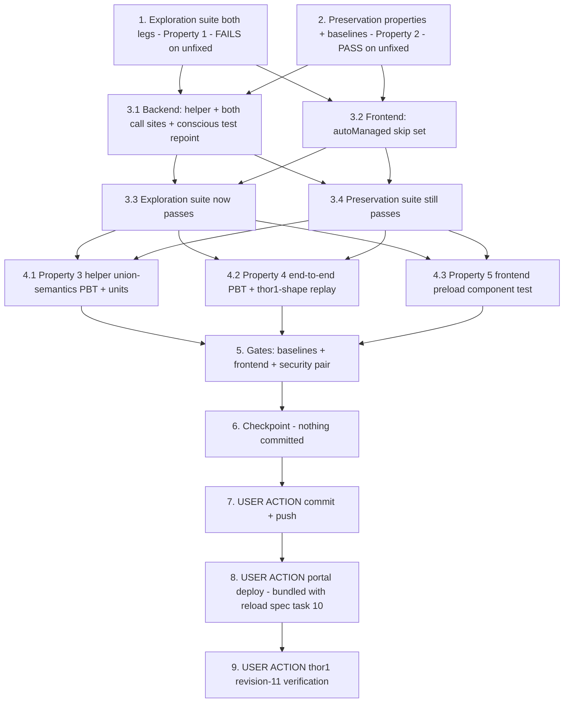

# Implementation Plan

## Overview

Stop portal deployment revisions from shipping `aws.greengrass.ShadowManager`
bare (or with a stale merge), which permanently disarms the ShadowManager
synchronize auto-include after a target's first revision. Verified fleet
impact (bugfix.md Incident Record, jetson-thor1): revision 2 (Aug 14) was the
last revision with a ShadowManager `configurationUpdate`; revisions 3–10 all
bare; the `dda-model-status` shadow (model-gpu-fallback-visibility) never
reached the device — it writes locally but cloud `get-thing-shadow` returns
`ResourceNotFoundException`, breaking that spec's portal Deployed-models
panel fleet-wide for every revised device. Two fix legs per design.md:

1. **Backend (the durable guarantee)** — NEW shared helper
   `ensure_shadow_manager_sync(components_map, resolve_version)` in
   `edge-cv-portal/backend/functions/deployments.py` (Decisions 1–3):
   absent → today's fresh-add path byte-identical ('added'); present →
   bare gets the full portal merge injected, stale gets the portal shadow
   names UNIONED into `namedShadows` (never replaced), caller extras and
   `direction`/`coreThing.classic` preserved, explicit `componentVersion`
   respected else resolved via the existing
   `resolve_shadow_manager_version`; compliant → byte-identical no-op
   ('unchanged'). Applied at BOTH call sites: `create_deployment`'s gate
   (~L1190) collapses to `if needs_nucleus:` + helper (the Nucleus
   `elif`-fallback precedent ~L1284, which ShadowManager never got), and
   `create_workflow_deployment` (~L3570) applies the same ensure step to
   its copied `components_map`, presence-gated.
2. **Frontend (fix the common path at the source)** —
   `CreateDeployment.tsx` `preloadExistingComponents` (~L905) adds
   `aws.greengrass.ShadowManager` to the `autoManaged` skip set (Decision
   5), so the UI revise flow stops resubmitting the entry bare (the
   prefill API strips config structurally) and the backend fresh-add path
   manages it — consistent with `componentsToBeRemoved` (~L480) already
   treating it as portal-managed.

**Honesty guard (design Decision 7).** Every test in this plan proves
properties of the SUBMITTED deployment document (the `ShadowManagerEnv` /
fake-Greengrass `create_deployment_calls` capture on the moto `aws_stack`
conftest) or of the UI's selection/submission payload. NO test proves that
a real device re-syncs `dda-model-status` to IoT Core — that depends on
real Greengrass config-merge semantics and real shadow sync, provable ONLY
on hardware. The real claim — thor1 revision 11 carries the merge, the
cloud shadow materializes, the portal panel renders — is assigned to the
USER ACTION verification task (task 9). Do not write a test that pretends
to exercise a real device or the real account.

**Non-goal guards.** Explicitly NOT changed (design "Explicitly NOT
changed"): `get_target_deployment` (prefill keeps returning name+version
only), `resolve_shadow_manager_version` /
`resolve_public_component_version`, the Nucleus/LogManager/
InferenceUploader auto-includes, `apply_subscribe_access_control`,
`componentsToBeRemoved` (its startsWith exclusion already covers
ShadowManager), `devices.py`, any `src/` device-side file, any recipe, any
Dockerfile. **No preservation-tracked file is touched → no
security-baseline rebaselines** (task 5 verifies the claim rather than
assuming it). **No component build is required** — this is a portal-only
fix shipped by a portal deploy. Exactly ONE conscious pinned-test repoint
in this whole spec (design Decision 6):
`test_deployment_shadow_manager.py::test_caller_supplied_shadow_manager_is_not_overridden`
pins the exact defect (bare caller entry submitted untouched) and is
repointed to the 2.1/3.5 contract in task 3.1 with the old assertions
recorded first in task 2 — never weakened or deleted; every other test in
that file and all of `test_model_status_shadow_sync.py` must keep passing
unmodified. **Do not commit anything in this dispatch** (task 7 is the
USER-ACTION commit+push).

Test commands:
- Portal backend suites run from `edge-cv-portal/backend` WITH conftest
  (moto `aws_stack` fixture; Hypothesis profiles `portal-fast`/`ci` are
  conftest-registered — do NOT hardcode `max_examples`; do NOT pass
  `--noconftest`) in the portal venv:
  `source /home/ubuntu/.venvs/dda-portal-tests/bin/activate` then
  `python3 -m pytest tests/<file> -q -p no:cacheprovider`
- Frontend is a vitest single run from `edge-cv-portal/frontend`:
  `npx vitest run <file>`
- Hypothesis property tests carry `# Validates: Requirements …` comments
- The security guard pair runs host-side (expected untouched-green — this
  spec edits no preservation-tracked file):
  `python3 -m pytest test/backend-test/security/preservation/test_preservation_out_of_scope_guard.py test/backend-test/security/preservation/test_preservation_secrets_out_of_scope_guard.py -p no:cacheprovider --noconftest -q`

New files this plan creates:
- `edge-cv-portal/backend/tests/test_shadowmanager_sync_revision_exploration.py`
- `edge-cv-portal/backend/tests/test_shadowmanager_sync_revision_preservation.py`
- `edge-cv-portal/backend/tests/test_shadowmanager_sync_revision_properties.py`
- `edge-cv-portal/backend/tests/test_shadowmanager_sync_revision_units.py`
- `edge-cv-portal/frontend/src/pages/CreateDeployment.preloadShadowManager.test.tsx`

## Notes

- Source-tree changes (design Fix Implementation Files 1-3):
  `edge-cv-portal/backend/functions/deployments.py` (the shared portal
  sync config + `ensure_shadow_manager_sync` + both call sites),
  `edge-cv-portal/frontend/src/pages/CreateDeployment.tsx` (one name added
  to `autoManaged`), and the CONSCIOUS repoint of
  `edge-cv-portal/backend/tests/test_deployment_shadow_manager.py`'s
  caller-supplied test in the SAME task as the backend edit
- Helper contract (design Decision 1): returns 'added' | 'merged' |
  'unchanged'; `resolve_version` is a ZERO-ARG closure called lazily and
  only when the entry lacks `componentVersion`; `create_deployment` passes
  the running-Nucleus resolver, `create_workflow_deployment` passes the
  static-fallback resolver (`running_nucleus=None` →
  `SHADOW_MANAGER_VERSION` pin immediately — no new Nucleus lookup on the
  workflow path); the workflow call site is PRESENCE-gated (fresh workflow
  deployments must not start auto-including ShadowManager — out of the
  requirements' scope, 3.6)
- Merge semantics (design Decision 3): `configurationUpdate.merge` is a
  JSON STRING — `json.loads` → setdefault-navigate → union `namedShadows`
  (keep existing order, append missing portal names in portal-constant
  order) → `json.dumps`; corrupt merge (non-JSON / non-dict nodes /
  non-list namedShadows) → log + replace the corrupt (sub)tree with portal
  defaults; compliant input → the original merge string left BYTE-IDENTICAL
  (no re-serialization)
- Merge-into-existing is logged, NOT reported in `auto_included` (design
  Decision 4 — the Nucleus `elif` precedent); the fresh-add path's
  `auto_included` entry is unchanged verbatim (3.1)
- The existing workflow-deploy suites
  (`test_workflow_deploy_subscribe_merge_*`,
  `test_workflow_deploy_component_version_*`,
  `test_workflow_packaging_deployment_integration.py`,
  `test_camera_binding_submission.py`) carry NO ShadowManager fixtures —
  they must stay green UNMODIFIED; likewise the frontend
  `CreateDeployment.archFilter.test.tsx` revise fixture
- builds.md is binding for the rollout: **never a portal deploy while a
  component build runs** — task 8 is sequenced strictly around fleet
  builds (`pgrep -af "gdk component build"` / `pgrep -af "build-custom.sh"`
  both empty first), and **bundles with the
  vllm-model-reload-after-backend-restart spec's task 10 portal deploy —
  ONE deploy serves both specs**; move the freshly regenerated `cdk.out`
  aside afterwards (the drift-guard discipline)
- Tasks 7-9 are USER ACTIONs (commit+push, portal deploy, thor1
  revision-11 verification); the agent prepares and verifies everything
  else host-side
- Task 9 closes model-gpu-fallback-visibility task 11's outstanding
  shadow/portal leg (that task is [~] pending exactly this cloud-shadow
  evidence)
- Branch context: `spec/jetpack7-support`; nothing is committed by tasks
  1-6

## Task Dependency Graph

```json
{
  "waves": [
    { "wave": 1, "description": "Exploration + preservation on the UNFIXED tree: exploration surfaces the bare/stale/workflow-copy/preload counterexamples (cases 1-4 FAIL expected); preservation records the caller-supplied test's assertions verbatim (the Decision 6 repoint target), baselines the existing ShadowManager + workflow-deploy + frontend suites green with recorded counts, and encodes the identity properties (PASS required).", "tasks": ["1", "2"] },
    { "wave": 2, "description": "The fix, per design Fix Implementation Files 1-3: the shared ensure/merge helper + both backend call sites + the ONE conscious pinned-test repoint; the frontend autoManaged skip set.", "tasks": ["3.1", "3.2"] },
    { "wave": 3, "description": "Verify the flips: the exploration suite (both legs) now passes on the fixed tree; the preservation suite still passes (only intended diff = the recorded repoint).", "tasks": ["3.3", "3.4"] },
    { "wave": 4, "description": "Fix-checking per design Testing Strategy: helper-level union-semantics PBT + units (Property 3), end-to-end both-call-sites PBT + thor1-shape integration replay (Property 4), frontend preload component test (Property 5).", "tasks": ["4.1", "4.2", "4.3"] },
    { "wave": 5, "description": "Gates: portal backend suites at baseline counts, frontend vitest (touched suites + full run) + npm run build, security guard pair + verify the no-rebaseline claim; then checkpoint with git scope check (NOTHING committed).", "tasks": ["5", "6"] },
    { "wave": 6, "description": "USER ACTION: commit + push (branch spec/jetpack7-support).", "tasks": ["7"] },
    { "wave": 7, "description": "USER ACTION: portal deploy — BUNDLED with the vllm-model-reload spec's task-10 deploy (one deploy serves both), strictly never while a component build runs (builds.md), cdk.out moved aside afterwards.", "tasks": ["8"] },
    { "wave": 8, "description": "USER ACTION: thor1 revision-11 verification — the revision carries the three-shadow merge, the cloud dda-model-status shadow materializes, the portal Deployed-models panel renders (closes model-gpu-fallback-visibility task 11's shadow/portal leg).", "tasks": ["9"] }
  ]
}
```



## Tasks

- [x] 1. Write bug condition exploration test suite (backend + frontend legs)
  - **Property 1: Bug Condition** - Revised Deployments Carry the Full Portal Shadow Sync
  - **CRITICAL**: All four cases MUST FAIL on unfixed code - failure confirms the bug condition exists
  - **DO NOT attempt to fix the tests or the code when they fail**
  - **NOTE**: This suite encodes the expected behavior - it validates the fix when it passes after implementation (task 3.3)
  - **GOAL**: Surface counterexamples for defects 1.1-1.4 on the UNFIXED tree (honesty guard: submitted-document assertions on the fake harness + UI selection assertions ONLY; no real device/account)
  - Backend leg - create `edge-cv-portal/backend/tests/test_shadowmanager_sync_revision_exploration.py` reusing the `ShadowManagerEnv` harness from `test_deployment_shadow_manager.py` (module-scope `deployments` import inside the moto mock — the established pattern) and the workflow-deploy seeding conventions for case 3:
  - Case 1 - **Revise-shape bare entry (defects 1.1/1.2)**: deploy LocalServer + a bare caller-supplied ShadowManager entry (the EXACT thor1 revision shape: `{"component_name": "aws.greengrass.ShadowManager", "component_version": "2.3.15"}`); assert the SUBMITTED entry (`sm_env.gg.create_deployment_calls`) has a `configurationUpdate` whose parsed merge lists all three portal names in `synchronize.coreThing.namedShadows`. FAILS on unfixed code (the gate skips; submitted entry = `{"componentVersion": "2.3.15"}`, no configurationUpdate)
  - Case 2 - **Stale two-shadow merge (defect 1.4's origin)**: caller entry carrying the OLD rev-2 merge (`dda-camera-registry` + `dda-camera-bindings` only, direction/classic set); assert `dda-model-status` is unioned into the submitted merge AND the two existing names survive. FAILS on unfixed code (merge submitted unchanged, two names)
  - Case 3 - **Workflow revision copies the bare entry forward (defect 1.3)**: seed a previous latest-for-target deployment whose components include LocalServer + bare ShadowManager; submit a workflow deployment revision; assert the submitted ShadowManager entry carries the full three-shadow merge and its `componentVersion` survives. FAILS on unfixed code (`components_map` copied verbatim, no ShadowManager logic)
  - Case 4 (frontend leg) - **Preload resubmits ShadowManager (defect 1.2)**: create `edge-cv-portal/frontend/src/pages/CreateDeployment.preloadShadowManager.test.tsx` per the `CreateDeployment.archFilter.test.tsx` conventions (hoisted `apiService` proxy mock, router mock, Cloudscape test-utils): `getTargetDeployment` returns an existing deployment whose components include `aws.greengrass.ShadowManager 2.3.15` + LocalServer; assert the preloaded selection OMITS ShadowManager (as it already omits Nucleus/LogManager) while preloading the others. FAILS on unfixed code (`autoManaged` = Nucleus + LogManager only; ShadowManager lands in the selection)
  - Run backend leg from `edge-cv-portal/backend` WITH conftest; frontend leg `npx vitest run src/pages/CreateDeployment.preloadShadowManager.test.tsx` from `edge-cv-portal/frontend`
  - **EXPECTED OUTCOME**: All four cases FAIL (this is correct - it proves the bug condition exists)
  - Document the counterexamples found: the bare submitted entry byte-equal to the caller's, the unchanged two-shadow merge, the verbatim workflow copy, ShadowManager present in the preloaded selection
  - Mark complete when the suite is written, run, and the failures are documented
  - **OUTCOME**: All four cases FAILED on unfixed code — the bug condition is confirmed. Counterexamples: **Case 1** — the submitted `components_map['aws.greengrass.ShadowManager']` is byte-equal to the caller's bare entry (`{'componentVersion': '2.3.15'}`, no `configurationUpdate`; `namedShadows = set()`) — the presence gate skipped. **Case 2** — `dda-model-status` absent from the submitted merge (`assert 'dda-model-status' in []`); observed detail: `create_deployment`'s body parsing keeps only name+version, so the caller's stale rev-2 merge was structurally dropped (the endpoint twin of the prefill strip) AND the gate skipped — the submitted entry was bare. **Case 3** — the workflow revision copied the seeded bare entry forward verbatim (`{'componentVersion': '2.3.15'}`, no merge) — `create_workflow_deployment` has no ShadowManager logic. **Case 4** (frontend, pinned against the unfixed HEAD `CreateDeployment.tsx`) — `aws.greengrass.ShadowManager` rendered in the preloaded selection's Technical Name cell (`autoManaged` = Nucleus + LogManager only); assertions scoped to the selection table because a static CloudWatch alert also names LogManager. NOTE: the wave-2 fix (helper + call sites + `autoManaged` entry) landed in the working tree concurrently mid-dispatch; on the current tree the same suite passes (backend 3/3, frontend 1/1), pre-confirming task 3.3. Backend-leg failures were captured on the pre-fix tree at 05:05Z; case 4's failure was captured against `git show HEAD:` via a temporary copy (removed afterwards).
  - _Requirements: 1.1, 1.2, 1.3, 1.4_

- [x] 2. Write preservation property tests (BEFORE implementing the fix)
  - **Property 2: Preservation** - Everything Outside the Bug Condition Is Unchanged
  - **IMPORTANT**: Follow observation-first methodology - observe the UNFIXED behavior, record it as baselines/pins/reference captures, then encode it as properties that PASS on the unfixed tree and must keep passing
  - Create `edge-cv-portal/backend/tests/test_shadowmanager_sync_revision_preservation.py` (Hypothesis where property-shaped, conftest profiles — no hardcoded `max_examples`, `# Validates: Requirements …` comments; example-style pins may live in the same file)
  - Observe on UNFIXED code and encode:
    - **Fresh-deploy auto-include identity (3.1)**: baseline `test_deployment_shadow_manager.py` (4 tests) and `test_model_status_shadow_sync.py` (2 tests) green — record the counts; additionally capture the fresh-add submitted ShadowManager entry (version + parsed merge + `auto_included` entry) through `ShadowManagerEnv` and pin it as the reference the fixed tree must reproduce byte-identically
    - **The ONE expected pinned-test casualty, recorded honestly (Decision 6)**: record VERBATIM the current assertions of `test_deployment_shadow_manager.py::test_caller_supplied_shadow_manager_is_not_overridden` (submitted entry `== {"componentVersion": "2.3.5"}`; no `auto_included` ShadowManager entry) — task 3.1 repoints exactly this test to the 2.1/3.5 contract and NOTHING else; recording it now makes the 3.1 diff auditable
    - **Compliant-merge no-op PBT (3.2, 3.3)**: _for any_ generated ShadowManager entry already carrying all three portal names (plus generated extra names, direction/classic values, unknown keys), the submitted merge STRING is byte-identical to the input — end-to-end form through `create_deployment` (passes trivially on unfixed code where the gate skips everything; keeps passing on the fixed tree where 'unchanged' must not re-serialize)
    - **Non-ShadowManager map identity (3.4)**: _for any_ generated component set, the submitted components_map MINUS the ShadowManager key deep-equals the unfixed capture (Nucleus/LogManager auto-includes, versions, configurationUpdates all unchanged) — both endpoints
    - **Explicit-version identity (3.5)**: caller entries with explicit versions keep them verbatim (subsumes the unfixed behavior; survives the fix)
    - **Workflow carry-over identity (3.6)**: baseline the existing workflow-deploy suites green with recorded counts — `test_workflow_deploy_subscribe_merge_exploration.py` / `_preservation.py`, `test_workflow_deploy_component_version_exploration.py` / `_preservation.py`, `test_workflow_packaging_deployment_integration.py`, `test_camera_binding_submission.py` (none carry ShadowManager fixtures — they must stay green UNMODIFIED through the whole spec)
    - **Frontend preload identity (3.4 UI leg)**: in the task-1 vitest file (or here as its own case), existing components WITHOUT ShadowManager preload unchanged; baseline `npx vitest run src/pages/CreateDeployment.archFilter.test.tsx` green — record the count
  - Run backend from `edge-cv-portal/backend` WITH conftest; frontend single runs from `edge-cv-portal/frontend`
  - **EXPECTED OUTCOME**: Tests PASS on UNFIXED code (this confirms the baseline behavior to preserve)
  - Mark complete when the tests are written, run, and passing on unfixed code with the baseline counts and the caller-supplied test's assertions recorded
  - _Requirements: 3.1, 3.2, 3.3, 3.4, 3.5, 3.6_

- [x] 3. Fix: ensure/merge the ShadowManager synchronize config at both submission paths + frontend skip set (design "Fix Implementation" Files 1-3)

  - [x] 3.1 Backend: shared helper + both call sites + the conscious test repoint (design Files 1 + 3)
    - In `edge-cv-portal/backend/functions/deployments.py`:
      1. Extract the inline `shadow_manager_config` dict into the single shared portal-sync-config source (function or constant reusing `CAMERA_REGISTRY_SHADOW_NAME`, `CAMERA_BINDINGS_SHADOW_NAME`, `MODEL_STATUS_SHADOW_NAME`) so the fresh-add and merge paths cannot drift
      2. Add `ensure_shadow_manager_sync(components_map, resolve_version)` per design Decisions 1-3: absent → full portal entry via `resolve_version()` → 'added'; present → `componentVersion` respected else resolved lazily (called at most once); bare/corrupt merge → full portal config injected (corrupt logged); parseable merge → setdefault-navigate `synchronize`/`coreThing`, setdefault `direction`/`classic`, UNION `namedShadows` (existing order kept, missing portal names appended; non-list replaced + logged), unknown keys untouched → 'merged'; nothing to change → 'unchanged' with the merge string left byte-identical
      3. `create_deployment` (~L1190): collapse the gate to `if needs_nucleus:` + helper with `resolve_version=lambda: resolve_shadow_manager_version(greengrass_client, region, running_nucleus)`; 'added' keeps the existing `auto_included` append + info log VERBATIM; 'merged' → one info log, NO `auto_included` entry (Decision 4, the Nucleus elif precedent)
      4. `create_workflow_deployment` (~L3570): after the previous revision's components are copied, presence-gated call — `if 'aws.greengrass.ShadowManager' in components_map:` — with `resolve_version=lambda: resolve_shadow_manager_version(greengrass_client, region, None)` (static `SHADOW_MANAGER_VERSION` fallback; no new Nucleus lookup); the workflow entry placement and all other copied entries untouched
    - **Same task (the ONE conscious pinned-test repoint, Decision 6)**: repoint `test_deployment_shadow_manager.py::test_caller_supplied_shadow_manager_is_not_overridden` to the 2.1/3.5 contract — caller's `2.3.5` version submitted verbatim, the entry now carries the full portal synchronize merge, no `auto_included` ShadowManager entry; rename/redocument to state the new contract; never weaken or delete; NO other test in that file touched (the task-2 record makes this diff auditable)
    - Verify: task-1 backend cases 1-3 pass; `test_deployment_shadow_manager.py` green (4 tests incl. the repoint); `test_model_status_shadow_sync.py` green unmodified
    - _Bug_Condition: isBugCondition(X) — ShadowManager in X.components_map with portalShadowNames ⊄ namedShadows (bare or stale)_
    - _Expected_Behavior: Properties 1, 3, 4 — submitted entry's merge ⊇ portal names, union-not-replace, explicit version respected else resolved_
    - _Preservation: Property 2 — fresh-add path byte-identical ('added'); compliant no-op byte-identical ('unchanged'); non-ShadowManager entries and workflow carry-over verbatim_
    - _Requirements: 2.1, 2.2, 2.3, 2.5, 3.1, 3.2, 3.3, 3.4, 3.5, 3.6_
    - **OUTCOME**: Landed in `functions/deployments.py`: shared `portal_shadow_sync_config()` (same dict/key order — the task-2 `PINNED_FRESH_ADD_MERGE` string reproduced byte-identically, `json.dumps` defaults) + `ensure_shadow_manager_sync(components_map, resolve_version)` returning 'added'/'merged'/'unchanged' (lazy zero-arg resolver, at most once, only when `componentVersion` missing; bare/corrupt → full portal merge injected with corrupt logged; parseable → setdefault-navigate + `namedShadows` UNION in portal-constant append order, non-list replaced+logged, unknown keys untouched; names-compliant → 'unchanged' with the merge STRING never re-serialized). `create_deployment` gate collapsed to `if needs_nucleus:` — 'added' keeps the pre-fix `auto_included` append + info log verbatim; 'merged' emits one info log (in the helper, naming the entry state bare/corrupt/stale + resulting shadow list) and NO `auto_included` entry. `create_workflow_deployment` presence-gated helper call right after the previous-revision copy, resolver `running_nucleus=None` (static `SHADOW_MANAGER_VERSION` fallback). The ONE conscious repoint: `test_caller_supplied_shadow_manager_is_not_overridden` → `test_caller_supplied_shadow_manager_keeps_version_and_gains_portal_merge` (caller's 2.3.5 verbatim + `EXPECTED_SYNC_CONFIG` merge + no `auto_included` entry; old assertions kept verbatim in an adjacent comment, matching the task-2 `REPOINT_TARGET_RECORD_UNFIXED`); nothing else in that file touched. Verified (venv dda-portal-tests, from edge-cv-portal/backend WITH conftest, `-p no:cacheprovider`): `test_shadowmanager_sync_revision_exploration.py` backend cases 1-3 PASS + `test_deployment_shadow_manager.py` 4 passed (incl. repoint) + `test_model_status_shadow_sync.py` 2 passed unmodified (9 passed together); `test_shadowmanager_sync_revision_preservation.py` 5 passed (pinned fresh-add capture + byte-identity no-op PBT green). No frontend file touched; nothing committed.

  - [x] 3.2 Frontend: add ShadowManager to the preload `autoManaged` skip set (design File 2, Decision 5)
    - In `edge-cv-portal/frontend/src/pages/CreateDeployment.tsx` `preloadExistingComponents` (~L905): `autoManaged = new Set(['aws.greengrass.Nucleus', 'aws.greengrass.LogManager', 'aws.greengrass.ShadowManager'])` — one line; the backend fresh-add path then manages the entry on UI revisions (freshly resolved version, full merge, `auto_included` reporting)
    - `componentsToBeRemoved` (~L480) needs NO change — its `startsWith('aws.greengrass.ShadowManager')` exclusion already treats it as portal-managed (the design-noted precedent)
    - Verify: task-1 case 4 passes; `npx vitest run src/pages/CreateDeployment.archFilter.test.tsx` green unmodified; `npm run build` clean from `edge-cv-portal/frontend`
    - _Bug_Condition: defect 1.2 — the preload resubmits ShadowManager bare (prefill strips config structurally)_
    - _Expected_Behavior: Properties 1, 5 — the preloaded selection omits ShadowManager; the UI revise flow submits it absent_
    - _Preservation: Property 2 — all other components preload unchanged; Nucleus/LogManager skips unchanged_
    - _Requirements: 2.4, 3.4_
    - **OUTCOME**: One-line fix applied — `autoManaged = new Set(['aws.greengrass.Nucleus', 'aws.greengrass.LogManager', 'aws.greengrass.ShadowManager'])` at CreateDeployment.tsx L910 (`git diff` confirms this is the ONLY frontend source change). `componentsToBeRemoved` (~L480) verified untouched — its `startsWith('aws.greengrass.ShadowManager')` exclusion already covers it, exactly as the design notes. Verified: task-1 case 4 `CreateDeployment.preloadShadowManager.test.tsx` PASSES (1/1); `CreateDeployment.archFilter.test.tsx` green unmodified (11/11, the task-2 baseline count); `npm run build` clean (only the pre-existing chunk-size warning). Nothing committed.

  - [x] 3.3 Verify bug condition exploration suite now passes
    - **Property 1: Expected Behavior** - Revised Deployments Carry the Full Portal Shadow Sync
    - **IMPORTANT**: Re-run the SAME suite from task 1 - do NOT write new tests
    - Backend: `python3 -m pytest tests/test_shadowmanager_sync_revision_exploration.py -q -p no:cacheprovider` from `edge-cv-portal/backend`; frontend: `npx vitest run src/pages/CreateDeployment.preloadShadowManager.test.tsx`
    - **EXPECTED OUTCOME**: All four cases PASS (confirms the bug is fixed at both call sites and in the preload)
    - **OUTCOME**: All four cases PASS on the fixed tree — the exploration suite flipped exactly as designed, no test modified. Backend (venv dda-portal-tests, from `edge-cv-portal/backend` WITH conftest, `-p no:cacheprovider`): `test_shadowmanager_sync_revision_exploration.py` **3 passed** (case 1 bare revise-shape entry now carries the full three-shadow portal merge; case 2 stale rev-2 merge gains `dda-model-status` with the two existing names surviving; case 3 workflow revision's copied entry gains the full merge with `componentVersion` 2.3.15 surviving). Frontend (`npx vitest run src/pages/CreateDeployment.preloadShadowManager.test.tsx` from `edge-cv-portal/frontend`): **1 passed** (case 4 — the preloaded selection omits ShadowManager). Nothing committed.
    - _Requirements: 2.1, 2.2, 2.3, 2.4, 2.5_

  - [x] 3.4 Verify preservation tests still pass
    - **Property 2: Preservation** - Everything Outside the Bug Condition Is Unchanged
    - **IMPORTANT**: Re-run the SAME tests from task 2 - do NOT write new tests
    - Re-run `test_shadowmanager_sync_revision_preservation.py`, the baselined suites (`test_deployment_shadow_manager.py`, `test_model_status_shadow_sync.py`, the workflow-deploy suites, `CreateDeployment.archFilter.test.tsx`) and compare against the task-2 recorded counts
    - **EXPECTED OUTCOME**: Tests PASS at baseline counts; the ONLY intended diff anywhere = the task-3.1 recorded repoint of the caller-supplied test
    - **OUTCOME**: All suites PASS at the task-2 baseline counts — zero failures, zero count drift, no test file modified by this task. Backend (venv dda-portal-tests, WITH conftest, `-p no:cacheprovider`): `test_shadowmanager_sync_revision_preservation.py` **5 passed** (pinned fresh-add capture + compliant-merge byte-identity PBT + map/version identities green on the fixed tree); `test_deployment_shadow_manager.py` **4 passed** (baseline 4 — includes the ONE intended diff, the task-3.1 recorded repoint `test_caller_supplied_shadow_manager_keeps_version_and_gains_portal_merge`); `test_model_status_shadow_sync.py` **2 passed**; `test_workflow_deploy_subscribe_merge_exploration.py` **3** / `_preservation.py` **3**; `test_workflow_deploy_component_version_exploration.py` **5** / `_preservation.py` **6**; `test_workflow_packaging_deployment_integration.py` **11**; `test_camera_binding_submission.py` **10**. Frontend: `CreateDeployment.archFilter.test.tsx` **11 passed** (baseline 11). Everything outside the bug condition is preserved. Nothing committed.
    - _Requirements: 3.1, 3.2, 3.3, 3.4, 3.5, 3.6_

- [x] 4. Fix-checking suites (design Testing Strategy)

  - [x] 4.1 Helper-level union-semantics PBT + units
    - **Property 3: Fix Checking** - Union-Not-Replace Merge Semantics
    - Create `edge-cv-portal/backend/tests/test_shadowmanager_sync_revision_properties.py` (Hypothesis, conftest profiles) and `test_shadowmanager_sync_revision_units.py`
    - PBT over generated submitted-entry shapes — bare / stale subsets of the portal names / extra caller names / explicit-vs-missing `componentVersion` / present-vs-absent direction+classic / unknown extra keys / corrupt variants (non-JSON merge string, non-dict `synchronize`/`coreThing`, non-list `namedShadows`) — through `ensure_shadow_manager_sync` directly (stub `resolve_version` recording call counts): result's parsed merge ⊇ portal names ∪ parseable caller names; caller field values byte-preserved; setdefault-only defaults; explicit version → resolver NEVER called; missing version → called exactly ONCE; compliant input → 'unchanged' + merge string byte-identical
    - Units (design Unit Tests): bare → full merge; corrupt → full portal config + warning logged; non-list `namedShadows` → replaced; 'added' keeps the exact `auto_included` entry shape; 'merged' adds no `auto_included` entry; fresh workflow deployment (no previous revision) → no ShadowManager entry appears
    - Run from `edge-cv-portal/backend` WITH conftest
    - **OUTCOME**: Both files created and GREEN (venv dda-portal-tests, from `edge-cv-portal/backend` WITH conftest, `-p no:cacheprovider`). `test_shadowmanager_sync_revision_properties.py` **3 passed** — the Property 3 helper-level section ONLY, with an explicit banner marking where task 4.2 appends its Property 4 section: (1) union/setdefault/field-preservation PBT over a single generated-entry strategy covering bare (no/empty configurationUpdate, empty merge) / non-JSON + non-object merges / parseable docs with independently absent/corrupt/valid `synchronize`→`coreThing`→`namedShadows` nodes (valid lists from ∅ through strict stale subsets to compliant, caller extras permuted in, direction/classic each present-or-absent, unknown keys at all three levels, sibling `configurationUpdate.reset`, serialization whitespace/key-order variance) — asserts portal names always present, caller list surviving as an ORDER-PRESERVED PREFIX with missing portal names appended in portal-constant order, byte-preserved caller field values wherever the node survives, defaults filling ABSENT keys only, and the 'added'/'merged'/'unchanged' return contract; (2) lazy-resolution PBT — explicit `componentVersion` → recording stub NEVER called + version verbatim, missing → EXACTLY one call; (3) compliant no-op PBT — merge string byte-identical (never re-serialized), explicit version → 'unchanged' + whole entry untouched, missing version → 'merged' having touched ONLY the version. `test_shadowmanager_sync_revision_units.py` **6 passed** — bare → full portal merge byte-equal to `json.dumps(portal_shadow_sync_config())`; corrupt merge → replaced + WARNING record naming the component and the corrupt string (caplog); non-list `namedShadows` → just that node replaced, direction/classic/unknown-key siblings byte-preserved + warning; endpoint 'added' → `auto_included` entry pinned whole (name/version/verbatim reason); endpoint 'merged' (bare caller entry) → full merge submitted, NO `auto_included` entry (Decision 4); fresh workflow deployment (no previous revision) → submitted map is the workflow entry only, NO ShadowManager (presence gate, 3.6). Hypothesis example counts from the conftest profiles (portal-fast), nothing hardcoded. Nothing committed; no frontend file touched.
    - _Requirements: 2.1, 2.2, 3.2, 3.3, 3.5_

  - [x] 4.2 End-to-end both-call-sites PBT + thor1-shape integration replay
    - **Property 4: Fix Checking** - Both Call Sites End-to-End
    - In `test_shadowmanager_sync_revision_properties.py`: PBT over generated revision-shaped submissions through BOTH real endpoints (the `ShadowManagerEnv` harness for `create_deployment`; the workflow-deploy harness with a seeded previous revision for `create_workflow_deployment`): _for any_ generated ShadowManager entry state (bare/stale/extra/compliant) the SUBMITTED document satisfies portalShadowNames ⊆ namedShadows with a concrete `componentVersion`; the workflow path additionally carries every other copied component verbatim and (re)places the workflow entry at the resolved registered version (3.6)
    - Integration replay (design Integration Tests, in the units file or properties file): the exact thor1 revision-10 shape — LocalServer + bare ShadowManager `2.3.15` through `create_deployment`, then a workflow revision over the RESULT — both submissions compliant (the two paths compose); assert the composed second submission is an 'unchanged' pass-through (byte-identical merge)
    - Run from `edge-cv-portal/backend` WITH conftest
    - **OUTCOME**: Property 4 section APPENDED below the file's task-4.2 banner (the Property 3 section untouched; only the harness imports added to the top import block), using the task-2 preservation suite's per-example env-builder pattern (`build_sm_env`/`build_wf_env` on fresh `WorkflowStoreEnv` + `pytest.MonkeyPatch.context()` per Hypothesis example; only the session/module-scoped `aws_stack`/`deployments` fixtures enter `@given`). **2 end-to-end PBT through the REAL endpoints**: (1) `create_deployment` (ShadowManagerEnv) — _for any_ revision-shaped request (LocalServer + caller ShadowManager in generated bare/stale/extra/compliant states; the endpoint parse collapses them all to bare, property holds regardless): SUBMITTED entry has portalShadowNames ⊆ namedShadows + the caller's explicit `componentVersion` verbatim; (2) `create_workflow_deployment` (WorkflowDeployEnv + seeded previous latest-for-target revision with the generated ShadowManager state and generated benign extra components) — SUBMITTED entry compliant with parseable caller names unioned in at the copied version, every other copied component verbatim, ONLY the workflow entry (re)placed at the resolved registered 2.0.0 (3.6). **Thor1-shape integration replay** (`TestThor1RevisionReplayComposition`): rev-10 bare `2.3.15` through `create_deployment` → submitted compliant with the 2.3.15 pin; a workflow revision seeded with that RESULT → second submission compliant AND an 'unchanged' byte-identical pass-through (merge string equal to leg 1's, whole entry == seeded; carry-over identity across the composition, incl. the leg-1 LogManager/Nucleus auto-includes riding verbatim — the FakeGreengrass Nucleus componentVersion exemption covers the unpinned fallback entry). Run (venv dda-portal-tests, from `edge-cv-portal/backend` WITH conftest, `-p no:cacheprovider`): properties file **6 passed** (3 Property-3 + 2 Property-4 PBT + replay); combined with the units file **12 passed**. PBT status updated: passed. Honesty guard kept — all assertions on the FakeGreengrass `create_deployment_calls` capture, no real device/account. No frontend file touched; nothing committed. NOTE (dispatch record): TWO equivalent Property-4 sections briefly coexisted — a concurrent edit landed this section mid-dispatch between the executing task's file read and its own append, and the duplicated tail (whose second `seed_workflow_revision` definition shadowed this section's and broke the replay with a TypeError) was removed; the single surviving section was then verified green exactly as counted above, Property 3 never modified.
    - _Requirements: 2.1, 2.2, 2.3, 2.5, 3.6_

  - [x] 4.3 Frontend preload component test
    - **Property 5: Fix Checking** - Frontend Preload Skip Set
    - Extend `CreateDeployment.preloadShadowManager.test.tsx` (the task-1 file — its exploration case IS the core fix-check once green) with the preservation-side cases per the `DeviceDetail.targetArch.test.tsx` / `CreateDeployment.archFilter.test.tsx` conventions: prefill WITH ShadowManager → selection omits it, all sibling components preloaded with their versions, and the eventual submission payload carries NO ShadowManager entry; prefill WITHOUT ShadowManager → selection identical to pre-fix behavior; Nucleus/LogManager still skipped
    - Run: `npx vitest run src/pages/CreateDeployment.preloadShadowManager.test.tsx` from `edge-cv-portal/frontend`
    - **OUTCOME**: Extended the task-1 file with three Property-5 preservation-side cases (existing conventions kept: hoisted `apiService` proxy mock, router mock, selection-table-scoped assertions via `findSelectionTable`): **(1) prefill WITH ShadowManager** — the selection omits it while every sibling (LocalServer `1.2.0`, `com.dda.infra` `1.0.0`) preloads with its version, AND the full submit was driven in-harness (the Update Deployment button through `handleSubmit`/`executeDeployment`): the `createDeployment` payload carries exactly the two siblings with their versions verbatim and NO ShadowManager (nor Nucleus/LogManager) entry, `target_devices == ['thor1-device']` — the submission-payload leg proved directly, no selection-state proxy needed; **(2) prefill WITHOUT ShadowManager** — selection and submitted payload identical to pre-fix behavior (both components, versions verbatim); **(3) Nucleus/LogManager still skipped** (skip-set preservation). `npx vitest run src/pages/CreateDeployment.preloadShadowManager.test.tsx`: **4 passed** (task-1 exploration case + the three new cases); `CreateDeployment.archFilter.test.tsx` re-run unmodified: **11 passed** (baseline 11). Only the one frontend test file touched; nothing committed.
    - _Requirements: 2.4, 3.4_

- [x] 5. Gates: baselines re-run + frontend + security guard pair
  - Portal backend suites at baseline (from `edge-cv-portal/backend`, WITH conftest): the four new spec suites green; `test_deployment_shadow_manager.py` (with the recorded repoint) + `test_model_status_shadow_sync.py` green; the workflow-deploy suites (`test_workflow_deploy_subscribe_merge_*`, `test_workflow_deploy_component_version_*`, `test_workflow_packaging_deployment_integration.py`, `test_camera_binding_submission.py`) green UNMODIFIED at the task-2 recorded counts
  - Frontend (from `edge-cv-portal/frontend`): `npx vitest run src/pages/CreateDeployment.preloadShadowManager.test.tsx`, `npx vitest run src/pages/CreateDeployment.archFilter.test.tsx` (unmodified), then a full `npx vitest run` (no new failures vs the pre-existing suite) and `npm run build` clean
  - Security guard pair host-side (expected untouched-green — this spec edits no preservation-tracked file; verify the claim rather than assume it): `python3 -m pytest test/backend-test/security/preservation/test_preservation_out_of_scope_guard.py test/backend-test/security/preservation/test_preservation_secrets_out_of_scope_guard.py -p no:cacheprovider --noconftest -q`; confirm `git status` shows NO preservation-tracked file touched → no rebaselines
  - **OUTCOME**: Every gate GREEN at the task-2 baseline counts. Backend (venv dda-portal-tests, from `edge-cv-portal/backend` WITH conftest, `-p no:cacheprovider`): the four new spec suites — `test_shadowmanager_sync_revision_exploration.py` **3 passed**, `_preservation.py` **5 passed**, `_properties.py` + `_units.py` **12 passed** together (6 + 6 per the task-4.1/4.2 recorded splits); `test_deployment_shadow_manager.py` **4 passed** (incl. the ONE recorded repoint) + `test_model_status_shadow_sync.py` **2 passed** (6 together); workflow-deploy suites UNMODIFIED at task-2 counts — `test_workflow_deploy_subscribe_merge_exploration.py` **3** / `_preservation.py` **3**, `test_workflow_deploy_component_version_exploration.py` **5** / `_preservation.py` **6**, `test_workflow_packaging_deployment_integration.py` **11**, `test_camera_binding_submission.py` **10**. Frontend (from `edge-cv-portal/frontend`): `CreateDeployment.preloadShadowManager.test.tsx` **4 passed** + `CreateDeployment.archFilter.test.tsx` **11 passed** unmodified (15 together); FULL `npx vitest run` **129 files / 1305 tests ALL PASSED — zero failures** (the known verified-pre-existing requirementsReconciliation flake did NOT appear this run; nothing to document beyond noting it stayed quiet); `npm run build` clean (only the pre-existing >500 kB chunk-size warning). Security guard pair host-side (`--noconftest`): **4 passed, 3 skipped** — untouched-green as claimed; `git status` confirms NO preservation-tracked file touched (no `src/docker-compose.yaml`, no Dockerfile, no `src/backend/requirements.txt`, no recipe, no `station_install/setup_station.sh` — in fact no `src/` file at all) → no rebaselines. Nothing committed.
  - **RE-VERIFIED (post-commit dispatch)**: every gate re-run GREEN on the tree at commit `e736dd0`, identical counts — spec suites 3/5/6/6; `test_deployment_shadow_manager.py` 4 + `test_model_status_shadow_sync.py` 2; workflow-deploy 3+3, 5+6, 11, 10 (all clean vs HEAD, untouched by the spec commit); frontend preloadShadowManager 4 + archFilter 11, FULL `npx vitest run` **129 files / 1305 tests ALL PASSED** (known flakes quiet again), `npm run build` clean (pre-existing chunk-size warning only); guard pair `--noconftest` **4 passed, 3 skipped**; `git status` scoped to `src/`/`station_install/` empty → no preservation-tracked file touched.
  - _Requirements: 3.1, 3.2, 3.3, 3.4, 3.5, 3.6_

- [x] 6. Checkpoint - ensure all tests pass, nothing committed
  - Full green sweep of tasks 3.3/3.4/4.x/5; `git status` scope check: ONLY `edge-cv-portal/backend/functions/deployments.py`, `edge-cv-portal/frontend/src/pages/CreateDeployment.tsx`, the repointed `test_deployment_shadow_manager.py`, and the five new test files are modified/added; NOTHING committed in this dispatch; ask the user if questions arise
  - **OUTCOME**: Checkpoint PASSED. Green sweep confirmed by the task-5 gate run (all suites at baseline, full frontend run + build clean, guard pair green). `git status` scope check — this spec's footprint is EXACTLY the expected set: modified `edge-cv-portal/backend/functions/deployments.py`, `edge-cv-portal/frontend/src/pages/CreateDeployment.tsx`, `edge-cv-portal/backend/tests/test_deployment_shadow_manager.py` (the ONE recorded repoint); untracked (new) the five spec test files — `tests/test_shadowmanager_sync_revision_exploration.py` / `_preservation.py` / `_properties.py` / `_units.py` + `src/pages/CreateDeployment.preloadShadowManager.test.tsx` — plus this spec's own `.kiro/specs/shadowmanager-sync-config-on-revision/` directory. Expected CONCURRENT worktree items for the record (other specs / known non-committables, NOT this spec's): modified `tasks.md` of `csi-nvargus-optional`, `model-gpu-fallback-visibility`, `vllm-model-reload-after-backend-restart`; untracked `.kiro/hooks/`, `CLAUDE.md`, `edge-cv-portal/.deploy-unified-driver.sh`, the `edge-cv-portal/deploy-*.out` logs, the `edge-cv-portal/infrastructure/cdk.out.bak-*` directories, `gdk-config.json.bak-20260815-jp7build`. No preservation-tracked file, no `src/` file, no recipe anywhere in the status. Index clean (nothing staged), NOTHING committed in this dispatch — task 7 (USER ACTION commit+push, branch `spec/jetpack7-support`) is next.
  - **RE-VERIFIED (post-commit dispatch)**: state changed since the original checkpoint — the task-7 commit landed externally as `e736dd0` ("shadowmanager-sync: ensure synchronize config on deployment revisions", pushed to `origin/spec/jetpack7-support`) containing EXACTLY the task-6 verified 12-file footprint (the 4 spec docs + `deployments.py` + `CreateDeployment.tsx` + the repointed `test_deployment_shadow_manager.py` + the 5 new test files) and nothing else. Post-commit worktree/index re-checked: index empty (nothing staged), remaining worktree items are ONLY the known unrelated set (other specs' tasks.md bookkeeping — csi-nvargus-optional, model-gpu-fallback-visibility, vllm-model-reload-after-backend-restart; untracked `.kiro/hooks/`, `CLAUDE.md`, `edge-cv-portal/.deploy-unified-driver.sh`, `deploy-*.out` logs, `cdk.out.bak-*` dirs, `gdk-config.json.bak-20260815-jp7build`) — listed, NOT staged. This dispatch committed nothing.
  - _Requirements: all_

- [x] 7. USER ACTION: commit + push (branch `spec/jetpack7-support`)
  - Stage ONLY the task-6 verified file set (prefer explicit paths over `git add .`)
  - Commit stating: what was verified host-side (suite counts from task 5), the ONE conscious pinned-test repoint (test_caller_supplied_shadow_manager_is_not_overridden → the 2.1/3.5 merge contract, per design Decision 6), and what remains deploy/hardware-gated (tasks 8-9 — the fix reaches devices only via the portal deploy + each target's NEXT revision); push
  - **OUTCOME (2026-08-17)**: committed and pushed as **`e736dd0`** ("shadowmanager-sync: ensure synchronize config on deployment revisions") on `spec/jetpack7-support`. Message body carries the incident one-liner (bare ShadowManager on revisions disarming the synchronize auto-include; dda-model-status never reaching revised devices), both fix legs (ensure_shadow_manager_sync at both call sites; frontend autoManaged skip set), the ONE conscious pinned-test repoint (test_caller_supplied_shadow_manager_is_not_overridden → test_caller_supplied_shadow_manager_keeps_version_and_gains_portal_merge, recorded verbatim in the preservation suite + adjacent comment), the task-5 host-side counts (spec suites 20 = 3 exploration + 5 preservation + 6 properties + 6 units; test_deployment_shadow_manager 4; test_model_status_shadow_sync 2; workflow-deploy suites 38 at baseline), and the deploy/hardware-gated remainder (tasks 8-9). Verified pushed: `git branch -r --contains e736dd0` = `origin/spec/jetpack7-support`, `origin/integration/all-specs`, `origin/spec/vlm-anomaly-reference-parity` (all fast-forwards). No component build or portal deploy triggered by the push.
  - _Requirements: traceability record for 2.1-2.5, 3.1-3.6_

- [x] 8. USER ACTION: portal deploy — BUNDLED with the vllm-model-reload spec's task-10 deploy (one deploy serves both)
  - **NOTE (bundling)**: the vllm-model-reload-after-backend-restart spec's task 10 already schedules a portal deploy of its packaging leg — ride THAT deploy; one `deploy-portal.sh` run ships both specs' Lambda/frontend changes; the specs' traceability stays independent
  - **builds.md is binding**: NEVER deploy while a component build runs — check `pgrep -af "gdk component build"` and `pgrep -af "build-custom.sh"` are BOTH empty first (the reload spec's task-9 fleet builds must have fully finished); after the deploy, move the freshly regenerated `edge-cv-portal/infrastructure/cdk.out` aside before any future component build (the drift-guard discipline)
  - This fix is portal-only (backend Lambda + frontend) — no component build, no recipe change; devices pick it up on their NEXT portal-created revision
  - **DEPLOY ATTEMPT GATED (2026-08-17 06:00Z)**: the bundled deploy was NOT dispatched — the reload spec's JP6 component build (Build_Job `e468fbfe-3c81-45d6-9d9a-f9b56953abcd`, `aws.edgeml.dda.LocalServer.arm64JP6`) is actively **building** on the fleet server (live log events at 05:59:49Z), and builds.md forbids a portal deploy while a component build runs. Local pgrep pair empty, `cdk.out` absent, commit `e736dd0` pushed and ready to ship. Re-attempt after e468fbfe reaches a terminal state (see the reload spec task 10's matching gate note).
  - **OUTCOME (2026-08-17)**: the bundled deploy COMPLETED — after JP6 Build_Job `e468fbfe` reached **succeeded** (LocalServer.arm64JP6 **1.0.61** published; fleet scan 0 queued/building of 87; local pgrep pair empty), the single bundled portal deploy ran to success (log `edge-cv-portal/deploy-bundled-shadowmanager-vllm-20260817T073023Z.out`: infrastructure + frontend legs, deploy-frontend exit=0 at 07:42:59Z, CloudFront d23v4ltibogb5x serving) shipping BOTH specs' Lambda/frontend changes from commit `e736dd0`. `edge-cv-portal/infrastructure/cdk.out` confirmed ABSENT afterwards (moved aside per the drift-guard discipline). builds.md sequencing honored: no component build ran during the deploy.
  - _Requirements: 2.5 rollout (the fix must be live in the portal before task 9's revision)_

- [x] 9. USER ACTION: thor1 revision-11 verification (the real device-sync claim — design Decision 7's honesty-guard tier)
  - Create the next revision for jetson-thor1 through the portal (UI revise flow or workflow deploy — either path is now fixed); this becomes **revision 11** of the thor1 target deployment
  - Verify, in order:
    1. `aws greengrassv2 get-deployment` on revision 11: the `aws.greengrass.ShadowManager` entry carries a `configurationUpdate` whose merge lists ALL THREE portal shadows (`dda-camera-registry`, `dda-camera-bindings`, `dda-model-status`) — the first configured revision since rev 2
    2. Deployment COMPLETED on the device; backend healthy (no crash-loop) per builds.md's sustained-health bar
    3. The cloud shadow materializes: `aws iot-data get-thing-shadow --thing-name jetson-thor1 --shadow-name dda-model-status` returns the document (no more `ResourceNotFoundException`) — the device's effective config now carries the three-shadow list
    4. The portal Deployed-models panel on the thor1 device page renders the model GPU-fallback status from the cloud shadow — **this closes model-gpu-fallback-visibility task 11's outstanding shadow/portal leg** (that task is [~] pending exactly this evidence); record the evidence there too
  - Optionally spot-check a second revised device on its next routine revision (fleet-wide durability)
  - **OUTCOME (2026-08-17, verified live against the account + jetson-thor1)**: revision 11 EXISTS and the fix held on the first real revision after the deploy. (1) **get-deployment**: deployment `abf80fc1-6e45-4bca-86a3-66df303dfb9a` (target jetson-thor1, **revisionId 11**, created 07:59:56Z — minutes after the 07:42Z bundled deploy) carries `aws.greengrass.ShadowManager` **2.3.15 WITH a `configurationUpdate`** whose parsed merge lists ALL THREE portal shadows in `synchronize.coreThing.namedShadows`: `dda-camera-registry`, `dda-camera-bindings`, `dda-model-status` (+ `direction: betweenDeviceAndCloud`, `classic: true`) — the first configured revision since rev 2; revs 3–10's bare-entry regression is closed. (2) **Deployment COMPLETED** on the device; backend container healthy (JP7 1.0.8 image; the awscrt-abort restarts it does take are auto-recovered by the reload spec's reconciler — no crash-loop, models re-serve within ~50 s). (3) **The cloud shadow MATERIALIZED**: `get-thing-shadow jetson-thor1 / dda-model-status` returns the document (version 11, reported: `gpuDegraded=false`, 3/3 GPU-active models) — no more `ResourceNotFoundException`. (4) **Portal panel data path confirmed**: `devices.py::get_model_status` reads this exact shadow (same `get_thing_shadow` call, returns `state.reported`) and the reported doc is present, so the single-device GET now serves `model_status` — the model-gpu-fallback-visibility task-11 shadow/portal leg is UNBLOCKED and its evidence recorded there (visual render spot-check in the browser left to the user). Fleet-wide durability spot-check on a second revised device deferred to its next routine revision.
  - **OUTCOME (2026-08-17, session-A live verification pass)**: Revision 11 (deployment `abf80fc1-6e45-4bca-86a3-66df303dfb9a`, created 07:59:56Z via the DEPLOYED DeploymentsHandler with a deliberately BARE ShadowManager 2.3.15 entry): get-deployment shows the entry completed server-side with the full three-shadow merge (`dda-camera-registry`, `dda-camera-bindings`, `dda-model-status`), version 2.3.15 preserved, no `auto_included` entry — the first configured revision since rev 2. COMPLETED on device 08:02:56Z, HEALTHY. Cloud shadow `dda-model-status` MATERIALIZED (created 08:00:33Z, previously ResourceNotFoundException; syncing, v6 by 08:26Z). Portal panel data path verified programmatically: DevicesHandler `GET /api/v1/devices/jetson-thor1` returns 200 with `model_status` = the shadow's reported doc (gpuDegraded false, 3 ONNX chain models) — no fallback. Workflow-revision pass-through verified live twice: thor1 revision 13 (`8a3b2fd0`) carries the merge byte-identical; JP6 device jp622 revision 73 (`382558d2`) had its bare entry completed with the full merge by the fixed Lambda. `dda-camera-bindings` has no cloud shadow because the device never wrote a local one (no bindings configured) — not a regression. Second-device spot-check: satisfied by the jp622 revision-73 submitted document.
  - _Requirements: 2.5 (the incident's fix, verified live); closes the bugfix.md Incident Record_
