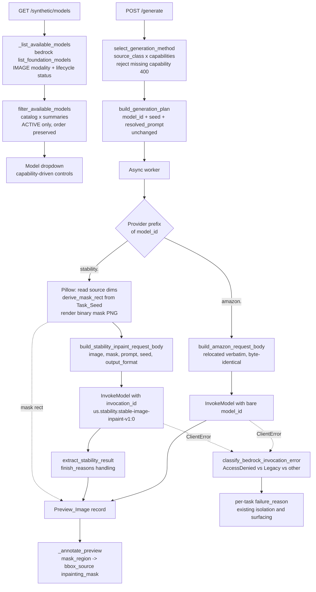

# Design Document: Stability Generation Models

## Overview

The synthetic defect data generation pipeline currently has zero usable models: `amazon.nova-canvas-v1:0` is LEGACY in us-east-1 and Bedrock rejects every `InvokeModel` call against it. This feature restores a working pipeline by adding `stability.stable-image-inpaint-v1:0` (invoked through its inference profile `us.stability.stable-image-inpaint-v1:0`) as a selectable generation model, and by making the availability filter lifecycle-aware so LEGACY models disappear from the dropdown instead of failing on every task.

The change respects the existing architectural split:

- **`synthetic_core.py`** (pure logic, no AWS imports, Hypothesis-property-tested) gains: the Stability catalog entry with an `invocation_id` field, lifecycle-aware `filter_available_models`, deterministic mask-rectangle derivation from the Task_Seed, per-provider request-body builders (the Amazon builder relocated verbatim to stay byte-identical), Stability response extraction with `finish_reasons` handling, generation-method selection with capability rejection, and Bedrock invocation-failure classification.
- **`synthetic_data.py`** (Lambda I/O) gains: lifecycle status in the model listing, Pillow-based mask PNG rendering and source-dimension reading (the imaging layer is already attached for `bbox_from_diff`), provider dispatch in the worker's `invoke_task`, inference-profile invocation, `mask_region` recording on Stability previews, and error classification wrapping around `InvokeModel`.
- **Frontend**: zero changes expected. `SyntheticData.tsx` renders capability flags and the seed/cfg_scale controls generically from the models response, so the new entry (inpainting + seed, no cfg_scale, no text-to-image, no image variation) renders correctly as-is (Req 1.5). The models response shape is preserved (Req 8.2); the extra `invocation_id` field on the Stability entry is ignored by the frontend.

Preservation constraints drive the design: the Amazon request body must remain byte-identical (Req 2.2, 8.1), the models response and session/preview/manifest record shapes must remain unchanged for Amazon models (Req 8.2, 8.3, 7.3, 7.4), and the Nova Canvas catalog entry stays so it reappears automatically if it returns to ACTIVE (Req 5.3).

### Research Summary

Facts verified live on the portal account (documented in requirements.md) and against AWS documentation:

- Bedrock Stability Image Services request schema for inpaint: `image` (base64, required), `mask` (base64, required), `prompt` (required), `negative_prompt` (optional), `seed` (optional, 0..4,294,967,294), `output_format` (optional). Response: `images` (list of base64 strings), `seeds`, `finish_reasons`. Per the [Stability AI Image Services documentation](https://docs.aws.amazon.com/bedrock/latest/userguide/stable-image-services.html), `finish_reasons` values are `null` on success, or one of `"Filter reason: prompt"`, `"Filter reason: output image"`, `"Filter reason: input image"`, `"Inference error"`.
- Direct invocation of `stability.stable-image-inpaint-v1:0` fails with an on-demand-throughput error; the inference profile `us.stability.stable-image-inpaint-v1:0` passes the access gate with no IAM changes needed.
- `bedrock:ListFoundationModels` returns `modelLifecycle.status` (ACTIVE or LEGACY) per model summary; the current `_list_available_model_ids` discards it.
- Stability inpaint mask convention: white (255) pixels mark the region to inpaint, black (0) pixels are preserved. The mask must match the source image dimensions.
- The existing annotation path already prefers `preview['mask_region']` over pixel diff (`_annotate_preview` returns bbox_source `'inpainting_mask'`), so Req 3.4 is satisfied by simply recording `mask_region` on Stability previews.

## Architecture

The generation flow with provider dispatch:



Everything left of the Bedrock calls is pure logic in `synthetic_core.py`; the Pillow rendering, S3 reads, and Bedrock invocations are the I/O seams in `synthetic_data.py`.

## Components and Interfaces

### 1. Model catalog entry (`synthetic_core.MODEL_CATALOG`) — Req 1.1, 1.2, 4.1, 5.3

A new entry appended after the existing Amazon entries (which are untouched):

```python
{
    "model_id": "stability.stable-image-inpaint-v1:0",
    "invocation_id": "us.stability.stable-image-inpaint-v1:0",
    "display_name": "Stability Stable Image Inpaint",
    "capabilities": {
        "text_to_image": False,
        "inpainting": True,
        "image_variation": False,
        "seed": True,
        "cfg_scale": False,
    },
    "max_images_per_call": 1,
    "randomization_defaults": {"seed": None},
}
```

`invocation_id` is a new optional field: absent on Amazon entries (Req 4.4 preserves bare-id invocation), present on the Stability entry. The frontend renders capability flags generically and ignores unknown fields, so the models response stays compatible (Req 8.2). The Nova Canvas and Titan entries are not modified (Req 5.3).

A small pure helper resolves the identifier used for `InvokeModel`:

```python
def invocation_model_id(entry):
    """The identifier to pass to Bedrock InvokeModel (Req 4.2, 4.4)."""
    return entry.get("invocation_id") or entry["model_id"]
```

### 2. Lifecycle-aware availability filter (`synthetic_core.filter_available_models`) — Req 5.1, 5.2, 6.2, 4.3, 1.3, 8.2

The filter's second parameter changes from bare model ids to model summaries carrying lifecycle status:

```python
def filter_available_models(catalog, available_models):
    """Catalog entries whose bare model_id appears in available_models
    with lifecycle status ACTIVE, preserving catalog order.

    available_models: iterable of {"model_id": str, "lifecycle_status": str}.
    Matching uses the entry's bare model_id, never invocation_id (Req 4.3).
    """
    active = {m["model_id"] for m in available_models
              if m.get("lifecycle_status") == "ACTIVE"}
    return [entry for entry in catalog if entry["model_id"] in active]
```

In `synthetic_data.py`, `_list_available_model_ids` is replaced by `_list_available_models`:

```python
def _list_available_models() -> List[Dict]:
    """IMAGE-modality model summaries in the portal region with
    lifecycle status (Req 5.1, 6.2)."""
    response = _bedrock_client().list_foundation_models(byOutputModality='IMAGE')
    return [{
        'model_id': s['modelId'],
        'lifecycle_status': s.get('modelLifecycle', {}).get('status', 'ACTIVE'),
    } for s in response.get('modelSummaries', [])]
```

A missing `modelLifecycle` defaults to ACTIVE (the field is always present in the real API; the default keeps stubs and moto simple and fails open rather than emptying the dropdown on an API shape change).

**Existing test impact**: `test_synthetic_data_unit.py` (2 sites) and `test_property_synthetic_rbac.py` (1 site) patch `_list_available_model_ids`; those patch sites move to `_list_available_models` returning summaries. `MODELS_EMPTY_GUIDANCE` is updated to also name the Stability inpaint model.

### 3. Mask rectangle derivation (`synthetic_core.derive_mask_rect`) — Req 3.2, 3.3

A pure, deterministic function mapping (Task_Seed, image dimensions) to the inpainting rectangle. No `random` module: pseudo-random values come from a splitmix64-style integer mixer over the seed, so results are stable across Python versions and processes.

```python
def derive_mask_rect(task_seed, image_width, image_height):
    """Deterministic inpainting rectangle {left, top, width, height}
    derived from the Task_Seed (Req 3.3).

    - width is 15-40% of image_width (min 1 px); height likewise.
    - Placement is center-biased: a 10% margin is kept on each side
      when the rectangle fits inside it, otherwise the full valid
      placement range is used.
    - The rectangle always lies fully within the image.
    """
```

Derivation sketch: four mixed values `m0..m3 = _mix(task_seed, salt)` for salts 0..3; `width = clamp(round(image_width * frac), 1, image_width)` with `frac = 0.15 + (m0 % 10_000) / 10_000 * 0.25`, same for height with `m1`; `left` uniform in `[margin, image_width - width - margin]` (falling back to `[0, image_width - width]` when the margin range is empty) using `m2`, same for `top` with `m3`. Degenerate 1-pixel images produce the 1x1 rectangle at the origin.

### 4. Mask PNG rendering (`synthetic_data._render_mask_png`) — Req 3.2

Pillow-based (imaging layer already attached to this Lambda):

```python
def _render_mask_png(rect: Dict, width: int, height: int) -> bytes:
    """Binary mask PNG matching the source dimensions: white (255)
    inside rect (the region to inpaint), black (0) elsewhere."""
```

Implementation: `Image.new('L', (width, height), 0)` + `ImageDraw.rectangle(..., fill=255)` + save to an in-memory PNG. A companion `_source_image_dimensions(image_bytes)` reads `(width, height)` of the source image via `Image.open`.

### 5. Request adapters — Req 2.1-2.4, 7.2, 8.1

**Amazon (relocation, not rewrite)**: `_build_image_request` moves verbatim from `synthetic_data.py` to `synthetic_core.py` as `build_amazon_request_body(model_entry, method, prompt, source_b64, seed, params, mask_prompt)`. The function body is already pure and is copied unchanged, so `json.dumps` of its output stays byte-identical for every input (Req 2.2, 8.1). `synthetic_data.py` imports it. A preservation property test pins the bytes against a frozen reference copy of the current implementation.

**Stability inpaint**:

```python
def build_stability_inpaint_request_body(prompt, source_image_b64,
                                         mask_image_b64, seed,
                                         output_format="png"):
    """Bedrock Stability inpaint request body (Req 2.3, 7.2).

    Exactly the fields {image, mask, prompt, seed, output_format};
    seed passed unmodified (Task_Seed range 0..858,993,459 is inside
    Stability's 0..4,294,967,294). seed=None omits the field.
    negative_prompt and guidance parameters are omitted: the entry's
    capability flags exclude them (Req 2.4).
    """
    body = {
        "image": source_image_b64,
        "mask": mask_image_b64,
        "prompt": prompt,
        "output_format": output_format,
    }
    if seed is not None:
        body["seed"] = int(seed)
    return body
```

**Provider dispatch** (worker, Req 2.1): `task["model_id"].split(".", 1)[0]` selects the adapter path — `"amazon"` takes the existing path unchanged; `"stability"` takes the inpaint path.

### 6. Stability response extraction (`synthetic_core.extract_stability_result`) — Req 2.5, 2.6

```python
class StabilityGenerationError(SyntheticCoreError):
    """Stability response carried no usable image; the message includes
    the finish reason reported by the model (Req 2.6)."""


def extract_stability_result(payload):
    """First generated image (base64 string) from a Stability response
    {images, seeds, finish_reasons} (Req 2.5).

    Raises StabilityGenerationError when finish_reasons[0] is non-null
    (content filtered / inference error) or images is empty, with the
    reported reason in the message (Req 2.6).
    """
```

The worker base64-decodes the returned string to image bytes, matching the form the Amazon path returns (Req 2.5). The existing `_invoke_image_model` (Amazon response parsing) is left untouched; a sibling `_invoke_stability_model(invocation_id, request_body) -> bytes` invokes Bedrock and delegates parsing to `extract_stability_result`.

### 7. Generation method selection with capability rejection (`synthetic_core.select_generation_method`) — Req 3.1, 3.5

The private `_select_generation_method` in `synthetic_data.py` is promoted to a pure core function that also enforces capability support:

```python
def select_generation_method(source_class, capabilities):
    """'inpainting' for normal sources on inpainting-capable models
    (Req 3.1); 'image_variation' otherwise — but raises ValidationError
    naming the missing capability when the required method is
    unsupported (Req 3.5)."""
    if source_class == "normal" and capabilities.get("inpainting"):
        return "inpainting"
    if capabilities.get("image_variation"):
        return "image_variation"
    raise ValidationError(
        "The selected model does not support image variation, which is "
        "required for this source classification"
    )
```

Amazon models declare both capabilities, so their behavior is unchanged. The `generate` endpoint calls this inside its existing `ValidationError -> 400` block, so a Defect_Image session targeting the Stability inpaint model is rejected before the plan persists (Req 3.5). The worker calls the same function when building `invoke_task`.

### 8. Invocation failure classification (`synthetic_core.classify_bedrock_invocation_error`) — Req 9.1, 9.2

```python
def classify_bedrock_invocation_error(error_code, error_message, model_id):
    """User-facing per-task failure reason for a Bedrock InvokeModel
    ClientError (Req 9.1, 9.2). Total: always returns a non-empty string.

    - AccessDeniedException -> "Bedrock model access is not granted for
      <model_id>: <message>"
    - ResourceNotFoundException whose message marks the model as
      Legacy -> "Model <model_id> is marked Legacy by the provider
      (lifecycle status): <message>"
    - anything else -> "<error_code>: <message>" passthrough
    """
```

In the worker's `invoke_task`, the `InvokeModel` call (both providers) is wrapped:

```python
except ClientError as exc:
    error = exc.response.get('Error', {})
    raise RuntimeError(classify_bedrock_invocation_error(
        error.get('Code', ''), error.get('Message', ''), invoke_id)) from exc
```

`execute_generation_tasks` already records `str(exc)` as the per-task `failure_reason` and continues with the remaining tasks (Req 9.3); `_record_last_failure` and the frontend's existing per-task error surfacing carry the classified message to the user (Req 9.4). Preview and session record fields are unchanged (Req 8.3) — only the message text improves.

### 9. Worker `invoke_task` for the Stability path — Req 3.2, 3.4, 4.2, 6.1, 7.3

```python
def invoke_task(task):
    source_bytes = <existing S3 get>
    entry = _model_entry(task["model_id"])
    if task["model_id"].startswith("stability."):
        width, height = _source_image_dimensions(source_bytes)
        rect = derive_mask_rect(task["seed"], width, height)
        mask_b64 = base64.b64encode(_render_mask_png(rect, width, height)).decode()
        body = build_stability_inpaint_request_body(
            task["resolved_prompt"], source_b64, mask_b64, task["seed"])
        image_bytes = _invoke_stability_model(invocation_model_id(entry), body)
        extra = {..., "generation_method": "inpainting", "mask_region": rect}
    else:
        <existing Amazon path, body via build_amazon_request_body,
         invoked with invocation_model_id(entry) == bare model_id>
    <existing staging PUT, unchanged>
```

All Bedrock clients remain the module-level portal-region clients (Req 6.1). `mask_region` on the preview feeds the existing `_annotate_preview` precedence (mask region → pixel diff → full image), yielding `bbox_source='inpainting_mask'` on the manifest record (Req 3.4). Preview items keep the exact field set used today (`preview_id`, `source_image_key`, `variation_index`, `resolved_prompt`, `seed`, `approval_state`, `status`, `staging_key`, `generation_method`, ...) plus `mask_region` on Stability previews (Req 7.3); session and manifest metadata shapes are unchanged (Req 7.4, 8.3).

## Data Models

### Model catalog entry (extended)

```python
{
    "model_id": str,             # bare foundation-model id (availability matching)
    "invocation_id": str,        # OPTIONAL: inference-profile id for InvokeModel
    "display_name": str,
    "capabilities": {
        "text_to_image": bool,
        "inpainting": bool,
        "image_variation": bool,
        "seed": bool,
        "cfg_scale": bool,
    },
    "max_images_per_call": int,
    "randomization_defaults": dict,
}
```

### Available model summary (new, replaces bare id list)

```python
{"model_id": str, "lifecycle_status": "ACTIVE" | "LEGACY"}
```

### Mask rectangle (new)

```python
{"left": int, "top": int, "width": int, "height": int}
# invariants: 1 <= width <= image_width, 1 <= height <= image_height,
#             0 <= left <= image_width - width, 0 <= top <= image_height - height
```

Stored verbatim as `mask_region` on the Preview_Image item (the field and its `'inpainting_mask'` annotation precedence already exist in `_annotate_preview`).

### Stability inpaint request body (Bedrock wire format)

```json
{
  "image": "<base64 source PNG>",
  "mask": "<base64 binary mask PNG, same dimensions as image>",
  "prompt": "<resolved prompt>",
  "seed": 12345,
  "output_format": "png"
}
```

### Stability response (Bedrock wire format)

```json
{
  "images": ["<base64 image>"],
  "seeds": ["12345"],
  "finish_reasons": [null]
}
```

`finish_reasons[0]` non-null values: `"Filter reason: prompt"`, `"Filter reason: output image"`, `"Filter reason: input image"`, `"Inference error"`.

### Unchanged shapes (preservation contracts)

- Amazon `InvokeModel` request body: byte-identical to today's `_build_image_request` output (Req 2.2, 8.1).
- `GET /synthetic/models` response: `{"models": [<catalog entries>], "guidance"?}` — Amazon entries byte-identical, order preserved (Req 8.2).
- Preview_Image, session META, and manifest record field sets (Req 7.3, 7.4, 8.3).

## Correctness Properties

*A property is a characteristic or behavior that should hold true across all valid executions of a system-essentially, a formal statement about what the system should do. Properties serve as the bridge between human-readable specifications and machine-verifiable correctness guarantees.*

The prework consolidated overlapping acceptance criteria: all availability-filter criteria (1.3, 4.3, 5.1, 5.2, 6.2, 8.2) collapse into one exactness property; the Amazon preservation criteria (2.2, 8.1) into one byte-preservation property; the Stability body criteria (2.3, 2.4, 7.2) into one exact-schema property; response extraction success and failure (2.5, 2.6) into one total property; method selection and rejection (3.1, 3.5) into one; invocation-identifier branches (4.2, 4.4) into one; failure classification branches (9.1, 9.2) into one. Req 9.3 (per-task failure isolation) is already pinned by the parent spec's `test_property_synthetic_worker_failures.py`, which must stay green, and is not duplicated here.

### Property 1: Lifecycle-aware availability filtering is exact

*For any* Model_Catalog (entries with and without an `invocation_id`) and any list of available-model summaries with arbitrary lifecycle statuses, `filter_available_models` returns exactly the catalog entries whose bare `model_id` appears in the summaries with status ACTIVE — in catalog order, with each returned entry equal to the original catalog entry — and the result is unaffected by the presence or value of any entry's `invocation_id`. Entries absent from the summaries or present with a non-ACTIVE status (e.g. Nova Canvas as LEGACY) are excluded.

**Validates: Requirements 1.3, 4.3, 5.1, 5.2, 6.2, 8.2**

### Property 2: Amazon request body byte-preservation

*For any* model entry (capability flags and randomization defaults), generation method, prompt, source image base64 string, seed (including None), params (including cfg_scale present/absent), and mask prompt, the JSON serialization of `build_amazon_request_body` is byte-identical to the serialization produced by the pre-change `_build_image_request` implementation (frozen as a reference in the test).

**Validates: Requirements 2.2, 2.4, 8.1**

### Property 3: Stability inpaint request body exact schema and seed passthrough

*For any* prompt, source image base64 string, mask image base64 string, and Task_Seed in 0..858,993,459, `build_stability_inpaint_request_body` produces a body whose key set is exactly `{image, mask, prompt, seed, output_format}` with each value equal to the corresponding input, the seed unmodified, and no capability-excluded parameter (negative_prompt, guidance/cfg keys) ever present; when the seed is None the `seed` key is omitted and the remaining key set is exact.

**Validates: Requirements 2.3, 2.4, 7.2**

### Property 4: Stability response extraction is total over payload shapes

*For any* Stability response payload with an `images` list and a `finish_reasons` list: when `finish_reasons[0]` is null and `images` is non-empty, `extract_stability_result` returns exactly `images[0]`; when `finish_reasons[0]` is any non-null reason string or `images` is empty, it raises a task failure whose message contains the reported reason.

**Validates: Requirements 2.5, 2.6**

### Property 5: Mask rectangle derivation is deterministic and in-bounds

*For any* Task_Seed in 0..858,993,459 and any image dimensions with width ≥ 1 and height ≥ 1: `derive_mask_rect` called twice with the same inputs returns the same rectangle; the rectangle lies fully within the image (left ≥ 0, top ≥ 0, left + width ≤ image_width, top + height ≤ image_height); and each side is within the clamped 15-40% size band (at least 1 pixel, at most the full dimension).

**Validates: Requirements 3.3**

### Property 6: Rendered mask PNG is binary and matches the rectangle

*For any* image dimensions and any rectangle fully within them, decoding the PNG produced by `_render_mask_png` yields an image of exactly the source dimensions in which every pixel is 0 or 255, and the set of 255-valued pixels is exactly the rectangle's area.

**Validates: Requirements 3.2**

### Property 7: Mask_Region takes annotation precedence

*For any* rectangle recorded as `mask_region` on a completed Preview_Image, `_annotate_preview` returns a bounding box equal to that rectangle with bounding-box source `inpainting_mask`, regardless of the pixel content of the generated image.

**Validates: Requirements 3.4**

### Property 8: Generation method selection and capability rejection are total

*For any* source classification (`normal` or `defect`) and any combination of capability flags: normal sources on an inpainting-capable model select `inpainting`; otherwise, if the model supports image variation, `image_variation` is selected; otherwise a ValidationError is raised whose message names the missing image-variation capability. Exactly one of these three outcomes occurs.

**Validates: Requirements 3.1, 3.5**

### Property 9: Invocation identifier selection

*For any* Model_Catalog entry, `invocation_model_id` returns the entry's `invocation_id` when the field is present and non-empty, and the entry's bare `model_id` otherwise — so Amazon entries (no `invocation_id`) always resolve to their bare model id.

**Validates: Requirements 4.2, 4.4**

### Property 10: Bedrock invocation failure classification is total

*For any* error code, error message, and model id: `classify_bedrock_invocation_error` always returns a non-empty reason; `AccessDeniedException` maps to a reason identifying that Bedrock model access is not granted and containing the model id; `ResourceNotFoundException` with a message marking the model as Legacy maps to a reason identifying the model's lifecycle status; every other code maps to a passthrough reason containing the original code and message.

**Validates: Requirements 9.1, 9.2**

## Error Handling

| Failure | Where detected | Behavior |
|---|---|---|
| Stability response filtered or errored (`finish_reasons[0]` non-null) or `images` empty | `extract_stability_result` (pure) | `StabilityGenerationError` with the reported reason; caught by `execute_generation_tasks`, recorded as the preview's `failure_reason`, remaining tasks continue (Req 2.6, 9.3) |
| `AccessDeniedException` on `InvokeModel` | worker `invoke_task` ClientError wrap | Classified reason naming missing Bedrock model access + model id; per-task failure, loop continues (Req 9.1, 9.3) |
| `ResourceNotFoundException` marking the model Legacy | worker `invoke_task` ClientError wrap | Classified reason naming the lifecycle status; per-task failure, loop continues (Req 9.2, 9.3) |
| Other Bedrock ClientError | worker `invoke_task` ClientError wrap | Passthrough reason `<code>: <message>`; per-task failure (Req 9.3) |
| Defect_Image sources targeting the Stability inpaint model (no image-variation capability) | `generate` endpoint via `select_generation_method` | 400 ValidationError naming the missing capability, before any plan persists (Req 3.5) |
| Source image undecodable by Pillow (dimensions unreadable) | worker `invoke_task` (Stability path) | Raises with a reason naming the unreadable source image; recorded as a per-task failure (existing isolation) |
| `ListFoundationModels` failure | `get_models` | Existing behavior preserved: empty available set, `models: []` + guidance (now also naming the Stability inpaint model) |
| LEGACY / not-offered models | `filter_available_models` | Silently excluded from the dropdown; catalog entries retained for automatic reappearance (Req 5.1-5.3) |

Failure recording is unchanged: `execute_generation_tasks` writes `failure_reason` on the preview item, `_record_last_failure` mirrors it on the session META, and the frontend's existing per-task error surfacing displays it (Req 9.4).

## Testing Strategy

The strategy follows the repo's established pattern: Hypothesis property tests over the pure functions in `synthetic_core.py` (no AWS mocks), moto-backed tests via `synthetic_env.SyntheticEnv` for endpoint and worker behavior, and the existing synthetic suite as a preservation gate.

### Property-based tests (Hypothesis)

- Library: Hypothesis (already used across `edge-cv-portal/backend/tests/`), minimum 100 iterations per property (repo default; `@settings(deadline=None)` as in sibling tests).
- One test per correctness property above, in new files following the `test_property_synthetic_*.py` naming convention (e.g. `test_property_stability_model_filtering.py`, `test_property_stability_request_bodies.py`, `test_property_stability_mask.py`, `test_property_stability_failure_classification.py`).
- Each test is tagged with a comment referencing its design property: **Feature: stability-generation-models, Property {number}: {property_text}**.
- Property 2 (byte-preservation) embeds a frozen copy of the current `_build_image_request` implementation as the reference oracle, mirroring `test_property_bedrock_sampling_preservation.py`.
- Properties 6 and 7 use Pillow in-memory only (no AWS); Property 7 stubs the S3 client argument (it is never reached when `mask_region` is present).
- Generators cover the edge cases: LEGACY statuses and absent models (Property 1), seed None and capability-flag combinations (Properties 2, 3, 8), all documented `finish_reasons` values and empty image lists (Property 4), 1-pixel and tiny images (Properties 5, 6).

### Example-based unit tests

- Catalog statics: the Stability entry's flags and `invocation_id` (Req 1.1, 1.2, 4.1); the Nova Canvas entry's retention (Req 5.3).
- `GET /synthetic/models` with a patched `_list_available_models`: Stability ACTIVE → included; Nova LEGACY → excluded (Req 1.3, 5.2); updated `MODELS_EMPTY_GUIDANCE`.
- Worker examples (moto + stubbed `bedrock-runtime`): a Stability-model session produces previews with the same base field set as Amazon previews plus `mask_region` and `generation_method: 'inpainting'` (Req 7.3), and the Bedrock stub receives `us.stability.stable-image-inpaint-v1:0` as the modelId (Req 4.2); an Amazon-model session still sends the bare model id (Req 4.4).
- Integration example: integrating a Stability session yields manifest records with `bounding-box-source: 'inpainting_mask'` and the existing record shape (Req 3.4, 7.4).
- Generate-endpoint rejection: defect-classified sources with the Stability model → 400 naming the missing capability (Req 3.5).

### Preservation gate

- The entire existing synthetic suite (`test_property_synthetic_*.py`, `test_synthetic_data_unit.py`, `test_synthetic_integration.py`) must pass unchanged except for the two known seam renames (`_list_available_model_ids` → `_list_available_models` patch sites in `test_synthetic_data_unit.py` and `test_property_synthetic_rbac.py`) — pinning Req 7.3, 8.1-8.3 and 9.3.
- The existing plan-completeness property's model-id strategy is extended to include the Stability model id (Req 1.4, 7.1).
- Frontend: `SyntheticData.test.tsx` passes unchanged (Req 1.5, 8.2); no frontend code changes are planned.

### Live verification (orchestrator task, not automated tests)

- Deploy and run a real generation session with the Stability inpaint model on the portal account (Req 6.1 smoke, 9.4 surfacing): confirm the model appears in the dropdown, Nova Canvas does not, a normal-source session generates previews with mask regions, and integration writes the manifest.
