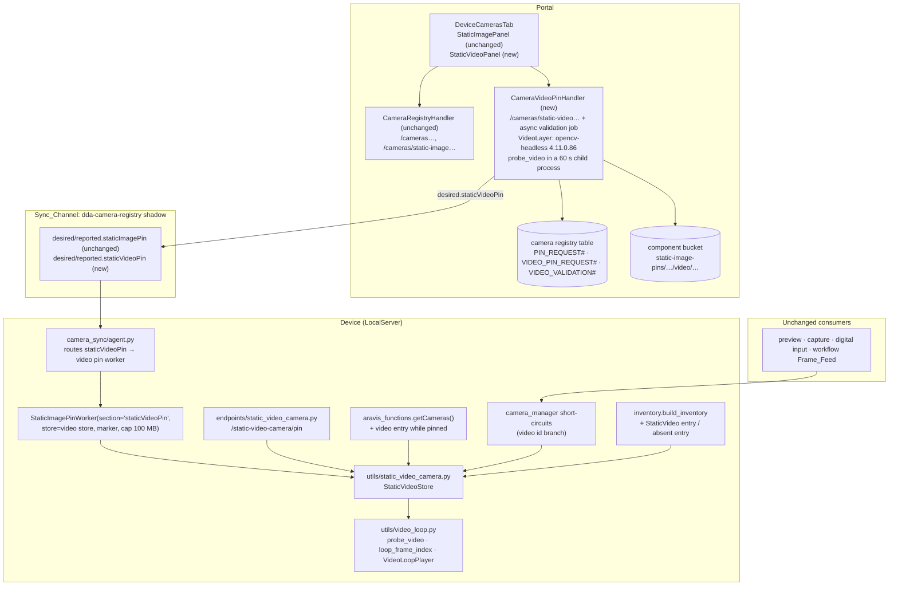

# Design Document

## Overview

A second virtual camera, the **Static_Video_Camera** (`static-video-camera`), joins the existing Static_Image_Camera. It is built the same way the image camera was built (base spec `static-image-camera-source`, Decision 1): a virtual camera at the LocalServer layer. There are two interception points: a synthetic enumeration entry in `aravis_functions.getCameras()`, and a short-circuit in `camera_manager.get_camera_frame()` that returns a frame from its own store. Every Frame_Consumer (preview, capture, digital-input triggers, workflow runs) reaches cameras only through those two modules, so the consumers need no change.

What is new is the store behind the short-circuit. `StaticVideoStore` holds one video file, and `get_frame()` returns the frame at the current Loop_Position. The position is computed from the wall clock and the pin time, so separate LocalServer processes and restarts agree on the frame without coordination. Decoding uses OpenCV's bundled FFmpeg, which is already installed in every LocalServer image.

The camera gets its own copy of each piece of the image camera's plumbing:

- an inventory entry (`StaticVideo`, capability family `staticVideo`) with its own absence lifecycle;
- its own sync slot (`desired/reported.staticVideoPin`) in the existing `dda-camera-registry` shadow;
- its own pin worker instance, its own device API (`/static-video-camera/pin`), and its own Portal routes (`/cameras/static-video…`);
- its own Portal panel and workflow-picker shortcut.

The Portal validates a video before accepting it by running the same validation module the device uses, on the same OpenCV version. This happens in a new Lambda function that carries an OpenCV layer. That Lambda shares the camera registry function's code and IAM role.

The Static_Image_Camera's code paths, identity, messages, and inventory entry stay as they are. Shared modules gain parallel branches for the video id; the image branches are not edited.

## Research Findings

### Decode capability (probed 2026-09-26)

The probe generated test clips with each image's `ffmpeg` and decoded them with its app-interpreter `cv2`. It covered the arm64 CPU (`arm64-1.1.0`), JetPack 5 (`arm64JP5-1.0.45`), JetPack 6 (`arm64JP6-1.0.69`), JetPack 7 (`arm64JP7-1.0.45`) and amd64 (x86 build server) images, plus a candidate Portal layer. The Portal layer is `opencv-python-headless==4.11.0.86` and `numpy==1.26.4` in `public.ecr.aws/lambda/python:3.12` for amd64.

| | Result |
|---|---|
| OpenCV | `cv2` 4.11.0 everywhere. The device images get it from the unpinned `opencv-python` requirement, held at 4.11.x by `numpy==1.24.3` because opencv-python 4.12 requires numpy 2 |
| Video I/O | FFmpeg backend YES (bundled avcodec 59.37 / avformat 59.27, identical in the headless wheel); GStreamer backend NO |
| Containers | MP4 (incl. faststart), MOV, MKV, WebM, AVI all open |
| Codecs | H.264, H.265/HEVC, MPEG-4 Part 2, MJPEG, VP8, VP9 decode. AV1 opens but no frame decodes: the wheel has no software AV1 decoder |
| Frame count | `CAP_PROP_FRAME_COUNT` equals the true decoded count for every clip, including MKV/WebM, B-frames, and 29.97 fps |
| Seeks | `set(CAP_PROP_POS_FRAMES, k)` + `read()` returns exactly the k-th sequential frame for all 16 probed indices on every clip. Clips: H.264 with GOP 30, H.264 with GOP 300 and B-frames, MKV with B-frames, HEVC, VP9, MJPEG, MPEG-4 at 29.97 fps. Reading at index `n` or beyond fails cleanly |
| Rotation | `CAP_PROP_ORIENTATION_META` reports it. Auto-rotation is off by default; with `CAP_PROP_ORIENTATION_AUTO=1` frames match ffmpeg's autorotated decode exactly at 90/180/270 |
| Portal layer size | 199 MB unzipped, 190 MB after dropping `cv2/data` (Haar cascades). The Lambda limit is 250 MB unzipped for function plus layers |

The amd64 NVIDIA image installs the same requirement. It is re-probed during implementation (task 13.2).

### Existing seams reused

- **Consumers** reach cameras through `aravis_functions` (enumeration) and `camera_manager` (grab/connect/status/features). The image camera's short-circuits are the template.
- **Image_Source defaults.** `image_source_accessor` picks the default pipeline by vendor, then model, falling back to the vendor's `default` model. `AWS-DDA/default` is already `capsfilter caps=video/x-raw,format=RGB ! videoconvert`. A camera with vendor `AWS-DDA` and model `Static Video Camera` therefore gets the RGB chain with no change to the sha256-pinned `default_camera_configurations.json`.
- **Inventory.** `inventory.build_inventory` appends the image entry and excludes its Aravis-enumerated duplicate by `camera_id`. The video camera needs the same pair of rules (third hardware finding in `static-image-camera-binding-and-pin-discoverability`).
- **Pin worker.** `StaticImagePinWorker` already takes `store_factory` and `marker_path`. Its section name, download cap, and "nothing pinned" marker are constants and become constructor parameters with the current values as defaults.
- **Workflow binding.** `camera_binding._CAMERA_ID_CAPABILITY_FAMILIES` controls the capabilities fallback for the camera id. The Portal mirrors it in `cameraIdValue()` / `isAravisCompatibleCamera()` and in the deployment validator's compatible type set.
- **Trigger kinds.** Workflows run on MQTT, OPC UA, and digital-input triggers plus manual/API runs. Each run grabs one frame, which is what Loop_Playback serves.
- **Device UI.** The Device UI preview polls `POST /image-sources/{id}/preview` every 500 ms. No mounted component uses the `/streams` broadcaster, so no stream backend is needed.

## Key Decisions

### Decision 1: A separate camera with its own identity and slot

```python
STATIC_VIDEO_CAMERA_ID = "static-video-camera"
STATIC_VIDEO_CAMERA_IDENTITY = {
    "id": STATIC_VIDEO_CAMERA_ID,
    "model": "Static Video Camera",
    "address": "internal",
    "physical_id": STATIC_VIDEO_CAMERA_ID,
    "protocol": "StaticVideo",
    "serial": "STATIC-VIDEO-0",
    "vendor": "AWS-DDA",
}
```

This follows the user's choice. It keeps every image-camera contract that tests pin untouched: identity, `StaticImage` entry shape, `staticImage` capability family, Pin_Request SK layout, and desired-document schema. It also lets a workflow bind one node to the image camera and another to the video camera. Every video-specific artifact is a sibling of its image counterpart, never a variant of it.

### Decision 2: OpenCV's FFmpeg backend, imported lazily

Decoding uses `cv2.VideoCapture(path, cv2.CAP_FFMPEG)`. It is already installed on every platform, decodes the same codec set everywhere, gives frame-exact seeks, and needs no new dependency on the device.

Rejected alternatives:

- **GStreamer** (`decodebin`): the core module must stay gi-free. `decodebin` auto-plugs `nvv4l2decoder`/NVMM on Jetson. JP6 has the in-process libjpeg collision, and JP7 has no NVIDIA multimedia plugins.
- **PyAV**: it would add a dependency to a preservation-tracked requirements file. Its FFmpeg build also differs from OpenCV's, for example it decodes AV1, so the Portal and device decisions would diverge.
- **An `ffmpeg` subprocess or transcoding**: this adds process management and pin-time cost.

`cv2` is imported inside the video functions only, so processes that never touch the video camera never load it.

### Decision 3: Loop position from the wall clock, anchored at the pin time

```
period_ms  = 1000 / fps
loop_ms    = frameCount × period_ms
elapsed_ms = (now_ms − pinnedAtEpochMs) mod loop_ms    # Python float mod ∈ [0, loop_ms)
index      = min(floor(elapsed_ms / period_ms), frameCount − 1)
```

This is a pure function of the sidecar and the clock:

- Every process agrees without IPC (Requirement 3.4).
- A restart resumes where playback "would be" (7.2).
- A replacement restarts the loop, because it writes a new `pinnedAtEpochMs` (5.2).
- Tests inject the clock.

### Decision 4: On-demand decoding with forward stepping and exact seeks

Each store instance (one per process) owns at most one `VideoLoopPlayer`: an open `VideoCapture`, the index of the next frame it will read, and the last decoded frame. To serve frame `target`:

1. If `target` is the cached index, return the cached frame (Requirement 3.3).
2. If `next ≤ target ≤ next + ceil(2·fps)`, `grab()` forward, then `read()`. This is the common case of grabs a fraction of a second apart.
3. Otherwise `set(CAP_PROP_POS_FRAMES, target)` + `read()`. Seeks are frame-exact per the probe, and Property 5 proves both paths agree per clip.
4. If `read()` fails, reopen once and retry by seek; otherwise raise (Requirement 3.10).

Frames go through `cvtColor(BGR→RGB)` with `CAP_PROP_ORIENTATION_AUTO=1` and come out in the existing frame contract `{'data', 'width', 'height', 'pixel_format': 'RGB'}`. The player is keyed on the media file's `(st_ino, st_mtime_ns, st_size)`. When that key changes or the file is missing, the next grab closes the stale decoder (Requirement 5.5). Nothing decodes without a grab (3.9).

### Decision 5: Video_Validation at pin time, shared by device and Portal

`src/backend/utils/video_loop.py` is stdlib-only at import time. It holds validation, the loop index, and the player. The Portal vendors a byte-identical copy (`edge-cv-portal/backend/functions/video_loop.py`) under a sha256 parity test, the same discipline as the vendored `workflow_core`.

Validation (`probe_video(path)`):

1. **Sniff** the container from the first 64 bytes:
   - ISO-BMFF `ftyp`: brand `qt  ` → MOV, otherwise MP4.
   - A leading QuickTime `moov`/`wide`/`mdat` atom → MOV.
   - `RIFF….AVI ` → AVI.
   - EBML `1A 45 DF A3`: DocType `webm` → WEBM, otherwise MKV.
   - Anything else → "not a supported video" plus the container list.
2. **Open** with `CAP_FFMPEG` and `CAP_PROP_ORIENTATION_AUTO=1`. Then require:
   - `0 < fps ≤ 240` and `frameCount ≥ 1`;
   - frame 0 decodes;
   - displayed width and height ≤ 4096 (from the decoded frame shape);
   - frame `frameCount − 1` decodes.
   
   If the container over-reports its frame count, back off up to `ceil(fps)` frames to find the last decodable frame and record the exact count. If none decodes, reject as damaged or truncated.
3. **Codec.** `CAP_PROP_FOURCC` is normalized to `H264`/`HEVC`/`MPEG4`/`MJPEG`/`VP8`/`VP9`/`AV1`, else the raw fourcc. This is informational. Acceptance is decided by decoding, which is what rejects AV1 with the codec named.

The size limit (100 MB) is applied before probing, on both sides.

### Decision 6: Device store mirrors the image store's discipline

`src/backend/utils/static_video_camera.py` provides `StaticVideoStore` and `get_store()`. Storage is `$COMPONENT_WORK_PATH/static_video_camera/`, holding `pinned_video` and the sidecar `pinned_video.json`. Disk is the source of truth.

A pin stages the bytes into `.tmp-*` (or stream-copies them for pin-by-reference), fsyncs, and probes. Under the store lock it then `os.replace`s the staged file onto `pinned_video`, atomically writes the sidecar, and drops the caches and player. Any failure removes the staged file, so the prior video, metadata, and Loop_Epoch are untouched (Requirements 1.9, 5.1). `status()`/`is_pinned()` inspect the video by opening it, decoding frame 0, and closing it; the result is cached per media stat key. They log missing versus undecodable data like the image store (7.3).

Exceptions are `StaticVideoPinError` and `StaticVideoUnavailableError`. Removal on an empty store raises "Cannot remove the pinned video: no video is pinned." (5.4). Grab failures read "Static video camera 'static-video-camera': no usable pinned video is available (pin a video through the video pin API before grabbing frames): …" (3.10).

### Decision 7: Shadow slot and budget

The video slot is `desired.staticVideoPin` / `reported.staticVideoPin` in the existing `dda-camera-registry` shadow. It has the same field set as the image slot (`requestId, op, requestedAtEpochMs, bucket, key, sha256, sizeBytes, format, fileName`), the same full-width explicit-null writes, and the same stale-echo clear.

A new named shadow was rejected. It would need ShadowManager synchronization and deployment-configuration changes on every device, plus IoT policy review.

Budget (Requirement 10.5):

| Section | Size |
|---|---|
| Worst-case desired slot (`key` includes a 128-char thing name; 63-char bucket; `fileName` truncated to 128) | 597 B (image), 603 B (video) |
| Echo (status, metadata, reason; the video reason is bounded to 256 JSON-escaped characters) | 850 B (image, applied), ≤ 996 B (video) |
| Two slots together (measured) | 3,144 B |

The agent's report cap follows the shadow document size limit in effect (Requirements 10.5, 10.6): cap = clamp(limit − 3,584, 1,024, 10,240) bytes (`report_cap_for_shadow_limit`). The 3,584 B reserve is the measured 3,144 B for both slots plus 440 B for an image failure reason (the image reason stays unbounded, as today).

- At the 8 KB default the cap is 4,608 B (`MAX_REPORT_BYTES`, down from 6,144): 4,608 + 3,144 = 7,752 B. The 5 KB first proposed would overrun 8 KB by 72 B in this worst case.
- From a 13,824 B limit up the cap is the 10 KB ceiling; at the requested 16 KB quota, 10,240 + 3,144 = 13,384 B.
- The truncation ladder that enforces the cap is unchanged; a 12-camera fat inventory still fits the default cap (4,269 B).

Where the limit comes from:

- **Cloud and local limits.** The AWS IoT quota `L-A295A064` ("Maximum size of a JSON state document", 8,192 B by default, adjustable per account and region) bounds the cloud shadow. ShadowManager's `shadowDocumentSizeLimitBytes` (default 8,192, maximum 30,720) bounds the local shadow, and ShadowManager's documentation requires raising the two together.
- **Portal.** `deployments.py` reads the quota with `servicequotas:GetServiceQuota` (`account_shadow_document_limit`, cached per account and region for 15 minutes) and writes min(quota, 30,720) into the submitted ShadowManager merge (`apply_shadow_document_size_limit`). This runs on LocalServer deployments and on workflow revisions that carry ShadowManager. A default quota leaves the merge byte-identical; an unreadable quota changes nothing. The grant is scoped to the one quota ARN, on the Deployments role (single-account Use_Cases) and `DDAPortalAccessRole` (cross-account Use_Cases), and recorded in `iam_post_fix_approved_additions.json`.
- **Device.** The agent reads ShadowManager's configuration over IPC GetConfiguration (`shadow_manager_size_limit_provider`), at most every 300 s, so a deployment that raises the limit takes effect without a restart. An unset or unreadable limit means the 8 KB default.
- **Safety net.** A size rejection of a report (ShadowManager's `InvalidArgumentsError`, "The payload exceeds the maximum size allowed", code 413) halves the cap for the retry, down to 1 KB, until the limit changes.

Rejected: a fixed 10 KB cap, which overruns the default 8 KB quota; and the device reading Service Quotas itself, which needs a device-role IAM change and would still be blocked by ShadowManager's local limit.

The bound on the video reason (`pin_worker.bound_reason`) applies to the JSON-escaped form, so it also bounds the encoded bytes of non-ASCII reasons. The marker keeps the full reason for local diagnostics.

### Decision 8: Portal validation runs in its own Lambda

`CameraVideoPinHandler` is a new function, `dda-portal-camera-video-pin` (python3.12, x86_64, 2048 MB, 120 s, 1 GiB ephemeral storage). It serves only the four `/cameras/static-video…` routes and the validation job, and is configured as follows:

- **Code:** the same `backend/functions` asset as `CameraRegistryHandler`, with its own entry point `camera_video_pin.handler`. It serves only the static-video routes (anything else is a 404) through the video handlers in `camera_registry.py`, and runs validation jobs (events carrying `videoValidation`). A separate entry point keeps the infra tests that locate the registry function by its handler name unambiguous.
- **Role:** `CameraRegistryHandler`'s existing role. The one added statement is `lambda:InvokeFunction` on this function's own fixed-name ARN, for the job hand-off (an approved addition in the IAM gate).
- **Layers:** the shared layer plus a new `VideoLayer`. The VideoLayer is bundled at synth like `ImagingLayer`: `opencv-python-headless==4.11.0.86` and `numpy==1.26.4` for manylinux x86_64 cp312, with `cv2/data` removed.

The package is about 203 MB against the 250 MB limit. An infra test guards the bundled layer size (≤ 200 MB) and asserts the layer is attached only to this function. `CameraRegistryHandler` itself is unchanged.

**Asynchronous validation (Requirements 8.2–8.5).** The 60 s decode budget exceeds the API Gateway integration timeout (29 s; the Portal API is edge-optimized, so it cannot be raised). The pin route therefore runs only the checks that need no decoding and hands the rest to a job:

1. The pin route checks authorization, the body, the staged object's presence and the 100 MB limit (HeadObject), and rejects at once when one fails.
2. It supersedes the device's submissions still `validating` (and deletes their staged objects), writes a `VIDEO_VALIDATION#{createdAtMs:014d}#{uuid8}` record in state `validating`, invokes this function asynchronously (`InvocationType=Event`, by the fixed name in `VIDEO_VALIDATION_FUNCTION`), and answers 202 with the validation id. A failed invocation rejects the record and answers 502.
3. The job (`run_video_validation`) ignores a record that already left `validating`, so a second run is harmless. It supersedes the record when a newer validation record or Video_Pin_Request exists, both before the download and again after the decode. It refuses a record older than 5 minutes.
4. The job downloads the staged object to `/tmp` (hashing it, re-checking the limit) and runs the probe in a child process (`python video_loop.py probe <path>`, `PYTHONPATH` from the parent's `sys.path`) with a 60 s timeout. The timeout is necessary because a native decode cannot be interrupted in-process. The child prints the probe result as JSON.
5. A rejection records the message on the record (`rejected`) and deletes the staged object; no Video_Pin_Request is written. An acceptance runs the submission flow below and records `accepted` with the Video_Pin_Request id and the validated metadata.

Async retries are off (`MaximumRetryAttempts: 0`, event age ≤ 5 minutes). A job that dies leaves its record `validating`, and the status view shows it `expired` after 5 minutes, asking for a new submission. The video status view adds `validation`: the latest record's status (`validating`, `accepted`, `rejected`, `superseded` or `expired`), error, file name, Video_Pin_Request id and validated metadata.

### Decision 9: S3 layout inside the existing prefix

| Object | Key |
|---|---|
| Staging | `static-image-pins/staging/{uuid}` (shared with images; same 1-day lifecycle rule and CORS) |
| Canonical | `static-image-pins/{deviceId}/video/{pinRequestId}` |

The existing `StaticImagePinPrefixAccess` (Get/Put/Delete on `static-image-pins/*`) and `StaticImagePinCanonicalCleanup` grants cover both. Device TES roles already read `dda-component-*/*`.

### Decision 10: Portal records are a parallel family

Video Pin_Request items use SK `VIDEO_PIN_REQUEST#{createdAtMs:014d}#{uuid8}`, which does not share the `PIN_REQUEST#` prefix. Image queries (`begins_with(PIN_REQUEST#)`) therefore never see them, and supersede, status, and history stay per camera (Requirement 8.9).

- `pin_requests.py` gains an `sk_prefix` keyword with the image default; the caller passes the camera's registry entry to the status view.
- The status view reads `deviceReported` from `CAMERA#static-video-camera`.
- The ingest (`camera_sync.py`) routes `reported.staticVideoPin` to the video family. An applied remove marks `CAMERA#static-video-camera` absent right away. Unlike the image camera there is no shadow-key cleanup write: every build that knows the video camera reports it explicitly absent, and an entry the report omits is marked absent, never deleted.
- Video items also carry the Portal-validated metadata (`validated_metadata`), which the audit event records.
- The asynchronous validation records (`VIDEO_VALIDATION#…`, Decision 8) live in the same partition and share no prefix with either request family.

## Architecture



### Request flows

**Device pin:**
1. `POST /static-video-camera/pin`: multipart `file`, body capped at 100 MB + 64 KiB, or JSON `{"capturedImagePath"}`.
2. `StaticVideoStore.pin_bytes`/`pin_file`: size check, stage, `probe_video`, commit.
3. Respond `{cameraId: "static-video-camera", metadata}`.

**Portal pin:**
1. `POST …/static-video/upload-url` returns a presigned PUT to staging.
2. The browser PUTs with progress events.
3. `POST …/static-video/pin` `{stagingKey, fileName}`: HEAD and check the 100 MB limit, supersede submissions still validating, write the `VIDEO_VALIDATION#` record, invoke the validation job asynchronously, and return 202 `{validationId, deviceId, status: "validating"}` (Decision 8).
4. The validation job:
   1. Check the record is still `validating` and not superseded.
   2. GET, then sha256 and write to `/tmp`.
   3. Run the child-process `probe_video` (60 s). A rejection is recorded on the record and ends the job.
   4. Check supersession again.
   5. Build the item (`VIDEO_PIN_REQUEST#`, with `validated_metadata`) and check the desired section is ≤ 1024 B.
   6. Supersede pending video requests only, then insert the item.
   7. CopyObject to the canonical key.
   8. Write `desired.staticVideoPin` and clear `reported.staticVideoPin`.
   9. Delete the staged object, audit `pin_static_video` as the submitting user, and record `accepted` with the Video_Pin_Request id.
5. The browser polls the video status view until `validation` leaves `validating`, then follows `latest` as for images.
6. The device agent receives `state.staticVideoPin` and hands it to the video pin worker. The worker retrieves with the unchanged policy and a 100 MB cap, verifies the sha256, and applies with `StaticVideoStore.pin_bytes`. It writes its marker to `static_video_camera/applied_pin_request.json`, echoes `reported.staticVideoPin`, and triggers the inventory.
7. The Portal ingest reduces the echo and records `applied` (with device metadata) or `failed` (with the store's reason).

**Grab:** `get_camera_frame("static-video-camera")` → `get_video_store().get_frame()` (before `get_frame_lock`) → sidecar (cached by stat key) → `loop_frame_index(now)` → player → RGB frame dict.

## Components and Interfaces

### Device

1. **`src/backend/utils/video_loop.py`** (new, stdlib-only at import; vendored verbatim to the Portal):
   - constants `SUPPORTED_VIDEO_CONTAINERS`, `SUPPORTED_VIDEO_CODECS`, `MAX_PIN_VIDEO_BYTES = 100 MiB`, `MAX_VIDEO_DIMENSION = 4096`, `MAX_VIDEO_FPS = 240.0`, `SNIFF_BYTES = 64`;
   - `VideoValidationError`;
   - `sniff_video_container(head)` and `normalize_codec(fourcc)`;
   - `VideoInfo(container, codec, width, height, fps, frame_count)` and `probe_video(path) -> VideoInfo`;
   - `loop_frame_index(now_ms, epoch_ms, fps, frame_count)`;
   - `VideoLoopPlayer(path, fps, frame_count)` with `.frame(index)` and `.close()`.
2. **`src/backend/utils/static_video_camera.py`** (new, gi-free): the identity constants, errors, `StaticVideoStore(base_dir=None, max_file_bytes=MAX_PIN_VIDEO_BYTES, clock=None)` with `pin_bytes`, `pin_file`, `status`, `is_pinned`, `unpin`, `get_frame`, and `get_store()`.
3. **`src/backend/endpoints/static_video_camera.py`** (new router, registered in `app.py`): `POST`/`GET`/`DELETE /static-video-camera/pin`. It has the same shapes as the image Pin_API with a video body cap. The multipart parser and captured-roots guard are reused by import from the image endpoint module, not copied.
4. **`edge_ml1_p_camera_management/aravis_functions.py`**:
   - `getCameras()` appends `Camera(**STATIC_VIDEO_CAMERA_IDENTITY)` in its own `try/except` while the video store is pinned (Requirement 2.6).
   - `getCamera()` returns a video handle when pinned, else `AravisCameraNotFound`.
5. **`utils/camera_manager.py`**: video-id branches next to the image ones for `get_camera_status`, `connect_camera`, `disconnect_camera`, `get_camera_feature_bounds`, `apply_camera_features` and `get_camera_frame`. All of them sit before `get_frame_lock` and `camera_objects`.
6. **`camera_sync/inventory.py`**: `TYPE_STATIC_VIDEO = "StaticVideo"`, `_is_static_video_aravis_camera` (exclusion by `camera_id`), `_static_video_identity`/`_static_video_entry`/`_static_video_absent_entry`, and new keyword parameters `static_video_pinned`, `static_video_metadata`, `static_video_absent_since`. The image parameters and branches are untouched.
7. **`camera_sync/pin_worker.py`**: new constructor parameters, all defaulting to today's values: `section_name`, `max_download_bytes`, `no_media_marker`, `pin_error_type`, `reason_max_chars` (`None`), plus `marker_path_factory` (the lazily resolved marker location; the agent's constructor must not need `COMPONENT_WORK_PATH`) and `label` (log wording). The hardcoded `"staticImagePin"` in partial-delivery resolution and in the echo come from `section_name`.
8. **`camera_sync/agent.py`**:
   - A second worker, `video_pin_worker`, built by `make_video_pin_worker()` and owned and started like the first.
   - `on_delta` routes `state.staticVideoPin`, and the startup catch-up hands off `desired.staticVideoPin`.
   - Discovery-managed rejection covers the video id.
   - `_load_inventory` passes the video pin state with its own absence seeding (marker or shadow, like `_seed_static_absence`).
   - The report cap follows the shadow size limit (Decision 7): `report_cap_for_shadow_limit`, `shadow_manager_size_limit_provider` (wired in `utils/server_setup.py`), and the size-rejection back-off. `MAX_REPORT_BYTES = 4608` is the default-limit cap.
9. **`workflow_engine/runtime.py`**: the `inventory_provider` passes the video pin state, guarded exactly like the image state.
10. **`workflow_engine/camera_binding.py`**: `_CAMERA_ID_CAPABILITY_FAMILIES = ("staticImage", "staticVideo")`.

### Portal

11. **`functions/video_loop.py`**: a verbatim copy of the device module; a test asserts the sha256 is equal.
12. **`functions/camera_registry.py`**:
    - Parallel video handlers `get_static_video_upload_url`, `pin_static_video`, `remove_static_video_pin`, `get_static_video_status`, next to the image handlers, which are untouched (a `PinSlot` refactor of the image paths was rejected to keep them byte-for-byte as tested).
    - The validation job `run_video_validation` and the submission flow `submit_validated_video` (Decision 8), with the `dispatch_video_validation` seam (Event invocation of `VIDEO_VALIDATION_FUNCTION`).
    - `video_validation_verdict(path)` runs `probe_video` in a child process with a 60 s timeout (`run_video_probe` seam).
    - **`functions/camera_video_pin.py`**: the function's entry point (routes the job events and only the static-video paths).
13. **`functions/pin_requests.py`**: an `sk_prefix` keyword (image default) on the item builder, queries, get, supersede, confirmation, and status view; `validated_metadata` passthrough; and the `VIDEO_VALIDATION#` record helpers (build, get, query, the conditional `validating → accepted | rejected | superseded` transition, supersede, `newer_video_activity`, and `video_validation_view` with the 5-minute expiry).
14. **`functions/camera_sync.py`**: `_process_pin_section` runs for `staticImagePin` (unchanged); `_process_video_pin_section` reduces `staticVideoPin` on the video family and marks `CAMERA#static-video-camera` absent on an applied remove.
15. **`functions/deployments.py`**: `aravis_camera_source` compatible types become `{'Camera', 'AravisDiscovered', 'StaticImage', 'StaticVideo'}`; ShadowManager's size limit follows the account quota (Decision 7).
16. **Infrastructure**:
    - `compute-stack.ts`: the `VideoLayer` and `CameraVideoPinHandler` (fixed name, role = `cameraRegistryHandler.role`, the self-invoke grant, async retries off), and the Deployments role's quota read.
    - `usecase-account-stack.ts`: the quota read on `DDAPortalAccessRole`.
    - `camera-registry-api-stack.ts`: four routes on `/devices/{id}/cameras/static-video`, `…/upload-url` and `…/pin` (POST, DELETE), integrated with the new function under the same Cognito authorizer.
17. **Frontend**:
    - `components/StaticVideoPanel.tsx` (new): the video panel with a status poll, upload with a 100 MB pre-check and progress (the existing `putFileWithProgress` XHR helper in `utils/detectorConversion.ts`), the validating state and a rejected validation's message, video metadata rows, the loop note, and replace/remove gated on the mutation role. It is mounted after `StaticImagePanel` in `DeviceCamerasTab.tsx` with focus support (`?focus=static-video`).
    - `services/api.ts`: the four video methods.
    - `pages/workflows/cameraReference.ts`: the video status and metadata types, `STATIC_VIDEO_FOCUS_VALUE`, `StaticVideo` in `isAravisCompatibleCamera()`, and the `capabilities.staticVideo.id` fallback in `cameraIdValue()`.
    - `NodeConfigPanel.tsx`: a second shortcut, "Pin a test video…".
    - `DeviceDetail.tsx`: read the new focus value.

### Unchanged (verified)

- `utils/static_image_camera.py`, `endpoints/static_image_camera.py` (only imported from), the image store's on-disk layout, `default_camera_configurations.json`, the DB backfill, `pipeline_executor.py` (CSI-golden-pinned), and the vendored node catalog.
- Every Dockerfile, `src/docker-compose.yaml`, `src/backend/requirements.txt`, the recipes, and `setup_station.sh`.
- All IAM statements, `CameraRegistryHandler`'s configuration, and the S3 lifecycle/CORS custom resources.

### Preservation-tracked files touched

`src/backend/app.py` (router registration) and `src/backend/utils/camera_manager.py` (video short-circuits) are hash-pinned in `test/backend-test/security/baselines/iam_out_of_scope_baseline.json`. Both hashes are rebaselined in the same change, with a note entry naming this spec and the exact edits, per `.kiro/steering/builds.md`.

## Data Models

### Video sidecar (`static_video_camera/pinned_video.json`)

```json
{
  "fileName": "conveyor_loop.mp4",
  "format": "MP4",
  "codec": "H264",
  "width": 1920,
  "height": 1080,
  "fps": 29.97002997002997,
  "frameCount": 899,
  "durationMs": 29996,
  "fileSizeBytes": 41943040,
  "pinnedAtEpochMs": 1790400000000
}
```

### Inventory entry

```json
"static-video-camera": {
  "name": "Static Video Camera",
  "type": "StaticVideo",
  "origin": "edge-discovered",
  "params": {},
  "capabilities": {
    "staticVideo": {
      "id": "static-video-camera",
      "model": "Static Video Camera",
      "address": "internal",
      "physicalId": "static-video-camera",
      "protocol": "StaticVideo",
      "serial": "STATIC-VIDEO-0",
      "vendor": "AWS-DDA",
      "…sidecar fields…": "…"
    }
  }
}
```

The absent form keeps the identity with no sidecar fields, plus `absent: true` and `absentSince`.

### Portal

The Video_Pin_Request item has the image item's fields (`s3_bucket`, `s3_key`, `sha256`, `size_bytes`, `format`, `file_name`, …) under SK `VIDEO_PIN_REQUEST#…`, plus `validated_metadata` (`codec`, `width`, `height`, `fps`, `frameCount`, `durationMs`). The status response shape matches the image status view; `deviceMetadata` holds the device-reported sidecar.

## Correctness Properties

*A property is a characteristic or behavior that should hold true across all valid executions of a system — essentially, a formal statement about what the system should do. Properties serve as the bridge between human-readable specifications and machine-verifiable correctness guarantees.*

Device properties run against `StaticVideoStore` over `tmp_path` with an injected clock and a session clip library synthesized with the image's `ffmpeg`. The library covers:

- H.264 in MP4, MOV and MKV (the MKV with B-frames);
- HEVC in MP4, MPEG-4 in MP4 at 29.97 fps, MJPEG in AVI, VP8 and VP9 in WebM;
- an AV1 clip;
- rotation 90/180/270;
- tiny frame sizes.

Reference frames come from one sequential decode per clip, converted to RGB.

### Property 1: Loop index arithmetic
*For any* `fps ∈ (0, 240]`, `frameCount ≥ 1`, epoch and time: `loop_frame_index` lies in `[0, frameCount)`, is periodic with period `frameCount·1000/fps` ms, is non-decreasing within one period, and equals the closed form.
**Validates: Requirements 3.1, 3.2**

### Property 2: Pin round trip and loop fidelity
*For any* library clip, prior state, and grab time, pinning succeeds, and the metadata reports the clip's container, codec, displayed size, fps, frame count, duration, file name, and size. A grab at `t` returns exactly the reference RGB frame at `loop_frame_index(t)`, tagged `RGB`, with `len(data) == 3·w·h`.
**Validates: Requirements 1.1, 1.2, 1.8, 3.1, 3.5**

### Property 3: Cross-process consistency
*For any* clip and time, two store instances over one directory, and a fresh instance created after them, return byte-identical frames.
**Validates: Requirements 3.4, 7.1, 7.2**

### Property 4: Interval idempotence and acquisition-config invariance
*For any* clip, two times in the same frame interval, and any acquisition config, grabs through `camera_manager.get_camera_frame("static-video-camera", config)` return byte-identical frames.
**Validates: Requirements 3.3, 3.7**

### Property 5: Step/seek equivalence
*For any* clip and sequence of requested indices (steps inside and beyond the window, backward jumps, wraps, repeats), every `VideoLoopPlayer.frame(i)` equals reference frame `i`.
**Validates: Requirements 3.1, 3.3, 3.8**

### Property 6: Invalid input preserves prior state
*For any* prior state and invalid input, the pin fails with the specified wording, and the prior status, metadata, Loop_Epoch, frame at a fixed time, and enumeration presence are unchanged. No `.tmp-*` file remains. Invalid inputs:
- a non-video file;
- a sniffable header followed by garbage;
- a truncated clip;
- the AV1 clip;
- an oversize file against an injected limit;
- fps, dimension, or frame-count violations via a stubbed probe.

**Validates: Requirements 1.3, 1.4, 1.5, 1.6, 1.9, 10.4**

### Property 7: Replace atomicity and decoder release
*For any* sequence of clip pins and unpins, every grab after a confirmation returns the new video's frame at its new epoch, or fails after an unpin. At most one media file remains, and a stale player is closed by the next grab.
**Validates: Requirements 5.1, 5.2, 5.3, 5.5, 10.3, 10.4**

### Property 8: Corruption containment
*For any* corruption mode, a fresh store logs the cause category, reports not pinned, fails grabs naming the video camera, leaves the rest of the enumeration unchanged, and accepts a restoring pin. Corruption modes: media deleted, truncated to its header, or overwritten; sidecar missing or not JSON.
**Validates: Requirements 3.10, 7.3**

### Property 9: Rotation honored
*For any* clip with rotation `r ∈ {0, 90, 180, 270}`, the served first frame equals ffmpeg's autorotated decode, and the displayed dimensions are reported.
**Validates: Requirements 3.6**

### Property 10: Enumeration and inventory iff pinned, independent of the image camera
*For any* interleaving of image and video pin/unpin operations and any physical camera list:
- enumeration contains the video entry exactly while a video is pinned and the image entry exactly while an image is pinned;
- physical entries are unchanged and in order;
- `build_inventory` emits one `StaticVideo` entry while pinned, an absent entry after a reported unpin, and never the Aravis-enumerated duplicate;
- each camera's status and frames depend only on its own operations.

**Validates: Requirements 2.1, 2.2, 2.4, 2.5, 4.6, 4.7, 6.1, 6.2**

### Property 11: Sniff parity (device ⇔ Portal) and totality
*For any* byte string and the shared signature vectors, the device and Portal `sniff_video_container` agree. They return a container name exactly for the documented signatures and `None` for every JPEG/PNG/BMP encoding. The two `video_loop.py` files are byte-identical.
**Validates: Requirements 1.3, 8.2**

### Property 12: Portal video submission acceptance and isolation
*For any* staged payload (library clips, invalid clips, non-video bytes) and a video limit straddling its size:
- a payload over the limit is rejected at once with the limit's message and no validation record; any other submission is accepted for validation (202), and its validation job accepts exactly when the probe accepts the payload;
- a rejection by the job records the probe's message on the validation record, deletes the staged object, and has no other side effect (no Video_Pin_Request, transport copy, shadow write, or audit event);
- an acceptance records the Video_Pin_Request it created, supersedes only pending video requests, leaves every image Pin_Request item and `desired.staticImagePin` unchanged, and writes `desired.staticVideoPin` with `format` = container.

**Validates: Requirements 8.2, 8.3, 8.5, 8.9**

### Preservation (existing suites, unmodified)

The existing static image camera, camera_sync, workflow binding, and Portal pin suites keep passing without edits. That includes the dedup preservation, `_effective_values` precedence, and pixel-format preservation properties. The only exceptions are the conscious updates listed in the tasks, where a test enumerates the full set of compatible camera types or routes. This proves Requirement 6.3.

## Error Handling

| Condition | Where | Behavior | Req |
|---|---|---|---|
| Not a video container | `probe_video` (device, Portal) | 400 / failed: "…is not a supported video. Supported video formats: MP4, MOV, AVI, MKV, WEBM." | 1.3, 8.3 |
| Over 100 MB | endpoint cap, store, Portal HEAD/GET, worker download | 400 / failed naming the limit | 1.5, 8.3 |
| First or last frame undecodable (AV1, damaged) | `probe_video` | 400 / failed: "The video could not be decoded (codec: AV1). Supported video codecs: …" | 1.4, 8.3, 8.7 |
| fps / dimension limits | `probe_video` | 400 / failed naming the limit | 1.6 |
| Portal validation over 60 s | child-process timeout in the job | validation `rejected`: "The video took too long to validate (over 60 seconds); use a lower resolution or more frequent keyframes." | 8.4 |
| Portal child process crash | exit code ≠ 0, no JSON | validation `rejected`: "could not be decoded" with the codec unknown; logged | 8.3 |
| Portal job cannot be started | Event invocation fails | 502 "Video validation could not be started; submit the video again"; the record is rejected | 8.2 |
| Portal job never reports | no outcome 5 minutes after submission | status view shows validation `expired` ("Video validation did not complete in time; submit the video again."); a late job refuses to deliver | 8.4 |
| Newer submission or removal while validating | pin route, removal route, job re-checks | the older validation is `superseded` and delivers nothing | 8.5 |
| Device read fails mid-loop | `VideoLoopPlayer` | Reopen and seek once, then raise → existing caller handling (HTTP error, failed run with `failing_node_id`) | 3.10 |
| Media replaced or removed in another process | stat key change or missing file | Close the stale player; reopen or raise | 5.5 |
| Stored video unrestorable | `_inspect_locked` | Log the cause category; not pinned; other cameras unaffected | 7.3 |
| Remove with nothing pinned | device store / worker | 400 "no video is pinned" / worker maps it to an applied no-op (the `no_media_marker`) | 5.4 |

## Security Considerations

- **Untrusted media decoding.** FFmpeg decoders (via OpenCV) parse user-supplied files in the LocalServer process and in the Portal Lambda. Mitigations:
  - Pinning requires the Portal's device-mutation permission, or access to the device's local API, the same exposure as image pins.
  - The Portal decodes in a short-lived child process on a dedicated function with a timeout.
  - Content is sha256-verified from Portal to device.
  - Size and dimension caps bound the work.
  
  The residual risk is FFmpeg decoder bugs in the pinned `opencv-python(-headless)` 4.11 build. Track it in the dependency review cadence.
- **No new roles, S3 prefixes, secrets, or unauthenticated endpoints.** The new Lambda reuses the camera registry role, and its routes sit behind the same Cognito authorizer. Three read-or-self-scoped IAM statements are added and recorded as approved additions in the IAM gate: `lambda:InvokeFunction` on the video function itself (the validation hand-off), and `servicequotas:GetServiceQuota` on the one IoT quota ARN for the Deployments role and `DDAPortalAccessRole` (Decision 7). The validation job accepts only the `videoValidation` event shape, which API Gateway proxy events cannot carry; only principals allowed to invoke the function can send it.

## Testing Strategy

- **Device property tests.** A new directory `test/backend-test/static_video_camera/` holds Properties 1–10, one Hypothesis test per module. Each is tagged `**Feature: static-camera-video-loop, Property N: …**` and uses the repo profiles (100 examples with `HYPOTHESIS_PROFILE=ci`). The clip library is session-scoped and built with `ffmpeg`. Modules skip with a reason only if `cv2` or `ffmpeg` is missing. Both exist in every flask-app image.
- **Device example tests:**
  - the Video_Pin_API routes, errors and pin-by-reference;
  - the camera_manager short-circuits (no `camera_objects` or `connect_camera` touch);
  - the inventory entry and absence shapes;
  - agent routing of `staticVideoPin`, and image routing unchanged;
  - the video pin worker end-to-end with the fake S3 and shadow (applied, failed with reason, remove no-op, marker idempotence);
  - the runtime inventory provider;
  - the camera binding capability fallback for `staticVideo`;
  - preview and capture wiring with the mocked GStreamer executor;
  - report-size headroom with both slots populated at their bounds.
- **Portal tests.** Properties 11–12, and example tests for:
  - routes and authorization;
  - the asynchronous validation (202 and the job's outcomes, supersession at submit and in the job, a failed dispatch, idempotence, expiry, the entry point);
  - the timeout path (stub child);
  - status isolation;
  - ingest routing of `staticVideoPin` and applied-remove convergence;
  - the deployment compatible set;
  - the vendored-module parity.
  
  The image pin suites run unchanged. Infra jest covers:
  - the new function (role reuse, layers, memory, ephemeral storage);
  - VideoLayer attached only there;
  - the layer size guard;
  - the four new routes with the authorizer, with the route-count assertion consciously updated.
  
  The IAM synth gate must pass with no baseline change.
- **Frontend (vitest):**
  - `StaticVideoPanel` renders, gates on role, pre-checks size, shows progress (mocked XHR helper), shows metadata and loop note, handles failure reasons and pending connectivity;
  - the focus param;
  - the two picker shortcuts;
  - the compatibility and capability-id fallbacks for `StaticVideo`.
  
  The property tests that enumerate compatible types are consciously updated.
- **Cross-platform container runs.** The `static_video_camera`, `static_image_camera` and `camera_sync` suites run in every platform image: arm64 CPU, JP5, JP6 and JP7 on this host; amd64 and amd64 NVIDIA on the x86 build server. This proves Requirement 10.1.
- **On-device verification** (mandatory per `.kiro/steering/builds.md`):
  1. Build and deploy LocalServer components for JP5 (MIC-730), JP6 (Orin AGX), JP7 (thor1) and amd64 (Dell), then deploy the Portal.
  2. On each device: pin an image and a video. Both cameras appear in the Portal registry and the workflow picker. The video's preview advances, and captures seconds apart differ. A workflow with one node bound to each camera runs repeatedly.
  3. Replace the video, remove the video (the image camera is unaffected), then remove the image.
  4. The backend stays healthy for 30 minutes or more of looping with periodic runs.
  5. Record grab latency per device in `verification-notes.md`.
  
  There is no amd64 NVIDIA device; that platform is verified in-container only, as in the previous release.
