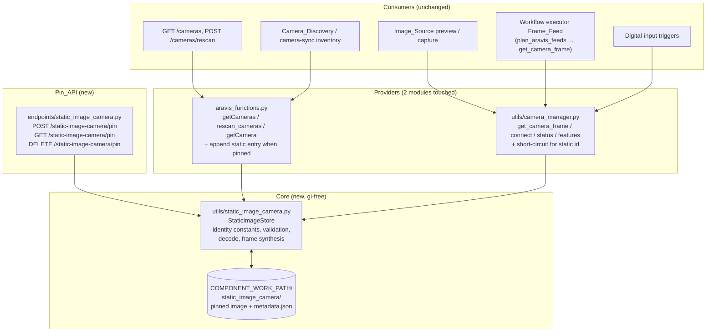

# Design Document

## Overview

This feature adds a **Static_Image_Camera** to the DDA LocalServer: a virtual GenICam-style camera whose every frame is a user-pinned still image. It enumerates alongside physical Aravis cameras, and every existing camera consumer — Image_Source configuration, live preview, capture, digital-input triggers, and workflow `aravis_camera_source` nodes — uses it unchanged.

The design intercepts at the **two provider modules** every consumer already goes through:

1. **Camera_Enumeration** (`edge_ml1_p_camera_management/aravis_functions.py`) — appends one synthetic `model.Camera` entry to `getCameras()` / `rescan_cameras()` results while a Pinned_Image exists.
2. **Camera_Manager** (`utils/camera_manager.py`) — short-circuits `get_camera_frame()` (and the connect/status/feature entry points) for the fixed static camera identifier, returning the decoded Pinned_Image as a standard `{'data', 'height', 'width', 'pixel_format'}` frame dict.

A new gi-free core module owns pinning, validation, persistence, and frame synthesis; a new Pin_API router exposes pin / status / unpin / pin-from-capture. No consumer code changes, no node catalog changes, no workflow document changes (Requirement 4.5), and no preservation-tracked file (docker-compose, Dockerfiles, requirements.txt) changes — Pillow and numpy are already backend dependencies.

## Research Findings and Key Decisions

### Decision 1: LocalServer-layer virtual camera, not a native Aravis fake camera

Two approaches were evaluated for "acts like a GenICam camera":

**Option A — extend Aravis' fake camera.** The backend already calls `Aravis.enable_interface("Fake")`, and Aravis' C API offers `arv_fake_camera_set_fill_pattern` for custom frame content, plus the `arv-fake-gv-camera` tool. Rejected for this feature because:

- **Process topology.** A fake camera device is instantiated *inside the process that opens it*. The LocalServer opens Aravis in at least three separate processes with independent Aravis contexts: the endpoint process (`aravis_functions` enumeration), the `BaseManager`-spawned camera-manager process (`utils/camera_manager.Camera`), and GStreamer pipeline execution (`gstreamer/gst_pipeline.py`). A fill pattern installed in one process is invisible to the others — the same isolation reported against custom fake cameras in [Aravis issue #955](https://github.com/AravisProject/aravis/issues/955), where a fake camera with a mock pattern created in one process is not picked up by other Aravis clients.
- **Binding surface.** The fill-pattern callback receives a raw buffer to write into (`ArvBuffer`/`user_data` C pointers — see the [C-level usage discussion](https://stackoverflow.com/questions/79467211/cant-create-a-fakecamera-with-a-custom-pattern-using-aravis)); it is not usable from PyGObject and would require a compiled C shim built per architecture (x86, JP5, JP6, JP7 each carry different Aravis 0.8.x builds).
- **GenICam constraints.** The fake camera's dimensions and pixel formats are pinned by its GenICam XML; arbitrary user image dimensions would require generating a custom XML and installing it via `arv_set_fake_camera_genicam_filename` before first Aravis use in *every* process.
- **`arv-fake-gv-camera`** is a separate GigE-Vision-protocol server process emitting only built-in test patterns; it adds network protocol and lifecycle management for no user-visible gain.

**Option B — virtual camera at the LocalServer layer (chosen).** Synthesize the enumeration entry and short-circuit the frame grab inside `aravis_functions` and `camera_manager`. Every consumer in the codebase reaches cameras exclusively through these two modules (verified: `endpoints/camera.py`, `endpoints/image_source.py`, `endpoints/workflow.py`, `utils/captured_images_utils.py`, `utils/digital_input_*`, `workflow_engine/pipeline_executor.py`, `camera_discovery/aravis.py`), so intercepting there gives Requirement 4's "no special-casing in consumers" by construction. Fidelity is preserved where it matters: the identical enumeration object shape (`model.Camera`) and the identical frame dict contract (`{'data','height','width','pixel_format'}`) that `_frame_caps` and `create_buffer` already consume. This works identically on x86 cloud containers and all Jetson images because it never touches Aravis, GLib, or hardware.

### Decision 2: Frame format is decoded RGB, tagged `pixel_format: "RGB"`

The workflow executor's `_frame_caps` maps a `pixel_format` of `"RGB"` to `video/x-raw,format=RGB` appsrc caps, and its bytes-per-pixel fallback also guesses RGB at 3 bytes/pixel. Decoding the pinned file to packed 24-bit RGB therefore flows through the existing Frame_Feed with truthful caps and satisfies the Requirement 3.7 size identity (`3 * width * height == len(data)`). Pillow (already in `requirements.txt`) decodes JPEG/PNG/BMP; `ImageOps.exif_transpose` is applied so EXIF-rotated JPEGs render the way the user sees them, and metadata dimensions are post-transpose.

For the Image_Source preview/capture path, `GstPipelineManager.create_buffer` takes caps from the configured `processingPipeline`'s `caps=` clause; the Image_Source for the static camera must therefore be configured with an RGB caps pipeline head (e.g. `appsrc name=appsrc caps=video/x-raw,format=RGB ! videoconvert ! ...`). This is a documentation/default concern, not a code path change — the same is true for any physical camera whose pipeline caps must match its sensor format.

### Decision 3: Persistence under `COMPONENT_WORK_PATH`, disk as source of truth

The LocalServer's durable state already lives in `COMPONENT_WORK_PATH` (the Greengrass component work directory: SQLite DBs in `dao/sqlite_db/sqlite_db_operations.py`, logs, GStreamer debug output). The Pinned_Image is stored there too, at `{COMPONENT_WORK_PATH}/static_image_camera/` as the **original uploaded file** plus a JSON metadata sidecar. The store consults disk (with an `(mtime, size)`-keyed decode cache) on every operation, which yields Requirement 6 restart persistence with no startup hook: the first request after restart reads the same files. Replacement is atomic via write-to-temp + `os.replace` (POSIX-atomic on the same filesystem), and grabs return an in-memory snapshot taken under a lock, so no grab can observe mixed content (Requirement 5.1).

### Decision 4: Fixed identifier `static-image-camera`

Physical Aravis identifiers follow `{Vendor}-{Serial}` shapes (e.g. `Aravis-Fake-GV01`, `Basler-...`); the constant `static-image-camera` cannot collide with any of them, is character-for-character stable across pin/replace/restart (it is a module-level constant, never derived from image content), and keeps Image_Source records and workflow Camera_Bindings valid across image swaps (Requirement 2.4). Because Camera_Discovery consumes `getCameras()`, the static camera also flows into the camera-sync inventory automatically, so Portal-side Camera_Bindings can resolve a `cameraSourceId` to it with zero changes to `camera_binding.py` or `aravis_feed.py`.

## Architecture



### Request flows

**Pin:** upload (or captured-image reference) → size check (≤ 50 MB) → Pillow decode + format check (JPEG/PNG/BMP) → EXIF transpose → write original bytes to temp file in the store directory → `os.replace` onto the pinned path → `os.replace` metadata JSON → invalidate decode cache → respond with camera id + metadata. Validation happens entirely *before* the replace, so a failed pin never disturbs the prior state (Requirements 1.3, 1.4, 5.3).

**Enumerate:** `getCameras()` builds the physical list exactly as today, then inside a `try/except` asks the store whether a Pinned_Image exists and appends the synthetic `model.Camera` entry; any store failure logs and returns the physical list (Requirement 2.7). `rescan_cameras()` inherits this by calling `getCameras()`.

**Grab:** `get_camera_frame(camera_id, config)` checks `camera_id == STATIC_IMAGE_CAMERA_ID` *before* touching `get_frame_lock`, `camera_objects`, or `connect_camera`. The store decodes (or serves from its cache) the pinned file under its lock and returns `{'data': rgb_bytes, 'height': h, 'width': w, 'pixel_format': 'RGB'}`. `config` (gain/exposure/advanced settings) is accepted and ignored (Requirement 3.4). No pin or an undecodable file raises `Exception("Static image camera 'static-image-camera': no usable pinned image is available...")` — the same raise-on-failure contract physical grabs use, so every caller's existing error handling applies (Requirements 3.5, 4.6, 5.6).

**Workflow:** unchanged end to end. Camera_Discovery lists the static camera → inventory → `resolve_bindings` fills `aravis_assignments` → `plan_aravis_feeds` produces an `AravisFeed(camera_id="static-image-camera")` → the executor grabs via `get_camera_frame` and points the compiled appsrc at the frame with `video/x-raw,format=RGB` caps derived from the `pixel_format` tag.

## Components and Interfaces

### 1. `src/backend/utils/static_image_camera.py` (new, no `gi` imports)

The core module. Importable on any host (tests run without the Aravis/GLib stack).

```python
# Fixed identity (Requirement 2.4). Never derived from image content.
STATIC_IMAGE_CAMERA_ID = "static-image-camera"

# Identity fields for the enumeration entry (Requirement 2.1) — all non-empty.
STATIC_IMAGE_CAMERA_IDENTITY = {
    "id": STATIC_IMAGE_CAMERA_ID,
    "model": "Static Image Camera",
    "address": "internal",
    "physical_id": STATIC_IMAGE_CAMERA_ID,
    "protocol": "StaticImage",
    "serial": "STATIC-IMAGE-0",
    "vendor": "AWS-DDA",
}

MAX_PIN_FILE_BYTES = 50 * 1024 * 1024          # Requirement 1.4
SUPPORTED_FORMATS = ("JPEG", "PNG", "BMP")      # Requirement 1.3

class StaticImagePinError(Exception): ...       # validation / replace failures
class StaticImageUnavailableError(Exception): ...  # grab/no-pin failures

class StaticImageStore:
    def __init__(self, base_dir=None, max_file_bytes=MAX_PIN_FILE_BYTES):
        """base_dir defaults to $COMPONENT_WORK_PATH/static_image_camera.
        max_file_bytes is injectable for tests."""

    def pin_bytes(self, data: bytes, file_name: str) -> dict:
        """Validate (size, decodability, format), atomically replace the
        pinned image, return metadata. Raises StaticImagePinError leaving
        prior state untouched (Req 1.1, 1.3, 1.4, 5.1, 5.3)."""

    def pin_file(self, path: str, captures_root: str) -> dict:
        """Pin an existing on-device captured image. Resolves the path,
        rejects anything outside captures_root (path-traversal guard),
        then applies pin_bytes validation (Req 1.7, 1.8)."""

    def status(self) -> dict:
        """{'pinned': bool, 'cameraId': ..., 'metadata': {...}|None} (Req 1.6)."""

    def unpin(self) -> None:
        """Delete image + metadata. Raises StaticImagePinError when nothing
        is pinned (Req 5.4, 5.5)."""

    def is_pinned(self) -> bool: ...

    def get_frame(self) -> dict:
        """{'data': RGB bytes, 'height', 'width', 'pixel_format': 'RGB'}.
        Snapshot under the store lock; decode cache keyed by (mtime, size).
        Raises StaticImageUnavailableError naming the camera when no pin
        exists or the file cannot be read/decoded (Req 3.1–3.3, 3.5, 3.7)."""

def get_store() -> StaticImageStore: ...   # module-level singleton
```

Notes:

- **Disk is the source of truth.** Every public method re-reads metadata (cheap `stat` + cached decode), so a restart needs no init hook (Requirement 6.1) and the enumeration process and any future worker processes observe the same state.
- **Restore failure containment (Requirements 6.4, 6.5):** `is_pinned()`/`status()` distinguish *missing data* (no files → simply not pinned) from *undecodable data* (files present, decode fails → log an error identifying the cause, report not pinned). Neither blocks startup, physical enumeration, or new pins.
- **Determinism (Requirements 3.3, 6.3):** the decode of a given file with the container's pinned Pillow build is deterministic; the cache additionally guarantees byte-identity within a process lifetime.

### 2. `src/backend/endpoints/static_image_camera.py` (new Pin_API router)

FastAPI router via `get_api_router()` (same pattern as `endpoints/camera.py`), registered in `app.py`:

| Route | Behavior |
|---|---|
| `POST /static-image-camera/pin` (multipart `file`) | Pin an uploaded image. 200 → `{cameraId, metadata}` (Req 1.1, 1.5); 400 with format list on undecodable input (Req 1.3); 413-style 400 on > 50 MB (Req 1.4). |
| `POST /static-image-camera/pin` (JSON `{"capturedImagePath": ...}`) | Pin an existing on-device capture; 404-style 400 when the referenced file does not exist (Req 1.7, 1.8). |
| `GET /static-image-camera/pin` | Pin status + metadata (Req 1.6). |
| `DELETE /static-image-camera/pin` | Unpin; error when nothing pinned (Req 5.4, 5.5). |

The upload handler reads the request body with a hard cap (reject as soon as more than `MAX_PIN_FILE_BYTES` are consumed) rather than buffering unbounded input. The captured-image variant only accepts paths that resolve under `COMPONENT_WORK_PATH` (realpath + commonpath check) — arbitrary device paths are not exposed.

### 3. `edge_ml1_p_camera_management/aravis_functions.py` (modified)

- `getCameras()`: after the physical loop, `try: if store.is_pinned(): cameras.append(Camera(**STATIC_IMAGE_CAMERA_IDENTITY))` `except Exception: log`. Physical results are never affected (Requirements 2.1–2.3, 2.5–2.7). `rescan_cameras()` needs no change.
- `getCamera(cameraId)`: for the static id, return a truthy sentinel when pinned (the connect endpoint uses this call purely as an existence check) and raise `AravisCameraNotFound` mentioning the pin requirement when not pinned. Physical ids take the existing path.

### 4. `utils/camera_manager.py` (modified — short-circuits only, before any Aravis/lock use)

| Entry point | Static-id behavior |
|---|---|
| `get_camera_frame(id, config)` | Return `get_store().get_frame()`; wrap `StaticImageUnavailableError` in the existing `Exception` contract with a message naming the static camera (Req 3.1–3.8). Bypasses `get_frame_lock`, `camera_objects`, and the per-request acquisition cycle entirely — physical acquisitions are structurally undisturbed (Req 5.7, 7.4). |
| `connect_camera(id)` | Return `True` when pinned; raise `AravisCameraException` when not. Never constructs a `manager_base.Camera`. |
| `disconnect_camera(id)` | No-op `True`. |
| `get_camera_status(id)` | `CONNECTED` when pinned, `DISCONNECTED` otherwise. |
| `get_camera_feature_bounds(id)` | `{}` (already the natural result — static id is never in `camera_objects`; made explicit so a pinned camera can never be "connected on demand"). |
| `apply_camera_features(id, features)` | Return `{}` without connecting (advanced features are meaningless for the virtual camera; Req 3.4 spirit). |

### 5. Unchanged components (verified against the codebase)

- `workflow_engine/camera_binding.py`, `workflow_engine/aravis_feed.py`, `workflow_engine/pipeline_executor.py` — camera-id-agnostic; the static id flows through `aravis_assignments` and `AravisFeed` untouched (Requirements 4.2, 4.5).
- `workflow_engine/vendor/workflow_core/catalog` — no node catalog changes (Requirement 4.5).
- `endpoints/image_source.py`, `utils/captured_images_utils.py`, `endpoints/workflow.py`, `utils/digital_input_*` — all reach frames via `get_camera_frame` (Requirements 4.1, 4.3, 4.4).
- `camera_discovery/`, `camera_sync/` — consume `getCameras()`; the static entry rides the existing tracked-snapshot diff into the inventory.
- Frontend — camera dropdowns populate from `GET /cameras`, so the static camera appears automatically once pinned. A pin-upload UI panel is a possible follow-up; the initial version is API-first (the Pin_API is callable with curl/portal tooling).

## Data Models

### Pinned_Image on-disk layout

```
{COMPONENT_WORK_PATH}/static_image_camera/
├── pinned_image            # original uploaded/referenced file bytes (extension-less; format lives in metadata)
├── pinned_image.json       # metadata sidecar
└── .tmp-*                  # transient staging files for atomic os.replace
```

### PinnedImageMetadata (JSON sidecar and Pin_API responses)

```json
{
  "fileName": "part_defect_sample.png",
  "format": "PNG",
  "width": 1920,
  "height": 1080,
  "fileSizeBytes": 2483221,
  "pinnedAtEpochMs": 1760000000000
}
```

`width`/`height` are the decoded (post-EXIF-transpose) pixel dimensions (Requirements 1.5, 1.6, 6.2).

### Frame dict (existing contract, produced by the store)

```python
{
    "data": <bytes, packed 24-bit RGB, len == 3 * width * height>,
    "width": <int>,
    "height": <int>,
    "pixel_format": "RGB",
}
```

Identical shape to a physical grab's decoded `camera_manager` frame, so `_frame_caps` (workflow), `create_buffer` (Image_Source pipelines), and the streaming payload consumers need no changes.

### Camera enumeration entry (existing `model.Camera` shape)

```python
Camera(id="static-image-camera", model="Static Image Camera",
       address="internal", physical_id="static-image-camera",
       protocol="StaticImage", serial="STATIC-IMAGE-0", vendor="AWS-DDA")
```

## Correctness Properties

*A property is a characteristic or behavior that should hold true across all valid executions of a system — essentially, a formal statement about what the system should do. Properties serve as the bridge between human-readable specifications and machine-verifiable correctness guarantees.*

All properties are exercised against a `StaticImageStore` over a temporary directory (with an injectable size limit where noted) and the pure enumeration-merge and camera-manager short-circuit logic, with images generated via Pillow (random dimensions, random pixel content, format drawn from {JPEG, PNG, BMP}).

### Property 1: Pin round-trip fidelity

*For any* valid image (any dimensions, any pixel content, any Supported_Image_Format) and any prior pin state, pinning it succeeds, the returned and queried metadata report the decoded image's width, height, format, and the submitted file name, and a subsequent grab returns a frame whose `data` equals the image's packed RGB decode byte for byte, whose `width`/`height` equal the decoded dimensions, whose `pixel_format` is `"RGB"`, and whose `len(data) == 3 * width * height`.

**Validates: Requirements 1.1, 1.5, 1.6, 3.1, 3.2, 3.7**

### Property 2: Enumeration includes the static camera iff pinned, preserving physical cameras

*For any* list of physical cameras (including the empty list) and any sequence of pin / replace / unpin operations, every enumeration performed after an operation contains exactly one Static_Image_Camera entry when a Pinned_Image currently exists and zero when none does; that entry has all seven identity fields non-empty; and the physical entries in the result are exactly the input physical list, unchanged and in order.

**Validates: Requirements 1.2, 2.1, 2.2, 2.3, 2.5, 2.6, 7.1, 7.3**

### Property 3: Fixed identifier invariance

*For any* sequence of pin, replace, and restart (fresh store instance over the same directory) operations and any generated set of physical camera identifiers, the Static_Image_Camera identifier is character-for-character identical after every operation and never equals any physical camera identifier.

**Validates: Requirements 2.4**

### Property 4: Enumeration resilience to static-entry failure

*For any* list of physical cameras, when the static-entry construction raises any exception, the enumeration result equals exactly the physical camera list and no exception propagates to the caller.

**Validates: Requirements 2.7**

### Property 5: Grab determinism and acquisition-config invariance

*For any* pinned image, any number of repeated grabs, and any acquisition configuration dict (arbitrary gain, exposure, and advancedSettings values, or none), every grab completes without error and returns byte-for-byte identical `(data, width, height, pixel_format)` regardless of the configuration supplied.

**Validates: Requirements 3.3, 3.4**

### Property 6: Invalid pin input preserves prior state

*For any* prior state (a valid Pinned_Image or none) and any invalid pin input — bytes that do not decode as a Supported_Image_Format, an input exceeding the (injected) size limit, or a reference to a nonexistent captured image — the pin operation fails with a descriptive error (naming the supported formats for decode failures, the size limit for oversized input, or not-found for missing references), and afterwards the pin status, metadata, served frame content, and enumeration inclusion are identical to the prior state.

**Validates: Requirements 1.3, 1.4, 1.8, 5.3**

### Property 7: Pin-from-capture parity

*For any* valid image written under the captures root, pinning it by reference produces the same stored metadata and served frame as pinning its bytes directly; and *for any* path resolving outside the captures root, the pin-by-reference is rejected without state change.

**Validates: Requirements 1.7**

### Property 8: Replace atomicity and freshness

*For any* two valid images A and B, after pinning A then pinning B, every grab that begins after the second pin's confirmation returns exactly B's full decoded content; and every grab performed at any point returns a frame equal in its entirety to exactly one of the decoded images — never a combination of the two.

**Validates: Requirements 5.1, 5.2**

### Property 9: Unpin lifecycle

*For any* pinned state, removal succeeds, after which the status reports no Pinned_Image, enumeration excludes the Static_Image_Camera, and grabs fail; and *for any* unpinned state (never pinned or already removed), removal fails with an error indicating no image is pinned and changes neither the stored state nor enumeration results.

**Validates: Requirements 5.4, 5.5**

### Property 10: No-usable-image grab failure

*For any* state in which no usable Pinned_Image exists — never pinned, removed, the stored file deleted out from under the store, or the stored bytes corrupted — a grab against the Static_Image_Camera identifier raises an error whose message names the Static_Image_Camera and indicates that no usable Pinned_Image is available.

**Validates: Requirements 3.5**

### Property 11: Restart persistence round trip

*For any* pinned image, constructing a fresh `StaticImageStore` over the same directory (modeling a LocalServer restart) reports `pinned` on its first status call with metadata equal to the pre-restart metadata, and its first grab returns frame content byte-for-byte identical to a pre-restart grab.

**Validates: Requirements 6.1, 6.2, 6.3**

### Property 12: Corruption containment at restore

*For any* corruption mode of the stored state (image file missing, metadata sidecar missing, or image bytes undecodable), a fresh store completes construction, logs an error identifying the failure cause category (missing data versus undecodable data), reports no Pinned_Image, leaves enumeration returning exactly the physical cameras, and accepts a subsequent valid pin that fully restores normal behavior.

**Validates: Requirements 6.4, 6.5**

## Error Handling

| Condition | Detection point | Behavior | Requirement |
|---|---|---|---|
| Upload not decodable / unsupported format | `pin_bytes` (Pillow decode + format check, before any replace) | HTTP 400 listing JPEG/PNG/BMP; prior state untouched | 1.3 |
| Upload exceeds 50 MB | Pin_API body reader (hard cap) / `pin_bytes` | HTTP 400 naming the limit; prior state untouched | 1.4 |
| Captured-image reference missing | `pin_file` existence check | HTTP 400 not-found; prior state untouched | 1.8 |
| Captured-image reference escapes `COMPONENT_WORK_PATH` | `pin_file` realpath/commonpath guard | HTTP 400; prior state untouched (path-traversal defense) | 1.7 (security) |
| Replace fails mid-operation | Staging file write/decode fails before `os.replace` | `StaticImagePinError` → HTTP error; prior image still served (atomic-rename design) | 5.3 |
| Static entry construction fails during enumeration | `try/except` around the append in `getCameras()` | Log; return physical cameras | 2.7 |
| Grab with no/unusable pin | `get_frame` | `Exception` naming `static-image-camera`, "no usable pinned image" → existing caller handling: preview/capture HTTP 4xx/5xx (4.6), workflow run fails with `failing_node_id` on the Aravis node (5.6), other runs unaffected | 3.5, 4.6, 5.6 |
| Unpin with nothing pinned | `unpin` | HTTP 400 "no image is pinned"; no state change | 5.5 |
| Stored image unrestorable at startup | First `status`/`is_pinned` after restart | Error logged with cause (missing vs undecodable); reported not pinned; physical cameras, grabs, and new pins unaffected | 6.4, 6.5 |
| `connect`/`features` calls against static id while unpinned | `camera_manager` short-circuits | `AravisCameraException` naming the camera; no Aravis object created | 2.x consistency |

Deliberate non-error: acquisition config (gain/exposure/advanced settings) on a static grab is accepted and ignored (Requirement 3.4), matching the Open Decisions section of the requirements.

## Testing Strategy

The repository's dual approach: **hypothesis property tests** for the store/enumeration/grab logic (the properties above), **example/integration tests** for endpoint and executor wiring, and **mandatory on-device verification** per the workspace build rule before commit.

### Property-based tests

- Location: `test/backend-test/static_image_camera/` (new), named `test_property_*.py` following the existing convention.
- Library: **hypothesis** (already used throughout `test/backend-test/`), with the repo's settings profiles — minimum **100 iterations** per property (`HYPOTHESIS_PROFILE=ci`).
- Each correctness property is implemented by a **single** property-based test, tagged with a comment in the format: `**Feature: static-image-camera-source, Property {N}: {property_text}**`.
- Image generation: Pillow renders random-dimension, random-pixel images to JPEG/PNG/BMP bytes in memory; stores use `tmp_path` directories and an injected small `max_file_bytes` for the size-limit branch, so no test needs large files, hardware, or `gi`.
- The core module (`utils/static_image_camera.py`) imports no `gi`; tests of the `aravis_functions` and `camera_manager` integration use the existing `mock_gi.py` pattern.

### Example / integration tests

- `get_camera_frame` short-circuit wiring: static grab succeeds without touching `camera_objects` / `connect_camera` (3.6), and pin operations perform zero camera-manager interactions (5.7) — mock-based.
- `plan_aravis_feeds` with a binding resolved to `static-image-camera` yields the expected `AravisFeed` (4.5), and an executor run whose grab raises fails with `failing_node_id` set and the camera named (5.6, mocked `run_pipeline`).
- Pin_API endpoints via FastAPI `TestClient`: pin/status/unpin happy paths, error responses, pin-from-capture (1.x, 5.5).
- Image_Source CRUD with the static `cameraId`, preview and capture endpoints with the gst executor mocked, including the no-pin error paths (4.1, 4.3, 4.4, 4.6).

### Container verification (cloud parity, Requirement 7.2)

Run the suite in the flask-app container exactly as the workspace rule prescribes (x86, no cameras — this run *is* the Cloud_Environment criterion):

```
docker run --rm -v "$(pwd)":/repo -w /repo \
  -e PYTHONPATH=/repo/src/backend:/repo/test/backend-test \
  flask-app:latest bash -lc \
  'PY=$(command -v python3.11 || command -v python3.10); \
   $PY -m pip install --no-cache-dir --quiet pytest sarge testfixtures hypothesis; \
   $PY -m pytest test/backend-test/static_image_camera -q -p no:cacheprovider'
```

No preservation-tracked file changes: `src/backend/requirements.txt` (Pillow/numpy already present), the Dockerfiles, `src/docker-compose.yaml`, and the recipes are untouched, so no security-preservation baselines need rebaselining for this feature.

### On-device verification (mandatory before commit — workspace rule)

This is an on-device edge feature (LocalServer backend under `src/`), so per the workspace build rule it must be verified on real hardware before commit, on every architecture the change ships to:

1. Build and deploy (or hot-patch for iteration) the component to a Jetson device (JP5 and/or JP6, plus JP7 where applicable) and to an x86 cloud instance.
2. Exercise end to end: pin an image via the Pin_API → `GET /cameras` shows the static entry (alongside a physical camera on the Jetson, Req 7.3) → configure an Image_Source → live preview → capture → run a workflow whose `aravis_camera_source` binds to `static-image-camera` → replace the image → unpin → confirm the workflow error path.
3. Confirm parity (Req 7.5): same identifier, identity fields, and a matching frame checksum for the same image across environments.
4. Confirm the backend stays healthy for a sustained period (no crash, no container restart), and that a concurrently previewing physical camera is undisturbed (Req 7.4).
5. State in the commit/PR what was verified on which device(s).

### Explicitly not property-tested

Requirements 4.1–4.4, 4.6, 5.6, 5.7, and 7.2–7.5 are infrastructure/wiring concerns (existing endpoints, executor plumbing, real hardware, environment parity): behavior there does not vary meaningfully with generated input, so they are covered by the example/integration tests and the on-device matrix above rather than by 100-iteration property runs. Requirement 3.8 (10-second bound) is satisfied by construction (in-memory/disk read) and observed during on-device verification rather than asserted in a flaky unit-level timer.
