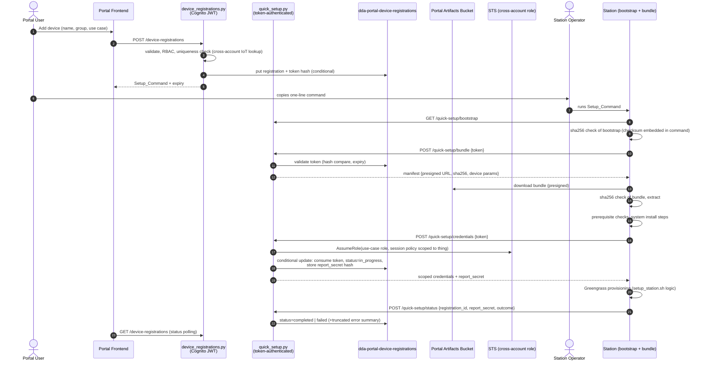
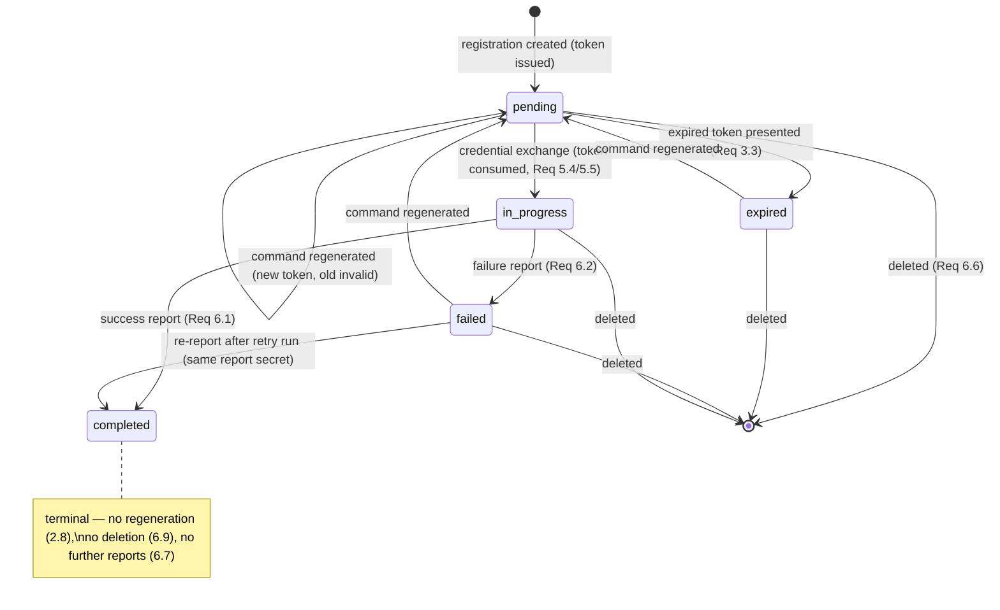

# Design Document: Station Quick Setup

## Overview

Station Quick Setup replaces the manual station provisioning flow (GitHub checkout + operator AWS login + `setup_station.sh <region> <thing_name>`) with a portal-driven flow:

1. A portal user with the `manage_devices` permission registers a device (name + IoT Thing Group + Use_Case) in the Edge CV Portal.
2. The Portal_Backend creates a Device_Registration, mints a single-use Setup_Token (≤90-minute lifetime, hash-only at rest), and returns a one-line Setup_Command (`curl … | verify checksum | sudo bash`) of at most 2048 characters.
3. The Station_Operator runs the Setup_Command on the station. It downloads a small bootstrap script from the token-free bootstrap route, verifies the bootstrap's checksum (embedded in the command itself), and executes it.
4. The bootstrap presents the Setup_Token to the Quick_Setup_Endpoint, receives a Setup_Bundle manifest (presigned S3 URL + SHA-256 + per-registration parameters), downloads and verifies the bundle, then exchanges the token for least-privilege short-lived Provisioning_Credentials scoped to the single registered thing name.
5. The bundle runs the existing `station_install/setup_station.sh` provisioning logic (parameterized by environment variables instead of operator input), joins the registered Device_Group, and reports success/failure back to the portal using a per-registration report secret issued with the credentials.

Key design constraints honored:

- **No new trust surface on the station**: no GitHub access, no operator AWS login; the only secret the operator handles is the Setup_Token inside the command.
- **`setup_station.sh` stays the single source of provisioning truth** (Req 4.2): the bundle wraps it rather than forking it. Two minimal, backwards-compatible changes are made to the script (env-overridable thing group, env-provided credentials — the latter already works today via `resolve_aws_credentials`).
- **Existing portal building blocks are reused**: `shared_utils` (RBAC `Permission.MANAGE_DEVICES`, `get_usecase`, `assume_usecase_role`, `log_audit_event`, `record_audit_event_strict`), the `dda-portal-usecases` cross-account role pattern from `deployments.py`, the portal artifacts bucket, and the `dda-portal-audit-log` table (already 90-day TTL, satisfying Req 8.5).
- **API Gateway resource limit**: `ApiGatewayStack` sits at the CloudFormation 500-resource limit, so all new routes live in a new nested stack (`QuickSetupApiStack`), following the precedent of `NodeDesignerApiStack` / `CameraRegistryApiStack` / `UserAdminApiStack`. This also gives the Quick_Setup_Endpoint its own method-level throttling (Req 3.9 defense-in-depth).

## Architecture

### High-level flow



### Deployment architecture

```mermaid
graph TB
    subgraph "CDK deployment (portal account)"
        SI[station_install/ sources] -->|CDK asset bundling:<br/>tar.gz + sha256 manifest| S3[(Portal Artifacts Bucket<br/>quick-setup/&#123;assetHash&#125;/)]
        CS[ComputeStack] --> QRL[DeviceRegistrations Lambda]
        CS --> QSL[QuickSetup Lambda]
        QAS[QuickSetupApiStack<br/>nested, own throttling] -->|Cognito JWT| QRL
        QAS -->|AuthorizationType.NONE<br/>+ app-level IP limiter| QSL
    end
    subgraph "DynamoDB"
        RT[(dda-portal-device-registrations)]
        AT[(dda-portal-audit-log)]
        UT[(dda-portal-usecases)]
    end
    QRL --> RT & AT & UT
    QSL --> RT & AT & UT
    QSL -->|presigned GET| S3
    QSL -->|AssumeRole + session policy| UC[Use-Case Account<br/>DDAPortalAccessRole]
```



### Route authentication model

| Route | Auth | Handler |
|---|---|---|
| `POST /device-registrations` | Cognito JWT + `manage_devices` RBAC | `device_registrations.py` |
| `GET /device-registrations?usecase_id=` | Cognito JWT | `device_registrations.py` |
| `GET /device-registrations/thing-groups?usecase_id=` | Cognito JWT | `device_registrations.py` |
| `POST /device-registrations/{id}/command` (regenerate) | Cognito JWT + `manage_devices` | `device_registrations.py` |
| `DELETE /device-registrations/{id}` | Cognito JWT + `manage_devices` | `device_registrations.py` |
| `GET /quick-setup/bootstrap` | none (public static script; integrity via checksum in Setup_Command) | `quick_setup.py` |
| `POST /quick-setup/bundle` | Setup_Token (body) | `quick_setup.py` |
| `POST /quick-setup/credentials` | Setup_Token (body) | `quick_setup.py` |
| `POST /quick-setup/status` | registration_id + report_secret (body) | `quick_setup.py` |

The `/quick-setup/*` methods use `authorizationType: AuthorizationType.NONE` — the same mechanism as the existing `POST /auth/refresh` route — so they bypass the Cognito authorizer without weakening any other route. Safety comes from four layers:

1. **Token authentication in the handler** (constant-time hash comparison, single-use, ≤90 min).
2. **Application-level invalid-token rate limiting** per source IP (Req 3.9 exactly: >10 invalid tokens in 5 minutes → ≥5-minute block), implemented as a pure decision function over DynamoDB-persisted counters.
3. **API Gateway method throttling** on the `/quick-setup/*` methods (own nested-stack `MethodOptions`, e.g. 10 rps / burst 20), bounding volumetric abuse below the app layer.
4. **POST bodies, not query strings, carry tokens** so token values never appear in access logs or proxy logs (supports Req 8.3).

## Components and Interfaces

### 1. Backend: `device_registrations.py` (new Lambda, JWT-authenticated)

Follows the `devices.py` handler conventions (shared_utils imports, CORS preflight, `create_response`).

```python
def handler(event, context): ...

def create_registration(user, body) -> dict:
    """POST /device-registrations
    Body: {"device_name": str, "device_group": str, "usecase_id": str}
    1. Validate presence of all three fields; collect ALL missing fields (Req 1.9).
    2. Validate device_name and device_group against IOT_NAME_PATTERN;
       collect ALL invalid fields (Req 1.2).
    3. RBAC: Permission.MANAGE_DEVICES for usecase (Req 1.4); on denial,
       record audit via record_audit_event_strict — if that raises, fail
       the whole operation (Req 1.5).
    4. Uniqueness: cross-account iot.describe_thing(device_name) must raise
       ResourceNotFoundException, and no non-deleted registration with the
       same (usecase_id, device_name) may exist (GSI query). Any lookup
       failure -> reject with verification-failed error (Req 1.3, 1.10).
    5. Generate token (see TokenService), put registration item with
       ConditionExpression=attribute_not_exists(registration_id).
       Token generation/storage failure -> no registration persisted (Req 2.7).
    6. Build Setup_Command (see CommandBuilder) and return
       {registration, setup_command, token_expires_at}.
    """

def list_registrations(user, query) -> dict:
    """GET /device-registrations?usecase_id= — registrations with status,
    token_expires_at (never token material). Req 6.3."""

def list_thing_groups(user, query) -> dict:
    """GET /device-registrations/thing-groups?usecase_id= — existing IoT
    Thing Groups via cross-account iot.list_thing_groups (Req 1.7)."""

def regenerate_command(user, registration_id, body) -> dict:
    """POST /device-registrations/{id}/command
    Reject if status == 'completed' (Req 2.8). Otherwise atomically replace
    token_hash/token_expires_at (single UpdateItem => at most one valid
    token, Req 2.5), reset status to 'pending' if 'expired'/'failed',
    return new Setup_Command."""

def delete_registration(user, registration_id, query) -> dict:
    """DELETE /device-registrations/{id}
    Reject if status == 'completed' (Req 6.9). Otherwise delete the item —
    which invalidates the token, since validation resolves through the
    item (Req 6.6)."""
```

**Validation constant** (shared by backend and tested directly):

```python
IOT_NAME_PATTERN = re.compile(r'^[a-zA-Z0-9:_-]{1,128}$')
```

### 2. Backend: `quick_setup.py` (new Lambda, token-authenticated)

```python
def handler(event, context):
    """Routes: GET /quick-setup/bootstrap, POST /quick-setup/bundle,
    POST /quick-setup/credentials, POST /quick-setup/status.
    Every non-bootstrap request passes through:
      1. rate_limiter.check(source_ip)      -> 429 if blocked (Req 3.9)
      2. audit 'pending' entry (strict)     -> reject on failure (Req 8.4)
      3. token validation                   -> uniform errors (Req 3.3-3.5, 3.10)
      4. handler action
      5. finalize audit entry (Req 8.1, 8.2)
    Source IP: event.requestContext.identity.sourceIp."""

def get_bootstrap() -> dict:
    """Serve the bootstrap script bytes from the artifacts bucket key baked
    into QUICK_SETUP_BOOTSTRAP_KEY at deploy time. text/x-shellscript."""

def get_bundle_manifest(registration, usecase) -> dict:
    """Token already validated (NOT consumed — bundle download is retryable).
    Verify bundle object exists (Req 4.10), then return:
    {
      "bundle_url": <presigned GET, 15 min>,
      "bundle_sha256": QUICK_SETUP_BUNDLE_SHA256,   # computed at deploy time
                                                    # over the exact object (Req 4.5)
      "parameters": {
        "registration_id": ..., "device_name": ..., "device_group": ...,
        "aws_region": usecase.region,
        "quick_setup_url": <this deployment's endpoint URL>
      }
    }  # Req 4.1: no operator-supplied values needed downstream."""

def exchange_credentials(registration, usecase, now) -> dict:
    """Req 5. Order matters for atomicity + retryability:
    1. remaining = token_expires_at - now; if remaining < 900 (STS minimum
       session duration): reject as expired -> operator regenerates.
    2. Mint: sts.assume_role(usecase.cross_account_role_arn,
         ExternalId=usecase.external_id,
         Policy=build_session_policy(device_name, device_group,
                                     region, account_id),
         DurationSeconds=min(3600, remaining))     # Req 5.3
       Failure -> error response, token NOT consumed (Req 5.7).
    3. report_secret = secrets.token_urlsafe(32)
    4. Consume atomically (Req 5.4, 5.5) — the linearization point:
       UpdateItem(
         ConditionExpression="token_hash = :th AND consumed_at = :never
                              AND token_expires_at > :now AND #s = 'pending'",
         UpdateExpression="SET #s='in_progress', consumed_at=:now,
                           report_secret_hash=:rsh")
       ConditionalCheckFailed -> discard minted credentials, return the
       uniform invalid-token error (concurrent exchange lost the race).
    5. Return {credentials, report_secret, expires_at}. Secrets never logged
       or audited (Req 8.3)."""

def report_status(body, source_ip) -> dict:
    """POST /quick-setup/status
    Body: {"registration_id", "report_secret", "status": "completed"|"failed",
           "error_summary"?}
    Authenticate: sha256(report_secret) == stored report_secret_hash
    (constant-time). Reject if no match, or current status is 'completed',
    or registration unknown — all with the uniform error, status unchanged
    (Req 6.7). Accepted from 'in_progress' or 'failed' (idempotent re-report
    after a failed run). error_summary stored truncated to 1024 chars
    (Req 6.2)."""
```

### 3. Backend: `TokenService` (module inside `quick_setup`/shared)

```python
TOKEN_PREFIX = "dqs1"          # versioned, opaque to the station
TOKEN_TTL_SECONDS = 90 * 60    # Req 3.1 upper bound

def generate_token(registration_id: str) -> tuple[str, str, int]:
    """secret = secrets.token_urlsafe(32)   # 256 bits, CSPRNG (Req 3.2)
    token  = f"{TOKEN_PREFIX}.{registration_id}.{secret}"
    returns (token, sha256_hex(secret), expires_at_epoch)"""

def validate_token(token: str, now: int) -> ValidationResult:
    """Parse -> load registration by embedded registration_id (PK GetItem;
    no GSI on hashes) -> outcomes:
      VALID            secret hash matches (hmac.compare_digest), not
                       consumed, not expired
      EXPIRED          hash matches but token_expires_at <= now; side
                       effect: status pending -> expired (Req 3.3)
      INVALID          malformed / unknown registration / hash mismatch
                       (superseded by regeneration) / consumed / deleted —
                       ONE shared result (Req 3.4, 3.5)
      CHECK_FAILED     any storage error -> reject (Req 3.10)
    Only sha256(secret) is ever persisted or compared (Req 3.6)."""
```

Embedding `registration_id` in the token makes lookup a primary-key read and keeps "unknown token" structurally identical to "wrong secret" — both fall through to the single `INVALID` result with a byte-identical response body (Req 3.5). `EXPIRED` is deliberately distinguishable so the station can print the regenerate instruction (Req 7.5); it reveals nothing beyond what the portal user already sees.

### 4. Backend: `RateLimiter` (pure decision core + DynamoDB persistence)

```python
@dataclass(frozen=True)
class RateState:
    window_start: int; invalid_count: int; blocked_until: int

WINDOW = 300; MAX_INVALID = 10; BLOCK = 300   # Req 3.9

def evaluate(state: RateState | None, now: int,
             invalid_attempt: bool) -> tuple[RateState, bool]:
    """Pure function: (previous state, clock, whether this request
    presented an invalid token) -> (next state, allowed?).
    - blocked_until > now                -> (state, False)
    - window expired                     -> reset window
    - invalid_attempt: count += 1; count > MAX_INVALID
                                         -> blocked_until = now + BLOCK
    Property-tested against a reference model (Property 11)."""
```

State is persisted in the registrations table as `pk = "RATELIMIT#{source_ip}"` items with a DynamoDB TTL attribute (auto-cleanup); registration items never carry the TTL attribute.

### 5. Backend: `build_session_policy` (credential scoping, Req 5.2)

```python
def build_session_policy(device_name, device_group, region, account_id) -> dict:
    """IAM session policy passed to AssumeRole — the effective permissions
    are the INTERSECTION of this policy and the use-case role's policy, so
    it can only narrow. Statements (mirroring exactly what
    setup_station.sh + the Greengrass provisioner perform):
      - iot: CreateThing/DescribeThing/AddThingToThingGroup
             on arn:aws:iot:{region}:{account_id}:thing/{device_name}
      - iot: CreateThingGroup/DescribeThingGroup
             on ...:thinggroup/{device_group}          # Req 4.6
      - iot: CreateKeysAndCertificate, AttachThingPrincipal, AttachPolicy,
             CreatePolicy, GetPolicy, ListPolicyVersions,
             CreatePolicyVersion, DeletePolicyVersion, DescribeEndpoint,
             CreateRoleAlias, DescribeRoleAlias
             (certificate ids unknowable in advance -> resource *,
              actions minimal)
      - iam:  GetRole/CreateRole/AttachRolePolicy/PassRole/CreatePolicy/GetPolicy
             scoped to GreengrassV2TokenExchangeRole /
             GreengrassV2TokenExchangeRoleAccess (provisioner TES setup)
      - greengrass: TagResource on
             ...:coreDevices:{device_name}              # dda-portal:managed tag
      - sts: GetCallerIdentity
    NO other thing name appears in any resource ARN; no iot:* / greengrass:*
    wildcard actions."""
```

The `DurationSeconds` cap of 3600 comes from role chaining (Lambda role → use-case role); with a 90-minute token, effective credential lifetime is `min(60 min, remaining token lifetime)` (Req 5.3). If remaining lifetime is under the 15-minute STS floor, the exchange is refused with the expiration error rather than over-issuing.

### 6. Setup_Command and bootstrap (`CommandBuilder`)

The generated one-liner (single line, HTTPS-only, ≤2048 chars — Req 2.1–2.3):

```bash
curl -fsSL {API}/quick-setup/bootstrap -o /tmp/dda-qs.sh && \
echo "{BOOTSTRAP_SHA256}  /tmp/dda-qs.sh" | sha256sum -c - && \
sudo bash /tmp/dda-qs.sh --endpoint {API}/quick-setup --token {TOKEN}
```

(shown wrapped here; emitted as one line with `&&` separators). `{API}` is derived from the incoming request (`requestContext.domainName` + stage), so the command always points at the deployment that generated it (Req 2.1) with no config circularity. The bootstrap's SHA-256 is baked into the Lambda environment at deploy time, making the command itself the integrity anchor for everything that follows: command → verifies bootstrap → verifies bundle (Req 4.8/4.9 chain). Worst-case length ≈ 320 chars + domain — far below 2048.

### 7. Station-side artifacts (packaged from `station_install/`)

```
station_install/
├── setup_station.sh            # MODIFIED (minimal, backwards compatible)
├── patch_docker_host_prereqs.sh
├── launch-edge-device.sh
├── edge_manager_agent_config.json
├── edge-device-iam-policy.json
├── create-edge-device-iam-role.sh
└── quick_setup/                # NEW
    ├── bootstrap.sh            # fetched by the one-liner (small, static)
    └── run.sh                  # bundle entrypoint (wraps setup_station.sh)
```

**`setup_station.sh` changes** (keeping it fully functional standalone, Req 4.2):

1. `thing_group_name="${DDA_THING_GROUP:-DDA_transition_EC2_Group}"` and use `--thing-group-name ${thing_group_name}` in the Greengrass installer invocation (line ~946). The Greengrass provisioner creates the thing group when it does not exist, satisfying the create-if-missing half of Req 4.6; `run.sh` verifies membership afterwards via `aws iot list-thing-groups-for-thing` and fails the run if absent (Req 4.7).
2. No credential-path change needed: `resolve_aws_credentials` already returns immediately when `AWS_ACCESS_KEY_ID` is exported, which is exactly how `run.sh` injects Provisioning_Credentials.

**`bootstrap.sh`** (~100 lines, no bundle dependencies):

```
Usage: bootstrap.sh --endpoint <url> --token <token>
1. Preflight: curl/wget present, sha256sum present, root (sudo), Ubuntu
   via lsb_release, supported arch (x86_64|aarch64), >=2GB free on /
   (Req 7.1); print every unmet prerequisite, exit non-zero with NO
   system changes (Req 7.2).
2. POST /bundle {token} -> manifest. Invalid/expired -> print regenerate
   instruction, exit non-zero (Req 7.5).
3. Download bundle to mktemp dir; sha256sum -c against manifest sha256;
   mismatch -> print integrity error, delete download, exit non-zero
   WITHOUT extracting or executing anything (Req 4.8, 4.9).
4. Extract; exec run.sh with parameters from the manifest as env vars
   (DDA_REGISTRATION_ID, DDA_DEVICE_NAME, DDA_THING_GROUP, DDA_AWS_REGION,
   DDA_QS_URL, DDA_SETUP_TOKEN).
```

**`run.sh`** (bundle orchestrator):

```
1. Create install log /var/log/dda-quick-setup-<ts>.log, print its path
   (Req 7.3); print step banners (Req 7.4); fail-fast per step (Req 7.7).
2. Steps that need no AWS credentials run FIRST (apt packages, Python,
   Docker — the slow part, potentially 15+ min on Jetson source builds).
3. Credential exchange step: POST /credentials {token} -> export
   AWS_ACCESS_KEY_ID/SECRET/SESSION_TOKEN (memory only) and hold
   report_secret in a shell variable; write credentials to NO file
   (Req 5.6 trivially) and redact both from stdout and the log via
   'set +x' scoping (Req 5.8). Deliberately deferred until after the
   slow steps so the ≤60-min credentials cover the AWS-touching window;
   if the token expired during the slow steps, the operator regenerates
   and re-runs — idempotent re-run (Req 7.8) skips completed steps and
   reaches this exchange within a minute or two.
4. Invoke the setup_station.sh provisioning logic with
   DDA_THING_GROUP="$DDA_THING_GROUP" and env credentials, args
   "<region> <device_name>".
5. Verify group membership (Req 4.6/4.7); verify Greengrass service
   running.
6. trap EXIT: unset AWS_* vars; remove any temp files under the bundle
   workdir (Req 5.6).
7. Report status: POST /status {registration_id, report_secret,
   completed|failed, error_summary(<=1024 chars from the last failed
   step)}; up to 3 attempts total, then print "could not report status
   to portal" without changing the exit code (Req 6.8).
8. On success print device name, group, region, log path; exit 0
   (Req 7.6).
```

Idempotence (Req 7.8) rides on `setup_station.sh`'s existing re-run guards (every install step checks before acting: "already installed, skipping"), which the on-hardware harness verifies end-to-end.

### 8. Infrastructure (CDK)

**StorageStack** — one new table:

```typescript
this.deviceRegistrationsTable = new dynamodb.Table(this, 'DeviceRegistrationsTable', {
  tableName: 'dda-portal-device-registrations',
  partitionKey: { name: 'registration_id', type: dynamodb.AttributeType.STRING },
  billingMode: dynamodb.BillingMode.PAY_PER_REQUEST,
  timeToLiveAttribute: 'ttl',          // set ONLY on RATELIMIT# items
});
// GSI: usecase_id (PK) + device_name (SK) — uniqueness check & listing
table.addGlobalSecondaryIndex({ indexName: 'usecase-device-index', ... });
```

A dedicated table (not `dda-portal-devices`) because registrations have a different key shape, lifecycle, and security posture: the token-authenticated `quick_setup` Lambda gets read/write on **only** this table plus the audit log — never on the broader portal tables.

**ComputeStack** — bundle packaging (Req 4.4) and the two Lambdas:

```typescript
// Deploy-time packaging: tar.gz of station_install/ (+ quick_setup/) with
// sha256 sidecars, produced by an asset-bundling script so the checksums
// are computed over the EXACT bytes uploaded (Req 4.5).
const bundleAsset = new s3deploy.BucketDeployment(this, 'QuickSetupBundle', {
  sources: [s3deploy.Source.asset(path.join(__dirname, '../../../station_install'), {
    bundling: { /* build-quick-setup-bundle.sh:
       tar czf setup-bundle.tar.gz ...; sha256sum > manifest.json;
       copy bootstrap.sh + its sha256 */ },
  })],
  destinationBucket: props.portalArtifactsBucket,
  destinationKeyPrefix: 'quick-setup/current/',   // replaced atomically per deploy
});
// Lambda env (baked per deployment => only the most recent successful
// deployment's artifacts are ever served, Req 4.4):
//   REGISTRATIONS_TABLE, QUICK_SETUP_BUNDLE_KEY, QUICK_SETUP_BUNDLE_SHA256,
//   QUICK_SETUP_BOOTSTRAP_KEY, QUICK_SETUP_BOOTSTRAP_SHA256
```

The checksums are computed inside the bundling script and injected into the Lambda environment via the asset output; a deployment that fails leaves the previous env vars (and previous objects) in place, so a half-updated state is never served (Req 4.10 falls back to a 5xx only if S3 objects are missing entirely).

**QuickSetupApiStack** (new nested stack attached to the existing RestApi): registers the routes from the table above; `/quick-setup/*` methods get `authorizationType: NONE` plus method-level throttling via the stage's `methodOptions` (e.g. `'/quick-setup/*': { throttlingRateLimit: 10, throttlingBurstLimit: 20 }`).

**IAM**: the `quick_setup` Lambda role may `sts:AssumeRole` the use-case cross-account roles (same trust as existing portal Lambdas), read `quick-setup/*` from the artifacts bucket, and read/write the registrations + audit tables. The `device_registrations` Lambda gets the standard portal Lambda role.

### 9. Frontend

- **`services/api.ts`**: `registerDevice(input): Promise<RegistrationWithCommand>`, `listDeviceRegistrations(usecaseId)`, `listThingGroups(usecaseId)`, `regenerateSetupCommand(id)`, `deleteDeviceRegistration(id)` — same `this.request` pattern as existing device methods.
- **`pages/Devices.tsx`**: "Add Device" button → `RegisterDeviceDialog` (device name field with pattern validation feedback, Device_Group autocomplete populated from `listThingGroups` with free-text entry for new groups (Req 1.7/1.8), use case from current context). On success → `SetupCommandDialog`: monospace command, single-action copy-to-clipboard button, token expiry timestamp (Req 2.4).
- **Registrations panel** on the devices view: each Device_Registration with status chip (`pending`/`in_progress`/`completed`/`expired`/`failed`), expiry time while `pending`/`in_progress` (Req 6.3), Regenerate command action for non-completed (Req 6.4, 2.5), Delete for non-completed (Req 6.6/6.9). Poll on load/refresh only (no live push needed).

## Data Models

### Device_Registration item (`dda-portal-device-registrations`)

```jsonc
{
  "registration_id": "a1b2c3d4-...",       // PK, uuid4
  "usecase_id": "uc-123",                   // GSI PK
  "device_name": "station-42",              // GSI SK; IoT thing name
  "device_group": "Line3_Group",            // IoT Thing Group (may not exist yet)
  "status": "pending",                      // pending|in_progress|completed|expired|failed
  "created_by": "user-abc",                 // Req 1.6
  "created_at": 1730000000,                 // epoch seconds
  "updated_at": 1730000000,
  "token_hash": "sha256hex...",             // hash ONLY (Req 3.6)
  "token_expires_at": 1730005400,           // <= created/regen time + 90 min
  "token_generation": 1,                    // increments per regeneration
  "consumed_at": 0,                         // 0 = never; set atomically on exchange
  "report_secret_hash": "sha256hex...",     // set at credential exchange (Req 6.7)
  "error_summary": "…"                      // <=1024 chars, set on failed (Req 6.2)
}
```

Rate-limit items share the table: `{"registration_id": "RATELIMIT#203.0.113.7", "window_start": ..., "invalid_count": ..., "blocked_until": ..., "ttl": ...}`.

### Setup_Token (wire format, never stored)

```
dqs1.{registration_id}.{secret}        secret = token_urlsafe(32) → 256 bits
```

### State machine (Setup_Status)



### Quick_Setup_Endpoint API shapes

```jsonc
// POST /quick-setup/bundle  {"token": "dqs1...."}
// 200:
{ "bundle_url": "https://s3...X-Amz-Signature=...", "bundle_sha256": "…",
  "parameters": { "registration_id": "…", "device_name": "…",
                  "device_group": "…", "aws_region": "us-east-1",
                  "quick_setup_url": "https://…/v1/quick-setup" } }

// POST /quick-setup/credentials  {"token": "dqs1...."}
// 200:
{ "credentials": { "access_key_id": "…", "secret_access_key": "…",
                   "session_token": "…", "expiration": "2024-…" },
  "report_secret": "…", "aws_region": "us-east-1" }

// POST /quick-setup/status
{ "registration_id": "…", "report_secret": "…",
  "status": "completed" | "failed", "error_summary": "…" }

// Uniform invalid-token error (unknown == consumed == invalidated, Req 3.5):
// 403 {"error": "invalid_token", "message": "The setup token is not valid.
//                Generate a new setup command from the portal."}
// Expired (distinct, Req 3.3/7.5):
// 403 {"error": "token_expired", "message": "The setup token has expired.
//                Generate a new setup command from the portal."}
```

## Correctness Properties

*A property is a characteristic or behavior that should hold true across all valid executions of a system — essentially, a formal statement about what the system should do. Properties serve as the bridge between human-readable specifications and machine-verifiable correctness guarantees.*

Backend properties are tested with Hypothesis against the handlers with moto/mocked AWS; the checksum-gate property drives the real `bootstrap.sh` under bash with generated content.

### Property 1: Valid registrations are created completely

*For any* device name and Device_Group matching `[a-zA-Z0-9:_-]{1,128}` (including group names absent from the use-case account) and any authorized user, submitting a registration creates exactly one Device_Registration with status `pending` whose recorded device name, Device_Group, Use_Case, creating user, and creation time equal the submitted values and request context.

**Validates: Requirements 1.1, 1.6, 1.8**

### Property 2: Invalid or missing fields are rejected, identified per field, with no persistence

*For any* registration request in which any non-empty subset of {device name, Device_Group, Use_Case} is missing/empty, or the device name or a new Device_Group name violates `[a-zA-Z0-9:_-]{1,128}`, the request is rejected with an error identifying exactly the offending fields and no Device_Registration item is written.

**Validates: Requirements 1.2, 1.9**

### Property 3: Conflicting device names are rejected

*For any* set of existing device names (as IoT Things in the use-case account or as existing registrations in the same Use_Case), submitting a registration with any name from that set is rejected with a conflict error identifying that name, and no Device_Registration is created.

**Validates: Requirements 1.3**

### Property 4: The Setup_Command is well formed

*For any* created or regenerated Device_Registration, the returned Setup_Command is a single line (no newline characters) of at most 2048 characters, contains the Setup_Token and the generating deployment's Quick_Setup_Endpoint URL, and every URL appearing in it uses the `https://` scheme.

**Validates: Requirements 2.1, 2.2, 2.3**

### Property 5: At most one Setup_Token is valid per registration

*For any* Device_Registration and any sequence of command regenerations, only the most recently issued token validates successfully; every earlier token, every consumed token, and every token of a deleted registration is rejected with the invalid-token error.

**Validates: Requirements 2.5, 3.4**

### Property 6: Token expiration is bounded

*For any* token issuance (creation or regeneration) at any clock time, the stored expiration is at most 90 minutes after the issuance time.

**Validates: Requirements 3.1**

### Property 7: Expired tokens are rejected and expire pending registrations

*For any* Device_Registration and any presentation time at or after the token's expiration, the Quick_Setup_Endpoint rejects the request with the expiration error, and the registration's Setup_Status transitions to `expired` if and only if it was `pending`.

**Validates: Requirements 3.3**

### Property 8: Invalid-token responses are indistinguishable

*For any* pair of invalid presentations drawn from {token of a nonexistent registration, consumed token, token superseded by regeneration, token of a deleted registration, well-formed token with a wrong secret}, the HTTP status and response body returned are byte-identical.

**Validates: Requirements 3.5**

### Property 9: Secrets never appear at rest or in output

*For any* execution of the registration, regeneration, bundle, credential-exchange, and status-report flows, the raw Setup_Token secret, the report secret, and the issued credential secret material appear in no persisted DynamoDB item, no audit event payload, no log output, and no error response — the only permitted occurrence is the Setup_Command in the registration/regeneration response.

**Validates: Requirements 3.6, 8.3**

### Property 10: A valid token binds to exactly its registration, with a correct checksum

*For any* population of Device_Registrations and any valid token among them, the bundle manifest returned for that token carries exactly that registration's device name, Device_Group, registration id, the Use_Case's AWS region, and the serving deployment's Quick_Setup_Endpoint URL, and its `bundle_sha256` equals the SHA-256 of the exact bundle object served.

**Validates: Requirements 3.7, 4.1, 4.5**

### Property 11: The invalid-token rate limiter matches its specification

*For any* sequence of timestamped requests from arbitrary source IPs with arbitrary valid/invalid outcomes, the rate limiter blocks a source IP if and only if it exceeded 10 invalid-token requests within the current 5-minute window, every block lasts at least 5 minutes from its imposition, and requests from other IPs are never affected.

**Validates: Requirements 3.9**

### Property 12: The checksum gate executes if and only if content verifies

*For any* bundle content bytes, the bootstrap executes the bundle exactly when the downloaded bytes hash to the manifest checksum; for any tampered content (any byte-level mutation), it executes no part of the bundle, reports an integrity error, and exits non-zero.

**Validates: Requirements 4.8, 4.9**

### Property 13: Session policies are scoped to the single registered device

*For any* registered device name, Device_Group, region, and account id, the generated session policy contains no thing or thing-group resource ARN referencing any name other than the registered device name and Device_Group, no wildcard-action statements (`iot:*`, `greengrass:*`, `iam:*`), and only actions from the fixed provisioning action set.

**Validates: Requirements 5.2**

### Property 14: Credential validity never exceeds remaining token lifetime

*For any* token and any exchange time within its lifetime, the requested credential duration is at most the token's remaining lifetime at issuance (and the exchange is refused outright when the remainder is below the STS minimum).

**Validates: Requirements 5.3**

### Property 15: Credential exchange is exactly-once and transitions to in_progress

*For any* Device_Registration and any number of sequential or interleaved credential-exchange attempts with the same token, exactly one attempt returns credentials — leaving the registration `in_progress` with the token consumed — and every other attempt receives the invalid-token error.

**Validates: Requirements 5.4, 5.5**

### Property 16: Status reports are authenticated and applied with truncation

*For any* Device_Registration, a status report changes the Setup_Status if and only if its report secret hashes to the stored report-secret hash and the current status is not `completed`; an accepted `completed` report yields status `completed`, an accepted `failed` report yields status `failed` with the stored error summary equal to the first 1024 characters of the reported summary; every rejected report leaves the registration unchanged.

**Validates: Requirements 6.1, 6.2, 6.7**

### Property 17: Deletion is gated on status and invalidates the token

*For any* Device_Registration, deletion succeeds if and only if its Setup_Status is not `completed`; after a successful deletion the registration no longer exists and its token is rejected, and after a rejected deletion (status `completed`) the registration is unchanged.

**Validates: Requirements 6.6, 6.9**

### Property 18: Every quick-setup operation is audited completely

*For any* registration creation/deletion, token issuance, Setup_Status change, token redemption (bundle or credentials), and token validation failure — whatever the outcome — an audit event is recorded containing the action type, the acting principal (portal user or token-bound registration), the Use_Case, the device name, the outcome, and the timestamp; redemption and validation-failure events additionally carry the source IP (and failure reason for validation failures).

**Validates: Requirements 3.8, 8.1, 8.2**

## Error Handling

### Portal_Backend (JWT routes)

| Condition | Behavior | Req |
|---|---|---|
| Missing/invalid fields | 400 listing every offending field; nothing persisted | 1.2, 1.9 |
| Name conflict (IoT Thing or registration) | 409 naming the conflicting device name | 1.3 |
| Uniqueness unverifiable (role assumption / IoT lookup failure) | 502-class error "uniqueness verification failed"; nothing persisted | 1.10 |
| RBAC denial | 403 + audit event; if the audit write raises, the whole request fails 500 (strict audit) | 1.4, 1.5 |
| Token generation/storage failure | 500 "setup command could not be generated"; conditional write ensures no token-less registration persists | 2.7 |
| Regenerate/delete on `completed` | 409 "registration already completed"; item untouched | 2.8, 6.9 |

### Quick_Setup_Endpoint (token routes)

| Condition | Behavior | Req |
|---|---|---|
| Expired token | 403 `token_expired` + regenerate instruction; `pending` → `expired` | 3.3, 7.5 |
| Unknown/consumed/superseded/deleted token, wrong secret | 403 `invalid_token` — single byte-identical response | 3.4, 3.5 |
| Any security check unevaluable (DynamoDB error) | 403 reject; never proceed unverified | 3.10 |
| Source IP blocked (>10 invalid in 5 min) | 429 for ≥5 minutes | 3.9 |
| Audit write fails before redemption | reject request; serve nothing; token unconsumed (audit-before-effect via `record_audit_event_strict`) | 8.4 |
| Bundle artifacts missing in S3 | 503 "bundle unavailable"; no partial content | 4.10 |
| STS issuance failure after validation | 502 issuance error; token NOT consumed (mint happens before the conditional consume) | 5.7 |
| Remaining token lifetime < STS 900s floor | treated as `token_expired` (regenerate) rather than over-issuing | 5.3 |
| Concurrent exchange loses the conditional write | minted credentials discarded server-side; 403 `invalid_token` | 5.4 |
| Status report: bad secret / unknown id / target `completed` | 403 uniform error; status unchanged | 6.7 |

### Station side (bootstrap / run.sh)

| Condition | Behavior | Req |
|---|---|---|
| Unmet prerequisites | print each unmet item; no system changes; exit ≠ 0 | 7.1, 7.2 |
| Bundle checksum mismatch | integrity error; nothing extracted/executed; exit ≠ 0 | 4.9 |
| Token rejected at any call | print regenerate instruction; exit ≠ 0 | 7.5 |
| Provisioning step failure | stop at the step; print step name + log path; report `failed` with ≤1024-char summary; exit ≠ 0 | 7.7, 6.2 |
| Thing-group join unverifiable | treated as step failure | 4.7 |
| Status report undeliverable | 3 total attempts, then "could not report status to portal"; provisioning exit code unchanged | 6.8 |
| Any exit path | EXIT trap unsets credential env vars, removes temp files; secrets never echoed or logged | 5.6, 5.8 |

## Testing Strategy

The repository already uses **pytest + Hypothesis** for backend tests (`test/backend-test`, `edge-cv-portal/backend/tests`); property tests follow that stack with **moto** for DynamoDB/STS/S3/IoT mocking. Each correctness property is implemented by a single Hypothesis test with **minimum 100 examples**, tagged:

```python
# Feature: station-quick-setup, Property {N}: {property title}
@settings(max_examples=100)
```

### Property-based tests (Hypothesis)

- Properties 1–11, 13–18: handler-level tests against `device_registrations.py`, `quick_setup.py`, `TokenService`, `RateLimiter.evaluate` (pure function vs. a reference model), and `build_session_policy` (policy-document introspection), with frozen/generated clocks and moto-backed tables.
- Property 12 (checksum gate): a Hypothesis test that generates random bundle bytes and random tamperings, drives the real `bootstrap.sh` via `subprocess` against a local HTTP stub, and asserts execution occurs iff the hash matches (a sentinel file inside the bundle marks "executed").

### Example-based unit tests

Focused on the analyzed non-property criteria: RBAC denial + audit (1.4), audit-failure aborts (1.5, 8.4), uniqueness-check failure (1.10), token-storage failure atomicity (2.7), regenerate-on-completed (2.8), security-check-unevaluable rejection (3.10), missing bundle artifacts (4.10), STS failure leaves token unconsumed (5.7), thing-groups listing pass-through (1.7), truncation boundary at exactly 1024 chars, and rate-limit TTL housekeeping.

### Shell tests (station side)

`bats`-style tests for `bootstrap.sh` / `run.sh` with stubbed `curl`/`aws`/HTTP endpoints: prerequisite fixtures (7.1/7.2), log creation and step banners (7.3/7.4), regenerate instruction on rejection (7.5), success output (7.6), fail-fast ordering (7.7), report retry count (6.8), credential cleanup and log redaction with planted fake secrets (5.6/5.8), and group-join failure (4.7).

### Integration / smoke tests

- **CDK synth assertions**: bundle asset + checksum env vars wired into the Lambdas; `/quick-setup/*` methods carry `AuthorizationType.NONE` and throttling; registrations table + GSI exist.
- **Bundle content smoke check**: unpack the built artifact and assert every `station_install` supporting file is present (2.6, 4.3).
- **On-hardware harness** (extends `test/on-hardware`): full quick-setup run on a clean station verifying end-state equivalence with a manual `setup_station.sh` run — Greengrass core registered under the device name, runtime running as a system service, prerequisites installed, `dda-portal:managed=true` tag applied, and membership in the registered Device_Group as the only intended difference (4.2, 4.6, 6.5); interrupted-then-rerun idempotence (7.8); and credential sufficiency for the whole provisioning sequence (5.1).

### Frontend tests

Component tests for `RegisterDeviceDialog` (per-field validation feedback), `SetupCommandDialog` (full command copied in one action, expiry shown — 2.4), and the registrations panel (status chips, expiry display while pending/in_progress, regenerate/delete affordances — 6.3, 6.4).
