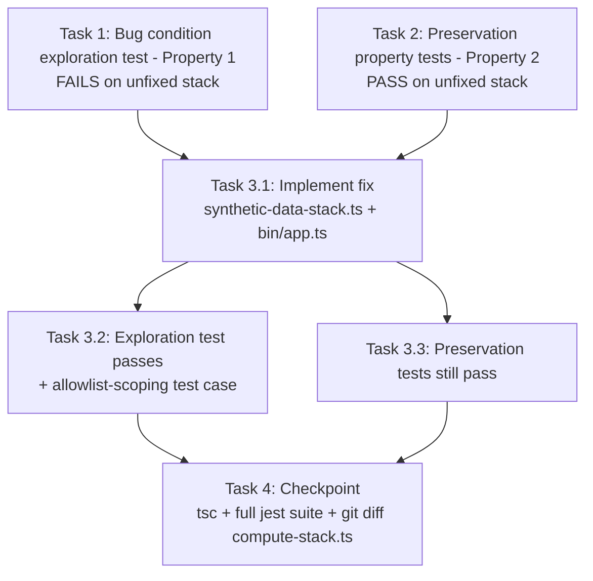

# Implementation Plan

## Overview

Fix the missing S3 data-plane permissions on the `SyntheticDataHandlerRole` using the exploratory bugfix workflow: write the bug condition exploration test (Property 1) and preservation property tests (Property 2) against the UNFIXED stack first, then implement the surgical fix (add `dataBucketAllowlist?` to `SyntheticDataStackProps` in `edge-cv-portal/infrastructure/lib/synthetic-data-stack.ts`, replicate the compute stack's reviewed data-plane grant block onto `handlerRole`, and pass the already-parsed allowlist through from `bin/app.ts`), then verify with the same tests. `compute-stack.ts` is not touched.

Tests are CDK assertions tests (jest, `Template.fromStack`) in `edge-cv-portal/infrastructure/test/synthetic-data-s3-permissions.test.ts`, following the conventions of `workflow-manager-gaps-infra.test.ts`: synthesize once in `beforeAll` with a generous timeout, locate resources via `template.findResources`, and pass all required stack props (including a non-empty `trustedUseCaseAccountIds` — the stack throws at synth time without it).

## Task Dependency Graph

```json
{
  "waves": [
    { "wave": 1, "description": "Run on UNFIXED stack: surface the missing-S3-statement counterexamples (task 1 FAILS - Property 1) and capture the handler role's existing statement inventory plus the no-control-plane universal assertion (task 2 PASSES - Property 2). Independent of each other.", "tasks": ["1", "2"] },
    { "wave": 2, "description": "Implement the fix: dataBucketAllowlist prop + normalization + two data-plane PolicyStatements in synthetic-data-stack.ts, allowlist pass-through in bin/app.ts.", "tasks": ["3.1"] },
    { "wave": 3, "description": "Verify the fix: re-run task 1 test (now PASSES) plus the allowlist-scoping test case, and re-run task 2 tests (still PASS).", "tasks": ["3.2", "3.3"] },
    { "wave": 4, "description": "Checkpoint: tsc, new test file plus existing infra test suite, git diff confirms compute-stack.ts untouched.", "tasks": ["4"] }
  ]
}
```



## Tasks

- [x] 1. Write bug condition exploration test
  - **Property 1: Bug Condition** - Handler Role Carries S3 Data-Plane Grants
  - **CRITICAL**: This test MUST FAIL on unfixed code - failure confirms the bug exists
  - **DO NOT attempt to fix the test or the code when it fails**
  - **NOTE**: This test encodes the expected behavior - it will validate the fix when it passes after implementation
  - **GOAL**: Surface counterexamples that demonstrate the bug exists (`isBugCondition(X)`: single-account setup AND the task requires S3 data-plane access — structurally, the synthesized handler role has no S3 statement at all)
  - **Scoped PBT Approach**: The bug is deterministic at synth time, so scope the property to the concrete synthesized template: quantify over ALL IAM policy statements attached to the handler role and assert the required S3 data-plane statements are among them
  - Create `edge-cv-portal/infrastructure/test/synthetic-data-s3-permissions.test.ts` following the conventions of `workflow-manager-gaps-infra.test.ts`: synthesize once in `beforeAll` with a generous timeout (asset staging is expensive), locate resources via `template.findResources`, assert on raw CloudFormation properties
  - Construct `SyntheticDataStack` directly with all required props: tables from a `StorageStack`, a Cognito user pool, rest API ids, stage name, and a NON-EMPTY `trustedUseCaseAccountIds` (the stack throws at synth time otherwise)
  - Collect every IAM policy statement attached to the handler role (inline policies whose `Roles` reference the `SyntheticDataHandlerRole` logical id)
  - Test case 1: assert an object-level statement allowing `s3:GetObject` and `s3:PutObject` is present (default/empty allowlist ⇒ resources `arn:aws:s3:::*/*`)
  - Test case 2: assert a bucket-level statement allowing `s3:ListBucket`, `s3:GetBucketLocation`, and `s3:GetBucketTagging` is present (default/empty allowlist ⇒ resources `arn:aws:s3:::*`)
  - Assertions match the Expected Behavior Properties from design (Property 1)
  - Run `npx jest test/synthetic-data-s3-permissions.test.ts` in `edge-cv-portal/infrastructure` on the UNFIXED stack
  - **EXPECTED OUTCOME**: Both test cases FAIL (this is correct - it proves the bug: zero statements with any `s3:*` action are attached to the handler role)
  - Document counterexamples found (e.g., "handler role policy set contains no S3 statement; live counterexample: `s3:GetObject` on `arn:aws:s3:::ryvan-cookies/training-images/anomaly-12.jpg` denied on account 164152369890")
  - Mark task complete when test is written, run, and failure is documented
  - _Requirements: 1.1, 1.2, 1.3, 2.1, 2.2, 2.3_

- [x] 2. Write preservation property tests (BEFORE implementing fix)
  - **Property 2: Preservation** - Existing Grants and Non-Buggy Paths Unchanged
  - **IMPORTANT**: Follow observation-first methodology
  - Observe the UNFIXED stack's handler-role statement inventory first (fully specified in `synthetic-data-stack.ts`), then write assertions capturing that inventory so the fixed stack must still produce it
  - Add these tests to `edge-cv-portal/infrastructure/test/synthetic-data-s3-permissions.test.ts` (same `beforeAll` synth, same required props including non-empty `trustedUseCaseAccountIds`)
  - Test case 1 — existing statement inventory on the handler role (Req 3.1):
    - Bedrock `bedrock:InvokeModel` (foundation-model + inference-profile ARNs) and `bedrock:ListFoundationModels`
    - `sts:AssumeRole` scoped to `arn:aws:iam::<trusted>:role/DDAPortalAccessRole` for the trusted use case accounts (also covers the cross-account path, Req 3.3)
    - `lambda:InvokeFunction` self-invoke on the fixed `dda-synthetic-data-handler` function ARN
    - SageMaker training-job actions, and `iam:PassRole` with the `iam:PassedToService: sagemaker.amazonaws.com` condition
  - Test case 2 — universal control-plane assertion (Req 3.2): iterate EVERY statement in EVERY policy attached to the handler role and assert no action matches `s3:PutBucketPolicy`, `s3:PutBucketAcl`, `s3:PutObjectAcl`, `s3:DeleteBucket`, `s3:PutBucketTagging`, or other S3 control-plane patterns — this universal quantification over all statements is the property-based guarantee, and it must hold both before AND after the fix
  - The synthesized template is deterministic, so exhaustive static assertions over ALL statements take the role randomized PBT usually plays (all-inputs guarantee for synth-time behavior)
  - Run tests on UNFIXED code
  - **EXPECTED OUTCOME**: Tests PASS (this confirms baseline behavior to preserve)
  - Mark task complete when tests are written, run, and passing on unfixed code
  - _Requirements: 3.1, 3.2, 3.3_

- [x] 3. Fix for missing S3 data-plane permissions on the synthetic data handler role

  - [x] 3.1 Implement the fix
    - In `edge-cv-portal/infrastructure/lib/synthetic-data-stack.ts`:
      - Extend `SyntheticDataStackProps` with optional `dataBucketAllowlist?: string[]`, documented the same way as the ComputeStack's prop (bare names or `arn:aws:s3:::name` ARNs; empty/unset ⇒ all buckets on the data plane; control plane never granted)
      - Replicate the compute stack's `createLambdaRole` data-plane grant block (~lines 557–612) onto `handlerRole`, after the existing STS/Lambda/SageMaker statements
      - Normalization: filter empty entries; entries starting with `arn:aws:s3:::` get any trailing `/*` or `/` stripped to the canonical bucket ARN; bare names are prefixed to `arn:aws:s3:::${name}`; empty allowlist yields `['arn:aws:s3:::*']`; `bucketLevelResources` = the bucket ARNs, `objectLevelResources` = each ARN + `/*`
      - Add two `iam.PolicyStatement`s: bucket-level (`s3:ListBucket`, `s3:GetBucketLocation`, `s3:GetBucketTagging` on `bucketLevelResources`) and object-level (`s3:GetObject`, `s3:PutObject` on `objectLevelResources`)
      - NO control-plane actions and NO `aws:ResourceTag` condition — include the explanatory comment mirroring the compute stack's (documented past regression: S3 does not honor `aws:ResourceTag` for bucket-level actions)
      - Duplicate rather than extract the normalization (extraction would refactor `compute-stack.ts`, which Req 3.4 requires unchanged)
    - In `edge-cv-portal/infrastructure/bin/app.ts`:
      - Pass the already-parsed `dataBucketAllowlist` array (~line 112) through to the `SyntheticDataStack` instantiation props — no new parsing
    - Do NOT modify `edge-cv-portal/infrastructure/lib/compute-stack.ts`
    - _Bug_Condition: isBugCondition(X) — X.setup = SINGLE_ACCOUNT AND X.requiresS3DataPlaneAccess(useCaseDataBucket), from design_
    - _Expected_Behavior: handler role allows s3:GetObject/s3:PutObject on objectLevelResources(allowlist) and s3:ListBucket/s3:GetBucketLocation/s3:GetBucketTagging on bucketLevelResources(allowlist), no aws:ResourceTag condition, from design Property 1_
    - _Preservation: all existing handler-role grants unchanged; no S3 control-plane actions; cross-account path via DDAPortalAccessRole untouched; compute-stack output byte-identical, from design Preservation Requirements_
    - _Requirements: 2.1, 2.2, 2.3, 2.4, 2.5, 3.4_

  - [x] 3.2 Verify bug condition exploration test now passes
    - **Property 1: Expected Behavior** - Handler Role Carries S3 Data-Plane Grants
    - **IMPORTANT**: Re-run the SAME test from task 1 - do NOT write a new test
    - The test from task 1 encodes the expected behavior; when it passes, it confirms the expected behavior is satisfied
    - Run the bug condition exploration test from task 1
    - **EXPECTED OUTCOME**: Test PASSES (confirms bug is fixed - default/empty allowlist yields `arn:aws:s3:::*` and `arn:aws:s3:::*/*`)
    - Additionally add and run the allowlist-scoping test case (Fix Checking, Req 2.4): synthesize a second stack with `dataBucketAllowlist: ['bucket-a', 'arn:aws:s3:::bucket-b']` and assert the statements' resources are exactly `arn:aws:s3:::bucket-a` and `arn:aws:s3:::bucket-b` (bucket level) and their `/*` forms (object level), with no `aws:ResourceTag` condition on either statement — verifying the name-or-ARN normalization matches the compute stack's
    - _Requirements: 2.1, 2.2, 2.3, 2.4, 2.5_

  - [x] 3.3 Verify preservation tests still pass
    - **Property 2: Preservation** - Existing Grants and Non-Buggy Paths Unchanged
    - **IMPORTANT**: Re-run the SAME tests from task 2 - do NOT write new tests
    - Run the preservation property tests from task 2
    - **EXPECTED OUTCOME**: Tests PASS (confirms no regressions - existing statement inventory intact, still no S3 control-plane action anywhere on the role)
    - Confirm all tests still pass after fix (no regressions)
    - _Requirements: 3.1, 3.2, 3.3_

- [x] 4. Checkpoint - Ensure all tests pass
  - Run `npx tsc --noEmit` (or the package build) in `edge-cv-portal/infrastructure` to verify the TypeScript compiles
  - Run `npx jest test/synthetic-data-s3-permissions.test.ts` and the existing infra test suite (`npx jest`) in `edge-cv-portal/infrastructure` to confirm the new tests and all pre-existing infrastructure tests pass
  - Confirm `edge-cv-portal/infrastructure/lib/compute-stack.ts` is untouched via `git diff -- edge-cv-portal/infrastructure/lib/compute-stack.ts` (Req 3.4)
  - Note: post-fix live verification (deploy `EdgeCVPortalSyntheticDataStack` and re-run a generation session on the affected single-account portal) is an orchestrator task outside this repo's test suite
  - Ensure all tests pass, ask the user if questions arise.

## Notes

- The behavior under test is deterministic synth-time template generation, so the preservation tests achieve the property-based all-inputs guarantee by quantifying over ALL statements in the synthesized template (e.g., "no statement anywhere on the handler role contains an S3 control-plane action") rather than sampling randomized examples
- The universal no-control-plane assertion (task 2, test case 2) must hold both before AND after the fix — the new grants are data-plane only with no `aws:ResourceTag` condition (documented past regression: S3 does not honor it for bucket-level actions)
- The normalization block is deliberately duplicated from `compute-stack.ts`'s `createLambdaRole` (~lines 557–612) rather than extracted, because Requirement 3.4 requires the compute stack's output to be byte-identical
- Post-fix live verification (deploy and re-run a generation session on account 164152369890) is an orchestrator task outside this repo's test suite
