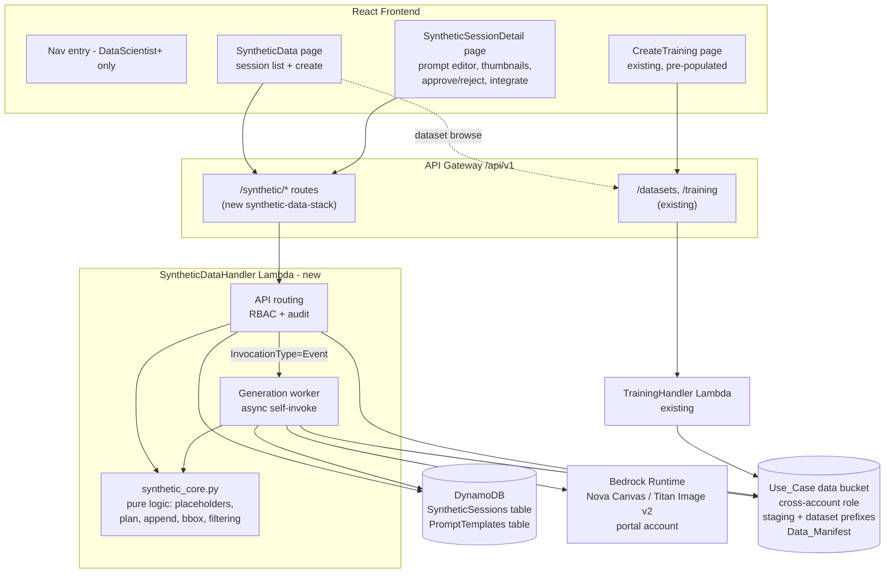

# Design Document

## Overview

This feature adds a synthetic defect data generation workspace to the edge-cv-portal. Data scientists select an image generation model from a Model_Catalog, edit Prompt_Templates scoped per Use_Case/Object_Type/Defect_Type, and generate synthetic defect images from Source_Images (existing Defect_Images or Normal_Images) pulled from the Use_Case data bucket. A thumbnail review workspace supports iterative prompt correction and regeneration. On approval, the portal auto-annotates approved images (class label + bounding box), uploads them to the Use_Case data bucket, atomically appends records to the Ground Truth style augmented Data_Manifest, and offers one-click retraining through the existing SageMaker Training_Subsystem.

This is a portal-only feature: all changes are confined to `edge-cv-portal/` (frontend, backend, infrastructure). Implementation lands on a new branch based off `integration/all-specs`.

### Concurrency / Merge-Conflict Constraint

A parallel session on the same working tree is building the `data-labeling-portal` feature. To minimize merge conflicts this design:

- Puts all new backend logic in **new files** (`synthetic_data.py`, `synthetic_core.py`) rather than editing `datasets.py`, `labeling.py`, or `manifest_validator.py`.
- Puts all new infrastructure in a **new CDK stack file** (`synthetic-data-stack.ts`) that owns its own Lambda, DynamoDB tables, and API routes, following the precedent of `node-designer-api-stack.ts` / `camera-registry-api-stack.ts`. The only shared-file edits are small additive ones: instantiating the new stack in the CDK app entry point, one optional field in `training.py`, and additive frontend registrations (route, nav item, API methods).
- Reuses existing plumbing by **calling** it (dataset discovery endpoints, `shared_utils`, `bedrock_common` patterns, training job creation API) instead of restructuring it.

### Key Design Decisions

| Decision | Rationale |
|---|---|
| New standalone Lambda (`synthetic_data.py`) + pure-logic module (`synthetic_core.py`) | Isolates the feature (merge-conflict constraint) and separates pure, property-testable logic (placeholder resolution, manifest append, bbox derivation, approval filtering) from AWS I/O |
| Static in-code Model_Catalog of Bedrock image models, filtered by runtime availability | Bedrock image models (Amazon Nova Canvas, Titan Image Generator v2) have well-known, stable capability sets (inpainting, image variation, seed/cfgScale). A static catalog with capability flags, filtered by `bedrock:ListFoundationModels` availability in the portal region, avoids a new admin configuration surface while satisfying Req 1.1/1.3 |
| Bedrock invoked with portal-account credentials in the portal region | Matches existing Bedrock usage (`bedrock_common.py`, workflow generator, code assist). Source/generated images move between the Use_Case data bucket (cross-account assumed role, as in `datasets.py`) and Bedrock via the Lambda |
| Async self-invocation worker for generation | Generating up to 20 variations × N source images exceeds API Gateway's 29 s limit. The API handler validates, persists the generation plan, and re-invokes its own Lambda with `InvocationType='Event'`; the worker generates variation-by-variation, writing each Preview_Image record as it completes. The frontend polls session state, so thumbnails appear incrementally (Req 5.1, 5.2) |
| One DynamoDB table with item collections for sessions | `PK=session_id, SK='META' \| 'PREVIEW#<id>'` keeps each Preview_Image its own item (a session with 100+ previews would blow the 400 KB item limit) while a single Query restores full session state (Req 10.2) |
| Staging prefix for previews; copy-on-approve | Previews live under `synthetic-staging/{session_id}/` in the Use_Case data bucket and are served by presigned URLs (same pattern as `datasets.py` previews). Only on integration are approved images copied under the target dataset prefix, so rejected images never enter the dataset (Req 6.6) |
| Upload-then-commit manifest integration with conditional write | S3 has no append. Integration uploads all approved images first, then reads the manifest (capturing its ETag), appends records in memory, and writes back with `If-Match`. The manifest write is the single commit point: any earlier failure leaves the manifest untouched (Req 7.7); a concurrent-modification precondition failure triggers re-read + re-append |
| Manifest records keep the DDA-required attributes | Appended records carry `source-ref`, `anomaly-label`, `anomaly-label-metadata` (+ bounding-box and synthetic metadata attributes), so `training.py::validate_marketplace_manifest` accepts the updated manifest unchanged (Req 7.8) |
| Retraining pre-population via existing CreateTraining page | The integration confirmation deep-links to the existing training creation flow with `dataset_manifest_s3` and `generation_session_id` pre-filled; `training.py` gets one additive optional field to record the originating session (Req 8.3) — the only backend shared-file edit |

## Architecture



### Generation and Review Flow

```mermaid
sequenceDiagram
    participant U as Data Scientist
    participant FE as Frontend
    participant API as SyntheticDataHandler (API)
    participant W as SyntheticDataHandler (worker, async)
    participant BR as Bedrock
    participant S3 as Use_Case bucket
    participant DDB as Sessions table

    U->>FE: configure session (model, types, sources, count)
    FE->>API: POST /synthetic/sessions
    API->>DDB: persist META (Req 10.1) + audit
    U->>FE: start generation
    FE->>API: POST /sessions/{id}/generate
    API->>API: resolve placeholders (reject on unresolved, Req 2.6)
    API->>API: validate variation count 1-20, sources (Req 3.6, 4.4)
    API->>DDB: status=generating, store plan
    API-->>W: async self-invoke
    API-->>FE: 202 accepted (progress starts, Req 5.1)
    loop each source image x variation
        W->>S3: fetch source image
        W->>BR: invoke image model (resolved prompt, seed, ...)
        alt success
            W->>S3: put preview PNG to synthetic-staging/
            W->>DDB: put PREVIEW item (prompt text retained, Req 5.6)
        else failure
            W->>DDB: record per-variation failure (Req 4.5)
        end
    end
    W->>DDB: status=awaiting_review
    loop poll
        FE->>API: GET /sessions/{id}
        API-->>FE: META + previews (presigned thumbnails, Req 5.2)
    end
    U->>FE: edit prompt, regenerate / approve / reject
    U->>FE: confirm approval (summary, Req 6.4)
    FE->>API: POST /sessions/{id}/integrate
    API->>S3: copy approved images to dataset prefix (Req 7.3)
    API->>API: auto-annotate (bbox + class label, Req 7.1/7.2)
    API->>S3: read manifest + ETag, append records, conditional PUT (Req 7.5/7.7)
    API->>DDB: status=integrated + audit (Req 9.4)
    API-->>FE: manifest URI + appended count (Req 7.6)
    FE->>FE: offer retrain: navigate to CreateTraining pre-populated (Req 8.1)
```



## Components and Interfaces

### Backend

#### 1. `backend/functions/synthetic_core.py` (new — pure logic, no AWS imports)

All property-tested logic lives here so Hypothesis tests run without moto/mocks where possible.

```python
# Model catalog -------------------------------------------------------------
MODEL_CATALOG: list  # static entries, see Data Models

def filter_available_models(catalog, available_model_ids) -> list
    # catalog entries whose model_id is in the region's available set

# Prompt templates ----------------------------------------------------------
DEFAULT_PROMPT_TEMPLATE: str  # contains {object_type} and {defect_type}

def resolve_prompt(template: str, context: dict) -> str
    # Substitutes every {name} placeholder from context.
    # Raises UnresolvedPlaceholderError(names=[...]) listing EVERY
    # placeholder missing from context (Req 2.5, 2.6).
    # Placeholder grammar: {identifier} where identifier = [A-Za-z_][A-Za-z0-9_]*
    # Literal braces are escaped as {{ and }}.

# Generation planning -------------------------------------------------------
def validate_variation_count(value) -> int
    # Returns the int iff an integer 1..20; raises ValidationError with the
    # valid range otherwise (Req 4.1, 4.4). Booleans and non-integers rejected.

def validate_generation_request(source_images, source_class, defect_type, variation_count)
    # Rejects: zero sources (Req 3.6); source_class not in {'defect','normal'}
    # (Req 3.2); source_class=='normal' without defect_type (Req 3.3).

def build_generation_plan(session_meta, source_images, variation_count, resolved_prompt, params) -> list[GenerationTask]
    # Exactly len(source_images) * variation_count tasks; every task carries
    # the session's selected model_id, the resolved prompt text, and a
    # deterministic per-task seed derived from the base seed (Req 1.2, 4.2).

# Approval ------------------------------------------------------------------
def select_approved(previews: list[dict]) -> list[dict]
    # Exactly the previews with approval_state == 'approved'; raises
    # ValidationError if empty (Req 6.3, 6.5, 6.6).

# Auto-annotation -----------------------------------------------------------
def bbox_from_mask(mask: list[list[int]]) -> dict | None
    # Minimal bounding box {left, top, width, height} containing every
    # nonzero cell; None for an all-zero mask (Req 7.2).

def bbox_from_diff(source_px, generated_px, threshold) -> dict
    # Pixel-difference fallback when no mask/edit region exists (image
    # variation on Defect_Images): threshold per-pixel absolute difference,
    # bbox of changed region; falls back to full-image bbox when the diff
    # is empty or images are incomparable (Req 7.1).

def build_manifest_record(image_s3_uri, defect_type, bbox, image_size, session_meta, resolved_prompt, timestamp) -> dict
    # Ground Truth style augmented manifest record; see Data Models.
    # Always includes source-ref / anomaly-label / anomaly-label-metadata so
    # the Training_Subsystem's validation passes (Req 7.4, 7.8), plus the
    # bounding box attribute and synthetic metadata (Req 7.1, 10.3).

# Manifest append -----------------------------------------------------------
def append_manifest_lines(existing_content: str, records: list[dict]) -> str
    # Returns existing content (preserved byte-for-byte, trailing newline
    # normalized) + one JSON line per record (Req 7.4, 7.5).
    # Pure function: the atomicity is provided by the caller's
    # ETag-conditional S3 write.

def parse_manifest_lines(content: str) -> list[dict]
    # JSON Lines parse used in tests for the round-trip property (Req 7.8).
```

#### 2. `backend/functions/synthetic_data.py` (new — Lambda handler)

Single Lambda serving both the API and the async generation worker (dispatch on an `internal_action` key in the event, the same pattern other portal lambdas use for self-invocation).

Routes (all under `/api/v1/synthetic`, all RBAC-gated):

| Method + Path | Purpose | Requirements |
|---|---|---|
| `GET /synthetic/models?usecase_id=` | Model_Catalog with capability flags; empty catalog returns the enabling-configuration message | 1.1, 1.3 |
| `GET /synthetic/prompt-templates?usecase_id=&object_type=&defect_type=` | Stored template or default with placeholders | 2.2, 2.3 |
| `PUT /synthetic/prompt-templates` | Persist edited template keyed by Use_Case/Object_Type/Defect_Type | 2.1, 2.4 |
| `POST /synthetic/sessions` | Create Generation_Session (persist META, audit) | 10.1, 9.4 |
| `GET /synthetic/sessions?usecase_id=` | List sessions with status + creation time | 10.4 |
| `GET /synthetic/sessions/{id}` | META + previews with presigned thumbnail URLs and per-preview prompt text | 10.2, 5.2, 5.6 |
| `PATCH /synthetic/sessions/{id}` | Update model selection, source images, params | 1.2, 3.2-3.4 |
| `POST /synthetic/sessions/{id}/generate` | Validate, resolve prompt, plan, async-invoke worker; also used for regeneration with edited prompt (`scope: all \| source_image \| preview`) | 2.5, 2.6, 3.6, 4.1-4.4, 5.3 |
| `POST /synthetic/sessions/{id}/previews/approval` | Set approval state for listed preview ids or `all` | 6.1, 6.2 |
| `POST /synthetic/sessions/{id}/integrate` | Approval summary confirm → upload, annotate, append manifest, audit | 6.3-6.6, 7.1-7.8, 9.4 |
| `POST /synthetic/sessions/{id}/retrain` | Proxy-create training job via the Training_Subsystem contract, tagging `generation_session_id` | 8.2, 8.3 |

Handler skeleton per route (mirrors `training.py` conventions):

```python
user = get_user_from_event(event)
if not check_user_access(user['user_id'], usecase_id, 'DataScientist', user_info=user):
    log_audit_event(user_id=..., action='unauthorized_access',
                    resource_type='synthetic_session', resource_id=...,
                    result='denied', details={...})
    return create_response(403, {'error': 'DataScientist access required'})
```

`check_user_access(..., 'DataScientist')` already treats UseCaseAdmin and PortalAdmin as satisfying the requirement via the role hierarchy in `shared_utils` (Req 9.1, 9.2).

S3 access uses the same `get_data_bucket_and_credentials` logic as `datasets.py` (Data Account aware, cross-account assumed role); the function is duplicated locally rather than imported from `datasets.py` to avoid coupling to a file the parallel labeling branch may touch. Bedrock invocation follows `bedrock_common.py` conventions (cached client per region/timeout, retries disabled) but calls `invoke_model` with the image-model JSON body (image models use `invoke_model`, not Converse).

Worker behavior:
- Processes the persisted plan task-by-task; each Bedrock call requests one image (`numberOfImages: 1`) with the task's seed so individual failures are isolated (Req 4.5).
- Source class `normal` → inpainting task (`taskType: INPAINTING` with `maskPrompt` derived from the object/defect context) when the selected model supports inpainting, else image variation. Source class `defect` → `IMAGE_VARIATION`. The chosen method and any mask/edit region metadata are stored on the preview for the Auto_Annotator (Req 7.2).
- On generation-request failure, records the Bedrock error message on the session (`last_failure`) and on the individual preview task (Req 1.4, 4.5), then continues.
- Uses conditional DynamoDB update on session status so a stale worker never overwrites a newer regeneration pass (`generation_pass` counter; previews are tagged with the pass number so the review UI can show old vs. new results side by side, Req 5.4).

#### 3. `training.py` (existing — one additive edit)

`create_training_job` accepts optional `generation_session_id` in the request body and stores it on the training item (Req 8.3). No other changes; the retraining flow otherwise reuses the endpoint exactly as-is (marketplace manifest validation, `get_usecase_client('sagemaker', ...)`, `DDASageMakerExecutionRole`).

### Infrastructure (`infrastructure/lib/synthetic-data-stack.ts`, new)

A self-contained stack (pattern: `node-designer-api-stack.ts`) receiving the shared `RestApi`, authorizer, shared/JWT layers, and the settings/usecases/training-jobs table references as props. It creates:

- `SyntheticSessionsTable` (PK `session_id` S, SK `sk` S; GSI `usecase-index`: PK `usecase_id`, SK `created_at` N)
- `PromptTemplatesTable` (PK `usecase_id` S, SK `template_key` S)
- `SyntheticDataHandler` Lambda (Python, `functions/` asset, shared + JWT layers, 1024 MB / 15 min timeout for the worker path, Pillow bundled via a small new `imaging` layer for image decode/diff)
- IAM: `bedrock:InvokeModel` + `bedrock:ListFoundationModels` (portal account), `sts:AssumeRole` for cross-account data access (same policy shape as DatasetsHandler), `lambda:InvokeFunction` on itself (async worker), read/write on its two tables, read on usecases/training-jobs tables
- API routes `synthetic/...` on the shared API root

The CDK app entry point gets a single additive `new SyntheticDataStack(...)` instantiation.

### Frontend

- `pages/synthetic/SyntheticData.tsx` — session list (status, creation time; Req 10.4) + create-session wizard: model select (capability flags shown; empty-catalog guidance, Req 1.1/1.3), Object_Type/Defect_Type entry, prompt editor (loads stored/default template, Req 2.2/2.3, save = Req 2.4), dataset browse via existing `datasets` endpoints with presigned thumbnails (Req 3.1, 3.5), source classification radio (defect/normal) with required Defect_Type for normal (Req 3.2-3.4), Variation_Count numeric input clamped 1-20 with validation message (Req 4.1, 4.4), model-appropriate randomization controls (seed, cfgScale — shown per capability flags, Req 4.3).
- `pages/synthetic/SyntheticSessionDetail.tsx` — review workspace: progress bar driven by polling (Req 5.1), incremental thumbnail grid (Req 5.2), inline prompt editor + regenerate button (Req 5.3), pass-tagged comparison of regenerated results (Req 5.4), full-size lightbox with the prompt text used for that preview (Req 5.5, 5.6), per-thumbnail and bulk approve/reject (Req 6.1, 6.2), approval confirmation dialog with count/target dataset/Defect_Type summary (Req 6.4), integration result banner with manifest URI + appended count and a "Start retraining" button that navigates to CreateTraining pre-populated (Req 7.6, 8.1). Training-creation failures surface the reason and keep the manifest URI available for retry (Req 8.4).
- `components/Layout.tsx` — additive nav item in `buildNavigationItems`, included only for DataScientist/UseCaseAdmin/PortalAdmin (Req 9.3), same pattern as the Builds nav gating.
- `App.tsx` — additive routes wrapped in the existing `RequireRole` guard for the same three roles.
- `services/api.ts` — additive `ApiService` methods for the new endpoints.

## Data Models

### DynamoDB: `SyntheticSessionsTable`

Session META item (`sk = 'META'`):

```json
{
  "session_id": "uuid",
  "sk": "META",
  "usecase_id": "string",
  "status": "draft | generating | awaiting_review | approved | integrated | failed",
  "generation_model_id": "amazon.nova-canvas-v1:0",
  "object_type": "metal casting",
  "defect_type": "scratch",
  "prompt_template_text": "string (as configured at session level)",
  "source_class": "defect | normal",
  "source_images": [{"bucket": "...", "key": "...", "width": 1024, "height": 768}],
  "generation_params": {"variation_count": 5, "seed": 1234, "cfg_scale": 6.5},
  "generation_pass": 2,
  "target_dataset_prefix": "datasets/castings/",
  "target_manifest_key": "datasets/castings/manifests/train.manifest",
  "last_failure": {"reason": "string", "at": 1730000000000} ,
  "integration_result": {"manifest_uri": "s3://...", "appended_count": 12, "at": ...},
  "created_by": "user_id",
  "created_at": 1730000000000,
  "updated_at": 1730000000000
}
```

Preview item (`sk = 'PREVIEW#<preview_id>'`):

```json
{
  "session_id": "uuid",
  "sk": "PREVIEW#uuid",
  "preview_id": "uuid",
  "source_image_key": "datasets/castings/normal/img001.png",
  "variation_index": 3,
  "generation_pass": 2,
  "staging_key": "synthetic-staging/{session_id}/{preview_id}.png",
  "generation_method": "inpainting | image_variation",
  "mask_region": {"left": 100, "top": 80, "width": 220, "height": 140},
  "resolved_prompt": "exact prompt text sent to the model",
  "seed": 1237,
  "status": "completed | failed",
  "failure_reason": "string (when failed)",
  "approval_state": "pending | approved | rejected",
  "created_at": 1730000000000
}
```

`mask_region` is present when the generation method constrains the defect region (inpainting); the Auto_Annotator derives the bounding box from it (Req 7.2). For `image_variation` previews the Auto_Annotator computes `bbox_from_diff` at integration time.

### DynamoDB: `PromptTemplatesTable`

```json
{
  "usecase_id": "string",
  "template_key": "{object_type}#{defect_type}",
  "object_type": "string",
  "defect_type": "string",
  "template_text": "A macro photograph of a {object_type} with a realistic {defect_type} ...",
  "updated_by": "user_id",
  "updated_at": 1730000000000
}
```

Default template (used when no stored template exists, Req 2.3):

```
Photorealistic industrial inspection image of a {object_type} exhibiting a {defect_type}. The {defect_type} must look physically plausible with realistic texture, lighting and scale. Preserve the original background, camera angle and part appearance.
```

Placeholder context at generation time: `object_type`, `defect_type` (extensible map). `{name}` placeholders not present in the context cause rejection listing every unresolved name (Req 2.6).

### Model_Catalog (static, in `synthetic_core.py`)

```json
[
  {
    "model_id": "amazon.nova-canvas-v1:0",
    "display_name": "Amazon Nova Canvas",
    "capabilities": {"text_to_image": true, "inpainting": true, "image_variation": true,
                      "seed": true, "cfg_scale": true},
    "max_images_per_call": 1,
    "randomization_defaults": {"seed": null, "cfg_scale": 6.5}
  },
  {
    "model_id": "amazon.titan-image-generator-v2:0",
    "display_name": "Amazon Titan Image Generator v2",
    "capabilities": {"text_to_image": true, "inpainting": true, "image_variation": true,
                      "seed": true, "cfg_scale": true},
    "max_images_per_call": 1,
    "randomization_defaults": {"seed": null, "cfg_scale": 8.0}
  }
]
```

`GET /synthetic/models` intersects the catalog with `bedrock:ListFoundationModels` (output modality IMAGE) results for the portal region; an empty intersection returns the message identifying the model-access configuration needed in the Bedrock console (Req 1.3).

### Manifest Record (appended by the Auto_Annotator)

One JSON line per approved image, Ground Truth augmented manifest format, compatible with `training.py::validate_marketplace_manifest` (Req 7.4, 7.8):

```json
{
  "source-ref": "s3://usecase-bucket/datasets/castings/synthetic/{session_id}/{preview_id}.png",
  "anomaly-label": 1,
  "anomaly-label-metadata": {
    "confidence": 1.0,
    "class-name": "scratch",
    "human-annotated": "no",
    "creation-date": "2025-01-01T00:00:00.000000",
    "type": "groundtruth/image-classification",
    "job-name": "synthetic/{session_id}"
  },
  "synthetic-defect": {
    "image_size": [{"width": 1024, "height": 768, "depth": 3}],
    "annotations": [{"class_id": 0, "left": 100, "top": 80, "width": 220, "height": 140}]
  },
  "synthetic-defect-metadata": {
    "synthetic": true,
    "class-map": {"0": "scratch"},
    "generation-model-id": "amazon.nova-canvas-v1:0",
    "generation-session-id": "uuid",
    "resolved-prompt": "exact prompt text",
    "bounding-box-source": "inpainting_mask | image_diff | full_image",
    "human-annotated": "no",
    "type": "groundtruth/object-detection"
  }
}
```

The record carries the Generation_Model identifier and resolved prompt (Req 10.3), the synthetic marker (Req 7.4), the class label and bounding box (Req 7.1), and the bounding-box derivation source (Req 7.2). Extra attributes are ignored by the Training_Subsystem's `AttributeNames` selection, so training consumes the manifest unchanged.

### S3 Layout (Use_Case data bucket)

```
synthetic-staging/{session_id}/{preview_id}.png     # previews, presigned-URL served
{target_dataset_prefix}synthetic/{session_id}/{preview_id}.png   # approved images (Req 7.3)
{target_manifest_key}                               # Data_Manifest, conditionally rewritten
```

## Correctness Properties

*A property is a characteristic or behavior that should hold true across all valid executions of a system — essentially, a formal statement about what the system should do. Properties serve as the bridge between human-readable specifications and machine-verifiable correctness guarantees.*

### Property 1: Prompt template lookup and persistence round trip

*For any* Use_Case, Object_Type, and Defect_Type: saving a Prompt_Template and then loading it for that same key returns exactly the saved text, saving under one key never alters the template stored under a different key, and loading a key with no stored template returns the default template containing both the `{object_type}` and `{defect_type}` placeholder variables.

**Validates: Requirements 2.1, 2.2, 2.3, 2.4**

### Property 2: Placeholder resolution totality

*For any* Prompt_Template text and resolution context: if every placeholder in the template is present in the context, resolution succeeds, the result contains no remaining placeholder tokens, and every context value referenced appears substituted in the result; if any placeholder is missing from the context, resolution rejects the request and reports exactly the set of unresolved placeholder names.

**Validates: Requirements 2.5, 2.6**

### Property 3: Generation request validation

*For any* generation request: the request is accepted if and only if it has at least one Source_Image, a source classification of Defect_Images or Normal_Images, and — when classified as Normal_Images — a non-blank Defect_Type; every rejection identifies the violated condition (including the at-least-one-Source_Image message for empty selections).

**Validates: Requirements 3.2, 3.3, 3.6**

### Property 4: Variation count bounds

*For any* submitted Variation_Count value (integers, non-integers, booleans, strings, out-of-range numbers): validation accepts the value if and only if it is an integer between 1 and 20 inclusive, and every rejection reports the valid range.

**Validates: Requirements 4.1, 4.4**

### Property 5: Generation plan completeness

*For any* Generation_Session with a selected Generation_Model, a non-empty Source_Image set, a valid Variation_Count, and a resolved prompt: the generation plan contains exactly Variation_Count tasks per Source_Image (so |sources| × count tasks total), and every task carries the session's selected Generation_Model identifier, the resolved prompt text, and a per-task seed.

**Validates: Requirements 1.2, 4.2, 5.3**

### Property 6: Partial failure isolation in the generation worker

*For any* generation plan and any subset of tasks whose model invocation fails: running the worker loop produces a completed Preview_Image (retaining the task's resolved prompt text) for every non-failing task and a recorded per-Variation failure (with the failure reason) for every failing task, and the completed and failed sets exactly partition the plan.

**Validates: Requirements 4.5, 1.4, 5.6**

### Property 7: Approval filtering

*For any* set of Preview_Images with arbitrary approval states (approved, rejected, pending): the integration set equals exactly the approved subset — no rejected or pending preview is included — and confirming approval with zero approved previews is rejected.

**Validates: Requirements 6.3, 6.5, 6.6**

### Property 8: Bounding box derivation from mask region

*For any* mask grid containing at least one nonzero cell: the derived bounding box lies within the image bounds, contains every nonzero cell, and is minimal (shrinking any edge by one would exclude at least one nonzero cell); an all-zero mask yields no mask-derived box (triggering the fallback derivation).

**Validates: Requirements 7.2**

### Property 9: Manifest append preservation

*For any* existing Data_Manifest content (including the empty manifest) and any non-empty approved image set: the appended manifest starts with all existing records unchanged and in their original order, followed by exactly one new record per approved image, and every appended record references only approved images.

**Validates: Requirements 7.4, 7.5, 6.6**

### Property 10: Manifest record validity round trip

*For any* approved synthetic image and its session metadata: the produced manifest record, serialized and re-parsed as a JSON line, passes the Training_Subsystem's manifest validation requirements (string `source-ref`, numeric `anomaly-label`, object `anomaly-label-metadata`) and contains the Defect_Type class label, a bounding box annotation, the synthetic metadata attribute marking the record as synthetic, the Generation_Model identifier, and the resolved prompt text used to produce the image.

**Validates: Requirements 7.1, 7.4, 7.8, 10.3**

### Property 11: Integration atomicity

*For any* integration run and any injected failure at any step before or at the manifest write (image upload failure, manifest read failure, conditional write failure): the target Data_Manifest content remains byte-identical to its pre-integration state and the failure is recorded on the Generation_Session; only a fully successful run changes the manifest.

**Validates: Requirements 7.7**

### Property 12: RBAC gating of all synthetic API operations

*For any* Synthetic_Data_Generator API route and any user role: the request is executed only when the role satisfies Data_Scientist_Access (DataScientist, UseCaseAdmin, or PortalAdmin for the Use_Case); for all other roles the response is 403, an audit event recording the denied attempt is logged, and no state change occurs.

**Validates: Requirements 9.1, 9.2**

### Property 13: Session persistence round trip

*For any* Generation_Session state (META fields — Use_Case, Generation_Model, Object_Type, Defect_Type, Prompt_Template text, Source_Image references, generation parameters — plus any set of Preview_Images with prompts and approval marks): persisting the session and loading it back restores every field and every preview's approval state and prompt text unchanged.

**Validates: Requirements 10.1, 10.2**

### Property 14: Navigation visibility by role (frontend)

*For any* portal user role: the navigation items include the synthetic data generation entry point if and only if the role is DataScientist, UseCaseAdmin, or PortalAdmin.

**Validates: Requirements 9.3**

## Error Handling

| Failure | Handling | Requirements |
|---|---|---|
| Empty Model_Catalog intersection | `GET /synthetic/models` returns 200 with `models: []` and a `guidance` message naming the Bedrock model-access configuration required; frontend renders it in the model select | 1.3 |
| Bedrock invocation failure (throttle, validation, access denied) | Worker records `failure_reason` on the preview task and `last_failure` on the session META, continues with the remaining tasks; frontend surfaces both | 1.4, 4.5 |
| Unresolved placeholder at generate time | 400 with `unresolved_placeholders: [names]`; no worker invocation | 2.6 |
| Invalid variation count / source selection | 400 with the valid range or missing-condition message; no state change | 3.6, 4.4 |
| Image upload or manifest read failure during integration | Abort before the manifest write; manifest untouched; session status stays `approved` with `last_failure` set; response 502 with the reason so the user can retry integration | 7.7 |
| Conditional manifest write precondition failure (concurrent manifest change) | Re-read the manifest (new ETag), re-append, retry up to 3 times; on exhaustion treat as integration failure (manifest left at the concurrent writer's state, no partial append — the write is all-or-nothing) | 7.5, 7.7 |
| Training job creation failure after integration | Error surfaced by the existing training endpoint; session stays `integrated` with `integration_result` (manifest URI) intact so retraining can be retried | 8.4 |
| RBAC denial | 403 + `unauthorized_access` audit event before any handler logic runs | 9.2 |
| Stale worker (user regenerated while a pass was running) | Worker's conditional writes are guarded by `generation_pass`; previews from a superseded pass are still stored but tagged, never silently overwriting newer results | 5.4 |
| Oversized source image / unsupported format for the model | Task fails with a per-variation failure explaining the model constraint (e.g., Nova Canvas max input dimensions); other tasks continue | 4.5 |

## Testing Strategy

### Property-Based Tests

PBT applies well here: placeholder resolution, plan construction, approval filtering, manifest append/record building, and bbox derivation are pure functions in `synthetic_core.py`; persistence and RBAC properties run against the existing moto + `conftest.py` stack used by the current backend property tests.

- Library: **Hypothesis** (backend, already used across `backend/tests/test_property_*.py`) and **fast-check** (frontend, already used in `*.property.test.tsx`).
- Each correctness property is implemented by a single property-based test, minimum **100 iterations**.
- Each test is tagged with a comment referencing its design property, format:
  `**Feature: synthetic-defect-data-generation, Property {number}: {property_text}**`
- Backend tests live in `backend/tests/test_property_synthetic_*.py`; Properties 1, 12, 13 use moto DynamoDB tables from `conftest.py`; Property 11 uses moto S3 with a failure-injecting wrapper; Properties 2–10 need no AWS mocks.
- Property 14 lives beside the existing `buildsSurfaceVisibility.property.test.tsx` pattern, exercising `buildNavigationItems` over all roles.
- Property 10 asserts against a local mirror of `validate_marketplace_manifest`'s required-attribute/type rules (string source-ref, numeric anomaly-label, dict metadata) plus a full-function integration check, so the round trip is validated against the real Training_Subsystem rules without importing `training.py`'s AWS-heavy module into the pure test.

### Unit Tests (examples and edge cases)

- Model catalog: empty-intersection guidance message (1.3); capability-flag driven controls with per-model defaults (4.3).
- Worker: session `last_failure` recorded on Bedrock error (1.4); inpainting vs. image-variation method selection per source class and model capability.
- Integration response shape: manifest URI + appended count (7.6); audit events for create/approve/integrate with user, Use_Case, session id (9.4).
- Training: `generation_session_id` stored on the training item when supplied (8.3); failed creation leaves `integration_result` intact (8.4).
- Session listing returns status and creation time (10.4).

### Frontend Tests (vitest + testing-library)

- Wizard: catalog rendering (1.1), source classification requirement flows (3.2–3.4), variation count input clamping message (4.4), randomization controls per capability flags (4.3).
- Review workspace: thumbnail appears from poll response without reload (5.2), pass-tagged comparison after regeneration (5.4), full-size view with retained prompt (5.5, 5.6), per-item and bulk approval controls (6.1, 6.2), zero-approved confirmation rejection (6.5), approval summary dialog (6.4), integration banner and retrain deep-link pre-population (7.6, 8.1).
- Route guard: `RequireRole` redirects roles below DataScientist (9.3, complements Property 14).

### Integration Tests

- moto-backed end-to-end integrate: approved images land under the target dataset prefix (7.3), manifest append round-trips through the real `validate_marketplace_manifest` logic (7.8), and dataset discovery / presigned preview reuse (3.1, 3.5) — 1–3 examples each, not property tests, since they verify wiring rather than input-varying logic.
- Retrain path posts to the existing training contract (8.2) — single example with mocked SageMaker.

Real Bedrock image generation, cross-account role assumption, and SageMaker job creation are exercised manually in a deployed environment (smoke checks); they are external-service behavior and not suited to automated property testing.
