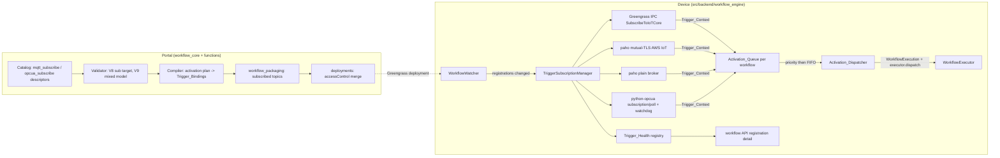

# Design Document

## Overview

Sub-feature B makes trigger-driven workflows real. Sub-feature A shipped the structural
scaffolding (`CATEGORY_TRIGGER`, the relocated `digital_input`, `unified_input`,
activation ports on the four legacy sources, validator `V7_STAGE_ORDER`) with all
activation edges dropped as inert at compile time. This feature adds the two subscribe
triggers (`mqtt_subscribe`, `opcua_subscribe`), turns their activation edges into
compiled Trigger_Bindings, and adds the device-side Trigger_Subscription_Manager that
holds live subscriptions, applies per-node concurrency policies, drains an
Activation_Queue by priority-then-FIFO, reconnects with backoff, runs the OPC UA
Liveness_Watchdog with subscribe→poll auto-fallback, and surfaces Trigger_Health.

Two hard invariants shape every decision:

- **Zero-trigger byte-identity**: any workflow without the new trigger nodes must
  compile, package, and run byte-identically to today
  (`golden_zero_trigger_compilation.json` guards this).
- **`digital_input` unchanged**: no policy parameters, no new activation realization —
  its activation edges stay inert (parent criterion 4.4).

All Phase 0.1 decisions and Phase 0.2 spike findings are treated as fixed inputs (see
requirements.md Introduction); this design does not reopen them.

### Key design decisions

- **D1 — Enum-gated parameters via `depends_on` `"name=value"`.** Today `depends_on`
  gates visibility on a bool parameter only. The policy family needs enum-selection
  gating (`queue_depth` under `queue`, `debounce_ms` under `debounce`,
  `poll_interval_ms` under `poll`). We extend the *interpretation* of the existing
  string field: a bare name keeps bool-truthy semantics (all existing descriptors
  unaffected); `"name=value"` means "visible while the named parameter's effective
  value equals the literal". No dataclass schema change, so the serialized descriptor
  shape and both catalog copies stay structurally identical; only the two config-panel
  interpreters (backend docstring contract + frontend `visibleWhenDependencyMet`) learn
  the new form. Rejected alternative: a new `depends_on_value` field (schema change
  rippling through baseline, mirror types, and serializers for no added power).

- **D2 — Trigger_Bindings ride the existing `executorBindings` channel.** The trigger
  nodes are executor-level (empty element chain + `executor_binding`), exactly like
  `digital_input`, so they flow through the compiler's existing executor-binding
  emission and land in `executorBindings` with their effective parameters. The compiler
  additionally attaches an `"activates"` key (ordered activation-target node ids) to
  the two new binding kinds only. No new top-level compiled-document field, so
  zero-trigger documents are untouched, and the device detects trigger-driven documents
  by the presence of a binding whose kind is `mqtt_subscribe`/`opcua_subscribe`. The
  `OutputBindingProcessor` already ignores input-side/unknown binding kinds, so run-time
  output processing is unaffected.

- **D3 — Activation edges are extracted, not streamed.** Activation edges
  (new-trigger output → `activation` port) are pulled out of the connection set inside
  `compile()` right after `expand_unified_inputs`, recorded in an activation plan, and
  excluded from stream-topology/segment computation. Edges into `activation` ports from
  any *other* source (notably `digital_input`) keep today's inert drop inside
  `expand_unified_inputs`. This keeps GStreamer segment building provably identical for
  graphs without the new triggers.

- **D4 — Sequential per-workflow dispatch.** The Activation_Dispatcher runs at most one
  in-flight run per workflow, draining pending Run_Activations by
  (priority, firing-seq). This satisfies "queue → activate sequentially" and
  priority-then-FIFO directly, avoids concurrent-pipeline resource contention on Jetson
  devices, and matches the existing one-run-at-a-time executor usage. Concurrency
  policies apply at enqueue time (bounded queue / drop / debounce-coalesce).

- **D5 — Subscribe accessControl via deployment-time configurationUpdate merge on the
  LocalServer component.** The IPC caller is the LocalServer process, so authorization
  must land on the LocalServer component. The publish precedent solved free-form topics
  with a static wildcard *publish-only* policy whose description deliberately refuses to
  broaden subscribe. We honor that stance: packaging records the workflow's subscribed
  topic filters (greengrass-path `mqtt_subscribe` nodes) on the version item + manifest,
  and `create_deployment` merges a uniquely-keyed
  `aws.greengrass#SubscribeToIoTCore` policy scoped to exactly those topics into the
  LocalServer component's `configurationUpdate` (same mechanism as the existing
  LogManager/ShadowManager merges; Greengrass deep-merges new policy keys alongside the
  recipe defaults). When LocalServer is not in the deployment, we cannot attach the
  merge — the deployment response carries an actionable warning and the device-side
  denial diagnostic (mirroring the publish-denial RuntimeError) covers the runtime.
  Rejected alternative: static wildcard subscribe in the four LocalServer recipes
  (contradicts the recorded security stance and grants every workflow every topic).

- **D6 — Trigger_Context persistence via one additive nullable column.**
  `workflow_executions` gains `trigger_context_json` (nullable Text) through an additive
  alembic migration, following the run-observability columns precedent. Existing rows
  and manual-trigger runs leave it NULL.

- **D7 — python-opcua synchronous client with a keepalive watchdog.** The packaged
  client is `python-opcua 0.98.13` (sync). The spike proved subscriptions work but die
  silently, so each OPC UA worker owns: a session, a subscription + monitored item (or a
  poll loop), and a watchdog thread that reads the server-status node every 5 s. Any
  watchdog/setup failure tears the whole session down and re-enters the reconnect path
  (sessions are unrecoverable after channel break).

## Architecture



Firing path on device: transport callback → build Trigger_Context → apply the node's
Concurrency_Policy at enqueue → Activation_Queue → dispatcher pops
(priority, firing-seq) when the workflow has no in-flight run → insert
`WorkflowExecution` (status pending, `trigger_context_json` set) → `executor.dispatch`
→ existing `WorkflowExecutor.execute` runs the pipeline. Failures stay contained per
run; the dispatcher continues with the next activation.

Lifecycle: `runtime.start_workflow_engine` constructs the manager after the watcher
(wrapped in the same containment try/except); the watcher notifies it after each
`sync_once` reconciliation; the manager diffs registered trigger-driven artifact sets
and starts/stops per-workflow subscription groups accordingly. A device with no
trigger-driven workflow starts no thread beyond the (idle) manager and opens no
connection (Requirement 12.4).

## Components and Interfaces

### C1 — Catalog descriptors and gating extension (both copies + frontend mirror)

`workflow_core/catalog/nodes.py` (portal, then byte-copied to the vendor path):

- `MQTT_SUBSCRIBE = NodeTypeDescriptor(type_id="mqtt_subscribe",
  category=CATEGORY_TRIGGER, inputs=[], outputs=[PortDescriptor("out",
  PORT_TYPE_EVENT_SIGNAL)], ...)` — connection parameters copied field-for-field from
  `MQTT_PUBLISH` (`topic` re-described as a topic filter; `payload_template` omitted —
  publish-only), plus the policy family (below). Mappings:
  `_same_on_device_archs(executor_binding="mqtt_subscribe",
  plugin_dependencies=["python:paho-mqtt", "python:awsiotsdk"])` + the same
  `ARCH_SIM` appsrc stub form as `DIGITAL_INPUT`; `hardware_dependent=True`.
- `OPCUA_SUBSCRIBE = NodeTypeDescriptor(type_id="opcua_subscribe", ...)` — `endpoint`,
  `node_id`, and the seven security parameters copied field-for-field from
  `OPCUA_WRITE` (`value_template` omitted); new `sampling_interval_ms` (int, default
  100, 10–60000); `mode` enum (`subscribe` default | `poll`) with `poll_interval_ms`
  (int, default 500, 10–60000, `depends_on="mode=poll"`); the policy family. Mappings:
  `_same_on_device_archs(executor_binding="opcua_subscribe",
  plugin_dependencies=["python:opcua"])` + `ARCH_SIM` appsrc stub;
  `hardware_dependent=True`.
- Shared policy family (a `_trigger_policy_parameters()` helper so the two descriptors
  cannot drift): `concurrency_policy` (enum `queue`|`drop`|`debounce`, default
  `queue`), `queue_depth` (int, default 10, 1–1000, `depends_on="concurrency_policy=queue"`),
  `debounce_ms` (int, default 500, 1–60000, `depends_on="concurrency_policy=debounce"`),
  `retry_limit` (int, default 0, 0–1000; 0 = retry forever), `priority` (int, default
  100, 0–1000; lower = higher priority).
- Both appended to `NODE_CATALOG` after `UNIFIED_INPUT` (append-only convention).
- `catalog/models.py`: `ParameterDescriptor.depends_on` docstring extended to document
  the `"name=value"` form (D1); no field change.

Frontend mirror (`types.ts`): hand-mirrored descriptors with identical names, types,
defaults, constraints, and `dependsOn` strings; the palette lists them under Triggers
automatically (category-driven). `NodeConfigPanel.tsx` `visibleWhenDependencyMet` parses
`dependsOn`: bare name → existing bool check; `name=value` → string-compare the
controlling parameter's effective value (explicit value, else declared default) against
the literal. `builderGraph.ts` needs no change (trigger category meta exists from
Sub-feature A).

### C2 — Validator checks V8 and V9 (`workflow_core/validator/checks.py`)

- `CODE_V8_MQTT_SUB_NO_TARGET = "V8_MQTT_SUB_NO_TARGET"` — `_check_v8` is the V6 logic
  applied to `type == "mqtt_subscribe"` nodes: error when neither `greengrass` nor
  `aws_iot` is truthy and `broker_host` is blank, message naming the node and the three
  ways to declare a target (Requirement 1.6). Kept as a separate code so V6's
  publish-specific message and existing finding sets are untouched.
- `CODE_V9_MIXED_ACTIVATION_MODEL = "V9_MIXED_ACTIVATION_MODEL"` — `_check_v9`: when the
  graph contains ≥ 1 `mqtt_subscribe`/`opcua_subscribe` node, every `CATEGORY_INPUT`
  node must have a connection targeting its `activation` port; one error finding per
  unconnected input node (Requirement 4.1). Graphs without the new trigger types produce
  zero V9 findings, preserving finding-set equality (Requirement 4.2). `digital_input`
  presence alone does not engage V9 (its activation behavior is unchanged).
- Both appended to `validate()` after `_check_w1`, never short-circuiting
  (Requirement 4.3). V7 already passes trigger→activation edges (target is a
  `CATEGORY_INPUT` node), satisfying Requirement 4.4 with no change.
- `inlineChecks.ts` gains `checkV8`/`checkV9` mirrors added to `runInlineChecks`
  (Requirement 4.5).

### C3 — Compiler activation plan (`workflow_core/compiler/compiler.py`)

- `TRIGGER_EXECUTOR_TYPES = frozenset({"mqtt_subscribe", "opcua_subscribe"})`.
- `expand_unified_inputs` changes its inert-drop guard: an edge targeting an
  `activation` port on an `INERT_ACTIVATION_TYPE_IDS` node is dropped **unless** its
  source node's type is in `TRIGGER_EXECUTOR_TYPES` (Requirement 5.3 keeps
  `digital_input` edges dropped; Requirement 5.2 keeps the new edges).
- Inside `compile()`, after expansion and validation: `_extract_activation_plan(graph)`
  removes every connection targeting an `activation` port whose source type is in
  `TRIGGER_EXECUTOR_TYPES` from the working connection set and returns
  `{trigger_node_id: [target_node_id, ...]}` (connection order preserved). Stream
  topology, segments, predecessors/successors, and W1-visible shapes are computed on the
  reduced set — for graphs without the new triggers the reduced set equals today's set
  byte-for-byte (Requirement 5.4).
- Executor-binding emission is unchanged except: entries whose `binding` is in
  `TRIGGER_EXECUTOR_TYPES` gain `"activates": plan[node_id]` (Requirement 5.1). No other
  entry gains any key; `CompiledPipelineDocument` needs no schema change (D2).
- Simulation mode already resolves `hardware_dependent` nodes to `ARCH_SIM` stubs, so
  the new triggers get their appsrc stubs with no compiler change (Requirements 5.5,
  11.1).
- The vendored compiler copy receives the same edit (mirror discipline).

### C4 — Trigger_Subscription_Manager (`src/backend/workflow_engine/trigger_runtime.py`, new)

```python
class TriggerSubscriptionManager:
    def __init__(self, session_factory=SessionLocal,
                 mqtt_transport_factory=default_mqtt_transport_factory,
                 opcua_transport_factory=default_opcua_transport_factory,
                 run_starter=default_run_starter,   # creates WorkflowExecution + executor.dispatch
                 clock=time.monotonic): ...
    def on_registrations_changed(self) -> None: ...   # diff + start/stop workflow groups
    def stop(self) -> None: ...
    def health(self, registration_id: str) -> list[dict]: ...  # Trigger_Health records
```

- **Wiring**: `runtime.start_workflow_engine` constructs the manager in its own
  containment block after the executor registration; `WorkflowWatcher` gains an additive
  `registrations_listeners` list invoked at the end of `sync_once` (and on
  invalidation), which the runtime points at `manager.on_registrations_changed`
  (Requirements 6.1, 12.4).
- **Per-workflow group**: for each registered artifact set whose compiled document
  contains trigger bindings, the manager builds one `WorkflowTriggerGroup` holding: one
  `TriggerWorker` per binding (transport + policy state + Trigger_Health), one
  `ActivationQueue`, one dispatcher thread. Groups stop (threads joined, transports
  closed) when the registration disappears or turns invalid (Requirement 6.1).
- **TriggerWorker**: owns the transport from the injected factory keyed by binding kind
  and parameters (Requirement 6.2); on delivery builds Trigger_Context (Requirement
  6.8) and calls `group.enqueue(worker, context)`.
- **Enqueue-time Concurrency_Policy** (Requirement 7.2–7.4):
  - `queue`: append unless the worker's pending count ≥ `queue_depth` → discard + log.
  - `drop`: discard when the worker has a pending or in-flight activation.
  - `debounce`: (re)arm a `debounce_ms` trailing timer replacing the stored context;
    on expiry enqueue one activation with the latest context.
- **ActivationQueue**: `heapq` of `(priority, firing_seq)` → `RunActivation`
  (Requirement 7.5). `firing_seq` is a monotonic counter assigned at firing time.
- **Dispatcher**: single thread per group; blocks while a run is in flight (polls the
  execution row / completion callback), then pops the head, inserts a
  `WorkflowExecution` (status `pending`, `trigger_context_json` set) and calls
  `executor.dispatch(execution_id)` — the same path as `api.trigger_workflow`
  (Requirements 7.1, 7.6, 7.7). Each `RunActivation` carries
  `activation_group=trigger_node_id` (the reserved extension point, Requirement 7.1).
- **Reconnect** (Requirements 8.1–8.3): every transport error routes to
  `worker.on_connection_lost(error)`: health → `reconnecting`, backoff 1 s doubling to
  60 s cap, attempts counted against `retry_limit` (0 = unbounded); success resets to
  `subscribed`/`polling`; exhaustion → health `failed` with
  `"Trigger '<node_id>' failed after N reconnect attempts: <topic|endpoint> — <error>"`
  and the worker parks until the group restarts.
- **Trigger_Health** (Requirement 9.1): in-memory registry
  `{registration_id: {node_id: {state, mechanism, autoFallback, reconnectAttempts,
  lastError}}}`; `api.py` registration detail adds an additive `triggerHealth` field
  populated from `runtime`-exposed manager (empty/absent for trigger-less
  registrations, Requirement 9.2).

### C5 — MQTT transports (`trigger_runtime.py`, mirroring `output_bindings.py` connect code)

- **GreengrassIpcSubscriber**: `awsiot.greengrasscoreipc.connect()` →
  `new_subscribe_to_iot_core()` with a `SubscribeToIoTCoreRequest` (topic filter, QOS
  clamped to `GREENGRASS_MAX_QOS` like the publish path) and a stream handler whose
  `on_stream_event` delivers `{topic, payload, qos, timestamp}` (Requirement 6.3);
  `on_stream_error`/`on_stream_closed` route to the reconnect path.
  `UnauthorizedError` on subscribe → health `failed` with the accessControl-naming
  message mirroring `_default_greengrass_publisher`'s denial text but for
  `aws.greengrass#SubscribeToIoTCore`, not counted against `retry_limit`
  (Requirement 8.7).
- **AwsIotTlsSubscriber / PlainBrokerSubscriber**: one long-lived
  `paho.mqtt.client.Client` per node — `client_id=iot_thing_name` + `tls_set(ca_certs,
  certfile, keyfile)` for the aws_iot path (mirroring `_default_mqtt_publisher`'s tls
  dict), plain `connect(broker_host, broker_port)` otherwise; `subscribe(topic, qos)`
  on `on_connect`, deliveries via `on_message`, `loop_start()` for the network thread;
  `on_disconnect` routes to the reconnect path (Requirements 6.4, 6.5).

### C6 — OPC UA worker (`trigger_runtime.py`)

- **Session build** mirrors `_default_opcua_writer`: `opcua.Client(endpoint)` +
  `set_user`/`set_password`/`set_security_string` from the same parameter mapping
  (Requirement 6.6, reusing `_opcua_security_from_params`).
- **subscribe mode**: `client.create_subscription(sampling_interval_ms, handler)` +
  `subscribe_data_change(node)`; `datachange_notification` builds
  `{endpoint, node_id, value, source_timestamp}` (Requirement 6.8).
- **Liveness_Watchdog**: thread reading the server-status node
  (`client.get_node("i=2259")`) every 5 s; `TimeoutError` / `BrokenPipeError` /
  `ConnectionError` / `CancelledError` (or any exception on the keepalive) → full
  session teardown → reconnect path (Requirement 8.4; spike: loss is silent, sessions
  unrecoverable).
- **poll mode / Polling_Fallback**: read `node_id` every `poll_interval_ms`; fire when
  the value differs from the last read (Requirement 6.7). Auto-fallback engages when
  `create_subscription`/`subscribe_data_change` raises during setup: same session,
  polling loop, health mechanism `poll` + `autoFallback: true`, transition logged
  (Requirement 8.5). A reconnect rebuild always attempts true subscription first
  (Requirement 8.6).

### C7 — Packaging and deployment accessControl (portal functions)

- `workflow_packaging.py`: `gather_subscribed_topics(definition) -> List[str]` — the
  sorted, de-duplicated `topic` values of `mqtt_subscribe` nodes whose effective
  `greengrass` is true. Recorded as `subscribed_topics` on the version item and in the
  packaged `manifest.json` only when non-empty (Requirements 10.1, 10.4 byte-identity).
- `deployments.py` `create_deployment`: when the component set contains a workflow
  component whose version item records `subscribed_topics` and the LocalServer
  component, deep-merge into the LocalServer entry's `configurationUpdate.merge`:

  ```json
  {"accessControl": {"aws.greengrass.ipc.mqttproxy": {
      "dda:workflow-subscribe:<workflowId>": {
        "policyDescription": "Workflow mqtt_subscribe trigger topics",
        "operations": ["aws.greengrass#SubscribeToIoTCore"],
        "resources": ["<topic filter>", "..."]}}}}
  ```

  (unique policy key per workflow; recipe-default policies untouched — Greengrass
  merges configuration maps by key, Requirement 10.2). When LocalServer is absent from
  the set, append an actionable warning to the deployment response naming the workflow,
  topics, and remedy (Requirement 10.3).

### C8 — Simulation stubs

The `ARCH_SIM` appsrc mapping on both descriptors (C1) is the whole simulation story:
simulation-mode compilation resolves the trigger nodes to harness-fed appsrc event
sources exactly like `digital_input` (Requirement 11.1); no broker/server code is
reachable in the sandbox.

## Data Models

### Trigger_Binding (compiled `executorBindings` entry, additive keys in bold)

```json
{
  "nodeId": "trig1",
  "binding": "mqtt_subscribe",
  "parameters": {"topic": "factory/line1/start", "qos": 1, "greengrass": true,
                  "concurrency_policy": "queue", "queue_depth": 10,
                  "retry_limit": 0, "priority": 100},
  "upstreamNodeIds": [],
  "downstreamNodeIds": [],
  "activates": ["input1"]
}
```

### Trigger_Context

- MQTT: `{"topic": str, "payload": str, "qos": int, "timestamp": float}` (epoch seconds
  at delivery).
- OPC UA: `{"endpoint": str, "node_id": str, "value": Any, "source_timestamp":
  str | None}` (ISO-8601 when the server supplies one). Identical shape for
  `subscribe`, `poll`, and auto-fallback.

### RunActivation (in-memory, `trigger_runtime.py`)

```python
@dataclass
class RunActivation:
    trigger_node_id: str
    activation_group: str        # == trigger_node_id now; reserved for AND/correlation
    priority: int
    firing_seq: int              # monotonic, assigned at firing time
    context: dict                # Trigger_Context
```

### Trigger_Health record (API additive field `triggerHealth`)

```json
{"nodeId": "trig2", "state": "polling", "mechanism": "poll", "autoFallback": true,
 "reconnectAttempts": 0, "lastError": null}
```

`state` ∈ `connecting | subscribed | polling | reconnecting | failed`; `mechanism`
present for OPC UA nodes only.

### Database (additive alembic migration)

`workflow_executions.trigger_context_json` — nullable `Text`, NULL for manual and
pre-existing runs (D6).

### Parameter gating grammar

`depends_on` ::= `<param_name>` (bool-truthy, existing) | `<param_name>=<literal>`
(equality against the effective value's string form).

## Correctness Properties

*A property is a characteristic or behavior that should hold true across all valid
executions of a system — essentially, a formal statement about what the system should do.
Properties serve as the bridge between human-readable specifications and
machine-verifiable correctness guarantees.*

Reflection note (redundancy elimination): the prework's per-criterion candidates were consolidated — the four
descriptor-mirroring criteria collapse into P1; the three concurrency policies collapse
into P9 (one conformance property over generated firing sequences); zero-trigger
byte-identity and digital_input inertness collapse into P8 (both are "no new trigger ⇒
pre-feature output"); reconnect bounding and failure marking collapse into P12
(exhaustion is the boundary of the same generated sequence); topic extraction, the
accessControl merge, and no-subscribe preservation collapse into P16 (one pipeline over
generated definitions).

### Property 1: Descriptor mirroring

For every connection parameter name shared with `mqtt_publish`, the `mqtt_subscribe`
descriptor's `ParameterDescriptor` equals the `mqtt_publish` counterpart field-for-field;
for every endpoint/security parameter name shared with `opcua_write`, the
`opcua_subscribe` descriptor's `ParameterDescriptor` equals the `opcua_write` counterpart
field-for-field; and for every policy-family parameter name, the two trigger descriptors'
declarations are equal to each other.

**Validates: Requirements 1.2, 2.2, 2.3, 2.5**

### Property 2: mqtt_subscribe must declare a target

For any `mqtt_subscribe` node configuration, `validate` produces exactly one
`V8_MQTT_SUB_NO_TARGET` error finding for that node if and only if `greengrass` is not
truthy, `aws_iot` is not truthy, and `broker_host` is absent or blank.

**Validates: Requirements 1.6**

### Property 3: Mixed activation model is rejected

For any generated graph containing at least one `mqtt_subscribe` or `opcua_subscribe`
node, `validate` produces exactly one `V9_MIXED_ACTIVATION_MODEL` error finding per
`CATEGORY_INPUT` node whose `activation` port has no incoming connection, and zero V9
findings when every input is activation-wired.

**Validates: Requirements 4.1**

### Property 4: Validator equivalence without the new triggers

For any generated graph containing no `mqtt_subscribe` and no `opcua_subscribe` node
(including `digital_input` graphs), the extended validator's finding set equals the
pre-feature validator's finding set (same codes, severities, node/connection ids), with
zero `V8`/`V9` findings.

**Validates: Requirements 4.2**

### Property 5: Inline-check parity for the new checks

For any generated graph, the frontend `checkV8`/`checkV9` inline findings identify the
same offending nodes, severities, and check codes as the backend validator's V8/V9
findings for the same graph.

**Validates: Requirements 4.5**

### Property 6: Dependent-parameter gating semantics

For any parameter with a bare-name `depends_on` and any controlling bool value, the
visibility decision equals the pre-feature decision; and for any parameter with a
`"name=value"` `depends_on` and any effective controlling value (explicit, defaulted, or
absent), the parameter is visible if and only if the effective value's string form equals
the literal — so selecting `queue`/`debounce`/`poll` shows exactly
`queue_depth`/`debounce_ms`/`poll_interval_ms` respectively.

**Validates: Requirements 3.1, 3.6**

### Property 7: Trigger bindings are emitted faithfully

For any generated trigger-driven graph and device architecture, the compiled document
contains exactly one executor-binding entry per `mqtt_subscribe`/`opcua_subscribe` node,
carrying that node's binding kind, its effective parameters (declared defaults applied),
and an `activates` list equal to the ordered target node ids of that trigger's
activation edges — and the compiled `segments` equal the segments compiled from the same
graph with the activation edges removed.

**Validates: Requirements 5.1, 5.2**

### Property 8: No-new-trigger compilation and packaging are preserved

For any generated graph containing no `mqtt_subscribe` and no `opcua_subscribe` node —
including Zero_Trigger_Workflows and graphs wiring a `digital_input` output to an
`activation` port — the compiled document (and packaged artifacts) are byte-identical to
the pre-feature output for the same graph, with no trigger-related key present
(`golden_zero_trigger_compilation.json` anchors the zero-trigger case).

**Validates: Requirements 5.3, 5.4, 12.1**

### Property 9: Concurrency policy conformance

For any trigger node configuration and any generated firing sequence (with a controlled
in-flight run), the pending activations conform to the node's policy: under `queue`, the
pending count never exceeds `queue_depth` and overflow firings are discarded; under
`drop`, a firing is discarded whenever an activation from that node is pending or in
flight; under `debounce`, all firings within a trailing `debounce_ms` window coalesce
into exactly one activation carrying the most recent Trigger_Context.

**Validates: Requirements 7.2, 7.3, 7.4**

### Property 10: Priority-then-FIFO dispatch order

For any generated set of pending Run_Activations, the Activation_Dispatcher dequeues
them in exactly the order sorted by (`priority` ascending, `firing_seq` ascending).

**Validates: Requirements 7.5**

### Property 11: OR semantics with activation isolation

For any generated interleaving of firings across a workflow's multiple triggers, every
firing not discarded by a concurrency policy yields exactly one Run_Activation whose
Activation_Group id is its trigger node id, and a failed run never prevents subsequent
pending activations from dispatching.

**Validates: Requirements 7.1, 7.7**

### Property 12: Reconnect bounding, backoff, and failure marking

For any `retry_limit` value and any generated sequence of connection failures (with an
injected clock), the reconnect delays follow 1 s doubling capped at 60 s; when
`retry_limit` ≥ 1 the attempt count never exceeds it, and on exhaustion the trigger's
health is `failed` with an error message containing the trigger node id and the topic
(MQTT) or endpoint (OPC UA); when `retry_limit` is 0 attempts continue for the whole
generated sequence.

**Validates: Requirements 8.1, 8.3**

### Property 13: Trigger_Context fidelity

For any generated delivery, the built Trigger_Context carries exactly
`{topic, payload, qos, timestamp}` (MQTT) or `{endpoint, node_id, value,
source_timestamp}` (OPC UA) with values matching the delivery; OPC UA contexts are
identical in shape under `subscribe` and `poll`; for any generated sequence of polled
values, poll-mode firings occur exactly at positions where the value differs from the
previous read; and the dispatched execution row persists the context as
`trigger_context_json`.

**Validates: Requirements 6.7, 6.8**

### Property 14: Greengrass subscribe QoS clamp

For any configured `qos` value, the Greengrass IPC subscribe request carries
`min(qos, 1)`, mirroring the publish path's clamp.

**Validates: Requirements 6.3**

### Property 15: OPC UA security mapping parity

For any generated combination of the seven security parameters, the subscription
session's client configuration calls (`set_user`, `set_password`,
`set_security_string`) equal those the `opcua_write` executor makes for the same
parameter values.

**Validates: Requirements 6.6**

### Property 16: Subscribed-topics packaging and accessControl merge

For any generated workflow definition, the recorded `subscribed_topics` equal the
sorted, de-duplicated `topic` values of its greengrass-enabled `mqtt_subscribe` nodes
(and are absent when that set is empty, leaving packaging output byte-identical to
pre-feature); and for any non-empty recorded topic set, the deployment merge produces a
`SubscribeToIoTCore` policy whose resources equal exactly those topics under a
workflow-unique policy key, leaving all other accessControl content untouched.

**Validates: Requirements 10.1, 10.2, 10.4**

### Property 17: Catalog copies stay byte-identical

The portal catalog copy and the device-vendored catalog copy are byte-identical after
all changes in this feature.

**Validates: Requirements 3.3**

## Error Handling

- **Validation-time**: target-less `mqtt_subscribe` (V8) and mixed activation models
  (V9) are rejected with per-node actionable findings before packaging; the designer
  mirrors both inline.
- **Startup containment**: the Trigger_Subscription_Manager is constructed inside its
  own try/except in `runtime.start_workflow_engine` — a failure is logged and
  LocalServer continues (Requirement 12.4), matching the watcher/executor precedent.
- **Transport failures**: every connection error routes to the per-worker reconnect
  path (backoff, `retry_limit`, Trigger_Health `reconnecting` → `failed` on
  exhaustion). OPC UA silent death is converted into detectable failure by the
  Liveness_Watchdog (spike finding); the whole session is rebuilt because the channel is
  unrecoverable.
- **Authorization denials**: Greengrass `UnauthorizedError` on subscribe marks the
  trigger `failed` immediately with a message naming the topic and the
  `aws.greengrass.ipc.mqttproxy` accessControl location (mirroring the publish-denial
  text); it is not retried (retrying cannot fix authorization).
- **Policy overflow**: `queue_depth` overflow and `drop` discards are logged with the
  trigger node id; they are expected flow control, not run failures.
- **Run failures**: a triggered run failing marks only that `WorkflowExecution`
  (existing containment in `executor.dispatch` / `WorkflowExecutor`); the dispatcher
  proceeds to the next activation (Requirement 7.7).
- **Malformed trigger bindings**: a registered document whose trigger binding is
  missing required parameters marks that workflow's Trigger_Health `failed` with the
  parse error; other workflows' subscriptions are unaffected.
- **Deployment without LocalServer**: the accessControl merge cannot attach, so the
  deployment response carries an actionable warning (Requirement 10.3) and the runtime
  denial diagnostic remains the backstop.

## Testing Strategy

Dual approach: property-based tests validate the universal properties above; example
tests cover fixed descriptor content, wiring, state transitions, and error branches.

- **Backend properties**: **Hypothesis**, ≥ 100 iterations (`max_examples=100`) per
  property, each tagged
  `# Feature: trigger-activation-runtime, Property {n}: {property text}`, one
  property-based test per property. Portal-side properties (P1–P4, P7, P8, P16, P17)
  live in `edge-cv-portal/backend/layers/workflow_core/tests/` (reusing
  `generators.py`, extended with trigger-node/activation-edge generators) and
  `edge-cv-portal/backend/tests/` for packaging/deployment; device-side properties
  (P9–P15) live in `test/backend-test/workflow_engine/` with stub transports, fake
  clocks, and an in-memory session factory — no network, no broker, no OPC UA server.
- **Frontend properties**: **fast-check** (existing `*.property.test.ts` pattern,
  ≥ 100 runs, same tag comment) for P5 (inline parity) and P6 (gating semantics), under
  `edge-cv-portal/frontend/src/pages/workflows/`.
- **Example/unit tests**: descriptor content (1.1, 1.3–1.5, 2.1, 2.4, 2.6, 3.5),
  validator wiring (4.3, 4.4), simulation stubs (5.5, 11.1), manager lifecycle and
  transports against stubs (6.1–6.5 examples), health transitions and API surfacing
  (8.2, 9.1, 9.2), OPC UA watchdog/fallback branches (8.4 parametrized over the four
  exception types, 8.5–8.7), deployment warning (10.3), baseline scoping (3.2, 3.4,
  12.2, 12.3), and startup containment (12.4).
- **Goldens/baselines**: update `catalog_baseline.json` (delta scoped to the two new
  descriptors); `golden_zero_trigger_compilation.json` must pass **unchanged**; the
  existing packaging goldens under `test/backend-test/deploy_reliability/goldens/` must
  pass unchanged.
- **Suite invocations**: portal catalog
  `cd edge-cv-portal/backend && python3 -m pytest layers/workflow_core/tests/`; portal
  backend `cd edge-cv-portal/backend && python3 -m pytest tests/`; device engine
  `PYTHONPATH=src/backend:test/backend-test python3 -m pytest
  test/backend-test/workflow_engine/`; frontend
  `cd edge-cv-portal/frontend && npx vitest run <paths>`.
- **On-hardware (gated, user go-ahead required)**: real MQTT-subscribe activation
  (greengrass path on the JP6 device, exercising the deployed accessControl) and a real
  OPC UA subscription with server-kill watchdog/reconnect observation — the runtime
  counterpart of the Phase 0.2 spike.
