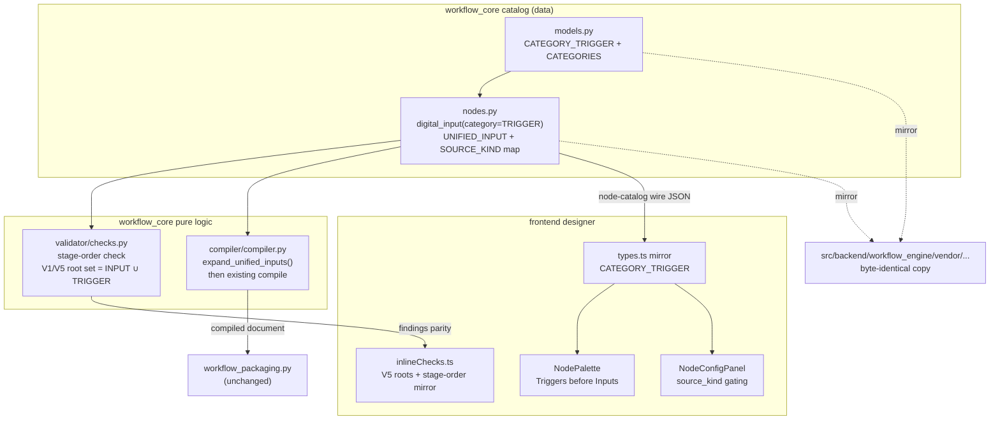

# Design Document

## Overview

Sub-feature A introduces the **structural scaffolding** for a Triggers stage and a
unified Input node across the portal `workflow_core` catalog, the pure validator/compiler,
and the frontend Workflow_Designer. It deliberately adds **no** device-runtime
subscription or activation model — every change is either data-only (catalog descriptors,
category constants), pure-function logic (validator/compiler), or designer UX. The
guiding constraint is behavior preservation: any workflow that does not use the new
scaffolding must compile, package, validate, and run exactly as it does today.

Four concrete deliverables:

1. **`CATEGORY_TRIGGER`** — a new node category constant in `catalog/models.py`, mirrored
   into the frontend `types.ts`, presented as a palette section ordered before Inputs.
2. **`digital_input` relocation** — a one-field `category` change (`CATEGORY_INPUT` →
   `CATEGORY_TRIGGER`) that is provably invisible to the compiler and device runtime,
   because compilation keys off `type_id` + `mappings`, never `category`.
3. **`Unified_Input_Node`** — a new `CATEGORY_INPUT` descriptor with a `source_kind` enum
   that coexists with the four retained source descriptors. It carries the union of their
   parameters, a single `PORT_TYPE_VIDEO_FRAMES` output, and one optional
   `PORT_TYPE_EVENT_SIGNAL` activation input port. At compile time it **expands** into the
   underlying source descriptor selected by `source_kind`, guaranteeing byte-identical
   device bindings. The activation port is scaffolding only — dropped at compile time.
4. **Validator stage-ordering** — a new check enforcing Trigger → Input → downstream, plus
   two targeted adjustments to V1 and V5 so that relocating `digital_input` out of
   `CATEGORY_INPUT` preserves the exact finding set for existing graphs.

### Grounded anchors (symbols read for this design)

- Category constants + `NodeTypeDescriptor`/`GstMapping`/`ParameterDescriptor`:
  `workflow_core/catalog/models.py` (`CATEGORY_INPUT`…`CATEGORY_OUTPUT`, `CATEGORIES`).
- Source descriptors + `NODE_CATALOG` + `nodes_by_category()`:
  `workflow_core/catalog/nodes.py` (`CSI_CAMERA_SOURCE`, `ICAM_SOURCE`,
  `ARAVIS_CAMERA_SOURCE`, `FOLDER_SOURCE`, `DIGITAL_INPUT`).
- Compiler: `workflow_core/compiler/compiler.py` (`compile()`, `mapping_for`,
  `_effective_parameters`, `_resolve_chain`, `executor_bindings`).
- Validator: `workflow_core/validator/checks.py` (`validate()`, `_check_v1`…`_check_w1`,
  `ValidationFinding`) and `validator/parameters.py` (`check_parameter_value`).
- Byte-in-sync tests: `edge-cv-portal/backend/layers/workflow_core/tests/test_catalog_content.py`
  (`TestCatalogMirrorEquality`) and
  `test/backend-test/workflow_engine/test_vendored_catalog_mirror.py`.
- Frontend mirror + designer: `frontend/src/pages/workflows/types.ts` (`CATEGORY_*`,
  `CATEGORIES`, `NodeTypeDescriptor`), `NodePalette.tsx`, `builderGraph.ts`
  (`CATEGORY_META`), `inlineChecks.ts` (`checkV5`, `runInlineChecks`),
  `NodeConfigPanel.tsx` (`isParameterVisible`, `dependsOn` gating),
  `BuilderNodeComponent.tsx`.

## Architecture

The change spans three layers. The **catalog** is the shared source of truth (two
byte-identical Python copies plus a hand-maintained TypeScript mirror). The **validator**
and **compiler** are pure functions consuming the catalog. The **designer** renders the
catalog and mirrors a subset of validator logic inline.



### Key architectural decisions

- **Category is presentation/validation metadata, not a compilation input.** The compiler
  (`compile()` in `compiler.py`) resolves each node through `descriptors_by_id[node.type]`
  and `descriptor.mapping_for(arch)`, and tags emitted elements/bindings by `node.id`.
  `category` is referenced only by the validator (`_check_v1`, `_check_v5`, `_check_w1`).
  This is what makes the `digital_input` relocation a genuine no-op for compilation,
  packaging, and runtime (Requirement 2.5, P2).

- **The unified node is a designer/authoring convenience that compiles to an existing
  source.** Rather than duplicating four sets of per-architecture `GstMapping`s on a new
  descriptor (which would inevitably diverge from the originals), the compiler performs a
  pure **expansion**: a `Unified_Input_Node` instance is rewritten into a synthetic node of
  the underlying source `type_id` (chosen by `source_kind`), reusing the original
  descriptor's mappings and parameter-resolution path verbatim. Divergence is structurally
  impossible because the four source descriptors remain the single source of truth
  (Requirements 3.4, 3.6; P3, P4).

- **Relocating `digital_input` must not change V1/V5 outcomes.** Today `digital_input` is
  `CATEGORY_INPUT`, so it satisfies V1's "≥1 input node" and is a V5 reachability root.
  Moving it to `CATEGORY_TRIGGER` would otherwise introduce `V1_NO_INPUT_NODE` and
  `V5_UNREACHABLE_NODE` findings on existing digital-input graphs. The design widens V1's
  presence test and V5's root set to `CATEGORY_INPUT ∪ CATEGORY_TRIGGER`, which is exactly
  the pre-relocation behavior for those graphs and is a no-op on zero-trigger graphs
  (Requirements 2.7, 4.5; P6).

- **Byte-in-sync discipline extends to `models.py`.** `CATEGORY_TRIGGER` and the widened
  `CATEGORIES` tuple live in `models.py`, but today's mirror tests only compare `nodes.py`.
  The design adds `models.py` (and, defensively, the whole `catalog/` package) to the
  byte-identical assertion (Requirements 1.2, 6.5; P7).

## Components and Interfaces

### C1. Category constant (`catalog/models.py`)

Add the constant and widen the tuple, **trigger first** so downstream consumers that
iterate `CATEGORIES` present Triggers ahead of Inputs:

```python
CATEGORY_TRIGGER = "trigger"

CATEGORIES = (
    CATEGORY_TRIGGER,
    CATEGORY_INPUT,
    CATEGORY_PREPROCESSING,
    CATEGORY_INFERENCE,
    CATEGORY_POST_PROCESSING,
    CATEGORY_OUTPUT,
)
```

Export `CATEGORY_TRIGGER` from `catalog/__init__.py` (`__all__`) alongside the existing
category constants. No `NodeTypeDescriptor` schema change is required for the relocation.

### C2. `digital_input` relocation (`catalog/nodes.py`)

Exactly one line changes on the existing `DIGITAL_INPUT` descriptor:

```python
DIGITAL_INPUT = NodeTypeDescriptor(
    type_id="digital_input",
    category=CATEGORY_TRIGGER,   # was CATEGORY_INPUT
    ...
)
```

`pin`, `trigger_edge`, `poll_interval_ms`, the single `PORT_TYPE_EVENT_SIGNAL` `out` port,
the `_same_on_device_archs(executor_binding="digital_input")` device mappings, and the
`ARCH_SIM` appsrc stub are all unchanged (Requirements 2.2–2.4). Because
`compile()` never reads `category`, `mapping_for(arch).executor_binding == "digital_input"`
still resolves identically on every architecture (Requirement 2.5, P2).

### C3. `Unified_Input_Node` descriptor (`catalog/nodes.py`)

A new descriptor plus a data map, both additive and byte-mirrored to the vendor copy.

**Source-kind → source type map (single source of truth for gating + expansion):**

```python
SOURCE_KIND_TO_SOURCE_TYPE = {
    "csi_camera":    "csi_camera_source",
    "icam":          "icam_source",
    "aravis_camera": "aravis_camera_source",
    "folder":        "folder_source",
}
```

Note the map excludes `digital_input`, satisfying Requirement 3.3 (no digital input as a
selectable `source_kind`).

**Parameter construction — reuse, do not restate.** The unified descriptor's parameters
are built programmatically from the four source descriptors so they cannot drift from the
originals (Requirement 3.4). A `source_kind` enum is prepended; the per-source parameters
are concatenated in source-kind order, de-duplicated by name (only `gain`/`exposure` collide
between `csi_camera_source` and `aravis_camera_source`, and those definitions are already
identical), and each carries a `depends_on`-style gating marker (see below). The **only**
field overridden on the reused parameters is `required`, which is forced to `False`:

```python
def _unified_source_parameters():
    """Union of the four source descriptors' parameters, required-relaxed,
    tagged with the source_kind they belong to. Reuses the live descriptor
    objects so names/types/defaults/constraints cannot diverge (Req 3.4)."""
    seen, params = {}, []
    for kind, type_id in SOURCE_KIND_TO_SOURCE_TYPE.items():
        for p in get_node_type(type_id).parameters:
            if p.name in seen:
                continue
            seen[p.name] = kind
            params.append(replace(p, required=False))  # dataclasses.replace
    return params

UNIFIED_INPUT = NodeTypeDescriptor(
    type_id="unified_input",
    category=CATEGORY_INPUT,
    display_name="Input Source",
    inputs=[PortDescriptor("activation", PORT_TYPE_EVENT_SIGNAL)],   # optional (Req 3.7)
    outputs=[PortDescriptor("out", PORT_TYPE_VIDEO_FRAMES)],         # single (Req 3.5)
    parameters=[
        ParameterDescriptor("source_kind", "enum", required=True, default="folder",
                            constraints={"values": list(SOURCE_KIND_TO_SOURCE_TYPE)},
                            description="Which underlying source this input represents.",
                            examples=["folder", "csi_camera"]),
        *_unified_source_parameters(),
    ],
    mappings=<see expansion note>,
    hardware_dependent=True,
)
```

Rationale for `required=False` on the reused parameters: Requirement 3.4 enumerates
"names, types, defaults, and constraints" — deliberately **not** `required`. V4
(`_check_v4`) has no notion of "required only when `source_kind == folder`", so if the
union kept `folder_source.location`, `aravis_camera_source.camera_id`, and
`icam_source.device` all `required=True`, every unified node would fail V4 regardless of
`source_kind`. Relaxing to `False` keeps V4 quiet on the unified graph; genuine
required-ness is enforced at compile time by expansion into the underlying descriptor
(which retains `required=True`) — see C5.

**Gating marker.** The existing conditional-visibility mechanism (`ParameterDescriptor.
depends_on`) references a **bool** parameter and is consumed only by the frontend
(`NodeConfigPanel.isParameterVisible`); the validator ignores it. `source_kind` is an
enum, so `depends_on` cannot express it directly. To avoid a `ParameterDescriptor` schema
change (which would ripple through both Python copies and the TS mirror), gating is driven
by the **`SOURCE_KIND_TO_SOURCE_TYPE` map plus the served source descriptors**: the
frontend computes the visible parameter set for a selected `source_kind` as exactly the
parameter names of `SOURCE_KIND_TO_SOURCE_TYPE[source_kind]`'s descriptor from the served
catalog (Requirement 5.3). No per-parameter schema field is added. `source_kind` itself is
always visible.

**Mappings.** The unified descriptor still needs *a* mapping per architecture so
`compile()`'s unmapped-architecture guard
(`mapping is None or (not element_chain and not executor_binding)`) does not fire before
expansion runs. In practice `compile()` performs `expand_unified_inputs` **before** mapping
resolution (C5), so the unified `type_id` never reaches `mapping_for`. To keep the
descriptor self-consistent for any non-expanding catalog consumer, `mappings` is declared
as an empty-but-present placeholder that is never resolved; expansion is the sole compile
path. (Alternative considered and rejected: giving the unified node real per-source
mappings — rejected because a single descriptor cannot hold four source-kind-dependent
element chains under the one-`GstMapping`-per-arch model, and copying chains would diverge
from the originals.)

### C4. Validator stage-ordering + root-set adjustment (`validator/checks.py`)

Three coordinated edits, all preserving the "run every check, never short-circuit,
return the full list" contract (Requirement 4.6):

**(a) New stage-order check (`CODE_V7_STAGE_ORDER = "V7_STAGE_ORDER"`).** A
`CATEGORY_TRIGGER` node has no input ports and may only *feed* an Input's activation port.
Therefore any connection whose **target** is a trigger node is an illegal ordering — it is
the only way to place a trigger "downstream of" a source (Requirements 4.2, 4.3). The check
is target-category based, which also makes the legal `Trigger → Unified activation-port`
case pass automatically (its target is the `CATEGORY_INPUT` unified node, Requirement 4.4):

```python
def _check_v7(graph, typed_nodes):
    findings = []
    for connection in graph.connections:
        target = typed_nodes.get(connection.target.node)
        if target is not None and target.category == CATEGORY_TRIGGER:
            findings.append(ValidationFinding(
                SEVERITY_ERROR, CODE_V7_STAGE_ORDER,
                "Connection '{0}' targets trigger node '{1}': a trigger may not be "
                "downstream of any node (Trigger → Input ordering)".format(
                    connection.id, connection.target.node),
                connection_id=connection.id,
            ))
    return findings
```

On a zero-trigger graph there are no trigger-category targets, so `_check_v7` returns `[]`
— no new findings (Requirement 4.5, P6).

**(b) V1 presence test** widens from `CATEGORY_INPUT in categories` to
`categories & {CATEGORY_INPUT, CATEGORY_TRIGGER}`, so a graph whose only source is
`digital_input` still satisfies "has an input" exactly as before relocation
(Requirement 2.7).

**(c) V5 reachability roots** widen from `category == CATEGORY_INPUT` to
`category in (CATEGORY_INPUT, CATEGORY_TRIGGER)`, so `digital_input` remains a BFS root and
its downstream nodes stay reachable, matching the pre-relocation outcome (Requirement 2.7,
P6). On zero-trigger graphs the trigger set is empty, so both (b) and (c) are identical to
today.

`validate()` gains one line: `findings.extend(_check_v7(graph, typed_nodes))`, slotted
after `_check_w1` (order within the list is not significant to callers, which filter by
`severity`/`code`).

### C5. Compiler expansion (`compiler/compiler.py`)

A pure pre-pass rewrites unified nodes into their underlying source nodes on a **copy** of
the graph; the stored/original graph is never mutated (mirrors the designer's
non-mutation guarantee, Requirements 2.6, 5.2):

```python
def expand_unified_inputs(graph, catalog):
    """Return a new WorkflowGraph in which every unified_input node is replaced
    by a synthetic node of its source_kind's underlying source type, and every
    connection into a unified node's 'activation' port is dropped. Node ids and
    positions are preserved; only the applicable parameter subset is carried."""
    ...
```

Behavior:
- For each `unified_input` node, look up `source_type = SOURCE_KIND_TO_SOURCE_TYPE[source_kind]`,
  emit a node with the **same `id`**, `type = source_type`, same `position`, and only the
  parameters whose names appear on the underlying source descriptor (dropping `source_kind`
  and any non-applicable union parameters).
- Drop every connection whose `target` is a unified node's `activation` port — the
  underlying source has no input ports, and the activation port emits no binding
  (Requirement 3.9, P4). All other connections are preserved unchanged.
- Non-unified nodes and their connections pass through untouched.

`compile()` invokes `expand_unified_inputs(graph, catalog)` at its entry, before the
validation re-run and mapping resolution. Downstream, the expanded `folder_source` /
`csi_camera_source` / etc. node flows through the **existing** mapping resolution,
`_resolve_chain`, segment linearization, and executor-binding emission — so a unified node
with `source_kind = X` and parameter set P produces the exact segments/bindings a
hand-placed source-X node with the same id and equivalent parameters produces
(Requirements 3.6, 3.8; P3, P4).

Consequence for a *connected* activation port at compile time: after the activation edge is
dropped, the feeding `digital_input` becomes a standalone executor node with no downstream.
It still emits its ordinary `digital_input` executor binding (as today) and the source runs
free-running — no trigger-driven activation binding is emitted (Requirement 3.9). The
expanded graph still validates because V1/V5 count trigger nodes (C4b/C4c).

### C6. Frontend mirror + designer

- **`types.ts`**: add `export const CATEGORY_TRIGGER = 'trigger';` and place it **first** in
  the `CATEGORIES` array (`NodeCategory` derives from it). Add a mirrored
  `SOURCE_KIND_TO_SOURCE_TYPE` constant for gating.
- **`builderGraph.ts` `CATEGORY_META`**: add a `trigger: { label: 'Triggers', color: … }`
  entry so the palette section has a label/color (otherwise `categoryMeta` falls back to
  `UNKNOWN_CATEGORY_META`).
- **`NodePalette.tsx`**: no logic change — it already maps `CATEGORIES` in order and filters
  by category, so listing `trigger` first renders the Triggers section before Inputs
  (Requirements 1.4, 5.1).
- **Saved-graph rendering**: `fromWorkflowDefinition` (in `builderGraph.ts`) already rebuilds
  nodes purely from `node.type` + the served descriptor; a saved `digital_input` now carries
  `category = 'trigger'` from the catalog and renders under Triggers **without any change to
  the stored definition** (`toWorkflowNode`/`toWorkflowDefinition` copy `type`/`parameters`/
  `position` verbatim). No migration, no mutation (Requirements 2.6, 5.2).
- **`NodeConfigPanel.tsx`**: for a `unified_input` node, compute visible parameters as
  `source_kind` plus the parameter names of `SOURCE_KIND_TO_SOURCE_TYPE[source_kind]`'s
  served descriptor (Requirement 5.3). Reuses the existing per-field rendering.
- **`BuilderNodeComponent.tsx`**: render the optional `activation` `EventSignal` input port
  on the unified node and allow a `CATEGORY_TRIGGER` output → activation-port edge; port
  compatibility already flows through `connectionRejectionReason` →
  `incompatibilityReason` (EventSignal↔EventSignal is compatible), so no rule change is
  needed (Requirement 5.4).
- **`inlineChecks.ts`**: widen `checkV5` roots to `CATEGORY_INPUT ∪ CATEGORY_TRIGGER` and add
  a stage-order mirror (target-is-trigger) so inline markers match backend findings for the
  same graph, including stage-ordering findings (Requirement 5.5).

## Data Models

No new persisted shapes. The Workflow_Definition document (`schemaVersion 1`,
`nodes`/`connections`) is unchanged; a unified node is an ordinary node whose `type` is
`"unified_input"` and whose `parameters` include `source_kind`. Catalog data-model touch
points:

- **`CATEGORY_TRIGGER: str`** — new category constant; `CATEGORIES` widened to 6 members
  (trigger first).
- **`SOURCE_KIND_TO_SOURCE_TYPE: dict[str, str]`** — new catalog data mapping each
  `source_kind` enum value to an existing source `type_id`; the shared source of truth for
  frontend gating (C6) and compiler expansion (C5).
- **`UNIFIED_INPUT: NodeTypeDescriptor`** — appended to `NODE_CATALOG` (additive, after
  existing entries, mirroring the `LLM_INFERENCE` append convention so no pre-existing
  descriptor shifts).
- **`DIGITAL_INPUT.category`** — the single mutated field (`CATEGORY_INPUT` →
  `CATEGORY_TRIGGER`).
- **`NodeTypeDescriptor` / `ParameterDescriptor` / `GstMapping`** — schemas unchanged. The
  unified descriptor's parameters are constructed with `dataclasses.replace(p, required=False)`
  over the reused source parameters, adding no fields.
- **Compiled Pipeline Document** — schema unchanged; a unified node contributes the same
  `segments`/`executorBindings`/`pluginDependencies` entries as its expanded source.
- **Frontend mirror** (`types.ts`) — `CATEGORY_TRIGGER` constant + `CATEGORIES` entry +
  `SOURCE_KIND_TO_SOURCE_TYPE`; `NodeTypeDescriptor`/`ParameterDescriptor` TS interfaces
  unchanged.

## Correctness Properties

*A property is a characteristic or behavior that should hold true across all valid
executions of a system — essentially, a formal statement about what the system should do.
Properties serve as the bridge between human-readable specifications and machine-verifiable
correctness guarantees.*

The prework analysis classified most acceptance criteria as descriptor-content EXAMPLES
(assert a specific field value) and identified seven universally-quantified properties.
These match the P1–P7 set already declared in `requirements.md`; the statements below are
the design-level, testable form. Descriptor-content criteria (1.1, 1.3, 1.4, 2.1–2.4, 3.1,
3.2, 3.3, 3.5, 3.7, 5.1, 5.4, 6.4) are covered by example/snapshot unit tests, not by these
properties.

### Property 1: Zero-trigger workflows compile and package byte-identically

*For all* generated Zero_Trigger_Workflows built only from pre-existing node types, and for
all target architectures, the compiled Pipeline Document bytes and the packaged artifact
bytes produced with this feature are byte-identical to the pre-feature baseline.

**Validates: Requirements 6.1, 6.2, 6.3**

### Property 2: digital_input relocation is binding-preserving

*For all* architectures and *for all* valid `digital_input` parameter combinations (`pin`,
`trigger_edge`, `poll_interval_ms`), the compiled Device_Binding (executor binding +
parameters + sim stub) produced for a `digital_input` node after the category relocation
equals the Device_Binding produced before relocation.

**Validates: Requirements 2.5, 6.2**

### Property 3: Unified node compiles to its underlying source binding

*For all* `source_kind` values and *for all* equivalent parameter sets, compiling a
`unified_input` node with a given id yields segments, executor bindings, and plugin
dependencies identical to compiling the corresponding existing source descriptor
(`SOURCE_KIND_TO_SOURCE_TYPE[source_kind]`) with the same id and equivalent parameter
values; and the unified node's gated parameter subset for each `source_kind` matches that
source descriptor's parameters on name, type, default, and constraints.

**Validates: Requirements 3.4, 3.6**

### Property 4: The activation port is inert

*For all* `unified_input` configurations — whether the `activation` port is unconnected or
connected to a `CATEGORY_TRIGGER` node's output — the compiled output equals the
corresponding always-running source's compiled output, and no trigger-driven activation
binding is emitted for the activation port.

**Validates: Requirements 3.8, 3.9**

### Property 5: Validator enforces stage-ordering legality

*For all* generated graphs: any connection whose target is a `CATEGORY_TRIGGER` node (a
source or input placed upstream of a trigger) always yields a `V7_STAGE_ORDER` error finding
naming that connection; and *for all* graphs, a `CATEGORY_TRIGGER` output connected to a
`unified_input` activation port never yields a stage-ordering error.

**Validates: Requirements 4.1, 4.2, 4.3, 4.4**

### Property 6: Validator finding-set equivalence for zero-trigger and digital_input graphs

*For all* generated Zero_Trigger_Workflows, the extended validator's finding set equals the
pre-feature validator's finding set; and *for all* graphs containing a relocated
`digital_input`, the extended validator's finding set is equivalent to the pre-relocation
outcome (the V1 presence test and V5 root set counting `CATEGORY_TRIGGER` preserve it).
Restricting the extended finding set to non-`V7` codes never drops or suppresses any V1–V6/W1
finding.

**Validates: Requirements 2.7, 4.5, 4.6, 5.5**

### Property 7: Catalog copies stay byte-identical

*For all* changes in this feature, the portal catalog copy and the device-vendored catalog
copy are byte-identical — for both `catalog/nodes.py` and `catalog/models.py`.

**Validates: Requirements 1.2, 6.5**

## Error Handling

- **Unknown `source_kind`**: guarded by V4 — `source_kind` is an enum whose `constraints.
  values` are exactly the keys of `SOURCE_KIND_TO_SOURCE_TYPE`, so an out-of-set value
  yields `V4_INVALID_PARAMETER_VALUE`. `compile()` re-runs `validate()` and refuses to
  compile on any error finding, so `expand_unified_inputs` never dereferences the map with
  an invalid key (and defensively raises `CompileError`/`CODE_VALIDATION_ERROR` if reached).
- **Missing required underlying parameter** (e.g. `folder` selected but `location` blank):
  not caught by V4 on the unified graph (union parameters are `required=False`), but caught
  at compile time — expansion produces a `folder_source` node whose descriptor keeps
  `location` `required=True`, and `compile()`'s validation re-run emits the standard
  `V4_MISSING_REQUIRED_PARAMETER`. This is the intended enforcement point; the design notes
  the deferred-to-compile behavior so it is explicit rather than a surprise.
- **Connection into the activation port at compile**: `expand_unified_inputs` drops any edge
  targeting a unified node's `activation` port before re-validation, preventing a spurious
  `V2_UNKNOWN_PORT` on the expanded (input-portless) source node.
- **Illegal Trigger/Input ordering**: surfaced as `V7_STAGE_ORDER` error findings (never
  exceptions); the validator always returns the complete list (Requirement 4.6).
- **Stale frontend mirror**: divergence between `types.ts`/`inlineChecks.ts` and the Python
  catalog/validator is caught by the parity property (P6/5.5) and the descriptor example
  tests, not by runtime failure.
- **Catalog copy drift**: caught by the byte-identity tests (P7), which name the exact
  re-sync command.

## Testing Strategy

This feature is well-suited to property-based testing: the catalog is data, and the
validator and compiler are pure functions with clear input/output behavior over a large
graph/parameter/architecture space. PBT is used for the seven properties; example/snapshot
unit tests cover descriptor content and UI rendering.

### Property-based tests

- Use the existing property-based tooling already in the suites — **Hypothesis** for the
  Python `workflow_core` tests (see `.hypothesis/` and existing `*property*`/`test_property_*`
  modules) and **fast-check** for the frontend `*.property.test.ts` modules.
- Do **not** implement property testing from scratch; reuse the graph/parameter generators
  already present in the workflow_core and frontend property suites, extended with a
  `unified_input`/`digital_input`/trigger-edge generator.
- Each property test runs a **minimum of 100 iterations**.
- Tag each property test with a comment referencing its design property, format:
  `Feature: triggers-stage-and-unified-input, Property {n}: {property text}`.
- One property-based test per correctness property:
  - **P1** — generate zero-trigger workflows over the existing node types; for each
    architecture assert `compile(...).to_dict()` bytes and the packaged artifact bytes equal
    a captured pre-feature baseline. (`workflow_core` compiler suite + packaging test.)
  - **P2** — generate valid `digital_input` parameter combos × architectures; assert the
    emitted executor binding/sim stub equals the pre-relocation baseline. (Category has no
    compiler effect.)
  - **P3** — generate `source_kind` × valid params × architecture; compile a `unified_input`
    node and an underlying source node with the same id/params; assert equal
    `segments`/`executorBindings`/`pluginDependencies`. Also assert per-`source_kind` param
    equivalence (name/type/default/constraints) against the underlying descriptor.
  - **P4** — generate unified nodes with the activation port unconnected and connected to a
    `digital_input` output; assert both compile to the same source output and that no
    activation binding is emitted.
  - **P5** — generate graphs with a connection targeting a trigger (expect a `V7_STAGE_ORDER`
    finding for that connection) and graphs with legal `trigger → activation` edges (expect
    no `V7` finding).
  - **P6** — generate zero-trigger graphs and digital_input graphs; assert the extended
    validator finding set equals the baseline; assert non-`V7` findings are never suppressed.
    Mirror in the frontend (`inlineChecks`) for the parity requirement (5.5).
  - **P7** — byte/sha256 compare portal vs vendor for `catalog/nodes.py` and
    `catalog/models.py` (extend `TestCatalogMirrorEquality` and
    `test_vendored_catalog_mirror.py`).

### Example / unit tests

- Descriptor content: `CATEGORY_TRIGGER` value and `CATEGORIES` membership (1.1); frontend
  mirror constant + membership (1.3); `digital_input` category/params/port/binding/sim stub
  (2.1–2.4); unified descriptor category/source_kind values/output/activation port
  (3.1, 3.3, 3.5, 3.7); four source descriptors unchanged (3.2); `mqtt_publish`/`opcua_write`
  unchanged (6.4).
- Rendering/interaction: NodePalette renders Triggers before Inputs (1.4, 5.1); saved
  `digital_input` renders under Triggers and `fromWorkflowDefinition → toWorkflowDefinition`
  preserves the stored node (2.6, 5.2); `NodeConfigPanel` shows only the selected
  `source_kind`'s parameters (5.3); activation port renders and
  `connectionRejectionReason(trigger.out → unified.activation)` is `null` (5.4).

### Byte-in-sync discipline (how it is verified)

The two Python catalog copies are kept identical by copying the portal source into the
vendor path and asserting equality in tests:

- `edge-cv-portal/.../workflow_core/catalog/nodes.py` ⟷
  `src/backend/workflow_engine/vendor/workflow_core/catalog/nodes.py`
- `edge-cv-portal/.../workflow_core/catalog/models.py` ⟷
  `src/backend/workflow_engine/vendor/workflow_core/catalog/models.py`

Both existing mirror tests (`TestCatalogMirrorEquality` in `test_catalog_content.py` and
`test_vendored_catalog_mirror.py`) are extended to cover `models.py` in addition to
`nodes.py`, since `CATEGORY_TRIGGER`/`CATEGORIES` change `models.py`. The re-sync workflow is
a straight file copy (the tests print the exact `cp` command on failure). The TypeScript
mirror (`types.ts`) is not byte-compared (different language) but is kept correct by the
descriptor example tests and the P6/5.5 validator-parity property.
