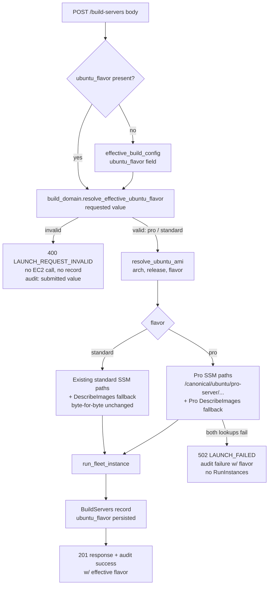

# Design Document

## Overview

This feature adds an explicit Ubuntu flavor selection — `pro` (Ubuntu Pro, extended security maintenance) or `standard` (regular Ubuntu server) — to both provisioning paths for Dedicated_Build_Servers:

1. **Portal launch path**: `POST /build-servers` in `edge-cv-portal/backend/functions/build_fleet.py` (the Fleet_Manager), which today resolves only standard Canonical AMIs via `resolve_ubuntu_ami()`.
2. **CLI launcher**: `edge-cv-portal/launch-arm64-build-server.sh`, which today tries Ubuntu Pro AMIs first and *silently* falls back to standard Ubuntu — behavior this design replaces with an explicit `--flavor` option that fails closed.

The design follows the codebase's established pure-decision-logic convention: flavor validation and defaulting live in `build_domain.py` (pure, no AWS clients); `build_fleet.py` does I/O and wiring only. The organization-wide default flavor becomes a new field in the authoritative `build_domain.DEFAULT_BUILD_CONFIG` table, which automatically makes it an operator-settable, audited `build_config.py` parameter (the `default_repository` precedent) with no `build_config.py` change.

**Key research findings** (verified against Canonical's published documentation, [Ubuntu on AWS — find Ubuntu images](https://documentation.ubuntu.com/aws/en/latest/aws-how-to/instances/find-ubuntu-images/) and [launch an Ubuntu instance](https://documentation.ubuntu.com/aws/aws-how-to/instances/launch-ubuntu-desktop/)):

- Ubuntu Pro AMI ids publish under the SSM public parameter tree `/aws/service/canonical/ubuntu/pro-server/{release}/stable/current/{arch}/hvm/ebs-{gp2|gp3}/ami-id` — the same tree shape as the standard `/aws/service/canonical/ubuntu/server/...` paths used today, with `pro-server` in place of `server`. Canonical's documented example for 24.04 Pro arm64 is `/aws/service/canonical/ubuntu/pro-server/24.04/stable/current/arm64/hvm/ebs-gp3/ami-id`. The volume-type path segment mirrors the standard tree per release (`ebs-gp2` for jammy/22.04, `ebs-gp3` for noble/24.04); implementation MUST verify the exact 22.04 pro-server paths against the live parameter tree (`aws ssm get-parameters-by-path --path /aws/service/canonical/ubuntu/pro-server/22.04 --recursive`) before freezing the constants — the DescribeImages fallback covers any drift either way.
- Ubuntu Pro AMI name patterns are `ubuntu-pro-server/images/{hvm-ssd|hvm-ssd-gp3}/ubuntu-{codename}-{release}-{arch}-pro-server-*` under Canonical owner id `099720109477` — exactly the pattern the CLI launcher already encodes for its Pro-first attempt today.
- The existing CDK grant `grantAmiParameterRead` in `build-fleet-stack.ts` grants `ssm:GetParameter` on `arn:aws:ssm:{region}::parameter/aws/service/canonical/*`, which **already covers** the `pro-server` subtree — no IAM change is required (Requirement 7.1). `grantEc2Describe` already grants `ec2:DescribeImages` (Requirement 7.5). Only comments in the stack are updated.
- The Security_Preservation_Gate pins the CLI launcher's embedded `DDABuildPolicy` heredoc (`iam_baseline_heredoc_launch-arm64-build-server_DDABuildPolicy.json`, tests I13/I14 in `test_preservation_iam_shell_installers.py`). This design changes only the launcher's argument parsing, AMI-resolution block, and output — **not** the IAM policy heredoc — so no baseline update is expected. If the heredoc were nonetheless touched, the baseline must be regenerated in the same commit (Requirement 7.3), and gate test logic is never weakened (Requirement 7.6).

Default-preserving behavior: a portal launch request that carries no `ubuntu_flavor` and has no configured default provisions standard Ubuntu with the exact SSM parameter paths and DescribeImages name filters used today, byte-for-byte (Requirements 1.3, 2.4).

## Architecture

### Flavor flow (portal path)



### Component responsibilities

| Component | Change |
|---|---|
| `build_domain.py` (pure) | New flavor constants, `resolve_effective_ubuntu_flavor()`, `ubuntu_flavor` entry in `DEFAULT_BUILD_CONFIG`, flavor rule in `validate_build_config()`, read-side flavor defaulting helper |
| `build_fleet.py` (I/O) | Flavor-keyed AMI lookup tables, `resolve_ubuntu_ami(arch, ubuntu_version, flavor)`, launch-handler wiring, flavor on record / list / audit |
| `build_config.py` | **No change** — `KNOWN_PARAMETERS = tuple(build_domain.DEFAULT_BUILD_CONFIG)` picks up `ubuntu_flavor` automatically |
| `build-fleet-stack.ts` | Comment-only update on `grantAmiParameterRead` documenting Pro path coverage |
| `launch-arm64-build-server.sh` | New `--flavor` option; deterministic single-flavor AMI resolution replacing Pro-first-with-silent-fallback; flavor in the config summary |
| `FleetPage.tsx` / `api.ts` | Flavor radio in the launch modal (preselected from build config), `ubuntu_flavor` in the launch body, flavor column in the fleet table |
| `BuildInfrastructureSettings.tsx` | Default-flavor RadioGroup field on the Build_Settings_Page; `ubuntu_flavor` in every `PUT /build-config` payload; per-field error surfacing via the existing `mapConfigErrors` machinery |

## Components and Interfaces

### 1. build_domain.py — pure flavor logic

```python
# Ubuntu flavor identifiers (Requirement glossary: Ubuntu_Flavor).
UBUNTU_FLAVOR_PRO = 'pro'
UBUNTU_FLAVOR_STANDARD = 'standard'
UBUNTU_FLAVORS = (UBUNTU_FLAVOR_PRO, UBUNTU_FLAVOR_STANDARD)

# Validation rule identifiers (portal convention: every rejection names
# its rule).
RULE_UBUNTU_FLAVOR_INVALID = 'ubuntu_flavor_invalid'
RULE_CONFIG_UBUNTU_FLAVOR_INVALID = 'config_ubuntu_flavor_invalid'
RULE_CONFIG_DEFAULT_FLAVOR_INVALID = 'config_default_flavor_invalid'
```

**`DEFAULT_BUILD_CONFIG` gains one entry:**

```python
DEFAULT_BUILD_CONFIG: Dict[str, Any] = {
    ...existing fields unchanged...,
    # Organization-wide default Ubuntu flavor applied when a launch
    # request omits ubuntu_flavor (ubuntu-pro-build-servers Req 6.1,
    # 6.4). 'standard' preserves existing behavior; PortalAdmins set
    # 'pro' to mandate Ubuntu Pro fleet-wide. Present in this table so
    # build_config.KNOWN_PARAMETERS makes it an operator-settable,
    # audited parameter with no build_config.py change (the
    # default_repository precedent).
    'ubuntu_flavor': UBUNTU_FLAVOR_STANDARD,
}
```

Because `effective_build_config()` (both the pure `build_domain` version and the `build_fleet.py` reader) merges stored non-None values over this table, "no default stored" is indistinguishable from "standard stored" — exactly the Requirement 6.4 semantics. An *invalid* stored value passes through the merge unvalidated (the merge is shape-agnostic), which is what lets Requirement 6.6 reject it at launch time rather than silently defaulting.

**New pure resolver:**

```python
def resolve_effective_ubuntu_flavor(
        requested: Any,
        configured_default: Any) -> Tuple[Optional[str], List[Dict]]:
    """Effective Ubuntu_Flavor for a launch request (pure).

    requested is the raw ubuntu_flavor body value (None when absent);
    configured_default is the effective config's ubuntu_flavor value.

    - requested == 'pro' or 'standard' (exact, case-sensitive):
      that value, no errors (Req 1.1, 1.2, 6.3).
    - requested is any other non-None value (empty string, wrong case,
      non-string): ([], [error]) with rule ubuntu_flavor_invalid naming
      'pro' and 'standard' (Req 1.4).
    - requested is None and configured_default in UBUNTU_FLAVORS:
      the configured default (Req 6.1, 6.4).
    - requested is None and configured_default is anything else:
      (None, [error]) with rule config_default_flavor_invalid
      identifying the invalid stored default (Req 6.6).
    Returns (flavor_or_None, errors); errors non-empty iff flavor None.
    """
```

**`validate_build_config()` gains one rule:** a supplied `ubuntu_flavor` update value must be exactly `pro` or `standard`; anything else appends a `config_ubuntu_flavor_invalid` error naming the supported values. The existing `apply_config_update()` atomic-reject machinery then discards the whole update and retains the stored configuration unchanged (Requirement 6.5) with no further change.

**Read-side defaulting helper (Requirement 3.3):**

```python
def server_ubuntu_flavor(server: Optional[Dict[str, Any]]) -> str:
    """The Ubuntu_Flavor to report for a BuildServers record: the stored
    ubuntu_flavor when it is a member of UBUNTU_FLAVORS, else 'standard'
    (servers launched before this feature carry no field). Pure — never
    writes back (Req 3.3)."""
```

### 2. build_fleet.py — flavor-keyed AMI resolution

The existing standard lookup tables are **not edited** (Requirement 2.4 demands byte-for-byte preservation). New parallel Pro tables are added, and the release-level dispatch tables become flavor-keyed:

```python
#: Ubuntu Pro SSM public parameter paths (Canonical pro-server tree;
#: same shape as the standard tree with server -> pro-server). Volume
#: segment mirrors the standard tree per release: ebs-gp2 for jammy,
#: ebs-gp3 for noble (verified against the published canonical
#: pro-server parameter tree).
UBUNTU_PRO_2204_SSM_PARAMETER = {
    build_domain.ARCH_ARM64:
        '/aws/service/canonical/ubuntu/pro-server/22.04/stable/current/'
        'arm64/hvm/ebs-gp2/ami-id',
    build_domain.ARCH_X86_64:
        '/aws/service/canonical/ubuntu/pro-server/22.04/stable/current/'
        'amd64/hvm/ebs-gp2/ami-id',
}
UBUNTU_PRO_2404_SSM_PARAMETER = {
    build_domain.ARCH_ARM64:
        '/aws/service/canonical/ubuntu/pro-server/24.04/stable/current/'
        'arm64/hvm/ebs-gp3/ami-id',
}

#: Ubuntu Pro DescribeImages name filters (Canonical owner id
#: 099720109477; ubuntu-pro-server images publish under the same
#: hvm-ssd / hvm-ssd-gp3 segment split as the standard images).
UBUNTU_PRO_2204_NAME_FILTER = {
    build_domain.ARCH_ARM64:
        'ubuntu-pro-server/images/hvm-ssd/'
        'ubuntu-jammy-22.04-arm64-pro-server-*',
    build_domain.ARCH_X86_64:
        'ubuntu-pro-server/images/hvm-ssd/'
        'ubuntu-jammy-22.04-amd64-pro-server-*',
}
UBUNTU_PRO_2404_NAME_FILTER = {
    build_domain.ARCH_ARM64:
        'ubuntu-pro-server/images/hvm-ssd-gp3/'
        'ubuntu-noble-24.04-arm64-pro-server-*',
}

#: Flavor-keyed dispatch: the standard branch references the EXISTING
#: constants unchanged (Req 2.4), the pro branch the new tables. The
#: two flavors carry identical (release, arch) key sets (Req 2.5).
UBUNTU_SSM_PARAMETER_BY_FLAVOR = {
    build_domain.UBUNTU_FLAVOR_STANDARD: UBUNTU_SSM_PARAMETER,
    build_domain.UBUNTU_FLAVOR_PRO: {
        '22.04': UBUNTU_PRO_2204_SSM_PARAMETER,
        '24.04': UBUNTU_PRO_2404_SSM_PARAMETER,
    },
}
UBUNTU_NAME_FILTER_BY_FLAVOR = {
    build_domain.UBUNTU_FLAVOR_STANDARD: UBUNTU_NAME_FILTER,
    build_domain.UBUNTU_FLAVOR_PRO: {
        '22.04': UBUNTU_PRO_2204_NAME_FILTER,
        '24.04': UBUNTU_PRO_2404_NAME_FILTER,
    },
}
```

**`resolve_ubuntu_ami` gains a flavor parameter** with a standard default so every existing caller (including `build_dispatcher.py`'s ephemeral-runner path, which is out of scope and stays standard) is behavior-preserved:

```python
def resolve_ubuntu_ami(
        arch: str,
        ubuntu_version: str = DEFAULT_UBUNTU_VERSION,
        ubuntu_flavor: str = build_domain.UBUNTU_FLAVOR_STANDARD) -> str:
```

Resolution logic is unchanged in shape — SSM `get_parameter` primary; on `ClientError` or an empty value, the DescribeImages fallback (Canonical owner, flavor's name filter, `state=available`, newest `CreationDate` wins); `RuntimeError` naming flavor, release, and architecture when the tables have no mapping or the fallback matches zero images (Requirements 2.1, 2.2, 2.3, 2.6). A non-empty SSM value returns immediately without any DescribeImages call (Requirement 2.6).

**`launch_build_server` wiring:**

1. Read `body.get('ubuntu_flavor')` alongside the existing `name` / `architecture` / `ubuntu_version` fields.
2. Existing name / architecture / release / release-arch validation is unchanged; that block already enforces the supported combinations (22.04 on arm64 + x86_64, 24.04 on arm64), which are identical for both flavors (Requirement 1.5).
3. Call `build_domain.resolve_effective_ubuntu_flavor(body.get('ubuntu_flavor'), config['ubuntu_flavor'])`. Errors join `validation_errors` and produce the existing `400 LAUNCH_REQUEST_INVALID` envelope — before any EC2 call and before any BuildServers write (Requirements 1.4, 1.6, 6.6).
4. A 400 rejection audits a `fleet_server_launch` failure entry carrying `ubuntu_flavor` **exactly as submitted in the request** (the raw body value, which may be None or garbage) since no effective flavor was determined (Requirement 3.5). Note: today the handler returns 400 without an audit entry; this design adds the failure audit call to the validation-rejection branch to satisfy Requirement 3.5.
5. `resolve_ubuntu_ami(arch, ubuntu_version, effective_flavor)` — resolution or RunInstances failure keeps the existing `502 LAUNCH_FAILED` path, with `ubuntu_flavor: effective_flavor` added to the audit details (Requirements 2.3, 3.4).
6. The server record gains `'ubuntu_flavor': effective_flavor` (persisted before the 201 response returns — the existing `put_item` already precedes `create_response`; Requirement 3.1).
7. The success audit details gain `'ubuntu_flavor': effective_flavor` (Requirement 3.4).

**Fleet list and single-server responses (Requirements 3.2, 3.3):** every point that serializes a server into a response applies read-side defaulting without writing back:

```python
def present_server(server: Dict[str, Any]) -> Dict[str, Any]:
    """Response shape of a BuildServers record: the record with
    ubuntu_flavor filled in via build_domain.server_ubuntu_flavor
    (legacy records report 'standard'; the stored item is never
    modified, Req 3.3)."""
    return {**server,
            'ubuntu_flavor': build_domain.server_ubuntu_flavor(server)}
```

Applied in `list_build_servers` (each listed server, regardless of lifecycle state) and in `execute_fleet_action`'s 200 response. The launch response carries the freshly persisted flavor already.

### 3. build_config.py and GET /build-config

No code change. `ubuntu_flavor` enters `KNOWN_PARAMETERS` via `DEFAULT_BUILD_CONFIG`; `GET /build-config` returns the effective value (`standard` when never configured); `PUT /build-config` validates it through the new `build_domain` rule with the existing atomic reject and per-change audit.

### 4. build-fleet-stack.ts

No functional change. The `grantAmiParameterRead` resource ARN `parameter/aws/service/canonical/*` is a prefix of every Pro parameter path (`/aws/service/canonical/ubuntu/pro-server/...`), and `grantEc2Describe` already carries `ec2:DescribeImages` (Requirements 7.1, 7.2, 7.5). The `grantAmiParameterRead` doc comment is updated to state it covers both the `ubuntu/server` and `ubuntu/pro-server` subtrees. A unit test pins this coverage (see Testing Strategy) so a future narrowing of the grant fails a test rather than production resolution.

### 5. launch-arm64-build-server.sh — explicit --flavor, fail closed

**Option surface:**

```
--flavor FLAVOR          Ubuntu flavor: pro (Ubuntu Pro) or standard
                         (default: standard)
```

- `UBUNTU_FLAVOR="standard"` default; `--flavor` sets it (Requirements 5.1, 5.3).
- **Validation immediately after argument parsing, before the IAM setup section** (which makes AWS calls): any value other than exactly `pro` or `standard` prints an error naming the two supported values and exits nonzero — before any AWS API call (Requirement 5.5).
- The AMI resolution block is rewritten to a **single flavor-selected query** replacing today's Pro-first-try / silent-standard-fallback:

```bash
if [ -z "$AMI_ID" ]; then
    case "$UBUNTU_VERSION" in ... esac   # codename/ssd-path map unchanged

    if [ "$UBUNTU_FLAVOR" = "pro" ]; then
        NAME_FILTER="ubuntu-pro-server/images/${UBUNTU_SSD_PATH}/ubuntu-${UBUNTU_CODENAME}-${UBUNTU_VERSION}-arm64-pro-server-*"
    else
        NAME_FILTER="ubuntu/images/${UBUNTU_SSD_PATH}/ubuntu-${UBUNTU_CODENAME}-${UBUNTU_VERSION}-arm64-server-*"
    fi
    echo "Finding latest Ubuntu ${UBUNTU_FLAVOR} ${UBUNTU_VERSION} ARM64 AMI..."
    AMI_ID=$(aws ec2 describe-images ... --filters "Name=name,Values=${NAME_FILTER}" ...)

    if [ -z "$AMI_ID" ] || [ "$AMI_ID" == "None" ]; then
        echo "Error: Could not find an Ubuntu ${UBUNTU_FLAVOR} ${UBUNTU_VERSION} ARM64 AMI"
        echo "Specify --ami-id manually, or check the flavor/release combination"
        exit 1
    fi
fi
```

  There is exactly one DescribeImages query per invocation; a failed Pro lookup never queries standard and vice versa (Requirements 5.2, 5.3, 5.4). The `${UBUNTU_SSD_PATH}` split (hvm-ssd for 18.04/20.04/22.04, hvm-ssd-gp3 for 24.04) already covers Pro for every supported release (Requirement 5.8).
- `--ami-id` continues to skip the resolution block entirely (Requirement 5.7).
- The configuration summary gains `Ubuntu Flavor: ${UBUNTU_FLAVOR}` alongside the existing `AMI ID:` line; the summary prints before the dry-run exit, so dry-run invocations show both (Requirement 5.6).
- The `DDABuildPolicy` heredoc is untouched, so the Security_Preservation_Gate baseline stays valid. Implementation MUST run the preservation suite before commit; if any tracked content unexpectedly shifts, rebaseline in the same commit per the gate's README — never weaken the gate tests (Requirements 7.3, 7.4, 7.6).

### 6. Frontend — FleetPage.tsx and api.ts

**api.ts:**

```typescript
/** Ubuntu flavor of a Dedicated_Build_Server (ubuntu-pro-build-servers). */
export type BuildServerUbuntuFlavor = 'pro' | 'standard';

export interface BuildServer {
  ...
  /** Effective Ubuntu flavor; the backend reports 'standard' for
   *  servers launched before flavor selection existed. */
  ubuntu_flavor?: BuildServerUbuntuFlavor;
}

async launchBuildServer(body: {
  name: string;
  architecture: BuildServerArchitecture;
  ubuntu_version?: BuildServerUbuntuVersion;
  ubuntu_flavor?: BuildServerUbuntuFlavor;
}): Promise<{ server: BuildServer }>
```

`BuildInfrastructureConfig` gains `ubuntu_flavor?: BuildServerUbuntuFlavor`.

**LaunchServerModal:**

- New state `ubuntuFlavor: BuildServerUbuntuFlavor`, initialized to `'standard'`.
- On modal mount, `apiService.getBuildConfig()` is called; when it resolves with `config.ubuntu_flavor === 'pro'` the selection flips to `pro`. Any retrieval failure or invalid value leaves `standard` selected (Requirements 4.2, 4.6, 6.2, 6.7). The config fetch never blocks the modal.
- A RadioGroup labeled "Ubuntu flavor" offering exactly two items — `standard` ("Regular Ubuntu server") and `pro` ("Ubuntu Pro — extended security maintenance") — with one always selected (RadioGroup with a non-null initial value guarantees this; Requirement 4.1).
- `submit()` adds `ubuntu_flavor: ubuntuFlavor` to the existing launch body (Requirement 4.3).
- The existing error path (`serverError` rendered in the modal, all field state retained) already satisfies Requirement 4.5; the flavor selection is ordinary retained state.

**Fleet table:** a new "Ubuntu flavor" column rendering `item.ubuntu_flavor` (the backend fills `standard` for legacy records, so the cell always has the response value; Requirement 4.4). Displayed as "Pro" / "Standard".

### 7. BuildInfrastructureSettings.tsx — default flavor administration

Requirement 8 makes the org-wide default flavor administrable from the Build Infrastructure settings page (the Build_Settings_Page over `GET`/`PUT /build-config`). The backend needs **no change**: `ubuntu_flavor` is already an operator-settable, validated, audited parameter via `build_config.KNOWN_PARAMETERS` (sections 1 and 3), and `api.ts` already declares `ubuntu_flavor?: BuildServerUbuntuFlavor` on `BuildInfrastructureConfig`. The change is confined to `BuildInfrastructureSettings.tsx` and slots into its existing form machinery:

- **Form state**: `BuildConfigFormState` gains `ubuntu_flavor: 'pro' | 'standard'` (a typed two-value field, unlike the page's free-text strings — never null/empty, so exactly one value is always selected; Req 8.2, 8.3). `EMPTY_FORM` sets it to `'standard'`, which also covers the load-failure path: a failed `GET /build-config` leaves the form at `EMPTY_FORM` with the existing load-error alert, showing `standard` selected (Req 8.6).
- **Load**: `toFormState()` maps `config.ubuntu_flavor` to the form, coercing an absent or invalid stored value to `'standard'` — the effective value `GET /build-config` returns when unconfigured is displayed as-is (Req 8.1).
- **Field**: a Cloudscape `RadioGroup` inside a `FormField` labeled "Default Ubuntu flavor", with constraint text describing the compliance purpose (the default applied when a launch omits the flavor) and `errorText={fieldErrors.ubuntu_flavor}` — the page's standard label/constraint/error convention (Req 8.2). Items: `standard` ("Standard Ubuntu") and `pro` ("Ubuntu Pro — extended security maintenance").
- **Save**: `handleSave()` adds `ubuntu_flavor: form.ubuntu_flavor` to the update object alongside the existing scalar parameters — deliberately **not** through `textValue()`, since the value is never blank and must never be sent as null (Req 8.3). It is present on every save regardless of whether the selection changed.
- **Errors**: `mapConfigErrors()` keys per-parameter CONFIG_INVALID errors on `parameter in EMPTY_FORM` — adding the key to `EMPTY_FORM` routes `ubuntu_flavor` errors onto the field automatically, with the existing atomic-reject alert and full form-state retention (Req 8.4, 8.7). No `mapConfigErrors` change.
- **Refresh after save**: the existing `applyConfig(response.config)` call re-derives the form from the `PUT` response, so the selection reflects the stored value after a successful save (Req 8.5).

## Data Models

### BuildServers record (DynamoDB, additive)

```
{
  server_id, name, instance_id, instance_type, cpu_architecture,
  ubuntu_version,               -- existing
  ubuntu_flavor: 'pro' | 'standard',   -- NEW: effective flavor at launch;
                                       -- absent on servers launched before
                                       -- this feature (read as 'standard',
                                       -- never written back)
  repo_dir, lifecycle_state, pending_action, created_by, created_at, ...
}
```

### build_infrastructure_config (PortalSettings, additive)

```
{
  ...existing parameters...,
  ubuntu_flavor: 'pro' | 'standard'    -- NEW: org-wide default applied when
                                       -- a launch omits ubuntu_flavor;
                                       -- documented default: 'standard'
}
```

### POST /build-servers request body (additive)

```
{ name, architecture, ubuntu_version?, ubuntu_flavor?: 'pro' | 'standard' }
```

### Audit_Log details (fleet_server_launch entries, additive)

- Success and post-determination failure entries: `ubuntu_flavor: <effective>` (Requirement 3.4).
- Validation-rejection entries (new audit call): `ubuntu_flavor: <raw submitted value>` (Requirement 3.5).

## Correctness Properties

*A property is a characteristic or behavior that should hold true across all valid executions of a system — essentially, a formal statement about what the system should do. Properties serve as the bridge between human-readable specifications and machine-verifiable correctness guarantees.*

### Property 1: Flavor selects the matching AMI lookup

*For any* valid launch request (flavor ∈ {`pro`, `standard`}, release/architecture in the supported set), the AMI_Resolver reads exactly the requested flavor's SSM parameter path for that release and architecture, and the launched instance uses the AMI id that lookup resolved.

**Validates: Requirements 1.1, 1.2, 2.1**

### Property 2: Flavorless launches preserve pre-feature standard resolution

*For any* valid launch request that omits `ubuntu_flavor`, when no default flavor is stored in Build_Config, resolution reads a standard SSM parameter path byte-identical to the pre-feature path for that release and architecture (and the DescribeImages fallback, if reached, uses the byte-identical pre-feature name filter).

**Validates: Requirements 1.3, 2.4, 6.4**

### Property 3: Invalid launch requests are rejected with no side effects

*For any* launch request carrying an `ubuntu_flavor` value that is not exactly `pro` or `standard` (including empty, differently cased, and non-string values), or a flavor/release/architecture combination outside the supported set, the Fleet_Manager returns a 400 validation error that names the supported values (or identifies the unsupported combination), makes no EC2 API call, and writes no BuildServers record.

**Validates: Requirements 1.4, 1.5, 1.6**

### Property 4: A successful Pro SSM read short-circuits

*For any* supported release/architecture combination and any non-empty AMI id returned by the Ubuntu Pro SSM parameter read, the AMI_Resolver resolves to exactly that id and issues zero DescribeImages calls.

**Validates: Requirements 2.6**

### Property 5: The Pro fallback selects the newest available image

*For any* supported combination where the Pro SSM read fails or returns an empty value, and any non-empty set of candidate images with distinct creation timestamps, the AMI_Resolver queries DescribeImages with owner `099720109477`, the Pro name pattern for that combination, and `state=available`, and resolves to the image with the most recent creation timestamp.

**Validates: Requirements 2.2**

### Property 6: An unresolvable Pro AMI fails the launch closed

*For any* supported combination where both the Pro SSM read and the DescribeImages fallback fail (error or zero matches), the launch fails with an error identifying the requested flavor, release, and architecture, records an Audit_Log failure entry, and invokes zero EC2 RunInstances calls.

**Validates: Requirements 2.3**

### Property 7: The effective flavor round-trips through the record and the fleet list

*For any* successful launch, the BuildServers record persisted before the launch response carries the effective flavor (exactly `pro` or `standard`), and a subsequent fleet list reports for that server, in any lifecycle state, exactly the flavor stored on its record.

**Validates: Requirements 3.1, 3.2**

### Property 8: Legacy records read as standard without write-back

*For any* BuildServers record that carries no `ubuntu_flavor` field, every response including that server reports its flavor as `standard`, and the stored record afterwards still carries no `ubuntu_flavor` attribute.

**Validates: Requirements 3.3**

### Property 9: Audit entries carry the flavor faithfully

*For any* launch outcome: when the effective flavor was determined (success, or failure during resolution/RunInstances), the Audit_Log entry's details include exactly the effective flavor; when the request was rejected before determination, the entry includes the `ubuntu_flavor` value exactly as submitted in the request.

**Validates: Requirements 3.4, 3.5**

### Property 10: The configured default applies exactly as an explicit selection

*For any* configured default flavor d ∈ {`pro`, `standard`} and any valid launch request, the effective flavor equals the request's `ubuntu_flavor` when present, else d; and a request omitting the flavor produces the same AMI resolution path, recorded flavor, and audited flavor as the identical request explicitly carrying d.

**Validates: Requirements 6.1, 6.3, 6.4**

### Property 11: Config updates with an invalid flavor are rejected atomically

*For any* `ubuntu_flavor` update value that is not exactly `pro` or `standard`, and any prior stored configuration, `apply_config_update` rejects the update with a validation error naming the supported values and returns the stored configuration unchanged.

**Validates: Requirements 6.5**

### Property 12: An invalid stored default fails launches closed

*For any* stored Build_Config `ubuntu_flavor` value that is not exactly `pro` or `standard`, a launch request omitting `ubuntu_flavor` is rejected with a validation error identifying the invalid stored default, before any EC2 API call.

**Validates: Requirements 6.6**

### Property 13: The settings page round-trips the default flavor faithfully

*For any* configuration value returned by `GET /build-config` or a `PUT /build-config` response, the Build_Settings_Page displays the returned `ubuntu_flavor` when it is exactly `pro` or `standard` and `standard` otherwise (including load failure), with exactly one value always selected; every save payload carries `ubuntu_flavor` equal to exactly the current selection (never null or empty); and *for any* rejected save, a per-parameter error naming `ubuntu_flavor` lands on the flavor field while any other failure leaves the selection unchanged — with all entered form state retained in both cases.

**Validates: Requirements 8.1, 8.2, 8.3, 8.4, 8.5, 8.6, 8.7**

## Error Handling

| Failure | Behavior |
|---|---|
| Invalid `ubuntu_flavor` in the launch body | `400 LAUNCH_REQUEST_INVALID`, rule `ubuntu_flavor_invalid`, message names `pro` and `standard`; no EC2 call, no record; failure audit entry with the submitted value (Req 1.4, 1.6, 3.5) |
| Unsupported flavor/release/arch combination | `400 LAUNCH_REQUEST_INVALID` via the existing release/arch rules, identifying the combination (Req 1.5, 1.6) |
| Invalid stored default + flavorless request | `400 LAUNCH_REQUEST_INVALID`, rule `config_default_flavor_invalid`, identifying the stored value; no EC2 call (Req 6.6) |
| Pro SSM read error / empty value | Warning log; DescribeImages fallback with Pro filters (Req 2.2) |
| Pro SSM + fallback both fail | `RuntimeError` naming flavor/release/arch → existing `502 LAUNCH_FAILED` path; audit failure with effective flavor; no RunInstances (Req 2.3, 3.4) |
| `PUT /build-config` with invalid `ubuntu_flavor` | `400 CONFIG_INVALID`, rule `config_ubuntu_flavor_invalid`; atomic reject retains stored config (Req 6.5) |
| Frontend build-config fetch failure | Modal preselects `standard`; launch remains possible (Req 4.6, 6.7) |
| Frontend launch rejection | Error shown in the modal; all entered values incl. the flavor selection retained (Req 4.5) |
| CLI invalid `--flavor` | Nonzero exit naming `pro`/`standard`, before any AWS call (Req 5.5) |
| CLI AMI resolution failure | Nonzero exit naming the selected flavor and release; no other-flavor query, no launch (Req 5.4) |

Fail-closed direction throughout: no silent flavor substitution anywhere. The CLI's current silent Pro→standard fallback is removed; the portal never falls back across flavors.

## Testing Strategy

Property-based testing applies to this feature: the flavor resolution, defaulting, validation, and persistence logic are pure or mockable functions with meaningful input variation. Backend tests follow the established `test/backend-test/portal_builds/` conventions: pytest + **hypothesis**, moto-mocked DynamoDB/EC2/SSM, the fresh-module-import pattern, and patched `shared_utils` / `rbac_middleware`.

### Property-based tests (hypothesis)

- One hypothesis test per correctness property above (Properties 1–12), minimum **100 iterations** each (`@settings(max_examples=100)` or the suite default).
- Each test is tagged with a comment referencing its design property:
  `# Feature: ubuntu-pro-build-servers, Property {N}: {property title}`
- Pure-function properties (10, 11, 12's resolver clause) run against `build_domain` directly with no mocks; handler properties (1–3, 6–9) run against `build_fleet.launch_build_server` / `list_build_servers` with moto + patched clients; resolver properties (4, 5) run against `resolve_ubuntu_ami` with stubbed SSM/EC2.

### Example-based unit tests

- **Standard-table preservation (Req 2.4)**: the standard SSM parameter and name-filter constants equal frozen pre-feature literals.
- **Table parity (Req 2.5)**: the Pro tables' (release, arch) key sets equal the standard tables'.
- **IAM prefix coverage (Req 7.1)**: every SSM path in both flavor tables starts with `/aws/service/canonical/` (the `grantAmiParameterRead` ARN prefix).
- **Config plumbing**: `ubuntu_flavor` present in `build_config.KNOWN_PARAMETERS` via `DEFAULT_BUILD_CONFIG` (the `test_default_repository_config.py` one-parameter-table pattern); `GET /build-config` returns `standard` when unconfigured.

### CLI launcher tests (example-based)

A test module drives `launch-arm64-build-server.sh` with a PATH-shimmed `aws` executable that records every invocation and returns scripted output, asserting (Req 5.1–5.8):

- `--flavor pro` issues exactly one DescribeImages query with the `ubuntu-pro-server/...pro-server-*` pattern and none with the standard pattern; `--flavor standard` and no flavor do the mirror image.
- An unresolvable AMI exits nonzero naming the flavor and release with no cross-flavor query and no run-instances.
- An invalid flavor exits nonzero naming `pro`/`standard` with the `aws` shim never invoked.
- `--ami-id` skips resolution; `--dry-run` summaries contain the flavor and AMI id; the Pro name pattern is correct for each of 18.04/20.04/22.04/24.04 (incl. the `hvm-ssd-gp3` segment for 24.04).

### Frontend tests

`FleetPage.test.tsx` extensions (React Testing Library, mocked `apiService`) covering Requirements 4.1–4.6 and 6.2: the two-value radio with one always selected, preselection from `getBuildConfig` (`pro` default, absent default, fetch failure → `standard`), `ubuntu_flavor` in the submitted body, the flavor column rendering, and error-path state retention.

`BuildInfrastructureSettings.test.tsx` extensions (vitest + React Testing Library, mocked `apiService`, following the file's existing conventions) covering Requirements 8.1–8.7 / Property 13: the displayed selection reflects the loaded config value (`pro`, `standard`, absent → `standard`, invalid → `standard`, load failure → `standard` with the load-error notice); the flavor RadioGroup offers exactly the two labeled values with one always selected; every `updateBuildConfig` call body carries `ubuntu_flavor` as exactly the selected string (including a save with no changes — never null); a CONFIG_INVALID rejection naming `ubuntu_flavor` renders the message on the flavor field with all form state retained; a rejection naming other parameters or a plain request failure leaves the selection unchanged; and a successful save reflects the `PUT` response's stored value.

### Security preservation gate & integration

- Before commit: run the full `test/backend-test/security/preservation/` suite. Expected outcome: green with **no baseline change**, since the `DDABuildPolicy` heredoc is untouched. If any tracked content shifts, the matching baseline under `test/backend-test/security/baselines/` is updated in the same commit; gate test logic is never modified, weakened, skipped, or removed (Req 7.3, 7.4, 7.6).
- Post-deploy integration check (Req 7.2): one Pro resolution per supported combination in a deployed environment confirming no SSM/EC2 authorization error under the stack's existing grants.
- Implementation-time verification: confirm the exact 22.04 pro-server SSM paths against the live Canonical parameter tree (`aws ssm get-parameters-by-path --path /aws/service/canonical/ubuntu/pro-server/22.04 --recursive`) before freezing the constants.
