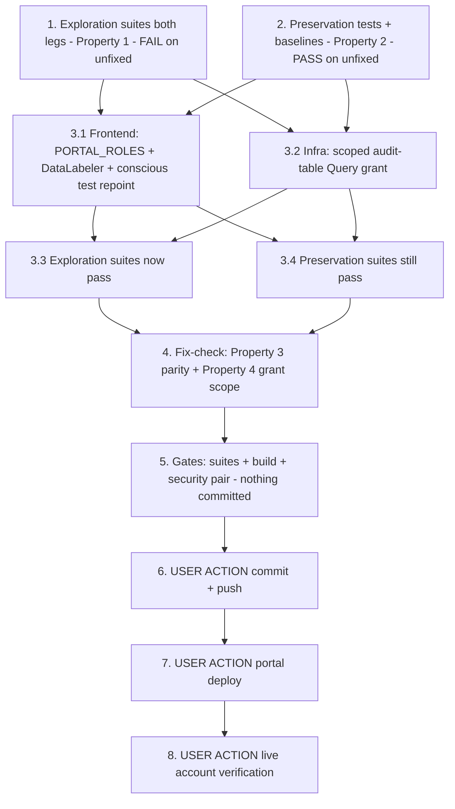

# Implementation Plan

## Overview

Close the two verified gaps that leave dda-data-labeling unusable
end-to-end and break the deployed user-admin API contract (bugfix.md
Incident Record, 2026-08-17, account 164152369890):

1. **Defect 1 — frontend role vocabulary** (design Decision 1 + 2): append
   `'DataLabeler'` to `PORTAL_ROLES` in
   `edge-cv-portal/frontend/src/pages/admin/UserManagerModals.tsx` (one
   string — both the create-user and change-role dropdowns map the same
   array) and consciously repoint the ONE pinned test that asserts
   "exactly the five defined roles" (five → six; dda-data-labeling Req
   2.1 supersedes the portal-user-manager 5.2 count).
2. **Defect 2 — missing IAM grant** (design Decisions 3 + 4): add
   `props.auditLogTable.grant(userAdminHandler, 'dynamodb:Query')` in
   `edge-cv-portal/infrastructure/lib/compute-stack.ts` next to the
   existing userAdminHandler grants — exactly the action
   `finalize_audit_event`'s range-key recovery Query needs
   (verified live AccessDeniedException on `UserAdminRole2557D264`,
   request id 79dc2dd8-2e10-486a-a0e6-aec5ef805d37). No backend code
   change; auditing is never weakened.

**Honesty guard (design Decision 5).** Host tests prove the modal option
lists (vitest), the finalize path's Query + terminal-result behavior
(moto — moto does NOT enforce IAM, so the live AccessDenied is NOT
reproducible host-side), and the synthesized template's grant (jest CDK
static assertions, the synthetic-data-s3-permissions precedent). The real
deployed-IAM claims — a UI-created DataLabeler account, a 200 response, a
terminal audit entry in account 164152369890, a labeling team gaining a
member — belong exclusively to the USER ACTION verification task (task 8).
Do not write a test that pretends to exercise the real account.

**Non-goal guards.** Explicitly NOT changed (design "Explicitly NOT
changed"): `user_admin.py`, `shared_utils.py` (finalize keeps its Query
call site and raise-on-failure contract), `createLambdaRole`'s base
grants, quick-setup/audit-logs grants, `LabelingTeams.tsx`,
`types/index.ts`, Layout/RBAC/redirect components, any `src/` device-side
file, any recipe, any Dockerfile. **No preservation-tracked file is
touched → no security-baseline rebaselines** (task 5 verifies the claim).
**No component build** — portal-only, shipped by a portal deploy. Exactly
ONE conscious pinned-test repoint in this whole spec (design Decision 2):
`UserManagerModals.test.tsx` 'offers exactly the five defined roles with
the current role preselected (Requirement 5.2)' — repointed in task 3.1
with the old name/assertion recorded first in task 2; never weakened or
deleted; every other test in that file must keep passing unmodified.
**Do not commit anything in this dispatch** (task 6 is the USER-ACTION
commit+push).

Test commands:
- Frontend vitest single runs from `edge-cv-portal/frontend`:
  `PATH="$HOME/.local/node/bin:$PATH" npx vitest run <file>`
- Infrastructure jest from `edge-cv-portal/infrastructure`:
  `PATH="$HOME/.local/node/bin:$PATH" npx jest test/user-admin-audit-grant.test.ts`
  (CDK synth in-process is slow — use the repo's generous test timeouts,
  camera-registry-infra precedent)
- Portal backend suites from `edge-cv-portal/backend` WITH conftest (moto
  `aws_stack`; Hypothesis profiles are conftest-registered — do NOT
  hardcode `max_examples`; do NOT pass `--noconftest`) in the portal venv:
  `source /home/ubuntu/.venvs/dda-portal-tests/bin/activate` then
  `python3 -m pytest tests/<file> -q -p no:cacheprovider`
- The security guard pair runs host-side (expected untouched-green — this
  spec edits no preservation-tracked file):
  `python3 -m pytest test/backend-test/security/preservation/test_preservation_out_of_scope_guard.py test/backend-test/security/preservation/test_preservation_secrets_out_of_scope_guard.py -p no:cacheprovider --noconftest -q`

New files this plan creates:
- `edge-cv-portal/frontend/src/pages/admin/UserManagerModals.dataLabelerRole.test.tsx`
- `edge-cv-portal/infrastructure/test/user-admin-audit-grant.test.ts`
- `edge-cv-portal/backend/tests/test_user_admin_audit_finalize_preservation.py`

## Notes

- Source-tree changes (design Fix Implementation Files 1-3):
  `UserManagerModals.tsx` (one string appended to `PORTAL_ROLES` + doc
  comment), the CONSCIOUS repoint in `UserManagerModals.test.tsx` (same
  task as the frontend edit), and `compute-stack.ts` (one grant line +
  comment). Nothing else.
- Defect-1 fix mechanics (design Decision 1): `'DataLabeler'` appended
  LAST — preserves the five's existing order (3.1) and matches the
  backend tuple `('PortalAdmin','UseCaseAdmin','DataScientist','Operator',
  'Viewer','DataLabeler')`. Grep-verified: the modals' array is the ONLY
  stale frontend enumeration of the assignable vocabulary —
  `types/index.ts` `UserRole`, Layout, DataLabelerRedirect, Login
  landing, RequireRole gates, and listAdminUsers rendering are already
  DataLabeler-aware; do not touch them.
- Defect-2 fix mechanics (design Decisions 3-4): `table.grant(handler,
  'dynamodb:Query')` — narrower than `grantReadData` (no Scan/GetItem);
  scoped to userAdminHandler, NOT `createLambdaRole` (user_admin.py is
  the only base-role consumer calling `finalize_audit_event`;
  quick_setup.py has its own role with `grantReadWriteData` and already
  works). Do NOT switch finalize to a key-addressed Get/Update — the
  event_id-only handle is the protocol's intent and parsing the timestamp
  from `{user_id}_{timestamp}_{hex}` is fragile (user_id may contain
  underscores).
- The existing backend suites (`test_user_admin_*.py`,
  `test_dda_labeling_rbac_role.py`) and frontend suites
  (`UserManager.test.tsx`, `UserManagerSyncPanel.test.tsx`) carry no
  five-role dropdown pins besides the ONE repoint target — they must stay
  green UNMODIFIED. (`test_user_admin_change_role.py`'s local five-tuple
  parametrizes accepted-role cases — a subset of six, still green.)
- builds.md is binding for the rollout: **never a portal deploy while a
  component build runs** — task 7 checks `pgrep -af "gdk component
  build"` / `pgrep -af "build-custom.sh"` are both empty first, and moves
  the freshly regenerated `cdk.out` aside afterwards (drift-guard
  discipline). Bundle with any other pending spec's portal deploy if one
  is queued — one deploy serves all.
- Tasks 6-8 are USER ACTIONs (commit+push, portal deploy, live account
  verification); the agent prepares and verifies everything else
  host-side. Task 8 also checks the stuck-'pending' audit entry from the
  2026-08-17 remediation create and finalizes/annotates it as the user
  decides.
- Branch context: `spec/jetpack7-support` (= integration/all-specs tip);
  nothing is committed by tasks 1-5.

## Task Dependency Graph

```json
{
  "waves": [
    { "wave": 1, "description": "Exploration + preservation on the UNFIXED tree: exploration surfaces the five-option dropdowns and the missing Query grant (cases 1-3 FAIL expected); preservation records the pinned five-roles test verbatim (the Decision 2 repoint target), baselines the modal/backend suites green with recorded counts, pins the UserAdmin role's existing statements, and encodes the moto finalize-path invariant (PASS required).", "tasks": ["1", "2"] },
    { "wave": 2, "description": "The fix, per design Fix Implementation Files 1-3: PORTAL_ROLES + 'DataLabeler' with the ONE conscious pinned-test repoint; the scoped audit-table Query grant in compute-stack.ts.", "tasks": ["3.1", "3.2"] },
    { "wave": 3, "description": "Verify the flips: the exploration suites (both legs) now pass on the fixed tree; the preservation suites still pass (only intended diff = the recorded repoint).", "tasks": ["3.3", "3.4"] },
    { "wave": 4, "description": "Fix-checking per design Testing Strategy: role-vocabulary parity incl. DataLabeler submission shape (Property 3) + scoped-grant assertions with other-grant identity (Property 4).", "tasks": ["4"] },
    { "wave": 5, "description": "Gates: frontend vitest (touched + admin suites) + npm run build; infra jest suites; backend user-admin suites at baseline counts; security guard pair + verify the no-rebaseline claim; checkpoint with git scope check (NOTHING committed).", "tasks": ["5"] },
    { "wave": 6, "description": "USER ACTION: commit + push (branch spec/jetpack7-support).", "tasks": ["6"] },
    { "wave": 7, "description": "USER ACTION: portal deploy (infrastructure + frontend) — strictly never while a component build runs (builds.md); move the regenerated cdk.out aside afterwards.", "tasks": ["7"] },
    { "wave": 8, "description": "USER ACTION: live verification in account 164152369890 — UI-create a DataLabeler account (200, terminal audit entry), convert-role path, LabelingTeams add-member gains a candidate; check/remediate the stuck-pending 2026-08-17 audit entry.", "tasks": ["8"] }
  ]
}
```



## Tasks

- [x] 1. Write bug condition exploration tests (frontend + infrastructure legs)
  - **Property 1: Bug Condition** - DataLabeler Offered and Audit Finalize Permitted
  - **CRITICAL**: All three cases MUST FAIL on unfixed code - failure confirms the bug condition exists
  - **DO NOT attempt to fix the tests or the code when they fail**
  - **NOTE**: These tests encode the expected behavior - they validate the fix when they pass after implementation (task 3.3)
  - **GOAL**: Surface counterexamples for defects 1.1, 1.2, 1.4 on the UNFIXED tree (honesty guard: option-list and synthesized-template assertions ONLY; no real account)
  - **Scoped PBT Approach**: both defects are deterministic — scope the properties to the concrete vocabulary/grant assertions
  - Case 1 (frontend leg) - **Create-user dropdown offers DataLabeler (defect 1.1)**: create `edge-cv-portal/frontend/src/pages/admin/UserManagerModals.dataLabelerRole.test.tsx` per the existing `UserManagerModals.test.tsx` conventions (Cloudscape `createWrapper` test-utils, hoisted apiService mock); open the CreateUserModal role select and assert the option list equals the SIX-role vocabulary `['PortalAdmin','UseCaseAdmin','DataScientist','Operator','Viewer','DataLabeler']`. FAILS on unfixed code (five options)
  - Case 2 (frontend leg) - **Change-role dropdown offers DataLabeler (defect 1.2)**: same assertion on the RoleModal select (current role preselected). FAILS on unfixed code
  - Case 3 (infrastructure leg) - **UserAdmin role may Query the audit table (defect 1.4)**: create `edge-cv-portal/infrastructure/test/user-admin-audit-grant.test.ts` per the `synthetic-data-s3-permissions.test.ts` / `camera-registry-infra.test.ts` precedent (synthesize StorageStack + ComputeStack once in beforeAll with a generous timeout, `Template.fromStack`); collect every `AWS::IAM::Policy` statement attached to the UserAdmin role (`UserAdminRole*` logical id) and assert some Allow statement carries `dynamodb:Query` with the audit-log table in its resources. FAILS on unfixed code (write-only action set from `grantWriteData`)
  - Run: `PATH="$HOME/.local/node/bin:$PATH" npx vitest run src/pages/admin/UserManagerModals.dataLabelerRole.test.tsx` from `edge-cv-portal/frontend`; `PATH="$HOME/.local/node/bin:$PATH" npx jest test/user-admin-audit-grant.test.ts` from `edge-cv-portal/infrastructure`
  - **EXPECTED OUTCOME**: All three cases FAIL (this is correct - it proves the bug condition exists)
  - Document the counterexamples found: the exact five-option lists in both modals; the UserAdmin role's audit-table action set (PutItem/UpdateItem/DeleteItem/BatchWriteItem... — no Query)
  - Mark complete when the tests are written, run, and the failures are documented
  - **OUTCOME (2026-08-18, unfixed tree — fix NOT yet landed: frontend `PORTAL_ROLES` still the five-tuple at UserManagerModals.tsx ~L63; no userAdminHandler audit Query grant in compute-stack.ts — tests ran against the working tree directly, no `git show HEAD:` fallback needed)**: All three cases FAILED as expected — bug condition confirmed.
    - Case 1 (CreateUserModal, vitest): FAILED. Counterexample: option list = `['PortalAdmin','UseCaseAdmin','DataScientist','Operator','Viewer']` — `'DataLabeler'` absent (expected the six-role backend vocabulary).
    - Case 2 (RoleModal, vitest): FAILED. Same five-option counterexample, with current role `Operator` correctly preselected in the trigger.
    - Frontend run: `npx vitest run src/pages/admin/UserManagerModals.dataLabelerRole.test.tsx` → 1 file failed, 2 tests failed (2/2).
    - Case 3 (ComputeStack synth, jest): FAILED. Counterexample: UserAdmin role's audit-log-table statement action set = `["dynamodb:BatchWriteItem","dynamodb:PutItem","dynamodb:UpdateItem","dynamodb:DeleteItem","dynamodb:DescribeTable"]` (the `grantWriteData` set) — no `dynamodb:Query` in any Allow statement referencing the audit-log table.
    - Infra run: `npx jest test/user-admin-audit-grant.test.ts` → 1 suite failed, 1 test failed (1/1), 9.5 s.
  - _Requirements: 1.1, 1.2, 1.4_

- [x] 2. Write preservation tests (BEFORE implementing the fix)
  - **Property 2: Preservation** - Everything Outside the Two Gaps Is Unchanged
  - **IMPORTANT**: Follow observation-first methodology - observe the UNFIXED behavior, record it as baselines/pins, then encode tests that PASS on the unfixed tree and must keep passing
  - **The ONE expected pinned-test casualty, recorded honestly (Decision 2)**: record VERBATIM the current name and assertion of `UserManagerModals.test.tsx` 'offers exactly the five defined roles with the current role preselected (Requirement 5.2)' (assertion: dropdown options `toEqual([...PORTAL_ROLES])` where the array is the five-tuple) — task 3.1 repoints exactly this test and NOTHING else; recording it now makes the 3.1 diff auditable
  - Frontend baselines: run and record counts for `UserManagerModals.test.tsx`, `UserManager.test.tsx`, `UserManagerSyncPanel.test.tsx` (green on unfixed code); in the task-1 vitest file (or here), pin that the five original roles appear IN ORDER as a prefix of both dropdowns' option lists (passes on unfixed five-role code; keeps passing when DataLabeler is appended LAST)
  - Backend finalize-path invariant: create `edge-cv-portal/backend/tests/test_user_admin_audit_finalize_preservation.py` per the `test_user_admin_*.py` conventions (moto `aws_stack`, recording fake Cognito, module-scope `user_admin` import inside the mock): drive a mutating endpoint (e.g. create) and assert (a) an audit entry is recorded 'pending' before the effect, (b) `finalize_audit_event` issues a `Query` on the audit-log table during finalize (observed via a recording wrapper around the table/resource), and (c) the entry lands at a terminal result with `completed_at`. PASSES on unfixed code (moto enforces no IAM) — it pins that `dynamodb:Query` is exactly the action the deployed role needs and that the protocol/code stay untouched (3.5)
  - Backend baselines: run and record counts for the `test_user_admin_*.py` suites (scaffold, create, listing, set_password, forgot_password, change_role, disable_enable, delete, edge_sync) and `test_dda_labeling_rbac_role.py` — all green on unfixed code, must stay green UNMODIFIED
  - Infrastructure grant pins: in the task-1 jest file, pin the UserAdmin role's EXISTING statements (the audit-table write action set, the cognito-idp admin actions scoped to the portal pool, ses:SendEmail) and that base `createLambdaRole` roles (pick two other handlers, e.g. Devices/Deployments) carry NO audit-table Query — passes on unfixed code; after the fix only the UserAdmin role gains Query (3.6, Decision 4)
  - Run per the test commands in the Overview
  - **EXPECTED OUTCOME**: Tests PASS on UNFIXED code (this confirms the baseline behavior to preserve)
  - Mark complete when the tests are written, run, and passing on unfixed code with the baseline counts and the pinned test's name/assertion recorded
  - **OUTCOME (2026-08-18, unfixed tree — verified before editing: frontend `PORTAL_ROLES` still the five-tuple at UserManagerModals.tsx ~L63; no userAdminHandler audit Query grant in compute-stack.ts; the fix has NOT landed mid-dispatch)**: All preservation tests PASS on the unfixed tree; baselines and the repoint record captured.
    - **VERBATIM repoint record (the ONE Decision-2 casualty, `UserManagerModals.test.tsx` `describe('RoleModal')`)** — task 3.1 repoints exactly this test and NOTHING else:
      - Test name (verbatim): `offers exactly the five defined roles with the current role preselected (Requirement 5.2)`
      - Assertion (verbatim):
        ```ts
        it('offers exactly the five defined roles with the current role preselected (Requirement 5.2)', () => {
          renderModal();

          const select = createWrapper(document.body).findSelect()!;

          // Current role preselected in the trigger.
          expect(select.findTrigger().getElement()).toHaveTextContent('Operator');

          // Open the dropdown: exactly the five defined roles.
          select.openDropdown();
          const options = select.findDropdown().findOptions();
          expect(options.map((o) => o.getElement().textContent)).toEqual([
            ...PORTAL_ROLES,
          ]);
        });
        ```
        (where `PORTAL_ROLES` is imported from `./UserManagerModals` and is currently the five-tuple `['PortalAdmin','UseCaseAdmin','DataScientist','Operator','Viewer']`; the file header comment reads "RoleModal: exactly the five defined roles with the current role preselected (5.2)")
    - **Frontend baselines** (vitest, unfixed tree, all green): `UserManagerModals.test.tsx` = 28 passed; `UserManager.test.tsx` = 21 passed; `UserManagerSyncPanel.test.tsx` = 13 passed (combined run: 3 files, 62 passed).
    - **Frontend prefix pins**: added `describe('Property 2: preservation — five original roles in order as a prefix (Requirement 3.1)')` (2 cases, CreateUserModal + RoleModal incl. current-role preselect) to the task-1 file `UserManagerModals.dataLabelerRole.test.tsx` — asserts the five original roles appear IN ORDER as a PREFIX of both dropdowns' option lists (passes on unfixed AND fixed trees). Task-1 exploration cases untouched. Run: 2 passed (new preservation) | 2 failed (the task-1 exploration cases — still the EXPECTED failing state on the unfixed tree).
    - **Backend finalize-path invariant**: created `edge-cv-portal/backend/tests/test_user_admin_audit_finalize_preservation.py` (moto `aws_stack` conftest, snapshotting fake Cognito, module-scope `user_admin` import inside the mock, recording wrapper around `shared_utils.dynamodb`): asserts (a) exactly one 'pending' `account_create` entry with no `completed_at` exists AT effect time, (b) zero audit-table Queries before the effect and exactly one `Query` (KeyConditionExpression) issued during finalize, (c) the entry lands terminal (`success`, and `failure` on the 409 duplicate path) with `completed_at > 0`. Run: **2 passed** on the unfixed tree (moto enforces no IAM — the deployed-IAM truth stays with the jest grant test + task 8).
    - **Backend baselines** (venv dda-portal-tests, WITH conftest, all green, combined 249 passed): scaffold=46, create=43, listing=9, set_password=16, forgot_password=16, change_role=27, disable_enable=27, delete=17, edge_sync=31, test_dda_labeling_rbac_role.py=17.
    - **Infrastructure grant pins**: added `describe('Property 2: preservation — UserAdmin existing statements and base-role audit scope (Requirement 3.6)')` (separate block; task-1 exploration test unmodified) to `user-admin-audit-grant.test.ts`: pins the UserAdmin role's audit-table write action set (`BatchWriteItem/PutItem/UpdateItem/DeleteItem/DescribeTable`), the cognito-idp admin action set, `ses:SendEmail`, and that sampled base-role handlers (DevicesRole, DeploymentsRole) carry NO audit-table `dynamodb:Query`. Run: **5 passed** (preservation) | 1 failed (the task-1 exploration test — still the EXPECTED failing state on the unfixed tree; counterexample re-confirmed: write-only action set, no Query).
    - Nothing committed; no fix implemented; task-1 files' exploration cases untouched.
  - _Requirements: 3.1, 3.2, 3.3, 3.4, 3.5, 3.6_

- [ ] 3. Fix: six-role vocabulary in the User Manager modals + scoped audit Query grant (design "Fix Implementation" Files 1-3)

  - [x] 3.1 Frontend: append 'DataLabeler' to PORTAL_ROLES + the conscious test repoint (design Files 1 + 2)
    - In `edge-cv-portal/frontend/src/pages/admin/UserManagerModals.tsx` (~L63): append `'DataLabeler'` LAST to the exported `PORTAL_ROLES` array (preserves the five's order, matches the backend tuple); update the doc comment to "The six defined Portal_Role values (portal-user-manager Requirement 5.2, extended by dda-data-labeling Requirement 2.1)". NO other change — both modals (~L270, ~L515) map the same array
    - **Same task (the ONE conscious pinned-test repoint, Decision 2)**: in `UserManagerModals.test.tsx`, repoint 'offers exactly the five defined roles with the current role preselected (Requirement 5.2)' — rename to the six-role contract citing dda-data-labeling Req 2.1 as superseding the count; the `toEqual([...PORTAL_ROLES])` assertion follows the array mechanically; update the file-header comment's "five" wording; never weaken or delete; NO other test in that file touched (the task-2 record makes this diff auditable)
    - Verify: task-1 cases 1-2 pass; `UserManagerModals.test.tsx` green (incl. the repoint); `UserManager.test.tsx` + `UserManagerSyncPanel.test.tsx` green unmodified
    - **OUTCOME (2026-08-18, fix landed)**: Both edits made; all verification legs green; diff scope exact.
      - `UserManagerModals.tsx`: `'DataLabeler'` appended LAST to the exported `PORTAL_ROLES` (six-tuple now matches the backend order); doc comment updated to "The six defined Portal_Role values (portal-user-manager Requirement 5.2, extended by dda-data-labeling Requirement 2.1)". No other change in the file (+1 role line, comment reworded).
      - `UserManagerModals.test.tsx`: the ONE conscious repoint, exactly the test recorded in the task-2 OUTCOME — renamed to `offers exactly the six defined roles with the current role preselected (Requirement 5.2, extended by dda-data-labeling Requirement 2.1)`; the `toEqual([...PORTAL_ROLES])` assertion kept (follows the array mechanically); the old name + assertion recorded VERBATIM in an adjacent `// CONSCIOUS REPOINT (user-manager-datalabeler-role, design Decision 2)` comment (the shadowmanager `test_deployment_shadow_manager.py` precedent); file-header "five" wording updated to six. NO other test in the file touched.
      - Verification runs (from `edge-cv-portal/frontend`):
        - `npx vitest run src/pages/admin/UserManagerModals.dataLabelerRole.test.tsx` → **4 passed (4)** — the 2 task-1 exploration cases now PASS (both dropdowns offer the six-role vocabulary) and the 2 task-2 prefix-preservation cases still pass.
        - `npx vitest run src/pages/admin/UserManagerModals.test.tsx` → **28 passed (28)** — exactly the task-2 baseline count, incl. the repointed test.
        - `npx vitest run src/pages/admin/UserManager.test.tsx src/pages/admin/UserManagerSyncPanel.test.tsx` → **34 passed (21 + 13)** — both suites green UNMODIFIED at baseline counts.
      - `git diff --stat` scope check: the only source files touched by this task are `UserManagerModals.tsx` (+2/-1) and `UserManagerModals.test.tsx` (+31/-3, the recorded repoint). `compute-stack.ts` untouched (task 3.2 owns it). Nothing committed.
    - _Bug_Condition: isBugCondition(X) — X.kind = 'role-selection' AND 'DataLabeler' NOT IN offeredRoles(X.modal)_
    - _Expected_Behavior: Properties 1, 3 — both dropdowns offer exactly the backend six-role vocabulary; DataLabeler submits through the existing handlers unchanged_
    - _Preservation: Property 2 — five original roles in order with current-role preselect; validation/submission/rejection flows byte-identical_
    - _Requirements: 2.1, 2.2, 2.3, 3.1, 3.2, 3.3_

  - [x] 3.2 Infrastructure: scoped audit-table Query grant for the UserAdmin handler (design File 3)
    - In `edge-cv-portal/infrastructure/lib/compute-stack.ts`, next to the existing userAdminHandler grants (~L1686, after `accountSyncTable.grantReadWriteData`): add `props.auditLogTable.grant(userAdminHandler, 'dynamodb:Query');` with a comment citing `finalize_audit_event`'s (event_id, timestamp) range-key recovery Query and this spec — exactly the missing action (narrower than grantReadData: no Scan/GetItem), scoped to this handler only (Decision 3-4)
    - Do NOT touch `createLambdaRole`'s base grants, quick-setup/audit-logs grants, `user_admin.py`, or `shared_utils.py` (finalize keeps its Query call site and raise-on-failure contract — auditing never weakened)
    - Verify: `PATH="$HOME/.local/node/bin:$PATH" npx tsc` (or `npm run build`) clean from `edge-cv-portal/infrastructure`; task-1 case 3 passes
    - **OUTCOME (2026-08-18, fix landed)**: Grant added; build clean; the exploration test flipped; preservation pins intact; diff scope exact.
      - `compute-stack.ts` (~L1688, in the userAdminHandler grants block after `accountSyncTable.grantReadWriteData`): added `props.auditLogTable.grant(userAdminHandler, 'dynamodb:Query');` with a comment citing `finalize_audit_event`'s (event_id, timestamp) range-key recovery Query and this spec (design Decisions 3-4) — exactly the missing action (narrower than grantReadData: no Scan/GetItem), scoped to this handler only. `createLambdaRole` base grants, quick-setup (`grantReadWriteData`) and audit-logs (`grantReadData`) grants, `user_admin.py`, `shared_utils.py` all UNTOUCHED.
      - `npx tsc` from `edge-cv-portal/infrastructure`: clean (exit 0).
      - `npx jest test/user-admin-audit-grant.test.ts`: **6 passed, 6 total** (9.5 s) — the task-1 exploration test (defect 1.4) now PASSES (an Allow statement on the UserAdmin role carries `dynamodb:Query` with the audit-log table in its resources), and all 5 task-2 preservation pins still pass (audit-table write action set, cognito-idp set, ses:SendEmail, and DevicesRole/DeploymentsRole still carry NO audit-table Query — grant scope = UserAdmin only, Decision 4).
      - `git diff --stat` scope check: `compute-stack.ts` (+8/-0: 7 comment lines + the 1 grant line) is the ONLY file this task touched (the `UserManagerModals.tsx`/`.test.tsx` diffs are task 3.1's). Nothing committed; no cdk deploy run; jest synth was in-memory — no fresh `cdk.out` generated (only pre-existing `.bak-*` dirs present), nothing to clean.
    - _Bug_Condition: isBugCondition(X) — X.kind = 'audit-finalize' AND 'dynamodb:Query' NOT IN grantedActions(UserAdminRole, audit-log table)_
    - _Expected_Behavior: Properties 1, 4 — the synthesized UserAdmin role allows dynamodb:Query on the audit-log table_
    - _Preservation: Property 2 — the role's other statements and every other role's audit grants unchanged_
    - _Requirements: 2.4, 3.5, 3.6_

  - [x] 3.3 Verify bug condition exploration tests now pass
    - **Property 1: Expected Behavior** - DataLabeler Offered and Audit Finalize Permitted
    - **IMPORTANT**: Re-run the SAME tests from task 1 - do NOT write new tests
    - Frontend: `PATH="$HOME/.local/node/bin:$PATH" npx vitest run src/pages/admin/UserManagerModals.dataLabelerRole.test.tsx` from `edge-cv-portal/frontend`; infrastructure: `PATH="$HOME/.local/node/bin:$PATH" npx jest test/user-admin-audit-grant.test.ts` from `edge-cv-portal/infrastructure`
    - **EXPECTED OUTCOME**: All three cases PASS (confirms both dropdowns offer the six roles and the synthesized role carries the Query grant)
    - **OUTCOME (2026-08-18, fixed tree — tasks 3.1 + 3.2 landed)**: Re-ran the SAME task-1 tests unmodified; ALL PASS — the bug condition no longer holds.
      - Frontend run (`npx vitest run src/pages/admin/UserManagerModals.dataLabelerRole.test.tsx` from `edge-cv-portal/frontend`): **1 file passed, 4 tests passed (4)**, 4.98 s — the 2 task-1 exploration cases now PASS (CreateUserModal and RoleModal dropdowns both offer the six-role vocabulary `['PortalAdmin','UseCaseAdmin','DataScientist','Operator','Viewer','DataLabeler']`, defects 1.1 + 1.2 gone) and the 2 task-2 prefix-preservation cases still pass alongside them.
      - Infrastructure run (`npx jest test/user-admin-audit-grant.test.ts` from `edge-cv-portal/infrastructure`): **1 suite passed, 6 tests passed (6)**, 6.6 s — the task-1 exploration test (defect 1.4) now PASSES (an Allow statement on the UserAdmin role carries `dynamodb:Query` with the audit-log table in its resources) and all 5 task-2 preservation pins pass in the same run (write action set, cognito-idp set, ses:SendEmail, DevicesRole/DeploymentsRole still NO audit-table Query).
      - No test file was modified; no new tests written; nothing committed. All three task-1 cases flipped from FAIL (unfixed tree) to PASS (fixed tree) — Property 1 confirmed.
    - _Requirements: 2.1, 2.2, 2.4_

  - [x] 3.4 Verify preservation tests still pass
    - **Property 2: Preservation** - Everything Outside the Two Gaps Is Unchanged
    - **IMPORTANT**: Re-run the SAME tests from task 2 - do NOT write new tests
    - Re-run `test_user_admin_audit_finalize_preservation.py`, the baselined backend suites (`test_user_admin_*.py`, `test_dda_labeling_rbac_role.py`), the frontend suites (`UserManagerModals.test.tsx`, `UserManager.test.tsx`, `UserManagerSyncPanel.test.tsx`), and the jest grant pins; compare against the task-2 recorded counts
    - **EXPECTED OUTCOME**: Tests PASS at baseline counts; the ONLY intended diff anywhere = the task-3.1 recorded repoint of the five-roles test
    - **OUTCOME (2026-08-18, fixed tree — tasks 3.1 + 3.2 landed)**: Re-ran the SAME task-2 preservation suites unmodified; ALL PASS at exactly the task-2 baseline counts — Property 2 confirmed.
      - **Backend** (venv dda-portal-tests, from `edge-cv-portal/backend` WITH conftest, `-p no:cacheprovider`): `test_user_admin_audit_finalize_preservation.py` = **2 passed** (baseline 2 — pending-before-effect, exactly one Query during finalize, terminal result on both success and 409-failure paths). Baselined suites, every one at its recorded count: scaffold=46, create=43, listing=9, set_password=16, forgot_password=16, change_role=27, disable_enable=27, delete=17, edge_sync=31, test_dda_labeling_rbac_role.py=17 — **combined 249 passed** (baseline 249), all UNMODIFIED.
      - **Frontend** (vitest from `edge-cv-portal/frontend`): combined run `UserManagerModals.test.tsx` + `UserManager.test.tsx` + `UserManagerSyncPanel.test.tsx` = **3 files passed, 62 tests passed** (baseline 3 files / 62 = 28 + 21 + 13), incl. the task-3.1 recorded repoint inside the 28 — the ONLY intended diff; `UserManager.test.tsx` and `UserManagerSyncPanel.test.tsx` green UNMODIFIED.
      - **Infrastructure** (jest from `edge-cv-portal/infrastructure`): `npx jest test/user-admin-audit-grant.test.ts` = **6 passed, 6 total** (6.4 s) — all 5 task-2 preservation pins green (audit-table write action set, cognito-idp set, ses:SendEmail, DevicesRole + DeploymentsRole still NO audit-table Query) alongside the now-passing exploration test.
      - Scope check (`git status` / `git diff --stat`): the only spec-relevant tracked diffs are `UserManagerModals.tsx` (+2/-1, task 3.1), `UserManagerModals.test.tsx` (+31/-3, the ONE recorded repoint), `compute-stack.ts` (+8/-0, task 3.2); the three new test files remain untracked. No preservation test modified beyond the repoint; no `src/` file, no baseline file. Nothing committed.
    - _Requirements: 3.1, 3.2, 3.3, 3.4, 3.5, 3.6_

- [ ] 4. Fix-checking: vocabulary parity + grant scope (design Properties 3 + 4)
  - **Property 3: Fix Checking** - Frontend/Backend Role Vocabulary Parity
  - **Property 4: Fix Checking** - Scoped Audit Query Grant in the Synthesized Template
  - Frontend (extend the task-1 vitest file): enumerate all six roles (`it.each`) — each is offered by BOTH dropdowns; option lists exactly equal the backend tuple in order; a DataLabeler create submission reaches `createAdminUser` with `role: 'DataLabeler'` and a DataLabeler role change reaches `setAdminUserRole(username, 'DataLabeler')` — the same payload shapes the existing tests pin for other roles (2.3: the backend already accepts them, `test_dda_labeling_rbac_role.py`)
  - Infrastructure (extend the task-1 jest file): the Query grant's resources name the audit-log table; the two sampled base-role handlers still carry NO audit-table Query (scope: UserAdmin only, Decision 4); the UserAdmin role's pre-existing statements (audit write set, cognito-idp, ses:SendEmail) present unchanged
  - Run per the test commands in the Overview
  - **EXPECTED OUTCOME**: All cases PASS on the fixed tree
  - **OUTCOME (2026-08-18, fixed tree)**: Both fix-check suites written as NEW describe blocks appended to the task-1 files (existing exploration/preservation cases untouched — the frontend file's only other edit is the testing-library import line gaining `fireEvent`/`screen`/`waitFor`); ALL GREEN.
    - **Frontend (Property 3)**: added `describe('Property 3: fix check — frontend/backend role vocabulary parity (Requirements 2.1, 2.2, 2.3, 3.1)')` to `UserManagerModals.dataLabelerRole.test.tsx`: (a) `it.each` over all six backend roles — each offered by BOTH dropdowns (CreateUserModal rendered/unmounted then RoleModal, 6 cases); (b) both option lists exactly equal the backend tuple in order; (c) a DataLabeler create submission (Username=`labeler1`, Email=`labeler1@example.com`, select DataLabeler, Create user) drives `createAdminUser({ username: 'labeler1', email: 'labeler1@example.com', role: 'DataLabeler' })` with the onSuccess confirmation naming the account — the same payload shape the existing suites pin for other roles; (d) a DataLabeler role change drives `setAdminUserRole('operator1', 'DataLabeler')` with onSuccess naming role+account (mirrors the DataScientist case in `UserManagerModals.test.tsx`).
    - Frontend run (`PATH="$HOME/.local/node/bin:$PATH" npx vitest run src/pages/admin/UserManagerModals.dataLabelerRole.test.tsx` from `edge-cv-portal/frontend`): **1 file passed, 13 tests passed (13)**, 5.47 s = 2 exploration + 2 preservation (unchanged) + 9 new fix-check (6 `it.each` + 3).
    - **Infrastructure (Property 4)**: added `describe('Property 4: fix check — scoped audit-table Query grant (Requirements 2.4, 3.6)')` to `user-admin-audit-grant.test.ts` (existing Property 1/2 blocks byte-identical; the pinned action-set constants re-declared locally): (i) the Query grant statement (action set exactly `dynamodb:Query`) names the audit-log table in EVERY resource — the implicit task-1 coverage made explicit; (ii) grant scope: among the sampled roles {UserAdminRole, DevicesRole, DeploymentsRole}, exactly `UserAdminRole` carries audit-table Query (Decision 4); (iii) UserAdmin's pre-existing statements present unchanged (audit write set, cognito-idp admin set, ses:SendEmail).
    - Infrastructure run (`PATH="$HOME/.local/node/bin:$PATH" npx jest test/user-admin-audit-grant.test.ts` from `edge-cv-portal/infrastructure`): **1 suite passed, 9 tests passed (9)**, 9.4 s = 1 exploration + 5 preservation (unchanged) + 3 new fix-check.
    - Nothing committed; no source file touched (test files + this tasks.md only).
  - _Requirements: 2.1, 2.2, 2.3, 2.4, 3.1, 3.6_

- [x] 5. Checkpoint: gates green, scope clean, NOTHING committed
  - Frontend: `PATH="$HOME/.local/node/bin:$PATH" npx vitest run src/pages/admin` (all admin suites) then `npm run build` clean from `edge-cv-portal/frontend`
  - Infrastructure: `npx jest` for the touched suite + the existing infra suites that synthesize ComputeStack (`camera-registry-infra`, `quick-setup-infra`, `workflow-manager-gaps-infra`) green — the new grant must not disturb their assertions
  - Backend: the task-2 baselined suites at baseline counts (venv, WITH conftest, `-p no:cacheprovider`)
  - Security guard pair (host-side, expected untouched-green — no preservation-tracked file edited): `python3 -m pytest test/backend-test/security/preservation/test_preservation_out_of_scope_guard.py test/backend-test/security/preservation/test_preservation_secrets_out_of_scope_guard.py -p no:cacheprovider --noconftest -q`; verify via `git status`/`git diff --stat` that the WHOLE change set is exactly: `UserManagerModals.tsx`, `UserManagerModals.test.tsx` (the repoint), `compute-stack.ts`, + the three new test files — no `src/` file, no baseline file, nothing staged or committed
  - Ensure all tests pass, ask the user if questions arise
  - **OUTCOME (2026-08-18, fixed tree — all four gates GREEN, scope exact, NOTHING staged or committed)**
    - **Gate 1 — Frontend** (from `edge-cv-portal/frontend`, `PATH="$HOME/.local/node/bin:$PATH"`):
      - `npx vitest run src/pages/admin` → **5 files passed, 81 tests passed (81)**, 6.05 s. Per-file: `UserManagerModals.test.tsx` = 28 (task-2 baseline 28, incl. the ONE conscious repoint), `UserManager.test.tsx` = 21 (baseline 21, UNMODIFIED), `UserManagerSyncPanel.test.tsx` = 13 (baseline 13, UNMODIFIED), `UserManagerModals.dataLabelerRole.test.tsx` = 13 (new: 2 exploration + 2 preservation + 9 fix-check), `FleetPage.test.tsx` = 6 (untouched neighbour in `src/pages/admin`, green).
      - `npm run build` (`tsc && vite build`) → **exit 0**, 2643 modules transformed, built in 7.07 s. Only output note is the pre-existing >500 kB chunk-size advisory (`index-*.js` 2,036 kB / gzip 575 kB, `index-*.css` 1,119 kB) — expected/acceptable per this task's definition; no TypeScript errors.
    - **Gate 2 — Infrastructure** (from `edge-cv-portal/infrastructure`): ComputeStack-synthesizing suites discovered by grep on `from '../lib/compute-stack'` = the touched `user-admin-audit-grant.test.ts` plus `camera-registry-infra`, `quick-setup-infra`, `workflow-manager-gaps-infra` **and `camera-shadow-sync-provisioning`** (the fifth synthesizer, included for completeness). Single run of all five → **5 suites passed, 45 tests passed (45)**, 10.6 s. Per-suite: user-admin-audit-grant = 9 (1 exploration + 5 preservation + 3 fix-check), camera-registry-infra = 13, quick-setup-infra = 12, camera-shadow-sync-provisioning = 8, workflow-manager-gaps-infra = 3. The new `auditLogTable.grant(userAdminHandler, 'dynamodb:Query')` disturbs NO existing assertion.
    - **Gate 3 — Backend** (venv `/home/ubuntu/.venvs/dda-portal-tests`, from `edge-cv-portal/backend` WITH conftest, `-p no:cacheprovider`): baselined suites → **249 passed** in 4.80 s, every per-suite count exactly the task-2 baseline: scaffold=46, create=43, listing=9, set_password=16, forgot_password=16, change_role=27, disable_enable=27, delete=17, edge_sync=31, `test_dda_labeling_rbac_role.py`=17. Separately `test_user_admin_audit_finalize_preservation.py` → **2 passed** (baseline 2). Only warnings are the pre-existing `datetime.utcnow()` DeprecationWarnings from `shared_utils.py`.
    - **Gate 4 — Security guard pair** (host-side from repo root, `--noconftest`): **4 passed, 3 skipped** in 0.13 s — untouched-green, exactly as predicted. No-rebaseline claim VERIFIED: `git status` shows no modification under `src/`, none under `test/backend-test/security/baselines/`, and none to any preservation-tracked file (docker-compose, Dockerfiles, requirements.txt, recipes, setup_station.sh) → **no security-baseline rebaselines needed**.
    - **cdk.out drift guard**: no fresh `edge-cv-portal/infrastructure/cdk.out` appeared — jest CDK synth stays in-memory (checked before and after both jest runs); only the pre-existing `cdk.out.bak-*` dirs are present. Nothing to move aside.
    - **Scope verdict — EXACT.** `git diff --stat` spec-relevant tracked diffs: `UserManagerModals.test.tsx` (+31/-3, the ONE recorded repoint), `UserManagerModals.tsx` (+2/-1), `compute-stack.ts` (+8/-0). Untracked spec artifacts: `edge-cv-portal/frontend/src/pages/admin/UserManagerModals.dataLabelerRole.test.tsx`, `edge-cv-portal/infrastructure/test/user-admin-audit-grant.test.ts`, `edge-cv-portal/backend/tests/test_user_admin_audit_finalize_preservation.py`, and `.kiro/specs/user-manager-datalabeler-role/`. `git diff --cached --stat` **empty (nothing staged)**; HEAD still `966359f` (= origin/spec/jetpack7-support tip) → **nothing committed**.
    - **Unrelated pre-existing worktree items, recorded and NOT staged**: modified `.kiro/specs/csi-nvargus-optional/tasks.md` (+1/-1) and `.kiro/specs/vllm-model-reload-after-backend-restart/tasks.md` (+1/-1); untracked `.kiro/hooks/`, `CLAUDE.md`, `.task12-rev74-event.json`, `.task12-rev74-response.json`, `edge-cv-portal/.deploy-unified-driver.sh`, `edge-cv-portal/.deploy-restore-synthetic-driver.sh`, 17 `edge-cv-portal/deploy-*.out` logs, 8 `edge-cv-portal/infrastructure/cdk.out.bak-*/` dirs, `gdk-config.json.bak-20260815-jp7build`. None touched by this spec.
  - _Requirements: all_

- [x] 6. USER ACTION: commit + push
  - Stage exactly the task-5-verified change set on branch `spec/jetpack7-support`; commit message cites this spec, the two defects, and the ONE conscious pinned-test repoint (five → six, dda-data-labeling Req 2.1); push
  - **OUTCOME (2026-08-18, branch `spec/jetpack7-support`)**: committed and pushed; scope exact; no forced update.
    - **Pre-commit gate (builds.md)**: `pgrep -af "gdk component build"` → empty (exit 1); `pgrep -af "build-custom.sh"` → empty (exit 1). No component build running, so a commit (and the task-7 portal deploy) is safe to sequence.
    - **Git identity verified**: `Ryan Vanderwerf <ryvan@amazon.com>`. Pre-commit HEAD = `966359f` (= origin/spec/jetpack7-support = origin/spec/vlm-anomaly-reference-parity = origin/integration/all-specs tip).
    - **Staged set — EXPLICIT paths only (never `git add .`), exactly the task-5-verified change set (7 entries / 10 files)**:
      1. `edge-cv-portal/frontend/src/pages/admin/UserManagerModals.tsx` (M, +2/-1 — `'DataLabeler'` appended LAST to `PORTAL_ROLES` + doc comment)
      2. `edge-cv-portal/frontend/src/pages/admin/UserManagerModals.test.tsx` (M, +31/-3 — the ONE conscious repoint)
      3. `edge-cv-portal/infrastructure/lib/compute-stack.ts` (M, +8/-0 — scoped audit-table Query grant + comment)
      4. `edge-cv-portal/frontend/src/pages/admin/UserManagerModals.dataLabelerRole.test.tsx` (A, new, 13 tests)
      5. `edge-cv-portal/infrastructure/test/user-admin-audit-grant.test.ts` (A, new, 9 tests)
      6. `edge-cv-portal/backend/tests/test_user_admin_audit_finalize_preservation.py` (A, new, 2 tests)
      7. `.kiro/specs/user-manager-datalabeler-role/` (A, new spec docs: `bugfix.md`, `design.md`, `tasks.md`, `.config.kiro`)
    - **Deliberately left uncommitted** (unrelated pre-existing worktree items, recorded in the task-5 OUTCOME): `.kiro/specs/csi-nvargus-optional/tasks.md`, `.kiro/specs/vllm-model-reload-after-backend-restart/tasks.md`, `.kiro/hooks/`, `CLAUDE.md`, `.task12-rev74-event.json`, `.task12-rev74-response.json`, `edge-cv-portal/.deploy-unified-driver.sh`, `edge-cv-portal/.deploy-restore-synthetic-driver.sh`, the 17 `edge-cv-portal/deploy-*.out` logs, the 8 `edge-cv-portal/infrastructure/cdk.out.bak-*/` dirs, `gdk-config.json.bak-20260815-jp7build`.
    - **Commit**: `370ca34a41e6dbd4c49322d49caa4d24e479e6b7` (`370ca34`), "user-manager-datalabeler-role: offer DataLabeler in User Manager modals + grant UserAdmin the audit-finalize Query" — 10 files changed, 1989 insertions(+), 5 deletions(-), exactly the staged set above. Message cites this spec, defect 1 (modals never offered DataLabeler → labeling teams could never gain members, dda-data-labeling dead end-to-end), defect 2 (UserAdmin role lacked `dynamodb:Query` on `dda-portal-audit-log` → every user-admin mutation 500s AFTER its Cognito effect, audit entries stuck 'pending'; live AccessDeniedException, request id 79dc2dd8-2e10-486a-a0e6-aec5ef805d37), the ONE conscious pinned-test repoint (five → six; dda-data-labeling Req 2.1 supersedes the portal-user-manager 5.2 count), the task-5 host-side verification counts (frontend 81 admin tests + clean `npm run build`; infra 45 across 5 ComputeStack suites; backend 249 + 2; security guard pair 4 passed / 3 skipped, no rebaselines), and what remains deploy-gated (tasks 7-8).
    - **Push (repo convention, all three branches together, fast-forward only, never forced)**: `git push origin HEAD:spec/jetpack7-support HEAD:spec/vlm-anomaly-reference-parity HEAD:integration/all-specs` → three fast-forward updates `966359f..370ca34` (`HEAD -> spec/jetpack7-support`, `HEAD -> spec/vlm-anomaly-reference-parity`, `HEAD -> integration/all-specs`); no `+` (forced) marker, no rejection. 25 objects written / 39.91 KiB. The only remote noise is GitHub's standing repo-wide Dependabot advisory banner (unrelated to this change).
    - **Push verified**: `git branch -r --contains 370ca34` → `origin/integration/all-specs`, `origin/spec/jetpack7-support`, `origin/spec/vlm-anomaly-reference-parity` — all three remotes carry the commit.
    - **Doc-only follow-up** (this OUTCOME's sha/push lines could only be written after the commit existed): `3a9c8e310a7956f13f93ed866d11ae0a4f795915` (`3a9c8e3`), "user-manager-datalabeler-role task 6: record commit sha 370ca34 and the three-branch push verification in the task-6 OUTCOME (doc only)" — 1 file, tasks.md only; pushed the same way, three fast-forwards `370ca34..3a9c8e3`, verified on all three remotes. Code/test change set is entirely in `370ca34`.
    - **Post-commit worktree**: only the unrelated pre-existing items listed above remain. No spec source file left uncommitted.
    - **Still deploy-gated**: task 7 (portal deploy: ComputeStack grant + frontend bundle, never mid-component-build, move the regenerated `cdk.out` aside afterwards) and task 8 (live verification in account 164152369890 — the deployed-IAM truth per design Decision 5).
  - _Requirements: all_

- [~] 7. USER ACTION: portal deploy
  - builds.md is binding: confirm NO component build is running first (`pgrep -af "gdk component build"` and `pgrep -af "build-custom.sh"` both empty); never deploy mid-build
  - Deploy infrastructure (the ComputeStack grant) and frontend (the modals bundle); bundle with any other pending spec's portal deploy if one is queued — one deploy serves all
  - Afterwards move the regenerated `cdk.out` aside (`mv cdk.out cdk.out.bak-$(date +%Y%m%dT%H%M%SZ)`) — drift-guard discipline
  - _Requirements: 2.1, 2.2, 2.4_

- [~] 8. USER ACTION: live verification in account 164152369890 (the deployed-IAM truth, design Decision 5)
  - On https://d23v4ltibogb5x.cloudfront.net as a PortalAdmin:
    1. Create-user modal offers DataLabeler; create a labeler account → HTTP 200 (NOT 500) and the invite confirmation renders (proves the finalize Query succeeded — the exact remediation-create path that crashed on 2026-08-17)
    2. Audit Logs (or the table) shows that account_create entry at a TERMINAL result with `completed_at` — not stuck 'pending'
    3. Change-role modal converts an account to DataLabeler → 200, terminal audit entry
    4. LabelingTeams add-member now lists the labeler account(s) (incl. `ryan-labeler`) — the dda-data-labeling end-to-end unblock
  - Check the stuck-'pending' audit entry from the 2026-08-17 remediation create (request id 79dc2dd8-2e10-486a-a0e6-aec5ef805d37, ~17:03Z): confirm its state and finalize/annotate it as you decide (the fix does not retroactively finalize old entries)
  - _Requirements: 2.1, 2.2, 2.3, 2.4_
