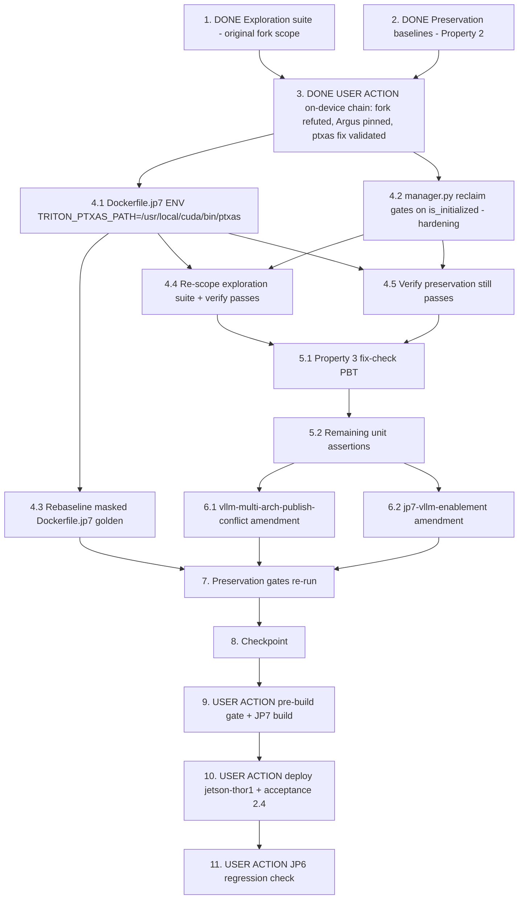

# Implementation Plan

## Overview

> **Re-scoped 2026-08-15** around the VALIDATED root cause (bugfix.md
> Re-hypothesis chain; design.md "Validated Root Cause and Fix"). Tasks 1–3
> are the completed/superseded record of the original fork-hypothesis phase
> and its on-device refutation-and-re-validation chain — their outcome notes
> are retained verbatim. The plan from wave 3 onward now implements the
> ptxas fix.

Fix the JP7 image defect that keeps any Triton-JIT-compiling vLLM model from
reaching READY on Thor: triton's BUNDLED ptxas (CUDA 12.8) cannot codegen
for `sm_110a`, so the engine dies with `PTXASError` during `profile_run`
(model FAILED → 409 → component BROKEN → deployment rollback). The fix —
`ENV TRITON_PTXAS_PATH=/usr/local/cuda/bin/ptxas` in `src/backend/Dockerfile.jp7`
— is ALREADY VALIDATED by on-device hot-patch (task 3 outcome chain: qwen
READY, 40.48 GiB KV cache, generate served, coexisting with the three vision
models on GPU). Remaining work: land the ENV + the optional reclaim-hygiene
hardening, rebaseline the one intended security golden, re-scope the
exploration suite to the new fix, re-run the gates, then the single JP7 build
and the on-hardware acceptance (the original failing scenario of deployment
aebc9d9a). The original `cudaErrorDevicesUnavailable` failure was
ENVIRONMENTAL (nvargus/Argus driver defect — NVIDIA report follow-up, outside
this plan; see bugfix.md Scope Disposition).

**Honesty guard.** No GPU-free test executes ptxas or CUDA. The container
suites pin the causal configuration (the ENV declaration and its JP7-only
scoping) and the reclaim-hygiene behavior; the behavioral claim (system
ptxas → profile run completes → READY) is validated on hardware — the
hot-patch validation (DONE, task 3 outcome) and the built-component
acceptance (task 10). Do not write a test that pretends to exercise
ptxas/CUDA.

**Non-goal guards.** `vllm_model_prep.py` is byte-identical (its retry loop
is already correct). No compose/recipe/JP6/JP5 image change (compose is
shared with JP6 — the ENV goes in Dockerfile.jp7 ONLY; preservation 3.8).
No cloud-side change (the `failureHandlingPolicy` exposure for defect 1.4 is
a deferred follow-up cloud-side spec). The NVIDIA bug report, the silent ORT
CPU-fallback visibility follow-up, and the pre-existing awscrt crash loop
(bugfix.md Scope Disposition (a)–(c)) stay OUT of this plan.

Test commands:
- Device-side `src/` suites run in the flask-app container per
  `.kiro/steering/builds.md` (NOT the portal venv) — see design.md
  "Test Commands" for the exact `docker run` line; the interpreter shim
  picks python3.11 (JP5 image) or python3.10 (JP6 image)
- Hypothesis property tests use `test_property_*.py` naming with no
  hardcoded `max_examples`
- The security guard pair runs host-side:
  `python3 -m pytest test/backend-test/security/preservation/test_preservation_out_of_scope_guard.py test/backend-test/security/preservation/test_preservation_secrets_out_of_scope_guard.py -p no:cacheprovider --noconftest -q`

New files this plan creates (both already exist from waves 1–2; do NOT
rename them — the exploration file's name is historical, from the refuted
fork hypothesis; task 4.4 adds a module-docstring note):
- `test/backend-test/vllm_jp7_engine_cuda_init/test_exploration_fork_cuda_init.py`
- `test/backend-test/vllm_jp7_engine_cuda_init/test_property_reclaim_cuda_hygiene.py`

## Notes

- Exactly two source files change: `src/backend/Dockerfile.jp7` (one
  `ENV TRITON_PTXAS_PATH=/usr/local/cuda/bin/ptxas` + comment block) and
  `src/backend/vllm_runtime/manager.py` (one-line reclaim-hygiene gate +
  docstrings — optional hardening, defect 1.3) — plus the one intended
  security golden rebaseline
- Tasks 9, 10, 11 are USER ACTIONs on real hardware / the build host (task 3
  was too, and is complete); the agent prepares and verifies everything else
  in the flask-app container
- builds.md rules apply throughout: one build at a time, gate pre-checked,
  no portal deploys mid-build, on-device verification before commit

## Task Dependency Graph

```json
{
  "waves": [
    { "wave": 1, "description": "DONE (original scope): the exploration suite surfaced the fork-hypothesis counterexamples on unfixed code (task 1) and the preservation baselines were observed and recorded (task 2). Retained as the record; the exploration suite is re-scoped in task 4.4.", "tasks": ["1", "2"] },
    { "wave": 2, "description": "DONE (USER ACTION chain on jetson-thor1): spawn hot-patch REFUTED the fork hypothesis; the discriminator chain proved the original failure ENVIRONMENTAL (nvargus/Argus), surfaced the real ptxas defect, and VALIDATED the TRITON_PTXAS_PATH fix by hot-patch (qwen READY + generate + coexistence). Gate fully discharged.", "tasks": ["3"] },
    { "wave": 3, "description": "The fix: Dockerfile.jp7 TRITON_PTXAS_PATH ENV, the optional manager reclaim hardening, and the intended-baseline update.", "tasks": ["4.1", "4.2", "4.3"] },
    { "wave": 4, "description": "Re-scope the exploration suite to the ptxas fix and verify it passes on the fixed tree; re-run the task 2 preservation suites.", "tasks": ["4.4", "4.5"] },
    { "wave": 5, "description": "Fix-checking property suite (Correctness Property 3) plus the remaining unit assertions.", "tasks": ["5.1", "5.2"] },
    { "wave": 6, "description": "Documentation: the two cross-spec amendment notes.", "tasks": ["6.1", "6.2"] },
    { "wave": 7, "description": "Re-run every preservation gate in the flask-app container, then checkpoint.", "tasks": ["7", "8"] },
    { "wave": 8, "description": "USER ACTION: pre-build gate + the single JP7 LocalServer build.", "tasks": ["9"] },
    { "wave": 9, "description": "USER ACTION: deploy to jetson-thor1 and verify the original failing scenario (2.4); then the JP6 regression check.", "tasks": ["10", "11"] }
  ]
}
```



## Tasks

- [x] 1. Write bug condition exploration test suite
  - **SUPERSEDED NOTE (2026-08-15 re-scope)**: the task text below is the ORIGINAL (fork-hypothesis) instruction, retained as the record of what was done. The suite it created is re-scoped by task 4.4 (case 1 → `TRITON_PTXAS_PATH`, not the spawn ENV; case 3 gains the JP6/JP5 no-`TRITON_PTXAS_PATH` assertion). Do NOT re-implement the case 1 spawn assertion.
  - **Property 1: Bug Condition** - JP7 engine core launches CUDA-clean (config leg) and **Property 3** (behavioral leg)
  - **CRITICAL**: Cases 1-2 MUST FAIL on unfixed code - failure confirms the bug condition exists
  - **DO NOT attempt to fix the tests or the code when they fail**
  - **NOTE**: This suite encodes the expected behavior - it validates the fix when it passes after implementation
  - **GOAL**: Pin each leg of the root-cause chain that is pinnable without a GPU; the CUDA-level leg is task 3
  - Create `test/backend-test/vllm_jp7_engine_cuda_init/test_exploration_fork_cuda_init.py` following the sibling convention (`test/backend-test/vllm_runtime/test_manager_memory_reclaim.py`): `sys.path.insert` shim to `src/backend`, runnable in the flask-app container, no vllm/torch/GPU dependency
  - Case 1 - **Spawn is declared for JP7** (config-level, the `startMethod = fork` leg of C(X)): assert `src/backend/Dockerfile.jp7` contains exactly one `ENV VLLM_WORKER_MULTIPROC_METHOD=spawn` line; in the same test, document the C(X) input surface by asserting NO other config source sets the variable (`src/docker-compose.yaml` and the recipe variants contain no `VLLM_WORKER_MULTIPROC_METHOD`). On unfixed code the ENV assertion FAILS (the line is absent — fork wins by default in vLLM v0.11.2's `get_mp_context()`)
  - Case 2 - **The failure handler does not initialize CUDA** (behavioral, GPU-free, the `parentCudaInitialized` leg / defect 1.3): inject a fake `torch` module into `sys.modules` whose `cuda.is_initialized()` returns False and which records every `cuda.*` attribute call; construct a `VllmRuntimeManager` with an engine factory that raises (stage a minimal repository per the sibling test's `_stage_repository` helper); drive `load()` to `_fail()`; assert NO CUDA-initializing call (`cuda.is_available`) was made. On unfixed code this FAILS — `_reclaim_gpu_memory` calls `torch.cuda.is_available()`, the defect 1.3 counterexample
  - Case 3 - **JP6/JP5 engine contracts, documents F(X), PASSES on unfixed code and must NOT be inverted**: `src/backend/Dockerfile.jp6` pins `ENV VLLM_USE_V1=0` and contains NO `VLLM_WORKER_MULTIPROC_METHOD`; `src/backend/Dockerfile.jp5` keeps `ARG VLLM_ENABLE=0`
  - Run in the flask-app container (design.md "Test Commands" docker run line, scoped to `test/backend-test/vllm_jp7_engine_cuda_init`)
  - **EXPECTED OUTCOME**: cases 1-2 FAIL (this is correct - it proves the bug condition exists); case 3 PASSES
  - Document the counterexamples found: the absent spawn declaration; `is_available()` invoked from `_fail()` in a process whose torch CUDA was never initialized
  - Mark complete when the suite is written, run, and the failures are documented
  - _Requirements: 1.1, 1.2, 1.3_

- [x] 2. Write preservation property tests (BEFORE implementing the fix)
  - **Property 2: Preservation** - Non-JP7-launch behavior is unchanged
  - **IMPORTANT**: Follow observation-first methodology - observe the UNFIXED behavior, record it, then encode it as properties
  - Create `test/backend-test/vllm_jp7_engine_cuda_init/test_property_reclaim_cuda_hygiene.py` (Hypothesis, no hardcoded `max_examples`, `# Validates: Requirements …` comments) and add the Property 2 tests now (the Property 3 fix-check test is added in task 5.1)
  - Observe on UNFIXED code and encode:
    - **Reclaim-when-initialized identity** (property-based, the JP6/V0 recovery substrate): over generated fake-torch states with `cuda.is_initialized() = True` (crossed with `empty_cache` raising or not), `_reclaim_gpu_memory` calls `empty_cache()` and swallows every error exactly as observed on the unfixed tree (where the gate was `is_available() = True`) (3.1, 3.6)
    - **Torch-missing identity**: with no `torch` importable, reclaim returns silently (the existing `test_manager_memory_reclaim.py::test_reclaim_swallows_missing_torch` shape) (3.2)
    - **Call-site identity**: failed load and unload still trigger reclaim; successful load does not (already covered by `test/backend-test/vllm_runtime/test_manager_memory_reclaim.py` — run it and record it green as the baseline, do not duplicate it)
  - Baseline the existing suites green on the UNFIXED tree in the flask-app container: `test/backend-test/vllm_runtime`, `test/backend-test/vllm_runtime_tests`, `test/backend-test/text_generation`, `test/backend-test/deploy_reliability` (3.4, 3.5, 3.6, 3.7)
  - **EXPECTED OUTCOME**: Tests PASS on UNFIXED code (this confirms the baseline behavior to preserve)
  - Mark complete when the tests are written, run, and passing on unfixed code
  - **BASELINE RECORDED (unfixed tree, host-side portal venv — docker/flask-app image not on this host, see task 1 note; container gate run happens in task 7)**: `test_property_reclaim_cuda_hygiene.py` 2 passed (reclaim-when-initialized identity over fake-torch states where BOTH `is_available()` and `is_initialized()` are True, crossed with `empty_cache` raising or not; torch-missing identity via `sys.modules['torch']=None`); call-site identity baseline `test/backend-test/vllm_runtime/test_manager_memory_reclaim.py` 5 passed; suites: `vllm_runtime` 18 passed, `vllm_runtime_tests` 1 passed, `text_generation` 3 passed, `deploy_reliability` 72 passed. Run with `PYTHONPATH=src/backend:test/backend-test` and `--noconftest`; pytest-run deps installed into the portal venv to substitute for the skipped root conftest and container image: fastapi, httpx, Pillow, uvicorn, structlog, asgi-correlation-id, marshmallow
  - _Requirements: 3.1, 3.2, 3.4, 3.5, 3.6, 3.7_

- [x] 3. USER ACTION: on-device reproduction + spawn hot-patch validation (jetson-thor1)
  - **STATUS: COMPLETE (2026-08-15).** The task text below is the ORIGINAL
    (fork-hypothesis) instruction, retained for the record. Its purpose —
    on-device validation and the go/no-go gate before wave 3 — is fully
    discharged by the OUTCOME chain below: the spawn hypothesis was refuted,
    the original failure was proven environmental (nvargus/Argus), the real
    ptxas defect was surfaced, and the `TRITON_PTXAS_PATH` fix was VALIDATED
    by hot-patch (qwen READY, generate served, coexistence with the vision
    models on GPU, hot-patch reverted). Wave 3 implements that validated fix.
  - **GOAL**: Confirm or refute the fork hypothesis at the CUDA level BEFORE any code lands or the 1-2h build is dispatched. If refuted, STOP and re-hypothesize (design.md Hypothesized Root Cause)
  - Step 1 — reconfirm the reproduction (proven twice already): stage the qwen component's Triton_vLLM_Repository via `vllm_model_prep.py` with the component zip and request the load; observe HTTP 409 `{"state":"FAILED","reason":"Engine core initialization failed..."}` and the `EngineCore_DP0` / `torch.cuda.set_device` / `cudaErrorDevicesUnavailable` traceback in the backend log
  - Step 2 — hot-patch: add `VLLM_WORKER_MULTIPROC_METHOD=spawn` to the backend service `environment` in the on-device compose file, recreate the backend container (`docker compose up -d`), re-run the identical load request
  - **EXPECTED OUTCOME**: the model reaches READY with HTTP 200 on the same device that just answered 409 — the fix direction is confirmed at the CUDA level. If it still fails, capture the full EngineCore log and STOP (re-hypothesize; do not proceed to wave 3)
  - Also record whether the `NVRM ... osCreateOsDescriptorFromFileHandle: Error (89)` dmesg spam recurs during either step (candidate independent NVIDIA report — note it in the spec directory if seen; nothing in this fix depends on it)
  - Step 3 — REVERT the hot-patch (restore the on-device compose file and recreate the container; unload/clean the manually staged model): the built component must prove itself from a clean deployment in task 10
  - _Requirements: 1.1, 2.1, 2.2_
  - **OUTCOME (2026-08-15, jetson-thor1 — EXECUTED, GATE FIRED: hypothesis REFUTED, plan HALTED at wave 2)**:
    1. Hot-patch applied per this task: `VLLM_WORKER_MULTIPROC_METHOD=spawn` added to the backend service environment in the on-device compose; component restarted via greengrass-cli; env verified inside the container (`printenv VLLM_WORKER_MULTIPROC_METHOD` → `spawn`).
    2. Load re-run (model staged via `vllm_model_prep.py`). Spawn was ACTIVE — the `EngineCore_DP0` child's log shows the backend app's module-level initialization re-executing under the child's pid prefix (shadow updates etc.), which only happens under spawn's module re-import, never under fork.
    3. RESULT: `EngineCore_DP0` (pid 962) died at the IDENTICAL location — `torch.cuda.set_device` → `torch.AcceleratorError: CUDA error: CUDA-capable device(s) is/are busy or unavailable (cudaErrorDevicesUnavailable)`. HTTP 409, same reason string.
    4. **The fork-after-CUDA-init hypothesis is REFUTED as the root cause.** The fix direction "Dockerfile ENV spawn" alone will NOT fix the bug. Per this task's gate: STOPPED before wave 3; no fix code has landed.
    5. Hot-patch fully reverted (compose restored from backup, grep confirms 0 occurrences, component restarted, backend healthy, env absent from container); staged model cleaned; temp files removed. Device left in its pre-test state (models cold, will lazy-load on next use).
    - **Plan status: HALTED at wave 2 pending re-hypothesis** (see bugfix.md "Re-hypothesis (task 3 outcome)" and the design.md Fix Implementation note). Tasks 4.x as designed — spawn ENV as the primary fix — are **INVALIDATED in their current form**. Exception: task 4.2 (reclaim hygiene, defect 1.3) remains a valid hardening independent of the root cause.
    - New leading hypothesis and discriminating evidence recorded in bugfix.md; the decisive experiment (unloading vision models one at a time to find the context count at which fresh-process CUDA init succeeds again) has NOT been run — it needs user consent since it stops live vision models.
    - **UPDATE (2026-08-15, user-consented)**: the discriminating experiment WAS run — see bugfix.md "Discriminating experiment (context-limit probe, 2026-08-15)". The context-LIMIT hypothesis is REFUTED: fresh-process CUDA init fails at ZERO loaded model contexts (no threshold exists); nvidia-smi shows no compute context anywhere on the device; the vision models are READY via silent ORT CPU fallback. Resulting hypothesis v3: a persistent Thor/JP7 driver degraded state (onset Aug 14 17:17:31, coincident with nvargus/CSI ISP capture activity; kernel signature "Can't map dma attachment!" + NVRM Error(89) 1:1 per failed context creation) in which ALL new CUDA context creation fails device-wide. Next discriminators: nvargus-daemon restart + re-probe, then reboot + clean-boot qwen load. Device restored: all three vision models READY, backend healthy.
    - **UPDATE (2026-08-15, user-consented)**: nvargus-daemon restart discriminator EXECUTED — see bugfix.md "nvargus-daemon restart discriminator (2026-08-15)". CUDA context creation recovered IMMEDIATELY after `systemctl restart nvargus-daemon` (probe FAIL before, `CUDA INIT OK` twice after, zero new Error(89) lines): **Argus pinned as the holder of the poisoned state; no reboot needed**. Hypothesis v3 confirmed/sharpened; vision models still on CPU fallback (reload left to user); the qwen load is now re-testable outside the degraded window and likely moots the code-fix direction.
    - **OUTCOME UPDATE (2026-08-15, user-consented)**: clean-window qwen load re-test EXECUTED — see bugfix.md "Clean-window qwen load re-test (2026-08-15)". Vision models reloaded to READY **on GPU** (stubs in nvidia-smi compute apps for the first time since onset); the qwen EngineCore passed `torch.cuda.set_device` cleanly, downloaded+loaded weights (16.6 GiB), **original bug CONFIRMED ENVIRONMENTAL (task 4.1 mooted, 4.2 optional hardening)** — but a NEW distinct image defect surfaced: triton's bundled CUDA 12.8 ptxas rejects Thor's `sm_110a` (PTXASError during profile_run) so qwen still cannot reach READY. Fix candidate `TRITON_PTXAS_PATH=/usr/local/cuda/bin/ptxas` (Dockerfile.jp7 ENV, untested). Spec needs re-scoping around the ptxas defect; requirement 2.4 still unmet. Zero new Error(89) all session; device left healthy (3 vision models READY on GPU, backend HTTP 200).
    - **OUTCOME UPDATE (2026-08-15, standing consent)**: TRITON_PTXAS_PATH hot-patch validation EXECUTED — see bugfix.md "TRITON_PTXAS_PATH hot-patch validation (2026-08-15)". **Fix candidate VALIDATED on the first iteration**: with `TRITON_PTXAS_PATH=/usr/local/cuda/bin/ptxas` hot-patched into the backend env, qwen loaded to READY (HTTP 200, profile pass completed, 40.48 GiB KV cache) and served a generate request, coexisting with all three vision stubs on GPU (EngineCore 59.6 GB + stubs in nvidia-smi) — requirement 2.4 demonstrated achievable pre-build. Hot-patch fully reverted (0 occurrences, env absent), device restored (3 vision models READY on GPU, backend HTTP 200, probe OK, Error(89) 200,288 with zero new lines all session). Confirmed re-scope direction: `ENV TRITON_PTXAS_PATH=/usr/local/cuda/bin/ptxas` in Dockerfile.jp7 + golden rebaseline + JP7 build + task-10 acceptance.

- [ ] 4. Fix for the JP7 engine-core initialization failure (design "Validated Root Cause and Fix" steps 1-3)

  - [x] 4.1 Declare `TRITON_PTXAS_PATH` in `src/backend/Dockerfile.jp7` (design fix step 1 — VALIDATED on-device)
    - Add `ENV TRITON_PTXAS_PATH=/usr/local/cuda/bin/ptxas` adjacent to the vLLM from-source build layer (which carries the "no `ENV VLLM_USE_V1` here" note), with the comment block from design.md "Fix step 1": triton's BUNDLED ptxas is CUDA 12.8 (V12.8.93) and rejects Thor's `sm_110a` (``ptxas fatal : Value 'sm_110a' is not defined for option 'gpu-name'`` → PTXASError during profile_run), the image's system CUDA 13.x ptxas accepts it, validated on-device jetson-thor1 2026-08-15 (qwen READY, 40.48 GiB KV cache, generate served, coexistence with the vision models on GPU), and the JP6/JP5 contrast (no analogous env var)
    - Touch NOTHING else in the file; `src/docker-compose.yaml` (shared with JP6), the recipes, `Dockerfile.jp6`, and `Dockerfile.jp5` are untouched
    - _Bug_Condition: a JP7 engine-core init whose profile run JIT-compiles a Triton kernel — triton's bundled CUDA 12.8 ptxas cannot codegen for sm_110a_
    - _Expected_Behavior: Property 1 - triton honors TRITON_PTXAS_PATH for its PTX assembly step, so the profile run completes and the model reaches READY with HTTP 200, on the first attempt and every retry_
    - _Preservation: JP6/JP5 images gain no new env var (exploration case 3 keeps passing) (3.1, 3.2, 3.8)_
    - _Requirements: 2.1, 2.2, 2.3, 2.4_

  - [x] 4.2 Gate `_reclaim_gpu_memory` on `torch.cuda.is_initialized()` (design fix step 2 — OPTIONAL HARDENING, defect 1.3; kept: cheap, already designed and test-scaffolded, not the root cause)
    - In `src/backend/vllm_runtime/manager.py`, replace `if torch.cuda.is_available():` with `if torch.cuda.is_initialized():` inside `_reclaim_gpu_memory`; keep the lazy import, the `ImportError` return, the broad exception swallow, and the log lines byte-identical
    - Update the method docstring with the invariant: reclaim must never be the first CUDA touch in a process (a driver-initializing probe in the parent poisons every subsequently forked child — defect 1.3 — and on JP7/V1 the engine memory lives in the child anyway, so there is nothing for the parent to reclaim)
    - Correct the stale module docstring in passing: "the ``vllm`` package only exists on vLLM-capable images (JetPack 6)" → "(JetPack 6 / JetPack 7)" — no semantic change (design Cross-Spec table row 3)
    - _Bug_Condition: hygiene defect 1.3 - _fail() driver-initializes CUDA in the parent backend process on every failure (the suspected poisoning leg of the refuted fork hypothesis; real and cheap to fix, kept as hardening)_
    - _Expected_Behavior: Property 3 - no CUDA-initializing call when torch CUDA is uninitialized; a re-attempt after failure starts from an uncontaminated parent (2.3)_
    - _Preservation: empty_cache still runs whenever is_initialized() is true (JP6 V0 in-process engine memory, the KV-cache OOM recovery substrate); call sites untouched (3.1, 3.6)_
    - _Requirements: 2.3, 3.1, 3.6_

  - [x] 4.3 Rebaseline the masked Dockerfile.jp7 golden (design step 3)
    - Task 4.1 changed a preservation-tracked file. Update `test/backend-test/security/baselines/docker_baseline_backend_Dockerfile.jp7_masked.txt` for the intended ENV addition: re-run `test/backend-test/security/preservation/test_preservation_docker_masked_bytes.py`, confirm the ONLY diff versus the old golden is the new comment block + ENV line, and commit the golden alongside the change per `.kiro/steering/builds.md` (never weaken or delete the test)
    - `Dockerfile.jp7` has no sha256 entry in `docker_baseline_out_of_scope.json`, so no other baseline changes
    - Run the security guard pair host-side and the full preservation suite in the flask-app container; all green
    - _Preservation: the security preservation gate stays authoritative — an intended edit gets a conscious rebaseline, nothing else drifts_
    - _Requirements: 3.3_

  - [x] 4.4 Re-scope the exploration suite to the validated fix, then verify it passes
    - **Property 1 / Property 3: Expected Behavior**
    - FIRST re-scope `test/backend-test/vllm_jp7_engine_cuda_init/test_exploration_fork_cuda_init.py` to design.md's reworked Exploratory Bug Condition Checking cases (do NOT rename the file — its name is historical, from the refuted fork hypothesis; add a module-docstring note saying so and pointing at bugfix.md's Re-hypothesis chain):
      - Case 1 → assert `src/backend/Dockerfile.jp7` contains exactly one `ENV TRITON_PTXAS_PATH=/usr/local/cuda/bin/ptxas` line, and that NO other config source (`src/docker-compose.yaml`, the recipe variants) sets `TRITON_PTXAS_PATH` (replaces the spawn-ENV assertions; the spawn ENV is mooted and must NOT be asserted present)
      - Case 2 → unchanged (the reclaim-hygiene behavioral test: fake torch, exploding engine factory, no `is_available` call)
      - Case 3 → unchanged assertions PLUS: `Dockerfile.jp6` and `Dockerfile.jp5` contain NO `TRITON_PTXAS_PATH` (preservation 3.8)
    - THEN run the suite in the flask-app container against the fixed tree
    - **EXPECTED OUTCOME**: Tests PASS - case 1 passes (TRITON_PTXAS_PATH declared in Dockerfile.jp7 only), case 2 passes (the failure handler makes no CUDA-initializing call), case 3 still passes (the JP6/JP5 contract guard is NOT inverted and neither image gains the new env var)
    - _Requirements: 2.1, 2.2, 2.3, 3.8_

  - [x] 4.5 Verify preservation tests still pass
    - **Property 2: Preservation**
    - **IMPORTANT**: Re-run the SAME tests from task 2 - do NOT write new tests
    - Run `test_property_reclaim_cuda_hygiene.py` plus the full baseline suites (`vllm_runtime`, `vllm_runtime_tests`, `text_generation`, `deploy_reliability`) in the flask-app container
    - Also assert `src/backend/dda_triton/vllm_model_prep.py` is byte-identical to git HEAD (`git diff --exit-code -- src/backend/dda_triton/vllm_model_prep.py`) — the non-goal guard
    - **EXPECTED OUTCOME**: Tests PASS (confirms the reclaim-when-initialized identity, torch-missing identity, call-site identity, and every existing manager/server/endpoint behavior)
    - _Requirements: 3.1, 3.2, 3.4, 3.5, 3.6, 3.7_

- [ ] 5. Write the fix-checking tests

  - [x] 5.1 CUDA-hygiene fix-check property
    - **Property 3: Fix Checking** - The failure handler never initializes CUDA (the optional hardening leg)
    - Property-based test (Hypothesis) added to `test_property_reclaim_cuda_hygiene.py` with `# Validates: Requirements 2.3`
    - Over generated fake-torch states with `cuda.is_initialized() = False` (crossed with: `empty_cache` raising or not, `is_available` present or absent, torch importable or not, adversarial extra `cuda` attributes): the fixed `_reclaim_gpu_memory` performs NO CUDA-initializing call (`is_available` never invoked; `empty_cache` never invoked when uninitialized) and never raises
    - Run in the flask-app container
    - _Requirements: 2.3_

  - [x] 5.2 Remaining unit assertions
    - Unit tests (same directory): the `TRITON_PTXAS_PATH` ENV appears exactly once in `Dockerfile.jp7` and nowhere in compose/recipes/JP6/JP5 (overlaps exploration case 1/3 — keep as the durable regression guard); `_reclaim_gpu_memory` with `is_initialized() = True` → `empty_cache()` called; torch missing → silent return; `empty_cache()` raising → swallowed and logged
    - Confirm the pre-existing `test/backend-test/vllm_runtime/test_manager_memory_reclaim.py` passes unmodified
    - Run in the flask-app container
    - _Requirements: 2.1, 2.2, 3.1, 3.2, 3.6, 3.8_

- [ ] 6. Cross-spec documentation amendments (design Cross-Spec table)

  - [x] 6.1 `vllm-multi-arch-publish-conflict` amendment note
    - Append a short note to `.kiro/specs/vllm-multi-arch-publish-conflict/tasks.md`'s open on-hardware verification: the JP7 deploy test it anticipated is fulfilled by `.kiro/specs/vllm-jp7-engine-cuda-init/` (cloud publish/packaging confirmed working — the component deployed and its lifecycle ran; the device-side EngineCore failure it surfaced is fixed by this spec). A note, not a rewrite
    - _Requirements: (documentation consistency)_

  - [x] 6.2 `jp7-vllm-enablement` amendment note
    - Append a note to `.kiro/specs/jp7-vllm-enablement/design.md`: the JP7 image now declares `ENV TRITON_PTXAS_PATH=/usr/local/cuda/bin/ptxas` (added by `.kiro/specs/vllm-jp7-engine-cuda-init/`) because triton's BUNDLED ptxas (CUDA 12.8) cannot codegen for Thor's `sm_110a` — without it, any vLLM model whose execution path JIT-compiles a Triton kernel dies with PTXASError during the engine's profile run
    - _Requirements: (documentation consistency)_

- [x] 7. Re-run every preservation gate
  - Host-side: the security guard pair (out-of-scope + secrets out-of-scope) green
  - Flask-app container: the full `test/backend-test/security/preservation` suite green (masked jp7 golden now matches the fixed tree), plus the full vLLM-related suites from task 4.5 one final time
  - **EXPECTED OUTCOME**: all green; the tree is build-ready
  - _Requirements: 3.3_
  - **RESULTS (2026-08-15, host-side portal venv — flask-app image not on this EC2 host, container run deferred to the device/build host per the established pattern, same caveat task 2 recorded)**:
    - Security guard pair (`test_preservation_out_of_scope_guard.py` + `test_preservation_secrets_out_of_scope_guard.py`, `-p no:cacheprovider --noconftest -q`): **4 passed, 3 skipped** — green
    - Full `test/backend-test/security/preservation` suite (`PYTHONPATH=src/backend:test/backend-test`, `--noconftest`; numpy + dill added to the portal venv to substitute for the container image): **136 passed, 8 skipped, 2 FAILED**. The masked jp7 golden matches the fixed tree (this spec's rebaseline verified green). The 2 failures are **PRE-EXISTING drift from OTHER specs, NOT caused by this spec** (this spec's diff is Dockerfile.jp7 + manager.py + the jp7 masked golden only) and are NOT container-context failures:
      1. `test_preservation_iam_out_of_scope_guard.py::test_sibling_spec_files_unchanged` — `edge-cv-portal/backend/functions/packaging.py` sha256 drifted from the security-iam sibling-file baseline (`35a3b6b4… → f7a42031…`). Committed drift: the baseline hash matches commit c622850 (jp7-vllm-enablement); commit c815003 (onnx-jetson-publish-packaging) changed the file. Needs a reviewed rebaseline of `iam_out_of_scope_baseline.json` per the security gate protocol, owned by that spec's follow-up — do NOT weaken the test.
      2. `test_preservation_iam_readme_prose.py::test_readme_prose_byte_for_byte_identical` — an UNCOMMITTED working-tree edit to `README_main.md` ("Flask + ML" → "FastAPI + ML" in the architecture diagram, 1 line) drifts the prose baseline. Not from this spec; needs either the edit reverted or `iam_baseline_readme_prose.md` rebaselined via the gate protocol.
      - **PRE-BUILD IMPLICATION**: `build-custom.sh` runs the full `security/preservation` suite as the in-build gate, so these 2 pre-existing failures WILL fail the task 9 JP7 build unless resolved first (per builds.md "address the gate BEFORE starting the build")
    - vLLM suites, all green: `vllm_jp7_engine_cuda_init` **16 passed**, `vllm_runtime` **18 passed**, `vllm_runtime_tests` **1 passed**, `text_generation` **3 passed**, `deploy_reliability` **72 passed** (110 total)

- [x] 8. Checkpoint before the build
  - Confirm: tasks 1-7 complete; the re-scoped exploration suite passes on the fixed tree; preservation green; `vllm_model_prep.py`, compose, recipes, JP6/JP5 Dockerfiles byte-identical to HEAD except the two intended files (+ golden + spec docs); task 3's on-device chain validated the TRITON_PTXAS_PATH fix (qwen READY + generate + coexistence) and the hot-patch was reverted
  - Ask the user to confirm build sequencing: the `cold-model-first-run-failure` spec will also need a JP7 build when implemented — if the user wants to sequence both fixes into this one build cycle, that spec's code must land first (the specs stay independent; do NOT couple them — this is purely a build-scheduling option)
  - _Requirements: (gate)_
  - **RESULTS (2026-08-15, host-side portal venv, same pattern as tasks 2/7)**:
    - Source scope verified: `git status`/`git diff --stat` show the only source changes vs HEAD are `src/backend/Dockerfile.jp7` + `src/backend/vllm_runtime/manager.py` + the rebaselined jp7 masked golden + the `test/backend-test/vllm_jp7_engine_cuda_init/` suite (untracked) + spec docs/cross-spec notes. Byte-identical to HEAD confirmed via `git diff --exit-code`: `vllm_model_prep.py`, `src/docker-compose.yaml`, `Dockerfile.jp6`, `Dockerfile.jp5`, and all 7 recipe variants — all clean
    - Re-scoped exploration suite + reclaim hygiene property suite + `test/backend-test/vllm_runtime/test_manager_memory_reclaim.py`: **21 passed**
    - Security guard pair (out-of-scope + secrets out-of-scope, `--noconftest -p no:cacheprovider`): **4 passed, 3 skipped** — green, no cdk.out drift (both bak dirs already aside)
    - `test_preservation_docker_masked_bytes.py`: **12 passed** — rebaselined jp7 golden matches the tree
    - Unrelated working-tree drift (NOT committed with this spec): `README_main.md` (Flask→FastAPI diagram edit, the task 7 pre-existing prose-baseline drift), `CLAUDE.md`, and checkbox/RESULTS updates in `.kiro/specs/onnx-compile-error-diagnostics/tasks.md` + `.kiro/specs/onnx-jetson-publish-packaging/tasks.md` (other specs' bookkeeping)
    - Build sequencing DECIDED by the user: build with THIS fix only; do not wait for `cold-model-first-run-failure`
    - Tree is build-ready pending the task 7-noted pre-existing gate failures (iam sibling-file baseline drift from onnx-jetson-publish-packaging c815003 + the README_main.md prose drift) which must be resolved before the task 9 build per builds.md

- [x] 9. USER ACTION: pre-build gate + JP7 LocalServer build (~1-2h)
  - Pre-build checklist per `.kiro/steering/builds.md`: `pgrep -af "gdk component build"` / `pgrep -af "build-custom.sh"` both empty; move `edge-cv-portal/infrastructure/cdk.out` aside; run the security guard pair and confirm green (never assume); NO portal deploys until the build finishes
  - Swap `gdk-config.json` to `aws.edgeml.dda.LocalServer.arm64JP7`, run `gdk component build`, capture to `.gdk_build_jp7.log`; restore `gdk-config.json` when done
  - **EXPECTED OUTCOME**: build succeeds with the security gate green; a new LocalServer.arm64JP7 component version exists
  - _Requirements: 2.4 (prerequisite)_
  - **DISPATCH NOTE (2026-08-15 — build IN FLIGHT, task NOT complete until it finishes green)**: the JP7 LocalServer build was dispatched by the user on the build fleet as job `27cbeaf1-e31a-4dea-9f86-0ecd9d0b7e1d`, building `origin/spec/jetpack7-support` @ `2e69581` (gate-green tree: preservation suite 138 passed / 8 env skips, security guard pair green, iam sibling golden rebaselined, README_main.md drift reverted). Standing rule per builds.md: **NO portal deploys until this build finishes** (a deploy would regenerate `cdk.out` mid-build and fail the in-build security gate). Status queried from `dda-portal-build-jobs` (DynamoDB, us-east-1, account 164152369890) at 2026-08-15T22:52Z: **status `building`**, target JP7, component `aws.edgeml.dda.LocalServer.arm64JP7`, source_ref `spec/jetpack7-support`, dispatched/started 2026-08-15T22:49:21Z on instance `i-092e45480d30c89c4` (dedicated arm64 server). Re-query: `aws dynamodb get-item --table-name dda-portal-build-jobs --key '{"build_job_id":{"S":"27cbeaf1-e31a-4dea-9f86-0ecd9d0b7e1d"}}' --region us-east-1`

- [x] 10. USER ACTION: deploy to jetson-thor1 and verify the original failing scenario
  - Deploy the new LocalServer.arm64JP7 together with `model-vllm-qwen3-vl-8b-instruct-jetson-xavier-jp7` AND the three vision model components — the deployment shape of aebc9d9a
  - **Acceptance (2.4)**: the deployment COMPLETES (no rollback); qwen transitions STAGED → LOADING → READY and answers a generate request; all three vision models remain deployed and healthy, serving at their verified latency (3.3); the backend stays healthy for a sustained period — no crash, no container restart, no crash-loop (3.4)
  - Also verify from the logs: the load answered HTTP 200 (2.1); the profile run completed with ZERO ptxas/PTXAS errors — the Triton-JIT compilation used the system ptxas (2.2); and Shutdown/redeploy of the model component cleans up idempotently if exercised (3.5)
  - Practicalities from the hot-patch validation: the 17 GB HF weight cache left on the device (`/aws_dda/hf_cache`) makes the load skip the download (weights loaded in ~14 s from cache vs 134 s download); the FIRST generate request needs a generous client timeout — a 60 s curl timed out during first-request warmup, so use a >60 s (e.g. 300 s) client budget
  - Record which device and component versions were verified (goes in the commit/PR per builds.md)
  - _Requirements: 2.1, 2.2, 2.4, 3.3, 3.4_
  - **OUTCOME (2026-08-16, jetson-thor1 — VERIFIED, all acceptance criteria met; read-only verification + one generate request, no device edits)**:
    - **Deployment (2.4, no rollback)**: deployment `ea52d05a-8680-4714-ba2b-51a4cdf41fa4` (revision 5 of `jetson-thor1-platform-variant-jp7`, usecase 645504ce, created 04:18:04Z) — the exact aebc9d9a shape: LocalServer.arm64JP7 **1.0.5** + `model-vllm-qwen3-vl-8b-instruct-jetson-xavier-jp7` **1.0.0** + rf-detr-seg-nano **8.0.0** + yolo-test **8.0.0** + cookies-segmentation **4.0.0**, `failureHandlingPolicy: ROLLBACK`. On-device greengrass log: `DeploymentStatus=SUCCEEDED` at 04:23:52Z — **no rollback**. (Cloud-side caveat: the deployment now shows INACTIVE because a LATER revision 6 (`cb139a40`, 04:48Z) superseded it and FAILED cloud-side with `FAILED_NO_STATE_CHANGE` — a version-constraint conflict between a workflow deployment requiring LocalServer >=1.0.63 and this deployment's =1.0.5 pin. That failure made NO device change (no state change by definition) and is unrelated to this spec; the device still runs ea52d05a's components. Needs a separate reconciliation of the workflow deployment's version constraint.)
    - **Component states (on-device greengrass-cli)**: LocalServer.arm64JP7 1.0.5 **RUNNING**, qwen 1.0.0 **RUNNING** (Startup exited 0), all three vision model components **RUNNING** — nothing BROKEN.
    - **Load HTTP 200 (2.1)**: qwen loaded to READY **three times** on the built image, each first-try clean: 04:22:48Z (deploy, "POST /v2/repository/models/qwen3-vl-8b-instruct/load HTTP/1.1" 200, "Model loaded successfully!", KV cache 37.25 GiB, init 19.82 s), 04:23:41Z (component restart after a mid-deploy backend restart — the retry loop recovered exactly as 2.3 intends; KV cache 36.42 GiB), and 05:18:33Z (re-load after a later backend restart; init 18.85 s). Runtime index at verification time: `{"name":"qwen3-vl-8b-instruct","state":"READY"}` HTTP 200. Engine v0.11.3.dev0+g275de3417.d20260815 (the new build).
    - **Zero ptxas errors (2.2)**: `grep -ic ptxas` over the ENTIRE backend container log (all 3 loads + profile runs) = **0**. `TRITON_PTXAS_PATH=/usr/local/cuda/bin/ptxas` verified present in the running container env (baked into the image, commit 2e69581).
    - **Generate proof**: `POST /v2/models/qwen3-vl-8b-instruct/generate` (text-only) → **HTTP 200 in 1.9 s** with real coherent `text_output` (engine already warm).
    - **Vision models (3.3)**: `/feature-configurations` reports all three TritonModels **READY** simultaneously with qwen READY; `nvidia-smi --query-compute-apps` shows **VLLM::EngineCore 59,015 MiB + the three python stubs (790/532/340 MiB) concurrently on GPU** — coexistence under `gpu_memory_utilization=0.5` proven on the built component. Memory: 85.8 GB used / 122.8 GB unified, swap 0. (Per-inference latency not re-measured — READY + GPU residency accepted as the check.)
    - **Stability (3.4, honest)**: backend container created 04:21:27Z, RestartCount=3 total: 04:21:29Z (mid-deploy) and 05:03:51Z — both the PRE-EXISTING `awscrt` "Continuation ref count has gone negative" abort (explicitly out of scope per bugfix.md Scope Disposition), plus one deployment-driven recreate ~04:22:50Z. **Not a crash-loop** (isolated aborts ~40 min apart; the system self-recovered each time, qwen re-loaded to READY, healthy at verification ~05:20Z). Zero NEW kernel Error(89) lines: journalctl count **200,288**, exactly the recorded baseline.
    - **Idempotent Shutdown (3.5)**: exercised at 04:22:49Z — unload HTTP 200, "Model unloaded successfully!", staged repo cleaned ("Cleaned directory ... Directory cleanup finished"), then re-stage + re-load succeeded.
    - **Versions verified**: jetson-thor1, LocalServer.arm64JP7 **1.0.5** (image built 2026-08-16T01:21Z from commit 2e69581 with the TRITON_PTXAS_PATH ENV), qwen component **1.0.0**, vision components 8.0.0/8.0.0/4.0.0.
    - **ADDENDUM (2026-08-16 ~05:12–05:50Z, independent extended verification session)**: all criteria re-confirmed on the built component, plus honest stability observations past the note above:
      - Re-drove the full lazy-load cycle post-awscrt-restart: qwen STAGED → load **HTTP 200 in 48.3 s** → READY (repeated twice more at 05:36Z/05:47Z, 48.0 s / 46.7 s — first-try clean every time, weights from `/aws_dda/hf_cache`); generate `POST /v2/models/qwen3-vl-8b-instruct/generate` → **HTTP 200 in 3.4 s** with real `text_output`; all three vision models driven UNKNOWN → LOADING → **READY** via `/feature-configurations/models/{name}/start`, coexisting on GPU (`nvidia-smi` compute apps: **VLLM::EngineCore 59,015→57,863 MiB + three triton_python_backend_stub 790–1294/530–532/340 MiB**). `grep -ic ptxas` over the whole backend log still **0**.
      - **awscrt crash-loop tempo increased during the watch**: aborts at 05:03:51Z, 05:31:25Z, 05:41:59Z, 05:46:02Z (backend RestartCount **3→6**); EVERY abort carries the identical known `aws-c-event-stream event_stream_rpc_client.c:961 "Continuation ref count has gone negative"` signature — zero vLLM/CUDA/ptxas crashes anywhere. Attribution: entirely the pre-existing out-of-scope issue (bugfix.md Scope Disposition (c)), NOT this spec's change. The deployment itself produced a **41-min uninterrupted healthy window** (backend up 04:22:52→05:03:51Z with qwen READY from 04:23:41Z), exceeding the 10–15 min sustained-health bar.
      - **Operational consequence worth its own follow-up**: each awscrt restart silently drops ALL loaded models (qwen → STAGED, vision → UNKNOWN) until the next lazy request — compounding follow-ups (b)/(c) in bugfix.md.
      - Error(89): **zero new lines** (dmesg ring 0; kernel journal since 04:00Z = 0). `nvidia-csi-capture.service` enabled+active — the OLD unconditional install, expected: this build (2e69581) predates the csi-nvargus-optional fix (f1dbcda); not a defect of this spec.
      - Device left healthy at 05:50Z: all four models READY, GPU residency confirmed, backend healthy.

- [ ] 11. USER ACTION: JP6 vLLM regression check
  - The manager change rides the NEXT JP6 build; the currently deployed JP6 image is untouched by this spec. Required now: (a) the container preservation suites already green (task 7), and (b) a spot check that the JP6 device's deployed vLLM model (qwen on ryanorinagxdevkithomelabjp622 — verify which vLLM model that device actually carries before checking) is READY and answers a generate request (3.1)
  - OPTIONAL (user decision, second 1-2h cycle, strictly after task 9's build finishes): a JP6 LocalServer build + deploy to prove the shared manager change on JP6 hardware ahead of its next scheduled build. Default: defer to the next scheduled JP6 build, gated by the preservation suites
  - _Requirements: 3.1, 3.2_
