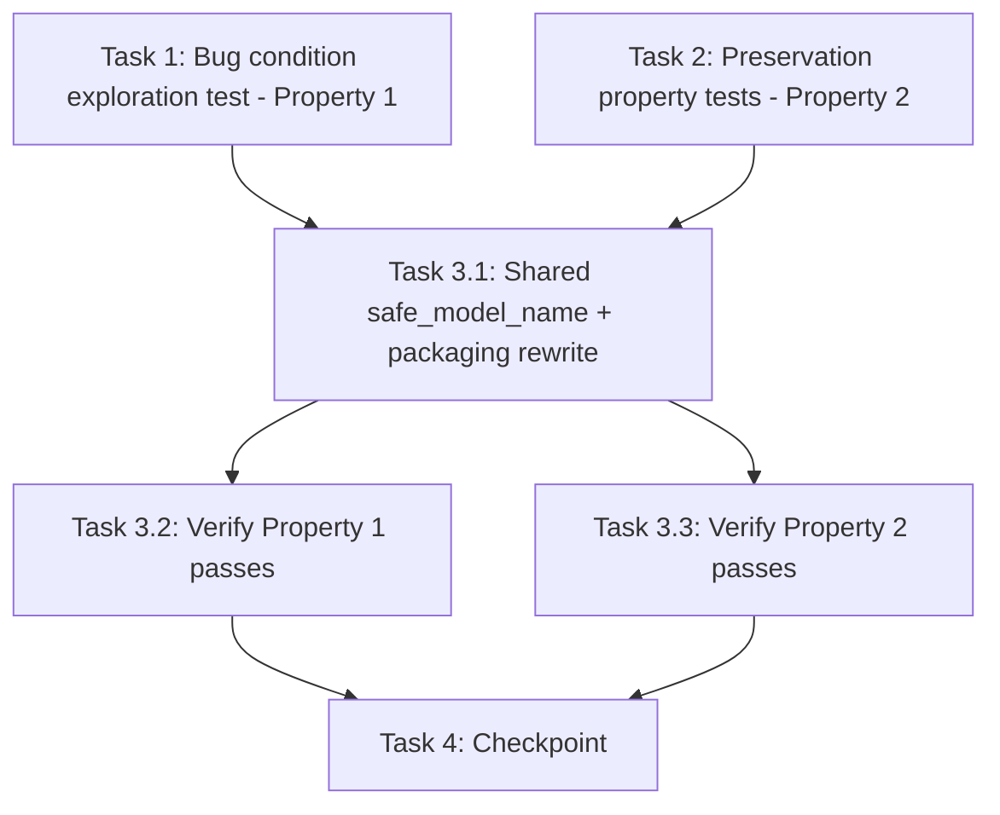

# Implementation Plan

## Overview

Fix the packaged-vs-served vLLM model name mismatch using the exploratory bugfix workflow: write the bug condition exploration test (Property 1) and preservation property tests (Property 2) against the UNFIXED code first, then implement the single-transform fix (shared `safe_model_name` + llm `modelName` rewrite in `workflow_packaging.py`), then verify with the same tests. Portal Lambda code only (`edge-cv-portal/backend/functions/`) — the device-side alias is out of scope (future hardening, ~2h LocalServer build).

## Task Dependency Graph

```json
{
  "waves": [
    { "wave": 1, "description": "Run on UNFIXED code: surface the packaged/served name mismatch counterexamples (task 1 FAILS - Property 1) and capture preservation baselines (task 2 PASSES - Property 2). Independent of each other.", "tasks": ["1", "2"] },
    { "wave": 2, "description": "Implement the fix: shared safe_model_name module + llm modelName rewrite in workflow packaging.", "tasks": ["3.1"] },
    { "wave": 3, "description": "Verify the fix: re-run task 1 test (now PASSES) and task 2 tests (still PASS).", "tasks": ["3.2", "3.3"] },
    { "wave": 4, "description": "Checkpoint: portal backend suite passes (ignoring known pre-existing failures).", "tasks": ["4"] }
  ]
}
```



## Tasks

- [x] 1. Write bug condition exploration test
  - **Property 1: Bug Condition** - Packaged LLM modelName Equals Served Name
  - **CRITICAL**: This test MUST FAIL on unfixed code - failure confirms the bug exists
  - **DO NOT attempt to fix the test or the code when it fails**
  - **NOTE**: This test encodes the expected behavior - it will validate the fix when it passes after implementation
  - **GOAL**: Surface counterexamples that demonstrate the packaged/served name mismatch
  - Create `edge-cv-portal/backend/tests/test_property_llm_model_name_packaging.py` following existing patterns (see how `test_workflow_generation.py` and the `test_property_*.py` suites set up; `conftest.py` provides the moto stack and the `portal-fast` Hypothesis profile)
  - Hypothesis strategy: generate registry model names containing mixed case, dots, and underscores (characters outside `[a-z0-9-]`)
  - Build a minimal Workflow_Definition with one `llm_inference` node referencing the generated name; run it through the packaging compile/serialization path (the code that produces `workflow.json` and `compiled_pipeline.json` content in `workflow_packaging.py`)
  - Assert the llm node's `modelName` in both artifacts equals `safe_model_name(registry_name)` = `re.sub(r'[^a-zA-Z0-9-]', '-', name.lower())` — the name the publisher serves under (Bug Condition, design)
  - Include the live counterexample as a concrete case: `Qwen2.5-7B-Instruct-AWQ` → expected `qwen2-5-7b-instruct-awq`
  - Run test on UNFIXED code
  - **EXPECTED OUTCOME**: Test FAILS for every non-sanitization-stable name (this is correct - it proves the bug exists)
  - Document counterexamples found (e.g. packaged `modelName` = `Qwen2.5-7B-Instruct-AWQ` ≠ served `qwen2-5-7b-instruct-awq`)
  - Mark task complete when test is written, run, and failure is documented
  - _Requirements: 1.1, 1.2, 2.1_

- [x] 2. Write preservation property tests (BEFORE implementing fix)
  - **Property 2: Preservation** - Non-LLM Nodes and Stable Names Unchanged
  - **IMPORTANT**: Follow observation-first methodology - observe UNFIXED behavior first, then encode it
  - Add preservation tests (same file or `test_property_llm_model_name_preservation.py`) under `edge-cv-portal/backend/tests/`
  - Observe on UNFIXED code: packaging a workflow with a sanitization-stable LLM name (e.g. `opt125m-smoke`) and a non-LLM workflow, record the artifact `modelName` values / serialization
  - Property: for generated sanitization-stable names (`[a-z0-9-]+`), packaged llm `modelName` equals the registry name (rewrite is a no-op)
  - Property: for generated definitions with no `llm_inference` node (e.g. `model_inference`), artifact serialization of node parameters is unchanged
  - Property: `gather_model_references(definition)` returns the ORIGINAL registry names for LLM and non-LLM workflows alike (registry resolution keying, Requirement 3.3)
  - Property: `greengrass_publish.derive_vllm_component_name` and `packaging._safe_model_name` outputs recorded for generated names (baseline for the shared-transform refactor, Requirement 3.4)
  - Run tests on UNFIXED code
  - **EXPECTED OUTCOME**: Tests PASS (this confirms baseline behavior to preserve)
  - Mark task complete when tests are written, run, and passing on unfixed code
  - _Requirements: 3.1, 3.2, 3.3, 3.4_

- [x] 3. Fix packaged llm modelName to match the served name

  - [x] 3.1 Implement shared transform and packaging rewrite
    - Create `edge-cv-portal/backend/functions/model_naming.py` with `safe_model_name(model_name: str) -> str` holding the one regex `re.sub(r'[^a-zA-Z0-9-]', '-', str(model_name).lower())`
    - Point `greengrass_publish.py::_safe_model_name` (~line 289) and `packaging.py::_safe_model_name` (~line 356) at the shared function (delegate or import) — no behavior change
    - In `workflow_packaging.py`: add a pure helper that rewrites each `llm_inference` node's effective `modelName` (explicit value or descriptor default) to `safe_model_name(value)`; apply it so BOTH the zip's `workflow.json` (today written verbatim from `definition_json`) and each arch's `compiled_pipeline.json` carry the sanitized name
    - Keep `gather_model_references` / `resolve_model_components` operating on the ORIGINAL registry names (compute references before the rewrite, or rewrite only the artifact copies)
    - Touch no other node types or parameters; device code (`src/backend/workflow_engine/`) is untouched
    - _Bug_Condition: isBugCondition(request) — llm_inference node with safe_model_name(name) != name, from design_
    - _Expected_Behavior: packaged modelName = safe_model_name(registry_name) in both artifacts (Property 1, design)_
    - _Preservation: Preservation Requirements from design (stable names, non-LLM nodes, registry resolution, publisher naming)_
    - _Requirements: 2.1, 2.2, 3.1, 3.2, 3.3, 3.4_

  - [x] 3.2 Verify bug condition exploration test now passes
    - **Property 1: Expected Behavior** - Packaged LLM modelName Equals Served Name
    - **IMPORTANT**: Re-run the SAME test from task 1 - do NOT write a new test
    - The test from task 1 encodes the expected behavior; when it passes, the expected behavior is satisfied
    - Run the bug condition exploration test from task 1
    - **EXPECTED OUTCOME**: Test PASSES (confirms bug is fixed, including the `Qwen2.5-7B-Instruct-AWQ` counterexample)
    - _Requirements: 2.1, 2.2_

  - [x] 3.3 Verify preservation tests still pass
    - **Property 2: Preservation** - Non-LLM Nodes and Stable Names Unchanged
    - **IMPORTANT**: Re-run the SAME tests from task 2 - do NOT write new tests
    - Run the preservation property tests from task 2
    - **EXPECTED OUTCOME**: Tests PASS (confirms no regressions)
    - Confirm all tests still pass after fix (no regressions)
    - _Requirements: 3.1, 3.2, 3.3, 3.4_

- [x] 4. Checkpoint - Ensure all tests pass
  - Run the portal backend suite (`edge-cv-portal/backend/tests/`), including the existing packaging/publish suites (`test_workflow_packaging_*.py`, `test_vllm_packaging_dispatch.py`, `test_greengrass_publish_localserver.py`)
  - Ignore only the known pre-existing failures: IAM CDK-synth statement-count test, cdk.out drift guard, portal workflow test-runner failures
  - Ensure all tests pass, ask the user if questions arise

## Notes

- Write the exploration test BEFORE implementing the fix, and run it on UNFIXED code — its failure confirms the bug.
- Follow observation-first methodology for preservation tests: observe unfixed behavior, then encode it.
- Delivery: the fix ships via `edge-cv-portal/deploy-infrastructure.sh`; after deploy the user repackages the workflow (v7) and deploys it to the JP6 device to confirm LLM inference returns 200.
- Out of scope (future hardening): device-side alias accepting unsanitized names in the Text_Generation_API (requires ~2h LocalServer build).
