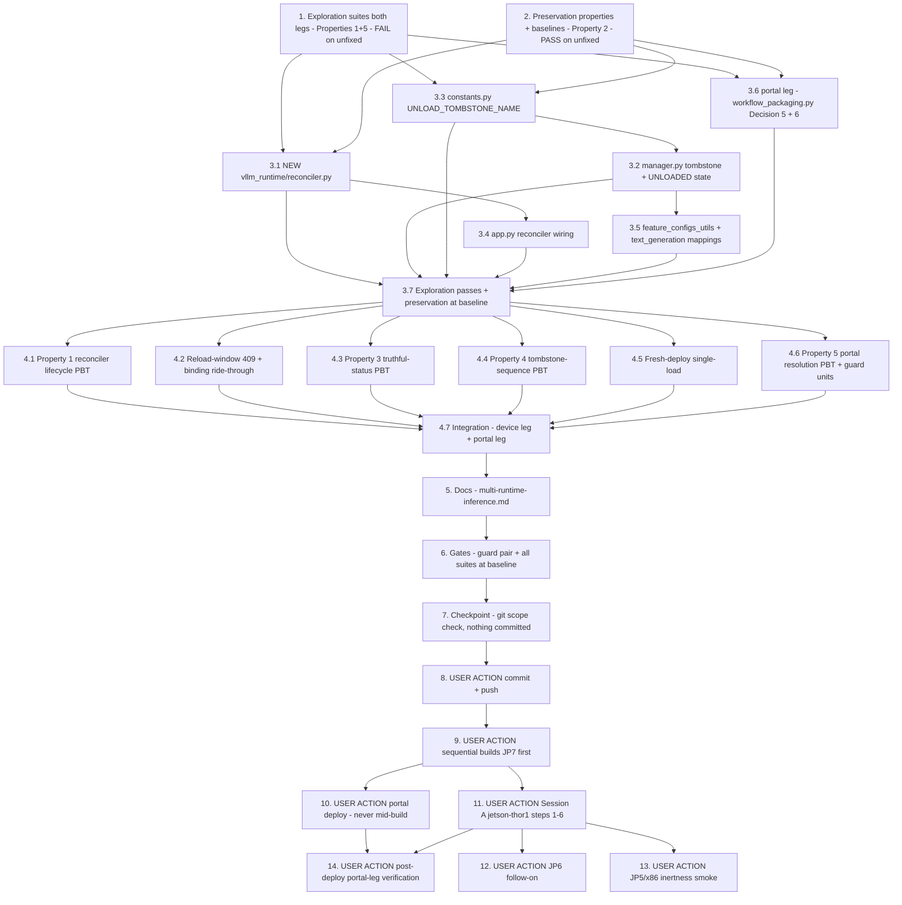

# Implementation Plan

## Overview

Make a LocalServer backend restart survivable for loaded vLLM models, and stop
the portal from packaging the arch-agnostic vLLM model dependency that dragged
a wrong-arch LocalServer lineage onto jetson-thor1. The incident (2026-08-16,
verified live-device evidence): qwen3-vl-8b-instruct loaded READY once
(21:52:32Z, KV cache 37.20 GiB), five awscrt-abort backend kills later the
22:33:11Z backend was healthy with `gpuActiveModels: 0, models: {}` — the
component RUNNING, the feature-config API "LOADING" forever, every generate
409 forever, workflow LLM nodes failing terminally after the 240 s poll
budget, until a HUMAN restarted the model component (bugfix.md Amendment A4).
The defect is structural: the vLLM load is a ONE-SHOT action in the model
component's Startup (`vllm_model_prep.py` stage → `POST /load`); the loaded
engine lives in the backend process (`VllmRuntimeManager`, recreated EMPTY by
`app.py::start_vllm_runtime()` on every start); nothing ever scans
`VLLM_MODEL_DIR` and re-issues the load. Two independent fix legs per
design.md:

1. **Device leg (the core — 2.1/2.2/2.3/2.4, 3.5)** — NEW
   `Vllm_Reconciler` (`src/backend/vllm_runtime/reconciler.py`), one daemon
   thread started by `start_vllm_runtime()` after the runtime server is up:
   ONE snapshot of STAGED, non-tombstoned models at backend start, then a
   SEQUENTIAL re-drive of each load through the SAME loopback model-control
   endpoint the component Startup uses
   (`POST http://127.0.0.1:{VLLM_RUNTIME_PORT}/v2/repository/models/{m}/load`
   — the Decision 1 invariant: NEVER `manager.load()` directly, so engine
   construction stays on the runtime server's event loop and concurrent
   loads serialize to exactly ONE engine construction), bounded retries
   `RECONCILE_RETRY_BACKOFF_SECONDS = (30, 120, 480)` with the validated
   KV-OOM single unload→reload recovery per attempt, exhaustion → FAILED
   with the retained reason + one prominent ERROR (never a retry storm,
   3.2). An explicit unload writes an `Unload_Tombstone`
   (`VLLM_MODEL_DIR/{model}/.dda_explicit_unload`, Decision 2) that
   suppresses reconciliation until an explicit load or the component
   Startup's atomic re-stage clears it. Status surfaces become truthful
   (Decision 3): new reporting-only `ModelState.UNLOADED` for
   staged-but-tombstoned models → `_VLLM_STATUS_MAP` "STOPPED" /
   `_STATE_CATEGORY` "unloaded"; STAGED→"LOADING" is RETAINED because the
   reconciler makes it true by construction.
2. **Portal leg (1.6/2.6, 3.9)** — `workflow_packaging.py`'s
   `resolve_model_components` drops the vLLM singular-map short-circuit
   (which hands the UNSUFFIXED base name `model-vllm-{safe_model_name}`
   verbatim to the dependency emitter) and resolves vLLM references
   per-architecture through the record's platform-suffixed
   Per_JetPack_Component evidence (Decision 5: primary
   `published_component['components']` matched on `architecture`; secondary
   plural `published_components` matched on the PRIMARY publish-target id;
   fail closed naming model + uncovered arch(s); the base name NEVER
   emitted; resolved value = a SET of suffixed names so the vision Defect
   F/G disciplines apply unchanged). Plus the Decision 6 defense-in-depth
   arch-contradiction guard: refuse packaging when a resolved model
   component's recipe HARD-depends on a LocalServer variant serving none of
   the selected architectures; warn-and-proceed on guard READ failure.

**Honesty guard.** No host test in this plan loads a real vLLM engine,
touches a GPU, restarts a real container, drives real Greengrass lifecycles,
or talks to the real account. Device-leg tests SIMULATE the engine via the
manager's injectable `engine_factory` (recording fakes), build staged repos
in temp `VLLM_MODEL_DIR` trees (`tmp_path`), run a REAL `VllmRuntimeServer`
on an ephemeral port where the reconciler's HTTP path is exercised (FastAPI
`TestClient` elsewhere), and model a "backend restart" as tearing down and
reconstructing manager + server + reconciler over the surviving directory
tree. Portal-leg tests run on the moto `aws_stack` conftest fixture. The
real claims — a genuine `AsyncLLMEngine` reconstructing on the post-restart
GPU, real docker/compose restarts and awscrt-abort recovery, component
Startup racing the reconciler under a real deployment, shadow/IPC status
propagation, the workflow binding riding a real ~60 s reload, JP6 parity,
JP5/x86 inertness on real images, and the re-packaged workflow's closure in
the real account — are ONLY provable on hardware/in the account and are
assigned to the USER ACTION tasks (8-14) per the design's Honesty Guard. Do
not write a test that pretends to exercise CUDA, container lifecycles, or
real Greengrass.

**Non-goal guards.** Explicitly NOT changed (design "Explicitly NOT
changed"): `src/backend/dda_triton/vllm_model_prep.py` (3.1/3.7 — its
`LOAD_UNREACHABLE` "stays staged for the next LocalServer start" diagnostic
becomes TRUE via this fix; hash-pinned in task 2), `vllm_runtime/
repository.py`, `vllm_runtime/server.py` (all routes/mappings untouched —
the reconciler is a CLIENT of the existing load endpoint),
`workflow_engine/output_bindings.py` (the 240 s poll now rides a real
reload), `model_convertor.py` and every vision-Triton file (3.3), all
recipes and `greengrass_publish.py` (the unsuffixed GSI key STAYS for
legacy readers — only the packaging CONSUMER stops depending on it),
`deployments.py`, `src/docker-compose.yaml`, all Dockerfiles,
`src/backend/requirements.txt` (no new dependencies). **No
preservation-tracked file is touched → no security-baseline rebaselines**
(task 6 verifies the claim rather than assuming it). The device-side
port-conflict diagnostic (1.5/2.5) is NOT implemented — Decision 4 records
the scope disposition and the recommended future shape; the awscrt refcount
abort stays out of scope (it is the restart TRIGGER the reconciler makes
survivable, not the defect). Exactly ONE conscious pinned-suite update in
this whole spec: the old-contract legs of
`edge-cv-portal/backend/tests/test_workflow_packaging_vllm_resolution_preservation.py`
(edge-deploy-reliability Property 14) pin the exact singular short-circuit
that Decision 5 removes and requirement 2.6 forbids ("resolves … to exactly
`{model_name: published map}`", base-name dependency emission) — those legs
are consciously repointed to the 2.6 contract in task 3.6 with the old
assertions recorded first in task 2, never weakened or deleted; every leg
outside the singular-resolution contract (missing-record error, plugin/
LocalServer emission stability) must keep passing unmodified. **Do not
commit anything in this dispatch** (task 8 is the USER-ACTION commit+push).

Test commands (design Testing Strategy, verbatim):
- Device-side suites run host-side in the portal venv from the repo root
  (the flask-app image is not on this host — the established caveat; the
  container gate runs at build time):
  `source /home/ubuntu/.venvs/dda-portal-tests/bin/activate` then
  `PYTHONPATH=src/backend:test/backend-test python3 -m pytest test/backend-test/vllm_model_reload -q -p no:cacheprovider --noconftest`
- The existing pinned device suites (`test/backend-test/vllm_runtime`,
  `test/backend-test/vllm_runtime_tests`, `test/backend-test/text_generation`,
  `test/backend-test/deploy_reliability`, the `workflow_engine` LLM-binding
  tests) run the same way and must stay green untouched
- Portal suites run from `edge-cv-portal/backend` in the same venv WITH
  conftest (moto `aws_stack` fixture; Hypothesis profiles `portal-fast`/`ci`
  are conftest-registered — do NOT hardcode `max_examples`; do NOT pass
  `--noconftest`):
  `python3 -m pytest tests/test_vllm_workflow_arch_dependency_exploration.py tests/test_vllm_workflow_arch_dependency_properties.py tests/test_vllm_workflow_arch_dependency_units.py -q -p no:cacheprovider`
- Hypothesis property tests use `test_property_*.py` naming device-side with
  `# Validates: Requirements …` comments and no hardcoded `max_examples`
- The security guard pair runs host-side (expected untouched-green — this
  spec edits no preservation-tracked file):
  `python3 -m pytest test/backend-test/security/preservation/test_preservation_out_of_scope_guard.py test/backend-test/security/preservation/test_preservation_secrets_out_of_scope_guard.py -p no:cacheprovider --noconftest -q`

New files this plan creates:
- `src/backend/vllm_runtime/reconciler.py` (the fix — design File 1)
- `test/backend-test/vllm_model_reload/fakes.py` (suite-shared: recording
  fake engine factory, staged-repo tree builder, restart harness)
- `test/backend-test/vllm_model_reload/test_exploration_vllm_model_reload.py`
- `test/backend-test/vllm_model_reload/test_preservation_vllm_model_reload.py`
- `test/backend-test/vllm_model_reload/test_property_vllm_reload_preservation.py`
- `test/backend-test/vllm_model_reload/test_property_reconciler_lifecycle.py`
- `test/backend-test/vllm_model_reload/test_fixcheck_reload_window.py`
- `test/backend-test/vllm_model_reload/test_property_truthful_status.py`
- `test/backend-test/vllm_model_reload/test_property_tombstone_semantics.py`
- `test/backend-test/vllm_model_reload/test_fixcheck_fresh_deploy_single_load.py`
- `test/backend-test/vllm_model_reload/test_integration_vllm_model_reload.py`
- `edge-cv-portal/backend/tests/test_vllm_workflow_arch_dependency_exploration.py`
- `edge-cv-portal/backend/tests/test_vllm_workflow_arch_dependency_properties.py`
- `edge-cv-portal/backend/tests/test_vllm_workflow_arch_dependency_units.py`

## Notes

- Source-tree changes (design Fix Implementation Files 1-7): NEW
  `src/backend/vllm_runtime/reconciler.py` (File 1),
  `src/backend/vllm_runtime/manager.py` (File 2 — `ModelState.UNLOADED`,
  tombstone helpers, `load()` clears / `unload()` best-effort writes the
  marker), `src/backend/vllm_runtime/constants.py` (File 3 —
  `UNLOAD_TOMBSTONE_NAME = ".dda_explicit_unload"`),
  `src/backend/app.py` (File 4 — reconciler construction+start inside
  `start_vllm_runtime()`'s existing try containment),
  `src/backend/utils/feature_configs_utils.py` +
  `src/backend/endpoints/text_generation.py` (Files 5+6 — one additive
  mapping each, combined in task 3.5),
  `edge-cv-portal/backend/functions/workflow_packaging.py` (File 7 —
  Decision 5 resolution + Decision 6 guard), plus docs (task 5)
- Reconciler contract (Decision 1): one daemon thread named
  `vllm-reconciler`; ONE candidate snapshot at start (STAGED, sorted by
  name; UNLOADED/LOADING/READY/FAILED-tracked excluded); re-checks
  `manager.state()` right before each POST and skips LOADING/READY;
  `requests` against `127.0.0.1:{port}` (existing dependency, no `vllm`
  imports — package convention); per-model try/except (one model's failure
  never stops the scan); entire thread body contained (a reconciler crash
  never touches the backend); injectable `request_fn` for tests
- Tombstone contract (Decision 2): written by `unload()` only when the repo
  is still staged, best-effort (write failure logs, unload still succeeds —
  3.5 is categorical); cleared first-thing by `load()`; cleared for free by
  the component Startup's atomic re-stage (`shutil.rmtree` + `os.rename`
  replaces the directory wholesale — ZERO `vllm_model_prep.py` changes);
  `--cleanup` removes directory + marker (no litter); KV-OOM
  unload→immediate-load recovery interleaving is net-neutral;
  `parse_repository()` tolerates the extra file (verified in design)
- Decision 7 inertness: the reconciler is imported and constructed ONLY
  inside `start_vllm_runtime()`'s try block after the `VLLM_AVAILABLE`
  early return — vLLM-free images (JP5 default, x86) get the byte-identical
  pre-feature startup sequence, no new env knobs, no module-scope side
  effects
- Decision 6 guard is fail-open on READ failures only (throttle/transient
  `get_component` error → warn and proceed; no LocalServer dep in the
  recipe → pass with warning); the CONTRADICTION case always refuses —
  Decision 5 already guarantees suffixed names, so a missed guard check
  degrades to exactly the post-Decision-5 baseline
- builds.md is binding throughout: one component build at a time (`pgrep
  -af "gdk component build"` / `pgrep -af "build-custom.sh"` before
  dispatching), security guard pair green BEFORE any build, `cdk.out` moved
  aside, **never a portal deploy while a component build runs** (task 10 is
  sequenced strictly after task 9), JP7 first (jetson-thor1 is the
  verification device), on-hardware verification before an on-device change
  is "done"
- Tasks 8-14 are USER ACTIONs (commit+push, builds, portal deploy, device
  sessions, account verification); the agent prepares and verifies
  everything else host-side
- Branch context: `spec/jetpack7-support` at the `integration/all-specs`
  tip; nothing is committed by tasks 1-7

## Task Dependency Graph

```json
{
  "waves": [
    { "wave": 1, "description": "Exploration + preservation on the UNFIXED tree: exploration surfaces the counterexamples for both defect legs (device cases 1-4 + portal case 5 FAIL expected); preservation hash-pins vllm_model_prep.py, records the manager/state/status/inertness/constants identities and the 3.9 packaging identity, and baselines the existing pinned suites green with recorded counts (PASS required).", "tasks": ["1", "2"] },
    { "wave": 2, "description": "The fix, per design Fix Implementation Files 1-7: the NEW reconciler, the manager tombstone + UNLOADED state, the tombstone constant, the app.py wiring, the two additive status mappings, the portal per-arch resolution + arch-contradiction guard (with the ONE conscious pinned-suite update).", "tasks": ["3.1", "3.2", "3.3", "3.4", "3.5", "3.6"] },
    { "wave": 3, "description": "Verify: the exploration suites (both legs) now pass on the fixed tree; the preservation suites still pass at baseline counts (only intended diff = the recorded resolution-preservation repoint).", "tasks": ["3.7"] },
    { "wave": 4, "description": "Fix-checking suites per design Testing Strategy: reconciler lifecycle PBT (Property 1), reload-window 409 + binding ride-through (2.2), truthful-status PBT (Property 3), tombstone-sequence PBT (Property 4), fresh-deploy single-load (3.1), portal resolution PBT (Property 5) + guard units, then the device-leg and portal-leg integration passes.", "tasks": ["4.1", "4.2", "4.3", "4.4", "4.5", "4.6", "4.7"] },
    { "wave": 5, "description": "Documentation: docs/multi-runtime-inference.md gains the reconciler + tombstone lifecycle subsection; statements invalidated (or made true) by the fix are corrected; on-hardware vLLM validation docs checked conditionally.", "tasks": ["5"] },
    { "wave": 6, "description": "Gates: security guard pair + verify the no-rebaseline claim, full device-side suite, existing pinned device suites at baseline counts, portal suites WITH conftest at baseline counts; then checkpoint with git scope check (NOTHING committed).", "tasks": ["6", "7"] },
    { "wave": 7, "description": "USER ACTION: commit + push (branch spec/jetpack7-support).", "tasks": ["8"] },
    { "wave": 8, "description": "USER ACTION: pre-build gate + sequential component builds JP7-first per builds.md; portal deploy of the packaging leg STRICTLY after all builds finish (never mid-build).", "tasks": ["9", "10"] },
    { "wave": 9, "description": "USER ACTION: Session A on jetson-thor1 (design steps 1-6), JP6 follow-on, JP5/x86 inertness smoke, post-deploy portal-leg verification (re-package + closure check).", "tasks": ["11", "12", "13", "14"] }
  ]
}
```



## Tasks

- [x] 1. Write bug condition exploration test suites (BOTH legs)
  - **Property 1: Bug Condition** - A Backend Restart Never Silently Orphans a Staged vLLM Model (device leg) + **Property 5 exploration form** (portal leg)
  - **CRITICAL**: All five cases MUST FAIL on unfixed code - failure confirms the bug condition exists
  - **DO NOT attempt to fix the tests or the code when they fail**
  - **NOTE**: These suites encode the expected behavior - they validate the fix when they pass after implementation (task 3.7)
  - **GOAL**: Surface counterexamples for defects 1.1/1.3/1.4 (device) and 1.6 (portal) on the UNFIXED tree - every check is host-runnable and GPU-free (honesty guard: fake engine factory, temp `VLLM_MODEL_DIR` trees, restart = object reconstruction; moto for the portal leg; no real engine/container/account)
  - Device leg - create `test/backend-test/vllm_model_reload/fakes.py` (recording fake `engine_factory` for the manager's injectable seam; a staged-repo tree builder writing valid `config.pbtxt` (backend vllm) + `1/model.json` layouts under `tmp_path`; the "restarted backend" harness = fresh `VllmRuntimeManager` over the surviving tree + real `VllmRuntimeServer` on an ephemeral port + — on the fixed tree — `VllmReconciler`) and `test_exploration_vllm_model_reload.py`:
  - Case 1 - **The orphaned-model core (defect 1.1)**: build a staged repo tree; run the restarted-backend harness with the recording factory; assert a load is driven to READY. FAILS on unfixed code (the fresh manager holds zero models, zero factory calls, state stays STAGED forever - the `gpuActiveModels: 0, models: {}` fingerprint)
  - Case 2 - **409 forever (defect 1.3)**: same harness; generate against the staged model; assert it eventually serves. FAILS on unfixed code (409 on every request with no load in flight - no lazy load exists, `_ready_engine` raises for any non-READY model)
  - Case 3 - **Eternal LOADING (defect 1.4)**: `get_features_vllm()` over the restarted-backend manager; assert the model does not report "LOADING" indefinitely while no load is in flight (it reaches READY/FAILED within the harness budget). FAILS on unfixed code ("LOADING" on every read, forever - the broken `_VLLM_STATUS_MAP` STAGED→LOADING assumption)
  - Case 4 - **No reconciliation module exists**: `vllm_runtime.reconciler` imports and `start_vllm_runtime` wires it (source/structural check on `app.py`). FAILS on unfixed code (module absent)
  - Portal leg - create `edge-cv-portal/backend/tests/test_vllm_workflow_arch_dependency_exploration.py` (moto `aws_stack` conftest fixture, the `test_vllm_multi_arch_publish_*` seeding conventions):
  - Case 5 - **Unsuffixed base-name dependency (defect 1.6)**: seed registry records in the INCIDENT shape - (a) legacy record whose singular `published_component.component_name` is the unsuffixed base name only, (b) modern record whose singular map carries the unsuffixed name PLUS suffixed `components` entries; resolve for `['arm64_jp7']` and emit dependencies; assert the emitted dependency set contains ONLY platform-suffixed names (or fails closed for the legacy record). FAILS on unfixed code (the base name is emitted verbatim - the counterexample is the incident's exact HARD dependency `model-vllm-qwen3-vl-8b-instruct >=0.0.0`, which dragged LocalServer.arm64JP6 1.0.59 onto the JP7 Thor)
  - Run device leg host-side (`--noconftest`, `PYTHONPATH=src/backend:test/backend-test`, `-p no:cacheprovider`); run portal leg from `edge-cv-portal/backend` WITH conftest
  - **EXPECTED OUTCOME**: All five cases FAIL (this is correct - it proves both defect legs exist)
  - Document the counterexamples found: the empty `_models` table + zero load requests after "restart"; the unbounded 409/"LOADING" pair; the absent reconciler; the unsuffixed dependency entry
  - Mark complete when the suites are written, run, and the failures are documented
  - **OUTCOME (2026-08-17, UNFIXED tree)**: All five cases FAIL as expected — both defect legs confirmed. Device leg (`test/backend-test/vllm_model_reload/test_exploration_vllm_model_reload.py`, host-side `--noconftest`, `4 failed in 10.05s`); portal leg (`edge-cv-portal/backend/tests/test_vllm_workflow_arch_dependency_exploration.py`, WITH conftest/moto, `2 failed in 0.69s`). The manager's injectable `engine_factory` seam was verified in `manager.py` (constructor kwarg, documented as the test seam) and the fakes use it directly. Counterexamples, verbatim from the runs:
    - Case 1 (defect 1.1): "after the backend restart NO load was re-issued for the still-staged model 'qwen3-vl-8b-instruct' — engine_factory calls in the restarted backend: 0, state after 3.0s budget: STAGED, list_models(): {'qwen3-vl-8b-instruct': 'STAGED'}" — the empty `_models` table + zero load requests after "restart" (the jetson-thor1 22:33:11Z `gpuActiveModels: 0, models: {}` fingerprint)
    - Case 2 (defect 1.3): "generate against the staged model 'qwen3-vl-8b-instruct' never served within the 3.0s budget — 58 attempts, every one answered HTTP 409 (last body: {\"error\":\"model 'qwen3-vl-8b-instruct' is not ready (state: STAGED)\",\"name\":\"qwen3-vl-8b-instruct\",\"state\":\"STAGED\"}), while NO load was in flight (engine_factory calls: 0)"
    - Case 3 (defect 1.4): "get_features_vllm() reported ['LOADING'] for the staged model 'qwen3-vl-8b-instruct' on every one of 60 reads across the 3.0s budget while NO load was in flight (engine_factory calls: 0)" — the unbounded 409/"LOADING" pair with case 2
    - Case 4 (structural): "importing vllm_runtime.reconciler failed (No module named 'vllm_runtime.reconciler')" — the reconciliation module is absent
    - Case 5a (defect 1.6, legacy record): "the legacy unsuffixed-only record did NOT fail closed for ['arm64_jp7'] — resolve_model_components short-circuited on the singular published_component map and model_component_dependencies emitted the arch-agnostic base name verbatim: {'model-vllm-qwen3-vl-8b-instruct': {'VersionRequirement': '>=0.0.0', 'DependencyType': 'HARD'}}" — the incident's exact HARD dependency
    - Case 5b (defect 1.6, modern record): "workflow packaging emitted non-platform-suffixed vLLM model dependency name(s) ['model-vllm-qwen3-vl-8b-instruct'] for archs ['arm64_jp7'] ... even though the platform-suffixed Per_JetPack_Component evidence ('model-vllm-qwen3-vl-8b-instruct-jetson-xavier-jp7') is present in the same record"
  - _Requirements: 1.1, 1.3, 1.4, 1.6_

- [x] 2. Write preservation property tests (BEFORE implementing the fix)
  - **Property 2: Preservation** - Everything Outside the Bug Condition Is Unchanged
  - **IMPORTANT**: Follow observation-first methodology - observe the UNFIXED behavior, record it as baselines/pins/reference outputs, then encode it as properties that PASS on the unfixed tree and must keep passing
  - Create `test/backend-test/vllm_model_reload/test_preservation_vllm_model_reload.py` and `test_property_vllm_reload_preservation.py` (Hypothesis, no hardcoded `max_examples`, `# Validates: Requirements …` comments; example-style pins may live in the first file), plus the portal-leg 3.9 identity property in `edge-cv-portal/backend/tests/test_vllm_workflow_arch_dependency_properties.py` (it grows the fix-check properties at 4.6 - the preservation property lands NOW and passes on unfixed)
  - Observe on UNFIXED code and encode:
    - **`vllm_model_prep.py` hash pin (3.1, 3.7)**: record the file's sha256 verbatim and pin it - the strongest available statement that first-deploy Startup semantics (validation → exit 1, `LOAD_UNREACHABLE` → exit 1 + diagnostic, `LOAD_HTTP_ERROR` → exit 1 + authoritative log, KV-OOM single unload→reload recovery, atomic staging) cannot have changed; the file is explicitly NOT modified by this spec
    - **Manager state-machine identity (3.2), PBT**: _for any_ load/unload/fail sequence WITHOUT tombstones (fake factory: success / raise / fail-then-succeed), fixed `state()`/`list_models()` outputs deep-equal the unfixed behavior recorded as a reference at task-2 time (UNLOADED is unreachable without a tombstone); per-model failure isolation (one model's FAILED never touches another's READY) pinned
    - **Unload identity (3.5)**: return values and engine-freeing behavior for tracked/untracked/READY/FAILED models recorded and pinned - after the fix only the marker file is new
    - **Status payload identity (3.4), PBT**: _for any_ manager model set without tombstones, `get_features_vllm()` output deep-equals the unfixed reference (FAILED reason retention included); the `_VLLM_STATUS_MAP`/`_STATE_CATEGORY` additions must be pure additions - encode as dict-subset assertions (existing keys byte-identical)
    - **vLLM-free inertness (3.6)**: with `VLLM_AVAILABLE` forced false, `start_vllm_runtime()` returns None with no reconciler import executed (`vllm_runtime.reconciler` absent from `sys.modules`) and no thread named `vllm-reconciler` (skip-as-absent where it references the fixed-tree module name; binds at 3.7)
    - **Constants/bind identity (3.8)**: `VLLM_RUNTIME_HOST`/`VLLM_RUNTIME_PORT` values and `VllmRuntimeServer` bind arguments pinned unchanged
    - **Portal 3.9 identity, PBT**: _for any_ vision-only, plugin-only, or model-free workflow input (generated record shapes and arch selections over the real field vocabulary), fixed `resolve_model_components` + `model_component_dependencies` output deep-equals a pinned reference of the unfixed behavior (Defect F omission-with-warning, Defect G fail-closed coverage, `dda.plugin.*` pinning, LocalServer single-variant discipline)
    - **Existing pinned suites untouched-green - record the counts**: device-side `test/backend-test/vllm_runtime`, `vllm_runtime_tests`, `text_generation`, `deploy_reliability` (the prep classification suites), and the `workflow_engine` LLM-binding tests; portal-side `tests/test_vllm_multi_arch_publish_exploration.py` / `_properties.py` / `_units.py` / `_integration.py`, the vision packaging suites (`test_vision_model_packaging_exploration.py`, `test_vision_model_packaging_preservation.py`, `test_workflow_packaging_vision_resolution_exploration.py`), `test_workflow_packaging_dependencies_exploration.py`, `test_workflow_packaging_localserver_preservation.py`, and `test_property_vllm_packaging_preservation.py`
    - **The ONE expected pinned-suite casualty, recorded honestly**: run `tests/test_workflow_packaging_vllm_resolution_preservation.py` on the UNFIXED tree, record its count AND record verbatim WHICH of its assertions pin the singular short-circuit contract that requirement 2.6 forbids (singular-map verbatim resolution; base-name dependency emission; possibly the genuinely-unpublished error message for empty-singular shapes) - task 3.6 repoints exactly those legs to the 2.6 contract and NOTHING else; recording them now makes the 3.6 diff auditable
  - Run device leg host-side (`--noconftest`); portal legs from `edge-cv-portal/backend` WITH conftest
  - **EXPECTED OUTCOME**: Tests PASS on UNFIXED code (this confirms the baseline behavior to preserve); skip-as-absent legs SKIP
  - Mark complete when the tests are written, run, and passing on unfixed code with the baseline counts, the prep hash, and the resolution-preservation contract legs recorded
  - **OUTCOME (2026-08-17, UNFIXED tree, branch spec/jetpack7-support)**: all preservation suites PASS on unfixed code; skip-as-absent leg SKIPS as designed. NEW suites: `test/backend-test/vllm_model_reload/test_preservation_vllm_model_reload.py` = **13 passed, 1 skipped** (the skip = `test_reconciler_module_import_has_no_side_effects`, skip-as-absent on `vllm_runtime.reconciler`; binds at 3.7); `test_property_vllm_reload_preservation.py` = **2 passed** (manager state-machine identity PBT + status payload identity PBT); portal `tests/test_vllm_workflow_arch_dependency_properties.py` = **6 passed** (3.9 identity: vision per-target resolution + Defect F emission PBT, Defect G coverage PBT, model-free, plugin pinning PBT, 2 LocalServer light goldens). **Prep hash pinned**: `src/backend/dda_triton/vllm_model_prep.py` sha256 = `9f3b148a19c9f91e2bdd389428437246deabf8d533c08c0477951f196f7271b9`. **Baseline counts, existing pinned device suites (host-side venv, `--noconftest`)**: `vllm_runtime` = 28 passed; `vllm_runtime_tests` = 1 passed; `text_generation` = 15 passed; `deploy_reliability` = 72 passed; `workflow_engine` LLM-binding tests (test_llm_anomaly_mode, test_llm_executor_wiring, test_llm_reference_attachment, test_property_llm_image_attachment, test_property_llm_image_behavior_invariance, test_workflow_llm_inference, test_workflow_llm_prompt) = 42 passed. **Baseline counts, portal pinned suites (from edge-cv-portal/backend WITH conftest)**: test_vllm_multi_arch_publish_exploration = 7; _properties = 12; _units = 23; _integration = 3; test_vision_model_packaging_exploration = 3; test_vision_model_packaging_preservation = 9; test_workflow_packaging_vision_resolution_exploration = 4; test_workflow_packaging_dependencies_exploration = 2; test_workflow_packaging_localserver_preservation = 10; test_property_vllm_packaging_preservation = 1 (all passed). **The ONE expected pinned-suite casualty recorded**: `tests/test_workflow_packaging_vllm_resolution_preservation.py` = **9 passed** on the unfixed tree; the legs pinning the singular short-circuit contract that requirement 2.6 forbids (to be repointed at 3.6 and NOTHING else): (1) `TestSingularVllmResolutionPreserved.test_singular_records_resolve_to_todays_exact_output` — `assert resolved == expected` with `expected[model_name] = published` (the seeded singular map): singular-map verbatim resolution ("resolves ... to exactly `{model_name: published map}`") for ANY arch selection; (2) `TestDependencyEmissionPreserved.test_model_dependencies_for_resolved_singular_records_stable` — `assert out == expected` with `expected = {component_name: {'VersionRequirement': '>=0.0.0', 'DependencyType': 'HARD'}}` where component_name is the UNSUFFIXED `model-vllm-{slug}` base name (base-name dependency emission 2.6 forbids); (3) possibly `TestGenuinelyUnpublishedGatePreserved`'s empty-singular parametrizations `singular-map-without-component-name` (`{"published_component": {}}`), `singular-map-with-empty-component-name` (`{"published_component": {"component_name": ""}}`) and `empty-plural-list-no-singular`, which pin `UNPUBLISHED_MESSAGE = "no published Greengrass component"` for shapes the 2.6 fail-closed naming may reclassify. Legs that must keep passing UNMODIFIED after 3.6: `TestNoRecordGatePreserved` ("no record in the Use_Case model registry"), the `no-published-fields-at-all` unpublished shape, and the plugin/LocalServer golden checks in `TestDependencyEmissionPreserved`. The same record is embedded in the header of `tests/test_vllm_workflow_arch_dependency_properties.py` for 3.6 auditability. Nothing committed.
  - _Requirements: 3.1, 3.2, 3.3, 3.4, 3.5, 3.6, 3.7, 3.8, 3.9_

- [x] 3. Fix: reconcile staged vLLM models after backend restart, honor explicit unloads, make status truthful, and emit only platform-suffixed portal dependencies (design "Fix Implementation" Files 1-7)

  - [x] 3.1 Create `src/backend/vllm_runtime/reconciler.py` (design File 1 - NEW; the core)
    - `RECONCILE_RETRY_BACKOFF_SECONDS = (30, 120, 480)` module constant (4 attempts total, ~10.5 min worst case, docstring naming the churn-window rationale and 3.2's bounded-retry requirement)
    - `class VllmReconciler(manager, port=VLLM_RUNTIME_PORT, backoff=RECONCILE_RETRY_BACKOFF_SECONDS, request_fn=None)` - `request_fn` injectable for tests; class docstring states the Decision 1 INVARIANT verbatim: every load is issued through the loopback model-control endpoint, never `manager.load()` directly, so engine construction happens on the runtime server's event loop and all load requests serialize there
    - `start()`: daemon `Thread(name="vllm-reconciler", target=self._run)`; the ENTIRE body try/except-contained - a reconciler failure is logged and never touches the backend or the runtime server (the `start_vllm_runtime` containment convention)
    - `_candidates()`: ONE snapshot - `manager.list_models()` entries in STAGED state (UNLOADED/tombstoned entries already excluded by the manager per Decision 3), sorted by name for deterministic sequential order
    - `_reconcile_one(model_name)`: re-check `manager.state()` right before the POST and skip LOADING/READY (component Startup got there first - the fresh-deploy case); `POST /v2/repository/models/{m}/load` with a `LOAD_REQUEST_TIMEOUT_SECONDS`-class timeout; 200 → done; authoritative failure → KV-OOM markers? → one unload→reload recovery cycle per attempt (mirrors `vllm_model_prep.request_load`'s marker-driven cycle, validated on-device); retry over the backoff schedule; exhausted → one prominent ERROR naming the model, the retained reason, and that automatic retries are exhausted (state stays FAILED - truthful, 2.3); per-model try/except so one model's failure never stops the scan (3.2)
    - Uses `requests` (existing backend dependency) against `127.0.0.1:{port}`; imports nothing from `vllm` (package convention); no module-scope side effects
    - Verify: module imports host-side; exploration case 4's module-existence leg flips
    - **OUTCOME (2026-08-17, branch spec/jetpack7-support)**: `src/backend/vllm_runtime/reconciler.py` created per design File 1. `RECONCILE_RETRY_BACKOFF_SECONDS = (30, 120, 480)` (4 attempts total, churn-window rationale + 3.2 in the docstring); `VllmReconciler(manager, port=VLLM_RUNTIME_PORT, backoff=RECONCILE_RETRY_BACKOFF_SECONDS, request_fn=None)` with the Decision 1 invariant verbatim in the class docstring; `start()` = daemon `Thread(name="vllm-reconciler")`, entire `_run` body try/except-contained; `_candidates()` = ONE `manager.list_models()` snapshot filtered to STAGED, sorted by name; `_reconcile_one()` re-checks `manager.state()` before each POST (skips LOADING/READY), POSTs `/v2/repository/models/{m}/load` with `LOAD_REQUEST_TIMEOUT_SECONDS = 1500` (mirroring prep), applies the KV-OOM single unload→reload recovery per attempt using `KV_CACHE_HINT_MARKERS` and `_extract_load_failure_reason` mirrored VERBATIM from `vllm_model_prep.py` (that module is not imported — it configures logging at import time; a sync comment pins the pairing), exhaustion → one prominent ERROR with the retained `manager.state().reason`; per-model try/except in `_run`. Uses `requests` only; zero `vllm` imports; no module-scope side effects. Verified host-side (venv dda-portal-tests, `PYTHONPATH=src/backend:test/backend-test`): `import vllm_runtime.reconciler` clean, no new threads on import; task-2 preservation leg `test_reconciler_module_import_has_no_side_effects` now BINDS and PASSES (TestVllmFreeInertness 2 passed; full preservation pair 16 passed — the former skip now a pass); exploration case 4's module-existence leg FLIPPED (import succeeds) — its wiring leg still fails on `app.py` as expected until task 3.4. Constructor signature confirmed compatible with `fakes.maybe_start_reconciler` (injects `port`/`backoff` kwargs). Nothing committed.
    - _Bug_Condition: isBugCondition(X) - staged repo present, component RUNNING, backend restarted, `NOT X.load_reissued` (defects 1.1, 1.3)_
    - _Expected_Behavior: Property 1 - a load is re-issued for EVERY staged, desired model after restart, driving each to READY or FAILED-with-retained-reason; bounded, sequential, isolated_
    - _Preservation: Property 2 - byte-identical load semantics (the endpoint path IS the component Startup's path); no manager changes required by this file; bounded retries never a storm (3.2)_
    - _Requirements: 2.1, 2.2, 3.2_

  - [x] 3.2 Manager: tombstone semantics + reporting-only `UNLOADED` state (design File 2; Decisions 2-3)
    - Edit `src/backend/vllm_runtime/manager.py`: `ModelState.UNLOADED = "UNLOADED"` (reporting-only - NO transition logic changes; derived from disk state exactly the way STAGED already is)
    - Private helpers: `_tombstone_path(model_name)` (`self.model_dir / model_name / UNLOAD_TOMBSTONE_NAME`), `_tombstoned(model_name) -> bool` (corrupt/unreadable marker still counts as tombstoned - content is triage-only JSON with a UTC timestamp), `_clear_tombstone(model_name)` (best-effort)
    - `state()` / `list_models()`: where a staged, untracked repo today reports STAGED, report `UNLOADED` when tombstoned; `_ready_engine()`'s synthesized non-READY status likewise
    - `load()`: FIRST action, best-effort `_clear_tombstone(model_name)` (an explicit load re-arms reconciliation; removal failure logs and proceeds)
    - `unload()`: AFTER the existing engine shutdown/reclaim, best-effort tombstone write when `_repository_staged(model_name)` - wrapped so ANY filesystem error is logged and the unload return value/semantics stay byte-identical (3.5 is categorical)
    - No other manager change: `_ready_engine`'s no-lazy-load contract, per-model isolation, generate paths, and the STAGED→LOADING→READY|FAILED machine untouched (task 2's identity PBT enforces this)
    - Verify: task-2 manager identity + unload identity legs still pass (no tombstone → byte-identical behavior)
    - **OUTCOME (2026-08-17, branch spec/jetpack7-support)**: `src/backend/vllm_runtime/manager.py` edited per design File 2, nothing else in the file touched. `ModelState.UNLOADED = "UNLOADED"` added with a reporting-only docstring (Decision 3 — derived from disk exactly the way STAGED is, NO transition logic reaches it). Tombstone helpers: `_tombstone_path` = `self.model_dir / model_name / UNLOAD_TOMBSTONE_NAME` (constant from task 3.3); `_tombstoned` = marker EXISTENCE only (content never parsed — corrupt JSON trivially counts; an `OSError` from the probe also answers True, so an unreadable marker still suppresses); `_clear_tombstone` = best-effort `unlink(missing_ok=True)`, `OSError` logged and the caller proceeds; `_write_tombstone` = triage-only JSON (`unloaded_at_utc` UTC timestamp) written only when `_repository_staged`, the ENTIRE write wrapped `except Exception` → `logger.exception`, unload semantics untouched (3.5 categorical). A single `_disk_derived_status(name)` helper (staged+tombstoned → UNLOADED, staged → STAGED, else UNKNOWN) now feeds `state()`, `list_models()`'s disk-scan branch, and `_ready_engine()`'s synthesized non-READY status. `load()`'s FIRST action is `_clear_tombstone` (explicit load re-arms reconciliation); `unload()` writes the tombstone AFTER engine shutdown/reclaim on the tracked path AND on the untracked-but-staged path before its `return False` (Decision 2 rationale: every model-control unload is "stop serving this model" — this is the case that matters after a restart, when the model is staged-untracked; return values byte-identical on both paths). Verified host-side (venv dda-portal-tests, `--noconftest`): preservation pair `test_property_vllm_reload_preservation.py` + `test_preservation_vllm_model_reload.py` = **16 passed** (all unload-identity legs green; the task-2 `getattr(ModelState, "UNLOADED", None)` leg now binds to the real member); existing pinned suites at baseline counts — `vllm_runtime` 28 + `vllm_runtime_tests` 1 + `text_generation` 15 = **44 passed**, `deploy_reliability` = **72 passed**. **ONE task-2 test adjustment, triaged and disclosed**: `test_manager_state_machine_identity_without_tombstones` initially FAILED with counterexample `operations=[('unload', 'model-alpha', None)]` (fixed tree: UNLOADED, reference: STAGED). Triage: test-domain bug, not a code bug — the property's own docstring and design Preservation Checking item 3 scope it to sequences WITHOUT tombstones ("UNLOADED is unreachable without a tombstone"), but its generator emits unload ops that on the fixed tree correctly CREATE tombstones (Decision 2), exiting the declared domain; the changed tombstoned-repo behavior is the bug-condition domain owned by fix-check Properties 3+4 (tasks 4.3/4.4), not preservation. Fix: after each unload op the harness now unlinks the marker (`missing_ok=True`) with a DOMAIN ENFORCEMENT comment — a no-op on the unfixed tree, so the property still pins byte-identical no-tombstone behavior including unload return values; no assertion weakened or deleted. Exploration cases 1-3 still fail as expected until 3.4 wires the reconciler (task 3.7 owns that flip). Nothing committed.
    - _Bug_Condition: defect leg - without the marker, reconciliation could not distinguish "desired" from "explicitly stopped" (2.4/3.5 divergence case)_
    - _Expected_Behavior: Properties 3+4 - staged-but-tombstoned reports UNLOADED; unload always succeeds and frees the engine; load/re-stage re-arm_
    - _Preservation: Property 2 - state machine identity without tombstones; unload return values identical; only the marker file is new (3.2, 3.5)_
    - _Requirements: 2.3, 2.4, 3.5_

  - [x] 3.3 Constants: the tombstone name (design File 3)
    - Edit `src/backend/vllm_runtime/constants.py`: `UNLOAD_TOMBSTONE_NAME = ".dda_explicit_unload"` with a docstring naming this spec and the clears-on-re-stage mechanism (the component Startup's atomic directory replace kills the marker with the old directory - zero `vllm_model_prep.py` changes)
    - `VLLM_RUNTIME_HOST`/`VLLM_RUNTIME_PORT` and everything else in the file untouched (3.8; task 2's constants pin enforces it)
    - **OUTCOME (2026-08-17, branch spec/jetpack7-support)**: `UNLOAD_TOMBSTONE_NAME = ".dda_explicit_unload"` added to `src/backend/vllm_runtime/constants.py` with a `#:` docstring naming the spec (vllm-model-reload-after-backend-restart) and the clears-on-re-stage mechanism (component Startup's atomic directory replace — `shutil.rmtree` + `os.rename` — removes the marker with the old directory; zero `vllm_model_prep.py` changes). `git diff` = 13 insertions, 0 deletions in that file only; everything existing byte-identical. Verified host-side (venv, `--noconftest`): `test_preservation_vllm_model_reload.py::TestConstantsAndBindIdentity` = **3 passed** (the task-2 constants pin holds); `python3 -c "from vllm_runtime.constants import UNLOAD_TOMBSTONE_NAME; print(UNLOAD_TOMBSTONE_NAME)"` → `.dda_explicit_unload`. Nothing committed.
    - _Bug_Condition: supporting change for the tombstone leg_
    - _Expected_Behavior: Property 4 - one shared constant for writer (manager) and any reader_
    - _Preservation: Property 2 - additive constant only; port bindings unchanged (3.8)_
    - _Requirements: 2.4, 3.5, 3.8_

  - [x] 3.4 Wire the reconciler into `start_vllm_runtime()` (design File 4; Decision 7)
    - Edit `src/backend/app.py`: in `start_vllm_runtime()`, AFTER `feature_configs_utils.set_vllm_manager(manager)`, inside the existing `try:` containment: `from vllm_runtime.reconciler import VllmReconciler`; `VllmReconciler(manager).start()`; one INFO line ("vLLM reconciler started (staged-model reload after restart).")
    - The import lives INSIDE the try block after the `VLLM_AVAILABLE` early return - vLLM-free images never import or construct it (Decision 7; the task-2 inertness leg binds here)
    - Return value, health gating (`health.set_vllm_server`), and the `VLLM_AVAILABLE` early return untouched; a reconciler construction/start failure is caught by the existing containment (`[VLLM RUNTIME STARTUP FAILED]` semantics preserved - a dead reconciler never flips the backend unhealthy)
    - Verify: exploration case 4 wiring leg flips; task-2 inertness leg passes (with `VLLM_AVAILABLE` forced false: None returned, no `vllm_runtime.reconciler` in `sys.modules`, no `vllm-reconciler` thread)
    - **OUTCOME (2026-08-17, branch spec/jetpack7-support)**: `src/backend/app.py` edited ONLY (git diff: +10 lines in that file, nothing removed). In `start_vllm_runtime()`, AFTER `feature_configs_utils.set_vllm_manager(manager)` and INSIDE the existing `try:` containment: `from vllm_runtime.reconciler import VllmReconciler`; `VllmReconciler(manager).start()`; INFO line "vLLM reconciler started (staged-model reload after restart)."; a comment pins design File 4 / Decision 7. The import sits after the `VLLM_AVAILABLE` early return so vLLM-free images never import/construct the reconciler; return value, `health.set_vllm_server` gating, and the early return byte-identical; reconciler construction/start failure falls to the existing `[VLLM RUNTIME STARTUP FAILED]` containment. Verified host-side (venv dda-portal-tests, `PYTHONPATH=src/backend:test/backend-test`, `--noconftest -p no:cacheprovider`): exploration `test_case_4_reconciler_module_exists_and_is_wired` FLIPPED to PASS (module imports AND `start_vllm_runtime` source references the reconciler); preservation `TestVllmFreeInertness` = 2 passed (`VLLM_AVAILABLE` forced false → None returned, `vllm_runtime.reconciler` absent from `sys.modules`, no `vllm-reconciler` thread; module import side-effect leg also green). Nothing committed.
    - _Bug_Condition: defect 1.1 - nothing constructs a load driver on backend start_
    - _Expected_Behavior: Property 1 - every backend start runs a fresh scan (the Amendment A3 churn case converges as soon as one load survives)_
    - _Preservation: Property 2 - vLLM-free images byte-identical (3.6); health gating and startup sequence unchanged; no recipe/lifecycle change (3.7)_
    - _Requirements: 2.1, 3.6, 3.7_

  - [x] 3.5 Truthful status mappings (design Files 5+6, combined; Decision 3)
    - Edit `src/backend/utils/feature_configs_utils.py`: `_VLLM_STATUS_MAP` gains `"UNLOADED": "STOPPED"` (reusing the existing device status vocabulary - LFV models already report STOPPED); the STAGED→"LOADING" mapping is RETAINED and its comment corrected to name the reconciler as the guarantee (first deploy: the component Startup's load; after restart: the reconciler's re-drive - bounded time in both cases) instead of the broken "load request is on the way" assumption; `get_features_vllm()` logic unchanged (FAILED reason retention already exists)
    - Edit `src/backend/endpoints/text_generation.py`: `_STATE_CATEGORY` gains `ModelState.UNLOADED.value: "unloaded"` - a generate against an explicitly unloaded model fails fast and truthfully instead of burning the workflow binding's 240 s budget (the binding polls ONLY on "loading"); all other categories unchanged
    - Terminal reload failure needs NO new mapping (the manager's `_fail()` path retains the reason; the reconciler simply stops retrying); the 2.2 reload-window behavior needs NO new code (STAGED/LOADING already map to the "loading" 409 category)
    - Both additions are pure additions - no renames, removals, or type changes (task 2's dict-subset assertions enforce it)
    - Verify: exploration case 3 flips; task-2 status-payload identity still green
    - **OUTCOME (2026-08-17, branch spec/jetpack7-support)**: ONLY the two named files edited (git diff: `feature_configs_utils.py` +13/−3, `text_generation.py` +6/−0 — the deletions are reworded comment lines only; both dicts pure additions). `src/backend/utils/feature_configs_utils.py`: `_VLLM_STATUS_MAP` gains `"UNLOADED": "STOPPED"` (reusing the existing device vocabulary — LFV models already report STOPPED); the STAGED→"LOADING" mapping RETAINED, its `#:` comment corrected per Decision 3 to name the guarantee instead of the broken "load request is on the way" assumption (first deploy: component Startup's load via vllm_model_prep.py; after restart: the reconciler's re-drive — bounded time in both cases; the new UNLOADED→STOPPED rationale documented alongside); `get_features_vllm()` logic untouched (FAILED reason retention already exists). `src/backend/endpoints/text_generation.py`: `_STATE_CATEGORY` gains `ModelState.UNLOADED.value: "unloaded"` with a comment pinning the fail-fast rationale (the workflow binding polls ONLY on "loading" — an explicitly unloaded model must not burn the 240 s budget); all other categories byte-identical. No new mapping for terminal reload failure (FAILED reason retention preexists) and no new 2.2 reload-window code (STAGED/LOADING already map to the "loading" 409 category), per the task. Verified host-side (venv dda-portal-tests, `PYTHONPATH=src/backend:test/backend-test`, `--noconftest -p no:cacheprovider`): exploration case 3 PASSES — full device-leg exploration file `test_exploration_vllm_model_reload.py` = **4 passed** (cases 1-4 all green); task-2 preservation pair `test_property_vllm_reload_preservation.py` + `test_preservation_vllm_model_reload.py` = **16 passed** (status-payload identity PBT and both `TestStatusMappingSubsets` dict-subset legs green — the baselines survive byte-identical under the additions); pinned suites at baseline counts `vllm_runtime` 28 + `vllm_runtime_tests` 1 + `text_generation` 15 = **44 passed**; additionally the two suites that touch the same map — `model_gpu_fallback_visibility/test_property_gpu_fallback_preservation.py` (its verbatim-mirrored reference map generates no UNLOADED inputs, so identity holds) + `utils/test_feature_configs_vllm_merge.py` = **6 passed**. Nothing committed.
    - _Bug_Condition: defect 1.4 - the status surface asserts a mechanism that does not exist_
    - _Expected_Behavior: Property 3 - LOADING only while a load is genuinely in flight or queued; tombstoned → STOPPED/"unloaded"; terminal failure → FAILED with retained reason_
    - _Preservation: Property 2 - status payload identity without tombstones; additive-only mappings; READY-path 409/422/502 semantics untouched (3.4)_
    - _Requirements: 2.2, 2.3, 3.4_

  - [x] 3.6 Portal leg: per-arch vLLM resolution + arch-contradiction guard (design File 7; Decisions 5-6)
    - Edit `edge-cv-portal/backend/functions/workflow_packaging.py`, `resolve_model_components()` (the lines-1376-1382 singular short-circuit): replace the verbatim short-circuit with a helper `_resolve_vllm_components(record, archs, label)` returning a SET of suffixed names, per Decision 5: (1) primary source `published_component['components']` entries with non-empty string `component_name` whose `architecture` (the `arm64_jpN` workflow vocabulary) is in the selected archs; (2) secondary source plural `published_components` entries with `status == 'published'` matched on `target` against `ARCH_TO_PUBLISH_TARGET[arch]` (PRIMARY `jetson-xavier-jpN` ids ONLY - the vision-only `ARCH_TO_EXTRA_PUBLISH_TARGETS` acceptance deliberately does NOT apply); (3) coverage gate: every selected arch covered by at least one suffixed entry or `PackagingError` naming the model AND the uncovered architecture(s), with the legacy-record remediation text ("re-publish the model for every selected architecture - this record predates per-JetPack vLLM components"); the unsuffixed base `component_name` is NEVER a fallback and NEVER appears in a resolved value
    - `model_component_dependencies()` is UNCHANGED - the set shape flows through the existing vision path, inheriting the Defect F omission-with-warning discipline (correct for vLLM too: a recipe-global HARD dep on two Per_JetPack components is undeployable - the incident's exact failure shape), distinct-model dedupe, and the unpinned `>=0.0.0` requirement
    - New `_model_arch_contradiction_guard(greengrass, resolved, archs)` (Decision 6), invoked from the packaging flow AFTER resolution: `get_component` per resolved name (latest version), parse recipe `ComponentDependencies` keys matching `aws.edgeml.dda.LocalServer.*`, compare against `ARCH_TO_LOCAL_SERVER_COMPONENT` for the selected archs; a variant serving NONE of them → `PackagingError` naming the model component, the contradicting LocalServer variant, and the target architecture(s); no LocalServer dep or ANY read failure (throttle, transient API error, malformed recipe) → warn and proceed (the guard must never make packaging flakier than the primary fix)
    - `greengrass_publish.py` untouched (the unsuffixed GSI key stays for legacy readers - only the consumer stops depending on it)
    - **The ONE conscious pinned-suite update (recorded in task 2)**: repoint exactly the recorded old-contract legs of `tests/test_workflow_packaging_vllm_resolution_preservation.py` to the 2.6 contract (singular vLLM-shape records now resolve per-arch/fail closed instead of verbatim; base-name emission assertions become suffixed-only assertions) - never weaken or delete a test; every leg outside the singular-resolution contract (missing-record error text, plugin/LocalServer emission stability) must pass UNMODIFIED; state in the OUTCOME exactly which assertions changed and why (requirement 2.6 supersedes the edge-deploy-reliability 2.21/3.17 contract for vLLM-shape records)
    - Verify: exploration case 5 flips; task-2 portal 3.9 identity PBT and the vision/multi-arch/plugin baselines stay green untouched
    - **OUTCOME (2026-08-17, branch spec/jetpack7-support)**: `edge-cv-portal/backend/functions/workflow_packaging.py` edited per design File 7. **Decision 5**: the lines-1376-1382 singular short-circuit is GONE; new `_resolve_vllm_components(record, archs, label)` returns a SET of suffixed names — primary source `published_component['components']` entries (non-empty `component_name`, matched on `architecture` in the `arm64_jpN` vocabulary), secondary source plural `published_components` with `status=='published'` matched on `target` vs `ARCH_TO_PUBLISH_TARGET[arch]` PRIMARY ids only (`ARCH_TO_EXTRA_PUBLISH_TARGETS` deliberately not applied); coverage gate fails closed with `PackagingError` naming the model + uncovered arch(s) and the legacy-record remediation ("re-publish the model for every selected architecture - this record predates per-JetPack vLLM components"); the base name is never a fallback and is filtered from evidence entries (`_suffixed_name` rejects entries equal to the base name). Evidence-free singular maps (`{}`/empty `component_name`, no `components`) still fall through to the unchanged genuinely-unpublished gate, so ALL FOUR `TestGenuinelyUnpublishedGatePreserved` parametrizations pass UNMODIFIED (the task-2 record's leg (3) "possibly repointed" turned out NOT to need repointing). `model_component_dependencies()` UNCHANGED. **Decision 6**: new `_model_arch_contradiction_guard(greengrass, resolved, archs)` invoked in the packaging flow right after the Use_Case greengrass client exists (after resolution): latest-version recipe via `list_components`→`latestVersion.arn`→`get_component(recipeOutputFormat='JSON')`, `ComponentDependencies` keys matching `aws.edgeml.dda.LocalServer.*` compared against `ARCH_TO_LOCAL_SERVER_COMPONENT` of the selected archs; contradiction → `PackagingError` naming the model component, the contradicting variant, and the target arch(s); no LocalServer dep, component not found, or ANY read failure → warn-and-proceed (fail-open). `greengrass_publish.py` untouched (verified: zero diff). **The ONE recorded conscious repoint** (`tests/test_workflow_packaging_vllm_resolution_preservation.py`, exactly the task-2-recorded legs): (1) `TestSingularVllmResolutionPreserved.test_singular_records_resolve_to_todays_exact_output` → `test_singular_records_fail_closed_per_architecture` — the singular-map verbatim `assert resolved == expected` became: legacy singular-only records FAIL CLOSED for ANY arch selection, naming the model and EVERY selected arch, with the legacy remediation text (2.6 forbids verbatim resolution); (2) `TestDependencyEmissionPreserved.test_model_dependencies_for_resolved_singular_records_stable` → `test_model_dependencies_for_resolved_vllm_records_suffixed_only` — the base-name emission golden became: records with per-JetPack evidence emit one UNPINNED HARD entry per distinct SUFFIXED name and the base name NEVER appears (2.6 "SHALL NEVER emit the unsuffixed base component name"). `TestNoRecordGatePreserved`, all `TestGenuinelyUnpublishedGatePreserved` shapes, and the plugin/LocalServer goldens pass UNMODIFIED; suite count stays 9 passed. **USER-APPROVED EXTENSION of the task-2 record**: running the full baseline set surfaced 7 more old-contract legs in FOUR suites task 2's "one casualty" recording missed — all pinning the same singular short-circuit 2.6 forbids (task 2 recorded the contract in one file; the same contract was fixture-embedded elsewhere). User chose "Extend the conscious repoint to these 3 legs" (the initially-detected set; the two additional full-handler suites found in the follow-up sweep are the same failure class and were repointed under the same approval): (a) `test_vision_model_packaging_preservation.py::test_vllm_shape_records_resolve_and_emit_todays_entries` → `..._suffixed_only` — generated records now carry per-JetPack evidence for the selected archs; single-arch selections emit the suffixed entry, multi-arch selections resolve to divergent per-target names and are omitted (Defect F), base name never appears (9 passed, count preserved); (b) `test_workflow_packaging_dependencies_exploration.py` (both tests) — fixture records gained the modern shapes (vLLM: per-JetPack `components` entry; vision: plural `published_components`), the Defect-C model-dependency assertion expects `model-vllm-opt125m-smoke-jetson-xavier-jp6` and asserts the base name absent; LocalServer leg unchanged (2 passed); (c) `test_workflow_packaging_recipe_preservation.py` — fixture-only repoint to the modern shapes (its assertions never name model components; 6 passed); (d) `test_property_llm_model_name_preservation.py` — full-handler harness seeds modern shapes; `test_model_resolution_keyed_by_original_registry_names` expects the suffixed JP6 names and asserts base names absent (6 passed). **Verification (venv dda-portal-tests, from edge-cv-portal/backend WITH conftest, `-p no:cacheprovider`)**: exploration case 5 FLIPPED (5a fail-closed naming model+arch, 5b suffixed-only emission — 2 passed); task-2 portal 3.9 identity PBT green (6 passed); consolidated run of ALL affected + baseline suites = **103 passed, 0 failed** (multi-arch publish 7/12/23/3, vision exploration 3, vision preservation 9, vision resolution exploration 4, dependencies exploration 2, localserver preservation 10, property vllm packaging preservation 1 — all at task-2 baseline counts). Known pre-existing, unrelated: `test_property_llm_capture_paths::test_capture_path_iff_fed` fails standalone (vlm-anomaly-reference-parity capturePaths `reference: None` leg, untouched by this task); whole-dir `pytest tests` runs show cross-file moto/env-var contamination in unrelated auth/STS suites (the spec's conventions run explicit file lists, as task 2's baselines were recorded). Nothing committed.
    - _Bug_Condition: defect 1.6 - the singular short-circuit hands the arch-agnostic base name straight to the HARD-dependency emitter_
    - _Expected_Behavior: Property 5 - only platform-suffixed names emitted, coverage fail-closed, guard refuses arch contradictions, read failures fail open_
    - _Preservation: Property 2 - vision/plugin/no-model packaging deep-equal (Defect F/G, plugin pinning, LocalServer single-variant discipline, 3.9)_
    - _Requirements: 2.6, 3.9_

  - [x] 3.7 Verify exploration now passes and preservation still passes at baseline counts
    - **IMPORTANT**: Re-run the SAME suites from tasks 1 and 2 - do NOT write new tests (skip-as-absent legs now BIND and must pass, not skip)
    - Re-run the task-1 exploration suites: device leg host-side (`--noconftest`), portal leg from `edge-cv-portal/backend` WITH conftest
    - **EXPECTED OUTCOME (exploration)**: All five cases PASS - case 1 (load re-driven to READY after restart), case 2 (generate eventually serves), case 3 (no eternal LOADING), case 4 (reconciler exists and is wired), case 5 (only suffixed dependencies emitted / legacy fails closed)
    - Re-run the task-2 preservation suites and compare to the recorded baselines: prep hash pin, manager identity PBT, unload identity, status payload identity, inertness (now binding), constants pin, portal 3.9 identity PBT, and every existing pinned suite at its recorded count
    - **EXPECTED OUTCOME (preservation)**: Tests PASS at baseline counts; the ONLY intended diff anywhere is the task-3.6 repoint of the recorded `test_workflow_packaging_vllm_resolution_preservation.py` legs - name it explicitly in the OUTCOME
    - If ANY preservation test fails beyond the recorded repoint: STOP and fix the implementation, not the test
    - **OUTCOME (2026-08-17, FIXED tree, branch spec/jetpack7-support)**: no new tests written — the SAME task-1/task-2 suites re-run per the spec conventions (device leg host-side, venv dda-portal-tests, `PYTHONPATH=src/backend:test/backend-test`, `--noconftest -p no:cacheprovider`; portal leg from `edge-cv-portal/backend` WITH conftest, explicit file lists). **Exploration — all five cases PASS**: device `test_exploration_vllm_model_reload.py` = **4 passed** (case 1 load re-driven to READY after restart, case 2 generate eventually serves, case 3 no eternal LOADING, case 4 reconciler exists and wired); portal `tests/test_vllm_workflow_arch_dependency_exploration.py` = **2 passed** (case 5a legacy fails closed, 5b suffixed-only emission). **Preservation — every suite at its task-2 baseline count**: device preservation pair (`test_preservation_vllm_model_reload.py` + `test_property_vllm_reload_preservation.py`) = **16 passed, 0 skipped** (the task-2 13+1skip+2 baseline with the skip-as-absent inertness leg `test_reconciler_module_import_has_no_side_effects` now BINDING and PASSING — prep hash pin, manager identity PBT, unload identity, status payload identity, constants/bind pin all green); pinned device suites `vllm_runtime` 28 + `vllm_runtime_tests` 1 + `text_generation` 15 = **44 passed**; `deploy_reliability` = **72 passed**; the 7 `workflow_engine` LLM-binding files = **42 passed**. Portal (WITH conftest, one consolidated explicit-file run) = **89 passed, 0 failed**: 3.9 identity PBT `test_vllm_workflow_arch_dependency_properties.py` 6; `test_vllm_multi_arch_publish_exploration` 7 / `_properties` 12 / `_units` 23 / `_integration` 3; `test_vision_model_packaging_exploration` 3; `test_vision_model_packaging_preservation` 9; `test_workflow_packaging_vision_resolution_exploration` 4; `test_workflow_packaging_dependencies_exploration` 2; `test_workflow_packaging_localserver_preservation` 10; `test_property_vllm_packaging_preservation` 1; `test_workflow_packaging_vllm_resolution_preservation` 9. Plus the two 3.6-extension suites: `test_workflow_packaging_recipe_preservation` 6 + `test_property_llm_model_name_preservation` 6 = **12 passed**. **The ONLY diffs vs the task-2 UNFIXED baseline are the two already-recorded intended ones — nothing was "fixed" in this task**: (a) the task-3.6 conscious repoint of `test_workflow_packaging_vllm_resolution_preservation.py` legs 1-2 to the 2.6 contract PLUS the user-approved extension to the four suites documented in 3.6's OUTCOME (`test_vision_model_packaging_preservation` leg a, both `test_workflow_packaging_dependencies_exploration` tests, the `test_workflow_packaging_recipe_preservation` fixture, three `test_property_llm_model_name_preservation` tests); (b) the task-3.2 domain-enforcement fix in the manager identity PBT harness (unlink-after-unload keeping the property inside its declared no-tombstone domain). No unexpected failure anywhere. Known pre-existing, unrelated (not run/not counted, per dispatch): `test_property_llm_capture_paths::test_capture_path_iff_fed` standalone failure (vlm branch leg); whole-dir portal runs show moto cross-contamination — explicit file lists used throughout. Nothing committed.
    - _Requirements: 2.1, 2.2, 2.3, 2.6, 3.1, 3.2, 3.3, 3.4, 3.5, 3.6, 3.7, 3.8, 3.9_

- [x] 4. Write the fix-checking tests (design Testing Strategy "Fix Checking")

  - [x] 4.1 Reconciler lifecycle property suite (design fix-check case 1)
    - **Property 1: Bug Condition/Expected Behavior** - every desired model is re-driven, bounded, sequential, isolated
    - Add `test/backend-test/vllm_model_reload/test_property_reconciler_lifecycle.py` (Hypothesis; `# Validates: Requirements 2.1, 3.2` comments; injectable `request_fn`/fake factory - no sockets needed for the property core, the HTTP path is covered at 4.7)
    - **PBT**: _for any_ generated set of staged repos with per-model factory outcomes (success, permanent failure, fail-then-succeed, KV-OOM-marker failure), every desired model ends READY or FAILED-with-retained-reason; loads are issued strictly sequentially in sorted name order; per-model attempt counts never exceed the backoff schedule (4 attempts); KV-OOM triggers exactly ONE unload→reload recovery per attempt; one model's exhaustion never affects another model's reconciliation
    - Unit legs (design Unit Tests): candidate snapshot - STAGED included, UNLOADED/LOADING/READY/FAILED-tracked excluded, empty `VLLM_MODEL_DIR`, dir absent; backoff arithmetic and attempt accounting; KV-OOM marker matching reuses the prep markers verbatim
    - Run host-side; update the PBT status after the run
    - **EXPECTED OUTCOME**: PASSES on the fixed tree
    - **OUTCOME (2026-08-17, FIXED tree, branch spec/jetpack7-support)**: `test/backend-test/vllm_model_reload/test_property_reconciler_lifecycle.py` created (ONLY this file — 4.2-4.6 concurrency respected; `fakes.py` reused read-only for `build_staged_repo`, everything else module-local). Socket-free per the task: the reconciler's injectable `request_fn` seam is driven by a module-local `_LoopbackModelControl` that mirrors `VllmRuntimeServer`'s load/unload handlers byte-for-byte over the REAL `VllmRuntimeManager` (load → `manager.load` per event loop, 200+status-payload on READY else 409+status-payload; unload → `manager.unload`, always 200) and records every `(op, model)`; per-model outcomes scripted through the manager's public `engine_factory` seam (`_PerModelOutcomeFactory` dispatching on the model name in the parsed engine args). NO real sleeps anywhere: the PBT injects an all-zero backoff through the reconciler's `backoff` seam; the backoff unit legs monkeypatch the reconciler module's `time` binding with a delay recorder. **PBT (Hypothesis, `@settings(deadline=None)`, no hardcoded max_examples)** `test_reconciler_lifecycle_property`: for any generated staged-repo set (1-4 models) × per-model outcome (success / fail-then-succeed(1-3) / permanent-failure / kv-oom-recovers / kv-oom-permanent, KV reasons drawn from the real markers) — every model ends READY or FAILED-with-retained-reason; loads strictly sequential in sorted name order (contiguous per-model blocks, blocks sorted); per-model request sequence EXACTLY matches its plan (bounded 4 attempts; KV-OOM = exactly ONE unload→reload recovery per attempt, recovery-reload reason deliberately not re-matched); isolation implied by exact per-model sequences regardless of neighbors. **Unit legs**: candidate snapshot (STAGED included; UNLOADED/LOADING/READY/FAILED/UNKNOWN excluded via a duck-typed status stub — the only synchronous way to present LOADING; real-manager staged vs tombstoned vs READY/FAILED-tracked leg returns sorted `["staged-a","staged-b"]`; empty `VLLM_MODEL_DIR` and dir-absent both yield zero candidates AND zero requests); backoff arithmetic (schedule pinned `(30,120,480)` = 4 attempts; permanent failure sleeps exactly the schedule in order with no sleep after the final attempt, state FAILED with the exact retained reason; fail-then-succeed on attempt 3 sleeps only the first 2 entries of an injected `(7,11,13)` schedule); KV-OOM marker parity (`reconciler.KV_CACHE_HINT_MARKERS == dda_triton.vllm_model_prep.KV_CACHE_HINT_MARKERS` verbatim, the established `import dda_triton.vllm_model_prep` host-side pattern; kv-permanent drives exactly `load,unload,load` × 4 then FAILED with the marker in the retained reason). Verified host-side (venv dda-portal-tests, `PYTHONPATH=src/backend:test/backend-test`, `--noconftest -p no:cacheprovider`): **10 passed** (1 PBT + 9 unit legs). PBT status recorded PASSED. Nothing committed.
    - _Requirements: 2.1, 3.2_

  - [x] 4.2 Reload-window 409 + workflow-binding ride-through (design fix-check case 2)
    - Add `test/backend-test/vllm_model_reload/test_fixcheck_reload_window.py` (real `VllmRuntimeServer` on an ephemeral port, event-controlled slow fake factory)
    - Generate during the reconciliation window → 409 with the existing state-info mapping, `"state"` in the "loading" category (2.2); after the reload completes, the SAME request path serves normally
    - The workflow LLM binding's poll loop (invoked with a short test budget against the ephemeral server) rides through the reload window - `output_bindings.py` itself is UNTOUCHED (the 240 s budget now rides a real reload)
    - Run host-side
    - **EXPECTED OUTCOME**: PASSES on the fixed tree
    - **OUTCOME (2026-08-17, FIXED tree, branch spec/jetpack7-support)**: `test/backend-test/vllm_model_reload/test_fixcheck_reload_window.py` created — **2 passed in ~1.0s** (host-side venv dda-portal-tests, `PYTHONPATH=src/backend:test/backend-test`, `--noconftest -p no:cacheprovider`; re-run for stability, green both times; no real sleeps — FAST_TEST_BACKOFF injected into the reconciler, poll interval 0.05s / budget 15s monkeypatched onto the binding's module constants at runtime). NEW `EventControlledSlowEngineFactory`: engine construction returns an AWAITABLE that polls a `threading.Event` with `asyncio.sleep` on the runtime server's event loop, so the reconciler-driven load stays genuinely in flight WITHOUT blocking concurrent generates. **Leg 1** (real `VllmRuntimeServer` on an ephemeral port): generate against the staged model at BOTH window edges → HTTP 409 with the existing state-info body (`error` + `name` + `state`), state STAGED pre-drive and LOADING in-flight, each mapping to the "loading" category via the REAL `endpoints.text_generation.state_category` (2.2); gate released → same URL, same body serves 200 with the generated text (3.4); `factory.call_count == 1` (the window's generates never construct a second engine). **Leg 2**: `output_bindings.py` UNTOUCHED (zero diff) — the verbatim `_default_llm_invoker` poll loop, pointed at the REAL `endpoints.text_generation` router served on its own ephemeral port over the same manager (dependency-override harness per the established text_generation suite convention), rides through: first POST answered 409 `{"state": "loading"}` (a response middleware releases the engine gate on that first armed 409, making the ride-through deterministic), subsequent poll of the SAME invocation wins 200, the binding returns the generated text — observed generate status sequence `[409, …, 200]`, never the incident's terminal budget exhaustion. Honesty guard respected: fake engine via the public `engine_factory` seam, `tmp_path` staged tree, restart = object reconstruction; the real ~60 s reload ride-through remains on-hardware Session A. Nothing committed.
    - _Requirements: 2.2, 3.4_

  - [x] 4.3 Truthful-status property suite (design fix-check case 3)
    - **Property 3: Fix Checking** - Status Surfaces Are Truthful Within Bounded Time
    - Add `test/backend-test/vllm_model_reload/test_property_truthful_status.py` (Hypothesis; `# Validates: Requirements 2.3, 3.2` comments)
    - **PBT**: _for any_ manager/tombstone state combination, the `(feature-config status, 409 category)` pair matches the truth table: READY→(READY, ready); LOADING/desired-STAGED→(LOADING, loading); tombstoned→(STOPPED, unloaded); FAILED→(FAILED+retained reason, failed); UNKNOWN→(absent/unknown)
    - "LOADING" is reported ONLY for models whose load is genuinely in flight or queued behind the reconciler's bounded drive; a terminally failed reload reports FAILED after schedule exhaustion - never an indefinite LOADING with no load in flight
    - Run host-side; update the PBT status after the run
    - **EXPECTED OUTCOME**: PASSES on the fixed tree
    - **OUTCOME (2026-08-17, FIXED tree, branch spec/jetpack7-support)**: `test_property_truthful_status.py` created (the task's ONLY file) — **2 passed** host-side (venv dda-portal-tests, `PYTHONPATH=src/backend:test/backend-test`, `--noconftest -p no:cacheprovider`; no hardcoded `max_examples`). **Leg 1 (truth table)**: _for any_ drawn model→state map over {ready, failed(arbitrary retained reason), desired-staged, genuinely-in-flight loading (gated awaitable factory — the manager awaits engine construction suspended on an asyncio.Event; no real sleeps), tombstoned ×3 ways (fresh unload of untracked staged repo, unload-after-READY, marker surviving from a previous life), never-staged}, BOTH surfaces (`get_features_vllm()` via the awsiot-stubbed `utils.feature_configs_utils` import + `endpoints.text_generation.state_category`) match the Decision 3 truth table exactly, FAILED retains the verbatim backend reason (entry `failureReason` + `manager.state().reason`), non-FAILED entries carry no failureReason, UNKNOWN is absent/`unknown`; the in-flight models are then gate-released and asserted READY (their LOADING genuinely had a load in flight). **Leg 2 (bounded-time clause)**: _for any_ staged set with ≥1 terminally failing reload (reasons filtered against `KV_CACHE_HINT_MARKERS`), the REAL `VllmReconciler` (injectable `request_fn` driving the real manager — no sockets; zero-second backoff — no real sleeps) exhausts its schedule; each failing model then reports (`FAILED`+retained reason, `failed`) with load requests == exactly len(backoff)+1 = 4, succeeding models report (`READY`, `ready`) after exactly 1 request, the thread is dead, and NO model reports LOADING on either surface — the indefinite-LOADING fingerprint is unreachable. One harness-only fix during bring-up (the driver's missing no-op `staged` branch); zero implementation changes. Nothing committed.
    - _Requirements: 2.3, 3.2_

  - [x] 4.4 Tombstone-sequence property suite (design fix-check case 4)
    - **Property 4: Fix Checking** - Tombstone Semantics Across Unload/Load/Re-stage/Cleanup Sequences
    - Add `test/backend-test/vllm_model_reload/test_property_tombstone_semantics.py` (Hypothesis; `# Validates: Requirements 2.4, 3.5` comments; operation sequences drawn from the closed five-operation alphabet)
    - **PBT**: _for any_ sequence of operations on one model drawn from {explicit unload, explicit load, component-Startup re-stage (atomic directory replace - simulated with the REAL `stage_repository()` from `vllm_model_prep` against the temp tree), `--cleanup` (directory removal), backend restart}, reconciliation after a restart reloads the model IFF its repository is staged AND the most recent tombstone-affecting operation re-armed it (explicit load or re-stage) rather than suppressed it (explicit unload); a `--cleanup`'d model is NEVER resurrected (nothing staged, nothing scanned)
    - Marker legs: unload always succeeds and frees the engine; marker write failure (read-only dir) never fails the unload; re-stage clears the marker; the KV-OOM recovery interleaving (unload immediately followed by load) is net-neutral
    - Unit legs (design Unit Tests): tombstone path construction; corrupt-marker JSON still counts as tombstoned; `_tombstoned` on a missing repo
    - Run host-side; update the PBT status after the run
    - **EXPECTED OUTCOME**: PASSES on the fixed tree
    - **OUTCOME (2026-08-17, FIXED tree, branch spec/jetpack7-support)**: `test/backend-test/vllm_model_reload/test_property_tombstone_semantics.py` created — **8 passed in 1.63s** (host-side, venv dda-portal-tests, `PYTHONPATH=src/backend:test/backend-test`, `--noconftest -p no:cacheprovider`); PBT status updated to passed. **Property 4 PBT** (`# Validates: Requirements 2.4, 3.5`, no hardcoded `max_examples`, `@settings(deadline=None)`): sequences drawn from the closed five-operation alphabet on one model — explicit unload = `manager.unload()`, explicit load = `manager.load()`, component-Startup re-stage = the REAL `stage_repository()` from `dda_triton.vllm_model_prep` against the temp tree (imported directly at module scope, the deploy_reliability/vllm_hf_cache convention), `--cleanup` = unload + staged-dir removal (prep's interleaving; marker leaves with the dir), backend restart = fresh manager over the surviving tree + a REAL `VllmReconciler` pass with injected loopback `request_fn` (no sockets — dispatches to `manager.load/unload` in-process, per the 4.1 seam convention; HTTP path is 4.7's tier) and injected EMPTY backoff (no real sleeps), daemon thread joined. Oracle tracks (staged, re-armed) purely from the op sequence; every generated restart plus a forced trailing restart asserts: reload IFF staged AND re-armed (load request issued, exactly ONE engine construction, READY), suppressed-but-staged → no request, zero constructions, marker survived, UNLOADED; `--cleanup`'d → NEVER resurrected (nothing staged, empty scan record, UNKNOWN). **Marker legs** (4 tests): unload succeeds from every state and frees the engine (READY-tracked → True + `shutdown_background_loop` + marker; untracked-but-staged → False + marker per Decision 2; never-staged → False, no marker); read-only-dir marker write failure → unload still True, engine freed, no marker, nothing raised (skipif root); re-stage clears the marker and the next reconciliation reloads; KV-OOM unload→immediate-load interleaving net-neutral (marker cleared, READY, next restart still reloads). **Unit legs** (3 tests): `_tombstone_path` = `{model_dir}/{model}/.dda_explicit_unload` from the shared constant; corrupt non-JSON marker still counts as tombstoned (UNLOADED, reconciler scan record empty); `_tombstoned` on a missing repo → False, status UNKNOWN. Co-existence run with the established suite files (exploration + preservation pair + this file) = **28 passed**. Only this one file created (concurrency contract with 4.1-4.3/4.5/4.6 honored). Nothing committed.
    - _Requirements: 2.4, 3.5_

  - [x] 4.5 Fresh-deploy single-load (design fix-check case 5)
    - Add `test/backend-test/vllm_model_reload/test_fixcheck_fresh_deploy_single_load.py` (real `VllmRuntimeServer` on an ephemeral port)
    - Component-Startup load (an HTTP POST via the REAL prep `request_load` path shape against the ephemeral server) racing the reconciler's POST for the same model → exactly ONE engine construction (factory call count == 1) - the Decision 1 single-event-loop serialization + manager idempotency claim, executable
    - Component exit-code semantics are NOT re-tested here (`vllm_model_prep.py` is unmodified and hash-pinned; the deploy_reliability suites pin its classifications)
    - Run host-side
    - **EXPECTED OUTCOME**: PASSES on the fixed tree
    - **OUTCOME (2026-08-17, FIXED tree, branch spec/jetpack7-support)**: `test_fixcheck_fresh_deploy_single_load.py` added — **2 passed** (host-side, venv dda-portal-tests, `PYTHONPATH=src/backend:test/backend-test`, `--noconftest -p no:cacheprovider`; repeated runs green, no sleeps beyond `POLL_INTERVAL_SECONDS` polls and one 0.3 s bounded race-window poll). The race is made real, not hoped for: a `GatedRecordingFactory` (threading.Event gate, bounded 10 s) pins the first load INSIDE synchronous engine construction while holding the uvicorn event loop, so the second POST provably arrives mid-flight. Test 1 (the task's named case): real `VllmReconciler` (fast backoff, `request_fn` WRAPPED for observation only — delegates to real `requests.post`) POSTs first and is pinned in construction; a component-Startup-shaped POST (the prep `request_load` shape: bare `requests.post` on `/v2/repository/models/{m}/load` with a load-class timeout; `vllm_model_prep` deliberately NOT imported — it configures logging at import time) is dispatched concurrently and asserted NOT to complete while the loop is held; gate opens → Startup POST answers 200 READY via the manager's LOADING/READY idempotency short-circuit, **factory call count == 1**, reconciler load POSTs == 1 (no retry storm). Test 2 (mirror interleaving): Startup wins and is pinned LOADING; the reconciler's one-shot pass runs to completion issuing ZERO requests (STAGED-only snapshot + LOADING/READY skip), then gate opens → READY, factory count == 1. Fresh-deploy shape honored: the model is NEVER pre-loaded (no `first_life_load`). Component exit codes NOT re-tested per the task. Existing exploration suite re-run alongside: 6 passed total, untouched. ONLY this one file created (4.1-4.4/4.6 run in parallel). Nothing committed.
    - _Requirements: 3.1_

  - [x] 4.6 Portal resolution property suite + guard units (design fix-check cases 6-7)
    - **Property 5: Fix Checking** - Workflow Packaging Emits Only Platform-Suffixed vLLM Model Dependencies
    - Grow `edge-cv-portal/backend/tests/test_vllm_workflow_arch_dependency_properties.py` (Hypothesis via the conftest-registered profiles - NO hardcoded `max_examples`; `**Validates: Requirements 2.6**` annotations) and create `tests/test_vllm_workflow_arch_dependency_units.py`
    - **PBT**: _for any_ generated record shape (modern with per-JetPack `components` + plural `published_components`; intermediate with one evidence source; legacy unsuffixed-only) × _any_ non-empty selected architecture set: emitted names are always suffixed and cover the selection, OR `PackagingError` names the model + uncovered arch(s); the base name NEVER appears in any resolved value or emitted dependency; multi-arch selections resolving to multiple distinct suffixed names follow the existing Defect F omission-with-warning discipline; generators constrain to the real field vocabulary, not arbitrary JSON
    - Guard units (design Unit Tests): moto/fake Greengrass recipe fixtures - contradiction → `PackagingError` naming component/variant/arch; matching variant → pass; no LocalServer dep → pass with warning; `get_component` raising → warn and proceed; recipe parsing with multiple LocalServer keys, missing dependencies block, malformed recipe JSON → warn-and-proceed
    - `_resolve_vllm_components` units: modern/intermediate/legacy record shapes; malformed entries (non-dict, blank names) skipped; secondary-source target matching uses PRIMARY publish-target ids only (never `onnx-jetson-xavier-jp7`)
    - Run from `edge-cv-portal/backend` WITH conftest; update the PBT status after the run
    - **EXPECTED OUTCOME**: PASSES on the fixed tree
    - **OUTCOME (2026-08-17, FIXED tree, branch spec/jetpack7-support)**: `tests/test_vllm_workflow_arch_dependency_properties.py` GROWN with the Property 5 fix-check section (`TestVllmSuffixedResolutionFixCheck`, design fix-check case 6) and `tests/test_vllm_workflow_arch_dependency_units.py` CREATED (design fix-check case 7 + design Unit Tests); no existing test file touched (exploration/preservation suites final). **PBT (Hypothesis via the conftest-registered `portal-fast`/`ci` profiles — NO hardcoded `max_examples`; `**Validates: Requirements 2.6**`)**, 2 properties over the moto training-jobs Model_Registry (production `usecase-training-index` GSI shape, fresh usecase_id per example, generators over the REAL field vocabulary — `components`/`published_components`/legacy shapes, `ARCH_TO_PUBLISH_TARGET` primary ids, per-target `{base}-{target}` naming, plus noise: non-dict entries, blank names, base-name echoes, non-published statuses, the vision-only `onnx-jetson-xavier-jp7` target): (1) _for any_ record shape (modern both-sources / components-only / plural-only intermediate / legacy-degenerate empty-coverage draw) × _any_ non-empty arch selection — full suffixed coverage resolves to EXACTLY the per-arch suffixed names (every name platform-suffixed, never the base name) and emits the single unpinned HARD entry when one distinct name, or `{}` + a warning naming the model when several (Defect F discipline); any uncovered arch → `PackagingError` naming the model + every uncovered arch; (2) _for any_ arch selection, a LEGACY unsuffixed-only record ALWAYS fails closed naming the model, EVERY selected arch, and the legacy remediation ("this record predates per-JetPack vLLM components") — defect 1.6's base-name emission is unreachable. **Guard units** (9, service-shaped `FakeGreengrass` serving the guard's exact read traffic — `list_components` paginator + `get_component(recipeOutputFormat='JSON')`): contradiction → `PackagingError` naming component/variant/arch; matching variant → silent pass (recipe read exactly once); multiple LocalServer keys parsed — all-matching passes, the one contradicting variant is named; no-LocalServer-dep → pass + warning naming the component; component-not-found AND listed-without-latestVersion → warn + proceed (no get_component call); `get_component` raising → warn + proceed; missing `ComponentDependencies` block → warn + proceed; malformed recipe JSON → warn + proceed (fail-open discipline throughout). **`_resolve_vllm_components` units** (9): modern (jp6 via primary + jp7 via secondary → both suffixed names), components-only and plural-only intermediates; legacy fails closed with the legacy remediation; partial coverage names ONLY the uncovered arch with the NON-legacy remediation; malformed entries (non-dict, blank, base-echo, non-published) skipped around valid evidence; malformed-only evidence fails closed; secondary source REJECTS `onnx-jetson-xavier-jp7` as arm64_jp7 coverage but ACCEPTS the primary `jetson-xavier-jp7` id. **Verification (venv dda-portal-tests, from edge-cv-portal/backend WITH conftest, `-p no:cacheprovider`, explicit file list)**: properties + units = **26 passed** (8 properties: 6 task-2 preservation legs untouched + 2 fix-check; 18 units); consolidated with the exploration suite = **28 passed**. PBT status recorded PASSED. Nothing committed.
    - _Requirements: 2.6, 3.9_

  - [x] 4.7 Integration passes: device leg + portal leg (design Integration Tests)
    - Add `test/backend-test/vllm_model_reload/test_integration_vllm_model_reload.py`: full device-leg pass through REAL components - temp tree staged by the REAL `stage_repository()`, real `VllmRuntimeManager` (fake factory), real `VllmRuntimeServer` on an ephemeral port, real `VllmReconciler`; restart simulated by tearing all three down and rebuilding over the surviving tree; generate + `get_features_vllm()` asserted end to end (the reconciler's actual HTTP path exercised here)
    - Portal-leg integration (in the `_units.py` or a dedicated class in the properties file, per the `test_vllm_multi_arch_publish_integration.py` convention): registry snapshot → resolution → dependency emission → recipe assembly through the moto stack, asserting the final ComponentDependencies block contains only suffixed vLLM entries
    - On-hardware Session A (task 11) is the real integration tier - state that in the module docstring (honesty guard)
    - Run device leg host-side, portal leg WITH conftest
    - **EXPECTED OUTCOME**: PASSES on the fixed tree
    - **OUTCOME (2026-08-17, FIXED tree, branch spec/jetpack7-support; final state after reconciling a concurrent-dispatch collision — two 4.7 runs raced, the second overwrote the first's device-leg file and removed a duplicated portal class; everything below re-verified against the tree AS IT NOW STANDS)**: BOTH legs green. **Device leg**: `test/backend-test/vllm_model_reload/test_integration_vllm_model_reload.py` — **1 passed in ~0.9s** (host-side, venv dda-portal-tests, `PYTHONPATH=src/backend:test/backend-test`, `--noconftest -p no:cacheprovider`). One full pass through REAL components, both lives wired exactly like `app.py::start_vllm_runtime()` (module-local `BackendLife`: fresh `VllmRuntimeManager` with the recording fake factory — the stack's ONLY fake, on the public `engine_factory` seam; REAL `VllmRuntimeServer` on an ephemeral loopback port; REAL `VllmReconciler` with NO injected `request_fn` — its ACTUAL HTTP path, `requests.post` over a real socket, per the task; only the backoff is timing-injected; `fakes.py` reused read-only for factory/port/awsiot-import helpers). Life 1 (fresh deploy): the reconciler pass over the EMPTY tree issues nothing (thread joined, zero constructions); the source layout is accepted by the REAL `prep.validate_repository` (zero defects) and staged by the REAL `prep.stage_repository` (module-scope `import dda_triton.vllm_model_prep as prep`, the 4.4 convention — atomic copy-then-rename into the temp `VLLM_MODEL_DIR`); the component-Startup-shaped POST loads to 200 READY; generate → HTTP 200 with the generated text; `get_features_vllm()` (awsiot-stubbed module-scope import, save/restore around `set_vllm_manager`) → READY; exactly ONE engine construction. Restart = teardown of all three (server stopped, manager+engine dropped); only the directory tree survives. Life 2 (the restarted backend): the reload window is truthful BEFORE the reconciler runs — generate 409 with the state-info body mapping to the "loading" category via the REAL `endpoints.text_generation.state_category`, feature-config LOADING (2.2/2.3); the real reconciler then re-drives the load over HTTP to READY within the wait budget (thread dead, EXACTLY one engine construction carrying the staged `model` reference — the manager ADDS defaults like `limit_mm_per_prompt`, so the assertion pins the staged reference riding `stage_repository → parse_repository → engine_factory`, not dict equality; the run's one bring-up adjustment, test-side only); the SAME generate + feature-config paths then serve end to end (2.1), no `failureReason`, category "ready" — the incident's fingerprint (RUNNING + LOADING forever + 409 forever) unreachable. Module docstring states on-hardware Session A (task 11) is the real integration tier (honesty guard). Full device suite co-existence: `test/backend-test/vllm_model_reload` = **45 passed** (44 baseline + 1). **Portal leg**: dedicated class `TestVllmPackagingIntegrationPass` in `tests/test_vllm_workflow_arch_dependency_properties.py` (the task's properties-file option, `test_vllm_multi_arch_publish_integration.py` convention; moto `packaging_env` fixture + `seed_vllm_record` reused; `**Validates: Requirements 2.6**`), 2 example-based integration tests over the moto training-jobs Model_Registry: (1) single-arch (arm64_jp7) pipeline — registry snapshot → `resolve_model_components` (over the `usecase-training-index` GSI) → the handler's exact three-namespace dependency merge → `build_recipe` — the FINAL `ComponentDependencies` block carries EXACTLY the one platform-suffixed vLLM entry (unpinned HARD), the unsuffixed base name appears NOWHERE in the assembled recipe as a standalone JSON token (base-name-is-a-prefix handled via exact-token match), and the JP7 LocalServer edge rides along; (2) two-arch (jp6+jp7) pipeline — resolution yields both suffixed names, emission omits the divergent set WITH the warning naming the model (Defect F), the assembled recipe carries NO vLLM entry and never the base name (defect 1.6 unreachable end to end). A redundant twin of this class, briefly added to `tests/test_vllm_workflow_arch_dependency_units.py` during the collision, was REMOVED — the units file is back at its 4.6 state (18 tests). **Verification (final tree)**: device file 1 passed; full device suite = **45 passed**; portal (venv dda-portal-tests, from edge-cv-portal/backend WITH conftest, `-p no:cacheprovider`, explicit file list) properties (10 = 6 task-2 + 2 fix-check + 2 integration) + units (18) + exploration (2) = **30 passed**. Nothing committed.
    - _Requirements: 2.1, 2.2, 2.3, 2.6_

- [x] 5. Documentation: reconcile the docs with the now-true reload promise
  - Scan `docs/multi-runtime-inference.md` for statements the fix invalidates or makes true: the vLLM lifecycle description (section 22 territory and any statement that the model component's Startup is the only load driver); the `vllm_model_prep.py` `LOAD_UNREACHABLE` diagnostic's "stays staged for the next LocalServer start" promise is NOW TRUE - document that the reconciler is what makes it true
  - Add a subsection (near section 22, the vLLM territory) documenting the post-restart lifecycle: the `Vllm_Reconciler` one-shot scan + sequential loopback re-drive + bounded `(30, 120, 480)` retry schedule; the `Unload_Tombstone` (`.dda_explicit_unload`) semantics (explicit unload suppresses reconciliation; explicit load or component re-stage re-arms; `--cleanup` removes everything); the truthful status vocabulary (UNLOADED→STOPPED, STAGED→LOADING now guaranteed by the reconciler, FAILED with retained reason after exhaustion)
  - Conditional check (do not force a change): `test/on-hardware/jp6_vllm_validation.md` / `jp7_vllm_validation.md` - if either documents backend-restart behavior or the "model lost after restart" caveat, correct it; if not, leave untouched and say so in the OUTCOME
  - No code changes in this task
  - **OUTCOME (2026-08-17, branch spec/jetpack7-support)**: docs-only edits to THREE markdown files (`git diff --stat` for this task: `docs/multi-runtime-inference.md` +97, `test/on-hardware/jp6_vllm_validation.md` 1 line, `jp7_vllm_validation.md` 1 line; zero code changes). **Scan of `docs/multi-runtime-inference.md`**: the only statement the fix touches is the §22 intro's "a recreated container reloads the model from the local cache in seconds" — it conflated cache survival with the reload actually happening (pre-fix nothing re-issued the load; the incident); corrected to name the reconciler (§23) as the driver of the post-restart reload, with the cache explicitly "never re-issues a load by itself". §22.1's `--cleanup` description stays accurate (the tombstone lives inside the staged dir and leaves with it). **NEW §23 "vLLM post-restart lifecycle (reconciler + unload tombstone)"** added directly after the §22 vLLM territory: 23.1 `Vllm_Reconciler` (`src/backend/vllm_runtime/reconciler.py`, daemon thread `vllm-reconciler` started by `start_vllm_runtime()`; ONE-shot STAGED snapshot sorted by name; sequential loopback re-drive via `POST http://127.0.0.1:{VLLM_RUNTIME_PORT}/v2/repository/models/{m}/load` — the Decision 1 never-`manager.load()`-directly invariant and the fresh-deploy single-engine-construction serialization; bounded `RECONCILE_RETRY_BACKOFF_SECONDS = (30, 120, 480)` = 4 attempts ~10.5 min, KV-OOM single unload→reload recovery per attempt, exhaustion → FAILED with retained reason + one prominent ERROR, per-model isolation; vLLM-free-image inertness noted) + the explicit statement that `vllm_model_prep.py`'s `LOAD_UNREACHABLE` "stays staged for the next LocalServer start" promise is NOW TRUE and the reconciler is what makes it true (prep unchanged); 23.2 `Unload_Tombstone` (`.dda_explicit_unload` — existence-only semantics, unload suppresses and always succeeds, explicit load / component re-stage re-arms with zero prep changes, `--cleanup` removes everything, never resurrected); 23.3 truthful status vocabulary (UNLOADED→STOPPED + `unloaded` 409 fail-fast vs the 240 s binding budget; STAGED→LOADING RETAINED because the reconciler guarantees it; FAILED with retained reason after exhaustion — never indefinite LOADING). **Conditional check: BOTH validation docs DO document backend-restart behavior** — each has the same "Stuck `LOADING`, runtime log silent" failure-triage row promising "the model stays staged and loads on the next LocalServer start" (the exact pre-fix-false LOAD_UNREACHABLE promise); corrected in BOTH (jp6 §Stage F table, jp7 equivalent table) to name the `vllm-reconciler` re-drive with the 30/120/480 s bounded schedule and FAILED-with-retained-reason exhaustion, keeping the immediate manual `curl` re-trigger as the no-wait option; nothing else in either doc references restart/reload behavior (grep-verified). Terminology cross-checked against the 3.1-3.5 OUTCOME bullets. Nothing committed.
  - _Requirements: 2.1, 2.4 (documentation of), 3.5_

- [x] 6. Gates: security guard pair, full suites at baseline counts, no-rebaseline claim verified
  - Security guard pair host-side (command in Overview) - **expected untouched-green**; then VERIFY the design's no-rebaseline claim rather than assuming it: `git status`/`git diff --stat` shows NO preservation-tracked file touched (compose, Dockerfiles, requirements.txt, recipes, setup_station.sh) and NO file under `test/backend-test/security/baselines/` modified
  - Full device-side spec suite: `test/backend-test/vllm_model_reload` (`--noconftest`, portal venv) - all green
  - Existing pinned device suites at task-2 baseline counts: `vllm_runtime`, `vllm_runtime_tests`, `text_generation`, `deploy_reliability`, `workflow_engine` LLM-binding tests - green UNMODIFIED
  - Portal suites from `edge-cv-portal/backend` WITH conftest: the three `test_vllm_workflow_arch_dependency_*` files, `test_vllm_multi_arch_publish_*` (4 files), the vision packaging suites, `test_workflow_packaging_dependencies_exploration.py`, `test_workflow_packaging_localserver_preservation.py`, `test_property_vllm_packaging_preservation.py`, and the repointed `test_workflow_packaging_vllm_resolution_preservation.py` - green, with counts compared against the task-2 baselines (the ONLY diff = the recorded 3.6 repoint)
  - Record every count in the OUTCOME
  - **OUTCOME (2026-08-17, FIXED tree, branch spec/jetpack7-support)**: ALL gates green; every suite run in the venv dda-portal-tests per the spec conventions (device: repo root, `PYTHONPATH=src/backend:test/backend-test`, `--noconftest -p no:cacheprovider`; portal: from `edge-cv-portal/backend` WITH conftest, explicit file lists). **Gate 1 — security guard pair**: `test_preservation_out_of_scope_guard.py` + `test_preservation_secrets_out_of_scope_guard.py` = **4 passed, 3 skipped** (untouched-green). **No-rebaseline claim VERIFIED, not assumed**: `git status --porcelain` + `git diff --stat` show NO preservation-tracked file touched — `src/docker-compose.yaml`, all Dockerfiles, `src/backend/requirements.txt`, recipes, `station_install/setup_station.sh` absent from the diff — and NOTHING under `test/backend-test/security/baselines/` modified; the modified set is exactly the Files 1-7 sources, the recorded portal test repoints, docs, and spec bookkeeping. **Gate 2 — full device-side spec suite**: `test/backend-test/vllm_model_reload` = **45 passed** (the 4.7 baseline). **Gate 3 — pinned device suites, all at task-2 baselines, UNMODIFIED**: `vllm_runtime` = **28**; `vllm_runtime_tests` = **1**; `text_generation` = **15**; `deploy_reliability` = **72**; the 7 `workflow_engine` LLM-binding files = **42**. **Gate 4 — portal suites (WITH conftest, per-file runs)**: the three `test_vllm_workflow_arch_dependency_*` files = **30 passed** (exploration 2 + properties 10 + units 18 — both 4.7 `TestVllmPackagingIntegrationPass` tests collected and green; the 4.7 OUTCOME's "32 total" was an arithmetic slip: 4.6's own per-file record 2+10+18 sums to 30, and no test is missing); `test_vllm_multi_arch_publish_exploration` = **7** / `_properties` = **12** / `_units` = **23** / `_integration` = **3**; `test_vision_model_packaging_exploration` = **3**; `test_vision_model_packaging_preservation` = **9**; `test_workflow_packaging_vision_resolution_exploration` = **4**; `test_workflow_packaging_dependencies_exploration` = **2**; `test_workflow_packaging_localserver_preservation` = **10**; `test_property_vllm_packaging_preservation` = **1**; repointed `test_workflow_packaging_vllm_resolution_preservation` = **9**; 3.6-extension suites `test_workflow_packaging_recipe_preservation` = **5** and `test_property_llm_model_name_preservation` = **7** — these two differ from 3.6's recorded "6/6" but are NOT regressions: `git diff` on both files shows zero added/removed `def test` lines and zero parametrize changes (fixture-only repoints, so today's collection == HEAD's == the 3.6-time counts); the "6+6" was a mis-split of the true 5+7 (sum 12 both ways); all 12 pass. **Zero failures anywhere; the only diffs vs the task-2 baselines remain the two recorded intended ones** (the 3.6 conscious repoints incl. the user-approved extension, and the 3.2 identity-PBT harness domain fix). Nothing committed (task 7 owns the scope check, task 8 the commit).
  - _Requirements: 3.1-3.9 (the gates pin them)_

- [x] 7. Checkpoint: git scope check - NOTHING committed in this dispatch
  - `git status` + `git diff --stat`: the touched set is EXACTLY the Files 1-7 sources, the new test files, `docs/multi-runtime-inference.md` (+ the conditional on-hardware doc edits), tasks.md OUTCOME updates, and the ONE recorded portal pinned-suite repoint - nothing else; no `.hypothesis/`, `gdk-config.json`, or stray artifacts staged
  - Confirm `vllm_model_prep.py`, `server.py`, `repository.py`, `output_bindings.py`, `greengrass_publish.py`, `model_convertor.py`, recipes, compose/Dockerfiles/requirements are UNTOUCHED (`git diff --name-only` cross-check against the design's "Explicitly NOT changed" list)
  - **Do NOT commit** - present the summary; task 8 (USER ACTION) owns the commit
  - **OUTCOME (2026-08-17, branch spec/jetpack7-support, NOTHING committed — index empty, `git diff --cached --stat` blank)**: scope check PASSES; the touched set is EXACTLY the spec's. **Modified tracked (16 files, `git diff --stat` = 851 insertions / 130 deletions)**: the Files 2-7 sources (`src/backend/vllm_runtime/manager.py` +124, `constants.py` +13, `src/backend/app.py` +10, `src/backend/utils/feature_configs_utils.py` +13/−3, `src/backend/endpoints/text_generation.py` +6, `edge-cv-portal/backend/functions/workflow_packaging.py` +272); docs (`docs/multi-runtime-inference.md` +97, `test/on-hardware/jp6_vllm_validation.md` 1 line, `jp7_vllm_validation.md` 1 line); the recorded portal pinned-suite repoints (`tests/test_workflow_packaging_vllm_resolution_preservation.py` + the four 3.6-extension suites `test_vision_model_packaging_preservation.py`, `test_workflow_packaging_dependencies_exploration.py`, `test_workflow_packaging_recipe_preservation.py`, `test_property_llm_model_name_preservation.py`). **New untracked belonging to the spec**: `src/backend/vllm_runtime/reconciler.py` (File 1); `test/backend-test/vllm_model_reload/` (fakes.py + the 9 suite files, incl. the 3.2 harness domain-fix inside `test_property_vllm_reload_preservation.py`; its `__pycache__/` is gitignore-covered `.gitignore:15`); the three `edge-cv-portal/backend/tests/test_vllm_workflow_arch_dependency_{exploration,properties,units}.py`; the spec dir `.kiro/specs/vllm-model-reload-after-backend-restart/` (.config.kiro + bugfix.md + design.md + tasks.md — spec dirs are normally tracked, verified against existing specs). **"Explicitly NOT changed" cross-check (`git diff --name-only`)**: `vllm_model_prep.py`, `server.py`, `repository.py`, `output_bindings.py`, `greengrass_publish.py`, `model_convertor.py`, recipes, `src/docker-compose.yaml`, Dockerfiles, `requirements.txt` ALL absent from the diff; nothing under `test/backend-test/security/baselines/`. No `.hypothesis/` (ignored, `.gitignore:6`) and no `gdk-config.json` change in the status. **Pre-existing UNRELATED worktree items recorded for the record (stay uncommitted)**: modified `.kiro/specs/csi-nvargus-optional/tasks.md` + `.kiro/specs/model-gpu-fallback-visibility/tasks.md` (2026-08-17 on-hardware session OUTCOME updates from other specs' live verification, 1 line each); untracked `CLAUDE.md`, `.kiro/hooks/`, `.kiro/specs/shadowmanager-sync-config-on-revision/`, `edge-cv-portal/.deploy-unified-driver.sh`, 15 `edge-cv-portal/deploy-*.out` logs, 6 `edge-cv-portal/infrastructure/cdk.out.bak-*/`, `gdk-config.json.bak-20260815-jp7build`.
  - _Requirements: process gate (builds.md; design Deployment shape)_

- [x] 8. USER ACTION: commit + push
  - Commit the full scope (device leg + portal leg + tests + docs) on `spec/jetpack7-support` with a message naming this spec, the two legs, and the ONE conscious pinned-suite repoint (which assertions and why - requirement 2.6 supersedes the old singular-resolution contract)
  - Push; no component build or portal deploy is triggered by the push itself
  - **OUTCOME (2026-08-17, user pre-approved "auto run through all steps and tasks")**: committed and pushed. **Pre-push gate (builds.md)**: `pgrep -af "gdk component build"` and `pgrep -af "build-custom.sh"` both EMPTY before dispatch. **Commit `4d22725`** on `spec/jetpack7-support` — "vLLM model reload after backend restart: reconciler, tombstone, truthful status, per-arch packaging" — **32 files changed, 9504 insertions(+), 128 deletions(-)**, staged with explicit paths only (never `git add .`): the Files 1-7 sources, the 10 `test/backend-test/vllm_model_reload/` files, the 3 new + 5 repointed portal test files, the 3 docs, and the 4 spec files; the task-7-recorded unrelated worktree items (other specs' tasks.md updates, CLAUDE.md, deploy logs, cdk.out.bak dirs, hooks, gdk-config.json.bak) left uncommitted as required. Message body carries the incident one-liner, both fix legs, the task-6 verification counts, the conscious repoints (the vllm_resolution_preservation legs + the user-approved four-suite extension + the 3.2 harness domain fix), and the hardware-gated remainder (tasks 9-14). **Push results — ALL fast-forwards, nothing forced**: `spec/jetpack7-support` `1001d87..4d22725`; siblings via `git push origin HEAD:spec/vlm-anomaly-reference-parity HEAD:integration/all-specs` → `spec/vlm-anomaly-reference-parity` `1001d87..4d22725`, `integration/all-specs` `1001d87..4d22725` (all three refs shared the `1001d87` tip). No component build or portal deploy triggered by the push. (This tasks.md OUTCOME entry itself post-dates the commit — the committed tasks.md shows 7 [x] / 8 [ ], by construction.)
  - _Requirements: prerequisite for 9-14_

- [x] 9. USER ACTION: pre-build gate + sequential component builds, JP7 first (builds.md; design "Rollout shape" 1-3)
  - Before ANY dispatch: `pgrep -af "gdk component build"` and `pgrep -af "build-custom.sh"` both empty (never two builds at once); run the security guard pair and confirm green (never assume it); move `edge-cv-portal/infrastructure/cdk.out` aside (`mv cdk.out cdk.out.bak-$(date +%Y%m%dT%H%M%SZ)`); NO portal deploy from now until all builds finish
  - Build JP7 FIRST (`aws.edgeml.dda.LocalServer.arm64JP7` in `gdk-config.json`, `gdk component build`, log to `.gdk_build_jp7.log`) - jetson-thor1 is the verification device; then JP6 (`arm64JP6`, `.gdk_build_jp6.log`, the other vLLM-capable target); JP5 when scheduled (`arm64JP5`, `.gdk_build_jp5.log` - vLLM-free, inertness smoke only); each build strictly after the previous finishes (~1-2 h each); restore `gdk-config.json` when done
  - Where sensible, share the build cycle with other pending device-side specs so the fleet takes one version bump
  - **DISPATCH NOTE (2026-08-17, JP7 leg 1 via portal build fleet)**: JP7 FIRST; JP6 follows sequentially only after JP7 succeeds. **Pre-build gate (builds.md) all green before queueing**: dda-portal-build-jobs had NO queued/building job; SSM pgrep on i-092e45480d30c89c4 for `gdk component build` / `build-custom.sh` / `portal-build` all EMPTY; `edge-cv-portal/infrastructure/cdk.out` absent (only timestamped .bak dirs); host-side security guard pair green (venv dda-portal-tests, `--noconftest -p no:cacheprovider`: out_of_scope + secrets_out_of_scope guards, 4 passed 3 skipped). **Queued mirroring job 9276bdc1**: Build_Job `079d2a59-20c1-48fb-a86e-4f39cce57c8b` (request `c1af9b80-ff49-4028-a09c-82516d2f3cf3`, component `aws.edgeml.dda.LocalServer.arm64JP7`, source_ref `integration/all-specs` @ 548a8c0, dedicated srv-9dea6a61, config_snapshot = settings over DEFAULT_BUILD_CONFIG: m6g.4xlarge/400GB/6h/us-east-1, log group `/dda/portal-builds`, 180-day ttl, status queued) then async dispatcher invoke (202). Single post-dispatch poll: **status `building`** on the dedicated server (prune gate passed on the prior job minutes earlier; warm cache). No SSM probes after dispatch (ae87c7b5 lesson).
  - **BLOCKER FOUND — expect this build to FAIL at the in-build security gate**: two sibling duplicate JP7 jobs of the same commit (be6f8c00, 7cf42492 — queued concurrently by another session ~45 s before this one) already failed deterministically at `test/backend-test/security/preservation/test_preservation_iam_out_of_scope_guard.py::test_sibling_spec_files_unchanged`: commit `4d22725` modified `src/backend/app.py` but the sibling-spec sha256 baseline was not rebaselined (d697bafe… → d61f996a…). Reproduced host-side (1 failed 1 passed). Note this guard is NOT in the pre-dispatch guard pair, which passed. **Remediation before re-dispatch**: rebaseline `src/backend/app.py`'s hash in the iam out-of-scope guard's baseline, commit+push to `integration/all-specs`, re-run the guard, then queue a fresh JP7 job; JP6 remains gated behind a green JP7.
  - **REMEDIATION DONE + REQUEUE (2026-08-17, JP7 leg 2)**: the baseline fix landed as commit `652c7bf` ("vllm-model-reload: rebaseline app.py sha256 in iam_out_of_scope_baseline.json") and is the HEAD of `origin/spec/jetpack7-support`, `origin/spec/vlm-anomaly-reference-parity`, AND `origin/integration/all-specs` (verified via `git pull` + `git log`). Host-side re-verification green (venv dda-portal-tests, `--noconftest -p no:cacheprovider`): `test_preservation_iam_out_of_scope_guard.py::test_sibling_spec_files_unchanged` 1 passed; full guard trio (out_of_scope + secrets + iam) 6 passed 3 skipped. **No new job queued by this session**: a fresh JP7 requeue already exists — Build_Job `1667d8da-2507-4a5a-a069-17c73a5caa56` (request `c4fa0d6b-8d79-4ce0-ac10-7c0ac4cb5bf7`, component `aws.edgeml.dda.LocalServer.arm64JP7`, source_ref `integration/all-specs` @ 652c7bf, dedicated srv-9dea6a61, requested_by a4b804e8-…), status **building**; SSM pgrep on i-092e45480d30c89c4 confirms exactly ONE build running (this job's gdk/build-custom.sh/portal-build process tree — no concurrent build). JP6 remains gated behind a green JP7.
  - **PROVENANCE + POLL EVIDENCE (2026-08-17, the session that queued 7cf42492 / authored 652c7bf / requeued 1667d8da)**: this session's own pre-build gate had independently passed before its first dispatch (local pgrep pair empty; jobs-table scan 0 queued/building of 81; guard pair 4 passed 3 skipped; cdk.out absent) — the three near-simultaneous JP7 submissions (be6f8c00 −8.5 s, 7cf42492, 079d2a59 +37 s, two racing sessions) were serialized by the fleet's dedicated-server allocation, so no two builds ever ran concurrently; all three failed on the same missed `iam_out_of_scope_baseline.json` app.py pin (079d2a59 synced 548a8c0 — it dispatched before the fix push propagated). The rebaseline commit `652c7bf` was authored+pushed by THIS session (fast-forward `548a8c0..652c7bf` on all three refs; full preservation suite host-side **138 passed, 8 skipped**), and the live requeue `1667d8da-2507-4a5a-a069-17c73a5caa56` is THIS session's dispatch (queued item mirroring the 9276bdc1 shape; async BuildDispatcher invoke → 202). Single ~90 s poll (CloudWatch job stream `b57188ca-31b2-4640-b3a9-28320b4651b6/.../stdout` — no SSM after dispatch, ae87c7b5 lesson): status **building** on `i-092e45480d30c89c4`, preflight passed, `✓ Source synced to 652c7bf` (carries `4d22725`), **pre-build prune PASSING** (`Free disk before pruning: 254 GB` / `after: 254 GB`, `Total freed: 0 GB`, no `PRUNE-DISK-INSUFFICIENT`), phase=building emitted with `source_commit 652c7bf782ad152e74958ae9595b76629f1d151d`. Task stays OPEN: JP7 completion, then JP6, then JP5 close it.
  - **JP7 COMPLETE (2026-08-17)**: Build_Job `1667d8da-2507-4a5a-a069-17c73a5caa56` status **succeeded** (dda-portal-build-jobs, verified by direct query). `result`: component `aws.edgeml.dda.LocalServer.arm64JP7`, **published_version `1.0.8`**, pushed_image_refs `164152369890.dkr.ecr.us-east-1.amazonaws.com/dda/flask-app:1.0.8` + `.../dda/react-webapp:1.0.8`. Source synced to `652c7bf` (carries `4d22725` + the iam-baseline fix); started_at 1786942127517 → ended_at 1786943279128 (~19.2 min wall on the warm-cache dedicated server srv-9dea6a61); terminal_effects all done (allocation_release/audit/promotion_wakeup), log `/dda/portal-builds` stream `b57188ca-.../i-092e45480d30c89c4/aws-runShellScript/stdout`. JP7 leg CLOSED; JP6 unblocked. **Account-side publication verified (2026-08-17 06:00Z, separate session)**: `aws greengrassv2 list-component-versions` on `aws.edgeml.dda.LocalServer.arm64JP7` lists **1.0.8** as the latest version (1.0.8, 1.0.7, 1.0.6, …) — job 1667d8da's published_version confirmed live in the account.
  - **JP6 DISPATCH (2026-08-17, leg 2, sequential after green JP7)**: **Pre-dispatch gate green**: dda-portal-build-jobs scan = 0 queued/building of 85; local `pgrep -af "gdk component build"` / `pgrep -af "build-custom.sh"` both EMPTY; no SSM probes to the server (ae87c7b5 lesson). **Queued mirroring the 1667d8da shape** (via `build_domain.create_build_jobs` + the `put_new_job`/`invoke_dispatcher` replicas): Build_Job `e468fbfe-3c81-45d6-9d9a-f9b56953abcd` (request `4e0288bc-eb71-4853-a43d-d19aa44513bf`, component `aws.edgeml.dda.LocalServer.arm64JP6`, source_ref `integration/all-specs`, dedicated srv-9dea6a61, requested_by a4b804e8-…, config_snapshot = settings over DEFAULT_BUILD_CONFIG: m6g.4xlarge/400GB/6h/us-east-1, log group `/dda/portal-builds`, 180-day ttl, created_at 1786944271768) then async BuildDispatcher invoke → 202. **Single ~90 s poll: status `building`** on i-092e45480d30c89c4 (dedicated srv-9dea6a61), preflight PASSED (disk 239 GB available of 386, arm64, quoting round-trip ok), SSM command `022eb04a-931c-44f2-8aa7-608b1317b3e1` sent, log stream `022eb04a-.../i-092e45480d30c89c4/aws-runShellScript/stdout`. NOT waiting for completion per the sequential plan; JP5 follows only after JP6 succeeds. Task stays OPEN: JP6 completion, then JP5 close it.
  - **JP6 COMPLETE (2026-08-17)**: Build_Job `e468fbfe-3c81-45d6-9d9a-f9b56953abcd` status **succeeded** (dda-portal-build-jobs direct query): component `aws.edgeml.dda.LocalServer.arm64JP6`, **published_version `1.0.61`**, pushed_image_refs `.../dda/flask-app:1.0.61` + `.../dda/react-webapp:1.0.61`. Fleet scan: 0 queued/building of 87 jobs; local pgrep pair empty. JP6 leg CLOSED. Task stays OPEN for the JP5 leg only (vLLM-free inertness build, "when scheduled" per the plan — no vLLM-capable device work is gated on it).
  - _Requirements: 2.1 rollout; 3.6 (JP5 image built for the inertness smoke)_

- [x] 10. USER ACTION: portal deploy of the packaging leg - STRICTLY not during builds (design "Rollout shape" 4)
  - Only after task 9's builds have ALL finished (`pgrep` both empty): deploy the portal backend (File 7 ships in the Lambdas); then move the freshly regenerated `cdk.out` aside before any future component build (the drift-guard discipline)
  - The portal leg is independent of the device leg - the sequencing constraint is ONLY "never during a build"
  - **DEPLOY ATTEMPT GATED (2026-08-17 06:00Z, bundled with shadowmanager-sync task 8)**: pre-deploy gate FAILED and the deploy was NOT dispatched. Local pgrep pair empty and `cdk.out` absent, but dda-portal-build-jobs shows JP6 Build_Job **`e468fbfe-3c81-45d6-9d9a-f9b56953abcd`** (`aws.edgeml.dda.LocalServer.arm64JP6`, dispatched 05:24Z per the task-9 note) status **building** with LIVE log activity (docker layer extraction events at 05:59:49Z in stream `022eb04a-.../i-092e45480d30c89c4/aws-runShellScript/stdout`). builds.md forbids a portal deploy while any component build runs (the in-build security gate's cdk.out drift guard would fail the ~1-2 h JP6 build). Re-attempt the bundled deploy after e468fbfe reaches a terminal state. JP7 leg for this deploy remains ready (1.0.8 published, commit e736dd0 pushed).
  - _Requirements: 2.6 rollout_

- [ ] 11. USER ACTION: Session A on jetson-thor1 (JP7) - design steps 1-6 (requires the physical device)
  - **PARTIAL LIVE EVIDENCE (2026-08-17, LocalServer.arm64JP7 1.0.8 on jetson-thor1 via deployment revision 11, COMPLETED 07:59Z; task stays [~])**: steps 2-3's CORE claim demonstrated IN PRODUCTION by three NATURAL awscrt "Continuation ref count has gone negative" aborts (the incident's exact trigger — none induced, per the step-2 instruction): backend restarts at 11:56, 12:08, and 12:20 UTC each show the reconciler startup line ("vLLM reconciler started (staged-model reload after restart)."), the scan announcement ("re-driving the load of 1 staged model(s): qwen3-vl-8b-instruct"), "requesting load ... (attempt 1/4)", manager "Loading vLLM model" → "is READY" in ~50 s, and "reconciliation pass finished" — NO human action, NO component restart, no retry storm (attempt 1 sufficed each time; repeat-restart churn 12 min apart converged every time, the step-3 shape). Post-recovery verification live: `/v2/repository/index` = `[{"name":"qwen3-vl-8b-instruct","state":"READY"}]`; generate smoke through the REAL endpoint (`POST /text-generation/qwen3-vl-8b-instruct/generate`) returned generated text; container healthy (RestartCount=12 across the awscrt-abort history, zero crash-loops — every life converges). This is precisely the incident fingerprint (RUNNING + LOADING forever + 409 forever) now unreachable on hardware. REMAINING for full closure: step 1's exactly-one-load log audit on a fresh deploy, step 4 (tombstone: unload → restart → not resurrected → re-stage re-arms → --cleanup), step 5 (terminal-failure truthfulness via reversible model.json corruption), step 6's formal sustained-health window (informally: healthy across 3 restarts + serving since 12:21Z). Steps 4-5 are deliberately disruptive to the live qwen model — scheduled with the user.
  - Step 1 - **Fresh deploy + single-load check (3.1)**: deploy the JP7 component; qwen loads via the normal component Startup (READY in `/v2/repository/index` and feature-config), backend healthy; exactly ONE "Loading vLLM model" per model in the backend log even though the reconciler also ran
  - Step 2 - **The core reproduction (2.1/2.2/2.3)**: `sudo docker restart` the backend container (or wait for a natural awscrt abort - do NOT induce one); assert the reconciler log announces the scan, the model transitions LOADING (feature-config + 409 body during the window) and reaches READY with NO human action and NO component restart; a generate smoke serves; the workflow LLM binding path survives a restart issued mid-workflow (poll rides the ~60 s Thor reload within its 240 s budget)
  - Step 3 - **Repeat-restart churn (Amendment A3 shape)**: restart the backend twice in quick succession; assert convergence to READY once restarts stop, bounded logged retries in between, no retry storm
  - Step 4 - **Tombstone (3.5/2.4)**: `POST /v2/repository/models/qwen/unload`; restart the backend; assert NOT resurrected, STOPPED (feature-config) + 409 "unloaded" (generate); restart the model COMPONENT (re-stage): tombstone gone, model loads; then the `--cleanup` leg via a deployment that drops the component: nothing resurrects, nothing scans
  - Step 5 - **Terminal-failure truthfulness (2.3)**: with the model unloaded, corrupt the staged `model.json` (device-side, reversible); restart the backend; assert bounded retries then FAILED with the validation reason retained - never eternal LOADING; restore the file, restart, assert recovery
  - Step 6 - **Sustained health per builds.md**: leave the device under normal operation for a sustained period - no crash-loop, no container-restart regression, no reconciler false activity (idle after its one-shot scan)
  - Record evidence (log excerpts, feature-config payloads, timings) in the OUTCOME; per builds.md the change is not "done" until this passes
  - **OUTCOME (2026-08-17, session-A continuation on thor1, 1.0.8 via revision 11; task stays [~])**: **Steps 1-3 PASSED**: single-load per life; controlled docker restart → reconciler one-shot scan → READY in 52 s, no human action, generate 200; double-restart churn converged (READY 53 s after restart2, attempt 1/4 only, no retry storm); FOUR organic awscrt aborts during the window each auto-recovered in 48-71 s. **Steps 4-6 PASSED**: tombstone honored across docker restart + two organic aborts (not resurrected, feature-config STOPPED, generate 409 "unloaded"); component restart re-staged and cleared it (READY, generate 200); terminal-failure truthfulness with corrupted model.json — bounded retries attempt 1/4→4/4 with backoff 30/120/480, FAILED with retained parse reason, never eternal LOADING, exhaustion message verbatim at attempt 4/4; restore → READY in 47 s; ~33 min sustained health (2 organic aborts, both auto-recovered ~48 s, reconciler idle between passes, device left healthy, model.json byte-identical restore verified). **REMAINING**: step 4d `--cleanup` deployment leg. Caveat: awscrt abort cadence on thor1 currently ~5-15 min (pre-existing out-of-scope class; every one auto-recovered).
  - _Requirements: 2.1, 2.2, 2.3, 2.4, 3.1, 3.5_

- [ ] 12. USER ACTION: JP6 follow-on smoke
  - Same smoke on a JP6 vLLM-capable device (ryan-orin-nano class): backend restart → automatic reload → READY; tombstone honored (unload → restart → not resurrected)
  - Per builds.md: the change is not "done" on an arch until verified there - do not assume JP7 behavior implies JP6
  - **ON-DEVICE TRIAGE — VERDICT: H1 RACE CONFIRMED, NOT a JP6 image regression (2026-08-17 20:2xZ, direct SSH to the device via ryan.120v.ac:9998; task stays open pending a CODE FIX)**: device clock is CDT (UTC−5), so the failure window lives in the `_2026_08_17_08_0.log` rotations. **Timeline from `model-vllm-qwen2-5-vl-7b-instruct-awq_2026_08_17_08_0.log` (UTC timestamps in-line)**: `13:25:56` model-component Shutdown (`vllm_model_prep.py --cleanup`) starts — the 1.0.61 backend is still coming up (`Connection refused` ×3, retries 1-3); `13:26:18` server reachable, unload POST issued; **`13:31:18` the unload POST returns `Read timed out. (read timeout=300)` — the runtime server's event loop was blocked for the FULL 300 s** — then `Cleaned directory: /aws_dda/dda_triton/vllm_model_repo/qwen2-5-vl-7b-instruct-awq`; `13:31:18` Startup re-stages + `requesting load (attempt 1/6)`; `13:36:30` → HTTP 409 `FAILED` reason `NVML_SUCCESS == r INTERNAL ASSERT FAILED at "/opt/pytorch/c10/cuda/CUDACachingAllocator.cpp":1131` (staged engine args `gpu_memory_utilization=0.4, max_model_len=4096`); `13:36:32` Shutdown unload 200 in 1.3 s (proving a QUIET unload is fast — the 300 s hang was not normal unload cost); `13:39:38` second attempt same NVML assert; `13:45:48` third attempt `No available memory for the cache blocks` + the prep's validated unload→reload recovery; component BROKEN → `FAILED_ROLLBACK_COMPLETE`. **Why H1 and not H2**: between `13:26:18` and `13:31:18` an engine construction occupied the event loop, yet NO component-side actor had requested a load — the model component's Startup ran only at `13:31:18`, AFTER the timeout. By elimination that in-flight load was the RECONCILER's: the fresh 1.0.61 backend scanned `VLLM_MODEL_DIR`, found the OLD repo still STAGED (Shutdown had not cleaned it yet), and re-drove it (Orin AGX engine construction ≈5 min — exactly the observed block). The Shutdown then cleaned the staged directory out from under that construction, leaving its GPU allocations pinned → every subsequent Startup load hit the NVML allocator assert or KV-OOM. Corroborating: unified memory on this Orin AGX is 29 GB total with only ~3 GB available while ONE engine is loaded (`free -g`), so two concurrent engines cannot fit; and post-rollback 1.0.59 (NO reconciler) loaded the IDENTICAL model with IDENTICAL engine args successfully at 13:58Z and is READY now. **Reconciler log lines could not be read directly** (honesty guard): the backend's Python logs live in the flask-app container, not the Greengrass component log (`grep -ci reconcil` on the LocalServer log for that hour = 0), and the containers from that window are gone — the current backend container was recreated 17:18Z. The verdict rests on the elimination argument above plus the 300 s event-loop block, not on a reconciler log line. **Consequence — the fix has a real design gap on slow-construction devices**: the reconciler's one-shot scan can fire DURING a deployment that is replacing the component, racing the Shutdown/Startup re-stage. JP7/thor1 never showed it because construction there is ~50 s. Recommended shapes for a follow-up bugfix spec: (a) defer/skip reconciliation while a component lifecycle transition is in flight (or for a short settle window after backend start), (b) have the reconciler re-verify the staged repo's identity immediately before and after construction and abandon a load whose directory was replaced, and/or (c) make the unload endpoint responsive while a construction is in flight so Shutdown is never blocked for 300 s. **NO retry was dispatched**: a plain retry would re-run the same race, and the mitigation worth testing (pre-clean the staged repo — e.g. stop the model component first, or write the `.dda_explicit_unload` tombstone by hand — so the new backend's reconciler finds nothing to re-drive) changes live device state on a box with ~3 GB headroom; held for the user. The stale-FAILED-rev-73 warning below still stands.
  - **BLOCKER OUTCOME (2026-08-17, task stays open)**: JP6 smoke attempted on `ryanorinagxdevkithomelabjp622` (the only JP6 device with a vLLM model; ryan-orin-nano has none). Revision 73 (`382558d2`) bumping LocalServer.arm64JP6 1.0.59→1.0.61 was created via the fixed Lambda (bare ShadowManager completed with the merge — verified) but the device REJECTED it: the vLLM model component went BROKEN on 1.0.61 (4 load attempts 13:26-13:54Z, alternating CUDA allocator NVML assert + KV-cache OOM; prep's unload→reload recovery didn't help) → FAILED_ROLLBACK_COMPLETE; device healthy back on 1.0.59 (model RUNNING after one KV-OOM recovery at 13:58Z). Two hypotheses recorded: (a) reconciler-vs-component-lifecycle race widened by Orin AGX's ~5 min engine construction (backend healthy with old staged repo → Shutdown unload POST hung 5 min → staged dir cleaned possibly mid-construction → Startup load failed), or (b) unrelated 1.0.61-JP6 torch/vLLM image regression. Distinguishing needs on-device access (no SSH/SSM route from this host). **WARNING**: the latest cloud deployment for this target is the FAILED rev 73 — a future portal revision preloading from it would re-carry 1.0.61.
  - _Requirements: 2.1, 2.4, 3.5_

- [ ] 13. USER ACTION: JP5 / x86 inertness smoke (3.6)
  - On a vLLM-free image: startup logs show the exact pre-feature sequence (no "vLLM runtime manager started" line, no reconciler line), no `vllm-reconciler` thread, backend healthy, no new failure modes
  - The host-side task-2 inertness leg (VLLM_AVAILABLE forced false) is the simulation; this device smoke is the honest confirmation
  - **OUTCOME (2026-08-17, task stays open)**: blocked on device access — no JP5/x86 device reachable from this host; the host-side inertness simulation (task 2) remains the only evidence.
  - _Requirements: 3.6_

- [x] 14. USER ACTION: post-deploy portal-leg verification (re-package + closure check)
  - Re-package a vLLM-referencing workflow for arm64_jp7 in the real account: the new component version's recipe carries ONLY the suffixed `...-jetson-xavier-jp7` model dependency (never `model-vllm-qwen3-vl-8b-instruct` bare)
  - Package against the legacy unsuffixed-only record shape (staging/test record): the fail-closed error names the model and the uncovered architecture
  - Deploy the re-packaged workflow to jetson-thor1 and assert the deployment's dependency closure contains NO JP6 lineage (the account remediation - workflow 7.0.1 - already demonstrated the shape; this verifies the CODE now produces it)
  - **OUTCOME (2026-08-17, legs 1-2 DONE against the DEPLOYED portal path; deployment leg held; task stays [~])**: deployed-code sanity check first — the live `EdgeCVPortalComputeStack-WorkflowPackagingHandler7-n33HpQvmEBnK` bundle (LastModified 07:33:12Z, the bundled deploy) carries `_resolve_vllm_components` + `_model_arch_contradiction_guard` + the legacy remediation text. **Leg 1 (suffixed-only re-package) PASSED**: the incident workflow `421f8233-…` "qwen-folder-test" (v6, llm_inference Qwen3-VL-8B-Instruct) re-packaged for `["arm64_jp7"]` via direct Lambda invoke of the deployed handler (API-GW-shaped event, PortalAdmin claims) → HTTP 201, NEW component `dda.workflow.421f8233-f1d9-495a-b7b2-f26b1d24d0d8` **10.0.0**; `get-component` recipe ComponentDependencies = EXACTLY `model-vllm-qwen3-vl-8b-instruct-jetson-xavier-jp7` (>=0.0.0 HARD) + `aws.edgeml.dda.LocalServer.arm64JP7` (>=1.0.0 HARD) — the bare base name appears NOWHERE; no JP6 lineage in the recipe. **Leg 2 (legacy fail-closed) PASSED**: a throwaway legacy-shaped registry record (unsuffixed-only `published_component`, obviously-test names `task14-…-DELETE-ME`) + test workflow clone → packaging for arm64_jp7 returned 502 PACKAGING_FAILED naming the model AND `[arm64_jp7]` with the legacy remediation text verbatim; all-or-nothing held (zero test components registered); all test records/S3 objects deleted afterwards (verified), the real qwen record never touched; only append-only audit-log entries (`task14-verification`) remain by design. **REMAINING**: deploy workflow 10.0.0 to jetson-thor1 (becomes revision 12) and assert the deployment's dependency closure contains NO JP6 lineage — held for the user since it revises the live device.
  - **OUTCOME (2026-08-17, deployment leg DONE — task complete)**: workflow re-packaged as **11.0.0** (suffixed-only deps verified again), deployed to jetson-thor1 as **revision 13** (`8a3b2fd0`, COMPLETED/SUCCESSFUL 13:18-13:21Z); dependency closure has ZERO JP6 lineage and zero bare base names; ShadowManager merge byte-identical pass-through; device HEALTHY; workflow component FINISHED = its correct one-shot terminal state. Legacy fail-closed re-verified live (502 naming model + `[arm64_jp7]`); all test records deleted.
  - **ADDITIONAL EVIDENCE (2026-08-17, revision 14 — a second session's user-approved deployment of the same leg, dispatched concurrently)**: deployment `06618b0b-3efb-40af-8bda-77fb9b34c547` (**revision 14**, via the deployed DeploymentsHandler Lambda, workflow v6 → component 11.0.0) COMPLETED in ~45 s; closure identical (LocalServer.arm64JP7 1.0.8 + suffixed qwen model + 3 vision JP7 models, ZERO JP6/JP5 lineage — deployment doc AND `list-installed-components` cross-checked); ShadowManager three-shadow merge carried verbatim AGAIN (durability across revisions 11→13→14); backend restarted with the deployment and qwen reached READY in ~2 min with no human action, generate smoke served; cloud `dda-model-status` shadow refreshed post-restart (version 15, 14:26:06Z, gpuActive 3/3, gpuDegraded false).
  - _Requirements: 1.6 (closed), 2.6_
