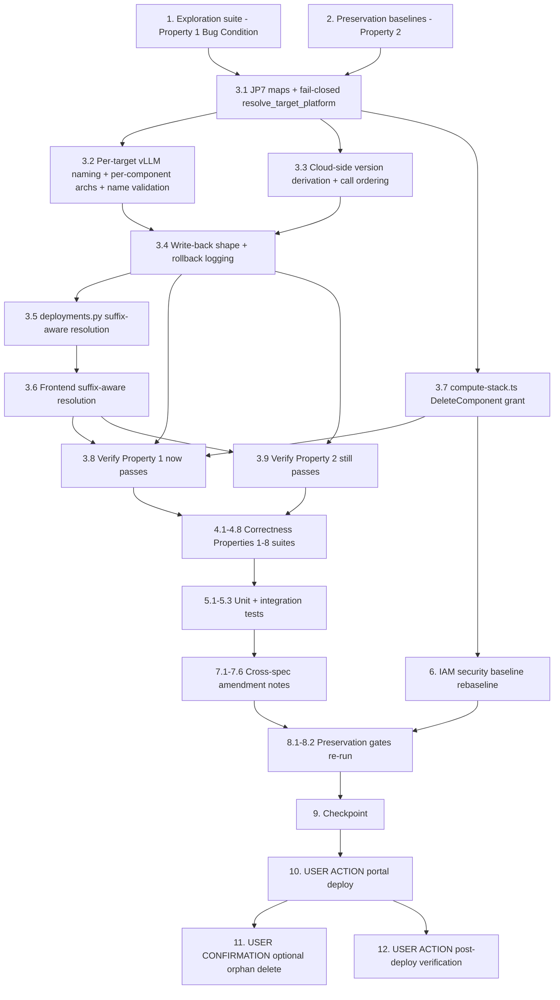

# Implementation Plan

## Overview

Fix the four compounding defects that make every vLLM publish fail with
`ConflictException`, using the exploratory bugfix workflow. Write the bug
condition exploration suite and the preservation baselines against the UNFIXED
tree first, then land design.md's six-part fix in its documented step order,
then encode Correctness Properties 1–8, rebaseline the IAM security gate,
append the six cross-spec amendment notes, and re-run the preservation gates.
The portal deploy, the optional orphan deletion, and the post-deploy manual
verification are user-action tasks at the end.

Step 1 (JP7 target maps + fail-closed `resolve_target_platform`) MUST land
before the per-target naming/recipe work: Property 1's platform / LocalServer
assertion for `arm64_jp7` is unsatisfiable while `jetson-xavier-jp7` is absent
from `TARGET_TO_PLATFORM` / `TARGET_TO_LOCAL_SERVER` and the recipe is stamped
`amd64`.

All work lands on the existing branch `spec/jetpack7-support` — no new branch.

Test commands:
- Backend suites MUST run separately (module-name collisions when combined),
  from the repo root:
  `PYTHONPATH=src/backend:test/backend-test python3 -m pytest <suite> -q -p no:cacheprovider --noconftest`
- Frontend: single run from `edge-cv-portal/frontend`: `npx vitest run <file>`
- The 4 known-acceptable local-only `cdk.out` drift failures under
  `test/backend-test/security/` are pre-existing — do NOT try to fix them (3.17).

New files this plan creates:
- `edge-cv-portal/backend/tests/test_vllm_multi_arch_publish_exploration.py`
- `edge-cv-portal/backend/tests/test_vllm_multi_arch_publish_properties.py`
- `edge-cv-portal/frontend/src/pages/deployments/vllmSuffixArch.property.test.ts`

## Task Dependency Graph

```json
{
  "waves": [
    { "wave": 1, "description": "Run on UNFIXED code: exploration suite surfaces the counterexamples (task 1 FAILS, except case 5 which documents F(X)) and the preservation baselines are observed and recorded (task 2 PASSES).", "tasks": ["1", "2"] },
    { "wave": 2, "description": "Step 1 of the fix: JP7 target maps + fail-closed resolve_target_platform. Prerequisite for the per-target recipe work.", "tasks": ["3.1"] },
    { "wave": 3, "description": "Remaining fix steps: publish naming/version/write-back, deployments.py suffix-aware resolution, frontend resolution, IAM grant.", "tasks": ["3.2", "3.3", "3.4", "3.5", "3.6", "3.7"] },
    { "wave": 4, "description": "Re-run the task 1 and task 2 suites against the fixed tree.", "tasks": ["3.8", "3.9"] },
    { "wave": 5, "description": "Fix-checking property suites (Correctness Properties 1-8) plus unit and integration tests.", "tasks": ["4.1", "4.2", "4.3", "4.4", "4.5", "4.6", "4.7", "4.8", "5.1", "5.2", "5.3"] },
    { "wave": 6, "description": "Security baseline rebaseline for the intentional DeleteComponent grant, and the six cross-spec amendment notes.", "tasks": ["6", "7.1", "7.2", "7.3", "7.4", "7.5", "7.6"] },
    { "wave": 7, "description": "Re-run every preservation gate, then checkpoint.", "tasks": ["8.1", "8.2", "9"] },
    { "wave": 8, "description": "USER ACTION: portal deploy, optional orphan cleanup (explicit confirmation), post-deploy manual verification.", "tasks": ["10", "11", "12"] }
  ]
}
```



## Tasks

- [x] 1. Write bug condition exploration test suite
  - **Property 1: Bug Condition** - One create per distinct per-JetPack identity
  - **CRITICAL**: These tests MUST FAIL on unfixed code - failure confirms the bugs exist
  - **DO NOT attempt to fix the tests or the code when they fail**
  - **NOTE**: This suite encodes the expected behavior - it validates the fix when it passes after implementation
  - **GOAL**: Surface counterexamples for all four hypothesized causes; if any is refuted, re-hypothesize before writing a fix
  - Create `edge-cv-portal/backend/tests/test_vllm_multi_arch_publish_exploration.py` following the existing patterns in `edge-cv-portal/backend/tests/test_vllm_publish_fit_gate.py` and `test_vllm_publish_writeback.py` (moto-backed conftest stack, fake Greengrass client)
  - Seed a vLLM training-jobs record with BOTH packaged targets `jetson-xavier-jp6` and `jetson-xavier-jp7`; drive `edge-cv-portal/backend/functions/greengrass_publish.py::publish_component`
  - Fake Greengrass client must behave like the service: `create_component_version` raises `ConflictException` on a repeated `(ComponentName, ComponentVersion)`; `delete_component` raises `AccessDeniedException` (mirrors the unauthorized portal role); include `get_paginator` for `list_components` / `list_component_versions`
  - Case 1 - **Duplicate identity** (`isBugCondition_1`): assert exactly one `create_component_version` per supported architecture with all `(name, version)` pairs distinct and names `model-vllm-{safe}-jetson-xavier-jp6` / `-jetson-xavier-jp7`; on unfixed code observe two creates with the identical name:version, the second raising `ConflictException`, HTTP 502 with `failed_step: greengrass_registration`
  - Case 2 - **Rollback denied** (`isBugCondition_2`): assert no component version survives the failed attempt; on unfixed code observe `delete_component` attempted, `AccessDeniedException` swallowed as a warning, and the JP6 version still present in the fake's state
  - Case 3 - **Wedged retry** (`isBugCondition_3`): re-invoke publish with the orphan version present in the fake; assert the derived version is strictly above every existing version; on unfixed code observe `1.0.0` re-derived and a conflict on the FIRST target
  - Case 4 - **JP7 recipe mis-stamping** (`isBugCondition_4`): assert directly that `isBugCondition_4` holds for `jetson-xavier-jp7` on the unfixed maps (it is in `values(packaging.VLLM_ARCH_TO_TARGET)` but in neither `TARGET_TO_LOCAL_SERVER` nor `TARGET_TO_PLATFORM` in `greengrass_publish.py`), then assert the JP7 recipe's manifest `Platform.architecture` is `aarch64` and its HARD `ComponentDependencies` entry is `aws.edgeml.dda.LocalServer.arm64JP7`; on unfixed code observe `amd64` / `aws.edgeml.dda.LocalServer.amd64` and that the publish SUCCEEDS rather than failing - the counterexample is the mis-stamped recipe, not an exception
  - Case 5 - **IAM absence**: source-level assertion that `greengrass:DeleteComponent` is absent from the Greengrass action list in `edge-cv-portal/infrastructure/lib/compute-stack.ts`; this case PASSES on unfixed code and documents `F(X)` - invert it after the fix (task 3.7 / 4.7)
  - Case 6 - **Edge case**: a record whose base name plus target suffix exceeds the Greengrass 128-character component-name limit; assert the publish fails closed with `PublishError` and no create; on unfixed code observe `create_component_version` called anyway
  - Run: `PYTHONPATH=src/backend:test/backend-test python3 -m pytest edge-cv-portal/backend/tests/test_vllm_multi_arch_publish_exploration.py -q -p no:cacheprovider --noconftest`
  - **EXPECTED OUTCOME**: cases 1, 2, 3, 4, 6 FAIL (this is correct - it proves the bugs exist); case 5 PASSES
  - Document the counterexamples found (identical `(ComponentName, ComponentVersion)` pair; surviving version after the warned-only rollback; `1.0.0` re-derived regardless of cloud state; JP7 recipe stamped `amd64` + amd64 LocalServer)
  - Mark complete when the suite is written, run, and the failures are documented
  - _Requirements: 1.1, 1.2, 1.3, 1.4, 1.5, 1.6, 1.7, 1.9, 1.10, 1.11, 1.12, 1.13, 1.14_

- [x] 2. Write preservation property tests (BEFORE implementing the fix)
  - **Property 2: Preservation** - Non-bug inputs are behaviorally identical
  - **IMPORTANT**: Follow observation-first methodology - observe the UNFIXED behavior, record it, then encode it as properties
  - Create `edge-cv-portal/backend/tests/test_vllm_multi_arch_publish_properties.py` and add the Property 2 tests to it now (the fix-checking properties are added in task 4); Hypothesis, no hardcoded `max_examples`, one test per property with `# Validates: Requirements …` comments
  - Observe on UNFIXED code and encode as properties:
    - **Vision publish**: over generated non-vLLM records and target lists - per-target `f"{component_name}-{target_suffix}"` names, the caller-supplied component version, a write-back of only `published_components` + `updated_at`, no atomicity gate, and a fail-closed `PublishError` per unresolvable target with no create (3.1, 3.2)
    - **Legacy unsuffixed vLLM resolution**: over generated `model-vllm-*` names carrying no known target suffix - `load_vllm_model_record(name)` resolves to its record with a single GSI query and `vllm_component_architectures(record)` returns the record-wide set (3.4, 3.5)
    - **Triton identity**: the generated vLLM recipe's Startup/Shutdown scripts pass `--model_name = _safe_model_name(model_name)`; `derive_vllm_component_name` returns `model-vllm-{safe_model_name}` verbatim (3.3)
    - **Gate semantics**: over (component arch, device arch) pairs - null device arch fails closed, empty supported set fails closed, `arm64_jp4` gives reason `JP4_UNSUPPORTED` with the "JetPack 4 does not support vLLM inference" message, exact-name matching with no fallback, one entry per (component, device) miss (3.6, 3.7, 3.8, 3.9)
    - **Target-map resolution baseline** (design Preservation test case 6): record, for every currently mapped target, the exact `(LocalServer variant, platform)` pair it resolves to today - `x86_64-cpu` / `x86_64-cuda` → `aws.edgeml.dda.LocalServer.amd64` + `amd64`; `jetson-xavier`, `jetson-xavier-jp5`, `jetson-xavier-jp6`, `arm64-cpu` → their current aarch64 variants - and assert a genuinely unknown aarch64 target raises `PublishError` (3.18, 3.19)
  - Run: `PYTHONPATH=src/backend:test/backend-test python3 -m pytest edge-cv-portal/backend/tests/test_vllm_multi_arch_publish_properties.py -q -p no:cacheprovider --noconftest`
  - **EXPECTED OUTCOME**: Tests PASS on UNFIXED code (this confirms the baseline behavior to preserve)
  - Mark complete when the tests are written, run, and passing on unfixed code
  - _Requirements: 3.1, 3.2, 3.3, 3.4, 3.5, 3.6, 3.7, 3.8, 3.9, 3.18, 3.19_

- [x] 3. Fix per-JetPack vLLM component publishing (design Fix Implementation steps 1-15)

  - [x] 3.1 JP7 target mappings and fail-closed platform resolution (design step 1)
    - **MUST land before 3.2**: Property 1's platform / LocalServer assertion for `arm64_jp7` is unsatisfiable without these entries
    - In `edge-cv-portal/backend/functions/greengrass_publish.py`: add `'jetson-xavier-jp7': 'aws.edgeml.dda.LocalServer.arm64JP7'` to `TARGET_TO_LOCAL_SERVER` (line ~77) and `'jetson-xavier-jp7': 'aarch64'` to `TARGET_TO_PLATFORM` (line ~87), and add the target to the `PublishError` message's list of supported compile targets
    - Replace the silent default `platform = TARGET_TO_PLATFORM.get(target, 'amd64')` (line ~747) with a new `resolve_target_platform(target) -> str` that raises `PublishError` when the target is absent from EITHER map, naming the target and the sorted intersection of supported targets; call it wherever the platform is derived, so an unmapped target becomes a recorded failed target before recipe generation and never reaches `create_component_version`
    - Leave `resolve_local_server_component`'s body unchanged - it simply stops being handed a bogus `'amd64'` platform
    - _Bug_Condition: isBugCondition_4(X) - X.target IN values(packaging.VLLM_ARCH_TO_TARGET) AND (X.target NOT IN keys(TARGET_TO_LOCAL_SERVER) OR X.target NOT IN keys(TARGET_TO_PLATFORM))_
    - _Expected_Behavior: Property 8 - recipe manifest platform = platformFor(a) and HARD dependency = localServerVariant(a); unmapped target raises PublishError with no create_
    - _Preservation: every already-mapped target resolves to exactly today's variant and platform; a genuinely unknown target still fails closed (3.18, 3.19)_
    - _Requirements: 2.17, 2.18, 2.19, 3.18, 3.19_

  - [x] 3.2 Per-target vLLM naming, per-component architecture set, name validation (design steps 2, 3, 4)
    - In `greengrass_publish.py`'s target loop (lines ~747-880): delete the vLLM special case so both branches use the vision convention `target_component_name = f"{component_name}-{target_suffix}"` with `target_suffix = target.replace('_', '-')`; `component_name` stays the Base_Component_Name from the unchanged `derive_vllm_component_name`
    - Add a module-level reverse map `VLLM_TARGET_TO_ARCH` mirroring `packaging.VLLM_ARCH_TO_TARGET` (with a "keep in sync" comment, same mirrored-pure-helper convention the module already uses), and pass `supported_architectures=[arch_for_target]` to `generate_vllm_component_recipe` instead of the record-wide `vllm_archs`; a target with no arch mapping fails closed with `PublishError` rather than advertising a guess
    - Add `GREENGRASS_COMPONENT_NAME_MAX = 128`, `GREENGRASS_COMPONENT_NAME_RE = re.compile(r'^[a-zA-Z0-9._-]+$')`, and `validate_greengrass_component_name(name) -> None` raising `PublishError`; call it for the derived per-target name before recipe generation (a no-op for vision names, which are already valid)
    - _Bug_Condition: isBugCondition_1(X) - is_vllm_record(X.record) AND |archs(X.record)| > 1_
    - _Expected_Behavior: Property 1 (one create per distinct identity, per-component supported_architectures = [a], HARD dependency on a's LocalServer) and Property 7 (name satisfies every downstream consumer, fail-closed above 128 chars)_
    - _Preservation: vision naming, caller-supplied version, and per-target fail-closed PublishError unchanged (3.1, 3.2)_
    - _Requirements: 2.1, 2.2, 2.3, 2.4, 2.6, 3.1, 3.2_

  - [x] 3.3 Cloud-side version derivation and call ordering (design steps 5, 6)
    - In `greengrass_publish.py`, replace `next_vllm_component_version(training_job)` (line ~320) with the `workflow_packaging.py` pattern: `existing_component_versions(greengrass, component_name) -> set` (mirrors `_existing_component_versions`: resolve the component ARN via `list_components(scope='PRIVATE')` paging, then page `list_component_versions`, warn and return `set()` on `ClientError`), pure `next_major_from_versions(versions) -> str` returning `f"{1 + max major}.0.0"`, and `next_vllm_component_version(greengrass, component_names) -> str` taking the max over all per-JetPack names
    - Stop consulting the record's `published_components` / `published_component` history entirely; keep ONE shared `N.0.0` for the publish so `model_id = f"{training_id}-{component_version}"` and the response shape are preserved
    - Move the `get_usecase_client('greengrassv2', …)` creation ABOVE the preflight fit-check block (it needs only `usecase`, already fetched) so the derived name list and version are available to the 422 / `skip_fit_check` / `unverified` branches exactly as today; move no `create_component_version` call - the fit gate stays the first fail-closed point before any registration
    - _Bug_Condition: isBugCondition_3(X) - EXISTS v IN X.existingCloudVersions WHERE major(v) >= historyDerivedMajor(X.record)_
    - _Expected_Behavior: Property 4 - derived version matches ^\d+\.0\.0$ and its major strictly dominates every existing major, independent of record history_
    - _Preservation: preflight fit gate ordering and outcomes unchanged (3.12)_
    - _Requirements: 2.9, 2.10, 3.12_

  - [x] 3.4 Write-back shape for N components and rollback logging (design steps 7, 8)
    - In `greengrass_publish.py`: keep every existing key of the `published_component` map (`component_name` = unsuffixed base name / GSI key, `component_version`, record-wide `supported_architectures` union for legacy readers, `runtime`, `component_arns`, `published_at`) and add a `components` list with one entry per Per_JetPack_Component: `{component_name, component_version, target, architecture, supported_architectures: [arch], component_arn}`
    - Add `'supported_architectures': [arch]` to each `published_components` entry alongside its already-per-target `component_name`
    - Keep the top-level `component_name` attribute as the unsuffixed base name so the `component_name-index` GSI keeps resolving ONE record from ONE string (no index change)
    - Keep the rollback's try/except-warning shape; include the component name and version parsed from the ARN in the warning so a surviving version is identifiable from logs (no behavior change beyond message detail)
    - _Bug_Condition: isBugCondition_1 / isBugCondition_2 from design_
    - _Expected_Behavior: Property 5 (write-back supports N components and round-trips per component) and Property 3 (rollback attempted per created ARN, raising nothing)_
    - _Preservation: all-or-nothing atomicity, retryable 502 + failure audit event, models-table record + published = True + success audit event (3.13, 3.14)_
    - _Requirements: 2.5, 2.8, 3.13, 3.14_

  - [x] 3.5 Suffix-aware resolution in deployments.py (design steps 9, 10, 11)
    - In `edge-cv-portal/backend/functions/deployments.py`: add module-level `VLLM_TARGET_SUFFIX_TO_ARCH = {'jetson-xavier-jp5': 'arm64_jp5', 'jetson-xavier-jp6': 'arm64_jp6', 'jetson-xavier-jp7': 'arm64_jp7'}` with a "keep in sync with `packaging.VLLM_ARCH_TO_TARGET`" comment, plus a pure `split_vllm_component_name(name) -> (base_name, arch | None)`
    - `load_vllm_model_record(name)` (line ~1955): query the GSI with the exact name FIRST (legacy path, one query, byte-identical for unsuffixed names) and only on a miss AND a known suffix re-query with the stripped base name; leave the `ClientError` warning, newest-`created_at` tiebreak, and `_decimal_to_native` untouched
    - `vllm_component_architectures(record, component_name=None)` (line ~1980): (1) a `published_component.components` entry whose `component_name` matches → that entry's `supported_architectures`; (2) elif the name carries a known target suffix → `[arch]` if that arch is in the record-wide set else `[]` (fail closed on an out-of-set suffix); (3) else → the record-wide set exactly as today
    - Pass the component name through `collect_vllm_component_manifests`; do NOT touch `evaluate_vllm_arch_gate`
    - _Bug_Condition: isBugCondition_1 downstream consequence - a per-JetPack name must resolve to its record and its own arch (1.8)_
    - _Expected_Behavior: Property 5 (round-trip to record and [a]) and Property 6 (per-JetPack gate is exact and fail-closed)_
    - _Preservation: legacy unsuffixed resolution and record-wide set unchanged, gate semantics and workflow-component gating untouched (3.4, 3.5, 3.9, 3.10, 3.11)_
    - _Requirements: 2.11, 2.12, 3.4, 3.5, 3.9, 3.10, 3.11_

  - [x] 3.6 Suffix-aware resolution in the frontend (design steps 12, 13, 14)
    - In `edge-cv-portal/frontend/src/pages/deployments/vllmArchGate.ts`: add the pure TS twin of the backend rules - `VLLM_TARGET_SUFFIX_TO_ARCH`, `splitVllmComponentName(name)`, and `vllmArchsForComponent(componentName, publishedComponent)` implementing the same three-rule order; keep it UI-free so fast-check can exercise it; leave `evaluateVllmArchGate` and the 409 parsing unchanged
    - In `edge-cv-portal/frontend/src/pages/deployments/archCompatibility.ts`: documentation only - state in the module comment that vLLM entries are now keyed by the suffixed per-JetPack name and resolved via `vllmArchsForComponent`; `componentSupportedArchs` and `inferComponentTargetArchs` need no production change
    - In `edge-cv-portal/frontend/src/pages/CreateDeployment.tsx`: in the vLLM arch-resolution effect, replace `resp.model.published_component?.supported_architectures || []` with `vllmArchsForComponent(name, resp.model.published_component)`; leave the component→record join (`training_job_id` from the `dda-portal:training-id` tag), the still-resolving `undefined` semantics, and the fail-closed `[]` semantics unchanged (`models.py` already returns `published_component` verbatim, so no API change)
    - _Bug_Condition: isBugCondition_1 downstream consequence - the deploy screen resolved a record-wide set and hid the model (1.8)_
    - _Expected_Behavior: Property 6 twin - the JP7 component is selectable for a jetson-thor1 (arm64_jp7) device and the JP6 component is shown incompatible_
    - _Preservation: exact-name no-fallback matching and the fail-closed rules (null device arch, empty set, still-resolving undefined) unchanged (3.6, 3.7, 3.9)_
    - _Requirements: 2.13, 2.14, 3.6, 3.7, 3.9_

  - [x] 3.7 Authorize the rollback in compute-stack.ts (design step 15)
    - In `edge-cv-portal/infrastructure/lib/compute-stack.ts`: add `'greengrass:DeleteComponent'` to the existing combined per-service statement's action list - the one already scoped to `arn:aws:greengrass:*:*:components:*`, `…coreDevices:*`, `…deployments:*`
    - No new statement, no resource change, no other action added, never a wildcard resource
    - Security justification to carry in the code comment and commit message: rollback only deletes component versions the portal itself created seconds earlier in the same failed publish, the action is confined to the Greengrass components resource ARN, and the cross-account `DDAPortalUseCaseAccountStack` role already grants exactly this action - this closes an inconsistency rather than widening the trust boundary
    - Invert exploration case 5 (task 1) so it now asserts the action IS present
    - _Bug_Condition: isBugCondition_2(X) - is_vllm_record(X.record) AND |X.createdArns| > 0 AND anyTargetFailed(X) AND NOT iamPolicy ALLOWS greengrass:DeleteComponent_
    - _Expected_Behavior: Property 3 - the policy allows greengrass:DeleteComponent on the components ARN and on nothing wider; every created ARN is attempted; rollback raises nothing_
    - _Preservation: every other Greengrass action and resource scope unchanged, no widening (3.15)_
    - _Requirements: 2.7, 2.8, 3.15_

  - [x] 3.8 Verify bug condition exploration test now passes
    - **Property 1: Expected Behavior** - One create per distinct per-JetPack identity
    - **IMPORTANT**: Re-run the SAME suite from task 1 - do NOT write a new test
    - The suite from task 1 encodes the expected behavior; when it passes, the expected behavior is satisfied
    - Run: `PYTHONPATH=src/backend:test/backend-test python3 -m pytest edge-cv-portal/backend/tests/test_vllm_multi_arch_publish_exploration.py -q -p no:cacheprovider --noconftest`
    - **EXPECTED OUTCOME**: Tests PASS - cases 1, 2, 3, 4, 6 now pass (bug fixed) and case 5, inverted in 3.7, passes with the grant present
    - _Requirements: 2.1, 2.2, 2.3, 2.4, 2.17, 2.18_

  - [x] 3.9 Verify preservation tests still pass
    - **Property 2: Preservation** - Non-bug inputs are behaviorally identical
    - **IMPORTANT**: Re-run the SAME tests from task 2 - do NOT write new tests
    - Run: `PYTHONPATH=src/backend:test/backend-test python3 -m pytest edge-cv-portal/backend/tests/test_vllm_multi_arch_publish_properties.py -q -p no:cacheprovider --noconftest`
    - **EXPECTED OUTCOME**: Tests PASS (confirms no regressions in vision publish, legacy resolution, Triton identity, gate semantics, and already-mapped target resolution)
    - _Requirements: 3.1, 3.2, 3.3, 3.4, 3.5, 3.6, 3.7, 3.8, 3.9, 3.18, 3.19_

- [ ] 4. Write the fix-checking property suites (Correctness Properties 1-8)

  - [~] 4.1 Target-map totality and fail-closed resolution property
    - **Property 8: Fix Checking** - Target maps are total and unmapped targets fail closed
    - Property-based test (Hypothesis) in `edge-cv-portal/backend/tests/test_vllm_multi_arch_publish_properties.py` with `# Validates: Requirements 2.17, 2.18, 2.19, 3.18, 3.19`
    - Over the full set of producible targets plus generated unmapped target names: every value of `packaging.VLLM_ARCH_TO_TARGET` is a key of BOTH `TARGET_TO_LOCAL_SERVER` and `TARGET_TO_PLATFORM` (totality in both directions); each generated recipe's manifest platform and HARD LocalServer dependency correspond to the same architecture (`aarch64` + `arm64JP{N}` for every Jetson target); every already-mapped target resolves to exactly today's variant and platform; any target absent from either map raises `PublishError` with no `create_component_version` call and never defaults to `amd64`
    - _Requirements: 2.17, 2.18, 2.19, 3.18, 3.19_

  - [~] 4.2 One create per distinct per-JetPack identity property
    - **Property 1: Fix Checking** - One create per distinct per-JetPack identity
    - Property-based test (Hypothesis) over model names × supported-arch subsets: exactly one `create_component_version` per arch, all `(name, version)` pairs distinct, name = `derive_vllm_component_name(record) + "-" + suffix(a)`, recipe `DefaultConfiguration.supported_architectures == [a]`, HARD `ComponentDependencies` entry on `a`'s LocalServer variant, manifest platform `linux/aarch64`
    - _Requirements: 2.1, 2.2, 2.3, 2.4, 2.17, 2.18_

  - [~] 4.3 Derived version domination property
    - **Property 4: Fix Checking** - Derived version dominates every existing version
    - Property-based test (Hypothesis) over arbitrary sets of existing version strings and arbitrary record histories: the derived version matches `^\d+\.0\.0$`, its major is strictly greater than every existing major, and the result is independent of `published_components` / `published_component`
    - _Requirements: 2.9, 2.10_

  - [~] 4.4 Suffixed-name round-trip property
    - **Property 5: Fix Checking** - Suffixed names round-trip to record and architecture
    - Property-based test (Hypothesis, moto-backed GSI) over model names × arch subsets: the per-JetPack name resolves through `load_vllm_model_record'` back to the record and `vllm_component_architectures'(record, name)` returns exactly `[a]`, matching the write-back the publish produced
    - _Requirements: 2.5, 2.11, 2.12_

  - [~] 4.5 Per-JetPack arch gate exactness property
    - **Property 6: Fix Checking** - The per-JetPack arch gate is exact and fail-closed
    - Property-based test (Hypothesis) over (component arch, device arch) pairs including null device arch and empty supported sets: no findings when `b == a`, at least one finding when `b != a` (including `arm64_jp4` with reason `JP4_UNSUPPORTED` and the JetPack-4 message), at least one finding on null device arch, at least one finding on an empty supported set
    - _Requirements: 2.13, 2.14, 3.6, 3.7, 3.8, 3.9_

  - [~] 4.6 Derived-name downstream-consumer property
    - **Property 7: Fix Checking** - Derived names satisfy every downstream consumer
    - Property-based test (Hypothesis) over arbitrary model names × architectures: the derived name starts with `model-` (backend publish validation) and `model-vllm-` (`isVllmModelComponent` / `VLLM_MODEL_COMPONENT_PREFIX`), contains a JetPack token matching `/(?:jp|jetpack)(4|5|6|7)(?![0-9])/` whose major equals that architecture's major, matches `^[a-zA-Z0-9._-]+$`, and fails closed with `PublishError` and no create above 128 characters
    - _Requirements: 2.6_

  - [~] 4.7 Authorized-rollback property
    - **Property 3: Fix Checking** - Rollback is authorized and attempted for every ARN
    - Property-based test (Hypothesis) at source/synth level over the loaded policy and over generated created-ARN sets: `greengrass:DeleteComponent` is granted on the Greengrass components resource ARN and on nothing wider, a `delete_component` call is attempted for every ARN created during the attempt, and the rollback raises nothing (the reported error stays the publish failure)
    - _Requirements: 2.7, 2.8, 3.13, 3.15_

  - [~] 4.8 Frontend suffix-arch resolution property suite
    - **Property 6: Fix Checking** - Frontend twin of the per-JetPack gate and resolution rules
    - Property-based test (fast-check, `numRuns: 100`) in the new file `edge-cv-portal/frontend/src/pages/deployments/vllmSuffixArch.property.test.ts`, following `edge-cv-portal/frontend/src/components/vllm-publish/publishState.gating.property.test.ts`
    - `vllmArchsForComponent` is the exact twin of the backend resolution (same three-rule order) over generated `published_component` maps; a per-JetPack component is compatible with its own arch and no other, including null-arch and empty-set fail-closed cases (Property 6 twin); legacy unsuffixed names still resolve to the record-wide set (Property 2 twin)
    - Run: `npx vitest run src/pages/deployments/vllmSuffixArch.property.test.ts` from `edge-cv-portal/frontend`
    - _Requirements: 2.13, 2.14, 3.4, 3.5, 3.6, 3.7, 3.9_

- [ ] 5. Write the unit and integration tests from the design Testing Strategy

  - [~] 5.1 Unit tests
    - `derive_vllm_component_name` unchanged; per-target name composition for each target in the closed suffix vocabulary
    - `validate_greengrass_component_name`: accepts valid names, raises `PublishError` on over-length and illegal characters
    - `VLLM_TARGET_TO_ARCH` / `VLLM_TARGET_SUFFIX_TO_ARCH` mirror `packaging.VLLM_ARCH_TO_TARGET` exactly (totality both ways)
    - Target-map totality both ways, plus every Jetson key producible from the packaging map mapping to platform `aarch64` and an `arm64JP{N}` variant - the test that would have caught defect 4 when `jp7-vllm-enablement` task 6.2 landed
    - A synthetic target injected into `packaging.VLLM_ARCH_TO_TARGET` but absent from either module map makes `resolve_target_platform` (and therefore recipe generation) raise `PublishError` with no create, and does NOT default to `amd64`
    - `existing_component_versions`: paging, no-such-component → `set()`, `ClientError` → warn + `set()`; `next_vllm_component_version`: `1.0.0` when nothing exists, `N+1.0.0` over the highest major across all names, unaffected by record history
    - `resolve_local_server_component('jetson-xavier-jp7', 'aarch64') == 'aws.edgeml.dda.LocalServer.arm64JP7'` with platform `aarch64`
    - `split_vllm_component_name` / `splitVllmComponentName`: suffixed, unsuffixed, unknown-suffix names; `vllm_component_architectures`: per-component entry hit, suffix fallback, out-of-set suffix → `[]`, legacy record-wide path
    - Publish write-back: `components` list shape, one entry per architecture, top-level `component_name` still the base name, `published_components` entries carrying `[arch]`; rollback: `delete_component` attempted per created ARN and a raising delete does not propagate
    - _Requirements: 2.5, 2.6, 2.8, 2.9, 2.10, 2.11, 2.12, 2.17, 2.18, 2.19_

  - [~] 5.2 Backend integration tests
    - Moto + fake Greengrass end-to-end publish: a two-target vLLM record publishes two DEPLOYABLE components, returns 200 with two `published_components` entries, and writes the `components` list; a forced failure on the second target rolls BOTH back, writes no publish state, and returns the retryable 502 with `failed_step: greengrass_registration`
    - Deploy-gate round trip: publish, then run `check_vllm_deployment_gate` for an `arm64_jp7` device against both component names - the JP7 component passes and the JP6 component is rejected with `ARCH_UNSUPPORTED`
    - _Requirements: 2.3, 2.5, 2.12, 2.14, 3.13, 3.14_

  - [~] 5.3 Frontend integration test
    - Extend `edge-cv-portal/frontend/src/pages/CreateDeployment.archFilter.test.tsx` so the mocked model record returns a `published_component.components` list and the suffixed JP7 component is offered while the JP6 one is filtered out for an `arm64_jp7` device
    - Run: `npx vitest run src/pages/CreateDeployment.archFilter.test.tsx` from `edge-cv-portal/frontend`
    - _Requirements: 2.13, 2.14_

- [x] 6. Rebaseline the IAM security gate for the intentional DeleteComponent grant (design step 16)
  - DONE: fixed baseline + `iam_baseline_cdk_i_changes.json` updated (sole drift = `greengrass:DeleteComponent`, commit 3734e88); live-synth fixture hermetically isolated from ambient EC2 instance creds (the CDK CLI was clobbering `CDK_DEFAULT_ACCOUNT` with the real account); gate 11 passed / 0 failed with live synth running
  - Follow the gate's documented protocol in `test/backend-test/security/preservation/README_iam.md` and `.kiro/steering/builds.md`
  - **Move `edge-cv-portal/infrastructure/cdk.out` aside FIRST** (the cdk.out drift guard), then re-synthesize
  - Update `test/backend-test/security/baselines/iam_baseline_EdgeCVPortalComputeStack.template.json` so `test_synth_iam_statements_match_fixed_baseline` in `test/backend-test/security/preservation/test_preservation_iam_cdk_synth.py` passes
  - In the SAME commit, update the matching statement string in `test/backend-test/security/baselines/iam_baseline_cdk_i_changes.json` (`EdgeCVPortalComputeStack` → `added`), because `test_baseline_drift_confined_to_I1_I4` asserts the symmetric difference between the fixed and `.unfixed` templates equals the recorded I1-I4 change set
  - Touch `iam_baseline_EdgeCVPortalComputeStack.unfixed.template.json` ONLY if the drift-confinement test demands it - it is the historical pre-fix `F(X)` record; verify by running the suite before changing it
  - **Do NOT weaken, skip, or delete the gate.** Leave the 4 known-acceptable local-only `cdk.out` drift failures under `test/backend-test/security/` untouched - they are pre-existing (3.17)
  - Record in the commit message which artifact was rebaselined and that the sole drift is the intentional `greengrass:DeleteComponent` grant on the Greengrass components resource ARN
  - Run: `PYTHONPATH=src/backend:test/backend-test python3 -m pytest test/backend-test/security/preservation/test_preservation_iam_cdk_synth.py -q -p no:cacheprovider --noconftest`
  - _Requirements: 3.15, 3.16, 3.17_

- [ ] 7. Append the six cross-spec documentation consistency amendment notes
  - These are deliverables, not silent drift: a short amendment note appended to each sibling spec, referencing `.kiro/specs/vllm-multi-arch-publish-conflict/`, NOT a rewrite. No new branch - all on `spec/jetpack7-support`.

  - [~] 7.1 Amend `.kiro/specs/jp7-vllm-enablement/`
    - Note that JP7 support is now delivered as its own component `model-vllm-{safe}-jetson-xavier-jp7` advertising exactly `['arm64_jp7']` with a HARD dependency on `aws.edgeml.dda.LocalServer.arm64JP7`, and that the two missing target maps (`TARGET_TO_LOCAL_SERVER` / `TARGET_TO_PLATFORM`) omitted by task 6.2 were completed here
    - State that Requirement 4.4 and the manual-validation row "Publish → component `model-vllm-*` published, architectures include `arm64_jp7`" are now satisfied per-component rather than record-wide - there is no longer ONE component advertising both JetPacks
    - _Requirements: 2.1, 2.3, 2.4, 2.17, 2.18_

  - [~] 7.2 Amend `.kiro/specs/vllm-model-name-mismatch/`
    - Note explicitly why that spec's intent is not regressed: the Triton identity travels on `--model_name` (`_safe_model_name(model_name)`, unchanged), while `--component_name` is logging-only in `src/backend/dda_triton/vllm_model_prep.py` (argparse help "(logging)"; `prepare()` binds it to `component` and only logs it)
    - State that `derive_vllm_component_name` still returns `model-vllm-{safe_model_name}` verbatim - per-target suffixing appends to that base name - and that the spec's transform-equality property test passes unmodified
    - _Requirements: 3.3_

  - [~] 7.3 Amend `.kiro/specs/vllm-triton-inference/`
    - Note that `evaluate_vllm_arch_gate`, the 409 `VLLM_ARCH_UNSUPPORTED` contract, the fail-closed rules, and the JP4 reason are all unchanged; only the *source* of a `model-vllm-*` component's supported set changed - a per-component entry, with the record-wide set retained for legacy unsuffixed components
    - _Requirements: 2.12, 3.6, 3.7, 3.8, 3.9_

  - [~] 7.4 Amend `.kiro/specs/device-arch-compatibility/`
    - Note that `vllmComponentArchs` entries in `archCompatibility.ts` / `vllmArchGate.ts` / `CreateDeployment.tsx` are now keyed by the exact suffixed component name and resolved with `vllmArchsForComponent`, so one record can contribute several keys with disjoint single-arch sets
    - State that the exact-name, no-fallback matching contract and the fail-closed rules (null device arch, empty supported set, still-resolving `undefined`) are unchanged
    - _Requirements: 2.13, 3.6, 3.7, 3.9_

  - [~] 7.5 Amend `.kiro/specs/jetpack7-support/` (umbrella)
    - One-paragraph pointer to this spec in the JP7 vLLM section: a vLLM model on JP7 now means a JP7-specific model component, not a shared one
    - _Requirements: 2.3_

  - [~] 7.6 Amend `.kiro/specs/localserver-arch-naming/`
    - Note the added `jetson-xavier-jp7` → `aws.edgeml.dda.LocalServer.arm64JP7` / `aarch64` entries, and that the `platform == 'amd64'` fallback had silently covered the unmapped JP7 target because `TARGET_TO_PLATFORM.get(target, 'amd64')` defaulted to amd64
    - State that any future aarch64 target must be added to BOTH maps or the amd64 default defeats fail-closed resolution - which is why `resolve_target_platform` now raises instead of defaulting
    - _Requirements: 2.17, 2.19, 3.18, 3.19_

- [ ] 8. Re-run the preservation gates

  - [~] 8.1 Backend preservation gates (each suite separately)
    - `PYTHONPATH=src/backend:test/backend-test python3 -m pytest <suite> -q -p no:cacheprovider --noconftest` for each of:
    - `edge-cv-portal/backend/tests/test_vllm_publish_fit_gate.py` - **expected to need updates**: the created-`ComponentName` assertion moves to the suffixed name and the fake Greengrass client needs `get_paginator`; every status-code, fit-status, and record-state assertion MUST pass unchanged
    - `edge-cv-portal/backend/tests/test_vllm_publish_writeback.py` - **expected to need updates**: per-target `component_name` / ARN assertions move to suffixed names, new `components`-list assertions are added, and the fake Greengrass client needs `get_paginator`; record-level `component_name`, `published_component.component_name`, version, `published`, models-table item, and rollback assertions MUST pass unchanged
    - `edge-cv-portal/backend/tests/test_deployment_plugin_gates.py` - MUST pass unchanged
    - `edge-cv-portal/backend/tests/test_deployment_vllm_gate.py` - MUST pass unchanged (its legacy unsuffixed seeding exercises the preserved path)
    - `edge-cv-portal/backend/tests/test_vision_model_packaging_preservation.py` - MUST pass unchanged (Property 2)
    - `edge-cv-portal/backend/tests/test_property_llm_model_name_preservation.py` - MUST pass unchanged (base-name transform equality)
    - `test/backend-test/security/preservation/` - after the task 6 rebaseline; the only permitted drift is the `DeleteComponent` grant, and the 4 known-acceptable local-only `cdk.out` drift failures stay untouched
    - _Requirements: 3.1, 3.2, 3.3, 3.4, 3.5, 3.10, 3.11, 3.12, 3.13, 3.14, 3.15, 3.16, 3.17_

  - [~] 8.2 Frontend preservation gates (vitest, single run from `edge-cv-portal/frontend`)
    - `npx vitest run src/pages/deployments/archCompatibility.property.test.ts` - add suffixed-name cases; the exact-name and fail-closed assertions MUST pass unchanged
    - `npx vitest run src/components/vllm-publish` (the `*.property.test.ts` suites) - MUST pass unchanged
    - `npx vitest run src/pages/CreateDeployment.archFilter.test.tsx` - with the task 5.3 extension
    - `npx vitest run src/pages/ModelDetail.vllmPublish.integration.test.tsx` - MUST pass unchanged (the record-wide supported-architecture badge is preserved by the retained union field)
    - `npm run build` clean
    - _Requirements: 2.13, 2.14, 3.4, 3.5, 3.6, 3.7, 3.9_

- [~] 9. Checkpoint - Ensure all tests pass
  - All new suites pass: exploration (task 1, now inverted), properties (tasks 2 and 4), unit and integration (task 5), frontend property suite (task 4.8)
  - All preservation gates from task 8 pass, with only the documented assertion updates in `test_vllm_publish_fit_gate.py` and `test_vllm_publish_writeback.py`
  - Only pre-existing failures remain: the 4 known-acceptable local-only `cdk.out` drift failures under `test/backend-test/security/`
  - Ensure all tests pass, ask the user if questions arise

- [~] 10. USER ACTION - Deploy the portal (nothing takes effect until this runs)
  - **NOT AUTONOMOUS**: requires user execution/approval; nothing in this fix is active in the account until the portal is deployed (2.16)
  - **Per `.kiro/steering/builds.md`: do NOT run a portal deploy while a component build is in flight.**
  - **Move `edge-cv-portal/infrastructure/cdk.out` aside before running the security guard suite** - a portal deploy regenerates it and is the classic cause of drift-guard failures
  - Deploy scope: (1) Lambda functions asset - `greengrass_publish.py` and `deployments.py`; (2) infrastructure - the `compute-stack.ts` `greengrass:DeleteComponent` grant; (3) frontend - `CreateDeployment.tsx` / `vllmArchGate.ts` / `archCompatibility.ts`
  - Use the repo's portal deploy path: `edge-cv-portal/deploy-portal.sh`, or `edge-cv-portal/deploy-infrastructure.sh` + `edge-cv-portal/deploy-frontend.sh`
  - _Requirements: 2.16_

- [~] 11. USER CONFIRMATION - Optional orphan cleanup (Path B)
  - **NOT AUTONOMOUS - LIVE AWS MUTATION requiring explicit user confirmation before execution**
  - **Optional**: Path A (the rename in task 3.2) already makes the orphan non-blocking - the record now publishes as `model-vllm-qwen3-vl-8b-instruct-jetson-xavier-jp6` and `…-jetson-xavier-jp7`, both starting at `1.0.0` with empty existing-version sets, and cloud-side version derivation (task 3.3) guarantees the same for any future failed attempt
  - Do it only AFTER the task 10 deploy, so the delete is cleanup rather than a prerequisite
  - Command, only with explicit confirmation: `aws greengrassv2 delete-component --arn arn:aws:greengrass:us-east-1:164152369890:components:model-vllm-qwen3-vl-8b-instruct:versions:1.0.0`
  - Residual effect if skipped is cosmetic-plus-confusing: it keeps appearing in managed-component listings and, because no record resolves it, the deploy screen fails closed and hides it
  - _Requirements: 2.15_

- [~] 12. USER ACTION - Post-deploy manual verification
  - **NOT AUTONOMOUS**: requires the deployed portal and the live account
  - Publish the affected record (training_id `1e05eb99-ca55-4325-9be0-15874979e6a3`, model `Qwen3-VL-8B-Instruct`, usecase `645504ce-a60a-4009-8349-7548c0025cd3`) and confirm TWO DEPLOYABLE components, one per JetPack, with two `published_components` entries and a `components` list on the record
  - On `https://d23v4ltibogb5x.cloudfront.net`, revise the deployment for thing `jetson-thor1` (`target_architecture` `arm64_jp7`) and confirm the JP7 component is selectable and the JP6 component is shown incompatible
  - _Requirements: 2.3, 2.14, 2.16_

## Notes

- **Ordering is load-bearing.** Task 1 and task 2 run against the UNFIXED tree: task 1's failures confirm the four defects, task 2's passes record the baseline that must survive. Task 3.1 precedes 3.2 because Property 1's `arm64_jp7` platform / LocalServer assertion cannot hold while the JP7 target maps are missing and the recipe is stamped `amd64`.
- **Defect 4 is a latent defect surfaced during design.** It would survive a naming-only fix, so the JP7 map entries AND the removal of the `TARGET_TO_PLATFORM.get(target, 'amd64')` default are both required (2.17, 2.18, 2.19).
- **Backend suites MUST run separately** (module-name collisions when combined): `PYTHONPATH=src/backend:test/backend-test python3 -m pytest <suite> -q -p no:cacheprovider --noconftest`. Frontend is a vitest single run (`npx vitest run <file>` from `edge-cv-portal/frontend`).
- **Pre-existing failures.** The 4 known-acceptable local-only `cdk.out` drift failures under `test/backend-test/security/` are out of scope - do not attempt to fix them (3.17).
- **Never weaken the security gate.** Task 6 rebaselines it per its documented protocol with the drift explained in the commit message; skipping, deleting, or loosening the gate is not an option.
- **No new branch.** Everything lands on `spec/jetpack7-support`, including the six cross-spec amendment notes.
- **Shared version, per-component names.** One `N.0.0` is derived for the whole publish so `model_id = f"{training_id}-{component_version}"` and the response shape are preserved; the top-level `component_name` stays the unsuffixed base name so the `component_name-index` GSI needs no change.
